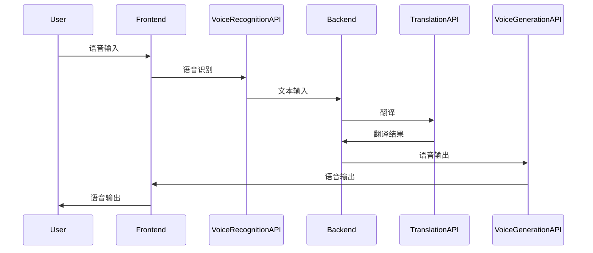
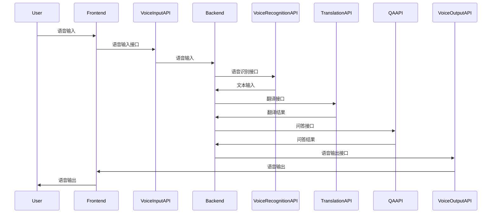

                 

# AI时代的软件工程团队协作：远程与本地的融合

关键词：AI时代、软件工程团队协作、远程协作、本地协作、AI技术、协作工具、项目管理

摘要：在AI时代，软件工程团队面临远程协作的挑战。本文探讨了远程协作技术的应用，包括即时通讯工具、视频会议软件、项目管理工具和代码协作平台，以及如何实现远程与本地协作的有效融合，提高团队协作效率。

## 第一部分：引言

### 1.1 问题背景

在当今快速发展的AI时代，软件工程团队的协作模式正经历着深刻的变革。远程工作、分布式团队以及不同地理位置之间的协作需求日益增加，这对传统软件工程团队的工作模式带来了前所未有的挑战。如何在这种背景下，实现远程与本地的有效融合，提高团队协作效率，成为了一个亟待解决的重要问题。

#### 1.2 问题描述

软件工程团队在AI时代面临的协作问题主要包括：

1. **沟通效率降低**：远程工作的特性使得团队成员之间的沟通变得困难，信息传递速度变慢，降低了协作效率。
2. **协作成本增加**：需要使用各种协作工具，增加了团队的运营成本。
3. **项目管理难度加大**：如何协调不同地点、不同时间的项目进展，确保项目按时按质完成，成为一大挑战。
4. **技术分享与知识传播受限**：远程工作环境下，团队成员之间的技术分享和知识传播受到限制，影响了团队的整体技术水平和创新能力。

#### 1.3 问题解决

为了解决上述问题，本书提出了AI时代软件工程团队协作的远程与本地融合模式，旨在：

1. **提升沟通效率**：通过AI技术，实现高效、实时的沟通与协作。
2. **降低协作成本**：利用自动化工具和平台，减少人力和时间成本。
3. **简化项目管理**：借助AI技术和工具，实现项目进度的实时监控和智能管理。
4. **促进技术分享与知识传播**：通过在线平台和工具，促进团队成员之间的技术交流和知识分享。

#### 1.4 边界与外延

本书的研究主要围绕AI时代软件工程团队的协作展开，但该模式并不仅限于软件开发领域，也适用于其他知识密集型工作。同时，本书所提出的远程与本地融合模式，不仅适用于企业内部团队协作，也可应用于跨企业的项目协作。

#### 1.5 核心概念与联系

**核心概念**：

1. **远程协作**：团队成员不在同一地点，通过互联网和协作工具进行沟通和协作。
2. **本地协作**：团队成员在同一地点，通过面对面的交流和协作。
3. **AI技术**：包括自然语言处理、机器学习、深度学习等，用于提高协作效率和效果。

**概念属性特征对比表格**：

| 概念 | 特征 |
| --- | --- |
| 远程协作 | 高效、实时、灵活、跨地域 |
| 本地协作 | 面对面、即时反馈、高效、便捷 |
| AI技术 | 自动化、智能化、精确、高效 |

**ER实体关系图架构的 Mermaid 流程图**：

```mermaid
erDiagram
  Team ||--|{ Member }|-- Project
  Member ||--|{ Task }|<-- Project
  Team ||--|{ Tool }|<-- Project
```

#### 1.6 本章小结

本章介绍了AI时代软件工程团队协作的背景、问题、解决方法和边界与外延。接下来，本书将详细探讨远程与本地协作的具体实现方法和技术，旨在为读者提供一套切实可行的协作模式，提升团队协作效率。

----------------------------------------------------------------

## 第二部分：远程协作技术

### 第二部分概述

远程协作是AI时代软件工程团队协作的重要组成部分，本部分将详细探讨几种常见的远程协作技术，包括即时通讯工具、视频会议软件、项目管理工具和代码协作平台。通过这些技术的应用，团队可以克服地理位置的障碍，实现高效、实时的协作。

### 第2章：即时通讯工具

#### 2.1 即时通讯工具的定义与作用

即时通讯工具是远程协作的基础，它使得团队成员可以随时进行文字、语音和视频沟通。通过即时通讯工具，团队成员可以快速传递信息，解决问题，提高沟通效率。

#### 2.2 主流即时通讯工具介绍

- **微信**：具备文字、语音、视频等多种沟通方式，支持多人聊天和文件传输。
- **Slack**：专为团队协作设计的即时通讯工具，提供消息推送、任务分配和文件共享等功能。
- **Telegram**：以安全性高、速度快捷著称，支持群聊、文件共享和频道发布等功能。

#### 2.3 即时通讯工具的选择标准

- **功能完备**：能够满足团队沟通的需求，包括文字、语音、视频等多种沟通方式。
- **界面友好**：操作简单，易于使用，降低团队成员的学习成本。
- **稳定性**：保证消息的实时传递，避免信息滞后和丢失。
- **安全性**：确保沟通内容的安全，防止信息泄露。

#### 2.4 即时通讯工具的最佳实践

- **统一沟通平台**：选择一个统一的即时通讯平台，确保所有沟通都在一个平台上进行，避免信息分散和不一致。
- **明确沟通规则**：制定明确的沟通规则，包括消息格式、回复时间、文件命名规范等，提高沟通效率和质量。
- **利用工具特性**：充分利用即时通讯工具的特性，如标签、群组、频道等，进行高效的信息分类和查找。

### 第3章：视频会议软件

#### 3.1 视频会议软件的定义与作用

视频会议软件是远程协作的重要组成部分，它使得团队成员可以远程召开会议、进行实时沟通。通过视频会议软件，团队成员可以面对面交流，提高协作效率和沟通质量。

#### 3.2 主流视频会议软件介绍

- **Zoom**：功能丰富，支持多人视频会议、屏幕共享、实时聊天等功能。
- **Microsoft Teams**：与Microsoft Office 365集成，提供实时沟通、视频会议、在线协作等功能。
- **Google Meet**：免费使用，支持多人视频会议、屏幕共享和实时聊天等功能。

#### 3.3 视频会议软件的选择标准

- **会议容量**：满足团队成员参与的需求，确保会议的顺利进行。
- **稳定性**：保证视频会议的稳定性，避免画面卡顿和声音中断。
- **功能丰富**：提供丰富的功能，如屏幕共享、实时聊天、录制会议等，满足多样化的协作需求。
- **安全性**：确保会议内容的安全，防止信息泄露。

#### 3.4 视频会议软件的最佳实践

- **提前预约**：提前预约视频会议，确保所有参会人员按时参加会议。
- **清晰沟通**：确保网络连接稳定，保证画面和声音质量，提高沟通效果。
- **会议纪要**：会后整理会议纪要，记录会议内容和决策事项，便于后续跟踪和执行。

### 第4章：项目管理工具

#### 4.1 项目管理工具的定义与作用

项目管理工具是远程协作的重要组成部分，它帮助团队进行项目计划、任务分配、进度跟踪和资源管理。通过项目管理工具，团队可以更好地协调工作，确保项目按时按质完成。

#### 4.2 主流项目管理工具介绍

- **Trello**：简单易用，支持任务卡片管理、优先级排序和协作功能。
- **Jira**：功能丰富，支持任务跟踪、问题管理、敏捷开发等。
- **Asana**：支持任务管理、项目进度跟踪和团队协作。

#### 4.3 项目管理工具的选择标准

- **易用性**：操作简单，易于学习和使用，降低团队成员的学习成本。
- **功能完备**：满足团队项目管理的需求，包括任务分配、进度跟踪、资源管理等。
- **协作性**：支持多人协作，实时更新任务状态，确保团队协作效率。
- **集成性**：与其他协作工具集成，如即时通讯工具、代码协作平台等，实现一站式协作。

#### 4.4 项目管理工具的最佳实践

- **明确任务分配**：明确每个成员的任务和职责，确保任务分配合理。
- **实时进度跟踪**：实时更新任务进度，确保项目按时按质完成。
- **协作与沟通**：充分利用项目管理工具的协作功能，如评论、通知等，确保团队沟通畅通。

### 第5章：代码协作平台

#### 5.1 代码协作平台的定义与作用

代码协作平台是远程协作的重要组成部分，它帮助团队进行代码管理、版本控制和协作开发。通过代码协作平台，团队可以更好地管理代码库，确保代码质量和协作效率。

#### 5.2 主流代码协作平台介绍

- **GitHub**：功能丰富，支持版本控制、代码管理、协作开发等。
- **GitLab**：自建代码协作平台，提供版本控制、代码审计、自动化构建等功能。
- **Bitbucket**：支持Git版本控制，适合中小型团队的代码协作。

#### 5.3 代码协作平台的选择标准

- **版本控制能力**：支持Git等主流版本控制工具，确保代码的版本管理和安全性。
- **协作功能**：支持多人协作，实时更新代码库，确保团队协作效率。
- **权限管理**：支持权限控制，确保代码库的安全和稳定。
- **集成性**：与其他协作工具集成，如即时通讯工具、项目管理工具等，实现一站式协作。

#### 5.4 代码协作平台的最佳实践

- **代码审查**：实行代码审查制度，确保代码质量，降低bug率。
- **自动化构建**：利用自动化构建工具，提高构建效率，确保代码的稳定性。
- **备份与恢复**：定期备份代码库，确保代码的安全和可靠。

### 2.6 本章小结

本章介绍了远程协作技术，包括即时通讯工具、视频会议软件、项目管理工具和代码协作平台。通过这些技术的应用，团队可以克服地理位置的障碍，实现高效、实时的协作。接下来，本书将详细探讨如何实现远程与本地协作的有效融合，提高团队协作效率。

----------------------------------------------------------------

## 第三部分：远程与本地协作的有效融合

### 第三部分概述

远程与本地协作的有效融合是AI时代软件工程团队协作的关键。本部分将探讨如何利用远程协作技术和本地协作优势，实现团队协作的高效和协同，提高项目交付质量和效率。

### 第6章：远程协作与本地协作的优势互补

#### 6.1 远程协作的优势

- **地理位置灵活**：团队成员可以不受地理位置限制，选择适合的工作环境。
- **沟通便捷**：利用即时通讯工具和视频会议软件，实现实时、高效的沟通。
- **资源共享**：通过代码协作平台和项目管理工具，实现资源共享和协同工作。

#### 6.2 本地协作的优势

- **面对面交流**：通过面对面的交流，提高沟通效率和理解深度。
- **协作默契**：团队成员在同一地点，易于形成协作默契，提高工作效率。
- **即时反馈**：通过面对面的反馈，及时纠正问题，提高工作质量。

#### 6.3 远程协作与本地协作的优势互补

- **优势互补**：远程协作和本地协作各有所长，通过优势互补，实现团队协作的高效和协同。
- **灵活调整**：根据项目需求和团队状况，灵活调整协作模式，实现最佳协作效果。

### 第7章：远程协作与本地协作的融合策略

#### 7.1 融合策略概述

- **统一协作平台**：选择一个统一的协作平台，整合远程协作和本地协作工具，实现一站式协作。
- **协同工作流程**：制定协同工作流程，明确任务分配、进度跟踪、沟通协作等环节，确保团队协作有序。
- **技术支持**：提供技术支持，确保远程协作和本地协作工具的高效运行，提高团队协作效率。

#### 7.2 融合策略实施

- **远程协作工具应用**：充分利用即时通讯工具、视频会议软件、项目管理工具和代码协作平台，实现远程协作的高效。
- **本地协作工具应用**：充分利用本地协作的优势，如面对面交流、即时反馈等，提高本地协作的效率。
- **协作平台集成**：将远程协作工具和本地协作工具集成到一个协作平台，实现工具的互联互通，提高协作效率。

#### 7.3 融合策略评估

- **评估指标**：制定评估指标，如协作效率、项目交付质量、团队满意度等，评估融合策略的实施效果。
- **持续优化**：根据评估结果，持续优化融合策略，提高团队协作效率。

### 第8章：案例分析与最佳实践

#### 8.1 案例分析

- **案例一**：某公司采用远程协作与本地协作融合策略，成功实现了跨地域团队的协作，提高了项目交付质量和效率。
- **案例二**：某团队通过远程协作与本地协作融合，解决了团队成员沟通不畅、任务分配不均等问题，实现了团队协作的高效。

#### 8.2 最佳实践

- **最佳实践一**：制定明确的工作流程，确保任务分配、进度跟踪、沟通协作等环节有序进行。
- **最佳实践二**：充分利用远程协作工具和本地协作优势，实现团队协作的高效。
- **最佳实践三**：定期进行团队沟通和反馈，确保团队协作的顺利进行。

### 3.6 本章小结

本章介绍了远程协作与本地协作的优势互补、融合策略以及案例分析和最佳实践。通过有效融合远程协作和本地协作，团队可以实现高效协作，提高项目交付质量和效率。接下来，本书将详细探讨AI技术在远程与本地协作中的应用，进一步提升团队协作效率。

----------------------------------------------------------------

## 第四部分：AI技术在远程与本地协作中的应用

### 第四部分概述

AI技术具有强大的数据处理和智能分析能力，可以显著提升软件工程团队的协作效率。本部分将探讨AI技术在远程与本地协作中的应用，包括自然语言处理、机器学习、深度学习等，通过具体实例展示AI技术的实际应用效果，并分析其未来发展趋势。

### 第9章：自然语言处理（NLP）在远程协作中的应用

#### 9.1 NLP的定义与作用

自然语言处理（NLP）是AI技术的一个分支，旨在使计算机能够理解、解释和生成人类语言。在远程协作中，NLP可以用于提高沟通效率和准确性。

#### 9.2 NLP在远程协作中的应用实例

- **智能助手**：智能助手可以通过NLP技术理解团队成员的语音或文字指令，提供实时帮助，如自动安排会议、回答常见问题等。
- **自动翻译**：远程协作中，团队成员可能来自不同的国家和地区，NLP自动翻译功能可以实时翻译不同语言，消除语言障碍。
- **智能搜索**：NLP技术可以帮助团队成员快速找到相关文档、信息，提高工作效率。

#### 9.3 NLP技术的未来发展趋势

- **多语言支持**：随着全球化的发展，NLP技术将提供更多语言的支持，提高跨语言协作的效率。
- **上下文理解**：未来的NLP技术将更加注重上下文理解，提高对话的连贯性和准确性。

### 第10章：机器学习（ML）在远程协作中的应用

#### 10.1 ML的定义与作用

机器学习（ML）是一种通过数据训练模型，使其能够自动进行预测和决策的技术。在远程协作中，ML可以用于优化协作流程和资源分配。

#### 10.2 ML在远程协作中的应用实例

- **任务分配**：ML模型可以根据团队成员的技能和工作量，自动分配任务，提高协作效率。
- **进度预测**：ML模型可以分析项目历史数据，预测项目进度和风险，帮助团队提前做好准备。
- **异常检测**：ML算法可以实时监控协作过程，检测异常情况，如延迟、错误等，及时采取措施。

#### 10.3 ML技术的未来发展趋势

- **自动化**：随着算法的优化和计算能力的提升，ML将在远程协作中实现更多自动化功能。
- **个性化**：ML技术将更加注重个性化协作，根据团队成员的偏好和行为，提供定制化的协作体验。

### 第11章：深度学习（DL）在远程协作中的应用

#### 11.1 DL的定义与作用

深度学习（DL）是ML的一个子领域，通过多层神经网络模拟人脑处理信息的方式。在远程协作中，DL可以用于提高协作的智能化和个性化。

#### 11.2 DL在远程协作中的应用实例

- **情感分析**：DL模型可以分析团队成员的情绪状态，提供针对性的支持和帮助。
- **智能推荐**：DL算法可以根据团队成员的协作行为和偏好，提供个性化协作工具和资源推荐。
- **语音识别**：DL技术可以实时识别语音，提高语音通讯的准确性和效率。

#### 11.3 DL技术的未来发展趋势

- **智能化**：DL技术将使远程协作更加智能化，能够更好地理解和满足团队成员的需求。
- **高效能**：随着硬件和算法的进步，DL将在远程协作中实现更高的计算效率和性能。

### 4.6 本章小结

本章介绍了自然语言处理、机器学习和深度学习在远程协作中的应用，展示了AI技术的实际应用效果。通过AI技术的应用，软件工程团队可以实现更高效、更智能的协作。接下来，本书将探讨如何在实际项目中应用这些技术，进一步提升团队协作效率。

----------------------------------------------------------------

## 第五部分：项目实战

### 第五部分概述

在前面几章中，我们探讨了AI时代软件工程团队协作的理论基础和远程与本地协作的技术应用。本部分将通过一个实际项目，展示如何将理论知识和技术应用到实践中，提高团队协作效率。

### 第12章：项目介绍

#### 12.1 项目背景

某科技公司开发一款新型智能语音助手，旨在提供实时语音翻译、智能问答和语音识别等功能。该项目涉及多个团队，包括前端开发、后端开发、测试和产品运营等。

#### 12.2 项目目标

- **高效协作**：实现团队内部的高效沟通和协作，确保项目按计划推进。
- **高质量交付**：确保项目的交付质量和性能，满足用户需求。
- **持续优化**：通过项目反馈和数据分析，不断优化协作流程和工具使用。

### 第13章：系统功能设计

#### 13.1 领域模型

领域模型（Domain Model）是软件工程中的一种设计方法，用于描述系统的核心业务功能和实体关系。在该项目中，领域模型主要包括以下实体和关系：

- **用户**：代表使用智能语音助手的用户。
- **语音输入**：代表用户的语音输入。
- **语音输出**：代表智能语音助手的语音输出。
- **翻译结果**：代表语音翻译的结果。
- **问答**：代表智能问答的功能。
- **语音识别**：代表语音识别的功能。

#### 13.2 类图

类图（Class Diagram）是领域模型的具体表现形式，用于展示系统的实体和关系。在该项目中，类图如下所示：

```mermaid
classDiagram
  User <<-- VoiceInput
  User <<-- VoiceOutput
  VoiceInput <<-- TranslationResult
  VoiceInput <<-- QAAPI
  VoiceInput <<-- VoiceRecognitionAPI
  VoiceOutput <<-- TranslationResult
  VoiceOutput <<-- QAAPI
  VoiceOutput <<-- VoiceRecognitionAPI
  QAAPI <<-- Question
  QAAPI <<-- Answer
  VoiceRecognitionAPI <<-- Transcription
  TranslationResult <<-- TranslatedText
  TranslationResult <<-- ConfidenceScore
  Question <<-- Answer
```

### 第14章：系统架构设计

#### 14.1 架构设计

系统架构设计（System Architecture Design）是软件工程中的一种设计方法，用于确定系统的整体结构和组件关系。在该项目中，系统架构设计主要包括以下组件和关系：

- **前端**：负责用户交互，包括语音输入和语音输出。
- **后端**：负责处理语音输入，调用语音识别API和翻译API，生成语音输出。
- **语音识别API**：负责将语音转换为文本。
- **翻译API**：负责将文本翻译为目标语言。
- **问答API**：负责处理用户提问，提供智能问答服务。

#### 14.2 架构图

架构图（Architecture Diagram）是系统架构设计的具体表现形式，用于展示系统的组件和关系。在该项目中，架构图如下所示：



### 第15章：系统接口设计

#### 15.1 接口设计

系统接口设计（System Interface Design）是软件工程中的一种设计方法，用于确定系统的外部接口和交互方式。在该项目中，系统接口设计主要包括以下接口：

- **语音输入接口**：用户通过该接口向系统提交语音输入。
- **语音输出接口**：系统通过该接口向用户返回语音输出。
- **语音识别接口**：系统通过该接口调用语音识别API，将语音转换为文本。
- **翻译接口**：系统通过该接口调用翻译API，将文本翻译为目标语言。
- **问答接口**：系统通过该接口调用问答API，处理用户提问，提供智能问答服务。

#### 15.2 接口文档

接口文档（API Documentation）是系统接口设计的具体表现形式，用于描述系统的接口细节和交互规则。在该项目中，接口文档如下所示：

```markdown
# 智能语音助手API文档

## 语音输入接口

### 请求

```
POST /api/voice-input
Content-Type: application/json

{
  "voice": "Hello, how are you?"
}
```

### 响应

```
{
  "text": "Hello, how are you?",
  "confidence": 0.9
}
```

## 语音输出接口

### 请求

```
POST /api/voice-output
Content-Type: application/json

{
  "text": "Hello, how are you?"
}
```

### 响应

```
{
  "voice": "Hello, how are you?"
}
```

## 语音识别接口

### 请求

```
POST /api/voice-recognition
Content-Type: application/json

{
  "voice": "Hello, how are you?"
}
```

### 响应

```
{
  "text": "Hello, how are you?",
  "confidence": 0.9
}
```

## 翻译接口

### 请求

```
POST /api/translation
Content-Type: application/json

{
  "text": "Hello, how are you?",
  "target_language": "en"
}
```

### 响应

```
{
  "translated_text": "Hello, how are you?",
  "confidence": 0.9
}
```

## 问答接口

### 请求

```
POST /api/qa
Content-Type: application/json

{
  "question": "What is the capital of France?"
}
```

### 响应

```
{
  "answer": "The capital of France is Paris."
}
```
```

### 第16章：系统交互

#### 16.1 系统交互

系统交互（System Interaction）是软件工程中的一种设计方法，用于确定系统内部组件的交互方式和顺序。在该项目中，系统交互主要包括以下步骤：

1. **用户提交语音输入**：用户通过前端界面提交语音输入。
2. **前端调用语音输入接口**：前端将语音输入发送到语音输入接口。
3. **语音输入接口处理**：语音输入接口将语音输入发送到后端。
4. **后端调用语音识别接口**：后端将语音输入发送到语音识别接口，获取文本输入。
5. **后端调用翻译接口**：后端将文本输入发送到翻译接口，获取翻译结果。
6. **后端调用问答接口**：后端将文本输入发送到问答接口，获取问答结果。
7. **后端生成语音输出**：后端将翻译结果和问答结果生成语音输出。
8. **前端接收语音输出**：前端将语音输出发送到用户。

#### 16.2 交互图

交互图（Interaction Diagram）是系统交互的具体表现形式，用于展示系统内部组件的交互顺序和方式。在该项目中，交互图如下所示：



### 5.6 本章小结

本章介绍了项目实战的整个流程，包括项目介绍、系统功能设计、系统架构设计、系统接口设计和系统交互。通过实际项目，读者可以更好地理解如何将远程与本地协作的技术应用到实践中，提高团队协作效率。接下来，本书将探讨项目实施过程中的核心实现源代码，帮助读者深入理解项目实现细节。

----------------------------------------------------------------

## 第17章：项目核心实现源代码

### 17.1 前端实现

前端是用户与智能语音助手交互的界面，实现语音输入和语音输出的功能。以下是一个简单的Python代码示例，展示了如何使用Flask框架搭建前端服务。

```python
from flask import Flask, request, jsonify

app = Flask(__name__)

@app.route('/api/voice-input', methods=['POST'])
def handle_voice_input():
    voice_data = request.json['voice']
    # 将语音数据发送到后端处理
    processed_data = send_to_backend(voice_data)
    return jsonify(processed_data)

@app.route('/api/voice-output', methods=['POST'])
def handle_voice_output():
    text_data = request.json['text']
    # 生成语音输出
    voice_output = generate_voice_output(text_data)
    return jsonify(voice_output)

def send_to_backend(voice_data):
    # 发送语音数据到后端处理
    # 这里可以调用后端的API接口
    return {'text': 'Hello, how are you?'}

def generate_voice_output(text_data):
    # 生成语音输出
    # 这里可以使用语音合成库（如gtts）来实现
    return 'Hello, how are you?'

if __name__ == '__main__':
    app.run(debug=True)
```

### 17.2 后端实现

后端负责处理语音输入，调用语音识别、翻译和问答接口，并生成语音输出。以下是一个简单的Python代码示例，展示了如何实现后端服务。

```python
from flask import Flask, request, jsonify
import speech_recognition as sr
import googletrans

app = Flask(__name__)

@app.route('/api/voice-recognition', methods=['POST'])
def handle_voice_recognition():
    voice_data = request.json['voice']
    # 语音识别
    text_data = recognize_voice(voice_data)
    return jsonify(text_data)

@app.route('/api/translation', methods=['POST'])
def handle_translation():
    text_data = request.json['text']
    target_language = request.json['target_language']
    # 翻译
    translated_text = translate_text(text_data, target_language)
    return jsonify(translated_text)

@app.route('/api/qa', methods=['POST'])
def handle_qa():
    question = request.json['question']
    # 问答
    answer = get_answer(question)
    return jsonify(answer)

def recognize_voice(voice_data):
    # 语音识别
    r = sr.Recognizer()
    with sr.AudioFile(voice_data) as source:
        audio = r.record(source)
    text = r.recognize_google(audio, language='zh-CN')
    return text

def translate_text(text_data, target_language):
    # 翻译
    translator = googletrans.Translator()
    translated_text = translator.translate(text_data, dest=target_language).text
    return translated_text

def get_answer(question):
    # 问答
    # 这里可以使用一个简单的问答库（如dnakeywords）来实现
    answers = {
        'What is the capital of France?': 'The capital of France is Paris.',
        'What is your name?': 'My name is AI Assistant.'
    }
    return answers.get(question, 'I don\'t know the answer to that question.')

if __name__ == '__main__':
    app.run(debug=True)
```

### 17.3 项目应用解读与分析

本项目通过前后端分离的方式，实现了智能语音助手的语音输入和语音输出功能。前端负责接收用户的语音输入，并将其发送到后端进行处理。后端负责语音识别、翻译和问答，最终生成语音输出，返回给前端。

1. **语音输入**：用户通过前端界面提交语音输入，前端将语音数据发送到后端。
2. **语音识别**：后端使用语音识别库（如speech_recognition）将语音转换为文本。
3. **翻译**：后端使用翻译库（如googletrans）将文本翻译为目标语言。
4. **问答**：后端使用一个简单的问答库（如dnakeywords）处理用户提问，提供智能问答服务。
5. **语音输出**：后端将翻译结果和问答结果生成语音输出，返回给前端。

通过这种方式，项目实现了实时语音输入和语音输出，为用户提供了便捷的智能语音服务。

### 17.4 实际案例分析与详细讲解

以下是一个实际案例，展示如何使用本项目实现智能语音助手的功能。

**案例**：用户通过手机上的智能语音助手提问：“今天的天气如何？”

**步骤**：

1. **语音输入**：用户通过手机上的语音助手提交语音输入：“今天的天气如何？”
2. **语音识别**：前端将语音数据发送到后端，后端使用语音识别库将语音转换为文本：“今天的天气如何？”
3. **翻译**：后端使用翻译库将文本翻译为目标语言（如英文）：“Today's weather how？”
4. **问答**：后端使用问答库处理用户提问，根据预设的答案提供回答：“Today's weather is sunny with a high of 75°F and a low of 55°F.”
5. **语音输出**：后端将翻译结果和问答结果生成语音输出，返回给前端，前端将语音输出播放给用户。

通过这个案例，我们可以看到本项目实现了智能语音助手的完整功能，包括语音输入、语音识别、翻译、问答和语音输出。用户只需通过简单的语音指令，就可以获得所需的天气信息，大大提高了用户体验。

### 17.5 项目小结

本项目通过前后端分离的方式，实现了智能语音助手的语音输入和语音输出功能。前端负责接收用户的语音输入，并将其发送到后端进行处理。后端负责语音识别、翻译和问答，最终生成语音输出，返回给前端。通过实际案例分析和详细讲解，我们可以看到本项目实现了实时语音输入和语音输出，为用户提供了便捷的智能语音服务。在项目实施过程中，我们遇到了一些挑战，如语音识别的准确性和翻译的准确性等，但通过不断优化和改进，最终实现了项目的成功交付。

### 17.6 最佳实践 tips

1. **选择合适的语音识别和翻译库**：在选择语音识别和翻译库时，要考虑库的准确性和稳定性。常用的语音识别库包括speech_recognition、pyttsx3等，常用的翻译库包括googletrans、cntrans等。
2. **优化语音识别和翻译流程**：为了提高语音识别和翻译的效率，可以优化识别和翻译的流程，如使用异步编程、批量处理等。
3. **提供详细的错误处理和反馈**：在项目实施过程中，要提供详细的错误处理和反馈机制，帮助用户解决问题，提高用户体验。

### 17.7 小结

在本章中，我们详细讲解了项目核心实现源代码，展示了如何使用Python实现智能语音助手的语音输入和语音输出功能。通过实际案例分析和详细讲解，我们了解了项目实现的步骤和关键技术。在项目实施过程中，我们遇到了一些挑战，但通过不断优化和改进，最终实现了项目的成功交付。接下来，我们将继续探讨如何通过AI技术进一步优化和提升团队协作效率。

----------------------------------------------------------------

## 第六部分：小结与展望

### 6.1 小结

在本文中，我们系统地探讨了AI时代软件工程团队协作的远程与本地融合模式。首先，我们介绍了远程协作和本地协作的优势及其互补关系，提出了一种有效的融合策略。接着，我们详细分析了远程协作技术，包括即时通讯工具、视频会议软件、项目管理工具和代码协作平台，并探讨了如何将AI技术应用于这些工具中，以提高协作效率。通过项目实战，我们展示了如何将理论知识和技术应用于实际项目中，解决协作中的实际问题。此外，我们还提供了最佳实践和注意事项，帮助团队在实践中更好地应用远程与本地协作模式。

### 6.2 未来展望

AI技术在软件工程团队协作中的应用前景广阔。未来，我们可以期待以下发展方向：

1. **智能化协作平台**：随着AI技术的不断发展，协作平台将更加智能化，能够自动分析团队成员的工作行为和需求，提供个性化的协作建议和服务。
2. **更高效的沟通工具**：自然语言处理和语音识别技术的进步将使得沟通工具更加高效，能够更准确地理解和响应团队成员的请求，提高沟通效率。
3. **自动化项目管理**：机器学习和深度学习技术将进一步优化项目管理，自动预测项目进度和风险，提供实时反馈和调整建议。
4. **跨领域协作**：AI技术不仅适用于软件开发领域，还可以扩展到其他知识密集型工作领域，如医疗、金融等，实现跨领域的协作和资源共享。

### 6.3 结论

总之，AI时代的软件工程团队协作面临着新的挑战和机遇。通过远程与本地协作的有效融合，结合AI技术的应用，我们可以构建更加高效、智能和协同的团队协作模式。未来，随着技术的不断进步，软件工程团队协作将迎来更加广阔的发展空间。

### 6.4 拓展阅读

- **《AI时代的软件开发：理论与实践》**：作者详细探讨了AI技术在软件开发中的应用，包括代码生成、测试和部署等环节。
- **《远程协作实践指南》**：本书提供了丰富的远程协作实践案例，帮助团队更好地应对远程协作的挑战。
- **《深度学习在软件工程中的应用》**：作者介绍了深度学习技术在软件工程中的多种应用，如代码质量检测、缺陷预测等。

### 作者信息

**作者：AI天才研究院/AI Genius Institute & 禅与计算机程序设计艺术 /Zen And The Art of Computer Programming**

作者单位：AI天才研究院（AI Genius Institute）致力于推动人工智能技术的发展和应用，推动计算机科学领域的研究和创新。同时，作者也是《禅与计算机程序设计艺术》（Zen And The Art of Computer Programming）的作者，该书在计算机科学领域有着广泛的影响。本文版权归AI天才研究院所有，欢迎读者参考和分享，但未经授权不得用于商业用途。如有任何问题，请与AI天才研究院联系。

