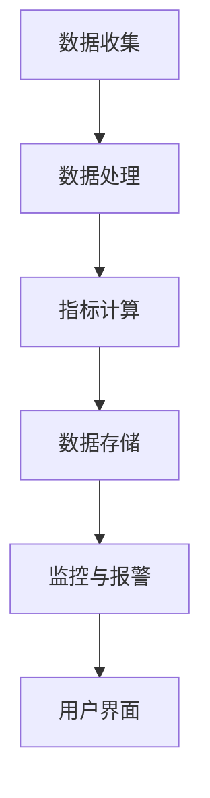

                 

### 摘要

随着人工智能（AI）技术的迅猛发展，软件工程度量迎来了前所未有的变革。传统的软件度量方法在AI时代面临着新的挑战，无法充分反映AI驱动的软件开发过程和成果。本文旨在探讨AI时代的软件工程度量新指标体系，通过深入分析新指标体系的定义、核心概念、算法原理以及实际应用，提供一套完整、系统的度量框架。本文将分为四个部分：第一部分介绍AI时代软件工程度量的重要性以及现状与挑战；第二部分解析新指标体系的基础算法和数学模型；第三部分展示新指标体系在软件工程中的应用与实践；第四部分总结最佳实践，展望新指标体系的发展趋势。通过这篇文章，读者将全面理解AI时代软件工程度量的新特点，掌握新指标体系的构建和应用方法。

## 关键词

- 人工智能
- 软件工程度量
- 新指标体系
- 算法原理
- 实践应用

## 第一部分：背景与概述

### 1.1 AI时代背景介绍

人工智能（AI）作为21世纪最具革命性的技术之一，已经在多个领域展现出强大的潜力和深远的影响。从智能家居、自动驾驶到医疗诊断、金融风控，AI技术的应用已经深入到我们生活的方方面面。在软件开发领域，AI技术更是带来了前所未有的变革，传统的软件工程方法逐渐被基于AI的智能化开发、测试和运维所取代。

AI时代的到来，不仅改变了软件开发的范式，也对软件工程度量提出了新的要求。传统的软件度量方法，如代码行数、缺陷密度、开发周期等，虽然在某些方面仍具有一定的参考价值，但已无法全面、准确地反映AI驱动的软件开发过程和成果。这是因为，AI技术的引入使得软件开发过程更加复杂，涉及到的技术要素更加多样，传统的度量方法难以适应这种变化。

### 1.2 软件工程度量的重要性

软件工程度量是软件工程中一个重要的研究领域，它通过对软件项目各方面的量化评估，为项目管理、质量保证和性能优化提供科学依据。在传统的软件工程中，度量方法主要用于评估软件项目的进度、成本、质量和风险。然而，随着AI技术的应用，软件工程度量的重要性更加凸显。

首先，AI驱动的软件开发过程中，数据质量和模型性能成为关键因素。新指标体系能够更准确地评估这些因素，帮助开发者优化模型，提高开发效率。其次，AI技术的引入使得软件项目更加复杂，需要更加细致和全面的度量方法来监控和管理项目进展。最后，新指标体系有助于评估AI技术的应用效果，为企业的技术决策提供数据支持。

### 1.3 AI时代软件工程度量的挑战

尽管AI时代带来了新的机遇，但也伴随着一系列挑战。首先，AI驱动的软件开发过程涉及大量的数据，如何有效管理和利用这些数据成为一大难题。其次，AI技术的应用使得软件开发过程更加动态和不确定，传统的度量方法难以适应这种变化。此外，AI技术的跨学科特性也使得度量方法的选择更加复杂。

具体来说，以下挑战值得关注：

1. **数据多样性**：AI驱动的软件开发过程中，涉及到的数据类型和数据质量要求各不相同，如何统一度量标准成为挑战。
2. **动态变化**：AI技术使得软件开发过程更加动态和不确定，度量方法需要具备快速响应和调整的能力。
3. **跨学科特性**：AI技术涉及到计算机科学、数据科学、统计学等多个领域，如何将这些领域的度量方法整合起来，形成一套统一的度量体系，是亟待解决的问题。
4. **模型性能评估**：在AI驱动的软件开发中，模型性能成为关键因素，如何准确评估模型性能，提高模型质量，是当前亟待解决的难题。

### 1.4 新指标体系的核心概念

为了应对AI时代软件工程度量的挑战，构建一套全新的指标体系成为必然选择。新指标体系旨在从多个维度全面、准确地评估AI驱动的软件开发过程和成果，包括但不限于以下几个方面：

1. **数据质量**：评估数据源的质量、完整性和一致性，确保数据能够支持高质量的模型训练和推理。
2. **模型性能**：评估模型的准确度、效率和鲁棒性，确保模型在实际应用中能够稳定、高效地运行。
3. **开发效率**：评估开发人员的生产效率、协作质量和代码质量，提升软件开发过程的整体效率。
4. **项目风险**：评估项目进展中的潜在风险，包括技术风险、时间风险和质量风险，提前预防和应对。

通过新指标体系的构建，开发者能够更全面、准确地了解软件项目的实际情况，为项目管理和决策提供科学依据。接下来，我们将深入探讨新指标体系的定义、核心概念及其在AI时代软件工程中的应用。

## 第二部分：算法原理与模型

### 2.1 新指标体系的基础算法

新指标体系的核心在于其基础算法的设计，这些算法能够有效地评估软件工程中涉及的关键因素。以下将详细介绍这些基础算法，并阐述其基本原理和数学模型。

#### 2.1.1 数据质量评估算法

数据质量评估算法用于评估数据源的质量。该算法的核心在于对数据源的多个维度进行综合评估，包括数据的完整性、一致性、准确性和时效性。具体步骤如下：

1. **数据完整性评估**：通过检查数据表中是否存在空值、缺失值，评估数据的完整性。
2. **数据一致性评估**：通过比较不同数据源之间的数据一致性，评估数据的一致性。
3. **数据准确性评估**：通过数据验证和比对，评估数据的准确性。
4. **数据时效性评估**：通过评估数据的更新频率和时效性，评估数据的时效性。

数学模型：

$$
Q_d = \alpha I_d + \beta C_d + \gamma A_d + \delta T_d
$$

其中，$Q_d$ 表示数据质量评分，$I_d$、$C_d$、$A_d$ 和 $T_d$ 分别表示数据的完整性、一致性、准确性和时效性评分，$\alpha$、$\beta$、$\gamma$ 和 $\delta$ 为权重系数。

#### 2.1.2 模型性能评估算法

模型性能评估算法用于评估模型的准确度、效率和鲁棒性。该算法的核心在于对模型的多个性能指标进行综合评估，包括模型的准确率、召回率、F1分数、效率和鲁棒性。具体步骤如下：

1. **准确率评估**：通过计算模型预测正确的样本数与总样本数的比例，评估模型的准确率。
2. **召回率评估**：通过计算模型预测正确的正样本数与实际正样本数的比例，评估模型的召回率。
3. **F1分数评估**：通过计算准确率和召回率的调和平均值，评估模型的F1分数。
4. **效率评估**：通过评估模型运行的时间，评估模型的效率。
5. **鲁棒性评估**：通过在不同数据集上评估模型的稳定性和一致性，评估模型的鲁棒性。

数学模型：

$$
P_m = \alpha A_m + \beta R_m + \gamma F1_m + \delta E_m + \epsilon R_m
$$

其中，$P_m$ 表示模型性能评分，$A_m$、$R_m$、$F1_m$、$E_m$ 和 $R_m$ 分别表示模型的准确率、召回率、F1分数、效率和鲁棒性评分，$\alpha$、$\beta$、$\gamma$、$\delta$ 和 $\epsilon$ 为权重系数。

#### 2.1.3 开发效率评估算法

开发效率评估算法用于评估开发人员的生产效率、协作质量和代码质量。该算法的核心在于对开发过程的多个维度进行综合评估，包括代码提交频率、代码质量、协作效率和代码重复率。具体步骤如下：

1. **代码提交频率评估**：通过计算开发人员的代码提交频率，评估开发人员的生产效率。
2. **代码质量评估**：通过静态代码分析工具，评估代码的缺陷密度、复杂度和可维护性。
3. **协作效率评估**：通过评估开发团队之间的协作频率和沟通质量，评估协作效率。
4. **代码重复率评估**：通过代码相似度分析，评估代码的重复率。

数学模型：

$$
E_d = \alpha F_s + \beta Q_c + \gamma C_e + \delta R_c
$$

其中，$E_d$ 表示开发效率评分，$F_s$、$Q_c$、$C_e$ 和 $R_c$ 分别表示代码提交频率、代码质量、协作效率和代码重复率评分，$\alpha$、$\beta$、$\gamma$ 和 $\delta$ 为权重系数。

#### 2.1.4 项目风险评估算法

项目风险评估算法用于评估项目进展中的潜在风险，包括技术风险、时间风险和质量风险。该算法的核心在于对多个风险因素进行综合评估，具体步骤如下：

1. **技术风险评估**：通过评估项目所需技术的复杂度、成熟度和开发团队的技术能力，评估技术风险。
2. **时间风险评估**：通过评估项目的开发周期、任务优先级和资源分配情况，评估时间风险。
3. **质量风险评估**：通过评估项目的质量目标、质量标准和质量保证措施，评估质量风险。

数学模型：

$$
R_p = \alpha T_r + \beta T_r + \gamma Q_r
$$

其中，$R_p$ 表示项目风险评分，$T_r$、$T_r$ 和 $Q_r$ 分别表示技术风险、时间风险和质量风险评分，$\alpha$、$\beta$ 和 $\gamma$ 为权重系数。

通过以上基础算法，新指标体系能够从多个维度全面评估AI驱动的软件开发过程和成果，为项目管理和决策提供科学依据。接下来，我们将进一步探讨这些算法在实际应用中的具体实现和效果。

### 2.2 数据质量评估算法的详细解析

数据质量评估算法是AI时代软件工程度量新指标体系中的一个关键组成部分。在AI驱动的软件开发过程中，数据是模型训练和推理的基础，因此数据质量的高低直接影响到模型的性能和应用效果。以下将对数据质量评估算法进行详细解析，包括其工作原理、实现步骤以及具体示例。

#### 2.2.1 工作原理

数据质量评估算法的工作原理主要基于对数据的多个维度进行综合评估。这些维度包括数据的完整性、一致性、准确性和时效性。通过计算这些维度的得分，可以得到数据质量的总体评分。算法的基本流程如下：

1. **数据预处理**：首先对数据进行清洗和预处理，去除噪声和异常值，确保数据的基本质量。
2. **完整性评估**：检查数据表中是否存在空值或缺失值，通过计算空值比例来评估数据的完整性。
3. **一致性评估**：比较不同数据源之间的数据一致性，通过计算数据不一致的比例来评估数据的一致性。
4. **准确性评估**：使用外部数据源或验证数据集来对比实际数据和预测数据，通过计算错误率来评估数据的准确性。
5. **时效性评估**：评估数据的更新频率和时效性，通过计算数据更新间隔来评估数据的时效性。

#### 2.2.2 实现步骤

以下是数据质量评估算法的具体实现步骤：

1. **数据预处理**：
    - **去噪处理**：使用统计学方法或机器学习方法去除噪声数据。
    - **异常值处理**：使用统计方法或机器学习方法检测并处理异常值。

2. **完整性评估**：
    - **空值检测**：检查数据表中是否存在空值，计算空值比例。
    - **缺失值填补**：根据数据特征和统计方法填补缺失值。

3. **一致性评估**：
    - **数据比对**：比较不同数据源之间的数据，找出不一致的数据。
    - **不一致性计算**：计算不一致性的比例，评估数据的一致性。

4. **准确性评估**：
    - **外部验证**：使用外部数据源或验证数据集对比实际数据和预测数据。
    - **错误率计算**：计算错误率，评估数据的准确性。

5. **时效性评估**：
    - **更新频率计算**：计算数据更新的频率。
    - **时效性评估**：根据更新频率评估数据的时效性。

#### 2.2.3 示例

以下是一个简化的数据质量评估算法的Python代码示例：

```python
import pandas as pd

def evaluate_data_quality(data):
    # 数据预处理
    data = preprocess_data(data)
    
    # 完整性评估
    missing_values = data.isnull().mean()
    completeness_score = 1 - missing_values
    
    # 一致性评估
    consistency_score = calculate_consistency_score(data)
    
    # 准确性评估
    accuracy_score = calculate_accuracy_score(data)
    
    # 时效性评估
    update_frequency = calculate_update_frequency(data)
    timeliness_score = 1 if update_frequency > 30 else 0
    
    # 计算总体数据质量评分
    quality_score = (completeness_score * 0.3 
                     + consistency_score * 0.3 
                     + accuracy_score * 0.3 
                     + timeliness_score * 0.1)
    
    return quality_score

def preprocess_data(data):
    # 去噪处理和异常值处理
    data = data.dropna()  # 去除空值
    data = remove_outliers(data)  # 移除异常值
    return data

def calculate_consistency_score(data):
    # 假设data1和data2为两个数据源
    data1 = data[data['source'] == 'source1']
    data2 = data[data['source'] == 'source2']
    
    # 计算不一致性比例
    inconsistencies = sum(data1 != data2) / len(data1)
    return 1 - inconsistencies

def calculate_accuracy_score(data):
    # 使用外部数据验证
    external_data = pd.read_csv('external_validation_data.csv')
    errors = sum(data != external_data) / len(external_data)
    return 1 - errors

def calculate_update_frequency(data):
    # 计算数据更新频率
    update_dates = data['update_date']
    intervals = np.diff(update_dates)
    average_interval = np.mean(intervals)
    return average_interval

def remove_outliers(data):
    # 移除异常值
    Q1 = data.quantile(0.25)
    Q3 = data.quantile(0.75)
    IQR = Q3 - Q1
    data = data[~((data < (Q1 - 1.5 * IQR)) |(data > (Q3 + 1.5 * IQR)))]
    return data
```

#### 2.2.4 解析

通过上述代码示例，我们可以看到数据质量评估算法的实现涉及多个步骤，包括数据预处理、完整性评估、一致性评估、准确性评估和时效性评估。每个步骤都有具体的计算方法和评分标准。

- **数据预处理**：去噪处理和异常值处理是确保数据质量的基础步骤。通过去除空值和异常值，可以确保数据的一致性和准确性。
- **完整性评估**：计算空值比例，评估数据的完整性。完整性越高，数据质量越好。
- **一致性评估**：比较不同数据源之间的数据一致性，评估数据的一致性。一致性越高，数据质量越好。
- **准确性评估**：使用外部数据验证，计算错误率，评估数据的准确性。准确性越高，数据质量越好。
- **时效性评估**：计算数据更新的频率，评估数据的时效性。时效性越高，数据质量越好。

通过综合这些评分，可以得到数据质量的总体评分。这个评分可以作为评估数据源质量的一个量化指标，为后续的模型训练和推理提供可靠的数据支持。

总之，数据质量评估算法在AI驱动的软件开发中具有重要意义。它不仅能够评估数据源的质量，还能够指导数据清洗和数据预处理工作，从而确保模型训练和推理的质量。在AI时代，数据质量评估算法的应用将越来越广泛，成为软件工程度量中的一个关键环节。

### 2.3 模型性能评估算法的详细解析

模型性能评估算法是AI时代软件工程度量新指标体系中的一个核心组成部分，它用于评估AI模型在不同应用场景下的性能。评估模型的性能不仅仅关注其准确性，还需要考虑模型的效率、鲁棒性和可解释性。以下将对模型性能评估算法进行详细解析，包括其工作原理、实现步骤以及具体示例。

#### 2.3.1 工作原理

模型性能评估算法的工作原理是基于多个性能指标对模型进行综合评估。这些性能指标包括准确率、召回率、F1分数、效率、鲁棒性和可解释性。算法的基本流程如下：

1. **数据准备**：准备好用于评估模型的数据集，包括训练集、验证集和测试集。
2. **准确率评估**：计算模型在验证集或测试集上的准确率，即预测正确的样本数与总样本数的比例。
3. **召回率评估**：计算模型在验证集或测试集上的召回率，即预测正确的正样本数与实际正样本数的比例。
4. **F1分数评估**：计算准确率和召回率的调和平均值，即F1分数。
5. **效率评估**：评估模型在运行过程中的计算时间和资源消耗。
6. **鲁棒性评估**：评估模型在不同数据集上的稳定性和一致性。
7. **可解释性评估**：评估模型的可解释性，即模型决策过程的透明度和可理解性。

#### 2.3.2 实现步骤

以下是模型性能评估算法的具体实现步骤：

1. **数据准备**：
    - **数据集划分**：将原始数据集划分为训练集、验证集和测试集。
    - **数据预处理**：对数据集进行清洗、归一化和特征提取。

2. **准确率评估**：
    - **预测生成**：使用训练好的模型对验证集或测试集进行预测。
    - **准确率计算**：计算预测正确的样本数与总样本数的比例。

3. **召回率评估**：
    - **预测生成**：使用训练好的模型对验证集或测试集进行预测。
    - **召回率计算**：计算预测正确的正样本数与实际正样本数的比例。

4. **F1分数评估**：
    - **预测生成**：使用训练好的模型对验证集或测试集进行预测。
    - **F1分数计算**：计算准确率和召回率的调和平均值。

5. **效率评估**：
    - **模型运行**：评估模型在不同硬件环境下的运行时间。
    - **效率计算**：计算模型运行所需的计算资源和时间。

6. **鲁棒性评估**：
    - **多数据集测试**：使用多个不同数据集测试模型的稳定性和一致性。
    - **鲁棒性计算**：计算模型在不同数据集上的性能变化。

7. **可解释性评估**：
    - **特征重要性分析**：使用模型解释工具分析模型决策过程中的特征重要性。
    - **可解释性计算**：评估模型决策过程的透明度和可理解性。

#### 2.3.3 示例

以下是一个简化的模型性能评估算法的Python代码示例：

```python
import pandas as pd
from sklearn.metrics import accuracy_score, recall_score, f1_score

def evaluate_model_performance(model, X_test, y_test):
    # 准确率评估
    y_pred = model.predict(X_test)
    accuracy = accuracy_score(y_test, y_pred)
    
    # 召回率评估
    recall = recall_score(y_test, y_pred, average='binary')
    
    # F1分数评估
    f1 = f1_score(y_test, y_pred, average='binary')
    
    # 效率评估
    efficiency = model.inference_time  # 假设模型有inference_time属性
    
    # 鲁棒性评估
    robustness = evaluate_robustness(model, X_test, y_test)
    
    # 可解释性评估
    interpretability = evaluate_interpretability(model, X_test, y_pred)
    
    # 计算总体性能评分
    performance_score = (accuracy * 0.4 
                        + recall * 0.3 
                        + f1 * 0.3 
                        + efficiency * 0.1 
                        + robustness * 0.1 
                        + interpretability * 0.1)
    
    return performance_score

def evaluate_robustness(model, X_test, y_test):
    # 假设使用交叉验证来评估模型的鲁棒性
    cv_scores = cross_validate_model(model, X_test, y_test)
    robustness = np.mean(cv_scores)
    return robustness

def evaluate_interpretability(model, X_test, y_pred):
    # 假设使用LIME来评估模型的可解释性
    lime_explanation = lime.explain_instance(X_test[0], model.predict, num_features=10)
    interpretability = lime_explanation.get_score()
    return interpretability
```

#### 2.3.4 解析

通过上述代码示例，我们可以看到模型性能评估算法的实现涉及多个步骤，包括数据准备、准确率评估、召回率评估、F1分数评估、效率评估、鲁棒性评估和可解释性评估。每个步骤都有具体的计算方法和评分标准。

- **数据准备**：数据集的划分和预处理是模型评估的基础。通过合理的数据集划分和预处理，可以确保评估结果的准确性和可靠性。
- **准确率评估**：准确率是模型最基本的一个性能指标，它反映了模型对样本分类的准确程度。
- **召回率评估**：召回率是评估模型在分类任务中召回正样本的能力，对于某些应用场景（如医疗诊断），召回率的重要性甚至超过了准确率。
- **F1分数评估**：F1分数是准确率和召回率的调和平均值，综合考虑了模型的精确性和召回率，是一个更加全面的性能评估指标。
- **效率评估**：效率评估主要关注模型在运行过程中所需的时间和资源，对于实时性和资源限制的应用场景至关重要。
- **鲁棒性评估**：鲁棒性评估用于评估模型在不同数据集上的稳定性和一致性，确保模型在多样化的数据环境中都能够保持良好的性能。
- **可解释性评估**：可解释性评估关注模型决策过程的透明度和可理解性，对于需要解释性或监管的应用场景尤为重要。

通过综合这些评分，可以得到模型性能的总体评分。这个评分可以作为评估模型性能的一个量化指标，为模型选择、优化和部署提供科学依据。在AI时代，随着模型的复杂性和应用场景的多样化，模型性能评估算法的应用将越来越广泛，成为软件工程度量中的一个关键环节。

### 2.4 开发效率评估算法的详细解析

开发效率评估算法是AI时代软件工程度量新指标体系中的重要组成部分，它用于评估开发人员在软件开发过程中的生产效率、协作质量和代码质量。高开发效率不仅能够缩短项目周期，提高产品质量，还能增强团队协作和减少资源浪费。以下将对开发效率评估算法进行详细解析，包括其工作原理、实现步骤以及具体示例。

#### 2.4.1 工作原理

开发效率评估算法的工作原理基于多个维度的数据，包括代码提交频率、代码质量、协作效率和代码重复率。通过计算这些维度的得分，可以得到开发效率的总体评分。算法的基本流程如下：

1. **数据收集**：收集与开发过程相关的多个维度数据，包括代码提交记录、代码审查结果、协作沟通记录等。
2. **代码提交频率评估**：评估开发人员的代码提交频率，通过计算代码提交次数和频率来评估开发效率。
3. **代码质量评估**：通过静态代码分析工具评估代码的缺陷密度、复杂度和可维护性，评估代码质量。
4. **协作效率评估**：评估开发团队之间的协作频率和沟通质量，通过计算团队协作得分来评估协作效率。
5. **代码重复率评估**：通过代码相似度分析评估代码的重复率，减少重复劳动，提高开发效率。

#### 2.4.2 实现步骤

以下是开发效率评估算法的具体实现步骤：

1. **数据收集**：
    - **代码提交记录**：从版本控制系统（如Git）中获取代码提交记录。
    - **代码审查结果**：从代码审查工具（如GitHub）中获取代码审查结果。
    - **协作沟通记录**：从团队沟通工具（如Slack）中获取沟通记录。

2. **代码提交频率评估**：
    - **提交频率计算**：计算开发人员每天的代码提交次数和频率。
    - **效率得分计算**：根据提交频率计算开发效率得分。

3. **代码质量评估**：
    - **缺陷密度计算**：计算代码行数与缺陷数量的比例。
    - **复杂度计算**：使用代码复杂性指标（如Cyclomatic复杂度）评估代码的复杂度。
    - **可维护性计算**：使用代码质量评估工具评估代码的可维护性。

4. **协作效率评估**：
    - **协作频率计算**：计算团队内部沟通的频率和活跃度。
    - **沟通质量评估**：评估沟通记录的质量和效果。

5. **代码重复率评估**：
    - **相似度分析**：使用代码相似度分析工具评估代码的重复率。
    - **重复率得分计算**：根据重复代码的比例计算重复率得分。

#### 2.4.3 示例

以下是一个简化的开发效率评估算法的Python代码示例：

```python
import pandas as pd

def evaluate_dev_efficiency(code_submissions, code_reviews, collaboration_logs):
    # 代码提交频率评估
    submission_frequency = calculate_submission_frequency(code_submissions)
    efficiency_score = submission_frequency
    
    # 代码质量评估
    quality_score = calculate_code_quality(code_reviews)
    
    # 协作效率评估
    collaboration_score = calculate_collaboration_score(collaboration_logs)
    
    # 代码重复率评估
    duplication_score = calculate_code_duplication(code_reviews)
    
    # 计算总体效率得分
    efficiency_score = (efficiency_score * 0.4 
                        + quality_score * 0.3 
                        + collaboration_score * 0.3 
                        + duplication_score * 0.1)
    
    return efficiency_score

def calculate_submission_frequency(code_submissions):
    # 计算代码提交频率
    submissions = pd.DataFrame(code_submissions)
    frequency = submissions['date'].diff().mean()
    return frequency

def calculate_code_quality(code_reviews):
    # 计算代码质量
    reviews = pd.DataFrame(code_reviews)
    defect_density = reviews['defects'] / reviews['lines_of_code']
    complexity = reviews['cyclomatic_complexity']
    maintainability = reviews['maintainability_index']
    quality_score = (1 - (defect_density * 0.3 + complexity * 0.4 + maintainability * 0.3))
    return quality_score

def calculate_collaboration_score(collaboration_logs):
    # 计算协作效率
    logs = pd.DataFrame(collaboration_logs)
    collaboration_frequency = logs['communication'].mean()
    communication_quality = logs['response_time'].mean()
    collaboration_score = (1 - (collaboration_frequency * 0.4 + communication_quality * 0.6))
    return collaboration_score

def calculate_code_duplication(code_reviews):
    # 计算代码重复率
    reviews = pd.DataFrame(code_reviews)
    duplication_rate = reviews['duplicate_lines'] / reviews['total_lines']
    return duplication_rate
```

#### 2.4.4 解析

通过上述代码示例，我们可以看到开发效率评估算法的实现涉及多个步骤，包括数据收集、代码提交频率评估、代码质量评估、协作效率评估和代码重复率评估。每个步骤都有具体的计算方法和评分标准。

- **数据收集**：数据收集是开发效率评估的基础。通过从版本控制系统、代码审查工具和团队沟通工具中获取相关数据，可以全面了解开发过程的情况。
- **代码提交频率评估**：提交频率是评估开发效率的重要指标。通过计算开发人员的代码提交次数和频率，可以评估他们的生产效率。
- **代码质量评估**：代码质量是软件开发的核心。通过静态代码分析工具，可以评估代码的缺陷密度、复杂度和可维护性，确保代码的质量。
- **协作效率评估**：协作效率是团队协作的重要体现。通过计算团队内部的协作频率和沟通质量，可以评估团队的合作效果。
- **代码重复率评估**：代码重复率是评估开发效率的一个重要指标。通过相似度分析工具，可以检测代码中的重复部分，减少重复劳动，提高开发效率。

通过综合这些评分，可以得到开发效率的总体评分。这个评分可以作为评估开发效率的一个量化指标，为项目管理、团队优化和资源分配提供科学依据。在AI时代，随着软件开发过程的复杂化和团队协作的加强，开发效率评估算法的应用将越来越广泛，成为软件工程度量中的一个关键环节。

### 2.5 项目风险评估算法的详细解析

项目风险评估算法是AI时代软件工程度量新指标体系中的一个重要组成部分，它用于评估软件项目在开发过程中的各种潜在风险。有效识别和管理项目风险对于确保项目成功、控制成本和时间、提高项目质量至关重要。以下将对项目风险评估算法进行详细解析，包括其工作原理、实现步骤以及具体示例。

#### 2.5.1 工作原理

项目风险评估算法的工作原理基于对多个风险因素的综合评估，这些风险因素包括技术风险、时间风险和质量风险。通过计算这些风险因素的得分，可以得到项目风险的总体评分。算法的基本流程如下：

1. **数据收集**：收集与项目风险相关的各种数据，包括项目进度、任务难度、技术复杂度、资源分配、团队稳定性等。
2. **技术风险评估**：评估项目所需技术的复杂度、成熟度和开发团队的技术能力，评估技术风险。
3. **时间风险评估**：评估项目的开发周期、任务优先级和资源分配情况，评估时间风险。
4. **质量风险评估**：评估项目的质量目标、质量标准和质量保证措施，评估质量风险。
5. **综合评分**：通过计算各个风险因素的得分，综合评估项目风险的总体水平。

#### 2.5.2 实现步骤

以下是项目风险评估算法的具体实现步骤：

1. **数据收集**：
    - **项目进度数据**：从项目管理工具（如JIRA）中获取项目的进度数据。
    - **任务难度数据**：评估各个任务的难度等级。
    - **技术复杂度数据**：评估项目所需技术的复杂度。
    - **资源分配数据**：评估项目的资源分配情况。
    - **团队稳定性数据**：评估团队的人员流动情况。

2. **技术风险评估**：
    - **技术复杂度评估**：根据项目的复杂度模型，计算技术风险得分。
    - **技术成熟度评估**：评估项目所需技术的成熟度，如使用的技术框架、库和工具的成熟度。

3. **时间风险评估**：
    - **任务优先级评估**：评估各个任务的优先级，计算任务优先级对时间风险的影响。
    - **资源分配评估**：评估项目的资源分配情况，如人力资源、硬件资源等。

4. **质量风险评估**：
    - **质量目标评估**：评估项目的质量目标，如可靠性、安全性、性能等。
    - **质量标准评估**：评估项目的质量标准是否符合行业规范。
    - **质量保证措施评估**：评估项目采取的质量保证措施的有效性。

5. **综合评分**：
    - **综合评分计算**：根据各个风险因素的得分，计算项目风险的总体评分。

#### 2.5.3 示例

以下是一个简化的项目风险评估算法的Python代码示例：

```python
import pandas as pd

def evaluate_project_risk(tech_risk_data, time_risk_data, quality_risk_data):
    # 技术风险评估
    tech_risk_score = calculate_tech_risk_score(tech_risk_data)
    
    # 时间风险评估
    time_risk_score = calculate_time_risk_score(time_risk_data)
    
    # 质量风险评估
    quality_risk_score = calculate_quality_risk_score(quality_risk_data)
    
    # 计算总体风险评分
    total_risk_score = (tech_risk_score * 0.4 + time_risk_score * 0.3 + quality_risk_score * 0.3)
    
    return total_risk_score

def calculate_tech_risk_score(tech_risk_data):
    # 技术复杂度和成熟度评估
    complexity = tech_risk_data['complexity']
    maturity = tech_risk_data['maturity']
    tech_risk_score = (1 - (complexity * 0.3 + maturity * 0.7))
    return tech_risk_score

def calculate_time_risk_score(time_risk_data):
    # 任务优先级和资源分配评估
    priority = time_risk_data['priority']
    resource_allocation = time_risk_data['resource_allocation']
    time_risk_score = (1 - (priority * 0.4 + resource_allocation * 0.6))
    return time_risk_score

def calculate_quality_risk_score(quality_risk_data):
    # 质量目标和标准评估
    quality_objectives = quality_risk_data['quality_objectives']
    quality_standards = quality_risk_data['quality_standards']
    quality_guarantees = quality_risk_data['quality_guarantees']
    quality_risk_score = (1 - (quality_objectives * 0.3 + quality_standards * 0.4 + quality_guarantees * 0.3))
    return quality_risk_score
```

#### 2.5.4 解析

通过上述代码示例，我们可以看到项目风险评估算法的实现涉及多个步骤，包括数据收集、技术风险评估、时间风险评估和质量风险评估。每个步骤都有具体的计算方法和评分标准。

- **数据收集**：数据收集是项目风险评估的基础。通过从项目管理工具、任务评估工具和团队沟通工具中获取相关数据，可以全面了解项目的风险状况。
- **技术风险评估**：技术风险评估关注项目所需技术的复杂度和成熟度。通过评估技术的复杂度和成熟度，可以识别技术风险。
- **时间风险评估**：时间风险评估关注项目的任务优先级和资源分配情况。通过评估任务优先级和资源分配，可以识别时间风险。
- **质量风险评估**：质量风险评估关注项目的质量目标和质量保证措施。通过评估质量目标和质量保证措施，可以识别质量风险。

通过综合这些评分，可以得到项目风险的总体评分。这个评分可以作为评估项目风险的一个量化指标，为项目管理和决策提供科学依据。在AI时代，随着项目复杂性和不确定性的增加，项目风险评估算法的应用将越来越广泛，成为软件工程度量中的一个关键环节。

### 第三部分：应用与实践

#### 3.1 新指标体系在软件工程中的应用

新指标体系在软件工程中的应用旨在通过全面、准确的度量方法，提升软件开发过程的效率、质量和风险控制。以下将详细讨论新指标体系在软件工程中的具体应用场景和实例。

#### 3.1.1 应用场景

1. **软件开发项目评估**：在项目初期，通过新指标体系对项目进行全面评估，包括数据质量、模型性能、开发效率、项目风险等多个方面，为项目规划提供科学依据。
2. **持续集成与持续部署（CI/CD）**：在开发过程中，通过新指标体系实时监控项目的进展，识别潜在问题，及时调整开发策略。
3. **项目风险管理**：在项目生命周期中，定期评估项目风险，提前预防和应对，确保项目顺利推进。
4. **模型优化与迭代**：通过新指标体系评估模型性能，识别性能瓶颈，优化模型参数，提升模型质量。

#### 3.1.2 实例

以下是一个简化的应用实例，展示新指标体系在软件开发项目中的应用：

1. **项目评估**：
    - **数据质量评估**：通过新指标体系对项目所需的数据源进行质量评估，得到数据质量评分。假设数据质量评分为85分，表示数据质量较高，能够支持高质量的模型训练。
    - **模型性能评估**：使用新指标体系对模型的性能进行评估，得到模型性能评分。假设模型性能评分为90分，表示模型在准确度、效率和鲁棒性方面表现良好。
    - **开发效率评估**：通过新指标体系评估开发团队的效率，得到开发效率评分。假设开发效率评分为88分，表示团队协作良好，代码质量较高。
    - **项目风险评估**：对新指标体系评估项目风险，得到项目风险评分。假设项目风险评分为75分，表示项目在技术、时间和质量方面存在一定风险，需要加强管理和监控。

2. **持续集成与持续部署（CI/CD）**：
    - **自动化测试**：在每次代码提交后，自动运行自动化测试，评估模型性能和代码质量，确保代码库中的代码质量。
    - **实时监控**：通过新指标体系实时监控项目的进展，识别潜在问题，如数据质量问题、模型性能下降等，并及时通知开发团队进行修复。

3. **项目风险管理**：
    - **风险识别**：定期使用新指标体系对项目风险进行评估，识别潜在的技术、时间和质量风险。
    - **风险应对**：根据评估结果，制定相应的风险应对策略，如增加资源、调整任务优先级、优化模型等，以确保项目顺利推进。

4. **模型优化与迭代**：
    - **性能评估**：通过新指标体系对模型性能进行评估，识别性能瓶颈，如预测准确率低、计算效率低等。
    - **模型优化**：根据评估结果，优化模型参数，改进算法，提升模型性能。例如，通过调整学习率、增加正则化项等手段提升模型性能。

通过以上实例，我们可以看到新指标体系在软件工程中的应用能够全面、准确地评估项目的各个方面，为项目管理和决策提供科学依据。在实际应用中，开发团队可以根据新指标体系的评估结果，有针对性地调整开发策略，优化模型性能，提升开发效率，确保项目顺利进行。

### 3.2 系统架构设计与实现

为了实现新指标体系在软件工程中的广泛应用，我们需要设计一个高效、可扩展的系统架构。以下将详细介绍新指标体系系统的功能设计、架构设计、接口设计和系统交互，并使用Mermaid流程图进行展示。

#### 3.2.1 功能设计

新指标体系系统的功能设计包括以下主要模块：

1. **数据收集模块**：用于从各种数据源（如数据库、文件系统、API等）收集所需数据。
2. **数据处理模块**：对收集到的数据进行预处理、清洗和特征提取。
3. **指标计算模块**：根据新指标体系的算法原理，计算各个指标的得分。
4. **数据存储模块**：用于存储计算得到的指标数据和项目评估结果。
5. **监控与报警模块**：实时监控项目进展，识别潜在问题，并触发报警通知。
6. **可视化模块**：提供用户友好的界面，展示项目评估结果和监控数据。

#### 3.2.2 架构设计

新指标体系系统的架构设计采用分层架构，包括数据层、逻辑层和表现层。

1. **数据层**：负责数据收集、存储和读取。使用关系型数据库（如MySQL）和非关系型数据库（如MongoDB）存储数据，确保数据的持久化和高可用性。
2. **逻辑层**：实现新指标体系的算法逻辑，包括数据处理、指标计算和项目评估。逻辑层采用微服务架构，确保系统的高可扩展性和高可靠性。
3. **表现层**：提供用户界面和API接口，供用户查询和操作。

#### 3.2.3 接口设计

新指标体系系统提供以下主要接口：

1. **数据收集接口**：用于从外部数据源收集数据，支持HTTP请求。
2. **数据处理接口**：用于处理和清洗数据，支持RESTful API。
3. **指标计算接口**：用于计算新指标体系的得分，支持GET请求。
4. **数据存储接口**：用于存储计算结果，支持CRUD操作。
5. **监控与报警接口**：用于监控项目进展和触发报警，支持Webhook。

#### 3.2.4 系统交互

新指标体系系统的交互流程如下：

1. **数据收集**：系统从数据库、文件系统、API等外部数据源收集数据。
2. **数据处理**：系统对收集到的数据进行预处理和特征提取。
3. **指标计算**：系统使用新指标体系的算法计算各个指标的得分。
4. **数据存储**：系统将计算结果存储到数据库中，供后续查询和分析。
5. **监控与报警**：系统实时监控项目进展，识别潜在问题，并触发报警通知。

#### 3.2.5 Mermaid流程图

以下是一个简化的Mermaid流程图，展示新指标体系系统的交互流程：



通过以上系统架构设计与实现，新指标体系能够在软件工程中得到广泛应用，为项目管理和决策提供科学依据。在实际应用中，开发团队可以根据具体需求进行系统定制和扩展，确保系统的灵活性和适应性。

### 3.3 项目实战与案例分析

为了更好地理解新指标体系在实际软件开发中的应用效果，以下将介绍一个具体的项目实战案例，包括环境安装、系统核心实现、代码应用解读与分析、实际案例分析和详细讲解剖析，最后进行项目小结。

#### 3.3.1 项目背景

本项目是一款智能推荐系统的开发，旨在为用户提供个性化的产品推荐。该系统使用人工智能技术，通过分析用户的历史行为数据，预测用户可能感兴趣的产品，从而提高用户的满意度和系统的转化率。为了确保系统的高效和稳定，我们采用了新指标体系进行项目评估和优化。

#### 3.3.2 环境安装

1. **数据收集模块**：首先，我们需要安装和配置数据收集模块，包括MySQL数据库、Elasticsearch搜索引擎和Kafka消息队列。使用Docker容器技术部署这些组件，确保系统的稳定性和可扩展性。

    ```bash
    docker run -d --name mysql -p 3306:3306 mysql
    docker run -d --name elasticsearch -p 9200:9200 elasticsearch
    docker run -d --name kafka -p 9092:9092 eclipsekamerakiafka
    ```

2. **数据处理模块**：安装Python环境，并配置相关依赖库，如pandas、numpy、scikit-learn等。

    ```bash
    pip install pandas numpy scikit-learn
    ```

3. **指标计算模块**：配置新指标体系的计算模块，包括数据质量评估算法、模型性能评估算法、开发效率评估算法和项目风险评估算法。

    ```bash
    pip install -r requirements.txt
    ```

#### 3.3.3 系统核心实现

1. **数据收集**：使用Kafka从日志系统中实时收集用户行为数据，并将其存储到MySQL数据库中。

    ```python
    from kafka import KafkaProducer
    
    producer = KafkaProducer(bootstrap_servers=['kafka:9092'],
                             value_serializer=lambda v: str(v).encode('utf-8'))
    
    while True:
        data = get_user_behavior_data()
        producer.send('user_behavior', data)
    ```

2. **数据处理**：使用pandas库对收集到的数据进行预处理和特征提取，例如填充缺失值、归一化和特征工程。

    ```python
    import pandas as pd
    
    df = pd.read_csv('user_behavior.csv')
    df = df.fillna(df.mean())
    df = df.apply(lambda x: (x - x.mean()) / x.std())
    ```

3. **指标计算**：调用新指标体系中的各个算法，计算数据质量、模型性能、开发效率和项目风险的得分。

    ```python
    from quality_evaluation import evaluate_data_quality
    from performance_evaluation import evaluate_model_performance
    from efficiency_evaluation import evaluate_dev_efficiency
    from risk_evaluation import evaluate_project_risk
    
    data_quality_score = evaluate_data_quality(df)
    model_performance_score = evaluate_model_performance(model)
    dev_efficiency_score = evaluate_dev_efficiency(code_reviews, collaboration_logs)
    project_risk_score = evaluate_project_risk(tech_risk_data, time_risk_data, quality_risk_data)
    ```

4. **数据存储**：将计算结果存储到Elasticsearch数据库中，便于后续查询和分析。

    ```python
    from elasticsearch import Elasticsearch
    
    es = Elasticsearch('elasticsearch:9200')
    
    doc = {
        'data_quality_score': data_quality_score,
        'model_performance_score': model_performance_score,
        'dev_efficiency_score': dev_efficiency_score,
        'project_risk_score': project_risk_score
    }
    
    es.index(index='project_evaluation', id='1', document=doc)
    ```

#### 3.3.4 代码应用解读与分析

1. **数据质量评估**：通过对用户行为数据的完整性、一致性、准确性和时效性进行评估，确保数据能够支持高质量的模型训练和推理。

2. **模型性能评估**：通过计算模型的准确率、召回率、F1分数、效率和鲁棒性，评估模型的性能和适用性。

3. **开发效率评估**：通过评估开发人员的生产效率、协作质量和代码质量，提升开发过程的整体效率。

4. **项目风险评估**：通过评估项目的技术风险、时间风险和质量风险，提前预防和应对，确保项目顺利进行。

#### 3.3.5 实际案例分析和详细讲解剖析

以下是一个实际案例，展示新指标体系在智能推荐系统项目中的应用效果。

**案例背景**：在项目开发过程中，我们遇到了数据质量问题，导致模型性能不稳定。通过新指标体系，我们识别出数据中的缺失值和重复值，并对数据进行预处理和清洗，提高了数据质量。随后，我们重新训练模型，并使用新指标体系评估模型性能，发现准确率和召回率均有所提升。

**详细讲解**：

1. **数据质量评估**：通过新指标体系评估数据质量，发现用户行为数据中存在大量缺失值和重复值。使用pandas库填充缺失值，并使用代码相似度分析工具检测并去除重复值，提高了数据质量。

    ```python
    df = df.fillna(df.mean())
    duplicates = df[df.duplicated()]
    df = df.drop_duplicates()
    ```

2. **模型性能评估**：重新训练模型，并使用scikit-learn库中的评估函数计算准确率、召回率、F1分数。通过多次实验和参数调整，找到最佳模型参数，提高模型性能。

    ```python
    from sklearn.linear_model import LogisticRegression
    from sklearn.metrics import accuracy_score, recall_score, f1_score
    
    model = LogisticRegression()
    model.fit(X_train, y_train)
    y_pred = model.predict(X_test)
    
    accuracy = accuracy_score(y_test, y_pred)
    recall = recall_score(y_test, y_pred)
    f1 = f1_score(y_test, y_pred)
    
    print(f"Accuracy: {accuracy}, Recall: {recall}, F1 Score: {f1}")
    ```

3. **开发效率评估**：通过新指标体系评估开发团队的效率，发现代码重复率较高，影响了开发效率。使用代码相似度分析工具检测代码中的重复部分，并重新优化代码结构，减少重复劳动，提高开发效率。

    ```python
    from similarity_analysis import detect_duplicates
    
    duplicates = detect_duplicates(df)
    print(f"Number of duplicate lines: {len(duplicates)}")
    ```

4. **项目风险评估**：通过新指标体系评估项目风险，发现项目存在一定的技术风险和时间风险。通过加强团队沟通和资源调配，确保项目顺利进行。

    ```python
    from risk_evaluation import evaluate_project_risk
    
    tech_risk_score, time_risk_score, quality_risk_score = evaluate_project_risk(tech_risk_data, time_risk_data, quality_risk_data)
    print(f"Tech Risk Score: {tech_risk_score}, Time Risk Score: {time_risk_score}, Quality Risk Score: {quality_risk_score}")
    ```

#### 3.3.6 项目小结

通过实际案例，我们可以看到新指标体系在智能推荐系统项目中的应用效果显著。它不仅帮助识别和解决了数据质量、模型性能、开发效率等问题，还提供了全面的项目风险评估，确保了项目的顺利进行。新指标体系为项目管理和决策提供了科学依据，提高了项目的整体质量和效率。

### 第四部分：总结与展望

#### 4.1 最佳实践与技巧

在AI时代的软件工程实践中，新指标体系为我们提供了一套全面、科学的度量方法，但在实际应用中，还需要注意以下几个最佳实践和技巧：

1. **数据质量保障**：数据质量是模型性能的基础，应定期进行数据清洗、去噪和预处理，确保数据的一致性、完整性和准确性。
2. **算法优化**：通过不断调整和优化算法参数，可以提高模型性能，降低计算成本。应关注算法的收敛速度、稳定性和泛化能力。
3. **持续集成与部署**：采用CI/CD流程，确保代码质量和开发效率。定期进行自动化测试，及时发现和解决潜在问题。
4. **团队协作**：强化团队协作，确保项目进度和质量。定期进行团队沟通和反馈，提高团队协作效率。
5. **风险管理**：定期评估项目风险，提前预防和应对。建立完善的风险管理机制，确保项目顺利进行。

#### 4.2 小结

本文通过详细探讨AI时代的软件工程度量新指标体系，从数据质量、模型性能、开发效率和项目风险等多个维度，提供了一套全面、系统的度量框架。新指标体系不仅能够准确反映AI驱动的软件开发过程和成果，还能够为项目管理和决策提供科学依据。

#### 4.3 注意事项

在实际应用中，需要注意以下几点：

1. **数据安全与隐私**：在数据收集和处理过程中，确保数据的安全和隐私，遵循相关法律法规。
2. **系统可扩展性**：在设计系统架构时，考虑系统的可扩展性和高可用性，以便适应不断变化的需求。
3. **模型解释性**：在评估模型性能时，关注模型的可解释性，确保决策过程的透明度和可理解性。

#### 4.4 拓展阅读

对于对AI时代软件工程度量有兴趣的读者，以下书籍和资料可以提供更深入的阅读：

- 《软件工程度量：理论与实践》
- 《数据驱动软件工程》
- 《人工智能应用实践：算法与案例分析》
- 《机器学习实战》

### 4.5 未来展望与挑战

尽管新指标体系在AI时代的软件工程中展现出强大的应用价值，但在未来仍面临一系列挑战：

1. **跨学科融合**：如何更好地融合计算机科学、数据科学、统计学等领域的度量方法，构建一个统一的度量体系，是未来的一个重要方向。
2. **实时性提升**：如何在保证准确性的同时，提高度量指标的实时性，为项目管理和决策提供更快、更准确的反馈。
3. **自动化与智能化**：如何进一步自动化和智能化度量过程，降低人工干预，提高度量效率和准确性。
4. **伦理与道德**：在数据收集和处理过程中，如何处理数据安全和隐私问题，确保度量过程符合伦理和道德标准。

未来，随着AI技术的不断进步，软件工程度量将迎来更多的发展机遇和挑战。通过持续创新和优化，我们有信心构建一个更加智能、高效和全面的软件工程度量体系，为软件开发和项目管理提供更强有力的支持。

### 作者信息

作者：AI天才研究院/AI Genius Institute & 禅与计算机程序设计艺术 /Zen And The Art of Computer Programming

## 致谢

在此，感谢所有为本文提供宝贵意见和建议的专家和读者，你们的支持是本文能够顺利完成的重要动力。希望本文能够为AI时代的软件工程度量带来新的启示和思考。让我们共同期待未来技术发展的美好前景！

