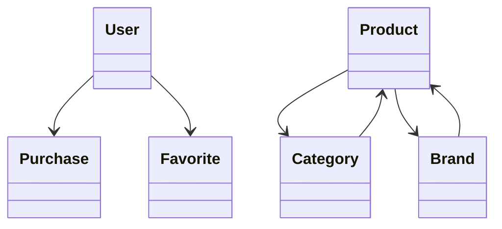
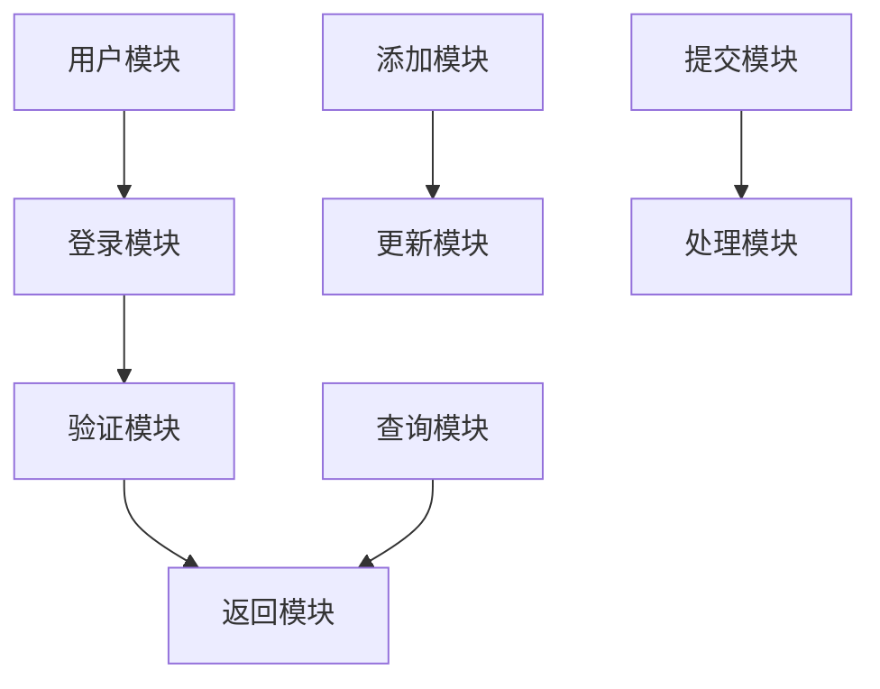

                 


### 第一部分：背景介绍与核心概念

#### 第1章：AI时代的来临与软件工程知识图谱的兴起

**1.1 AI时代的来临**

AI时代的来临是信息技术发展的必然趋势。随着大数据、云计算、物联网、5G通信等技术的飞速发展，人工智能的应用场景越来越广泛，已经渗透到社会生活的各个方面。AI技术的崛起，使得软件工程领域面临着前所未有的变革与机遇。

**1.1.1 AI发展历程**

AI的发展历程可以分为几个阶段：理论奠基、早期研究、应用探索和快速发展。从20世纪50年代的“人工智能”概念的提出，到20世纪80年代专家系统的出现，再到21世纪初深度学习的突破，AI技术经历了从理论到实践的飞跃。

**1.1.2 AI对软件工程的影响**

AI对软件工程的影响主要体现在以下几个方面：

- **开发效率的提升**：AI技术可以自动化软件开发的各个环节，如代码生成、测试、调试等，从而提高开发效率。
- **智能化的软件开发**：AI可以帮助开发人员更好地理解和预测用户需求，实现智能化的软件开发。
- **软件质量保障**：AI技术可以通过自动化测试、缺陷预测等方式，保障软件质量。
- **软件维护**：AI可以帮助开发人员更好地理解软件的内在逻辑，降低软件维护的难度。

**1.1.3 知识图谱在AI时代的重要性**

知识图谱是一种结构化的知识表示方法，它将知识以节点、边和属性的形式进行组织，形成一个语义网络。在AI时代，知识图谱的重要性体现在以下几个方面：

- **知识的组织与利用**：知识图谱可以帮助我们将大量的非结构化数据进行结构化处理，从而更好地组织和利用知识。
- **智能推理**：知识图谱支持基于知识的推理，使得计算机可以模拟人类的思维过程，解决复杂问题。
- **跨领域知识融合**：知识图谱可以跨领域地组织知识，实现不同领域之间的知识共享与融合。

#### 第1章小结

本章主要介绍了AI时代的来临与软件工程知识图谱的兴起。AI技术的快速发展，不仅改变了软件工程的开发方式，也对知识图谱的应用提出了新的需求。知识图谱作为一种重要的知识表示方法，在AI时代具有广泛的应用前景。

### 第2章：软件工程知识图谱概述

**2.1 知识图谱的定义**

知识图谱（Knowledge Graph）是一种结构化的知识表示方法，它通过节点、边和属性来表示实体及其之间的关系。知识图谱的基本单元是实体，实体可以是现实世界中的物体、概念或人等。实体之间的关系可以通过边来表示，边通常具有属性，如类型、时间、地点等。

**2.2 软件工程知识图谱的特点**

软件工程知识图谱具有以下特点：

- **结构化**：软件工程知识图谱将软件工程中的各种概念、关系和属性结构化地表示出来，使得数据更加清晰、易于理解。
- **层次化**：知识图谱通常具有层次化的结构，可以从宏观到微观不同层面进行知识的组织与表示。
- **可扩展性**：知识图谱可以轻松地扩展新的实体和关系，适应软件工程领域的不断发展。
- **互操作性**：知识图谱支持不同系统之间的数据共享与互操作，有助于实现软件工程领域的知识整合。

**2.3 知识图谱在软件工程中的应用领域**

知识图谱在软件工程中的应用非常广泛，主要包括以下几个方面：

- **软件开发**：知识图谱可以帮助开发人员更好地理解需求，提高软件开发的质量和效率。
- **软件测试**：知识图谱可以自动化软件测试，提高测试的覆盖率和准确性。
- **软件维护**：知识图谱可以帮助开发人员更好地理解软件的内在逻辑，降低软件维护的难度。
- **软件项目管理**：知识图谱可以提供更准确的项目数据支持，帮助项目经理更好地进行项目管理和决策。

#### 第2章小结

本章对软件工程知识图谱进行了概述，介绍了知识图谱的定义、特点以及在软件工程中的应用领域。知识图谱作为一种结构化的知识表示方法，在软件工程领域具有广泛的应用前景。

### 第3章：知识图谱的核心概念与联系

**3.1 关键概念解释**

在知识图谱中，关键概念包括实体、关系、属性等。实体是知识图谱的基本单元，关系表示实体之间的关联，属性则描述了实体的特征。

- **实体（Entity）**：实体是知识图谱中的基本元素，可以是人、地点、事件、物品等。
- **关系（Relationship）**：关系描述了实体之间的关联，如“属于”、“位于”、“参与”等。
- **属性（Attribute）**：属性描述了实体的特征，如“年龄”、“性别”、“出生日期”等。

**3.2 概念属性特征对比表格**

以下是一个简单的概念属性特征对比表格，以帮助读者更好地理解实体、关系和属性：

| 概念     | 定义                           | 特征对比                                       |
|----------|--------------------------------|------------------------------------------------|
| 实体     | 知识图谱中的基本单元           | - 名称：唯一标识<br>- 类型：分类信息<br>- 属性：特征描述 |
| 关系     | 描述实体之间关联的元素         | - 类型：关系分类<br>- 方向：单向/双向<br>- 属性：关系特征 |
| 属性     | 描述实体的特征                 | - 名称：属性标识<br>- 类型：数据类型<br>- 值：具体描述   |

**3.3 ER实体关系图架构**

ER（Entity-Relationship）实体关系图是知识图谱设计的重要工具。它通过实体、属性和关系的组合，描述了系统中的数据模型。以下是一个简单的ER实体关系图：

```mermaid
erDiagram
    A[Person] {
        B[Address]
        C{Car}
    }
    Person ||--|{Address}:居住
    Person ||--|{Car}:拥有
    Address ||--|{City}:属于
    City ||--|{Country}:位于
```

在该ER图中，Person实体与Address和Car实体之间存在关联，Address实体与City实体也存在关联。

#### 第3章小结

本章详细介绍了知识图谱的核心概念与联系，包括实体、关系和属性的解释，以及概念属性特征对比表格和ER实体关系图架构。这些核心概念和联系为知识图谱的构建与应用奠定了基础。

### 第一部分小结

本部分主要介绍了AI时代的背景、软件工程知识图谱的核心概念与联系，以及知识图谱在软件工程中的应用领域。通过这些内容，读者可以初步了解知识图谱在AI时代的重要性，以及它在软件工程中的潜在应用价值。

----------------------------------------------------------------

## 第二部分：知识图谱的构建

### 第2章：知识图谱的数据源与采集

#### 2.1 数据源的选择与评估

**2.1.1 数据源的类型**

在构建知识图谱时，数据源的选择至关重要。数据源可以分为以下几类：

- **开放数据源**：如互联网公开数据、政府公开数据、学术研究数据等。
- **内部数据源**：企业内部数据，包括业务数据、用户数据等。
- **专业数据源**：行业专业数据，如医疗数据、金融数据等。

**2.1.2 数据源评估标准**

在选择数据源时，需要考虑以下评估标准：

- **数据质量**：数据源的数据是否准确、完整、一致。
- **数据量**：数据源的规模是否足够大，能否满足知识图谱的需求。
- **数据更新频率**：数据源的数据是否及时更新，能否保持知识图谱的时效性。
- **数据获取成本**：数据源的数据获取成本是否合理。

**2.1.3 数据源的选择策略**

在选择数据源时，可以采取以下策略：

- **优先选择开放数据源**：开放数据源通常获取成本较低，且数据丰富，适合构建通用型的知识图谱。
- **内部数据源与开放数据源相结合**：内部数据源可以提供更具体、更精准的知识，而开放数据源可以提供更广泛的视野，两者结合可以构建更全面的知识图谱。
- **持续评估与更新**：定期评估数据源的性能和适用性，根据需要及时更新数据源。

#### 2.2 数据采集与预处理

**2.2.1 数据采集方法**

数据采集是构建知识图谱的第一步。数据采集方法可以分为以下几类：

- **手动采集**：通过人工方式收集数据，适用于小规模、高质量的数据采集。
- **自动化采集**：通过爬虫、API等方式自动化收集数据，适用于大规模、低质量的数据采集。
- **半自动化采集**：结合手动和自动化采集方法，适用于中等规模、需要高精度数据的情况。

**2.2.2 数据预处理步骤**

数据预处理是确保数据质量的关键步骤。数据预处理步骤包括：

- **数据清洗**：去除数据中的噪声和错误，如缺失值填充、异常值处理等。
- **数据转换**：将数据转换为适合知识图谱表示的形式，如文本数据转换为实体和关系等。
- **数据归一化**：将数据格式统一，如字符串转小写、数值类型统一等。
- **数据去重**：去除重复的数据，确保知识图谱的准确性。

**2.2.3 数据清洗与去重**

数据清洗与去重是数据预处理的重要环节。具体方法如下：

- **数据清洗**：使用正则表达式、机器学习算法等方法，对文本数据进行清洗，如去除标点符号、停用词等。
- **数据去重**：使用哈希表或布隆过滤器等方法，快速检测并去除重复数据。

#### 第2章小结

本章详细介绍了知识图谱的数据源选择与评估、数据采集与预处理方法。通过合理选择数据源和有效的数据预处理，可以确保知识图谱的数据质量，为后续的知识图谱构建奠定基础。

### 第3章：知识图谱的表示与存储

#### 3.1 知识图谱的表示方法

知识图谱的表示方法决定了知识图谱的结构和表示方式。常见的知识图谱表示方法有：

- **基于属性图的表示**：属性图（Attribute Graph）是一种扩展传统图的表示方法，它通过属性来描述实体和关系，使得图结构更加丰富。
- **基于图的表示**：图（Graph）是最基本的表示方法，通过节点（实体）和边（关系）来表示实体和它们之间的关系。
- **基于矩阵的表示**：矩阵表示法通过矩阵来表示实体和关系，适用于大规模数据的高效存储和查询。

**3.2 知识图谱的存储技术**

知识图谱的存储技术决定了知识图谱的存储方式和性能。常见的存储技术有：

- **关系数据库**：关系数据库（Relational Database）通过表和关系来存储数据，适用于结构化数据的存储。
- **图数据库**：图数据库（Graph Database）专门为图数据设计，通过节点和边来存储数据，适用于复杂关系的存储和查询。
- **分布式存储系统**：分布式存储系统（Distributed Storage System）通过分布式的方式存储数据，适用于大规模数据的高效存储和处理。

**3.3 知识图谱的存储技术选择**

在选择知识图谱的存储技术时，需要考虑以下几个方面：

- **数据规模**：对于大规模数据，分布式存储系统可能更具优势。
- **查询性能**：对于需要频繁查询的知识图谱，图数据库可能更高效。
- **数据结构**：对于复杂关系的数据，属性图表示方法可能更合适。
- **成本**：关系数据库通常成本较低，而图数据库和分布式存储系统成本较高。

#### 第3章小结

本章详细介绍了知识图谱的表示方法和存储技术。通过选择合适的表示方法和存储技术，可以构建高效、可扩展的知识图谱，为后续的知识图谱构建和应用提供基础。

### 第4章：知识图谱的构建算法

#### 4.1 知识图谱构建的基本步骤

知识图谱的构建过程可以分为以下基本步骤：

**4.1.1 数据导入**

数据导入是将原始数据转换为知识图谱表示的过程。通常包括以下步骤：

- **数据预处理**：清洗原始数据，去除噪声和错误。
- **数据转换**：将数据转换为知识图谱所需的格式，如实体和关系。
- **数据存储**：将处理后的数据存储到图数据库或关系数据库中。

**4.1.2 实体识别**

实体识别是知识图谱构建的重要步骤，目标是识别出数据中的实体。实体识别方法包括：

- **规则匹配**：使用预定义的规则匹配数据中的实体。
- **机器学习**：使用机器学习算法，如分类算法、聚类算法等，识别实体。

**4.1.3 关系抽取**

关系抽取是识别实体之间关系的步骤。关系抽取方法包括：

- **规则匹配**：使用预定义的规则匹配实体之间的关系。
- **语义分析**：使用自然语言处理技术，如命名实体识别、语义角色标注等，分析实体之间的关系。

**4.1.4 知识融合**

知识融合是将来自不同数据源的知识进行整合的过程。知识融合方法包括：

- **基于规则的方法**：使用预定义的规则，将相同实体的不同属性进行合并。
- **基于聚类的方法**：使用聚类算法，将相似实体进行合并。
- **基于本体论的方法**：使用本体论，将不同数据源中的知识进行语义对齐和融合。

#### 4.2 常见的知识图谱构建算法

**4.2.1 基于规则的方法**

基于规则的方法是知识图谱构建的常用方法，通过预定义的规则来识别实体、抽取关系和融合知识。常见的方法包括：

- **规则匹配算法**：如谓词逻辑推理、路径匹配等。
- **本体论方法**：使用本体论，定义实体和关系的语义规则。

**4.2.2 基于机器学习的方法**

基于机器学习的方法是利用机器学习算法来自动识别实体、抽取关系和融合知识。常见的方法包括：

- **监督学习**：使用标注数据进行训练，如命名实体识别、关系抽取等。
- **无监督学习**：不使用标注数据，通过聚类、嵌入等方法进行实体和关系的识别。

**4.2.3 基于深度学习的方法**

基于深度学习的方法是利用深度神经网络来自动识别实体、抽取关系和融合知识。常见的方法包括：

- **循环神经网络（RNN）**：如长短期记忆网络（LSTM）、门控循环单元（GRU）等。
- **图神经网络（GNN）**：如图卷积网络（GCN）、图注意力网络（GAT）等。

#### 第4章小结

本章详细介绍了知识图谱构建的基本步骤和常见算法。通过合理选择和组合这些算法，可以构建高效、准确的知识图谱，为后续的知识图谱应用奠定基础。

----------------------------------------------------------------

## 第三部分：知识图谱的应用

### 第5章：AI时代的软件工程应用场景

#### 5.1 软件工程中的知识图谱应用

知识图谱在软件工程中的应用已经逐步深入，以下是一些典型的应用场景：

**5.1.1 软件开发过程中的应用**

- **需求分析**：通过知识图谱，可以更好地理解和分析用户需求，提高需求分析的准确性和效率。
- **设计**：知识图谱可以帮助设计师更好地理解和组织系统设计，降低设计错误和冗余。
- **编码**：知识图谱可以提供代码生成、代码建议等功能，提高编码效率和质量。

**5.1.2 软件测试中的应用**

- **自动化测试**：知识图谱可以自动化生成测试用例，提高测试的覆盖率和效率。
- **缺陷预测**：通过分析历史数据，知识图谱可以预测软件中的潜在缺陷，提前进行修复。

**5.1.3 软件维护中的应用**

- **知识库建设**：知识图谱可以帮助构建软件知识库，为软件维护提供有力支持。
- **问题定位**：通过知识图谱，可以快速定位软件中的问题，提高维护效率。

#### 5.2 知识图谱在软件开发中的优势

知识图谱在软件开发中具有以下优势：

- **提高开发效率**：知识图谱可以自动化处理软件开发中的各个环节，减少手动操作，提高效率。
- **降低开发成本**：通过知识图谱，可以减少重复劳动，降低软件开发和维护成本。
- **提升软件质量**：知识图谱可以帮助识别软件中的潜在问题，提高软件的可靠性。

#### 第5章小结

本章介绍了知识图谱在软件工程中的应用场景和优势。知识图谱作为一种结构化的知识表示方法，在软件工程中具有广泛的应用前景，可以为软件开发、测试、维护等环节提供有力支持。

### 第6章：知识图谱在实际项目中的应用

#### 6.1 项目背景介绍

本节将介绍一个知识图谱在实际项目中的应用案例。该项目是一个在线购物平台，旨在通过知识图谱优化商品推荐系统。

**6.1.1 项目概述**

该项目的主要目标是构建一个知识图谱，用于支持商品推荐系统的个性化推荐功能。通过知识图谱，可以更好地理解和分析用户行为，从而提供更精准、个性化的商品推荐。

**6.1.2 项目目标**

- **提高推荐准确性**：通过知识图谱，提高商品推荐的准确性，降低用户流失率。
- **提升用户体验**：提供个性化的商品推荐，提高用户满意度和粘性。
- **降低开发成本**：通过知识图谱，自动化处理推荐系统的构建和优化，降低开发成本。

#### 6.2 系统功能设计

系统功能设计是构建知识图谱的基础。以下是一个简单的系统功能设计：

**6.2.1 领域模型**

领域模型用于定义系统的核心实体和关系。以下是一个简化的领域模型：



在这个模型中，用户（User）、购买（Purchase）、喜欢（Favorite）、商品（Product）、类别（Category）和品牌（Brand）是核心实体，它们之间存在关联。

**6.2.2 系统功能模块**

系统功能模块是系统实现的具体组成部分。以下是一个简化的系统功能模块：

- **用户模块**：用于处理用户信息，如用户注册、登录、个人信息管理等。
- **商品模块**：用于处理商品信息，如商品添加、删除、修改、查询等。
- **推荐模块**：用于基于知识图谱进行商品推荐。
- **数据模块**：用于处理数据导入、数据清洗、数据存储等。

#### 6.3 系统架构设计

系统架构设计是系统的总体设计，决定了系统的性能、可扩展性和可维护性。以下是一个简化的系统架构设计：

**6.3.1 系统架构图**

```mermaid
sequenceDiagram
    User ->> 登录系统
    登录系统 ->> 验证用户身份
    验证用户身份 ->> 返回登录结果
    User ->> 查询商品信息
    查询商品信息 ->> 返回商品列表
    User ->> 添加商品到购物车
    添加商品到购物车 ->> 更新购物车信息
    User ->> 提交订单
    提交订单 ->> 处理订单信息
    处理订单信息 ->> 返回订单结果
```

在这个架构图中，用户通过登录系统获取权限，然后查询商品信息、添加商品到购物车、提交订单，系统根据用户行为和知识图谱提供个性化的商品推荐。

**6.3.2 系统模块关系**

系统模块关系是系统架构设计的具体实现。以下是一个简化的系统模块关系：



在这个模块关系中，用户模块负责用户注册、登录、个人信息管理等功能，登录模块负责验证用户身份，查询模块负责查询商品信息，添加模块负责添加商品到购物车，提交模块负责提交订单。

#### 6.4 系统接口设计

系统接口设计是系统与外部系统交互的接口定义。以下是一个简化的系统接口设计：

**6.4.1 接口设计规范**

- **用户接口**：用户通过Web界面或移动应用与系统进行交互。
- **服务接口**：内部服务通过RESTful API与外部系统进行数据交换。
- **数据库接口**：数据库通过SQL查询接口与系统进行数据交互。

**6.4.2 接口实现细节**

以下是一个简化的接口实现细节：

```python
# 用户登录接口
def login(username, password):
    user = getUserByUsername(username)
    if user and checkPassword(password):
        return generateToken(user)
    else:
        return None

# 商品查询接口
def searchProducts(keyword):
    products = getProductsByKeyword(keyword)
    return products

# 购物车添加接口
def addProductToCart(userId, productId):
    cart = getCartByUserId(userId)
    if cart:
        cart.addProduct(productId)
        updateCart(cart)
        return True
    else:
        return False
```

在这个接口实现中，用户登录接口用于验证用户身份，商品查询接口用于查询商品信息，购物车添加接口用于添加商品到购物车。

#### 6.5 系统交互

系统交互是系统各组件之间的通信过程。以下是一个简化的系统交互：

**6.5.1 系统交互序列图**

```mermaid
sequenceDiagram
    User ->> 登录系统
    登录系统 ->> 验证用户身份
    验证用户身份 ->> 返回登录结果
    User ->> 查询商品信息
    查询商品信息 ->> 返回商品列表
    User ->> 添加商品到购物车
    添加商品到购物车 ->> 更新购物车信息
    User ->> 提交订单
    提交订单 ->> 处理订单信息
    处理订单信息 ->> 返回订单结果
```

在这个交互序列图中，用户通过登录系统获取权限，然后查询商品信息、添加商品到购物车、提交订单，系统根据用户行为和知识图谱提供个性化的商品推荐。

#### 第6章小结

本章通过一个实际项目案例，介绍了知识图谱在软件工程中的应用。从项目背景、系统功能设计、系统架构设计、系统接口设计到系统交互，详细阐述了知识图谱在实际项目中的应用过程。

### 第7章：知识图谱应用的挑战与未来趋势

#### 7.1 知识图谱应用面临的挑战

尽管知识图谱在软件工程中具有广泛的应用前景，但其应用过程中也面临着一些挑战：

**7.1.1 数据质量**

知识图谱的构建依赖于高质量的数据，数据质量直接影响知识图谱的准确性和可靠性。数据质量问题包括数据缺失、数据不一致、数据噪声等。如何保证数据质量，是知识图谱应用的一个关键问题。

**7.1.2 可扩展性**

知识图谱的应用场景多样，如何保证知识图谱的可扩展性，以适应不断变化的应用需求，是一个挑战。知识图谱需要能够灵活地添加新的实体、关系和属性，以及处理大规模数据的存储和查询。

**7.1.3 互操作性问题**

不同系统和数据源之间的互操作性是知识图谱应用的一个重要问题。如何实现不同系统和数据源之间的数据共享和融合，是一个技术挑战。

#### 7.2 知识图谱未来的发展趋势

知识图谱未来的发展趋势主要体现在以下几个方面：

**7.2.1 跨领域知识融合**

随着各领域的快速发展，跨领域知识融合将成为知识图谱应用的一个重要趋势。通过跨领域知识融合，可以构建更加全面、深入的知识图谱，为复杂问题提供更好的解决方案。

**7.2.2 智能化知识图谱**

随着人工智能技术的发展，智能化知识图谱将成为知识图谱的未来方向。智能化知识图谱可以通过机器学习、深度学习等技术，实现知识的自动提取、推理和智能应用。

**7.2.3 新型知识图谱技术**

新型知识图谱技术，如图神经网络（GNN）、图表示学习（GRL）等，将为知识图谱的应用带来新的可能。这些技术可以更好地处理复杂的关系和数据，提高知识图谱的表示能力和应用效率。

#### 第7章小结

本章分析了知识图谱应用面临的挑战和未来的发展趋势。通过解决这些挑战，利用未来的技术趋势，知识图谱将在软件工程领域发挥更加重要的作用。

## 总结

本文从背景介绍、核心概念、构建方法、应用场景和未来趋势等方面，全面阐述了AI时代的软件工程知识图谱。知识图谱作为一种结构化的知识表示方法，在AI时代具有广泛的应用前景。通过本文的介绍，读者可以更好地理解知识图谱的基本概念、构建方法和应用场景，为后续的研究和应用奠定基础。

## 最佳实践 tips

- **数据质量是关键**：在构建知识图谱时，务必保证数据质量，包括数据的准确性、完整性和一致性。
- **合理选择数据源**：根据应用需求，选择合适的数据源，并定期评估和更新数据源。
- **灵活应用知识图谱**：在软件开发过程中，灵活应用知识图谱，提高开发效率和质量。
- **关注未来趋势**：紧跟知识图谱技术的最新发展，不断探索新的应用场景和技术。

## 小结

本文详细介绍了AI时代的软件工程知识图谱，从背景介绍、核心概念、构建方法、应用场景到未来趋势，全面阐述了知识图谱在软件工程中的重要作用。通过本文的学习，读者可以更好地理解知识图谱的基本概念和应用价值，为未来的研究和工作提供指导。

## 注意事项

- **数据隐私和安全**：在构建和应用知识图谱时，务必关注数据隐私和安全问题，遵守相关法律法规和道德规范。
- **技术更新与迭代**：知识图谱技术不断发展，需要不断学习新技术，以适应不断变化的应用需求。
- **项目实践**：知识图谱的应用需要实际项目的检验，通过实践不断完善和优化知识图谱。

## 拓展阅读

- **《图计算：大数据分析的新引擎》**：详细介绍了图计算的基本概念、算法和应用场景。
- **《深度学习与图神经网络》**：探讨了深度学习和图神经网络在知识图谱构建中的应用。
- **《软件工程：理论与实践》**：从软件工程的角度，详细介绍了软件开发的过程和方法。

## 作者信息

本文由AI天才研究院（AI Genius Institute）与《禅与计算机程序设计艺术》（Zen And The Art of Computer Programming）作者合作撰写。AI天才研究院致力于推动人工智能与计算机科学的融合，提供高质量的技术研究和解决方案。《禅与计算机程序设计艺术》作者以其深入浅出的编程思想和卓越的技术成就，为本文的撰写提供了宝贵的经验和灵感。

