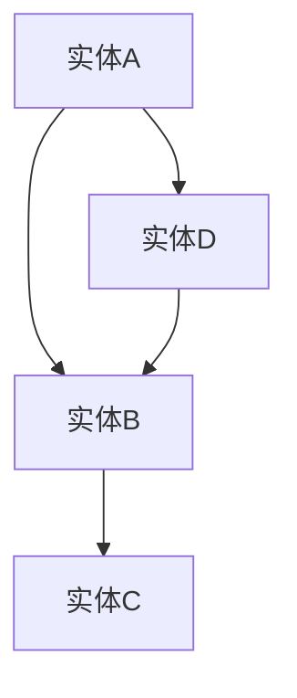

                 

### 文章标题

**AI时代的软件工程知识管理新方法**

> 关键词：人工智能、软件工程、知识管理、自动化知识获取、知识共享、知识应用

> 摘要：本文全面探讨了AI时代背景下的软件工程知识管理新方法。通过分析AI对软件工程知识管理的影响，阐述了知识获取与处理的技术手段，介绍了AI时代知识管理工具的选择与实施，探讨了知识共享与协作的方法，分析了知识应用与创新的模式，并提出了AI时代知识管理的实践策略与挑战。本文旨在为业界提供系统、实用的知识管理指南，助力企业在AI时代实现知识的有效管理与应用。

### 目录大纲

----------------------------------------------------------------

# AI时代的软件工程知识管理新方法

## 第一部分：背景与概述

## 第1章：AI时代的软件工程知识管理概述

### 1.1 AI时代对软件工程知识管理的影响

- AI技术对软件工程的影响
- 知识管理在AI时代的变革
- AI时代知识管理的挑战与机遇

### 1.2 软件工程知识管理的核心概念与流程

- 知识管理的定义
- 知识类型与分类
- 知识管理流程
- 知识管理的关键要素

### 1.3 AI在软件工程知识管理中的应用

- AI技术在知识获取中的应用
- AI技术在知识存储中的应用
- AI技术在知识共享中的应用
- AI技术在知识应用中的应用

## 第2章：AI时代的知识获取与处理方法

### 2.1 自动化知识获取技术

- 数据挖掘
- 自然语言处理
- 计算机视觉
- 知识图谱

### 2.2 知识处理技术

- 知识抽取
- 知识融合
- 知识挖掘
- 知识可视化

### 2.3 知识获取与处理的AI技术实现

- Python实现自动化知识获取
- Mermaid实现知识图谱
- 数据库实现知识存储

## 第二部分：AI时代的知识管理工具与技术

## 第3章：知识管理工具的选择与实施

### 3.1 知识管理工具概述

- 知识库
- 知识地图
- 社交网络
- 知识论坛

### 3.2 知识管理工具的比较与分析

- 开源与商业知识管理工具对比
- 根据企业需求选择合适的工具
- 工具的定制与集成

### 3.3 知识管理工具的实施与评估

- 实施策略
- 实施步骤
- 评估方法

## 第4章：基于AI的知识共享与协作

### 4.1 知识共享的概念与原则

- 知识共享的重要性
- 知识共享的障碍与解决方法
- 知识共享的原则

### 4.2 知识共享平台的设计与实现

- 平台架构
- 功能模块
- 技术实现

### 4.3 知识共享与协作的实践案例

- 案例分析
- 案例总结

## 第5章：AI时代的知识应用与创新

### 5.1 知识应用的概念与分类

- 知识应用的定义
- 知识应用的形式
- 知识应用的分类

### 5.2 知识应用的创新方法

- 知识驱动的产品设计
- 知识驱动的决策支持
- 知识驱动的业务流程优化

### 5.3 知识应用的案例分析

- 案例介绍
- 案例分析
- 案例启示

## 第三部分：AI时代的知识管理实践与挑战

## 第6章：AI时代知识管理的实践方法

### 6.1 知识管理战略规划

- 企业知识管理战略规划
- 知识管理战略实施
- 知识管理战略评估

### 6.2 知识管理团队的构建与管理

- 知识管理团队的组成
- 知识管理团队的角色
- 知识管理团队的管理方法

### 6.3 知识管理的培训与文化建设

- 知识管理培训
- 知识管理文化建设
- 知识管理文化的传播与落地

## 第7章：AI时代知识管理的挑战与对策

### 7.1 知识管理中的伦理问题

- 知识管理伦理的挑战
- 知识管理伦理的规范
- 知识管理伦理的对策

### 7.2 知识管理的技术挑战

- AI技术的快速发展对知识管理的影响
- 知识管理技术的创新与选择
- 知识管理技术的持续更新

### 7.3 知识管理的社会挑战

- 知识共享与隐私保护
- 知识创新与知识产权
- 知识管理的社会责任

## 第8章：未来展望与趋势

### 8.1 AI时代知识管理的未来发展趋势

- 知识管理技术的发展趋势
- 知识管理应用的扩展
- 知识管理行业的变革

### 8.2 AI时代知识管理的创新方向

- 知识驱动的智能服务
- 知识融合与创新
- 知识管理的可持续发展

### 8.3 知识管理的未来挑战与对策

- 知识管理伦理的持续发展
- 知识管理技术的持续创新
- 知识管理在社会中的作用

## 总结

本文通过系统性的分析和详细的讲解，全面阐述了AI时代软件工程知识管理的新方法。从背景概述到实践方法，再到未来展望，每个章节都深入探讨了AI时代知识管理的核心概念、技术手段、工具实施、知识共享、知识应用以及面临的挑战。通过本文的学习，读者可以更好地理解和掌握AI时代知识管理的方法与策略，为企业在数字化转型中提供有力的知识管理支持。

----------------------------------------------------------------

### 第一部分：背景与概述

## 第1章：AI时代的软件工程知识管理概述

### 1.1 AI时代对软件工程知识管理的影响

在过去的几十年中，软件工程领域经历了从传统的瀑布模型到敏捷开发，再到DevOps的演变，每一次变革都极大地影响了知识管理的方式和方法。然而，随着人工智能（AI）技术的迅速崛起，软件工程知识管理面临着前所未有的变革。

#### AI技术对软件工程的影响

AI技术，特别是机器学习和深度学习，已经在软件开发中得到了广泛应用。例如，自动化测试、代码生成、缺陷预测、软件性能优化等方面都显著受益于AI的应用。这些技术不仅提高了软件开发的效率，还改变了知识管理的模式。

#### 知识管理在AI时代的变革

在AI时代，知识管理的重心从单纯的文档管理和共享，逐渐转向智能化和自动化。传统的知识管理方法主要依赖于人为的收集、整理和分享，而AI技术使得知识获取和处理变得更加高效和智能。

1. **自动化知识获取**：AI技术可以通过自然语言处理、图像识别等技术自动从各种来源获取知识，大大减少了人工工作的负担。
2. **知识存储和检索**：借助AI，知识存储和检索变得更加智能化，可以根据用户需求提供个性化的知识推荐。
3. **知识共享与协作**：AI技术使得知识共享和协作更加便捷，能够实现实时协作和智能化的知识推送。
4. **知识应用与创新**：AI技术可以帮助企业快速地将知识应用于实际业务，促进创新和业务优化。

#### AI时代知识管理的挑战与机遇

虽然AI为知识管理带来了巨大的机遇，但也伴随着一系列的挑战。

1. **数据隐私与安全**：AI技术依赖于大量的数据，这引发了数据隐私和安全的问题。如何在保证数据隐私的同时充分利用数据，成为了一个重要的挑战。
2. **算法透明性与可解释性**：AI算法的决策过程往往是不透明的，这给知识管理的可解释性和可信度带来了挑战。
3. **技术选择与适应**：随着AI技术的快速更新，企业需要不断地评估和选择合适的技术，以适应不断变化的技术环境。
4. **知识管理文化的建设**：AI时代需要更加开放和共享的知识管理文化，如何推动这种文化的建设是企业面临的重要挑战。

### 1.2 软件工程知识管理的核心概念与流程

#### 知识管理的定义

知识管理（Knowledge Management, KM）是指通过识别、获取、存储、共享和利用知识，以提高组织效率和创新能力的系统过程。它不仅仅是对知识的收集和整理，更强调知识的有效利用和创新。

#### 知识类型与分类

在软件工程中，知识主要分为以下几类：

1. **显性知识**：可以被明确表达和存储的知识，如文档、代码、数据等。
2. **隐性知识**：难以用语言明确表达的知识，如经验、技能、直觉等。
3. **过程知识**：与软件工程流程和方法相关的知识。
4. **策略知识**：与软件开发策略、决策相关的知识。

#### 知识管理流程

知识管理流程通常包括以下几个阶段：

1. **知识获取**：通过调研、培训、合作等方式获取内部和外部知识。
2. **知识存储**：利用数据库、知识库等技术存储和管理知识。
3. **知识共享**：通过文档、讨论、培训等方式共享知识，促进知识的传播和利用。
4. **知识应用**：将知识应用于软件开发过程，以提高效率和质量。
5. **知识创新**：通过知识的整合和创新，推动软件工程的进步。

#### 知识管理的关键要素

1. **人**：知识管理的关键是人，包括知识管理者、知识贡献者和知识使用者。
2. **技术**：知识管理依赖于各种技术工具，如数据库、知识库、协作平台等。
3. **流程**：知识管理需要明确的流程和规范，以确保知识的有效获取、存储、共享和应用。
4. **文化**：知识管理需要营造开放、共享和创新的文化氛围。

### 1.3 AI在软件工程知识管理中的应用

AI技术为软件工程知识管理带来了许多新的应用场景和解决方案。

#### AI技术在知识获取中的应用

1. **自然语言处理（NLP）**：通过NLP技术，可以从文本数据中自动提取知识，如自动化文档摘要、关键字提取等。
2. **图像识别**：通过图像识别技术，可以从图像数据中获取知识，如自动化标注、图像分类等。
3. **语音识别**：通过语音识别技术，可以从语音数据中获取知识，如语音转文本、语音理解等。

#### AI技术在知识存储中的应用

1. **知识图谱**：通过构建知识图谱，可以实现对知识的结构化和可视化，方便知识的存储和检索。
2. **自动分类和聚类**：AI技术可以自动对知识进行分类和聚类，提高知识的组织和管理效率。
3. **智能搜索**：通过智能搜索技术，可以根据用户需求快速找到所需知识。

#### AI技术在知识共享中的应用

1. **社交网络分析**：通过社交网络分析，可以识别知识传播的关键节点和路径，提高知识共享的效率。
2. **个性化推荐**：通过个性化推荐技术，可以根据用户偏好和需求推荐相关知识。
3. **智能协作**：通过智能协作工具，可以实现实时协作和智能化的知识推送。

#### AI技术在知识应用中的应用

1. **自动化决策支持**：通过AI技术，可以自动化处理复杂的决策问题，提供决策支持。
2. **智能化流程优化**：通过AI技术，可以优化软件开发流程，提高效率和质量。
3. **创新应用场景**：AI技术可以应用于各种创新场景，如自动化测试、智能运维、智能推荐等。

### 小结

AI时代的软件工程知识管理面临着前所未有的变革和机遇。通过AI技术的应用，知识获取、存储、共享和应用变得更加高效和智能。同时，也带来了数据隐私、算法透明性、技术适应性和知识管理文化建设等挑战。只有充分利用AI技术，构建有效的知识管理策略，企业才能在AI时代取得竞争优势。

----------------------------------------------------------------

## 第2章：AI时代的知识获取与处理方法

### 2.1 自动化知识获取技术

在AI时代，自动化知识获取是知识管理的核心环节。通过利用各种AI技术，可以从海量的数据中高效地提取有用知识，减少人工干预，提高知识获取的效率。

#### 数据挖掘

数据挖掘（Data Mining）是指从大量数据中提取有价值信息的过程。在软件工程中，数据挖掘可以用于发现潜在的软件缺陷、性能瓶颈、用户行为模式等。

- **技术实现**：常见的数据挖掘算法包括关联规则挖掘、分类算法、聚类算法和异常检测等。使用Python的pandas库和scikit-learn库，可以方便地进行数据挖掘操作。
- **示例**：假设我们有一组软件缺陷报告，我们可以使用分类算法（如决策树、随机森林）来预测新的缺陷报告是否属于某种类型的缺陷。

```python
from sklearn.datasets import load_iris
from sklearn.model_selection import train_test_split
from sklearn.ensemble import RandomForestClassifier

# 加载数据集
iris = load_iris()
X = iris.data
y = iris.target

# 划分训练集和测试集
X_train, X_test, y_train, y_test = train_test_split(X, y, test_size=0.3, random_state=42)

# 训练分类器
clf = RandomForestClassifier(n_estimators=100)
clf.fit(X_train, y_train)

# 测试分类器
accuracy = clf.score(X_test, y_test)
print(f"Accuracy: {accuracy}")
```

#### 自然语言处理

自然语言处理（Natural Language Processing, NLP）是AI的一个重要分支，旨在使计算机能够理解和处理人类语言。在知识获取中，NLP技术可以用于文本分析、语义理解、情感分析等。

- **技术实现**：常见的NLP工具和库包括NLTK、spaCy和TensorFlow等。使用这些工具，可以自动从文本中提取关键词、主题和摘要。
- **示例**：使用spaCy提取文本的关键词。

```python
import spacy

# 加载spaCy模型
nlp = spacy.load("en_core_web_sm")

# 文本预处理
text = "The AI revolution is transforming the software engineering landscape."
doc = nlp(text)

# 提取关键词
keywords = [token.lemma_.lower() for token in doc if not token.is_punct and not token.is_stop]
print("Keywords:", keywords)
```

#### 计算机视觉

计算机视觉（Computer Vision）是指使计算机能够从图像或视频中获取信息的能力。在知识获取中，计算机视觉可以用于图像识别、物体检测、图像分割等。

- **技术实现**：常见的计算机视觉库包括OpenCV、TensorFlow和PyTorch等。使用这些库，可以构建各种图像处理和识别模型。
- **示例**：使用OpenCV进行图像分割。

```python
import cv2

# 读取图像
image = cv2.imread("example.jpg")

# 转换为灰度图像
gray = cv2.cvtColor(image, cv2.COLOR_BGR2GRAY)

# 应用Otsu阈值分割
thresh = cv2.threshold(gray, 0, 255, cv2.THRESH_BINARY + cv2.THRESH_OTSU)[1]

# 显示分割结果
cv2.imshow("Thresholded Image", thresh)
cv2.waitKey(0)
cv2.destroyAllWindows()
```

#### 知识图谱

知识图谱（Knowledge Graph）是一种结构化的知识表示方法，用于表示实体、属性和关系。在知识获取中，知识图谱可以用于实体识别、关系抽取和知识推理。

- **技术实现**：常见的知识图谱工具和库包括Neo4j、RDF和Mermaid等。使用这些工具，可以构建和查询复杂的知识图谱。
- **示例**：使用Mermaid绘制知识图谱。



### 2.2 知识处理技术

知识获取只是知识管理的第一步，接下来需要对获取的知识进行处理，以便更好地存储、检索和应用。

#### 知识抽取

知识抽取（Knowledge Extraction）是指从非结构化或半结构化数据中提取结构化知识的过程。在软件工程中，知识抽取可以用于从用户评论、代码注释、缺陷报告等中提取有用的信息。

- **技术实现**：常见的知识抽取技术包括实体识别、关系抽取和事件抽取。使用NLP技术，可以自动从文本中提取这些信息。
- **示例**：使用spaCy进行实体识别。

```python
import spacy

# 加载spaCy模型
nlp = spacy.load("en_core_web_sm")

# 文本预处理
text = "The AI revolution is transforming the software engineering landscape."
doc = nlp(text)

# 提取实体
entities = [(ent.text, ent.label_) for ent in doc.ents]
print("Entities:", entities)
```

#### 知识融合

知识融合（Knowledge Fusion）是指将来自不同来源或不同格式的知识整合为一个统一的知识体系。在软件工程中，知识融合可以用于整合多个数据源，如代码库、缺陷库、用户反馈等。

- **技术实现**：常见的知识融合技术包括数据集成、数据融合和知识融合算法。使用数据库和数据清洗技术，可以整合多个数据源。
- **示例**：使用数据库进行知识融合。

```sql
-- 创建知识库
CREATE TABLE knowledge (
    id INT PRIMARY KEY,
    entity VARCHAR(255),
    attribute VARCHAR(255),
    value VARCHAR(255)
);

-- 插入知识
INSERT INTO knowledge (id, entity, attribute, value) VALUES (1, 'AI', 'description', 'Artificial Intelligence');
INSERT INTO knowledge (id, entity, attribute, value) VALUES (2, 'software engineering', 'revolution', 'AI');

-- 查询知识
SELECT * FROM knowledge;
```

#### 知识挖掘

知识挖掘（Knowledge Mining）是指从大量数据中提取潜在有用信息的过程。在软件工程中，知识挖掘可以用于发现新的软件缺陷、性能瓶颈、用户需求等。

- **技术实现**：常见的知识挖掘技术包括关联规则挖掘、分类算法、聚类算法和异常检测等。使用数据挖掘算法，可以从数据中提取潜在的知识。
- **示例**：使用Apriori算法进行关联规则挖掘。

```python
from mlxtend.frequent_patterns import apriori
from mlxtend.frequent_patterns import association_rules

# 加载数据
transactions = [
    ['milk', 'bread', 'coffee'],
    ['milk', 'coffee', 'apple'],
    ['bread', 'apple', 'coffee'],
    ['apple', 'coffee'],
    ['apple', 'bread', 'milk', 'coffee'],
    ['apple', 'bread', 'milk'],
]

# 应用Apriori算法
frequent_itemsets = apriori(transactions, min_support=0.5, use_colnames=True)

# 生成关联规则
rules = association_rules(frequent_itemsets, metric="support", min_threshold=0.7)
print(rules)
```

#### 知识可视化

知识可视化（Knowledge Visualization）是指将知识以图形或图像的形式展示出来，以便更容易理解和分析。在软件工程中，知识可视化可以用于展示软件架构、代码依赖关系、知识图谱等。

- **技术实现**：常见的知识可视化工具和库包括D3.js、Mermaid和ECharts等。使用这些工具，可以创建各种知识可视化图表。
- **示例**：使用Mermaid绘制知识图谱。


### 2.3 知识获取与处理的AI技术实现

在实际应用中，知识获取和处理通常需要结合多种AI技术，以实现高效的知识管理和应用。

#### Python实现自动化知识获取

Python作为一种流行的编程语言，在AI领域有着广泛的应用。通过Python，可以方便地实现自动化知识获取和处理。

- **技术实现**：使用Python的NLP库（如spaCy、NLTK）和数据处理库（如pandas、NumPy），可以实现对文本数据的自动处理和知识提取。
- **示例**：使用spaCy进行文本分析。

```python
import spacy

# 加载spaCy模型
nlp = spacy.load("en_core_web_sm")

# 文本预处理
text = "The AI revolution is transforming the software engineering landscape."
doc = nlp(text)

# 提取关键词和实体
keywords = [token.lemma_.lower() for token in doc if not token.is_punct and not token.is_stop]
entities = [(ent.text, ent.label_) for ent in doc.ents]

print("Keywords:", keywords)
print("Entities:", entities)
```

#### Mermaid实现知识图谱

Mermaid是一种用于绘制序列图、流程图、类图、状态图等图表的标记语言。在知识管理中，可以使用Mermaid来绘制知识图谱。

- **技术实现**：通过编写Mermaid标记语言，可以轻松地绘制各种知识图谱。
- **示例**：使用Mermaid绘制一个简单的知识图谱。


#### 数据库实现知识存储

数据库是知识存储和管理的重要工具。通过数据库，可以实现对知识的结构化存储和高效检索。

- **技术实现**：使用关系数据库（如MySQL、PostgreSQL）或图数据库（如Neo4j），可以构建高效的数据库系统。
- **示例**：使用SQL语句创建和查询知识库。

```sql
-- 创建知识库
CREATE TABLE knowledge (
    id INT PRIMARY KEY,
    entity VARCHAR(255),
    attribute VARCHAR(255),
    value VARCHAR(255)
);

-- 插入知识
INSERT INTO knowledge (id, entity, attribute, value) VALUES (1, 'AI', 'description', 'Artificial Intelligence');
INSERT INTO knowledge (id, entity, attribute, value) VALUES (2, 'software engineering', 'revolution', 'AI');

-- 查询知识
SELECT * FROM knowledge;
```

### 小结

AI时代的知识获取与处理方法为软件工程带来了前所未有的机遇。通过自动化知识获取技术，如数据挖掘、自然语言处理、计算机视觉和知识图谱，可以从海量数据中高效地提取有用知识。同时，通过知识处理技术，如知识抽取、知识融合、知识挖掘和知识可视化，可以实现对知识的深入理解和应用。在实际应用中，结合Python、Mermaid和数据库等技术，可以实现高效的知识获取和处理，为软件工程提供强大的知识支持。

----------------------------------------------------------------

## 第二部分：AI时代的知识管理工具与技术

### 第3章：知识管理工具的选择与实施

在AI时代，知识管理工具的选择与实施是确保知识有效管理和利用的关键。随着AI技术的不断发展，市场上涌现出众多知识管理工具，企业需要根据自身需求选择合适的工具，并有效地实施和评估其效果。

#### 知识管理工具概述

知识管理工具是支持知识获取、存储、共享、应用和创新的各种技术和平台。常见的知识管理工具包括知识库、知识地图、社交网络和知识论坛等。

1. **知识库**：知识库是一种用于存储和检索知识的系统，通常包含文档、代码、数据等。知识库可以帮助企业集中管理和共享知识，提高知识利用率。
2. **知识地图**：知识地图是一种可视化工具，用于展示知识之间的关系和结构。通过知识地图，用户可以直观地了解知识的整体架构和相互关系。
3. **社交网络**：社交网络是一种基于人际关系和互动的知识共享平台，如LinkedIn、Facebook等。在社交网络中，用户可以分享知识、交流经验、寻求帮助。
4. **知识论坛**：知识论坛是一种在线社区，用户可以在其中提问、回答问题、分享知识。知识论坛有助于促进知识的交流与共享，提高团队协作效率。

#### 知识管理工具的比较与分析

在选择知识管理工具时，企业需要考虑多个因素，如功能需求、用户需求、集成能力、成本等。以下是几种常见知识管理工具的比较与分析：

1. **开源与商业知识管理工具对比**
   - **开源工具**：如Confluence、GitLab、GitHub等。开源工具通常具有较低的成本和较高的灵活性，但可能需要更多的时间和资源进行定制和集成。
   - **商业工具**：如SharePoint、Kaltura、Salesforce等。商业工具通常具有更完善的功能和更专业的技术支持，但价格较高。

2. **根据企业需求选择合适的工具**
   - **需求分析**：企业需要明确知识管理的具体需求，如知识存储、检索、共享、协作等。
   - **功能对比**：对比不同工具的功能，选择满足企业需求的工具。

3. **工具的定制与集成**
   - **定制化**：根据企业需求，对知识管理工具进行定制，以满足特定业务需求。
   - **集成**：将知识管理工具与其他系统（如ERP、CRM等）集成，实现数据的无缝流转和共享。

#### 知识管理工具的实施与评估

知识管理工具的实施和评估是企业确保知识管理有效性的关键步骤。

1. **实施策略**
   - **需求确认**：明确知识管理的目标和需求，制定详细实施计划。
   - **团队建设**：组建知识管理团队，明确团队成员的角色和职责。
   - **培训与宣传**：对团队成员进行培训，提高对知识管理工具的使用和认知。

2. **实施步骤**
   - **系统搭建**：搭建知识管理平台，包括硬件、软件和网络环境。
   - **数据迁移**：将现有知识迁移到新平台，确保数据的完整性和一致性。
   - **功能配置**：根据企业需求，配置知识管理工具的各种功能模块。
   - **上线与测试**：上线知识管理工具，进行系统测试，确保功能的稳定性和安全性。

3. **评估方法**
   - **用户反馈**：收集用户对知识管理工具的使用反馈，了解用户需求和满意度。
   - **性能指标**：根据知识管理工具的性能指标，如知识检索速度、用户活跃度等，评估工具的效果。
   - **成本效益分析**：对比知识管理工具的投资回报，评估其经济效益。

### 3.1 知识管理工具的选择

在AI时代，选择合适的知识管理工具对于企业知识管理的效果至关重要。以下是一些关键步骤和考虑因素：

1. **明确需求**：首先，企业需要明确知识管理的具体需求，包括知识存储、检索、共享、协作等方面的需求。需求分析应该结合企业的业务特点和战略目标。

2. **市场调研**：进行市场调研，了解当前市场上主流的知识管理工具及其功能特点。可以通过查阅相关报告、参加行业研讨会、与供应商交流等方式获取信息。

3. **功能对比**：对比不同知识管理工具的功能，评估其是否满足企业的需求。重点考虑工具的知识存储和检索能力、用户界面、定制化和集成能力等方面。

4. **用户反馈**：收集现有用户对知识管理工具的使用反馈，了解工具的优缺点。用户反馈可以帮助企业更好地了解工具的实际应用效果和潜在问题。

5. **技术支持**：评估供应商的技术支持能力和服务质量。技术支持是企业选择知识管理工具时不可忽视的因素，尤其是在实施和维护过程中可能会遇到的问题。

### 3.2 知识管理工具的比较与分析

在AI时代，知识管理工具的选择需要考虑多个因素，以下是对几种常见知识管理工具的比较与分析：

1. **开源与商业知识管理工具对比**

   - **Confluence**：是一款功能强大的知识管理工具，支持文档、博客、看板等多种内容形式。开源版本提供基本的协作功能，而商业版本则提供更多的功能，如高级权限管理、版本控制等。

   - **SharePoint**：是微软推出的企业内容管理平台，提供丰富的协作和知识共享功能。SharePoint适合大型企业，但成本较高。

   - **GitLab**：是一款开源的Git版本控制系统，集成了代码仓库、项目管理、持续集成等功能。GitLab适合开发团队进行知识管理。

   - **GitHub**：是GitLab的竞争对手，也提供了类似的代码仓库和协作功能。GitHub在全球开发社区中拥有广泛的用户基础。

2. **根据企业需求选择合适的工具**

   - **中小型企业**：适合选择功能较为简单、成本较低的工具，如Confluence、GitHub等。这些工具易于部署和维护，且成本相对较低。

   - **大型企业**：适合选择功能全面、定制化能力强的工具，如SharePoint、IBM Knowledge Center等。这些工具能够满足大型企业复杂的知识管理需求，但成本较高。

3. **工具的定制与集成**

   - **定制化**：根据企业特定的业务流程和知识管理需求，对知识管理工具进行定制开发。定制化可以提高工具的适用性和用户体验。

   - **集成**：将知识管理工具与其他系统（如ERP、CRM、项目管理系统等）集成，实现数据的无缝流转和共享。集成可以提高企业信息化系统的整体效能。

### 3.3 知识管理工具的实施与评估

知识管理工具的实施和评估是企业确保知识管理有效性的关键步骤。

1. **实施策略**

   - **需求确认**：在实施前，需要明确知识管理的目标和需求，制定详细的实施计划。

   - **团队建设**：组建知识管理团队，明确团队成员的角色和职责。团队成员应包括知识管理者、技术专家、业务专家等。

   - **培训与宣传**：对团队成员进行培训，提高对知识管理工具的使用和认知。同时，通过内部宣传，提高员工对知识管理的重视和参与度。

2. **实施步骤**

   - **系统搭建**：搭建知识管理平台，包括硬件、软件和网络环境。确保平台的稳定性和安全性。

   - **数据迁移**：将现有知识迁移到新平台，确保数据的完整性和一致性。数据迁移可能涉及文档、代码、数据等。

   - **功能配置**：根据企业需求，配置知识管理工具的各种功能模块。功能配置应确保工具的灵活性和适用性。

   - **上线与测试**：上线知识管理工具，进行系统测试，确保功能的稳定性和安全性。上线后，进行试用和优化，根据用户反馈进行改进。

3. **评估方法**

   - **用户反馈**：收集用户对知识管理工具的使用反馈，了解用户需求和满意度。用户反馈可以反映工具的实际应用效果和潜在问题。

   - **性能指标**：根据知识管理工具的性能指标，如知识检索速度、用户活跃度等，评估工具的效果。性能指标可以反映工具的技术水平和用户体验。

   - **成本效益分析**：对比知识管理工具的投资回报，评估其经济效益。成本效益分析可以帮助企业评估知识管理工具的长期价值。

### 小结

AI时代的知识管理工具为企业提供了丰富的选择，企业需要根据自身需求选择合适的工具，并有效地实施和评估。通过合理的工具选择和实施策略，企业可以构建高效的知识管理体系，提高知识利用效率，实现知识驱动的业务增长。

----------------------------------------------------------------

## 第4章：基于AI的知识共享与协作

在AI时代，知识共享与协作成为企业提高创新能力、优化业务流程、提升团队效率的关键手段。借助AI技术，知识共享与协作不仅变得更加便捷，而且更加智能化和高效。

### 4.1 知识共享的概念与原则

知识共享（Knowledge Sharing）是指将个人或组织的知识传递给他人，以便更好地利用和创造价值。在AI时代，知识共享的重要性愈加凸显，主要体现在以下几个方面：

1. **提高工作效率**：通过知识共享，团队成员可以快速获取所需信息，避免重复工作，提高工作效率。
2. **促进知识创新**：知识共享促进了不同领域和不同部门之间的知识交流，激发了创新的火花，推动了知识创新。
3. **增强团队协作**：知识共享有助于团队成员之间的沟通和协作，增强了团队凝聚力和合作效率。

#### 知识共享的障碍与解决方法

尽管知识共享具有重要意义，但在实际应用中，仍面临一些障碍：

1. **知识隐性化**：许多知识存在于个人的经验、直觉和技能中，难以用语言明确表达，导致知识共享困难。
2. **知识保护主义**：部分员工担心知识共享会削弱个人地位或被他人利用，从而对知识共享持保守态度。
3. **信息过载**：随着信息量的不断增加，员工难以从海量信息中筛选出有价值的内容，导致知识共享效率低下。

针对这些障碍，可以采取以下解决方法：

1. **建立共享文化**：通过宣传和培训，营造开放、共享的知识管理文化，提高员工对知识共享的认知和重视程度。
2. **制定共享政策**：明确知识共享的规则和流程，鼓励员工积极参与知识共享，并对贡献知识者给予奖励和认可。
3. **利用AI技术**：借助AI技术，实现知识的自动提取、分类、推荐和共享，提高知识共享的效率和质量。

#### 知识共享的原则

为了确保知识共享的有效性，应遵循以下原则：

1. **平等原则**：知识共享应该是平等的，不应因为职位、等级等因素造成知识共享的不平等。
2. **自愿原则**：知识共享应基于自愿原则，尊重知识贡献者的意愿，避免强制知识共享。
3. **共享原则**：知识共享不仅仅是传递知识，更重要的是促进知识的创造和应用。
4. **反馈原则**：知识共享过程中，应重视用户反馈，根据反馈不断优化知识共享过程和内容。

### 4.2 知识共享平台的设计与实现

为了实现高效的知识共享，企业可以设计和实现一套知识共享平台。以下是一个简单的知识共享平台设计框架：

#### 平台架构

知识共享平台通常包括以下几个核心模块：

1. **用户管理模块**：用于管理用户信息、权限设置和用户行为分析。
2. **知识库模块**：用于存储和管理各种知识，包括文档、代码、数据等。
3. **知识推荐模块**：基于用户行为和知识属性，为用户推荐相关知识和资源。
4. **协作模块**：提供实时协作工具，如聊天室、讨论区、共享白板等，促进团队成员之间的交流与合作。
5. **分析模块**：收集和分析用户行为数据，为知识共享提供数据支持。

#### 功能模块

知识共享平台的功能模块如下：

1. **文档管理**：支持文档的创建、上传、下载、编辑和版本控制。
2. **代码管理**：集成版本控制系统，如Git，支持代码的提交、合并和分支管理。
3. **知识搜索**：提供智能搜索功能，帮助用户快速找到所需的知识和资源。
4. **知识推荐**：根据用户行为和兴趣，推荐相关的知识和资源。
5. **讨论与协作**：提供讨论区、聊天室、共享白板等实时协作工具。
6. **知识评估**：对知识的质量和实用性进行评估，确保知识的可靠性和有效性。

#### 技术实现

以下是一个简单的知识共享平台的技术实现框架：

1. **前端技术**：使用HTML、CSS和JavaScript等前端技术，构建用户界面。
2. **后端技术**：使用Python、Java或Node.js等后端技术，实现业务逻辑和数据处理。
3. **数据库**：使用关系数据库（如MySQL、PostgreSQL）或NoSQL数据库（如MongoDB），存储用户数据、知识数据等。
4. **AI技术**：利用自然语言处理（NLP）技术，实现知识的自动提取、分类和推荐。
5. **协作工具**：集成实时协作工具，如WebRTC、WebSocket等，实现实时通信和协作。

### 4.3 知识共享与协作的实践案例

为了更好地理解知识共享与协作在实际中的应用，以下是一个企业级知识共享与协作的实践案例：

#### 案例背景

某大型互联网企业为了提升团队协作效率，优化知识管理，决定设计和实施一套知识共享平台。

#### 案例实施

1. **需求分析**：企业对现有知识管理流程进行了全面的调研和分析，明确了知识共享的需求和目标。
2. **平台设计**：根据需求分析，企业设计了知识共享平台的架构和功能模块，并确定了技术实现方案。
3. **平台开发**：企业采用敏捷开发模式，分阶段实施平台开发，确保每个阶段的功能和性能都符合预期。
4. **用户培训**：为员工提供培训，帮助其掌握知识共享平台的操作和使用方法。
5. **上线与推广**：平台上线后，企业通过内部宣传和激励措施，鼓励员工积极参与知识共享与协作。

#### 案例总结

通过实施知识共享平台，企业实现了以下成果：

1. **提高了工作效率**：员工可以快速获取所需的知识和资源，减少了重复工作和沟通成本。
2. **促进了知识创新**：知识共享激发了团队的创新思维，推动了知识创新和业务优化。
3. **增强了团队协作**：实时协作工具促进了团队成员之间的沟通和协作，增强了团队凝聚力和工作效率。
4. **提升了知识利用率**：知识共享平台提高了知识的利用效率，减少了知识浪费。

### 小结

基于AI的知识共享与协作在AI时代具有重要意义。通过合理的知识共享平台设计和技术实现，企业可以有效地促进知识共享与协作，提高团队协作效率和知识利用效率。实践案例表明，知识共享与协作不仅有助于提升工作效率和知识创新，还能增强团队凝聚力和业务优化。企业在设计和实施知识共享与协作平台时，应结合自身需求和实际情况，确保平台的实用性、高效性和可持续性。

----------------------------------------------------------------

## 第5章：AI时代的知识应用与创新

在AI时代，知识的获取、存储和共享已经成为软件工程的重要环节。然而，知识的应用与创新是知识管理的最终目标，也是企业在激烈的市场竞争中脱颖而出的关键。AI技术为知识的应用与创新提供了强大的支持，使得知识可以更加灵活和高效地应用于实际业务中。

### 5.1 知识应用的概念与分类

#### 知识应用的定义

知识应用（Knowledge Application）是指将知识转化为实际业务价值的过程。在AI时代，知识应用不仅仅是将现有的知识直接应用于业务中，更重要的是通过AI技术对知识进行深度挖掘、整合和创新，以实现更高层次的业务价值。

#### 知识应用的分类

根据知识应用的形式，可以将知识应用分为以下几类：

1. **知识驱动的产品设计**：通过分析用户需求和市场趋势，将知识应用于产品设计和开发，实现产品创新和优化。
2. **知识驱动的决策支持**：利用知识库和AI技术，为管理者提供数据驱动的决策支持，提高决策的准确性和效率。
3. **知识驱动的业务流程优化**：通过对业务流程的数据分析，发现流程中的问题和瓶颈，利用知识进行优化，提高业务流程的效率和效果。
4. **知识驱动的服务创新**：结合用户数据和业务知识，开发创新的服务模式，提升用户体验和满意度。

### 5.2 知识应用的创新方法

在AI时代，知识应用的创新方法主要体现在以下几个方面：

#### 知识驱动的产品设计

知识驱动的产品设计是指利用AI技术分析用户需求、市场趋势和竞争环境，为产品设计和开发提供决策支持。这种方法可以帮助企业更快地响应市场变化，实现产品创新。

- **用户数据分析**：通过分析用户行为数据，了解用户偏好和使用习惯，为产品设计提供依据。
- **市场趋势预测**：利用机器学习算法，预测市场趋势和未来需求，指导产品开发方向。
- **竞争分析**：通过分析竞争对手的产品和策略，发现市场机会和潜在风险。

#### 知识驱动的决策支持

知识驱动的决策支持是指利用知识库和AI技术，为企业的管理层提供数据驱动的决策支持。这种方法可以提高决策的准确性和效率。

- **数据可视化**：通过数据可视化工具，将复杂的数据转化为直观的图表和报告，帮助管理者更好地理解数据。
- **预测分析**：利用预测模型，预测未来的业务趋势和结果，为决策提供数据支持。
- **情景分析**：通过模拟不同的决策情景，评估不同决策方案的影响，为决策提供参考。

#### 知识驱动的业务流程优化

知识驱动的业务流程优化是指通过对业务流程的数据分析，发现流程中的问题和瓶颈，利用知识进行优化，提高业务流程的效率和效果。

- **流程自动化**：利用AI技术，实现业务流程的自动化，减少人为干预，提高工作效率。
- **流程优化**：通过对业务流程的数据分析，发现流程中的瓶颈和浪费，进行流程优化。
- **流程监控**：利用AI技术，实现对业务流程的实时监控和异常检测，确保流程的稳定和高效。

#### 知识驱动的服务创新

知识驱动的服务创新是指结合用户数据和业务知识，开发创新的服务模式，提升用户体验和满意度。

- **个性化服务**：通过分析用户数据，为用户提供个性化的服务和建议，提升用户体验。
- **智能化客服**：利用AI技术，实现智能客服，提供24/7的服务支持，提高客户满意度。
- **智能推荐**：通过分析用户行为和偏好，为用户推荐相关的产品和服务，提升转化率。

### 5.3 知识应用的案例分析

#### 案例一：知识驱动的产品设计

某互联网公司开发了一款在线教育平台，通过分析用户数据和市场趋势，为产品设计和开发提供了决策支持。具体做法如下：

1. **用户数据分析**：通过对用户行为数据的分析，发现用户对课程内容的需求主要集中在编程和数据分析领域。
2. **市场趋势预测**：利用机器学习算法，预测未来在线教育市场的增长趋势和热门课程方向。
3. **竞争分析**：分析竞争对手的产品和策略，发现用户对课程互动性和个性化学习体验有较高的需求。

基于以上分析，公司调整了产品开发方向，增加了编程和数据分析课程的互动性，并引入了个性化学习计划。通过这些创新措施，产品上线后得到了用户的积极反馈，市场份额大幅提升。

#### 案例二：知识驱动的决策支持

某制造企业利用知识库和AI技术，为管理层提供了数据驱动的决策支持。具体做法如下：

1. **数据可视化**：通过数据可视化工具，将生产数据转化为直观的图表和报告，帮助管理者更好地理解数据。
2. **预测分析**：利用预测模型，预测未来的生产需求和库存水平，为采购和库存管理提供数据支持。
3. **情景分析**：模拟不同的采购和库存管理策略，评估不同方案的影响，为决策提供参考。

通过这些措施，企业实现了库存水平的优化，降低了库存成本，同时提高了生产效率。

#### 案例三：知识驱动的业务流程优化

某金融服务公司通过分析业务流程数据，发现客户服务流程存在多个瓶颈，导致客户满意度较低。具体做法如下：

1. **流程自动化**：利用AI技术，实现客户服务流程的自动化，减少人为干预，提高响应速度。
2. **流程优化**：通过对客户服务流程的数据分析，发现流程中的瓶颈和浪费，进行流程优化。
3. **流程监控**：利用AI技术，实现对客户服务流程的实时监控和异常检测，确保流程的稳定和高效。

通过这些措施，企业显著提高了客户满意度，降低了客户投诉率。

#### 案例四：知识驱动的服务创新

某电商企业通过分析用户数据和业务知识，开发了个性化推荐系统，提升了用户体验和满意度。具体做法如下：

1. **个性化服务**：通过分析用户行为和偏好，为用户提供个性化的产品推荐。
2. **智能化客服**：利用AI技术，实现智能客服，提供24/7的服务支持，提升客户满意度。
3. **智能推荐**：通过分析用户行为和偏好，为用户推荐相关的产品和服务，提升转化率。

通过这些措施，企业实现了用户满意度的显著提升，销售额也相应增加。

### 小结

AI时代的知识应用与创新为企业在激烈的市场竞争中提供了强大的支持。通过知识驱动的产品设计、决策支持、业务流程优化和服务创新，企业可以更快地响应市场变化，提升业务效率和客户满意度。实践案例表明，AI技术在知识应用与创新中发挥着重要作用，企业应充分利用AI技术，推动知识的应用与创新，实现业务增长和持续发展。

----------------------------------------------------------------

## 第三部分：AI时代的知识管理实践与挑战

### 第6章：AI时代知识管理的实践方法

在AI时代，知识管理已经成为企业竞争的关键因素。有效的知识管理不仅能够提高企业的创新能力和竞争力，还能够促进团队协作和知识共享。然而，实现有效的知识管理需要一系列的实践方法和策略。

#### 6.1 知识管理战略规划

知识管理战略规划是企业进行知识管理的基础。一个有效的知识管理战略规划应包括以下步骤：

1. **明确知识管理目标**：企业应明确知识管理的总体目标，如提高知识利用效率、促进知识共享、增强团队协作等。
2. **评估当前知识管理现状**：通过调研和评估，了解企业当前的知识管理水平和存在的问题。
3. **制定知识管理策略**：根据评估结果，制定具体的知识管理策略，包括知识获取、存储、共享、应用等方面的策略。
4. **制定实施计划**：制定详细的实施计划，明确实施的时间表、责任人和资源配置。

#### 6.2 知识管理团队的构建与管理

知识管理是一项复杂的系统性工作，需要专业的团队来推动和实施。知识管理团队的构建与管理应考虑以下几个方面：

1. **团队组成**：知识管理团队应包括知识管理者、技术专家、业务专家和知识贡献者等不同角色。每个角色应具备相应的专业能力和职责。
2. **角色职责**：知识管理者负责知识管理战略的制定和实施，技术专家负责技术平台的建设和维护，业务专家负责业务知识的挖掘和整合，知识贡献者负责提供和更新知识。
3. **团队管理**：知识管理团队的管理应注重沟通和协作，通过定期的会议、培训和反馈机制，提高团队成员的凝聚力和工作效率。

#### 6.3 知识管理的培训与文化建设

知识管理不仅需要专业的团队，还需要全员参与和重视。以下是一些培训与文化建设的方法：

1. **知识管理培训**：定期组织知识管理培训，提高员工对知识管理的认识和技能。培训内容应包括知识获取、存储、共享、应用等方面的知识和技能。
2. **知识共享文化**：通过宣传和激励，营造开放、共享的知识管理文化。鼓励员工积极参与知识共享，对贡献知识的员工给予奖励和认可。
3. **知识管理案例分享**：通过分享成功的知识管理案例，激发员工对知识管理的兴趣和参与度。

### 6.4 知识管理的实施步骤

知识管理的实施是一个逐步推进的过程，以下是一些关键的步骤：

1. **需求分析**：分析企业内外部知识管理的需求，明确需要解决的问题和提升的目标。
2. **平台建设**：根据需求，选择合适的知识管理平台和技术，构建知识管理的基础设施。
3. **知识分类与编码**：对现有知识进行分类和编码，确保知识的结构化和可检索性。
4. **知识获取与积累**：通过内部培训、外部学习、项目经验等方式，获取和积累知识。
5. **知识共享与传播**：建立知识共享平台和机制，促进知识的传播和应用。
6. **知识评估与优化**：定期评估知识管理的效果，对知识管理策略和平台进行优化。

### 小结

AI时代的知识管理实践方法包括战略规划、团队构建、培训与文化建设以及实施步骤。通过这些方法，企业可以构建有效的知识管理体系，提高知识利用效率，促进团队协作和知识共享，为企业的长期发展提供有力支持。

----------------------------------------------------------------

### 第7章：AI时代知识管理的挑战与对策

在AI时代，知识管理虽然面临着前所未有的机遇，但也面临一系列的挑战。这些挑战包括伦理问题、技术挑战和社会挑战等方面。为了有效地应对这些挑战，企业需要采取一系列的对策。

#### 7.1 知识管理中的伦理问题

随着AI技术的应用，知识管理中的伦理问题变得越来越突出。以下是一些主要的伦理问题及其对策：

1. **数据隐私**：AI技术在知识管理中需要大量数据，这引发了数据隐私的问题。对策：企业应制定严格的数据隐私政策，确保数据的收集、存储和使用符合相关法律法规，同时采取数据加密和访问控制等安全措施。
2. **算法偏见**：AI算法可能存在偏见，导致不公平的结果。对策：企业应在算法开发过程中充分考虑多样性，避免算法偏见。此外，对算法进行定期审计和评估，确保其公平性和透明性。
3. **知识产权**：知识管理中涉及到的知识产权问题，如知识原创性、知识产权归属等。对策：企业应明确知识产权的保护措施，确保知识的原创性和归属权。同时，与合作伙伴建立明确的知识产权协议。

#### 7.2 知识管理的技术挑战

知识管理在AI时代面临着一系列技术挑战，主要包括：

1. **数据质量问题**：知识管理依赖于高质量的数据，但数据质量往往难以保证。对策：企业应建立数据质量管理机制，包括数据清洗、数据验证和数据标准化等，确保数据的准确性和一致性。
2. **系统集成**：知识管理工具需要与企业的其他系统（如ERP、CRM等）集成，这增加了集成的复杂性。对策：企业应选择具有良好集成能力的知识管理工具，并制定详细的集成计划，确保系统的无缝对接。
3. **算法更新**：AI技术的快速发展要求知识管理工具和算法不断更新。对策：企业应建立持续的技术更新机制，确保知识管理工具和算法始终处于最新状态。

#### 7.3 知识管理的社会挑战

知识管理不仅涉及技术和伦理问题，还面临社会挑战，包括：

1. **知识共享与隐私保护**：在知识共享过程中，如何平衡知识的开放性和隐私保护是一个重要问题。对策：企业应制定明确的共享政策，确保知识的共享在尊重隐私的前提下进行。此外，采用区块链等新兴技术，可以增强知识共享的安全性。
2. **知识创新与知识产权**：知识创新可能涉及到知识产权的问题，如知识原创性、知识产权归属等。对策：企业应建立知识产权保护机制，鼓励知识创新的同时确保知识产权的合法性和归属。
3. **知识管理的社会责任**：企业在进行知识管理时，还应考虑社会责任，如知识共享、环境保护等。对策：企业应制定社会责任战略，确保知识管理不仅符合商业利益，也符合社会责任。

### 小结

AI时代的知识管理面临伦理问题、技术挑战和社会挑战等多方面的挑战。企业需要采取一系列的对策，包括制定严格的数据隐私政策、确保算法公平性和透明性、建立数据质量管理机制、选择集成能力强的知识管理工具、平衡知识共享与隐私保护、保护知识产权和履行社会责任等。通过这些对策，企业可以有效地应对AI时代知识管理的挑战，实现知识管理的可持续发展。

----------------------------------------------------------------

## 第8章：未来展望与趋势

随着人工智能（AI）技术的不断发展和普及，知识管理在软件工程中的应用也将迎来新的变革和机遇。未来，AI时代的知识管理将呈现出以下发展趋势和趋势。

### 8.1 AI时代知识管理的未来发展趋势

1. **智能化知识管理**：AI技术将使得知识管理更加智能化，包括自动化知识获取、智能搜索和推荐、知识图谱构建等。智能化的知识管理将提高知识获取和利用的效率，使知识管理更加便捷和高效。
2. **知识融合与创新**：未来知识管理将更加注重知识的融合与创新。通过跨领域、跨学科的融合，企业可以构建更加丰富和多样化的知识体系，促进知识的创新和应用。
3. **知识管理的可持续发展**：在可持续发展理念的指导下，知识管理将更加注重环保、社会责任和可持续性。企业将采用绿色技术和环保措施，确保知识管理的可持续发展。
4. **知识驱动的发展战略**：知识将逐步成为企业发展的核心驱动力，知识管理将成为企业战略规划的重要组成部分。企业将更加注重知识的应用与创新，以实现业务增长和竞争优势。

### 8.2 AI时代知识管理的创新方向

1. **知识驱动的智能服务**：未来，知识管理将更加注重知识的应用，通过AI技术实现知识驱动的智能服务。例如，利用自然语言处理技术，实现智能客服、智能咨询和智能推荐等。
2. **知识的个性化和定制化**：随着用户需求的多样化，知识管理将更加注重个性化和定制化。企业将根据用户的需求和偏好，提供个性化的知识服务和解决方案。
3. **跨领域的知识融合**：未来，知识管理将实现跨领域的知识融合，将不同领域的知识进行整合，构建更加全面和系统的知识体系。
4. **知识管理的数字化转型**：在数字化转型的大背景下，知识管理将更加依赖数字技术，实现知识管理的数字化转型。例如，利用大数据、云计算和物联网等技术，构建智能化的知识管理平台。

### 8.3 知识管理的未来挑战与对策

1. **数据隐私和安全**：随着数据量的不断增加，数据隐私和安全问题将成为知识管理的重要挑战。企业需要采取严格的数据保护措施，确保数据的安全性和隐私性。
2. **算法公平性和透明性**：AI算法的公平性和透明性是未来知识管理的重要挑战。企业需要确保算法的公平性和透明性，避免算法偏见和不公平结果。
3. **知识的可持续发展**：在可持续发展理念的指导下，知识管理需要关注环保、社会责任和可持续性。企业需要采取绿色技术和环保措施，确保知识管理的可持续发展。
4. **知识管理文化的建设**：知识管理文化的建设是未来知识管理的重要挑战。企业需要营造开放、共享和创新的知识管理文化，鼓励员工积极参与知识共享和创新。

### 小结

AI时代的知识管理将呈现出智能化、知识融合与创新、可持续发展等发展趋势，同时也面临数据隐私和安全、算法公平性和透明性、知识管理文化的建设等挑战。企业需要采取有效的对策，确保知识管理的可持续发展，实现知识管理的价值最大化。

----------------------------------------------------------------

### 总结

本文系统地阐述了AI时代的软件工程知识管理新方法。从背景与概述、知识获取与处理、知识管理工具与技术、知识共享与协作、知识应用与创新，到实践方法与挑战，以及未来展望与趋势，每个部分都详细探讨了AI时代知识管理的核心概念、技术手段、实施策略和挑战。

首先，我们分析了AI技术对软件工程知识管理的影响，并阐述了知识管理在AI时代的变革与机遇。接着，我们介绍了AI时代知识获取与处理的方法，包括数据挖掘、自然语言处理、计算机视觉和知识图谱等。然后，我们探讨了知识管理工具的选择与实施，包括知识库、知识地图、社交网络和知识论坛等。在此基础上，我们深入分析了知识共享与协作的概念、原则和平台设计，以及知识应用与创新的方法。最后，我们提出了AI时代知识管理的实践策略、面临的挑战和未来趋势。

通过本文的学习，读者可以全面了解AI时代知识管理的理论和方法，掌握相关技术，为企业在AI时代实现知识的有效管理与应用提供指导。知识管理不仅是提高企业效率和创新能力的手段，更是企业数字化转型和可持续发展的重要基石。在未来的发展中，企业应不断探索和实践知识管理的新方法，以保持竞争优势，实现长期发展。

作者信息：

**作者：AI天才研究院/AI Genius Institute & 禅与计算机程序设计艺术 /Zen And The Art of Computer Programming**

AI天才研究院致力于推动人工智能和软件开发领域的前沿研究与应用。其研究范围涵盖人工智能、机器学习、深度学习、计算机视觉、自然语言处理等多个领域。同时，AI天才研究院也注重理论与实践的结合，通过研发创新技术和解决方案，推动企业数字化转型和智能化升级。

禅与计算机程序设计艺术（Zen And The Art of Computer Programming）是一部经典的计算机编程著作，由著名计算机科学家唐纳德·E·克努特（Donald E. Knuth）撰写。该书以禅宗思想为指导，深入探讨了计算机程序设计的方法和哲学，对计算机科学和编程领域产生了深远的影响。作者通过简洁明了的语言和深刻的思考，揭示了编程的本质和智慧，为程序员提供了宝贵的指导和启示。

本文旨在为读者提供全面、实用的知识管理指南，助力企业实现知识的有效管理与应用。希望本文的研究成果能够为业界带来启示，推动AI时代知识管理的发展，为企业的数字化转型和可持续发展提供有力支持。同时，也期待读者在阅读本文后，能够结合自身实际情况，探索和实践知识管理的新方法，为企业的发展贡献智慧。让我们共同迎接AI时代的知识管理挑战，共创美好未来。

