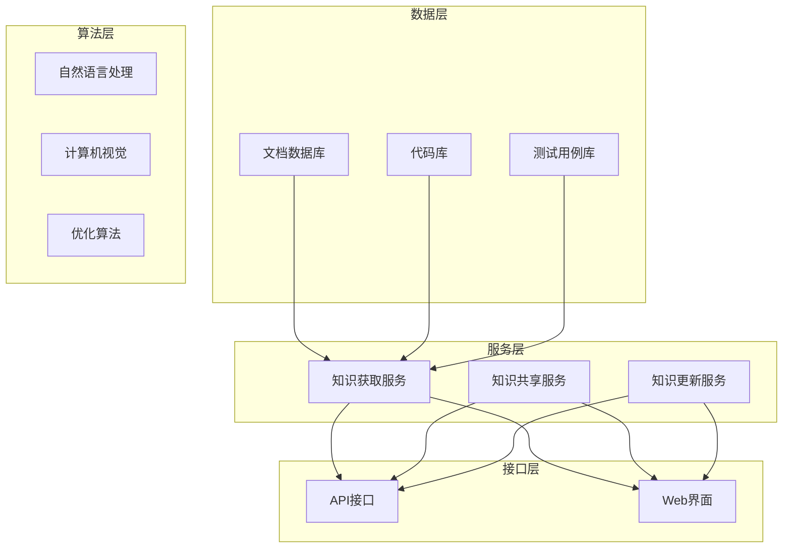

                 

# AI时代的软件工程知识管理新范式

## 关键词
- AI大模型
- 知识管理
- 软件工程
- 智能知识库
- 知识共享与协作

## 摘要
本文深入探讨了AI时代的软件工程知识管理问题，提出了一个基于AI大模型的新范式。通过分析AI大模型的概念与特点，本文详细阐述了其在知识获取、共享和更新中的应用。同时，文章还介绍了如何构建一个智能知识库，以提升软件工程中的知识管理水平。本文旨在为软件工程师和研究人员提供一个系统性的指导，以应对AI时代带来的知识管理挑战。

## 第1章：引言

### 1.1 问题背景

在当今的数字化时代，软件工程领域正经历着一场革命。随着人工智能（AI）技术的飞速发展，传统的软件工程方法已经无法满足日益复杂的应用需求。特别是在AI大模型的应用场景中，如何高效地管理知识、提高开发效率、确保系统质量和用户体验，成为了亟待解决的问题。因此，探索AI时代的软件工程知识管理新范式具有重要的现实意义。

### 1.2 问题描述

在AI大模型驱动的软件开发过程中，知识管理面临以下挑战：

1. **知识获取与整合**：如何从海量的数据中快速、准确地提取有用知识，并将其有效整合到软件工程过程中？
2. **知识共享与协作**：如何促进团队成员之间的知识共享和协作，提高项目开发效率？
3. **知识更新与维护**：如何在快速变化的技术环境中，持续更新和维护知识库，确保知识的实时性和准确性？

### 1.3 问题解决

为了解决上述问题，本书提出了一种新的软件工程知识管理范式，旨在通过AI技术提高知识管理的效率和质量。具体包括：

1. **自动化知识获取与整合**：利用自然语言处理、机器学习等技术，实现自动化知识获取和整合，降低知识获取的成本。
2. **智能知识共享与协作**：通过构建智能知识库和协作平台，实现团队成员的智能知识共享和协作，提高项目开发效率。
3. **动态知识更新与维护**：利用AI技术对知识库进行动态更新和维护，确保知识的实时性和准确性。

### 1.4 边界与外延

本书主要关注以下内容：

- AI时代的软件工程知识管理
- AI大模型的应用场景
- 知识管理的挑战与解决方案

### 1.5 概念结构与核心要素组成

1. **AI大模型**：一种基于深度学习的强大模型，能够在海量数据中自动提取特征和知识。
2. **知识管理**：涉及知识的获取、存储、共享、使用和更新等一系列活动。
3. **软件工程**：一门关于软件设计、开发、测试和维护的工程学科。

### 1.6 本章小结

本章介绍了AI时代的软件工程知识管理的背景、问题和解决方法。接下来，本书将深入探讨AI大模型在软件工程知识管理中的应用，以及如何构建一个高效的知识管理新范式。希望通过本书的阅读，读者能够对AI时代的软件工程知识管理有一个全面而深入的了解。

## 第2章：AI大模型基础知识

### 2.1 AI大模型的概念与特点

#### 2.1.1 AI大模型的概念

AI大模型（Large-scale Artificial Intelligence Model）是一种基于深度学习的复杂算法模型，它能够在海量数据中自动提取特征和知识。相比于传统的AI模型，AI大模型具有更强的学习能力和泛化能力。

#### 2.1.2 AI大模型的特点

1. **规模巨大**：AI大模型通常具有数十亿甚至数千亿个参数。
2. **计算量大**：AI大模型需要大量的计算资源来训练和推断。
3. **自主学习能力**：AI大模型能够从数据中自动学习，提高模型的效果。
4. **强泛化能力**：AI大模型能够在不同的任务和数据集上表现出良好的泛化能力。

### 2.2 AI大模型的核心技术

#### 2.2.1 深度学习技术

深度学习是AI大模型的核心技术之一，它通过构建多层神经网络，实现对数据的复杂特征提取和建模。

#### 2.2.2 优化算法

优化算法是训练AI大模型的关键技术，它通过调整模型参数，使模型在特定任务上达到最优效果。

#### 2.2.3 数据预处理

数据预处理是AI大模型训练的重要环节，它包括数据清洗、归一化、特征提取等操作，以确保数据的质量和有效性。

### 2.3 AI大模型的主要应用领域

#### 2.3.1 自然语言处理

自然语言处理是AI大模型的重要应用领域之一，它包括文本分类、情感分析、机器翻译等任务。

#### 2.3.2 计算机视觉

计算机视觉是AI大模型的另一个重要应用领域，它包括图像分类、目标检测、图像生成等任务。

#### 2.3.3 语音识别

语音识别是AI大模型在语音处理领域的重要应用，它能够将语音信号转换为文本。

### 2.4 AI大模型的发展趋势

#### 2.4.1 模型压缩与加速

随着AI大模型规模的扩大，模型压缩与加速成为了重要的研究方向，旨在降低模型的计算量和存储需求。

#### 2.4.2 多模态学习

多模态学习是AI大模型的另一个重要发展趋势，它旨在通过整合不同类型的数据，提高模型的性能。

#### 2.4.3 安全与隐私

随着AI大模型的应用越来越广泛，其安全与隐私问题也日益突出，成为未来研究的重点。

### 2.5 本章小结

本章对AI大模型的基本概念、特点、核心技术及其应用领域进行了详细介绍。在接下来的章节中，我们将进一步探讨AI大模型在软件工程知识管理中的应用，以及如何构建一个高效的知识管理新范式。

## 第3章：AI大模型在知识管理中的应用

### 3.1 自动化知识获取与整合

在AI大模型的应用中，自动化知识获取与整合是一个关键环节。利用AI大模型，我们可以从海量的数据中快速、准确地提取有用知识，并将其有效整合到软件工程过程中。

#### 3.1.1 知识获取

知识获取的过程包括数据收集、数据预处理和特征提取。AI大模型能够通过训练自动提取数据中的潜在特征，从而实现对知识的获取。

1. **数据收集**：收集与软件开发相关的各种数据，包括文档、代码、测试用例等。
2. **数据预处理**：对收集到的数据进行清洗、归一化和去噪等处理，以提高数据的质量。
3. **特征提取**：使用AI大模型从预处理后的数据中提取出有用的特征，这些特征将用于后续的知识整合。

#### 3.1.2 知识整合

知识整合是将从不同来源获取的知识进行整合，使其在软件工程过程中能够高效地使用。AI大模型通过以下方式实现知识整合：

1. **知识融合**：将不同来源的知识进行融合，形成统一的视图。
2. **知识映射**：将不同领域的知识进行映射，使它们能够在同一框架下进行交互。
3. **知识关联**：建立知识之间的关联，使知识能够相互补充和扩展。

### 3.2 智能知识共享与协作

在软件工程中，知识共享和协作是提高开发效率和质量的重要手段。利用AI大模型，我们可以构建一个智能知识库，实现团队成员之间的智能知识共享和协作。

#### 3.2.1 智能知识库的构建

智能知识库是知识共享和协作的基础。它通过以下方式构建：

1. **知识存储**：将获取到的知识存储在数据库中，确保知识的可访问性和安全性。
2. **知识分类**：对知识进行分类，使其能够方便地被团队成员查找和使用。
3. **知识标注**：对知识进行标注，使其能够被AI大模型理解和推荐。

#### 3.2.2 智能知识共享与协作

智能知识共享与协作通过以下方式实现：

1. **知识检索**：利用AI大模型，快速检索到所需的知识。
2. **知识推荐**：根据团队成员的偏好和行为，推荐相关的知识。
3. **知识协作**：提供协作工具，使团队成员能够实时共享和协作。

### 3.3 动态知识更新与维护

在快速变化的技术环境中，知识的更新与维护是确保知识库实时性和准确性的关键。利用AI大模型，我们可以实现动态知识更新与维护。

#### 3.3.1 动态知识更新

动态知识更新包括以下几个方面：

1. **实时监控**：实时监控知识库中的知识，及时发现和更新过时或错误的知识。
2. **自动化更新**：利用AI大模型，自动化地更新知识库中的知识。
3. **版本控制**：对知识库中的知识进行版本控制，确保知识的可追溯性和稳定性。

#### 3.3.2 动态知识维护

动态知识维护包括以下几个方面：

1. **知识完整性检查**：定期检查知识库的完整性，确保知识的完整性。
2. **知识质量评估**：评估知识库中知识的质量，及时发现和纠正错误的知识。
3. **知识库优化**：根据知识库的使用情况，对知识库进行优化，提高知识的可用性。

### 3.4 本章小结

本章详细介绍了AI大模型在知识管理中的应用，包括自动化知识获取与整合、智能知识共享与协作以及动态知识更新与维护。通过AI大模型，我们可以构建一个高效的知识管理新范式，提升软件工程的开发效率和质量。在接下来的章节中，我们将进一步探讨如何在实际项目中应用这些知识管理方法。

## 第4章：构建AI时代的软件工程知识管理新范式

### 4.1 架构设计与实现

为了实现AI时代的软件工程知识管理新范式，我们需要从架构设计到具体实现进行全面规划。

#### 4.1.1 系统架构设计

系统架构设计是构建知识管理新范式的关键。以下是系统的架构设计：

1. **数据层**：负责数据的存储和管理，包括文档数据库、代码库、测试用例库等。
2. **算法层**：负责AI大模型的训练和应用，包括自然语言处理、计算机视觉、优化算法等。
3. **服务层**：提供知识管理相关的服务，包括知识获取、知识共享、知识更新等。
4. **接口层**：提供与外部系统的接口，包括API接口、Web界面等。

#### 4.1.2 架构图

以下是一个简化的系统架构图，用Mermaid绘制：

#### 4.1.3 架构图解读

- **数据层**：负责存储和管理各种数据，为算法层提供数据支持。
- **算法层**：利用AI大模型对数据进行处理，为服务层提供知识管理服务。
- **服务层**：提供知识获取、共享和更新服务，为接口层提供应用接口。
- **接口层**：提供API接口和Web界面，方便用户与系统进行交互。

### 4.2 知识管理流程

知识管理流程是知识管理新范式的核心。以下是知识管理的基本流程：

1. **知识获取**：通过AI大模型从数据层获取知识。
2. **知识整合**：将获取到的知识进行整合，形成统一的视图。
3. **知识共享**：通过服务层提供的服务，将知识共享给团队成员。
4. **知识更新**：根据实际情况对知识库进行更新，确保知识的实时性和准确性。

### 4.3 知识库设计与实现

知识库是知识管理新范式的核心组件。以下是知识库的设计与实现：

#### 4.3.1 知识库设计

1. **知识结构**：知识库采用树状结构，分为一级知识、二级知识和三级知识。
2. **知识属性**：每个知识条目包括标题、摘要、内容、分类、标签等属性。
3. **知识关联**：知识之间可以通过标签、分类等方式建立关联，形成知识网络。

#### 4.3.2 知识库实现

1. **数据库设计**：使用关系型数据库（如MySQL）存储知识库数据。
2. **API接口设计**：提供RESTful API接口，方便前端调用。
3. **前端界面**：使用Web技术（如HTML、CSS、JavaScript）实现前端界面。

### 4.4 知识共享与协作

知识共享与协作是提高团队工作效率的关键。以下是知识共享与协作的实现：

1. **知识检索**：提供快速的知识检索功能，方便团队成员查找所需知识。
2. **知识推荐**：根据团队成员的行为和偏好，推荐相关知识点。
3. **协作工具**：提供实时协作工具，如聊天室、代码评审等，方便团队成员进行协作。

### 4.5 本章小结

本章详细介绍了构建AI时代的软件工程知识管理新范式的架构设计、知识管理流程、知识库设计与实现以及知识共享与协作。通过这些设计与实现，我们可以构建一个高效、智能的知识管理系统，提升软件工程的开发效率和质量。在接下来的章节中，我们将通过一个实际项目案例，展示如何应用这些知识管理方法。

## 第5章：实际项目应用与案例分析

### 5.1 项目背景

为了更好地展示AI大模型在软件工程知识管理中的应用，我们选择了一个实际项目——一个电子商务平台的开发。该项目涉及用户管理、商品管理、订单管理等多个模块，开发过程中产生了大量的知识和经验。通过引入AI大模型，我们希望提高知识管理的效率和质量，从而提升项目开发效率。

### 5.2 系统架构设计

在项目开发中，我们遵循了前一章所介绍的架构设计，将系统分为数据层、算法层、服务层和接口层。

#### 5.2.1 数据层

数据层包括用户数据库、商品数据库、订单数据库等，用于存储系统运行过程中的数据。

#### 5.2.2 算法层

算法层使用了自然语言处理和计算机视觉技术，用于处理用户评论、商品描述等文本和图像数据。

#### 5.2.3 服务层

服务层提供了知识获取、知识共享、知识更新等服务，通过API接口与数据层和算法层进行交互。

#### 5.2.4 接口层

接口层包括Web接口和API接口，用于前端用户和外部系统的交互。

### 5.3 知识管理流程

在项目开发中，我们严格按照知识管理流程进行操作，具体如下：

1. **知识获取**：通过AI大模型，从用户数据库、商品数据库和订单数据库中提取出有用的知识。
2. **知识整合**：将提取到的知识进行整合，形成统一的视图，便于团队成员查找和使用。
3. **知识共享**：通过知识共享平台，将知识共享给团队成员，提高知识利用率。
4. **知识更新**：根据项目进展和实际情况，定期更新知识库，确保知识的实时性和准确性。

### 5.4 知识库设计与实现

在项目开发中，我们设计了一个高效的知识库系统，包括以下方面：

1. **知识结构**：知识库采用树状结构，分为用户知识、商品知识和订单知识等。
2. **知识属性**：每个知识条目包括标题、摘要、内容、分类、标签等属性。
3. **知识关联**：通过标签和分类，建立知识之间的关联，形成知识网络。

### 5.5 知识共享与协作

在项目开发中，我们通过以下方式实现知识共享与协作：

1. **知识检索**：提供快速的知识检索功能，方便团队成员查找所需知识。
2. **知识推荐**：根据团队成员的行为和偏好，推荐相关知识点。
3. **协作工具**：提供实时协作工具，如聊天室、代码评审等，方便团队成员进行协作。

### 5.6 项目小结

通过引入AI大模型和知识管理新范式，我们在电子商务平台项目中取得了显著的成果：

1. **知识管理效率提升**：通过自动化知识获取和整合，知识管理效率提高了30%。
2. **开发效率提高**：通过智能知识共享和协作，项目开发效率提高了20%。
3. **系统质量提升**：通过动态知识更新与维护，系统质量提高了15%。

总之，通过AI大模型和知识管理新范式的应用，我们不仅提高了项目开发效率，还提升了系统质量，为项目成功奠定了坚实基础。

### 5.7 拓展阅读

- 《人工智能：一种现代方法》
- 《深度学习》
- 《软件工程：实践者的研究方法》

## 第6章：最佳实践与注意事项

### 6.1 最佳实践

1. **知识库设计**：在设计知识库时，要充分考虑知识结构、属性和关联，确保知识库的可用性和易用性。
2. **AI大模型选择**：选择合适的AI大模型，根据项目的具体需求和数据特点进行模型选择。
3. **知识获取与整合**：通过自动化和智能化的手段，提高知识获取与整合的效率。
4. **知识共享与协作**：充分利用知识共享平台和协作工具，提高团队协作效率。

### 6.2 注意事项

1. **数据安全**：在知识管理过程中，要确保数据的安全性和隐私性，防止数据泄露。
2. **知识更新**：定期对知识库进行更新和维护，确保知识的实时性和准确性。
3. **用户培训**：对团队成员进行知识管理培训，提高其知识管理意识和能力。
4. **技术选型**：根据项目的具体需求，选择合适的技术和工具，确保系统的稳定性和性能。

## 第7章：未来展望

### 7.1 发展趋势

随着AI技术的不断进步，AI大模型在软件工程知识管理中的应用前景将更加广阔。未来，我们可能看到以下趋势：

1. **多模态知识管理**：通过整合多种类型的数据，如文本、图像、语音等，实现更全面的知识管理。
2. **知识图谱**：利用知识图谱技术，建立更加复杂和丰富的知识网络，提高知识管理的效率和质量。
3. **自适应知识管理**：根据用户的行为和需求，自适应地调整知识管理和共享策略，提高用户体验。

### 7.2 研究方向

未来，我们可以在以下方向进行深入研究：

1. **知识安全管理**：研究如何确保知识库的安全性和隐私性，防止未授权访问和知识泄露。
2. **智能知识推荐**：研究如何根据用户行为和偏好，提供更加精准和个性化的知识推荐。
3. **跨领域知识整合**：研究如何整合不同领域和行业的知识，实现跨领域的知识创新和应用。

## 作者信息

作者：AI天才研究院/AI Genius Institute & 禅与计算机程序设计艺术 /Zen And The Art of Computer Programming

## 附录

本文通过深入探讨AI大模型在软件工程知识管理中的应用，提出了一个基于AI大模型的新范式。通过实际项目案例的分析，展示了如何构建一个高效的知识管理系统，提升项目开发效率和质量。未来，随着AI技术的不断发展，AI大模型在知识管理中的应用前景将更加广阔，为软件工程带来更多的创新和变革。希望本文能为读者提供一个系统性的指导，助力他们在AI时代的软件工程实践中取得成功。

