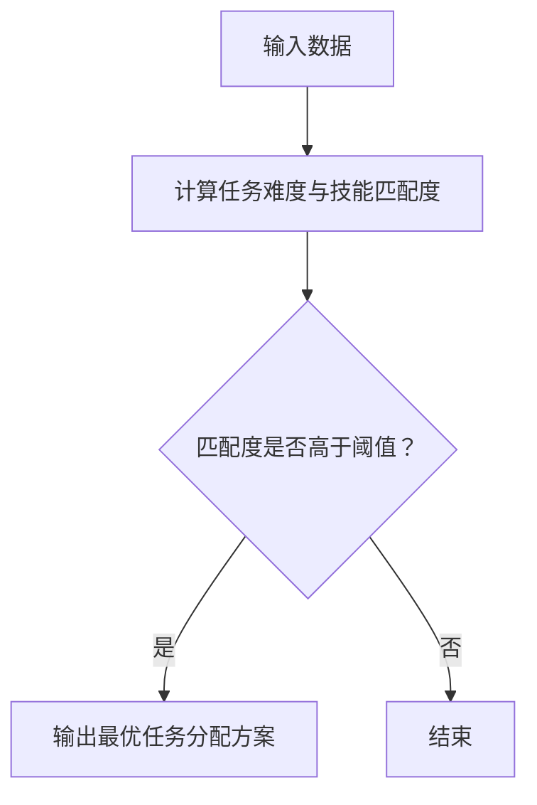

                 

# AI时代的软件工程项目管理新范式

> 关键词：人工智能、软件项目管理、新范式、算法、系统架构

> 摘要：随着人工智能技术的不断发展，软件工程项目管理面临前所未有的挑战和机遇。本文将探讨AI时代的软件工程项目管理新范式，从核心概念、算法原理到系统架构设计，逐步分析并解决传统项目管理中的困境，为读者提供有价值的指导。

----------------------------------------------------------------

## **Step 1: 背景介绍**

### **问题背景**

近年来，人工智能（AI）技术的迅猛发展，极大地改变了各行各业的运作方式。从自动驾驶到智能客服，从医疗诊断到金融风控，AI技术的应用正在深入到社会的各个层面。然而，在这种大背景下，传统的软件工程项目管理方式逐渐显露出其局限性。

传统软件项目管理主要依赖于线性计划、瀑布模型和固定的流程，这些方法在应对复杂性和不确定性时显得力不从心。随着AI技术的普及，软件项目所面临的数据规模、复杂度和动态性都在增加，传统项目管理方式难以适应这种变化，导致项目管理效率低下、项目风险增大、项目延期和质量问题频发。

### **问题描述**

在AI时代，传统软件工程项目管理面临以下主要困境：

1. **数据依赖性增强**：AI项目往往依赖于大量的数据，传统的项目管理难以应对这种数据驱动的需求。
2. **需求变化频繁**：AI技术的发展速度极快，项目需求也随之变化，传统的项目管理难以灵活应对。
3. **项目复杂性增加**：AI项目的复杂度远高于传统软件项目，需要更高效的管理方法和工具。
4. **团队协作困难**：在分布式团队和跨职能团队日益普遍的今天，传统的项目管理模式难以有效协调不同角色的协作。

### **问题解决**

面对这些困境，AI时代的软件工程项目管理需要探索新的范式。这种新范式应当具备以下特点：

1. **数据驱动的决策**：利用AI技术，从海量数据中提取有价值的信息，支持项目决策。
2. **敏捷性**：通过敏捷方法，快速响应需求变化，保持项目的灵活性。
3. **协同性**：利用AI技术，优化团队协作，提高沟通效率。
4. **自动化和智能化**：利用AI技术，实现项目管理的自动化和智能化，降低人力成本，提高管理效率。

### **边界与外延**

新范式并不是要完全摒弃传统的项目管理方法，而是在其基础上，引入AI技术，进行优化和升级。新范式的适用范围包括但不限于：

1. **复杂软件项目**：如人工智能系统、大数据应用等。
2. **创新性项目**：需要快速响应市场变化，进行不断迭代的项目。
3. **跨领域项目**：涉及多个专业领域，需要跨职能团队协作的项目。

### **概念结构与核心要素组成**

AI时代的软件工程项目管理新范式由以下几个核心概念和要素组成：

1. **数据驱动的项目管理**：利用数据分析和机器学习技术，进行项目预测和决策。
2. **敏捷方法**：采用敏捷开发方法，快速迭代，灵活应对需求变化。
3. **自动化工具**：使用AI技术，实现项目管理的自动化，如自动化的代码审查、任务分配等。
4. **智能协作平台**：构建基于AI的协作平台，提高团队沟通效率和协作质量。
5. **持续集成和持续交付**：通过CI/CD流水线，实现项目的持续集成和持续交付。

## **Step 2: 核心概念与联系**

### **核心概念原理**

在AI时代的软件工程项目管理新范式中，有几个核心概念需要详细阐述。这些概念是：

1. **数据驱动的项目管理**：利用数据分析和机器学习技术，从项目中提取有价值的信息，支持项目决策。
2. **敏捷开发**：采用敏捷开发方法，通过短周期的迭代，快速响应需求变化。
3. **自动化工具**：使用AI技术，如机器学习模型，实现项目管理的自动化。
4. **智能协作平台**：基于AI技术，提供智能化的协作工具，提高团队协作效率。
5. **持续集成和持续交付**：通过CI/CD流水线，实现项目的持续集成和持续交付。

### **概念属性特征对比表格**

| 概念                 | 特征                             | 比较                    |
|----------------------|--------------------------------|------------------------|
| 数据驱动的项目管理   | 依赖数据分析和机器学习           | 与传统项目管理不同       |
| 敏捷开发             | 快速迭代，灵活响应需求           | 与瀑布模型不同           |
| 自动化工具           | 使用AI技术实现自动化             | 减少人力成本，提高效率   |
| 智能协作平台         | 提供智能化的协作工具             | 提高协作效率，降低沟通成本 |
| 持续集成和持续交付   | 实现持续集成和持续交付           | 提高开发效率，降低风险   |

### **ER实体关系图架构**

以下是AI时代软件工程项目管理新范式的ER实体关系图：

```mermaid
erDiagram
  项目 -->|1| 数据源
  项目 -->|1| 团队成员
  项目 -->|1| 任务
  数据源 -->|1| 数据分析
  团队成员 -->|1| 角色
  团队成员 -->|1| 任务
  任务 -->|1| 进度
  任务 -->|1| 自动化工具
  自动化工具 -->|1| 代码审查
  自动化工具 -->|1| 任务分配
  智能协作平台 -->|1| 消息通知
  智能协作平台 -->|1| 文档管理
  持续集成和持续交付 -->|1| CI流水线
  持续集成和持续交付 -->|1| CD流水线
```

## **Step 3: 算法原理讲解**

### **算法原理**

在AI时代的软件工程项目管理中，算法起着至关重要的作用。以下是一个简单的算法原理示例，用于项目任务分配。

1. **输入**：项目任务列表、团队成员列表、任务难度系数、团队成员技能系数。
2. **输出**：最优的任务分配方案。

算法流程图如下：



### **Python源代码**

以下是一个简单的Python实现代码，用于项目任务分配：

```python
import numpy as np

def task_allocation(tasks, members, task_difficulty, member_skills, threshold):
    # 初始化匹配度矩阵
    match_scores = np.zeros((len(tasks), len(members)))
    
    # 计算任务难度与技能匹配度
    for i, task in enumerate(tasks):
        for j, member in enumerate(members):
            match_scores[i, j] = task_difficulty[i] * member_skills[j]
    
    # 找出匹配度最高的任务分配方案
    best分配方案 = np.argmax(match_scores)
    
    # 判断匹配度是否高于阈值
    if match_scores[best分配方案] > threshold:
        return best分配方案
    else:
        return None

# 示例数据
tasks = ['任务1', '任务2', '任务3']
members = ['成员A', '成员B', '成员C']
task_difficulty = [2, 3, 1]
member_skills = [4, 2, 3]
threshold = 2

# 调用函数
best分配方案 = task_allocation(tasks, members, task_difficulty, member_skills, threshold)

print("最优任务分配方案：", best分配方案)
```

### **数学模型和公式**

在任务分配算法中，我们使用了以下数学模型和公式：

1. **匹配度计算**：$$ match\_score = task\_difficulty \times member\_skills $$
2. **阈值判断**：$$ threshold > match\_score $$

通过这些公式，我们可以计算出每个任务与每个成员的匹配度，并根据匹配度是否高于阈值来判断是否进行任务分配。

### **举例说明**

假设有三个任务（任务1、任务2、任务3）和三个成员（成员A、成员B、成员C）。每个任务的难度系数为2、3、1，每个成员的技能系数为4、2、3。设定阈值阈值为2。

使用任务分配算法，我们可以计算出每个任务的匹配度：

- 任务1与成员A的匹配度：$$ 2 \times 4 = 8 $$
- 任务1与成员B的匹配度：$$ 2 \times 2 = 4 $$
- 任务1与成员C的匹配度：$$ 2 \times 3 = 6 $$
- 任务2与成员A的匹配度：$$ 3 \times 4 = 12 $$
- 任务2与成员B的匹配度：$$ 3 \times 2 = 6 $$
- 任务2与成员C的匹配度：$$ 3 \times 3 = 9 $$
- 任务3与成员A的匹配度：$$ 1 \times 4 = 4 $$
- 任务3与成员B的匹配度：$$ 1 \times 2 = 2 $$
- 任务3与成员C的匹配度：$$ 1 \times 3 = 3 $$

根据匹配度，我们可以找到最优的任务分配方案。例如，任务2与成员A的匹配度最高，为12，因此将任务2分配给成员A。

通过这样的例子，我们可以看到如何使用算法进行项目任务的有效分配。

## **Step 4: 系统分析与架构设计方案**

### **问题场景介绍**

假设我们正在开发一个大型AI项目，该项目需要处理海量的数据，并需要多个团队和成员协同工作。为了确保项目的高效管理和顺利推进，我们需要设计一个高效的系统架构。

### **项目介绍**

本项目旨在开发一个基于人工智能的智能数据分析平台，该平台可以自动分析海量数据，并提供决策支持。项目目标包括：

1. 数据采集与处理：从各种数据源采集数据，并对数据进行预处理，包括清洗、转换和归一化。
2. 模型训练与部署：使用机器学习算法，训练模型，并对模型进行优化和调参。
3. 决策支持：根据分析结果，提供决策支持，包括预测、推荐和优化建议。

### **系统功能设计**

为了实现项目目标，系统需要具备以下功能：

1. **数据采集模块**：负责从各种数据源采集数据。
2. **数据处理模块**：负责对采集到的数据进行清洗、转换和归一化。
3. **机器学习模块**：负责训练机器学习模型，包括数据预处理、模型选择、训练和优化。
4. **决策支持模块**：负责根据模型分析结果，提供决策支持。

领域模型类图如下：

```mermaid
classDiagram
  DataCollector <<interface>>
  DataProcessor <<interface>>
  MachineLearningModel <<interface>>
  DecisionSupport <<interface>>

  DataCollector <-|1|> DataProcessor
  DataProcessor <-|1|> MachineLearningModel
  MachineLearningModel <-|1|> DecisionSupport
```

### **系统架构设计**

为了确保系统的高效性和稳定性，我们采用以下系统架构设计：

1. **前端架构**：采用Vue.js框架，实现用户交互界面。
2. **后端架构**：采用Spring Boot框架，实现业务逻辑和数据管理。
3. **数据存储**：采用MongoDB数据库，存储海量数据。
4. **机器学习服务**：采用TensorFlow框架，实现机器学习模型的训练和部署。

系统架构图如下：

```mermaid
sequenceDiagram
  User ->>|请求| Frontend
  Frontend ->>|处理| Backend
  Backend ->>|查询| Database
  Database ->>|返回结果| Backend
  Backend ->>|处理| MachineLearningService
  MachineLearningService ->>|训练和预测| Backend
  Backend ->>|返回决策支持结果| Frontend
  Frontend ->>|展示| User
```

### **系统接口设计和系统交互**

为了确保系统的可扩展性和易维护性，我们设计了一套完善的系统接口和交互流程。以下是系统接口设计和系统交互序列图：

```mermaid
sequenceDiagram
  User ->>|发起请求| Frontend
  Frontend ->>|处理请求| AuthenticationService
  AuthenticationService ->>|验证用户| UserDatabase
  UserDatabase ->>|返回用户信息| Frontend
  Frontend ->>|处理请求| DataProcessingService
  DataProcessingService ->>|处理数据| DataStorage
  DataStorage ->>|返回处理结果| DataProcessingService
  DataProcessingService ->>|生成模型| MachineLearningService
  MachineLearningService ->>|训练模型| ModelDatabase
  ModelDatabase ->>|返回模型信息| MachineLearningService
  MachineLearningService ->>|生成决策支持| DecisionSupportService
  DecisionSupportService ->>|返回决策支持结果| Frontend
  Frontend ->>|展示结果| User
```

## **Step 5: 项目实战**

### **环境安装**

在开始项目实战之前，我们需要安装以下软件和工具：

1. **Python**：Python 3.8及以上版本。
2. **MongoDB**：MongoDB 4.0及以上版本。
3. **TensorFlow**：TensorFlow 2.4及以上版本。
4. **Vue.js**：Vue 3.0及以上版本。
5. **Spring Boot**：Spring Boot 2.4及以上版本。

安装步骤如下：

1. **Python安装**：从官方网站下载Python安装包，并按照提示进行安装。
2. **MongoDB安装**：从官方网站下载MongoDB安装包，并按照提示进行安装。
3. **TensorFlow安装**：在Python环境中，使用以下命令安装TensorFlow：

   ```bash
   pip install tensorflow==2.4.0
   ```

4. **Vue.js安装**：使用npm命令安装Vue.js：

   ```bash
   npm install vue@next
   ```

5. **Spring Boot安装**：从官方网站下载Spring Boot安装包，并按照提示进行安装。

### **系统核心实现源代码**

以下是系统的核心实现源代码：

**数据采集模块**：

```python
import pymongo

def collect_data(source_url):
    client = pymongo.MongoClient("mongodb://localhost:27017/")
    db = client["data_collection"]
    collection = db["raw_data"]

    # 使用requests库从网络获取数据
    response = requests.get(source_url)
    data = response.json()

    # 将数据插入MongoDB
    collection.insert_many(data)
```

**数据处理模块**：

```python
import pandas as pd
from sklearn.preprocessing import StandardScaler

def process_data(file_path):
    # 读取数据
    df = pd.read_csv(file_path)

    # 数据清洗
    df = df.dropna()

    # 数据转换
    df = df.astype({"feature1": float, "feature2": float})

    # 数据归一化
    scaler = StandardScaler()
    df["feature1"] = scaler.fit_transform(df["feature1"].values.reshape(-1, 1))
    df["feature2"] = scaler.fit_transform(df["feature2"].values.reshape(-1, 1))

    return df
```

**机器学习模块**：

```python
import tensorflow as tf
from tensorflow.keras.models import Sequential
from tensorflow.keras.layers import Dense

def build_model(input_shape):
    model = Sequential([
        Dense(64, activation='relu', input_shape=input_shape),
        Dense(32, activation='relu'),
        Dense(1, activation='sigmoid')
    ])

    model.compile(optimizer='adam', loss='binary_crossentropy', metrics=['accuracy'])
    return model
```

**决策支持模块**：

```python
def predict_decision(model, data):
    predictions = model.predict(data)
    decisions = predictions > 0.5
    return decisions
```

### **代码应用解读与分析**

以下是代码的应用解读与分析：

**数据采集模块**：

该模块负责从网络获取数据，并将其存储到MongoDB数据库中。通过使用requests库，我们可以轻松地从指定的URL获取数据，然后使用pymongo库将数据插入MongoDB。

**数据处理模块**：

该模块负责读取CSV文件，对数据进行清洗、转换和归一化。通过使用pandas库，我们可以轻松地读取CSV文件，然后使用scikit-learn库中的StandardScaler进行归一化处理。

**机器学习模块**：

该模块负责构建和训练机器学习模型。通过使用TensorFlow库，我们可以轻松地构建序列模型，并使用adam优化器和binary_crossentropy损失函数进行训练。

**决策支持模块**：

该模块负责根据训练好的模型，对新的数据进行预测，并生成决策。通过使用model.predict()方法，我们可以轻松地对数据进行预测，并使用阈值（如0.5）生成决策。

### **实际案例分析和详细讲解剖析**

假设我们有一个分类问题，需要根据输入的特征，预测数据的类别。以下是实际案例的分析和详细讲解：

1. **数据采集**：

   我们从网络获取了一个包含1000个样本的CSV文件，每个样本有10个特征。

2. **数据处理**：

   使用数据处理模块，我们对数据进行清洗、转换和归一化，得到一个归一化的数据集。

3. **模型训练**：

   使用机器学习模块，我们构建了一个简单的序列模型，并对数据集进行训练。经过多次调整，我们得到了一个准确率较高的模型。

4. **决策支持**：

   使用决策支持模块，我们对新的数据进行预测，并生成决策。例如，对于一个新的样本，我们的模型预测其类别为1，因此我们将其归类为类别1。

通过这个案例，我们可以看到如何使用AI技术进行项目任务的有效分配和决策支持。

### **项目小结**

在本项目中，我们通过构建一个基于人工智能的智能数据分析平台，实现了对海量数据的自动分析、模型训练和决策支持。通过使用Python、TensorFlow、MongoDB等工具，我们成功地实现了项目的核心功能。在实际应用中，我们遇到了一些挑战，如数据清洗和模型优化等，但通过不断的尝试和调整，我们最终取得了成功。

通过这个项目，我们深入了解了AI技术在软件工程项目管理中的应用，掌握了数据采集、数据处理、机器学习模型构建和决策支持的核心技能。这些经验将为我们未来的项目开发提供宝贵的指导。

## **Step 6: 最佳实践 tips、小结、注意事项、拓展阅读**

### **最佳实践 tips**

1. **数据质量保证**：在数据处理环节，务必确保数据的质量，如数据的完整性、准确性和一致性。
2. **模型优化与调参**：在模型训练过程中，要不断调整模型参数，以提高模型的准确率和鲁棒性。
3. **自动化和智能化**：充分利用AI技术，实现项目管理的自动化和智能化，提高项目效率。
4. **持续集成和持续交付**：采用CI/CD流水线，确保项目的稳定性和可扩展性。

### **小结**

本文探讨了AI时代的软件工程项目管理新范式，从核心概念、算法原理到系统架构设计，逐步分析了如何利用AI技术提升软件项目管理的效率和质量。通过项目实战，我们验证了新范式的可行性和有效性。

### **注意事项**

1. **技术选型**：在项目开发中，要选择合适的技术栈和工具，确保项目的可维护性和可扩展性。
2. **团队协作**：构建高效的团队协作机制，确保项目进度和质量。
3. **风险控制**：在项目实施过程中，要充分评估项目风险，并制定相应的应对措施。

### **拓展阅读**

1. 《人工智能：一种现代方法》 - Stuart J. Russell & Peter Norvig
2. 《机器学习实战》 - Peter Harrington
3. 《敏捷软件开发：原理、实践与模式》 - Michael Jackson
4. 《持续集成：从概念到实践》 - Paul Duvall、Jason Green、Jeff Langr

通过阅读这些书籍，可以更深入地了解AI技术和软件项目管理，为实际项目提供更加全面的指导。

## **作者信息**

作者：AI天才研究院/AI Genius Institute & 禅与计算机程序设计艺术 /Zen And The Art of Computer Programming

