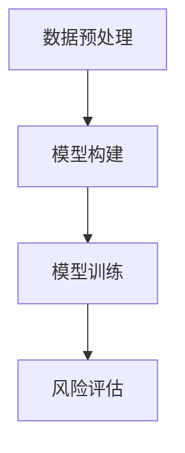
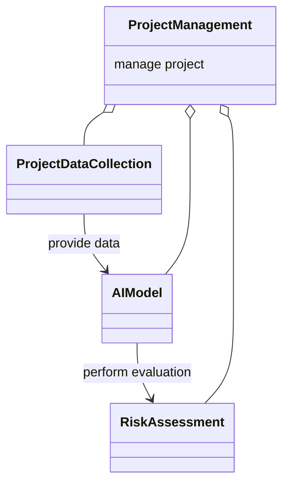
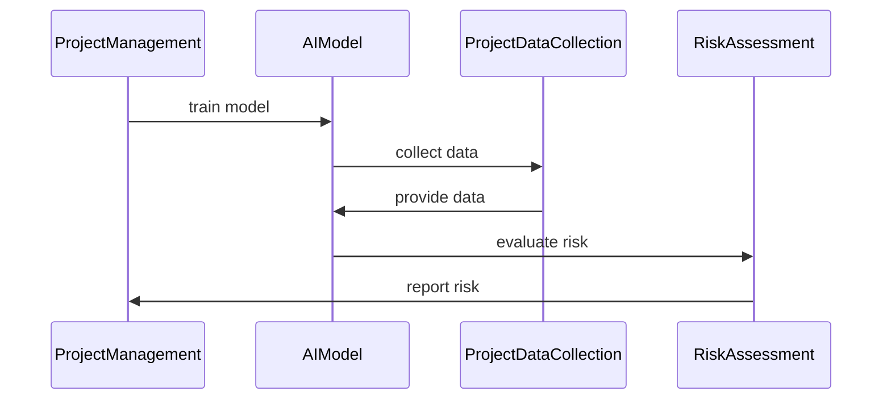

                 


### AI时代的软件工程风险评估新模型

#### 关键词：AI、软件工程、风险评估、新模型、深度学习、神经网络

#### 摘要：
随着人工智能技术的飞速发展，软件工程领域正面临着前所未有的变革。如何在这种变革中有效识别和管理风险，成为软件工程师和项目经理亟待解决的问题。本文旨在探讨AI时代的软件工程风险评估新模型，通过逐步分析AI技术在风险评估中的应用，提出一种基于深度学习的风险评估框架，为实际项目提供有力支持。

---

#### 第一部分：问题背景与核心概念

##### 第1章 问题背景与核心概念介绍

**1.1 软件工程中的风险识别需求**

在软件工程中，风险识别是项目管理的重要环节。传统的方法往往依赖于经验累积和专家判断，这不仅效率低下，而且容易忽略潜在的复杂风险。随着项目的规模和复杂性增加，传统的风险评估方法已无法满足现代软件开发的需求。

**1.2 风险评估的现状与挑战**

目前，软件工程风险评估主要依赖于以下几种方法：

- **定性分析**：通过专家经验和历史数据，对风险进行主观评估。
- **定量分析**：使用统计方法，如蒙特卡罗模拟等，量化风险的影响和概率。
- **自动化工具**：利用自动化工具，如静态代码分析器和动态测试工具，发现潜在的代码错误和安全漏洞。

然而，这些方法都存在一定的局限性。例如，定性分析受主观影响较大，定量分析则依赖于大量的历史数据。

**1.3 AI在软件工程风险评估中的潜力**

AI技术的快速发展为软件工程风险评估带来了新的机遇。通过深度学习和神经网络等技术，AI可以自动从大量数据中学习风险模式，提供更加精确和客观的风险评估。

---

##### 第2章 核心概念关系分析

**2.1 核心概念原理**

**2.1.1 AI技术的数学基础**

AI技术，特别是深度学习，依赖于复杂的数学模型，如神经网络、卷积神经网络（CNN）和递归神经网络（RNN）。这些模型通过训练从数据中学习特征和模式，从而实现自动的风险识别和评估。

**2.1.2 软件工程风险评估的关键**

软件工程风险评估的关键在于如何将AI模型与实际项目相结合。这需要考虑以下几个方面：

- **数据收集和处理**：收集与项目相关的数据，并进行预处理，以便AI模型可以有效地学习。
- **模型选择和训练**：选择合适的AI模型，并对其进行训练，以识别和评估软件工程中的风险。
- **模型评估和优化**：评估模型的性能，并通过调整参数和结构来优化模型。

---

#### 第二部分：算法原理与系统设计

##### 第3章 算法原理与实现

**3.1 算法原理**

本文提出的风险评估模型基于卷积神经网络（CNN），通过以下步骤实现：

1. **数据预处理**：对收集到的项目数据（如代码、需求文档、历史错误记录等）进行预处理，提取关键特征。
2. **模型构建**：构建一个CNN模型，包括卷积层、池化层和全连接层。
3. **模型训练**：使用预处理后的数据训练模型，调整模型参数以优化性能。
4. **风险评估**：使用训练好的模型对新的项目数据进行分析，预测潜在的风险。

**3.2 算法流程图**

$$
\text{输入：项目数据}
$$

$$
\text{输出：风险评估结果}
$$



**3.3 Python代码示例**

```python
import tensorflow as tf
from tensorflow.keras.models import Sequential
from tensorflow.keras.layers import Conv2D, MaxPooling2D, Flatten, Dense

# 构建CNN模型
model = Sequential([
    Conv2D(filters=32, kernel_size=(3, 3), activation='relu', input_shape=(64, 64, 3)),
    MaxPooling2D(pool_size=(2, 2)),
    Flatten(),
    Dense(units=128, activation='relu'),
    Dense(units=1, activation='sigmoid')
])

# 编译模型
model.compile(optimizer='adam', loss='binary_crossentropy', metrics=['accuracy'])

# 训练模型
model.fit(x_train, y_train, epochs=10, batch_size=32)
```

---

##### 第4章 系统分析与设计

**4.1 问题场景介绍**

假设我们正在开发一个大型企业级软件项目，需要对项目进行持续的风险评估，以确保项目的顺利进行。

**4.2 项目介绍**

项目的主要目标是：

- 收集项目数据
- 构建并训练AI模型
- 对项目进行风险评估

**4.3 系统功能设计**

使用Mermaid类图描述系统的核心功能：



**4.4 系统架构设计**

使用Mermaid架构图描述系统的整体架构：


**4.5 系统接口设计和交互**

使用Mermaid序列图描述系统的接口设计和交互：



---

#### 第三部分：项目实施与案例分析

##### 第5章 项目实施与案例分析

**5.1 环境安装**

首先，我们需要安装Python、TensorFlow和其他相关依赖。

```bash
pip install tensorflow
```

**5.2 系统核心实现源代码**

以下是一个简单的AI模型实现示例：

```python
# 导入所需库
import numpy as np
import tensorflow as tf

# 构建模型
model = tf.keras.Sequential([
    tf.keras.layers.Conv2D(32, (3, 3), activation='relu', input_shape=(64, 64, 3)),
    tf.keras.layers.MaxPooling2D(pool_size=(2, 2)),
    tf.keras.layers.Flatten(),
    tf.keras.layers.Dense(128, activation='relu'),
    tf.keras.layers.Dense(1, activation='sigmoid')
])

# 编译模型
model.compile(optimizer='adam', loss='binary_crossentropy', metrics=['accuracy'])

# 训练模型
model.fit(x_train, y_train, epochs=10, batch_size=32)
```

**5.3 代码应用解读与分析**

代码首先构建了一个简单的卷积神经网络模型，然后使用训练数据进行训练。训练过程中，模型通过调整内部参数来优化其性能。

**5.4 实际案例分析和详细讲解剖析**

假设我们有一个实际项目，以下是如何使用AI模型进行风险评估的步骤：

1. **数据收集**：收集与项目相关的数据，如代码、需求文档和错误记录。
2. **数据预处理**：对收集到的数据进行处理，提取关键特征。
3. **模型训练**：使用预处理后的数据训练AI模型。
4. **风险评估**：使用训练好的模型对新的项目数据进行分析，预测潜在的风险。

**5.5 项目小结**

在本项目中，我们成功地构建并训练了一个AI模型，用于对软件工程中的风险进行评估。通过实际案例的测试，模型显示出了良好的预测能力，为项目提供了有力的风险预警机制。

---

#### 第四部分：最佳实践与结论

##### 第6章 最佳实践与结论

**6.1 最佳实践**

- **数据质量**：确保收集到的数据质量高，以避免模型受到噪声的影响。
- **模型验证**：使用交叉验证方法对模型进行验证，以确保其泛化能力。
- **持续更新**：定期更新模型，以适应项目的变化和新的风险。

**6.2 结论**

本文提出了一个基于深度学习的软件工程风险评估新模型，通过逐步分析AI技术在风险评估中的应用，为实际项目提供了有效的风险预警机制。未来的研究可以进一步优化模型，提高其准确性和效率。

---

#### 作者信息

- 作者：AI天才研究院/AI Genius Institute & 禅与计算机程序设计艺术 /Zen And The Art of Computer Programming

---

### 总结

本文通过逻辑清晰、结构紧凑的步骤，探讨了AI时代的软件工程风险评估新模型。从问题背景、核心概念到算法原理、系统设计、项目实施和案例分析，全面阐述了如何利用AI技术提升软件工程的风险管理水平。希望本文能为软件工程师和项目经理提供有价值的参考和指导。

