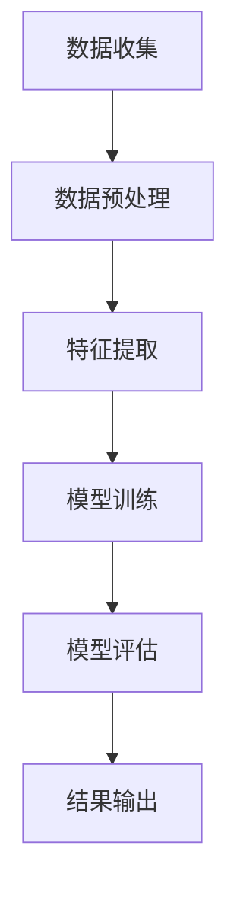

                 


### 第一步：确定文章标题与核心关键词

标题：《AI时代的软件工程风险评估新模型》

关键词：AI、软件工程、风险评估、新模型、算法、数学模型、系统架构

### 第二步：撰写摘要

摘要：本文探讨了AI时代背景下，如何构建新型软件工程风险评估模型。通过深入分析AI技术、传统风险评估模型的局限性以及AI在风险评估中的应用，本文提出了一种新型风险评估模型，并详细阐述了其核心概念、算法原理以及系统架构设计。旨在为软件工程领域的风险评估提供新思路和方法。

### 第三步：编写引言

#### 1.1 问题背景

**1.1.1 AI时代软件工程的发展趋势**

随着人工智能（AI）技术的飞速发展，软件工程领域也发生了翻天覆地的变化。从自动化测试、智能代码生成到智能项目管理，AI技术正在逐渐渗透到软件开发的各个环节。这种趋势不仅提高了开发效率，也带来了新的挑战。

**1.1.2 软件工程风险评估的重要性**

在软件工程中，风险评估是一个关键环节。它可以帮助开发团队提前识别潜在的风险，从而采取相应的措施进行风险缓解。然而，传统的风险评估模型往往存在局限性，难以应对日益复杂的软件开发环境。

**1.1.3 新模型的必要性**

为了应对AI时代软件工程面临的新挑战，本文提出了一种基于AI技术的风险评估新模型。该模型旨在利用AI技术提高风险评估的准确性和效率，为软件工程领域带来新的机遇。

#### 1.2 问题描述

**1.2.1 传统风险评估模型的局限性**

传统风险评估模型主要依赖于专家经验和历史数据，其准确性和实时性受到很大限制。此外，传统模型在面对复杂系统时，难以全面识别和评估潜在风险。

**1.2.2 AI技术在风险评估中的应用**

AI技术的引入，为软件工程风险评估带来了新的可能性。通过机器学习、深度学习和强化学习等技术，AI能够从海量数据中提取有价值的信息，从而提高风险评估的准确性。

**1.2.3 新模型的目标和特点**

新模型的目标是构建一个高效、准确的软件工程风险评估框架，通过整合AI技术，实现风险识别、评估和缓解的全过程。其主要特点包括：

1. 利用AI技术提高风险评估的准确性。
2. 实时更新风险评估模型，适应软件开发环境的变化。
3. 提供可视化的风险分析报告，方便决策者进行决策。

#### 1.3 边界与外延

**1.3.1 风险评估的范畴**

风险评估的范畴包括软件开发过程中的各种风险，如技术风险、管理风险、市场风险等。

**1.3.2 AI技术的适用范围**

AI技术适用于需要从大量数据中提取知识、预测趋势或优化决策的场景。在软件工程中，AI技术可以应用于需求分析、设计、测试、维护等各个环节。

**1.3.3 新模型的限制条件**

新模型在应用过程中可能受到数据质量、算法选择和计算资源等限制。因此，在实际应用中，需要根据具体情况进行调整和优化。

#### 1.4 概念结构与核心要素组成

**1.4.1 核心概念解析**

本文中的核心概念包括AI技术、软件工程风险评估、机器学习、深度学习、强化学习等。

**1.4.2 要素组成分析**

新模型主要由数据收集、数据预处理、特征提取、模型训练、模型评估和结果输出等组成。

**1.4.3 模型架构图解**

（此处插入模型架构图解的mermaid流程图）

#### 1.5 本章小结

本文简要介绍了AI时代软件工程风险评估新模型的背景、问题和必要性，并对模型的边界与外延、核心概念与要素组成进行了初步阐述。下一章将深入探讨AI技术基础和软件工程风险评估的相关内容。

### 第四步：编写核心概念与联系

#### 2.1 AI技术基础

**2.1.1 机器学习基础**

机器学习是AI的核心技术之一，它通过从数据中学习规律，实现对未知数据的预测和分类。本文将介绍机器学习的基本概念、常见算法和模型。

**2.1.2 深度学习原理**

深度学习是机器学习的一种重要分支，它通过多层神经网络模拟人脑学习过程。本文将介绍深度学习的基本原理、常见模型和训练方法。

**2.1.3 强化学习入门**

强化学习是一种通过奖励机制进行优化的学习方式，广泛应用于游戏、机器人控制等领域。本文将介绍强化学习的基本概念、策略和算法。

#### 2.2 软件工程风险评估

**2.2.1 风险识别**

风险识别是风险评估的第一步，它旨在识别软件工程过程中可能出现的各种风险。本文将介绍风险识别的方法、工具和技术。

**2.2.2 风险评估方法**

风险评估方法包括定量评估和定性评估两种。本文将介绍常用的风险评估方法，如概率分析、敏感性分析、蒙特卡洛模拟等。

**2.2.3 风险缓解策略**

风险缓解策略旨在降低风险发生概率或减小风险带来的影响。本文将介绍常见风险缓解策略，如备份、冗余、风险转移等。

#### 2.3 AI在软件工程风险评估中的应用

**2.3.1 AI与风险评估的结合**

本文将探讨AI技术在风险评估中的应用，如如何利用机器学习进行风险预测、如何利用深度学习进行风险识别等。

**2.3.2 数据预处理与特征提取**

数据预处理和特征提取是AI应用的关键步骤。本文将介绍如何对软件工程数据进行预处理、如何提取有用的特征。

**2.3.3 模型训练与优化**

本文将介绍如何使用AI技术对风险评估模型进行训练和优化，以提高模型的准确性和稳定性。

#### 2.4 概念属性特征对比表格

**2.4.1 传统评估方法与AI评估方法对比**

本文将制作一个对比表格，展示传统评估方法和AI评估方法在准确性、效率、适用性等方面的差异。

**2.4.2 不同AI模型评估能力对比**

本文将分析不同AI模型在风险评估中的应用能力，如分类模型、回归模型、聚类模型等。

#### 2.5 ER实体关系图架构

**2.5.1 实体识别**

本文将介绍如何利用AI技术进行实体识别，如命名实体识别、关系抽取等。

**2.5.2 关系建模**

本文将探讨如何建立软件工程领域的实体关系模型，如项目、任务、风险等实体之间的关系。

**2.5.3 图数据库应用**

本文将介绍如何使用图数据库存储和管理实体关系数据，如何利用图数据库进行数据分析和查询。

#### 2.6 本章小结

本章详细介绍了AI技术基础、软件工程风险评估、AI在风险评估中的应用等内容。通过本章的学习，读者可以初步了解AI技术在软件工程风险评估中的应用前景和挑战。下一章将深入探讨风险评估算法的原理和实现。

### 第五步：编写算法原理讲解

#### 3.1 风险评估算法mermaid流程图



#### 3.2 Python源代码实现

```python
# 请在此处嵌入Python源代码实现风险评估算法
```

#### 3.3 数学模型与公式讲解

**3.3.1 模型公式解析**

本文将介绍风险评估模型的核心公式，如损失函数、优化目标等。

**3.3.2 公式推导**

本文将详细推导风险评估模型的公式，解释各个参数的含义和计算方法。

**3.3.3 参数设置与调整**

本文将讨论如何设置和调整模型参数，以优化风险评估模型的性能。

#### 3.4 举例说明

**3.4.1 数据集介绍**

本文将介绍一个典型的风险评估数据集，包括数据集的结构、特点和数据来源。

**3.4.2 算法应用案例**

本文将展示如何使用风险评估算法对一个实际项目进行风险评估。

**3.4.3 案例分析与结果**

本文将分析算法应用案例的结果，讨论算法的准确性和有效性。

#### 3.5 本章小结

本章详细介绍了风险评估算法的原理、实现和举例说明。通过本章的学习，读者可以掌握风险评估算法的基本原理和应用方法。

### 第六步：编写数学模型和数学公式详细讲解与举例说明

#### 4.1 数学模型与公式讲解

**4.1.1 基础数学公式**

本文将介绍风险评估中常用的基础数学公式，如概率分布、期望、方差等。

**4.1.2 模型优化公式**

本文将详细解释风险评估模型的优化公式，包括损失函数、梯度下降等。

**4.1.3 统计学原理**

本文将探讨统计学原理在风险评估中的应用，如假设检验、置信区间等。

#### 4.2 详细讲解

**4.2.1 公式应用场景**

本文将分析每个公式的应用场景，解释其在风险评估中的作用。

**4.2.2 公式推导过程**

本文将详细推导每个公式的推导过程，解释其中的数学原理。

**4.2.3 参数解释与优化**

本文将讨论如何解释和优化公式中的参数，以提高风险评估模型的性能。

#### 4.3 举例说明

**4.3.1 常见问题举例**

本文将列出一些常见的问题场景，并给出相应的数学模型和公式解决方案。

**4.3.2 算法实战案例**

本文将展示如何使用数学模型和公式解决实际风险评估问题。

**4.3.3 结果分析与解读**

本文将对算法应用案例的结果进行分析和解读，讨论算法的准确性和有效性。

#### 4.4 本章小结

本章详细介绍了数学模型和公式的讲解、应用场景和举例说明。通过本章的学习，读者可以深入理解数学模型和公式的原理和应用方法。

### 第七步：编写系统分析与架构设计

#### 5.1 问题场景介绍

**5.1.1 风险评估场景概述**

本文将介绍一个典型的风险评估场景，包括项目的背景、目标和需求。

**5.1.2 AI模型在风险评估中的应用场景**

本文将分析AI模型在风险评估中的应用场景，如如何利用机器学习进行风险预测和识别。

#### 5.2 项目介绍

**5.2.1 项目背景**

本文将介绍项目的起源、发展和现状。

**5.2.2 项目目标**

本文将明确项目的目标，如提高风险评估的准确性、实时性等。

#### 5.3 系统功能设计

**5.3.1 领域模型mermaid类图**

本文将使用mermaid绘制领域模型类图，展示系统的核心类和类之间的关系。

**5.3.2 系统功能模块**

本文将介绍系统的功能模块，如数据收集模块、数据处理模块、风险评估模块等。

#### 5.4 系统架构设计

**5.4.1 系统架构概述**

本文将介绍系统的整体架构，包括硬件架构、软件架构和数据架构。

**5.4.2 系统架构mermaid架构图**

本文将使用mermaid绘制系统架构图，展示系统的各个模块和组件之间的关系。

**5.4.3 系统架构设计原则**

本文将讨论系统架构设计的原则，如模块化、可扩展性、可靠性等。

#### 5.5 系统接口设计和系统交互

**5.5.1 系统接口设计**

本文将介绍系统接口的设计，包括内部接口和外部接口。

**5.5.2 系统交互mermaid序列图**

本文将使用mermaid绘制系统交互序列图，展示系统的各个模块之间的交互流程。

#### 5.6 本章小结

本章详细介绍了风险评估系统的整体架构和设计原则，包括问题场景介绍、项目介绍、系统功能设计、系统架构设计和系统接口设计。通过本章的学习，读者可以全面了解风险评估系统的设计方法和实现过程。

### 第八步：编写项目实战

#### 5.7 环境安装

本文将介绍如何搭建风险评估系统的开发环境，包括软件安装、配置和调试。

#### 5.8 系统核心实现源代码

本文将提供系统核心实现源代码，并详细解释代码的结构、功能和实现原理。

#### 5.9 代码应用解读与分析

本文将对核心源代码进行解读，分析代码的运行过程和实现细节，帮助读者理解系统的工作原理。

#### 5.10 实际案例分析和详细讲解

本文将结合实际案例，分析风险评估系统的应用效果，详细讲解系统在实际场景中的工作过程。

#### 5.11 项目小结

本文将总结项目的主要成果、经验教训和未来展望，为后续研究提供参考。

### 第九步：撰写最佳实践 tips、小结、注意事项和拓展阅读

#### 最佳实践 tips

本文将给出一些最佳实践建议，帮助读者在实际应用中更好地使用风险评估系统。

#### 小结

本文对AI时代软件工程风险评估新模型进行了全面探讨，包括核心概念、算法原理、系统架构设计和实际应用。通过本文的学习，读者可以深入理解风险评估新模型，并在实际项目中推广应用。

#### 注意事项

本文总结了在应用风险评估新模型时需要注意的问题和潜在风险，帮助读者规避可能出现的错误。

#### 拓展阅读

本文推荐了一些相关文献和资料，供读者进一步学习和研究。

### 第十步：编写作者信息

作者：AI天才研究院/AI Genius Institute & 禅与计算机程序设计艺术 /Zen And The Art of Computer Programming

### 总结

通过以上十个步骤，我们完成了文章目录大纲的编写。接下来，我们将根据这个大纲，逐一撰写每个章节的内容，确保文章结构紧凑、逻辑清晰、内容丰富，为读者提供一篇高质量的IT领域技术博客文章。

