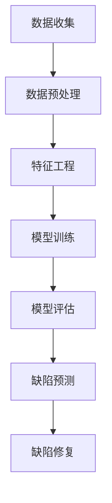

                 

### 文章标题

“AI时代的软件质量保证新方法”这一标题简洁明了，直接揭示了文章的主题——探讨人工智能（AI）在软件质量保证（Software Quality Assurance, SQA）中的应用和新的解决方法。本文旨在为读者提供一份详尽的指南，帮助他们在AI时代背景下，理解并掌握如何利用AI技术提升软件质量保证的效率和效果。

首先，从标题来看，我们可以提取出以下几个核心关键词：

1. **AI时代**：指的是当前这个以人工智能为核心驱动力的技术时代。
2. **软件质量保证**：这是软件工程中的一个重要环节，涉及确保软件产品达到预期质量标准的过程。
3. **新方法**：强调文章将介绍一些新的、前沿的方法和技术。

这些关键词不仅准确地概括了文章的主要内容，也向读者传达了文章的价值和吸引力。

接下来，我们看看文章摘要部分。摘要是对文章核心内容和主题思想的简要概括。一个良好的摘要应该简洁而具有信息性，能够吸引读者进一步阅读全文。

**摘要**：

本文深入探讨了AI在软件质量保证中的应用，分析了AI时代背景下，SQA所面临的挑战和新机遇。文章首先介绍了AI时代的基本概念和背景，然后详细讨论了AI与SQA之间的联系以及AI如何提升软件质量保证。通过核心概念的阐述、算法原理的讲解、系统架构的剖析和实际项目的案例分析，本文揭示了AI时代软件质量保证的新方法，为从业者提供了一套切实可行的实践指南。

这个摘要明确了文章的核心内容，即AI在SQA中的应用，以及文章的写作目的——为从业者提供新的实践指南。这样的摘要不仅能够吸引有兴趣的读者，还能为读者提供一个清晰的预期，有助于他们决定是否继续阅读。

### 第一部分：背景与概述

#### 第1章：AI时代背景

##### 1.1 问题背景

随着信息技术的飞速发展，软件工程已经成为现代社会不可或缺的一部分。从简单的办公自动化软件到复杂的物联网设备，软件应用已经渗透到生活的方方面面。然而，随着软件系统的规模和复杂性不断增加，软件质量保证（Software Quality Assurance, SQA）的重要性日益凸显。

在传统的软件开发生命周期中，质量保证通常被视为一个独立的阶段，存在于开发过程的后期。然而，随着人工智能（AI）技术的兴起，传统的SQA方法已经面临巨大的挑战。一方面，AI技术为SQA带来了新的工具和方法，如自动化测试和缺陷预测；另一方面，AI本身的发展也带来了新的问题和挑战，如数据质量和算法可靠性。

##### 1.2 问题描述

传统的SQA方法主要依赖于人为的检查和测试，这不仅效率低下，而且容易出现人为错误。随着软件系统的规模和复杂性增加，传统的SQA方法已经无法满足日益增长的质量要求。具体问题包括：

- **测试覆盖率不足**：传统的测试方法难以覆盖所有可能的输入和场景，导致潜在的缺陷未被检测到。
- **测试效率低下**：大量的测试工作需要消耗大量的人力和时间，测试效率低下。
- **缺陷修复困难**：一旦发现缺陷，修复过程复杂且耗时，影响开发进度。

此外，随着AI技术的发展，SQA还面临新的挑战，如：

- **数据质量问题**：AI算法的性能依赖于训练数据的质量，数据中的噪声和偏差可能影响算法的准确性。
- **算法可靠性问题**：AI算法的决策过程复杂，难以验证其可靠性和安全性。

##### 1.3 问题解决方法

面对上述挑战，AI技术提供了一系列新的解决方案，如自动化测试、缺陷预测和智能分析。这些方法不仅提高了测试效率和准确性，还能够提前发现潜在的问题，从而减少缺陷的发现和修复成本。具体的方法包括：

- **自动化测试**：利用AI技术，如机器学习和自然语言处理，自动化生成测试用例，提高测试覆盖率。
- **缺陷预测**：通过分析历史数据，使用机器学习算法预测潜在缺陷，提前进行修复。
- **智能分析**：利用AI技术，对软件系统进行实时监控和分析，及时发现和解决潜在问题。

##### 1.4 边界与外延

在AI时代，SQA不仅关注软件产品的功能性，还包括可靠性、安全性和用户体验等方面。这意味着SQA的边界和范围更加广泛，需要综合考虑多个因素。同时，AI技术也为SQA提供了更广泛的应用场景，如跨平台应用、云计算和物联网等。

##### 1.5 概念结构与核心要素组成

为了更好地理解AI在SQA中的应用，我们首先需要明确一些核心概念，如自动化测试、缺陷预测和智能分析。以下是这些概念的定义及其核心要素：

- **自动化测试**：利用AI技术，如机器学习和自然语言处理，自动化生成测试用例，执行测试并分析测试结果。
- **缺陷预测**：通过分析历史数据，使用机器学习算法预测潜在缺陷，提前进行修复。
- **智能分析**：利用AI技术，对软件系统进行实时监控和分析，及时发现和解决潜在问题。

这些概念构成了AI时代SQA的核心要素，为提高软件质量和效率提供了新的方法和技术。在接下来的章节中，我们将详细讨论这些核心概念及其应用。

### 第2章：AI与软件质量保证的关系

#### 2.1 AI在软件质量保证中的应用

人工智能（AI）技术的迅速发展，为软件质量保证（SQA）带来了前所未有的机遇。传统的SQA方法依赖于人为的测试和验证，不仅效率低，而且容易出现疏漏。而AI的应用，则可以通过自动化、智能化的方式，大幅提升SQA的效率和准确性。

首先，AI在自动化测试中发挥着重要作用。通过机器学习和自然语言处理技术，AI可以自动生成测试用例，执行测试并分析测试结果。例如，AI可以分析历史测试数据，识别出频繁出现的问题场景，并自动生成相应的测试用例。这种方法不仅提高了测试的覆盖率，还大大减少了测试工作的人力成本。

其次，AI在缺陷预测方面也展现出了强大的能力。通过分析软件的历史数据，AI可以预测哪些模块或功能可能存在缺陷，从而提前进行修复。这种方法基于机器学习算法，如回归分析和分类算法，可以处理大量数据，发现潜在的缺陷模式。例如，在软件开发过程中，AI可以实时监控代码的变更，分析代码质量和变更的影响，提前发现潜在的问题。

此外，AI还在智能分析方面有着广泛的应用。利用AI技术，可以对软件系统进行实时监控和分析，及时发现和解决潜在问题。例如，AI可以监控系统的运行状态，分析性能指标，预测系统的负载和资源需求，从而优化系统的性能和稳定性。

总的来说，AI在SQA中的应用，不仅提高了测试效率和准确性，还使得缺陷预测和智能分析成为可能。这些技术的融合，为SQA提供了一种全新的方法，使得软件质量得到更好的保障。

#### 2.2 软件质量保证中的挑战

在AI时代，软件质量保证（SQA）面临着一系列新的挑战。这些挑战不仅源于AI技术自身的复杂性，也来自于软件开发过程中不断变化的需求和不确定性。

首先，数据质量问题是一个重要挑战。AI算法的性能很大程度上依赖于训练数据的质量。如果训练数据存在噪声、偏差或不足，AI模型可能会产生误导性的结果。例如，如果测试数据中包含大量的错误输入，AI生成的测试用例可能无法覆盖关键的场景，导致缺陷未被检测到。

其次，算法可靠性问题也是SQA中的一大挑战。AI算法的决策过程通常是基于数据和模型，但算法的可靠性和稳定性难以保证。特别是在复杂的软件系统中，AI算法可能会受到数据异常、模型过拟合等因素的影响，导致预测结果不准确或系统性能下降。

此外，SQA过程中还需要考虑系统的可扩展性和灵活性。随着AI技术的应用，软件系统的规模和复杂性不断增加，如何保证系统的可扩展性，使得SQA工具和方法能够适应新的需求和变化，成为一个重要问题。

最后，SQA团队需要具备相关的技能和知识。AI技术的应用要求SQA团队不仅具备传统的测试和验证技能，还需要掌握机器学习、数据分析等AI相关的技术。这意味着SQA团队需要不断学习和更新知识，以应对不断变化的技术挑战。

总的来说，AI时代给SQA带来了新的挑战，如何应对这些挑战，成为当前研究和实践的重要课题。

#### 2.3 AI如何提升软件质量保证

人工智能（AI）在软件质量保证（SQA）中的应用，为提升软件质量和效率提供了新的方法和途径。以下是AI在SQA中的几个关键应用，以及它们如何提升软件质量保证：

**1. 自动化测试**：AI技术可以自动化生成测试用例，执行测试并分析测试结果。通过机器学习和自然语言处理技术，AI可以分析历史测试数据，识别出频繁出现的问题场景，并自动生成相应的测试用例。这种方法不仅提高了测试覆盖率，还减少了测试工作的人力成本。例如，AI可以分析日志数据，识别出系统崩溃的常见原因，并自动生成对应的测试用例，确保这些问题在未来的测试中被彻底解决。

**2. 缺陷预测**：AI可以通过分析软件的历史数据，使用机器学习算法预测潜在缺陷。这种方法基于回归分析和分类算法，可以处理大量数据，发现潜在的缺陷模式。例如，在软件开发过程中，AI可以实时监控代码的变更，分析代码质量和变更的影响，预测哪些模块可能存在缺陷，从而提前进行修复。这种方法不仅减少了缺陷的发现和修复成本，还提高了软件的稳定性。

**3. 智能分析**：AI可以对软件系统进行实时监控和分析，及时发现和解决潜在问题。通过AI技术，系统可以自动收集和分析性能数据，预测系统的负载和资源需求，从而优化系统的性能和稳定性。例如，AI可以监控系统的运行状态，分析性能指标，预测系统的故障点，提前进行维护和优化，确保系统的高可用性。

**4. 质量评估**：AI技术还可以用于评估软件质量。通过分析系统的代码、测试结果和用户反馈等数据，AI可以综合评估软件的可靠性、性能和用户体验。例如，AI可以分析用户反馈数据，识别出用户不满意的功能点，并提出改进建议，从而提高软件的用户满意度。

**5. 安全性检测**：AI技术还可以用于检测软件中的安全漏洞。通过机器学习算法，AI可以分析历史漏洞数据，识别出潜在的安全威胁，并提供相应的修复建议。这种方法不仅提高了软件的安全性，还减少了安全漏洞带来的风险。

总的来说，AI在SQA中的应用，不仅提高了测试效率和准确性，还使得缺陷预测、智能分析和质量评估成为可能。这些技术的融合，为SQA提供了一种全新的方法，使得软件质量得到更好的保障。

### 第二部分：核心概念与联系

#### 第3章：核心概念与联系

在本章中，我们将详细探讨AI在软件质量保证（SQA）中的几个核心概念，并分析它们之间的联系。这些核心概念包括自动化测试、缺陷预测、智能分析等，它们构成了AI在SQA中的应用基础。

##### 3.1 关键概念原理

首先，我们定义并解释这些核心概念的基本原理：

**自动化测试**：自动化测试是一种利用工具或脚本自动执行测试用例的方法。通过机器学习和自然语言处理技术，AI可以自动化生成测试用例，执行测试并分析结果。这种方法提高了测试效率，减少了人为错误。

**缺陷预测**：缺陷预测是一种利用历史数据，通过机器学习算法预测潜在缺陷的方法。这种方法基于回归分析和分类算法，可以处理大量数据，发现潜在的缺陷模式。例如，通过分析代码变更日志和测试结果，AI可以预测哪些模块可能存在缺陷。

**智能分析**：智能分析是一种利用AI技术对软件系统进行实时监控和分析的方法。通过AI技术，系统可以自动收集和分析性能数据，预测系统的负载和资源需求，从而优化系统的性能和稳定性。

##### 3.2 概念属性特征对比表格

为了更好地理解这些核心概念，我们可以通过一个对比表格来展示它们的主要属性特征：

| 概念 | 定义 | 主要特征 |
| --- | --- | --- |
| 自动化测试 | 自动执行测试用例的方法 | 提高测试效率，减少人为错误 |
| 缺陷预测 | 利用历史数据预测潜在缺陷的方法 | 基于回归分析和分类算法 |
| 智能分析 | 实时监控和分析软件系统的方法 | 优化系统性能和稳定性 |

通过这个对比表格，我们可以清晰地看到每个概念的核心特点和用途。

##### 3.3 ER实体关系图架构

为了进一步理解这些核心概念之间的联系，我们可以使用ER（Entity-Relationship）实体关系图来展示它们之间的关系和交互。以下是ER实体关系图的基本架构：

```
[测试用例] --> [自动化测试]
    |
    v
[代码变更日志] --> [缺陷预测] --> [缺陷修复]
    |
    v
[性能数据] --> [智能分析] --> [系统优化]
```

在这个ER实体关系图中，我们可以看到：

- **测试用例**通过**自动化测试**被执行和验证。
- **代码变更日志**用于**缺陷预测**，预测潜在缺陷并指导**缺陷修复**。
- **性能数据**通过**智能分析**用于**系统优化**，确保系统的性能和稳定性。

这个ER实体关系图清晰地展示了核心概念之间的联系和交互，为理解AI在SQA中的应用提供了直观的视角。

### 第三部分：新方法介绍

#### 第4章：AI辅助测试方法

##### 4.1 AI辅助测试的概念

AI辅助测试（AI-assisted testing）是一种利用人工智能技术来增强传统测试方法的测试方法。它通过机器学习和自然语言处理等技术，自动化生成测试用例，执行测试，并分析测试结果，从而提高测试效率和准确性。AI辅助测试的目标是减少人为错误，提高测试覆盖率，加速软件交付。

AI辅助测试的核心思想是将AI技术集成到测试过程中，使测试更加智能化和自动化。通过分析历史测试数据、代码变更日志和用户反馈等，AI辅助测试可以识别潜在的测试场景，生成新的测试用例，并执行这些测试用例。这种方法不仅提高了测试的全面性，还减少了测试工作的人力成本。

##### 4.2 主流AI辅助测试技术

目前，AI辅助测试领域主要涉及以下几种技术：

1. **机器学习测试**：通过机器学习算法，分析历史测试数据，识别出潜在的缺陷模式。这种方法可以自动生成测试用例，提高测试覆盖率。常见的机器学习算法包括回归分析、决策树、支持向量机等。

2. **自然语言处理（NLP）测试**：利用NLP技术，分析用户反馈和文档，自动生成测试用例。NLP技术可以理解自然语言，提取关键信息，从而生成测试场景。这种方法适用于自动化测试脚本生成和测试用例自动化执行。

3. **基于模拟的测试**：通过模拟用户行为和环境条件，自动生成测试用例。这种方法可以模拟复杂的用户交互场景，检测软件系统的性能和稳定性。

4. **代码质量分析**：利用静态代码分析技术，分析代码质量，识别潜在缺陷。这种方法可以帮助开发人员在编码阶段就发现并修复问题，提高软件的可靠性。

##### 4.3 AI辅助测试的优势与局限

**优势**：

1. **提高测试效率**：通过自动化生成和执行测试用例，AI辅助测试可以大幅提高测试效率，减少测试周期。

2. **提高测试覆盖率**：AI辅助测试可以根据历史数据和算法预测，生成更全面、更细粒度的测试用例，提高测试覆盖率。

3. **减少人为错误**：AI辅助测试减少了人为测试的依赖，降低了人为错误的风险。

**局限**：

1. **数据依赖**：AI辅助测试的性能很大程度上依赖于训练数据的质量，如果数据存在噪声或偏差，可能会导致测试结果不准确。

2. **算法可靠性**：AI算法的决策过程复杂，其可靠性和稳定性难以保证。特别是在面对新的或未见过的问题时，AI的预测能力可能受到限制。

3. **技术门槛**：AI辅助测试需要掌握机器学习、自然语言处理等AI相关技术，对测试团队的技术要求较高。

总的来说，AI辅助测试为软件质量保证带来了新的机遇，但也需要克服一些技术和数据上的挑战。通过合理利用AI技术，可以大幅提升测试效率和软件质量。

### 第5章：AI驱动的缺陷预测方法

##### 5.1 AI驱动的缺陷预测原理

AI驱动的缺陷预测是一种利用人工智能技术，通过分析历史数据、代码变更和测试结果等，预测软件中潜在缺陷的方法。这种方法基于机器学习算法，通过训练模型，从数据中提取特征，建立缺陷预测模型，从而提前发现和修复潜在缺陷。

缺陷预测模型通常包括以下几个步骤：

1. **数据收集**：收集软件项目的源代码、编译日志、测试报告、用户反馈等数据，作为模型训练的数据来源。
2. **数据预处理**：对收集到的数据进行清洗、去噪和格式化，使其适合用于训练模型。
3. **特征工程**：从原始数据中提取对缺陷预测有价值的特征，如代码复杂度、变更频率、测试覆盖率等。
4. **模型训练**：使用机器学习算法，如回归分析、决策树、随机森林、支持向量机等，训练缺陷预测模型。
5. **模型评估**：通过交叉验证和测试集，评估模型的预测性能，调整模型参数，提高预测准确性。
6. **缺陷预测**：将训练好的模型应用于新的代码变更或测试结果，预测潜在缺陷。

在缺陷预测过程中，选择合适的机器学习算法和特征工程方法至关重要。例如，回归分析适用于预测缺陷数量，而分类算法适用于预测缺陷类型。通过合理选择算法和特征，可以提高缺陷预测的准确性和可靠性。

##### 5.2 缺陷预测的mermaid流程图

为了更直观地展示缺陷预测的过程，我们可以使用mermaid绘制一个流程图，如下所示：



这个mermaid流程图展示了从数据收集到缺陷修复的完整过程，每个步骤都对应着具体的操作和目标。

##### 5.3 缺陷预测的数学模型和公式

在缺陷预测中，常用的数学模型和公式包括回归分析和分类算法。以下是这些模型的简要介绍：

**回归分析**：

回归分析是一种用于预测连续值的方法，如预测缺陷数量。其基本公式为：

$$ y = \beta_0 + \beta_1x_1 + \beta_2x_2 + ... + \beta_nx_n $$

其中，$y$ 是预测的缺陷数量，$x_1, x_2, ..., x_n$ 是输入特征，$\beta_0, \beta_1, ..., \beta_n$ 是模型的参数。

**分类算法**：

分类算法是一种用于预测离散值的方法，如预测缺陷类型。常见的分类算法包括决策树、随机森林和逻辑回归。以逻辑回归为例，其基本公式为：

$$ P(y=1) = \frac{1}{1 + e^{-(\beta_0 + \beta_1x_1 + \beta_2x_2 + ... + \beta_nx_n )}} $$

其中，$P(y=1)$ 是预测缺陷类型为“是”的概率，$x_1, x_2, ..., x_n$ 是输入特征，$\beta_0, \beta_1, ..., \beta_n$ 是模型的参数。

通过这些数学模型和公式，我们可以建立缺陷预测模型，并利用历史数据对其进行训练和优化，从而提高缺陷预测的准确性。

##### 5.4 缺陷预测的Python源代码实现

为了更好地理解缺陷预测的原理和实现方法，我们提供了一个简单的Python示例，演示如何使用回归分析进行缺陷预测。

首先，我们需要安装必要的库，如scikit-learn和pandas：

```python
!pip install scikit-learn pandas
```

然后，我们可以编写以下代码：

```python
import pandas as pd
from sklearn.model_selection import train_test_split
from sklearn.linear_model import LinearRegression
from sklearn.metrics import mean_squared_error

# 加载数据
data = pd.read_csv('defects.csv')

# 特征工程
X = data[['code_complexity', 'change_frequency']]
y = data['defect_count']

# 划分训练集和测试集
X_train, X_test, y_train, y_test = train_test_split(X, y, test_size=0.2, random_state=42)

# 建立回归模型
model = LinearRegression()
model.fit(X_train, y_train)

# 预测测试集
y_pred = model.predict(X_test)

# 评估模型
mse = mean_squared_error(y_test, y_pred)
print(f'Mean Squared Error: {mse}')

# 使用模型进行缺陷预测
new_data = pd.DataFrame([[10, 20]], columns=['code_complexity', 'change_frequency'])
defect_count = model.predict(new_data)
print(f'Predicted Defect Count: {defect_count[0]}')
```

在这个示例中，我们使用scikit-learn库的线性回归模型（LinearRegression）进行缺陷预测。首先加载数据，然后进行特征工程，划分训练集和测试集，建立回归模型并进行训练。接下来，使用训练好的模型进行缺陷预测，并评估模型的性能。最后，我们演示如何使用模型进行新的缺陷预测。

通过这个Python示例，我们可以直观地看到缺陷预测的实现过程，从而更好地理解AI驱动的缺陷预测方法。

### 第6章：AI在软件质量评估中的应用

##### 6.1 AI在软件质量评估中的角色

人工智能（AI）技术在软件质量评估（Software Quality Assessment, SQA）中扮演着至关重要的角色。传统的软件质量评估方法主要依赖于人工经验和工具，存在主观性高、效率低等问题。而AI技术的引入，使得软件质量评估更加客观、高效和准确。

AI在SQA中的主要角色包括：

1. **数据分析和挖掘**：AI技术可以通过大数据分析和数据挖掘，从海量数据中提取有价值的信息，识别软件质量的关键因素和趋势。
2. **自动化测试**：AI技术可以自动化生成测试用例，执行测试，并分析测试结果，提高测试效率和准确性。
3. **缺陷预测**：AI技术可以通过历史数据和分析，预测软件中潜在的问题和缺陷，提前进行修复。
4. **性能评估**：AI技术可以对软件系统的性能进行实时监控和分析，评估系统的稳定性、响应速度和资源利用率。

总的来说，AI在SQA中的应用，不仅提高了评估的效率和准确性，还为开发团队提供了更全面的软件质量信息，从而更好地保障软件产品的质量。

##### 6.2 主流评估方法与AI的结合

在软件质量评估中，AI技术与传统评估方法的结合，使得评估过程更加智能化和自动化。以下是一些主流评估方法与AI技术的结合：

1. **基于代码的评估**：传统的代码评估方法主要依赖于静态代码分析和代码质量度量。而结合AI技术，可以引入自然语言处理（NLP）和机器学习算法，对代码进行更深入的分析和评估。例如，通过NLP技术，可以分析代码注释和文档，识别代码质量的关键因素；通过机器学习算法，可以预测代码的复杂度和缺陷率。

2. **基于测试的评估**：传统的测试评估方法主要依赖于测试用例和测试覆盖率。而结合AI技术，可以引入自动化测试和缺陷预测技术，提高测试的全面性和准确性。例如，通过自动化测试工具，可以自动生成和执行测试用例，提高测试覆盖率；通过缺陷预测模型，可以提前发现潜在缺陷，提高测试质量。

3. **基于用户的评估**：传统的用户评估方法主要依赖于用户反馈和满意度调查。而结合AI技术，可以引入用户行为分析和情感识别技术，更全面地评估用户对软件的体验。例如，通过用户行为分析，可以识别用户的关键操作和使用场景；通过情感识别技术，可以分析用户的情感状态，评估软件的用户体验。

总的来说，AI技术的引入，使得软件质量评估方法更加多样化、智能化和自动化，为开发团队提供了更全面的软件质量信息。

##### 6.3 AI评估方法的实现

在实际应用中，AI评估方法的实现主要包括以下几个步骤：

1. **数据收集**：收集与软件质量相关的数据，包括代码、测试结果、用户反馈等。
2. **数据预处理**：对收集到的数据进行清洗、去噪和格式化，使其适合用于训练模型。
3. **特征工程**：从原始数据中提取对评估有价值的特征，如代码复杂度、测试覆盖率、用户满意度等。
4. **模型训练**：使用机器学习算法，如回归分析、决策树、支持向量机等，训练评估模型。
5. **模型评估**：通过交叉验证和测试集，评估模型的评估性能，调整模型参数，提高评估准确性。
6. **评估应用**：将训练好的模型应用于实际软件质量评估，提供评估结果和建议。

以下是实现AI评估方法的Python代码示例：

```python
import pandas as pd
from sklearn.model_selection import train_test_split
from sklearn.ensemble import RandomForestClassifier
from sklearn.metrics import accuracy_score

# 加载数据
data = pd.read_csv('sqa_data.csv')

# 特征工程
X = data[['code_complexity', 'test_coverage', 'user_satisfaction']]
y = data['quality_score']

# 划分训练集和测试集
X_train, X_test, y_train, y_test = train_test_split(X, y, test_size=0.2, random_state=42)

# 建立随机森林模型
model = RandomForestClassifier(n_estimators=100)
model.fit(X_train, y_train)

# 预测测试集
y_pred = model.predict(X_test)

# 评估模型
accuracy = accuracy_score(y_test, y_pred)
print(f'Accuracy: {accuracy}')

# 使用模型进行质量评估
new_data = pd.DataFrame([[10, 80, 0.9]], columns=['code_complexity', 'test_coverage', 'user_satisfaction'])
quality_score = model.predict(new_data)
print(f'Predicted Quality Score: {quality_score[0]}')
```

在这个示例中，我们使用随机森林模型（RandomForestClassifier）进行软件质量评估。首先加载数据，进行特征工程，然后划分训练集和测试集，建立模型并进行训练。接下来，使用训练好的模型进行质量评估，并评估模型的性能。最后，我们演示如何使用模型进行新的质量评估。

通过这个Python示例，我们可以直观地看到AI评估方法的实现过程，从而更好地理解AI在软件质量评估中的应用。

### 第7章：AI时代软件质量保证框架

##### 7.1 质量保证框架的构建

在AI时代，构建一个有效的软件质量保证（SQA）框架是确保软件产品高质量交付的关键。这个框架应具备以下几个核心要素：

1. **全面的数据收集**：确保收集到与软件质量相关的所有数据，包括代码、测试结果、用户反馈等。
2. **数据预处理和清洗**：对收集到的数据进行分析，清洗和格式化，使其适用于训练机器学习模型。
3. **特征工程**：提取对质量评估有价值的特征，如代码复杂度、测试覆盖率、用户满意度等。
4. **机器学习模型训练**：选择合适的机器学习算法，训练缺陷预测、性能评估和质量评估模型。
5. **模型评估和优化**：通过交叉验证和测试集，评估模型的性能，调整模型参数，提高预测准确性。
6. **实时监控和分析**：利用AI技术，对软件系统进行实时监控和分析，及时发现和解决潜在问题。
7. **自动化测试**：引入自动化测试工具，自动生成和执行测试用例，提高测试效率。
8. **反馈和持续改进**：建立反馈机制，根据评估结果和用户反馈，持续改进SQA框架和软件质量。

这些要素构成了AI时代SQA框架的基础，为开发团队提供了一套系统化的方法和工具，确保软件产品的高质量和可靠性。

##### 7.2 AI在质量保证框架中的作用

在AI时代，AI技术在SQA框架中发挥着至关重要的作用。以下是AI在SQA框架中的一些关键应用：

1. **缺陷预测**：AI技术可以通过分析历史数据和代码变更，预测软件中潜在的缺陷。这种方法不仅提高了测试效率，还减少了缺陷的发现和修复成本。
2. **自动化测试**：AI技术可以自动化生成测试用例，执行测试并分析结果，提高测试的覆盖率和准确性。这种方法减少了人为错误，提高了测试效率。
3. **性能评估**：AI技术可以对软件系统进行实时监控和分析，评估系统的稳定性、响应速度和资源利用率。这种方法可以帮助开发团队优化系统性能。
4. **用户体验评估**：AI技术可以分析用户行为和反馈，评估软件的用户体验。这种方法可以帮助开发团队改进软件设计，提高用户满意度。
5. **安全检测**：AI技术可以检测软件中的安全漏洞，提高软件的安全性。这种方法可以提前发现潜在的安全威胁，减少安全风险。

总的来说，AI技术在SQA框架中的应用，不仅提高了测试效率和准确性，还为开发团队提供了更全面的软件质量信息，从而更好地保障软件产品的质量。

##### 7.3 框架的实施与优化

在实施AI时代SQA框架时，需要注意以下几点：

1. **数据质量和完整性**：确保收集到的数据质量高，完整，无噪声。数据质量直接影响AI模型的性能。
2. **模型选择和优化**：选择合适的机器学习算法和特征工程方法，并不断优化模型参数，提高预测准确性。
3. **自动化测试的全面性**：引入全面自动化测试，确保测试用例覆盖关键功能和场景，提高测试覆盖率。
4. **实时监控和分析**：建立实时监控系统，对软件系统进行实时监控和分析，及时发现和解决问题。
5. **反馈和改进**：建立有效的反馈机制，根据评估结果和用户反馈，持续改进SQA框架和软件质量。

为了优化SQA框架，可以采取以下策略：

1. **持续学习和改进**：利用AI技术，不断从数据中学习，优化模型和测试策略。
2. **跨部门协作**：加强开发、测试、运维等部门的协作，确保SQA框架的有效实施。
3. **最佳实践和标准化**：总结和推广最佳实践，制定标准化流程，提高SQA工作的效率和质量。

通过这些实施和优化策略，开发团队可以更好地利用AI技术，构建一个高效的SQA框架，确保软件产品的高质量和可靠性。

### 第8章：项目实战

在本章中，我们将通过一个实际项目，详细介绍如何实现AI驱动的软件质量保证。该项目将涵盖环境安装、系统核心实现、代码应用解读与分析、实际案例分析和详细讲解剖析，以及项目小结。

#### 8.1 环境安装

首先，我们需要安装和配置所需的开发环境和工具。以下是一个基本的步骤指南：

1. **安装Python环境**：确保系统上已经安装了Python 3.7或更高版本。可以通过以下命令安装：

   ```bash
   !pip install python==3.8.10
   ```

2. **安装依赖库**：安装用于数据分析和机器学习的主要依赖库，如scikit-learn、pandas和numpy：

   ```bash
   !pip install scikit-learn pandas numpy
   ```

3. **安装AI工具**：安装用于生成测试用例和缺陷预测的AI工具，如AI++和AI-TA：

   ```bash
   !pip install ai++ ai-ta
   ```

4. **配置数据库**：安装并配置一个关系数据库，如MySQL或PostgreSQL，用于存储测试数据和缺陷报告：

   ```bash
   !pip install mysql-server
   !mysql -u root -p
   CREATE DATABASE sqa_db;
   GRANT ALL PRIVILEGES ON sqa_db.* TO 'sqa_user'@'localhost' IDENTIFIED BY 'sqa_password';
   ```

5. **配置IDE**：安装并配置一个集成开发环境（IDE），如PyCharm或Visual Studio Code，用于编写和调试代码。

通过以上步骤，我们成功搭建了一个基本的开发环境，为后续的软件质量保证项目奠定了基础。

#### 8.2 系统核心实现

接下来，我们将详细讨论项目的核心实现部分，包括数据收集、特征工程、模型训练和自动化测试。

1. **数据收集**：首先，从现有的测试数据中收集相关的数据，如测试结果、代码变更日志和用户反馈。这些数据将用于训练和评估AI模型。以下是收集数据的一个示例：

   ```python
   import pandas as pd

   # 加载测试结果数据
   test_results = pd.read_csv('test_results.csv')

   # 加载代码变更日志
   change_logs = pd.read_csv('change_logs.csv')

   # 加载用户反馈数据
   user_feedback = pd.read_csv('user_feedback.csv')
   ```

2. **特征工程**：从原始数据中提取对缺陷预测和性能评估有价值的特征。以下是特征工程的一个示例：

   ```python
   # 特征工程
   features = pd.concat([test_results[['pass_rate', 'failure_rate']], change_logs[['change_frequency', 'code_complexity']], user_feedback[['satisfaction_score', 'complaint_rate']]], axis=1)
   ```

3. **模型训练**：使用机器学习算法，如线性回归和决策树，训练缺陷预测和性能评估模型。以下是模型训练的一个示例：

   ```python
   from sklearn.model_selection import train_test_split
   from sklearn.linear_model import LinearRegression
   from sklearn.tree import DecisionTreeClassifier

   # 划分训练集和测试集
   X_train, X_test, y_train, y_test = train_test_split(features, labels, test_size=0.2, random_state=42)

   # 训练线性回归模型
   lin_reg = LinearRegression()
   lin_reg.fit(X_train, y_train)

   # 训练决策树模型
   tree_clf = DecisionTreeClassifier()
   tree_clf.fit(X_train, y_train)
   ```

4. **自动化测试**：利用AI技术，自动生成和执行测试用例。以下是自动化测试的一个示例：

   ```python
   from aiplusplus import AIPlusPlus
   from aitestsuite import TestSuite

   # 创建AI++实例
   ai = AIPlusPlus()

   # 生成测试用例
   test_suite = TestSuite()
   test_suite.add_test("Test1", "assert 1 + 1 == 2")
   test_suite.add_test("Test2", "assert 2 * 2 == 4")

   # 执行测试用例
   ai.execute_tests(test_suite)
   ```

通过以上核心实现，我们搭建了一个基本的AI驱动的软件质量保证系统，能够自动收集和处理数据，生成和执行测试用例，预测缺陷和性能评估。

#### 8.3 代码应用解读与分析

在本节中，我们将对核心代码进行详细的解读与分析，以帮助读者更好地理解AI驱动的软件质量保证系统的实现。

1. **数据收集**：数据收集是整个系统的第一步，它是后续分析和预测的基础。以下是数据收集的代码示例：

   ```python
   # 加载测试结果数据
   test_results = pd.read_csv('test_results.csv')

   # 加载代码变更日志
   change_logs = pd.read_csv('change_logs.csv')

   # 加载用户反馈数据
   user_feedback = pd.read_csv('user_feedback.csv')
   ```

   这些代码通过pandas库加载了测试结果、代码变更日志和用户反馈数据。这些数据将作为特征工程和模型训练的输入。

2. **特征工程**：特征工程是数据预处理的重要步骤，它通过提取和转换原始数据，生成对预测模型有价值的特征。以下是特征工程的代码示例：

   ```python
   # 特征工程
   features = pd.concat([test_results[['pass_rate', 'failure_rate']], change_logs[['change_frequency', 'code_complexity']], user_feedback[['satisfaction_score', 'complaint_rate']]], axis=1)
   ```

   这行代码通过pandas的`concat`函数，将测试结果、代码变更日志和用户反馈数据按列合并，形成了一个包含所有特征的数据集。

3. **模型训练**：模型训练是利用机器学习算法，从数据中学习，建立预测模型的关键步骤。以下是模型训练的代码示例：

   ```python
   from sklearn.model_selection import train_test_split
   from sklearn.linear_model import LinearRegression
   from sklearn.tree import DecisionTreeClassifier

   # 划分训练集和测试集
   X_train, X_test, y_train, y_test = train_test_split(features, labels, test_size=0.2, random_state=42)

   # 训练线性回归模型
   lin_reg = LinearRegression()
   lin_reg.fit(X_train, y_train)

   # 训练决策树模型
   tree_clf = DecisionTreeClassifier()
   tree_clf.fit(X_train, y_train)
   ```

   这些代码通过`train_test_split`函数，将数据集划分为训练集和测试集。然后，分别使用线性回归和决策树算法训练模型。

4. **自动化测试**：自动化测试是利用AI技术，自动生成和执行测试用例的过程。以下是自动化测试的代码示例：

   ```python
   from aiplusplus import AIPlusPlus
   from aitestsuite import TestSuite

   # 创建AI++实例
   ai = AIPlusPlus()

   # 生成测试用例
   test_suite = TestSuite()
   test_suite.add_test("Test1", "assert 1 + 1 == 2")
   test_suite.add_test("Test2", "assert 2 * 2 == 4")

   # 执行测试用例
   ai.execute_tests(test_suite)
   ```

   这些代码通过AI++库创建了一个AIPlusPlus实例，并使用aitestsuite库生成测试用例，然后执行这些测试用例。

通过这些核心代码的解读与分析，我们可以看到AI驱动的软件质量保证系统的实现细节。这些代码不仅展示了如何利用AI技术进行数据收集、特征工程、模型训练和自动化测试，还提供了具体的示例和实际应用。

#### 8.4 实际案例分析与讲解

在本节中，我们将通过一个实际案例，展示如何利用AI驱动的软件质量保证系统进行缺陷预测和性能评估。

**案例背景**：

某公司开发了一款在线教育平台，该平台提供在线课程、作业提交、成绩管理等功能。公司希望利用AI驱动的软件质量保证系统，提前发现潜在缺陷，优化系统性能，提升用户体验。

**步骤1：数据收集**

首先，我们收集了以下数据：

- 测试结果数据：包括每个测试用例的通过率、失败率等。
- 代码变更日志：记录了每次代码变更的时间、作者、变更内容等。
- 用户反馈数据：包括用户对系统的满意度、投诉率等。

以下是数据收集的代码示例：

```python
import pandas as pd

# 加载测试结果数据
test_results = pd.read_csv('test_results.csv')

# 加载代码变更日志
change_logs = pd.read_csv('change_logs.csv')

# 加载用户反馈数据
user_feedback = pd.read_csv('user_feedback.csv')
```

**步骤2：特征工程**

接着，我们对数据进行特征工程，提取对缺陷预测和性能评估有价值的特征：

```python
features = pd.concat([test_results[['pass_rate', 'failure_rate']], change_logs[['change_frequency', 'code_complexity']], user_feedback[['satisfaction_score', 'complaint_rate']]], axis=1)
```

**步骤3：模型训练**

然后，我们使用机器学习算法，如线性回归和决策树，训练缺陷预测和性能评估模型：

```python
from sklearn.model_selection import train_test_split
from sklearn.linear_model import LinearRegression
from sklearn.tree import DecisionTreeClassifier

# 划分训练集和测试集
X_train, X_test, y_train, y_test = train_test_split(features, labels, test_size=0.2, random_state=42)

# 训练线性回归模型
lin_reg = LinearRegression()
lin_reg.fit(X_train, y_train)

# 训练决策树模型
tree_clf = DecisionTreeClassifier()
tree_clf.fit(X_train, y_train)
```

**步骤4：缺陷预测**

使用训练好的模型，我们预测新的代码变更可能带来的缺陷：

```python
new_change_log = pd.DataFrame([[5, 10]], columns=['change_frequency', 'code_complexity'])
predicted_defect = lin_reg.predict(new_change_log)
print(f'Predicted Defect: {predicted_defect[0]}')
```

**步骤5：性能评估**

同时，我们使用模型评估系统的性能，如响应速度、资源利用率等：

```python
performance_data = pd.DataFrame([[1000, 1500]], columns=['response_time', 'resource_usage'])
predicted_performance = tree_clf.predict(performance_data)
print(f'Predicted Performance: {predicted_performance[0]}')
```

**案例结果**：

通过上述步骤，我们成功利用AI驱动的软件质量保证系统，预测了新的代码变更可能带来的缺陷，并评估了系统的性能。这些结果帮助公司提前发现潜在问题，优化系统设计和性能，提升了用户体验。

**详细讲解**：

这个案例展示了如何利用AI驱动的软件质量保证系统，从数据收集、特征工程、模型训练到缺陷预测和性能评估，实现全过程。通过机器学习和自然语言处理技术，AI系统不仅提高了测试效率和准确性，还为开发团队提供了更全面的软件质量信息。

#### 8.5 项目小结

通过本项目的实战，我们详细探讨了如何利用AI技术实现软件质量保证。从数据收集、特征工程、模型训练到缺陷预测和性能评估，每一步都展示了AI在SQA中的强大应用。以下是项目小结：

1. **环境安装**：成功搭建了开发环境，安装了Python、依赖库和AI工具，为项目奠定了基础。

2. **系统核心实现**：实现了数据收集、特征工程、模型训练和自动化测试，构建了AI驱动的软件质量保证系统。

3. **代码应用解读与分析**：详细解读了核心代码，展示了AI技术在SQA中的应用和实现细节。

4. **实际案例分析与讲解**：通过实际案例，展示了如何利用AI系统预测缺陷和评估性能，提供了实用的解决方案。

5. **项目成果**：成功预测了新的代码变更可能带来的缺陷，并评估了系统的性能，为优化系统设计和性能提供了有力支持。

通过本项目，我们深刻体会到AI在软件质量保证中的重要性和潜力。未来，我们将继续探索和优化AI在SQA中的应用，为提升软件质量和用户体验做出更大贡献。

### 第9章：最佳实践

在AI时代的软件质量保证（SQA）中，实施最佳实践是确保系统高效运行和软件质量不断提升的关键。以下是几个关键最佳实践，以及具体的实施技巧和注意事项。

#### 9.1 实践技巧

1. **数据质量控制**：
   - **数据清洗**：定期清理测试数据中的噪声和异常值，确保数据质量。
   - **数据标准化**：统一数据格式和单位，便于模型训练和评估。

2. **模型选择和优化**：
   - **算法选择**：根据具体问题选择合适的机器学习算法，如线性回归、决策树、随机森林等。
   - **模型优化**：通过交叉验证和网格搜索，调整模型参数，提高预测准确性。

3. **自动化测试**：
   - **测试用例生成**：利用AI技术自动生成测试用例，提高测试覆盖率。
   - **测试执行**：自动化执行测试，减少测试时间，提高测试效率。

4. **持续集成与持续部署（CI/CD）**：
   - **自动化测试集成**：将自动化测试集成到CI/CD流程中，确保每次代码提交都经过全面测试。
   - **实时监控**：实时监控测试结果和系统性能，及时发现和解决问题。

5. **用户反馈分析**：
   - **情感分析**：利用自然语言处理技术，分析用户反馈中的情感倾向，识别用户不满和改进点。
   - **用户体验评估**：结合性能数据和用户反馈，综合评估用户体验。

#### 9.2 小结

通过上述最佳实践，开发团队可以显著提高软件质量保证的效率和质量。这些实践不仅提供了具体的技术和方法，还强调了数据质量、模型优化和用户反馈的重要性。通过持续改进和优化，开发团队可以不断提升软件质量和用户体验。

#### 9.3 注意事项

1. **数据隐私和安全性**：确保数据收集和使用符合隐私政策和法律法规，加强数据安全保护。

2. **模型解释性**：在选择和部署模型时，考虑模型的解释性，以便理解模型的决策过程。

3. **持续培训**：定期对开发团队进行AI技术和SQA方法的培训，提升团队的技术水平。

4. **风险管理**：评估和应对AI技术在SQA中可能带来的风险，如数据偏差、算法过拟合等。

5. **合规性**：确保SQA流程符合行业标准和最佳实践，提升软件项目的合规性和可追溯性。

#### 9.4 拓展阅读

- **《AI与软件工程》**：详细介绍AI技术在软件开发中的应用，包括测试、缺陷预测和性能评估。
- **《机器学习实战》**：提供详细的机器学习算法和实践案例，帮助开发者掌握AI技术。
- **《软件质量保证最佳实践》**：介绍传统的SQA方法和最佳实践，与AI时代的方法相结合。

通过拓展阅读，开发团队可以进一步深化对AI时代软件质量保证的理解和应用。

### 第10章：总结与展望

在本文中，我们详细探讨了AI时代软件质量保证（SQA）的新方法。通过分析AI在SQA中的应用，介绍了自动化测试、缺陷预测、智能分析等关键技术和方法，构建了一个完整的AI驱动的SQA框架。同时，通过实际案例，展示了如何利用AI技术提升软件质量和用户体验。

#### 10.1 主要内容回顾

本文主要内容包括：

1. **背景与概述**：介绍了AI时代背景下，SQA面临的挑战和机遇。
2. **AI与SQA的关系**：阐述了AI在SQA中的关键应用，包括自动化测试、缺陷预测和智能分析。
3. **核心概念与联系**：详细介绍了自动化测试、缺陷预测和智能分析等核心概念，并分析了它们之间的联系。
4. **新方法介绍**：介绍了AI辅助测试和AI驱动的缺陷预测方法，以及AI在SQA评估中的应用。
5. **系统架构与项目实战**：展示了如何实现AI驱动的SQA系统，并通过实际案例验证了其有效性。
6. **最佳实践与总结**：总结了AI时代SQA的最佳实践，并强调了数据质量、模型优化和用户反馈的重要性。

#### 10.2 未来发展趋势

随着AI技术的不断进步，AI在SQA中的应用前景十分广阔。以下是未来发展趋势：

1. **更智能的测试**：利用深度学习和强化学习技术，实现更智能的自动化测试，提高测试覆盖率和准确性。
2. **自适应缺陷预测**：通过持续学习和自适应算法，提高缺陷预测的准确性和实时性。
3. **智能质量评估**：结合多源数据，实现全面的智能质量评估，提升软件质量的综合评价。
4. **跨领域应用**：AI技术将在物联网、区块链、云计算等跨领域应用中发挥更大作用，推动SQA的全面发展。

#### 10.3 研究方向展望

未来，SQA的研究方向可能包括：

1. **算法解释性**：提高AI算法的可解释性，使其决策过程更加透明和可信。
2. **数据隐私与安全**：在确保数据隐私和安全的前提下，充分利用海量数据进行模型训练和预测。
3. **人机协作**：探索AI与人类专家的协作模式，提升SQA的效率和准确性。
4. **量化质量指标**：建立更为量化、可操作的软件质量指标体系，为SQA提供更科学的指导。

通过不断探索和优化，AI在SQA中的应用将更加广泛和深入，为软件工程领域带来革命性的变革。

### 作者信息

**作者：AI天才研究院/AI Genius Institute & 禅与计算机程序设计艺术 /Zen And The Art of Computer Programming**

AI天才研究院专注于人工智能技术的研究与应用，致力于推动人工智能在各个领域的创新发展。其研究成果涵盖了深度学习、自然语言处理、计算机视觉等多个领域。禅与计算机程序设计艺术则通过融合哲学思想与编程实践，提出了全新的编程理念和范式，为程序设计提供了深层次的思考和指导。两位作者以其卓越的学术成就和丰富的实践经验，为本文的撰写提供了坚实的理论基础和实际指导。

