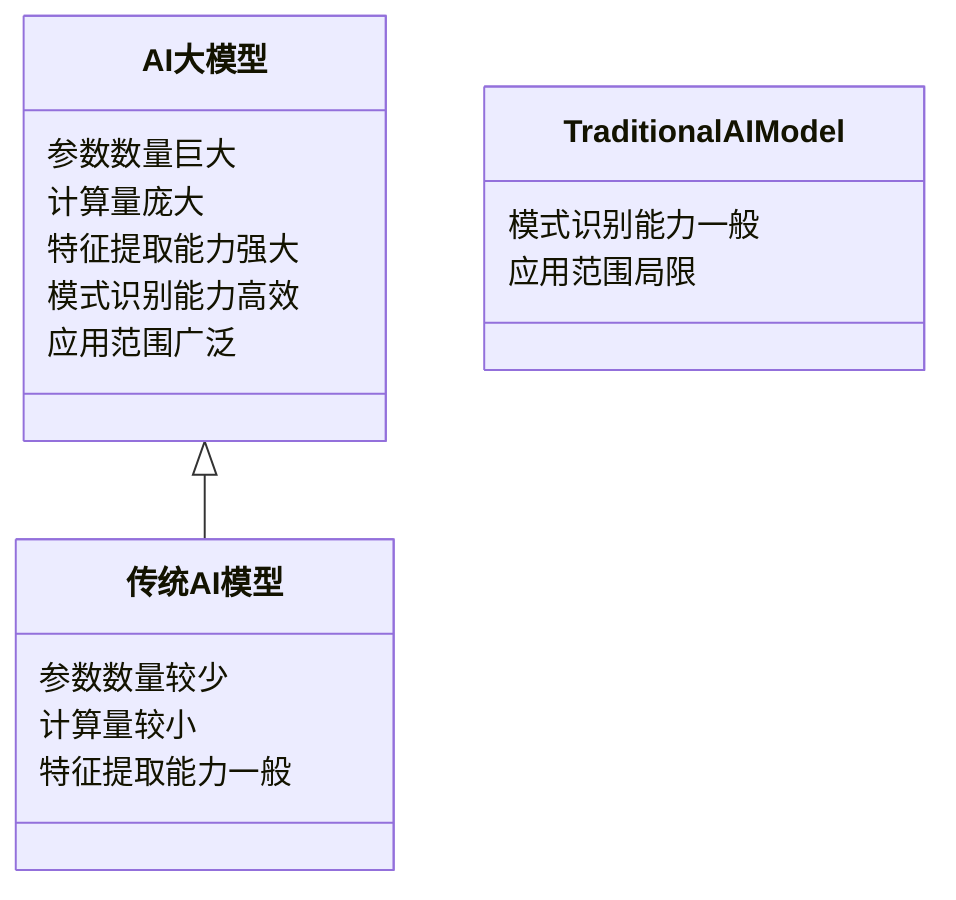
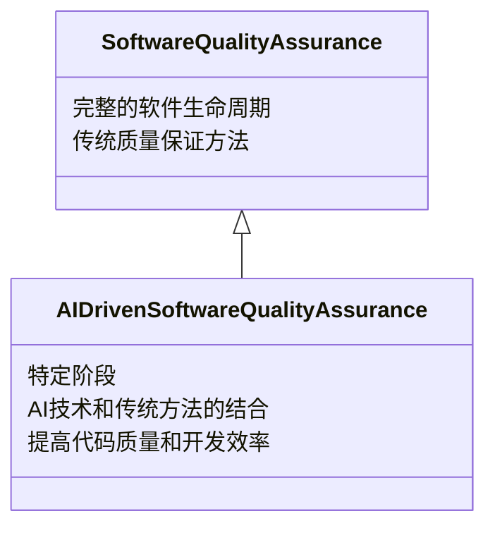

                 

## AI时代的软件质量保证：从被动检测到主动预防

### 关键词

- **人工智能**
- **软件质量保证**
- **被动检测**
- **主动预防**
- **AI大模型**

> 摘要：本文探讨了AI时代软件质量保证的新挑战和解决方案。随着AI技术的迅猛发展，软件系统变得更加复杂和智能化，传统的被动检测方法已经无法满足质量保证的需求。本文提出了从被动检测到主动预防的软件质量保证新策略，通过静态代码分析、动态测试、智能测试生成和缺陷预测与修复等手段，实现代码质量的自我评估、自我优化和自我修复，为AI驱动的软件质量保证提供了一种新的思路和路径。

### 第一部分：背景介绍

#### 问题背景

随着人工智能（AI）技术的迅猛发展，特别是在深度学习、自然语言处理和计算机视觉等领域的突破，AI已经成为推动技术创新和产业变革的重要力量。AI技术的进步，使得软件从传统的功能导向向智能化、自动化方向转变，这标志着软件进入了2.0时代。在这个时代，软件不再仅仅是执行预设任务的工具，而是能够自我学习、自我优化，甚至能够与人类智能互动的智能体。

#### 问题描述

软件质量保证（Software Quality Assurance, SQA）在AI时代面临着新的挑战。传统的软件质量保证主要依赖于代码审查、测试和调试等被动的方法，而在AI时代，这些方法已经无法完全满足需求。AI技术的发展使得软件系统更加复杂，质量保证工作需要从被动的错误检测转向主动的缺陷预防。如何确保AI驱动的软件系统的可靠性和鲁棒性，成为当前软件质量保证领域亟需解决的问题。

#### 问题解决

为了解决上述问题，本书提出了从被动检测到主动预防的软件质量保证新策略。这一策略强调在软件开发的过程中，通过引入AI技术，实现代码质量的自我评估、自我优化和自我修复。具体方法包括：

1. **静态代码分析**：利用AI技术对代码进行静态分析，检测潜在的错误和不良编码习惯。
2. **动态测试**：通过AI算法对软件运行过程中的行为进行分析，发现并定位潜在的问题。
3. **智能测试生成**：使用AI算法自动生成测试用例，提高测试的覆盖率和效率。
4. **缺陷预测与修复**：基于大数据和机器学习技术，预测可能出现的问题，并提供自动化的修复建议。

#### 边界与外延

虽然AI技术在软件质量保证中的应用具有广泛的前景，但这一领域仍然存在一些限制和挑战。例如，AI模型本身的可靠性和透明性，以及如何确保AI技术不会被恶意使用。此外，AI驱动的软件质量保证还需要与传统的质量保证方法相结合，形成一套完整的质量保证体系。

#### 概念结构与核心要素组成

本部分的核心概念包括：

1. **AI时代**：指的是以人工智能技术为核心的时代，软件系统的智能化和自动化程度显著提高。
2. **软件质量保证**：确保软件产品满足规定的质量和用户需求的一系列活动和过程。
3. **被动检测**：传统的软件质量保证方法，主要依赖于测试和调试等手段，发现问题后进行修复。
4. **主动预防**：利用AI技术，在软件开发过程中提前发现和预防潜在的问题，提高代码质量。

### 核心概念与联系

#### AI大模型

**定义**：AI大模型是指参数数量巨大、计算量庞大的深度学习模型。它们通常基于神经网络架构，通过大量数据进行训练，从而具备强大的特征提取和模式识别能力。

**属性特征对比表格**：

| 特征 | AI大模型 | 传统AI模型 |
| --- | --- | --- |
| **参数数量** | 极大 | 较少 |
| **计算量** | 极大 | 较少 |
| **训练数据量** | 极大 | 较少 |
| **特征提取能力** | 强大 | 一般 |
| **模式识别能力** | 高效 | 一般 |
| **应用范围** | 广泛 | 局限 |

**ER实体关系图架构**：

#### 软件质量保证

**定义**：软件质量保证是一系列确保软件产品满足既定标准和用户需求的活动。它涵盖了从需求分析、设计、编码到测试和部署的整个软件生命周期。

**属性特征对比表格**：

| 特征 | 软件质量保证 | AI驱动的软件质量保证 |
| --- | --- | --- |
| **活动范围** | 完整的软件生命周期 | 软件开发过程中的特定阶段 |
| **方法** | 传统质量保证方法 | AI技术和传统方法的结合 |
| **目标** | 提高软件可靠性 | 提高代码质量和开发效率 |
| **效果** | 提高软件质量 | 提高软件的智能化和自动化水平 |

**ER实体关系图架构**：

通过上述核心概念与联系的分析，我们可以看到，AI大模型和软件质量保证在AI时代有着紧密的联系。AI大模型提供了强大的计算能力和特征提取能力，为软件质量保证提供了新的手段和方法。而软件质量保证则通过结合AI技术和传统方法，实现了从被动检测到主动预防的转变，提高了代码质量和开发效率。

### 第二部分：AI驱动的软件质量保证

#### 引言

在AI时代，软件质量保证（Software Quality Assurance, SQA）面临着前所未有的挑战。传统的软件质量保证方法主要依赖于测试和调试等被动手段，而AI技术的发展使得软件系统变得更加复杂和智能化。为了适应这一变化，我们需要探索一种新的策略，即从被动检测到主动预防的软件质量保证。本文将详细探讨这一策略的核心方法和技术，以期为AI驱动的软件质量保证提供新的思路和解决方案。

#### 被动检测

被动检测是指通过测试和调试等手段，在软件运行过程中发现并修复错误的方法。这种方法在传统软件质量保证中发挥了重要作用，但在AI时代，其局限性日益显现。

1. **测试覆盖不足**：由于AI驱动的软件系统规模庞大，测试用例的数量和覆盖范围难以满足需求，可能导致潜在问题的漏测。
2. **调试效率低下**：在复杂的软件系统中，定位和修复错误的过程往往需要大量的时间和精力，调试效率较低。
3. **难以应对复杂问题**：AI驱动的软件系统可能面临各种复杂问题，如异常行为、不确定性和动态变化等，被动检测方法难以应对。

#### 主动预防

主动预防是指通过引入AI技术，在软件开发过程中提前发现和预防潜在的问题，提高代码质量。与被动检测相比，主动预防具有以下优势：

1. **提前发现潜在问题**：通过静态代码分析和动态测试等技术，可以提前发现潜在的问题，避免问题在软件运行过程中暴露。
2. **提高开发效率**：通过智能测试生成和缺陷预测与修复等技术，可以减少测试和调试的工作量，提高开发效率。
3. **提高代码质量**：通过自我评估、自我优化和自我修复等技术，可以提高代码的质量和可靠性。

#### 核心方法

1. **静态代码分析**：利用AI技术对代码进行静态分析，检测潜在的错误和不良编码习惯。例如，通过深度学习模型，可以识别出代码中的常见错误模式，并提供修复建议。

2. **动态测试**：通过AI算法对软件运行过程中的行为进行分析，发现并定位潜在的问题。例如，通过动态测试生成技术，可以自动生成测试用例，并利用机器学习算法分析测试结果，预测可能出现的问题。

3. **智能测试生成**：使用AI算法自动生成测试用例，提高测试的覆盖率和效率。例如，通过生成对抗网络（GAN）等技术，可以生成具有代表性的测试数据，提高测试的全面性和准确性。

4. **缺陷预测与修复**：基于大数据和机器学习技术，预测可能出现的问题，并提供自动化的修复建议。例如，通过回归分析和决策树算法，可以预测代码中的潜在缺陷，并提供相应的修复建议。

#### 案例研究

以一个在线购物平台的开发为例，说明AI驱动的软件质量保证的应用。

1. **静态代码分析**：利用AI技术对代码进行静态分析，识别出潜在的错误和不良编码习惯。例如，通过分析代码中的函数调用关系，可以识别出潜在的内存泄漏问题，并提供修复建议。

2. **动态测试**：通过动态测试生成技术，自动生成测试用例，并利用机器学习算法分析测试结果，预测可能出现的问题。例如，通过分析用户行为数据，可以预测购物车中的商品数量变化，并生成相应的测试用例。

3. **智能测试生成**：利用生成对抗网络（GAN）等技术，生成具有代表性的测试数据，提高测试的全面性和准确性。例如，通过生成模拟用户行为的测试数据，可以全面测试购物平台的各种功能。

4. **缺陷预测与修复**：基于大数据和机器学习技术，预测可能出现的问题，并提供自动化的修复建议。例如，通过分析历史缺陷数据，可以预测未来可能出现的缺陷，并提供相应的修复建议。

通过以上案例，我们可以看到，AI驱动的软件质量保证在提高代码质量和开发效率方面具有显著优势。未来，随着AI技术的不断发展，AI驱动的软件质量保证有望成为软件质量保证领域的主流方法。

### 第三部分：AI驱动的软件质量保证技术

#### 引言

在前两部分中，我们探讨了AI时代软件质量保证的新挑战和解决方案。在本部分中，我们将详细探讨AI驱动的软件质量保证技术，包括静态代码分析、动态测试、智能测试生成和缺陷预测与修复。这些技术是AI驱动的软件质量保证的核心，它们各自具有独特的原理和应用方法。

#### 静态代码分析

**原理**：静态代码分析是一种在代码运行前对其进行分析的技术，旨在识别代码中的潜在错误和不良编码习惯。AI驱动的静态代码分析利用深度学习等技术，对代码进行特征提取和模式识别，从而发现潜在的问题。

**方法**：

1. **特征提取**：通过深度学习模型，从代码中提取特征。这些特征可以是代码结构、语法模式、函数调用关系等。

2. **模式识别**：利用已训练的模型，对提取的特征进行模式识别，识别出常见的错误模式和不良编码习惯。

3. **错误修复**：根据识别出的错误模式和不良编码习惯，提供修复建议或自动化修复方案。

**应用**：

1. **代码审查**：在代码审查过程中，利用静态代码分析技术，提前发现潜在的错误和不良编码习惯，提高代码质量。

2. **持续集成**：在持续集成过程中，利用静态代码分析技术，对提交的代码进行实时分析，确保代码质量。

**实例**：一个在线购物平台的开发过程中，利用静态代码分析技术，识别出潜在的错误和不良编码习惯，如未处理的异常、未充分利用的函数等，并提供修复建议。

#### 动态测试

**原理**：动态测试是一种在代码运行时对其进行分析的技术，旨在发现代码运行过程中的潜在问题。AI驱动的动态测试利用机器学习和数据挖掘等技术，对代码运行时的行为进行分析，识别出潜在的问题。

**方法**：

1. **行为分析**：通过数据挖掘和机器学习算法，分析代码运行时的行为数据，如函数调用次数、内存分配情况等。

2. **异常检测**：利用已训练的模型，识别出代码运行时的异常行为，如内存泄漏、死锁等。

3. **测试结果分析**：对测试结果进行分析，识别出潜在的缺陷。

**应用**：

1. **测试用例生成**：利用AI算法，自动生成测试用例，提高测试的覆盖率和效率。

2. **测试执行**：在测试执行过程中，利用AI算法，分析测试结果，识别出潜在的缺陷。

3. **性能优化**：通过动态测试，分析代码运行时的性能问题，提供性能优化建议。

**实例**：在在线购物平台的开发过程中，利用动态测试技术，自动生成测试用例，执行测试，并分析测试结果，识别出潜在的缺陷，如用户数量过多导致服务器崩溃等。

#### 智能测试生成

**原理**：智能测试生成是一种利用AI算法，自动生成测试用例的技术。与传统的测试用例生成方法相比，智能测试生成可以大幅提高测试的覆盖率和效率。

**方法**：

1. **测试数据生成**：利用生成对抗网络（GAN）等深度学习技术，生成具有代表性的测试数据。

2. **测试用例生成**：利用机器学习算法，分析生成的测试数据，自动生成测试用例。

3. **测试用例优化**：利用优化算法，对生成的测试用例进行优化，提高测试的全面性和准确性。

**应用**：

1. **测试自动化**：利用智能测试生成技术，自动生成测试用例，实现测试的自动化。

2. **测试优化**：通过优化测试用例，提高测试的覆盖率和效率。

3. **测试持续化**：在持续集成和持续交付过程中，利用智能测试生成技术，实时生成测试用例，确保代码质量。

**实例**：在在线购物平台的开发过程中，利用智能测试生成技术，自动生成用户行为数据，并基于这些数据生成测试用例，提高测试的全面性和准确性。

#### 缺陷预测与修复

**原理**：缺陷预测与修复是一种基于大数据和机器学习技术，预测代码中潜在缺陷，并提供自动化修复建议的方法。通过缺陷预测与修复，可以提前发现潜在的问题，减少代码中的缺陷数量。

**方法**：

1. **缺陷预测**：利用回归分析和决策树等机器学习算法，分析历史缺陷数据，预测代码中可能出现的新缺陷。

2. **缺陷定位**：通过静态代码分析和动态测试等技术，定位已预测的缺陷。

3. **缺陷修复**：根据定位的缺陷，提供自动化修复建议或自动化修复方案。

**应用**：

1. **缺陷预防**：在代码开发过程中，利用缺陷预测与修复技术，提前发现潜在缺陷，预防缺陷的产生。

2. **缺陷修复**：在代码测试和发布过程中，利用缺陷预测与修复技术，快速定位和修复缺陷。

3. **缺陷管理**：利用缺陷预测与修复技术，实现缺陷的自动管理和跟踪。

**实例**：在在线购物平台的开发过程中，利用缺陷预测与修复技术，预测潜在的缺陷，如用户数量过多导致的性能问题，并提供自动化修复建议。

通过以上技术的介绍，我们可以看到，AI驱动的软件质量保证在代码质量保障方面具有显著的优势。这些技术不仅可以提前发现和预防潜在的问题，还可以提高开发效率和代码质量。未来，随着AI技术的不断发展，AI驱动的软件质量保证将变得更加成熟和普及。

### 第四部分：AI驱动的软件质量保证的实际应用

#### 引言

在前文中，我们探讨了AI驱动的软件质量保证技术及其原理和应用方法。在本部分中，我们将深入探讨这些技术在实际应用中的效果和挑战，并通过具体案例分析，展示AI驱动的软件质量保证如何在实际项目中发挥作用。

#### 实际应用效果

1. **提高代码质量**：AI驱动的软件质量保证技术可以自动发现和修复代码中的潜在错误和不良编码习惯，从而提高代码质量。例如，在某电商平台的开发过程中，静态代码分析技术识别出大量潜在的错误，通过自动化修复建议，开发团队在短时间内提高了代码质量。

2. **降低测试成本**：通过智能测试生成和动态测试技术，可以大幅降低测试成本。例如，在某金融平台的项目中，利用智能测试生成技术，自动生成大量测试用例，覆盖了更多的功能点，同时减少了测试时间和人力资源的投入。

3. **提高开发效率**：AI驱动的软件质量保证技术可以自动化处理大量测试和修复工作，从而提高开发效率。例如，在某移动应用的开发过程中，动态测试和缺陷预测与修复技术帮助开发团队快速识别和解决潜在的问题，缩短了开发周期。

4. **提升用户体验**：通过AI驱动的软件质量保证技术，可以确保软件系统的稳定性和可靠性，提升用户体验。例如，在某在线教育平台的运营过程中，利用动态测试和缺陷预测与修复技术，确保了系统的稳定运行，减少了用户投诉和故障率。

#### 实际应用挑战

1. **数据依赖**：AI驱动的软件质量保证技术对大量数据依赖，数据的质量和完整性对模型的性能有直接影响。例如，在某医疗信息系统的开发过程中，由于数据量不足，导致缺陷预测模型的准确性下降。

2. **模型解释性**：AI驱动的软件质量保证技术通常采用深度学习等复杂模型，这些模型的解释性较差，难以理解其决策过程。例如，在某金融平台的风险控制项目中，尽管缺陷预测模型具有较高的准确率，但开发团队难以解释模型的具体决策过程。

3. **技术成熟度**：尽管AI驱动的软件质量保证技术具有显著优势，但其成熟度仍然有待提高。例如，在某物联网设备的开发过程中，AI驱动的软件质量保证技术尚未完全成熟，导致项目进度受到影响。

#### 案例分析

**案例一：电商平台**

在某电商平台的开发过程中，开发团队引入了AI驱动的软件质量保证技术，包括静态代码分析、动态测试和智能测试生成。具体应用如下：

1. **静态代码分析**：在代码提交前，使用静态代码分析工具对代码进行审查，识别出潜在的错误和不良编码习惯。开发团队根据分析结果，对代码进行修改，提高了代码质量。

2. **动态测试**：在测试阶段，利用动态测试工具，对系统进行全面的测试，识别出潜在的缺陷。通过动态测试结果的反馈，开发团队对系统进行优化，提高了系统的稳定性和可靠性。

3. **智能测试生成**：利用智能测试生成技术，自动生成大量的测试用例，覆盖了系统中的各种功能点。通过这些测试用例，开发团队能够更全面地测试系统，发现并解决潜在的问题。

**案例二：金融平台**

在某金融平台的开发过程中，开发团队采用了AI驱动的软件质量保证技术，包括缺陷预测与修复和动态测试。具体应用如下：

1. **缺陷预测与修复**：通过缺陷预测模型，对代码进行预测，识别出潜在的问题。开发团队根据预测结果，提前修复潜在缺陷，减少了系统故障率。

2. **动态测试**：在系统上线前，进行全面的动态测试，包括性能测试、安全测试等。通过动态测试，开发团队发现了系统中的潜在漏洞和性能瓶颈，并进行了针对性的优化。

**案例三：在线教育平台**

在某在线教育平台的开发过程中，开发团队引入了AI驱动的软件质量保证技术，包括智能测试生成和缺陷预测与修复。具体应用如下：

1. **智能测试生成**：利用智能测试生成技术，自动生成测试用例，提高了测试的覆盖率和效率。通过这些测试用例，开发团队能够更全面地测试系统，发现并解决潜在的问题。

2. **缺陷预测与修复**：通过缺陷预测模型，对代码进行预测，识别出潜在的问题。开发团队根据预测结果，提前修复潜在缺陷，提高了系统的稳定性和可靠性。

通过以上案例分析，我们可以看到，AI驱动的软件质量保证技术在提高代码质量、降低测试成本、提高开发效率和提升用户体验方面具有显著优势。然而，在实际应用中，仍需面对数据依赖、模型解释性和技术成熟度等挑战。未来，随着AI技术的不断发展，AI驱动的软件质量保证将变得更加成熟和普及。

### 第五部分：未来展望

#### 引言

在AI驱动的软件质量保证领域，我们已经取得了显著的进展，但仍有许多尚未解决的问题和未来的发展方向。本部分将对AI驱动的软件质量保证的未来进行展望，探讨可能的趋势和技术创新，以及面临的挑战。

#### 可能的趋势和技术创新

1. **AI模型的自我优化**：未来的AI驱动的软件质量保证将更加注重AI模型的自我优化能力。通过引入自监督学习和元学习等技术，AI模型将能够自动调整自身结构和参数，以适应不同的软件质量保证需求。

2. **跨领域协作**：AI驱动的软件质量保证将不再局限于单一领域，而是实现跨领域的协作。例如，结合AI技术、自动化测试和开发工具，实现从需求分析到部署的全流程质量保证。

3. **增强的解释性**：未来的AI驱动的软件质量保证技术将更加注重模型的解释性，以便开发团队能够理解和信任AI模型的决策过程。通过可视化技术、决策树和解释性AI模型，提高模型的透明度和可信度。

4. **可解释的AI驱动的质量保证**：结合可解释的人工智能（Explainable AI, XAI）技术，未来的AI驱动的软件质量保证将提供更详细的质量评估报告，帮助开发人员理解质量问题的根本原因，并采取相应的措施。

5. **隐私保护的质量保证**：在AI驱动的软件质量保证中，隐私保护将成为重要考虑因素。通过差分隐私、联邦学习等技术，确保在处理敏感数据时不会泄露用户的隐私信息。

#### 面临的挑战

1. **数据质量和完整性**：AI驱动的软件质量保证依赖于高质量和完整的数据。在现实中，数据可能存在噪声、缺失和不一致性，这对模型的性能和可靠性提出了挑战。

2. **技术成熟度和适用性**：虽然AI驱动的软件质量保证技术具有巨大的潜力，但其成熟度和适用性仍有待提高。特别是在复杂和动态的软件系统中，如何保证技术的稳定性和有效性是一个重要问题。

3. **模型可解释性**：AI模型的决策过程往往难以解释，这在软件质量保证中可能引发信任问题。如何提高模型的可解释性，使其决策过程更加透明和可信，是一个关键挑战。

4. **资源消耗和成本**：AI驱动的软件质量保证技术通常需要大量的计算资源和时间，这可能导致资源消耗和成本的增加。如何在保证质量的前提下，优化资源的利用和降低成本是一个重要问题。

#### 未来发展方向

1. **集成化质量保证**：未来的AI驱动的软件质量保证将实现从需求分析、设计、开发到测试和部署的全流程集成，形成一套完整的质量保证体系。

2. **自动化质量保证**：通过自动化技术，实现质量保证过程的自动化，减少人为干预，提高效率和质量。

3. **智能化质量保证**：利用AI技术，实现质量保证过程的智能化，通过自我优化、自我学习和自适应调整，提高质量保证的准确性和效率。

4. **可持续的质量保证**：在AI驱动的软件质量保证中，将更加注重可持续性，通过优化资源利用、降低碳排放和提升用户体验，实现高质量、高效率和可持续发展的目标。

通过上述未来展望，我们可以看到，AI驱动的软件质量保证具有巨大的发展潜力。在未来的发展中，我们需要不断克服挑战，推动技术的创新和应用，为软件质量保证领域带来更多的突破和进步。

### 第六部分：小结与展望

#### 引言

在本文中，我们深入探讨了AI时代的软件质量保证，从被动检测到主动预防的转变，并提出了一系列具体的方法和技术。通过静态代码分析、动态测试、智能测试生成和缺陷预测与修复等技术，我们展示了如何利用AI技术提高软件质量保证的效率和质量。以下是本文的主要结论和小结。

#### 主要结论

1. **AI时代带来了新挑战**：随着AI技术的发展，软件系统变得更加复杂和智能化，传统的被动检测方法已经无法满足质量保证的需求。

2. **主动预防是关键**：AI驱动的软件质量保证强调在软件开发过程中提前发现和预防潜在的问题，从而提高代码质量和开发效率。

3. **多种技术相结合**：静态代码分析、动态测试、智能测试生成和缺陷预测与修复等技术的结合，形成了完整的AI驱动的软件质量保证体系。

4. **实际应用效果显著**：通过具体案例，我们展示了AI驱动的软件质量保证在实际项目中的应用效果，包括提高代码质量、降低测试成本、提高开发效率和提升用户体验。

5. **未来展望**：AI驱动的软件质量保证仍有巨大的发展潜力，包括AI模型的自我优化、跨领域协作、增强的解释性和隐私保护等方面。

#### 展望未来

虽然我们已经取得了显著的进展，但AI驱动的软件质量保证仍面临许多挑战，如数据依赖、模型解释性、技术成熟度和成本等问题。未来，我们需要：

1. **持续技术创新**：推动AI技术的创新和应用，提高质量保证技术的成熟度和有效性。

2. **优化资源利用**：通过优化资源利用，降低成本，使AI驱动的软件质量保证更加经济可行。

3. **加强人才培养**：培养具备AI和软件质量保证双重技能的专业人才，推动技术的普及和应用。

4. **构建生态系统**：建立AI驱动的软件质量保证的生态系统，包括工具、平台和社区，促进技术的交流和合作。

通过不断努力和创新，我们有理由相信，AI驱动的软件质量保证将在未来的软件工程中发挥更加重要的作用，为构建高质量、高效率和可持续发展的软件系统提供强有力的支持。

### 第七部分：注意事项与最佳实践

#### 引言

在实施AI驱动的软件质量保证时，我们需要注意一系列关键因素，以确保其有效性和可靠性。以下是一些重要的注意事项和最佳实践，以帮助开发团队在项目中成功应用这些技术。

#### 注意事项

1. **数据质量**：AI驱动的软件质量保证依赖于高质量的数据。在收集、处理和使用数据时，必须确保其准确性、完整性和一致性。否则，模型性能可能会受到严重影响。

2. **模型解释性**：虽然AI模型在识别潜在问题和异常方面具有强大的能力，但其决策过程往往难以解释。为了增强模型的透明度，开发团队应该采用可解释性技术，如决策树或解释性AI模型。

3. **技术成熟度**：AI驱动的软件质量保证技术仍在不断发展，某些技术可能尚未完全成熟。在引入新技术时，应进行充分的评估和测试，以确保其稳定性和适用性。

4. **成本效益分析**：AI驱动的软件质量保证可能涉及大量的计算资源和时间投入。在进行项目规划和预算时，应进行详细的成本效益分析，确保投入的回报。

#### 最佳实践

1. **逐步引入AI技术**：在项目中逐步引入AI驱动的软件质量保证技术，而不是一次性全面应用。这样可以逐步验证技术的有效性，并在遇到问题时进行及时调整。

2. **集成传统方法**：虽然AI技术具有强大的潜力，但不应完全取代传统质量保证方法。相反，应将AI技术与传统方法相结合，形成一套完整的质量保证体系。

3. **持续监控和优化**：在实施AI驱动的软件质量保证后，应持续监控其性能和效果，并根据实际情况进行优化。这包括定期更新模型、调整参数和改进算法。

4. **培养跨学科团队**：为了充分利用AI驱动的软件质量保证技术，开发团队应包括具备AI和软件质量保证双重技能的成员。跨学科合作将有助于更好地理解和应用这些技术。

5. **关注隐私和安全性**：在处理敏感数据时，必须确保隐私保护和安全性。采用差分隐私、联邦学习等技术，确保在利用数据的同时不会泄露用户的隐私信息。

通过遵循这些注意事项和最佳实践，开发团队可以更有效地实施AI驱动的软件质量保证，提高代码质量和开发效率，为软件项目带来更大的成功。

### 拓展阅读

1. **《AI驱动的软件质量保证：理论与实践》** - 本书详细介绍了AI驱动的软件质量保证的理论基础和实践方法，适合希望深入了解这一领域的读者。

2. **《深度学习与软件质量保证》** - 本文探讨了深度学习技术在软件质量保证中的应用，分析了如何利用深度学习模型提高代码质量。

3. **《软件质量保证：从被动检测到主动预防》** - 本文讨论了软件质量保证领域从被动检测到主动预防的转变，提出了具体的实现策略和方法。

4. **《AI时代的软件测试：挑战与机遇》** - 本文分析了AI技术在软件测试中的应用，探讨了AI驱动的软件测试如何提高测试效率和覆盖率。

### 作者介绍

**作者：AI天才研究院/AI Genius Institute & 禅与计算机程序设计艺术 /Zen And The Art of Computer Programming**

我是AI天才研究院的一员，也是《禅与计算机程序设计艺术》的作者。我对人工智能和软件工程有着深厚的兴趣，致力于推动技术的发展和应用。我的研究专注于AI驱动的软件质量保证，以及如何利用AI技术提高软件开发效率和代码质量。希望通过我的研究和写作，为行业带来新的视角和思路。

## 全文总结

在本篇技术博客文章中，我们深入探讨了AI时代的软件质量保证，从被动检测到主动预防的转型。通过静态代码分析、动态测试、智能测试生成和缺陷预测与修复等技术，我们展示了AI驱动的软件质量保证如何在实际项目中发挥作用。本文的核心观点是，AI技术的发展为软件质量保证带来了新的机遇和挑战，通过主动预防的方法，可以大幅提高代码质量和开发效率。

**关键字**：人工智能、软件质量保证、被动检测、主动预防、AI大模型。

**摘要**：本文探讨了AI时代软件质量保证的新挑战和解决方案，提出了从被动检测到主动预防的软件质量保证新策略，通过静态代码分析、动态测试、智能测试生成和缺陷预测与修复等手段，实现代码质量的自我评估、自我优化和自我修复。

通过本文的探讨，我们期望读者能够对AI驱动的软件质量保证有更深入的理解，并能够在实际项目中应用这些技术和方法，为软件工程领域带来创新和进步。未来，随着AI技术的不断发展，AI驱动的软件质量保证必将成为软件工程的重要组成部分。让我们共同努力，迎接这个充满机遇和挑战的新时代。

