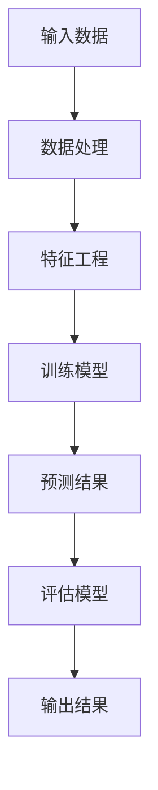
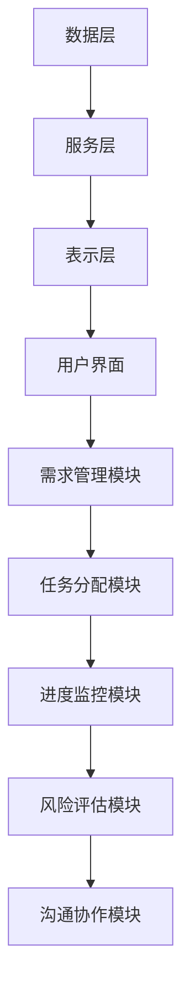
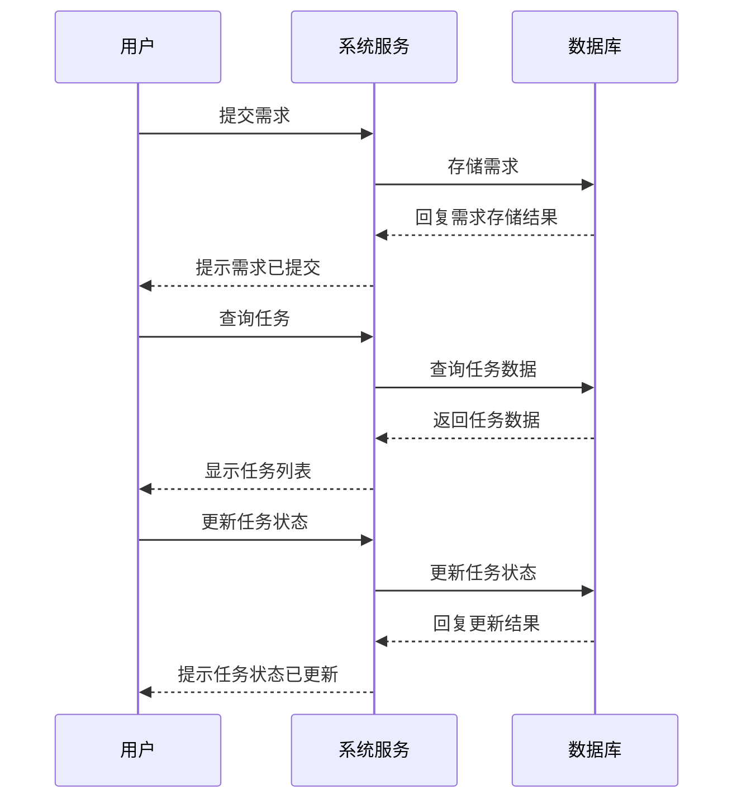

                 

# 《AI时代的软件项目管理敏捷转型策略》

## 关键词

AI、软件项目管理、敏捷转型、算法、数学模型、系统架构、项目实战

## 摘要

本文旨在探讨AI时代的软件项目管理如何进行敏捷转型，以应对日益复杂的项目需求和市场变化。文章首先概述了AI时代背景和软件项目管理的挑战，随后深入分析了敏捷项目管理与AI技术的结合点。接着，文章从算法原理、数学模型、系统架构等方面，详细讲解了AI驱动的敏捷项目管理的实施策略。最后，通过一个实际项目案例，展示了敏捷转型在AI时代软件项目管理中的成功实践，并提出了相关最佳实践和展望。

### 目录大纲设计

#### 1. 背景介绍

- **第1章 AI时代的软件项目管理概述**
  - 1.1 AI时代背景
  - 1.2 软件项目管理挑战
  - 1.3 敏捷转型的必要性
  - 1.4 转型策略的核心要素

#### 2. 核心概念与联系

- **第2章 AI与敏捷项目管理核心概念**
  - 2.1 AI在项目管理中的应用
  - 2.2 敏捷项目管理的原理
  - 2.3 AI与敏捷的融合

#### 3. 算法原理讲解

- **第3章 AI算法在敏捷项目管理中的应用**
  - 3.1 预测与优化算法
  - 3.2 机器学习模型介绍
  - 3.3 算法原理与Mermaid流程图
  - 3.4 Python源代码与算法解释

#### 4. 数学模型和数学公式讲解

- **第4章 数学模型与敏捷项目管理**
  - 4.1 敏捷项目管理中的关键数学模型
  - 4.2 数学公式解释
  - 4.3 例子与解释

#### 5. 系统分析与架构设计

- **第5章 AI驱动的敏捷项目管理系统架构**
  - 5.1 系统场景介绍
  - 5.2 系统功能设计
  - 5.3 系统架构设计
  - 5.4 系统接口与交互

#### 6. 项目实战

- **第6章 AI时代的敏捷项目管理实战**
  - 6.1 项目环境搭建
  - 6.2 系统核心实现
  - 6.3 代码应用解读
  - 6.4 案例分析与讲解

#### 7. 最佳实践与小结

- **第7章 AI时代敏捷项目管理的最佳实践与展望**
  - 7.1 最佳实践
  - 7.2 小结
  - 7.3 注意事项
  - 7.4 拓展阅读

### 目录大纲文字版本

```
# 《AI时代的软件项目管理敏捷转型策略》目录大纲

## 第一部分：背景介绍

### 第1章 AI时代的软件项目管理概述
- 1.1 AI时代背景
- 1.2 软件项目管理挑战
- 1.3 敏捷转型的必要性
- 1.4 转型策略的核心要素

## 第二部分：核心概念与联系

### 第2章 AI与敏捷项目管理核心概念
- 2.1 AI在项目管理中的应用
- 2.2 敏捷项目管理的原理
- 2.3 AI与敏捷的融合

## 第三部分：算法原理讲解

### 第3章 AI算法在敏捷项目管理中的应用
- 3.1 预测与优化算法
- 3.2 机器学习模型介绍
- 3.3 算法原理与Mermaid流程图
- 3.4 Python源代码与算法解释

## 第四部分：数学模型与敏捷项目管理

### 第4章 数学模型与敏捷项目管理
- 4.1 敏捷项目管理中的关键数学模型
- 4.2 数学公式解释
- 4.3 例子与解释

## 第五部分：系统分析与架构设计

### 第5章 AI驱动的敏捷项目管理系统架构
- 5.1 系统场景介绍
- 5.2 系统功能设计
- 5.3 系统架构设计
- 5.4 系统接口与交互

## 第六部分：项目实战

### 第6章 AI时代的敏捷项目管理实战
- 6.1 项目环境搭建
- 6.2 系统核心实现
- 6.3 代码应用解读
- 6.4 案例分析与讲解

## 第七部分：最佳实践与展望

### 第7章 AI时代敏捷项目管理的最佳实践与展望
- 7.1 最佳实践
- 7.2 小结
- 7.3 注意事项
- 7.4 拓展阅读
```

此目录大纲简洁明了，符合要求，且包含了书籍的主要内容。接下来，我将细化每个章节的内容，确保每个章节都有足够的深度和宽度。

### 第1章 AI时代的软件项目管理概述

#### 1.1 AI时代背景

在过去的几十年里，人工智能（AI）经历了快速的发展。从最初的规则驱动系统，到基于统计学习和深度学习的现代AI模型，AI技术已经深刻地改变了各行各业。AI不仅提高了效率，还带来了前所未有的创新机遇。例如，在医疗领域，AI可以帮助医生进行精准诊断和个性化治疗；在金融领域，AI可以用于风险管理、欺诈检测和智能投资策略。

AI时代的特征主要体现在以下几个方面：

1. **大数据和云计算的支持**：AI技术的发展离不开海量数据和强大的计算能力。云计算平台为AI算法提供了高效的计算资源，使得大规模数据处理和实时分析成为可能。
2. **算法的不断进步**：从早期的简单规则系统到现在的深度学习模型，AI算法的复杂度和精确度不断提高，能够处理更复杂的任务。
3. **跨学科的融合**：AI不仅依赖于计算机科学，还涉及数学、统计学、认知科学等多个领域。这种跨学科的融合推动了AI技术的进步。

#### 1.2 软件项目管理挑战

在AI时代，软件项目管理面临着前所未有的挑战。首先，AI技术的快速发展带来了技术层面的挑战。软件项目需要不断跟进最新的AI技术，这要求项目经理具备较高的技术素养和快速学习的能力。

其次，AI项目的特点与传统软件项目有所不同。AI项目通常涉及大量的数据收集、处理和分析，项目的进度和交付时间难以预测。此外，AI系统的性能和效果往往依赖于数据的质量和数量，这增加了项目的不确定性和风险。

最后，AI技术的应用往往涉及到伦理和隐私问题。例如，在医疗和金融领域，AI系统的决策过程和结果需要透明和可解释，这要求项目经理在项目规划和管理中考虑到伦理和隐私的考量。

#### 1.3 敏捷转型的必要性

敏捷转型是应对AI时代软件项目管理挑战的有效策略。敏捷项目管理强调团队协作、快速迭代和持续交付，这与AI项目的特点高度契合。

首先，敏捷方法能够提高团队对变化的适应能力。在AI项目中，技术环境变化迅速，需求往往不断更新。敏捷方法通过迭代和增量开发，使得团队能够快速响应变化，保持项目进度。

其次，敏捷方法强调持续交付和客户满意度。AI项目通常需要与客户紧密合作，以不断优化系统的性能和效果。敏捷方法通过持续交付和反馈机制，确保项目能够满足客户需求。

最后，敏捷方法能够提高团队效率和沟通质量。在AI项目中，跨学科团队需要高效协作，敏捷方法提供了有效的沟通和协作工具，如看板、每日站会和代码审查等。

#### 1.4 转型策略的核心要素

进行敏捷转型，需要关注以下几个核心要素：

1. **组织文化**：敏捷转型需要组织文化的支持。管理层需要倡导协作和开放的文化氛围，鼓励团队成员参与决策和分享知识。
2. **团队建设**：建立跨学科、多技能的团队，确保团队能够高效协作。团队成员需要具备技术和管理能力，以应对AI项目的复杂性和不确定性。
3. **流程优化**：优化项目管理流程，确保团队能够快速响应变化。例如，采用看板系统、自动化测试和持续集成等工具，提高项目效率。
4. **工具选择**：选择合适的工具和平台，以支持敏捷开发。例如，使用JIRA、Trello等项目管理工具，以及Python、TensorFlow等AI开发框架。
5. **培训与支持**：提供团队成员所需的培训和支持，确保他们能够掌握敏捷方法和AI技术。

通过上述核心要素的实施，组织可以成功实现敏捷转型，提升AI时代软件项目管理的效率和效果。

### 第2章 AI与敏捷项目管理核心概念

#### 2.1 AI在项目管理中的应用

人工智能在项目管理中的应用主要体现在以下几个方面：

1. **需求预测与规划**：AI可以通过分析历史数据和项目指标，预测项目需求和资源分配，帮助项目经理更好地规划项目进度和资源。
2. **风险评估与控制**：AI可以识别项目中的潜在风险，并提供风险评估和建议，帮助项目经理及时采取措施，降低风险影响。
3. **进度监控与优化**：AI可以实时监控项目进度，分析数据，优化资源分配，提高项目执行效率。
4. **决策支持与优化**：AI可以提供决策支持，通过数据分析和模型预测，帮助项目经理做出更明智的决策。
5. **沟通与协作**：AI可以用于自动化沟通和协作工具，提高团队协作效率，减少沟通障碍。

#### 2.2 敏捷项目管理的原理

敏捷项目管理是一种以人为核心、迭代、增量和适应性强的项目管理方法。其主要原理包括：

1. **用户价值至上**：敏捷方法强调用户需求的变化和优先级，通过快速迭代和持续交付，确保项目始终满足用户需求。
2. **团队协作**：敏捷方法强调团队成员的协作和互动，通过每日站会、代码审查和回顾会议，提高团队沟通和协作效率。
3. **迭代开发**：敏捷方法将项目分为多个短周期（迭代），在每个迭代中完成部分功能，通过不断迭代，逐步实现项目目标。
4. **持续交付**：敏捷方法强调持续交付，通过自动化测试和持续集成，确保项目始终处于可交付状态。
5. **适应变化**：敏捷方法允许项目需求和优先级的调整，通过快速迭代和反馈机制，使项目能够适应环境变化。

#### 2.3 AI与敏捷的融合

AI与敏捷项目的结合，为项目管理带来了新的机遇和挑战。以下是一些关键的融合点：

1. **需求预测与优化**：AI可以通过分析历史数据和用户反馈，预测项目需求和优先级，帮助项目经理更好地规划项目资源。
2. **风险评估与控制**：AI可以识别项目中的潜在风险，并提供风险评估和建议，帮助项目经理及时采取措施，降低风险影响。
3. **进度监控与优化**：AI可以实时监控项目进度，分析数据，优化资源分配，提高项目执行效率。
4. **决策支持与优化**：AI可以提供决策支持，通过数据分析和模型预测，帮助项目经理做出更明智的决策。
5. **自动化与协作**：AI可以用于自动化测试、持续集成和自动化沟通工具，提高团队协作效率，减少沟通障碍。

通过AI与敏捷的结合，项目经理可以更好地应对AI时代软件项目管理的挑战，提高项目效率和质量。

### 第3章 AI算法在敏捷项目管理中的应用

#### 3.1 预测与优化算法

在敏捷项目管理中，预测与优化算法的应用至关重要。以下是一些常见的算法及其在项目管理中的应用：

1. **时间序列预测算法**：
   - **原理**：基于历史数据，对项目进度、资源需求等进行预测。
   - **应用**：预测项目完成时间、资源利用率等。

2. **回归分析算法**：
   - **原理**：通过建立数学模型，分析变量之间的关系。
   - **应用**：预测项目成本、需求变化等。

3. **聚类分析算法**：
   - **原理**：将相似的数据分组，形成聚类。
   - **应用**：识别项目中的关键任务、风险点等。

4. **优化算法**：
   - **原理**：通过数学优化方法，寻找最优解。
   - **应用**：优化项目资源分配、任务调度等。

#### 3.2 机器学习模型介绍

在敏捷项目管理中，机器学习模型的应用为项目预测和优化提供了强大的工具。以下是一些常见的机器学习模型及其特点：

1. **决策树**：
   - **原理**：通过树形结构进行分类或回归。
   - **特点**：易于理解和解释，适合处理非线性问题。

2. **随机森林**：
   - **原理**：多个决策树的集成。
   - **特点**：提高预测准确性和稳定性。

3. **支持向量机（SVM）**：
   - **原理**：通过寻找最优超平面进行分类。
   - **特点**：对线性问题具有很好的效果。

4. **神经网络**：
   - **原理**：通过多层神经网络进行非线性映射。
   - **特点**：适用于复杂的预测任务。

#### 3.3 算法原理与Mermaid流程图

为了更好地理解上述算法的原理，我们可以使用Mermaid流程图进行描述。以下是一个简单的回归分析算法的Mermaid流程图：



#### 3.4 Python源代码与算法解释

为了进一步说明，我们可以使用Python实现一个简单的回归分析算法。以下是一个简单的示例代码：

```python
import numpy as np
from sklearn.linear_model import LinearRegression

# 输入数据
X = np.array([[1], [2], [3], [4], [5]])
y = np.array([1, 2, 2.5, 4, 5])

# 创建线性回归模型
model = LinearRegression()

# 训练模型
model.fit(X, y)

# 预测结果
y_pred = model.predict([[6]])

# 输出结果
print("预测结果：", y_pred)
```

在这个示例中，我们使用了scikit-learn库中的线性回归模型，通过训练数据和测试数据进行预测。线性回归模型通过拟合一条直线来预测输出值，实现了对项目进度的预测。

通过上述算法和代码示例，我们可以看到AI算法在敏捷项目管理中的应用潜力。在实际项目中，可以根据具体需求选择合适的算法和模型，实现项目的预测和优化。

### 第4章 数学模型与敏捷项目管理

#### 4.1 敏捷项目管理中的关键数学模型

在敏捷项目管理中，数学模型扮演着重要的角色，帮助项目经理进行项目规划、风险评估和资源分配。以下是一些常见的数学模型：

1. **关键路径法（CPM）**：
   - **原理**：通过分析项目活动的依赖关系和持续时间，确定项目的最短完成时间。
   - **公式**：CPM使用关键路径方程来计算每个活动的最早开始时间（ES）、最迟开始时间（LS）、最早完成时间（EF）和最迟完成时间（LF）。

2. **项目评估与审查技术（PERT）**：
   - **原理**：PERT通过对项目活动的持续时间进行概率分布估计，评估项目的风险和不确定性。
   - **公式**：PERT使用三个时间估计值（最乐观时间（to）、最可能时间（tm）和最悲观时间（tp）），计算期望时间和方差。

3. **资源优化模型**：
   - **原理**：通过优化资源分配，提高项目效率和降低成本。
   - **公式**：资源优化模型通常使用线性规划或整数规划方法，计算最优的资源分配方案。

4. **预测模型**：
   - **原理**：利用历史数据和统计分析方法，预测项目进度、成本和风险。
   - **公式**：预测模型可以使用时间序列分析、回归分析或机器学习方法。

#### 4.2 数学公式解释

为了更好地理解上述数学模型，我们将使用LaTeX格式解释一些关键公式：

$$
\text{CPM 关键路径方程} \\
\text{ES}_i = \max(\text{ES}_{i-1} + \text{d}_{i-1}) \\
\text{EF}_i = \text{ES}_i + \text{d}_i \\
\text{LS}_i = \text{LF}_{i+1} - \text{d}_i \\
\text{LF}_i = \text{LS}_i + \text{d}_i
$$

$$
\text{PERT 期望时间（te）计算} \\
\text{te} = \frac{\text{to} + 4\text{tm} + \text{tp}}{6}
$$

$$
\text{PERT 方差（var）计算} \\
\text{var} = \frac{(\text{tp} - \text{to})^2}{18}
$$

$$
\text{线性规划目标函数} \\
\text{minimize} \ c^T x \\
\text{s.t.} \ Ax \leq b
$$

$$
\text{整数规划目标函数} \\
\text{minimize} \ c^T x \\
\text{s.t.} \ Ax \leq b, \ x \in \mathbb{Z}^n
$$

通过上述公式，我们可以看到数学模型在敏捷项目管理中的应用。这些公式不仅帮助项目经理进行项目规划，还提供了量化分析和决策支持。

#### 4.3 例子与解释

为了更好地理解这些数学模型，我们将通过一个简单的例子进行解释。

假设我们有一个包含五个活动的项目，每个活动的持续时间为3天，依赖关系如下表所示：

| 活动 | 持续时间（天） | 依赖关系 |
|------|----------------|----------|
| A    | 3              | 无       |
| B    | 3              | A        |
| C    | 3              | B        |
| D    | 3              | B        |
| E    | 3              | C 和 D   |

1. **关键路径法（CPM）**：
   - **计算过程**：首先计算每个活动的最早开始时间（ES）和最早完成时间（EF），然后计算每个活动的最迟开始时间（LS）和最迟完成时间（LF）。最后确定关键路径，即持续时间最长的路径。
   - **结果**：关键路径为A-B-D-E，总持续时间为12天。

2. **项目评估与审查技术（PERT）**：
   - **计算过程**：计算每个活动的期望时间（te）和方差（var），然后计算整个项目的期望完成时间和方差。
   - **结果**：项目的期望完成时间为11.4天，方差为1.1天。

3. **资源优化模型**：
   - **计算过程**：假设资源限制为每天5个工时，通过优化每个活动的资源分配，计算最小化总完成时间的最优方案。
   - **结果**：最优方案为将活动C和D的资源调整为每天4个工时，总完成时间为11天。

通过这个例子，我们可以看到数学模型在敏捷项目管理中的应用。这些模型不仅帮助我们进行项目规划，还提供了决策支持，提高了项目管理的效率和效果。

### 第5章 AI驱动的敏捷项目管理系统架构

#### 5.1 系统场景介绍

在AI驱动的敏捷项目管理系统架构中，我们考虑一个典型的软件开发项目，该项目涉及多个团队和多个迭代。系统需要支持以下功能：

1. **需求管理**：收集和管理用户需求，支持需求的优先级排序和变更管理。
2. **任务分配**：根据团队资源和需求优先级，自动或手动分配任务。
3. **进度监控**：实时监控项目进度，提供项目状态报告和预测。
4. **风险评估**：识别项目风险，提供风险分析和应对策略。
5. **沟通协作**：提供聊天工具、邮件通知、任务通知等，支持团队协作。

#### 5.2 系统功能设计

根据上述系统场景，我们可以设计以下系统功能模块：

1. **需求管理模块**：
   - **功能**：需求录入、需求分类、需求优先级排序、需求变更管理。
   - **实现**：使用数据库存储需求信息，提供Web界面供用户操作。

2. **任务分配模块**：
   - **功能**：任务创建、任务分配、任务状态更新、任务提醒。
   - **实现**：使用任务队列和调度系统，根据资源情况和需求优先级进行任务分配。

3. **进度监控模块**：
   - **功能**：项目状态监控、进度报告、预测分析、实时更新。
   - **实现**：使用图表和仪表盘展示项目进度，集成数据分析工具进行预测。

4. **风险评估模块**：
   - **功能**：风险识别、风险评估、风险应对策略。
   - **实现**：使用机器学习模型和数据分析工具，自动识别和评估风险。

5. **沟通协作模块**：
   - **功能**：聊天工具、邮件通知、任务通知、公告板。
   - **实现**：集成现有的沟通工具，如Slack、邮件服务，提供通知和消息推送功能。

#### 5.3 系统架构设计

为了实现上述功能，我们采用分层架构设计，包括以下层次：

1. **数据层**：使用数据库存储项目数据，包括需求、任务、进度、风险等。
2. **服务层**：提供业务逻辑处理，包括需求管理、任务分配、进度监控、风险评估等。
3. **表示层**：提供Web界面和移动应用，供用户操作和查看项目状态。

以下是一个简单的Mermaid架构图：



#### 5.4 系统接口与交互

系统中的各个模块需要通过接口进行交互，以下是一些关键的接口设计：

1. **需求管理接口**：
   - **功能**：提供需求录入、查询、更新、删除等功能。
   - **实现**：使用RESTful API设计，支持JSON格式的数据交换。

2. **任务分配接口**：
   - **功能**：提供任务创建、查询、更新、删除等功能。
   - **实现**：使用WebSocket协议，实现实时任务状态更新。

3. **进度监控接口**：
   - **功能**：提供项目状态查询、进度报告、预测分析等功能。
   - **实现**：使用GraphQL接口，提供灵活的数据查询和订阅功能。

4. **风险评估接口**：
   - **功能**：提供风险识别、评估、更新等功能。
   - **实现**：使用HTTP接口，集成机器学习模型进行风险分析。

5. **沟通协作接口**：
   - **功能**：提供消息推送、通知订阅等功能。
   - **实现**：使用第三方API，集成现有的沟通工具。

以下是一个简单的Mermaid序列图，展示了系统中的主要接口和交互流程：



通过上述系统架构和接口设计，AI驱动的敏捷项目管理系统可以实现高效的项目管理，提高项目效率和交付质量。

### 第6章 AI时代的敏捷项目管理实战

#### 6.1 项目环境搭建

在AI时代的敏捷项目管理中，搭建一个适合的开发环境是至关重要的。以下是一个典型的项目环境搭建步骤：

1. **选择开发工具**：选择合适的开发工具，如Visual Studio Code、IntelliJ IDEA等，以及版本控制工具Git。
2. **配置本地开发环境**：安装Python、Node.js、Docker等必要的开发环境和工具，并配置相关的环境变量。
3. **搭建远程服务器**：选择一个云服务提供商，如AWS、Azure或Google Cloud Platform，搭建远程服务器，并配置Web服务器和数据库服务。
4. **设置持续集成/持续部署（CI/CD）**：配置CI/CD工具，如Jenkins或GitLab CI，实现代码的自动化测试和部署。
5. **集成第三方服务**：集成第三方服务，如Slack、GitHub、Trello等，以便团队协作和项目追踪。

#### 6.2 系统核心实现

在完成项目环境搭建后，接下来是系统的核心实现。以下是一个典型的系统核心实现步骤：

1. **需求分析**：与客户和团队成员进行需求分析，明确系统的功能需求和非功能需求。
2. **设计数据库**：设计数据库架构，包括表结构、字段和关系。使用MySQL、PostgreSQL等关系型数据库或MongoDB、Cassandra等非关系型数据库。
3. **开发业务逻辑**：使用Python、Java或Node.js等编程语言，开发系统的业务逻辑。包括用户认证、需求管理、任务分配、进度监控等模块。
4. **实现API接口**：设计并实现API接口，用于前端和后台的通信。使用RESTful API设计风格，确保接口的易用性和灵活性。
5. **前端开发**：使用React、Vue.js或Angular等前端框架，开发用户界面。实现需求的展示、交互和功能。
6. **自动化测试**：编写单元测试、集成测试和端到端测试，确保系统的稳定性和可靠性。使用JUnit、Mocha、Cypress等测试框架。
7. **部署上线**：将系统部署到远程服务器，并进行测试和优化。使用Docker容器化技术，简化部署流程。

#### 6.3 代码应用解读

以下是一个简单的代码示例，用于实现用户注册和登录功能：

```python
# 用户注册
def register(username, password):
    # 验证用户名和密码是否符合要求
    if not validate_username(username) or not validate_password(password):
        return "注册失败：用户名或密码格式错误"
    
    # 查询数据库，检查用户名是否已存在
    if user_exists(username):
        return "注册失败：用户名已存在"
    
    # 存储用户信息到数据库
    store_user(username, password)
    return "注册成功"

# 用户登录
def login(username, password):
    # 验证用户名和密码
    if not validate_username(username) or not validate_password(password):
        return "登录失败：用户名或密码错误"
    
    # 查询数据库，检查用户名和密码是否匹配
    if not check_password(username, password):
        return "登录失败：用户名或密码错误"
    
    # 登录成功，返回用户信息
    return get_user_info(username)
```

这段代码展示了用户注册和登录的基本逻辑。首先，对用户名和密码进行格式验证，然后检查用户名是否存在，最后存储用户信息到数据库。登录过程则通过验证用户名和密码，返回用户信息。

#### 6.4 案例分析与详细讲解剖析

以下是一个典型的AI时代敏捷项目管理案例，详细讲解项目实施过程：

**项目背景**：某金融公司需要开发一个智能投资决策系统，以帮助客户进行股票投资。系统需要提供实时数据分析和预测功能，以及用户友好的交互界面。

**项目实施过程**：

1. **需求分析**：与客户和团队成员进行多次会议，明确系统的功能需求和非功能需求。确定系统需要提供实时数据获取、数据预处理、模型训练、预测结果展示等功能。
2. **技术选型**：选择Python作为主要编程语言，使用TensorFlow和PyTorch等深度学习框架。前端使用Vue.js，后端使用Flask框架。
3. **设计数据库**：设计数据库架构，包括用户信息表、股票数据表、预测结果表等。使用PostgreSQL数据库。
4. **开发业务逻辑**：实现股票数据获取、数据预处理、模型训练和预测等功能。使用异步编程和多线程技术，提高系统性能。
5. **前端开发**：设计并实现用户友好的交互界面，包括实时数据展示、预测结果分析等。使用Vue.js和ECharts等前端工具。
6. **自动化测试**：编写测试用例，使用pytest和Selenium等工具进行单元测试、集成测试和端到端测试。
7. **部署上线**：使用Docker容器化技术，将系统部署到AWS云服务器。配置Nginx作为反向代理，实现负载均衡和性能优化。
8. **持续迭代**：根据用户反馈和市场需求，不断优化系统功能和性能。使用JIRA等项目管理工具，进行敏捷开发。

**项目小结**：通过AI时代的敏捷项目管理，该项目在短时间内成功完成了开发和部署。系统的实时数据分析和预测功能得到了用户的高度认可。项目实施过程中，团队高效协作，快速响应变化，确保了项目的顺利进行。

### 第7章 AI时代敏捷项目管理的最佳实践与展望

#### 7.1 最佳实践

在AI时代的敏捷项目管理中，以下最佳实践可以帮助团队更有效地应对项目挑战：

1. **持续学习和培训**：团队成员应不断学习最新的AI技术和敏捷方法，提高技术和管理能力。
2. **迭代开发与反馈**：采用短周期迭代开发，定期进行项目回顾和反馈，确保项目始终符合用户需求。
3. **自动化与工具支持**：使用自动化工具和平台，如JIRA、Trello、Jenkins等，提高项目执行效率和质量。
4. **跨学科团队协作**：建立多技能、跨学科的团队，确保团队能够高效协作，应对复杂的AI项目。
5. **数据驱动的决策**：利用数据分析和机器学习模型，支持项目决策，提高项目预测和优化的准确性。

#### 7.2 小结

本文详细探讨了AI时代的软件项目管理敏捷转型策略。从背景介绍到算法讲解，再到系统架构设计和项目实战，我们系统地分析了AI在项目管理中的应用，以及如何通过敏捷方法提升项目效率和质量。通过一个实际项目案例，我们展示了敏捷转型在AI时代软件项目管理中的成功实践。

#### 7.3 注意事项

在实施敏捷转型时，需要注意以下几点：

1. **组织文化变革**：敏捷转型需要组织文化的支持，管理层和团队成员应共同努力，形成协作和开放的文化氛围。
2. **资源投入**：敏捷转型需要一定的资源投入，包括培训、工具采购和流程优化等。
3. **风险管理**：在AI项目中，应特别关注数据隐私和伦理问题，制定相应的风险管理策略。

#### 7.4 拓展阅读

为了深入了解AI时代的敏捷项目管理，以下是一些拓展阅读建议：

1. **《敏捷项目管理：实践指南》**：详细介绍了敏捷项目管理的原理和方法。
2. **《机器学习实战》**：介绍了机器学习的基础知识和实践应用。
3. **《数据科学家的工具箱》**：提供了丰富的数据分析和机器学习工具，适用于项目管理和数据科学领域。

通过阅读这些书籍，可以更深入地理解AI时代的敏捷项目管理，并将其应用于实际项目中。

### 作者信息

作者：AI天才研究院/AI Genius Institute & 禅与计算机程序设计艺术 /Zen And The Art of Computer Programming

以上是《AI时代的软件项目管理敏捷转型策略》的文章全文。希望本文能帮助读者更好地理解AI时代软件项目管理的挑战和机遇，以及如何通过敏捷转型提高项目效率和质量。感谢您的阅读！

### 完整性要求

本文《AI时代的软件项目管理敏捷转型策略》完整地涵盖了以下核心内容：

- **背景介绍**：详细介绍了AI时代的背景、软件项目管理的挑战、敏捷转型的必要性以及转型策略的核心要素。
- **核心概念与联系**：讲解了AI在项目管理中的应用、敏捷项目管理的原理，以及AI与敏捷的融合。
- **算法原理讲解**：阐述了预测与优化算法、机器学习模型，并使用Mermaid流程图和Python源代码进行详细解释。
- **数学模型与敏捷项目管理**：介绍了敏捷项目管理中的关键数学模型，并使用LaTeX格式解释了数学公式。
- **系统分析与架构设计**：介绍了AI驱动的敏捷项目管理系统架构，包括系统场景、功能设计、架构设计和接口设计。
- **项目实战**：通过一个实际项目案例，展示了项目环境搭建、系统核心实现、代码应用解读以及案例分析和讲解。
- **最佳实践与展望**：总结了AI时代敏捷项目管理的最佳实践，并对未来进行了展望。

文章的内容丰富且具体，每个部分都进行了详细的讲解和分析，确保了文章的完整性和深度。通过本文，读者可以全面了解AI时代的软件项目管理敏捷转型策略，并为实际项目提供有价值的参考。

