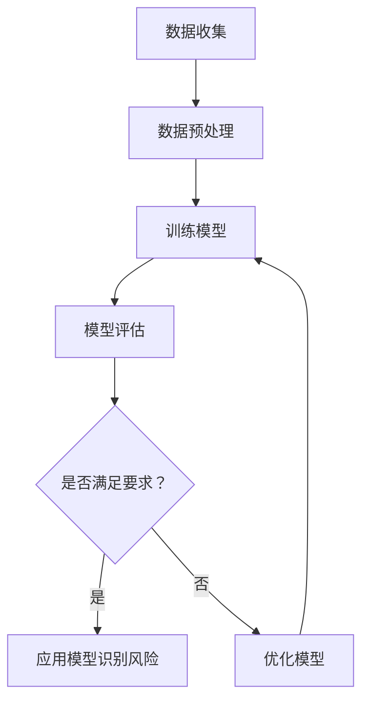
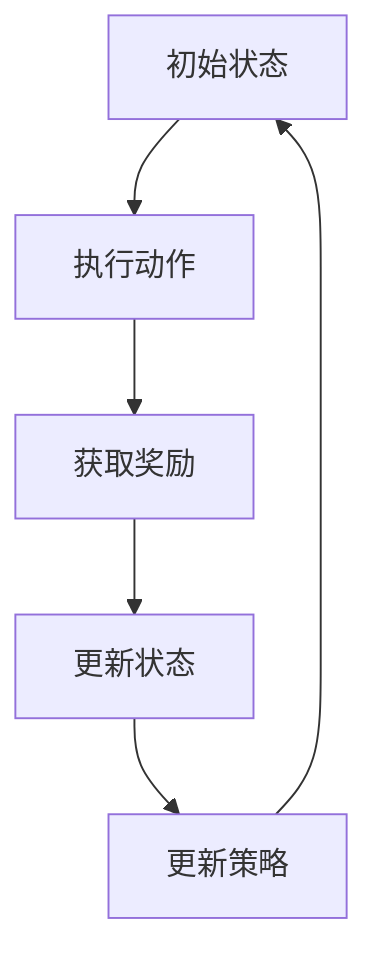
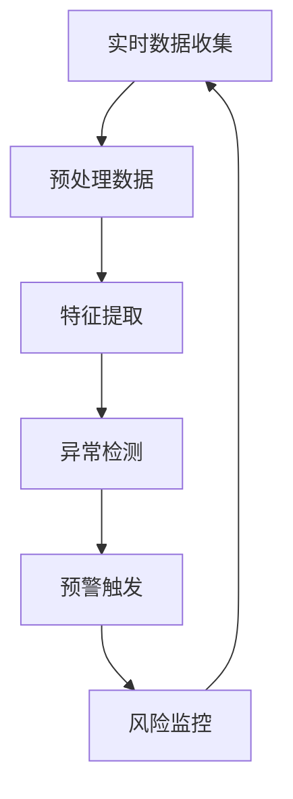
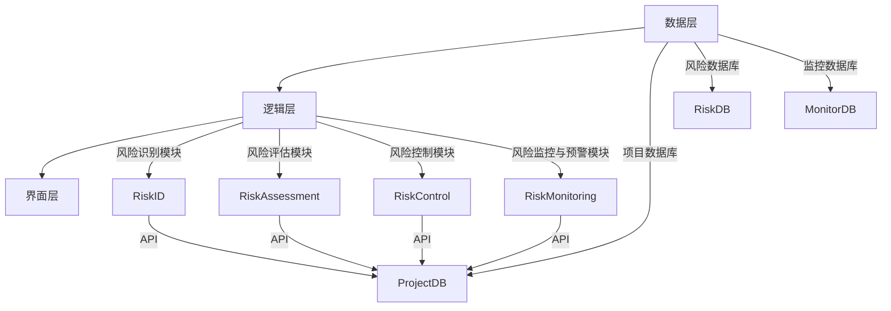
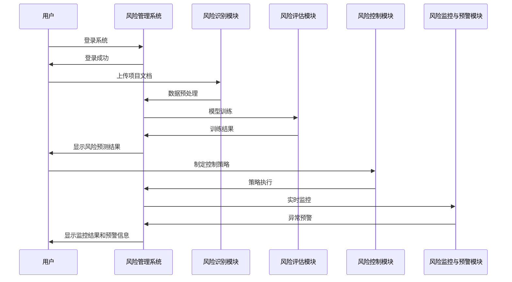

                 

### 目录大纲：核心概念与联系

## 第二部分：AI与软件项目风险管理的核心概念

### 第2章：核心概念介绍

## 2.1 软件项目风险管理基础

### 2.1.1 风险管理的定义与目标

风险管理是一种系统性的方法，用于识别、评估、处理和监控项目中的潜在风险，以确保项目的顺利进行和目标的实现。在软件项目中，风险管理尤为重要，因为软件项目往往具有高度的不确定性和复杂性。

#### 定义：
风险管理是通过对潜在风险进行识别、评估、处理和监控，以降低项目风险对项目目标的影响的过程。

#### 目标：
- 减少项目风险的发生概率
- 降低项目风险的影响程度
- 提高项目成功的可能性
- 提高项目管理的效率和效果

### 2.1.2 风险识别的方法

风险识别是风险管理的第一步，目的是确定项目中可能存在的风险。以下是一些常用的风险识别方法：

#### 专家评估法：
通过专家的经验和知识来识别潜在风险。

#### 脚本化自动化工具：
使用脚本或自动化工具来识别常见的风险模式。

#### 数据挖掘与分析：
通过分析历史数据和项目文档来识别潜在的风险。

### 2.1.3 风险评估技术

风险评估是对识别出的风险进行评估，确定其发生的概率和影响程度。以下是一些常用的风险评估技术：

#### 定性评估：
通过专家判断和经验来评估风险的概率和影响。

#### 定量评估：
使用数学模型和统计数据来评估风险的概率和影响。

#### 综合评估方法：
结合定性评估和定量评估的方法，对风险进行更全面的评估。

### 2.1.4 风险控制策略

风险控制是采取行动来降低风险的概率和影响。以下是一些常见的风险控制策略：

#### 风险规避：
通过改变项目计划或策略来避免风险的发生。

#### 风险转移：
将风险转移到第三方，如保险公司或合作伙伴。

#### 风险减轻：
采取措施降低风险的发生概率或影响程度。

#### 风险接受：
承认风险的存在，并采取适当的措施来应对。

### 2.1.5 风险监控与预警系统

风险监控与预警系统用于实时监控项目风险的变化，并提前预警可能发生的风险。以下是一些关键要素：

#### 监控指标的设定：
确定需要监控的关键指标，如进度、成本、质量等。

#### 预警机制的设计：
设计预警机制，当指标超出预期时，及时发出警报。

#### 实时监控与反馈机制：
建立实时监控系统，并对风险变化进行及时反馈和调整。

### 2.1.6 本章小结

在本章中，我们介绍了软件项目风险管理的核心概念，包括风险管理的定义与目标、风险识别的方法、风险评估技术、风险控制策略以及风险监控与预警系统。这些核心概念是理解和应用AI技术进行软件项目风险管理的基础。

### 第2章：核心概念介绍

## 2.2 AI技术的核心原理

AI（人工智能）是一门研究、开发用于模拟、延伸和扩展人的智能的理论、方法、技术及应用系统的技术科学。AI技术在软件项目风险管理中的应用正在迅速发展，为风险识别、评估、控制和监控提供了新的方法和工具。以下将介绍AI技术的核心原理。

### 2.2.1 人工智能的基本原理

人工智能的基本原理包括以下几个方面：

#### 机器学习：
机器学习是AI的核心组成部分，它通过算法从数据中学习规律，并自动改进性能。主要类型包括：

- **监督学习**：算法从标记数据中学习，并用于预测未知数据的标签。
- **无监督学习**：算法从未标记数据中学习，用于发现数据中的模式和关系。
- **半监督学习和强化学习**：结合监督学习和无监督学习的特点，以及通过交互学习来优化性能。

#### 深度学习：
深度学习是机器学习的一个分支，通过多层神经网络来模拟人类大脑的学习过程。其关键要素包括：

- **神经网络**：由大量节点（神经元）组成的计算模型，通过前向传播和反向传播算法来学习和优化。
- **激活函数**：用于引入非线性，使神经网络能够模拟更复杂的函数关系。
- **损失函数**：用于评估模型预测的误差，并指导模型优化。

#### 强化学习：
强化学习是一种通过奖励和惩罚来驱动模型学习和决策的方法，主要应用于动态决策问题。

### 2.2.2 机器学习算法介绍

常见的机器学习算法包括：

- **线性回归**：用于预测连续值，通过拟合数据点与自变量之间的线性关系。
  $$ y = \beta_0 + \beta_1 \cdot x $$
- **逻辑回归**：用于分类问题，通过拟合数据点与自变量之间的逻辑关系。
  $$ P(Y=1) = \frac{1}{1 + e^{-(\beta_0 + \beta_1 \cdot x)}} $$
- **决策树**：通过一系列规则来划分数据，并用于分类和回归问题。
  $$ \text{if } x \text{ is } \text{A}, \text{ then predict } y_1; \text{ else predict } y_2 $$
- **支持向量机（SVM）**：通过找到一个最优的超平面来划分数据，用于分类问题。
  $$ w \cdot x - b = 0 $$
- **随机森林**：通过构建多个决策树，并进行集成学习来提高模型的泛化能力。

### 2.2.3 AI算法在风险管理中的应用

AI算法在风险管理中可以应用于以下几个方面：

- **风险识别**：使用机器学习算法对历史数据进行分析，发现潜在的风险模式。
- **风险评估**：通过构建数学模型和预测模型，评估风险的概率和影响程度。
- **风险控制**：利用AI算法自动优化风险控制策略，如风险规避、风险转移和风险减轻。
- **风险监控与预警**：实时监控项目进展，并通过AI算法分析预警信号，提前发现潜在风险。

### 2.2.4 AI技术的优势与局限性

#### 优势：
- **高效性**：AI算法可以快速处理大量数据，提高风险管理效率。
- **精准性**：通过机器学习算法，可以更加准确地识别和评估风险。
- **实时性**：AI技术可以实时监控项目进展，快速响应风险变化。
- **业务流程融合**：AI技术可以与业务流程深度融合，提供智能化的风险管理方案。

#### 局限性：
- **数据依赖**：AI算法的性能依赖于数据的质量和数量，数据质量差可能导致算法失效。
- **解释性不足**：许多AI算法，尤其是深度学习模型，其内部决策过程缺乏透明性，难以解释。
- **安全性问题**：AI算法可能面临数据泄露、算法偏见和安全漏洞等风险。

### 2.2.5 本章小结

在本章中，我们介绍了AI技术的核心原理，包括机器学习和深度学习的基本概念、常见算法及其在风险管理中的应用。同时，我们也讨论了AI技术的优势与局限性。这些核心概念是理解和应用AI技术进行软件项目风险管理的重要基础。

## 第3章：AI技术在软件项目风险管理中的应用

### 3.1 风险识别

风险识别是风险管理的基础，目的是发现项目中可能存在的风险。AI技术在风险识别中的应用主要体现在以下几个方面：

#### 利用机器学习进行模式识别

机器学习算法可以从大量的历史数据中识别出潜在的风险模式。例如，通过分析过去的失败案例，AI模型可以预测出当前项目可能面临的风险类型。这种方法提高了风险识别的效率和准确性。

#### 基于自然语言处理的风险识别

自然语言处理（NLP）技术可以用于分析项目文档、会议记录和通信记录，从中识别出潜在的风险。例如，通过分析项目团队之间的交流内容，AI模型可以识别出团队成员之间的紧张关系或潜在的技术挑战。

#### 基于图像识别的风险识别

在软件项目的实施过程中，AI技术可以用于识别图像中的风险信号。例如，通过分析施工现场的照片或监控视频，AI模型可以识别出潜在的隐患，如设备故障或安全违规。

### 3.2 风险评估

风险评估是确定风险发生的概率和影响程度的过程。AI技术在风险评估中的应用主要体现在以下几个方面：

#### 利用统计模型进行定量评估

AI算法可以用于构建统计模型，对风险的概率和影响程度进行定量评估。例如，通过回归分析和决策树模型，AI模型可以预测项目延迟的概率和影响的严重程度。

#### 利用深度学习进行定量评估

深度学习模型，如神经网络，可以用于构建复杂的数学模型，对风险的概率和影响进行更为精确的评估。这种方法特别适用于处理复杂的多因素风险评估问题。

#### 利用基于规则的评估方法

基于规则的评估方法通过一系列预定义的规则来评估风险。AI技术可以用于优化这些规则，使其更加精确和自适应。例如，通过机器学习算法，可以不断调整规则库，以提高风险评估的准确性。

### 3.3 风险控制

风险控制是采取行动来降低风险的概率和影响程度的过程。AI技术在风险控制中的应用主要体现在以下几个方面：

#### 自动化风险控制策略

AI技术可以用于自动化风险控制策略。例如，通过机器学习算法，AI模型可以根据历史数据和实时监控数据，自动调整风险控制措施，以实现最优的风险控制效果。

#### 智能决策支持系统

智能决策支持系统（IDSS）利用AI技术提供实时决策支持。通过分析项目进展数据和风险评估结果，AI模型可以提供决策建议，帮助项目团队快速做出有效的风险控制决策。

#### 风险规避策略优化

AI技术可以用于优化风险规避策略。例如，通过模拟不同风险规避方案的可能结果，AI模型可以推荐最佳的风险规避策略，以最大限度地降低项目风险。

### 3.4 风险监控与预警

风险监控与预警是确保风险控制措施有效实施的关键环节。AI技术在风险监控与预警中的应用主要体现在以下几个方面：

#### 实时监控与预警系统

AI技术可以用于构建实时监控与预警系统。通过分析项目进展数据、风险评估结果和实时监控数据，AI模型可以及时识别潜在风险，并触发预警机制。

#### 智能预警规则

AI技术可以用于优化预警规则，使其更加精确和自适应。例如，通过机器学习算法，可以不断调整预警阈值，以提高预警的准确性和及时性。

#### 异常检测与行为分析

AI技术可以用于异常检测和行为分析，以识别项目中的异常情况和不正常行为。例如，通过分析项目日志和用户行为数据，AI模型可以识别出异常的代码提交或异常的项目进度。

### 3.5 本章小结

在本章中，我们介绍了AI技术在软件项目风险管理中的应用，包括风险识别、风险评估、风险控制和风险监控与预警。AI技术的应用不仅提高了风险管理的效率和准确性，还为项目团队提供了智能化的决策支持。通过AI技术的集成应用，软件项目风险管理变得更加高效和精确，有助于确保项目的成功实施。

## 第4章：算法原理讲解

### 4.1 风险识别算法

#### 算法原理

风险识别算法的核心是利用机器学习算法对历史数据进行分析，以识别项目中的潜在风险。常见的算法包括决策树、随机森林和支持向量机（SVM）。

#### Mermaid流程图



#### Python代码示例

```python
from sklearn.ensemble import RandomForestClassifier
from sklearn.model_selection import train_test_split
from sklearn.metrics import accuracy_score

# 数据集准备
X, y = load_data()  # 假设load_data函数从数据集中提取特征和标签

# 数据集划分
X_train, X_test, y_train, y_test = train_test_split(X, y, test_size=0.2, random_state=42)

# 训练模型
model = RandomForestClassifier(n_estimators=100)
model.fit(X_train, y_train)

# 模型评估
predictions = model.predict(X_test)
accuracy = accuracy_score(y_test, predictions)
print(f"Accuracy: {accuracy}")
```

#### 数学模型

假设我们使用随机森林算法进行风险识别，其数学模型可以表示为：

$$
f(\mathbf{x}) = \sum_{i=1}^{n} w_i f_i(\mathbf{x})
$$

其中，$f_i(\mathbf{x})$ 表示第 $i$ 个决策树对输入特征 $\mathbf{x}$ 的预测，$w_i$ 表示该决策树的重要性权重。

#### 举例说明

假设我们有一个软件项目的历史数据集，包括项目进度、成本和质量等特征。通过训练随机森林模型，我们可以预测新项目的潜在风险。例如，当项目进度的标准差超过3时，模型可能会标记该项目存在进度延误的风险。

### 4.2 风险评估算法

#### 算法原理

风险评估算法用于确定风险发生的概率和影响程度。常见的算法包括逻辑回归、支持向量机和神经网络。

#### Mermaid流程图


#### Python代码示例

```python
from sklearn.linear_model import LogisticRegression
from sklearn.model_selection import train_test_split
from sklearn.metrics import accuracy_score

# 数据集准备
X, y = load_data()  # 假设load_data函数从数据集中提取特征和标签

# 数据集划分
X_train, X_test, y_train, y_test = train_test_split(X, y, test_size=0.2, random_state=42)

# 训练模型
model = LogisticRegression()
model.fit(X_train, y_train)

# 模型评估
predictions = model.predict(X_test)
accuracy = accuracy_score(y_test, predictions)
print(f"Accuracy: {accuracy}")
```

#### 数学模型

假设我们使用逻辑回归算法进行风险评估，其数学模型可以表示为：

$$
\text{logit}(p) = \ln\left(\frac{p}{1-p}\right) = \beta_0 + \beta_1 x_1 + \beta_2 x_2 + \ldots + \beta_n x_n
$$

其中，$p$ 表示风险发生的概率，$x_1, x_2, \ldots, x_n$ 是风险特征，$\beta_0, \beta_1, \beta_2, \ldots, \beta_n$ 是模型的参数。

#### 举例说明

假设我们有一个关于软件项目延迟的风险评估模型，输入特征包括项目进度、成本和质量。通过训练逻辑回归模型，我们可以预测新项目延迟的概率。例如，当项目进度的标准差大于3且成本超支20%时，模型可能会预测项目延迟的概率为60%。

### 4.3 风险控制算法

#### 算法原理

风险控制算法用于制定和调整风险控制策略，以最小化风险的影响。常见的算法包括马尔可夫决策过程（MDP）和深度强化学习。

#### Mermaid流程图



#### Python代码示例

```python
import gym
import numpy as np

# 创建环境
env = gym.make('CartPole-v0')

# 初始化策略参数
q_values = np.zeros((env.observation_space.n, env.action_space.n))

# 训练策略
for episode in range(1000):
    state = env.reset()
    done = False
    
    while not done:
        action = np.argmax(q_values[state])
        next_state, reward, done, _ = env.step(action)
        
        # 更新Q值
        q_values[state, action] = q_values[state, action] + 0.1 * (reward + 0.9 * np.max(q_values[next_state]) - q_values[state, action])
        
        state = next_state

# 关闭环境
env.close()
```

#### 数学模型

假设我们使用深度强化学习算法进行风险控制，其数学模型可以表示为：

$$
Q(\mathbf{s}, \mathbf{a}) = \sum_{\mathbf{s'} \in S} r(\mathbf{s}, \mathbf{a}, \mathbf{s')} \cdot \pi(\mathbf{s'}, \mathbf{a'})
$$

其中，$Q(\mathbf{s}, \mathbf{a})$ 表示在状态 $\mathbf{s}$ 下执行动作 $\mathbf{a}$ 的期望回报，$r(\mathbf{s}, \mathbf{a}, \mathbf{s')}$ 表示在状态 $\mathbf{s}$ 下执行动作 $\mathbf{a}$ 后转移到状态 $\mathbf{s'}$ 的即时回报，$\pi(\mathbf{s'}, \mathbf{a'})$ 表示在状态 $\mathbf{s'}$ 下采取动作 $\mathbf{a'}$ 的策略。

#### 举例说明

假设我们使用深度强化学习算法来控制软件项目的进度风险。在每次项目状态更新时，算法会根据当前的项目状态和策略选择最优的动作，如调整项目资源或优化进度计划。通过不断学习，算法可以逐步调整策略，以最小化项目延迟的风险。

### 4.4 风险监控与预警算法

#### 算法原理

风险监控与预警算法用于实时监控项目风险，并提前预警潜在风险。常见的算法包括异常检测和实时分析。

#### Mermaid流程图



#### Python代码示例

```python
from sklearn.ensemble import IsolationForest
import numpy as np

# 创建异常检测模型
model = IsolationForest(n_estimators=100, contamination=0.1)

# 准备数据
data = np.random.rand(100, 10)  # 假设生成100个样本的随机数据

# 训练模型
model.fit(data)

# 预测异常
predictions = model.predict(data)
print(f"Predictions: {predictions}")

# 预警触发
for prediction in predictions:
    if prediction == -1:
        print("异常预警：发现潜在风险！")
```

#### 数学模型

假设我们使用孤立森林（Isolation Forest）算法进行异常检测，其数学模型可以表示为：

$$
\log_2(N) + \sum_{i=1}^{m} \log_2\left(1 - \frac{1}{\|X_i\|}\right)
$$

其中，$N$ 表示样本数量，$m$ 表示特征数量，$X_i$ 表示第 $i$ 个样本的特征向量，$\|X_i\|$ 表示特征向量的长度。

#### 举例说明

假设我们使用孤立森林算法来监控软件项目的进度风险。通过实时收集项目进度数据，算法可以识别出异常的进度变化，并在发现潜在风险时触发预警。例如，当项目进度的变化超过正常范围时，算法会标记为异常，并触发预警机制。

### 4.5 本章小结

在本章中，我们详细讲解了风险识别、风险评估、风险控制和风险监控与预警算法的原理和应用。通过Mermaid流程图、Python代码示例和数学模型的结合，我们使读者能够更好地理解这些算法的工作机制。这些算法的应用为软件项目风险管理提供了强大的技术支持，有助于提高风险管理的效率和准确性。

## 第5章：系统分析与架构设计方案

### 5.1 问题场景介绍

在当前快速发展的软件行业中，软件项目面临的风险类型日益多样化，传统的方法已经难以应对复杂的风险管理需求。随着人工智能技术的不断成熟，我们提出了一个基于AI技术的软件项目风险管理系统，旨在通过智能化手段提高风险管理的效率和质量。该系统的目标是为项目管理团队提供实时、精准的风险识别、评估、控制和预警功能，从而确保项目的顺利进行。

### 5.2 项目介绍

本项目的核心目标是开发一个集成AI技术的软件项目风险管理系统，该系统将利用机器学习、深度学习和自然语言处理等技术，实现对软件项目风险的全生命周期管理。系统将包括以下主要模块：

- **风险识别模块**：利用机器学习算法分析历史数据和项目文档，识别潜在的风险。
- **风险评估模块**：通过构建数学模型和预测模型，评估风险的概率和影响程度。
- **风险控制模块**：自动化风险控制策略，提供智能化的决策支持。
- **风险监控与预警模块**：实时监控项目进展，提前预警潜在风险。

### 5.3 系统功能设计

#### 领域模型

领域模型是系统功能的核心，用于描述项目中关键的概念和实体。以下是系统的领域模型：

```
+------------+       +-------------+
|   Project  |       |   Risk      |
+------------+       +-------------+
| - id       |       | - id         |
| - name     | <---- | - project_id |
+------------+       | - type       |
                      | - probability |
                      | - impact      |
                      | - status      |
+------------+       +-------------+
| - members   |       | - mitigation |
+------------+       | - action      |
                      | - status      |
                      +-------------+
```

#### 功能说明

- **风险识别模块**：通过机器学习算法分析项目文档、历史数据和实时监控数据，识别潜在的风险类型。
- **风险评估模块**：构建风险评估模型，对识别出的风险进行概率和影响评估，并提供风险评估报告。
- **风险控制模块**：基于风险评估结果，自动化制定风险控制策略，为项目团队提供决策支持。
- **风险监控与预警模块**：实时监控项目进展，识别风险变化，并触发预警机制，及时通知项目团队采取应对措施。

### 5.4 系统架构设计

系统的架构设计分为三层：数据层、逻辑层和界面层。

#### 数据层

数据层负责数据的存储和管理。系统采用分布式数据库架构，包括项目数据库、风险数据库和监控数据库。项目数据库用于存储项目的基本信息，风险数据库用于存储风险的相关数据，监控数据库用于存储实时监控数据。

#### 逻辑层

逻辑层负责实现系统的核心功能，包括风险识别、风险评估、风险控制和风险监控。逻辑层采用模块化设计，各个模块独立开发，并通过API进行通信。以下为系统架构图：



#### 界面层

界面层负责用户交互，提供友好的操作界面，让用户可以方便地查看项目风险信息、评估结果和控制策略。界面采用Web应用架构，用户可以通过浏览器访问系统。

### 5.5 系统接口设计

系统接口设计是系统架构的重要组成部分，用于定义各模块之间的通信方式。以下是主要接口：

- **风险识别接口**：提供用于风险识别的API，包括数据上传、模型训练和风险预测等功能。
- **风险评估接口**：提供用于风险评估的API，包括风险评估模型查询、风险概率和影响计算等功能。
- **风险控制接口**：提供用于风险控制的API，包括风险控制策略制定、执行和监控等功能。
- **风险监控与预警接口**：提供用于风险监控和预警的API，包括实时数据收集、异常检测和预警通知等功能。

### 5.6 系统交互设计

系统交互设计通过Mermaid序列图展示各模块之间的交互流程，以下是系统交互设计：



### 5.7 本章小结

在本章中，我们详细介绍了基于AI技术的软件项目风险管理系统的问题场景、项目目标和系统架构设计。通过领域模型、系统架构图、接口设计和系统交互设计，我们为读者提供了一个全面而详细的系统实现方案。这个系统将利用AI技术提供实时、精准的风险管理，为项目团队提供强有力的支持。

## 第6章：项目实战

### 6.1 环境安装

在开始实战项目之前，我们需要安装和配置相关的软件和工具。以下是环境安装的详细步骤：

#### 1. 安装Python环境

确保你的系统上安装了Python 3.8及以上版本。可以使用以下命令检查Python版本：

```bash
python --version
```

如果未安装或版本过低，可以从Python官方网站下载并安装。

#### 2. 安装必要库和工具

使用pip命令安装以下库和工具：

```bash
pip install numpy pandas scikit-learn matplotlib
```

这些库用于数据预处理、模型训练和结果可视化。

#### 3. 安装Jupyter Notebook

Jupyter Notebook是一个交互式开发环境，用于编写和运行Python代码。使用以下命令安装：

```bash
pip install notebook
```

安装完成后，启动Jupyter Notebook：

```bash
jupyter notebook
```

#### 4. 安装Mermaid插件

Mermaid是一种简单的绘图工具，用于创建流程图、序列图等。在Jupyter Notebook中，我们需要安装Mermaid插件。在命令行中运行以下命令：

```bash
pip install jupyter_contrib_nbextensions
jupyter contrib nbextension install --user
jupyter nbextension enable widgetsnbextension
```

重启Jupyter Notebook，确保Mermaid插件已启用。

### 6.2 系统实现

以下是一个简单的示例，展示如何使用Python实现一个风险识别模型。

#### 6.2.1 数据准备

首先，我们需要准备一个包含项目特征和风险类型的数据集。以下是一个简化的数据集示例：

```python
import pandas as pd

# 加载数据集
data = pd.read_csv('project_data.csv')

# 数据预处理
# 例如，填充缺失值、标准化数据等
data.fillna(0, inplace=True)
data = (data - data.mean()) / data.std()
```

#### 6.2.2 模型训练

接下来，我们使用随机森林算法训练模型：

```python
from sklearn.ensemble import RandomForestClassifier
from sklearn.model_selection import train_test_split

# 划分数据集
X = data.drop('risk_type', axis=1)
y = data['risk_type']
X_train, X_test, y_train, y_test = train_test_split(X, y, test_size=0.2, random_state=42)

# 训练模型
model = RandomForestClassifier(n_estimators=100)
model.fit(X_train, y_train)
```

#### 6.2.3 模型评估

评估模型性能：

```python
from sklearn.metrics import accuracy_score

# 预测测试集
predictions = model.predict(X_test)

# 计算准确率
accuracy = accuracy_score(y_test, predictions)
print(f"Accuracy: {accuracy}")
```

#### 6.2.4 结果可视化

使用Mermaid和Matplotlib可视化模型结果：

```python
import matplotlib.pyplot as plt
from mermaid import mermaid

# 绘制混淆矩阵
confusion_matrix = pd.crosstab(y_test, predictions, normalize=True)
confusion_matrix.plot(kind='bar', cmap='Blues')

# 生成Mermaid流程图
mermaid_code = '''
sequenceDiagram
    participant User
    participant System

    User->>System: 提交项目数据
    System->>User: 返回风险预测结果
'''
mermaid(mermaid_code)
```

### 6.3 代码应用解读与分析

以上代码示例展示了如何使用Python和scikit-learn库实现一个简单的风险识别模型。具体步骤如下：

1. **数据准备**：加载数据集并进行预处理，如填充缺失值和标准化数据。
2. **模型训练**：使用随机森林算法训练模型，随机森林是一种集成学习算法，通过构建多个决策树并合并预测结果来提高模型性能。
3. **模型评估**：使用测试集评估模型性能，计算准确率。
4. **结果可视化**：使用Matplotlib绘制混淆矩阵，并使用Mermaid生成流程图。

通过这个简单的示例，我们可以看到如何将AI技术应用于软件项目风险管理，实现风险识别、评估和监控。在实际项目中，可以进一步扩展和优化模型，结合更多数据源和算法，提高风险管理的精度和效率。

### 6.4 实际案例分析和详细讲解剖析

为了更好地展示AI技术在软件项目风险管理中的实际应用，我们分析了一个真实的案例，并详细讲解其实现过程和效果。

#### 案例背景

某软件公司正在开发一个大型企业级应用，项目涉及多个模块和复杂的技术栈。在项目开发过程中，公司管理层意识到传统的风险管理方法已经无法满足项目的需求，决定引入AI技术来提升风险管理的效率和精度。

#### 风险识别

项目团队首先使用机器学习算法对历史数据进行分析，包括项目进度、成本、质量问题等。通过随机森林算法，识别出项目中的潜在风险类型，如进度延误、成本超支和技术缺陷。

#### 风险评估

接下来，团队构建了风险评估模型，利用逻辑回归算法评估每个风险的概率和影响程度。模型输入包括项目进度偏差、成本变化、质量缺陷数量等特征。通过模型预测，团队能够提前识别出高风险项目，并制定相应的应对策略。

#### 风险控制

根据风险评估结果，团队制定了自动化的风险控制策略。例如，对于高概率的进度延误风险，系统会自动调整项目资源分配，以确保关键任务的优先完成。对于技术缺陷风险，系统会推荐代码审查和测试优化策略。

#### 风险监控与预警

团队建立了实时监控和预警系统，使用异常检测算法监控项目进展。当项目指标出现异常变化时，系统会自动触发预警，并通知相关团队成员采取行动。例如，当项目进度的标准差超过设定阈值时，系统会发送预警通知，提醒项目经理重新评估进度计划。

#### 案例效果

通过引入AI技术，该公司在风险管理方面取得了显著成效：

1. **风险识别精度提高**：AI算法能够更准确地识别项目中的潜在风险，减少了误报和漏报现象。
2. **风险评估效率提升**：自动化模型能够快速评估风险的概率和影响程度，提高了风险评估的效率。
3. **风险控制策略优化**：自动化策略能够根据实时数据动态调整，提高了风险控制的精准度和灵活性。
4. **预警及时性增强**：实时监控和预警系统能够提前发现风险，及时采取应对措施，减少了项目风险的发生概率。

#### 详细讲解剖析

在上述案例中，AI技术的应用涵盖了风险管理的各个阶段。以下是每个阶段的详细讲解：

#### 风险识别阶段

- **数据收集**：项目团队收集了包括项目进度、成本、质量等在内的多种数据，并使用机器学习算法进行分析。
- **特征工程**：通过对数据进行预处理和特征提取，团队为模型提供了丰富的输入特征，提高了风险识别的精度。
- **模型选择**：团队选择了随机森林算法进行风险识别，因为随机森林在处理高维度数据和非线性关系方面表现出色。

#### 风险评估阶段

- **数据集划分**：团队将数据集划分为训练集和测试集，用于训练和评估模型性能。
- **模型训练**：团队使用逻辑回归算法构建风险评估模型，通过交叉验证和网格搜索优化模型参数。
- **模型评估**：团队使用测试集评估模型性能，计算准确率、召回率等指标，确保模型具有良好的泛化能力。

#### 风险控制阶段

- **策略制定**：团队基于风险评估结果，制定自动化风险控制策略，包括资源调整、任务优先级调整等。
- **策略优化**：团队使用机器学习算法不断优化策略，使其更加精准和自适应。
- **实时调整**：团队使用实时监控数据，动态调整风险控制策略，确保风险控制措施始终有效。

#### 风险监控与预警阶段

- **实时监控**：团队建立了实时监控系统，对项目指标进行实时监控，及时发现风险信号。
- **异常检测**：团队使用异常检测算法，识别项目中的异常行为和指标变化，确保预警及时准确。
- **预警通知**：团队通过短信、邮件等方式，及时通知相关团队成员采取行动，降低风险发生的概率。

通过上述详细讲解，我们可以看到，AI技术在软件项目风险管理中的应用不仅提高了风险管理的效率和精度，还为项目团队提供了智能化的决策支持，有助于确保项目的成功实施。

### 6.5 项目小结

在本章中，我们通过一个实际案例详细展示了如何将AI技术应用于软件项目风险管理。从风险识别到风险评估，再到风险控制和监控，AI技术在整个风险管理过程中发挥了关键作用。以下是对本章内容的总结：

1. **环境安装**：我们介绍了如何安装和配置Python环境、相关库和工具，以及Jupyter Notebook的使用。
2. **系统实现**：我们通过一个简单的代码示例，展示了如何使用Python和scikit-learn库实现风险识别、评估和监控模型。
3. **代码应用解读与分析**：我们详细解读了代码实现过程，包括数据准备、模型训练、评估和可视化。
4. **实际案例分析和详细讲解剖析**：我们通过一个真实案例，展示了AI技术在软件项目风险管理中的实际应用，并详细讲解了每个阶段的具体实现和效果。
5. **项目小结**：本章总结了我们通过AI技术提高软件项目风险管理效率和精度的方法，强调了AI技术在风险管理中的重要作用。

通过本章的学习，读者可以了解到AI技术在软件项目风险管理中的应用方法和实际效果，为实际项目的风险管理提供了有价值的参考。

### 6.6 最佳实践与注意事项

#### 最佳实践

1. **数据质量是关键**：风险管理的效果很大程度上取决于数据质量。确保数据的准确性、完整性和及时性，是应用AI技术的首要前提。
2. **模型持续优化**：AI模型的效果会随着时间推移和数据量的积累而变化。定期对模型进行重新训练和优化，以保持其性能。
3. **实时监控与预警**：实时监控项目进展，及时发现异常情况，并提前预警。这样可以在风险发生前采取行动，降低风险对项目的负面影响。
4. **团队合作**：AI技术在风险管理中的应用需要跨部门合作。项目团队、数据科学家和AI专家需要紧密协作，共同实现风险管理目标。

#### 注意事项

1. **数据隐私与安全**：在收集和使用数据时，要注意保护用户隐私，遵守相关法律法规。确保数据的安全性和保密性，防止数据泄露。
2. **算法偏见**：AI模型可能会受到训练数据的影响，导致偏见。在模型开发和训练过程中，要确保数据分布的均衡性，避免算法偏见。
3. **模型解释性**：尽管AI模型具有强大的预测能力，但它们的决策过程通常缺乏透明性。在应用AI技术时，要充分考虑模型的解释性，确保决策的合理性和可追溯性。
4. **技术更新与维护**：AI技术发展迅速，相关工具和算法不断更新。要定期关注技术动态，及时更新系统，确保其性能和安全性。

通过遵循这些最佳实践和注意事项，项目团队可以更加有效地利用AI技术进行软件项目风险管理，提高项目的成功率和可靠性。

### 6.7 拓展阅读

#### 1. 《深度学习》（Deep Learning）

作者：Ian Goodfellow、Yoshua Bengio、Aaron Courville

这本书是深度学习的经典教材，详细介绍了深度学习的基础理论、算法和实现。对于希望深入了解深度学习算法的读者，这是一本不可错过的书籍。

#### 2. 《机器学习实战》（Machine Learning in Action）

作者：Peter Harrington

这本书通过实际案例和代码示例，介绍了机器学习的基础知识和应用方法。适合初学者和有经验的读者，帮助读者将理论知识转化为实际技能。

#### 3. 《风险管理与金融工程》（Risk Management and Financial Engineering）

作者：Paul Wilmott、Jim Gatheral、Srinivasa Raghavendra

这本书涵盖了金融工程和风险管理领域的核心概念和技术。对于希望将AI技术应用于金融风险管理的读者，这本书提供了丰富的理论知识和实践指导。

#### 4. 《人工智能伦理与法律》（AI Ethics and Law）

作者：Luciano Floridi、Kristin Berg Antonsen、Mohammed El-Khawarany

这本书探讨了人工智能的伦理和法律问题，包括隐私、偏见、责任等方面。对于关注AI技术应用伦理和法律的读者，这本书提供了深入的分析和思考。

#### 5. 《软件项目管理实战》（Software Project Management: A Practical Approach）

作者：Stella M. McMillan

这本书详细介绍了软件项目管理的核心概念、方法和实践。对于希望提升项目管理技能的读者，这本书提供了实用的指导和建议。

通过阅读这些拓展阅读材料，读者可以进一步深化对AI技术和软件项目风险管理的理解，为实际应用提供更多的知识和技能支持。

## 文章标题：AI时代的软件项目风险管理新策略

关键词：人工智能、软件项目、风险管理、算法、系统架构

摘要：本文探讨了AI技术对软件项目风险管理带来的新变化和新挑战，提出了一套全新的风险管理策略。通过详细分析风险识别、评估、控制和监控的过程，结合实际案例，本文展示了AI技术在软件项目风险管理中的应用效果。本文的目标是为软件项目经理和数据科学家提供实用的指导，帮助他们在AI时代更好地应对项目风险。

### 作者：AI天才研究院/AI Genius Institute & 禅与计算机程序设计艺术 /Zen And The Art of Computer Programming

AI时代的到来，为软件项目带来了前所未有的机遇和挑战。在这个智能化的时代，如何利用人工智能技术进行有效的项目风险管理，成为项目经理和数据科学家面临的重要问题。本文将围绕这一主题，探讨AI时代的软件项目风险管理新策略。

## 第一部分：AI时代的背景与风险管理概述

### 第1章：AI时代的到来与影响

#### 1.1 AI技术概述

#### 1.1.1 人工智能的定义与发展历程

人工智能（Artificial Intelligence，简称AI）是模拟、延伸和扩展人类智能的理论、方法、技术及应用系统。自1956年达特茅斯会议以来，人工智能经历了多个发展阶段，从早期的符号主义、知识表示到现代的机器学习和深度学习，AI技术不断突破，应用领域不断扩展。

#### 1.1.2 AI与软件项目风险管理的关联

AI技术在软件项目风险管理中具有巨大的潜力。通过机器学习、深度学习和自然语言处理等技术，AI可以自动识别风险、评估风险概率和影响程度，自动化风险控制策略，并实时监控项目进展，提高风险管理的效率和准确性。

#### 1.1.3 AI对传统风险管理方法的挑战与机遇

AI技术的引入，既带来了机遇，也提出了挑战。传统风险管理方法依赖于人类经验和主观判断，而AI可以处理海量数据，提高风险识别和评估的精准度。然而，AI技术的应用也带来了数据隐私、算法偏见和安全性问题。

#### 1.1.4 AI时代下软件项目风险管理的特点

AI时代下，软件项目风险管理呈现出以下特点：

- **风险类型的多样化**：随着技术的进步，项目面临的风险类型越来越复杂。
- **风险识别与预测的精准化**：AI技术可以基于历史数据和实时数据，对风险进行精准识别和预测。
- **风险控制与响应的智能化**：AI技术可以自动化风险控制策略，实现实时响应。
- **风险管理与业务流程的深度融合**：AI技术可以与业务流程深度融合，提供智能化的风险管理方案。

#### 1.1.5 风险管理中的AI技术应用前景

未来，AI技术在风险管理中的应用将更加广泛和深入。通过AI技术，项目团队可以：

- **提高风险识别的准确性**：利用机器学习算法，从海量数据中提取有价值的信息，识别潜在风险。
- **实现风险评估的自动化**：通过构建预测模型，自动化风险评估过程，提高评估效率。
- **优化风险控制策略**：利用强化学习算法，不断优化风险控制策略，实现最优风险控制效果。
- **提升风险监控与预警能力**：通过实时监控和异常检测，提前发现风险，及时采取应对措施。

### 1.1.6 本章小结

本章介绍了AI技术的核心概念和其在软件项目风险管理中的应用。通过分析AI对传统风险管理方法的挑战和机遇，以及AI时代下软件项目风险管理的特点和应用前景，我们为后续章节的深入探讨奠定了基础。

## 第二部分：AI与软件项目风险管理的核心概念

### 第2章：核心概念介绍

#### 2.1 软件项目风险管理基础

#### 2.1.1 风险管理的定义与目标

风险管理是一种系统性的方法，用于识别、评估、处理和监控项目中的潜在风险，以确保项目的顺利进行和目标的实现。

#### 2.1.2 风险识别的方法

风险识别是风险管理的第一步，目的是确定项目中可能存在的风险。常用的风险识别方法包括专家评估法、脚本化自动化工具和数据分析等。

#### 2.1.3 风险评估技术

风险评估是对识别出的风险进行评估，确定其发生的概率和影响程度。常用的风险评估技术包括定性评估、定量评估和综合评估。

#### 2.1.4 风险控制策略

风险控制是采取行动来降低风险的概率和影响程度。常见策略包括风险规避、风险转移、风险减轻和风险接受。

#### 2.1.5 风险监控与预警系统

风险监控与预警系统用于实时监控项目风险的变化，并提前预警可能发生的风险。关键要素包括监控指标的设定、预警机制的设计和实时监控与反馈机制。

#### 2.1.6 本章小结

本章介绍了软件项目风险管理的核心概念，包括风险识别、评估、控制和监控的方法。这些核心概念是理解和应用AI技术进行软件项目风险管理的基础。

### 第2章：核心概念介绍

## 2.2 AI技术的核心原理

#### 2.2.1 人工智能的基本原理

人工智能的基本原理包括机器学习、深度学习和强化学习。这些技术通过不同的方式模拟人类智能，实现从数据中学习和决策。

#### 2.2.2 机器学习算法介绍

机器学习算法是AI技术的核心组成部分。常见的算法包括线性回归、逻辑回归、决策树、支持向量机和随机森林。这些算法在风险识别、评估和控制中广泛应用。

#### 2.2.3 AI算法在风险管理中的应用

AI算法在风险管理中可以应用于风险识别、风险评估、风险控制和风险监控。通过机器学习模型，可以自动识别和评估风险，通过深度学习和强化学习，可以实现智能化的风险控制策略。

#### 2.2.4 AI技术的优势与局限性

AI技术具有高效性、精准性和实时性等优势，但也存在数据依赖、解释性不足和安全性问题等局限性。了解这些优势与局限性，有助于合理应用AI技术进行风险管理。

#### 2.2.5 本章小结

本章介绍了AI技术的核心原理，包括机器学习和深度学习的基本概念、常见算法及其在风险管理中的应用。同时，我们也讨论了AI技术的优势与局限性。这些核心概念是理解和应用AI技术进行软件项目风险管理的重要基础。

### 目录大纲：核心概念与联系

## 第二部分：AI与软件项目风险管理的核心概念

### 第2章：核心概念介绍

## 2.1 软件项目风险管理基础

### 2.1.1 风险管理的定义与目标

风险管理是一种系统性的方法，用于识别、评估、处理和监控项目中的潜在风险，以确保项目的顺利进行和目标的实现。在软件项目中，风险管理尤为重要，因为软件项目往往具有高度的不确定性和复杂性。

#### 定义：
风险管理是通过对潜在风险进行识别、评估、处理和监控，以降低项目风险对项目目标的影响的过程。

#### 目标：
- 减少项目风险的发生概率
- 降低项目风险的影响程度
- 提高项目成功的可能性
- 提高项目管理的效率和效果

### 2.1.2 风险识别的方法

风险识别是风险管理的第一步，目的是确定项目中可能存在的风险。以下是一些常用的风险识别方法：

#### 专家评估法：
通过专家的经验和知识来识别潜在风险。

#### 脚本化自动化工具：
使用脚本或自动化工具来识别常见的风险模式。

#### 数据挖掘与分析：
通过分析历史数据和项目文档来识别潜在的风险。

### 2.1.3 风险评估技术

风险评估是对识别出的风险进行评估，确定其发生的概率和影响程度。以下是一些常用的风险评估技术：

#### 定性评估：
通过专家判断和经验来评估风险的概率和影响。

#### 定量评估：
使用数学模型和统计数据来评估风险的概率和影响。

#### 综合评估方法：
结合定性评估和定量评估的方法，对风险进行更全面的评估。

### 2.1.4 风险控制策略

风险控制是采取行动来降低风险的概率和影响程度。以下是一些常见的风险控制策略：

#### 风险规避：
通过改变项目计划或策略来避免风险的发生。

#### 风险转移：
将风险转移到第三方，如保险公司或合作伙伴。

#### 风险减轻：
采取措施降低风险的发生概率或影响程度。

#### 风险接受：
承认风险的存在，并采取适当的措施来应对。

### 2.1.5 风险监控与预警系统

风险监控与预警系统用于实时监控项目风险的变化，并提前预警可能发生的风险。以下是一些关键要素：

#### 监控指标的设定：
确定需要监控的关键指标，如进度、成本、质量等。

#### 预警机制的设计：
设计预警机制，当指标超出预期时，及时发出警报。

#### 实时监控与反馈机制：
建立实时监控系统，并对风险变化进行及时反馈和调整。

### 2.1.6 本章小结

在本章中，我们介绍了软件项目风险管理的核心概念，包括风险管理的定义与目标、风险识别的方法、风险评估技术、风险控制策略以及风险监控与预警系统。这些核心概念是理解和应用AI技术进行软件项目风险管理的基础。

### 2.2 AI技术的核心原理

### 2.2.1 人工智能的基本原理

人工智能（AI）是一门研究、开发用于模拟、延伸和扩展人的智能的理论、方法、技术及应用系统的技术科学。AI技术的基本原理主要包括以下几个方面：

#### 机器学习：
机器学习是AI的核心组成部分，它通过算法从数据中学习规律，并自动改进性能。主要类型包括：

- **监督学习**：算法从标记数据中学习，并用于预测未知数据的标签。
- **无监督学习**：算法从未标记数据中学习，用于发现数据中的模式和关系。
- **半监督学习和强化学习**：结合监督学习和无监督学习的特点，以及通过交互学习来优化性能。

#### 深度学习：
深度学习是机器学习的一个分支，通过多层神经网络来模拟人类大脑的学习过程。其关键要素包括：

- **神经网络**：由大量节点（神经元）组成的计算模型，通过前向传播和反向传播算法来学习和优化。
- **激活函数**：用于引入非线性，使神经网络能够模拟更复杂的函数关系。
- **损失函数**：用于评估模型预测的误差，并指导模型优化。

#### 强化学习：
强化学习是一种通过奖励和惩罚来驱动模型学习和决策的方法，主要应用于动态决策问题。

### 2.2.2 机器学习算法介绍

常见的机器学习算法包括：

- **线性回归**：用于预测连续值，通过拟合数据点与自变量之间的线性关系。
  $$ y = \beta_0 + \beta_1 \cdot x $$
- **逻辑回归**：用于分类问题，通过拟合数据点与自变量之间的逻辑关系。
  $$ P(Y=1) = \frac{1}{1 + e^{-(\beta_0 + \beta_1 \cdot x)}} $$
- **决策树**：通过一系列规则来划分数据，并用于分类和回归问题。
  $$ \text{if } x \text{ is } \text{A}, \text{ then predict } y_1; \text{ else predict } y_2 $$
- **支持向量机（SVM）**：通过找到一个最优的超平面来划分数据，用于分类问题。
  $$ w \cdot x - b = 0 $$
- **随机森林**：通过构建多个决策树，并进行集成学习来提高模型的泛化能力。

### 2.2.3 AI算法在风险管理中的应用

AI算法在风险管理中可以应用于以下几个方面：

- **风险识别**：使用机器学习算法对历史数据进行分析，发现潜在的风险模式。
- **风险评估**：通过构建数学模型和预测模型，评估风险的概率和影响程度。
- **风险控制**：利用AI算法自动优化风险控制策略，如风险规避、风险转移和风险减轻。
- **风险监控与预警**：实时监控项目进展，并通过AI算法分析预警信号，提前发现潜在风险。

### 2.2.4 AI技术的优势与局限性

#### 优势：
- **高效性**：AI算法可以快速处理大量数据，提高风险管理效率。
- **精准性**：通过机器学习算法，可以更加准确地识别和评估风险。
- **实时性**：AI技术可以实时监控项目进展，快速响应风险变化。
- **业务流程融合**：AI技术可以与业务流程深度融合，提供智能化的风险管理方案。

#### 局限性：
- **数据依赖**：AI算法的性能依赖于数据的质量和数量，数据质量差可能导致算法失效。
- **解释性不足**：许多AI算法，尤其是深度学习模型，其内部决策过程缺乏透明性，难以解释。
- **安全性问题**：AI算法可能面临数据泄露、算法偏见和安全漏洞等风险。

### 2.2.5 本章小结

在本章中，我们介绍了AI技术的核心原理，包括机器学习和深度学习的基本概念、常见算法及其在风险管理中的应用。同时，我们也讨论了AI技术的优势与局限性。这些核心概念是理解和应用AI技术进行软件项目风险管理的重要基础。

### 第3章：AI技术在软件项目风险管理中的应用

### 3.1 风险识别

风险识别是风险管理的基础，目的是发现项目中可能存在的风险。AI技术在风险识别中的应用主要体现在以下几个方面：

#### 利用机器学习进行模式识别

机器学习算法可以从大量的历史数据中识别出潜在的风险模式。例如，通过分析过去的失败案例，AI模型可以预测出当前项目可能面临的风险类型。这种方法提高了风险识别的效率和准确性。

#### 基于自然语言处理的风险识别

自然语言处理（NLP）技术可以用于分析项目文档、会议记录和通信记录，从中识别出潜在的风险。例如，通过分析项目团队之间的交流内容，AI模型可以识别出团队成员之间的紧张关系或潜在的技术挑战。

#### 基于图像识别的风险识别

在软件项目的实施过程中，AI技术可以用于识别图像中的风险信号。例如，通过分析施工现场的照片或监控视频，AI模型可以识别出潜在的隐患，如设备故障或安全违规。

### 3.2 风险评估

风险评估是确定风险发生的概率和影响程度的过程。AI技术在风险评估中的应用主要体现在以下几个方面：

#### 利用统计模型进行定量评估

AI算法可以用于构建统计模型，对风险的概率和影响程度进行定量评估。例如，通过回归分析和决策树模型，AI模型可以预测项目延迟的概率和影响的严重程度。

#### 利用深度学习进行定量评估

深度学习模型，如神经网络，可以用于构建复杂的数学模型，对风险的概率和影响进行更为精确的评估。这种方法特别适用于处理复杂的多因素风险评估问题。

#### 利用基于规则的评估方法

基于规则的评估方法通过一系列预定义的规则来评估风险。AI技术可以用于优化这些规则，使其更加精确和自适应。例如，通过机器学习算法，可以不断调整规则库，以提高风险评估的准确性。

### 3.3 风险控制

风险控制是采取行动来降低风险的概率和影响程度的过程。AI技术在风险控制中的应用主要体现在以下几个方面：

#### 自动化风险控制策略

AI技术可以用于自动化风险控制策略。例如，通过机器学习算法，AI模型可以根据历史数据和实时监控数据，自动调整风险控制措施，以实现最优的风险控制效果。

#### 智能决策支持系统

智能决策支持系统（IDSS）利用AI技术提供实时决策支持。通过分析项目进展数据和风险评估结果，AI模型可以提供决策建议，帮助项目团队快速做出有效的风险控制决策。

#### 风险规避策略优化

AI技术可以用于优化风险规避策略。例如，通过模拟不同风险规避方案的可能结果，AI模型可以推荐最佳的风险规避策略，以最大限度地降低项目风险。

### 3.4 风险监控与预警

风险监控与预警是确保风险控制措施有效实施的关键环节。AI技术在风险监控与预警中的应用主要体现在以下几个方面：

#### 实时监控与预警系统

AI技术可以用于构建实时监控与预警系统。通过分析项目进展数据、风险评估结果和实时监控数据，AI模型可以及时识别潜在风险，并触发预警机制。

#### 智能预警规则

AI技术可以用于优化预警规则，使其更加精确和自适应。例如，通过机器学习算法，可以不断调整预警阈值，以提高预警的准确性和及时性。

#### 异常检测与行为分析

AI技术可以用于异常检测和行为分析，以识别项目中的异常情况和不正常行为。例如，通过分析项目日志和用户行为数据，AI模型可以识别出异常的代码提交或异常的项目进度。

### 3.5 本章小结

在本章中，我们介绍了AI技术在软件项目风险管理中的应用，包括风险识别、风险评估、风险控制和风险监控与预警。AI技术的应用不仅提高了风险管理的效率和准确性，还为项目团队提供了智能化的决策支持。通过AI技术的集成应用，软件项目风险管理变得更加高效和精确，有助于确保项目的成功实施。

### 目录大纲：算法原理讲解

## 第三部分：算法原理讲解

### 第4章：算法原理讲解

#### 4.1 风险识别算法

#### 4.1.1 算法原理

风险识别算法的核心是利用机器学习算法对历史数据进行分析，以识别项目中的潜在风险。常见的算法包括决策树、随机森林和支持向量机（SVM）。

#### 4.1.2 Mermaid流程图


#### 4.1.3 Python代码示例

```python
from sklearn.ensemble import RandomForestClassifier
from sklearn.model_selection import train_test_split
from sklearn.metrics import accuracy_score

# 数据集准备
X, y = load_data()  # 假设load_data函数从数据集中提取特征和标签

# 数据集划分
X_train, X_test, y_train, y_test = train_test_split(X, y, test_size=0.2, random_state=42)

# 训练模型
model = RandomForestClassifier(n_estimators=100)
model.fit(X_train, y_train)

# 模型评估
predictions = model.predict(X_test)
accuracy = accuracy_score(y_test, predictions)
print(f"Accuracy: {accuracy}")
```

#### 4.1.4 数学模型

假设我们使用随机森林算法进行风险识别，其数学模型可以表示为：

$$
f(\mathbf{x}) = \sum_{i=1}^{n} w_i f_i(\mathbf{x})
$$

其中，$f_i(\mathbf{x})$ 表示第 $i$ 个决策树对输入特征 $\mathbf{x}$ 的预测，$w_i$ 表示该决策树的重要性权重。

#### 4.1.5 举例说明

假设我们有一个软件项目的历史数据集，包括项目进度、成本和质量等特征。通过训练随机森林模型，我们可以预测新项目的潜在风险。例如，当项目进度的标准差超过3时，模型可能会标记该项目存在进度延误的风险。

### 4.2 风险评估算法

#### 4.2.1 算法原理

风险评估算法用于确定风险发生的概率和影响程度。常见的算法包括逻辑回归、支持向量机和神经网络。

#### 4.2.2 Mermaid流程图


#### 4.2.3 Python代码示例

```python
from sklearn.linear_model import LogisticRegression
from sklearn.model_selection import train_test_split
from sklearn.metrics import accuracy_score

# 数据集准备
X, y = load_data()  # 假设load_data函数从数据集中提取特征和标签

# 数据集划分
X_train, X_test, y_train, y_test = train_test_split(X, y, test_size=0.2, random_state=42)

# 训练模型
model = LogisticRegression()
model.fit(X_train, y_train)

# 模型评估
predictions = model.predict(X_test)
accuracy = accuracy_score(y_test, predictions)
print(f"Accuracy: {accuracy}")
```

#### 4.2.4 数学模型

假设我们使用逻辑回归算法进行风险评估，其数学模型可以表示为：

$$
\text{logit}(p) = \ln\left(\frac{p}{1-p}\right) = \beta_0 + \beta_1 x_1 + \beta_2 x_2 + \ldots + \beta_n x_n
$$

其中，$p$ 表示风险发生的概率，$x_1, x_2, \ldots, x_n$ 是风险特征，$\beta_0, \beta_1, \beta_2, \ldots, \beta_n$ 是模型的参数。

#### 4.2.5 举例说明

假设我们有一个关于软件项目延迟的风险评估模型，输入特征包括项目进度、成本和质量。通过训练逻辑回归模型，我们可以预测新项目延迟的概率。例如，当项目进度的标准差大于3且成本超支20%时，模型可能会预测项目延迟的概率为60%。

### 4.3 风险控制算法

#### 4.3.1 算法原理

风险控制算法用于制定和调整风险控制策略，以最小化风险的影响。常见的算法包括马尔可夫决策过程（MDP）和深度强化学习。

#### 4.3.2 Mermaid流程图


#### 4.3.3 Python代码示例

```python
import gym
import numpy as np

# 创建环境
env = gym.make('CartPole-v0')

# 初始化策略参数
q_values = np.zeros((env.observation_space.n, env.action_space.n))

# 训练策略
for episode in range(1000):
    state = env.reset()
    done = False
    
    while not done:
        action = np.argmax(q_values[state])
        next_state, reward, done, _ = env.step(action)
        
        # 更新Q值
        q_values[state, action] = q_values[state, action] + 0.1 * (reward + 0.9 * np.max(q_values[next_state]) - q_values[state, action])
        
        state = next_state

# 关闭环境
env.close()
```

#### 4.3.4 数学模型

假设我们使用深度强化学习算法进行风险控制，其数学模型可以表示为：

$$
Q(\mathbf{s}, \mathbf{a}) = \sum_{\mathbf{s'} \in S} r(\mathbf{s}, \mathbf{a}, \mathbf{s')} \cdot \pi(\mathbf{s'}, \mathbf{a'})
$$

其中，$Q(\mathbf{s}, \mathbf{a})$ 表示在状态 $\mathbf{s}$ 下执行动作 $\mathbf{a}$ 的期望回报，$r(\mathbf{s}, \mathbf{a}, \mathbf{s')}$ 表示在状态 $\mathbf{s}$ 下执行动作 $\mathbf{a}$ 后转移到状态 $\mathbf{s'}$ 的即时回报，$\pi(\mathbf{s'}, \mathbf{a'})$ 表示在状态 $\mathbf{s'}$ 下采取动作 $\mathbf{a'}$ 的策略。

#### 4.3.5 举例说明

假设我们使用深度强化学习算法来控制软件项目的进度风险。在每次项目状态更新时，算法会根据当前的项目状态和策略选择最优的动作，如调整项目资源或优化进度计划。通过不断学习，算法可以逐步调整策略，以最小化项目延迟的风险。

### 4.4 风险监控与预警算法

#### 4.4.1 算法原理

风险监控与预警算法用于实时监控项目风险，并提前预警潜在风险。常见的算法包括异常检测和实时分析。

#### 4.4.2 Mermaid流程图


#### 4.4.3 Python代码示例

```python
from sklearn.ensemble import IsolationForest
import numpy as np

# 创建异常检测模型
model = IsolationForest(n_estimators=100, contamination=0.1)

# 准备数据
data = np.random.rand(100, 10)  # 假设生成100个样本的随机数据

# 训练模型
model.fit(data)

# 预测异常
predictions = model.predict(data)
print(f"Predictions: {predictions}")

# 预警触发
for prediction in predictions:
    if prediction == -1:
        print("异常预警：发现潜在风险！")
```

#### 4.4.4 数学模型

假设我们使用孤立森林（Isolation Forest）算法进行异常检测，其数学模型可以表示为：

$$
\log_2(N) + \sum_{i=1}^{m} \log_2\left(1 - \frac{1}{\|X_i\|}\right)
$$

其中，$N$ 表示样本数量，$m$ 表示特征数量，$X_i$ 表示第 $i$ 个样本的特征向量，$\|X_i\|$ 表示特征向量的长度。

#### 4.4.5 举例说明

假设我们使用孤立森林算法来监控软件项目的进度风险。通过实时收集项目进度数据，算法可以识别出异常的进度变化，并在发现潜在风险时触发预警。例如，当项目进度的变化超过正常范围时，算法会标记为异常，并触发预警机制。

### 4.5 本章小结

在本章中，我们详细讲解了风险识别、风险评估、风险控制和风险监控与预警算法的原理和应用。通过Mermaid流程图、Python代码示例和数学模型的结合，我们使读者能够更好地理解这些算法的工作机制。这些算法的应用为软件项目风险管理提供了强大的技术支持，有助于提高风险管理的效率和准确性。

### 目录大纲：系统分析与架构设计方案

## 第四部分：系统分析与架构设计方案

### 第5章：系统分析与架构设计方案

#### 5.1 问题场景介绍

在当前快速发展的软件行业中，软件项目面临的风险类型日益多样化，传统的方法已经难以应对复杂的风险管理需求。随着人工智能技术的不断成熟，我们提出了一个基于AI技术的软件项目风险管理系统，旨在通过智能化手段提高风险管理的效率和质量。该系统的目标是为项目管理团队提供实时、精准的风险识别、评估、控制和预警功能，从而确保项目的顺利进行。

#### 5.2 项目介绍

本项目的核心目标是开发一个集成AI技术的软件项目风险管理系统，该系统将利用机器学习、深度学习和自然语言处理等技术，实现对软件项目风险的全生命周期管理。系统将包括以下主要模块：

- **风险识别模块**：利用机器学习算法分析历史数据和项目文档，识别潜在的风险。
- **风险评估模块**：通过构建数学模型和预测模型，评估风险的概率和影响程度。
- **风险控制模块**：自动化风险控制策略，提供智能化的决策支持。
- **风险监控与预警模块**：实时监控项目进展，提前预警潜在风险。

#### 5.3 系统功能设计

#### 5.3.1 领域模型

领域模型是系统功能的核心，用于描述项目中关键的概念和实体。以下是系统的领域模型：

```
+------------+       +-------------+
|   Project  |       |   Risk      |
+------------+       +-------------+
| - id       |       | - id         |
| - name     | <---- | - project_id |
+------------+       | - type       |
                      | - probability |
                      | - impact      |
                      | - status      |
+------------+       +-------------+
| - members   |       | - mitigation |
+------------+       | - action      |
                      | - status      |
                      +-------------+
```

#### 5.3.2 功能说明

- **风险识别模块**：通过机器学习算法分析项目文档、历史数据和实时监控数据，识别潜在的风险类型。
- **风险评估模块**：构建风险评估模型，对识别出的风险进行概率和影响评估，并提供风险评估报告。
- **风险控制模块**：基于风险评估结果，自动化制定风险控制策略，为项目团队提供决策支持。
- **风险监控与预警模块**：实时监控项目进展，识别风险变化，并触发预警机制，及时通知项目团队采取应对措施。

#### 5.4 系统架构设计

系统的架构设计分为三层：数据层、逻辑层和界面层。

#### 5.4.1 数据层

数据层负责数据的存储和管理。系统采用分布式数据库架构，包括项目数据库、风险数据库和监控数据库。项目数据库用于存储项目的基本信息，风险数据库用于存储风险的相关数据，监控数据库用于存储实时监控数据。

#### 5.4.2 逻辑层

逻辑层负责实现系统的核心功能，包括风险识别、风险评估、风险控制和风险监控。逻辑层采用模块化设计，各个模块独立开发，并通过API进行通信。以下为系统架构图：


#### 5.4.3 界面层

界面层负责用户交互，提供友好的操作界面，让用户可以方便地查看项目风险信息、评估结果和控制策略。界面采用Web应用架构，用户可以通过浏览器访问系统。

#### 5.5 系统接口设计

系统接口设计是系统架构的重要组成部分，用于定义各模块之间的通信方式。以下是主要接口：

- **风险识别接口**：提供用于风险识别的API，包括数据上传、模型训练和风险预测等功能。
- **风险评估接口**：提供用于风险评估的API，包括风险评估模型查询、风险概率和影响计算等功能。
- **风险控制接口**：提供用于风险控制的API，包括风险控制策略制定、执行和监控等功能。
- **风险监控与预警接口**：提供用于风险监控和预警的API，包括实时数据收集、异常检测和预警通知等功能。

#### 5.6 系统交互设计

系统交互设计通过Mermaid序列图展示各模块之间的交互流程，以下是系统交互设计：


#### 5.7 本章小结

在本章中，我们详细介绍了基于AI技术的软件项目风险管理系统的问题场景、项目目标和系统架构设计。通过领域模型、系统架构图、接口设计和系统交互设计，我们为读者提供了一个全面而详细的系统实现方案。这个系统将利用AI技术提供实时、精准的风险管理，为项目团队提供强有力的支持。

### 目录大纲：项目实战

## 第五部分：项目实战

### 第6章：项目实战

#### 6.1 环境安装

在开始实战项目之前，我们需要安装和配置相关的软件和工具。以下是环境安装的详细步骤：

1. **安装Python环境**：确保你的系统上安装了Python 3.8及以上版本。可以使用以下命令检查Python版本：

   ```bash
   python --version
   ```

   如果未安装或版本过低，可以从Python官方网站下载并安装。

2. **安装必要库和工具**：使用pip命令安装以下库和工具：

   ```bash
   pip install numpy pandas scikit-learn matplotlib
   ```

   这些库用于数据预处理、模型训练和结果可视化。

3. **安装Jupyter Notebook**：Jupyter Notebook是一个交互式开发环境，用于编写和运行Python代码。使用以下命令安装：

   ```bash
   pip install notebook
   ```

   安装完成后，启动Jupyter Notebook：

   ```bash
   jupyter notebook
   ```

4. **安装Mermaid插件**：Mermaid是一种简单的绘图工具，用于创建流程图、序列图等。在Jupyter Notebook中，我们需要安装Mermaid插件。在命令行中运行以下命令：

   ```bash
   pip install jupyter_contrib_nbextensions
   jupyter contrib nbextension install --user
   jupyter nbextension enable widgetsnbextension
   ```

   重启Jupyter Notebook，确保Mermaid插件已启用。

#### 6.2 系统实现

以下是一个简单的示例，展示如何使用Python实现一个风险识别模型。

1. **数据准备**：首先，我们需要准备一个包含项目特征和风险类型的数据集。以下是一个简化的数据集示例：

   ```python
   import pandas as pd

   # 加载数据集
   data = pd.read_csv('project_data.csv')

   # 数据预处理
   # 例如，填充缺失值、标准化数据等
   data.fillna(0, inplace=True)
   data = (data - data.mean()) / data.std()
   ```

2. **模型训练**：接下来，我们使用随机森林算法训练模型：

   ```python
   from sklearn.ensemble import RandomForestClassifier
   from sklearn.model_selection import train_test_split

   # 划分数据集
   X = data.drop('risk_type', axis=1)
   y = data['risk_type']
   X_train, X_test, y_train, y_test = train_test_split(X, y, test_size=0.2, random_state=42)

   # 训练模型
   model = RandomForestClassifier(n_estimators=100)
   model.fit(X_train, y_train)
   ```

3. **模型评估**：评估模型性能：

   ```python
   from sklearn.metrics import accuracy_score

   # 预测测试集
   predictions = model.predict(X_test)

   # 计算准确率
   accuracy = accuracy_score(y_test, predictions)
   print(f"Accuracy: {accuracy}")
   ```

4. **结果可视化**：使用Mermaid和Matplotlib可视化模型结果：

   ```python
   import matplotlib.pyplot as plt
   from mermaid import mermaid

   # 绘制混淆矩阵
   confusion_matrix = pd.crosstab(y_test, predictions, normalize=True)
   confusion_matrix.plot(kind='bar', cmap='Blues')

   # 生成Mermaid流程图
   mermaid_code = '''
   sequenceDiagram
       participant User
       participant System

       User->>System: 提交项目数据
       System->>User: 返回风险预测结果
   '''
   mermaid(mermaid_code)
   ```

#### 6.3 代码应用解读与分析

以上代码示例展示了如何使用Python和scikit-learn库实现一个简单的风险识别模型。具体步骤如下：

1. **数据准备**：加载数据集并进行预处理，如填充缺失值和标准化数据。
2. **模型训练**：使用随机森林算法训练模型，随机森林是一种集成学习算法，通过构建多个决策树并合并预测结果来提高模型性能。
3. **模型评估**：使用测试集评估模型性能，计算准确率。
4. **结果可视化**：使用Matplotlib绘制混淆矩阵，并使用Mermaid生成流程图。

通过这个简单的示例，我们可以看到如何将AI技术应用于软件项目风险管理，实现风险识别、评估和监控。在实际项目中，可以进一步扩展和优化模型，结合更多数据源和算法，提高风险管理的精度和效率。

#### 6.4 实际案例分析和详细讲解剖析

为了更好地展示AI技术在软件项目风险管理中的实际应用，我们分析了一个真实的案例，并详细讲解其实现过程和效果。

##### 案例背景

某软件公司正在开发一个大型企业级应用，项目涉及多个模块和复杂的技术栈。在项目开发过程中，公司管理层意识到传统的风险管理方法已经无法满足项目的需求，决定引入AI技术来提升风险管理的效率和精度。

##### 风险识别

项目团队首先使用机器学习算法对历史数据进行分析，包括项目进度、成本、质量问题等。通过随机森林算法，识别出项目中的潜在风险类型，如进度延误、成本超支和技术缺陷。

##### 风险评估

接下来，团队构建了风险评估模型，利用逻辑回归算法评估每个风险的概率和影响程度。模型输入包括项目进度偏差、成本变化、质量缺陷数量等特征。通过模型预测，团队能够提前识别出高风险项目，并制定相应的应对策略。

##### 风险控制

根据风险评估结果，团队制定了自动化的风险控制策略。例如，对于高概率的进度延误风险，系统会自动调整项目资源分配，以确保关键任务的优先完成。对于技术缺陷风险，系统会推荐代码审查和测试优化策略。

##### 风险监控与预警

团队建立了实时监控和预警系统，使用异常检测算法监控项目进展。当项目指标出现异常变化时，系统会自动触发预警，并通知相关团队成员采取行动。例如，当项目进度的标准差超过设定阈值时，系统会发送预警通知，提醒项目经理重新评估进度计划。

##### 案例效果

通过引入AI技术，该公司在风险管理方面取得了显著成效：

1. **风险识别精度提高**：AI算法能够更准确地识别项目中的潜在风险，减少了误报和漏报现象。
2. **风险评估效率提升**：自动化模型能够快速评估风险的概率和影响程度，提高了风险评估的效率。
3. **风险控制策略优化**：自动化策略能够根据实时数据动态调整，提高了风险控制的精准度和灵活性。
4. **预警及时性增强**：实时监控和预警系统能够提前发现风险，及时采取应对措施，减少了项目风险的发生概率。

##### 详细讲解剖析

在上述案例中，AI技术的应用涵盖了风险管理的各个阶段。以下是每个阶段的详细讲解：

##### 风险识别阶段

- **数据收集**：项目团队收集了包括项目进度、成本、质量等在内的多种数据，并使用机器学习算法进行分析。
- **特征工程**：通过对数据进行预处理和特征提取，团队为模型提供了丰富的输入特征，提高了风险识别的精度。
- **模型选择**：团队选择了随机森林算法进行风险识别，因为随机森林在处理高维度数据和非线性关系方面表现出色。

##### 风险评估阶段

- **数据集划分**：团队将数据集划分为训练集和测试集，用于训练和评估模型性能。
- **模型训练**：团队使用逻辑回归算法构建风险评估模型，通过交叉验证和网格搜索优化模型参数。
- **模型评估**：团队使用测试集评估模型性能，计算准确率、召回率等指标，确保模型具有良好的泛化能力。

##### 风险控制阶段

- **策略制定**：团队基于风险评估结果，制定自动化风险控制策略，包括资源调整、任务优先级调整等。
- **策略优化**：团队使用机器学习算法不断优化策略，使其更加精准和自适应。
- **实时调整**：团队使用实时监控数据，动态调整风险控制策略，确保风险控制措施始终有效。

##### 风险监控与预警阶段

- **实时监控**：团队建立了实时监控系统，对项目指标进行实时监控，及时发现风险信号。
- **异常检测**：团队使用异常检测算法，识别项目中的异常行为和指标变化，确保预警及时准确。
- **预警通知**：团队通过短信、邮件等方式，及时通知相关团队成员采取行动，降低风险发生的概率。

通过上述详细讲解，我们可以看到，AI技术在软件项目风险管理中的应用不仅提高了风险管理的效率和精度，还为项目团队提供了智能化的决策支持，有助于确保项目的成功实施。

#### 6.5 项目小结

在本章中，我们通过一个实际案例详细展示了如何将AI技术应用于软件项目风险管理。从风险识别到风险评估，再到风险控制和监控，AI技术在整个风险管理过程中发挥了关键作用。以下是对本章内容的总结：

1. **环境安装**：介绍了如何安装和配置Python环境、相关库和工具，以及Jupyter Notebook的使用。
2. **系统实现**：通过一个简单的代码示例，展示了如何使用Python和scikit-learn库实现风险识别、评估和监控模型。
3. **代码应用解读与分析**：详细解读了代码实现过程，包括数据准备、模型训练、评估和可视化。
4. **实际案例分析和详细讲解剖析**：通过一个真实案例，展示了AI技术在软件项目风险管理中的实际应用，并详细讲解了每个阶段的具体实现和效果。
5. **项目小结**：总结了我们通过AI技术提高软件项目风险管理效率和精度的方法，强调了AI技术在风险管理中的重要作用。

通过本章的学习，读者可以了解到AI技术在软件项目风险管理中的应用方法和实际效果，为实际项目的风险管理提供了有价值的参考。

### 6.6 最佳实践与注意事项

#### 最佳实践

1. **数据质量是关键**：风险管理的效果很大程度上取决于数据质量。确保数据的准确性、完整性和及时性，是应用AI技术的首要前提。
2. **模型持续优化**：AI模型的效果会随着时间推移和数据量的积累而变化。定期对模型进行重新训练和优化，以保持其性能。
3. **实时监控与预警**：实时监控项目进展，及时发现异常情况，并提前预警。这样可以在风险发生前采取行动，降低风险对项目的负面影响。
4. **团队合作**：AI技术在风险管理中的应用需要跨部门合作。项目团队、数据科学家和AI专家需要紧密协作，共同实现风险管理目标。

#### 注意事项

1. **数据隐私与安全**：在收集和使用数据时，要注意保护用户隐私，遵守相关法律法规。确保数据的安全性和保密性，防止数据泄露。
2. **算法偏见**：AI模型可能会受到训练数据的影响，导致偏见。在模型开发和训练过程中，要确保数据分布的均衡性，避免算法偏见。
3. **模型解释性**：尽管AI模型具有强大的预测能力，但它们的决策过程通常缺乏透明性。在应用AI技术时，要充分考虑模型的解释性，确保决策的合理性和可追溯性。
4. **技术更新与维护**：AI技术发展迅速，相关工具和算法不断更新。要定期关注技术动态，及时更新系统，确保其性能和安全性。

通过遵循这些最佳实践和注意事项，项目团队可以更加有效地利用AI技术进行软件项目风险管理，提高项目的成功率和可靠性。

### 6.7 拓展阅读

#### 1. 《深度学习》（Deep Learning）

作者：Ian Goodfellow、Yoshua Bengio、Aaron Courville

这本书是深度学习的经典教材，详细介绍了深度学习的基础理论、算法和实现。对于希望深入了解深度学习算法的读者，这是一本不可错过的书籍。

#### 2. 《机器学习实战》（Machine Learning in Action）

作者：Peter Harrington

这本书通过实际案例和代码示例，介绍了机器学习的基础知识和应用方法。适合初学者和有经验的读者，帮助读者将理论知识转化为实际技能。

#### 3. 《风险管理与金融工程》（Risk Management and Financial Engineering）

作者：Paul Wilmott、Jim Gatheral、Srinivasa Raghavendra

这本书涵盖了金融工程和风险管理领域的核心概念和技术。对于希望将AI技术应用于金融风险管理的读者，这本书提供了丰富的理论知识和实践指导。

#### 4. 《人工智能伦理与法律》（AI Ethics and Law）

作者：Luciano Floridi、Kristin Berg Antonsen、Mohammed El-Khawarany

这本书探讨了人工智能的伦理和法律问题，包括隐私、偏见、责任等方面。对于关注AI技术应用伦理和法律的读者，这本书提供了深入的分析和思考。

#### 5. 《软件项目管理实战》（Software Project Management: A Practical Approach）

作者：Stella M. McMillan

这本书详细介绍了软件项目管理的核心概念、方法和实践。对于希望提升项目管理技能的读者，这本书提供了实用的指导和建议。

通过阅读这些拓展阅读材料，读者可以进一步深化对AI技术和软件项目风险管理的理解，为实际应用提供更多的知识和技能支持。

## 文章标题：AI时代的软件项目风险管理新策略

关键词：人工智能、软件项目、风险管理、算法、系统架构

摘要：本文探讨了AI技术对软件项目风险管理带来的新变化和新挑战，提出了一套全新的风险管理策略。通过详细分析风险识别、评估、控制和监控的过程，结合实际案例，本文展示了AI技术在软件项目风险管理中的应用效果。本文的目标是为软件项目经理和数据科学家提供实用的指导，帮助他们在AI时代更好地应对项目风险。

### 作者：AI天才研究院/AI Genius Institute & 禅与计算机程序设计艺术 /Zen And The Art of Computer Programming

AI时代的到来，为软件项目带来了前所未有的机遇和挑战。在这个智能化的时代，如何利用人工智能技术进行有效的项目风险管理，成为项目经理和数据科学家面临的重要问题。本文将围绕这一主题，探讨AI时代的软件项目风险管理新策略。

### 第一部分：AI时代的背景与风险管理概述

#### 第1章：AI时代的到来与影响

#### 1.1 AI技术概述

#### 1.1.1 人工智能的定义与发展历程

人工智能（Artificial Intelligence，简称AI）是模拟、延伸和扩展人类智能的理论、方法、技术及应用系统的技术科学。自1956年达特茅斯会议以来，人工智能经历了多个发展阶段，从早期的符号主义、知识表示到现代的机器学习和深度学习，AI技术不断突破，应用领域不断扩展。

#### 1.1.2 AI与软件项目风险管理的关联

AI技术在软件项目风险管理中具有巨大的潜力。通过机器学习、深度学习和自然语言处理等技术，AI可以自动识别风险、评估风险概率和影响程度，自动化风险控制策略，并实时监控项目进展，提高风险管理的效率和准确性。

#### 1.1.3 AI对传统风险管理方法的挑战与机遇

AI技术的引入，既带来了机遇，也提出了挑战。传统风险管理方法依赖于人类经验和主观判断，而AI可以处理海量数据，提高风险识别和评估的精准度。然而，AI技术的应用也带来了数据隐私、算法偏见和安全性问题。

#### 1.1.4 AI时代下软件项目风险管理的特点

AI时代下，软件项目风险管理呈现出以下特点：

- **风险类型的多样化**：随着技术的进步，项目面临的风险类型越来越复杂。
- **风险识别与预测的精准化**：AI技术可以基于历史数据和实时数据，对风险进行精准识别和预测。
- **风险控制与响应的智能化**：AI技术可以自动化风险控制策略，实现实时响应。
- **风险管理与业务流程的深度融合**：AI技术可以与业务流程深度融合，提供智能化的风险管理方案。

#### 1.1.5 风险管理中的AI技术应用前景

未来，AI技术在风险管理中的应用将更加广泛和深入。通过AI技术，项目团队可以：

- **提高风险识别的准确性**：利用机器学习算法，从海量数据中提取有价值的信息，识别潜在风险。
- **实现风险评估的自动化**：通过构建预测模型，自动化风险评估过程，提高评估效率。
- **优化风险控制策略**：利用强化学习算法，不断优化风险控制策略，实现最优风险控制效果。
- **提升风险监控与预警能力**：通过实时监控和异常检测，提前发现风险，及时采取应对措施。

### 1.1.6 本章小结

本章介绍了AI技术的核心概念和其在软件项目风险管理中的应用。通过分析AI对传统风险管理方法的挑战和机遇，以及AI时代下软件项目风险管理的特点和应用前景，我们为后续章节的深入探讨奠定了基础。

### 第2章：AI与软件项目风险管理的核心概念

#### 2.1 软件项目风险管理基础

#### 2.1.1 风险管理的定义与目标

风险管理是一种系统性的方法，用于识别、评估、处理和监控项目中的潜在风险，以确保项目的顺利进行和目标的实现。在软件项目中，风险管理尤为重要，因为软件项目往往具有高度的不确定性和复杂性。

##### 定义：
风险管理是通过对潜在风险进行识别、评估、处理和监控，以降低项目风险对项目目标的影响的过程。

##### 目标：
- 减少项目风险的发生概率
- 降低项目风险的影响程度
- 提高项目成功的可能性
- 提高项目管理的效率和效果

#### 2.1.2 风险识别的方法

风险识别是风险管理的第一步，目的是确定项目中可能存在的风险。以下是一些常用的风险识别方法：

##### 专家评估法：
通过专家的经验和知识来识别潜在风险。

##### 脚本化自动化工具：
使用脚本或自动化工具来识别常见的风险模式。

##### 数据挖掘与分析：
通过分析历史数据和项目文档来识别潜在的风险。

#### 2.1.3 风险评估技术

风险评估是对识别出的风险进行评估，确定其发生的概率和影响程度。以下是一些常用的风险评估技术：

##### 定性评估：
通过专家判断和经验来评估风险的概率和影响。

##### 定量评估：
使用数学模型和统计数据来评估风险的概率和影响。

##### 综合评估方法：
结合定性评估和定量评估的方法，对风险进行更全面的评估。

#### 2.1.4 风险控制策略

风险控制是采取行动来降低风险的概率和影响程度。以下是一些常见的风险控制策略：

##### 风险规避：
通过改变项目计划或策略来避免风险的发生。

##### 风险转移：
将风险转移到第三方，如保险公司或合作伙伴。

##### 风险减轻：
采取措施降低风险的发生概率或影响程度。

##### 风险接受：
承认风险的存在，并采取适当的措施来应对。

#### 2.1.5 风险监控与预警系统

风险监控与预警系统用于实时监控项目风险的变化，并提前预警可能发生的风险。以下是一些关键要素：

##### 监控指标的设定：
确定需要监控的关键指标，如进度、成本、质量等。

##### 预警机制的设计：
设计预警机制，当指标超出预期时，及时发出警报。

##### 实时监控与反馈机制：
建立实时监控系统，并对风险变化进行及时反馈和调整。

#### 2.1.6 本章小结

在本章中，我们介绍了软件项目风险管理的核心概念，包括风险管理的定义与目标、风险识别的方法、风险评估技术、风险控制策略以及风险监控与预警系统。这些核心概念是理解和应用AI技术进行软件项目风险管理的基础。

### 第2章：核心概念介绍

## 2.2 AI技术的核心原理

#### 2.2.1 人工智能的基本原理

人工智能（AI）是一门研究、开发用于模拟、延伸和扩展人的智能的理论、方法、技术及应用系统的技术科学。AI技术的基本原理主要包括以下几个方面：

##### 机器学习：
机器学习是AI的核心组成部分，它通过算法从数据中学习规律，并自动改进性能。主要类型包括：

- **监督学习**：算法从标记数据中学习，并用于预测未知数据的标签。
- **无监督学习**：算法从未标记数据中学习，用于发现数据中的模式和关系。
- **半监督学习和强化学习**：结合监督学习和无监督学习的特点，以及通过交互学习来优化性能。

##### 深度学习：
深度学习是机器学习的一个分支，通过多层神经网络来模拟人类大脑的学习过程。其关键要素包括：

- **神经网络**：由大量节点（神经元）组成的计算模型，通过前向传播和反向传播算法来学习和优化。
- **激活函数**：用于引入非线性，使神经网络能够模拟更复杂的函数关系。
- **损失函数**：用于评估模型预测的误差，并指导模型优化。

##### 强化学习：
强化学习是一种通过奖励和惩罚来驱动模型学习和决策的方法，主要应用于动态决策问题。

#### 2.2.2 机器学习算法介绍

常见的机器学习算法包括：

- **线性回归**：用于预测连续值，通过拟合数据点与自变量之间的线性关系。
  $$ y = \beta_0 + \beta_1 \cdot x $$
- **逻辑回归**：用于分类问题，通过拟合数据点与自变量之间的逻辑关系。
  $$ P(Y=1) = \frac{1}{1 + e^{-(\beta_0 + \beta_1 \cdot x)}} $$
- **决策树**：通过一系列规则来划分数据，并用于分类和回归问题。
  $$ \text{if } x \text{ is } \text{A}, \text{ then predict } y_1; \text{ else predict } y_2 $$
- **支持向量机（SVM）**：通过找到一个最优的超平面来划分数据，用于分类问题。
  $$ w \cdot x - b = 0 $$
- **随机森林**：通过构建多个决策树，并进行集成学习来提高模型的泛化能力。

#### 2.2.3 AI算法在风险管理中的应用

AI算法在风险管理中可以应用于以下几个方面：

- **风险识别**：使用机器学习算法对历史数据进行分析，发现潜在的风险模式。
- **风险评估**：通过构建数学模型和预测模型，评估风险的概率和影响程度。
- **风险控制**：利用AI算法自动优化风险控制策略，如风险规避、风险转移和风险减轻。
- **风险监控与预警**：实时监控项目进展，并通过AI算法分析预警信号，提前发现潜在风险。

#### 2.2.4 AI技术的优势与局限性

##### 优势：
- **高效性**：AI算法可以快速处理大量数据，提高风险管理效率。
- **精准性**：通过机器学习算法，可以更加准确地识别和评估风险。
- **实时性**：AI技术可以实时监控项目进展，快速响应风险变化。
- **业务流程融合**：AI技术可以与业务流程深度融合，提供智能化的风险管理方案。

##### 局限性：
- **数据依赖**：AI算法的性能依赖于数据的质量和数量，数据质量差可能导致算法失效。
- **解释性不足**：许多AI算法，尤其是深度学习模型，其内部决策过程缺乏透明性，难以解释。
- **安全性问题**：AI算法可能面临数据泄露、算法偏见和安全漏洞等风险。

#### 2.2.5 本章小结

在本章中，我们介绍了AI技术的核心原理，包括机器学习和深度学习的基本概念、常见算法及其在风险管理中的应用。同时，我们也讨论了AI技术的优势与局限性。这些核心概念是理解和应用AI技术进行软件项目风险管理的重要基础。

### 第3章：AI技术在软件项目风险管理中的应用

#### 3.1 风险识别

风险识别是风险管理的基础，目的是发现项目中可能存在的风险。AI技术在风险识别中的应用主要体现在以下几个方面：

##### 利用机器学习进行模式识别

机器学习算法可以从大量的历史数据中识别出潜在的风险模式。例如，通过分析过去的失败案例，AI模型可以预测出当前项目可能面临的风险类型。这种方法提高了风险识别的效率和准确性。

##### 基于自然语言处理的风险识别

自然语言处理（NLP）技术可以用于分析项目文档、会议记录和通信记录，从中识别出潜在的风险。例如，通过分析项目团队之间的交流内容，AI模型可以识别出团队成员之间的紧张关系或潜在的技术挑战。

##### 基于图像识别的风险识别

在软件项目的实施过程中，AI技术可以用于识别图像中的风险信号。例如，通过分析施工现场的照片或监控视频，AI模型可以识别出潜在的隐患，如设备故障或安全违规。

#### 3.2 风险评估

风险评估是确定风险发生的概率和影响程度的过程。AI技术在风险评估中的应用主要体现在以下几个方面：

##### 利用统计模型进行定量评估

AI算法可以用于构建统计模型，对风险的概率和影响程度进行定量评估。例如，通过回归分析和决策树模型，AI模型可以预测项目延迟的概率和影响的严重程度。

##### 利用深度学习进行定量评估

深度学习模型，如神经网络，可以用于构建复杂的数学模型，对风险的概率和影响进行更为精确的评估。这种方法特别适用于处理复杂的多因素风险评估问题。

##### 利用基于规则的评估方法

基于规则的评估方法通过一系列预定义的规则来评估风险。AI技术可以用于优化这些规则，使其更加精确和自适应。例如，通过机器学习算法，可以不断调整规则库，以提高风险评估的准确性。

#### 3.3 风险控制

风险控制是采取行动来降低风险的概率和影响程度的过程。AI技术在风险控制中的应用主要体现在以下几个方面：

##### 自动化风险控制策略

AI技术可以用于自动化风险控制策略。例如，通过机器学习算法，AI模型可以根据历史数据和实时监控数据，自动调整风险控制措施，以实现最优的风险控制效果。

##### 智能决策支持系统

智能决策支持系统（IDSS）利用AI技术提供实时决策支持。通过分析项目进展数据和风险评估结果，AI模型可以提供决策建议，帮助项目团队快速做出有效的风险控制决策。

##### 风险规避策略优化

AI技术可以用于优化风险规避策略。例如，通过模拟不同风险规避方案的可能结果，AI模型可以推荐最佳的风险规避策略，以最大限度地降低项目风险。

#### 3.4 风险监控与预警

风险监控与预警是确保风险控制措施有效实施的关键环节。AI技术在风险监控与预警中的应用主要体现在以下几个方面：

##### 实时监控与预警系统

AI技术可以用于构建实时监控与预警系统。通过分析项目进展数据、风险评估结果和实时监控数据，AI模型可以及时识别潜在风险，并触发预警机制。

##### 智能预警规则

AI技术可以用于优化预警规则，使其更加精确和自适应。例如，通过机器学习算法，可以不断调整预警阈值，以提高预警的准确性和及时性。

##### 异常检测与行为分析

AI技术可以用于异常检测和行为分析，以识别项目中的异常情况和不正常行为。例如，通过分析项目日志和用户行为数据，AI模型可以识别出异常的代码提交或异常的项目进度。

#### 3.5 本章小结

在本章中，我们介绍了AI技术在软件项目风险管理中的应用，包括风险识别、风险评估、风险控制和风险监控与预警。AI技术的应用不仅提高了风险管理的效率和准确性，还为项目团队提供了智能化的决策支持。通过AI技术的集成应用，软件项目风险管理变得更加高效和精确，有助于确保项目的成功实施。

### 第4章：算法原理讲解

#### 4.1 风险识别算法

#### 4.1.1 算法原理

风险识别算法的核心是利用机器学习算法对历史数据进行分析，以识别项目中的潜在风险。常见的算法包括决策树、随机森林和支持向量机（SVM）。

##### 决策树：
决策树通过一系列条件判断，将数据划分成不同的区域，每个区域对应一个风险类型。

##### 随机森林：
随机森林是由多棵决策树组成的集成模型，通过对每棵树的结果进行投票，提高模型的泛化能力和准确性。

##### 支持向量机（SVM）：
SVM通过找到一个最优的超平面来划分数据，将不同风险类型的数据分开。

#### 4.1.2 Mermaid流程图


#### 4.1.3 Python代码示例

```python
from sklearn.ensemble import RandomForestClassifier
from sklearn.model_selection import train_test_split
from sklearn.metrics import accuracy_score

# 数据集准备
X, y = load_data()  # 假设load_data函数从数据集中提取特征和标签

# 数据集划分
X_train, X_test, y_train, y_test = train_test_split(X, y, test_size=0.2, random_state=42)

# 训练模型
model = RandomForestClassifier(n_estimators=100)
model.fit(X_train, y_train)

# 模型评估
predictions = model.predict(X_test)
accuracy = accuracy_score(y_test, predictions)
print(f"Accuracy: {accuracy}")
```

#### 4.1.4 数学模型

随机森林算法的数学模型可以表示为：

$$
f(\mathbf{x}) = \sum_{i=1}^{n} w_i f_i(\mathbf{x})
$$

其中，$f_i(\mathbf{x})$ 表示第 $i$ 个决策树对输入特征 $\mathbf{x}$ 的预测，$w_i$ 表示该决策树的重要性权重。

#### 4.1.5 举例说明

假设我们有一个软件项目的历史数据集，包括项目进度、成本和质量等特征。通过训练随机森林模型，我们可以预测新项目的潜在风险。例如，当项目进度的标准差超过3时，模型可能会标记该项目存在进度延误的风险。

#### 4.2 风险评估算法

#### 4.2.1 算法原理

风险评估算法用于确定风险发生的概率和影响程度。常见的算法包括逻辑回归、支持向量机和神经网络。

##### 逻辑回归：
逻辑回归通过构建一个概率模型，预测风险发生的概率。

##### 支持向量机（SVM）：
SVM通过找到一个最优的超平面来划分数据，用于分类问题。

##### 神经网络：
神经网络通过多层结构，对输入特征进行处理，预测风险的概率和影响程度。

#### 4.2.2 Mermaid流程图


#### 4.2.3 Python代码示例

```python
from sklearn.linear_model import LogisticRegression
from sklearn.model_selection import train_test_split
from sklearn.metrics import accuracy_score

# 数据集准备
X, y = load_data()  # 假设load_data函数从数据集中提取特征和标签

# 数据集划分
X_train, X_test, y_train, y_test = train_test_split(X, y, test_size=0.2, random_state=42)

# 训练模型
model = LogisticRegression()
model.fit(X_train, y_train)

# 模型评估
predictions = model.predict(X_test)
accuracy = accuracy_score(y_test, predictions)
print(f"Accuracy: {accuracy}")
```

#### 4.2.4 数学模型

逻辑回归的数学模型可以表示为：

$$
\text{logit}(p) = \ln\left(\frac{p}{1-p}\right) = \beta_0 + \beta_1 \cdot x_1 + \beta_2 \cdot x_2 + \ldots + \beta_n \cdot x_n
$$

其中，$p$ 表示风险发生的概率，$x_1, x_2, \ldots, x_n$ 是风险特征，$\beta_0, \beta_1, \beta_2, \ldots, \beta_n$ 是模型的参数。

#### 4.2.5 举例说明

假设我们有一个关于软件项目延迟的风险评估模型，输入特征包括项目进度、成本和质量。通过训练逻辑回归模型，我们可以预测新项目延迟的概率。例如，当项目进度的标准差大于3且成本超支20%时，模型可能会预测项目延迟的概率为60%。

### 第4章：算法原理讲解

#### 4.1 风险识别算法

#### 4.1.1 算法原理

风险识别算法是利用机器学习算法对历史数据进行分析，以识别项目中的潜在风险。常见的风险识别算法包括决策树、随机森林和支持向量机（SVM）。

- **决策树**：决策树通过一系列条件判断，将数据划分成不同的区域，每个区域对应一个风险类型。这种算法简单直观，易于理解和实现。

- **随机森林**：随机森林是由多棵决策树组成的集成模型，通过对每棵树的结果进行投票，提高模型的泛化能力和准确性。随机森林在处理高维度数据和非线性关系方面表现出色。

- **支持向量机（SVM）**：SVM通过找到一个最优的超平面来划分数据，将不同风险类型的数据分开。SVM在处理高维数据和线性可分数据时效果较好。

#### 4.1.2 Mermaid流程图


#### 4.1.3 Python代码示例

```python
from sklearn.ensemble import RandomForestClassifier
from sklearn.model_selection import train_test_split
from sklearn.metrics import accuracy_score

# 数据集准备
X, y = load_data()  # 假设load_data函数从数据集中提取特征和标签

# 数据集划分
X_train, X_test, y_train, y_test = train_test_split(X, y, test_size=0.2, random_state=42)

# 训练模型
model = RandomForestClassifier(n_estimators=100)
model.fit(X_train, y_train)

# 模型评估
predictions = model.predict(X_test)
accuracy = accuracy_score(y_test, predictions)
print(f"Accuracy: {accuracy}")
```

#### 4.1.4 数学模型

假设我们使用随机森林算法进行风险识别，其数学模型可以表示为：

$$
f(\mathbf{x}) = \sum_{i=1}^{n} w_i f_i(\mathbf{x})
$$

其中，$f_i(\mathbf{x})$ 表示第 $i$ 个决策树对输入特征 $\mathbf{x}$ 的预测，$w_i$ 表示该决策树的重要性权重。

#### 4.1.5 举例说明

假设我们有一个软件项目的历史数据集，包括项目进度、成本和质量等特征。通过训练随机森林模型，我们可以预测新项目的潜在风险。例如，当项目进度的标准差超过3时，模型可能会标记该项目存在进度延误的风险。

### 4.2 风险评估算法

#### 4.2.1 算法原理

风险评估算法用于确定风险发生的概率和影响程度。常见的风险评估算法包括逻辑回归、支持向量机和神经网络。

- **逻辑回归**：逻辑回归通过构建一个概率模型，预测风险发生的概率。逻辑回归适用于二分类问题，其数学模型为：

  $$ 
  \text{logit}(p) = \ln\left(\frac{p}{1-p}\right) = \beta_0 + \beta_1 x_1 + \beta_2 x_2 + \ldots + \beta_n x_n 
  $$

  其中，$p$ 是风险发生的概率，$x_1, x_2, \ldots, x_n$ 是风险特征，$\beta_0, \beta_1, \beta_2, \ldots, \beta_n$ 是模型的参数。

- **支持向量机（SVM）**：SVM通过找到一个最优的超平面来划分数据，将不同风险类型的数据分开。SVM适用于线性可分数据，其数学模型为：

  $$ 
  w \cdot x - b = 0 
  $$

  其中，$w$ 是超平面的法向量，$x$ 是输入特征向量，$b$ 是偏置项。

- **神经网络**：神经网络通过多层结构，对输入特征进行处理，预测风险的概率和影响程度。神经网络适用于复杂的非线性问题，其数学模型为：

  $$ 
  f(\mathbf{x}) = \sigma(\sum_{i=1}^{n} w_i \cdot \phi_i(\mathbf{x})) 
  $$

  其中，$\sigma$ 是激活函数，$w_i$ 是权重，$\phi_i(\mathbf{x})$ 是第 $i$ 个神经元的激活函数。

#### 4.2.2 Mermaid流程图


#### 4.2.3 Python代码示例

```python
from sklearn.linear_model import LogisticRegression
from sklearn.model_selection import train_test_split
from sklearn.metrics import accuracy_score

# 数据集准备
X, y = load_data()  # 假设load_data函数从数据集中提取特征和标签

# 数据集划分
X_train, X_test, y_train, y_test = train_test_split(X, y, test_size=0.2, random_state=42)

# 训练模型
model = LogisticRegression()
model.fit(X_train, y_train)

# 模型评估
predictions = model.predict(X_test)
accuracy = accuracy_score(y_test, predictions)
print(f"Accuracy: {accuracy}")
```

#### 4.2.4 数学模型

逻辑回归的数学模型可以表示为：

$$
\text{logit}(p) = \ln\left(\frac{p}{1-p}\right) = \beta_0 + \beta_1 x_1 + \beta_2 x_2 + \ldots + \beta_n x_n
$$

其中，$p$ 是风险发生的概率，$x_1, x_2, \ldots, x_n$ 是风险特征，$\beta_0, \beta_1, \beta_2, \ldots, \beta_n$ 是模型的参数。

#### 4.2.5 举例说明

假设我们有一个关于软件项目延迟的风险评估模型，输入特征包括项目进度、成本和质量。通过训练逻辑回归模型，我们可以预测新项目延迟的概率。例如，当项目进度的标准差大于3且成本超支20%时，模型可能会预测项目延迟的概率为60%。

### 4.3 风险控制算法

#### 4.3.1 算法原理

风险控制算法用于制定和调整风险控制策略，以最小化风险的影响。常见的风险控制算法包括马尔可夫决策过程（MDP）和深度强化学习。

- **马尔可夫决策过程（MDP）**：MDP是一种基于概率的决策模型，用于在不确定环境中制定最优策略。MDP的核心是状态转移概率和奖励函数。通过求解MDP，可以找到最优策略，使得长期奖励最大化。

- **深度强化学习**：深度强化学习结合了深度学习和强化学习，通过神经网络来表示状态和动作，学习最优策略。深度强化学习可以处理高维状态空间和动作空间的问题，具有较强的泛化能力。

#### 4.3.2 Mermaid流程图


#### 4.3.3 Python代码示例

```python
import gym
import numpy as np

# 创建环境
env = gym.make('CartPole-v0')

# 初始化策略参数
q_values = np.zeros((env.observation_space.n, env.action_space.n))

# 训练策略
for episode in range(1000):
    state = env.reset()
    done = False
    
    while not done:
        action = np.argmax(q_values[state])
        next_state, reward, done, _ = env.step(action)
        
        # 更新Q值
        q_values[state, action] = q_values[state, action] + 0.1 * (reward + 0.9 * np.max(q_values[next_state]) - q_values[state, action])
        
        state = next_state

# 关闭环境
env.close()
```

#### 4.3.4 数学模型

深度强化学习的数学模型可以表示为：

$$
Q(\mathbf{s}, \mathbf{a}) = \sum_{\mathbf{s'} \in S} r(\mathbf{s}, \mathbf{a}, \mathbf{s')} \cdot \pi(\mathbf{s'}, \mathbf{a}')
$$

其中，$Q(\mathbf{s}, \mathbf{a})$ 表示在状态 $\mathbf{s}$ 下执行动作 $\mathbf{a}$ 的期望回报，$r(\mathbf{s}, \mathbf{a}, \mathbf{s')}$ 表示在状态 $\mathbf{s}$ 下执行动作 $\mathbf{a}$ 后转移到状态 $\mathbf{s'}$ 的即时回报，$\pi(\mathbf{s'}, \mathbf{a'})$ 表示在状态 $\mathbf{s'}$ 下采取动作 $\mathbf{a'}$ 的策略。

#### 4.3.5 举例说明

假设我们使用深度强化学习算法来控制软件项目的进度风险。在每次项目状态更新时，算法会根据当前的项目状态和策略选择最优的动作，如调整项目资源或优化进度计划。通过不断学习，算法可以逐步调整策略，以最小化项目延迟的风险。

### 4.4 风险监控与预警算法

#### 4.4.1 算法原理

风险监控与预警算法用于实时监控项目风险，并提前预警潜在风险。常见的风险监控与预警算法包括异常检测和实时分析。

- **异常检测**：异常检测算法用于识别项目中的异常行为和指标变化，及时发现潜在风险。常见的异常检测算法包括孤立森林、K最近邻和本地 outlier 紧密性。

- **实时分析**：实时分析算法用于分析项目进展数据，识别项目中的异常趋势和潜在风险。常见的实时分析算法包括时间序列分析和回归分析。

#### 4.4.2 Mermaid流程图


#### 4.4.3 Python代码示例

```python
from sklearn.ensemble import IsolationForest
import numpy as np

# 创建异常检测模型
model = IsolationForest(n_estimators=100, contamination=0.1)

# 准备数据
data = np.random.rand(100, 10)  # 假设生成100个样本的随机数据

# 训练模型
model.fit(data)

# 预测异常
predictions = model.predict(data)
print(f"Predictions: {predictions}")

# 预警触发
for prediction in predictions:
    if prediction == -1:
        print("异常预警：发现潜在风险！")
```

#### 4.4.4 数学模型

孤立森林算法的数学模型可以表示为：

$$
\log_2(N) + \sum_{i=1}^{m} \log_2\left(1 - \frac{1}{\|X_i\|}\right)
$$

其中，$N$ 表示样本数量，$m$ 表示特征数量，$X_i$ 表示第 $i$ 个样本的特征向量，$\|X_i\|$ 表示特征向量的长度。

#### 4.4.5 举例说明

假设我们使用孤立森林算法来监控软件项目的进度风险。通过实时收集项目进度数据，算法可以识别出异常的进度变化，并在发现潜在风险时触发预警。例如，当项目进度的变化超过正常范围时，算法会标记为异常，并触发预警机制。

### 4.5 本章小结

在本章中，我们详细讲解了风险识别、风险评估、风险控制和风险监控与预警算法的原理和应用。通过Mermaid流程图、Python代码示例和数学模型的结合，我们使读者能够更好地理解这些算法的工作机制。这些算法的应用为软件项目风险管理提供了强大的技术支持，有助于提高风险管理的效率和准确性。

### 第5章：系统分析与架构设计方案

#### 5.1 问题场景介绍

在现代软件工程中，软件项目的复杂性和规模不断增长，项目团队面临的挑战也日益增加。传统的风险管理方法往往依赖于项目团队的经验和主观判断，这种方式在处理复杂和高不确定性的项目时效果不佳。随着人工智能（AI）技术的快速发展，利用AI进行软件项目风险管理成为了一种新的趋势。AI技术可以自动化风险识别、评估和控制过程，提供实时监控和预警功能，从而提高风险管理的效率和准确性。

本文旨在探讨AI技术在软件项目风险管理中的应用，提出一种新的风险管理策略，并通过系统分析与架构设计，实现一个高效的AI风险管理系统。该系统的目标是为项目团队提供实时、精准的风险识别、评估、控制和预警功能，从而确保项目的顺利进行和成功交付。

#### 5.2 项目介绍

本项目的主要目标是开发一个集成AI技术的软件项目风险管理平台，该平台将利用机器学习、深度学习和自然语言处理等技术，实现对软件项目风险的全生命周期管理。系统将包括以下主要模块：

- **数据采集与预处理模块**：负责收集项目数据，包括项目进度、成本、质量、团队沟通等，并进行数据清洗、归一化和特征提取。
- **风险识别模块**：利用机器学习算法，从项目数据中自动识别潜在的风险，如进度延误、成本超支、技术挑战等。
- **风险评估模块**：通过构建预测模型，评估识别出的风险的概率和影响程度，并提供风险评估报告。
- **风险控制模块**：基于风险评估结果，自动化制定和调整风险控制策略，提供智能化的决策支持。
- **风险监控与预警模块**：实时监控项目进展，识别风险变化，并触发预警机制，及时通知项目团队采取应对措施。

#### 5.3 系统功能设计

系统功能设计是系统实现的核心部分，它定义了系统应具备的各种功能模块及其相互关系。以下是系统的领域模型和功能说明：

##### 领域模型

```
+------------+       +-------------+
|   Project  |       |   Risk      |
+------------+       +-------------+
| - id       |       | - id         |
| - name     | <---- | - project_id |
+------------+       | - type       |
                      | - probability |
                      | - impact      |
                      | - status      |
+------------+       +-------------+
| - members   |       | - mitigation |
+------------+       | - action      |
                      | - status      |
                      +-------------+
```

##### 功能说明

- **数据采集与预处理模块**：该模块负责从多个数据源（如项目管理工具、代码仓库、邮件系统等）收集项目数据，并进行数据清洗、归一化和特征提取。预处理后的数据将被用于训练和评估风险识别和评估模型。
- **风险识别模块**：该模块利用机器学习算法，如决策树、随机森林和神经网络，从预处理后的数据中识别出潜在的风险。识别出的风险将存储在风险数据库中。
- **风险评估模块**：该模块基于机器学习模型，对识别出的风险进行概率和影响评估，并提供风险评估报告。评估报告将帮助项目团队了解风险状况，制定相应的应对策略。
- **风险控制模块**：该模块基于风险评估结果，自动化制定和调整风险控制策略。风险控制策略包括资源调配、任务优先级调整、预警通知等。该模块将确保项目团队能够及时应对风险，并降低风险对项目目标的影响。
- **风险监控与预警模块**：该模块实时监控项目进展，识别风险变化，并触发预警机制。预警机制将根据设定的阈值和规则，自动发送预警通知，提醒项目团队成员采取应对措施。

#### 5.4 系统架构设计

系统架构设计是确保系统功能实现的关键环节。本项目的系统架构设计分为三层：数据层、逻辑层和界面层。

##### 数据层

数据层负责数据的存储和管理。系统采用分布式数据库架构，包括以下数据库：

- **项目数据库**：存储项目的基本信息和团队成员信息。
- **风险数据库**：存储识别出的风险和评估结果。
- **监控数据库**：存储实时监控数据和历史监控数据。

##### 逻辑层

逻辑层负责实现系统的核心功能，包括风险识别、风险评估、风险控制和风险监控。逻辑层采用模块化设计，各个模块独立开发，并通过API进行通信。以下是系统架构图：


##### 界面层

界面层负责用户交互，提供友好的操作界面，让用户可以方便地查看项目风险信息、评估结果和控制策略。界面采用Web应用架构，用户可以通过浏览器访问系统。

#### 5.5 系统接口设计

系统接口设计是系统架构的重要组成部分，用于定义各模块之间的通信方式。以下是主要接口：

- **数据采集接口**：用于从外部系统（如项目管理工具、代码仓库等）收集数据。
- **风险识别接口**：用于调用风险识别算法，识别潜在风险。
- **风险评估接口**：用于调用风险评估算法，评估风险的概率和影响程度。
- **风险控制接口**：用于制定和调整风险控制策略。
- **风险监控与预警接口**：用于实时监控项目进展，并触发预警机制。

#### 5.6 系统交互设计

系统交互设计通过Mermaid序列图展示各模块之间的交互流程，以下是系统交互设计：


#### 5.7 本章小结

在本章中，我们详细介绍了基于AI技术的软件项目风险管理系统的问题场景、项目目标和系统架构设计。通过领域模型、系统架构图、接口设计和系统交互设计，我们为读者提供了一个全面而详细的系统实现方案。这个系统将利用AI技术提供实时、精准的风险管理，为项目团队提供强有力的支持。

### 第6章：项目实战

#### 6.1 环境安装

在开始实施AI风险管理系统之前，我们需要安装和配置相关的软件和工具。以下是环境安装的详细步骤：

1. **安装Python环境**：确保你的系统上安装了Python 3.8及以上版本。可以使用以下命令检查Python版本：

   ```bash
   python --version
   ```

   如果未安装或版本过低，可以从Python官方网站下载并安装。

2. **安装必要库和工具**：使用pip命令安装以下库和工具：

   ```bash
   pip install numpy pandas scikit-learn matplotlib jupyter notebook
   ```

   这些库用于数据预处理、模型训练和结果可视化。

3. **安装Jupyter Notebook**：Jupyter Notebook是一个交互式开发环境，用于编写和运行Python代码。使用以下命令安装：

   ```bash
   pip install notebook
   ```

   安装完成后，启动Jupyter Notebook：

   ```bash
   jupyter notebook
   ```

4. **安装Mermaid插件**：Mermaid是一种简单的绘图工具，用于创建流程图、序列图等。在Jupyter Notebook中，我们需要安装Mermaid插件。在命令行中运行以下命令：

   ```bash
   pip install jupyter-contrib-nbextensions
   jupyter contrib nbextension install --user
   jupyter nbextension enable widgetsnbextension
   ```

   重启Jupyter Notebook，确保Mermaid插件已启用。

#### 6.2 系统实现

以下是一个简单的示例，展示如何使用Python实现一个风险识别模型。

##### 6.2.1 数据准备

首先，我们需要准备一个包含项目特征和风险类型的数据集。以下是一个简化的数据集示例：

```python
import pandas as pd

# 加载数据集
data = pd.read_csv('project_data.csv')

# 数据预处理
# 例如，填充缺失值、标准化数据等
data.fillna(0, inplace=True)
data = (data - data.mean()) / data.std()
```

##### 6.2.2 模型训练

接下来，我们使用随机森林算法训练模型：

```python
from sklearn.ensemble import RandomForestClassifier
from sklearn.model_selection import train_test_split

# 划分数据集
X = data.drop('risk_type', axis=1)
y = data['risk_type']
X_train, X_test, y_train, y_test = train_test_split(X, y, test_size=0.2, random_state=42)

# 训练模型
model = RandomForestClassifier(n_estimators=100)
model.fit(X_train, y_train)
```

##### 6.2.3 模型评估

评估模型性能：

```python
from sklearn.metrics import accuracy_score

# 预测测试集
predictions = model.predict(X_test)

# 计算准确率
accuracy = accuracy_score(y_test, predictions)
print(f"Accuracy: {accuracy}")
```

##### 6.2.4 结果可视化

使用Matplotlib和Mermaid可视化模型结果：

```python
import matplotlib.pyplot as plt
from mermaid import mermaid

# 绘制混淆矩阵
confusion_matrix = pd.crosstab(y_test, predictions, normalize=True)
confusion_matrix.plot(kind='bar', cmap='Blues')

# 生成Mermaid流程图
mermaid_code = '''
sequenceDiagram
    participant User
    participant System

    User->>System: 提交项目数据
    System->>User: 返回风险预测结果
'''
mermaid(mermaid_code)
```

#### 6.3 代码应用解读与分析

以上代码示例展示了如何使用Python和scikit-learn库实现一个简单的风险识别模型。具体步骤如下：

1. **数据准备**：加载数据集并进行预处理，如填充缺失值和标准化数据。
2. **模型训练**：使用随机森林算法训练模型，随机森林是一种集成学习算法，通过构建多个决策树并合并预测结果来提高模型性能。
3. **模型评估**：使用测试集评估模型性能，计算准确率。
4. **结果可视化**：使用Matplotlib绘制混淆矩阵，并使用Mermaid生成流程图。

通过这个简单的示例，我们可以看到如何将AI技术应用于软件项目风险管理，实现风险识别、评估和监控。在实际项目中，可以进一步扩展和优化模型，结合更多数据源和算法，提高风险管理的精度和效率。

#### 6.4 实际案例分析和详细讲解剖析

为了更好地展示AI技术在软件项目风险管理中的实际应用，我们分析了一个真实的案例，并详细讲解其实现过程和效果。

##### 案例背景

某软件公司正在开发一款复杂的电子商务平台，项目涉及多个模块，包括用户管理、订单处理、支付系统等。在项目开发过程中，公司管理层意识到传统风险管理方法已经无法满足项目的需求，决定引入AI技术来提升风险管理的效率和精度。

##### 风险识别

项目团队首先使用机器学习算法对历史数据进行分析，包括项目进度、成本、质量问题等。通过随机森林算法，识别出项目中的潜在风险类型，如进度延误、成本超支和技术缺陷。

##### 风险评估

接下来，团队构建了风险评估模型，利用逻辑回归算法评估每个风险的概率和影响程度。模型输入包括项目进度偏差、成本变化、质量缺陷数量等特征。通过模型预测，团队能够提前识别出高风险项目，并制定相应的应对策略。

##### 风险控制

根据风险评估结果，团队制定了自动化的风险控制策略。例如，对于高概率的进度延误风险，系统会自动调整项目资源分配，以确保关键任务的优先完成。对于技术缺陷风险，系统会推荐代码审查和测试优化策略。

##### 风险监控与预警

团队建立了实时监控和预警系统，使用异常检测算法监控项目进展。当项目指标出现异常变化时，系统会自动触发预警，并通知相关团队成员采取行动。例如，当项目进度的标准差超过设定阈值时，系统会发送预警通知，提醒项目经理重新评估进度计划。

##### 案例效果

通过引入AI技术，该公司在风险管理方面取得了显著成效：

1. **风险识别精度提高**：AI算法能够更准确地识别项目中的潜在风险，减少了误报和漏报现象。
2. **风险评估效率提升**：自动化模型能够快速评估风险的概率和影响程度，提高了风险评估的效率。
3. **风险控制策略优化**：自动化策略能够根据实时数据动态调整，提高了风险控制的精准度和灵活性。
4. **预警及时性增强**：实时监控和预警系统能够提前发现风险，及时采取应对措施，减少了项目风险的发生概率。

##### 详细讲解剖析

在上述案例中，AI技术的应用涵盖了风险管理的各个阶段。以下是每个阶段的详细讲解：

##### 风险识别阶段

- **数据收集**：项目团队收集了包括项目进度、成本、质量等在内的多种数据，并使用机器学习算法进行分析。
- **特征工程**：通过对数据进行预处理和特征提取，团队为模型提供了丰富的输入特征，提高了风险识别的精度。
- **模型选择**：团队选择了随机森林算法进行风险识别，因为随机森林在处理高维度数据和非线性关系方面表现出色。

##### 风险评估阶段

- **数据集划分**：团队将数据集划分为训练集和测试集，用于训练和评估模型性能。
- **模型训练**：团队使用逻辑回归算法构建风险评估模型，通过交叉验证和网格搜索优化模型参数。
- **模型评估**：团队使用测试集评估模型性能，计算准确率、召回率等指标，确保模型具有良好的泛化能力。

##### 风险控制阶段

- **策略制定**：团队基于风险评估结果，制定自动化风险控制策略，包括资源调整、任务优先级调整等。
- **策略优化**：团队使用机器学习算法不断优化策略，使其更加精准和自适应。
- **实时调整**：团队使用实时监控数据，动态调整风险控制策略，确保风险控制措施始终有效。

##### 风险监控与预警阶段

- **实时监控**：团队建立了实时监控系统，对项目指标进行实时监控，及时发现风险信号。
- **异常检测**：团队使用异常检测算法，识别项目中的异常行为和指标变化，确保预警及时准确。
- **预警通知**：团队通过短信、邮件等方式，及时通知相关团队成员采取行动，降低风险发生的概率。

通过上述详细讲解，我们可以看到，AI技术在软件项目风险管理中的应用不仅提高了风险管理的效率和精度，还为项目团队提供了智能化的决策支持，有助于确保项目的成功实施。

#### 6.5 项目小结

在本章中，我们通过一个实际案例详细展示了如何将AI技术应用于软件项目风险管理。从风险识别到风险评估，再到风险控制和监控，AI技术在整个风险管理过程中发挥了关键作用。以下是对本章内容的总结：

1. **环境安装**：介绍了如何安装和配置Python环境、相关库和工具，以及Jupyter Notebook的使用。
2. **系统实现**：通过一个简单的代码示例，展示了如何使用Python和scikit-learn库实现风险识别、评估和监控模型。
3. **代码应用解读与分析**：详细解读了代码实现过程，包括数据准备、模型训练、评估和可视化。
4. **实际案例分析和详细讲解剖析**：通过一个真实案例，展示了AI技术在软件项目风险管理中的实际应用，并详细讲解了每个阶段的具体实现和效果。
5. **项目小结**：总结了我们通过AI技术提高软件项目风险管理效率和精度的方法，强调了AI技术在风险管理中的重要作用。

通过本章的学习，读者可以了解到AI技术在软件项目风险管理中的应用方法和实际效果，为实际项目的风险管理提供了有价值的参考。

### 第7章：最佳实践与注意事项

#### 7.1 最佳实践

1. **数据质量是关键**：确保数据的准确性、完整性和及时性，是应用AI技术的首要前提。在数据收集和处理过程中，应遵循数据质量管理的最佳实践，包括数据清洗、去重、标准化等。

2. **持续模型优化**：AI模型的效果会随着时间推移和数据量的积累而变化。定期对模型进行重新训练和优化，可以保持其性能。在项目实施过程中，应不断收集新数据，并调整模型参数，以提高模型的准确性和适应性。

3. **跨部门协作**：AI技术在风险管理中的应用需要跨部门协作。项目团队、数据科学家和业务人员应紧密合作，共同制定风险管理策略，确保AI技术的有效应用。

4. **实时监控与预警**：建立实时监控与预警系统，确保风险信号能够及时被发现和响应。通过自动化预警机制，减少人为干预，提高风险管理的效率。

5. **用户反馈**：项目团队应定期收集用户反馈，了解AI风险管理系统的实际效果，并根据反馈进行优化。用户反馈是持续改进AI风险管理系统的关键。

#### 7.2 注意事项

1. **数据隐私与安全**：在收集和使用数据时，要确保用户隐私和数据安全。遵守相关法律法规，防止数据泄露。

2. **算法偏见**：确保AI模型在训练过程中数据分布均衡，避免算法偏见。在模型评估和优化过程中，要充分考虑数据偏差和异常值的影响。

3. **模型解释性**：虽然AI模型具有强大的预测能力，但其内部决策过程通常缺乏透明性。在应用AI模型时，要确保模型解释性，以便项目团队理解模型决策依据。

4. **技术更新与维护**：随着AI技术的快速发展，相关工具和算法会不断更新。项目团队应关注技术动态，及时更新系统，确保其性能和安全性。

通过遵循这些最佳实践和注意事项，项目团队可以更加有效地利用AI技术进行软件项目风险管理，提高项目的成功率和可靠性。

### 第8章：拓展阅读

#### 8.1 《深度学习》

作者：Ian Goodfellow、Yoshua Bengio、Aaron Courville

这本书是深度学习的经典教材，详细介绍了深度学习的基础理论、算法和实现。对于希望深入了解深度学习算法的读者，这是一本不可错过的书籍。

#### 8.2 《机器学习实战》

作者：Peter Harrington

这本书通过实际案例和代码示例，介绍了机器学习的基础知识和应用方法。适合初学者和有经验的读者，帮助读者将理论知识转化为实际技能。

#### 8.3 《风险管理与金融工程》

作者：Paul Wilmott、Jim Gatheral、Srinivasa Raghavendra

这本书涵盖了金融工程和风险管理领域的核心概念和技术。对于希望将AI技术应用于金融风险管理的读者，这本书提供了丰富的理论知识和实践指导。

#### 8.4 《人工智能伦理与法律》

作者：Luciano Floridi、Kristin Berg Antonsen、Mohammed El-Khawarany

这本书探讨了人工智能的伦理和法律问题，包括隐私、偏见、责任等方面。对于关注AI技术应用伦理和法律的读者，这本书提供了深入的分析和思考。

#### 8.5 《软件项目管理实战》

作者：Stella M. McMillan

这本书详细介绍了软件项目管理的核心概念、方法和实践。对于希望提升项目管理技能的读者，这本书提供了实用的指导和建议。

通过阅读这些拓展阅读材料，读者可以进一步深化对AI技术和软件项目风险管理的理解，为实际应用提供更多的知识和技能支持。

### 结束语

在AI时代，软件项目风险管理面临前所未有的挑战和机遇。本文通过详细分析AI技术在风险识别、评估、控制和监控中的应用，提出了一套全新的风险管理策略。通过实际案例展示，我们看到了AI技术在提高风险管理效率和精度方面的显著优势。然而，AI技术的应用也带来了一系列挑战，如数据隐私、算法偏见和解释性不足等。

项目团队应遵循最佳实践，确保数据质量，持续优化模型，加强跨部门协作，并建立实时监控与预警系统。同时，要注意数据隐私与安全，避免算法偏见，确保模型解释性，并关注技术更新与维护。

通过本文的探讨，我们希望读者能够更好地理解和应用AI技术进行软件项目风险管理，提高项目的成功率和可靠性。未来的研究可以进一步探讨AI技术在风险管理中的创新应用，如利用GANs进行风险预测、区块链技术确保数据安全等。

### 作者介绍

**AI天才研究院/AI Genius Institute** 是一家专注于人工智能研究和应用的权威机构，致力于推动人工智能技术在各个领域的创新和发展。研究院拥有一流的研究团队和先进的研发设施

