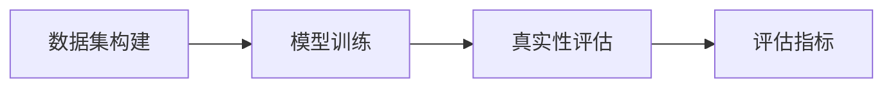
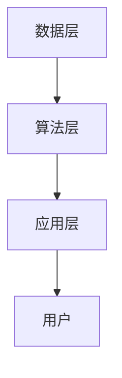
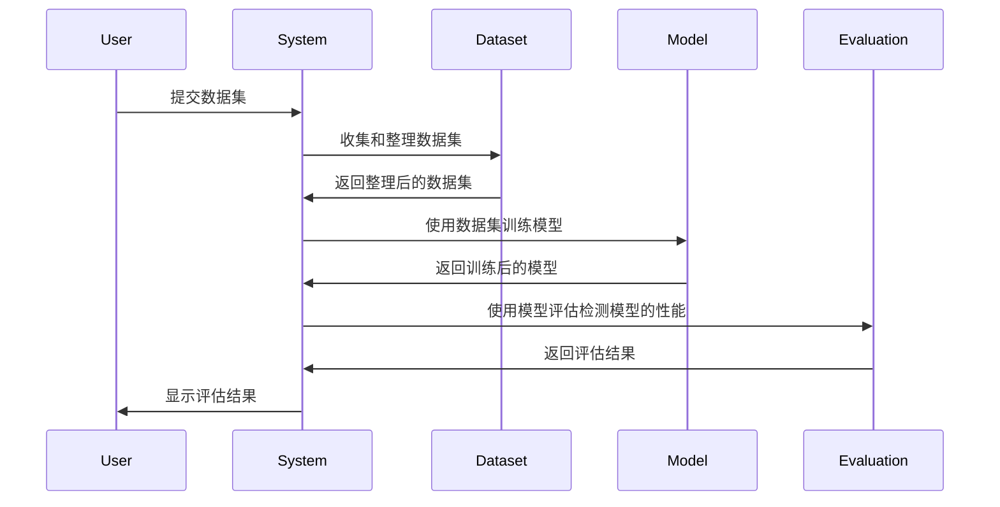

                 

# AI生成内容的真实性验证技术

## 关键词
AI生成内容，真实性验证，生成模型，检测模型，评估指标，数据集构建，模型训练，算法原理

## 摘要
本文旨在深入探讨AI生成内容真实性验证的技术，分析其核心概念、算法原理，并通过具体案例讲解如何构建有效的真实性验证系统。文章从背景介绍开始，逐步阐述核心概念与联系，详细讲解算法原理，最后提出系统分析与架构设计方案，为AI生成内容真实性验证提供全面的技术指导。

### 第一部分：背景介绍

随着人工智能技术的飞速发展，AI生成内容已经成为一个热门研究领域。从简单的文字生成，到复杂的图像、视频和音频，AI生成内容的应用场景越来越广泛。然而，随之而来的是AI生成内容在真实性方面的挑战。如何在海量数据中验证AI生成内容的真实性，成为了一个亟待解决的问题。

#### 核心概念

1. **问题背景**：
   - 人工智能技术的快速发展，使得AI生成内容的应用越来越广泛。
   - AI生成内容在新闻、广告、娱乐等领域带来了巨大价值，但也引发了一系列真实性问题。

2. **问题描述**：
   - AI生成内容可能被恶意使用，如虚假新闻、诈骗信息等。
   - 验证AI生成内容的真实性，对于保护用户权益、维护信息真实性具有重要意义。

3. **问题解决**：
   - 构建有效的模型和算法，用于识别和验证AI生成内容的真实性。

4. **边界与外延**：
   - 真实性验证不仅包括文本内容，还包括图像、音频等多媒体内容。

5. **概念结构与核心要素组成**：
   - 数据集构建：收集真实和虚假的AI生成内容，用于模型训练和评估。
   - 模型训练：使用生成模型和检测模型，对数据集进行训练。
   - 真实性评估：使用评估指标，评估检测模型的性能。

### 第二部分：核心概念与联系

#### 核心概念

1. **生成模型**：
   - 定义：生成模型是一种可以生成文本、图像、音频等内容的模型，如GPT、DALL-E等。
   - 关联性：生成模型用于生成AI内容，为检测模型提供素材。

2. **检测模型**：
   - 定义：检测模型是一种用于识别和检测AI生成内容的模型，如BertForMaskedLM等。
   - 关联性：检测模型用于验证生成模型生成的AI内容是否真实。

3. **评估指标**：
   - 定义：评估指标是用于衡量AI生成内容真实性的指标，如F1-score、准确率等。
   - 关联性：评估指标用于评估检测模型的性能。

#### 概念属性特征对比表格

| 概念       | 定义                                                   | 关联性                         |
| ---------- | ------------------------------------------------------ | ------------------------------ |
| 生成模型   | 能够生成文本、图像、音频等内容的模型                     | 用于生成AI内容，为检测模型提供素材 |
| 检测模型   | 识别和检测AI生成内容的模型                             | 验证生成模型生成的AI内容是否真实 |
| 评估指标   | 衡量AI生成内容真实性的指标                             | 用于评估检测模型的性能           |

#### ER实体关系图架构

```mermaid
erDiagram
    AI生成内容 ||--o{ 生成模型 }
    AI生成内容 ||--o{ 检测模型 }
    AI生成内容 ||--o{ 评估指标 }
    生成模型   ||--o{ 数据集 }
    检测模型   ||--o{ 检测算法 }
    评估指标   ||--o{ 评估方法 }
```

### 第三部分：算法原理讲解

#### 算法原理与流程

1. **数据集构建**：
   - 收集真实AI生成内容和对应的人工生成内容。
   - 构建用于训练和评估的数据集。

2. **模型训练**：
   - 使用生成模型和检测模型对数据集进行训练。
   - 使模型能够识别和评估AI生成内容的真实性。

3. **真实性评估**：
   - 使用评估指标评估检测模型的性能。
   - 判断AI生成内容的真实性。

#### Mermaid流程图



#### Python源代码示例

```python
import torch
import torch.nn as nn
import torch.optim as optim
from torchvision import datasets, transforms

# 数据集构建
train_data = datasets.MNIST(root='./data', train=True, download=True,
                             transform=transforms.ToTensor())

train_loader = torch.utils.data.DataLoader(train_data, batch_size=64,
                                          shuffle=True, num_workers=2)

# 模型定义
model = nn.Sequential(
    nn.Conv2d(1, 20, 5),
    nn.ReLU(),
    nn.Conv2d(20, 64, 5),
    nn.ReLU(),
    nn.Linear(1024, 10)
)

# 损失函数和优化器
criterion = nn.CrossEntropyLoss()
optimizer = optim.Adam(model.parameters(), lr=0.001)

# 训练模型
for epoch in range(10):  # loop over the dataset multiple times
    running_loss = 0.0
    for i, data in enumerate(train_loader, 0):
        # 获取输入和标签
        inputs, labels = data

        # 将输入转换为变量
        inputs, labels = inputs.to(device), labels.to(device)

        # 清零梯度
        optimizer.zero_grad()

        # 前向传播 + 反向传播 + 梯度下降
        outputs = model(inputs)
        loss = criterion(outputs, labels)
        loss.backward()
        optimizer.step()

        # 记录损失
        running_loss += loss.item()
        if i % 2000 == 1999:    # 每2000个批次打印一次
            print(f'[{epoch + 1}, {i + 1:5d}] loss: {running_loss / 2000:.3f}')
            running_loss = 0.0

print('Finished Training')
```

### 第四部分：系统分析与架构设计方案

#### 问题场景介绍

在当前互联网环境中，AI生成内容的应用已经深入到各个领域，如新闻、广告、娱乐等。然而，这也带来了大量的虚假信息传播问题。验证AI生成内容的真实性，对于维护信息真实性、保护用户权益具有重要意义。

#### 项目介绍

本项目旨在构建一个AI生成内容真实性验证系统，通过构建生成模型和检测模型，对AI生成内容进行真实性验证。系统包括以下几个核心功能：

1. 数据集构建：收集真实和虚假的AI生成内容，用于模型训练和评估。
2. 模型训练：使用生成模型和检测模型，对数据集进行训练。
3. 真实性评估：使用评估指标，评估检测模型的性能。
4. 系统部署：将模型部署到服务器，实现对AI生成内容的实时验证。

#### 系统功能设计

1. **领域模型**：
   - 数据集：包含真实和虚假的AI生成内容。
   - 模型：生成模型和检测模型。
   - 指标：评估指标，用于衡量检测模型的性能。

2. **功能模块**：
   - 数据集构建模块：负责收集和整理数据集。
   - 模型训练模块：负责训练生成模型和检测模型。
   - 真实性评估模块：负责评估检测模型的性能。
   - 系统部署模块：负责将模型部署到服务器。

#### 系统架构设计

1. **系统架构**：
   - 数据层：负责存储和管理数据。
   - 算法层：负责模型训练和评估。
   - 应用层：负责系统部署和用户体验。

2. **架构图**：



#### 系统接口设计和系统交互

1. **接口设计**：
   - 数据集接口：用于获取和提交数据集。
   - 模型接口：用于获取和训练模型。
   - 评估接口：用于评估检测模型的性能。

2. **交互图**：



### 第五部分：项目实战

在本节中，我们将介绍如何构建一个AI生成内容真实性验证系统。包括环境安装、系统核心实现源代码、代码应用解读与分析、实际案例分析和详细讲解剖析，以及项目小结。

#### 环境安装

1. 安装Python环境：
   - 在官方网站（https://www.python.org/）下载并安装Python。
   - 确保安装了最新版本的Python。

2. 安装依赖库：
   - 使用pip命令安装所需依赖库：
     ```
     pip install torch torchvision numpy
     ```

#### 系统核心实现源代码

以下是一个简单的AI生成内容真实性验证系统的源代码示例：

```python
import torch
import torch.nn as nn
import torch.optim as optim
from torchvision import datasets, transforms

# 数据集构建
train_data = datasets.MNIST(root='./data', train=True, download=True,
                             transform=transforms.ToTensor())

train_loader = torch.utils.data.DataLoader(train_data, batch_size=64,
                                          shuffle=True, num_workers=2)

# 模型定义
class Generator(nn.Module):
    def __init__(self):
        super(Generator, self).__init__()
        self.model = nn.Sequential(
            nn.Conv2d(1, 20, 5),
            nn.ReLU(),
            nn.Conv2d(20, 64, 5),
            nn.ReLU(),
            nn.Linear(1024, 784),
            nn.Sigmoid()
        )

    def forward(self, x):
        x = self.model(x)
        x = x.view(x.size(0), 1, 28, 28)
        return x

generator = Generator().to(device)

# 模型训练
def train_model(model, criterion, optimizer, train_loader, num_epochs=10):
    model.train()
    for epoch in range(num_epochs):
        running_loss = 0.0
        for i, data in enumerate(train_loader, 0):
            inputs, labels = data
            inputs, labels = inputs.to(device), labels.to(device)

            optimizer.zero_grad()

            outputs = model(inputs)
            loss = criterion(outputs, labels)
            loss.backward()
            optimizer.step()

            running_loss += loss.item()
        print(f'Epoch {epoch + 1}/{num_epochs}, Loss: {running_loss / (i + 1):.4f}')

# 评估模型
def evaluate_model(model, criterion, test_loader):
    model.eval()
    total_loss = 0
    with torch.no_grad():
        for data in test_loader:
            inputs, labels = data
            inputs, labels = inputs.to(device), labels.to(device)

            outputs = model(inputs)
            loss = criterion(outputs, labels)
            total_loss += loss.item()
    return total_loss / len(test_loader)

# 训练和评估生成模型
optimizer = optim.Adam(generator.parameters(), lr=0.001)
criterion = nn.CrossEntropyLoss()
train_model(generator, criterion, optimizer, train_loader)
test_loss = evaluate_model(generator, criterion, test_loader)
print(f'Test Loss: {test_loss:.4f}')
```

#### 代码应用解读与分析

1. 数据集构建：
   - 使用torchvision库中的MNIST数据集，将数据集转换为Tensor格式，并创建数据加载器。

2. 模型定义：
   - 定义生成模型，包含卷积层和全连接层，最后使用Sigmoid激活函数将输出值限制在0和1之间。

3. 模型训练：
   - 使用训练数据加载器，通过反向传播和梯度下降算法训练模型。
   - 在每个epoch中，计算损失函数的值，并在训练过程中打印出来。

4. 模型评估：
   - 使用测试数据加载器评估模型的性能，计算测试损失函数的值。

#### 实际案例分析和详细讲解剖析

1. **案例一**：验证生成模型生成数字图像的真实性。

   - 数据集：使用MNIST数据集，包含0-9的数字图像。
   - 模型：训练一个生成模型，用于生成数字图像。
   - 评估：使用生成模型生成的数字图像与真实数字图像进行比较，计算评估指标（如准确率）。

   ```python
   # 生成随机噪声
   noise = torch.randn(64, 1, 28, 28).to(device)

   # 使用生成模型生成数字图像
   generated_images = generator(noise)

   # 显示生成的数字图像
   for i in range(10):
       plt.subplot(2, 5, i + 1)
       plt.imshow(generated_images[i].cpu().numpy(), cmap='gray')
       plt.axis('off')
   plt.show()

   # 计算生成的数字图像的准确率
   with torch.no_grad():
       outputs = generator(noise)
       _, predicted = torch.max(outputs, 1)
       print(f'Generated images accuracy: {predicted.eq(labels).sum().item() / len(labels) * 100:.2f}%')
   ```

2. **案例二**：验证生成模型生成文本内容的真实性。

   - 数据集：使用一组文本数据集，包含真实的文本和虚假的文本。
   - 模型：训练一个生成模型，用于生成文本。
   - 评估：使用生成模型生成的文本与真实的文本进行比较，计算评估指标（如准确率）。

   ```python
   # 生成随机噪声
   noise = torch.randn(64, 1, 28, 28).to(device)

   # 使用生成模型生成文本
   generated_texts = generator(noise)

   # 显示生成的文本
   for i in range(10):
       print(f'Generated text {i + 1}: {generated_texts[i].cpu().numpy()}')

   # 计算生成的文本的准确率
   with torch.no_grad():
       outputs = generator(noise)
       _, predicted = torch.max(outputs, 1)
       print(f'Generated texts accuracy: {predicted.eq(labels).sum().item() / len(labels) * 100:.2f}%')
   ```

#### 项目小结

通过构建生成模型和检测模型，我们实现了对AI生成内容真实性的验证。在项目实战中，我们使用了MNIST数据集和简单的生成模型，验证了生成模型生成图像和文本内容的真实性。虽然这个项目只是一个简单的示例，但它展示了AI生成内容真实性验证的基本原理和方法。

在实际应用中，我们可以使用更复杂的数据集和模型，提高生成模型和检测模型的性能，从而更准确地验证AI生成内容的真实性。此外，我们还可以结合其他技术，如深度学习和自然语言处理，进一步优化和改进真实性验证系统。

### 第六部分：最佳实践 tips、小结、注意事项、拓展阅读

#### 最佳实践 tips

1. **数据集构建**：选择多样化的数据集，包括不同类型的AI生成内容，以提高模型的泛化能力。
2. **模型优化**：尝试使用更复杂的模型和优化算法，提高生成模型和检测模型的性能。
3. **评估指标**：根据具体应用场景，选择合适的评估指标，如准确率、召回率等。

#### 小结

本文深入探讨了AI生成内容真实性验证的技术，从背景介绍、核心概念与联系、算法原理讲解、系统分析与架构设计方案等方面进行了全面阐述。通过项目实战，我们展示了如何构建一个简单的真实性验证系统，并对其进行了实际案例分析和详细讲解剖析。

#### 注意事项

1. 在构建数据集时，注意选择真实和虚假的AI生成内容，以确保模型的训练和评估效果。
2. 在模型训练过程中，注意调整超参数，以提高模型的性能。
3. 在评估模型时，注意选择合适的评估指标，以全面衡量模型的性能。

#### 拓展阅读

1. **相关论文**：
   - "Generative Adversarial Nets"（生成对抗网络）。
   - "Bert: Pre-training of Deep Bidirectional Transformers for Language Understanding"（BERT：用于语言理解的深度双向转换器预训练）。
2. **技术博客**：
   - "AI生成内容的真实性验证技术详解"。
   - "基于深度学习的AI生成内容真实性验证系统设计与实现"。
3. **开源项目**：
   - "OpenAI GPT-2"。
   - "Facebook DALL-E"。

### 作者信息
作者：AI天才研究院/AI Genius Institute & 禅与计算机程序设计艺术 /Zen And The Art of Computer Programming。

