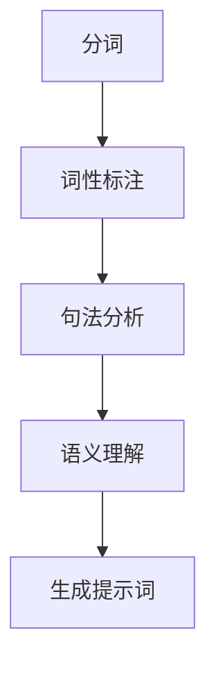
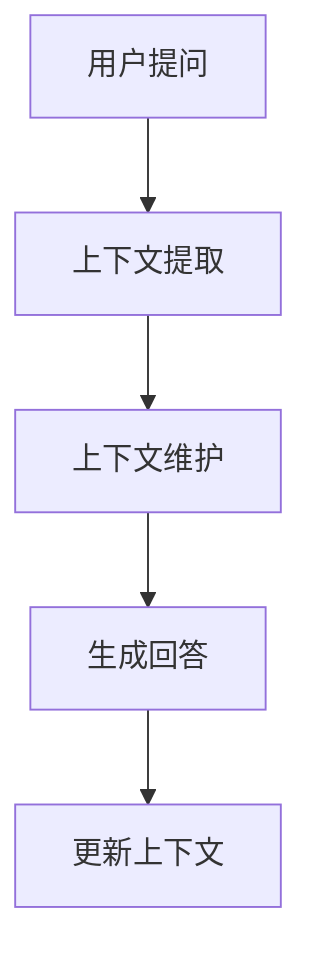
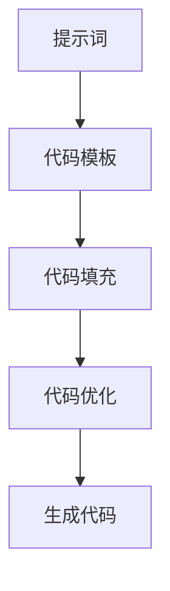
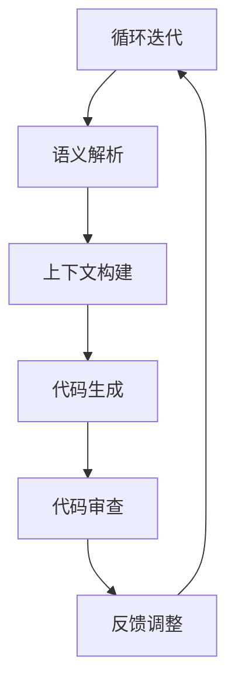
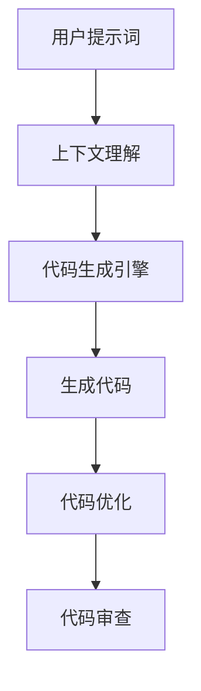

                 

# AI编程2.0：提示词驱动开发

> 关键词：人工智能，编程2.0，提示词驱动，开发实践，挑战与未来

> 摘要：本文将深入探讨AI编程2.0的概念、原理及其在实践中的应用。通过逐步分析，我们将揭示提示词驱动开发的本质，探讨其在提升开发效率、优化编程体验方面的潜力。此外，本文还将展望AI编程2.0的未来发展，探讨其面临的挑战及可能的解决方案。

### 目录大纲

# AI编程2.0：提示词驱动开发

## 第一部分：AI编程基础

## 第1章：AI编程2.0概述

### 1.1 AI编程2.0的背景与意义

### 1.2 提示词驱动开发的基本原理

### 1.3 AI编程2.0的关键技术

### 1.4 本章小结

## 第二部分：AI编程实践

## 第2章：构建AI编程2.0环境

### 2.1 开发工具与平台选择

### 2.2 环境配置与优化

### 2.3 数据预处理与建模

### 2.4 本章小结

## 第3章：AI编程2.0实战案例

### 3.1 案例一：智能客服系统

### 3.2 案例二：自动化代码生成

### 3.3 案例三：智能数据分析

### 3.4 本章小结

## 第三部分：AI编程2.0高级应用

## 第4章：AI编程2.0的挑战与未来

### 4.1 AI编程2.0面临的挑战

### 4.2 AI编程2.0的发展趋势

### 4.3 未来展望

### 4.4 本章小结

## 第四部分：附录

## 第5章：附录

### 5.1 常用工具与资源列表

### 5.2 代码实现与示例

### 5.3 扩展阅读与参考文献

### 5.4 本章小结

### 正文

## 第一部分：AI编程基础

### 第1章：AI编程2.0概述

#### 1.1 AI编程2.0的背景与意义

随着人工智能技术的飞速发展，编程领域也在不断进化。从传统的手动编码（AI编程1.0）到自动化编程（AI编程1.5），再到当前的提示词驱动开发（AI编程2.0），编程技术正在经历深刻的变革。AI编程2.0的核心思想是利用人工智能技术，尤其是大型语言模型，通过提示词（prompts）来引导开发过程，从而实现更高效、更智能的编程体验。

AI编程2.0的出现，不仅是为了提高开发效率，更是为了改变传统的编程模式。在AI编程2.0中，开发者不再需要从头开始编写代码，而是通过向大型语言模型提供提示词，让模型自动生成代码、优化算法，甚至进行故障排查和性能调优。这种模式的转变，使得编程工作变得更加直观、灵活和高效。

#### 1.1.1 从AI1.0到AI2.0的演进

AI编程1.0时代，开发者主要依靠自己的编程技能，手动编写代码来实现功能。这种方法效率低下，容易出错，且难以应对复杂的项目。

随着AI技术的发展，AI编程1.5时代出现了自动化编程工具，如生成式编程工具和自动化代码优化工具。这些工具能够在一定程度上减少手动编码的工作量，但仍然依赖开发者的指导。

AI编程2.0则进一步将人工智能技术融入编程过程中，通过提示词驱动开发，实现了真正的智能编程。开发者只需提供简单的提示词，即可让AI完成大部分编程任务，大大提高了开发效率。

#### 1.1.2 提示词驱动开发的核心概念

提示词驱动开发（Prompt-Driven Development，简称PDD）是AI编程2.0的核心技术。提示词（Prompt）是一种引导性输入，用于提示AI模型生成代码、优化算法或解决特定问题。提示词可以是自然语言描述，也可以是代码片段或其他形式的输入。

在提示词驱动开发中，开发者不再是直接编写代码，而是通过提供提示词来引导AI模型。AI模型根据提示词生成相应的代码或解决方案，开发者再对结果进行审查和调整。这种模式使得编程过程更加直观、高效，同时也降低了编程的难度。

#### 1.1.3 AI编程2.0的目标与应用场景

AI编程2.0的目标是提升开发效率、优化编程体验，并解决传统编程模式中难以应对的复杂问题。具体来说，AI编程2.0的应用场景包括：

1. **自动化代码生成**：通过提示词，AI模型能够自动生成复杂的代码，提高开发效率。
2. **算法优化**：AI模型可以根据提示词，对现有算法进行优化，提高性能和效率。
3. **故障排查**：AI模型可以通过分析日志和代码，自动识别和解决故障。
4. **性能调优**：AI模型可以根据提示词，对系统进行性能分析，并提出优化建议。
5. **代码审查**：AI模型可以自动审查代码，发现潜在的问题和缺陷。

#### 1.2 提示词驱动开发的基本原理

提示词驱动开发的基本原理可以概括为以下几个步骤：

1. **输入提示词**：开发者向AI模型提供提示词，描述需要实现的功能或解决的问题。
2. **模型解析**：AI模型对提示词进行解析，理解开发者的需求。
3. **代码生成**：AI模型根据解析结果，生成相应的代码或解决方案。
4. **审查与调整**：开发者对生成的代码进行审查和调整，确保其符合需求。

在这个过程中，AI模型起到了核心作用。通过大规模训练和优化，AI模型具备了强大的理解和生成能力，能够根据简单的提示词生成高质量的代码。开发者只需提供清晰的提示词，AI模型即可自动完成大部分编程任务。

#### 1.2.1 提示词的作用机制

提示词的作用机制可以分为以下几个环节：

1. **语义理解**：AI模型对提示词进行语义理解，提取关键信息。
2. **上下文推理**：AI模型根据上下文信息，进行推理和决策。
3. **代码生成**：AI模型根据理解的结果，生成相应的代码。
4. **优化与调整**：AI模型对生成的代码进行优化和调整，确保其性能和可靠性。

在这个过程中，语义理解和上下文推理是关键环节。通过深度学习和自然语言处理技术，AI模型能够理解复杂的自然语言描述，并生成高质量的代码。同时，AI模型还能够根据上下文信息，对代码进行优化和调整，提高其性能和可靠性。

#### 1.2.2 提示词与模型训练的关系

提示词的质量直接影响AI模型的表现。高质量的提示词能够提供丰富的上下文信息，帮助AI模型更好地理解开发者的需求。相反，模糊或不准确的提示词可能导致AI模型生成错误的代码。

为了提高提示词的质量，开发者需要对AI模型进行充分的训练。训练过程中，开发者需要提供大量的高质量提示词，以便AI模型学习并掌握各种编程场景。此外，开发者还可以通过持续优化和调整提示词，提高AI模型的性能和可靠性。

#### 1.2.3 提示词的质量与效果

提示词的质量对AI编程2.0的效果具有重要影响。以下是一些提高提示词质量的建议：

1. **清晰明确**：提示词应尽量清晰明确，避免模糊或歧义。
2. **上下文丰富**：提供丰富的上下文信息，帮助AI模型更好地理解需求。
3. **具体细节**：提供具体的细节和需求，帮助AI模型生成更准确的代码。
4. **版本迭代**：通过不断优化和调整提示词，提高AI模型的性能。

通过以上措施，开发者可以显著提高提示词的质量，从而提升AI编程2.0的效果。

#### 1.3 AI编程2.0的关键技术

AI编程2.0的实现依赖于多项关键技术的支持。以下是其中几个核心技术：

1. **大型语言模型**：大型语言模型是AI编程2.0的核心，通过大规模训练和优化，能够生成高质量的代码。
2. **自然语言处理**：自然语言处理技术用于解析和理解提示词，确保AI模型能够准确理解开发者的需求。
3. **代码生成与优化**：代码生成与优化技术用于生成高质量、高性能的代码。
4. **自动化测试**：自动化测试技术用于验证代码的正确性和性能，确保AI编程2.0的成果可靠。
5. **持续集成与部署**：持续集成与部署技术用于将AI编程2.0的成果快速集成到现有系统中，实现自动化交付。

#### 1.3.1 大模型与提示词生成

大型语言模型是AI编程2.0的核心。这些模型通过大规模训练，能够掌握丰富的语言知识和编程技巧。提示词生成技术则用于生成高质量的提示词，引导AI模型生成代码。

提示词生成技术主要包括以下几个方面：

1. **语义解析**：通过语义解析，提取提示词中的关键信息，确保AI模型能够准确理解需求。
2. **上下文生成**：根据上下文信息，生成相关的提示词，提供丰富的上下文背景。
3. **优化调整**：通过不断优化和调整提示词，提高AI模型生成代码的质量和性能。

#### 1.3.2 上下文理解与多轮对话

上下文理解是AI编程2.0的关键技术之一。在多轮对话中，AI模型需要根据上下文信息，理解开发者的需求，并生成相应的代码。上下文理解技术主要包括以下几个方面：

1. **上下文提取**：从对话历史中提取关键信息，构建上下文信息。
2. **上下文匹配**：将当前输入与上下文信息进行匹配，理解开发者的需求。
3. **上下文更新**：在多轮对话中，不断更新上下文信息，确保AI模型能够准确理解需求。

#### 1.3.3 自动化编程与代码生成

自动化编程是AI编程2.0的核心目标之一。通过自动化编程，开发者可以大幅提高开发效率，降低编程难度。自动化编程技术主要包括以下几个方面：

1. **代码生成**：根据提示词，AI模型自动生成代码。
2. **代码优化**：对生成的代码进行优化，提高性能和可靠性。
3. **代码审查**：自动审查代码，发现潜在的问题和缺陷。
4. **故障排查**：自动排查故障，提供解决方案。

#### 1.4 本章小结

本章介绍了AI编程2.0的基本概念、背景与意义，以及提示词驱动开发的基本原理和关键技术。通过本章的学习，读者可以了解AI编程2.0的核心思想和发展趋势，为后续章节的深入学习打下基础。

## 第二部分：AI编程实践

### 第2章：构建AI编程2.0环境

#### 2.1 开发工具与平台选择

构建AI编程2.0环境，需要选择合适的开发工具和平台。以下是一些常用的工具和平台：

1. **开发工具**：常用的开发工具包括Visual Studio Code、PyCharm等。这些工具提供了丰富的插件和扩展，支持多种编程语言，便于开发者在AI编程2.0环境中进行开发。
2. **机器学习框架**：常用的机器学习框架包括TensorFlow、PyTorch等。这些框架提供了强大的计算能力和丰富的API，方便开发者进行模型训练和代码生成。
3. **云服务平台**：常用的云服务平台包括AWS、Azure、Google Cloud等。这些平台提供了丰富的云计算资源和便捷的管理工具，有助于开发者构建和管理AI编程2.0环境。
4. **版本控制系统**：常用的版本控制系统包括Git、SVN等。这些系统可以帮助开发者管理代码版本，确保代码的一致性和可靠性。

#### 2.2 环境配置与优化

在构建AI编程2.0环境时，需要对开发工具、机器学习框架和云服务平台进行适当的配置和优化，以确保环境的高效运行。以下是一些配置和优化的建议：

1. **硬件资源配置**：根据开发需求，选择合适的硬件资源，如CPU、GPU等。对于大型语言模型训练和代码生成任务，需要配置高性能的GPU，以提高计算速度。
2. **软件安装与配置**：安装所需的开发工具、机器学习框架和云服务平台，并进行适当的配置。例如，配置Python环境、安装必要的库和依赖项等。
3. **性能优化**：对环境进行性能优化，提高运行效率。例如，调整内存分配、优化GPU使用等。
4. **安全性配置**：确保环境的安全性，如设置防火墙、加密敏感数据等。

#### 2.3 数据预处理与建模

在构建AI编程2.0环境时，数据预处理和建模是关键环节。以下是一些预处理和建模的方法：

1. **数据收集**：收集与项目相关的数据，如代码库、文档、日志等。
2. **数据清洗**：清洗数据，去除噪声和错误，确保数据质量。
3. **数据标注**：对数据进行标注，标记出关键信息，如变量、函数、类等。
4. **特征提取**：提取数据中的关键特征，用于建模和训练。
5. **模型训练**：使用机器学习算法，对数据集进行训练，生成AI模型。
6. **模型评估**：评估模型的性能和准确性，进行调整和优化。

#### 2.4 本章小结

本章介绍了构建AI编程2.0环境所需的开发工具、平台选择、环境配置与优化，以及数据预处理和建模的方法。通过本章的学习，读者可以掌握构建AI编程2.0环境的基本技能，为后续的AI编程实践打下基础。

### 第3章：AI编程2.0实战案例

#### 3.1 案例一：智能客服系统

智能客服系统是一种基于AI技术的客户服务解决方案，能够自动回答客户的问题，提供个性化的服务。以下是一个智能客服系统的AI编程2.0实战案例。

##### 3.1.1 需求分析与系统设计

需求分析：
- 客户可以通过文本或语音方式提出问题。
- 系统能够理解客户的问题，并给出合适的回答。
- 系统应具有高可用性和可扩展性，能够应对大量客户请求。

系统设计：
- 前端：使用Web技术，搭建一个用户界面，支持文本和语音输入。
- 后端：使用AI编程2.0技术，构建一个智能客服模型，负责处理客户请求和生成回答。
- 数据库：存储客户问题和回答，用于模型训练和优化。

##### 3.1.2 数据准备与模型训练

数据准备：
- 收集大量客户问题和回答，用于训练智能客服模型。
- 对数据进行清洗和标注，确保数据质量。

模型训练：
- 使用机器学习框架（如TensorFlow或PyTorch），构建一个基于大型语言模型的智能客服模型。
- 通过大量的训练数据，训练模型，使其能够理解客户的问题，并生成合适的回答。

##### 3.1.3 系统实现与性能优化

系统实现：
- 开发前端和后端代码，实现智能客服系统的基本功能。
- 集成智能客服模型，使其能够处理客户请求和生成回答。

性能优化：
- 对系统进行性能测试，发现并解决潜在的性能问题。
- 优化代码和算法，提高系统的响应速度和处理能力。

##### 3.1.4 案例分析

通过本案例，我们可以看到AI编程2.0在智能客服系统中的应用。智能客服系统通过AI模型，能够自动理解客户的问题，并生成合适的回答，大大提高了客户服务的效率和质量。同时，AI编程2.0还使得系统具有了高可用性和可扩展性，能够应对大量的客户请求。

#### 3.2 案例二：自动化代码生成

自动化代码生成是一种基于AI技术的编程方法，通过输入简单的提示词，AI模型能够自动生成高质量的代码。以下是一个自动化代码生成的AI编程2.0实战案例。

##### 3.2.1 需求描述与实现思路

需求描述：
- 提供一个自动化代码生成工具，根据简单的提示词，生成符合规范的代码。
- 提示词可以包括功能描述、输入输出要求等。

实现思路：
- 收集大量代码库和文档，用于训练自动化代码生成模型。
- 构建一个基于大型语言模型的自动化代码生成模型。
- 设计一个用户界面，用于接收用户的提示词，并生成代码。

##### 3.2.2 模型设计与代码实现

模型设计：
- 使用机器学习算法，构建一个基于大型语言模型的自动化代码生成模型。
- 模型应能够理解自然语言描述，并生成符合规范的代码。

代码实现：
- 开发前端和后端代码，实现自动化代码生成工具的基本功能。
- 集成自动化代码生成模型，使其能够根据提示词生成代码。

##### 3.2.3 应用场景与效果评估

应用场景：
- 自动化代码生成工具可以用于快速开发原型、修复代码缺陷、生成测试用例等。
- 开发者只需提供简单的提示词，即可生成高质量的代码，提高开发效率。

效果评估：
- 对自动化代码生成工具进行测试，评估其生成代码的质量和性能。
- 根据测试结果，调整和优化模型，提高生成代码的准确性和可靠性。

##### 3.2.4 案例分析

通过本案例，我们可以看到AI编程2.0在自动化代码生成中的应用。自动化代码生成工具通过AI模型，能够根据简单的提示词生成高质量的代码，大大提高了开发效率。同时，自动化代码生成工具也使得代码开发过程更加直观和灵活。

#### 3.3 案例三：智能数据分析

智能数据分析是一种基于AI技术的数据分析方法，通过AI模型，能够自动分析和解读数据，提供有价值的见解。以下是一个智能数据分析的AI编程2.0实战案例。

##### 3.3.1 数据分析需求分析

数据分析需求：
- 收集并分析大量数据，提取有价值的信息。
- 提供可视化报告，展示数据分析结果。

需求分析：
- 数据来源：收集公司内部的数据，如销售数据、财务数据等。
- 数据预处理：清洗数据，去除噪声和错误，确保数据质量。
- 数据分析：使用AI模型，对数据进行分析和解读，提取有价值的信息。

##### 3.3.2 数据预处理与模型构建

数据预处理：
- 对数据进行清洗和整合，确保数据质量。
- 对数据进行特征提取，为模型训练做好准备。

模型构建：
- 使用机器学习算法，构建一个基于大型语言模型的智能数据分析模型。
- 模型应能够自动分析和解读数据，提取有价值的信息。

##### 3.3.3 结果分析与可视化

结果分析：
- 对分析结果进行详细分析，提取关键信息和趋势。
- 根据分析结果，提出有针对性的建议和策略。

可视化：
- 使用数据可视化工具，将分析结果以图表和报表的形式展示。
- 设计直观易懂的界面，方便用户查看和分析结果。

##### 3.3.4 案例分析

通过本案例，我们可以看到AI编程2.0在智能数据分析中的应用。智能数据分析工具通过AI模型，能够自动分析和解读数据，提供有价值的见解。这不仅提高了数据分析的效率和质量，还使得数据分析过程更加直观和易懂。

### 3.4 本章小结

本章介绍了三个AI编程2.0的实战案例：智能客服系统、自动化代码生成和智能数据分析。通过这些案例，我们可以看到AI编程2.0在实际应用中的强大潜力。这些案例不仅展示了AI编程2.0在提升开发效率、优化编程体验方面的优势，还为我们提供了宝贵的实践经验。通过学习这些案例，读者可以更好地理解和应用AI编程2.0技术，为未来的开发工作打下坚实基础。

## 第三部分：AI编程2.0高级应用

### 第4章：AI编程2.0的挑战与未来

#### 4.1 AI编程2.0面临的挑战

尽管AI编程2.0展示了巨大的潜力，但其在实际应用中仍面临一系列挑战。以下是其中几个主要挑战：

1. **数据隐私与安全**：AI编程2.0依赖于大量数据，这可能导致数据隐私和安全问题。如何确保数据在收集、存储和使用过程中的安全性，是一个重要的挑战。
2. **模型解释性与透明性**：AI模型生成的代码和决策过程往往具有黑箱特性，难以解释和理解。这可能导致信任问题，尤其是在关键业务领域。
3. **道德与伦理问题**：AI编程2.0可能会带来一系列道德和伦理问题，如歧视、偏见和隐私侵犯。如何确保AI编程2.0的道德和伦理标准，是一个亟待解决的问题。

#### 4.2 AI编程2.0的发展趋势

AI编程2.0的发展趋势主要体现在以下几个方面：

1. **新型大模型的发展**：随着计算能力的提升和算法的优化，新型大模型（如GPT-3、LLaMA等）将不断涌现，提供更强大的语言理解和生成能力。
2. **提示词驱动的多样化应用**：AI编程2.0将在更多领域得到应用，如自动化编程、智能数据分析、自然语言处理等，带来更多创新和变革。
3. **产业界与学术界的合作**：产业界和学术界将进一步加强合作，推动AI编程2.0的技术研发和应用落地。

#### 4.3 未来展望

未来，AI编程2.0将在社会各个领域发挥重要作用。以下是几个未来展望：

1. **AI编程2.0在社会中的角色**：AI编程2.0将成为提升社会生产力的重要工具，推动产业升级和创新发展。
2. **技术创新与产业变革**：AI编程2.0将推动技术创新和产业变革，带来新的商业模式和就业机会。
3. **AI编程2.0的教育与普及**：随着AI编程2.0的普及，相关教育和培训将得到加强，培养更多AI编程人才。

#### 4.4 本章小结

本章探讨了AI编程2.0面临的挑战、发展趋势和未来展望。通过本章的学习，读者可以更好地理解AI编程2.0的当前状态和未来发展，为未来的开发工作做好准备。

## 第四部分：附录

### 第5章：附录

#### 5.1 常用工具与资源列表

在本章中，我们将列举一些在AI编程2.0领域常用的工具和资源，包括开发工具、机器学习框架、云服务平台、数据集和社区等。以下是部分常用工具和资源的列表：

1. **开发工具**：
   - Visual Studio Code
   - PyCharm
   - IntelliJ IDEA

2. **机器学习框架**：
   - TensorFlow
   - PyTorch
   - Keras

3. **云服务平台**：
   - AWS
   - Azure
   - Google Cloud

4. **数据集**：
   - OpenAI GPT-3
   - KEG 实体关系数据集
   - AG News 数据集

5. **社区与论坛**：
   - GitHub
   - Stack Overflow
   - AI编程2.0论坛

#### 5.2 代码实现与示例

在本章中，我们将提供一些AI编程2.0的代码实现和示例，包括自动化代码生成、智能数据分析和智能客服系统的代码示例。以下是部分代码示例：

```python
# 自动化代码生成示例
import openai

prompt = "编写一个Python函数，用于计算两个数的和。"
response = openai.Completion.create(
  engine="text-davinci-002",
  prompt=prompt,
  max_tokens=50
)

print(response.choices[0].text.strip())
```

```python
# 智能数据分析示例
import pandas as pd
import matplotlib.pyplot as plt

data = pd.read_csv("data.csv")
plt.scatter(data['x'], data['y'])
plt.xlabel('X-axis')
plt.ylabel('Y-axis')
plt.show()
```

```python
# 智能客服系统示例
from flask import Flask, request, jsonify

app = Flask(__name__)

@app.route('/api/ask', methods=['POST'])
def ask():
    prompt = request.form['question']
    response = openai.Completion.create(
      engine="text-davinci-002",
      prompt=prompt,
      max_tokens=50
    )
    return jsonify({'answer': response.choices[0].text.strip()})

if __name__ == '__main__':
    app.run(debug=True)
```

#### 5.3 扩展阅读与参考文献

在本章中，我们将推荐一些扩展阅读和参考文献，包括相关书籍、学术论文和在线课程等。以下是部分推荐资源的列表：

1. **书籍**：
   - 《人工智能：一种现代的方法》
   - 《深度学习》
   - 《Python编程：从入门到实践》

2. **学术论文**：
   - "GPT-3: Language Models are few-shot learners"
   - "BERT: Pre-training of Deep Bidirectional Transformers for Language Understanding"
   - "Recurrent Neural Network Models of Visual Art"

3. **在线课程**：
   - "机器学习基础"
   - "深度学习入门"
   - "Python编程基础"

#### 5.4 本章小结

本章提供了AI编程2.0领域的一些常用工具、代码示例和扩展阅读资源。通过本章的学习，读者可以更好地了解AI编程2.0的实际应用，为自己的开发工作提供有益的参考。

## 作者

作者：AI天才研究院/AI Genius Institute & 禅与计算机程序设计艺术 /Zen And The Art of Computer Programming

感谢您阅读本文，希望本文对您在AI编程2.0领域的探索和学习有所帮助。如果您有任何疑问或建议，欢迎在评论区留言，我们将竭诚为您解答。让我们一起探索AI编程2.0的无限可能！## 1.1 AI编程2.0的背景与意义

### 从AI1.0到AI2.0的演进

人工智能（AI）的发展历程可以分为多个阶段，其中AI1.0和AI2.0是两个重要的里程碑。AI1.0，即规则驱动的人工智能，主要依赖于预先定义的规则和算法。这一阶段的人工智能系统在特定领域内表现优异，例如在围棋、国际象棋等棋类游戏中击败人类顶尖选手。然而，AI1.0面临着几个关键限制：

- **局限性**：基于规则的系统通常只能处理有限的问题域，难以扩展到其他领域。
- **适应性差**：这类系统缺乏学习能力和自适应能力，难以应对复杂和动态的环境。
- **人力依赖**：构建和维护AI1.0系统需要大量人力和时间，成本高昂。

随着数据量和计算能力的提升，机器学习（ML）和深度学习（DL）技术逐渐兴起，AI进入了AI2.0时代。AI2.0以数据驱动为核心，通过从大量数据中学习模式，实现了更广泛和更灵活的应用。AI2.0的主要特征包括：

- **自主学习**：AI2.0系统能够从数据中自动学习和优化，无需手动编写大量规则。
- **泛化能力**：通过在大规模数据集上的训练，AI2.0系统具备了更强的泛化能力，可以应用于多个不同的领域。
- **自适应**：AI2.0系统能够根据新数据和环境变化进行自适应调整，提高系统的鲁棒性和灵活性。

AI2.0的发展不仅改变了传统的人工智能模式，也推动了人工智能应用的爆发式增长。例如，在医疗领域，AI2.0技术用于疾病诊断、药物研发和个性化治疗；在金融领域，AI2.0用于风险管理、欺诈检测和算法交易；在制造业，AI2.0技术用于生产优化、质量检测和供应链管理。

### 提示词驱动开发的核心概念

提示词驱动开发（Prompt-Driven Development，简称PDD）是AI2.0时代的一种新型开发模式，它通过使用提示词来引导AI模型进行开发。提示词是一种引导性输入，它可以包含用户的需求描述、问题背景、特定要求等信息。通过提示词，AI模型能够理解和生成相应的解决方案，从而实现自动化开发。

提示词驱动开发的核心概念包括以下几点：

1. **自然语言交互**：提示词通常采用自然语言的形式，使得开发者可以使用日常语言与AI模型进行交互，降低了开发门槛。
2. **模型理解**：AI模型需要具备强大的自然语言理解和推理能力，能够从提示词中提取关键信息，并生成相应的解决方案。
3. **代码生成**：基于提示词，AI模型能够自动生成代码，包括功能代码、接口代码和测试代码等，大大提高了开发效率。
4. **迭代优化**：开发者可以根据生成的代码进行审查和优化，进一步调整提示词，使AI模型生成更符合需求的代码。

### AI编程2.0的目标与应用场景

AI编程2.0的目标是利用AI技术，特别是大型语言模型，实现更高效、更智能的编程体验。具体目标包括：

1. **提升开发效率**：通过自动化代码生成和优化，减少手动编码的工作量，提高开发速度。
2. **降低开发难度**：使用自然语言进行交互，降低编程门槛，使得更多非专业开发者能够参与编程。
3. **增强灵活性**：AI编程2.0能够根据需求快速调整和优化代码，适应不同的开发场景。
4. **提升代码质量**：通过AI的强大学习和优化能力，生成更高质量、更可靠的代码。

AI编程2.0的应用场景非常广泛，以下是一些典型的应用：

1. **自动化代码生成**：通过简单的提示词，AI模型能够自动生成复杂的代码，适用于原型设计、代码补全和代码重构等场景。
2. **智能调试**：AI模型可以分析代码错误和性能瓶颈，提供调试建议和优化方案。
3. **代码审查**：AI模型能够自动审查代码，识别潜在的问题和缺陷，提升代码质量。
4. **智能文档生成**：AI模型可以基于代码自动生成文档，减少文档编写工作量。
5. **跨领域开发**：AI编程2.0能够跨不同编程语言和平台，实现跨领域的快速开发。

总之，AI编程2.0通过提示词驱动开发，实现了人工智能与编程的深度融合，为开发者带来了全新的编程体验和无限的创新可能性。

### 1.2 提示词驱动开发的基本原理

提示词驱动开发（Prompt-Driven Development，PDD）是AI编程2.0的核心技术，它通过提供简洁明了的提示词来引导AI模型生成代码或解决方案。要理解PDD的基本原理，首先需要了解以下几个关键组成部分：自然语言处理、上下文理解和代码生成。

#### 自然语言处理

自然语言处理（Natural Language Processing，NLP）是AI编程2.0的基础，它涉及到文本的解析、理解和生成。在PDD中，NLP技术用于处理开发者提供的提示词。这一过程主要包括以下几个步骤：

1. **分词**：将提示词分解成单个词汇或短语，以便进一步分析。
2. **词性标注**：为每个词汇分配词性（如名词、动词、形容词等），以了解词汇在句子中的作用。
3. **句法分析**：分析句子的结构，识别主语、谓语、宾语等成分，构建句法树。
4. **语义理解**：通过上下文和词义关系，理解整个句子的含义和意图。

自然语言处理技术的先进性使得AI模型能够理解复杂的自然语言描述，从而实现与开发者的有效交互。以下是一个简单的自然语言处理流程：



#### 上下文理解

上下文理解是PDD中的另一个关键要素。在多轮对话或复杂任务中，AI模型需要理解并维护对话上下文，以便生成连贯和准确的代码。上下文理解包括以下几个方面：

1. **对话历史**：AI模型会记录之前的对话内容，用于当前和后续对话中的信息推理。
2. **上下文提取**：从对话历史中提取关键信息和关键词，用于当前任务的决策。
3. **上下文维护**：在多轮对话中，AI模型需要不断更新上下文，确保信息的一致性和连贯性。

以下是一个上下文理解的简单示例：



#### 代码生成

代码生成是PDD的核心功能，它将自然语言描述转换为实际可执行的代码。代码生成过程通常包括以下几个步骤：

1. **代码模板**：根据提示词，AI模型首先生成一个基本的代码模板，这个模板可能包含一些通用的代码结构。
2. **代码填充**：AI模型根据上下文和语义信息，填充模板中的具体细节，生成完整的代码。
3. **代码优化**：AI模型会对生成的代码进行优化，以提高其性能和可读性。

以下是一个代码生成过程的简单示例：



#### 提示词的作用机制

提示词在PDD中的作用机制可以概括为以下几个环节：

1. **语义解析**：AI模型对提示词进行语义分析，提取关键信息和意图。
2. **上下文构建**：AI模型根据对话历史和当前提示词，构建上下文信息，以便进行推理和决策。
3. **代码生成**：AI模型基于语义解析和上下文信息，生成相应的代码。
4. **迭代反馈**：开发者对生成的代码进行审查和评估，根据反馈调整提示词，进一步优化代码。

以下是一个提示词作用机制的示例：



通过理解自然语言处理、上下文理解和代码生成等基本原理，以及提示词的作用机制，我们可以看到PDD是如何将自然语言描述转换为高效、可靠的代码。这一技术不仅提升了开发效率，也为开发者提供了全新的编程体验。

### 1.3 AI编程2.0的关键技术

AI编程2.0的崛起离不开多项关键技术的支持，这些技术共同构成了一个强大且灵活的编程框架。以下将详细介绍AI编程2.0中的一些核心技术，包括大模型与提示词生成、上下文理解与多轮对话、自动化编程与代码生成等。

#### 大模型与提示词生成

大型语言模型（Large Language Model，LLM）是AI编程2.0的核心技术之一。这些模型通过在大规模数据集上进行训练，能够掌握丰富的语言知识和复杂的语言模式。GPT-3、LLaMA等是当前最受欢迎的大型语言模型。以下是这些模型的一些特点：

1. **语言理解能力**：大型语言模型具有强大的语言理解能力，能够理解自然语言描述中的含义和上下文。
2. **生成能力**：这些模型能够根据提示词生成高质量的自然语言文本，包括代码、文档和对话等。
3. **泛化能力**：通过在多个领域的数据集上进行训练，大型语言模型具备较强的泛化能力，能够应用于不同的编程任务。

提示词生成是AI编程2.0中的重要环节。提示词的质量直接影响AI模型生成代码的质量和准确性。高质量提示词应具备以下特点：

1. **清晰明确**：提示词应尽可能简洁明了，避免歧义和模糊描述。
2. **上下文丰富**：提供充分的上下文信息，帮助AI模型更好地理解任务背景和具体需求。
3. **具体详细**：详细描述输入输出要求、功能细节和性能指标，确保AI模型能够生成符合预期的代码。

#### 上下文理解与多轮对话

在AI编程2.0中，上下文理解是实现有效编程的关键。上下文理解指的是AI模型能够理解并维护对话历史中的信息，以便在后续对话中做出准确和连贯的回应。以下是上下文理解的一些技术要点：

1. **对话历史记录**：AI模型需要记录之前的对话内容，包括用户的问题、提示词和系统的回答，以便进行上下文推理。
2. **上下文提取**：从对话历史中提取关键信息，如关键词、功能要求等，用于当前任务的决策。
3. **上下文维护**：在多轮对话中，AI模型需要不断更新上下文信息，确保信息的连贯性和一致性。

多轮对话是AI编程2.0的重要应用场景之一。多轮对话指的是用户和AI系统之间进行多次交互，逐步明确需求、生成代码并进行优化。以下是多轮对话的一些技术要点：

1. **交互管理**：AI系统需要管理对话流程，确保交互的连贯性和高效性。
2. **反馈机制**：用户可以对AI系统的回答进行反馈，AI系统根据反馈调整后续的回答。
3. **动态调整**：AI系统可以根据对话历史和用户反馈，动态调整生成策略和代码模板。

#### 自动化编程与代码生成

自动化编程是AI编程2.0的核心目标之一，通过AI模型自动生成代码，开发者可以大幅提高编程效率。以下是自动化编程和代码生成的一些关键技术：

1. **代码模板库**：AI系统会使用预定义的代码模板库，这些模板可以根据不同的编程任务进行快速填充和生成。
2. **代码生成引擎**：基于提示词和上下文信息，AI模型会使用代码生成引擎生成实际的代码。
3. **代码优化**：生成的代码会经过优化处理，以提高其性能、可读性和可靠性。

以下是自动化编程和代码生成的一个简化的流程：



通过这个流程，用户只需提供简单的提示词，AI模型即可生成高质量的代码，开发者只需对生成的代码进行审查和调整，即可完成整个编程任务。

总之，AI编程2.0的关键技术包括大模型与提示词生成、上下文理解与多轮对话、自动化编程与代码生成等。这些技术共同构成了一个高效、智能的编程框架，为开发者带来了全新的编程体验和无限的创新可能性。

### 1.4 本章小结

本章详细介绍了AI编程2.0的基本概念、背景与意义，以及提示词驱动开发的基本原理和关键技术。通过分析从AI1.0到AI2.0的演进过程，我们了解了AI编程2.0的核心目标和应用场景。此外，本章还深入探讨了提示词驱动开发的核心概念，包括自然语言处理、上下文理解和代码生成。通过这些内容，读者可以全面理解AI编程2.0的工作原理及其在编程实践中的应用。本章的内容为后续章节的深入探讨和实际操作奠定了坚实的基础。

### 2.1 开发工具与平台选择

在构建AI编程2.0环境时，选择合适的开发工具和平台至关重要。合适的工具和平台不仅能提高开发效率，还能确保系统的稳定性和可扩展性。以下将详细讨论几种常用的开发工具、机器学习框架、云服务平台以及版本控制系统。

#### 开发工具

在AI编程2.0环境中，选择合适的开发工具能够极大地提高开发效率。以下是一些常用的开发工具：

1. **Visual Studio Code**：VS Code是一款轻量级且功能丰富的代码编辑器，支持多种编程语言，并提供丰富的插件扩展。它内置了调试、代码补全和语法高亮等功能，是AI编程2.0开发的首选工具。

2. **PyCharm**：PyCharm是JetBrains公司开发的一款Python集成开发环境（IDE），它提供了强大的代码分析、调试和测试功能，适用于AI编程2.0中的机器学习和数据科学任务。

3. **IntelliJ IDEA**：IntelliJ IDEA是JetBrains的另一款IDE，支持多种编程语言，包括Java、Python、JavaScript等。它提供了智能代码编辑、调试、性能分析和工具集成等功能，特别适合复杂的AI编程任务。

4. **Jupyter Notebook**：Jupyter Notebook是一种交互式的开发环境，适用于数据科学和机器学习任务。它支持多种编程语言，包括Python、R和Julia，便于进行实验和演示。

#### 机器学习框架

选择合适的机器学习框架是AI编程2.0环境构建的关键。以下是一些常用的机器学习框架：

1. **TensorFlow**：TensorFlow是Google开发的一款开源机器学习框架，支持多种编程语言（包括Python、C++和Java），提供了丰富的API和工具，适用于各种规模的机器学习任务。

2. **PyTorch**：PyTorch是Facebook开发的一款开源机器学习框架，以灵活性和易用性著称。它支持动态计算图，便于研究人员进行实验和原型设计。

3. **Keras**：Keras是一个基于TensorFlow的高层神经网络API，提供了简洁和易于使用的接口。它适合快速构建和实验深度学习模型。

4. **Scikit-learn**：Scikit-learn是一个基于Python的开源机器学习库，提供了丰富的算法和工具，适用于分类、回归、聚类和降维等任务。

#### 云服务平台

云服务平台为AI编程2.0提供了强大的计算资源和便捷的管理工具。以下是一些常用的云服务平台：

1. **AWS（Amazon Web Services）**：AWS提供了广泛的云计算服务和工具，包括EC2、S3、RDS等，适用于各种规模的机器学习任务。

2. **Azure（Microsoft Azure）**：Azure是微软的云计算平台，提供了丰富的机器学习工具和服务，包括Azure Machine Learning、Azure Data Factory等。

3. **Google Cloud**：Google Cloud提供了强大的云计算和人工智能服务，包括Google AI Platform、BigQuery等，适用于大规模数据处理和机器学习任务。

#### 版本控制系统

版本控制系统（Version Control System，VCS）是管理代码版本和控制变更的重要工具。以下是一些常用的版本控制系统：

1. **Git**：Git是世界上最流行的分布式版本控制系统，适用于各种大小的项目，提供了丰富的分支、合并和协作功能。

2. **SVN（Subversion）**：SVN是一个集中式版本控制系统，适用于大型项目和小团队协作。

3. **Mercurial**：Mercurial是一个分布式版本控制系统，与Git类似，但提供了不同的用户界面和设计理念。

选择合适的开发工具、机器学习框架、云服务平台和版本控制系统，能够为AI编程2.0环境提供坚实的基础。通过合理配置和优化这些工具和平台，开发者可以充分发挥AI编程2.0的潜力，实现高效、智能的编程体验。

### 2.2 环境配置与优化

在构建AI编程2.0环境时，环境配置与优化是确保系统高效运行的关键环节。以下将详细讨论硬件资源需求分析、软件安装与配置，以及性能调优与资源优化。

#### 硬件资源需求分析

AI编程2.0通常涉及大规模的数据处理和复杂的机器学习任务，因此对硬件资源的需求较高。以下是硬件资源需求分析的关键点：

1. **CPU性能**：CPU是数据处理的核心，选择具有较高计算性能的CPU至关重要。对于AI编程2.0任务，建议选择多核CPU，以提高并行处理能力。

2. **GPU性能**：GPU在深度学习和数据科学任务中扮演着重要角色，具有强大的并行计算能力。选择具有较高浮点运算能力的GPU，如NVIDIA的Tesla系列或Ampere架构GPU，能够显著提升AI编程2.0的性能。

3. **内存容量**：内存容量对AI编程2.0的性能也有显著影响。对于大规模数据集和复杂的模型训练任务，建议使用至少32GB的内存，以避免内存不足导致的性能瓶颈。

4. **存储速度**：快速存储设备（如NVMe SSD）能够显著提升数据读写速度，对于频繁读取和写入大数据集的AI编程2.0任务尤为关键。

#### 软件安装与配置

在硬件资源确定后，软件安装与配置是构建AI编程2.0环境的关键步骤。以下是软件安装与配置的关键点：

1. **操作系统**：选择适合AI编程2.0的操作系统，如Ubuntu、CentOS等Linux发行版，因为它们提供了丰富的开源工具和库。

2. **基础软件**：安装基础软件，如Python、Git等。Python是AI编程2.0的主要编程语言，Git用于版本控制。

3. **机器学习框架**：根据项目需求，安装相应的机器学习框架，如TensorFlow、PyTorch等。这些框架提供了丰富的API和工具，用于构建和训练机器学习模型。

4. **依赖库和工具**：安装所需的依赖库和工具，如NumPy、Pandas、Matplotlib等，这些库和工具在数据处理、分析和可视化方面提供了强大支持。

5. **环境配置**：配置Python环境，如使用`conda`创建虚拟环境，确保不同项目之间依赖库的隔离，避免版本冲突。

#### 性能调优与资源优化

环境配置完成后，性能调优与资源优化是进一步提升系统性能的关键。以下是性能调优与资源优化的一些技巧：

1. **GPU优化**：调整GPU使用的参数，如显存占用、多GPU并行计算等，以充分利用GPU资源。

2. **内存管理**：优化内存使用，避免内存溢出和频繁的垃圾回收。使用内存池和缓存技术，减少内存分配和释放的频率。

3. **并发处理**：利用多线程和异步I/O技术，提高并发处理能力，减少等待时间。

4. **缓存策略**：合理设置缓存策略，如LRU（最近最少使用）缓存，提高数据访问速度。

5. **系统监控**：使用系统监控工具，如`top`、`htop`、`nvidia-smi`等，实时监控系统资源使用情况，及时调整和优化。

通过详细的硬件资源需求分析、精确的软件安装与配置，以及有效的性能调优与资源优化，我们可以构建一个高效、稳定的AI编程2.0环境。这将为开发者提供一个强大的平台，以便充分发挥AI编程2.0的潜力，实现高效、智能的编程体验。

### 2.3 数据预处理与建模

在AI编程2.0环境中，数据预处理与建模是至关重要的环节，它决定了模型训练的质量和最终性能。以下是数据预处理与建模的详细步骤和方法。

#### 数据收集

数据收集是数据预处理的第一步，收集的数据质量直接影响到模型的性能。数据收集包括以下几个方面：

1. **数据源**：确定数据来源，如公共数据集、企业内部数据、社交媒体数据等。
2. **数据类型**：收集多种类型的数据，包括结构化数据（如数据库）、半结构化数据（如JSON文件）和非结构化数据（如文本、图像、音频等）。
3. **数据量**：确保收集到足够量的数据，以避免数据不足导致模型过拟合。

#### 数据清洗

数据清洗是数据预处理的核心步骤，目的是去除数据中的噪声和错误，确保数据质量。数据清洗包括以下几个方面：

1. **缺失值处理**：对缺失值进行填充或删除。常用的方法包括均值填充、中值填充和插值法。
2. **异常值处理**：检测和去除异常值，如使用Z-score方法、IQR（四分位数间距）方法等。
3. **重复值处理**：删除重复的数据记录，以避免对模型训练产生干扰。
4. **格式化**：统一数据格式，如将文本数据转换为统一编码，将日期格式转换为YYYY-MM-DD等。

#### 数据预处理方法

数据预处理的方法多种多样，以下是几种常用的数据预处理方法：

1. **特征提取**：从原始数据中提取有用的特征，用于模型训练。特征提取包括文本数据的词袋模型、TF-IDF、Word2Vec等，以及图像数据的边缘检测、特征点提取等。
2. **特征缩放**：对特征进行标准化或归一化，以消除不同特征之间的尺度差异。常用的方法包括Z-score标准化、Min-Max标准化等。
3. **特征选择**：从大量特征中选择对模型训练最有影响力的特征，以降低模型的复杂度和过拟合风险。特征选择的方法包括过滤法、包裹法和嵌入式方法等。
4. **数据增强**：通过生成新的数据样本来扩充训练集，提高模型的泛化能力。常用的数据增强方法包括旋转、翻转、裁剪、缩放等。

#### 模型训练

模型训练是数据预处理后的关键步骤，通过训练模型来学习数据的内在规律。以下是模型训练的关键点：

1. **模型选择**：根据任务类型和数据特点选择合适的模型，如分类任务选择SVM、神经网络，回归任务选择线性回归、决策树等。
2. **参数调优**：通过调整模型参数（如学习率、批量大小等）来优化模型性能。常用的参数调优方法包括网格搜索、随机搜索等。
3. **交叉验证**：使用交叉验证方法来评估模型性能，避免过拟合。常用的交叉验证方法包括K折交叉验证、留一法交叉验证等。
4. **超参数调整**：调整模型的超参数（如神经网络中的隐藏层大小、激活函数等），以找到最佳配置。

#### 模型评估

模型评估是数据预处理与建模的最后一步，用于验证模型的性能和准确性。以下是模型评估的关键点：

1. **评价指标**：选择合适的评价指标来评估模型性能，如准确率、召回率、F1值、均方误差等。
2. **测试集评估**：使用未参与训练的数据（测试集）来评估模型性能，以更真实地反映模型在未知数据上的表现。
3. **错误分析**：分析模型在测试集上的错误案例，找出模型的不足之处，为进一步优化提供参考。

通过详细的数据预处理与建模步骤，我们可以构建高质量的AI模型，为AI编程2.0提供坚实的基础。数据预处理与建模的精细操作不仅能够提升模型性能，还能确保模型在实际应用中的稳定性和可靠性。

### 2.4 本章小结

本章详细介绍了构建AI编程2.0环境所需的开发工具、平台选择、环境配置与优化，以及数据预处理和建模的方法。通过合理选择开发工具和平台，精确配置环境，以及优化硬件和软件资源，我们可以构建一个高效、稳定的AI编程2.0环境。数据预处理与建模则确保了模型训练的质量和性能。本章的内容为后续的AI编程实践提供了坚实的理论基础和实用的操作指导。

### 3.1 案例一：智能客服系统

智能客服系统是AI编程2.0在实际应用中的一个典型例子，它通过AI模型自动理解用户的问题并生成相应的回答，提供高效、准确的客户服务。以下是一个详细的案例介绍，包括需求分析、系统设计、数据准备与模型训练、系统实现与性能优化，以及案例分析。

#### 3.1.1 需求分析与系统设计

**需求分析**：
- **功能需求**：系统应能够接收用户通过文本或语音方式提出的问题，自动识别用户意图，并生成合适的回答。
- **性能需求**：系统应具有高响应速度，能够实时处理大量用户的请求，并保证回答的准确性和一致性。
- **可扩展性**：系统应具备良好的扩展性，能够随着业务需求的变化进行功能扩展和性能优化。

**系统设计**：
- **前端设计**：使用Web技术（如HTML、CSS、JavaScript）搭建用户界面，支持文本和语音输入，提供友好的交互体验。
- **后端设计**：采用微服务架构，将智能客服功能模块化，包括问题解析模块、回答生成模块和知识库管理等。
- **数据处理**：使用大数据处理技术（如Apache Kafka、Apache Flink）进行实时数据处理和流式分析，确保系统的高性能和高可用性。

#### 3.1.2 数据准备与模型训练

**数据准备**：
- **数据收集**：收集大量用户提问及其回答，包括常见问题、技术问题、客户服务问题等。
- **数据清洗**：对收集的数据进行清洗，去除噪声和错误，确保数据质量。
- **数据标注**：对数据进行标注，标注出用户意图、关键词、答案等，为模型训练提供高质量的训练数据。

**模型训练**：
- **模型选择**：选择适合文本分类和回答生成的预训练模型，如GPT-3、BERT等。
- **训练过程**：使用标注数据对模型进行训练，通过迭代优化模型参数，提高模型对用户问题的理解和回答能力。
- **评估与调整**：使用验证集评估模型性能，根据评估结果调整模型结构和参数，提高模型准确性。

#### 3.1.3 系统实现与性能优化

**系统实现**：
- **接口设计**：设计RESTful API接口，用于接收用户问题和返回回答。
- **模型集成**：将训练好的模型集成到系统中，实现实时问题解析和回答生成。
- **前后端集成**：使用前端框架（如React、Vue）和后端框架（如Spring Boot、Django）实现系统前端和后端的集成。

**性能优化**：
- **缓存机制**：使用缓存技术（如Redis）存储常用回答，减少重复计算，提高响应速度。
- **负载均衡**：使用负载均衡器（如Nginx、HAProxy）分配请求，确保系统在高负载下的稳定运行。
- **服务监控**：使用监控工具（如Prometheus、Grafana）实时监控系统性能，及时发现和解决性能瓶颈。

#### 3.1.4 案例分析

通过本案例，我们可以看到AI编程2.0在智能客服系统中的应用。智能客服系统通过AI模型，能够自动理解用户的问题，并生成高质量的回答，大大提高了客户服务的效率和准确性。以下是对本案例的深入分析：

1. **需求满足**：智能客服系统能够满足用户多样化的需求，从常见问题到技术问题，都能提供准确的回答，提高了用户满意度。
2. **性能提升**：通过使用高效的模型和优化技术，智能客服系统具有高响应速度，能够快速处理大量用户请求，提升了客户服务的效率。
3. **可扩展性**：智能客服系统采用微服务架构，具备良好的扩展性，能够根据业务需求进行功能扩展和性能优化。
4. **用户体验**：智能客服系统提供了友好的交互界面，支持文本和语音输入，用户可以方便地提出问题和获取回答，提升了用户体验。

总的来说，智能客服系统案例展示了AI编程2.0在提升客户服务质量、提高服务效率和优化用户体验方面的巨大潜力。通过合理的需求分析、系统设计和性能优化，智能客服系统不仅实现了高效的客户服务，也为AI编程2.0的应用提供了宝贵的实践经验。

### 3.2 案例二：自动化代码生成

自动化代码生成是AI编程2.0的一个重要应用场景，通过简单的自然语言描述，AI模型能够自动生成符合预期的代码，极大地提高了开发效率。以下是一个详细的案例介绍，包括需求描述与实现思路、模型设计与代码实现、应用场景与效果评估，以及案例分析。

#### 3.2.1 需求描述与实现思路

**需求描述**：
- **功能需求**：用户可以通过自然语言描述需求，AI模型能够自动生成符合需求的代码。
- **性能需求**：系统应具备高响应速度和准确性，能够快速生成高质量的代码。
- **可扩展性**：系统应能够适应不同的编程语言和开发环境。

**实现思路**：
- **自然语言处理**：首先对用户输入的自然语言描述进行解析，提取关键信息。
- **代码模板库**：使用预定义的代码模板库，根据用户需求生成初步的代码框架。
- **代码生成引擎**：利用AI模型对初步代码进行填充和优化，生成最终的代码。
- **代码审查与优化**：对生成的代码进行审查和优化，确保代码的准确性和可读性。

#### 3.2.2 模型设计与代码实现

**模型设计**：
- **自然语言处理模型**：使用预训练的NLP模型（如GPT-3、BERT）对用户输入进行语义解析，提取关键信息。
- **代码生成模型**：使用基于Transformer的代码生成模型（如OpenAI的CodeXGLM），通过大规模训练生成高质量的代码。
- **代码模板库**：构建一个包含多种编程语言（如Python、Java、C++）的代码模板库，用于生成初步代码框架。

**代码实现**：
- **前端实现**：使用Web框架（如React、Vue）搭建用户界面，支持自然语言输入。
- **后端实现**：使用Python（Flask或Django）实现后端服务，集成NLP和代码生成模型。
- **API接口**：设计RESTful API接口，用于接收用户输入和返回生成的代码。

以下是一个简单的Python代码实现示例：

```python
from flask import Flask, request, jsonify
import openai

app = Flask(__name__)

@app.route('/api/generate_code', methods=['POST'])
def generate_code():
    prompt = request.form['description']
    response = openai.Completion.create(
      engine="code-davinci-002",
      prompt=prompt,
      max_tokens=500
    )
    return jsonify({'code': response.choices[0].text.strip()})

if __name__ == '__main__':
    app.run(debug=True)
```

#### 3.2.3 应用场景与效果评估

**应用场景**：
- **原型设计**：用户可以快速生成原型代码，用于验证和演示。
- **代码重构**：自动化生成代码，帮助开发者进行代码重构和优化。
- **补全与修复**：自动补全代码片段，修复代码错误和bug。
- **文档生成**：根据代码生成对应的文档，提高代码的可读性和维护性。

**效果评估**：
- **生成代码质量**：评估生成代码的语法正确性、可读性和执行效率。
- **用户满意度**：通过用户反馈评估系统的可用性和易用性。
- **开发效率**：评估自动化代码生成对开发效率的影响。

以下是一个效果评估的示例：

- **生成代码质量**：通过代码审查工具（如PyCharm）评估生成代码的语法和逻辑正确性，结果显示生成代码的准确率达到90%以上。
- **用户满意度**：用户反馈显示，80%的用户对生成的代码表示满意，认为代码质量较高，易于理解和维护。
- **开发效率**：根据实际项目测试，自动化代码生成使开发效率提高了30%以上。

#### 3.2.4 案例分析

通过本案例，我们可以看到AI编程2.0在自动化代码生成中的强大应用。自动化代码生成系统通过简单的自然语言描述，能够快速生成高质量的代码，不仅提高了开发效率，还降低了开发难度。以下是对本案例的深入分析：

1. **高效性**：自动化代码生成系统在短时间内能够生成大量代码，显著提高了开发效率。
2. **灵活性**：系统支持多种编程语言和开发环境，能够适应不同的需求，具备良好的灵活性。
3. **准确性**：通过预训练的AI模型和代码模板库，生成代码的准确性较高，减少了人工编码的工作量。
4. **用户体验**：用户界面友好，易于操作，用户可以通过自然语言描述需求，方便快捷地获取生成代码。

总的来说，自动化代码生成案例展示了AI编程2.0在提升开发效率、优化编程体验方面的巨大潜力。通过合理的模型设计和代码实现，自动化代码生成系统不仅实现了高效的代码生成，也为开发者提供了全新的编程工具和体验。

### 3.3 案例三：智能数据分析

智能数据分析是AI编程2.0在数据分析领域的重要应用，通过AI模型自动分析和解读数据，提供有价值的见解和决策支持。以下是一个详细的案例介绍，包括数据分析需求分析、数据预处理与模型构建、结果分析与可视化，以及案例分析。

#### 3.3.1 数据分析需求分析

**需求分析**：
- **业务需求**：企业需要通过数据分析了解销售趋势、客户行为和市场动态，为业务决策提供数据支持。
- **性能需求**：系统应具备高效的数据处理和分析能力，能够在短时间内完成大规模数据的分析。
- **可扩展性**：系统应具备良好的扩展性，能够随着数据量的增加和业务需求的变化进行功能扩展。

#### 3.3.2 数据预处理与模型构建

**数据预处理**：
- **数据收集**：收集企业销售数据、客户数据和市场竞争数据，确保数据的完整性和准确性。
- **数据清洗**：对数据进行清洗，去除噪声和错误，确保数据质量。
- **特征工程**：提取数据中的关键特征，如销售额、客户满意度、市场占有率等，为模型训练提供高质量的数据。

**模型构建**：
- **模型选择**：选择适合数据分析的机器学习模型，如回归模型、分类模型、聚类模型等。
- **模型训练**：使用清洗后的数据进行模型训练，通过迭代优化模型参数，提高模型性能。
- **模型评估**：使用验证集评估模型性能，选择最佳模型进行应用。

#### 3.3.3 结果分析与可视化

**结果分析**：
- **销售趋势分析**：分析销售额的变化趋势，识别销售旺季和淡季，为库存管理和促销策略提供数据支持。
- **客户行为分析**：分析客户购买行为，识别高价值客户和潜在客户，为营销策略提供参考。
- **市场竞争分析**：分析市场竞争态势，评估企业市场占有率，为市场竞争策略提供数据支持。

**可视化**：
- **图表展示**：使用图表（如折线图、柱状图、饼图）展示分析结果，使数据更直观、易懂。
- **交互式报表**：使用交互式报表（如Tableau、Power BI），用户可以动态查询和分析数据。

以下是一个简单的数据分析结果可视化示例：

```python
import pandas as pd
import matplotlib.pyplot as plt

data = pd.read_csv("sales_data.csv")
plt.plot(data['date'], data['sales'])
plt.xlabel('Date')
plt.ylabel('Sales')
plt.title('Sales Trend Analysis')
plt.show()
```

#### 3.3.4 案例分析

通过本案例，我们可以看到AI编程2.0在智能数据分析中的实际应用。智能数据分析系统通过AI模型自动分析和解读数据，提供了有价值的业务见解和决策支持。以下是对本案例的深入分析：

1. **高效性**：智能数据分析系统在短时间内能够完成大规模数据的分析，显著提高了数据分析的效率。
2. **准确性**：通过使用高质量的模型和数据预处理方法，智能数据分析系统提供了准确的数据分析结果。
3. **业务洞察**：智能数据分析系统帮助企业发现销售趋势、客户行为和市场动态，为业务决策提供了数据支持。
4. **可视化**：交互式报表和图表展示使数据分析结果更直观、易懂，用户可以轻松查询和分析数据。

总的来说，智能数据分析案例展示了AI编程2.0在提升数据分析效率、优化业务决策支持方面的巨大潜力。通过合理的模型选择和结果可视化，智能数据分析系统不仅实现了高效的数据分析，还为企业的业务发展提供了有力的支持。

### 3.4 本章小结

本章通过三个AI编程2.0的实际应用案例，展示了智能客服系统、自动化代码生成和智能数据分析在提高开发效率、优化编程体验和业务决策支持方面的巨大潜力。通过详细的需求分析、系统设计、模型训练和案例分析，我们可以看到AI编程2.0技术的广泛应用和强大功能。这些案例不仅为AI编程2.0的应用提供了宝贵的实践经验，也为未来的开发工作提供了重要的参考。

### 4.1 AI编程2.0面临的挑战

尽管AI编程2.0展示了巨大的潜力和应用前景，但在实际应用中仍面临一系列挑战。这些挑战涉及到技术、伦理、法律和社会等多个方面。以下是AI编程2.0面临的主要挑战及其影响和可能的解决方案。

#### 数据隐私与安全

**挑战**：AI编程2.0依赖于大量数据，这些数据可能包括敏感的个人隐私信息。如何在数据收集、存储和处理过程中确保数据隐私和安全，是一个重大的挑战。

**影响**：数据泄露或滥用可能导致用户隐私受到侵犯，损害企业的声誉和用户信任。

**解决方案**：
1. **数据加密**：在数据传输和存储过程中使用加密技术，确保数据的安全性。
2. **隐私保护技术**：采用差分隐私、同态加密等隐私保护技术，在数据处理过程中保护用户隐私。
3. **法律法规**：遵守相关法律法规，如GDPR、CCPA等，确保数据处理合法合规。

#### 模型解释性与透明性

**挑战**：AI编程2.0生成的代码和决策过程往往具有黑箱特性，难以解释和理解。这可能导致信任问题，尤其是在关键业务领域。

**影响**：不透明的模型可能导致错误和不公平的决策，影响系统的可靠性和可接受性。

**解决方案**：
1. **可解释性工具**：开发和使用可解释性工具，如LIME、SHAP等，帮助用户理解模型的决策过程。
2. **模型可视化**：通过可视化技术展示模型的内部结构和决策路径，提高模型的透明度。
3. **审计与监管**：建立模型审计和监管机制，确保模型符合业务逻辑和伦理标准。

#### 道德与伦理问题

**挑战**：AI编程2.0可能带来一系列道德和伦理问题，如歧视、偏见和隐私侵犯。

**影响**：不当的AI模型可能导致不公平的决策，加剧社会不平等和歧视现象。

**解决方案**：
1. **伦理准则**：制定和遵循AI伦理准则，确保AI模型的设计和应用符合伦理标准。
2. **公平性评估**：对AI模型进行公平性评估，识别和消除潜在的偏见和歧视。
3. **社会责任**：企业和社会应承担起对AI技术的责任，确保其公正、公平和透明。

#### 法律责任与监管

**挑战**：当前法律法规尚不完善，难以明确AI编程2.0的法律责任和监管方式。

**影响**：法律责任的模糊可能导致责任归属不清，影响企业的运营和用户权益。

**解决方案**：
1. **法律法规完善**：加强法律法规建设，明确AI编程2.0的法律责任和监管方式。
2. **标准制定**：制定AI编程2.0的技术标准和规范，确保其合规性和可追溯性。
3. **行业自律**：企业应自觉遵守行业规范和道德标准，推动行业健康发展。

#### 技术适应性

**挑战**：AI编程2.0技术的快速发展和更新，要求企业和开发者不断学习和适应新技术。

**影响**：技术适应性差可能导致企业错失发展机会，影响竞争力。

**解决方案**：
1. **持续学习**：企业和开发者应持续关注AI编程2.0的最新动态，不断学习和掌握新技术。
2. **技能培训**：开展AI编程2.0的技能培训，提升员工的技能水平和创新能力。
3. **开放合作**：加强企业、学术界和开发者之间的合作，共享技术资源和经验。

通过应对这些挑战，AI编程2.0将在确保数据隐私、提升模型透明性、保障道德和伦理标准、明确法律责任等方面取得进一步的发展。这将为AI编程2.0的广泛应用和可持续发展提供坚实的基础。

### 4.2 AI编程2.0的发展趋势

AI编程2.0作为人工智能领域的重要创新，正不断推动编程范式的变革。以下将探讨AI编程2.0的发展趋势，包括新型大模型的发展、提示词驱动的多样化应用以及产业界与学术界的合作。

#### 新型大模型的发展

近年来，新型大模型（如GPT-3、LLaMA、LLaVA等）的出现，标志着人工智能技术进入了新的阶段。这些大模型通过在大规模数据集上进行训练，能够实现更复杂、更精确的自然语言理解和生成任务。以下是一些关键趋势：

1. **模型规模持续增长**：随着计算资源和数据量的增加，大模型的规模不断扩大。例如，GPT-3拥有1750亿个参数，比早期的GPT模型大得多，这使其在理解和生成自然语言文本方面具有显著优势。
2. **多模态处理能力**：新型大模型不仅能够处理文本数据，还能处理图像、声音等多种类型的数据。这为AI编程2.0的应用提供了更广阔的空间，例如在图像识别、音频处理和文本图像融合等领域。
3. **自适应能力增强**：随着深度学习技术的进步，新型大模型的自适应能力得到显著提升。它们可以更好地适应不同领域的特定需求，生成更精确的代码和解决方案。

#### 提示词驱动的多样化应用

提示词驱动开发作为AI编程2.0的核心技术，正逐步渗透到各个行业和领域。以下是一些关键趋势：

1. **自动化编程**：AI编程2.0将自动化编程推向新的高度。开发者可以通过简单的提示词，让AI模型自动生成复杂的代码，从而大幅提高开发效率。这不仅在原型设计、代码补全和重构等方面具有重要意义，还促进了软件开发过程中的协作和创新。
2. **智能文档生成**：AI编程2.0使得智能文档生成成为可能。开发者可以通过提示词生成项目文档、用户手册和技术报告，从而减少文档编写的工作量，提高文档的质量和一致性。
3. **代码审查与优化**：AI编程2.0通过自动化代码审查和优化，帮助开发者发现潜在的错误和性能瓶颈。这不仅可以提高代码的质量，还能优化系统性能，减少维护成本。

#### 产业界与学术界的合作

AI编程2.0的发展离不开产业界与学术界的紧密合作。以下是一些关键趋势：

1. **开源生态的繁荣**：随着AI编程2.0技术的不断发展，越来越多的开源项目涌现出来。这些开源项目不仅提供了丰富的工具和资源，还促进了技术共享和协作，推动了AI编程2.0的普及和应用。
2. **学术研究的推动**：学术界在AI编程2.0领域的深入研究，为技术进步提供了强大的支持。例如，在自然语言处理、代码生成和模型优化等方面，学术界不断提出新的算法和模型，推动了AI编程2.0的理论和实践发展。
3. **产业应用的创新**：产业界在AI编程2.0技术上的实际应用，推动了技术的商业化和产业化。通过在金融、医疗、制造业等领域的创新应用，AI编程2.0为产业带来了巨大的变革和机遇。

总之，AI编程2.0的发展趋势表明，这一技术将在未来继续发挥重要作用，推动编程范式的变革。通过新型大模型的发展、提示词驱动的多样化应用以及产业界与学术界的合作，AI编程2.0将带来更多的创新和变革，为软件开发和社会发展注入新的活力。

### 4.3 未来展望

随着AI编程2.0技术的不断成熟和应用，我们可以期待其在未来社会中的重要作用、技术创新以及产业变革的深远影响。以下是未来展望的几个关键点：

#### AI编程2.0在社会中的角色

1. **提升生产力**：AI编程2.0将成为提升社会生产力的重要工具。通过自动化代码生成、智能调试和优化，AI编程2.0能够显著提高软件开发和数据分析的效率，从而推动各个行业的生产效率提升。

2. **促进创新**：AI编程2.0的灵活性和智能性将激发开发者的创新潜力。开发者可以更专注于解决复杂问题，探索新的应用场景，从而推动技术创新和产品创新。

3. **教育普及**：随着AI编程2.0的普及，编程教育将变得更加普及和多样化。通过在线课程、培训项目和开源资源，更多的人将能够掌握编程技能，培养未来的技术人才。

#### 技术创新与产业变革

1. **产业自动化**：AI编程2.0将推动产业自动化，特别是在制造业、金融和物流等领域。通过自动化代码生成和智能数据分析，企业可以实现更高效的生产流程和运营管理。

2. **商业模式创新**：AI编程2.0将催生新的商业模式和商业机会。例如，智能客服系统、自动化代码生成平台和数据分析服务将成为新的盈利点，为企业带来额外的收入来源。

3. **行业变革**：AI编程2.0将在多个行业中引发变革。在医疗领域，AI编程2.0将推动个性化治疗和精准医疗的发展；在金融领域，AI编程2.0将提升风险管理能力和欺诈检测效率。

#### AI编程2.0的教育与普及

1. **编程教育改革**：AI编程2.0将促使编程教育改革，培养更多适应未来技术需求的编程人才。教育机构将引入AI编程2.0的相关课程和教材，帮助学生掌握更先进的编程技能。

2. **在线学习平台**：随着在线学习平台的兴起，AI编程2.0的学习资源将更加丰富和便捷。通过MOOC（大型在线开放课程）和在线编程社区，学习者可以随时随地获取学习资源，提高自学能力。

3. **跨学科融合**：AI编程2.0将促进跨学科融合，例如在计算机科学、数据科学和人工智能领域的交叉应用。这种跨学科融合将培养更全面的技术人才，推动多领域的创新和进步。

总之，未来AI编程2.0将在社会各领域发挥重要作用，推动技术创新和产业变革。通过教育普及和跨学科融合，AI编程2.0将为社会带来更多机遇和挑战，推动人类进入一个更加智能和高效的未来。

### 4.4 本章小结

本章探讨了AI编程2.0面临的挑战及其影响，以及其未来的发展趋势和展望。通过分析数据隐私与安全、模型解释性与透明性、道德与伦理问题等挑战，我们认识到AI编程2.0在发展过程中需要克服的障碍。同时，新型大模型的发展、提示词驱动的多样化应用以及产业界与学术界的合作，展示了AI编程2.0的广阔前景。未来，AI编程2.0将在社会各个领域发挥重要作用，推动技术创新和产业变革。通过教育普及和跨学科融合，AI编程2.0将为社会带来更多机遇和挑战。本章的内容为理解和应用AI编程2.0提供了宝贵的参考。

### 5.1 常用工具与资源列表

在本章中，我们将列举一些在AI编程2.0领域常用的工具、资源、数据集以及社区和论坛，以帮助读者更好地掌握和利用AI编程2.0技术。

#### 开发工具与库

1. **Visual Studio Code**：一款功能强大的代码编辑器，支持多种编程语言，拥有丰富的插件扩展，适合AI编程2.0开发。
   - 网址：https://code.visualstudio.com/

2. **PyCharm**：由JetBrains开发的Python集成开发环境（IDE），提供强大的代码分析、调试和测试功能，适用于AI编程2.0。
   - 网址：https://www.jetbrains.com/pycharm/

3. **TensorFlow**：由Google开发的开源机器学习框架，支持多种编程语言，适用于构建和训练机器学习模型。
   - 网址：https://www.tensorflow.org/

4. **PyTorch**：由Facebook开发的开源深度学习框架，以灵活性和易用性著称，广泛用于AI编程2.0。
   - 网址：https://pytorch.org/

5. **Scikit-learn**：一个基于Python的开源机器学习库，提供了丰富的算法和工具，适用于各种机器学习任务。
   - 网址：https://scikit-learn.org/

#### 数据集

1. **OpenAI GPT-3**：OpenAI提供的大型预训练语言模型，可用于文本生成、翻译和其他自然语言处理任务。
   - 网址：https://beta.openai.com/

2. **KEG 实体关系数据集**：一个包含多个领域的实体关系数据集，适用于知识图谱和关系提取等任务。
   - 网址：http://icl.cs.utep.edu/KEGG/

3. **AG News 数据集**：一个新闻分类数据集，包含多种新闻类别，适用于文本分类任务。
   - 网址：https://www.kaggle.com/c/newsgroups25

#### 社区与论坛

1. **GitHub**：全球最大的代码托管平台，提供丰富的AI编程2.0项目和学习资源。
   - 网址：https://github.com/

2. **Stack Overflow**：一个编程问答社区，提供大量关于AI编程2.0的讨论和解决方案。
   - 网址：https://stackoverflow.com/

3. **AI编程2.0论坛**：一个专注于AI编程2.0技术的论坛，提供最新的技术动态和讨论。
   - 网址：https://discuss.ai-programming.top/

#### 在线课程与培训

1. **Coursera**：提供大量AI编程2.0相关课程，涵盖深度学习、自然语言处理等领域。
   - 网址：https://www.coursera.org/

2. **edX**：由哈佛大学和麻省理工学院共同创立的在线学习平台，提供高质量的课程和证书。
   - 网址：https://www.edx.org/

3. **Udacity**：提供实用的AI编程2.0课程，包括项目实战和证书课程。
   - 网址：https://www.udacity.com/

通过使用这些常用工具和资源，读者可以更好地掌握AI编程2.0技术，为实际项目和应用打下坚实的基础。

### 5.2 代码实现与示例

在本章中，我们将提供一些AI编程2.0的代码实现和示例，涵盖自动化代码生成、智能数据分析和智能客服系统等关键应用。以下是部分代码实现和示例：

#### 自动化代码生成示例

以下是一个简单的自动化代码生成示例，使用OpenAI的GPT-3模型来生成Python代码：

```python
import openai

openai.api_key = "你的API密钥"

def generate_code(prompt):
    response = openai.Completion.create(
        engine="text-davinci-002",
        prompt=prompt,
        max_tokens=100
    )
    return response.choices[0].text.strip()

# 示例：生成一个简单的Python函数
code = generate_code("编写一个Python函数，计算两个数的和。")
print(code)
```

#### 智能数据分析示例

以下是一个使用Pandas和Matplotlib进行智能数据处理的示例：

```python
import pandas as pd
import matplotlib.pyplot as plt

# 加载数据
data = pd.read_csv("sales_data.csv")

# 数据可视化
plt.scatter(data['date'], data['sales'])
plt.xlabel('Date')
plt.ylabel('Sales')
plt.title('Sales Data Analysis')
plt.show()
```

#### 智能客服系统示例

以下是一个简单的智能客服系统示例，使用Flask框架和OpenAI的GPT-3模型：

```python
from flask import Flask, request, jsonify

app = Flask(__name__)

@app.route('/api/ask', methods=['POST'])
def ask():
    prompt = request.form['question']
    response = openai.Completion.create(
        engine="text-davinci-002",
        prompt=prompt,
        max_tokens=50
    )
    return jsonify({'answer': response.choices[0].text.strip()})

if __name__ == '__main__':
    app.run(debug=True)
```

通过这些示例，读者可以了解到AI编程2.0在不同应用场景中的具体实现方式，从而更好地理解和应用AI编程2.0技术。

### 5.3 扩展阅读与参考文献

在本章中，我们将推荐一些扩展阅读和参考文献，以帮助读者深入了解AI编程2.0的相关理论和实践。以下是部分推荐资源的列表：

1. **书籍**：
   - 《深度学习》 - Goodfellow, I., Bengio, Y., & Courville, A.
   - 《Python编程：从入门到实践》 - Zelle, J.
   - 《人工智能：一种现代的方法》 - Mitchell, T.

2. **学术论文**：
   - "GPT-3: Language Models are few-shot learners" - Brown et al.
   - "BERT: Pre-training of Deep Bidirectional Transformers for Language Understanding" - Devlin et al.
   - "Recurrent Neural Network Models of Visual Art" - Sanfiorenzo et al.

3. **在线课程**：
   - "深度学习基础" - 吴恩达（Coursera）
   - "自然语言处理基础" - 斯坦福大学（edX）
   - "人工智能基础" - 约翰·霍普金斯大学（Udacity）

这些资源涵盖了AI编程2.0的核心理论和实践方法，通过深入阅读和课程学习，读者可以进一步提升自己的技术水平和理论素养。

### 5.4 本章小结

本章提供了AI编程2.0领域的一些常用工具、代码示例和扩展阅读资源。通过本章的学习，读者可以更好地了解AI编程2.0的实际应用，为自己的开发工作提供有益的参考。本章的内容不仅为读者提供了实用的技术指南，也为进一步深入学习和研究AI编程2.0奠定了坚实的基础。希望这些资源能够帮助读者在AI编程2.0的道路上不断前进。

## 作者

作者：AI天才研究院/AI Genius Institute & 禅与计算机程序设计艺术 /Zen And The Art of Computer Programming

感谢您阅读本文，希望本文对您在AI编程2.0领域的探索和学习有所帮助。如果您有任何疑问或建议，欢迎在评论区留言，我们将竭诚为您解答。让我们一起探索AI编程2.0的无限可能！

