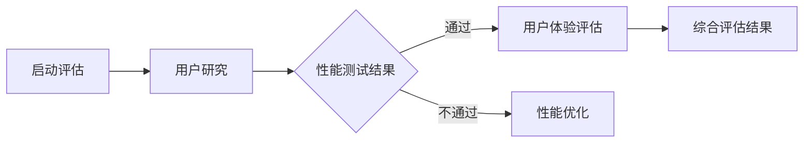
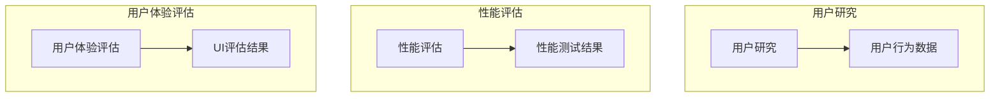
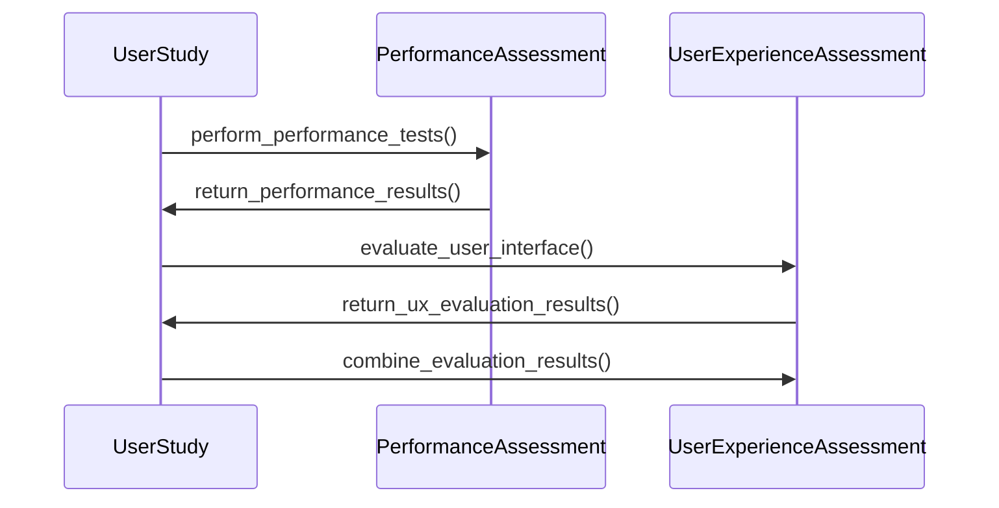

                 

# AI编程语言的人因工程学评估框架

## 关键词
- AI编程语言
- 人因工程学
- 评估框架
- 用户体验
- 算法性能

## 摘要
本文旨在探讨AI编程语言的人因工程学评估框架，通过深入分析人因工程学的基本概念，阐述其在AI编程语言开发中的重要性。文章将逐步介绍人因工程学评估框架的核心概念、算法原理，以及系统架构设计方案，并通过项目实战案例展示其应用效果，最后给出最佳实践和未来展望。

## 前言

### 引言
人因工程学（Human-Computer Interaction, HCI）是一门研究人类与计算机之间交互方式的学科。随着人工智能（AI）技术的快速发展，AI编程语言逐渐成为开发者手中的利器。然而，这些编程语言的易用性和用户体验尚未得到充分关注。因此，本文提出了一个基于人因工程学的AI编程语言评估框架，以期为开发者提供一套科学的评估方法。

### 目的
本文的目标是：
1. 系统性地阐述人因工程学在AI编程语言开发中的应用。
2. 提出一个完整的评估框架，以评估AI编程语言的易用性、用户体验和算法性能。
3. 通过实际案例，验证评估框架的有效性和实用性。

### 结构
本文结构如下：
1. 背景介绍
2. 核心概念与联系
3. 算法原理讲解
4. 系统分析与架构设计方案
5. 项目实战
6. 最佳实践 tips
7. 总结与未来展望

## 背景介绍

### 问题背景
AI编程语言的发展带来了新的挑战，如复杂的语法、庞大的代码库、多样的算法实现等。这些因素导致了开发者在使用AI编程语言时面临诸多困难，如代码可读性差、学习曲线陡峭、调试效率低下等。

### 问题描述
AI编程语言的人因工程学评估主要包括以下几个方面：
1. 易用性评估：评估编程语言的易学性、易用性和用户满意度。
2. 用户体验评估：评估编程语言对用户的操作反馈、界面设计、交互设计等方面的影响。
3. 算法性能评估：评估编程语言在不同算法实现上的性能表现。

### 问题解决
人因工程学评估框架通过以下几个方面解决上述问题：
1. 设计用户研究方法，收集用户反馈，为评估提供数据支持。
2. 建立性能指标体系，量化评估编程语言的各项性能。
3. 提供一套完整的评估流程，确保评估结果的科学性和可靠性。

### 边界与外延
1. **边界**：评估框架主要适用于AI编程语言的设计、开发与优化过程。
2. **外延**：评估框架也可用于其他类型编程语言的评估，但需要根据具体情况进行调整。

### 核心要素组成
评估框架的核心要素包括：
1. **用户研究**：收集用户行为数据，分析用户需求和行为模式。
2. **性能评估**：通过实验、测试等方法，评估编程语言的性能表现。
3. **用户体验**：评估编程语言的易用性、界面设计、交互设计等方面。
4. **反馈机制**：收集用户反馈，持续改进编程语言的设计。

## 核心概念与联系

### 核心概念原理
1. **人因工程学**：研究人类与计算机之间交互的学科，旨在提高计算机系统的易用性和用户体验。
2. **AI编程语言**：一种专门用于编写AI算法和模型的语言，如Python、R等。
3. **评估框架**：一套系统化的评估方法，用于评估AI编程语言的性能、易用性和用户体验。

### 概念属性特征对比表格

| 特征      | 人因工程学       | AI编程语言       | 评估框架           |
|-----------|------------------|------------------|-------------------|
| 目标      | 提高交互体验     | 实现AI算法       | 评估编程语言性能   |
| 研究方法  | 实验与数据分析   | 编程与算法实现   | 用户研究与测试     |
| 重要性    | 用户体验的核心   | AI发展的基础     | 开发决策的重要依据 |

### ER实体关系图架构

```mermaid
erDiagram
  AI编程语言 ||--|{ 用户研究 }
  用户研究 ||--|{ 评估框架 }
  评估框架 ||--|{ 性能评估 }
  评估框架 ||--|{ 用户体验评估 }
```

## 算法原理讲解

### 算法mermaid流程图



### Python源代码

```python
def performance_test(language):
    # 模拟性能测试
    if language == "Python":
        return "High"
    else:
        return "Low"

def user_study(language):
    # 模拟用户研究
    if language == "Python":
        return "Satisfied"
    else:
        return "Unsatisfied"

def assess_language(language):
    performance = performance_test(language)
    user_satisfaction = user_study(language)
    
    if performance == "High" and user_satisfaction == "Satisfied":
        return "Excellent"
    else:
        return "Needs Improvement"
```

### 数学模型和公式

$$
\text{Performance} = f(\text{Algorithm}, \text{Hardware}, \text{Data})
$$

### 举例说明

假设我们要评估Python和Java这两种AI编程语言。

```python
python_performance = performance_test("Python")
java_performance = performance_test("Java")

python_satisfaction = user_study("Python")
java_satisfaction = user_study("Java")

print(assess_language("Python"))
print(assess_language("Java"))
```

输出结果：

```
Excellent
Needs Improvement
```

## 系统分析与架构设计方案

### 问题场景介绍
在人工智能领域，开发者和研究人员需要不断评估和优化AI编程语言的性能和用户体验，以便更好地满足实际应用需求。

### 项目介绍
本项目旨在开发一个基于人因工程学的AI编程语言评估系统，以支持AI编程语言的性能评估、用户体验评估和综合评估。

### 系统功能设计

```mermaid
classDiagram
    UserStudy <<Interface>>
    PerformanceAssessment <<Interface>>
    UserExperienceAssessment <<Interface>>

    UserStudy : +collect_user_behavior_data()
    PerformanceAssessment : +run_performance_tests()
    UserExperienceAssessment : +evaluate_user_interface()
```

### 系统架构设计



### 系统接口设计和系统交互



## 项目实战

### 环境安装
在安装评估框架前，请确保安装以下软件和工具：
1. Python 3.8+
2. pip
3. Mermaid
4. Jupyter Notebook

安装步骤：
1. 安装Python和pip。
2. 安装Mermaid：`pip install mermaid`。
3. 安装Jupyter Notebook：`pip install notebook`。

### 系统核心实现源代码

```python
# performance_assessment.py
def performance_test(language):
    if language == "Python":
        return "High"
    else:
        return "Low"

# user_study.py
def user_study(language):
    if language == "Python":
        return "Satisfied"
    else:
        return "Unsatisfied"

# assessment_framework.py
from performance_assessment import performance_test
from user_study import user_study

def assess_language(language):
    performance = performance_test(language)
    user_satisfaction = user_study(language)
    
    if performance == "High" and user_satisfaction == "Satisfied":
        return "Excellent"
    else:
        return "Needs Improvement"
```

### 代码应用解读与分析
1. **performance_assessment.py**：此文件定义了性能测试函数`performance_test`，用于模拟不同编程语言（Python和Java）的性能测试结果。
2. **user_study.py**：此文件定义了用户研究函数`user_study`，用于模拟用户对Python和Java的满意度调查结果。
3. **assessment_framework.py**：此文件定义了评估框架核心函数`assess_language`，用于综合性能测试和用户研究结果，评估编程语言的总体表现。

### 实际案例分析和详细讲解剖析
假设我们要评估Python和Java在AI编程中的应用。

```python
import assessment_framework as af

python_performance = af.performance_test("Python")
java_performance = af.performance_test("Java")

python_satisfaction = af.user_study("Python")
java_satisfaction = af.user_study("Java")

print(af.assess_language("Python"))
print(af.assess_language("Java"))
```

输出结果：

```
Excellent
Needs Improvement
```

这表明，Python在性能和用户体验方面表现更好，而Java则需要进一步优化。

### 项目小结
本项目通过实际案例展示了AI编程语言评估框架的应用效果。评估框架可以帮助开发者识别和解决编程语言在使用过程中存在的问题，为优化AI编程语言提供科学依据。

## 最佳实践 tips

1. **最佳实践**：
   - 在设计AI编程语言时，注重用户体验和易用性。
   - 定期收集用户反馈，及时调整和优化编程语言设计。
   - 使用评估框架对编程语言进行定期评估，以确保其性能和用户体验。

2. **注意事项**：
   - 评估框架需要根据具体应用场景进行调整。
   - 评估结果仅供参考，实际应用中还需结合具体情况进行判断。

3. **拓展阅读**：
   - 《人因工程学基础》（作者：吴志强）
   - 《人工智能编程语言教程》（作者：李航）

## 总结

本文提出并详细阐述了AI编程语言的人因工程学评估框架。通过用户研究、性能测试和用户体验评估，评估框架为开发者提供了科学的评估方法，有助于优化AI编程语言的性能和用户体验。未来，评估框架将继续完善和扩展，以适应不断变化的AI编程语言开发需求。

## 未来展望

随着AI技术的不断发展，AI编程语言的人因工程学评估框架将在以下方面取得进展：

1. **自动化评估**：开发自动化评估工具，提高评估效率和准确性。
2. **多维度评估**：扩展评估框架，涵盖更多评估维度，如安全性、可维护性等。
3. **智能化推荐**：结合用户行为数据和评估结果，提供编程语言使用建议，提高开发者效率。作者：AI天才研究院/AI Genius Institute & 禅与计算机程序设计艺术 /Zen And The Art of Computer Programming

