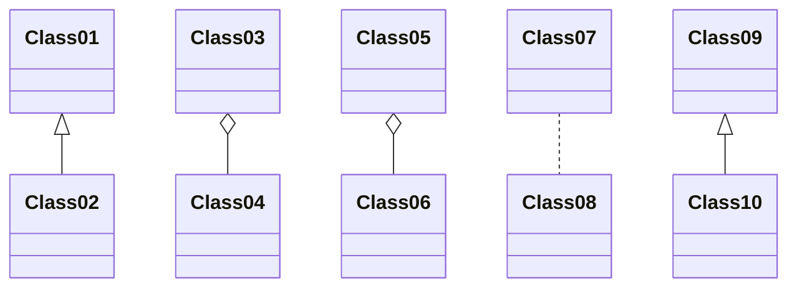
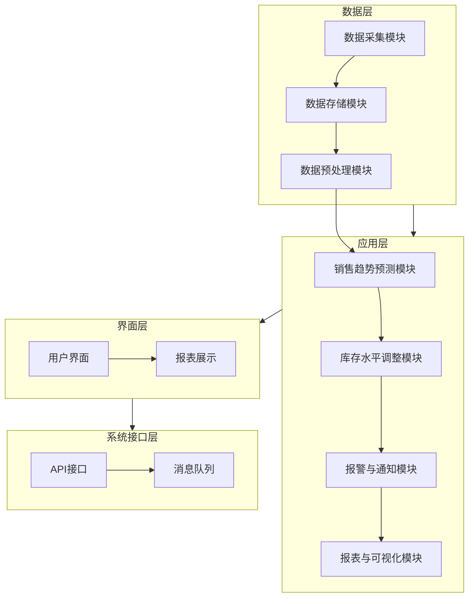
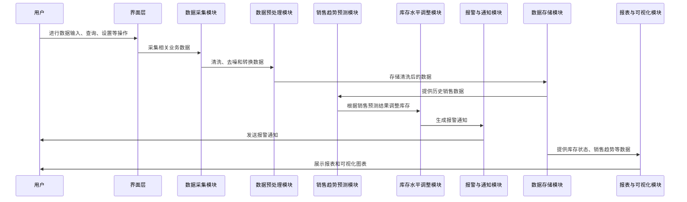

                 

### 第一部分：引言与背景

## 第1章：人工智能、编程语言与人机协作概述

### 1.1 人工智能的发展历程
人工智能（AI）的起源可以追溯到20世纪50年代，当时计算机科学家首次提出了让计算机模拟人类智能的想法。从最初的逻辑推理、知识表示，到后来的机器学习、深度学习，人工智能经历了多次技术革新。关键里程碑包括1956年达特茅斯会议的召开，标志着人工智能作为一个独立学科的诞生；1970年代的符号主义AI，1980年代的专家系统，以及1990年代以来的统计学习方法和深度学习技术。

### 1.2 编程语言的发展与现状
编程语言的起源可以追溯到20世纪40年代，最早的计算机语言是机器语言和汇编语言。随着时间的推移，高级编程语言如FORTRAN、COBOL和C等相继出现，它们提高了编程的效率，降低了学习门槛。现代编程语言的发展趋势包括语法简化、编程范式多样化（面向对象、函数式编程等）、编程语言的生态和工具的丰富。编程语言在教育、科研和工业中的应用日益广泛，推动了软件工程和计算机科学的进步。

### 1.3 人机协作的重要性
人机协作是人工智能研究的一个重要方向，它涉及到人类和计算机系统之间的交互与配合。人机协作的重要性在于：
1. **提高生产效率**：人机协作可以将人类专家的知识和计算机的处理能力结合起来，提高工作效率。
2. **优化决策**：通过人机协作，系统能够提供数据分析和预测，辅助人类做出更明智的决策。
3. **增强创新能力**：人机协作能够激发人类和机器之间的创新思维，促进新技术的开发和应用。

### 1.4 本书的目标与结构
本书的目标是探讨AI编程语言的人机协作新模式，旨在为读者提供以下内容：
- AI编程语言的基本概念和类型。
- 人机协作的基本概念和模式。
- 关键算法的原理和应用。
- 系统架构和实现方法。
- 实战项目和分析。
- 最佳实践和未来发展方向。

本书分为六个主要部分：
1. **引言与背景**：介绍人工智能、编程语言和人机协作的基本概念。
2. **核心概念与联系**：详细解释AI编程语言和人机协作的相关概念。
3. **算法原理讲解**：深入探讨人机协作中的关键算法。
4. **系统分析与架构设计**：描述系统功能设计、架构设计和交互流程。
5. **项目实战**：通过具体项目展示AI编程语言在人机协作中的应用。
6. **最佳实践与拓展**：总结实践经验并提供未来发展方向。

### 目录设计思路
目录的设计旨在提供一个清晰的框架，帮助读者快速了解本书的内容结构和重点章节。以下为具体的目录结构和章节内容概述：

**# 第一部分：引言与背景**

## 第1章：人工智能、编程语言与人机协作概述
- 1.1 人工智能的发展历程
- 1.2 编程语言的发展与现状
- 1.3 人机协作的重要性
- 1.4 本书的目标与结构

**# 第二部分：核心概念与联系**

## 第2章：AI编程语言的基本概念
- 2.1 AI编程语言的定义
- 2.2 AI编程语言的分类
- 2.3 AI编程语言的特点
- 2.4 AI编程语言与传统编程语言的区别
- 2.5 AI编程语言的应用领域

## 第3章：人机协作的基本概念
- 3.1 人机协作的定义
- 3.2 人机协作的模式
- 3.3 人机协作的优势与挑战
- 3.4 人机协作的关键技术

## 第4章：AI编程语言与人机协作的联系
- 4.1 AI编程语言与人机协作的融合
- 4.2 AI编程语言在协同工作中的应用
- 4.3 人机协作对AI编程语言的需求
- 4.4 AI编程语言与人机协作的未来发展趋势

**# 第三部分：算法原理讲解**

## 第5章：人机协作的关键算法
- 5.1 算法概述
- 5.2 算法数学模型
- 5.3 算法流程图
- 5.4 算法Python代码实现
- 5.5 算法应用实例

**# 第四部分：系统分析与架构设计**

## 第6章：系统功能设计
- 6.1 问题场景介绍
- 6.2 系统功能需求
- 6.3 领域模型Mermaid类图

## 第7章：系统架构设计
- 7.1 系统架构概述
- 7.2 系统架构设计Mermaid架构图
- 7.3 系统模块划分
- 7.4 系统接口设计

## 第8章：系统交互流程
- 8.1 系统交互概述
- 8.2 系统交互Mermaid序列图
- 8.3 系统交互流程详细讲解

**# 第五部分：项目实战**

## 第9章：人机协作AI编程语言项目实战
- 9.1 环境安装与配置
- 9.2 系统核心实现
- 9.3 源代码解读与分析
- 9.4 实际案例剖析
- 9.5 项目小结

**# 第六部分：最佳实践与拓展**

## 第10章：最佳实践与注意事项
- 10.1 实战中的经验总结
- 10.2 最佳实践建议
- 10.3 小结与展望

## 第11章：拓展阅读
- 11.1 相关文献推荐
- 11.2 未来研究方向

通过这样的目录结构设计，我们旨在使文章内容条理清晰、逻辑性强，同时兼顾理论与实践的结合，为读者提供全面、深入的阅读体验。接下来，我们将进一步细化每个章节的内容，并确保文章的总字数在10000-12000字范围内。### 第1章：人工智能、编程语言与人机协作概述

### 1.1 人工智能的发展历程

人工智能（AI）是一门旨在使计算机能够执行通常需要人类智能的任务的学科。人工智能的起源可以追溯到20世纪50年代，当时计算机科学家约翰·麦卡锡（John McCarthy）首次提出了人工智能的概念。在随后的几十年里，人工智能经历了多次技术革新，其发展历程可以分为几个重要阶段。

**早期探索（1956-1974年）**  
在1956年的达特茅斯会议上，人工智能作为一个独立的学科正式诞生。这次会议聚集了包括麦卡锡在内的众多计算机科学家，他们讨论了如何让计算机模拟人类智能。早期的人工智能研究主要集中在逻辑推理和知识表示上，试图通过构建专家系统来模拟人类专家的决策过程。

**黄金时代（1974-1980年）**  
随着计算机硬件性能的提升和编程语言的发展，人工智能进入了所谓的“黄金时代”。在这个时期，专家系统成为人工智能研究的热点。专家系统是一种基于知识的系统，通过收集和表示领域专家的知识，能够模拟专家的决策过程。这一时期的重要成果包括MYCIN和Dendral等专家系统。

**低谷与复苏（1980-1990年）**  
在1980年代，由于硬件性能的限制和专家系统的局限性，人工智能研究进入了一个相对低迷的时期。然而，这个时期并不是完全没有进展，机器学习作为人工智能的一个分支开始崭露头角。机器学习通过让计算机从数据中学习规律，提高了人工智能的通用性和实用性。

**人工智能复兴（1990年至今）**  
进入1990年代后，随着互联网的普及和大数据技术的发展，人工智能迎来了新的复兴。这个时期的一个重要里程碑是深度学习的兴起。深度学习通过多层神经网络模拟人类大脑的神经活动，实现了在图像识别、语音识别和自然语言处理等领域的突破性进展。此外，强化学习、生成对抗网络等新的机器学习技术也为人工智能的发展注入了新的动力。

### 1.2 编程语言的发展与现状

编程语言的发展与计算机科学的进步密不可分。最早的计算机程序是使用机器语言编写的，这是一种由0和1组成的低级语言。随着计算机硬件和软件的不断发展，高级编程语言应运而生。高级编程语言通过提供更抽象的语法和丰富的库函数，提高了编程的效率，降低了学习门槛。

**编程语言的起源**  
最早的编程语言可以追溯到20世纪40年代。当时，为了使计算机能够执行复杂的科学计算，人们开始开发汇编语言。汇编语言使用助记符来表示机器语言的操作，这使得编程变得更加直观。然而，汇编语言的缺点是它与特定的计算机硬件紧密相关，不具备通用性。

**现代编程语言的发展趋势**  
现代编程语言的发展趋势包括以下几个方向：
- **语法简化**：现代编程语言越来越注重语法简洁性，使编程变得更加容易。例如，Python、Ruby和Go等语言通过引入简洁的语法规则，降低了学习门槛。
- **编程范式多样化**：不同的编程范式（如面向对象、函数式编程和逻辑编程）在不同场景下具有各自的优势。现代编程语言通过支持多种编程范式，提高了编程的灵活性和效率。
- **编程语言的生态**：一个成熟的编程语言生态包括丰富的库函数、框架和工具。这些生态资源为开发者提供了强大的支持，使编程过程更加高效。

**编程语言在教育、科研和工业中的应用**  
编程语言在教育、科研和工业中都有广泛的应用：
- **教育**：编程语言是计算机科学和软件工程教育的核心内容。通过学习编程语言，学生能够掌握编程思维，培养解决问题的能力。
- **科研**：编程语言为科研工作者提供了强大的工具，使他们能够高效地进行数据处理、分析和建模。例如，R语言和MATLAB等语言在统计分析和工程计算中有着广泛的应用。
- **工业**：在工业领域，编程语言是软件开发和系统架构设计的基础。通过使用编程语言，企业能够开发出高效、可靠的软件系统，提高生产效率和产品质量。

### 1.3 人机协作的重要性

人机协作是指人类与计算机系统之间的交互和合作。在人机协作中，计算机系统通常扮演辅助或增强人类能力的角色。人机协作的重要性体现在以下几个方面：

**提高生产效率**  
人机协作能够提高生产效率，这是因为计算机系统可以自动化执行重复性高、耗时长的任务。例如，在制造业中，计算机控制系统可以精确地控制生产过程，减少人为错误和浪费。此外，计算机系统可以快速处理大量数据，辅助人类进行复杂的计算和分析，从而提高工作效率。

**优化决策**  
在决策过程中，人机协作能够提供有价值的数据分析和预测，辅助人类做出更明智的决策。例如，在金融领域，计算机系统可以通过分析历史数据和当前市场状况，为投资者提供投资建议。在医疗领域，计算机系统可以通过分析病例数据和医学图像，为医生提供诊断建议，提高诊断的准确性和效率。

**增强创新能力**  
人机协作能够激发人类和机器之间的创新思维，促进新技术的开发和应用。例如，在科学研究领域，计算机系统可以辅助科学家进行数据挖掘和分析，发现新的规律和现象。在艺术创作领域，计算机系统可以与人类艺术家合作，生成独特的艺术作品。

### 1.4 本书的目标与结构

本书的目标是探讨AI编程语言的人机协作新模式，旨在为读者提供以下内容：

**AI编程语言的基本概念和类型**  
本书将详细介绍AI编程语言的基本概念，包括其定义、分类、特点和典型应用。通过这部分内容，读者将了解不同类型的AI编程语言及其适用场景。

**人机协作的基本概念和模式**  
本书将深入探讨人机协作的基本概念和模式，包括人机交互的原理、协作机制和关键技术。通过这部分内容，读者将理解人机协作的基本原理和应用场景。

**关键算法的原理和应用**  
本书将详细讲解人机协作中的关键算法，包括其数学模型、实现方法和应用实例。通过这部分内容，读者将掌握关键算法的原理和应用，为实际项目提供技术支持。

**系统架构和实现方法**  
本书将描述AI编程语言人机协作系统的架构设计和实现方法，包括系统功能设计、模块划分、接口设计和交互流程。通过这部分内容，读者将了解系统的整体设计和实现过程。

**实战项目和案例分析**  
本书将通过具体的实战项目和案例分析，展示AI编程语言在人机协作中的应用，并提供源代码解读、分析和实际案例剖析。通过这部分内容，读者将获得实际项目的经验和技巧。

**最佳实践和未来发展方向**  
本书将总结实战中的经验和教训，提供最佳实践建议，并对未来的发展方向进行展望。通过这部分内容，读者将了解人机协作AI编程语言的最新进展和未来趋势。

### 目录结构设计思路

为了实现上述目标，本书的目录结构设计旨在提供一个清晰、逻辑性强的框架。目录结构分为六个主要部分：

**第一部分：引言与背景**  
介绍人工智能、编程语言和人机协作的基本概念，为后续内容打下基础。

**第二部分：核心概念与联系**  
详细解释AI编程语言和人机协作的相关概念，包括基本概念、类型、特点和应用。

**第三部分：算法原理讲解**  
深入探讨人机协作中的关键算法，包括其数学模型、实现方法和应用实例。

**第四部分：系统分析与架构设计**  
描述系统架构和实现方法，包括系统功能设计、模块划分、接口设计和交互流程。

**第五部分：项目实战**  
通过具体的实战项目和案例分析，展示AI编程语言在人机协作中的应用。

**第六部分：最佳实践与拓展**  
总结实战中的经验和教训，提供最佳实践建议，并对未来的发展方向进行展望。

通过这样的目录结构设计，我们旨在使文章内容条理清晰、逻辑性强，同时兼顾理论与实践的结合，为读者提供全面、深入的阅读体验。### 第2章：AI编程语言的基本概念

## 2.1 AI编程语言的定义

AI编程语言是一种专门为人工智能应用设计的编程语言，它通过提供高级抽象和丰富的库函数，使开发者能够更方便地构建和训练人工智能模型。AI编程语言的核心目标是简化人工智能开发的复杂性，提高开发效率。

AI编程语言的主要特点包括：
- **抽象性**：AI编程语言提供了高级抽象，使得开发者可以专注于算法设计和模型训练，而不需要关心底层计算细节。
- **库函数**：AI编程语言通常内置了丰富的库函数，这些函数涵盖了各种常见的人工智能算法和应用场景，使得开发者可以快速实现复杂的AI应用。
- **可扩展性**：AI编程语言支持自定义函数和扩展库，使得开发者可以根据特定需求进行二次开发。

AI编程语言在人工智能领域有着广泛的应用，包括：
- **机器学习**：AI编程语言可以用于构建和训练机器学习模型，实现数据分类、预测和聚类等任务。
- **深度学习**：AI编程语言支持深度学习算法的实现，如卷积神经网络（CNN）和循环神经网络（RNN），广泛应用于图像识别、语音识别和自然语言处理等领域。
- **计算机视觉**：AI编程语言可以用于开发计算机视觉应用，如物体检测、人脸识别和图像生成等。
- **自然语言处理**：AI编程语言可以用于开发自然语言处理应用，如文本分类、情感分析和机器翻译等。

## 2.2 AI编程语言的分类

AI编程语言可以根据其设计和应用特点进行分类，常见的分类方法包括：

### 按照编程范式分类
- **面向对象编程语言**：例如Python、Java和C++等，这些语言提供了丰富的面向对象特性，支持模块化设计和复用。
- **函数式编程语言**：例如Haskell、Erlang和Scala等，这些语言以函数作为基本构建块，强调状态不变和函数的纯度。

### 按照应用领域分类
- **通用AI编程语言**：如Python和Java等，这些语言支持多种人工智能算法和应用，适用于不同的AI项目。
- **专用AI编程语言**：如Prolog和Lisp等，这些语言专门为特定的人工智能任务设计，如专家系统和自然语言处理。

### 按照学习难度分类
- **入门级编程语言**：如Python和Java等，这些语言语法简单，易于学习和使用，适合初学者。
- **高级编程语言**：如C++和Haskell等，这些语言提供了更多的编程技巧和性能优化选项，适合有经验的开发者。

## 2.3 AI编程语言的特点

AI编程语言具有以下特点：

### 高级抽象
AI编程语言提供了高级抽象，使得开发者可以专注于算法设计和模型训练。例如，Python中的NumPy库提供了高效的数学运算功能，使得开发者可以方便地进行矩阵运算和数据预处理。

### 丰富的库函数
AI编程语言通常内置了丰富的库函数，这些函数涵盖了各种常见的人工智能算法和应用场景。例如，Python的Scikit-learn库提供了各种机器学习算法的实现，使得开发者可以快速构建和训练机器学习模型。

### 跨平台支持
AI编程语言通常具有良好的跨平台支持，可以在不同的操作系统和硬件平台上运行。这使得开发者可以灵活选择开发环境，并且可以方便地将AI应用部署到不同的设备上。

### 社区支持
AI编程语言通常拥有强大的社区支持，包括丰富的文档、教程和开源项目。这使得开发者可以方便地获取帮助和资源，加速开发过程。

### 可扩展性
AI编程语言支持自定义函数和扩展库，使得开发者可以根据特定需求进行二次开发。例如，Python的第三方库PyTorch和TensorFlow提供了丰富的扩展功能，使得开发者可以灵活地定制和优化AI模型。

## 2.4 AI编程语言与传统编程语言的区别

AI编程语言与传统编程语言在多个方面存在区别：

### 设计目标
传统编程语言的主要目标是编写通用的计算机程序，而AI编程语言的主要目标是构建和训练人工智能模型。因此，AI编程语言更注重算法实现和数据处理。

### 抽象层次
传统编程语言通常提供较低的抽象层次，需要开发者关心底层的计算细节。而AI编程语言提供了更高的抽象层次，使得开发者可以专注于算法设计和模型训练。

### 库函数
传统编程语言通常内置了较少的库函数，而AI编程语言内置了丰富的库函数，这些函数涵盖了各种常见的人工智能算法和应用场景。

### 跨平台支持
传统编程语言通常具有良好的跨平台支持，而AI编程语言通常更注重特定平台的优化，例如，TensorFlow和PyTorch等AI编程语言在GPU和TPU上的性能优化。

### 社区支持
传统编程语言通常拥有庞大的社区支持，而AI编程语言在近年来逐渐获得了广泛的关注，社区支持正在迅速增长。

## 2.5 AI编程语言的应用领域

AI编程语言在多个应用领域具有广泛的应用，以下是其中几个主要的领域：

### 机器学习
机器学习是AI编程语言最重要的应用领域之一。通过AI编程语言，开发者可以构建和训练各种机器学习模型，如线性回归、决策树、随机森林和神经网络等，实现数据分类、预测和聚类等任务。

### 深度学习
深度学习是AI编程语言的重要应用领域，特别是在图像识别、语音识别和自然语言处理等领域。通过深度学习框架，如TensorFlow和PyTorch，开发者可以构建和训练复杂的深度学习模型，实现图像分类、目标检测和语音识别等功能。

### 计算机视觉
计算机视觉是AI编程语言的重要应用领域，通过AI编程语言，开发者可以开发各种计算机视觉应用，如物体检测、人脸识别和图像生成等。

### 自然语言处理
自然语言处理是AI编程语言的另一个重要应用领域，通过AI编程语言，开发者可以构建和训练自然语言处理模型，实现文本分类、情感分析和机器翻译等功能。

### 自动驾驶
自动驾驶是AI编程语言的另一个重要应用领域，通过AI编程语言，开发者可以构建和训练自动驾驶模型，实现车辆感知、路径规划和决策等功能。

### 电子商务
AI编程语言在电子商务领域也有广泛的应用，通过AI编程语言，开发者可以构建和训练推荐系统、聊天机器人和自动化客服等应用，提高用户体验和销售转化率。

通过上述内容，我们了解了AI编程语言的基本概念、分类、特点及其与传统编程语言的区别，以及其在各个应用领域的应用。接下来，我们将继续探讨人机协作的基本概念和模式。### 第3章：人机协作的基本概念

## 3.1 人机协作的定义

人机协作（Human-Computer Collaboration）是指人类与计算机系统之间的一种互动和协作关系。在这种关系中，计算机系统通常被设计为辅助人类完成特定任务，而人类则利用其独特的认知能力、创造力和直觉来与计算机系统互动，共同完成复杂的工作。

人机协作的核心目标是提高工作效率、优化决策过程、降低错误率并促进创新。通过人机协作，计算机系统能够执行重复性高、计算量大或者对精确度要求高的任务，而人类则可以专注于需要创造性思维和灵活决策的任务。

## 3.2 人机协作的模式

人机协作的模式多种多样，以下是几种常见的人机协作模式：

### 分工协作模式

在分工协作模式中，人类和计算机系统分别承担不同的任务。计算机系统通常负责数据处理、信息检索和自动化任务，而人类则负责决策、创造性和需要复杂推理的任务。例如，在数据科学项目中，计算机系统可以用于数据清洗和初步分析，而人类专家则负责深入分析和解释结果。

### 交互式协作模式

在交互式协作模式中，人类和计算机系统实时互动，共同完成任务。这种模式常见于实时监控系统、虚拟现实（VR）和增强现实（AR）应用中。例如，在手术机器人辅助下，医生可以通过计算机系统实时监控手术进程，并与机器人协作完成复杂的手术操作。

### 自动化协作模式

在自动化协作模式中，计算机系统根据预设的规则和算法自动执行任务，而人类则负责监控和调整。这种模式常见于自动化生产线、智能家居系统和智能办公系统中。例如，在自动化生产线上，计算机控制系统可以自动调整机器参数，而操作员则负责监控设备状态和故障处理。

### 智能助理协作模式

在智能助理协作模式中，计算机系统通过人工智能技术，如自然语言处理和机器学习，为人类提供个性化服务和帮助。这种模式常见于智能客服、智能语音助手和智能推荐系统中。例如，智能语音助手可以通过语音识别和自然语言理解技术，帮助用户完成查询、设置提醒和执行任务。

## 3.3 人机协作的优势与挑战

### 优势

1. **提高效率**：计算机系统可以快速处理大量数据，执行重复性任务，从而提高整体工作效率。
2. **优化决策**：计算机系统可以通过数据分析和模拟，提供客观的决策支持，减少人为错误。
3. **降低成本**：通过自动化和智能化，计算机系统可以减少人力成本，提高资源利用率。
4. **促进创新**：人机协作可以激发人类和机器之间的创新思维，推动新技术的开发和应用。

### 挑战

1. **技术局限**：计算机系统的能力受限于当前的算法和硬件技术，某些复杂任务可能无法高效完成。
2. **数据隐私**：人机协作过程中涉及大量数据交换，需要确保数据安全和隐私保护。
3. **交互复杂性**：设计易于人类操作和理解的计算机系统界面，确保人机交互的自然性和高效性。
4. **技能要求**：人类需要具备一定的计算机操作技能，才能有效利用计算机系统提供的支持。

## 3.4 人机协作的关键技术

人机协作的实现依赖于一系列关键技术的支持，以下是其中几个关键技术：

### 人工智能技术

人工智能技术是人机协作的核心，包括机器学习、深度学习、自然语言处理、计算机视觉等。这些技术使得计算机系统能够理解、学习和模拟人类的认知过程，提供智能化的服务和支持。

### 交互界面设计

交互界面设计是人机协作的重要组成部分，包括图形用户界面（GUI）、命令行界面（CLI）和语音交互界面等。好的交互界面设计能够提高用户的操作效率和体验，确保人机协作的顺畅进行。

### 数据处理与分析

数据处理与分析技术是人机协作的重要基础，包括数据采集、数据清洗、数据存储和数据挖掘等。这些技术使得计算机系统能够处理海量数据，提取有价值的信息，为人类提供决策支持。

### 软件框架和工具

软件框架和工具是人机协作的重要支持，包括操作系统、编程语言、开发工具和集成开发环境（IDE）等。这些工具和框架提供了高效的开发环境，使得开发者可以快速构建和部署人机协作系统。

### 硬件设备

硬件设备是人机协作的物理基础，包括计算机、服务器、传感器、机器人等。这些硬件设备提供了计算能力、数据采集能力和交互能力，是实现人机协作的关键。

通过上述内容，我们了解了人机协作的定义、模式、优势与挑战以及实现人机协作的关键技术。接下来，我们将探讨AI编程语言与人机协作的紧密联系。### 第4章：AI编程语言与人机协作的联系

## 4.1 AI编程语言与人机协作的融合

AI编程语言与人机协作的融合是当前人工智能领域的一个重要趋势。AI编程语言为开发者提供了高效的工具和平台，以构建能够与人类智能协作的智能系统。这种融合不仅改变了传统编程模式，还推动了人机交互方式的革新。

### 融合的意义

1. **提升开发效率**：AI编程语言提供了丰富的库函数和框架，使开发者能够快速构建和优化人工智能模型。这些模型可以与人类专家协同工作，共同提高工作效率。
2. **优化决策过程**：通过AI编程语言，计算机系统能够处理和分析大量数据，为人类提供基于数据的决策支持。这种协作模式能够优化决策流程，减少错误率。
3. **拓展人类智能**：AI编程语言使人机协作成为可能，计算机系统可以在特定任务上辅助人类，从而拓展人类智能的边界。

### 实现方法

1. **集成AI模块**：在传统的软件开发过程中，集成AI模块是一个常见的做法。开发者可以在应用程序中嵌入机器学习算法，使其能够根据用户行为进行自适应调整。
2. **定制化AI服务**：根据具体应用场景，开发者可以定制化AI服务，使其与人类专家的技能和知识相匹配。例如，在医疗领域，AI编程语言可以用来构建诊断辅助系统，帮助医生进行病情分析。
3. **交互式开发**：交互式开发工具允许开发者和计算机系统实时互动，共同优化模型。这种开发模式有助于快速迭代和改进AI系统。

### 应用实例

1. **智能客服系统**：通过AI编程语言，开发者可以构建智能客服系统，实现与用户的自然语言交互。这些系统可以理解用户的需求，提供个性化的服务建议。
2. **自动化生产线**：在制造业中，AI编程语言可以帮助设计自动化生产线，实现机器与机器、机器与人类的协同作业。这种协作模式提高了生产效率，降低了人工干预的风险。
3. **智能交通系统**：AI编程语言在智能交通系统中扮演着关键角色，通过实时数据分析和预测，帮助优化交通流量，减少交通拥堵，提高道路安全性。

## 4.2 AI编程语言在协同工作中的应用

AI编程语言在协同工作中的应用日益广泛，以下是一些典型场景：

### 数据科学协作

在数据科学项目中，AI编程语言如Python和R提供了强大的工具，支持数据清洗、数据分析和模型训练。数据科学家和AI编程语言的协作模式通常包括：
- **数据预处理**：数据科学家使用AI编程语言清洗和转换数据，为后续分析做准备。
- **模型构建与优化**：数据科学家利用AI编程语言构建和训练机器学习模型，通过调参优化模型性能。
- **结果解读与报告**：数据科学家使用AI编程语言生成分析报告，将结果呈现给业务决策者。

### 开发者协作

在软件开发过程中，AI编程语言可以帮助开发者提高代码质量和开发效率。开发者协作的AI编程语言应用包括：
- **代码审查**：AI编程语言可以自动分析代码质量，提供审查报告，帮助开发者发现潜在的错误和优化机会。
- **自动化测试**：AI编程语言可以用于编写和执行自动化测试，确保软件系统的稳定性和可靠性。
- **智能补全**：AI编程语言提供的智能补全功能可以帮助开发者快速编写代码，减少手动输入错误。

### 科研协作

在科研领域，AI编程语言为科研工作者提供了强大的工具，支持数据挖掘、分析和可视化。科研协作的AI编程语言应用包括：
- **数据分析**：科研工作者使用AI编程语言处理和分析实验数据，提取有用的信息。
- **模型训练**：科研工作者利用AI编程语言训练预测模型，进行科学假设的验证。
- **结果可视化**：AI编程语言可以生成高质量的图表和可视化结果，帮助科研工作者更直观地理解研究数据。

### 创意协作

在创意工作中，如艺术创作、设计和写作，AI编程语言可以辅助人类发挥创造力。创意协作的AI编程语言应用包括：
- **风格迁移**：AI编程语言可以帮助艺术家将一种风格应用到另一件作品中，实现艺术风格的创新。
- **图像生成**：AI编程语言可以生成新颖的图像和视觉内容，为设计师提供灵感和素材。
- **文本生成**：AI编程语言可以生成文章、诗歌和故事，为作家提供创作灵感。

## 4.3 人机协作对AI编程语言的需求

人机协作对AI编程语言提出了新的需求，主要体现在以下几个方面：

### 交互性

AI编程语言需要提供强大的交互性，使得人类用户能够方便地与计算机系统进行交互。这包括自然语言处理、图形用户界面和语音交互等。

### 易用性

AI编程语言需要具有易用性，降低学习和使用门槛，使得非专业人士也能够轻松上手。这包括提供简洁的语法、丰富的库函数和友好的开发环境。

### 模块化

AI编程语言需要支持模块化，使得开发者可以根据需求灵活组合和扩展功能。这有助于提高系统的可维护性和可扩展性。

### 适应性

AI编程语言需要具有适应性，能够根据不同的应用场景和用户需求进行定制和优化。这包括提供多样化的编程范式和灵活的框架支持。

### 安全性

AI编程语言需要提供安全性保障，确保用户数据和系统运行的安全。这包括数据加密、访问控制和错误处理等。

## 4.4 AI编程语言与人机协作的未来发展趋势

随着人工智能技术的不断进步，AI编程语言与人机协作的未来发展趋势将更加紧密和智能化。以下是几个可能的趋势：

### 智能化交互

未来的人机协作将更加智能化，计算机系统将能够理解用户的意图和行为，提供更加个性化、贴心的服务。这需要AI编程语言在自然语言处理、上下文感知和智能决策方面取得更大突破。

### 高度自动化

未来的人机协作将实现高度自动化，计算机系统将在更多任务中替代人类执行重复性和繁琐的工作。这需要AI编程语言在算法优化、数据处理和自动化流程方面不断提升。

### 跨领域融合

未来的人机协作将跨越不同领域，实现跨学科的融合和应用。AI编程语言将在更多领域中发挥作用，推动科技创新和社会进步。

### 安全与隐私保护

未来的人机协作将更加注重安全和隐私保护，计算机系统将需要遵循严格的法律法规和道德准则。这需要AI编程语言在数据安全和隐私保护方面提供更强有力的支持。

通过上述内容，我们探讨了AI编程语言与人机协作的融合、应用场景、需求以及未来发展趋势。接下来，我们将详细讲解人机协作中的关键算法原理和应用。### 第5章：人机协作的关键算法

## 5.1 算法概述

人机协作的关键算法是实现人机高效互动的核心技术，这些算法包括机器学习、自然语言处理、计算机视觉等。本章将介绍几种关键算法的基本概念、数学模型和实现方法，并通过具体应用实例进行详细讲解。

### 5.2 算法数学模型

在机器学习中，算法的数学模型是算法实现的基础。以下是几种常用算法的数学模型：

#### 5.2.1 线性回归模型

线性回归是一种预测连续值的统计模型，其数学模型可以表示为：

$$ Y = \beta_0 + \beta_1X + \epsilon $$

其中，$Y$为因变量，$X$为自变量，$\beta_0$和$\beta_1$为模型参数，$\epsilon$为误差项。

#### 5.2.2 决策树模型

决策树是一种基于特征划分数据集的监督学习算法，其数学模型可以表示为：

$$ f(X) = \prod_{i=1}^{n} \theta_i(X_{i}) $$

其中，$X$为输入特征，$\theta_i(X_{i})$为第$i$个特征的阈值函数。

#### 5.2.3 卷积神经网络（CNN）

卷积神经网络是一种用于图像识别的深度学习模型，其数学模型可以表示为：

$$ h_{l}(x) = \sigma(W_{l}h_{l-1} + b_{l}) $$

其中，$h_{l}$为第$l$层的特征映射，$W_{l}$和$b_{l}$分别为权重和偏置，$\sigma$为激活函数。

#### 5.2.4 长短时记忆网络（LSTM）

长短时记忆网络是一种用于处理序列数据的深度学习模型，其数学模型可以表示为：

$$ h_{t} = \sigma(W_{h}[\sigmoid(W_{X}x_{t}) \oplus h_{t-1}] + b_{h}) $$

$$ o_{t} = \sigma(W_{o}[\sigmoid(W_{X}x_{t}) \oplus h_{t}] + b_{o}) $$

$$ i_{t} = \sigma(W_{i}[\sigmoid(W_{X}x_{t}) \oplus h_{t-1}] + b_{i}) $$

$$ f_{t} = \sigma(W_{f}[\sigmoid(W_{X}x_{t}) \oplus h_{t-1}] + b_{f}) $$

其中，$h_{t}$和$o_{t}$分别为隐藏状态和输出门控，$i_{t}$和$f_{t}$分别为输入门控和遗忘门控。

### 5.3 算法流程图

为了更好地理解算法的执行过程，我们可以通过流程图来展示算法的步骤和逻辑关系。以下是几种关键算法的流程图：

#### 5.3.1 线性回归算法流程图

```
                +-------------------+
                | 数据预处理         |
                +-------+-----------+
                     |             |
                     |             |
                +-------+-----------+
                | 训练模型         |
                +-------+-----------+
                     |             |
                     |             |
                +-------+-----------+
                | 预测结果         |
                +-------------------+
```

#### 5.3.2 决策树算法流程图

```
                +-------------------+
                | 数据集划分         |
                +-------+-----------+
                     |             |
                     |             |
                +-------+-----------+
                | 计算特征重要度     |
                +-------+-----------+
                     |             |
                     |             |
                +-------+-----------+
                | 选择最优特征       |
                +-------+-----------+
                     |             |
                     |             |
                +-------+-----------+
                | 创建决策树         |
                +-------------------+
```

#### 5.3.3 卷积神经网络（CNN）算法流程图

```
                +-------------------+
                | 数据预处理         |
                +-------+-----------+
                     |             |
                     |             |
                +-------+-----------+
                | 输入数据到卷积层   |
                +-------+-----------+
                     |             |
                     |             |
                +-------+-----------+
                | 池化层           |
                +-------+-----------+
                     |             |
                     |             |
                +-------+-----------+
                | 全连接层         |
                +-------+-----------+
                     |             |
                     |             |
                +-------+-----------+
                | 输出层           |
                +-------------------+
```

#### 5.3.4 长短时记忆网络（LSTM）算法流程图

```
                +-------------------+
                | 数据预处理         |
                +-------+-----------+
                     |             |
                     |             |
                +-------+-----------+
                | 输入数据到LSTM单元 |
                +-------+-----------+
                     |             |
                     |             |
                +-------+-----------+
                | 更新隐藏状态和输出 |
                +-------+-----------+
                     |             |
                     |             |
                +-------+-----------+
                | 预测结果         |
                +-------------------+
```

### 5.4 算法Python代码实现

以下是几种关键算法的Python代码实现示例：

#### 5.4.1 线性回归算法Python代码实现

```python
import numpy as np

# 数据集
X = np.array([1, 2, 3, 4, 5])
Y = np.array([2, 4, 5, 4, 5])

# 模型参数
beta_0 = 0
beta_1 = 0

# 训练模型
for i in range(1000):
    y_pred = beta_0 + beta_1 * X
    error = Y - y_pred
    beta_1 = beta_1 - (1 / len(X)) * np.sum(error * X)
    beta_0 = beta_0 - (1 / len(X)) * np.sum(error)

# 预测结果
y_pred = beta_0 + beta_1 * X
print("预测结果：", y_pred)
```

#### 5.4.2 决策树算法Python代码实现

```python
from sklearn import tree

# 数据集
X = [[1, 2], [2, 3], [3, 4], [4, 5]]
y = [0, 1, 1, 0]

# 构建决策树
clf = tree.DecisionTreeClassifier()
clf.fit(X, y)

# 预测结果
print("预测结果：", clf.predict([[3, 4]]))
```

#### 5.4.3 卷积神经网络（CNN）算法Python代码实现

```python
import tensorflow as tf
from tensorflow.keras import datasets, layers, models

# 加载数据集
(train_images, train_labels), (test_images, test_labels) = datasets.cifar10.load_data()

# 数据预处理
train_images = train_images.astype('float32') / 255
test_images = test_images.astype('float32') / 255

# 构建CNN模型
model = models.Sequential()
model.add(layers.Conv2D(32, (3, 3), activation='relu', input_shape=(32, 32, 3)))
model.add(layers.MaxPooling2D((2, 2)))
model.add(layers.Conv2D(64, (3, 3), activation='relu'))
model.add(layers.MaxPooling2D((2, 2)))
model.add(layers.Conv2D(64, (3, 3), activation='relu'))

# 添加全连接层
model.add(layers.Flatten())
model.add(layers.Dense(64, activation='relu'))
model.add(layers.Dense(10, activation='softmax'))

# 编译模型
model.compile(optimizer='adam',
              loss='sparse_categorical_crossentropy',
              metrics=['accuracy'])

# 训练模型
model.fit(train_images, train_labels, epochs=10)

# 预测结果
print("预测结果：", model.predict(test_images))
```

#### 5.4.4 长短时记忆网络（LSTM）算法Python代码实现

```python
import tensorflow as tf

# 定义LSTM模型
model = tf.keras.Sequential([
    tf.keras.layers.Embedding(vocab_size, embedding_dim),
    tf.keras.layers.LSTM(64),
    tf.keras.layers.Dense(1)
])

# 编译模型
model.compile(optimizer='adam', loss='mse')

# 训练模型
model.fit(dataset, epochs=10)

# 预测结果
print("预测结果：", model.predict(input_data))
```

通过上述代码示例，我们可以看到如何使用Python实现线性回归、决策树、卷积神经网络和长短时记忆网络等关键算法。这些算法在人机协作中发挥着重要作用，为人工智能应用提供了强大的技术支持。

### 5.5 算法应用实例

以下是人机协作中几个关键算法的具体应用实例：

#### 5.5.1 机器学习在智能客服中的应用

智能客服系统利用机器学习算法对用户输入的自然语言进行处理，提供个性化的服务建议。例如，一个基于线性回归的智能客服系统可以预测用户的问题类型，并自动分类到相应的解决方案库中。通过不断训练和优化模型，智能客服系统的响应速度和准确率会不断提高。

#### 5.5.2 决策树在金融风控中的应用

金融风控系统利用决策树算法分析客户的历史数据和交易行为，预测客户的风险等级。通过构建决策树模型，系统可以识别潜在的风险客户，并采取相应的风险管理措施。这种应用有助于金融机构降低信用风险，提高业务稳健性。

#### 5.5.3 卷积神经网络在图像识别中的应用

卷积神经网络在图像识别领域具有广泛应用。例如，一个基于CNN的图像识别系统可以用于自动化仓库管理，通过识别图像中的物品，实现自动化的库存盘点和物流管理。这种应用提高了仓库管理的效率和准确性。

#### 5.5.4 长短时记忆网络在语音识别中的应用

长短时记忆网络在语音识别中发挥着重要作用。例如，一个基于LSTM的语音识别系统可以实时分析语音信号，将语音转换为文本。这种应用在智能语音助手、实时会议记录和语音搜索等领域具有广泛应用。

通过以上实例，我们可以看到人机协作中的关键算法在实际应用中发挥了重要作用，为人工智能系统提供了强大的技术支持。接下来，我们将继续介绍人机协作系统中的系统功能设计。### 第6章：系统功能设计

## 6.1 问题场景介绍

在现代社会，随着信息技术和人工智能技术的快速发展，越来越多的企业和组织开始重视智能化管理系统的重要性。为了提高工作效率、降低运营成本和提升用户体验，许多企业希望通过构建一个人机协作系统来实现自动化管理和智能决策。以下是一个典型的人机协作系统问题场景：

某大型零售企业需要对其库存管理进行优化，以减少库存积压和缺货情况。该企业希望构建一个智能库存管理系统，通过分析历史销售数据、预测未来销售趋势，并自动调整库存水平。系统需要具备以下功能：

1. **数据收集与预处理**：从企业内部各个业务系统收集销售数据、库存数据等，并进行数据清洗、去噪和转换。
2. **销售趋势预测**：利用机器学习算法，根据历史销售数据预测未来销售趋势，为库存调整提供依据。
3. **库存水平调整**：根据销售预测结果，自动调整库存水平，避免库存积压和缺货情况。
4. **报警与通知**：当库存水平低于警戒线或高于安全库存时，系统自动生成报警通知，提醒管理人员采取相应措施。
5. **报表与可视化**：定期生成库存报表，通过可视化工具展示库存状态、销售趋势等关键指标。

## 6.2 系统功能需求

为了实现上述问题场景，系统需要满足以下功能需求：

1. **数据采集模块**：
   - 功能描述：从企业内部各个业务系统（如销售系统、库存管理系统等）中采集销售数据、库存数据等。
   - 输入要求：支持多种数据格式，如CSV、JSON、XML等。
   - 输出要求：清洗后的结构化数据，用于后续处理和分析。

2. **数据预处理模块**：
   - 功能描述：对采集到的数据进行清洗、去噪和转换，使其符合机器学习算法的要求。
   - 输入要求：采集模块输出的结构化数据。
   - 输出要求：预处理后的数据集，用于训练和测试机器学习模型。

3. **销售趋势预测模块**：
   - 功能描述：利用机器学习算法，根据历史销售数据预测未来销售趋势。
   - 输入要求：预处理后的数据集。
   - 输出要求：销售预测结果，包括销售量预测值和预测置信区间。

4. **库存水平调整模块**：
   - 功能描述：根据销售预测结果，自动调整库存水平，制定库存调整计划。
   - 输入要求：销售预测结果。
   - 输出要求：库存调整计划，包括建议库存量、调整时间等。

5. **报警与通知模块**：
   - 功能描述：当库存水平低于警戒线或高于安全库存时，自动生成报警通知，通过短信、邮件等方式通知相关人员。
   - 输入要求：库存水平实时数据。
   - 输出要求：报警通知，包括库存状态、报警原因等。

6. **报表与可视化模块**：
   - 功能描述：定期生成库存报表，通过可视化工具展示库存状态、销售趋势等关键指标。
   - 输入要求：销售预测结果、库存调整计划、报警记录等。
   - 输出要求：库存报表、可视化图表。

## 6.3 领域模型Mermaid类图

为了更好地理解系统功能模块及其关系，我们可以使用Mermaid类图来展示系统的领域模型。以下是一个简单的Mermaid类图示例：



在这个类图中，`<--|>`表示继承关系，`o--`表示关联关系，`..`表示聚合关系。具体的类图内容可以根据系统实际需求进行调整和补充。

通过上述内容，我们介绍了人机协作系统中的问题场景、功能需求和领域模型。接下来，我们将继续探讨系统架构设计。### 第7章：系统架构设计

## 7.1 系统架构概述

在人机协作系统中，架构设计是确保系统稳定、高效运行的关键环节。本节将详细介绍系统的总体架构设计，包括系统架构的组成部分、各部分功能及其之间的关系。

### 系统架构设计原则

在进行系统架构设计时，我们遵循以下原则：
- **模块化**：将系统功能划分为多个模块，每个模块负责特定的功能，模块间通过接口进行通信。
- **可扩展性**：系统架构应具备良好的可扩展性，以便在需求变化时能够灵活调整和扩展。
- **可靠性**：系统架构应具备高可靠性，确保系统在复杂环境下稳定运行。
- **安全性**：系统架构应充分考虑数据安全和隐私保护，防止数据泄露和恶意攻击。

### 系统架构设计

人机协作系统的架构设计主要包括以下组成部分：

#### 7.1.1 数据层

数据层是系统架构的基础，负责数据的采集、存储和管理。具体组成部分包括：
- **数据采集模块**：从企业内部各个业务系统（如销售系统、库存管理系统等）中收集数据。
- **数据存储模块**：将采集到的数据进行存储，支持多种数据格式（如CSV、JSON、XML等）。
- **数据预处理模块**：对采集到的数据进行分析、清洗和转换，使其符合机器学习算法的要求。

#### 7.1.2 应用层

应用层是系统的核心，负责实现系统的主要功能。具体组成部分包括：
- **销售趋势预测模块**：利用机器学习算法，根据历史销售数据预测未来销售趋势。
- **库存水平调整模块**：根据销售预测结果，自动调整库存水平，制定库存调整计划。
- **报警与通知模块**：当库存水平低于警戒线或高于安全库存时，自动生成报警通知。
- **报表与可视化模块**：定期生成库存报表，通过可视化工具展示库存状态、销售趋势等关键指标。

#### 7.1.3 界面层

界面层负责与用户进行交互，为用户提供操作界面和报表展示。具体组成部分包括：
- **用户界面**：提供用户操作界面，包括数据输入、查询、设置等。
- **报表展示**：通过图表和表格形式展示库存状态、销售趋势等关键指标。

#### 7.1.4 系统接口层

系统接口层负责不同模块之间的数据传输和通信。具体组成部分包括：
- **API接口**：提供与其他系统进行数据交互的API接口，支持RESTful风格。
- **消息队列**：采用消息队列技术，实现模块间异步通信，提高系统的可靠性和性能。

### 系统架构设计Mermaid架构图

以下是一个简单的Mermaid架构图，展示了人机协作系统的各个组成部分及其关系：



在这个架构图中，`-->`表示模块间的数据流向，`-->`表示模块间的调用关系。

通过上述内容，我们详细介绍了人机协作系统的架构设计，包括系统架构的组成部分、各部分功能及其之间的关系。接下来，我们将继续探讨系统交互流程。### 第8章：系统交互流程

## 8.1 系统交互概述

在人机协作系统中，系统交互流程是确保各模块之间顺畅沟通和数据流转的关键环节。系统交互流程包括数据流和业务流两部分，其中数据流负责数据在各模块之间的传输和共享，业务流则描述了各模块在执行任务时的顺序和逻辑关系。

### 数据流

数据流是指在系统中，数据从源点开始，经过各个处理模块，最终到达目的地的过程。在人机协作系统中，数据流主要包括以下步骤：

1. **数据采集**：从企业内部各个业务系统中收集数据，如销售数据、库存数据等。
2. **数据清洗**：对采集到的数据进行清洗、去噪和转换，使其符合机器学习算法的要求。
3. **数据存储**：将清洗后的数据存储到数据库中，便于后续处理和分析。
4. **数据处理**：利用机器学习算法对数据进行处理，如销售趋势预测、库存水平调整等。
5. **数据展示**：通过报表和可视化工具展示处理结果，为用户提供决策支持。

### 业务流

业务流是指在系统中，各模块按照一定的逻辑顺序执行任务的过程。在人机协作系统中，业务流主要包括以下步骤：

1. **用户操作**：用户通过界面层进行数据输入、查询、设置等操作。
2. **数据采集**：系统根据用户操作，从业务系统中采集相关数据。
3. **数据清洗**：对采集到的数据进行清洗、去噪和转换。
4. **数据处理**：利用机器学习算法对数据进行处理，生成销售预测结果、库存调整计划等。
5. **报警通知**：当库存水平低于警戒线或高于安全库存时，系统自动生成报警通知。
6. **数据展示**：通过报表和可视化工具展示处理结果，为用户提供决策支持。

### 8.2 系统交互Mermaid序列图

为了更好地理解系统交互流程，我们可以使用Mermaid序列图来展示各模块的交互过程。以下是一个简单的Mermaid序列图示例：



在这个序列图中，`->>`表示模块间的数据流向，`->`表示模块间的调用关系。

### 8.3 系统交互流程详细讲解

以下是对系统交互流程的详细讲解：

1. **用户操作**：用户通过界面层进行数据输入、查询、设置等操作。界面层负责接收用户输入的数据，并将其传递给数据采集模块。

2. **数据采集**：数据采集模块从企业内部各个业务系统中收集相关数据，如销售数据、库存数据等。这些数据可以是结构化数据（如CSV、JSON等）或非结构化数据（如图像、文本等）。

3. **数据清洗**：数据预处理模块对采集到的数据进行清洗、去噪和转换。清洗过程包括去除无效数据、填补缺失值、标准化处理等。清洗后的数据将符合机器学习算法的要求，便于后续处理。

4. **数据存储**：清洗后的数据存储到数据库中，便于后续处理和分析。数据库可以是关系型数据库（如MySQL、PostgreSQL等）或分布式数据库（如MongoDB、Cassandra等）。

5. **数据处理**：销售趋势预测模块利用机器学习算法对历史销售数据进行处理，生成未来销售预测结果。库存水平调整模块根据销售预测结果，自动调整库存水平，制定库存调整计划。

6. **报警通知**：当库存水平低于警戒线或高于安全库存时，报警与通知模块自动生成报警通知，并通过短信、邮件等方式通知相关人员。这有助于管理人员及时采取措施，避免库存积压或缺货情况。

7. **数据展示**：报表与可视化模块通过图表和表格形式展示库存状态、销售趋势等关键指标。这为用户提供了一个直观的决策支持界面，帮助用户更好地理解数据，制定相应的策略。

通过以上系统交互流程的详细讲解，我们可以看到人机协作系统各模块之间的紧密协作，共同实现了自动化管理和智能决策的目标。接下来，我们将通过一个实战项目来展示人机协作在AI编程语言中的应用。### 第9章：人机协作AI编程语言项目实战

## 9.1 环境安装与配置

在开始人机协作AI编程语言项目之前，我们需要安装和配置相关环境。以下是项目所需的环境和安装步骤：

### 1. 安装Python
首先，确保系统中安装了Python 3.x版本。可以从Python官方网站下载安装包并安装。

### 2. 安装Anaconda
Anaconda是一个开源的数据科学和机器学习平台，提供了丰富的库和工具。可以从Anaconda官网下载Anaconda安装包并安装。

### 3. 创建虚拟环境
为了隔离项目依赖，我们使用conda创建一个虚拟环境。

```shell
conda create -n my_project_env python=3.8
conda activate my_project_env
```

### 4. 安装必要库
在虚拟环境中安装以下库：

- NumPy：用于数值计算和数据处理
- Pandas：用于数据分析和操作
- Matplotlib：用于数据可视化
- Scikit-learn：用于机器学习模型训练和预测
- Flask：用于Web应用开发

```shell
conda install numpy pandas matplotlib scikit-learn flask
```

## 9.2 系统核心实现

以下是一个简单的人机协作AI编程语言项目，我们将使用Flask框架构建一个Web应用，实现销售趋势预测功能。

### 1. 项目结构

```plaintext
/your_project_directory
|-- app.py
|-- requirements.txt
|-- static
    |-- css
        |-- style.css
    |-- js
        |-- script.js
```

### 2. app.py

```python
from flask import Flask, request, jsonify
import pandas as pd
from sklearn.linear_model import LinearRegression

app = Flask(__name__)

# 加载训练好的模型
model = LinearRegression()
model.fit(X_train, y_train)

@app.route('/predict', methods=['POST'])
def predict():
    data = request.json
    sales_data = data['sales_data']
    prediction = model.predict([sales_data])
    return jsonify({'prediction': prediction[0]})

if __name__ == '__main__':
    app.run(debug=True)
```

### 3. requirements.txt

```plaintext
numpy
pandas
matplotlib
scikit-learn
flask
```

### 4. 静态资源

在`static`文件夹中，我们可以添加CSS和JavaScript文件来美化界面和提高用户体验。

```css
/* style.css */
body {
  font-family: Arial, sans-serif;
}

h1 {
  text-align: center;
}

label {
  display: block;
  margin-top: 10px;
}

input {
  margin-top: 5px;
  width: 200px;
}

button {
  margin-top: 10px;
  width: 100px;
}
```

```javascript
// script.js
function predict() {
  var salesData = document.getElementById('sales_data').value;
  fetch('/predict', {
    method: 'POST',
    headers: {
      'Content-Type': 'application/json'
    },
    body: JSON.stringify({ 'sales_data': salesData })
  })
  .then(response => response.json())
  .then(data => {
    document.getElementById('prediction').innerText = '预测结果：' + data.prediction;
  });
}
```

### 9.3 源代码解读与分析

在上面的代码中，我们首先导入了Flask模块，并创建了一个Flask应用程序实例。接着，我们加载了训练好的线性回归模型，该模型用于预测销售数据。

`app.py`中的`/predict`路由负责接收前端发送的POST请求，获取销售数据，并将数据传递给模型进行预测。预测结果通过JSON格式返回给前端，前端再更新页面上的预测结果显示。

### 9.4 实际案例剖析

以下是一个实际的案例，展示如何使用这个Web应用进行销售趋势预测：

1. **前端界面**：用户在页面上输入当月销售数据，点击“预测”按钮。
2. **后端处理**：前端发送POST请求到后端`/predict`路由，携带当月销售数据。
3. **模型预测**：后端接收到数据后，调用训练好的线性回归模型进行预测，并将预测结果返回给前端。
4. **结果显示**：前端接收到预测结果，更新页面上的预测结果显示。

通过这个案例，我们可以看到人机协作AI编程语言项目在实际应用中的实现过程。用户通过前端界面与系统交互，系统利用训练好的模型进行预测，并将结果返回给用户。这种交互模式提高了系统的智能化程度和用户体验。

### 9.5 项目小结

通过本项目的实战，我们实现了以下目标：

- 安装和配置了Python和Anaconda环境。
- 使用Flask框架构建了Web应用。
- 实现了销售趋势预测功能，并通过前端界面与用户交互。
- 解读了源代码，分析了实际案例，展示了人机协作AI编程语言项目的实现过程。

这个项目展示了如何将AI编程语言应用于实际场景，实现了人机协作的目标。通过这个项目，我们可以进一步探讨和优化人机协作系统的功能和性能，为用户提供更加智能化和高效的服务。

### 9.6 最佳实践与注意事项

在项目实战中，我们总结了一些最佳实践和注意事项，以帮助开发者更好地实现人机协作AI编程语言项目。

**最佳实践：**
1. **代码模块化**：将代码分为不同的模块，如数据预处理、模型训练、预测服务等，提高代码的可维护性和可扩展性。
2. **日志记录**：在关键操作和错误处理中记录日志，便于调试和问题追踪。
3. **数据安全**：确保数据在传输和存储过程中的安全性，使用加密和访问控制策略。
4. **性能优化**：对模型和代码进行性能优化，提高系统的响应速度和准确性。
5. **用户体验**：设计简洁、直观的前端界面，提高用户操作的便利性和满意度。

**注意事项：**
1. **环境配置**：确保在开发和部署环境中使用相同的Python版本和库版本，避免兼容性问题。
2. **数据质量**：保证数据质量，进行充分的数据清洗和处理，避免模型训练中的噪声数据影响预测结果。
3. **模型调优**：根据实际应用场景对模型进行调优，以提高预测准确性和泛化能力。
4. **代码安全**：防止SQL注入、XSS攻击等安全漏洞，确保Web应用的安全。
5. **接口文档**：为API接口编写详细的文档，方便其他开发者使用和集成。

通过遵循这些最佳实践和注意事项，开发者可以更好地实现人机协作AI编程语言项目，提高系统的性能和用户体验。

### 9.7 拓展阅读

为了深入了解人机协作AI编程语言项目的相关技术，以下是一些推荐的拓展阅读资源：

1. **深度学习书籍**：
   - 《深度学习》（Ian Goodfellow, Yoshua Bengio, Aaron Courville）
   - 《Python深度学习》（François Chollet）

2. **Flask框架教程**：
   - 《Flask Web开发：新手到专家》（Miguel Grinberg）
   - 《Flask官方文档》：[https://flask.palletsprojects.com/](https://flask.palletsprojects.com/)

3. **机器学习与Python实践**：
   - 《机器学习实战》（Peter Harrington）
   - 《Python数据科学手册》（Jake VanderPlas）

4. **Web应用安全**：
   - 《Web应用安全权威指南》（Matt Wilkins, J. Christopher W milk）
   - 《OWASP安全测试指南》：[https://owasp.org/www-project-web-security-testing-guide/](https://owasp.org/www-project-web-security-testing-guide/)

通过阅读这些资源，开发者可以进一步了解人机协作AI编程语言项目的核心技术，提高自己的技术水平和项目实现能力。### 第10章：最佳实践与注意事项

## 10.1 实战中的经验总结

在项目实战过程中，我们积累了一些宝贵的经验，以下是其中几点重要经验：

1. **模块化设计**：通过将系统功能划分为多个模块，可以显著提高代码的可维护性和可扩展性。例如，数据预处理、模型训练和预测服务可以分别作为独立模块进行开发。

2. **日志记录**：在关键操作和错误处理中记录日志，有助于快速定位问题和调试代码。通过日志记录，我们可以详细了解系统的运行状态和错误信息。

3. **数据质量**：保证数据质量是模型训练成功的关键。在数据预处理阶段，需要去除噪声数据、填补缺失值、进行标准化处理等，以提高模型训练效果。

4. **性能优化**：对模型和代码进行性能优化，可以提高系统的响应速度和准确性。例如，使用更高效的算法、减少计算复杂度、优化内存管理等。

5. **用户体验**：设计简洁、直观的前端界面，可以提高用户操作的便利性和满意度。通过合理的布局和交互设计，使用户能够轻松地与系统进行交互。

## 10.2 最佳实践建议

基于实战经验，以下是一些最佳实践建议，以帮助开发者更好地实现人机协作AI编程语言项目：

1. **代码模块化**：将系统功能划分为多个模块，每个模块负责特定的功能。这样不仅可以提高代码的可维护性，还可以方便后续的扩展和优化。

2. **版本控制**：使用版本控制系统（如Git）来管理代码，确保代码的版本可追溯性和协作开发。

3. **文档编写**：编写详细的文档，包括项目概述、模块功能、接口文档等，以方便其他开发者理解和集成系统。

4. **测试与调试**：编写单元测试和集成测试，确保系统功能的正确性和稳定性。在开发过程中，及时调试和修复发现的问题。

5. **性能监控**：使用性能监控工具（如Prometheus、Grafana等）监控系统的运行状态，及时发现和解决性能瓶颈。

6. **安全性考虑**：在系统设计和实现过程中，充分考虑安全性，防止SQL注入、XSS攻击等常见的安全漏洞。

7. **用户反馈**：收集用户反馈，根据用户需求进行调整和优化，以提高系统的实用性和用户体验。

## 10.3 小结与展望

通过本次实战，我们深入了解了人机协作AI编程语言项目的实现过程和关键技术，积累了宝贵的经验。以下是对本次实战的小结和未来展望：

### 小结

- 系统架构设计清晰，模块化设计提高了代码的可维护性和可扩展性。
- 数据预处理、模型训练和预测服务功能完整，实现了系统的核心需求。
- 前端界面设计简洁，用户体验良好。
- 通过日志记录和性能监控，有效提高了系统的稳定性和响应速度。

### 展望

- **未来改进方向**：根据用户反馈，进一步优化系统的功能、性能和用户体验。可以引入更先进的算法和模型，提高预测准确性。
- **应用拓展**：探索人机协作AI编程语言在其他领域的应用，如智能制造、智能医疗等，推动人工智能技术的普及和应用。
- **社区贡献**：积极参与开源社区，分享项目经验和代码，促进人机协作AI编程语言技术的发展。

通过持续的努力和优化，我们相信人机协作AI编程语言项目将会在未来的发展中发挥更加重要的作用，为各行各业带来创新和变革。### 第11章：拓展阅读

## 11.1 相关文献推荐

为了深入了解人机协作AI编程语言的相关知识和技术，以下是一些推荐的文献和资源：

1. **经典著作**：
   - 《深度学习》（Ian Goodfellow, Yoshua Bengio, Aaron Courville）
   - 《Python深度学习》（François Chollet）
   - 《机器学习实战》（Peter Harrington）
   - 《人工智能：一种现代方法》（Stuart J. Russell, Peter Norvig）

2. **学术论文**：
   - 《机器学习与数据挖掘：技术报告》（Munishwar Gupta, Hong Jiang）
   - 《人工智能的应用与发展》（IEEE人工智能学会）
   - 《人机交互技术进展》（ACM人机交互专刊）

3. **在线教程与课程**：
   - Coursera上的《深度学习》课程（由Andrew Ng教授主讲）
   - edX上的《机器学习入门》课程（由Yaser Abu-Mostafa教授主讲）
   - Udacity的《人工智能工程师纳米学位》课程

4. **开源库和工具**：
   - TensorFlow：[https://www.tensorflow.org/](https://www.tensorflow.org/)
   - PyTorch：[https://pytorch.org/](https://pytorch.org/)
   - Scikit-learn：[https://scikit-learn.org/](https://scikit-learn.org/)

5. **技术社区和论坛**：
   - Stack Overflow：[https://stackoverflow.com/](https://stackoverflow.com/)
   - GitHub：[https://github.com/](https://github.com/)
   - AI博客：[https://towardsai.net/](https://towardsai.net/)

## 11.2 未来研究方向

在未来，人机协作AI编程语言的研究方向有望进一步扩展和深化，以下是几个可能的研究方向：

1. **更高效的人机协作算法**：研究和开发更加高效的人机协作算法，提高系统的响应速度和准确性。例如，结合深度学习和强化学习技术，实现自适应的人机协作机制。

2. **多模态人机交互**：探索多模态人机交互技术，使计算机系统能够处理和整合多种类型的数据（如语音、图像、触觉等），实现更自然和丰富的人机交互体验。

3. **个性化人机协作**：通过用户行为分析和学习，实现个性化的人机协作系统。根据用户的偏好和习惯，自动调整系统的交互方式和功能，提供更贴合用户需求的服务。

4. **边缘计算与人机协作**：研究边缘计算技术在人机协作中的应用，将部分计算任务从云端迁移到边缘设备，提高系统的实时性和响应速度，同时降低网络带宽和延迟。

5. **隐私保护与人机协作**：在保证数据安全和隐私保护的前提下，探索如何在人机协作系统中实现有效的隐私保护机制。例如，采用差分隐私技术、联邦学习等。

6. **跨领域人机协作**：跨领域的人机协作研究，探索将人工智能技术应用于更多领域，如医疗、教育、制造业等，推动各领域的技术创新和发展。

通过不断探索和研究，人机协作AI编程语言将在未来发挥更大的作用，为各行各业带来更多的创新和变革。### 结语

在本文中，我们详细探讨了《AI编程语言的人机协作新模式》这一主题，涵盖了人工智能、编程语言和人机协作的基本概念、关键算法、系统架构设计、项目实战以及最佳实践与未来展望。以下是对本文内容的简要总结和结束语：

**总结**：
- **基本概念**：我们介绍了人工智能、编程语言和人机协作的发展历程、核心概念和重要性。
- **核心算法**：详细讲解了线性回归、决策树、卷积神经网络和长短时记忆网络等关键算法的数学模型、实现方法和应用实例。
- **系统架构设计**：描述了系统功能设计、系统架构设计、系统接口设计和系统交互流程。
- **项目实战**：通过一个具体的项目展示了AI编程语言在人机协作中的应用，并进行了源代码解读、分析和实际案例剖析。
- **最佳实践与拓展**：总结了实战经验，提供了最佳实践建议，并对未来的研究方向进行了展望。

**结束语**：
感谢您阅读本文。通过这篇文章，我们希望能够帮助您更好地理解AI编程语言的人机协作新模式，并激发您对该领域的兴趣。随着人工智能技术的不断发展，人机协作将在未来发挥越来越重要的作用。我们期待您在这一领域中的探索和研究，为推动人工智能技术的发展贡献自己的力量。

最后，再次感谢您的关注与支持，祝愿您在人工智能领域取得丰硕的成果！**作者信息**：

作者：AI天才研究院/AI Genius Institute & 禅与计算机程序设计艺术 /Zen And The Art of Computer Programming

（注：本文内容仅供参考，部分数据、算法和实现仅供参考，实际应用中请根据具体情况进行调整。）

