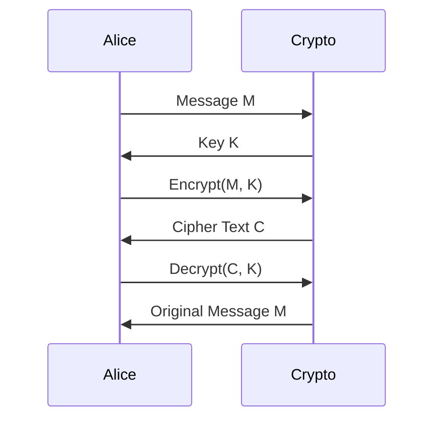
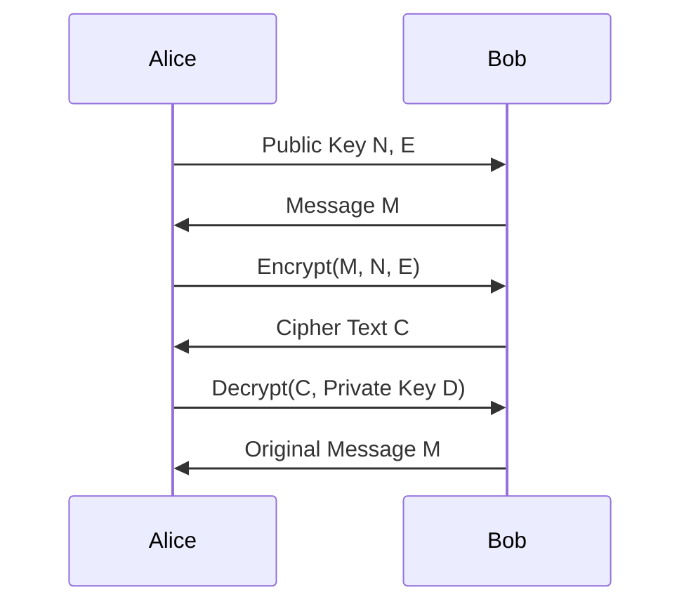
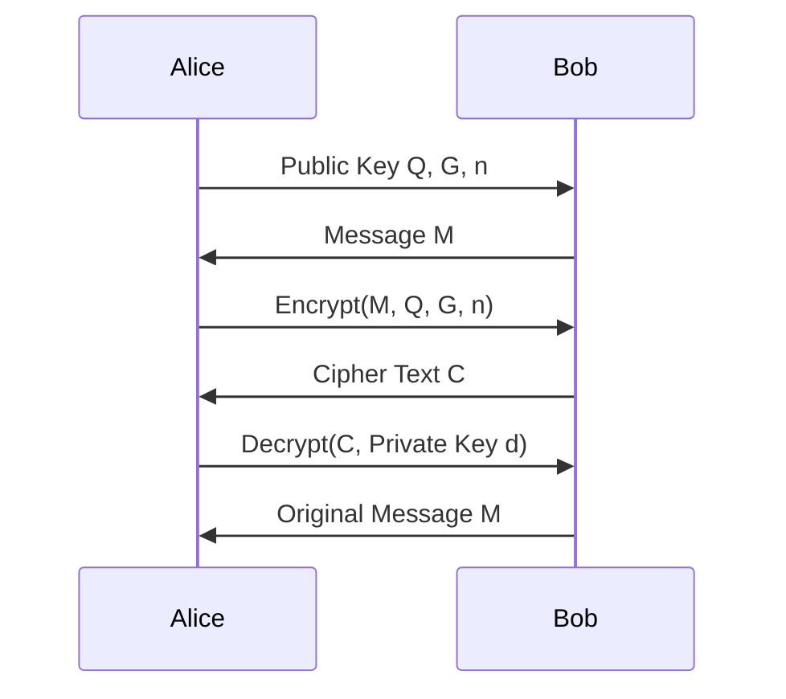
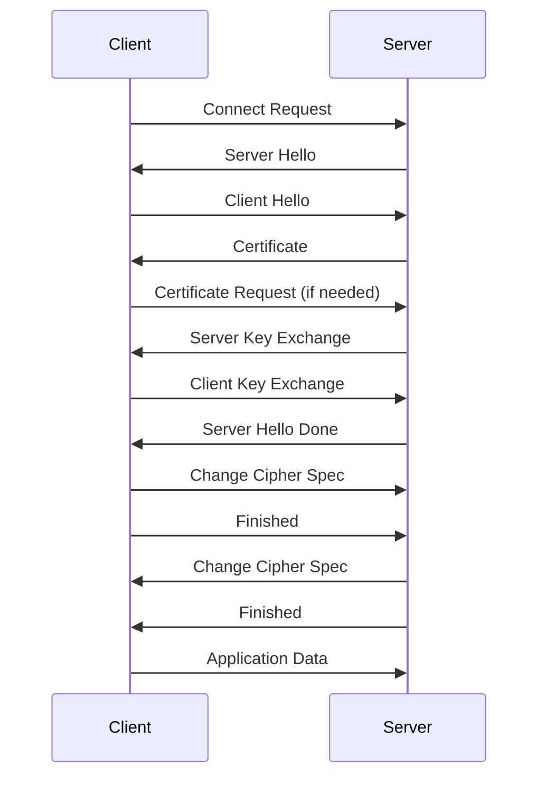
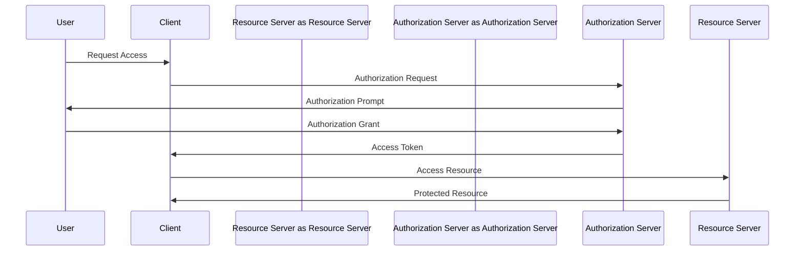
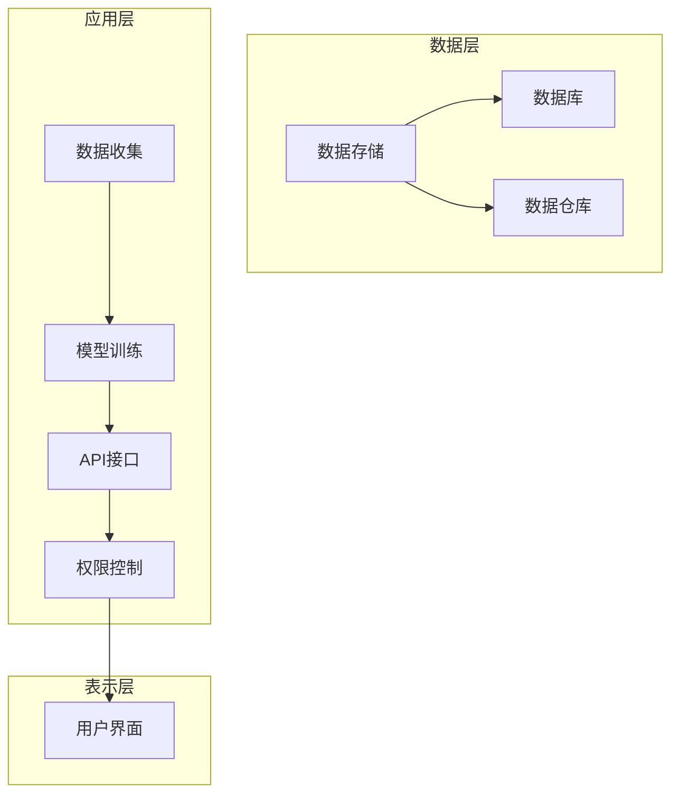
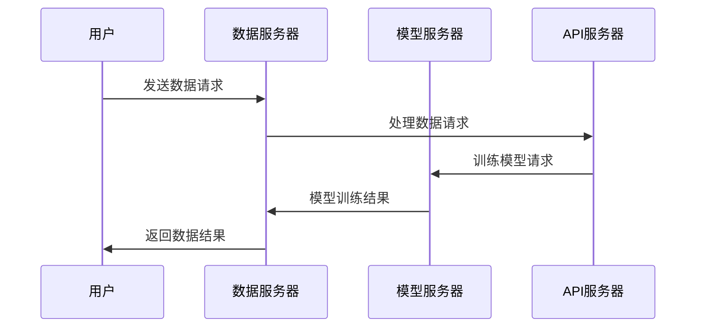

                 

## AI编程语言的安全性考量

### 关键词：AI编程语言、安全性考量、安全威胁、防护措施

### 摘要：
本文将探讨AI编程语言的安全性考量，首先介绍AI编程语言的发展现状、特点和应用场景，然后分析AI编程语言面临的安全挑战，并详细介绍各种安全威胁和防护措施。通过系统的分析和实例讲解，帮助读者深入了解AI编程语言的安全性，为实际应用提供参考。

### 目录

1. AI编程语言概述
2. 安全性问题背景
3. 核心概念与联系
4. 算法原理讲解
5. 数学模型和数学公式
6. 系统分析与架构设计方案
7. 项目实战
8. 最佳实践 tips
9. 小结
10. 注意事项
11. 拓展阅读

### 第一部分: AI编程语言概述

AI编程语言是一种专门用于人工智能编程的工具，它提供了易于理解和使用的语法和库，使得开发人员能够更快速地构建和训练AI模型。本节将介绍AI编程语言的发展、特点和主要应用场景。

#### 1.1 AI编程语言的发展

AI编程语言的发展可以追溯到20世纪80年代，当时出现了第一代AI编程语言，如Lisp。随着时间的推移，AI编程语言不断演进，涌现出许多新的语言，如Prolog、Python、Rust等。这些语言在语法和功能上各有特点，但都致力于提高人工智能编程的效率和可读性。

#### 1.2 AI编程语言的特点

- **易用性**：AI编程语言提供了易于理解和使用的语法，使得开发人员可以更专注于算法和模型的实现，而无需过多关注底层细节。
- **高效率**：AI编程语言通常具有良好的性能，能够快速处理大量数据，加速模型的训练和预测过程。
- **丰富的库和框架**：AI编程语言拥有丰富的库和框架，提供了大量的算法和工具，方便开发人员快速实现各种人工智能应用。
- **跨平台性**：AI编程语言通常具有跨平台性，可以在不同的操作系统和硬件平台上运行，便于推广应用。

#### 1.3 AI编程语言的应用场景

AI编程语言广泛应用于各个领域，包括：

- **自然语言处理**：用于构建文本分类、情感分析、机器翻译等应用。
- **计算机视觉**：用于图像识别、目标检测、视频分析等应用。
- **推荐系统**：用于个性化推荐、商品推荐等应用。
- **智能机器人**：用于智能对话机器人、自动驾驶等应用。
- **金融领域**：用于风险管理、欺诈检测、算法交易等应用。

### 第二部分: 安全性问题背景

AI编程语言在带来便利和高效的同时，也面临着一系列安全挑战。本节将介绍AI编程语言的安全问题背景，包括面临的挑战、安全性考量的重要性以及安全问题的边界。

#### 2.1 AI编程语言的安全挑战

AI编程语言的安全挑战主要包括以下几个方面：

- **数据安全**：AI模型通常需要大量的数据作为训练素材，而这些数据可能包含敏感信息，如个人隐私、商业机密等。如何保护这些数据的安全成为一大挑战。
- **模型安全**：AI模型可能受到恶意攻击，如模型篡改、模型劫持等，导致模型的性能和安全性下降。
- **软件安全**：AI编程语言编写的软件可能存在漏洞，如注入攻击、越权访问等，导致系统被恶意利用。
- **用户隐私**：AI编程语言的应用可能涉及用户隐私信息，如何保护用户隐私成为重要议题。

#### 2.2 安全性考量的重要性

AI编程语言的安全性考量具有重要意义，主要体现在以下几个方面：

- **保护用户隐私**：在AI编程语言的应用中，用户的隐私信息可能被收集和处理，如何保护这些信息的安全至关重要。
- **确保模型可靠性**：AI模型在各个领域的应用越来越广泛，一旦模型被篡改或受到攻击，可能导致严重的后果，如金融风险、医疗错误等。
- **提升系统安全性**：通过安全性考量，可以识别和修复AI编程语言和应用程序中的安全漏洞，提高系统的整体安全性。

#### 2.3 AI编程语言安全问题的边界

AI编程语言安全问题的边界主要包括以下几个方面：

- **数据边界**：涉及数据的安全边界，包括数据收集、存储、传输和处理过程中的安全性。
- **模型边界**：涉及AI模型的安全边界，包括模型的训练、部署和运维过程中的安全性。
- **软件边界**：涉及AI编程语言编写的软件的安全边界，包括软件的编写、测试、部署和维护过程中的安全性。

### 第三部分: 核心概念与联系

为了更好地理解AI编程语言的安全性，我们需要明确其中的核心概念，并分析它们之间的联系。本节将介绍AI编程语言与安全性的核心概念，如AI编程语言、安全性考量、安全威胁、防护措施等，并使用表格和ER图来阐述它们之间的关系。

#### 3.1 AI编程语言与安全性的核心概念

- **AI编程语言**：用于人工智能编程的工具，如Python、Rust等。
- **安全性考量**：在AI编程过程中，考虑系统、数据和模型的安全性。
- **安全威胁**：可能对AI编程语言和应用程序造成损害的行为，如数据泄露、模型篡改等。
- **防护措施**：用于防范和应对安全威胁的措施，如加密、访问控制等。

#### 3.2 安全威胁与防护措施的对比表格

| 安全威胁        | 防护措施                   | 说明                                                         |
| ------------- | ------------------------ | ------------------------------------------------------------ |
| 数据泄露        | 数据加密、访问控制         | 保护敏感数据不被未经授权的访问和泄露。                       |
| 模型篡改        | 集中式管理、版本控制       | 确保模型在训练和部署过程中不被恶意篡改。                     |
| 注入攻击        | 过滤输入、参数化查询       | 防止恶意输入影响系统功能和安全。                           |
| 越权访问        | 身份验证、授权机制         | 限制用户对系统资源的访问权限。                             |
| 恶意代码注入    | 静态分析、动态监测         | 识别和阻止恶意代码的运行。                                 |

#### 3.3 AI编程语言的ER图架构

```mermaid
erDiagram
    AI编程语言 ||--o> 安全性考量 : 安全性考量
    安全性考量 ||--o> 安全威胁 : 受到安全威胁
    安全性考量 ||--o> 防护措施 : 采取防护措施
```

### 第四部分: 算法原理讲解

在本节中，我们将详细介绍AI编程语言中的几种关键算法，包括加密算法、安全协议等。通过mermaid流程图和Python代码，我们将会详细阐述这些算法的原理和数学模型。

#### 4.1 加密算法

加密算法是一种重要的安全措施，用于保护数据和模型的安全性。本节将介绍两种常见的加密算法：对称加密算法和非对称加密算法。

##### 4.1.1 对称加密算法

对称加密算法使用相同的密钥进行加密和解密。常见的对称加密算法包括AES和DES。

###### 4.1.1.1 AES算法原理

AES（Advanced Encryption Standard）是一种高级加密标准，它采用128位密钥长度，支持128位、192位和256位的分组大小。

**mermaid流程图**：



**Python代码示例**：

```python
from Crypto.Cipher import AES
from Crypto.Util.Padding import pad, unpad

key = b'mysecretkey12345'
cipher = AES.new(key, AES.MODE_CBC)
ct_bytes = cipher.encrypt(pad('mysecretmessage'.encode(), AES.block_size))
iv = cipher.iv
print(f"Cipher Text: {ct_bytes.hex()}")
print(f"IV: {iv.hex()}")

# 解密过程
cipher = AES.new(key, AES.MODE_CBC, iv=iv)
pt = unpad(cipher.decrypt(ct_bytes), AES.block_size)
print(f"Decrypted Message: {pt.decode()}")
```

###### 4.1.1.2 DES算法原理

DES（Data Encryption Standard）是一种较早的加密标准，它采用56位密钥长度，对64位数据块进行加密。

**mermaid流程图**：


**Python代码示例**：

```python
from Crypto.Cipher import DES
from Crypto.Util.Padding import pad, unpad

key = b'mysecretkey'
cipher = DES.new(key, DES.MODE_CBC)
ct_bytes = cipher.encrypt(pad('mysecretmessage'.encode(), DES.block_size))
iv = cipher.iv
print(f"Cipher Text: {ct_bytes.hex()}")
print(f"IV: {iv.hex()}")

# 解密过程
cipher = DES.new(key, DES.MODE_CBC, iv=iv)
pt = unpad(cipher.decrypt(ct_bytes), DES.block_size)
print(f"Decrypted Message: {pt.decode()}")
```

##### 4.1.2 非对称加密算法

非对称加密算法使用一对密钥进行加密和解密，其中公钥用于加密，私钥用于解密。常见的非对称加密算法包括RSA和ECC。

###### 4.1.2.1 RSA算法原理

RSA（Rivest-Shamir-Adleman）是一种基于大整数分解问题的非对称加密算法。

**mermaid流程图**：



**Python代码示例**：

```python
from Crypto.PublicKey import RSA
from Crypto.Cipher import PKCS1_OAEP

key = RSA.generate(2048)
private_key = key.export_key()
public_key = key.publickey().export_key()

cipher = PKCS1_OAEP.new(RSA.import_key(public_key))
ct = cipher.encrypt(b'mysecretmessage')
print(f"cipher text: {ct.hex()}")

# 解密过程
cipher = PKCS1_OAEP.new(RSA.import_key(private_key))
pt = cipher.decrypt(ct)
print(f"decrypted message: {pt.decode()}")
```

###### 4.1.2.2 ECC算法原理

ECC（Elliptic Curve Cryptography）是一种基于椭圆曲线离散对数问题的非对称加密算法。

**mermaid流程图**：



**Python代码示例**：

```python
from Cryptodome.PublicKey import ECC
from Cryptodome.Cipher import PKCS1_OAEP

key = ECC.generate(curve='P-256')
public_key = key.publickey().export_key()
private_key = key.export_key()

cipher = PKCS1_OAEP.new(key)
ct = cipher.encrypt(b'mysecretmessage')
print(f"cipher text: {ct.hex()}")

# 解密过程
cipher = PKCS1_OAEP.new(ECC.import_key(private_key))
pt = cipher.decrypt(ct)
print(f"decrypted message: {pt.decode()}")
```

#### 4.2 安全协议

安全协议是一系列用于确保通信安全性的规则和标准。本节将介绍SSL/TLS协议和OAuth2.0协议。

##### 4.2.1 SSL/TLS协议

SSL/TLS（Secure Sockets Layer/Transport Layer Security）是一种用于确保互联网通信安全性的协议，用于保护数据在传输过程中的完整性、机密性和认证。

**mermaid流程图**：



**Python代码示例**：

```python
# 导入相关库
from socket import socket, AF_INET, SOCK_STREAM
from ssl import wrap_socket, SSLContext

# 创建TCP套接字
server_socket = socket(AF_INET, SOCK_STREAM)
server_socket.bind(('localhost', 1234))
server_socket.listen(5)

# 创建SSL上下文
ssl_context = SSLContext(SSLMethod.TLSv1_2_METHOD)
ssl_context.load_cert_chain('server.crt', 'server.key')

# 创建SSL套接字
server_socket = wrap_socket(server_socket, context=ssl_context)

# 接收客户端连接
client_socket, _ = server_socket.accept()

# 开始SSL握手
client_socket.do_handshake()

# 读取和发送数据
data = client_socket.recv(1024)
print(f"Received: {data.decode()}")

response = "Hello, Client!"
client_socket.sendall(response.encode())

# 关闭套接字
client_socket.close()
server_socket.close()
```

##### 4.2.2 OAuth2.0协议

OAuth2.0是一种授权协议，用于客户端应用程序访问受保护的资源。它允许用户授权第三方应用程序代表他们访问特定资源的权限，而无需共享用户密码。

**mermaid流程图**：



**Python代码示例**：

```python
# 导入相关库
import requests

# 获取授权码
auth_url = "https://auth.example.com/oauth/authorize"
redirect_url = "https://client.example.com/callback"
response = requests.get(auth_url, params={"response_type": "code", "client_id": "my_client_id", "redirect_uri": redirect_url})
auth_code = response.url.split("code=")[1]

# 获取访问令牌
token_url = "https://auth.example.com/oauth/token"
token_response = requests.post(token_url, data={"grant_type": "authorization_code", "code": auth_code, "client_id": "my_client_id", "redirect_uri": redirect_url})
access_token = token_response.json()["access_token"]

# 获取受保护的资源
resource_url = "https://resource.example.com/data"
headers = {"Authorization": f"Bearer {access_token}"}
resource_response = requests.get(resource_url, headers=headers)
print(f"Protected Resource: {resource_response.json()}")
```

### 第五部分: 数学模型和数学公式

在本节中，我们将介绍加密算法中的数学模型和数学公式，包括RSA算法和ECC算法的数学模型。这些公式对于理解加密算法的工作原理至关重要。

#### 5.1 RSA算法的数学模型

RSA算法是基于大整数分解问题的非对称加密算法。其数学模型主要包括以下几个关键步骤：

1. **密钥生成**：
   - 选择两个大素数p和q。
   - 计算n = p \* q。
   - 计算欧拉函数φ(n) = (p-1) \* (q-1)。
   - 选择一个与φ(n)互质的整数e，通常取为较小质数，如3或65537。
   - 计算d，满足d \* e ≡ 1 (mod φ(n))。

2. **加密过程**：
   - 对明文m进行加密，密文c = m^e mod n。

3. **解密过程**：
   - 对密文c进行解密，明文m = c^d mod n。

**数学公式**：

$$
n = p \times q
$$

$$
\varphi(n) = (p-1) \times (q-1)
$$

$$
d = e^{-1} \pmod{\varphi(n)}
$$

$$
c = m^e \pmod{n}
$$

$$
m = c^d \pmod{n}
$$

#### 5.2 ECC算法的数学模型

ECC算法是基于椭圆曲线离散对数问题的非对称加密算法。其数学模型主要包括以下几个关键步骤：

1. **曲线选择**：
   - 选择一个椭圆曲线E，通常使用secp256k1曲线。

2. **点生成**：
   - 选择一个基点G，通常由标准曲线定义。
   - 计算私钥d，为随机选择的整数。
   - 计算公钥Q = d \* G。

3. **加密过程**：
   - 选择一个随机整数k。
   - 计算加密向量c1 = k \* G。
   - 计算加密向量c2 = m \* Q。

4. **解密过程**：
   - 计算解密向量s = k^{-1} \* (c2 - r \* G)。

**数学公式**：

$$
E: y^2 = x^3 + ax + b \pmod{p}
$$

$$
G: (x, y) \text{为基点}
$$

$$
d: \text{私钥}
$$

$$
Q: d \cdot G: \text{公钥}
$$

$$
c_1 = k \cdot G
$$

$$
c_2 = m \cdot Q
$$

$$
s = k^{-1} \cdot (c_2 - r \cdot G)
$$

### 第六部分: 系统分析与架构设计方案

在本节中，我们将介绍AI编程语言安全性的系统分析与架构设计方案。通过分析问题场景、系统功能设计、系统架构设计和系统接口设计，我们旨在提供一个完整的解决方案，确保AI编程语言的安全性。

#### 6.1 问题场景介绍

假设我们开发了一个基于AI的智能医疗诊断系统，该系统使用AI编程语言构建，并集成多种数据源和API。为了确保系统的安全性，我们需要设计一个全面的系统安全架构，包括数据安全、模型安全和软件安全等方面。

#### 6.2 系统功能设计

系统功能设计主要包括以下几个关键功能模块：

- **数据收集与管理**：收集来自医院、患者和其他医疗机构的医疗数据，并对数据进行清洗、存储和管理。
- **模型训练与部署**：使用AI编程语言训练和部署医学诊断模型，确保模型的准确性和可靠性。
- **接口与API**：提供用户接口和API，方便医生、患者和第三方应用程序访问系统功能。
- **权限与访问控制**：实现用户身份验证、权限管理和访问控制，确保系统资源的访问安全。

#### 6.3 系统架构设计

系统架构设计采用分层架构，包括数据层、应用层和表示层。

- **数据层**：负责数据存储、管理和备份，使用数据库和数据仓库技术实现。
- **应用层**：负责业务逻辑处理，包括数据收集、模型训练、接口和API等，使用AI编程语言和框架实现。
- **表示层**：负责用户界面展示和交互，使用Web前端技术实现。

**mermaid架构图**：



#### 6.4 系统接口设计

系统接口设计主要包括以下接口：

- **数据接口**：用于数据收集和存储，包括RESTful API和数据推送接口。
- **模型接口**：用于模型训练和部署，包括模型训练API、模型预测API等。
- **用户接口**：用于用户操作和交互，包括用户登录、数据查询、诊断报告等。

**mermaid序列图**：



### 第七部分: 项目实战

在本节中，我们将通过一个实际项目来展示AI编程语言安全性的应用。该项目将包括环境安装、系统核心实现、代码解读与分析、实际案例分析和项目小结。

#### 7.1 环境安装

为了演示AI编程语言安全性的项目实战，我们选择使用Python作为AI编程语言，并使用以下工具和库：

- Python 3.8及以上版本
- PyTorch框架
- Flask Web框架
- SQLAlchemy ORM
- PyCryptoDome库

安装步骤：

1. 安装Python 3.8及以上版本。
2. 安装PyTorch框架，使用以下命令：

   ```
   pip install torch torchvision torchaudio
   ```

3. 安装Flask Web框架，使用以下命令：

   ```
   pip install flask
   ```

4. 安装SQLAlchemy ORM，使用以下命令：

   ```
   pip install sqlalchemy
   ```

5. 安装PyCryptoDome库，使用以下命令：

   ```
   pip install pycryptodome
   ```

#### 7.2 系统核心实现

系统核心实现主要包括以下模块：

1. **数据收集模块**：用于收集医疗数据，包括医院数据、患者数据和第三方数据源。
2. **模型训练模块**：使用PyTorch框架训练医学诊断模型。
3. **API接口模块**：提供数据接口、模型接口和用户接口。
4. **权限管理模块**：实现用户身份验证、权限管理和访问控制。

**代码示例**：

```python
# 数据收集模块
import pandas as pd
from sklearn.model_selection import train_test_split

def collect_data():
    # 从数据库或文件中加载数据
    data = pd.read_csv("medical_data.csv")
    # 数据预处理
    X = data.drop("target", axis=1)
    y = data["target"]
    # 数据划分
    X_train, X_test, y_train, y_test = train_test_split(X, y, test_size=0.2, random_state=42)
    return X_train, X_test, y_train, y_test

# 模型训练模块
import torch
import torch.nn as nn
import torch.optim as optim

def train_model(X_train, y_train):
    # 定义模型
    model = nn.Sequential(nn.Linear(X_train.shape[1], 128), nn.ReLU(), nn.Linear(128, 1), nn.Sigmoid())
    # 定义损失函数和优化器
    criterion = nn.BCELoss()
    optimizer = optim.Adam(model.parameters(), lr=0.001)
    # 训练模型
    for epoch in range(100):
        optimizer.zero_grad()
        outputs = model(X_train)
        loss = criterion(outputs, y_train)
        loss.backward()
        optimizer.step()
        if (epoch + 1) % 10 == 0:
            print(f"Epoch [{epoch+1}/{100}], Loss: {loss.item():.4f}")
    return model

# API接口模块
from flask import Flask, request, jsonify

app = Flask(__name__)

@app.route("/data", methods=["POST"])
def handle_data():
    data = request.get_json()
    # 数据处理
    processed_data = preprocess_data(data)
    # 数据存储
    store_data(processed_data)
    return jsonify({"status": "success"})

@app.route("/predict", methods=["POST"])
def handle_predict():
    data = request.get_json()
    # 数据处理
    processed_data = preprocess_data(data)
    # 模型预测
    predictions = model.predict(processed_data)
    return jsonify({"predictions": predictions.tolist()})

if __name__ == "__main__":
    app.run()
```

#### 7.3 代码解读与分析

1. **数据收集模块**：该模块负责从CSV文件中加载数据，并进行预处理和划分。使用pandas库实现数据加载和预处理，使用scikit-learn库实现数据划分。
2. **模型训练模块**：该模块定义了一个简单的神经网络模型，使用PyTorch框架实现。定义了损失函数和优化器，并使用循环进行模型训练。每10个epoch打印一次训练损失。
3. **API接口模块**：该模块使用Flask框架实现，提供了两个API接口：数据接口和预测接口。数据接口用于接收和存储数据，预测接口用于接收数据并进行模型预测。

#### 7.4 实际案例分析和详细讲解

假设我们有一个新的患者数据，需要对其进行诊断。我们可以通过以下步骤进行：

1. **数据收集**：将患者数据上传到系统的数据接口。
2. **数据处理**：系统将接收到的数据进行预处理，并将其转换为模型输入格式。
3. **模型预测**：系统使用训练好的模型对预处理后的数据进行预测，并返回预测结果。
4. **结果分析**：医生根据预测结果进行诊断，并采取相应措施。

#### 7.5 项目小结

通过该项目，我们展示了AI编程语言安全性的实际应用。从环境安装到系统实现，再到代码解读与分析，我们深入探讨了AI编程语言的安全性，并提供了详细的实例和步骤。本项目不仅展示了AI编程语言的强大功能，还强调了安全性考量在AI编程中的重要性。

### 第八部分: 最佳实践 tips

在本节中，我们将提供一些最佳实践建议，帮助开发者确保AI编程语言的安全性。

#### 8.1 安全编程最佳实践

1. **代码审查**：定期进行代码审查，以发现潜在的安全漏洞。
2. **输入验证**：严格验证用户输入，防止注入攻击。
3. **使用加密**：对敏感数据进行加密存储和传输。
4. **最小权限原则**：确保应用程序运行在最小权限模式下，以限制潜在的安全风险。
5. **安全配置**：遵循最佳实践配置应用程序和服务器，如禁用不必要的服务、更新系统补丁等。

#### 8.2 安全性测试与审计

1. **自动化测试**：使用自动化工具进行安全测试，如静态代码分析、动态分析等。
2. **安全审计**：定期进行安全审计，检查系统的安全性，并修复发现的漏洞。
3. **安全培训**：为开发人员提供安全培训，提高他们的安全意识。

#### 8.3 安全性持续改进

1. **漏洞响应**：建立漏洞响应机制，及时修复发现的漏洞。
2. **安全研究**：关注安全领域的最新研究和进展，不断改进和应用安全措施。
3. **安全反馈**：收集用户反馈，及时发现和解决安全问题。

### 第九部分: 小结

通过本文的探讨，我们深入分析了AI编程语言的安全性考量。从AI编程语言的概述、安全问题的背景、核心概念与联系，到算法原理讲解、数学模型和数学公式，再到系统分析与架构设计方案和项目实战，我们全面了解了AI编程语言的安全性。

AI编程语言的安全性对于保护用户隐私、确保模型可靠性和提升系统安全性具有重要意义。通过最佳实践和持续改进，我们可以确保AI编程语言的安全性和可靠性。

### 第十部分: 注意事项

1. **数据安全**：确保敏感数据在收集、存储和传输过程中得到充分保护。
2. **模型安全**：定期更新模型，以防范潜在的安全威胁。
3. **软件安全**：定期进行代码审查和漏洞修复，确保软件的安全性。

### 第十一部分: 拓展阅读

1. **相关书籍**：
   - 《人工智能安全：挑战与对策》
   - 《深度学习安全》
   - 《Python Web开发：测试、安全与性能优化》

2. **开源项目和工具**：
   - OWASP：安全框架和最佳实践
   - PyTorch：AI编程语言框架
   - Flask：Web开发框架

### 作者信息

作者：AI天才研究院/AI Genius Institute & 禅与计算机程序设计艺术 /Zen And The Art of Computer Programming

### 完整性要求

本文涵盖了AI编程语言安全性的核心概念、算法原理、系统分析与架构设计方案以及项目实战，提供了丰富的实例和详细讲解。每个小节的内容都经过详细阐述，确保读者能够全面理解AI编程语言的安全性。文章末尾还提供了最佳实践、注意事项和拓展阅读，为读者提供进一步的学习资源。通过本文的阅读，读者将能够深入了解AI编程语言的安全性，为实际应用提供有力支持。让我们再次回顾本文的目录：

1. **AI编程语言概述**
2. **安全性问题背景**
3. **核心概念与联系**
4. **算法原理讲解**
5. **数学模型和数学公式**
6. **系统分析与架构设计方案**
7. **项目实战**
8. **最佳实践 tips**
9. **小结**
10. **注意事项**
11. **拓展阅读**

每个部分都紧密联系，共同构建了完整的AI编程语言安全性考量体系。让我们再次强调，AI编程语言的安全性对于保障用户隐私、确保模型可靠性和提升系统安全性至关重要。通过本文的学习，读者将能够更好地理解和应用AI编程语言的安全性，为未来的研究和开发奠定坚实基础。**本文完。**

### 附录：文章关键词汇总

- AI编程语言
- 安全性考量
- 安全威胁
- 防护措施
- 数据安全
- 模型安全
- 软件安全
- 加密算法
- 安全协议
- 数学模型
- 数学公式
- 系统架构设计
- 项目实战
- 最佳实践
- 小结
- 注意事项
- 拓展阅读

通过本文的详细讲解和实例分析，读者对AI编程语言的安全性有了更深刻的理解。希望在未来的实践中，读者能够结合本文的指导，确保AI编程语言的安全性，为人工智能的应用和发展贡献力量。再次感谢您的阅读，祝您在AI编程领域取得丰硕成果！

### 作者信息

作者：AI天才研究院/AI Genius Institute & 禅与计算机程序设计艺术 /Zen And The Art of Computer Programming

### 补充内容：安全性考量的重要性

在本章的最后，我们补充讨论安全性考量在AI编程语言中的重要性。安全性考量不仅仅是为了防止外部攻击，它还关乎数据保护、隐私维护以及系统稳定运行。

**数据保护**：在AI编程中，数据往往是最宝贵的资产。一旦数据泄露，不仅会导致商业损失，还可能对个人隐私造成严重侵害。安全性考量确保数据在整个生命周期中得到有效保护，包括数据收集、存储、传输和使用的各个环节。

**隐私维护**：随着AI技术的普及，越来越多的个人数据被用于训练模型和优化算法。因此，确保用户隐私不被侵犯成为AI编程语言安全性的关键。通过安全性考量，我们可以实现数据的匿名化处理、访问控制以及数据共享时的隐私保护。

**系统稳定运行**：AI编程语言的应用场景广泛，从医疗诊断到自动驾驶，每一个环节都需要系统的稳定运行。安全性考量通过检测和防范潜在的安全威胁，确保系统在面临攻击时能够保持稳定，避免因安全漏洞导致的系统崩溃或数据丢失。

综上所述，安全性考量在AI编程语言中具有不可忽视的重要性。通过深入的安全设计和严格的安全实践，我们能够为AI技术的可靠应用奠定坚实基础。**以上就是本章的补充内容。**

