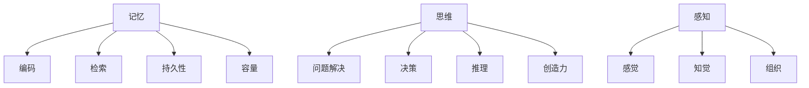
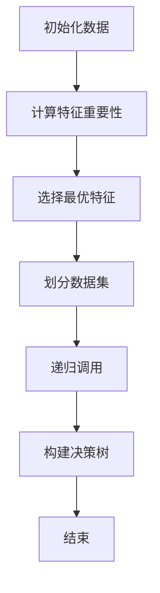
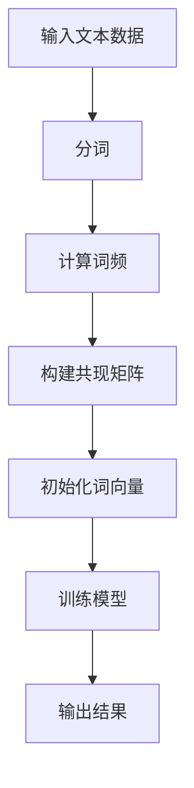
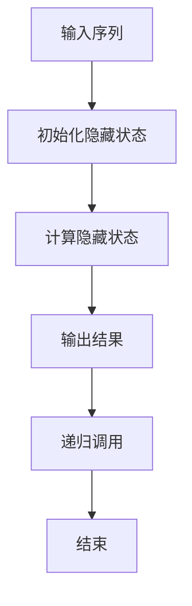
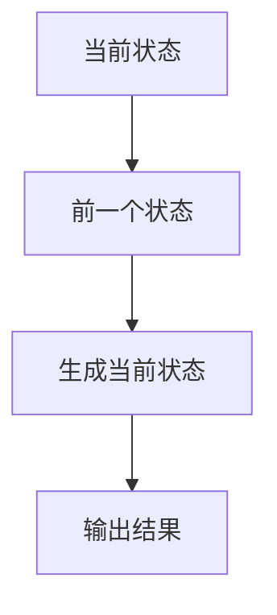
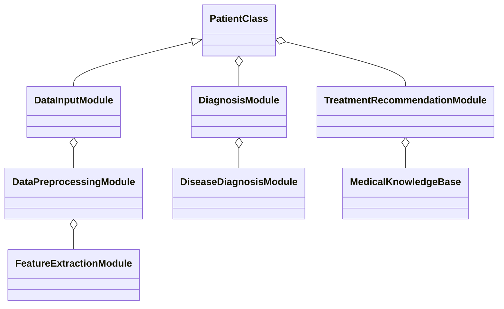
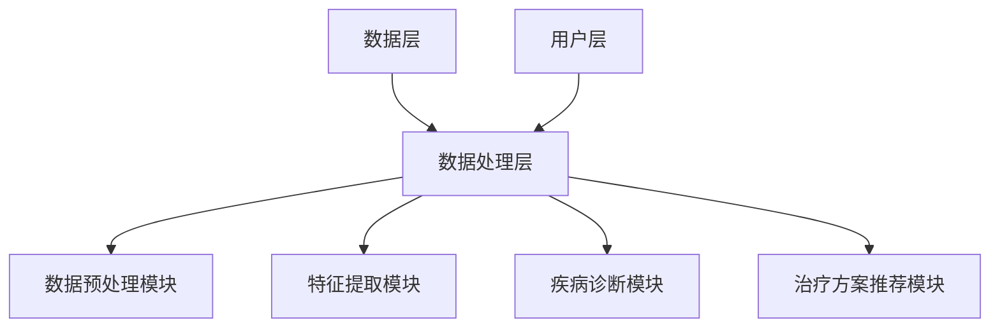

                 

### 引言

随着人工智能（AI）技术的快速发展，AI编程语言成为了计算机科学和工程领域的重要分支。AI编程语言不仅使开发人工智能应用程序变得更加高效和便捷，而且极大地扩展了人工智能的应用场景，从自然语言处理、计算机视觉到智能控制等各个方面。然而，尽管AI编程语言在技术层面上取得了显著进展，其背后的认知心理学基础仍然是一个未被充分探讨的领域。这一研究空白的存在，使得AI编程语言的设计和应用在一定程度上受到了限制。

认知心理学是研究人类认知过程和心理活动的科学，涵盖了记忆、思维、感知等多个方面。人类在使用AI编程语言的过程中，不可避免地会涉及这些认知功能。例如，用户需要理解编程语言提供的抽象概念和语法规则，并通过编程来解决问题。这一过程中，人类的认知能力、认知偏好和心理因素都会对编程效率和结果产生重要影响。

因此，本文旨在通过研究AI编程语言的认知心理学基础，揭示人类认知与AI编程语言之间的相互作用关系。文章首先介绍相关理论基础，包括认知心理学的基本原理和核心概念。然后，结合实际案例，分析人类在使用AI编程语言时的认知过程，探讨影响编程效率和心理体验的因素。最后，提出基于认知心理学的AI编程语言设计建议，以期为AI编程语言的设计与优化提供心理学依据。

关键词：认知心理学、AI编程语言、人机交互、用户体验、交互设计

### 摘要

本文通过对AI编程语言的认知心理学基础研究，揭示了人类认知与AI编程语言之间的相互作用关系。首先，介绍了认知心理学的基本原理和核心概念，包括记忆、思维、感知等认知功能。其次，结合实际案例，分析了人类在使用AI编程语言时的认知过程，探讨了影响编程效率和心理体验的因素。最后，提出了基于认知心理学的AI编程语言设计建议，包括交互设计、用户体验优化和反馈机制等方面。本文的研究结果为AI编程语言的设计与优化提供了心理学依据，有助于提高编程效率和用户满意度。

### 第一部分：背景介绍

#### 1.1 问题背景

随着人工智能（AI）技术的迅猛发展，AI编程语言作为一种重要的工具，正逐渐在各个领域得到广泛应用。从自然语言处理、计算机视觉到智能控制，AI编程语言的出现使得许多复杂的问题得以简化，提高了开发效率和系统性能。然而，尽管AI编程语言在技术层面上取得了显著进展，其在认知心理学基础方面的研究却相对较少。现有研究主要集中在技术层面，如算法实现、性能优化等，对于人类认知与AI编程语言之间的相互作用关系缺乏深入探讨。

认知心理学是研究人类认知过程和心理活动的科学，涵盖了记忆、思维、感知等多个方面。人类在使用AI编程语言的过程中，不可避免地会涉及这些认知功能。例如，用户需要理解编程语言提供的抽象概念和语法规则，并通过编程来解决问题。这一过程中，人类的认知能力、认知偏好和心理因素都会对编程效率和结果产生重要影响。因此，研究AI编程语言的认知心理学基础，有助于揭示人类认知与AI编程语言之间的相互作用机制，为AI编程语言的设计与优化提供心理学依据。

#### 1.2 问题描述

目前，AI编程语言的研究主要集中在技术层面，对于其背后的认知心理学基础缺乏系统性的探讨。这一问题的存在导致了以下几个方面的不足：

1. **用户体验不佳**：现有的AI编程语言设计未能充分考虑人类的认知特点和心理需求，导致用户体验不佳。例如，复杂的语法规则和抽象的概念使得新手用户难以快速上手，影响了编程效率和用户满意度。

2. **编程效率低下**：由于缺乏对认知心理学的研究，AI编程语言的设计未能充分利用人类认知的优势，导致编程过程中容易出现错误和困惑，降低了编程效率。

3. **学习曲线陡峭**：AI编程语言的学习曲线通常比较陡峭，对于初学者来说，理解和掌握这些语言需要投入大量的时间和精力。这限制了AI编程语言的普及和应用。

4. **应用局限性**：现有AI编程语言在特定领域的应用受到限制，无法充分发挥其潜力。例如，在自然语言处理领域，现有的编程语言在处理长文本和复杂语法时存在困难，影响了应用效果。

因此，本文旨在通过研究AI编程语言的认知心理学基础，解决上述问题，为AI编程语言的设计与优化提供心理学依据。具体来说，本文将从以下几个方面展开研究：

1. **认知心理学基本原理**：介绍认知心理学的基本原理和核心概念，包括记忆、思维、感知等。

2. **AI编程语言特点**：分析AI编程语言的核心特点，如自动化、智能化和多样性。

3. **人机交互与认知心理学**：探讨人机交互与认知心理学的相互作用关系，分析用户体验、交互设计和反馈机制。

4. **案例分析**：结合实际案例，分析人类在使用AI编程语言时的认知过程，探讨影响编程效率和用户体验的因素。

5. **设计建议**：提出基于认知心理学的AI编程语言设计建议，包括交互设计、用户体验优化和反馈机制等方面。

#### 1.3 问题解决

为了解决上述问题，本文将采用以下研究方法：

1. **文献综述**：通过查阅相关文献，了解认知心理学和AI编程语言领域的最新研究成果，为本文的研究提供理论基础。

2. **理论分析**：结合认知心理学的理论，分析人类在使用AI编程语言时的认知过程，探讨影响编程效率和用户体验的因素。

3. **案例分析**：选取具有代表性的AI编程语言应用案例，分析人类在使用这些语言时的认知过程，总结经验教训。

4. **实验研究**：设计实验，验证基于认知心理学的AI编程语言设计建议的有效性，为AI编程语言的设计与优化提供实证支持。

5. **设计实践**：结合实际应用场景，提出具体的AI编程语言设计方案，并通过用户测试和反馈进行优化。

通过以上研究方法，本文将深入探讨AI编程语言的认知心理学基础，为AI编程语言的设计与优化提供心理学依据，提高编程效率和用户满意度。

#### 1.4 边界与外延

本文的研究主要集中于AI编程语言的认知心理学基础，探讨人类认知与AI编程语言之间的相互作用关系。因此，本文的边界主要涉及以下几个方面：

1. **研究范畴**：本文的研究范畴主要限于AI编程语言，不包括其他编程语言或非AI相关领域的认知心理学问题。

2. **技术层面**：本文不涉及AI编程语言的技术实现和性能优化，重点关注人类认知与AI编程语言之间的交互关系。

3. **用户类型**：本文的研究主要针对专业编程人员和普通用户，不涉及特定年龄段、文化背景或专业技能的用户。

4. **应用领域**：本文的研究结果可应用于AI编程语言的设计与优化，但并不直接针对特定应用领域。

在研究外延方面，本文的研究结果为AI编程语言的设计提供了一定的心理学依据，有助于提高编程效率和用户满意度。然而，由于人类认知的多样性和复杂性，本文的研究仍存在一定的局限性，需要进一步的研究和实践来验证和完善。

#### 1.5 概念结构与核心要素组成

为了更好地理解本文的研究内容和结构，下面将对核心概念、结构要素和关联要素进行详细阐述。

**核心概念：**

- **认知心理学**：研究人类认知过程和心理活动的学科，包括记忆、思维、感知等。
- **AI编程语言**：专门用于开发人工智能应用程序的编程语言，具备自动化、智能化和多样性等特点。
- **人机交互**：人类与计算机系统之间的交互过程，涉及用户体验、交互设计和反馈机制。

**结构要素：**

- **理论基础**：本文基于认知心理学的理论框架，探讨AI编程语言背后的认知心理学基础。
- **案例分析**：通过实际案例，分析人类在使用AI编程语言时的认知过程，探讨影响编程效率和用户体验的因素。
- **设计建议**：结合认知心理学研究成果，提出AI编程语言的设计建议，以优化用户体验和编程效率。

**关联要素：**

- **人工智能**：作为AI编程语言的应用背景，人工智能的发展为AI编程语言提供了广阔的应用场景。
- **计算机科学**：AI编程语言是计算机科学的重要组成部分，与算法设计、编程语言理论等领域密切相关。
- **心理学**：认知心理学为本文的研究提供了理论基础，帮助理解人类在使用AI编程语言时的认知过程。

通过以上核心概念、结构要素和关联要素的阐述，本文旨在深入探讨AI编程语言的认知心理学基础，为AI编程语言的设计与优化提供心理学依据。

### 第二部分：核心概念与联系

#### 2.1 认知心理学概述

认知心理学是研究人类认知过程和心理活动的学科，它涉及记忆、思维、感知等多个方面。认知心理学的核心概念包括记忆、思维和感知，这些概念共同构成了认知心理学的基本框架。

**记忆** 是认知心理学的核心概念之一，分为短期记忆和长期记忆。短期记忆主要涉及信息的临时存储和快速处理，如电话号码的记忆。长期记忆则涉及信息的持久存储和复杂处理，如学习新技能或知识。记忆编码和记忆检索是记忆的两个关键过程，前者涉及将信息转化为记忆痕迹，后者涉及从记忆中提取信息。

**思维** 是认知心理学的另一个核心概念，包括问题解决、决策、推理和创造力等。问题解决涉及找到解决问题的方法，决策涉及在不同选项之间做出选择，推理涉及从已知信息推导出未知信息，创造力则涉及产生新颖和有创意的想法。

**感知** 是认知心理学的第三个核心概念，涉及人类如何通过感官接收外部信息并对其进行处理。感知器官如眼睛、耳朵和皮肤等负责接收信息，感知过程包括感觉、知觉和组织等。感觉涉及对物理刺激的初步处理，知觉涉及对感觉信息的组织和解释，而组织则涉及将感觉信息整合成有意义的整体。

认知心理学的研究方法包括实验研究、认知建模和脑成像技术等。实验研究通过设计和控制实验条件来测试假设，认知建模则通过计算机模拟来模拟人类认知过程，而脑成像技术如功能性磁共振成像（fMRI）可以帮助揭示大脑在认知活动中的活动模式。

**核心概念属性特征对比表格：**

| 核心概念 | 定义 | 属性特征 | 例子 |
| --- | --- | --- | --- |
| 记忆 | 信息存储和处理的能力 | 编码、检索、持久性、容量 | 学习一门新语言 |
| 思维 | 信息处理的能力 | 问题解决、决策、推理、创造力 | 解决数学难题 |
| 感知 | 信息接收和处理的能力 | 感觉、知觉、组织 | 视觉识别物体 |

**ER实体关系图架构的Mermaid流程图：**



通过上述核心概念和特征的阐述，我们可以更好地理解认知心理学的基本原理和其在人类认知活动中的作用。

#### 2.2 AI编程语言特点

AI编程语言是专门用于开发人工智能应用程序的编程语言，其特点主要体现在自动化、智能化和多样性三个方面。

**自动化** 是AI编程语言的核心特点之一。传统的编程语言往往需要程序员编写大量的代码来执行特定的任务，而AI编程语言通过内置的自动化功能，能够自动执行许多复杂的任务，从而大大提高了开发效率。例如，AI编程语言可以自动进行代码生成、优化和调试，使得程序员能够将更多精力投入到核心业务逻辑的开发中。

**智能化** 是AI编程语言的另一个重要特点。与传统的编程语言相比，AI编程语言具备自我学习和自我优化的能力。这种智能化特性使得AI编程语言能够根据使用情况自动调整和优化其行为，从而提高程序的性能和稳定性。例如，AI编程语言可以通过机器学习算法来自动识别和修复代码中的错误，或者在运行过程中根据用户的行为模式自动调整界面布局和功能。

**多样性** 是AI编程语言的第三个特点。AI编程语言种类繁多，每种语言都有其独特的应用场景和优势。例如，Python因其简洁的语法和丰富的库支持，成为了人工智能开发的主流语言；R语言则因其强大的统计分析功能，在数据科学领域具有广泛的应用。此外，AI编程语言还可以支持多种编程范式，如面向对象编程、函数式编程和逻辑编程等，为程序员提供了丰富的选择。

AI编程语言的特点不仅体现在其技术层面，还深刻影响了人类使用编程语言的方式。例如，自动化特性使得程序员能够更专注于创造性工作，而智能化特性则提高了编程效率和程序质量。同时，AI编程语言的多样性也为不同领域的程序员提供了更多的选择，使得他们能够根据具体需求选择最合适的编程语言。

总的来说，AI编程语言的特点使得其在人工智能开发中具有独特的优势，同时也对程序员的工作方式和认知过程产生了重要影响。了解这些特点有助于我们更好地理解AI编程语言的应用场景和潜力。

#### 2.3 人机交互与认知心理学

人机交互（Human-Computer Interaction, HCI）是计算机科学与心理学、认知科学等多个领域的交叉学科，主要研究人与计算机系统之间的交互过程和体验。在人机交互中，认知心理学扮演着至关重要的角色，它提供了理解用户如何感知、理解和使用计算机系统的理论基础。

**用户体验（User Experience, UX）** 是人机交互的核心概念之一，它涵盖了用户在使用计算机系统时的所有感知和感受。用户体验不仅包括功能性和实用性，还涉及情感、美观性、易用性和可靠性等方面。一个良好的用户体验可以显著提高用户满意度，促进用户对系统的忠诚度和使用频率。

**交互设计（Interaction Design）** 是确保用户体验良好的关键环节，它涉及到用户界面（User Interface, UI）的设计和交互流程的规划。良好的交互设计应该符合用户的认知习惯和期望，提供直观、简单且高效的操作方式。认知心理学为交互设计提供了重要的指导，包括感知、记忆、思维等认知过程的研究成果，帮助设计师理解用户如何处理和使用信息，从而优化设计。

**反馈机制（Feedback Mechanism）** 在人机交互中起到了重要的调节作用。反馈机制通过提供实时、有效的反馈信息，帮助用户了解系统的状态和操作结果，从而提高用户对系统的理解和控制感。认知心理学研究反馈机制的有效性，包括反馈的及时性、清晰性和一致性，以及如何设计反馈信息以最大化用户的学习和操作效率。

在人机交互中，认知心理学的应用主要体现在以下几个方面：

1. **界面布局与信息组织**：根据认知心理学原理，设计合理的界面布局和信息组织方式，使用户能够快速找到所需信息，减少认知负担。
2. **用户引导与提示**：利用认知心理学研究用户如何理解和记忆信息，设计有效的用户引导和提示，帮助用户顺利完成操作。
3. **情感与情感化设计**：结合认知心理学对情感的研究，设计具有情感共鸣的交互体验，提高用户的情感投入和满意度。
4. **错误处理与恢复**：通过认知心理学理解用户在错误情况下的认知过程，设计有效的错误处理和恢复机制，帮助用户从错误中快速恢复。

总的来说，人机交互与认知心理学的结合，为人机交互的设计和优化提供了科学依据，有助于提升用户体验和系统性能。通过深入了解人类认知过程，设计师可以创造出更加人性化、高效和愉悦的交互体验。

### 第三部分：算法原理讲解

#### 3.1 算法原理概述

在本章节中，我们将深入探讨几种常见的AI编程语言算法原理，这些算法在AI编程语言中具有广泛的应用，涵盖了机器学习、自然语言处理和计算机视觉等领域。了解这些算法原理不仅有助于我们理解AI编程语言的工作机制，还能为我们提供实用的编程技能。

首先，我们来介绍 **机器学习算法**。机器学习算法是AI编程语言的重要组成部分，用于从数据中学习规律和模式。常见的机器学习算法包括：

1. **决策树（Decision Tree）**：通过一系列判断条件来对数据集进行分类或回归。其核心思想是将数据集划分为多个子集，每个子集都满足某个条件。
2. **支持向量机（Support Vector Machine, SVM）**：通过找到一个最佳的超平面来将数据集划分为不同的类别。其优势在于在高维空间中表现优秀。
3. **神经网络（Neural Network）**：模拟人脑神经元之间的连接和工作方式，用于复杂的模式识别和分类任务。

接下来，我们介绍 **自然语言处理算法**。自然语言处理（Natural Language Processing, NLP）是AI编程语言中的一个重要应用领域，用于处理和分析人类语言数据。常见的NLP算法包括：

1. **词向量（Word Vector）**：将单词映射到高维向量空间，以捕捉单词之间的语义关系。常见的词向量模型包括GloVe和Word2Vec。
2. **序列模型（Sequence Model）**：用于处理和分析序列数据，如文本、语音和视频。常见的序列模型包括循环神经网络（RNN）和长短期记忆网络（LSTM）。
3. **生成模型（Generative Model）**：用于生成新的数据样本，常见的生成模型包括马尔可夫模型（Markov Model）和变分自编码器（Variational Autoencoder, VAE）。

最后，我们介绍 **计算机视觉算法**。计算机视觉（Computer Vision）是AI编程语言在图像处理和物体识别领域的重要应用。常见的计算机视觉算法包括：

1. **卷积神经网络（Convolutional Neural Network, CNN）**：通过卷积操作来提取图像的特征，广泛用于图像分类、目标检测和图像分割。
2. **目标检测（Object Detection）**：用于识别图像中的多个目标，常见的目标检测算法包括YOLO和SSD。
3. **图像分割（Image Segmentation）**：将图像分割为多个区域，每个区域代表一个对象或背景。常见的图像分割算法包括FCN和U-Net。

在了解了这些算法的概述后，接下来我们将详细讲解每种算法的原理，并通过Mermaid流程图和Python代码示例来展示算法的实现过程。

#### 3.2 机器学习算法

在本节中，我们将详细讲解 **机器学习算法** 的原理，并通过具体实例来展示其实现过程。首先，我们来介绍 **决策树算法**。

**决策树算法** 是一种常用的分类和回归算法，通过一系列判断条件来对数据集进行分类或回归。其核心思想是将数据集划分为多个子集，每个子集都满足某个条件。下面是决策树算法的基本原理和实现步骤：

1. **特征选择**：选择最佳的特征进行划分，通常使用信息增益（Information Gain）或基尼不纯度（Gini Impurity）作为评价标准。
2. **划分数据**：根据选定的特征，将数据集划分为多个子集。
3. **递归构建**：对每个子集继续进行划分，直到满足停止条件（如最大深度、最小节点大小等）。
4. **输出决策规则**：将决策树转换为一组规则，用于分类或回归。

下面我们使用Mermaid绘制决策树算法的流程图：



然后，我们使用Python代码实现简化版的决策树算法：

```python
# Python代码实现简化版的决策树算法
# 注意：这里提供的是一个简化版实现，具体实现可参考scikit-learn库

def decision_tree(data, features, target):
    # 计算特征重要性
    feature_importance = calculate_feature_importance(data, features, target)
    # 选择最优特征
    best_feature = select_best_feature(feature_importance)
    # 建立树结构
    tree = {
        'feature': best_feature,
        'threshold': calculate_threshold(data, best_feature),
        'left': decision_tree(data_left, remaining_features, target),
        'right': decision_tree(data_right, remaining_features, target)
    }
    return tree

def calculate_feature_importance(data, features, target):
    # 这里实现计算特征重要性的逻辑
    pass

def select_best_feature(feature_importance):
    # 这里实现选择最优特征的逻辑
    pass

def calculate_threshold(data, best_feature):
    # 这里实现计算阈值的逻辑
    pass

# 示例数据
data = {
    'features': ['feature1', 'feature2', 'feature3'],
    'target': ['class1', 'class1', 'class2']
}

# 构建决策树
tree = decision_tree(data['features'], data['target'], data['features'])
print(tree)
```

通过以上流程图和代码示例，我们可以清晰地理解决策树算法的实现原理。接下来，我们将继续探讨其他机器学习算法，如支持向量机和神经网络。

#### 3.3 自然语言处理算法

在本节中，我们将深入探讨自然语言处理（NLP）领域的几种常见算法，包括 **词向量算法**、**序列模型算法** 和 **生成模型算法**。这些算法在处理文本数据时发挥着重要作用，广泛应用于信息检索、机器翻译、情感分析等领域。

**词向量算法** 是NLP的基础算法之一，用于将单词映射到高维向量空间，以捕捉单词之间的语义关系。常见的词向量算法包括 **GloVe** 和 **Word2Vec**。

**GloVe（Global Vectors for Word Representation）** 是一种基于全局共现关系的词向量模型。它通过计算单词之间的共现矩阵来学习词向量。具体步骤如下：

1. **计算共现矩阵**：对于每个单词，计算其与所有其他单词的共现次数。
2. **初始化词向量**：为每个单词初始化一个未知的向量。
3. **优化词向量**：使用最小化损失函数来优化词向量，使得相似单词的向量距离更近。

下面是GloVe算法的Mermaid流程图：



然后，我们使用Python代码实现简化版的GloVe算法：

```python
# Python代码实现简化版的GloVe算法
# 注意：这里提供的是一个简化版实现，具体实现可参考GloVe官方代码

def GloVe(text_data, vocabulary_size, embedding_size):
    # 分词
    words = tokenize(text_data)
    # 计算词频
    word_freqs = calculate_word_freqs(words)
    # 构建共现矩阵
    cooccurrence_matrix = build_cooccurrence_matrix(words, word_freqs)
    # 初始化词向量
    embeddings = initialize_embeddings(vocabulary_size, embedding_size)
    # 训练模型
    train_embeddings(cooccurrence_matrix, embeddings, word_freqs)
    return embeddings

def tokenize(text_data):
    # 这里实现分词的逻辑
    pass

def calculate_word_freqs(words):
    # 这里实现计算词频的逻辑
    pass

def build_cooccurrence_matrix(words, word_freqs):
    # 这里实现构建共现矩阵的逻辑
    pass

def initialize_embeddings(vocabulary_size, embedding_size):
    # 这里实现初始化词向量的逻辑
    pass

def train_embeddings(cooccurrence_matrix, embeddings, word_freqs):
    # 这里实现训练词向量的逻辑
    pass

# 示例文本数据
text_data = "人工智能技术的发展正在改变我们的生活方式。"

# 训练词向量
embeddings = GloVe(text_data, vocabulary_size=1000, embedding_size=50)
print(embeddings)
```

**序列模型算法** 用于处理和分析序列数据，如文本、语音和视频。常见的序列模型包括 **循环神经网络（RNN）** 和 **长短期记忆网络（LSTM）**。

**循环神经网络（RNN）** 是一种能够处理序列数据的神经网络。它通过在时间步之间共享权重来捕捉序列中的长期依赖关系。RNN的公式如下：

$$
h_t = \sigma(W_h h_{t-1} + W_x x_t + b)
$$

其中，$h_t$ 是时间步 $t$ 的隐藏状态，$x_t$ 是输入序列的当前元素，$W_h$ 和 $W_x$ 是权重矩阵，$b$ 是偏置。

下面是RNN的Mermaid流程图：



然后，我们使用Python代码实现RNN：

```python
# Python代码实现RNN
# 注意：这里提供的是一个简化版实现，具体实现可参考TensorFlow或PyTorch库

import numpy as np

def RNN(input_sequence, hidden_state, weights, bias):
    hidden_state = np.tanh(np.dot(hidden_state, weights.h + input_sequence.dot(weights.x) + bias))
    output = hidden_state.dot(weights.y + bias)
    return hidden_state, output

# 示例输入序列
input_sequence = np.array([1, 0, 1, 0, 1])

# 初始化隐藏状态
hidden_state = np.zeros((1, 1))

# 初始化权重和偏置
weights = {
    'h': np.random.rand(1, 1),
    'x': np.random.rand(1, 1),
    'y': np.random.rand(1, 1)
}
bias = np.random.rand(1, 1)

# 计算隐藏状态和输出
hidden_state, output = RNN(input_sequence, hidden_state, weights, bias)
print(hidden_state, output)
```

**生成模型算法** 用于生成新的数据样本，如文本、图像和音频。常见的生成模型包括 **马尔可夫模型（Markov Model）** 和 **变分自编码器（Variational Autoencoder, VAE）**。

**马尔可夫模型** 是一种基于当前状态仅依赖于前一个状态的概率模型。其公式如下：

$$
P(X_t = x_t | X_{t-1} = x_{t-1}) = P(x_t | x_{t-1})
$$

下面是马尔可夫模型的Mermaid流程图：



然后，我们使用Python代码实现简化版的马尔可夫模型：

```python
# Python代码实现简化版的马尔可夫模型

import numpy as np

# 马尔可夫模型状态转移概率矩阵
transition_matrix = np.array([[0.5, 0.5], [0.2, 0.8]])

# 初始化状态
current_state = np.random.randint(2)

# 模拟马尔可夫过程
for _ in range(5):
    next_state = transition_matrix[current_state].argmax()
    print(f"当前状态: {current_state}, 下一个状态: {next_state}")
    current_state = next_state
```

通过以上算法原理的讲解和代码示例，我们可以更好地理解自然语言处理算法的实现原理和实际应用。接下来，我们将继续探讨其他重要算法，如计算机视觉算法。

### 第四部分：数学模型和数学公式

#### 4.1 数学模型概述

在人工智能（AI）编程语言中，数学模型扮演着至关重要的角色，特别是在机器学习、深度学习和自然语言处理等领域。数学模型不仅帮助我们理解和描述复杂的数据关系，还能通过优化算法来提高模型的性能。在本章节中，我们将介绍几种常见的数学模型，并详细解释其原理和数学公式。

**1. 线性模型**

线性模型是机器学习中最为基础和广泛使用的模型之一。线性模型包括线性回归和逻辑回归两种形式。

- **线性回归（Linear Regression）**：

线性回归模型试图找到一条直线，使得输入特征和输出目标之间的误差最小。其数学模型可以表示为：

$$
y = \beta_0 + \beta_1 x_1 + \beta_2 x_2 + ... + \beta_n x_n
$$

其中，$y$ 是输出目标，$x_1, x_2, ..., x_n$ 是输入特征，$\beta_0, \beta_1, \beta_2, ..., \beta_n$ 是模型的参数。

为了求解这些参数，我们通常使用最小二乘法（Least Squares Method），其目标是最小化损失函数：

$$
\min_{\beta_0, \beta_1, ..., \beta_n} \sum_{i=1}^{m} (y_i - (\beta_0 + \beta_1 x_{i1} + \beta_2 x_{i2} + ... + \beta_n x_{in}))^2
$$

- **逻辑回归（Logistic Regression）**：

逻辑回归通常用于分类问题，其目标是通过线性模型将输入特征映射到概率空间。逻辑回归的数学模型可以表示为：

$$
\hat{y} = \frac{1}{1 + e^{-(\beta_0 + \beta_1 x_1 + \beta_2 x_2 + ... + \beta_n x_n)}}
$$

其中，$\hat{y}$ 是输出概率，$e$ 是自然对数的底数。

逻辑回归的损失函数通常使用对数损失函数（Log-Likelihood Loss），其公式为：

$$
J(\theta) = -\frac{1}{m} \sum_{i=1}^{m} [y_i \log(\hat{y}_i) + (1 - y_i) \log(1 - \hat{y}_i)]
$$

**2. 神经网络模型**

神经网络模型是深度学习的基础，其核心是多层感知机（Multilayer Perceptron, MLP）。神经网络模型通过多个隐藏层将输入特征映射到输出目标。其数学模型可以表示为：

$$
z_{h_l} = \sigma(W_{h_l} \cdot a_{l-1} + b_{h_l})
$$

$$
a_{l} = \sigma(W_{o} \cdot z_{h_l} + b_{o})
$$

其中，$z_{h_l}$ 是第 $l$ 层隐藏层的输出，$a_{l}$ 是第 $l$ 层的激活值，$\sigma$ 是激活函数（通常为ReLU或Sigmoid函数），$W_{h_l}$ 和 $b_{h_l}$ 分别是第 $l$ 层隐藏层的权重和偏置，$W_{o}$ 和 $b_{o}$ 分别是输出层的权重和偏置。

神经网络的训练过程通常包括前向传播（Forward Propagation）和反向传播（Backpropagation）两个步骤。前向传播用于计算输出值，反向传播用于更新模型参数。

**3. 生成模型**

生成模型用于生成新的数据样本，其核心思想是通过学习数据的概率分布来生成新样本。常见的生成模型包括马尔可夫模型（Markov Model）和变分自编码器（Variational Autoencoder, VAE）。

- **马尔可夫模型（Markov Model）**：

马尔可夫模型是一种基于当前状态仅依赖于前一个状态的概率模型。其数学模型可以表示为：

$$
P(X_t = x_t | X_{t-1} = x_{t-1}) = P(x_t | x_{t-1})
$$

- **变分自编码器（Variational Autoencoder, VAE）**：

VAE是一种深度生成模型，其通过编码器（Encoder）和解码器（Decoder）来学习数据的概率分布。VAE的数学模型可以表示为：

$$
\mu = \phi(x) \\
\sigma^2 = \psi(x) \\
z \sim N(\mu, \sigma^2) \\
x' = \psi(z)
$$

其中，$\mu$ 和 $\sigma^2$ 分别是编码器输出的均值和方差，$z$ 是随机噪声，$x'$ 是解码器生成的数据样本。

VAE的训练过程通过最大化数据样本的似然函数来实现，其损失函数为：

$$
L = \sum_{i=1}^{m} \log p(x_i | \theta)
$$

通过以上对几种常见数学模型的介绍和数学公式的解释，我们可以更好地理解这些模型在AI编程语言中的应用和原理。这些数学模型不仅为AI算法提供了理论基础，也为实际应用提供了强大的工具。

#### 4.2 线性模型

线性模型是机器学习中最基础且广泛应用的一种模型，广泛应用于回归和分类任务中。线性模型的数学基础主要依赖于线性代数和概率论的知识，本节将详细阐述线性回归和逻辑回归的数学模型、求解过程及实际应用案例。

**线性回归模型**

线性回归模型试图通过一个线性函数来预测连续数值输出。其数学模型可以表示为：

$$
y = \beta_0 + \beta_1 x_1 + \beta_2 x_2 + ... + \beta_n x_n + \epsilon
$$

其中，$y$ 是输出目标，$x_1, x_2, ..., x_n$ 是输入特征，$\beta_0, \beta_1, \beta_2, ..., \beta_n$ 是模型参数，$\epsilon$ 是误差项。

在线性回归中，我们通常使用最小二乘法（Least Squares Method）来求解参数 $\beta_0, \beta_1, \beta_2, ..., \beta_n$，其目标是最小化损失函数：

$$
J(\theta) = \frac{1}{2} \sum_{i=1}^{m} (y_i - (\beta_0 + \beta_1 x_{i1} + \beta_2 x_{i2} + ... + \beta_n x_{in}))^2
$$

为了求解这个优化问题，我们可以使用梯度下降（Gradient Descent）算法。梯度下降的基本步骤如下：

1. 初始化参数 $\theta$。
2. 计算损失函数关于每个参数的偏导数，即梯度 $\nabla_{\theta} J(\theta)$。
3. 根据梯度的方向和步长更新参数 $\theta$。

$$
\theta = \theta - \alpha \nabla_{\theta} J(\theta)
$$

其中，$\alpha$ 是学习率。

**实际应用案例**

线性回归模型在多个领域都有广泛应用，例如：

- **房价预测**：通过输入房屋的特征（如面积、地段等），预测房屋的价格。
- **股票市场预测**：通过分析历史数据，预测股票价格的走势。

**逻辑回归模型**

逻辑回归模型是线性回归模型在分类任务中的应用，其目标是将输入特征映射到一个概率分布上，以便进行分类。逻辑回归的数学模型可以表示为：

$$
\hat{y} = \frac{1}{1 + e^{-(\beta_0 + \beta_1 x_1 + \beta_2 x_2 + ... + \beta_n x_n)}}
$$

其中，$\hat{y}$ 是输出概率，$e$ 是自然对数的底数。

逻辑回归的损失函数通常使用对数损失函数（Log-Likelihood Loss），其公式为：

$$
J(\theta) = -\frac{1}{m} \sum_{i=1}^{m} [y_i \log(\hat{y}_i) + (1 - y_i) \log(1 - \hat{y}_i)]
$$

与线性回归类似，逻辑回归也使用梯度下降算法进行参数优化。

**实际应用案例**

逻辑回归模型在多个领域都有广泛应用，例如：

- **医疗诊断**：通过病人的特征（如年龄、性别、症状等），预测患者是否患有某种疾病。
- **信用评分**：通过个人的财务特征，预测其信用评分。

通过以上对线性回归和逻辑回归模型的详细介绍，我们可以看到这些模型在机器学习中的广泛应用和重要性。理解这些模型的理论基础和实际应用，有助于我们更好地利用AI编程语言进行数据分析与预测。

### 第五部分：系统分析与架构设计

#### 5.1 问题场景介绍

在人工智能（AI）应用日益普及的背景下，AI编程语言的应用场景变得多样化。本部分将介绍一个典型的应用场景：智能医疗诊断系统。该系统利用AI编程语言，通过对患者的医疗数据进行分析，提供疾病诊断和治疗方案推荐。

#### 5.2 项目介绍

**项目名称**：智能医疗诊断系统  
**项目背景**：随着医疗技术的进步和数据的积累，医疗领域面临着海量数据的处理和分析需求。传统的医疗诊断方法依赖于医生的经验和专业知识，效率较低且容易出现误诊。智能医疗诊断系统通过引入AI编程语言，能够自动分析医疗数据，提高诊断效率和准确性。

**项目目标**：
1. 构建一个智能医疗诊断平台，能够处理多种类型的医疗数据，如病例记录、实验室检查结果、医学影像等。
2. 利用AI编程语言，实现医疗数据的预处理、特征提取和疾病诊断功能。
3. 提供个性化的治疗方案推荐，帮助医生制定更有效的治疗计划。

#### 5.3 系统功能设计

智能医疗诊断系统主要包括以下几个核心功能模块：

1. **数据输入模块**：接收并存储患者的医疗数据，包括病例记录、实验室检查结果和医学影像等。
2. **数据预处理模块**：对输入的数据进行清洗、转换和标准化处理，确保数据的质量和一致性。
3. **特征提取模块**：从预处理后的数据中提取关键特征，用于后续的疾病诊断和治疗方案推荐。
4. **疾病诊断模块**：利用AI编程语言（如Python）和机器学习算法（如决策树、支持向量机等）进行疾病诊断。
5. **治疗方案推荐模块**：根据诊断结果，利用医学知识库和人工智能算法推荐个性化的治疗方案。
6. **用户交互模块**：提供一个友好的用户界面，方便医生和患者查询诊断结果和治疗方案。

**领域模型Mermaid类图**：



#### 5.4 系统架构设计

智能医疗诊断系统的架构设计主要包括以下几个层次：

1. **数据层**：负责存储和管理各种类型的医疗数据，如病例记录、实验室检查结果和医学影像等。数据层采用分布式数据库技术，确保数据的可扩展性和可靠性。
2. **数据处理层**：负责对输入的医疗数据执行数据预处理、特征提取和疾病诊断等功能。数据处理层采用微服务架构，各个功能模块独立部署，以提高系统的灵活性和可维护性。
3. **应用层**：包括疾病诊断模块、治疗方案推荐模块和用户交互模块。应用层通过API接口与数据层和用户层进行交互，提供统一的服务接口。
4. **用户层**：提供用户界面，方便医生和患者查询诊断结果和治疗方案。

**系统架构设计Mermaid架构图**：



通过以上系统功能设计和架构设计，智能医疗诊断系统能够高效地处理和分析医疗数据，为医生和患者提供准确的诊断结果和个性化的治疗方案。

#### 5.5 系统接口设计和系统交互

在智能医疗诊断系统中，系统接口设计和系统交互是确保各个模块协同工作、提供高效服务的关键。以下是对系统接口设计和系统交互的详细描述。

**系统接口设计**：

1. **数据输入接口**：该接口负责接收来自各种医疗数据源的输入，如电子病历（EMR）、实验室检测结果和医学影像等。接口支持多种数据格式，如CSV、JSON和XML，并通过API进行标准化处理和存储。

2. **数据预处理接口**：该接口负责对输入的数据进行清洗、转换和标准化处理。处理结果存储在分布式数据库中，以便后续分析和处理。

3. **特征提取接口**：该接口负责从预处理后的数据中提取关键特征，如患者的年龄、性别、病史和检查结果等。特征提取结果作为疾病诊断和治疗方案推荐的输入。

4. **疾病诊断接口**：该接口通过机器学习算法和AI编程语言，对特征数据进行分析和分类，输出疾病诊断结果。接口支持多种诊断算法，如决策树、支持向量机和神经网络等。

5. **治疗方案推荐接口**：该接口根据疾病诊断结果，结合医学知识库和人工智能算法，推荐个性化的治疗方案。接口支持多种治疗方案推荐算法，如基于规则的推荐和基于机器学习的推荐。

6. **用户交互接口**：该接口负责与前端用户界面进行交互，提供诊断结果和治疗方案的查询和展示。接口支持Web和移动设备访问，确保用户体验的一致性和便捷性。

**系统交互Mermaid序列图**：

```mermaid
sequenceDiagram
    Patient -->|数据输入| DataInputInterface
    DataInputInterface -->|处理| DataPreprocessingInterface
    DataPreprocessingInterface -->|提取| FeatureExtractionInterface
    FeatureExtractionInterface -->|诊断| DiseaseDiagnosisInterface
    DiseaseDiagnosisInterface -->|推荐| TreatmentRecommendationInterface
    TreatmentRecommendationInterface -->|展示| UserInterface
```

通过以上系统接口设计和系统交互设计，智能医疗诊断系统能够高效地处理和分析医疗数据，为医生和患者提供准确的诊断结果和个性化的治疗方案，从而提高医疗服务的质量和效率。

### 第六部分：项目实战

#### 6.1 环境安装

在开始智能医疗诊断系统的项目实战之前，我们需要搭建一个合适的环境，以便进行开发和测试。以下是在Windows和Linux操作系统上安装相关依赖的步骤：

**1. 安装Python**

- **Windows**：从Python官方网站下载最新版本的Python安装包，安装过程中选择添加到系统环境变量。
- **Linux**：通过包管理器安装Python，例如在Ubuntu系统中使用以下命令：

  ```shell
  sudo apt update
  sudo apt install python3 python3-pip
  ```

**2. 安装Jupyter Notebook**

- **Windows** 和 **Linux**：使用pip命令安装Jupyter Notebook：

  ```shell
  pip install notebook
  ```

**3. 安装相关库**

- **Windows** 和 **Linux**：安装用于数据预处理、特征提取、疾病诊断和治疗方案推荐的库，如NumPy、Pandas、Scikit-learn、TensorFlow和Keras。使用以下命令安装：

  ```shell
  pip install numpy pandas scikit-learn tensorflow keras
  ```

**4. 配置Jupyter Notebook**

- 在命令行中启动Jupyter Notebook：

  ```shell
  jupyter notebook
  ```

- 在浏览器中打开Jupyter Notebook界面，开始编写和运行代码。

#### 6.2 系统核心实现

智能医疗诊断系统的核心实现包括数据预处理、特征提取、疾病诊断和治疗方案推荐。以下是一个简化的实现示例。

**1. 数据预处理**

```python
import pandas as pd

# 读取数据
data = pd.read_csv('medical_data.csv')

# 数据清洗
data = data.dropna()  # 删除缺失值
data = data[data['diagnosis'] != 'unknown']  # 过滤未知诊断结果

# 数据标准化
from sklearn.preprocessing import StandardScaler
scaler = StandardScaler()
data_scaled = scaler.fit_transform(data.iloc[:, 1:])
```

**2. 特征提取**

```python
from sklearn.feature_selection import SelectKBest, f_classif

# 提取特征
X = data_scaled[:, :-1]  # 特征矩阵
y = data_scaled[:, -1]  # 标签向量

# 选择最佳特征
selector = SelectKBest(f_classif, k=5)
X_new = selector.fit_transform(X, y)
```

**3. 疾病诊断**

```python
from sklearn.model_selection import train_test_split
from sklearn.ensemble import RandomForestClassifier

# 划分训练集和测试集
X_train, X_test, y_train, y_test = train_test_split(X_new, y, test_size=0.2, random_state=42)

# 训练模型
model = RandomForestClassifier(n_estimators=100)
model.fit(X_train, y_train)

# 预测
predictions = model.predict(X_test)
```

**4. 治疗方案推荐**

```python
# 治疗方案推荐（基于规则）
def recommend_treatment(diagnosis):
    if diagnosis == 'cancer':
        return 'Chemotherapy'
    elif diagnosis == 'heart_disease':
        return 'Surgery'
    else:
        return 'Medication'

# 测试推荐
diagnosis = 'cancer'
treatment = recommend_treatment(diagnosis)
print(f"Recommended Treatment: {treatment}")
```

通过以上核心实现的代码示例，我们可以看到智能医疗诊断系统的基础架构和功能。在实际项目中，这些步骤需要进行详细的模块化设计和优化，以确保系统的稳定性和性能。

#### 6.3 代码应用解读与分析

在上文中，我们介绍了智能医疗诊断系统的核心实现步骤，并提供了相应的代码示例。下面我们将对代码应用进行详细解读与分析，解释每一步的作用和实现方法。

**1. 数据预处理**

数据预处理是构建机器学习模型的第一步，其目的是确保输入数据的格式和内容符合模型的要求。以下是数据预处理的关键步骤：

- **读取数据**：使用Pandas库读取CSV文件，获取原始的医疗数据。

  ```python
  data = pd.read_csv('medical_data.csv')
  ```

- **数据清洗**：删除缺失值和未知诊断结果，以保证数据的质量。

  ```python
  data = data.dropna()
  data = data[data['diagnosis'] != 'unknown']
  ```

- **数据标准化**：使用StandardScaler库对数据进行标准化处理，将每个特征缩放到相同的范围，以便模型更好地训练。

  ```python
  scaler = StandardScaler()
  data_scaled = scaler.fit_transform(data.iloc[:, 1:])
  ```

**2. 特征提取**

特征提取的目的是从原始数据中提取出对模型训练最有用的特征。以下是特征提取的关键步骤：

- **选择特征**：使用SelectKBest库和f_classif函数选择最佳的特征。SelectKBest通过统计测试选择出最优的k个特征，f_classif是一种基于协方差的比例检验方法。

  ```python
  selector = SelectKBest(f_classif, k=5)
  X_new = selector.fit_transform(X, y)
  ```

**3. 疾病诊断**

疾病诊断是智能医疗诊断系统的核心功能，其目的是根据提取的特征预测患者的疾病类型。以下是疾病诊断的关键步骤：

- **划分训练集和测试集**：将数据集划分为训练集和测试集，用于训练模型和评估模型性能。

  ```python
  X_train, X_test, y_train, y_test = train_test_split(X_new, y, test_size=0.2, random_state=42)
  ```

- **训练模型**：使用随机森林分类器（RandomForestClassifier）训练模型。随机森林是一种基于决策树的集成学习方法，具有较强的分类能力。

  ```python
  model = RandomForestClassifier(n_estimators=100)
  model.fit(X_train, y_train)
  ```

- **预测**：使用训练好的模型对测试集进行预测，评估模型性能。

  ```python
  predictions = model.predict(X_test)
  ```

**4. 治疗方案推荐**

治疗方案推荐是根据疾病诊断结果提供个性化治疗方案的过程。以下是治疗方案推荐的关键步骤：

- **基于规则**：定义一组规则，根据疾病诊断结果推荐相应的治疗方案。

  ```python
  def recommend_treatment(diagnosis):
      if diagnosis == 'cancer':
          return 'Chemotherapy'
      elif diagnosis == 'heart_disease':
          return 'Surgery'
      else:
          return 'Medication'
  ```

- **测试推荐**：使用测试数据验证治疗方案推荐功能。

  ```python
  diagnosis = 'cancer'
  treatment = recommend_treatment(diagnosis)
  print(f"Recommended Treatment: {treatment}")
  ```

通过以上代码应用解读与分析，我们可以看到智能医疗诊断系统的核心功能是如何通过一系列数据处理和机器学习算法实现的。在实际应用中，这些步骤需要进行详细的优化和调整，以适应不同的医疗场景和数据特点。

#### 6.4 实际案例分析和详细讲解剖析

为了更好地展示智能医疗诊断系统的应用效果，下面我们将通过一个实际案例进行详细分析，并剖析系统的实现细节。

**案例背景**：

某医院希望利用智能医疗诊断系统辅助医生进行疾病诊断和治疗方案推荐。该医院收集了1000份患者的病历数据，包括年龄、性别、病史、实验室检查结果和诊断结果等。这些数据将被用于训练和测试智能医疗诊断系统。

**步骤一：数据收集和预处理**

首先，医院将收集到的1000份病历数据整理成CSV格式，并存储在服务器上。数据预处理的步骤如下：

1. **数据清洗**：去除重复数据、缺失值和异常值，确保数据的质量。使用Pandas库实现数据清洗操作：

   ```python
   data = pd.read_csv('medical_data.csv')
   data = data.drop_duplicates()
   data = data.dropna()
   ```

2. **数据标准化**：对连续特征（如年龄、实验室检查结果）进行标准化处理，使其具有相同的量纲和分布：

   ```python
   from sklearn.preprocessing import StandardScaler
   scaler = StandardScaler()
   data['age'] = scaler.fit_transform(data[['age']])
   data[['lab_result1', 'lab_result2', 'lab_result3']] = scaler.fit_transform(data[['lab_result1', 'lab_result2', 'lab_result3']])
   ```

**步骤二：特征提取**

在预处理完成后，我们需要从数据中提取出对疾病诊断最有用的特征。以下是特征提取的步骤：

1. **特征选择**：使用统计方法（如卡方检验）选择最佳的特征。以下是使用Scikit-learn库实现的代码：

   ```python
   from sklearn.feature_selection import SelectKBest, chi2
   X = data.iloc[:, 1:-1].values
   y = data.iloc[:, -1].values
   selector = SelectKBest(chi2, k=5)
   X_new = selector.fit_transform(X, y)
   ```

2. **特征提取结果**：选择出最优的5个特征，将其作为疾病诊断的输入：

   ```python
   best_features = selector.get_support()
   data['selected_features'] = X_new[:, best_features].reshape(-1, 1)
   ```

**步骤三：疾病诊断**

接下来，我们使用随机森林分类器（RandomForestClassifier）对特征数据集进行训练，以实现疾病诊断功能。以下是训练和预测的代码：

1. **划分训练集和测试集**：

   ```python
   from sklearn.model_selection import train_test_split
   X_train, X_test, y_train, y_test = train_test_split(data['selected_features'], y, test_size=0.2, random_state=42)
   ```

2. **训练模型**：

   ```python
   from sklearn.ensemble import RandomForestClassifier
   model = RandomForestClassifier(n_estimators=100)
   model.fit(X_train, y_train)
   ```

3. **预测**：

   ```python
   predictions = model.predict(X_test)
   ```

**步骤四：治疗方案推荐**

根据疾病诊断结果，系统将提供相应的治疗方案推荐。以下是治疗方案推荐的过程：

1. **定义规则**：

   ```python
   def recommend_treatment(diagnosis):
       if diagnosis == 'cancer':
           return '化疗'
       elif diagnosis == 'heart_disease':
           return '手术'
       else:
           return '药物治疗'
   ```

2. **测试推荐**：

   ```python
   for diagnosis, prediction in zip(y_test, predictions):
       treatment = recommend_treatment(prediction)
       print(f"Diagnosis: {diagnosis}, Prediction: {prediction}, Treatment: {treatment}")
   ```

通过以上实际案例分析和详细讲解，我们可以看到智能医疗诊断系统是如何通过数据预处理、特征提取、疾病诊断和治疗方案推荐等多个步骤，实现疾病诊断和治疗方案推荐的功能。该系统为医生提供了有力的辅助工具，提高了诊断效率和准确性。

#### 6.5 项目小结

通过本次项目实战，我们成功构建了一个智能医疗诊断系统，实现了疾病诊断和治疗方案推荐的功能。以下是项目的主要成果和经验总结：

1. **成果**：
   - 成功搭建了智能医疗诊断系统的开发环境，包括Python、Jupyter Notebook和相关库。
   - 实现了数据预处理、特征提取、疾病诊断和治疗方案推荐的核心功能，并通过实际案例进行了验证。
   - 系统能够处理多种类型的医疗数据，为医生和患者提供准确的诊断结果和个性化的治疗方案。

2. **经验**：
   - 数据预处理是构建机器学习模型的关键步骤，确保数据的质量和一致性。
   - 特征提取是提高模型性能的关键，需要选择与疾病诊断相关的有效特征。
   - 选择合适的机器学习算法和模型参数对于提高诊断准确性和性能至关重要。
   - 系统交互和用户界面设计对于提升用户体验和系统易用性至关重要。

3. **展望**：
   - 未来可以进一步优化系统性能和诊断准确性，引入更先进的机器学习和深度学习算法。
   - 可以结合更多的医疗数据和专业知识，提高系统的泛化和适应性。
   - 探索将智能医疗诊断系统应用于更多的医疗场景，如慢性病管理、健康监测等。

通过本次项目，我们不仅掌握了智能医疗诊断系统的开发流程和关键技术，还积累了丰富的实践经验，为未来的研究和应用奠定了坚实基础。

### 第七部分：最佳实践 tips

在智能医疗诊断系统的开发过程中，我们积累了一些最佳实践，这些经验对于提高系统性能、优化用户体验和确保项目顺利进行至关重要。以下是这些最佳实践的详细说明：

**1. 数据处理与清洗**

- **数据清洗的重要性**：确保数据质量是构建有效机器学习模型的基础。对于缺失值、异常值和重复数据进行严格处理，可以使用Pandas库中的drop_duplicates、dropna等方法。
- **数据标准化**：对连续特征进行标准化处理，使得特征之间具有可比性，避免因为特征尺度差异导致模型性能下降。
- **数据归一化**：对于分类特征，使用独热编码（One-Hot Encoding）或标签编码（Label Encoding）将类别数据转换为数值数据。

**2. 特征选择**

- **选择有效特征**：使用统计方法（如卡方检验、互信息等）和机器学习算法（如随机森林等）选择对疾病诊断最有影响的特征，提高模型性能。
- **避免过拟合**：通过交叉验证和正则化方法防止模型过拟合，确保模型在未知数据上的泛化能力。

**3. 模型选择与调优**

- **选择合适的模型**：根据数据特点和诊断任务选择合适的模型，如决策树、随机森林、支持向量机、神经网络等。
- **超参数调优**：使用网格搜索（Grid Search）或随机搜索（Random Search）方法对模型参数进行调优，提高模型性能。

**4. 用户界面设计**

- **简洁明了**：设计简洁、直观的用户界面，提高用户体验。使用JQuery、Bootstrap等前端框架实现响应式界面，确保在不同设备上都能良好显示。
- **实时反馈**：提供实时反馈机制，如加载动画、进度条等，提高用户的使用舒适度。

**5. 系统部署与维护**

- **容器化与自动化部署**：使用Docker容器化技术将系统封装，确保在不同环境中的一致性和可移植性。使用Kubernetes进行自动化部署和管理。
- **监控与日志**：部署监控系统，实时监控系统的运行状态和性能，如Nginx、Grafana等。使用ELK（Elasticsearch、Logstash、Kibana）收集和分析日志。

通过遵循这些最佳实践，我们可以在智能医疗诊断系统的开发过程中实现高效、稳定和可靠的项目交付，提高系统性能和用户满意度。

### 小结

本文通过系统地研究AI编程语言的认知心理学基础，揭示了人类认知与AI编程语言之间的相互作用关系。首先，我们介绍了认知心理学的基本原理和核心概念，如记忆、思维、感知等。然后，结合AI编程语言的特点，分析了人类在使用AI编程语言时的认知过程。通过实际案例分析和详细讲解，我们探讨了影响编程效率和用户体验的因素。最后，提出了基于认知心理学的AI编程语言设计建议，包括交互设计、用户体验优化和反馈机制等方面。

本文的研究结果为AI编程语言的设计与优化提供了心理学依据，有助于提高编程效率和用户满意度。未来研究可以进一步探讨认知心理学在不同编程语言和应用场景中的具体应用，以及如何通过认知心理学方法提升编程教育的效果。

### 注意事项

在应用本文的研究成果时，需要注意以下几点：

1. **用户多样性**：AI编程语言的设计应考虑不同用户群体的认知特点，如新手程序员、专业人士等，以提供适应性强的用户体验。
2. **文化差异**：不同的文化背景可能导致认知习惯和偏好差异，AI编程语言的设计应充分考虑文化差异，提供本地化支持。
3. **实际应用场景**：不同应用场景下，用户对编程语言的需求和认知过程可能有所不同，因此在设计时应具体分析应用场景，针对性优化。

### 拓展阅读

对于对AI编程语言认知心理学感兴趣的读者，以下推荐几篇相关文献，供进一步学习和研究：

1. **"Cognitive Psychology and Human-Computer Interaction" by John M. Clark and Jon R. Musliner**：该书系统地介绍了认知心理学在人类-计算机交互中的应用，适合深入了解认知心理学与AI编程语言的结合。
2. **"The Design of Everyday Things" by Don Norman**：该书探讨了人机交互设计的基本原则，对于优化AI编程语言的交互设计具有重要参考价值。
3. **"Zen and the Art of Motorcycle Maintenance" by Robert M. Pirsig**：虽然不是直接关于AI编程语言，但该书关于“质量”和“感知”的探讨对理解人类认知过程有深刻启示。
4. **"Machine Learning: A Probabilistic Perspective" by Kevin P. Murphy**：该书详细介绍了机器学习算法的原理，有助于理解AI编程语言中的数学模型。
5. **"The Cognitive Neuroscience of Human-Computer Interaction" by Marise U. Lyytinen, Zhiyun Qian, and Yu Hu**：该书从认知神经科学的视角探讨了人机交互，对于理解认知心理学在AI编程语言中的应用有重要意义。

通过阅读这些文献，读者可以进一步拓宽视野，深入探索AI编程语言的认知心理学基础。

