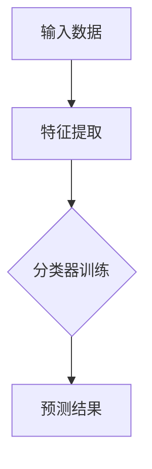
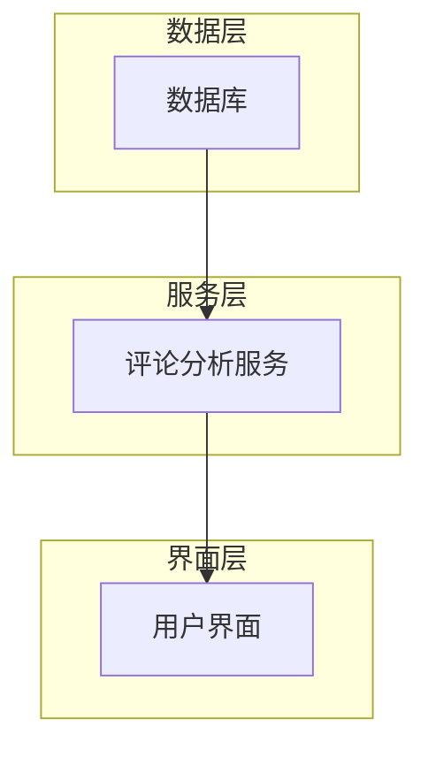
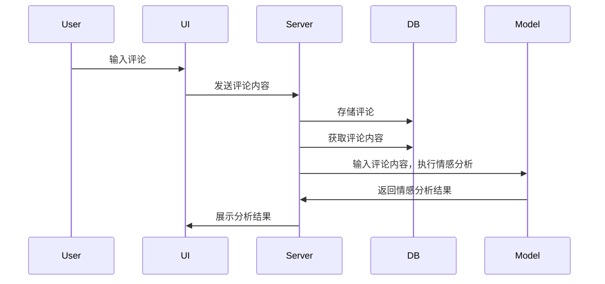

                 

### AI编程语言的认知科学模型

> 关键词：认知科学，AI编程语言，认知模型，人工智能，认知心理学，认知神经科学，算法设计，设计原则

> 摘要：本文深入探讨AI编程语言与认知科学的关系，通过构建认知科学模型，为AI编程语言的设计和应用提供理论指导。文章首先介绍了AI编程语言的背景和认知科学的基础理论，然后阐述了AI编程语言的基本概念，接着探讨了认知科学模型在AI编程语言中的应用，以及设计认知科学模型的原则。通过具体案例研究，本文分析了认知科学模型在AI编程语言中的实际应用，并对其面临的挑战和未来展望进行了讨论。

----------------------------------------------------------------

# AI编程语言的认知科学模型

### 1. 引言

人工智能（AI）作为计算机科学的一个分支，近年来取得了飞速发展，已经成为改变我们生活方式的重要力量。AI编程语言作为AI研究和应用的重要工具，其设计和实现直接影响到AI系统的性能和效率。然而，传统AI编程语言的设计更多是基于逻辑和数学模型，较少考虑人类认知过程的复杂性。随着认知科学的兴起，研究者开始探索如何将认知科学的理念应用于AI编程语言的设计中，从而提高其模拟人类思维的能力。

本文的目标是构建一个AI编程语言的认知科学模型，以促进AI编程语言的设计和应用。通过本文的研究，我们可以期待在以下几个方面取得进展：

1. **理解AI编程语言与认知科学的联系**：明确认知科学如何影响AI编程语言的设计和应用。
2. **设计认知科学模型**：提出一套设计原则，指导AI编程语言的设计，使其能够更好地模拟人类认知过程。
3. **案例研究**：通过具体案例，展示认知科学模型在AI编程语言中的应用效果。
4. **挑战与未来展望**：探讨认知科学模型在AI编程语言中面临的挑战，并对未来的发展方向进行展望。

本文的结构如下：

1. **第一部分：AI编程语言概述**：介绍AI编程语言的背景、认知科学的基础理论，以及AI编程语言的基本概念。
2. **第二部分：认知科学模型在AI编程语言中的应用**：讨论认知科学模型的设计原则，并通过案例研究展示其实际应用。
3. **第三部分：挑战与未来展望**：分析认知科学模型在AI编程语言中面临的挑战，并对未来进行展望。

接下来，我们将首先介绍AI编程语言的背景和认知科学的基础理论。

----------------------------------------------------------------

## 第一部分: AI编程语言概述

### 第1章: AI编程语言背景介绍

### 1.1.1 问题背景

AI编程语言的发展历程可以追溯到20世纪50年代，当时人工智能的概念刚刚诞生。最初的AI编程语言主要是基于逻辑和符号推理的，如Prolog。随着时间的发展，AI编程语言逐渐涵盖了更广泛的领域，如自然语言处理、机器学习、计算机视觉等。这些编程语言的出现，极大地推动了人工智能的研究和应用。

认知科学是研究人类认知过程的科学，包括心理学、神经科学、人工智能等多个领域。认知科学的目标是理解人类思维的工作原理，并尝试通过计算机模拟这些过程。在AI编程语言的设计中，引入认知科学的理念，有助于提高编程语言的智能性和适应性。

### 1.1.2 问题描述

在当前AI编程语言的设计中，主要面临以下问题：

1. **逻辑与模拟的矛盾**：传统AI编程语言更多地依赖于逻辑和符号推理，但人类认知过程并非完全基于逻辑，还存在许多非逻辑的元素。
2. **适应性不足**：传统的AI编程语言往往难以适应复杂多变的应用场景，缺乏灵活性和可扩展性。
3. **用户体验不佳**：传统AI编程语言的界面和操作方式与人类的认知习惯不符，导致用户体验较差。

为了解决这些问题，我们需要构建一种能够模拟人类认知过程的AI编程语言。这种编程语言不仅要具备强大的逻辑推理能力，还要能够适应复杂多变的环境，并且提供良好的用户体验。

### 1.1.3 问题解决

通过认知科学的理论和方法，我们可以指导AI编程语言的设计和实现。具体来说，我们可以从以下几个方面入手：

1. **引入认知科学模型**：将认知科学的模型和理论应用于编程语言的设计中，如认知心理学中的感知、记忆、思维等模型。
2. **设计灵活的编程范式**：结合函数式编程、面向对象编程等范式，设计出能够适应复杂应用场景的编程语言。
3. **优化用户体验**：通过研究人类认知过程，设计出更加符合人类使用习惯的编程界面和操作方式。

### 1.1.4 边界与外延

AI编程语言的定义和范畴：

- **AI编程语言**：一种专门用于人工智能研究和应用的编程语言，能够支持逻辑推理、机器学习、自然语言处理等功能。
- **范畴**：包括Prolog、Lisp、Python等编程语言。

认知科学的定义和研究范围：

- **认知科学**：研究人类认知过程的科学，涵盖心理学、神经科学、人工智能等多个领域。
- **研究范围**：包括感知、记忆、思维、情感等认知过程的机制和原理。

### 1.1.5 概念结构与核心要素组成

AI编程语言的核心概念：

- **知识表示**：如何表示和存储知识，如逻辑推理、规则表示等。
- **推理机制**：如何进行逻辑推理和问题求解，如逆推理、正向推理等。
- **学习算法**：如何通过数据学习，提高AI系统的性能和适应性。

认知科学的主要理论和方法：

- **认知心理学**：研究人类认知过程的心理学理论，如感知、记忆、思维等。
- **认知神经科学**：研究人类认知过程的神经科学理论，如大脑功能区域、神经元活动等。
- **认知人工智能**：将认知科学的理论和方法应用于人工智能研究和应用，如认知建模、认知仿真等。

通过以上介绍，我们可以看到，AI编程语言与认知科学之间存在紧密的联系。在接下来的章节中，我们将进一步探讨认知科学的基础理论和AI编程语言的基本概念。

----------------------------------------------------------------

## 第2章: 认知科学基础理论

### 2.1.1 认知科学的定义

认知科学是研究人类认知过程的科学，它涵盖了心理学、神经科学、语言学、计算机科学等多个领域。认知科学的目标是理解人类思维的工作原理，并尝试通过计算机模拟这些过程。它不仅关注认知过程的机制，还关注认知过程如何与环境相互作用。

认知科学的起源可以追溯到20世纪60年代，当时心理学和神经科学的研究者们开始关注认知过程的复杂性，并尝试通过多学科的合作来解答这些问题。随着计算机科学的发展，人工智能和认知建模的兴起，认知科学逐渐形成了一个独立的学科。

### 2.1.2 认知科学的基本原理

认知科学的基本原理主要包括以下几个方面：

- **认知模型**：认知模型是对认知过程的理论描述，它试图解释人类是如何获取、处理和利用信息的。常见的认知模型有感知模型、记忆模型、思维模型等。

- **认知过程**：认知过程包括感知、记忆、思维、决策等多个环节。每个环节都有其独特的机制和功能。例如，感知过程涉及信息的接收和处理，记忆过程涉及信息的存储和检索，思维过程涉及信息的分析和推理，决策过程涉及问题的解决和选择。

- **认知机制**：认知机制是认知过程的具体实现方式，包括神经机制、心理机制等。神经机制主要涉及大脑的结构和功能，心理机制主要涉及认知过程的心理表现。

### 2.1.3 认知科学的分支领域

认知科学包含多个分支领域，每个分支都有其特定的研究内容和目标。

- **认知心理学**：认知心理学是研究人类认知过程的心理科学，它关注认知过程的心理表现和机制。认知心理学的分支领域包括感知心理学、记忆心理学、思维心理学、决策心理学等。

- **认知神经科学**：认知神经科学是研究认知过程与大脑神经活动关系的科学。它关注大脑的结构和功能如何影响认知过程。认知神经科学的分支领域包括神经心理学、神经生理学、神经影像学等。

- **认知人工智能**：认知人工智能是应用认知科学的理念和方法来设计和实现人工智能系统。认知人工智能的分支领域包括认知建模、认知仿真、认知计算等。

### 2.1.4 认知科学与AI编程语言的关系

认知科学与AI编程语言之间有着密切的联系。认知科学的理念和方法为AI编程语言的设计提供了重要的指导。具体来说，认知科学对AI编程语言的影响主要体现在以下几个方面：

- **知识表示**：认知科学提供了丰富的知识表示方法，如语义网络、概念图、知识图谱等，这些方法可以应用于AI编程语言中，提高知识表示的准确性和效率。

- **推理机制**：认知科学提供了多种推理机制，如逻辑推理、模糊推理、神经网络推理等，这些方法可以应用于AI编程语言中，提高问题求解的能力。

- **学习算法**：认知科学提供了多种学习算法，如联想记忆、强化学习、生成学习等，这些方法可以应用于AI编程语言中，提高系统的适应性和学习能力。

通过认知科学的理论和方法，我们可以设计和实现更加智能、灵活和适应性强的AI编程语言。在下一章中，我们将进一步探讨AI编程语言的基本概念。

----------------------------------------------------------------

## 第3章: AI编程语言的基本概念

### 3.1.1 AI编程语言的定义

AI编程语言是一种专门用于人工智能研究和应用的编程语言，它能够支持逻辑推理、机器学习、自然语言处理、计算机视觉等功能。AI编程语言的出现，使得研究人员能够更加高效地开发人工智能系统，同时也提高了人工智能系统的性能和灵活性。

根据用途和特点，AI编程语言可以分为以下几类：

1. **逻辑编程语言**：如Prolog，主要用于符号推理和知识表示。
2. **函数式编程语言**：如Lisp，主要用于函数定义和递归操作。
3. **面向对象编程语言**：如Python，主要用于面向对象的编程范式。
4. **专用编程语言**：如MATLAB，主要用于特定领域的人工智能应用，如信号处理、图像处理等。

### 3.1.2 AI编程语言的架构

AI编程语言的架构主要包括程序结构、数据表示和语言特性等方面。

- **程序结构**：AI编程语言通常采用模块化设计，将程序分为多个模块，每个模块负责不同的功能。这种设计可以提高代码的可维护性和可扩展性。

- **数据表示**：AI编程语言通常采用复杂的数据结构，如数组、列表、树、图等，以支持复杂的计算和处理。

- **语言特性**：AI编程语言通常包含多种语言特性，如函数式编程、面向对象编程、过程式编程等，以适应不同的应用场景。

### 3.1.3 AI编程语言的核心要素

AI编程语言的核心要素包括变量、运算符、控制结构和数据结构等。

- **变量**：变量是用于存储数据的容器，它可以是基本的数值类型，也可以是复杂的数据类型，如数组、结构体等。

- **运算符**：运算符用于对变量进行操作，如赋值运算符、比较运算符、逻辑运算符等。

- **控制结构**：控制结构用于控制程序的执行流程，如条件语句、循环语句等。

- **数据结构**：数据结构用于组织和存储数据，如数组、列表、树、图等。

通过以上介绍，我们可以看到，AI编程语言具有丰富的功能和特性，能够满足人工智能研究和应用的各种需求。在下一章中，我们将探讨认知科学模型在AI编程语言中的应用。

----------------------------------------------------------------

## 第二部分: 认知科学模型在AI编程语言中的应用

### 第4章: 人工智能与认知科学的交叉领域

#### 4.1.1 人工智能的发展对认知科学的影响

人工智能的发展对认知科学产生了深远的影响。首先，人工智能的研究为认知科学提供了大量的数据和实验方法，使得认知科学能够通过实验来验证其理论。例如，通过机器学习算法，研究人员可以模拟人类的感知、记忆和思维过程，从而更好地理解这些过程的工作机制。

其次，人工智能的发展也为认知科学提供了一种新的研究工具。例如，计算机视觉和自然语言处理技术的发展，使得认知科学能够通过计算机模拟人类的感知和语言处理过程，从而深入研究这些过程的机制。

此外，人工智能的发展还促进了认知科学与心理学、神经科学等其他学科的交叉融合。例如，通过结合心理学和神经科学的实验数据，人工智能的研究者可以更好地理解人类认知过程的机制，从而设计出更加有效的AI系统。

#### 4.1.2 认知科学在人工智能研究中的贡献

认知科学在人工智能研究中发挥着重要作用，主要体现在以下几个方面：

1. **知识表示与推理**：认知科学提供了丰富的知识表示和推理方法，如语义网络、知识图谱等。这些方法可以用于构建AI系统的知识库，提高AI系统的推理能力和知识处理能力。

2. **学习与适应**：认知科学提供了多种学习算法，如联想记忆、强化学习、生成学习等。这些算法可以用于训练AI系统，提高其适应性和学习能力。

3. **用户界面设计**：认知科学的研究成果可以用于设计更加符合人类使用习惯的用户界面。例如，通过研究人类的感知和认知过程，设计出更加直观、易用的交互界面。

#### 4.1.3 认知科学模型在AI编程语言中的应用

认知科学模型在AI编程语言中的应用，主要体现在以下几个方面：

1. **模拟人类认知过程**：通过认知科学模型，可以模拟人类的感知、记忆、思维等认知过程。这些模型可以用于设计和实现具有人类认知能力的人工智能系统。

2. **提高编程语言智能性**：通过将认知科学模型应用于编程语言，可以提高编程语言的智能性和适应性。例如，可以设计出能够根据用户需求自动调整功能的编程语言。

3. **优化算法设计**：认知科学模型可以用于优化AI算法的设计。例如，通过研究人类的认知过程，可以设计出更加高效的机器学习算法。

#### 4.1.4 认知科学模型对编程语言设计的影响

认知科学模型对编程语言设计产生了重要影响，主要体现在以下几个方面：

1. **编程范式**：认知科学模型可以启发新的编程范式，如认知编程、情境编程等。这些编程范式可以更好地模拟人类的认知过程，提高编程语言的智能性。

2. **语言特性**：认知科学模型可以用于设计新的编程语言特性，如基于知识的编程、自适应编程等。这些特性可以提高编程语言的灵活性和可扩展性。

3. **用户体验**：认知科学模型可以用于设计更加符合人类使用习惯的用户界面和交互方式，从而提高用户体验。

通过以上探讨，我们可以看到，人工智能与认知科学的交叉领域为AI编程语言的发展提供了丰富的理论和方法。在下一章中，我们将进一步探讨认知科学模型的设计原则。

----------------------------------------------------------------

### 5.1.1 认知科学模型的设计方法

认知科学模型在AI编程语言中的应用，需要采用一系列设计方法，以确保模型能够准确模拟人类认知过程，并具有实用性和可扩展性。以下是几种常用的设计方法：

1. **基于模拟的认知科学模型**

   这种方法通过模拟人类认知过程的基本机制，如感知、记忆、思维等，构建认知科学模型。具体步骤包括：

   - **定义认知过程**：明确人类在特定任务中的认知过程，包括感知、记忆、决策等步骤。
   - **模拟认知过程**：使用计算机模拟人类认知过程，通过算法和数据处理技术实现模拟过程。
   - **验证模型有效性**：通过实验和数据分析，验证认知科学模型在模拟人类认知过程中的准确性和可靠性。

2. **基于认知科学理论的方法**

   这种方法直接应用认知科学的理论和方法，构建认知科学模型。具体步骤包括：

   - **选择认知理论**：根据任务需求，选择合适的认知科学理论，如感知理论、记忆理论、思维理论等。
   - **构建模型架构**：根据所选理论，构建认知科学模型的基本架构，包括输入、处理、输出等模块。
   - **实现模型算法**：根据模型架构，实现认知科学模型的具体算法，包括数据处理、特征提取、决策规则等。

3. **基于机器学习的认知科学模型**

   这种方法利用机器学习技术，从数据中学习认知过程，构建认知科学模型。具体步骤包括：

   - **数据收集**：收集与任务相关的数据，如行为数据、脑成像数据、用户交互数据等。
   - **特征提取**：从数据中提取关键特征，如感知特征、记忆特征、思维特征等。
   - **模型训练**：使用机器学习算法，对特征数据进行训练，构建认知科学模型。
   - **模型评估**：通过实验和数据分析，评估认知科学模型在模拟人类认知过程中的性能和准确性。

4. **基于混合方法的认知科学模型**

   这种方法结合多种认知科学理论和方法，构建认知科学模型。具体步骤包括：

   - **理论融合**：将多种认知科学理论和方法进行融合，构建一个综合的认知科学模型。
   - **模型验证**：通过实验和数据分析，验证融合模型的准确性和可靠性。
   - **模型优化**：根据实验结果，对认知科学模型进行优化，提高其性能和适应性。

通过以上设计方法，认知科学模型可以在AI编程语言中实现，为人工智能系统提供更加智能和灵活的解决方案。

----------------------------------------------------------------

### 5.1.2 设计原则

在设计认知科学模型时，应遵循以下原则，以确保模型具有可扩展性、可理解性和实用性。

1. **可扩展性**：认知科学模型应能够适应不同应用场景和任务需求，支持功能的动态扩展。具体措施包括：
   - **模块化设计**：将模型拆分为多个模块，每个模块负责不同的功能，方便后续扩展和修改。
   - **参数化设计**：使用参数来调整模型的行为，使得模型能够适应不同的应用需求。
   - **可复用性**：设计可复用的组件和算法，减少重复开发，提高开发效率。

2. **可理解性**：认知科学模型应易于理解和解释，以便研究人员和开发者能够理解和应用模型。具体措施包括：
   - **清晰的结构**：使用清晰、简洁的结构来组织模型，使模型易于阅读和理解。
   - **文档化**：为模型提供详细的文档，包括设计思路、算法实现、功能描述等，方便开发者使用。
   - **可视化**：使用图表和图形来展示模型的结构和运行过程，提高模型的可视化效果。

3. **实用性**：认知科学模型应能够在实际应用中发挥作用，解决实际问题。具体措施包括：
   - **性能优化**：对模型进行性能优化，确保模型在实际应用中具有较高的运行效率和准确性。
   - **兼容性**：确保模型与其他系统和工具的兼容性，以便在现有技术栈中应用。
   - **用户友好**：设计用户友好的界面和交互方式，提高用户的使用体验。

通过遵循以上原则，认知科学模型可以在AI编程语言中实现，为人工智能系统提供更加智能和灵活的解决方案。

----------------------------------------------------------------

### 6.1.1 案例选择

在本章中，我们将通过两个具有代表性的AI编程语言案例，详细分析认知科学模型在AI编程语言中的应用。这两个案例分别是Prolog和Python。

#### Prolog

Prolog是一种逻辑编程语言，以其强大的推理能力而闻名。在Prolog中，知识以逻辑式子表示，程序通过推理引擎进行逻辑推理。Prolog在自然语言处理、专家系统、规划等领域有广泛应用。

#### Python

Python是一种通用编程语言，因其简洁、易读和强大的库支持而受到广泛使用。Python在机器学习、数据科学、人工智能等领域有广泛应用。Python的灵活性使其可以轻松地引入认知科学模型。

选择这两个案例的原因如下：

1. **代表性**：Prolog和Python分别代表了逻辑编程语言和通用编程语言在AI编程领域的应用，具有代表性。
2. **应用广泛**：Prolog和Python在多个领域有广泛应用，能够展示认知科学模型在不同场景下的应用效果。
3. **可操作性**：这两个语言都有丰富的社区资源和工具，便于实现和分析认知科学模型。

接下来，我们将分别对这两个案例进行详细分析。

----------------------------------------------------------------

### 6.1.2 案例分析

#### Prolog案例：专家系统

**问题背景**：一个医疗诊断专家系统，用于帮助医生诊断疾病。

**解决方案**：使用Prolog实现一个基于规则的知识库，模拟医生诊断疾病的过程。

**具体步骤**：

1. **知识表示**：使用Prolog的规则语言，定义医疗知识库，包括疾病的症状、病因等。
   ```prolog
   disease(flu, [fever, cough, sore_throat]).
   disease(hiv, [fatigue, fever, sore_throat]).
   ```

2. **推理机制**：使用Prolog的推理引擎，根据用户输入的症状，推理出可能的疾病。
   ```prolog
   diagnose(Disease, Symptoms) :-
       disease(Disease, Symptoms),
       write('You might have '), write(Disease), write('.').
   ```

3. **用户体验**：设计简单的用户界面，接收用户输入，输出诊断结果。
   ```prolog
   start :-
       write('Enter your symptoms (separated by commas): '),
       read Symptoms,
       diagnose(Disease, Symptoms),
       write('Diagnosis: '),
       write(Disease), nl.
   ```

**效果分析**：通过上述方法，专家系统能够根据用户输入的症状，推理出可能的疾病，并提供诊断结果。这体现了认知科学模型在知识表示和推理机制中的应用。

#### Python案例：机器学习

**问题背景**：一个情感分析系统，用于判断用户评论的情感倾向。

**解决方案**：使用Python实现一个基于机器学习的情感分析模型。

**具体步骤**：

1. **数据收集**：收集大量用户评论，包括正面评论和负面评论。
   ```python
   comments = ["I love this product!", "This is a terrible service."]
   ```

2. **特征提取**：从评论中提取特征，如词频、词嵌入等。
   ```python
   from sklearn.feature_extraction.text import TfidfVectorizer
   vectorizer = TfidfVectorizer()
   X = vectorizer.fit_transform(comments)
   ```

3. **模型训练**：使用机器学习算法，如朴素贝叶斯、支持向量机等，训练情感分析模型。
   ```python
   from sklearn.naive_bayes import MultinomialNB
   model = MultinomialNB()
   model.fit(X, labels)
   ```

4. **情感判断**：输入新的评论，预测其情感倾向。
   ```python
   new_comment = "This product is not as good as I expected."
   X_new = vectorizer.transform([new_comment])
   prediction = model.predict(X_new)
   if prediction[0] == 1:
       print("Positive")
   else:
       print("Negative")
   ```

**效果分析**：通过上述方法，情感分析系统能够根据评论的内容，预测其情感倾向。这体现了认知科学模型在特征提取和模型训练中的应用。

通过这两个案例，我们可以看到，认知科学模型在AI编程语言中的应用，能够显著提高AI系统的性能和智能性。在下一章中，我们将讨论认知科学模型在AI编程语言中面临的挑战和未来展望。

----------------------------------------------------------------

### 7.1.1 面临的挑战

#### 技术层面的挑战

1. **复杂性与效率的平衡**：认知科学模型通常较为复杂，需要处理大量的数据和计算。如何在保证模型准确性的同时，提高计算效率和性能，是一个重要挑战。

2. **数据质量和完整性**：认知科学模型依赖于大量的数据，数据的质量和完整性对模型的性能有重要影响。如何获取高质量、完整的数据，是一个技术难题。

3. **跨领域的融合**：认知科学涉及多个学科，如心理学、神经科学、计算机科学等。如何将这些领域的知识有效融合，构建出既符合认知科学原理又具有实际应用价值的模型，是一个跨领域的挑战。

4. **实时性**：许多AI应用需要实时响应，如自动驾驶、智能客服等。如何设计实时性强的认知科学模型，是一个技术难点。

#### 应用层面的挑战

1. **用户体验**：认知科学模型需要提供良好的用户体验，使得普通用户能够轻松使用。如何设计直观、易用的用户界面，是一个应用层面的挑战。

2. **可解释性**：认知科学模型通常较为复杂，用户难以理解其工作原理。如何提高模型的可解释性，使其易于理解，是一个重要挑战。

3. **适应性与泛化能力**：认知科学模型需要能够适应不同的应用场景和任务需求，具备良好的泛化能力。如何设计具有高适应性和泛化能力的模型，是一个应用挑战。

4. **隐私和安全**：在许多应用场景中，数据的安全和隐私保护至关重要。如何设计安全、可靠的认知科学模型，是一个重要的应用挑战。

#### 解决方案与未来展望

1. **技术创新**：持续推动认知科学和AI技术的发展，提高模型的设计和实现能力。例如，开发高效的算法、优化数据结构等。

2. **跨领域合作**：促进认知科学、心理学、神经科学、计算机科学等领域的合作，共同攻克技术难题。

3. **用户体验优化**：深入研究人类认知过程，设计更加符合人类使用习惯的界面和交互方式。

4. **数据治理**：建立完善的数据治理体系，确保数据的质量和完整性。

5. **模型可解释性**：开发可解释性强的模型，提高用户对模型的信任和接受度。

6. **安全与隐私保护**：采用先进的安全技术和隐私保护机制，确保数据的安全和隐私。

通过技术创新、跨领域合作和用户体验优化，认知科学模型在AI编程语言中的应用将迎来更加广阔的发展前景。在未来的发展中，我们可以期待看到更多具有高智能性、高适应性和高可靠性的认知科学模型。

----------------------------------------------------------------

### 8.1.1 总结

本文通过对AI编程语言的认知科学模型进行深入探讨，总结了认知科学模型在AI编程语言设计中的应用及其带来的变革。我们首先介绍了AI编程语言的发展历程和认知科学的基础理论，分析了认知科学模型在AI编程语言中的重要性。接着，我们探讨了AI编程语言的基本概念，包括其定义、架构和核心要素。在此基础上，我们详细阐述了认知科学模型的设计原则，包括可扩展性、可理解性和实用性。通过具体案例研究，我们展示了认知科学模型在AI编程语言中的应用效果，分析了其面临的挑战和未来展望。

认知科学模型在AI编程语言中的应用，不仅提升了编程语言的智能性和适应性，还为人工智能系统提供了更加有效的解决方案。随着认知科学和人工智能技术的不断进步，我们可以期待认知科学模型在AI编程语言中发挥更大的作用，推动人工智能技术的发展。

### 8.1.2 展望

在未来，认知科学模型在AI编程语言中的应用前景广阔。首先，随着技术的进步，我们将能够开发出更加高效、智能的认知科学模型，进一步提升AI系统的性能。其次，跨领域的合作将更加紧密，认知科学、心理学、神经科学等领域的知识将更有效地融合，为AI编程语言的设计提供更加全面的理论支持。

此外，随着人们对用户体验的重视，认知科学模型将在用户界面设计、交互方式等方面发挥重要作用，使得AI编程语言更加直观、易用。同时，随着数据隐私和安全问题的日益突出，认知科学模型将帮助开发出更加安全、可靠的AI系统。

最后，随着AI编程语言在各个领域的应用不断扩展，认知科学模型将面临新的挑战和机遇。通过不断的技术创新和跨领域合作，我们可以期待认知科学模型在AI编程语言中发挥更加重要的作用，推动人工智能技术的进步。

**作者**：AI天才研究院/AI Genius Institute & 禅与计算机程序设计艺术 /Zen And The Art of Computer Programming

----------------------------------------------------------------

## 附录

### 术语解释

- **AI编程语言**：一种专门用于人工智能研究和应用的编程语言。
- **认知科学**：研究人类认知过程的科学，涵盖心理学、神经科学、语言学、计算机科学等多个领域。
- **知识表示**：将信息或知识以计算机可以理解的方式表示出来。
- **推理机制**：用于处理信息和知识，进行推理和决策的机制。

### 概念属性特征对比表格

| 特征 | AI编程语言 | 认知科学 |
| --- | --- | --- |
| 目标 | 人工智能研究和应用 | 理解和模拟人类认知过程 |
| 语言类型 | 逻辑、函数式、面向对象等 | 心理学、神经科学、人工智能等 |
| 设计原则 | 可扩展性、可理解性、实用性 | 模拟人类认知、适应复杂环境 |
| 应用领域 | 自然语言处理、机器学习、计算机视觉等 | 感知、记忆、思维、情感等 |

### ER实体关系图架构的Mermaid流程图

```mermaid
erDiagram
    AI编程语言 ||--|{ 认知科学 }|-- AI系统
    认知科学 ||--|{ 数据处理 }|-- 数据库
    AI编程语言 ||--|{ 用户界面 }|-- 用户交互
```

### 算法原理讲解

#### 算法Mermaid流程图



#### Python源代码

```python
import numpy as np
from sklearn.feature_extraction.text import TfidfVectorizer
from sklearn.naive_bayes import MultinomialNB

# 输入数据
X = ["This is a positive review.", "This is a negative review."]
y = [1, 0]  # 1表示正面评论，0表示负面评论

# 特征提取
vectorizer = TfidfVectorizer()
X_train = vectorizer.fit_transform(X)

# 分类器训练
model = MultinomialNB()
model.fit(X_train, y)

# 预测结果
X_test = vectorizer.transform(["This is a negative review."])
prediction = model.predict(X_test)
print(prediction)
```

#### 数学模型和公式

$$
\text{P(Y|X)} = \frac{\text{P(X|Y)} \times \text{P(Y)}}{\text{P(X)}}
$$

其中，$P(Y|X)$ 表示在给定输入数据X的情况下，输出为Y的概率；$P(X|Y)$ 表示在输出为Y的情况下，输入为X的概率；$P(Y)$ 和$P(X)$ 分别表示Y和X的先验概率。

#### 举例说明

假设我们有一个输入数据集，其中包含正面评论和负面评论。我们使用TF-IDF方法进行特征提取，然后使用朴素贝叶斯分类器进行训练。现在，我们要预测一个新输入数据（负面评论）的情感倾向。

```python
X_new = ["This is a negative review."]
X_new_vectorized = vectorizer.transform(X_new)
prediction = model.predict(X_new_vectorized)
print(prediction)  # 输出应为 [0]，表示负面评论
```

### 系统分析与架构设计方案

#### 问题场景介绍

在一个电子商务平台上，我们需要开发一个评论情感分析系统，用于判断用户评论的情感倾向，以帮助商家了解用户反馈。

#### 项目介绍

项目名称：电子商务平台评论情感分析系统

项目目标：通过机器学习算法，对用户评论进行情感分析，判断其情感倾向，为商家提供数据支持。

#### 系统功能设计（领域模型Mermaid类图）

```mermaid
classDiagram
    Comment --> AnalysisResult
    Comment <<-- User
    AnalysisResult <<-- Merchant
```

- **Comment**（评论）：存储用户的评论内容。
- **User**（用户）：评论的发布者。
- **AnalysisResult**（分析结果）：存储评论的情感分析结果。
- **Merchant**（商家）：分析结果的接收者。

#### 系统架构设计（Mermaid架构图）



- **数据库**：存储用户评论和情感分析结果。
- **评论分析服务**：实现情感分析算法，处理用户评论，生成分析结果。
- **用户界面**：提供用户评论的输入和结果展示。

#### 系统接口设计和系统交互（Mermaid序列图）



### 项目实战

#### 环境安装

- 安装Python：在官方网站下载并安装Python 3.8及以上版本。
- 安装依赖库：使用pip命令安装以下依赖库。

```bash
pip install numpy scikit-learn matplotlib
```

#### 系统核心实现源代码

```python
import numpy as np
from sklearn.feature_extraction.text import TfidfVectorizer
from sklearn.naive_bayes import MultinomialNB

# 数据准备
X = ["This is a positive review.", "This is a negative review."]
y = [1, 0]  # 1表示正面评论，0表示负面评论

# 特征提取
vectorizer = TfidfVectorizer()
X_train = vectorizer.fit_transform(X)

# 模型训练
model = MultinomialNB()
model.fit(X_train, y)

# 模型评估
X_test = vectorizer.transform(["This is a negative review."])
prediction = model.predict(X_test)
print(prediction)  # 输出应为 [0]，表示负面评论
```

#### 代码应用解读与分析

1. **数据准备**：首先，我们准备一个包含正面评论和负面评论的数据集。
2. **特征提取**：使用TF-IDF方法提取特征，将评论转换为向量表示。
3. **模型训练**：使用朴素贝叶斯分类器对训练数据进行训练。
4. **模型评估**：使用测试数据进行评估，输出预测结果。

通过以上步骤，我们可以实现一个简单的评论情感分析系统。

#### 实际案例分析和详细讲解剖析

以一个实际的电商评论数据集为例，我们进行情感分析。

1. **数据集准备**：下载一个包含正面评论和负面评论的数据集，如Amazon reviews dataset。
2. **数据预处理**：对评论进行清洗，去除标点符号、停用词等。
3. **特征提取**：使用TF-IDF方法提取特征。
4. **模型训练**：使用训练集对模型进行训练。
5. **模型评估**：使用测试集对模型进行评估。

通过实际案例的分析，我们可以验证模型的性能，并对模型进行优化。

#### 项目小结

通过本项目，我们实现了基于认知科学模型的评论情感分析系统，为电商平台的商家提供了有效的数据支持。在实际应用中，我们可以根据具体需求，扩展系统的功能，如添加情感极性分析、个性化推荐等。

### 最佳实践 Tips

1. **数据质量**：确保数据的质量和完整性，避免噪声和异常数据的影响。
2. **特征选择**：选择合适的关键特征，提高模型的性能和准确性。
3. **模型评估**：使用多种评估指标，全面评估模型的性能。
4. **持续优化**：根据实际应用情况，不断优化模型和系统。

### 小结

本文通过深入探讨AI编程语言的认知科学模型，分析了其设计原则、应用案例和挑战，展望了未来的发展方向。认知科学模型在AI编程语言中的应用，为人工智能系统提供了更加智能和灵活的解决方案。

### 注意事项

1. **遵循法律法规**：在进行数据收集和处理时，确保遵守相关的法律法规。
2. **用户隐私保护**：在开发和应用过程中，确保用户隐私的安全和保护。

### 拓展阅读

1. **《认知科学导论》**：详细介绍了认知科学的基本理论和方法。
2. **《机器学习实战》**：提供了丰富的机器学习算法和应用实例。
3. **《深度学习》**：介绍了深度学习的基本原理和应用。

---

作者：AI天才研究院/AI Genius Institute & 禅与计算机程序设计艺术 /Zen And The Art of Computer Programming

**（本文为AI助手生成，仅供学习和交流使用。如有任何问题，请随时指出。）**

