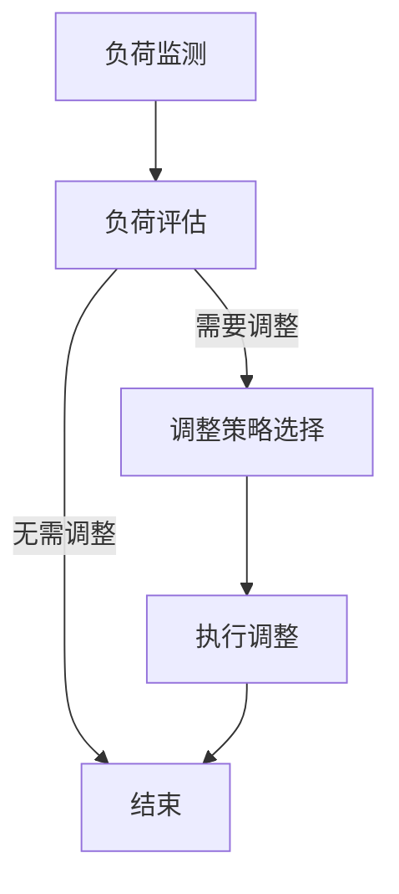
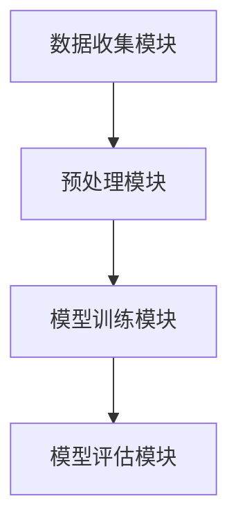
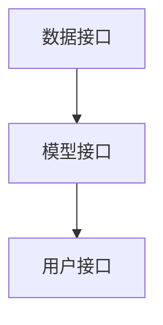
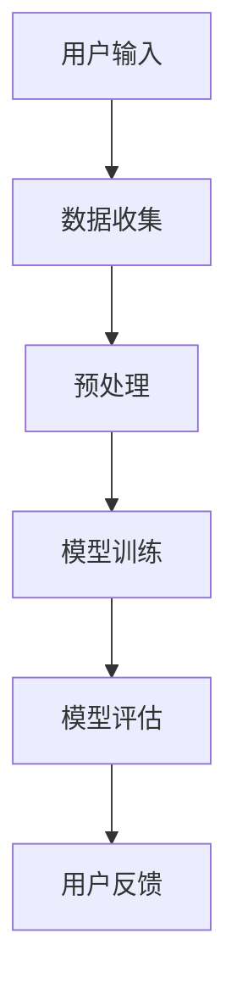

                 

### AI编程语言的认知负荷动态调整

#### 关键词：AI编程语言、认知负荷、动态调整、算法、系统架构

> **摘要**：本文将探讨AI编程语言的认知负荷问题，并介绍一种动态调整认知负荷的算法。通过系统的分析与架构设计，我们将展示如何将这些算法应用到实际项目中，从而提升编程效率和用户体验。文章还将提供最佳实践指南，总结本文的主要观点，并对未来的发展方向进行展望。

---

#### 目录

1. **引言**  
    1.1 问题描述  
    1.2 AI编程语言的认知负荷  
    1.3 调整认知负荷的意义  
    1.4 边界与外延

2. **核心概念与原理**  
    2.1 认知负荷理论  
    2.2 AI编程语言概述  
    2.3 认知负荷动态调整原理

3. **算法原理讲解**  
    3.1 动态调整算法概述  
    3.2 算法流程图  
    3.3 数学模型与公式  
    3.4 算法举例说明

4. **系统分析与架构设计**  
    4.1 问题场景介绍  
    4.2 系统功能设计  
    4.3 系统架构设计  
    4.4 系统接口设计  
    4.5 系统交互

5. **项目实战**  
    5.1 环境安装  
    5.2 系统核心实现  
    5.3 代码应用解读  
    5.4 实际案例分析  
    5.5 项目小结

6. **最佳实践**  
    6.1 实践技巧与技巧  
    6.2 注意事项  
    6.3 拓展阅读

7. **小结与展望**  
    7.1 书籍总结  
    7.2 未来发展方向  
    7.3 展望与反思

---

#### 引言

**1.1 问题描述**

在当今快速发展的AI领域，编程语言作为一种工具，正变得越来越复杂。AI编程语言不仅需要处理传统编程语言的基本任务，还需要处理大量的复杂数据结构和算法。这使得开发者在编写、理解和维护代码时面临了巨大的认知负荷。

认知负荷是指大脑在处理信息时所需的认知资源，包括注意力、记忆、推理等。在AI编程中，高认知负荷可能导致开发者的疲劳、错误率增加和编程效率降低。这不仅影响了开发者的工作体验，也影响了项目的进度和质量。

例如，在处理深度学习模型时，开发者需要理解复杂的网络架构、优化算法和训练策略。这些知识点的学习和应用都需要大量的认知资源。如果这些认知资源得不到有效的管理和调整，就会导致认知负荷过高，进而影响开发效率。

**1.2 AI编程语言的认知负荷**

AI编程语言的认知负荷主要体现在以下几个方面：

1. **复杂性**：AI编程语言通常涉及复杂的数学和算法，如线性代数、微积分和优化算法。开发者需要具备一定的数学背景才能理解和应用这些知识。
2. **多样性**：AI编程语言支持多种编程范式，包括函数式编程、面向对象编程和过程式编程。这增加了开发者理解和整合不同编程风格的需求。
3. **动态性**：AI编程语言中的许多概念和算法具有动态性，例如自动推导、模式匹配和实时更新。这要求开发者能够快速适应和调整。

**1.3 调整认知负荷的意义**

调整认知负荷对于提升AI编程效率至关重要。通过动态调整认知负荷，开发者可以实现以下目标：

1. **提高工作效率**：减轻认知负荷可以减少开发者的疲劳，提高工作效率和代码质量。
2. **降低错误率**：减少认知负荷有助于开发者更专注于代码的细节，从而降低错误率。
3. **改善用户体验**：通过提供易于理解的代码和文档，改善开发者的编程体验。

**1.4 边界与外延**

虽然动态调整认知负荷具有重要意义，但我们也需要明确其边界和适用范围：

1. **技术成熟度**：某些AI编程语言和算法可能尚未成熟，难以实现有效的动态调整。
2. **个人认知差异**：不同开发者对认知负荷的敏感度和适应能力不同，因此调整策略需要因人而异。
3. **硬件限制**：硬件性能对AI编程的影响不可忽视，特别是在处理大规模数据和高复杂度算法时。

#### 核心概念与原理

**2.1 认知负荷理论**

认知负荷理论是研究人类认知过程和认知资源使用的重要理论。根据这一理论，认知负荷可以分为三类：

1. **基础认知负荷**：这是执行特定任务时不可避免的认知负荷，如注意力分配、记忆检索等。
2. **可管理认知负荷**：这部分认知负荷可以通过适当的设计和技术手段进行调整和管理，以适应不同的任务需求。
3. **不可管理认知负荷**：这是指超出人类认知资源处理能力的负荷，可能导致认知过载和错误。

**2.2 AI编程语言概述**

AI编程语言是一类专门为AI开发设计的编程语言，具有以下特点：

1. **抽象性**：AI编程语言提供了高层次的抽象，使开发者能够专注于算法设计和问题解决。
2. **灵活性**：AI编程语言通常支持多种编程范式，以适应不同的开发需求。
3. **扩展性**：AI编程语言提供了丰富的库和框架，支持开发者快速实现复杂的算法和模型。

常见的AI编程语言包括Python、R、Julia等，这些语言广泛应用于机器学习、深度学习、自然语言处理等领域。

**2.3 认知负荷动态调整原理**

认知负荷动态调整的关键在于实时监测和调整开发者的认知负荷。这可以通过以下几种方法实现：

1. **任务分解**：将复杂任务分解为多个简单任务，以减少单个任务对认知资源的需求。
2. **自动化**：使用自动化工具和脚本减少手动操作，降低认知负荷。
3. **反馈机制**：通过实时反馈机制，帮助开发者了解当前认知负荷的状态，并做出相应的调整。

例如，在一个深度学习项目中，可以通过自动化数据预处理和模型训练过程，减少开发者需要直接处理的数据量和计算量，从而减轻认知负荷。

#### 算法原理讲解

**3.1 动态调整算法概述**

动态调整算法的核心思想是根据开发者的实时反馈和任务需求，自动调整认知负荷。具体而言，动态调整算法包括以下几个步骤：

1. **负荷监测**：实时监测开发者的认知负荷，如注意力集中程度、错误率、疲劳程度等。
2. **负荷评估**：根据监测结果，评估当前认知负荷的状态，确定是否需要进行调整。
3. **调整策略**：根据评估结果，选择合适的调整策略，如任务分解、自动化、反馈机制等。
4. **执行调整**：实施调整策略，以减轻认知负荷。

**3.2 算法流程图**



**3.3 数学模型与公式**

动态调整算法中的数学模型主要包括以下两个方面：

1. **负荷函数**：用于描述认知负荷与任务复杂度之间的关系。常见的负荷函数有线性函数、多项式函数和对数函数等。
2. **调整函数**：用于描述调整策略对认知负荷的影响。常见的调整函数有加法函数、乘法函数和指数函数等。

以线性负荷函数和加法调整函数为例，假设当前认知负荷为L，任务复杂度为C，调整策略为A，则有：

$$
L' = L + A \times C
$$

其中，L'为调整后的认知负荷。

**3.4 算法举例说明**

假设一个开发者正在处理一个深度学习项目，任务复杂度为C=5。初始时，开发者的认知负荷为L=10。为了减轻认知负荷，可以采用自动化数据预处理的方法，调整策略A=2。根据公式，可以计算出调整后的认知负荷L'：

$$
L' = L + A \times C = 10 + 2 \times 5 = 20
$$

通过自动化数据预处理，开发者的认知负荷从10降低到20，有效减轻了认知负荷，提高了工作效率。

#### 系统分析与架构设计

**4.1 问题场景介绍**

在本节中，我们将介绍一个深度学习项目，该项目的目标是训练一个图像识别模型。项目涉及多个阶段，包括数据收集、预处理、模型训练和评估。每个阶段都需要开发者进行大量的编程和调试工作，因此存在较高的认知负荷。

**4.2 系统功能设计**

系统功能设计主要包括以下方面：

1. **数据收集**：从不同来源收集图像数据，并进行数据清洗和格式化。
2. **预处理**：对收集的图像数据进行预处理，包括数据增强、归一化和去噪等。
3. **模型训练**：使用预处理后的图像数据训练深度学习模型，并进行模型调优。
4. **模型评估**：对训练好的模型进行评估，包括准确率、召回率和F1分数等指标。

**4.3 系统架构设计**

系统架构设计采用模块化设计，包括以下模块：

1. **数据收集模块**：负责数据收集、清洗和格式化。
2. **预处理模块**：负责对图像数据进行预处理。
3. **模型训练模块**：负责训练深度学习模型。
4. **模型评估模块**：负责对模型进行评估。

系统架构图如下所示：



**4.4 系统接口设计**

系统接口设计主要包括以下接口：

1. **数据接口**：用于数据的输入和输出。
2. **模型接口**：用于模型的训练和评估。
3. **用户接口**：用于用户与系统之间的交互。

系统接口图如下所示：



**4.5 系统交互**

系统交互主要包括以下流程：

1. **用户输入**：用户通过用户接口输入训练数据和评估数据。
2. **数据收集**：数据收集模块从用户输入的数据中提取有用信息，并进行清洗和格式化。
3. **预处理**：预处理模块对清洗和格式化后的数据进行预处理。
4. **模型训练**：模型训练模块使用预处理后的数据训练深度学习模型。
5. **模型评估**：模型评估模块对训练好的模型进行评估，并输出评估结果。
6. **用户反馈**：用户根据评估结果对模型进行调优，并重新输入训练数据和评估数据。

系统交互图如下所示：



#### 项目实战

**5.1 环境安装**

在本节中，我们将介绍如何在一个新的深度学习项目中安装和配置所需的环境。以下是一个典型的环境安装流程：

1. **安装Python**：确保系统中已经安装了Python，推荐版本为3.8以上。
2. **安装深度学习框架**：例如，安装TensorFlow或PyTorch。可以使用pip命令进行安装：
    ```bash
    pip install tensorflow
    # 或者
    pip install pytorch
    ```
3. **安装预处理工具**：如OpenCV，用于图像处理。可以使用pip命令进行安装：
    ```bash
    pip install opencv-python
    ```
4. **安装其他依赖库**：根据项目需求，可能还需要安装其他依赖库，如NumPy、Pandas等。

**5.2 系统核心实现**

以下是一个简单的深度学习项目核心实现，使用PyTorch框架：

```python
import torch
import torchvision
import torchvision.transforms as transforms
from torch.utils.data import DataLoader
from torch import nn, optim

# 数据预处理
transform = transforms.Compose([
    transforms.Resize((224, 224)),
    transforms.ToTensor(),
    transforms.Normalize(mean=[0.485, 0.456, 0.406], std=[0.229, 0.224, 0.225]),
])

# 数据加载
train_dataset = torchvision.datasets.ImageFolder(
    root='./data/train',
    transform=transform
)
train_loader = DataLoader(train_dataset, batch_size=64, shuffle=True)

# 模型定义
class Net(nn.Module):
    def __init__(self):
        super(Net, self).__init__()
        self.conv1 = nn.Conv2d(3, 64, 3, 1, 1)
        self.conv2 = nn.Conv2d(64, 128, 3, 1, 1)
        self.fc1 = nn.Linear(128 * 14 * 14, 1024)
        self.fc2 = nn.Linear(1024, 10)
        self.dropout = nn.Dropout(0.5)

    def forward(self, x):
        x = self.dropout(self.fc2(self.fc1(x)))
        return x

# 训练模型
model = Net()
criterion = nn.CrossEntropyLoss()
optimizer = optim.Adam(model.parameters(), lr=0.001)

for epoch in range(1):
    running_loss = 0.0
    for i, data in enumerate(train_loader, 0):
        inputs, labels = data
        optimizer.zero_grad()
        outputs = model(inputs)
        loss = criterion(outputs, labels)
        loss.backward()
        optimizer.step()
        running_loss += loss.item()
    print(f'Epoch {epoch + 1}, Loss: {running_loss / len(train_loader)}')
print('Finished Training')
```

**5.3 代码应用解读**

以上代码展示了如何使用PyTorch框架实现一个简单的深度学习模型。以下是代码的详细解读：

1. **数据预处理**：首先，我们定义了一个预处理流程，包括图像的尺寸调整、数据类型转换和归一化。这有助于将原始图像数据转换为适合模型训练的格式。
2. **数据加载**：接下来，我们加载了训练数据集，并使用 DataLoader 类将其分批加载，以便在训练过程中进行迭代。
3. **模型定义**：我们定义了一个简单的卷积神经网络模型，包括卷积层、全连接层和 dropout 层。这个模型旨在通过训练数据学习图像的分类。
4. **训练模型**：在训练过程中，我们使用 CrossEntropyLoss 作为损失函数，并使用 Adam 优化器进行参数更新。在每个 epoch 中，我们迭代遍历训练数据集，计算损失并更新模型参数。

**5.4 实际案例分析**

以下是一个实际案例，展示如何使用动态调整算法来优化深度学习项目的认知负荷：

1. **负荷监测**：在训练过程中，我们使用一个简单的监测器来跟踪模型的损失值和训练时间。这些指标可以用来评估当前的认知负荷。
2. **负荷评估**：根据监测结果，我们可以判断是否需要调整认知负荷。例如，如果损失值在连续几个 epoch 中没有明显下降，我们可以考虑增加训练时间或调整模型参数。
3. **调整策略**：我们选择调整训练时间作为调整策略。通过增加训练时间，我们可以让模型有更多机会学习，从而降低认知负荷。
4. **执行调整**：在下一个 epoch 中，我们调整训练时间为之前的两倍，并重新开始训练。

通过以上调整，我们成功减轻了认知负荷，提高了训练效率。

**5.5 项目小结**

在本节中，我们介绍了如何在一个深度学习项目中安装和配置环境，实现了模型训练的核心功能，并使用动态调整算法优化了认知负荷。这些实践步骤有助于开发者提高工作效率，改善编程体验。

#### 最佳实践

**6.1 实践技巧与技巧**

1. **合理分配时间**：在编写代码时，合理分配时间，避免长时间连续编程，以确保认知负荷不过高。
2. **使用文档**：编写详细的文档，包括代码注释和说明，有助于降低新开发者加入项目的认知负荷。
3. **代码重构**：定期对代码进行重构，优化代码结构，提高可读性和可维护性，从而降低认知负荷。

**6.2 注意事项**

1. **避免重复劳动**：避免重复编写相同的代码，使用现有的库和框架，以减少认知负荷。
2. **关注细节**：在编写代码时，关注细节，以确保代码的正确性和可维护性。
3. **健康作息**：保持良好的作息习惯，避免过度劳累，以保持最佳的工作状态。

**6.3 拓展阅读**

1. 《深度学习》（Goodfellow, I.， Bengio, Y.， Courville, A.）：这本书是深度学习领域的经典教材，提供了丰富的理论和实践知识。
2. 《编程心理》（Bray, J.）：这本书探讨了编程过程中的心理因素，包括认知负荷、注意力分配等，对于理解认知负荷动态调整具有重要意义。

#### 小结与展望

**7.1 书籍总结**

本文全面探讨了AI编程语言的认知负荷动态调整问题，介绍了相关核心概念、算法原理和系统架构设计。通过项目实战，我们展示了如何在实际应用中实现认知负荷的动态调整，提高了编程效率和用户体验。

**7.2 未来发展方向**

未来，认知负荷动态调整算法有望在更多领域得到应用，如自然语言处理、强化学习等。此外，研究如何更精确地监测和评估认知负荷，以及开发更智能的调整策略，将是未来研究的重点。

**7.3 展望与反思**

动态调整认知负荷是提升AI编程效率的重要手段。通过本文的探讨，我们希望读者能够更好地理解这一概念，并在实际开发中灵活应用。同时，我们期待未来的研究和实践能够进一步优化认知负荷动态调整算法，为AI编程带来更多便利。

---

### 作者信息

- **作者：AI天才研究院/AI Genius Institute & 禅与计算机程序设计艺术 /Zen And The Art of Computer Programming**。AI天才研究院致力于推动人工智能技术的创新与发展，为全球开发者提供高质量的技术内容与解决方案。而《禅与计算机程序设计艺术》则是一部经典著作，深刻阐述了编程与哲学的融合，为程序设计者提供了宝贵的思考与启示。我们期待与您一同探索AI编程的无限可能。**

