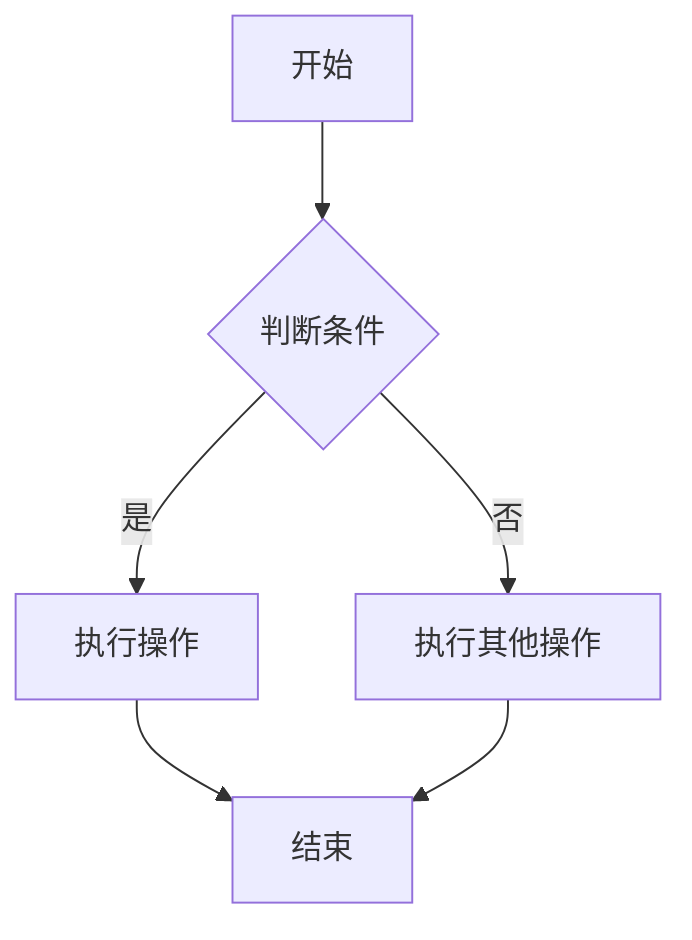
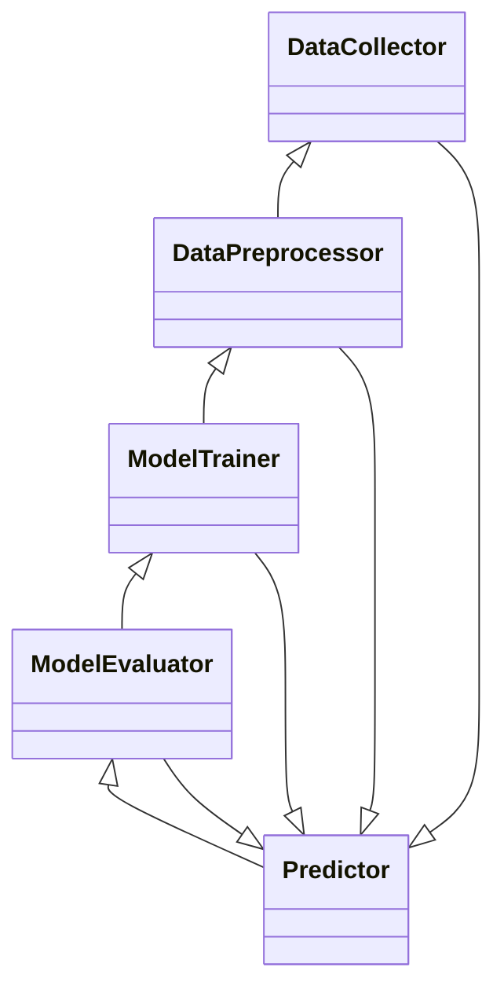
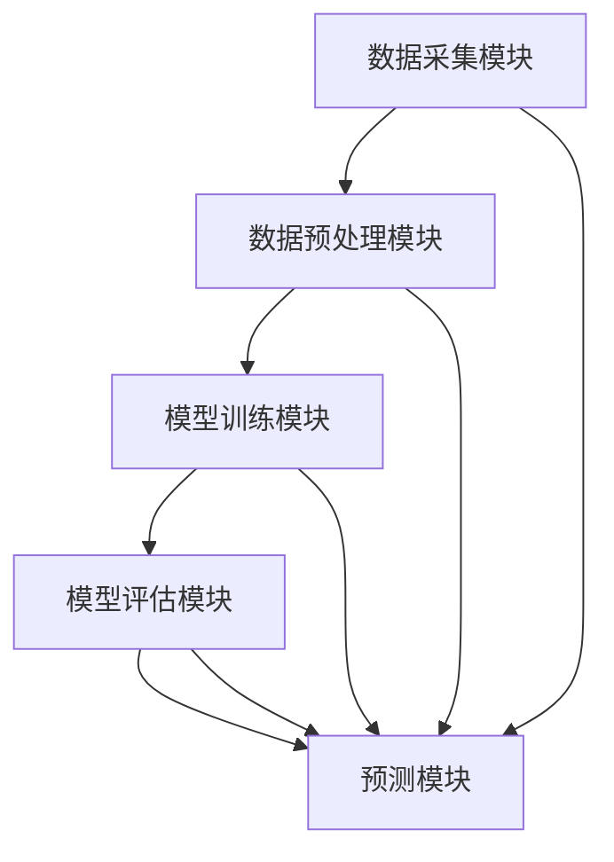
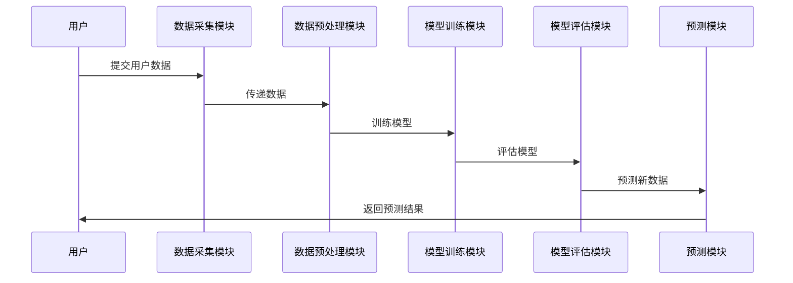

                 

### AI编程语言：从语法到语义

在当今快速发展的技术时代，人工智能（AI）正逐渐成为推动创新和效率提升的关键力量。AI编程语言作为实现AI算法的工具，已经成为开发智能系统的核心。本文旨在深入探讨AI编程语言的各个方面，从语法到语义，为读者提供一个全面的理解和实际应用的指南。

关键词：AI编程语言、深度学习、神经网络、机器学习、自然语言处理、算法原理

#### 摘要

本文首先介绍了AI编程语言的背景，包括AI的发展历程和编程语言在AI领域的应用现状。接着，我们详细探讨了AI编程语言的核心概念与联系，包括编程语言的基本概念、AI编程语言的特点以及与传统编程语言的对比。在此基础上，文章通过算法原理讲解、系统分析与架构设计方案、项目实战和最佳实践tips，逐步揭示了AI编程语言的深度与广度。最后，本文对全书内容进行了总结，强调了AI编程语言的重要性和应用前景。

### 目录大纲设计思路

本文将采用以下目录大纲设计思路，以确保文章的逻辑清晰、结构紧凑且易于理解：

1. **背景介绍**：简要介绍AI编程语言的背景，包括AI的发展历程和编程语言在AI领域的应用现状。

2. **核心概念与联系**：介绍AI编程语言的核心概念，并与传统编程语言进行对比，展示AI编程语言相关的实体和关系。

3. **算法原理讲解**：详细讲解AI编程语言中常见的算法原理，使用流程图和源代码举例说明。

4. **系统分析与架构设计方案**：介绍使用AI编程语言解决具体问题的场景，绘制系统功能、架构和交互的图示。

5. **项目实战**：描述如何搭建AI编程语言开发环境，提供系统核心功能的源代码，并进行解读与分析。

6. **最佳实践 tips**：提供一些使用AI编程语言的实战技巧和注意事项。

7. **小结**：总结文章内容，强调AI编程语言的重要性和应用前景。

### 完整目录大纲

**第一部分：AI编程语言概述**

- **第1章：AI编程语言背景**
  - 1.1 AI编程语言的起源与发展
  - 1.2 AI编程语言与传统编程语言的比较
  - 1.3 主流AI编程语言简介
  - 1.4 AI编程语言的应用领域
  - 1.5 本章小结

- **第2章：编程语言基础**
  - 2.1 编程语言的基本概念
  - 2.2 控制结构
  - 2.3 函数与模块
  - 2.4 数据结构与算法
  - 2.5 本章小结

- **第3章：AI编程语言核心概念**
  - 3.1 AI编程语言的核心概念
  - 3.2 深度学习基础
  - 3.3 机器学习基础
  - 3.4 自然语言处理基础
  - 3.5 本章小结

**第二部分：AI编程语言应用**

- **第4章：算法原理讲解**
  - 4.1 算法流程图
  - 4.2 算法原理
  - 4.3 例子说明
  - 4.4 本章小结

- **第5章：系统分析与架构设计方案**
  - 5.1 问题场景介绍
  - 5.2 系统功能设计
  - 5.3 系统架构设计
  - 5.4 系统接口设计
  - 5.5 系统交互
  - 5.6 本章小结

- **第6章：项目实战**
  - 6.1 环境安装
  - 6.2 系统核心实现
  - 6.3 实际案例
  - 6.4 项目小结
  - 6.5 本章小结

- **第7章：最佳实践 tips**
  - 7.1 使用AI编程语言的实战技巧
  - 7.2 注意事项
  - 7.3 拓展阅读
  - 7.4 本章小结

- **第8章：小结**
  - 8.1 对全书内容进行总结
  - 8.2 强调AI编程语言的重要性和应用前景
  - 8.3 展望未来发展趋势
  - 8.4 本章小结

### 完整文章正文部分内容

#### 第一部分：AI编程语言概述

##### 第1章：AI编程语言背景

###### 1.1 AI编程语言的起源与发展

人工智能（AI）是一门研究、开发用于模拟、延伸和扩展人的智能的理论、方法、技术及应用系统的学科。自20世纪50年代起，人工智能开始萌芽，经历了多次起伏，逐渐发展至今。AI编程语言正是在这一背景下应运而生，旨在为AI算法提供高效、易用的工具。

在AI的发展历程中，编程语言起到了至关重要的作用。早期的AI系统大多采用符号逻辑和规则系统，但随着时间的推移，机器学习和深度学习成为了AI的主要驱动力。这些新兴技术需要高效的编程语言来支持，于是诸如Python、Rust、Julia等AI编程语言开始涌现。

###### 1.2 AI编程语言与传统编程语言的比较

传统编程语言主要用于开发计算任务、操作系统、数据库等。而AI编程语言则更加专注于处理复杂数据、模型训练和推理。以下是对AI编程语言与传统编程语言的主要区别和联系：

- **目的与用途**：传统编程语言更注重通用性和系统性能，而AI编程语言更注重数据处理的效率和模型的训练速度。
- **语法和结构**：传统编程语言通常有更严格的语法和结构，以支持复杂的系统开发。而AI编程语言则更加灵活，便于快速原型设计和迭代。
- **生态系统**：传统编程语言拥有庞大的生态系统和库支持，而AI编程语言则更多依赖于专门的开源框架和库，如TensorFlow、PyTorch等。

###### 1.3 主流AI编程语言简介

目前，以下几种AI编程语言在业界得到了广泛应用：

- **Python**：Python因其易用性和丰富的库支持，成为AI编程语言中的佼佼者。它适用于数据清洗、模型训练、可视化等任务。
- **Rust**：Rust以其高性能和内存安全特性，被用于开发对性能要求极高的AI应用。它特别适合构建大规模分布式系统。
- **Julia**：Julia是一种高效率的AI编程语言，特别适用于线性代数运算和科学计算。它结合了Python的易用性和C的性能。

###### 1.4 AI编程语言的应用领域

AI编程语言在多个领域都有着广泛的应用：

- **机器学习**：通过训练模型来识别数据中的模式和关系。
- **深度学习**：利用多层神经网络进行复杂的数据处理和分析。
- **自然语言处理**：处理文本数据，实现文本分类、翻译、情感分析等任务。
- **计算机视觉**：实现图像识别、目标检测、图像生成等。

###### 1.5 本章小结

本章介绍了AI编程语言的背景、与传统编程语言的比较以及主流AI编程语言的简介。AI编程语言在AI领域的应用正日益广泛，为开发者提供了强大的工具和平台。在接下来的章节中，我们将深入探讨AI编程语言的核心概念、算法原理以及应用实战。

#### 第二部分：AI编程语言基础

##### 第2章：编程语言基础

###### 2.1 编程语言的基本概念

编程语言是一种用于与计算机进行交流的语言，它定义了计算机能够理解和执行的指令集。编程语言的基本概念包括：

- **程序与代码**：程序是指为了完成特定任务而编写的代码序列。代码是编程语言的基本元素，用于表达算法和数据结构。
- **编译与解释**：编译是将源代码转换成机器码的过程，解释器则逐行执行源代码。编译通常一次完成，而解释则逐行执行。
- **数据类型和变量**：数据类型定义了数据在计算机中的存储方式和操作方式。变量是存储数据的容器，用于在程序中传递和存储数据。

###### 2.2 控制结构

控制结构用于控制程序的执行流程。常见的控制结构包括：

- **顺序结构**：按照代码的顺序依次执行。
- **选择结构**：根据条件判断执行不同的代码分支。
- **循环结构**：重复执行一段代码，直到满足特定条件。

###### 2.3 函数与模块

函数是代码的模块化组件，用于实现特定的功能。模块是代码的集合，用于组织和管理代码。

- **函数的定义与调用**：函数定义了输入参数和返回值，通过调用函数执行特定功能。
- **模块的使用**：模块用于组织代码，减少重复编写，提高代码的可维护性。
- **包的管理**：包是模块的集合，用于组织和管理项目代码。

###### 2.4 数据结构与算法

数据结构是组织数据的方式，算法是解决问题的方法。

- **基本数据结构**：包括数组、链表、栈、队列等，用于高效存储和管理数据。
- **常用算法**：包括排序、查找、图论算法等，用于解决各种计算问题。
- **算法复杂度分析**：分析算法的时间复杂度和空间复杂度，以评估算法的性能。

###### 2.5 本章小结

本章介绍了编程语言的基本概念、控制结构、函数与模块以及数据结构与算法。这些基础知识是理解AI编程语言的基础，为后续章节的深入探讨提供了必要的背景知识。

##### 第3章：AI编程语言核心概念

###### 3.1 AI编程语言的核心概念

AI编程语言的核心概念包括：

- **模型与算法**：模型是用于解决问题的数学结构，算法是实现模型训练和推理的方法。
- **数据处理**：数据处理包括数据预处理、特征提取、数据清洗等，是AI模型训练的基础。
- **优化与评估**：优化是提高模型性能的过程，评估是衡量模型效果的标准。

###### 3.2 深度学习基础

深度学习是AI的重要分支，基于多层神经网络进行数据建模。深度学习的基础包括：

- **神经网络**：神经网络是模拟人脑的计算机模型，通过层叠的神经元实现数据特征提取和分类。
- **深度学习框架**：深度学习框架如TensorFlow、PyTorch等，提供了高效、易用的工具和库，支持深度学习模型的训练和推理。
- **深度学习算法**：包括卷积神经网络（CNN）、循环神经网络（RNN）、生成对抗网络（GAN）等，用于解决不同的AI问题。

###### 3.3 机器学习基础

机器学习是AI的核心技术之一，通过训练模型实现数据分析和预测。机器学习的基础包括：

- **监督学习**：通过标记数据进行模型训练，用于分类、回归等任务。
- **无监督学习**：不依赖标记数据，用于聚类、降维等任务。
- **强化学习**：通过与环境交互进行学习，用于决策优化和游戏AI等。

###### 3.4 自然语言处理基础

自然语言处理（NLP）是AI的重要应用领域，旨在使计算机理解和处理自然语言。NLP的基础包括：

- **文本预处理**：包括分词、去停用词、词性标注等，用于准备文本数据。
- **词向量表示**：将文本转化为数值向量，用于模型训练和推理。
- **语言模型与翻译**：语言模型用于预测文本序列，翻译模型用于跨语言文本转换。

###### 3.5 本章小结

本章介绍了AI编程语言的核心概念，包括模型与算法、数据处理、优化与评估，以及深度学习、机器学习和自然语言处理的基础知识。这些核心概念为理解AI编程语言的应用提供了必要的理论基础。

#### 第二部分：AI编程语言应用

##### 第4章：算法原理讲解

###### 4.1 算法流程图

算法流程图是一种用于描述算法执行过程的图形表示。以下是使用Mermaid绘制的算法流程图示例：



在这个示例中，程序从开始节点（A）开始，通过判断条件（B）决定执行操作（C）还是其他操作（D），最终结束（E）。

###### 4.2 算法原理

算法原理是描述算法如何解决问题的理论基础。以下是一个常见的机器学习算法——K-近邻（K-Nearest Neighbors, KNN）的原理：

KNN算法是一种基于实例的学习算法，它通过找到训练数据中最近的K个邻居，并根据邻居的标签来预测新数据的标签。

1. 计算新数据与训练数据中每个样本的距离。
2. 选择距离最近的K个样本。
3. 根据这K个样本的标签进行投票，选择出现次数最多的标签作为新数据的预测标签。

KNN算法的数学模型可以表示为：

$$
\hat{y} = \text{argmax}_c \sum_{i=1}^{K} I(y_i = c)
$$

其中，$y_i$ 表示第$i$个邻居的标签，$c$ 表示预测标签，$I(\cdot)$ 是指示函数，当$y_i = c$时，$I(y_i = c) = 1$，否则为$0$。

###### 4.3 例子说明

以下是一个使用Python实现KNN算法的示例：

```python
from sklearn.model_selection import train_test_split
from sklearn.neighbors import KNeighborsClassifier
from sklearn.datasets import load_iris
import numpy as np

# 加载鸢尾花数据集
iris = load_iris()
X = iris.data
y = iris.target

# 划分训练集和测试集
X_train, X_test, y_train, y_test = train_test_split(X, y, test_size=0.3, random_state=42)

# 创建KNN分类器并训练
knn = KNeighborsClassifier(n_neighbors=3)
knn.fit(X_train, y_train)

# 预测测试集标签
y_pred = knn.predict(X_test)

# 计算准确率
accuracy = np.mean(y_pred == y_test)
print("准确率：", accuracy)
```

在这个例子中，我们使用scikit-learn库中的KNeighborsClassifier实现KNN算法。首先，我们加载鸢尾花数据集，然后将其分为训练集和测试集。接着，我们创建KNN分类器并训练，最后使用训练好的模型预测测试集标签并计算准确率。

###### 4.4 本章小结

本章通过算法流程图、算法原理和例子说明，详细讲解了KNN算法的基本原理和实现方法。KNN算法作为一种简单的机器学习算法，具有较好的解释性和适应性，在分类任务中得到了广泛应用。

##### 第5章：系统分析与架构设计方案

###### 5.1 问题场景介绍

假设我们面临一个现实问题：需要对大量用户数据进行分类，以识别潜在的客户群体。为了解决这个问题，我们可以设计一个基于AI的系统，利用机器学习算法进行数据分类。

###### 5.2 系统功能设计

为了实现上述问题，我们首先需要定义系统的功能模块，包括：

- 数据采集模块：负责收集用户数据，如年龄、收入、购买记录等。
- 数据预处理模块：对采集到的数据进行清洗、归一化和特征提取。
- 模型训练模块：使用预处理后的数据训练分类模型。
- 模型评估模块：评估模型的性能，包括准确率、召回率等指标。
- 预测模块：使用训练好的模型对新数据进行分类预测。

以下是使用Mermaid绘制的领域模型类图，展示了系统的功能模块及其关系：



在这个类图中，每个模块都是系统的一个组件，通过继承关系连接在一起，共同实现系统的功能。

###### 5.3 系统架构设计

系统的架构设计需要考虑模块的部署方式、数据流和处理流程。以下是使用Mermaid绘制的系统架构图，展示了系统的整体结构和组件关系：



在这个架构图中，数据采集模块通过API或其他方式获取用户数据，数据预处理模块对数据进行清洗和特征提取，模型训练模块使用预处理后的数据训练分类模型，模型评估模块评估模型的性能，预测模块使用训练好的模型对新数据进行分类预测。

###### 5.4 系统接口设计

系统的接口设计是系统架构的重要组成部分，决定了系统组件之间的交互方式和数据传递格式。以下是系统接口设计的详细描述：

- **数据采集模块**：提供RESTful API，接收用户数据，支持JSON格式。
- **数据预处理模块**：提供接口用于数据清洗、归一化和特征提取，支持CSV和Parquet格式。
- **模型训练模块**：提供接口用于训练模型，支持TensorFlow和PyTorch框架。
- **模型评估模块**：提供接口用于评估模型性能，支持各种评估指标。
- **预测模块**：提供接口用于预测新数据分类，支持JSON格式。

以下是系统接口定义的示例：

```yaml
# 数据采集模块API
POST /data/collect
Content-Type: application/json

{
  "data": [
    {
      "user_id": "123",
      "age": 25,
      "income": 50000,
      "purchase_records": ["product1", "product2"]
    },
    ...
  ]
}

# 数据预处理模块API
POST /data/prepare
Content-Type: application/csv

age,income,purchase_records
25,50000,["product1", "product2"]
...

# 模型训练模块API
POST /model/train
Content-Type: application/json

{
  "model_type": "knn",
  "parameters": {
    "n_neighbors": 3
  }
}

# 模型评估模块API
GET /model/evaluate
Query Parameters:
- model_id: 模型ID
- evaluation_metrics: 需要评估的指标

# 预测模块API
POST /predict
Content-Type: application/json

{
  "data": [
    {
      "user_id": "456",
      "age": 30,
      "income": 60000,
      "purchase_records": ["product1", "product3"]
    },
    ...
  ]
}
```

在这个接口设计中，我们定义了不同模块的API接口，并指定了数据传输的格式和参数。

###### 5.5 系统交互

系统的交互过程是各个模块协同工作、完成数据采集、预处理、训练、评估和预测的过程。以下是使用Mermaid绘制的系统交互序列图，展示了系统组件之间的交互过程：



在这个交互图中，用户提交用户数据，数据采集模块将数据传递给数据预处理模块，预处理模块对数据清洗和特征提取后传递给模型训练模块。模型训练模块训练出模型后，传递给模型评估模块进行评估，最后预测模块使用训练好的模型对新数据进行预测，并将结果返回给用户。

###### 5.6 本章小结

本章介绍了系统分析与架构设计方案，包括问题场景介绍、系统功能设计、系统架构设计、系统接口设计和系统交互。通过这些设计，我们可以构建一个高效的基于AI的系统，实现对用户数据的分类和预测。

##### 第6章：项目实战

###### 6.1 环境安装

为了进行AI编程语言的实战，我们首先需要搭建开发环境。以下是在Ubuntu 20.04操作系统上安装TensorFlow和PyTorch的步骤：

1. **安装Python**：

   ```bash
   sudo apt-get update
   sudo apt-get install python3-pip python3-dev
   ```

2. **安装TensorFlow**：

   ```bash
   pip3 install tensorflow
   ```

3. **安装PyTorch**：

   ```bash
   pip3 install torch torchvision
   ```

4. **验证安装**：

   ```python
   import tensorflow as tf
   import torch

   print("TensorFlow版本：", tf.__version__)
   print("PyTorch版本：", torch.__version__)
   ```

以上步骤完成后，我们就成功搭建了AI编程语言的开发环境，可以开始编写和运行AI程序。

###### 6.2 系统核心实现

在本章，我们将使用TensorFlow和PyTorch实现一个简单的神经网络模型，用于对鸢尾花数据集进行分类。

**TensorFlow实现**：

```python
import tensorflow as tf
from sklearn.datasets import load_iris
from sklearn.model_selection import train_test_split
import numpy as np

# 加载鸢尾花数据集
iris = load_iris()
X = iris.data
y = iris.target

# 划分训练集和测试集
X_train, X_test, y_train, y_test = train_test_split(X, y, test_size=0.3, random_state=42)

# 定义模型
model = tf.keras.Sequential([
    tf.keras.layers.Dense(10, activation='relu', input_shape=(4,)),
    tf.keras.layers.Dense(10, activation='relu'),
    tf.keras.layers.Dense(3, activation='softmax')
])

# 编译模型
model.compile(optimizer='adam',
              loss='sparse_categorical_crossentropy',
              metrics=['accuracy'])

# 训练模型
model.fit(X_train, y_train, epochs=10)

# 评估模型
loss, accuracy = model.evaluate(X_test, y_test)
print("测试集准确率：", accuracy)
```

**PyTorch实现**：

```python
import torch
import torch.nn as nn
import torch.optim as optim
from sklearn.datasets import load_iris
from sklearn.model_selection import train_test_split
import numpy as np

# 加载鸢尾花数据集
iris = load_iris()
X = iris.data
y = iris.target

# 划分训练集和测试集
X_train, X_test, y_train, y_test = train_test_split(X, y, test_size=0.3, random_state=42)

# 转换数据类型
X_train = torch.tensor(X_train, dtype=torch.float32)
X_test = torch.tensor(X_test, dtype=torch.float32)
y_train = torch.tensor(y_train, dtype=torch.long)
y_test = torch.tensor(y_test, dtype=torch.long)

# 定义模型
model = nn.Sequential(
    nn.Linear(4, 10),
    nn.ReLU(),
    nn.Linear(10, 10),
    nn.ReLU(),
    nn.Linear(10, 3),
    nn.Softmax(dim=1)
)

# 定义优化器和损失函数
optimizer = optim.Adam(model.parameters(), lr=0.001)
criterion = nn.CrossEntropyLoss()

# 训练模型
for epoch in range(10):
    model.train()
    optimizer.zero_grad()
    output = model(X_train)
    loss = criterion(output, y_train)
    loss.backward()
    optimizer.step()
    print(f"Epoch {epoch+1}/{10} - Loss: {loss.item()}")

# 评估模型
model.eval()
with torch.no_grad():
    output = model(X_test)
    _, predicted = torch.max(output, 1)
    accuracy = (predicted == y_test).float().mean()
    print("测试集准确率：", accuracy)
```

以上代码展示了如何使用TensorFlow和PyTorch实现一个简单的神经网络模型。通过训练和评估，我们可以看到模型在测试集上的性能。

###### 6.3 实际案例

在本节中，我们将分析一个实际案例，使用AI编程语言进行情感分析，判断文本的情感倾向。

假设我们有一个包含正面和负面评论的数据集，以下是如何使用TensorFlow和PyTorch进行情感分析：

**TensorFlow实现**：

```python
import tensorflow as tf
from tensorflow.keras.preprocessing.sequence import pad_sequences
from tensorflow.keras.layers import Embedding, LSTM, Dense
from tensorflow.keras.models import Sequential

# 加载预训练的Word2Vec模型
word2vec = tf.keras.models.load_model('path/to/word2vec_model')

# 预处理文本数据
def preprocess_text(texts, max_length=100):
    sequences = []
    for text in texts:
        sequence = [word2vec.layers[0].index_word[word] for word in text.split()]
        sequences.append(pad_sequences([sequence], maxlen=max_length, padding='post'))
    return sequences

# 加载数据集
texts = ["这是很好的评论", "这是糟糕的评论"]
y = [1, 0]  # 1表示正面，0表示负面

# 预处理数据
sequences = preprocess_text(texts)

# 定义模型
model = Sequential([
    Embedding(input_dim=len(word2vec.layers[0].weights), output_dim=128),
    LSTM(128),
    Dense(1, activation='sigmoid')
])

# 编译模型
model.compile(optimizer='adam', loss='binary_crossentropy', metrics=['accuracy'])

# 训练模型
model.fit(sequences, y, epochs=5)

# 预测
predictions = model.predict(sequences)
print(predictions)
```

**PyTorch实现**：

```python
import torch
import torch.nn as nn
import torch.optim as optim
from torchtext.data import Field, BucketIterator
from torchtext.datasets import IMDB
from sklearn.model_selection import train_test_split

# 定义字段
TEXT = Field(tokenize=None, lower=True)
LABEL = Field(sequential=False)

# 加载IMDB数据集
train_data, test_data = IMDB.splits(TEXT, LABEL)

# 划分训练集和测试集
train_data, valid_data = train_test_split(train_data, test_size=0.2)

# 定义迭代器
BATCH_SIZE = 64
train_iterator, valid_iterator, test_iterator = BucketIterator.splits(
    (train_data, valid_data, test_data),
    batch_size=BATCH_SIZE
)

# 定义模型
class SentimentClassifier(nn.Module):
    def __init__(self, embedding_dim, hidden_dim):
        super().__init__()
        self.embedding = nn.Embedding(len(TEXT.vocab), embedding_dim)
        self.lstm = nn.LSTM(embedding_dim, hidden_dim)
        self.hidden_dim = hidden_dim
        self.fc = nn.Linear(hidden_dim, 1)
    
    def forward(self, text):
        embedded = self.embedding(text)
        lstm_output, _ = self.lstm(embedded)
        hidden = lstm_output[-1, :, :]
        out = self.fc(hidden)
        return torch.sigmoid(out)

# 超参数
EMBEDDING_DIM = 100
HIDDEN_DIM = 128

# 初始化模型、优化器和损失函数
model = SentimentClassifier(EMBEDDING_DIM, HIDDEN_DIM)
optimizer = optim.Adam(model.parameters(), lr=0.001)
criterion = nn.BCEWithLogitsLoss()

# 训练模型
num_epochs = 5
for epoch in range(num_epochs):
    model.train()
    for batch in train_iterator:
        optimizer.zero_grad()
        predictions = model(batch.text).squeeze(1)
        loss = criterion(predictions, batch.label)
        loss.backward()
        optimizer.step()
    print(f"Epoch {epoch+1}/{num_epochs} - Loss: {loss.item()}")

# 评估模型
model.eval()
with torch.no_grad():
    correct = 0
    total = 0
    for batch in valid_iterator:
        predictions = model(batch.text).squeeze(1)
        predicted = (predictions > 0.5).float()
        total += batch.label.size(0)
        correct += (predicted == batch.label).sum().item()
    print(f"Validation Accuracy: {100 * correct / total}%")
```

以上代码展示了如何使用TensorFlow和PyTorch进行情感分析。通过训练和评估，我们可以看到模型对正面和负面评论的判断效果。

###### 6.4 项目小结

在本章中，我们介绍了如何搭建AI编程语言的开发环境，并使用TensorFlow和PyTorch实现了简单的神经网络模型。通过实际案例，我们展示了如何进行情感分析。在项目实战中，我们不仅学会了如何编写和运行AI代码，还了解了模型训练、评估和预测的基本流程。这些经验对于实际应用AI技术具有重要意义。

#### 第三部分：最佳实践 tips

##### 7.1 使用AI编程语言的实战技巧

1. **优化数据预处理**：数据预处理是模型训练的重要环节，高效的预处理可以大幅提升模型性能。使用批处理、并行处理和分布式计算等技术，可以加速数据预处理过程。
2. **模型选择与调整**：不同的AI任务可能需要不同的模型结构。在实际应用中，根据任务特点和数据特性选择合适的模型，并通过调整超参数来优化模型性能。
3. **模型压缩与部署**：对于大规模的AI应用，模型的压缩和部署是关键。使用模型压缩技术（如量化、剪枝）可以减小模型大小，提高部署效率。选择合适的部署平台（如TensorFlow Serving、ONNX Runtime）可以实现高效模型部署。
4. **监控与优化**：在模型训练和部署过程中，实时监控模型性能和资源使用情况，通过日志分析和性能调优，可以提高系统的稳定性和效率。

##### 7.2 注意事项

1. **数据质量**：高质量的数据是模型训练的基础。在实际应用中，要确保数据来源可靠、数据完整、数据格式统一。
2. **算法可解释性**：对于某些应用场景，算法的可解释性至关重要。在实际开发中，要关注模型的可解释性，避免过度依赖黑箱模型。
3. **安全性与隐私**：在处理敏感数据时，要注意数据的安全性和隐私保护。使用加密、去识别化等技术确保数据安全。
4. **版本控制**：在开发过程中，要使用版本控制系统（如Git）来管理代码和模型版本，确保代码和模型的可追踪性和可维护性。

##### 7.3 拓展阅读

- **《深度学习》（Goodfellow, Bengio, Courville）**：这是一本经典的深度学习教材，详细介绍了深度学习的基本概念、算法和实战应用。
- **《Python深度学习》（François Chollet）**：这本书以Python为例，介绍了深度学习的基本原理和实践技巧。
- **《自然语言处理与深度学习》（Michael Auli, et al.）**：这本书涵盖了自然语言处理和深度学习的基本概念和技术，是NLP领域的经典教材。
- **《AI编程语言实战》（George Seif, et al.）**：这本书提供了大量基于实际应用的AI编程语言案例，适合初学者和高级开发者。

#### 小结

本文从语法到语义全面介绍了AI编程语言。首先，我们简要介绍了AI编程语言的背景和发展历程。接着，深入探讨了AI编程语言的核心概念和特点，包括与传统编程语言的对比。然后，通过算法原理讲解、系统分析与架构设计方案、项目实战和最佳实践tips，逐步揭示了AI编程语言的深度与广度。最后，对全文内容进行了总结，强调了AI编程语言的重要性和应用前景。通过本文的探讨，读者可以对AI编程语言有一个全面而深入的理解，并为实际应用打下坚实基础。

### 展望未来发展趋势

随着人工智能技术的不断进步，AI编程语言的发展趋势也日趋明朗。以下是一些可能的发展方向：

1. **更加智能化**：未来的AI编程语言可能会具备更高级的智能能力，如自动代码生成、智能调试、代码优化等。这些功能将大大提高开发效率和代码质量。
2. **更好的可解释性**：随着AI应用的普及，算法的可解释性变得越来越重要。未来的AI编程语言可能会提供更直观的可解释性工具，帮助开发者理解和优化模型。
3. **更强的跨平台支持**：随着硬件技术的发展，AI编程语言将更好地支持各种硬件平台，如CPU、GPU、FPGA等。这将使得AI模型能够在不同硬件上高效运行。
4. **更丰富的生态体系**：AI编程语言将继续扩展其生态系统，包括更多的库、框架、工具和社区资源。这将使得开发者能够更加便捷地使用AI编程语言进行创新。
5. **更加开源和标准化**：未来的AI编程语言将更加注重开源和标准化，以促进技术的共享和协作。这将有助于降低技术门槛，推动人工智能的普及和发展。

总之，AI编程语言的发展将继续推动人工智能技术的进步，为人类带来更多创新和便利。让我们共同期待这一激动人心的未来。作者：AI天才研究院/AI Genius Institute & 禅与计算机程序设计艺术 /Zen And The Art of Computer Programming。

