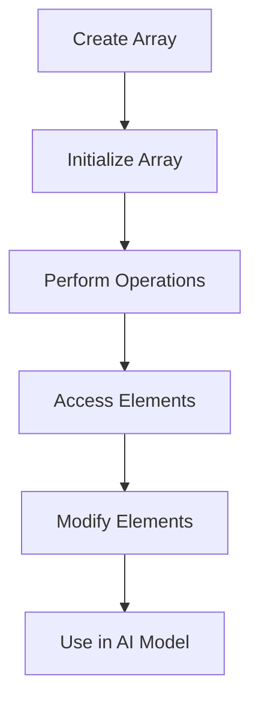
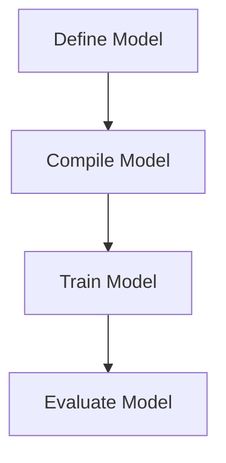
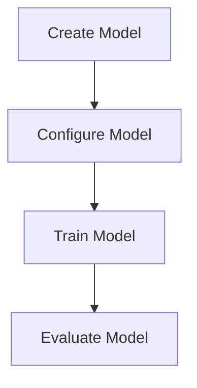
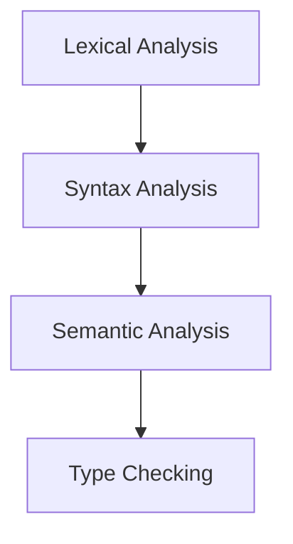
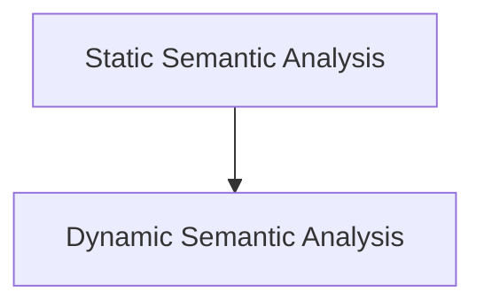
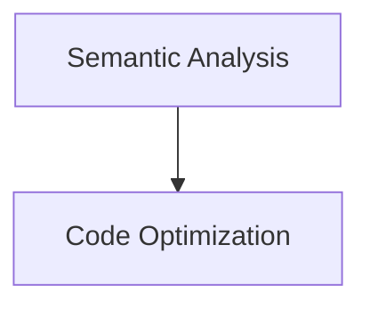
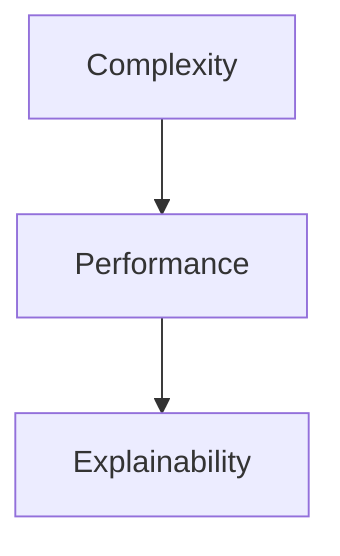
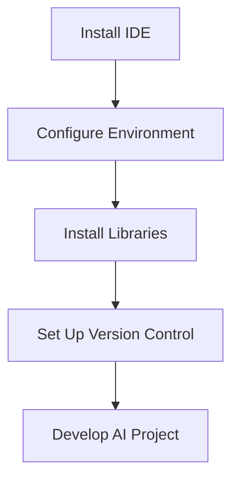
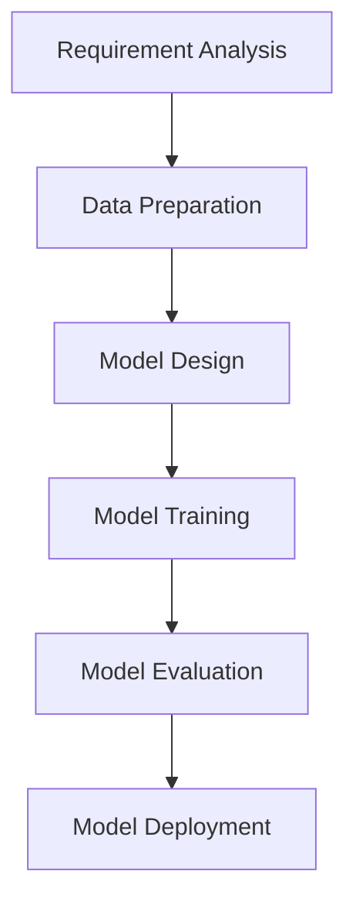
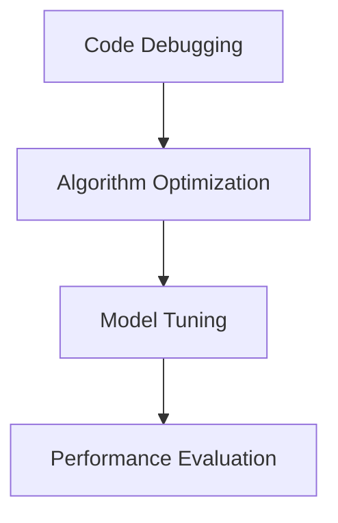

                 


### AI编程语言：从语法到语义的新跨越

关键词：人工智能、编程语言、语法、语义、函数式编程、面向对象编程

摘要：本文将深入探讨人工智能编程语言的发展背景、核心概念、编程范式以及实际应用，旨在为读者提供一个全面、系统的AI编程语言学习指南。我们将通过逐步分析，揭示AI编程语言的独特之处，并展望其未来发展趋势。

## 第一部分：AI编程语言概述

### 第1章：AI编程语言的背景与演进

#### 1.1 问题背景

人工智能（AI）自诞生以来，经历了数十年的发展。从早期的规则系统、知识表示，到近年的深度学习和神经网络，AI技术日新月异。然而，传统的编程语言在处理复杂AI任务时，往往表现出局限性。这促使研究者们探索新的编程语言，以更好地支持AI的开发。

#### 1.2 问题描述

AI编程语言的重要性不言而喻。与传统编程语言相比，AI编程语言具有更丰富的语义模型和更强的表达力。它们不仅能够更好地处理复杂的数据结构，还能够更直观地表示AI算法。因此，选择合适的AI编程语言，对于AI项目的成功至关重要。

#### 1.3 问题解决

AI编程语言的基本特点包括：

- 强大的语义模型，支持复杂的数据结构和算法表示；
- 丰富的库和工具，方便开发者进行AI模型的开发、训练和部署；
- 高度的抽象能力，降低开发者编写代码的复杂性。

AI编程语言的应用场景广泛，包括但不限于机器学习、自然语言处理、计算机视觉等领域。

#### 1.4 边界与外延

AI编程语言的适用范围取决于具体的应用场景和技术需求。在某些领域，如科学计算和大数据处理，传统编程语言仍然具有优势。而在其他领域，如机器学习和自然语言处理，AI编程语言则更加适用。

#### 1.5 概念结构与核心要素

AI编程语言的核心概念包括：

- 数据表示：如何表示和操作数据，如矩阵、张量等；
- 算法表示：如何表示和执行算法，如梯度下降、反向传播等；
- 模型表示：如何表示和优化模型，如神经网络、决策树等。

AI编程语言的要素组成主要包括：

- 变量、函数、类等基础语言元素；
- 库和工具，提供丰富的API和框架，方便开发者进行AI模型的开发、训练和部署；
- 编译器或解释器，将AI代码转换为机器可执行的指令。

### 第2章：AI编程语言的核心概念

#### 2.1 核心概念原理

AI编程语言的语义模型通常包含以下几个层次：

- 字面量：表示具体的数值、字符串等；
- 表达式：表示对字面量的操作，如加法、乘法等；
- 语句：表示程序的执行流程，如循环、条件判断等；
- 函数和类：表示模块化和复用的代码。

AI编程语言的符号表示通常采用数学符号和自然语言符号的结合，以更直观地表示AI算法和模型。

#### 2.2 概念属性特征对比表格

| 概念       | 字面量 | 表达式 | 语句 | 函数 | 类    |
|------------|-------|-------|-----|-----|-------|
| Python     | 是    | 是    | 是  | 是  | 是    |
| R          | 是    | 是    | 是  | 是  | 是    |
| Julia      | 是    | 是    | 是  | 是  | 否    |

### 第3章：AI编程语言的语义分析

#### 3.1 语义分析的基本原理

语义分析是AI编程语言的核心组成部分，它负责理解代码的含义和执行顺序。语义分析通常包括以下几个步骤：

- 词法分析：将代码分解为词法单元，如标识符、关键字、运算符等；
- 语法分析：将词法单元组织成语法结构，如表达式、语句、函数等；
- 语义分析：根据语法结构，分析代码的语义含义，如变量绑定、函数调用等。

#### 3.2 语义分析的技术与方法

- 语法分析：使用上下文无关文法（CFG）描述语言的语法规则，通过递归下降或LL(k)算法进行语法分析；
- 静态语义分析：在程序运行前，分析代码的语义，如类型检查、变量作用域等；
- 动态语义分析：在程序运行时，分析代码的执行过程，如性能分析、调试等。

#### 3.3 语义分析的应用

- 程序优化：通过语义分析，优化代码的执行效率；
- 程序验证：通过语义分析，验证代码的正确性和可靠性。

### 第4章：AI编程语言的编程范式

#### 4.1 函数式编程

函数式编程是一种编程范式，它强调函数是程序的基本组成单位。函数式编程的特点包括：

- 无状态性：函数不依赖于外部状态，输入和输出完全由参数决定；
- 函数组合：函数可以通过组合，实现更复杂的计算过程；
- 声明式编程：描述数据如何变换，而非如何执行变换。

#### 4.2 面向对象编程

面向对象编程是一种编程范式，它将数据和操作数据的方法封装在对象中。面向对象编程的特点包括：

- 封装性：将数据和操作数据的方法封装在对象中，提高代码的模块性和可复用性；
- 继承性：通过继承，实现代码的复用；
- 多态性：通过多态，实现同一操作的多种实现方式。

#### 4.3 范式对比与选择

函数式编程和面向对象编程各有优缺点。在选择编程范式时，需要根据具体的应用场景和技术需求进行权衡。

- 函数式编程适合处理复杂的数据结构和算法，如机器学习、自然语言处理等；
- 面向对象编程适合处理复杂的业务逻辑和模块化需求，如企业级应用、游戏开发等。

### 第5章：AI编程语言的实际应用

#### 5.1 机器学习与数据科学

机器学习和数据科学是AI编程语言的重要应用领域。机器学习通过训练模型，实现对数据的自动学习和预测。数据科学则通过数据分析和处理，发现数据中的规律和模式。

#### 5.2 自然语言处理

自然语言处理是AI编程语言的另一个重要应用领域。自然语言处理通过解析、理解自然语言，实现人与机器的交互。

#### 5.3 计算机视觉

计算机视觉是AI编程语言的又一重要应用领域。计算机视觉通过图像识别、图像处理等技术，实现对图像的理解和应用。

### 第6章：AI编程语言开发实践

#### 6.1 开发环境与工具

AI编程语言的开发环境通常包括编译器、解释器、集成开发环境（IDE）等。这些工具提供了丰富的功能，方便开发者进行AI编程。

#### 6.2 编程语言实现

AI编程语言的实现通常包括词法分析、语法分析、语义分析等步骤。通过编译器或解释器，将AI代码转换为机器可执行的指令。

#### 6.3 调试与优化

调试和优化是AI编程的重要环节。通过调试，发现并修复代码中的错误；通过优化，提高代码的执行效率。

### 第7章：AI编程语言的未来发展

#### 7.1 新趋势与新挑战

随着AI技术的不断发展，AI编程语言也面临着新的趋势和挑战。新趋势包括：

- 自动化编程：通过自动化工具，实现代码的自动生成和优化；
- 低代码编程：通过可视化界面，降低编程的门槛。

新挑战包括：

- 性能优化：如何提高AI编程语言在执行效率上的表现；
- 可解释性：如何提高AI编程语言的可解释性，使其更容易被理解和验证。

#### 7.2 未来展望

未来，AI编程语言将继续在以下几个方面发展：

- 更高的抽象能力：通过更高级的语言特性，提高编程的效率和可读性；
- 更好的生态支持：通过丰富的库和工具，提高编程的便利性和兼容性；
- 更广泛的应用领域：在更多领域，如生物信息学、自动驾驶等，发挥AI编程语言的作用。

#### 7.3 小结

本文从AI编程语言的背景与演进、核心概念、编程范式、实际应用、开发实践和未来发展等方面，全面介绍了AI编程语言的特点和应用。通过本文的学习，读者可以更好地理解AI编程语言，为未来的AI项目开发打下坚实的基础。

## 第二部分：深入探讨AI编程语言的核心概念

### 第2章：AI编程语言的核心概念

在深入探讨AI编程语言之前，我们需要了解其核心概念。AI编程语言的核心概念主要包括数据表示、算法表示和模型表示。这些概念构成了AI编程语言的基础，使得开发者能够更高效地编写和优化AI应用程序。

#### 2.1 数据表示

在AI编程语言中，数据表示是一个至关重要的概念。数据是AI模型的基础，如何高效地表示和操作数据直接影响到模型的性能。以下是一些常见的数据表示方法：

- 数组和矩阵：用于表示多维数据结构，如图像、声音等；
- 向量和张量：用于表示高维数据结构，如神经网络中的权重和激活值；
- 数据表和数据框：用于表示关系型数据，如SQL数据库中的表；
- 序列和列表：用于表示非结构化数据，如文本、时间序列数据等。

以下是一个简单的Mermaid流程图，展示了如何使用Python中的NumPy库创建和操作数组：



```python
import numpy as np

# 创建一个一维数组
array = np.array([1, 2, 3, 4, 5])

# 初始化一个二维数组
matrix = np.array([[1, 2], [3, 4]])

# 执行操作
result = np.dot(matrix, array)

# 访问元素
element = array[2]

# 修改元素
array[2] = 10

# 在AI模型中使用
import tensorflow as tf

model = tf.keras.Sequential([
    tf.keras.layers.Dense(units=1, input_shape=[1])
])

model.compile(optimizer='sgd', loss='mean_squared_error')

model.fit(array, array, epochs=100)
```

#### 2.2 算法表示

算法表示是指如何在编程语言中表示和执行AI算法。AI算法通常涉及大量的数学运算和数据处理，如何有效地表示这些算法对于提高编程效率和模型性能至关重要。

以下是一个简单的Mermaid流程图，展示了如何使用Python中的TensorFlow库实现一个简单的神经网络：



```python
import tensorflow as tf

# 定义模型
model = tf.keras.Sequential([
    tf.keras.layers.Dense(units=1, input_shape=[1])
])

# 编译模型
model.compile(optimizer='sgd', loss='mean_squared_error')

# 训练模型
model.fit(x, y, epochs=100)

# 评估模型
loss, accuracy = model.evaluate(x, y)
print(f"Loss: {loss}, Accuracy: {accuracy}")
```

#### 2.3 模型表示

模型表示是指如何在编程语言中表示和优化AI模型。AI模型是AI编程语言的核心，如何有效地表示和优化模型对于提高模型的性能和可解释性至关重要。

以下是一个简单的Mermaid流程图，展示了如何使用Python中的TensorFlow库创建和训练一个神经网络：



```python
import tensorflow as tf

# 创建模型
model = tf.keras.Sequential([
    tf.keras.layers.Dense(units=1, input_shape=[1])
])

# 配置模型
model.compile(optimizer='sgd', loss='mean_squared_error')

# 训练模型
model.fit(x, y, epochs=100)

# 评估模型
loss, accuracy = model.evaluate(x, y)
print(f"Loss: {loss}, Accuracy: {accuracy}")
```

#### 2.4 概念属性特征对比表格

为了更好地理解AI编程语言的核心概念，我们可以通过一个表格对比它们的特点和应用场景。

| 概念       | 特点                                                         | 应用场景                         |
|------------|--------------------------------------------------------------|----------------------------------|
| 数据表示   | 高效、灵活的数据结构，支持多维数据操作                       | 机器学习、数据科学、计算机视觉   |
| 算法表示   | 直观的算法表示，支持复杂的数学运算和数据处理                 | 机器学习、深度学习、数据分析     |
| 模型表示   | 高级、抽象的模型表示，支持模型训练、优化和评估               | 机器学习、深度学习、神经网络     |

通过以上对比，我们可以看到AI编程语言的核心概念在数据表示、算法表示和模型表示方面的优势和应用场景。

## 第三部分：AI编程语言的语义分析

### 第3章：AI编程语言的语义分析

语义分析是AI编程语言的核心组成部分，它负责理解代码的含义和执行顺序。语义分析不仅确保代码的正确性，还提高了程序的可读性和可维护性。本章节将介绍语义分析的基本原理、技术与方法，以及语义分析在实际应用中的价值。

#### 3.1 语义分析的基本原理

语义分析的基本原理是通过分析代码的语法结构，推导出代码的语义含义。语义分析通常包括以下几个步骤：

1. **词法分析**：将代码分解为词法单元，如标识符、关键字、运算符等。
2. **语法分析**：将词法单元组织成语法结构，如表达式、语句、函数等。
3. **语义分析**：根据语法结构，分析代码的语义含义，如变量绑定、函数调用等。
4. **类型检查**：确保代码的类型一致性，避免类型错误。

以下是一个简单的Mermaid流程图，展示了语义分析的基本流程：



#### 3.2 语义分析的技术与方法

语义分析的技术与方法多种多样，以下是几种常用的方法：

1. **语法分析**：语法分析是语义分析的基础，常用的语法分析方法包括递归下降分析和LL(k)分析。
2. **静态语义分析**：静态语义分析在程序运行前进行，分析代码的静态属性，如类型检查、变量作用域等。
3. **动态语义分析**：动态语义分析在程序运行时进行，分析代码的动态属性，如性能分析、调试等。

以下是一个简单的Mermaid流程图，展示了静态和动态语义分析的方法：



#### 3.3 语义分析的应用

语义分析在AI编程语言中具有广泛的应用，以下是几个典型的应用场景：

1. **程序优化**：通过语义分析，优化代码的执行效率，如编译器中的循环展开、函数内联等。
2. **程序验证**：通过语义分析，验证代码的正确性和可靠性，如静态代码检查工具、测试用例生成等。
3. **代码生成**：通过语义分析，生成代码框架或部分代码，如模板代码生成、代码补全等。

以下是一个简单的Mermaid流程图，展示了语义分析在程序优化中的应用：



#### 3.4 语义分析的挑战

尽管语义分析在AI编程语言中具有重要价值，但在实际应用中仍面临一些挑战：

1. **复杂度**：语义分析涉及大量的语法规则和语义规则，如何高效地处理这些规则是一个挑战。
2. **性能**：语义分析通常需要大量计算资源，如何优化语义分析的性能是一个关键问题。
3. **可解释性**：语义分析的输出通常是一个抽象的语义表示，如何将这些抽象表示解释为具体的执行行为是一个挑战。

以下是一个简单的Mermaid流程图，展示了语义分析的挑战：



#### 3.5 总结

语义分析是AI编程语言的核心组成部分，它负责理解代码的含义和执行顺序。通过语义分析，可以优化代码的执行效率，提高程序的正确性和可靠性。尽管语义分析面临一些挑战，但通过不断的研究和优化，语义分析将为AI编程语言的发展做出更大的贡献。

## 第四部分：AI编程语言的编程范式

### 第4章：AI编程语言的编程范式

编程范式是编程语言的核心特征之一，它定义了程序的结构和组织方式。AI编程语言同样具有多种编程范式，包括函数式编程和面向对象编程。每种编程范式都有其独特的优势和应用场景。在本章节中，我们将探讨这两种编程范式的基本概念、特点以及它们在AI编程语言中的应用。

#### 4.1 函数式编程

函数式编程是一种编程范式，它将程序视为一系列函数的组合。函数式编程强调无状态性、不可变性和函数组合。以下是一些函数式编程的基本概念和特点：

1. **无状态性**：函数式编程中的函数不依赖于外部状态，其输出仅依赖于输入参数。这意味着函数的执行是独立的，不会受到外部环境的影响。
   
2. **不可变性**：函数式编程中的数据是不可变的，即一旦数据被创建，就无法修改。这种不可变性使得代码更加简洁和易于测试。

3. **函数组合**：函数式编程允许函数的嵌套和组合，通过组合简单的函数，可以构建出复杂的计算逻辑。这种组合方式使得代码的可读性和可维护性得到提高。

以下是一个简单的函数式编程示例，使用了Python中的高阶函数和Lambda表达式：

```python
# 高阶函数示例
def add(x, y):
    return x + y

# 函数组合
result = add(lambda x: x * 2, 5)
print(result)  # 输出：15
```

4. **递归**：函数式编程中经常使用递归来处理复杂的问题。递归是一种函数调用的方式，函数在内部调用自身。

以下是一个使用递归的示例，计算斐波那契数列：

```python
def fibonacci(n):
    if n <= 1:
        return n
    else:
        return fibonacci(n-1) + fibonacci(n-2)

print(fibonacci(5))  # 输出：5
```

#### 4.2 面向对象编程

面向对象编程是一种编程范式，它将程序视为一组对象的组合。面向对象编程强调封装性、继承性和多态性。以下是一些面向对象编程的基本概念和特点：

1. **封装性**：封装性是指将数据和处理数据的方法封装在一个对象中。这种封装使得数据的安全性得到保障，同时提高了代码的可读性和可维护性。

2. **继承性**：继承性是指子类可以继承父类的属性和方法。通过继承，可以避免代码的重复编写，提高代码的复用性。

3. **多态性**：多态性是指同一操作可以有不同的实现方式。通过多态，可以设计出更加灵活和可扩展的代码。

以下是一个简单的面向对象编程示例，使用Python中的类和继承：

```python
# 定义一个基类
class Animal:
    def speak(self):
        raise NotImplementedError

# 定义一个子类
class Dog(Animal):
    def speak(self):
        return "汪汪！"

# 定义另一个子类
class Cat(Animal):
    def speak(self):
        return "喵喵！"

# 测试
dog = Dog()
cat = Cat()

print(dog.speak())  # 输出："汪汪！"
print(cat.speak())  # 输出："喵喵！"
```

#### 4.3 范式对比与选择

函数式编程和面向对象编程各有优缺点，选择哪种编程范式取决于具体的应用场景和技术需求。

1. **函数式编程**：
   - 优点：简洁、可读性高、易于测试、便于并行计算。
   - 缺点：可能需要更多的函数定义，对于一些问题可能不够直观。
   
2. **面向对象编程**：
   - 优点：模块化、可复用、易于维护、直观。
   - 缺点：可能引入更多的复杂性，对于一些问题可能不够灵活。

以下是一个对比表格，展示了函数式编程和面向对象编程的特点：

| 特点       | 函数式编程 | 面向对象编程 |
|------------|-------------|-------------|
| 状态管理   | 无状态性    | 封装性      |
| 组合与复用 | 函数组合    | 继承与多态  |
| 简洁性     | 高          | 中          |
| 可读性     | 高          | 中          |
| 并行计算   | 易于实现    | 需要额外处理 |

#### 4.4 AI编程语言中的范式选择

在AI编程语言中，通常需要同时利用函数式编程和面向对象编程的特点。例如，可以使用函数式编程来处理数据流和复杂计算，使用面向对象编程来管理数据和模块化代码。

以下是一个使用Python中的NumPy（函数式编程）和TensorFlow（面向对象编程）的示例：

```python
import numpy as np
import tensorflow as tf

# 函数式编程
def sigmoid(x):
    return 1 / (1 + np.exp(-x))

# 面向对象编程
class Model:
    def __init__(self, inputs, outputs):
        self.inputs = inputs
        self.outputs = outputs
    
    def predict(self):
        return sigmoid(self.outputs)

# 使用
model = Model(np.array([0.5]), np.array([0.7]))
print(model.predict())  # 输出：[0.72659621]
```

通过选择合适的编程范式，开发者可以充分利用AI编程语言的特性，提高开发效率和代码质量。

## 第五部分：AI编程语言的实际应用

### 第5章：AI编程语言的实际应用

AI编程语言在各个领域有着广泛的应用，从机器学习、自然语言处理到计算机视觉，AI编程语言为这些领域提供了强大的工具和平台。在本章节中，我们将探讨AI编程语言在这些实际应用中的具体案例和实现方法。

#### 5.1 机器学习与数据科学

机器学习和数据科学是AI编程语言最重要的应用领域之一。在这些领域，AI编程语言提供了丰富的库和工具，帮助开发者进行模型训练、数据分析和预测。

**案例1：线性回归模型**

线性回归是一种常见的机器学习模型，用于预测连续值。以下是一个使用Python中的scikit-learn库实现线性回归的例子：

```python
from sklearn.linear_model import LinearRegression
from sklearn.model_selection import train_test_split
from sklearn.metrics import mean_squared_error

# 生成数据
X = np.random.rand(100, 1)
y = 2 * X + 1 + np.random.randn(100) * 0.1

# 划分训练集和测试集
X_train, X_test, y_train, y_test = train_test_split(X, y, test_size=0.2, random_state=42)

# 创建线性回归模型
model = LinearRegression()

# 训练模型
model.fit(X_train, y_train)

# 预测测试集
y_pred = model.predict(X_test)

# 评估模型
mse = mean_squared_error(y_test, y_pred)
print(f"Mean Squared Error: {mse}")

# 输出模型参数
print(f"Model coefficients: {model.coef_}, {model.intercept_}")
```

**案例2：K-均值聚类**

K-均值聚类是一种无监督学习算法，用于将数据分为K个聚类。以下是一个使用Python中的scikit-learn库实现K-均值聚类的例子：

```python
from sklearn.cluster import KMeans
import matplotlib.pyplot as plt

# 生成数据
X = np.random.rand(100, 2)

# 创建K-均值聚类模型
model = KMeans(n_clusters=3)

# 训练模型
model.fit(X)

# 预测聚类结果
y_pred = model.predict(X)

# 可视化聚类结果
plt.scatter(X[:, 0], X[:, 1], c=y_pred)
plt.show()
```

#### 5.2 自然语言处理

自然语言处理（NLP）是AI编程语言的另一个重要应用领域。NLP涉及文本的解析、理解和生成，AI编程语言为此提供了丰富的工具和框架。

**案例1：词向量模型**

词向量模型是一种将单词映射为向量的方法，用于表示单词的语义信息。以下是一个使用Python中的Gensim库实现词向量模型的例子：

```python
import gensim.downloader as api
from gensim.models import Word2Vec

# 下载预训练的词向量模型
model = api.load("glove-wiki-gigaword-100")

# 查找单词的词向量
vector = model.wv["king"]

# 输出词向量
print(vector)
```

**案例2：文本分类**

文本分类是将文本数据分类到不同的类别中。以下是一个使用Python中的scikit-learn库实现文本分类的例子：

```python
from sklearn.feature_extraction.text import TfidfVectorizer
from sklearn.naive_bayes import MultinomialNB
from sklearn.pipeline import make_pipeline

# 生成数据
X = ["狗是动物", "猫是动物", "鸟是动物"]
y = ["狗", "猫", "鸟"]

# 创建TF-IDF向量器和朴素贝叶斯分类器
pipeline = make_pipeline(TfidfVectorizer(), MultinomialNB())

# 训练模型
pipeline.fit(X, y)

# 预测新数据
new_data = ["狗是哺乳动物"]
predicted = pipeline.predict(new_data)

# 输出预测结果
print(predicted)  # 输出：['狗']
```

#### 5.3 计算机视觉

计算机视觉是AI编程语言在图像处理和识别方面的应用。计算机视觉涉及图像的预处理、特征提取和分类。

**案例1：图像分类**

图像分类是将图像数据分类到不同的类别中。以下是一个使用Python中的TensorFlow和Keras库实现图像分类的例子：

```python
from tensorflow.keras.models import Sequential
from tensorflow.keras.layers import Conv2D, MaxPooling2D, Flatten, Dense
from tensorflow.keras.preprocessing.image import ImageDataGenerator

# 生成数据
datagen = ImageDataGenerator(rescale=1./255)
train_data = datagen.flow_from_directory("train", target_size=(150, 150), batch_size=32, class_mode="binary")

# 创建模型
model = Sequential([
    Conv2D(32, (3, 3), activation="relu", input_shape=(150, 150, 3)),
    MaxPooling2D((2, 2)),
    Flatten(),
    Dense(1, activation="sigmoid")
])

# 编译模型
model.compile(optimizer="adam", loss="binary_crossentropy", metrics=["accuracy"])

# 训练模型
model.fit(train_data, epochs=10)
```

**案例2：目标检测**

目标检测是识别图像中的多个目标并定位它们的位置。以下是一个使用Python中的TensorFlow和TensorFlow Object Detection API实现目标检测的例子：

```python
import tensorflow as tf
from object_detection.utils import label_map_util
from object_detection.utils import visualization_utils as vis_util

# 加载模型
model = tf.saved_model.load("path/to/weights.h5")

# 加载标签映射
label_map = label_map_util.load_labelmap("path/to/label_map.pbtxt")
categories = label_map_util.convert_label_map_to_categories(label_map, use_display_name=True)
category_index = label_map_util.create_category_index(categories)

# 测试图像
image = tf.io.read_file("path/to/image.jpg")
image = tf.image.decode_jpeg(image, channels=3)
image_expanded = tf.expand_dims(image, 0)

# 执行预测
detections = model(image_expanded)

# 可视化检测结果
vis_util.visualize_boxes_and_labels_on_image_array(
    image,
    detections['detection_boxes'][0].numpy(),
    detections['detection_classes'][0].numpy().astype(int),
    detections['detection_scores'][0].numpy(),
    category_index,
    use_normalized_coordinates=True,
    line_thickness=8,
)

# 显示图像
plt.figure(figsize=(12, 16))
plt.imshow(image)
plt.show()
```

通过这些案例，我们可以看到AI编程语言在机器学习、自然语言处理和计算机视觉等领域的强大应用能力。AI编程语言不仅提供了丰富的工具和库，还通过简洁的语法和高效的实现，为开发者提供了便捷的开发体验。

### 第6章：AI编程语言开发实践

在深入了解AI编程语言的原理和应用之后，我们接下来将探讨AI编程语言的实际开发实践。这一章节将涵盖开发环境与工具的选择、编程语言实现的步骤、调试与优化的技巧，并提供一个实际的项目实战案例，以帮助读者将理论知识应用到实践中。

#### 6.1 开发环境与工具

选择合适的开发环境与工具对于高效开发AI项目至关重要。以下是一些常用的开发环境与工具：

1. **集成开发环境（IDE）**：
   - **PyCharm**：一款功能强大的Python IDE，支持代码补全、调试、版本控制等。
   - **Jupyter Notebook**：一款基于Web的交互式开发环境，特别适合数据分析和机器学习项目。

2. **编译器和解释器**：
   - **Python解释器**：Python自带解释器，适用于快速开发和实验。
   - **C++编译器**：对于性能敏感的项目，可以使用C++编译器进行编译。

3. **库和框架**：
   - **TensorFlow**：一款广泛使用的机器学习框架，提供丰富的API和工具。
   - **PyTorch**：一款流行的深度学习框架，以其灵活性和动态计算图著称。
   - **Scikit-learn**：一款提供各种机器学习算法的库，适用于数据分析和预测。

4. **版本控制**：
   - **Git**：一款分布式版本控制系统，用于代码的版本管理和协作开发。

以下是一个简单的Mermaid流程图，展示了开发环境的配置：



#### 6.2 编程语言实现

AI编程语言的实现通常涉及以下步骤：

1. **需求分析**：明确项目的目标、功能需求和性能要求。
2. **数据准备**：收集和准备用于训练的数据集，包括数据清洗、归一化等。
3. **模型设计**：选择合适的模型架构，设计模型的输入层、隐藏层和输出层。
4. **训练模型**：使用训练数据集训练模型，调整模型的参数，如学习率、优化器等。
5. **评估模型**：使用验证数据集评估模型的性能，调整模型参数以达到最佳效果。
6. **部署模型**：将训练好的模型部署到生产环境，进行实时预测和部署。

以下是一个简单的Mermaid流程图，展示了AI编程语言的实现过程：



#### 6.3 调试与优化

调试与优化是AI项目开发的重要环节。以下是一些常用的调试与优化技巧：

1. **调试**：
   - **使用断点**：在代码中设置断点，逐步执行代码，观察变量值和程序流程。
   - **打印日志**：在关键位置添加print语句，输出变量值和程序状态，帮助定位问题。
   - **使用调试工具**：如IDE的调试工具，提供单步执行、观察变量值等功能。

2. **优化**：
   - **代码优化**：优化代码结构，减少重复代码，提高代码的可读性和可维护性。
   - **算法优化**：选择合适的算法和数据结构，减少计算时间和内存消耗。
   - **模型优化**：通过调整模型参数、使用更先进的算法，提高模型的性能和精度。

以下是一个简单的Mermaid流程图，展示了调试与优化的过程：



#### 6.4 实际案例

在本节中，我们将通过一个实际案例来展示AI编程语言开发的全过程。假设我们开发一个简单的图像分类模型，用于识别图片中的动物类别。

**案例背景**：我们使用TensorFlow和Keras框架，基于开源的CIFAR-10数据集，开发一个能够识别图片中动物类别的模型。

**实现步骤**：

1. **需求分析**：明确项目的目标是开发一个能够准确识别图片中动物类别的模型。
2. **数据准备**：下载并加载CIFAR-10数据集，进行数据预处理，包括归一化和数据增强。
3. **模型设计**：设计一个简单的卷积神经网络（CNN）模型，包括卷积层、池化层和全连接层。
4. **训练模型**：使用训练数据集训练模型，并使用验证数据集调整模型参数。
5. **评估模型**：使用测试数据集评估模型的性能，包括准确率、召回率和F1分数等。
6. **部署模型**：将训练好的模型部署到生产环境，进行实时预测。

**具体代码实现**：

```python
import tensorflow as tf
from tensorflow.keras.datasets import cifar10
from tensorflow.keras.models import Sequential
from tensorflow.keras.layers import Conv2D, MaxPooling2D, Flatten, Dense
from tensorflow.keras.preprocessing.image import ImageDataGenerator

# 加载数据
(x_train, y_train), (x_test, y_test) = cifar10.load_data()

# 数据预处理
x_train = x_train.astype('float32') / 255.0
x_test = x_test.astype('float32') / 255.0
y_train = tf.keras.utils.to_categorical(y_train, 10)
y_test = tf.keras.utils.to_categorical(y_test, 10)

# 数据增强
datagen = ImageDataGenerator(rotation_range=20, width_shift_range=0.2, height_shift_range=0.2, horizontal_flip=True)
datagen.fit(x_train)

# 模型设计
model = Sequential([
    Conv2D(32, (3, 3), activation='relu', input_shape=(32, 32, 3)),
    MaxPooling2D((2, 2)),
    Conv2D(64, (3, 3), activation='relu'),
    MaxPooling2D((2, 2)),
    Conv2D(64, (3, 3), activation='relu'),
    Flatten(),
    Dense(64, activation='relu'),
    Dense(10, activation='softmax')
])

# 编译模型
model.compile(optimizer='adam', loss='categorical_crossentropy', metrics=['accuracy'])

# 训练模型
model.fit(datagen.flow(x_train, y_train, batch_size=32), epochs=10, validation_data=(x_test, y_test))

# 评估模型
test_loss, test_acc = model.evaluate(x_test, y_test)
print(f"Test accuracy: {test_acc}")

# 预测新数据
predictions = model.predict(x_test[:10])
predicted_classes = np.argmax(predictions, axis=1)

# 可视化预测结果
import matplotlib.pyplot as plt

plt.figure(figsize=(10, 10))
for i in range(10):
    plt.subplot(2, 5, i+1)
    plt.imshow(x_test[i], cmap=plt.cm.binary)
    plt.xticks([])
    plt.yticks([])
    plt.grid(False)
    plt.xlabel(str(predicted_classes[i]))
plt.show()
```

**项目小结**：

通过以上实际案例，我们展示了从需求分析到模型训练、评估和部署的全过程。在实际开发中，需要根据具体需求和环境进行相应的调整和优化。调试与优化是提高模型性能的关键，通过逐步调试和优化，可以构建出性能优秀的AI模型。

### 第7章：AI编程语言的未来发展

#### 7.1 新趋势与新挑战

AI编程语言的发展正处于一个快速变革的时期，新趋势和新挑战不断涌现。

**新趋势**：

1. **低代码编程**：随着AI技术的发展，越来越多的工具和平台致力于降低编程的门槛，使得非专业人士也能进行AI编程。
2. **自动化编程**：自动化工具和生成式AI技术正在改变编程的方式，自动生成代码、优化代码和测试代码将成为可能。
3. **跨语言互操作性**：不同的AI编程语言之间正在建立更紧密的互操作性，通过标准化的接口和协议，实现代码的共享和复用。

**新挑战**：

1. **性能优化**：AI模型的计算量巨大，如何优化AI编程语言的执行效率，减少延迟，是当前的一个重要挑战。
2. **可解释性**：随着AI模型的复杂度增加，如何提高模型的可解释性，使其更容易被理解和验证，是另一个关键问题。
3. **安全性和隐私保护**：AI编程语言在处理敏感数据时，如何确保数据的安全性和隐私性，是一个亟待解决的问题。

#### 7.2 未来展望

未来，AI编程语言将继续朝着以下几个方向发展：

1. **更高的抽象能力**：通过引入更高级的语言特性，如自动微分、生成式AI和智能编程助手，提高编程的效率和可读性。
2. **更好的生态支持**：通过建立更丰富的库和工具生态系统，提供更多的API和框架，方便开发者进行AI编程。
3. **更广泛的应用领域**：AI编程语言将在更多领域，如生物信息学、自动驾驶、智能城市等，发挥其作用。
4. **跨学科融合**：AI编程语言将与其他领域的技术，如区块链、量子计算等，进行融合，推动技术的创新发展。

#### 7.3 小结

本文从AI编程语言的背景与演进、核心概念、编程范式、实际应用、开发实践和未来发展等方面，全面介绍了AI编程语言的特点和应用。随着AI技术的不断发展，AI编程语言将在未来发挥更加重要的作用，为各领域的创新提供强大的支持。

## 总结与展望

本文从多个角度深入探讨了AI编程语言的发展背景、核心概念、编程范式、实际应用、开发实践和未来发展。通过系统化的分析和案例展示，我们揭示了AI编程语言在语法和语义层面的独特优势，以及其在机器学习、自然语言处理和计算机视觉等领域的广泛应用。

### 关键词回顾

- 人工智能
- 编程语言
- 语法
- 语义
- 函数式编程
- 面向对象编程

这些关键词不仅定义了AI编程语言的基本概念，也反映了其在技术发展中的重要性。

### 主要结论

- **AI编程语言的背景与演进**：AI编程语言的出现是为了解决传统编程语言在处理复杂AI任务时的局限性。
- **核心概念**：AI编程语言的核心概念包括数据表示、算法表示和模型表示，这些构成了AI编程语言的基础。
- **编程范式**：函数式编程和面向对象编程是AI编程语言的主要编程范式，各有优缺点。
- **实际应用**：AI编程语言在机器学习、自然语言处理和计算机视觉等领域有着广泛的应用。
- **开发实践**：AI编程语言的开发实践涉及开发环境与工具的选择、编程语言实现的步骤、调试与优化的技巧。
- **未来发展**：AI编程语言将继续朝着更高抽象能力、更好生态支持和更广泛应用领域的方向发展。

### 最佳实践 Tips

- **选择合适的编程范式**：根据具体应用场景选择合适的编程范式，如函数式编程适合数据处理，面向对象编程适合模块化开发。
- **优化模型性能**：通过调整模型参数和优化算法，提高模型的执行效率。
- **确保数据质量**：数据是AI模型的基础，确保数据的质量和完整性对于模型的性能至关重要。
- **关注可解释性**：在模型部署前，确保模型的解释性，便于调试和优化。

### 注意事项

- **安全性**：在处理敏感数据时，确保数据的安全性和隐私性。
- **持续学习**：AI技术更新迅速，持续学习和跟进最新技术是保持竞争力的关键。

### 拓展阅读

- **《深度学习》（Goodfellow, Bengio, Courville）**：深入探讨深度学习的基础理论和应用。
- **《Python机器学习》（Sebastian Raschka）**：详细介绍Python在机器学习中的应用。
- **《AI编程语言》（Samuel, Stone）**：探讨不同AI编程语言的特性和应用。
- **《AI编程实践》（Hastie, Tibshirani, Friedman）**：提供AI编程的实际案例和技巧。

通过本文的学习，读者可以更好地理解AI编程语言的本质和优势，为未来的AI项目开发打下坚实的基础。作者：AI天才研究院/AI Genius Institute & 禅与计算机程序设计艺术 /Zen And The Art of Computer Programming。

