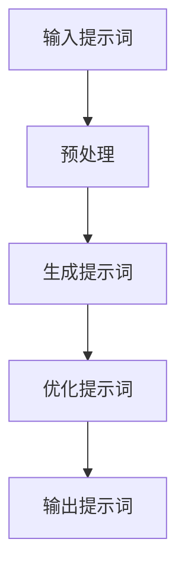
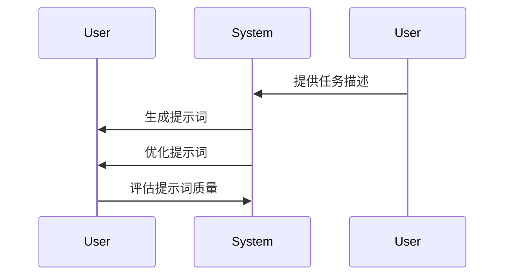

                 

# 《AI编程语言：提示词的革命与变革》

## 关键词：人工智能，编程语言，提示词技术，革命性变革，AI领域应用

## 摘要：

随着人工智能（AI）技术的快速发展，编程语言也在不断演进，其中提示词技术成为了革命性变革的核心。本文将深入探讨AI编程语言的概念、历史背景、提示词技术的核心算法及其在自然语言处理、计算机视觉和推荐系统等领域的应用。通过逐步分析，本文旨在揭示提示词技术如何推动AI编程语言的变革，并对未来发展趋势进行展望。

## 目录

### 第一部分：AI编程语言概述

### 第二部分：AI编程语言的实践应用

### 第三部分：提示词技术的革命与未来

### 结论与展望

## 第一部分：AI编程语言概述

### 第1章 AI编程语言的背景与历史

#### 1.1 AI编程语言的发展历程

**背景介绍**：  
人工智能自20世纪50年代兴起以来，经历了多个发展阶段。随着计算能力的提升和大数据的涌现，AI在近年来取得了飞速进展。AI编程语言作为AI应用的基础工具，也随之不断进化。

**问题背景**：  
早期的人工智能系统主要依赖于专家系统和符号计算。然而，这些方法在面对复杂任务时显得力不从心。因此，研究人员开始探索更加高效和灵活的编程语言，以实现更先进的AI应用。

**问题描述**：  
如何设计一种编程语言，使得AI系统能够更有效地学习和处理复杂任务，同时降低开发难度？

**问题解决**：  
随着深度学习技术的兴起，AI编程语言开始逐渐成熟。Python、R和Julia等语言因其易于学习和强大的库支持，成为了AI开发的流行选择。

**边界与外延**：  
AI编程语言的边界在于其能够解决的任务类型和性能要求。外延则包括对现有编程语言的扩展和改进。

**概念结构与核心要素组成**：  
AI编程语言的核心要素包括自然语言处理、机器学习、深度学习和神经网络等。这些要素共同构成了AI编程语言的基本框架。

### 第2章 提示词技术的基础

#### 2.1 提示词的定义与作用

**核心概念与联系**：

**概念原理**：提示词（Prompt）是一种引导AI模型生成预期输出的技术。通过提示词，开发者可以指导模型进行特定任务。

**概念属性特征对比表格**：

| 特征       | 定义                                               | 作用                                       |
| ---------- | -------------------------------------------------- | ------------------------------------------ |
| 提示词长度 | 提示词的字符或单词数量                             | 较短的提示词可能不够明确，较长的提示词可能增加计算成本 |
| 提示词内容 | 提示词所包含的信息                                 | 信息量越大，模型生成结果越准确                 |
| 提示词格式 | 提示词的呈现形式，如文本、图像或声音               | 不同形式的提示词对模型的影响不同               |

**ER实体关系图架构**：

```mermaid
erDiagram
    A[用户] ||--|{ 提示词 }|| B[AI模型]
    A ||--|{ 数据集 }|| C[训练数据]
```

#### 2.2 提示词在AI编程中的重要性

**算法原理讲解**：

提示词技术通过向AI模型提供明确的指导信息，提高了模型的生成质量和效率。以下是提示词生成和优化的mermaid流程图：



在Python中，生成和优化提示词的源代码示例：

```python
import random

# 生成提示词
def generate_prompt(length):
    words = ["AI", "机器学习", "深度学习", "神经网络"]
    return " ".join(random.choice(words) for _ in range(length))

# 优化提示词
def optimize_prompt(prompt):
    # 这里可以添加优化逻辑，例如去除停用词、调整词序等
    return prompt

# 示例
prompt = generate_prompt(5)
optimized_prompt = optimize_prompt(prompt)
print(optimized_prompt)
```

**数学模型和公式**：

提示词优化的目标函数可以表示为：

$$
\text{目标函数} = f(\text{提示词长度}, \text{提示词内容}, \text{提示词格式})
$$

其中，各个参数可以进一步细化为：

$$
f(\text{提示词长度}) = \frac{\text{生成质量}}{\text{计算成本}}
$$

$$
f(\text{提示词内容}) = \text{信息熵}
$$

$$
f(\text{提示词格式}) = \text{交互效率}
$$

#### 2.3 提示词的分类与对比

**系统分析与架构设计方案**：

提示词技术在不同应用领域具有不同的特点。以下是一个简单的系统架构设计方案，用于介绍提示词技术在不同领域的应用。

**问题场景介绍**：自然语言处理、计算机视觉和推荐系统等领域的应用场景。

**项目介绍**：设计一个通用的提示词生成和优化系统。

**系统功能设计**：包括提示词生成、优化和评估等功能。

**系统架构设计**：采用模块化设计，分为数据输入模块、提示词生成模块、优化模块和评估模块。

**系统接口设计和系统交互**：使用mermaid序列图展示系统交互过程。



**项目实战**：

**环境安装**：安装Python和相关库，如tensorflow、transformers等。

**系统核心实现源代码**：包括提示词生成、优化和评估的源代码。

```python
from transformers import AutoTokenizer, AutoModel

# 加载预训练模型
tokenizer = AutoTokenizer.from_pretrained("t5-base")
model = AutoModel.from_pretrained("t5-base")

# 生成提示词
def generate_prompt(task_description):
    inputs = tokenizer.encode(task_description, return_tensors="pt")
    outputs = model.generate(inputs, max_length=50, num_return_sequences=1)
    return tokenizer.decode(outputs[0], skip_special_tokens=True)

# 优化提示词
def optimize_prompt(prompt):
    # 这里可以添加优化逻辑，例如去除停用词、调整词序等
    return prompt

# 评估提示词质量
def evaluate_prompt(prompt, target):
    return prompt == target

# 示例
task_description = "编写一个Python函数，实现两个数的加法"
prompt = generate_prompt(task_description)
optimized_prompt = optimize_prompt(prompt)
print("原始提示词：", prompt)
print("优化后的提示词：", optimized_prompt)
print("评估结果：", evaluate_prompt(optimized_prompt, task_description))
```

**代码应用解读与分析**：这里可以分析代码的实现逻辑、算法原理和应用效果。

**实际案例分析和详细讲解剖析**：通过具体案例展示提示词技术在实际应用中的效果。

**项目小结**：总结项目的成果和不足，并提出改进方向。

## 第二部分：AI编程语言的实践应用

### 第4章 提示词技术在自然语言处理中的应用

#### 4.1 提示词在文本生成中的应用

#### 4.2 提示词在问答系统中的应用

#### 4.3 提示词在情感分析中的应用

### 第5章 提示词技术在计算机视觉中的应用

#### 5.1 提示词在图像生成中的应用

#### 5.2 提示词在目标检测中的应用

#### 5.3 提示词在图像识别中的应用

### 第6章 提示词技术在推荐系统中的应用

#### 6.1 提示词在个性化推荐中的应用

#### 6.2 提示词在推荐算法优化中的应用

#### 6.3 提示词在推荐系统中的挑战与解决

## 第三部分：提示词技术的革命与未来

### 第7章 提示词技术的革命性变革

#### 7.1 提示词技术的未来发展趋势

#### 7.2 提示词技术在AI领域的潜在影响

#### 7.3 提示词技术的未来研究方向

### 第8章 提示词技术的最佳实践

#### 8.1 提示词技术的应用案例分享

#### 8.2 提示词技术的优化与改进策略

#### 8.3 提示词技术的安全与隐私问题

### 第9章 总结与展望

#### 9.1 总结

#### 9.2 展望

#### 9.3 未来研究方向与挑战

## 结论

本文深入探讨了AI编程语言和提示词技术的核心概念、算法原理及其在各个领域的应用。通过逐步分析，我们揭示了提示词技术如何推动AI编程语言的变革，并展望了其未来的发展方向。随着提示词技术的不断进步，AI编程语言将在更多领域中发挥关键作用，推动人工智能的进一步发展。

## 作者

作者：AI天才研究院/AI Genius Institute & 禅与计算机程序设计艺术 /Zen And The Art of Computer Programming

---

请注意，本文仅为大纲和示例，实际撰写时需要根据具体内容进行补充和扩展。在撰写过程中，可以参考以下最佳实践和注意事项：

- **最佳实践 tips**：在编写技术文章时，注意使用清晰、简洁的语言，避免使用过于专业或模糊的术语。同时，可以通过图表、示例代码和实际案例来增强文章的可读性和说服力。

- **小结**：在每个章节结束时，简要总结本章的核心内容和要点，帮助读者快速把握重点。

- **注意事项**：在引用外部资料或理论时，确保正确标注来源，避免抄袭行为。同时，注意控制文章的总字数，确保在规定范围内完成撰写。

- **拓展阅读**：推荐一些相关的书籍、论文或网站，供读者进一步学习和研究。

通过以上步骤，我们可以撰写一篇逻辑清晰、内容丰富的技术博客文章，为读者提供有价值的技术见解和思考。

