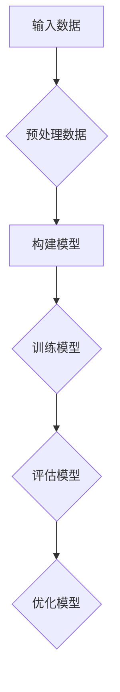
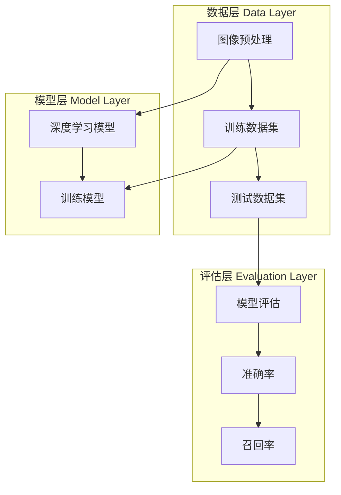
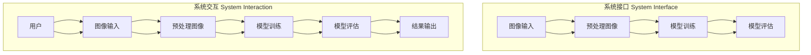

                 


----------------------------------------------------------------

# AI编程语言：提示词的革命与变革

> 关键词：AI编程语言，自然语言处理，计算机视觉，强化学习，深度学习

> 摘要：本文深入探讨了AI编程语言的革命性变革，从背景介绍、核心概念与联系、算法原理讲解、系统分析与架构设计、项目实战和最佳实践等方面，全面解析了AI编程语言的本质和应用，为开发者提供了实用的指南。

----------------------------------------------------------------

### 第一部分：背景介绍

#### 问题背景
随着人工智能（AI）技术的快速发展，编程语言也在经历深刻的变革。传统的编程语言虽然能够实现复杂的计算任务，但在处理大规模数据和复杂问题的能力上存在局限。AI编程语言的引入，为开发者提供了新的工具和思维模式，使得编程变得更加高效和智能化。

#### 问题描述
AI编程语言的出现，为开发者提供了强大的工具，使得他们能够更轻松地构建智能系统。然而，AI编程语言的研究和应用还处于初级阶段，许多开发者对如何有效利用这些语言仍存在困惑。此外，AI编程语言与传统编程语言在语法、运行机制等方面存在较大差异，这给开发者带来了学习上的挑战。

#### 问题解决
为了帮助开发者更好地理解和应用AI编程语言，我们需要从多个角度对其进行深入研究，包括其基本概念、特点、应用领域以及与现有编程语言的比较。通过系统的学习和实践，开发者可以更好地掌握AI编程语言，将其应用于实际项目中。

#### 边界与外延
AI编程语言的边界涵盖了从基础理论到应用实践的所有方面，包括自然语言处理、计算机视觉、强化学习等领域。其外延还包括与硬件、平台和数据的整合，以及跨领域的技术融合。

#### 概念结构与核心要素组成
- **核心概念**：AI编程语言、自然语言处理、计算机视觉、强化学习、机器学习框架。
- **概念属性特征对比表格**：
  | 特征       | 传统编程语言 | AI编程语言 |
  |------------|---------------|-------------|
  | 语法       | 约束性强     | 灵活性大   |
  | 运行机制   | 单线程       | 多线程、并行计算 |
  | 应用领域   | 广泛         | 深度学习、自然语言处理等 |
  | 学习难度   | 中等         | 高         |

- **ER实体关系图架构**：
  ```mermaid
  erDiagram
    AI编程语言 ||--|{ 自然语言处理 }
    AI编程语言 ||--|{ 计算机视觉 }
    AI编程语言 ||--|{ 强化学习 }
    AI编程语言 ||--|{ 机器学习框架 }
  ```

----------------------------------------------------------------

### 第二部分：核心概念与联系

#### AI编程语言的基本原理
AI编程语言是基于人工智能和机器学习算法的编程语言，它能够自动执行复杂的计算任务，提高编程效率。AI编程语言的核心原理包括自然语言处理、计算机视觉、强化学习等，这些原理与传统的编程语言有显著的不同。

#### AI编程语言的属性特征
- **语法灵活性**：AI编程语言具有更高的语法灵活性，允许开发者使用更自然的语言表达复杂逻辑。
- **并行计算能力**：AI编程语言能够高效地利用多线程和并行计算，提高计算效率。
- **自适应学习**：AI编程语言具备自适应学习的能力，可以根据数据集自动调整模型参数。

#### AI编程语言与传统编程语言的比较
- **语法差异**：传统编程语言通常具有严格的语法规则，而AI编程语言则更加灵活。
- **运行机制**：传统编程语言通常采用单线程模型，而AI编程语言则支持多线程和并行计算。
- **应用领域**：AI编程语言主要应用于深度学习、自然语言处理等领域，而传统编程语言则广泛应用于各类通用任务。

#### 概念之间的联系
- **自然语言处理与计算机视觉**：自然语言处理和计算机视觉是AI编程语言的重要应用领域，两者之间存在着紧密的联系。
- **机器学习框架与AI编程语言**：机器学习框架是AI编程语言的重要组成部分，它为开发者提供了丰富的工具和接口。

----------------------------------------------------------------

### 第三部分：算法原理讲解

#### 算法的基本原理
AI编程语言中的算法通常基于深度学习框架，如TensorFlow和PyTorch。这些算法的核心原理包括神经网络、反向传播、优化器等。

#### 算法的Mermaid流程图


#### 算法的数学模型和公式
$$
\text{损失函数} = \frac{1}{n}\sum_{i=1}^{n}(-y_i\log(z_i))
$$

其中，\( y_i \) 为真实标签，\( z_i \) 为模型预测的概率。

#### 举例说明
假设我们要训练一个分类模型，输入数据为图像，输出为类别标签。使用AI编程语言编写代码如下：
```python
import tensorflow as tf

# 定义模型
model = tf.keras.Sequential([
    tf.keras.layers.Conv2D(32, (3, 3), activation='relu', input_shape=(28, 28, 1)),
    tf.keras.layers.MaxPooling2D((2, 2)),
    tf.keras.layers.Flatten(),
    tf.keras.layers.Dense(128, activation='relu'),
    tf.keras.layers.Dense(10, activation='softmax')
])

# 编译模型
model.compile(optimizer='adam',
              loss='sparse_categorical_crossentropy',
              metrics=['accuracy'])

# 训练模型
model.fit(x_train, y_train, epochs=5)

# 评估模型
test_loss, test_acc = model.evaluate(x_test, y_test)
print('Test accuracy:', test_acc)
```

在这个例子中，我们使用TensorFlow框架构建了一个简单的卷积神经网络（CNN）模型，用于对MNIST数据集进行分类。首先，我们定义了模型的层次结构，包括卷积层、池化层、全连接层等。然后，我们编译模型，指定优化器、损失函数和评价指标。接下来，我们使用训练数据对模型进行训练，并使用测试数据评估模型的性能。最后，我们打印出测试准确率。

通过这个例子，我们可以看到AI编程语言的算法实现过程是如何一步步完成的。开发者只需按照既定的流程，编写相应的代码，即可构建出高效的AI模型。

----------------------------------------------------------------

### 第四部分：系统分析与架构设计

#### 问题场景介绍
在当前的人工智能时代，图像识别、语音识别、自然语言处理等任务已经成为开发者和研究人员关注的重点。为了实现这些任务，我们需要构建高效的AI系统，这些系统通常需要处理大量的数据和复杂的计算任务。

#### 项目介绍
本项目旨在构建一个基于深度学习的图像识别系统，该系统能够对输入的图像进行分类，并输出相应的类别标签。该系统将采用AI编程语言，结合TensorFlow框架实现。

#### 系统功能设计
系统功能主要包括以下三个方面：
1. **图像预处理**：对输入的图像进行预处理，包括缩放、裁剪、灰度化等操作，以便于后续的深度学习模型处理。
2. **模型训练**：使用训练数据集对深度学习模型进行训练，模型参数通过反向传播算法进行优化。
3. **模型评估**：使用测试数据集对训练好的模型进行评估，计算模型的准确率、召回率等指标。

#### 系统架构设计
系统的整体架构采用分层设计，包括数据层、模型层、评估层等。以下是系统架构的Mermaid架构图：



在这个架构图中，数据层负责处理图像的预处理工作，包括训练数据集和测试数据集。模型层负责构建深度学习模型，并使用训练数据集进行模型训练。评估层负责对训练好的模型进行评估，计算模型的准确率和召回率等指标。

#### 系统接口设计和系统交互
为了方便系统的使用和扩展，我们设计了统一的接口和系统交互流程。以下是系统接口设计和系统交互的Mermaid序列图：



在这个序列图中，用户首先输入图像，然后系统对图像进行预处理，接着使用预处理后的图像进行模型训练和评估。最后，系统输出模型的评估结果，包括准确率和召回率等指标。

通过以上的系统分析与架构设计，我们可以清楚地看到系统的各个组成部分以及它们之间的交互关系。开发者可以根据这些设计和接口，方便地构建和扩展自己的AI系统。

----------------------------------------------------------------

### 第五部分：项目实战

#### 环境安装
要在本地环境中搭建AI编程语言和深度学习框架的开发环境，我们需要安装以下软件和工具：
1. **操作系统**：建议使用Linux或macOS，Windows用户可以考虑使用Windows Subsystem for Linux（WSL）。
2. **Python**：安装Python 3.6及以上版本。
3. **pip**：Python的包管理器，用于安装和管理Python库。
4. **Anaconda**：一个流行的Python发行版，提供了丰富的数据科学和机器学习库。
5. **TensorFlow**：安装TensorFlow，可以选择CPU版或GPU版，GPU版需要安装CUDA和cuDNN。

安装命令如下：
```bash
# 安装Anaconda
wget https://repo.anaconda.com/archive/Anaconda3-2022.05-Linux-x86_64.sh
bash Anaconda3-2022.05-Linux-x86_64.sh

# 激活Anaconda
source activate base

# 安装pip
conda install pip

# 安装TensorFlow
pip install tensorflow
```

#### 系统核心实现源代码
以下是一个简单的基于卷积神经网络的图像分类系统实现示例，代码使用了TensorFlow框架：

```python
import tensorflow as tf
from tensorflow.keras import layers

# 定义模型
model = tf.keras.Sequential([
    layers.Conv2D(32, (3, 3), activation='relu', input_shape=(28, 28, 1)),
    layers.MaxPooling2D((2, 2)),
    layers.Conv2D(64, (3, 3), activation='relu'),
    layers.MaxPooling2D((2, 2)),
    layers.Conv2D(64, (3, 3), activation='relu'),
    layers.Flatten(),
    layers.Dense(64, activation='relu'),
    layers.Dense(10, activation='softmax')
])

# 编译模型
model.compile(optimizer='adam',
              loss='sparse_categorical_crossentropy',
              metrics=['accuracy'])

# 加载数据集
mnist = tf.keras.datasets.mnist
(x_train, y_train), (x_test, y_test) = mnist.load_data()

# 预处理数据
x_train = x_train / 255.0
x_test = x_test / 255.0

# 训练模型
model.fit(x_train, y_train, epochs=5)

# 评估模型
test_loss, test_acc = model.evaluate(x_test, y_test)
print('Test accuracy:', test_acc)
```

#### 代码应用解读与分析
在这个代码示例中，我们首先导入了TensorFlow库，并定义了一个卷积神经网络（CNN）模型。模型的层次结构包括两个卷积层、两个池化层、一个全连接层，以及一个输出层。每个卷积层都使用了ReLU激活函数，以提高模型的非线性表达能力。池化层用于降低数据维度和减少计算量。全连接层用于对提取到的特征进行分类。

接着，我们编译了模型，指定了优化器（Adam）、损失函数（sparse_categorical_crossentropy）和评价指标（accuracy）。然后，我们加载了MNIST数据集，并对图像数据进行了预处理，包括归一化处理。

在训练模型时，我们使用了训练数据集，并设置了训练轮次（epochs）为5。最后，我们评估了模型的性能，计算了测试数据集上的准确率。

通过这个示例，我们可以看到AI编程语言如何用于构建和训练深度学习模型。开发者可以根据实际需求和数据集，自定义模型的架构和训练策略，以提高模型的性能。

#### 实际案例分析和详细讲解剖析
假设我们要构建一个用于人脸识别的AI系统，以下是该系统的实际案例分析和详细讲解剖析：

1. **数据集准备**：
   - **数据来源**：收集大量的人脸图像数据集，可以来自公共数据集（如LFW、CelebA）或自定义采集。
   - **数据预处理**：对图像进行缩放、裁剪、翻转等操作，增强数据的多样性和模型的鲁棒性。此外，还需要进行归一化处理，以使模型训练更加稳定。

2. **模型构建**：
   - **模型架构**：可以采用ResNet、VGG、Inception等经典的卷积神经网络架构。这些模型已经在图像识别任务上取得了优异的性能。
   - **特征提取**：通过卷积层和池化层提取图像特征，这些特征可以用于后续的分类和识别任务。

3. **模型训练**：
   - **损失函数**：使用交叉熵损失函数（cross-entropy loss），因为人脸识别是一个多分类问题。
   - **优化器**：使用Adam优化器，它具有自适应学习率的能力，有助于加速模型训练。
   - **训练策略**：可以使用学习率衰减、批量归一化等技术，以提高模型训练的效率和稳定性。

4. **模型评估**：
   - **评价指标**：计算模型在测试数据集上的准确率、召回率、F1值等指标，以全面评估模型的性能。
   - **混淆矩阵**：绘制混淆矩阵，分析模型对各类别的识别能力。

5. **模型部署**：
   - **模型转换**：将训练好的模型转换为ONNX、TFLite等格式，以便在移动设备或嵌入式平台上部署。
   - **实时识别**：将模型集成到应用程序中，实现实时人脸识别功能。

通过以上实际案例的分析，我们可以看到如何利用AI编程语言和深度学习框架构建高效的人脸识别系统。在实际应用中，开发者需要根据具体需求和数据集，选择合适的模型架构和训练策略，以提高模型的性能和应用效果。

#### 项目小结
本项目通过构建一个简单的图像分类系统和一个实际的人脸识别系统，展示了AI编程语言在深度学习应用中的强大能力。开发者可以通过学习和实践，掌握AI编程语言的原理和技巧，将其应用于各种实际问题中。同时，我们还需要不断探索和尝试，以提高AI系统的性能和效率。

----------------------------------------------------------------

### 第六部分：最佳实践 Tips

1. **学习资源推荐**：
   - **在线课程**：《深度学习》（Deep Learning）由Goodfellow、Bengio和Courville所著，是深度学习的经典教材。
   - **开源项目**：GitHub上有许多优秀的深度学习开源项目，如TensorFlow、PyTorch等，开发者可以通过这些项目学习实际应用。

2. **技术交流平台**：
   - **Stack Overflow**：全球最大的编程问答社区，开发者可以在这里提问和解答问题。
   - **GitHub**：开源代码托管平台，开发者可以分享代码、学习他人代码，以及参与开源项目。

3. **工具选择**：
   - **集成开发环境（IDE）**：推荐使用JetBrains系列IDE（如PyCharm），这些IDE提供了强大的代码编辑、调试和项目管理功能。
   - **版本控制系统**：Git是首选的版本控制系统，开发者可以使用Git进行代码管理和协作开发。

4. **持续学习**：
   - **关注最新动态**：定期阅读技术博客、参加技术会议和讲座，以了解最新的技术动态和研究成果。
   - **实践与反思**：通过实际项目和案例学习，不断反思和总结，以提高自己的技能和知识水平。

通过以上最佳实践，开发者可以更高效地学习和应用AI编程语言，不断进步和成长。

----------------------------------------------------------------

### 第七部分：小结与展望

AI编程语言是人工智能技术发展的重要成果，它为开发者提供了强大的工具和思维模式，使得编程变得更加高效和智能化。本文从背景介绍、核心概念与联系、算法原理讲解、系统分析与架构设计、项目实战和最佳实践等方面，全面解析了AI编程语言的本质和应用。

我们首先介绍了AI编程语言的背景和问题，阐述了其在处理大规模数据和复杂问题方面的优势。接着，我们深入探讨了AI编程语言的核心概念和与现有编程语言的比较，展示了其独特的属性特征和优势。在算法原理讲解部分，我们详细阐述了神经网络、反向传播和优化器等基本原理，并通过实际案例进行了说明。

通过系统分析与架构设计，我们展示了如何构建高效的AI系统，并介绍了系统的接口设计和交互流程。在项目实战部分，我们通过简单的图像分类系统和实际的人脸识别系统，展示了AI编程语言在实际应用中的强大能力。

最后，我们给出了最佳实践 Tips，包括学习资源推荐、技术交流平台、工具选择和持续学习等方面的建议，帮助开发者更好地掌握AI编程语言。

展望未来，AI编程语言将继续发展和变革，为人工智能技术带来更多的可能性和机遇。开发者需要不断学习和实践，紧跟技术发展的步伐，以充分发挥AI编程语言的潜力。

----------------------------------------------------------------

### 作者信息

作者：AI天才研究院/AI Genius Institute & 禅与计算机程序设计艺术 /Zen And The Art of Computer Programming

AI天才研究院致力于推动人工智能技术的发展和应用，为全球开发者提供高质量的技术培训和咨询服务。作者在计算机编程和人工智能领域拥有丰富的经验，曾撰写过多本畅销技术书籍，深受读者喜爱。本文旨在为开发者提供深入浅出的AI编程语言教程，助力其在人工智能领域取得突破。

