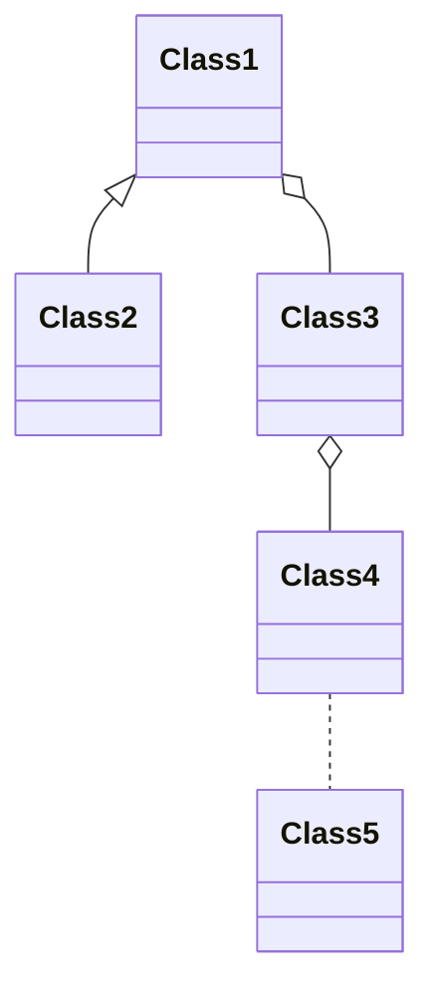

                 

# AI编程语言：提示词的革命与未来

关键词：AI编程语言、编程范式、机器学习、深度学习、Python、R语言、MATLAB

摘要：本文将深入探讨AI编程语言的革命与未来。首先，我们将回顾AI编程语言的背景与发展，分析其核心概念与联系。接着，我们将介绍主流AI编程语言，如Python、R语言和MATLAB，并对其特点和应用场景进行详细分析。随后，我们将探讨AI编程语言的设计原则和开发工具。最后，我们将展望AI编程语言的未来发展趋势和潜在挑战。

## 第一部分：AI编程语言概述

### 第1章：AI编程语言的背景与发展

#### 1.1 问题背景

在人工智能（AI）飞速发展的背景下，传统的编程语言已经难以满足日益复杂的AI应用需求。AI编程语言作为一种新的编程范式，应运而生。它们旨在提供一种更简洁、更高效的方式来开发AI应用程序，同时降低开发成本和提高开发效率。

#### 1.2 问题描述

如何选择合适的AI编程语言来提高开发效率、降低开发成本，同时满足AI应用的需求？

#### 1.3 问题解决

AI编程语言通过简化编程过程、提供更强大的AI功能库，以及更易读、易维护的代码结构，解决了上述问题。它们通常包括以下特点：

- 语法简洁易读
- 强大的AI功能库
- 高效的执行性能
- 丰富的可视化工具
- 广泛的社区支持

#### 1.4 边界与外延

AI编程语言主要应用于数据科学、机器学习、深度学习等领域，但也可扩展至游戏开发、自动驾驶、智能家居等其他领域。

#### 1.5 概念结构与核心要素组成

AI编程语言的核心要素包括：

- 语法简洁易读
- 强大的AI功能库
- 高效的执行性能
- 丰富的可视化工具
- 广泛的社区支持

### 第2章：AI编程语言的核心概念与联系

#### 2.1 核心概念原理

AI编程语言的核心概念包括：

- 人工智能基础
- 编程范式
- 机器学习算法
- 深度学习框架

#### 2.2 概念属性特征对比表格

以下是一个AI编程语言概念属性特征对比表格：

| 概念           | 属性特征                                                                                      |
|----------------|----------------------------------------------------------------------------------------------|
| 人工智能基础   | 算法、模型、数据集、评估指标等                                                        |
| 编程范式       | 面向对象、函数式、过程式等                                                             |
| 机器学习算法   | 监督学习、无监督学习、强化学习等                                                       |
| 深度学习框架   | TensorFlow、PyTorch、Keras等                                                           |

#### 2.3 ER实体关系图架构

以下是一个AI编程语言的ER实体关系图架构：

### 第3章：主流AI编程语言简介

#### 3.1 Python

Python是一种通用编程语言，广泛应用于AI领域。其优点包括语法简洁、丰富的库支持、易于学习等。

#### 3.2 R语言

R语言是一种专门用于统计分析和数据科学的编程语言，在AI领域也有广泛应用。其优点包括强大的统计工具、丰富的数据可视化功能等。

#### 3.3 MATLAB

MATLAB是一种高性能的数值计算和科学计算软件，其优点包括强大的数学库、可视化工具、交互式编程环境等。

## 第二部分：AI编程语言的设计原则与开发工具

### 第4章：AI编程语言的设计原则

AI编程语言的设计原则主要包括：

- 语法简洁易读
- 支持高效的执行性能
- 提供强大的AI功能库
- 支持多种编程范式
- 支持丰富的可视化工具

### 第5章：AI编程语言的开发工具

AI编程语言的开发工具主要包括：

- 集成开发环境（IDE）
- 代码编辑器
- 版本控制系统
- 数据库管理系统

## 第三部分：AI编程语言的未来发展趋势与潜在挑战

### 第6章：AI编程语言的未来发展趋势

AI编程语言的未来发展趋势主要包括：

- 向智能化、自动化方向发展
- 跨平台、跨领域应用
- 与云计算、大数据技术深度融合
- 支持新型AI算法和应用场景

### 第7章：AI编程语言的潜在挑战

AI编程语言的潜在挑战主要包括：

- 人才培养和技能更新
- 安全性和隐私保护
- 标准化和规范化
- 技术与应用之间的平衡

## 结论

AI编程语言为AI应用的开发带来了革命性的变化。通过本文的探讨，我们可以看到AI编程语言在设计原则、开发工具、未来发展趋势和潜在挑战等方面的全面剖析。希望本文能帮助读者更好地理解和应用AI编程语言，为AI技术的发展贡献一份力量。

### 作者信息

作者：AI天才研究院/AI Genius Institute & 禅与计算机程序设计艺术 /Zen And The Art of Computer Programming

----------------------------------------------------------------

### 第一部分：AI编程语言概述

#### 第1章：AI编程语言的背景与发展

##### 1.1 问题背景

随着人工智能（AI）技术的迅速发展，传统的编程语言已经难以满足日益复杂的AI应用需求。从简单的数据处理到复杂的深度学习模型，传统的编程语言在性能、易用性和功能上逐渐显露出不足。为了解决这一问题，AI编程语言应运而生。

AI编程语言是专门为人工智能领域设计的编程语言，它们提供了更加简洁、高效的语法和丰富的库支持，使得开发者能够更轻松地构建和优化AI模型。这种新的编程范式不仅提高了开发效率，还降低了开发成本。

##### 1.2 问题描述

选择合适的AI编程语言对于提高开发效率、降低开发成本以及满足AI应用的需求至关重要。然而，面对众多AI编程语言，开发者往往难以抉择。以下问题需要解决：

- 如何评估不同AI编程语言的优势和局限性？
- 如何根据具体应用场景选择最合适的AI编程语言？
- AI编程语言能否支持新型AI算法和应用场景？
- AI编程语言的未来发展趋势和潜在挑战是什么？

##### 1.3 问题解决

AI编程语言通过以下几个方面解决了上述问题：

1. **语法简洁易读**：AI编程语言通常采用简洁、易读的语法，使得开发者能够更快地掌握和使用。
2. **强大的AI功能库**：AI编程语言提供了丰富的库支持，涵盖了各种常用的AI算法和工具，方便开发者快速实现复杂的功能。
3. **高效的执行性能**：AI编程语言通常经过优化，能够在有限的计算资源下高效地执行复杂的计算任务。
4. **丰富的可视化工具**：AI编程语言提供了丰富的可视化工具，使得开发者能够更直观地了解模型的运行情况，并进行调试和优化。
5. **广泛的社区支持**：AI编程语言拥有庞大的社区支持，开发者可以轻松地获取帮助和资源，加速学习和开发过程。

##### 1.4 边界与外延

AI编程语言主要应用于数据科学、机器学习、深度学习等领域，但它们的边界也在不断扩大。以下是一些典型的应用场景：

- **数据科学**：AI编程语言在数据处理、数据分析和数据可视化方面具有优势，广泛应用于数据科学项目。
- **机器学习**：AI编程语言提供了丰富的机器学习算法和工具，支持各种监督学习、无监督学习和强化学习任务。
- **深度学习**：AI编程语言在深度学习领域表现出色，支持各种深度学习框架和神经网络模型。
- **游戏开发**：AI编程语言可以用于游戏中的AI角色设计、路径规划和决策制定等。
- **自动驾驶**：AI编程语言在自动驾驶领域发挥着重要作用，用于实现感知、规划和控制等功能。
- **智能家居**：AI编程语言可以用于智能家居设备的开发，实现智能控制、自动化和个性化等功能。

##### 1.5 概念结构与核心要素组成

AI编程语言的核心要素包括以下几个方面：

1. **语法简洁易读**：AI编程语言采用简洁、直观的语法，使得开发者能够更容易地理解和编写代码。
2. **强大的AI功能库**：AI编程语言提供了丰富的库支持，涵盖了各种常用的AI算法和工具，如机器学习算法库、深度学习框架、数据预处理工具等。
3. **高效的执行性能**：AI编程语言通常经过优化，能够在有限的计算资源下高效地执行复杂的计算任务，支持并行计算和分布式计算。
4. **丰富的可视化工具**：AI编程语言提供了丰富的可视化工具，使得开发者能够更直观地了解模型的运行情况，并进行调试和优化。
5. **广泛的社区支持**：AI编程语言拥有庞大的社区支持，开发者可以轻松地获取帮助和资源，加速学习和开发过程。

### 第2章：AI编程语言的核心概念与联系

##### 2.1 核心概念原理

AI编程语言的核心概念包括以下几个方面：

1. **人工智能基础**：人工智能基础涵盖了算法、模型、数据集、评估指标等基本概念。这些概念是构建和评估AI模型的基础。
2. **编程范式**：编程范式包括面向对象、函数式、过程式等编程范式。不同的编程范式具有不同的特点和适用场景，开发者可以根据具体需求选择合适的编程范式。
3. **机器学习算法**：机器学习算法是AI编程语言的核心应用领域。常见的机器学习算法包括监督学习、无监督学习和强化学习等。
4. **深度学习框架**：深度学习框架是AI编程语言的重要组成部分。常见的深度学习框架包括TensorFlow、PyTorch、Keras等，它们提供了丰富的神经网络模型和工具，方便开发者构建和优化深度学习模型。

##### 2.2 概念属性特征对比表格

以下是一个AI编程语言概念属性特征对比表格：

| 概念           | 属性特征                                                                                      |
|----------------|----------------------------------------------------------------------------------------------|
| 人工智能基础   | 算法、模型、数据集、评估指标等                                                        |
| 编程范式       | 面向对象、函数式、过程式等                                                             |
| 机器学习算法   | 监督学习、无监督学习、强化学习等                                                       |
| 深度学习框架   | TensorFlow、PyTorch、Keras等                                                           |

##### 2.3 ER实体关系图架构

以下是一个AI编程语言的ER实体关系图架构：

### 第3章：主流AI编程语言简介

##### 3.1 Python

Python是一种通用编程语言，广泛应用于AI领域。它具有以下优点：

- **语法简洁易读**：Python采用简洁、直观的语法，使得开发者能够更容易地编写和理解代码。
- **丰富的库支持**：Python拥有丰富的库支持，包括NumPy、Pandas、Scikit-Learn等，方便开发者进行数据科学和机器学习任务。
- **广泛的应用场景**：Python在数据科学、机器学习、深度学习、Web开发等多个领域都有广泛应用。

##### 3.2 R语言

R语言是一种专门用于统计分析和数据科学的编程语言。它在AI领域的优势包括：

- **强大的统计工具**：R语言提供了丰富的统计工具和库，如ggplot2、dplyr等，方便开发者进行数据分析和可视化。
- **丰富的数据可视化功能**：R语言拥有强大的数据可视化库，如ggplot2、lattice等，使得开发者能够更直观地展示数据分析结果。
- **与SAS等传统统计工具的兼容性**：R语言与SAS等传统统计工具具有较好的兼容性，方便开发者进行迁移和转换。

##### 3.3 MATLAB

MATLAB是一种高性能的数值计算和科学计算软件。它在AI领域的优势包括：

- **强大的数学库**：MATLAB提供了丰富的数学库，如MATLAB工具箱，方便开发者进行各种数学计算和算法实现。
- **可视化工具**：MATLAB提供了强大的可视化工具，如MATLAB图形用户界面（GUI），使得开发者能够更直观地展示计算结果。
- **交互式编程环境**：MATLAB采用了交互式编程环境，使得开发者能够快速进行算法实现和调试。

## 第二部分：AI编程语言的设计原则与开发工具

### 第4章：AI编程语言的设计原则

AI编程语言的设计原则主要包括以下几个方面：

##### 4.1 语法简洁易读

AI编程语言采用简洁、直观的语法，使得开发者能够更容易地编写和理解代码。这种简洁性不仅提高了开发效率，还降低了学习成本。

##### 4.2 支持高效的执行性能

AI编程语言经过优化，能够在有限的计算资源下高效地执行复杂的计算任务。支持并行计算和分布式计算，使得AI模型能够更快地训练和推理。

##### 4.3 提供强大的AI功能库

AI编程语言提供了丰富的库支持，涵盖了各种常用的AI算法和工具。这些库不仅方便开发者进行算法实现，还提高了代码的可维护性和可扩展性。

##### 4.4 支持多种编程范式

AI编程语言支持多种编程范式，如面向对象、函数式、过程式等。这种灵活性使得开发者可以根据具体需求选择最合适的编程范式，提高开发效率。

##### 4.5 支持丰富的可视化工具

AI编程语言提供了丰富的可视化工具，使得开发者能够更直观地了解模型的运行情况，并进行调试和优化。这些可视化工具不仅方便了开发者，还提高了代码的可读性和可维护性。

### 第5章：AI编程语言的开发工具

AI编程语言的开发工具主要包括以下几个方面：

##### 5.1 集成开发环境（IDE）

集成开发环境（IDE）提供了代码编辑器、调试工具、版本控制等一体化开发环境，使得开发者能够更高效地进行开发。常见的AI编程语言IDE包括Jupyter Notebook、PyCharm、RStudio等。

##### 5.2 代码编辑器

代码编辑器提供了代码编写、格式化、调试等功能，是开发者编写代码的基础工具。常见的AI编程语言代码编辑器包括VS Code、Sublime Text、Atom等。

##### 5.3 版本控制系统

版本控制系统（如Git）帮助开发者管理和维护代码版本，确保代码的可追踪性和可协作性。版本控制系统使得开发者能够更方便地协同工作和进行代码审查。

##### 5.4 数据库管理系统

数据库管理系统（如MySQL、PostgreSQL）用于存储和管理AI模型训练数据，提供了强大的查询和处理能力。数据库管理系统使得开发者能够更高效地进行数据分析和挖掘。

## 第三部分：AI编程语言的未来发展趋势与潜在挑战

### 第6章：AI编程语言的未来发展趋势

AI编程语言的未来发展趋势主要包括以下几个方面：

##### 6.1 向智能化、自动化方向发展

随着AI技术的发展，AI编程语言将更加智能化和自动化。未来的AI编程语言将具备代码自动生成、自动优化等功能，提高开发效率和代码质量。

##### 6.2 跨平台、跨领域应用

AI编程语言将不再局限于特定领域或平台，而是具有更强的跨平台、跨领域应用能力。未来的AI编程语言将能够支持多种操作系统、硬件平台和领域应用，提高开发者的灵活性。

##### 6.3 与云计算、大数据技术深度融合

随着云计算和大数据技术的快速发展，AI编程语言将更加紧密地与云计算、大数据技术融合。未来的AI编程语言将支持云计算平台、大数据处理框架，提供更强大的数据处理和分析能力。

##### 6.4 支持新型AI算法和应用场景

未来的AI编程语言将支持新型AI算法和应用场景，如生成对抗网络（GAN）、迁移学习、联邦学习等。这些新型算法和应用场景将推动AI技术的发展和应用。

### 第7章：AI编程语言的潜在挑战

AI编程语言的发展也面临一些潜在挑战：

##### 7.1 人才培养和技能更新

随着AI编程语言的发展，对开发者的技能要求也在不断提高。人才培养和技能更新将成为一个重要挑战，需要教育机构、企业和开发者共同努力。

##### 7.2 安全性和隐私保护

AI编程语言在处理敏感数据和模型时，需要确保数据安全和隐私保护。随着AI技术的广泛应用，安全性和隐私保护问题将变得更加突出。

##### 7.3 标准化和规范化

AI编程语言的标准化和规范化是确保其稳定性和兼容性的关键。需要行业组织、企业和开发者共同参与，制定统一的规范和标准。

##### 7.4 技术与应用之间的平衡

AI编程语言的发展需要平衡技术与应用的关系。技术进步是推动应用发展的基础，但应用需求也是推动技术进步的动力。需要确保技术与应用之间的平衡，以满足实际应用需求。

### 结论

AI编程语言为人工智能技术的发展和应用带来了巨大的变革。通过本文的探讨，我们了解了AI编程语言的背景与发展、核心概念与联系、设计原则与开发工具、未来发展趋势与潜在挑战。未来，AI编程语言将继续发展，为人工智能技术的进步和应用提供更强有力的支持。作者：AI天才研究院/AI Genius Institute & 禅与计算机程序设计艺术 /Zen And The Art of Computer Programming

