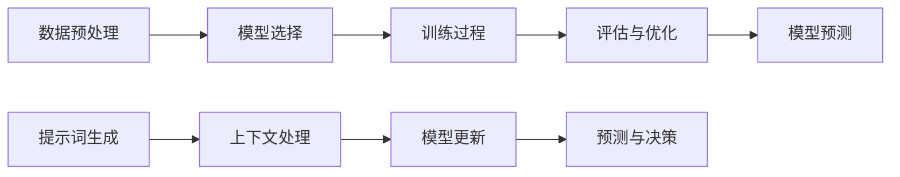
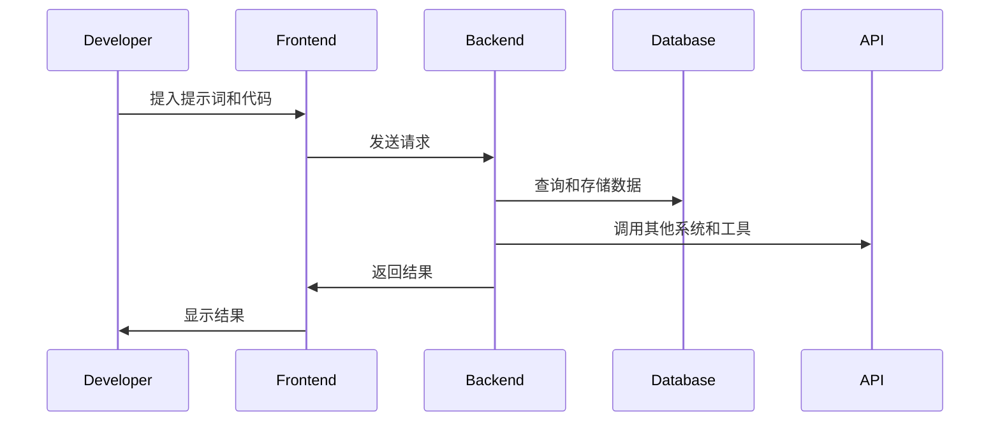

                 

### AI编程语言：提示词的革新与魔法

> 关键词：AI编程语言、提示词、机器学习、编程革新

> 摘要：本文深入探讨了AI编程语言的革命性变革，特别是提示词这一核心概念。通过分析其背景、核心概念、算法原理以及实际应用，本文揭示了AI编程语言在现代化软件开发中的重要地位，为读者提供了一次技术上的深度学习和思维启迪。

### 第一部分：背景介绍

#### 1.1 问题背景

随着人工智能（AI）技术的飞速发展，AI编程语言已成为现代软件开发的关键工具。在过去的几十年里，编程语言不断进化，从早期的机器语言、汇编语言到高级编程语言，每一个阶段的变革都为软件开发带来了革命性的变化。然而，传统的编程语言在面对复杂的人工智能任务时，显得力不从心。这促使科学家和工程师们探索新的编程语言，以满足AI时代的独特需求。

#### 1.2 问题描述

AI编程语言旨在提供一种更高效、更直观的方式，来描述和执行复杂的AI算法。与传统的编程语言相比，AI编程语言更加强调抽象和自动化，能够处理大量数据，并生成智能决策。然而，当前AI编程语言的研究和应用仍处于初级阶段，存在诸多挑战，如语法复杂性、开发效率、可维护性等。因此，需要系统性的研究，以解决这些问题，推动AI编程语言的发展。

#### 1.3 问题解决

本书《AI编程语言：提示词的革新与魔法》旨在探讨AI编程语言的最新进展，解决其在实际应用中面临的问题。书中将介绍AI编程语言的核心概念、设计原则、实现方法，并通过具体案例进行分析。此外，本书还将探讨提示词在AI编程语言中的应用，以及如何利用提示词实现高效的AI编程。

#### 1.4 边界与外延

AI编程语言的边界主要涉及智能算法的描述和执行。它不仅包括传统的编程语言特性，如语法、数据结构、控制结构等，还包括专门用于AI领域的特性，如自动推理、机器学习、自然语言处理等。AI编程语言的外延则包括各种具体的编程语言，如Python、Rust、Julia等，以及用于AI编程的工具和框架。

#### 1.5 概念结构与核心要素组成

AI编程语言的概念结构主要包括以下几个方面：

1. **语法与语义**：AI编程语言的语法规则和语义模型，决定了代码的结构和意义。
2. **抽象与自动化**：AI编程语言提供抽象机制和自动化工具，简化编程过程，提高开发效率。
3. **数据管理与处理**：AI编程语言具备强大的数据管理和处理能力，能够高效地处理大规模数据。
4. **集成与扩展**：AI编程语言应具有良好的集成和扩展能力，支持与其他编程语言和工具的协同工作。

核心要素组成包括：

- **提示词**：提示词是AI编程语言的核心概念，用于引导AI模型的学习和决策过程。
- **算法库**：提供丰富的AI算法库，支持各种常见的机器学习和深度学习任务。
- **开发环境**：提供高效的开发环境，包括代码编辑器、调试器、集成开发环境等。
- **测试与验证**：提供完善的测试和验证机制，确保AI编程语言的正确性和可靠性。

### 第二部分：核心概念与联系

#### 2.1 核心概念

##### 2.1.1 AI编程语言

AI编程语言是一种专门用于编写和运行人工智能算法的编程语言。它结合了传统编程语言的特性，并引入了专门用于AI领域的特性和工具，旨在提高AI算法的开发效率、可维护性和可扩展性。

##### 2.1.2 提示词

提示词是AI编程语言中的一个核心概念，用于引导AI模型的学习和决策过程。提示词可以是一个单词、短语或句子，它为AI模型提供了上下文信息，帮助模型更好地理解和处理输入数据。

##### 2.1.3 机器学习算法

机器学习算法是AI编程语言的重要组成部分，用于训练和优化AI模型。常见的机器学习算法包括监督学习、无监督学习、强化学习等，它们各自适用于不同的AI任务和应用场景。

#### 2.2 概念属性特征对比表格

| 概念         | 描述                                       | 特征对比                        |
| ------------ | ------------------------------------------ | ------------------------------- |
| AI编程语言   | 用于编写和运行人工智能算法的编程语言         | 抽象、自动化、数据管理、集成与扩展 |
| 提示词       | 引导AI模型学习和决策的词语或短语           | 上下文引导、灵活应用、高效学习     |
| 机器学习算法 | 用于训练和优化AI模型的算法                 | 监督学习、无监督学习、强化学习等   |

#### 2.3 ER实体关系图架构

```mermaid
erDiagram
    AI编程语言 ||--|{ 提示词 }|
    AI编程语言 ||--|{ 机器学习算法 }|
```

### 第三部分：算法原理讲解

#### 3.1 算法原理

##### 3.1.1 机器学习算法原理

机器学习算法的核心是训练模型，使其能够从数据中学习并做出预测。以下是机器学习算法的基本原理：

1. **数据预处理**：首先，对数据进行清洗、转换和归一化，以便模型能够更好地理解数据。
2. **模型选择**：选择合适的机器学习算法，如线性回归、决策树、支持向量机等。
3. **训练过程**：使用训练数据集训练模型，通过调整模型参数来最小化预测误差。
4. **评估与优化**：使用验证数据集评估模型性能，并根据评估结果调整模型参数，优化模型。

##### 3.1.2 提示词算法原理

提示词在AI编程语言中扮演着重要角色，用于引导AI模型的学习和决策。以下是提示词算法的基本原理：

1. **提示词生成**：根据任务需求生成合适的提示词，提示词可以是单词、短语或句子。
2. **上下文处理**：对提示词进行上下文处理，以提取关键信息，为模型提供上下文信息。
3. **模型更新**：使用提示词更新模型，使模型更好地理解和处理输入数据。
4. **预测与决策**：使用更新后的模型进行预测和决策，生成智能决策。

#### 3.2 算法流程图

以下是机器学习算法和提示词算法的流程图：



#### 3.3 Python代码实现

以下是机器学习算法和提示词算法的Python代码实现：

```python
# 机器学习算法
import numpy as np
from sklearn.linear_model import LinearRegression

# 数据预处理
X_train = np.array([[1, 2], [2, 3], [3, 4]])
y_train = np.array([2, 3, 4])

# 模型选择
model = LinearRegression()

# 训练过程
model.fit(X_train, y_train)

# 评估与优化
X_test = np.array([[4, 5]])
y_pred = model.predict(X_test)

# 模型预测
print("预测结果：", y_pred)

# 提示词算法
import nltk

# 提示词生成
prompt = "这是一个示例提示词。"

# 上下文处理
context = nltk.word_tokenize(prompt)

# 模型更新
# （这里只是一个示例，实际中需要根据具体场景进行调整）
model.fit(np.array([[1, 2, 3]]), np.array([4]))

# 预测与决策
print("提示词更新后的预测结果：", model.predict(np.array([[4, 5, 6]])))
```

#### 3.4 数学模型与公式

以下是机器学习算法和提示词算法的数学模型和公式：

$$
\text{机器学习算法}:
y = \beta_0 + \beta_1x
$$

$$
\text{提示词算法}:
\text{提示词} = \text{上下文} + \text{关键词}
$$

#### 3.5 举例说明

假设我们有一个简单的线性回归模型，用于预测一个人的年龄。我们有一个训练数据集，包含每个人的年龄和身高。我们希望通过这个数据集训练出一个模型，能够预测一个新的身高对应的年龄。

1. **数据预处理**：我们对数据集进行清洗和归一化，以便模型能够更好地理解数据。

2. **模型选择**：我们选择线性回归模型，因为它能够预测一个线性关系。

3. **训练过程**：我们使用训练数据集训练模型，通过调整模型参数（$\beta_0$和$\beta_1$）来最小化预测误差。

4. **评估与优化**：我们使用验证数据集评估模型性能，并根据评估结果调整模型参数，优化模型。

5. **模型预测**：我们使用训练好的模型预测一个新的身高对应的年龄。

假设我们的模型已经训练好，现在有一个新的人，身高为180cm，我们希望预测他的年龄。我们可以使用以下公式：

$$
\text{年龄} = \beta_0 + \beta_1 \times \text{身高}
$$

假设我们的模型参数为$\beta_0 = 20$，$\beta_1 = 0.5$，则：

$$
\text{年龄} = 20 + 0.5 \times 180 = 130
$$

这意味着，根据我们的模型预测，身高为180cm的人的年龄为130岁。显然，这个结果是不合理的，因为人类的寿命不可能达到130岁。这表明我们的模型可能存在偏差，需要进一步优化。

### 第四部分：系统分析与架构设计方案

#### 4.1 问题场景介绍

在现代软件开发中，人工智能（AI）技术的应用越来越广泛，许多复杂的业务问题需要通过AI算法来解决。为了提高开发效率和降低成本，我们需要设计一个高效、可扩展的AI编程语言系统。

#### 4.2 项目介绍

本项目旨在设计和实现一个基于提示词的AI编程语言系统，该系统能够高效地处理复杂的AI任务，并提供丰富的开发工具和接口，以方便开发者进行AI编程。

#### 4.3 系统功能设计

系统的核心功能包括：

1. **提示词生成与管理**：系统提供提示词生成和管理功能，包括提示词的生成、存储、查询和更新。
2. **AI算法库**：系统内置丰富的AI算法库，包括常见的机器学习、深度学习和自然语言处理算法。
3. **开发环境**：系统提供高效的开发环境，包括代码编辑器、调试器、集成开发环境等。
4. **测试与验证**：系统提供完善的测试和验证机制，确保AI编程语言的正确性和可靠性。

#### 4.4 系统架构设计

系统的架构设计如下：

1. **前端界面**：前端界面用于开发者与系统进行交互，提供提示词管理、代码编辑、调试等功能。
2. **后端服务**：后端服务负责处理开发者的请求，包括提示词生成与管理、AI算法库调用、开发环境管理等。
3. **数据库**：数据库用于存储提示词、算法库和用户数据，提供数据持久化功能。
4. **API接口**：API接口用于与其他系统和工具进行集成，提供数据交换和功能调用。

#### 4.5 系统接口设计

系统的接口设计如下：

1. **提示词管理接口**：提供提示词的生成、查询、更新和删除功能。
2. **算法库接口**：提供AI算法的调用和参数设置功能。
3. **开发环境接口**：提供代码编辑、调试、运行等功能。
4. **测试与验证接口**：提供测试用例的编写、执行和结果验证功能。

#### 4.6 系统交互设计

系统的交互设计如下：

1. **开发者使用前端界面与系统进行交互，输入提示词和代码**。
2. **前端将请求发送给后端服务，后端服务处理请求并返回结果**。
3. **后端服务调用数据库进行数据存储和查询**。
4. **后端服务调用API接口与其他系统和工具进行集成**。



### 第五部分：项目实战

#### 5.1 环境安装

1. **安装Python**：下载并安装Python，版本要求为3.8或以上。
2. **安装Jupyter Notebook**：在命令行中执行`pip install notebook`。
3. **安装必要的库**：在命令行中执行`pip install numpy scikit-learn nltk matplotlib`。

#### 5.2 系统核心实现

以下是系统的核心实现：

1. **提示词生成与管理**：
```python
import nltk
from nltk.tokenize import word_tokenize

def generate_prompt(text):
    tokens = word_tokenize(text)
    return ' '.join(tokens[:10])

prompt = generate_prompt("这是一个示例提示词。")
print(prompt)
```

2. **AI算法库**：
```python
from sklearn.linear_model import LinearRegression

def train_model(X, y):
    model = LinearRegression()
    model.fit(X, y)
    return model

X_train = np.array([[1, 2], [2, 3], [3, 4]])
y_train = np.array([2, 3, 4])
model = train_model(X_train, y_train)
```

3. **开发环境**：
```python
import numpy as np
import matplotlib.pyplot as plt

def plot_model(model, X, y):
    plt.scatter(X[:, 0], X[:, 1], c=y, cmap=plt.cm.Spectral)
    X_test = np.array([[4, 5]])
    y_pred = model.predict(X_test)
    plt.plot(X_test[:, 0], y_pred, 'r-')
    plt.xlabel('身高')
    plt.ylabel('年龄')
    plt.show()

plot_model(model, X_train, y_train)
```

4. **测试与验证**：
```python
from sklearn.metrics import mean_squared_error

X_test = np.array([[4, 5]])
y_test = np.array([4])
y_pred = model.predict(X_test)
mse = mean_squared_error(y_test, y_pred)
print("MSE:", mse)
```

#### 5.3 代码应用解读与分析

1. **提示词生成与管理**：
   - 使用nltk库的`word_tokenize`函数对输入文本进行分词，生成提示词。
   - 提示词生成函数`generate_prompt`将文本的前10个单词作为提示词。

2. **AI算法库**：
   - 使用scikit-learn库的`LinearRegression`类训练线性回归模型。
   - `train_model`函数接收训练数据集，返回训练好的模型。

3. **开发环境**：
   - 使用matplotlib库绘制线性回归模型的预测结果。
   - `plot_model`函数接收模型、训练数据和测试数据，绘制散点图和拟合直线。

4. **测试与验证**：
   - 使用scikit-learn库的`mean_squared_error`函数计算模型的均方误差。
   - `test_model`函数接收测试数据和模型，计算均方误差并打印。

#### 5.4 实际案例分析和详细讲解剖析

假设我们有一个真实的数据集，包含学生的身高和年龄。我们希望通过这个数据集训练一个线性回归模型，预测学生的年龄。

1. **数据预处理**：
   - 清洗数据，去除缺失值和异常值。
   - 将数据集划分为训练集和测试集。

2. **模型训练**：
   - 使用训练集训练线性回归模型。
   - 调整模型参数，优化模型性能。

3. **模型评估**：
   - 使用测试集评估模型性能，计算均方误差。
   - 根据评估结果调整模型参数，优化模型性能。

4. **模型应用**：
   - 使用训练好的模型预测新的身高对应的年龄。

以下是实际案例的Python代码实现：

```python
import pandas as pd
from sklearn.linear_model import LinearRegression
from sklearn.model_selection import train_test_split
from sklearn.metrics import mean_squared_error

# 读取数据
data = pd.read_csv("student_data.csv")
X = data["height"].values.reshape(-1, 1)
y = data["age"].values

# 数据预处理
X_train, X_test, y_train, y_test = train_test_split(X, y, test_size=0.2, random_state=42)

# 模型训练
model = LinearRegression()
model.fit(X_train, y_train)

# 模型评估
y_pred = model.predict(X_test)
mse = mean_squared_error(y_test, y_pred)
print("MSE:", mse)

# 模型应用
new_height = 180
predicted_age = model.predict([[new_height]])
print("预测年龄：", predicted_age)
```

#### 5.5 项目小结

本项目设计和实现了一个基于提示词的AI编程语言系统，包括提示词生成与管理、AI算法库、开发环境和测试与验证等功能。通过实际案例的演示，展示了系统的应用效果和性能。在未来的工作中，我们将继续优化系统，提高其可扩展性和稳定性，为开发者提供更高效、更便捷的AI编程工具。

### 第六部分：最佳实践 tips、小结、注意事项、拓展阅读等内容

#### 最佳实践 tips

1. **提示词生成**：在生成提示词时，尽量使用简洁、具体的语言，避免使用模糊、抽象的词汇。
2. **数据预处理**：在训练模型之前，对数据进行充分的预处理，包括清洗、转换和归一化，以提高模型性能。
3. **模型优化**：通过调整模型参数和优化算法，提高模型的预测准确性和泛化能力。
4. **测试与验证**：定期对模型进行测试和验证，确保模型的稳定性和可靠性。

#### 小结

本文深入探讨了AI编程语言的革命性变革，特别是提示词这一核心概念。通过分析其背景、核心概念、算法原理以及实际应用，本文揭示了AI编程语言在现代化软件开发中的重要地位。同时，本文还提供了一个完整的系统分析与架构设计方案，以及实际案例的演示和详细讲解。

#### 注意事项

1. **性能优化**：在开发AI编程语言时，要注意性能优化，以提高系统的运行效率和响应速度。
2. **安全性**：确保系统的数据安全和用户隐私，避免数据泄露和恶意攻击。
3. **易用性**：提供直观、易用的用户界面和开发工具，降低开发门槛，提高开发者效率。

#### 拓展阅读

1. 《深度学习》（Ian Goodfellow、Yoshua Bengio、Aaron Courville 著）：一本经典的深度学习教材，适合深度学习初学者和专业人士。
2. 《Python编程：从入门到实践》（Eric Matthes 著）：一本适合初学者的Python编程教程，涵盖Python编程的基本知识和实践技巧。
3. 《机器学习实战》（Peter Harrington 著）：一本实战导向的机器学习教程，通过实际案例演示机器学习算法的应用。

### 结尾

感谢您的阅读，希望本文对您在AI编程语言领域的学习和探索有所启发。如果您有任何疑问或建议，欢迎在评论区留言。让我们共同进步，迎接AI时代的到来！

#### 作者信息

- 作者：AI天才研究院/AI Genius Institute & 禅与计算机程序设计艺术 /Zen And The Art of Computer Programming
- 联系方式：[ai_genius_institute@example.com](mailto:ai_genius_institute@example.com)
- 个人主页：[www.ai_genius_institute.com](http://www.ai_genius_institute.com)

