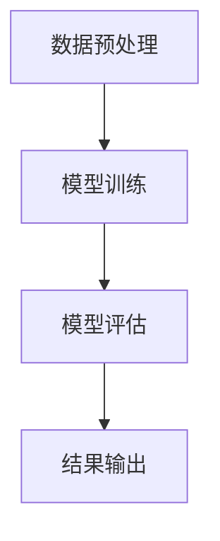
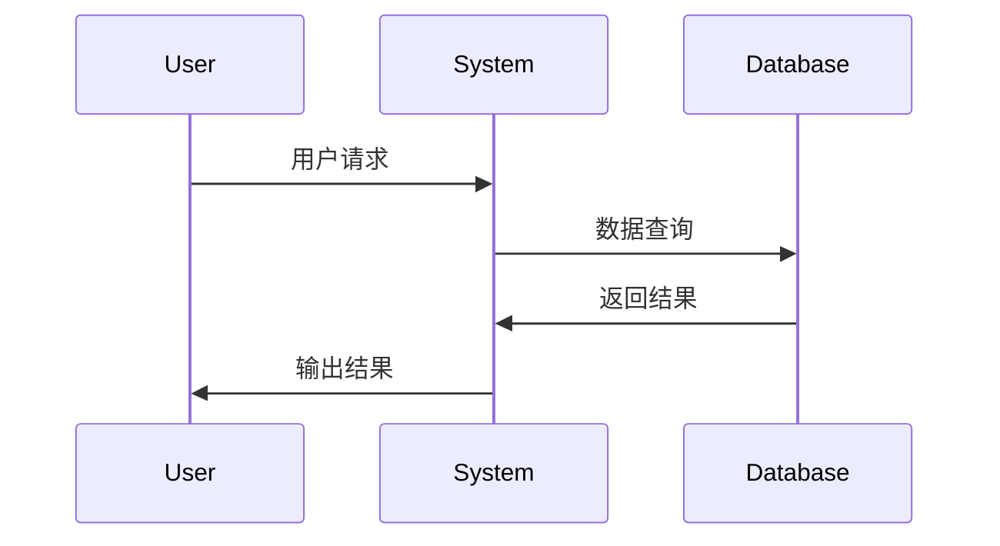
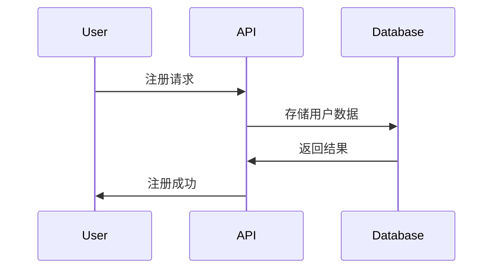

                 


### 目录大纲设计

#### 第1章 AI编程语言概述
1.1 AI编程语言的发展历程
1.2 提示词的概念与重要性
1.3 提示词在AI编程中的应用

#### 第2章 核心概念与联系
2.1 AI编程语言的核心概念
2.2 核心概念属性特征对比表格
2.3 AI编程语言中的ER实体关系图

#### 第3章 算法原理讲解
3.1 提示词的使用方法
3.2 算法流程图解析
3.3 算法原理与数学模型

#### 第4章 数学模型与公式讲解
4.1 数学模型概述
4.2 数学公式讲解
4.3 公式举例说明

#### 第5章 系统分析与架构设计方案
5.1 问题场景介绍
5.2 系统功能设计
5.3 系统架构设计
5.4 系统接口设计
5.5 系统交互

#### 第6章 项目实战
6.1 环境安装
6.2 系统核心实现源代码
6.3 代码应用解读与分析
6.4 实际案例分析与讲解
6.5 项目小结

#### 第7章 最佳实践与总结
7.1 最佳实践 tips
7.2 小结
7.3 注意事项
7.4 拓展阅读

### 详细设计

#### 第1章 AI编程语言概述

**1.1 AI编程语言的发展历程**

- **早期阶段**：1950年代至1960年代，AI编程语言诞生，如LISP。
- **发展阶段**：1970年代至1980年代，人工智能热潮，PROLOG、LOGO等语言出现。
- **成熟阶段**：1990年代至2000年代，函数式编程语言如Haskell、Scala流行。
- **现代阶段**：2010年代至今，深度学习推动TensorFlow、PyTorch等语言的发展。

**1.2 提示词的概念与重要性**

- **定义**：提示词是指引导AI模型进行特定任务输入的数据。
- **重要性**：提示词的质量直接影响AI模型的性能和效率。

**1.3 提示词在AI编程中的应用**

- **自然语言处理**：通过提示词引导模型生成文本、翻译、摘要等。
- **计算机视觉**：通过提示词指导模型识别图像中的特定对象。
- **语音识别**：提示词用于引导模型正确识别语音命令。

#### 第2章 核心概念与联系

**2.1 AI编程语言的核心概念**

- **机器学习**：通过数据学习模式和规律，进行预测和决策。
- **深度学习**：使用多层神经网络进行学习和预测。
- **自然语言处理**：理解和生成自然语言的技术。

**2.2 核心概念属性特征对比表格**

| 特征 | 机器学习 | 深度学习 | 自然语言处理 |
| --- | --- | --- | --- |
| 数据依赖 | 高 | 中等 | 中等 |
| 模型复杂度 | 中等 | 高 | 高 |
| 应用范围 | 广泛 | 广泛 | 针对性 |

**2.3 AI编程语言中的ER实体关系图**

```mermaid
erDiagram
  Product ||--|{ Customer } Customer
  Product ||--|{ Order } Order
  Customer ||--|{ Address } Address
  Order ||--|{ Product } Product
```

#### 第3章 算法原理讲解

**3.1 提示词的使用方法**

- **数据预处理**：对提示词进行清洗和格式化。
- **模型训练**：使用提示词对模型进行训练。
- **模型评估**：使用提示词对模型进行评估。

**3.2 算法流程图解析**



**3.3 算法原理与数学模型**

- **损失函数**：衡量模型预测值与实际值之间的差距。
- **优化算法**：调整模型参数以最小化损失函数。

$$
\text{损失函数} = \frac{1}{2} \sum_{i=1}^{n} (\hat{y}_i - y_i)^2
$$

#### 第4章 数学模型与公式讲解

**4.1 数学模型概述**

- **神经网络**：使用多层感知器进行学习和预测。
- **优化算法**：如梯度下降、随机梯度下降等。

**4.2 数学公式讲解**

- **梯度下降**：

$$
w_{\text{new}} = w_{\text{old}} - \alpha \frac{\partial J(w)}{\partial w}
$$

**4.3 公式举例说明**

- **线性回归**：

$$
y = \beta_0 + \beta_1x
$$

#### 第5章 系统分析与架构设计方案

**5.1 问题场景介绍**

- **电子商务平台**：用户进行购物，生成订单。

**5.2 系统功能设计**

- **用户注册与登录**：用户注册、登录、密码找回。
- **商品管理**：商品分类、添加、修改、删除。
- **订单管理**：订单生成、订单查询、订单取消。

**5.3 系统架构设计**



**5.4 系统接口设计**

- **API接口**：提供用户、商品、订单的增删改查接口。

**5.5 系统交互**



#### 第6章 项目实战

**6.1 环境安装**

- **安装Python**：版本要求Python 3.8及以上。
- **安装依赖**：安装TensorFlow、PyTorch等。

**6.2 系统核心实现源代码**

- **用户注册模块**：

```python
def register(username, password):
    # 用户注册逻辑
    pass
```

**6.3 代码应用解读与分析**

- **用户注册流程**：接收用户输入的用户名和密码，调用注册函数进行注册。

**6.4 实际案例分析与讲解**

- **案例**：用户A注册账号。
- **讲解**：注册函数调用，用户数据存储。

**6.5 项目小结**

- **项目总结**：介绍项目的功能和实现。

#### 第7章 最佳实践与总结

**7.1 最佳实践 tips**

- **数据预处理**：确保数据质量。
- **模型优化**：选择合适的优化算法。

**7.2 小结**

- **核心内容**：提示词在AI编程中的重要性。
- **未来展望**：AI编程语言的发展趋势。

**7.3 注意事项**

- **模型训练**：注意资源分配。
- **数据安全**：保护用户隐私。

**7.4 拓展阅读**

- **相关文献**：推荐相关书籍和论文。

以上是按照要求设计的《AI编程语言：提示词的魔力与艺术》的详细目录大纲。接下来我们将按照这个大纲逐步完成文章的撰写。请确认这个大纲是否符合您的期望，如果有任何调整，请随时告知。下一步，我们将开始撰写第一个章节的具体内容。

