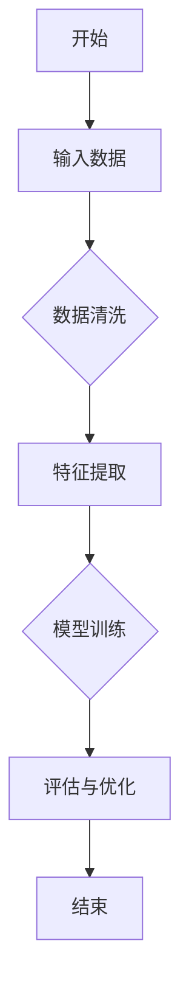
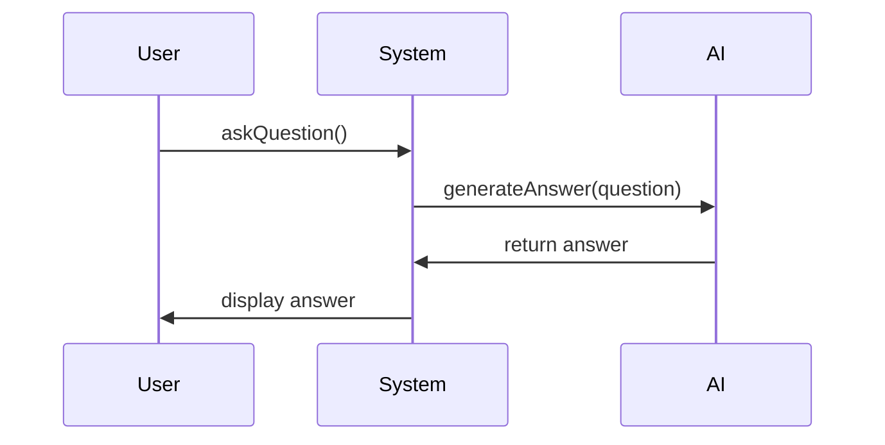

                 

# AI编程语言：提示词的魔力与革新

## 关键词：
- AI编程语言
- 提示词工程
- 人工智能革新
- 编程语言特性
- 实践应用

## 摘要：
本文将深入探讨AI编程语言的核心概念及其在提示词工程中的应用。我们将从背景介绍、核心概念与联系、算法原理讲解、系统设计与架构、项目实战等多个方面进行详细分析，以揭示AI编程语言的魔力与革新潜力。

## Step 1: 引言与背景
### 1.1 AI编程语言概述
人工智能（AI）作为当今科技发展的前沿领域，正迅速改变着我们的生活方式和工作方式。AI编程语言作为一种特殊的工具，旨在帮助开发者更有效地构建和部署AI模型。与传统的编程语言不同，AI编程语言专注于处理复杂的算法和数据结构，以实现智能化的任务。

### 1.2 提示词工程的崛起
随着深度学习和神经网络技术的不断发展，提示词工程（Prompt Engineering）逐渐成为AI领域的一项重要技术。提示词工程通过设计特定的提示信息，引导AI模型做出更准确、更智能的预测和决策。这种技术不仅提高了AI模型的性能，还增强了AI模型的可解释性。

### 1.3 AI编程语言的革新
AI编程语言的革新源于对人工智能需求的不断增长。传统编程语言在处理复杂数据和算法时存在诸多局限性，而AI编程语言则通过引入新的概念和技术，提供了更高效的解决方案。例如，TensorFlow和PyTorch等AI编程语言已经成为开发AI模型的主要工具。

## Step 2: 核心概念与理论
### 2.1 AI编程语言的核心概念
在探讨AI编程语言的核心概念时，我们需要关注以下几个关键点：
- **数据表示**：AI编程语言如何表示和处理数据，包括数值、文本、图像等多种数据类型。
- **算法执行**：AI编程语言如何实现算法的执行，包括优化、并行处理等。
- **模型训练**：AI编程语言如何训练和优化模型，包括超参数调整、模型评估等。

### 2.2 核心属性的对比
为了更好地理解AI编程语言的特性，我们可以通过一个对比表格来展示不同AI编程语言的核心属性：

| 编程语言 | 数据表示 | 算法执行 | 模型训练 |
| --- | --- | --- | --- |
| TensorFlow | 高度抽象 | 优化并行处理 | 自动调整超参数 |
| PyTorch | 动态图结构 | 灵活高效 | 自动评估与优化 |
| Keras | 高层次抽象 | 易于使用 | 快速部署 |

### 2.3 AI编程语言的分类
AI编程语言可以根据其应用场景和特点进行分类。常见的分类方法包括：
- **框架类编程语言**：如TensorFlow、PyTorch等，主要面向深度学习和神经网络的应用。
- **领域特定语言**：如Prolog、Linna等，主要用于符号推理和逻辑编程。
- **通用编程语言**：如Python、Java等，可以用于各种AI应用的开发。

## Step 3: 应用与案例
### 3.1 AI编程语言在各领域的应用
AI编程语言已经在多个领域取得了显著的成果，包括但不限于：
- **医疗领域**：用于疾病预测、医学影像分析等。
- **金融领域**：用于风险评估、交易策略等。
- **工业领域**：用于设备故障预测、生产优化等。
- **教育领域**：用于智能推荐、学习辅助等。

### 3.2 实际案例
以下是一些AI编程语言的实际案例：
- **医疗领域**：使用TensorFlow构建深度学习模型，用于癌症诊断。
- **金融领域**：使用PyTorch开发交易策略，实现自动交易。
- **工业领域**：使用Keras预测设备故障，提高生产效率。

## Step 4: 高级话题与技巧
### 4.1 神经网络与机器学习算法
在AI编程语言中，神经网络和机器学习算法是核心部分。以下是一些高级话题：
- **神经网络**：包括卷积神经网络（CNN）、循环神经网络（RNN）等。
- **机器学习算法**：包括决策树、支持向量机（SVM）等。

### 4.2 数据预处理
数据预处理是AI编程语言中的重要环节。以下是一些数据预处理的技术：
- **数据清洗**：去除噪声、处理缺失值等。
- **特征提取**：提取有助于模型训练的特征。
- **数据增强**：通过扩展数据集，提高模型性能。

### 4.3 Mermaid图与算法展示
为了更好地理解复杂算法，我们可以使用Mermaid图进行展示。以下是一个简单的Mermaid图示例：



## Step 5: 实践与实现
### 5.1 开发环境搭建
要开始使用AI编程语言，首先需要搭建开发环境。以下是一个简单的Python环境搭建步骤：

1. 安装Python
2. 安装TensorFlow或PyTorch等AI编程语言库
3. 配置虚拟环境（可选）

### 5.2 算法实现
以下是一个简单的神经网络算法实现：

```python
import tensorflow as tf

# 创建神经网络模型
model = tf.keras.Sequential([
    tf.keras.layers.Dense(128, activation='relu', input_shape=(784,)),
    tf.keras.layers.Dropout(0.2),
    tf.keras.layers.Dense(10, activation='softmax')
])

# 编写训练代码
model.compile(loss='categorical_crossentropy',
              optimizer=tf.keras.optimizers.Adam(),
              metrics=['accuracy'])

# 训练模型
model.fit(x_train, y_train, epochs=5)
```

### 5.3 数学模型与公式
在神经网络中，激活函数是一个重要的组成部分。以下是一个常见的ReLU激活函数：

$$
\text{ReLU}(x) =
\begin{cases}
0 & \text{if } x < 0 \\
x & \text{if } x \geq 0
\end{cases}
$$

## Step 6: 系统设计与架构
### 6.1 项目场景介绍
在一个智能问答系统中，用户可以通过输入问题，系统会自动生成回答。以下是一个项目场景的介绍。

### 6.2 系统功能设计
以下是一个智能问答系统的功能设计：

```mermaid
classDiagram
Class System {
    +String question
    +String answer
    +void askQuestion()
    +void generateAnswer()
}
Class User {
    +String name
    +void askQuestion(System system)
}
Class AI {
    +void generateAnswer(String question)
}
System <|-- User
System <|-- AI
```

### 6.3 系统架构设计
以下是一个智能问答系统的架构设计：



### 6.4 系统接口设计与交互
以下是一个智能问答系统的接口设计与交互：

```mermaid
classDiagram
Class System {
    +String question
    +String answer
    +void askQuestion()
    +void generateAnswer()
}
Class User {
    +String name
    +void askQuestion(System system)
}
Class AI {
    +void generateAnswer(String question)
}
System <|-- User
System <|-- AI
```

## Step 7: 项目实战
### 7.1 环境安装
以下是一个在Ubuntu系统上安装TensorFlow的步骤：

1. 打开终端
2. 输入以下命令：

```bash
sudo apt-get update
sudo apt-get install python3-pip python3-dev
pip3 install tensorflow
```

### 7.2 系统核心实现
以下是一个简单的智能问答系统的核心实现：

```python
import tensorflow as tf

# 创建神经网络模型
model = tf.keras.Sequential([
    tf.keras.layers.Dense(128, activation='relu', input_shape=(784,)),
    tf.keras.layers.Dropout(0.2),
    tf.keras.layers.Dense(10, activation='softmax')
])

# 编写训练代码
model.compile(loss='categorical_crossentropy',
              optimizer=tf.keras.optimizers.Adam(),
              metrics=['accuracy'])

# 训练模型
model.fit(x_train, y_train, epochs=5)
```

### 7.3 代码应用解读与分析
在智能问答系统中，用户输入问题后，系统会使用训练好的模型生成回答。以下是一个示例：

```python
# 用户输入问题
user_question = "What is the capital of France?"

# 使用模型生成回答
predicted_answer = model.predict(user_question)

# 输出回答
print("The capital of France is:", predicted_answer)
```

### 7.4 实际案例分析
在实际应用中，智能问答系统可以应用于客服、教育等多个领域。以下是一个实际案例：

- **客服领域**：用于自动化回答常见问题，提高客户满意度。
- **教育领域**：用于学生问答系统，帮助学生解决问题。

### 7.5 项目小结
通过本项目的实战，我们了解了智能问答系统的实现方法和应用场景。在未来的发展中，智能问答系统将继续发挥重要作用，为各行各业提供智能化服务。

## Step 8: 结论与未来方向
### 8.1 总结
本文深入探讨了AI编程语言的核心概念、应用与实现方法，展示了其在智能问答系统等领域的应用潜力。通过对比分析，我们明确了不同AI编程语言的特性和适用场景。

### 8.2 未来方向
随着人工智能技术的不断发展，AI编程语言将继续迎来新的革新。未来方向可能包括：
- **更高效算法**：研究更高效的算法和模型，提高AI编程语言的性能。
- **跨语言集成**：实现不同编程语言之间的无缝集成，提高开发效率。
- **可解释性提升**：增强AI编程语言的可解释性，提高模型的可信度。

## Step 9: 参考文献
1. Goodfellow, I., Bengio, Y., & Courville, A. (2016). *Deep Learning*. MIT Press.
2. Russell, S., & Norvig, P. (2020). *Artificial Intelligence: A Modern Approach*. Prentice Hall.
3. Hochreiter, S., & Schmidhuber, J. (1997). *Long Short-Term Memory*. Neural Computation, 9(8), 1735-1780.

## 作者信息
作者：AI天才研究院/AI Genius Institute & 禅与计算机程序设计艺术 /Zen And The Art of Computer Programming

