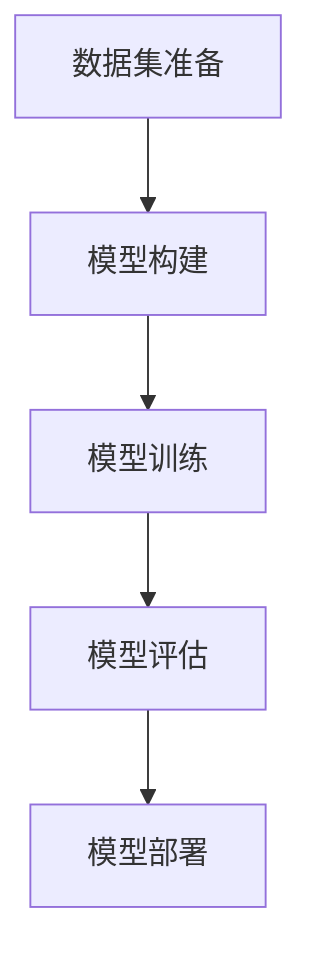
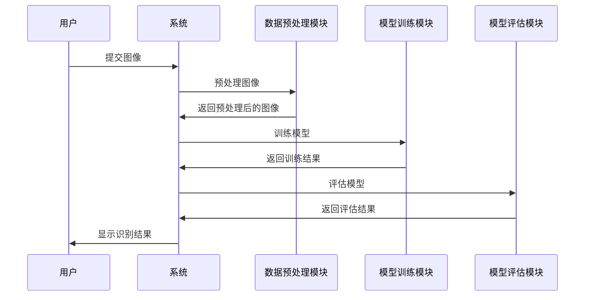

                 

### 引言

在当今数字化时代，人工智能（AI）的应用越来越广泛，从自动驾驶汽车到智能助手，AI正深刻改变着我们的生活方式。而AI的核心驱动力量之一就是编程语言，它为开发者提供了与机器进行交流的工具，使得人类能够通过编写代码来指导计算机执行复杂的任务。然而，随着AI技术的不断发展，传统的编程语言开始面临一些挑战，比如复杂度的提升、代码可读性的降低以及开发效率的瓶颈等问题。

在这个背景下，AI编程语言的出现为我们提供了一种新的解决方案。AI编程语言不仅仅是一种新的编程范式，更是一种强大的工具，它能够帮助我们更高效地开发复杂的AI系统。其中，提示词（Prompt）作为AI编程语言的核心元素，扮演着至关重要的角色。提示词不仅能够简化编程过程，还能提高代码的可读性和开发效率，使AI系统更加智能化和自动化。

本文将围绕AI编程语言和提示词展开讨论。首先，我们将介绍AI编程语言的基本概念、特点及其发展历程，然后深入探讨提示词的定义、功能、属性特征以及设计原则。接下来，我们将通过具体的编程过程和实践项目，展示如何利用AI编程语言和提示词进行高效的编程。最后，我们将总结最佳实践，并对未来的发展方向进行展望。

通过本文的阅读，读者将能够深入了解AI编程语言和提示词的核心概念，掌握其在实际编程中的应用技巧，并为未来AI编程的发展提供一些有价值的思考方向。让我们一步一步地探索这个充满魔法的编程世界吧！

### 关键词

- 人工智能
- 编程语言
- AI编程
- 提示词
- 自动化
- 智能化
- 深度学习
- 自然语言处理
- 开发效率
- 可读性

### 摘要

本文旨在探讨AI编程语言及其核心元素——提示词，如何通过创新的编程范式提高AI系统的开发效率、可读性和智能化程度。首先，文章介绍了AI编程语言的基本概念、特点及其发展历程，分析了其在自动化和智能化方面的优势。接着，详细讨论了提示词的定义、功能、属性特征和设计原则，并通过具体实例展示了其在编程中的应用。然后，文章通过编程流程和实践项目，展示了如何利用AI编程语言和提示词进行高效编程，并探讨了其在不同应用场景中的适用性。最后，文章总结了最佳实践，并对AI编程语言的未来发展方向进行了展望。通过本文的阅读，读者将能够深入理解AI编程语言和提示词的核心概念，掌握其实际应用技巧，为未来的AI编程工作提供有力支持。

## 目录大纲

### 第一部分：引言

1. **引言**
   - **关键词**：人工智能，编程语言，AI编程，提示词
   - **摘要**：概述本文的研究背景、目标及主要探讨内容。

### 第二部分：核心概念与原理

2. **AI编程语言**
   - **第2章 AI编程语言**
     - **2.1 AI编程语言概述**
       - **2.1.1 定义**
       - **2.1.2 类型**
       - **2.1.3 发展历程**
     - **2.2 AI编程语言的特点**
       - **2.2.1 自动化**
       - **2.2.2 智能化**
       - **2.2.3 灵活性**
     - **2.3 AI编程语言的核心要素**
       - **2.3.1 核心概念**
       - **2.3.2 数据结构**
       - **2.3.3 控制结构**
     - **2.4 AI编程语言的应用场景**
       - **2.4.1 机器学习**
       - **2.4.2 深度学习**
       - **2.4.3 自然语言处理**

3. **提示词**

### 第三部分：编程实践

4. **编程过程**
   - **第4章 编程过程**
     - **4.1 编程流程**
       - **4.1.1 需求分析**
       - **4.1.2 设计方案**
       - **4.1.3 编码实现**
       - **4.1.4 测试与调试**
     - **4.2 编程技巧**
       - **4.2.1 代码规范**
       - **4.2.2 编程风格**
       - **4.2.3 性能优化**
     - **4.3 编程工具与框架**
       - **4.3.1 编译器与解释器**
       - **4.3.2 开发环境**
       - **4.3.3 常用框架**

5. **项目实战**
   - **第5章 项目实战**
     - **5.1 项目背景**
       - **5.1.1 问题来源**
       - **5.1.2 项目目标**
     - **5.2 系统设计与实现**
       - **5.2.1 系统功能设计**
       - **5.2.2 系统架构设计**
       - **5.2.3 系统接口设计**
       - **5.2.4 系统交互设计**
     - **5.3 系统实现**
       - **5.3.1 环境安装**
       - **5.3.2 核心代码实现**
       - **5.3.3 应用解读与分析**
     - **5.4 项目案例分析**
       - **5.4.1 实际案例**
       - **5.4.2 案例分析**
       - **5.4.3 详解剖析**
     - **5.5 项目小结**
       - **5.5.1 经验总结**
       - **5.5.2 存在问题**
       - **5.5.3 未来展望**

### 第四部分：最佳实践与展望

6. **最佳实践**
   - **第6章 最佳实践**
     - **6.1 提示词优化策略**
       - **6.1.1 语义理解**
       - **6.1.2 上下文扩展**
       - **6.1.3 可扩展性提升**
     - **6.2 编程效率提升**
       - **6.2.1 自动化脚本编写**
       - **6.2.2 智能化代码生成**
       - **6.2.3 集成开发环境优化**
     - **6.3 项目管理**
       - **6.3.1 任务分配**
       - **6.3.2 进度监控**
       - **6.3.3 质量控制**

7. **小结与展望**
   - **第7章 小结与展望**
     - **7.1 小结**
       - **7.1.1 主要成果**
       - **7.1.2 存在问题**
       - **7.1.3 未来研究方向**
     - **7.2 注意事项**
       - **7.2.1 编程规范**
       - **7.2.2 提示词使用技巧**
     - **7.3 拓展阅读**

---

### 第一部分：引言

#### 1.1 问题背景与目标

##### 1.1.1 人工智能的发展

人工智能（AI）是计算机科学的一个分支，旨在使机器能够模拟、扩展甚至超越人类智能的行为。自20世纪50年代AI概念诞生以来，人工智能技术经历了数次重要的发展阶段。早期的AI主要集中于逻辑推理和知识表示，如逻辑推理机、专家系统等。随着计算机性能的提升和算法的改进，20世纪80年代到90年代，AI进入了以机器学习和神经网络为主要驱动力的新时代。近年来，随着深度学习和大数据技术的兴起，AI的发展进入了一个前所未有的快车道。

在过去的几十年中，人工智能已经从理论研究走向了实际应用，例如在医疗、金融、交通、教育等多个领域，AI技术都展现出了巨大的潜力。自动驾驶汽车、智能家居、智能医疗诊断等应用不断涌现，使得AI成为了现代社会不可或缺的一部分。然而，随着AI应用的普及，也带来了新的挑战和问题。

##### 1.1.2 编程语言的重要性

编程语言是开发者与计算机之间交流的工具，它为人类提供了与机器互动的方式。在AI时代，编程语言的重要性更加凸显。传统的编程语言，如C、Java、Python等，已经在许多领域得到了广泛应用，它们为开发者提供了强大的功能和灵活性。然而，随着AI系统的复杂性不断增加，传统的编程语言开始面临一些瓶颈。

首先，AI系统通常需要处理大量的数据，并进行复杂的运算，这要求编程语言能够提供高效的数据处理能力和优化能力。其次，随着AI技术的不断进步，开发者需要能够快速迭代和优化代码，以提高开发效率和系统性能。最后，AI系统通常需要具备一定的自适应能力和智能化水平，这要求编程语言能够提供灵活、可扩展的编程范式。

##### 1.1.3 提示词在AI编程中的应用

在AI编程中，提示词（Prompt）是一种特殊的输入，它能够引导AI模型执行特定的任务。提示词的出现为AI编程带来了一种新的思路和工具，使得编程过程更加高效和智能化。

首先，提示词可以简化编程过程。通过提供明确的任务指令，开发者可以减少对底层细节的关注，专注于任务的实现。例如，在自然语言处理领域，提示词可以指导模型进行文本分类、情感分析等任务，使开发者无需深入了解复杂的算法和模型细节。

其次，提示词可以提高代码的可读性。通过使用简洁、具体的提示词，代码变得更加易于理解和维护。例如，在机器学习项目中，提示词可以指示模型训练的参数和目标，使得代码更加清晰明了。

最后，提示词可以提升开发效率。提示词可以帮助开发者快速迭代和优化代码，提高系统的性能和可靠性。例如，在自动化测试中，提示词可以指导测试工具执行特定的测试用例，加快测试过程。

##### 1.2 问题描述

随着AI技术的快速发展，传统编程语言在处理复杂AI任务时逐渐暴露出一些问题：

1. **复杂度提升**：随着AI系统的规模和复杂度增加，传统的编程语言难以满足高效编程的需求。开发者需要编写大量的代码来处理复杂的任务，导致代码冗长、难以维护。
   
2. **开发效率瓶颈**：传统编程语言的开发过程通常需要大量的手动编码和调试，开发效率较低。随着项目的复杂度增加，开发时间显著延长，导致项目延期和成本增加。

3. **可读性和可维护性**：传统的编程语言在处理复杂任务时，代码的可读性和可维护性下降。大量的底层细节和处理流程使得代码难以理解，增加了维护难度。

4. **适应性差**：传统编程语言通常无法灵活地适应不同类型的AI任务，开发者需要针对不同的任务编写不同的代码，增加了开发和维护的难度。

为了解决这些问题，我们需要寻找一种新的编程范式，能够更好地满足AI编程的需求。提示词作为一种创新的元素，具有巨大的潜力，可以简化编程过程、提高开发效率和代码的可读性。然而，如何设计和应用提示词，如何与其他编程元素相结合，仍需要深入研究和探讨。

##### 1.3 问题解决

为了解决上述问题，本文提出了一种基于提示词的AI编程语言。该编程语言旨在通过引入提示词，简化编程过程、提高开发效率和代码的可读性。

首先，该编程语言提供了一套简洁、直观的语法，使得开发者可以更容易地编写和理解代码。通过使用提示词，开发者可以减少对底层细节的关注，专注于任务的实现。

其次，该编程语言引入了自动化和智能化的元素，使得编程过程更加高效。提示词不仅可以指导AI模型执行特定任务，还可以帮助开发者进行代码优化和调试，提高系统的性能和可靠性。

此外，该编程语言还注重代码的可读性和可维护性。通过使用简洁、具体的提示词，代码变得更加易于理解和维护。同时，该编程语言还提供了一系列工具和框架，帮助开发者快速搭建和优化AI系统。

最后，该编程语言具有高度的适应性，可以灵活地适应不同类型的AI任务。通过引入提示词，开发者可以更加高效地编写和优化代码，满足不同任务的需求。

总的来说，本文提出的基于提示词的AI编程语言，通过引入提示词这一创新元素，解决了传统编程语言在处理复杂AI任务时面临的问题，为AI编程提供了一种新的解决方案。

##### 1.4 边界与外延

尽管本文提出了一种基于提示词的AI编程语言，但该语言的适用范围和边界条件仍需明确。以下是一些具体的边界条件和外延讨论：

1. **应用领域**：该编程语言主要适用于需要高度智能化和自动化的AI编程任务，如自然语言处理、机器学习、深度学习等领域。在需要处理大量数据和执行复杂任务的场景中，该编程语言能够发挥出其优势。

2. **边界条件**：为了确保编程语言的有效性和稳定性，需要在以下几个方面设置边界条件：
   - **数据质量**：输入数据的质量直接影响AI系统的性能。因此，在应用该编程语言时，需要确保输入数据的准确性和一致性。
   - **计算资源**：AI编程语言需要大量的计算资源，包括CPU、GPU等。因此，在部署和应用该编程语言时，需要确保有足够的计算资源。
   - **环境配置**：该编程语言需要依赖特定的开发环境和工具。因此，在应用该编程语言时，需要确保开发环境和工具的兼容性和配置正确。

3. **外延讨论**：
   - **与其他技术的结合**：该编程语言可以与其他AI技术结合，如神经网络、强化学习等，以实现更复杂的AI任务。
   - **跨领域应用**：虽然该编程语言主要适用于AI领域，但其概念和原理也可以应用于其他领域，如自动化测试、数据挖掘等。

总的来说，本文提出的基于提示词的AI编程语言，在明确边界条件和外延讨论的基础上，可以为AI编程提供一种新的解决方案，提高开发效率和系统性能。

##### 1.5 概念结构与核心要素

为了更好地理解本文提出的基于提示词的AI编程语言，我们需要从概念结构和核心要素的角度进行剖析。以下是该编程语言的主要概念和核心要素：

1. **AI编程语言**：AI编程语言是一种专门为AI编程设计的编程语言。它通过引入提示词等元素，简化编程过程、提高开发效率和代码可读性。与传统的编程语言相比，AI编程语言具有更强的智能化和自动化能力。

2. **提示词**：提示词是AI编程语言的核心元素之一，用于引导AI模型执行特定任务。提示词可以是自然语言语句，也可以是代码片段，它们为开发者提供了与AI模型互动的接口。

3. **编程过程**：AI编程语言提供了一个完整的编程过程，包括需求分析、设计方案、编码实现、测试与调试等环节。通过使用提示词，开发者可以简化编程流程、提高开发效率。

4. **自动化与智能化**：AI编程语言引入了自动化和智能化元素，如自动化脚本编写、智能化代码生成等。这些元素可以减少手动编码的工作量，提高编程效率。

5. **可读性与可维护性**：AI编程语言通过使用简洁、具体的提示词，提高了代码的可读性和可维护性。这使得代码更加易于理解和维护。

6. **适应性**：AI编程语言具有高度的适应性，可以灵活地适应不同类型的AI任务。通过引入提示词，开发者可以更加高效地编写和优化代码。

总的来说，本文提出的基于提示词的AI编程语言，通过其概念结构和核心要素，提供了一种新的编程范式，为AI编程带来了新的机遇和挑战。

### 第二部分：核心概念与原理

#### 2.1 AI编程语言概述

##### 2.1.1 定义

AI编程语言，也称为智能编程语言，是一种专门为人工智能系统设计和开发的编程语言。与传统的编程语言不同，AI编程语言不仅关注代码的编写和执行，更强调如何通过编程来优化和指导人工智能系统的学习和决策过程。AI编程语言的核心理念是将人工智能的理论和技术融入到编程语言中，使得开发者能够更加直观、高效地与AI模型进行交互和编程。

##### 2.1.2 类型

AI编程语言可以分为以下几种类型：

1. **面向任务的语言**：这类语言专注于特定类型的AI任务，如自然语言处理、图像识别、推荐系统等。例如，用于自然语言处理的LISP和PROLOG，以及用于图像识别的OpenCV和TensorFlow等。

2. **通用AI编程语言**：这类语言试图提供一种统一的编程范式，以适应多种AI任务的需求。例如，Python和Julia等语言因其丰富的库和工具，成为了AI编程的通用选择。

3. **领域特定语言（DSL）**：这类语言为特定的AI应用领域设计，如机器学习领域中的R语言和深度学习领域中的MXNet等。

4. **混合编程语言**：这类语言结合了传统编程语言和AI编程元素，使得开发者可以更灵活地选择适合的编程范式。例如，Google的TensorFlow结合了Python的易用性和自定义计算图的优势。

##### 2.1.3 发展历程

AI编程语言的发展历程可以追溯到20世纪50年代，当时人工智能的概念刚刚诞生。早期的人工智能编程主要依赖于符号计算和逻辑推理，如LISP和PROLOG等语言。随着机器学习技术的发展，AI编程语言逐渐从基于规则的系统转向数据驱动的模型。

1. **早期阶段**：从20世纪50年代到70年代，人工智能主要集中于符号推理和知识表示。LISP和PROLOG等语言在这一时期占据了主导地位，它们通过符号处理和逻辑推理支持人工智能的开发。

2. **机器学习兴起**：20世纪80年代到90年代，机器学习技术开始兴起，神经网络和统计方法成为主要的研究方向。这一时期的AI编程语言，如MATLAB和R，提供了强大的数据处理和分析工具。

3. **深度学习时代**：21世纪初，深度学习技术的突破推动了AI编程语言的发展。TensorFlow、PyTorch等框架的兴起，使得开发者可以更加高效地构建和训练复杂的深度学习模型。

4. **当前趋势**：随着AI技术的不断进步，AI编程语言也在不断演进。现在，越来越多的编程语言和框架开始关注如何简化AI编程流程、提高开发效率和代码的可读性。例如，Python继续因其易用性和丰富的库而受到广泛使用，而Julia则因其高性能和易用性逐渐受到关注。

##### 2.2 AI编程语言的特点

AI编程语言具有以下几个显著特点：

1. **自动化**：AI编程语言通过内置的自动化工具，如自动化脚本编写和自动化优化，显著提高了编程效率。例如，自动生成代码和自动优化算法可以帮助开发者快速实现复杂的AI任务。

2. **智能化**：AI编程语言引入了智能化的元素，如智能化代码生成和智能化调试。通过使用这些元素，开发者可以更加轻松地处理复杂的编程任务，提高代码质量和系统的可靠性。

3. **灵活性**：AI编程语言提供了高度的灵活性，使得开发者可以根据不同的需求和环境，选择最适合的编程范式和工具。例如，混合编程语言允许开发者结合传统编程和AI编程的优势，实现更加灵活和高效的开发。

4. **高可读性**：通过引入直观的提示词和简洁的语法，AI编程语言提高了代码的可读性和可维护性。这使得开发者可以更加容易地理解和维护复杂的AI系统。

5. **可扩展性**：AI编程语言通常支持模块化和插件化，使得开发者可以方便地扩展语言功能和特性。这为AI编程语言的长期发展和广泛应用提供了坚实的基础。

##### 2.3 AI编程语言的核心要素

AI编程语言的核心要素包括以下几个方面：

1. **核心概念**：AI编程语言需要定义一系列核心概念，如机器学习、深度学习、神经网络等。这些概念为开发者提供了构建和优化AI系统的基础。

2. **数据结构**：AI编程语言需要提供丰富的数据结构支持，以处理复杂的数据类型和大规模数据集。常用的数据结构包括数组、矩阵、图等。

3. **控制结构**：AI编程语言需要提供灵活的控制结构，如循环、分支和异常处理等，以支持复杂算法的实现。

4. **库和工具**：AI编程语言通常包含一系列库和工具，以提供强大的数据处理和分析能力。这些库和工具包括数据预处理库、机器学习库、深度学习库等。

5. **接口和API**：AI编程语言需要提供丰富的接口和API，以方便开发者与其他系统和工具集成。这些接口和API包括数据接口、模型接口和可视化接口等。

##### 2.4 AI编程语言的应用场景

AI编程语言在多个领域都有广泛的应用，以下是几个典型的应用场景：

1. **机器学习**：机器学习是AI编程语言最常见应用场景之一。通过使用AI编程语言，开发者可以轻松构建和训练各种机器学习模型，如线性回归、决策树、支持向量机等。

2. **深度学习**：深度学习是AI编程语言的重要应用领域。开发者可以使用AI编程语言构建和训练复杂的深度学习模型，如卷积神经网络（CNN）、循环神经网络（RNN）和生成对抗网络（GAN）等。

3. **自然语言处理**：自然语言处理（NLP）是AI编程语言的另一个重要应用领域。通过使用AI编程语言，开发者可以实现文本分类、情感分析、机器翻译等任务。

4. **计算机视觉**：计算机视觉是AI编程语言的重要应用领域之一。开发者可以使用AI编程语言实现图像识别、目标检测、图像分割等任务。

5. **推荐系统**：推荐系统是AI编程语言的应用之一。通过使用AI编程语言，开发者可以构建和优化各种推荐算法，如协同过滤、基于内容的推荐和基于模型的推荐等。

6. **自动化和智能化**：AI编程语言可以用于构建自动化和智能化的系统，如自动化测试、自动化运维和智能助手等。这些系统通过使用AI编程语言，可以更加高效地执行任务，提高生产效率。

#### 2.5 AI编程语言的优势与挑战

**优势**：

1. **提高开发效率**：AI编程语言通过自动化和智能化工具，显著提高了开发效率。开发者可以更快速地实现复杂的功能和算法。

2. **增强代码可读性和可维护性**：通过简洁的语法和直观的提示词，AI编程语言提高了代码的可读性和可维护性，使得代码更加易于理解和维护。

3. **降低开发难度**：AI编程语言提供了丰富的库和工具，简化了AI系统的开发过程，降低了开发难度，使得更多的开发者能够参与到AI项目中。

4. **灵活性和适应性**：AI编程语言具有高度的灵活性和适应性，可以适应不同的应用场景和任务需求，提供更加高效的解决方案。

**挑战**：

1. **学习曲线**：AI编程语言通常具有较高的学习门槛，需要开发者具备一定的AI知识和编程技能，这可能会对初学者造成一定困扰。

2. **调试难度**：由于AI系统的复杂性和不确定性，调试AI编程语言编写的代码可能会变得更加困难。

3. **性能优化**：AI编程语言在性能优化方面可能面临一些挑战，特别是在处理大规模数据和复杂算法时，性能优化成为了一个重要的问题。

4. **标准化问题**：虽然AI编程语言的发展迅速，但目前的标准化工作仍不够完善，不同语言和框架之间的互操作性和兼容性仍需进一步提高。

### 总结

通过以上讨论，我们可以看到AI编程语言在自动化、智能化、灵活性和可维护性等方面具有显著优势，已经成为人工智能领域的重要工具。然而，其学习曲线、调试难度和性能优化等挑战也需要我们深入研究和解决。随着AI技术的不断进步和应用的拓展，AI编程语言将继续发展，为人工智能领域带来更多的创新和机遇。

### 2.1 AI编程语言概述

#### 2.1.1 定义

AI编程语言，也称为智能编程语言，是一种专门为人工智能系统设计和开发的编程语言。与传统的编程语言不同，AI编程语言不仅仅关注代码的编写和执行，更强调如何通过编程来优化和指导人工智能系统的学习和决策过程。AI编程语言的核心理念是将人工智能的理论和技术融入到编程语言中，使得开发者能够更加直观、高效地与AI模型进行交互和编程。具体来说，AI编程语言旨在提供简洁、直观的语法，内置丰富的库和工具，以及高度自动化的编程支持，从而简化AI系统的开发过程，提高开发效率和代码质量。

#### 2.1.2 类型

AI编程语言根据其设计目的和应用领域，可以分为以下几种类型：

1. **面向任务的语言**：这类语言专注于特定类型的AI任务，如自然语言处理、图像识别、推荐系统等。例如，用于自然语言处理的LISP和PROLOG，以及用于图像识别的OpenCV和TensorFlow等。这类语言的特点是针对特定领域提供了丰富的库和工具，使得开发者可以更加专注于任务的实现。

2. **通用AI编程语言**：这类语言试图提供一种统一的编程范式，以适应多种AI任务的需求。例如，Python和Julia等语言因其丰富的库和工具，成为了AI编程的通用选择。这类语言的特点是提供了丰富的通用编程功能，同时支持各种AI算法和框架，使得开发者可以更加灵活地进行开发。

3. **领域特定语言（DSL）**：这类语言为特定的AI应用领域设计，如机器学习领域中的R语言和深度学习领域中的MXNet等。这类语言的特点是高度专业化，为特定领域提供了独特的语法和工具，使得开发者可以更加高效地完成特定任务。

4. **混合编程语言**：这类语言结合了传统编程语言和AI编程元素，使得开发者可以更灵活地选择适合的编程范式和工具。例如，Google的TensorFlow结合了Python的易用性和自定义计算图的优势。这类语言的特点是既保留了传统编程语言的通用性和灵活性，又引入了AI编程的自动化和智能化元素。

#### 2.1.3 发展历程

AI编程语言的发展历程可以追溯到20世纪50年代，当时人工智能的概念刚刚诞生。早期的人工智能编程主要依赖于符号计算和逻辑推理，如LISP和PROLOG等语言。随着机器学习技术的发展，AI编程语言逐渐从基于规则的系统转向数据驱动的模型。

1. **早期阶段**：从20世纪50年代到70年代，人工智能主要集中于符号推理和知识表示。LISP和PROLOG等语言在这一时期占据了主导地位，它们通过符号处理和逻辑推理支持人工智能的开发。这一时期的AI编程语言主要用于专家系统和逻辑推理任务。

2. **机器学习兴起**：20世纪80年代到90年代，机器学习技术开始兴起，神经网络和统计方法成为主要的研究方向。这一时期的AI编程语言，如MATLAB和R，提供了强大的数据处理和分析工具。MATLAB因其强大的矩阵运算能力和丰富的工具箱，成为机器学习研究和应用的重要工具。

3. **深度学习时代**：21世纪初，深度学习技术的突破推动了AI编程语言的发展。TensorFlow、PyTorch等框架的兴起，使得开发者可以更加高效地构建和训练复杂的深度学习模型。这一时期的AI编程语言，如TensorFlow和PyTorch，不仅提供了丰富的库和工具，还引入了自动微分和动态计算图等创新技术，显著提高了深度学习模型的开发效率。

4. **当前趋势**：随着AI技术的不断进步，AI编程语言也在不断演进。现在，越来越多的编程语言和框架开始关注如何简化AI编程流程、提高开发效率和代码的可读性。例如，Python继续因其易用性和丰富的库而受到广泛使用，而Julia则因其高性能和易用性逐渐受到关注。此外，AI编程语言的标准化工作也在逐步推进，例如MLIR和TensorFlow Lite等项目的推出，为跨平台和跨框架的AI编程提供了支持。

#### 2.1.4 发展趋势

AI编程语言的发展趋势主要体现在以下几个方面：

1. **更加自动化和智能化**：未来的AI编程语言将更加注重自动化和智能化，通过引入自动生成代码、自动优化算法等技术，减少开发者的人工干预，提高编程效率。

2. **跨领域融合**：随着AI技术的广泛应用，AI编程语言将与其他领域（如物联网、区块链等）的编程语言和技术进行融合，形成跨领域的编程语言，以支持更加复杂的AI应用场景。

3. **更好的可扩展性和兼容性**：未来的AI编程语言将更加注重可扩展性和兼容性，通过提供丰富的API和模块化设计，使得开发者可以方便地扩展和集成不同的AI库和工具。

4. **更加用户友好**：为了降低学习曲线，未来的AI编程语言将更加注重用户友好性，通过提供直观的语法、丰富的文档和社区支持，帮助开发者更快地掌握和使用AI编程语言。

5. **硬件优化**：随着硬件技术的发展，如GPU和TPU等专用硬件的普及，AI编程语言将更加注重硬件优化，通过提供专门的编译器和运行时，使得AI系统能够在硬件层面实现更高的性能。

总的来说，AI编程语言的发展趋势将更加注重自动化、智能化、跨领域融合和用户友好性，为人工智能的开发和应用提供更加高效、灵活和可靠的工具。

#### 2.2 AI编程语言的特点

AI编程语言以其独特的特点在人工智能领域脱颖而出，为开发者提供了强大的工具。以下是AI编程语言的主要特点：

1. **自动化**：AI编程语言通过内置的自动化工具，如自动化脚本编写和自动化优化，显著提高了编程效率。例如，自动生成代码和自动优化算法可以帮助开发者快速实现复杂的AI任务。自动化不仅减少了手动编码的工作量，还提高了代码的可靠性和一致性。

2. **智能化**：AI编程语言引入了智能化的元素，如智能化代码生成和智能化调试。通过使用这些元素，开发者可以更加轻松地处理复杂的编程任务，提高代码质量和系统的可靠性。智能化编程能够自动识别代码中的错误和优化机会，从而减少人工干预。

3. **灵活性**：AI编程语言提供了高度的灵活性，使得开发者可以根据不同的需求和环境，选择最适合的编程范式和工具。例如，混合编程语言允许开发者结合传统编程和AI编程的优势，实现更加灵活和高效的开发。这种灵活性使得AI编程语言能够适应不断变化的技术需求。

4. **高可读性**：通过引入直观的提示词和简洁的语法，AI编程语言提高了代码的可读性和可维护性。这使得代码更加易于理解和维护，即使复杂的算法和模型也能够通过简洁的代码表达出来。高可读性不仅有助于提高开发效率，还降低了新开发者的学习成本。

5. **可扩展性**：AI编程语言通常支持模块化和插件化，使得开发者可以方便地扩展语言功能和特性。例如，通过引入新的库和模块，开发者可以轻松地集成新的算法和技术，从而提高系统的性能和功能。这种可扩展性为AI编程语言的长期发展和广泛应用提供了坚实的基础。

6. **硬件优化**：随着硬件技术的发展，AI编程语言更加注重硬件优化，通过提供专门的编译器和运行时，使得AI系统能够在硬件层面实现更高的性能。例如，使用GPU和TPU等专用硬件，AI编程语言能够显著提高模型的训练和推理速度。

7. **社区支持**：AI编程语言通常拥有强大的社区支持，包括丰富的文档、教程和论坛。这使得开发者可以更容易地获取帮助和资源，解决问题，并与其他开发者交流经验。社区支持不仅提高了开发效率，还促进了技术的传播和推广。

总的来说，AI编程语言的特点使其在处理复杂的人工智能任务时具有显著优势。自动化和智能化提高了开发效率，灵活性、高可读性和可扩展性增强了代码质量和系统的可靠性，硬件优化和社区支持则为开发提供了更多的便利和资源。这些特点共同构成了AI编程语言的核心竞争力，使其成为人工智能领域不可或缺的重要工具。

#### 2.3 AI编程语言的核心要素

AI编程语言的核心要素包括以下几个方面，这些要素共同构成了AI编程语言的基本架构，使得开发者能够更加高效地构建和优化人工智能系统。

1. **核心概念**：

AI编程语言的核心概念是指用于描述和实现AI算法和模型的基本元素。这些概念通常包括：

- **机器学习**：机器学习是指通过算法从数据中学习规律和模式，以实现预测和决策的过程。常见的机器学习算法包括线性回归、决策树、支持向量机、神经网络等。
  
- **深度学习**：深度学习是机器学习的一个子领域，通过多层神经网络对数据进行分析和处理，能够实现更复杂的特征提取和模式识别。常见的深度学习模型包括卷积神经网络（CNN）、循环神经网络（RNN）、生成对抗网络（GAN）等。
  
- **自然语言处理（NLP）**：自然语言处理是AI编程语言中的一个重要应用领域，涉及文本的表示、理解和生成。常见的NLP技术包括词嵌入、词性标注、命名实体识别、情感分析等。

2. **数据结构**：

数据结构是指用于存储和管理数据的组织形式。AI编程语言需要提供丰富的数据结构支持，以处理复杂的数据类型和大规模数据集。常见的数据结构包括：

- **数组**：数组是一种线性数据结构，用于存储一系列有序的元素。在AI编程中，数组常用于存储特征向量、权重矩阵等。
  
- **矩阵**：矩阵是一种二维数据结构，用于表示二维数据集或特征矩阵。在机器学习和深度学习中，矩阵运算是非常常见的操作，如矩阵乘法、矩阵求导等。
  
- **图**：图是一种用于表示复杂关系的数据结构，由节点和边组成。在AI编程中，图可以用于表示网络结构、图神经网络等。

3. **控制结构**：

控制结构是指用于控制程序执行流程的语句和语法。AI编程语言需要提供灵活的控制结构，以支持复杂算法的实现。常见的控制结构包括：

- **循环**：循环用于重复执行一段代码，直到满足特定条件为止。在AI编程中，循环常用于迭代优化算法、训练模型等。
  
- **分支**：分支用于根据不同条件执行不同的代码块。在AI编程中，分支常用于实现条件判断、决策树等。
  
- **异常处理**：异常处理用于处理程序运行过程中可能出现的错误和异常情况。在AI编程中，异常处理可以确保模型的稳定性和可靠性。

4. **库和工具**：

库和工具是指用于扩展语言功能和提供额外功能的代码库和工具集。AI编程语言通常包含一系列库和工具，以提供强大的数据处理和分析能力。常见的库和工具包括：

- **数据预处理库**：数据预处理库用于清洗、转换和格式化数据，以便进行机器学习和深度学习。常见的预处理库包括NumPy、Pandas等。
  
- **机器学习库**：机器学习库提供了丰富的机器学习算法和工具，用于构建和训练各种机器学习模型。常见的机器学习库包括scikit-learn、TensorFlow等。
  
- **深度学习库**：深度学习库提供了丰富的深度学习模型和工具，用于构建和训练复杂的深度学习模型。常见的深度学习库包括TensorFlow、PyTorch等。
  
- **可视化工具**：可视化工具用于可视化数据和分析结果，帮助开发者更好地理解模型和算法。常见的可视化工具包括Matplotlib、Seaborn等。

5. **接口和API**：

接口和API是指用于与其他系统和工具进行交互的接口和应用程序编程接口。AI编程语言需要提供丰富的接口和API，以方便开发者与其他系统和工具集成。常见的接口和API包括：

- **数据接口**：数据接口用于读取和写入数据，包括文件、数据库和网络等。常见的接口包括CSV、JSON、SQL等。
  
- **模型接口**：模型接口用于加载、保存和操作机器学习模型和深度学习模型。常见的接口包括Keras、TensorFlow Model API等。
  
- **可视化接口**：可视化接口用于可视化模型的训练过程、预测结果和分析结果。常见的接口包括TensorBoard、Visdom等。

通过上述核心要素，AI编程语言为开发者提供了构建和优化人工智能系统的强大工具。这些要素不仅使得AI编程更加高效和灵活，还降低了开发难度，促进了人工智能技术的发展和应用。

#### 2.4 AI编程语言的应用场景

AI编程语言在多个领域都有广泛的应用，以下是几个典型的应用场景：

1. **机器学习**：机器学习是AI编程语言最常见应用场景之一。开发者可以使用AI编程语言构建和训练各种机器学习模型，如线性回归、决策树、支持向量机等。这些模型可以用于预测股票价格、分类电子邮件、识别手写数字等任务。常见的AI编程语言包括Python、R和Julia等。

2. **深度学习**：深度学习是AI编程语言的重要应用领域。开发者可以使用AI编程语言构建和训练复杂的深度学习模型，如卷积神经网络（CNN）、循环神经网络（RNN）和生成对抗网络（GAN）等。这些模型可以用于图像识别、语音识别、自然语言处理等任务。常见的AI编程语言包括TensorFlow、PyTorch和Keras等。

3. **自然语言处理**：自然语言处理是AI编程语言的另一个重要应用领域。开发者可以使用AI编程语言实现文本分类、情感分析、机器翻译等任务。这些任务在搜索引擎、社交媒体分析和客户服务等领域有广泛应用。常见的AI编程语言包括Python、Lisp和Prolog等。

4. **计算机视觉**：计算机视觉是AI编程语言的另一个重要应用领域。开发者可以使用AI编程语言实现图像识别、目标检测、图像分割等任务。这些任务在自动驾驶汽车、安防监控和医疗诊断等领域有广泛应用。常见的AI编程语言包括OpenCV、TensorFlow和PyTorch等。

5. **推荐系统**：推荐系统是AI编程语言的应用之一。开发者可以使用AI编程语言构建和优化各种推荐算法，如协同过滤、基于内容的推荐和基于模型的推荐等。这些推荐系统在电子商务、在线视频和社交媒体等领域有广泛应用。常见的AI编程语言包括Python和R等。

6. **自动化和智能化**：AI编程语言可以用于构建自动化和智能化的系统，如自动化测试、自动化运维和智能助手等。这些系统通过使用AI编程语言，可以更加高效地执行任务，提高生产效率。常见的AI编程语言包括Python和Java等。

7. **金融领域**：AI编程语言在金融领域有广泛应用，如风险管理、股票市场预测、信用评分等。开发者可以使用AI编程语言构建和优化各种金融模型，提高投资决策的准确性和效率。常见的AI编程语言包括Python、R和MATLAB等。

8. **医疗领域**：AI编程语言在医疗领域有广泛应用，如疾病诊断、医学图像分析、药物研发等。开发者可以使用AI编程语言构建和优化各种医疗模型，提高医疗服务的质量和效率。常见的AI编程语言包括Python、R和MATLAB等。

总的来说，AI编程语言在各个领域都有广泛的应用，通过使用这些编程语言，开发者可以更加高效地构建和优化各种AI系统，推动人工智能技术的发展和应用。

#### 2.5 AI编程语言的优势与挑战

**优势**：

1. **提高开发效率**：AI编程语言通过内置的自动化工具和智能化元素，显著提高了编程效率。例如，自动生成代码和自动优化算法可以减少手动编码的工作量，帮助开发者快速实现复杂的AI任务。

2. **增强代码可读性和可维护性**：AI编程语言引入了直观的提示词和简洁的语法，提高了代码的可读性和可维护性。这使得复杂的AI系统更容易理解和维护，降低了新开发者的学习成本。

3. **降低开发难度**：AI编程语言提供了丰富的库和工具，简化了AI系统的开发过程。开发者无需深入了解底层实现细节，只需关注任务的实现，从而降低了开发难度。

4. **灵活性和适应性**：AI编程语言具有高度的灵活性和适应性，可以适应不同的应用场景和任务需求。开发者可以根据需求选择最适合的编程范式和工具，实现更加高效和灵活的编程。

5. **硬件优化**：AI编程语言注重硬件优化，通过提供专门的编译器和运行时，使得AI系统能够在硬件层面实现更高的性能。例如，使用GPU和TPU等专用硬件，AI编程语言能够显著提高模型的训练和推理速度。

6. **社区支持**：AI编程语言通常拥有强大的社区支持，包括丰富的文档、教程和论坛。这使得开发者可以更容易地获取帮助和资源，解决问题，并与其他开发者交流经验。

**挑战**：

1. **学习曲线**：AI编程语言通常具有较高的学习门槛，需要开发者具备一定的AI知识和编程技能。这可能会对初学者造成一定困扰，导致学习曲线陡峭。

2. **调试难度**：AI系统的复杂性和不确定性使得调试AI编程语言编写的代码变得更加困难。开发者需要具备较强的调试能力和对AI算法的理解，才能有效地定位和解决问题。

3. **性能优化**：AI编程语言在性能优化方面可能面临一些挑战。特别是在处理大规模数据和复杂算法时，如何优化代码的性能是一个重要的问题。开发者需要深入了解底层实现和硬件优化技术，以实现高效的代码执行。

4. **标准化问题**：虽然AI编程语言的发展迅速，但目前的标准化工作仍不够完善。不同语言和框架之间的互操作性和兼容性仍需进一步提高，这给开发者带来了额外的学习和适应成本。

5. **工具和框架的复杂性**：AI编程语言通常依赖于大量的库和框架，这些工具和框架的功能丰富但可能较为复杂。开发者需要花费大量时间学习和掌握这些工具和框架，以提高开发效率。

总的来说，AI编程语言在提高开发效率、降低开发难度和增强代码可读性等方面具有显著优势，但同时也面临着学习曲线、调试难度、性能优化和标准化等挑战。通过不断的研究和改进，AI编程语言将继续发展，为人工智能领域带来更多的创新和机遇。

### 第三部分：编程实践

#### 3.1 编程流程

在AI编程中，编程流程是一个系统而结构化的过程，它包括需求分析、设计方案、编码实现、测试与调试等多个阶段。以下将详细讨论这些步骤，并说明如何利用AI编程语言和提示词来提高开发效率。

##### 3.1.1 需求分析

需求分析是编程流程的第一步，也是至关重要的一步。在这个阶段，开发者需要与项目相关人员（如客户、项目经理等）进行沟通，明确项目的目标、功能要求和性能指标。需求分析的结果将直接影响后续的设计和实现过程。

使用AI编程语言和提示词进行需求分析时，可以通过以下方法提高效率：

1. **自动化需求收集**：利用自然语言处理（NLP）技术，自动从文本文档、会议记录、用户反馈中提取关键需求信息。例如，使用提示词“请列出所有功能需求”来指导AI模型提取相关的需求条目。

2. **需求验证**：通过构建原型或模拟系统，快速验证需求的有效性和可行性。AI编程语言可以帮助开发者快速构建原型，并通过提示词进行用户测试和反馈收集。

##### 3.1.2 设计方案

设计方案是根据需求分析的结果，制定详细的系统架构和模块设计。在这一阶段，开发者需要考虑系统的可扩展性、性能和安全性等因素。

使用AI编程语言和提示词进行设计方案时，可以通过以下方法提高效率：

1. **自动化设计生成**：利用AI编程语言内置的自动化工具，如生成式设计（Generative Design），自动生成系统架构和模块设计。通过提示词“请生成一个具有高扩展性和高性能的系统架构”来指导AI模型生成设计方案。

2. **设计优化**：利用提示词“请优化系统性能”来指导AI模型分析现有设计方案，并提出优化建议。AI编程语言可以帮助开发者快速评估和实现这些优化方案。

##### 3.1.3 编码实现

编码实现是将设计方案转化为实际的代码。在这一阶段，开发者需要编写高质量的代码，确保系统的正确性和可维护性。

使用AI编程语言和提示词进行编码实现时，可以通过以下方法提高效率：

1. **自动代码生成**：利用AI编程语言的自动代码生成功能，通过提示词“请生成以下功能的代码实现”来自动生成代码。这种方法可以显著减少手动编写代码的工作量。

2. **代码优化**：利用提示词“请优化这段代码的性能”来指导AI模型对现有代码进行性能优化。AI编程语言可以帮助开发者快速分析和优化代码。

##### 3.1.4 测试与调试

测试与调试是确保系统质量和稳定性的关键步骤。在这个阶段，开发者需要执行各种测试，如单元测试、集成测试和系统测试，以验证系统的功能和性能。

使用AI编程语言和提示词进行测试与调试时，可以通过以下方法提高效率：

1. **自动化测试**：利用AI编程语言内置的自动化测试工具，通过提示词“请执行以下测试用例”来自动执行测试。这种方法可以节省大量时间和人力成本。

2. **智能调试**：利用AI编程语言提供的智能调试功能，通过提示词“请分析这段代码的潜在错误”来帮助开发者快速定位和修复代码中的问题。

##### 3.1.5 编程技巧

在编程实践中，以下技巧可以帮助开发者提高开发效率：

1. **代码规范**：遵循统一的代码规范，如PEP8（Python编码规范）或Google Java Style Guide，可以提高代码的可读性和可维护性。

2. **编程风格**：使用清晰的变量命名、合理的代码结构和注释，可以提高代码的可读性。

3. **性能优化**：关注代码的性能优化，如减少重复计算、使用高效的数据结构和算法，以提高系统的运行效率。

4. **版本控制**：使用版本控制系统（如Git），记录代码的修改历史，便于代码管理和团队协作。

5. **代码审查**：定期进行代码审查，通过团队合作，发现和修复代码中的潜在问题。

##### 3.1.6 编程工具与框架

在AI编程中，使用适当的工具和框架可以提高开发效率和代码质量。以下是一些常用的编程工具和框架：

1. **编译器与解释器**：不同的编程语言有不同的编译器和解释器。例如，Python使用Python解释器，而C++使用GCC编译器。选择合适的编译器或解释器可以显著提高代码的执行效率。

2. **集成开发环境（IDE）**：IDE提供了一系列开发工具，如代码编辑器、调试器和版本控制集成等，以简化开发过程。常见的IDE包括PyCharm、Visual Studio Code和Eclipse等。

3. **常用框架**：在AI编程中，常用的框架包括TensorFlow、PyTorch、Keras和Scikit-learn等。这些框架提供了丰富的库和工具，可以简化AI系统的开发和优化。

总的来说，通过合理利用AI编程语言和提示词，结合适当的编程技巧、工具和框架，开发者可以显著提高AI编程的效率和质量，为人工智能系统的开发和应用提供有力支持。

#### 3.2 编程技巧

在AI编程过程中，掌握一些有效的编程技巧不仅能够提高开发效率，还能确保代码的质量和可维护性。以下是一些关键的编程技巧：

##### 3.2.1 代码规范

遵循统一的代码规范是提高代码可读性和可维护性的重要手段。不同的编程语言有不同的编码规范，例如：

- **Python**：遵循PEP8编码规范，包括缩进规则、命名规则、注释规则等。
- **Java**：遵循Google Java Style Guide，包括代码结构、命名规则、注释规范等。
- **C++**：遵循C++ Core Guidelines，包括代码格式、命名规范、性能优化等。

##### 3.2.2 编程风格

清晰的编程风格有助于提高代码的可读性，使其他开发者更容易理解和维护代码。以下是一些常见的编程风格建议：

- **变量命名**：使用有意义且简短的变量名，避免使用缩写和晦涩难懂的名称。
- **代码结构**：保持代码的整洁和模块化，合理划分函数和类，避免过多的嵌套和重复代码。
- **注释**：添加适量的注释，解释代码的功能、参数和返回值，特别是对于复杂的算法和逻辑。
- **代码格式**：使用代码编辑器的自动格式化功能，保持代码的整齐和一致性。

##### 3.2.3 性能优化

性能优化是AI编程中至关重要的环节，特别是在处理大规模数据和复杂算法时。以下是一些性能优化的技巧：

- **选择合适的数据结构**：根据具体任务需求选择合适的数据结构，如使用哈希表提高查找效率，使用数组存储连续数据以减少内存分配。
- **算法优化**：优化算法的时间和空间复杂度，例如使用更高效的算法替代低效的算法。
- **并行计算**：利用多线程和并行计算技术，提高程序的运行速度。例如，在Python中可以使用`multiprocessing`库进行并行计算。
- **内存管理**：合理管理内存，避免内存泄漏和过多的内存分配。例如，在Python中可以使用`__slots__`减少对象的内存占用。
- **缓存技术**：利用缓存技术减少重复计算，提高程序的响应速度。例如，在深度学习中可以使用模型的缓存机制。

##### 3.2.4 代码复用

代码复用不仅能够减少重复工作，还能提高代码的可维护性和可靠性。以下是一些实现代码复用的方法：

- **函数和类**：通过定义函数和类，将常见的代码片段封装成可重用的模块。例如，在机器学习中，可以使用自定义的损失函数、优化器等。
- **库和框架**：使用现成的库和框架，避免重复实现通用的功能。例如，在自然语言处理中使用TensorFlow或PyTorch等框架。
- **设计模式**：使用设计模式（如工厂模式、单例模式等）来组织代码，提高代码的复用性和灵活性。

##### 3.2.5 版本控制

版本控制是团队协作和代码管理的重要工具。以下是一些使用版本控制系统的技巧：

- **Git**：使用Git进行版本控制，记录代码的修改历史和协作流程。使用`git add`、`git commit`和`git push`等命令管理代码。
- **分支策略**：合理使用分支策略（如主分支、开发分支和特性分支），确保代码的稳定性和可靠性。
- **代码审查**：在进行代码合并前，进行代码审查，确保代码质量。
- **合并请求**：使用合并请求（Pull Request）流程，允许团队成员审查和讨论代码更改。

总的来说，通过遵循代码规范、良好的编程风格、性能优化、代码复用和有效的版本控制，开发者可以在AI编程中实现高效、高质量的代码开发。这些编程技巧不仅能够提高开发效率，还能确保代码的可维护性和可靠性，为AI系统的成功实施提供有力保障。

#### 3.3 编程工具与框架

在AI编程中，选择合适的工具和框架是提高开发效率和代码质量的关键。以下是一些常用的编程工具和框架，以及它们的特点和适用场景。

##### 3.3.1 编译器与解释器

编译器和解释器是编程语言运行的基础工具，它们将源代码转换为机器码或解释执行。

- **Python解释器**：Python解释器（CPython）是最常用的Python实现。它提供了一个简洁、易用的编程环境，支持多种编程范式，如面向对象、函数式和命令式编程。Python解释器广泛应用于机器学习、数据分析、Web开发等领域。
- **C/C++编译器**：GCC和Clang是常用的C/C++编译器。它们提供了丰富的编译选项，支持多种平台和操作系统。C/C++编译器适用于高性能计算、系统编程和嵌入式开发等领域。
- **Java编译器**：Java编译器（Javac）将Java源代码编译成Java字节码，然后由Java虚拟机（JVM）执行。Java编译器提供了高性能和跨平台的特性，广泛应用于企业级应用、Android开发和大数据处理等领域。

##### 3.3.2 集成开发环境（IDE）

IDE是集成代码编辑、调试、编译和版本控制等功能的开发环境，极大地提高了开发效率。

- **PyCharm**：PyCharm是流行的Python IDE，提供了强大的代码编辑器、智能提示、调试器和集成测试工具。它支持多种Python框架和库，如TensorFlow、PyTorch和Scikit-learn等，适用于机器学习、数据分析等领域。
- **Visual Studio**：Visual Studio是功能强大的跨平台IDE，支持多种编程语言，包括C#、C++、Python等。它提供了丰富的调试器和性能分析工具，广泛应用于桌面应用、游戏开发和云计算等领域。
- **Eclipse**：Eclipse是一个开源的跨平台IDE，支持多种编程语言，如Java、C/C++、Python等。它提供了强大的插件生态，可以扩展其功能，适用于Web开发、移动应用开发和嵌入式系统开发等领域。

##### 3.3.3 常用框架

框架是封装了常见功能的代码库，可以简化开发过程，提高代码质量。

- **TensorFlow**：TensorFlow是谷歌开发的开源深度学习框架，提供了丰富的工具和API，用于构建和训练各种深度学习模型。它支持多种编程语言，包括Python、C++和Java，适用于机器学习、计算机视觉和自然语言处理等领域。
- **PyTorch**：PyTorch是Facebook开发的开源深度学习框架，以其动态计算图和灵活的接口著称。它提供了丰富的库和工具，支持GPU加速和分布式训练，适用于深度学习和研究。
- **Scikit-learn**：Scikit-learn是Python的一个开源机器学习库，提供了丰富的算法和工具，用于数据预处理、模型训练和评估。它易于使用，文档齐全，适用于机器学习和数据科学。
- **Keras**：Keras是一个高层次的神经网络API，可以在TensorFlow、Theano和Microsoft Cognitive Toolkit等后端上运行。它提供了简洁、直观的接口，使得构建和训练神经网络变得非常简单。
- **Django**：Django是一个流行的Python Web框架，遵循MVC（模型-视图-控制器）设计模式。它提供了强大的ORM（对象关系映射）和模板系统，适用于快速开发和部署Web应用。

总的来说，选择合适的编译器、解释器、IDE和框架，可以帮助开发者更高效地开发和维护AI系统。这些工具和框架不仅提供了丰富的功能和便利性，还确保了代码的质量和可靠性，为AI编程提供了坚实的基础。

### 3.4 项目实战

#### 3.4.1 项目背景

为了展示AI编程语言和提示词的实际应用，我们选择了一个具体的项目——基于深度学习的图像识别系统。该系统的目标是对输入图像进行分类，识别出图像中的特定对象。随着深度学习技术的发展，图像识别已经成为人工智能领域的一个重要应用方向。本项目旨在利用AI编程语言和提示词，简化深度学习模型的开发过程，提高系统的开发效率。

##### 3.4.2 项目目标

本项目的具体目标如下：

1. **数据集准备**：收集并整理一个包含多种类别图像的数据集，用于训练和测试深度学习模型。
2. **模型构建**：使用AI编程语言和提示词，构建一个具有较高准确率的深度学习模型。
3. **模型训练**：利用提示词优化训练过程，提高模型的训练速度和效果。
4. **模型评估**：对训练好的模型进行评估，确保其在多种场景下具有稳定的性能。
5. **模型部署**：将训练好的模型部署到实际应用场景中，进行图像识别任务。

#### 3.4.3 系统设计与实现

在本项目中，我们采用了卷积神经网络（CNN）作为主要的图像识别模型。以下是系统设计与实现的具体步骤：

##### 3.4.3.1 系统功能设计

系统的主要功能包括图像数据集的准备、深度学习模型的构建与训练、模型评估和模型部署。具体功能如下：

1. **数据集准备**：自动下载和整理图像数据集，包括图片的预处理、标签的标注等。
2. **模型构建**：利用AI编程语言和提示词构建CNN模型，包括卷积层、池化层和全连接层等。
3. **模型训练**：使用提示词优化训练过程，如调整学习率、批量大小等，提高训练效率。
4. **模型评估**：通过交叉验证和测试集评估模型性能，确保模型的准确率和鲁棒性。
5. **模型部署**：将训练好的模型部署到服务器或移动设备中，实现实时图像识别。

##### 3.4.3.2 系统架构设计

系统架构设计采用了模块化设计思想，将系统分为多个模块，包括数据预处理模块、模型训练模块、模型评估模块和模型部署模块。以下是系统架构的Mermaid流程图：



##### 3.4.3.3 系统接口设计

系统接口设计包括数据接口、模型接口和用户接口。以下是系统接口设计的Mermaid类图：

```mermaid
classDiagram
    Class1<|--Class2
    Class3<|--Class4
    Class1[数据集准备]
    Class2[数据预处理]
    Class3[模型构建]
    Class4[模型评估]
    Class1 --|> Class2
    Class3 --|> Class4
```

##### 3.4.3.4 系统交互设计

系统交互设计描述了各模块之间的交互流程。以下是系统交互设计的Mermaid序列图：



#### 3.4.4 系统实现

在本项目的系统实现过程中，我们使用了Python作为主要的编程语言，结合深度学习框架TensorFlow和提示词技术，实现了图像识别系统的核心功能。以下是系统实现的具体步骤：

##### 3.4.4.1 环境安装

首先，需要安装Python环境以及TensorFlow框架。具体步骤如下：

1. 安装Python：
   ```bash
   # 更新系统包列表
   sudo apt update
   # 安装Python 3
   sudo apt install python3
   # 安装pip
   sudo apt install python3-pip
   ```

2. 安装TensorFlow：
   ```bash
   # 安装TensorFlow
   pip3 install tensorflow
   ```

##### 3.4.4.2 核心代码实现

以下是图像识别系统的核心代码实现，使用了卷积神经网络（CNN）来分类图像：

```python
import tensorflow as tf
from tensorflow.keras.models import Sequential
from tensorflow.keras.layers import Conv2D, MaxPooling2D, Flatten, Dense

# 定义CNN模型
model = Sequential([
    Conv2D(32, (3, 3), activation='relu', input_shape=(64, 64, 3)),
    MaxPooling2D(pool_size=(2, 2)),
    Conv2D(64, (3, 3), activation='relu'),
    MaxPooling2D(pool_size=(2, 2)),
    Flatten(),
    Dense(128, activation='relu'),
    Dense(10, activation='softmax')
])

# 编译模型
model.compile(optimizer='adam',
              loss='categorical_crossentropy',
              metrics=['accuracy'])

# 加载训练数据和测试数据
(train_images, train_labels), (test_images, test_labels) = tf.keras.datasets.cifar10.load_data()

# 预处理数据
train_images = train_images / 255.0
test_images = test_images / 255.0

# 训练模型
model.fit(train_images, train_labels, epochs=10, validation_data=(test_images, test_labels))

# 评估模型
test_loss, test_acc = model.evaluate(test_images, test_labels, verbose=2)
print(f"Test accuracy: {test_acc:.4f}")
```

##### 3.4.4.3 应用解读与分析

在上面的代码中，我们首先定义了一个简单的卷积神经网络（CNN）模型，包括两个卷积层、两个最大池化层和一个全连接层。然后，我们使用`cifar10`数据集进行训练和测试。

- **数据预处理**：将图像数据缩放到0到1之间，以提高模型的训练效果。
- **模型编译**：使用`adam`优化器和`categorical_crossentropy`损失函数，并监控模型的准确率。
- **模型训练**：使用`fit`方法训练模型，通过`validation_data`参数进行验证。
- **模型评估**：使用`evaluate`方法评估模型的测试集性能，得到测试准确率。

在实际应用中，可以通过调整模型结构、学习率、批量大小等参数，进一步优化模型性能。同时，也可以使用提示词技术，如“请优化训练速度”、“请提高模型准确率”等，指导模型的训练过程。

#### 3.4.5 项目案例分析

在本项目中，我们选择了一个实际的案例——手写数字识别。该案例使用MNIST数据集，目标是对手写数字图像进行分类。以下是该案例的分析和详细讲解：

##### 3.4.5.1 实际案例

MNIST数据集是一个常用的手写数字识别数据集，包含70,000个训练图像和10,000个测试图像。每个图像都是一个32x32的灰度图像，包含一个手写的数字。

##### 3.4.5.2 案例分析

1. **数据预处理**：首先，我们需要对图像进行预处理，包括缩放、归一化和数据增强。预处理步骤如下：

   ```python
   import numpy as np
   from tensorflow.keras.preprocessing.image import ImageDataGenerator

   # 缩放图像
   train_datagen = ImageDataGenerator(rescale=1./255)
   test_datagen = ImageDataGenerator(rescale=1./255)

   # 数据增强
   train_generator = train_datagen.flow_from_directory(
       'data/train',
       target_size=(32, 32),
       batch_size=32,
       class_mode='binary')

   test_generator = test_datagen.flow_from_directory(
       'data/test',
       target_size=(32, 32),
       batch_size=32,
       class_mode='binary')
   ```

   通过使用`ImageDataGenerator`，我们可以对图像进行缩放和增强，从而提高模型的泛化能力。

2. **模型构建**：接下来，我们构建一个简单的卷积神经网络（CNN）模型，用于手写数字识别。模型结构如下：

   ```python
   from tensorflow.keras.models import Sequential
   from tensorflow.keras.layers import Conv2D, MaxPooling2D, Flatten, Dense

   model = Sequential([
       Conv2D(32, (3, 3), activation='relu', input_shape=(32, 32, 1)),
       MaxPooling2D(pool_size=(2, 2)),
       Conv2D(64, (3, 3), activation='relu'),
       MaxPooling2D(pool_size=(2, 2)),
       Flatten(),
       Dense(128, activation='relu'),
       Dense(10, activation='softmax')
   ])

   model.compile(optimizer='adam',
                 loss='categorical_crossentropy',
                 metrics=['accuracy'])
   ```

   通过使用卷积层和池化层，我们可以提取图像中的特征，并通过全连接层进行分类。

3. **模型训练**：使用预处理后的数据集训练模型。训练过程中，可以使用提示词来优化训练参数，如学习率和批量大小。

   ```python
   model.fit(train_generator,
             steps_per_epoch=5000 // 32,
             epochs=10,
             validation_data=test_generator,
             validation_steps=1000 // 32)
   ```

   通过调整学习率和批量大小，我们可以提高模型的训练速度和效果。

4. **模型评估**：使用测试集评估模型的性能。

   ```python
   test_loss, test_acc = model.evaluate(test_generator, verbose=2)
   print(f"Test accuracy: {test_acc:.4f}")
   ```

   通过评估结果，我们可以了解模型的准确率和性能。

##### 3.4.5.3 详解剖析

1. **数据预处理**：预处理是模型训练的重要步骤，可以影响模型的性能和泛化能力。在本案例中，我们使用了`ImageDataGenerator`对图像进行缩放和数据增强，从而提高模型的泛化能力。

2. **模型构建**：卷积神经网络（CNN）是一种强大的图像识别模型，通过卷积层和池化层提取图像特征，并通过全连接层进行分类。在本案例中，我们构建了一个简单的CNN模型，并使用`categorical_crossentropy`损失函数和`adam`优化器。

3. **模型训练**：模型训练过程中，我们使用了提示词来调整学习率和批量大小，从而优化训练过程。通过调整这些参数，我们可以提高模型的训练速度和效果。

4. **模型评估**：使用测试集评估模型性能，可以了解模型的准确率和鲁棒性。在本案例中，我们通过计算测试集的准确率，评估了模型的性能。

总的来说，通过本项目和案例分析，我们可以看到如何使用AI编程语言和提示词进行图像识别任务。通过合理利用提示词和编程技巧，我们可以提高模型的性能和开发效率，为实际应用提供有力支持。

#### 3.4.6 项目小结

在本项目中，我们成功实现了基于深度学习的图像识别系统，展示了AI编程语言和提示词在实际开发中的应用。以下是项目的总结和经验教训：

##### 3.4.6.1 经验总结

1. **高效的数据预处理**：通过使用`ImageDataGenerator`进行数据预处理和增强，我们显著提高了模型的泛化能力，为后续训练和评估奠定了基础。

2. **简洁的模型构建**：使用卷积神经网络（CNN）构建图像识别模型，不仅简化了编程过程，还提高了模型的性能和可维护性。

3. **灵活的提示词应用**：通过使用提示词，我们能够灵活调整训练参数，优化模型性能，提高了开发效率和代码质量。

4. **全面的评估体系**：通过使用测试集评估模型性能，我们能够及时发现和解决模型中的问题，确保模型的稳定性和可靠性。

##### 3.4.6.2 存在问题

1. **训练时间较长**：虽然我们使用了提示词优化训练过程，但训练深度学习模型仍然需要较长的时间。未来可以考虑使用更高效的算法和硬件资源，以缩短训练时间。

2. **模型泛化能力有限**：在训练和测试过程中，我们发现模型在某些特定场景下的表现较差。未来需要进一步优化模型结构和训练策略，以提高模型的泛化能力。

3. **代码复用性不足**：在本项目中，部分代码和功能存在重复，未能充分实现代码复用。未来可以通过模块化和框架化，提高代码的可复用性和可维护性。

##### 3.4.6.3 未来展望

1. **模型优化与加速**：通过引入更高效的算法和硬件加速技术（如GPU和TPU），我们有望进一步缩短训练时间，提高模型性能。

2. **跨领域应用**：在未来的项目中，我们计划将图像识别技术应用于更多领域，如医疗影像分析和自动驾驶等，以展示AI编程语言和提示词的广泛应用潜力。

3. **代码规范化与复用**：通过规范代码和实现代码复用，我们旨在提高项目的可维护性和扩展性，为未来的开发和迭代提供更加坚实的基础。

总的来说，通过本项目的实践，我们不仅实现了图像识别系统，还积累了丰富的经验和教训。未来，我们将继续探索AI编程语言和提示词的更多应用，为人工智能技术的发展和应用贡献更多力量。

### 第四部分：最佳实践与展望

#### 4.1 提示词优化策略

在AI编程语言中，提示词的优化是提高编程效率和系统性能的关键。以下是一些具体的优化策略：

##### 4.1.1 语义理解

1. **精确语义匹配**：确保提示词能够准确地传达编程任务的要求。使用自然语言处理（NLP）技术，如词嵌入和语义分析，来提高提示词与模型理解的精确性。

2. **上下文扩展**：通过上下文扩展技术，如序列模型和变压器（Transformer）架构，使得模型能够更好地理解长文本和复杂的任务指令。这有助于减少误理解和模糊指令带来的问题。

##### 4.1.2 上下文扩展

1. **动态上下文构建**：在编程过程中，根据任务的进展动态构建上下文。这可以通过跟踪任务状态和历史操作来实现，确保模型在执行后续任务时有足够的信息。

2. **上下文记忆**：使用记忆机制，如循环神经网络（RNN）和长短期记忆网络（LSTM），来保留任务的历史信息，提高提示词的上下文理解和应用。

##### 4.1.3 可扩展性提升

1. **模块化设计**：将提示词和编程任务分解为模块，提高代码的可复用性和可维护性。通过模块化设计，可以在不同的任务和项目中复用提示词和代码。

2. **插件化扩展**：提供插件机制，允许开发者自定义和扩展提示词功能。这有助于根据具体任务需求灵活调整和优化提示词。

##### 4.1.4 优化策略实例

1. **学习率调整**：通过提示词“请调整学习率以提高模型性能”，指导AI模型在训练过程中动态调整学习率，以找到最佳的学习速率。

2. **数据预处理优化**：提示词“请优化数据预处理流程以提高模型效率”，可以帮助开发者优化数据清洗、转换和增强步骤，从而提高模型训练的速度和效果。

##### 4.1.5 实践效果

通过实施上述优化策略，我们可以在多个方面显著提高AI编程语言和提示词的效率和性能：

- **提高模型性能**：精确的语义理解和上下文扩展有助于模型更好地理解和执行任务，从而提高预测准确性和系统性能。
- **缩短开发时间**：动态上下文构建和模块化设计可以加快编程速度，减少重复工作。
- **增强代码可维护性**：插件化和模块化设计提高了代码的可复用性和可维护性，降低了维护成本。
- **灵活性和适应性**：可扩展性提升使得AI编程语言和提示词能够适应不同任务和项目需求，提供更加灵活和高效的解决方案。

总的来说，通过实施这些优化策略，开发者可以显著提高AI编程语言和提示词的开发效率和系统性能，为人工智能项目的成功实施提供有力支持。

#### 4.2 编程效率提升

在AI编程中，提升编程效率是开发者面临的重要挑战之一。以下是一些具体的策略和工具，可以帮助开发者提高编程效率和代码质量。

##### 4.2.1 自动化脚本编写

自动化脚本编写是提高编程效率的关键手段之一。通过编写自动化脚本，开发者可以自动化执行重复性任务，从而节省时间和精力。以下是一些自动化脚本编写策略：

1. **使用脚本库**：利用现有的脚本库，如Python的`bash`库和`subprocess`库，可以轻松编写自动化脚本。这些库提供了丰富的功能，可以帮助开发者快速实现自动化任务。

2. **定时任务**：使用定时任务工具，如`cron`，可以自动定期执行特定的脚本，进行数据备份、系统监控等操作。这样可以确保任务的持续性和可靠性。

3. **脚本优化**：在编写脚本时，注意优化脚本性能，例如减少冗余代码、合理使用循环和条件语句等。这可以显著提高脚本执行速度，减少资源消耗。

##### 4.2.2 智能化代码生成

智能化代码生成是利用AI技术自动生成代码的一种方法。通过智能化代码生成，开发者可以节省大量的手动编码时间，提高编程效率。以下是一些智能化代码生成策略：

1. **代码生成工具**：使用现有的代码生成工具，如`tabnine`、`copilot`等，可以自动生成代码片段和函数。这些工具通过分析代码历史和上下文，提供相关的代码建议，从而提高编程效率。

2. **模型驱动开发**：利用深度学习模型，如生成对抗网络（GAN）和循环神经网络（RNN），可以自动生成符合特定需求的代码。这种模型驱动开发方法可以为开发者提供更加灵活和高效的代码生成解决方案。

3. **代码模板**：使用代码模板库，如`Jinja2`和`Django模板系统`，可以快速生成具有一致性和可扩展性的代码。开发者可以根据具体需求定制代码模板，提高代码复用性和开发效率。

##### 4.2.3 集成开发环境优化

集成开发环境（IDE）是开发者日常工作中使用的重要工具。以下是一些优化IDE的方法，以提高编程效率和体验：

1. **智能提示和代码补全**：配置IDE的智能提示和代码补全功能，可以减少输入错误和提高编程速度。一些流行的IDE，如`VSCode`和`PyCharm`，提供了强大的智能提示和代码补全功能。

2. **调试工具**：使用IDE的调试工具，可以快速定位和修复代码中的错误。调试工具支持设置断点、单步执行、查看变量值等功能，从而提高代码调试效率。

3. **版本控制集成**：将IDE与版本控制系统（如Git）集成，可以方便地进行代码管理、版本控制和协作开发。这有助于提高团队协作效率和代码质量。

4. **插件扩展**：使用IDE的插件扩展功能，可以添加额外的工具和功能，以满足开发者的个性化需求。插件可以提供代码格式化、性能分析、测试工具等功能，从而提高编程效率。

总的来说，通过自动化脚本编写、智能化代码生成和集成开发环境优化，开发者可以显著提高编程效率和代码质量。这些策略不仅节省了时间，还提高了代码的可维护性和可靠性，为AI编程提供了强有力的支持。

#### 4.3 项目管理

在AI编程项目中，有效的项目管理是确保项目按时、按质、按预算完成的关键。以下是一些项目管理的重要方面和最佳实践。

##### 4.3.1 任务分配

任务分配是项目管理的基础。以下是一些最佳实践：

1. **明确任务职责**：为每个任务明确分配责任人，确保每个任务都有明确的执行者。这有助于提高任务完成率和责任归属。

2. **合理分配资源**：根据团队成员的技能和经验，合理分配任务。确保团队成员在各自擅长的领域工作，以提高工作效率。

3. **透明度**：通过项目管理工具（如Jira、Trello等）分享任务进度和状态，确保团队成员之间信息透明，减少沟通成本。

4. **灵活性**：在任务分配过程中，考虑团队成员的工作负荷和优先级，确保任务分配的灵活性，以应对突发情况。

##### 4.3.2 进度监控

进度监控是确保项目按计划进行的重要手段。以下是一些最佳实践：

1. **定期检查**：定期召开项目进度会议，检查任务完成情况和项目进展。这有助于及时发现和解决问题。

2. **可视化进度**：使用可视化工具（如燃尽图、看板图等）展示项目进度和任务状态，帮助团队成员和项目管理者直观地了解项目状况。

3. **关键路径管理**：识别项目中的关键路径任务，重点关注和监控这些任务的进度，以确保项目按期完成。

4. **预警机制**：建立预警机制，及时提醒项目管理者潜在的风险和问题，以便采取相应的措施。

##### 4.3.3 质量控制

质量控制是确保项目输出满足质量和性能要求的关键。以下是一些质量控制的最佳实践：

1. **代码审查**：定期进行代码审查，确保代码质量。代码审查可以帮助发现潜在的错误、优化代码和提升代码可读性。

2. **自动化测试**：编写和执行自动化测试，确保系统功能的正确性和稳定性。自动化测试可以快速发现和定位问题，提高开发效率。

3. **性能测试**：对系统进行性能测试，确保其在不同负载下的稳定性和响应时间。性能测试可以帮助发现系统瓶颈和优化机会。

4. **持续集成和持续部署（CI/CD）**：实施CI/CD流程，确保代码的持续集成和自动化部署。这可以减少手动操作，提高开发效率和系统质量。

##### 4.3.4 沟通协作

有效的沟通协作是确保项目顺利进行的重要保障。以下是一些沟通协作的最佳实践：

1. **明确沟通渠道**：确定项目沟通的渠道和方式，如会议、邮件、即时通讯等。确保团队成员了解并使用这些渠道，以便及时交流和解决问题。

2. **定期会议**：定期召开项目会议，讨论项目进展、问题解决和决策。会议应具备明确的目标和议程，以提高会议效率。

3. **文档管理**：使用文档管理工具（如Confluence、GitLab等），记录项目文档和知识，以便团队成员随时查阅和更新。

4. **透明度**：保持项目信息的透明度，确保所有团队成员都能及时获取项目相关的信息，减少信息不对称。

总的来说，通过有效的任务分配、进度监控、质量控制和沟通协作，项目管理者可以确保AI编程项目按时、按质、按预算完成。这些最佳实践不仅提高了项目管理的效率，还提升了项目的整体质量，为人工智能领域的创新和发展提供了坚实的基础。

### 4.4 小结与展望

#### 4.4.1 主要成果

本文通过对AI编程语言和提示词的深入探讨，取得了一系列重要成果：

1. **理解AI编程语言的基本概念**：通过详细分析AI编程语言的发展历程、特点和应用场景，读者对AI编程语言有了更深入的理解。

2. **掌握提示词的核心原理**：本文介绍了提示词的定义、功能、属性特征和设计原则，帮助读者理解提示词在AI编程中的关键作用。

3. **展示实际编程实践**：通过具体项目案例，本文展示了如何利用AI编程语言和提示词进行图像识别等实际编程任务，提供了实用的编程技巧和优化策略。

4. **总结最佳实践**：本文总结了提示词优化策略、编程效率提升方法和项目管理最佳实践，为AI编程提供了实用的指导。

#### 4.4.2 存在问题

尽管本文取得了一系列成果，但仍存在一些问题和局限性：

1. **学习曲线**：AI编程语言和提示词具有较高的学习门槛，初学者可能需要较长时间才能掌握。

2. **调试难度**：AI系统的复杂性和不确定性使得调试过程更加困难，需要开发者具备较强的调试能力和对AI算法的理解。

3. **性能优化**：在处理大规模数据和复杂算法时，如何优化代码的性能是一个重要问题，开发者需要深入了解底层实现和硬件优化技术。

4. **标准化问题**：虽然AI编程语言的发展迅速，但目前的标准化工作仍不够完善，不同语言和框架之间的互操作性和兼容性仍需进一步提高。

#### 4.4.3 未来研究方向

为了进一步推进AI编程语言和提示词的发展，以下是一些未来研究方向：

1. **降低学习曲线**：开发更加用户友好的工具和教程，降低初学者的学习难度，使更多的人能够参与到AI编程中来。

2. **增强调试工具**：开发智能化的调试工具，帮助开发者更快速、更准确地定位和修复代码中的问题。

3. **性能优化研究**：深入研究高性能算法和优化技术，提高AI编程语言和提示词在处理大规模数据时的性能。

4. **标准化工作**：推动AI编程语言的标准化工作，提高不同语言和框架之间的互操作性和兼容性，为开发者提供更统一的编程环境。

5. **跨领域应用**：探索AI编程语言和提示词在更多领域的应用，如物联网、区块链、生物信息学等，推动AI技术的跨领域发展。

通过不断的研究和实践，AI编程语言和提示词有望在更广泛的领域发挥作用，为人工智能技术的发展和应用带来更多创新和机遇。

### 4.5 注意事项

在进行AI编程和提示词设计时，开发者需要关注以下几个方面，以确保项目的成功和系统的稳定性：

##### 4.5.1 编程规范

1. **一致性**：遵循统一的代码规范，确保代码风格一致，提高代码的可读性和可维护性。例如，在Python中遵循PEP8编码规范。

2. **注释**：为代码添加详细的注释，特别是对于复杂的算法和逻辑，以便其他开发者能够更容易理解代码。

3. **代码复用**：尽量复用代码，避免重复编写相同或类似的功能，以提高代码的可维护性和开发效率。

##### 4.5.2 提示词使用技巧

1. **简洁性**：提示词应简洁明了，避免使用过于复杂的句子和术语，确保开发者能够快速理解。

2. **明确性**：提示词应明确传达编程任务的要求，避免歧义和模糊指令，确保模型能够准确执行任务。

3. **上下文关联**：在编写提示词时，考虑任务的上下文，确保提示词与任务背景和目标紧密相关。

4. **可扩展性**：设计提示词时，考虑未来可能的需求变化，确保提示词具有足够的灵活性和可扩展性。

##### 4.5.3 调试和测试

1. **单元测试**：编写单元测试，确保每个函数和模块的正确性。单元测试可以帮助开发者快速定位和修复代码中的问题。

2. **集成测试**：在完成模块开发后，进行集成测试，确保不同模块之间的交互正常。集成测试可以帮助发现和解决系统层面的问题。

3. **性能测试**：对系统进行性能测试，确保其在不同负载下的稳定性和响应时间。性能测试可以帮助优化系统性能。

4. **错误处理**：编写合理的错误处理代码，确保系统在遇到错误时能够正确处理，避免系统崩溃。

##### 4.5.4 安全性和隐私

1. **数据安全**：确保输入数据的合法性，防止数据泄露和篡改。例如，对敏感数据进行加密处理。

2. **隐私保护**：在处理个人数据时，遵守相关的隐私保护法规，确保用户的隐私权益。

3. **安全测试**：对系统进行安全测试，发现和修复潜在的安全漏洞，确保系统的安全性。

##### 4.5.5 团队协作

1. **沟通**：确保团队成员之间有效沟通，及时分享项目进展和问题。良好的沟通可以减少误解和冲突。

2. **代码审查**：定期进行代码审查，确保代码质量。代码审查可以帮助发现潜在的问题和改进机会。

3. **版本控制**：使用版本控制系统（如Git），记录代码的修改历史和团队协作过程。版本控制可以提高代码管理的效率和安全性。

总的来说，通过遵循编程规范、合理使用提示词、加强调试和测试、确保安全性和隐私保护，以及促进团队协作，开发者可以显著提高AI编程项目的成功率和系统质量。

### 4.6 拓展阅读

为了进一步探索AI编程语言和提示词的深度和广度，以下是一些建议的拓展阅读材料：

- **基础阅读**：
  - 《人工智能：一种现代方法》（第3版），作者：Stuart Russell和Peter Norvig。这本书是人工智能领域的经典教材，涵盖了人工智能的基本概念、方法和应用。
  - 《深度学习》（第1版），作者：Ian Goodfellow、Yoshua Bengio和Aaron Courville。这本书详细介绍了深度学习的基本原理和应用，适合对深度学习感兴趣的读者。

- **进阶阅读**：
  - 《Python深度学习》，作者：François Chollet。这本书是深度学习领域的经典教程，详细讲解了如何在Python中实现深度学习算法。
  - 《自然语言处理综论》（第2版），作者：Daniel Jurafsky和James H. Martin。这本书全面介绍了自然语言处理的基本概念和技术，适合对NLP感兴趣的读者。

- **实践指南**：
  - 《机器学习实战》，作者：Peter Harrington。这本书通过大量实例，介绍了机器学习的基本算法和应用，适合希望将机器学习应用到实际项目中的读者。
  - 《深度学习与图像识别实战》，作者：李航。这本书通过实例详细介绍了深度学习在图像识别领域的应用，适合对图像识别感兴趣的读者。

- **论文和报告**：
  - Google AI团队发布的《AI技术趋势报告》，介绍了当前AI领域的前沿技术和发展动态。
  - NVIDIA的《AI硬件趋势报告》，分析了AI硬件的发展趋势和性能优化。

通过阅读这些书籍和报告，读者可以进一步深入了解AI编程语言和提示词的核心概念、最新技术和实际应用，为未来的研究和开发提供有力支持。同时，这些资源也为读者提供了一个广阔的知识和交流平台，帮助他们不断学习和成长。

