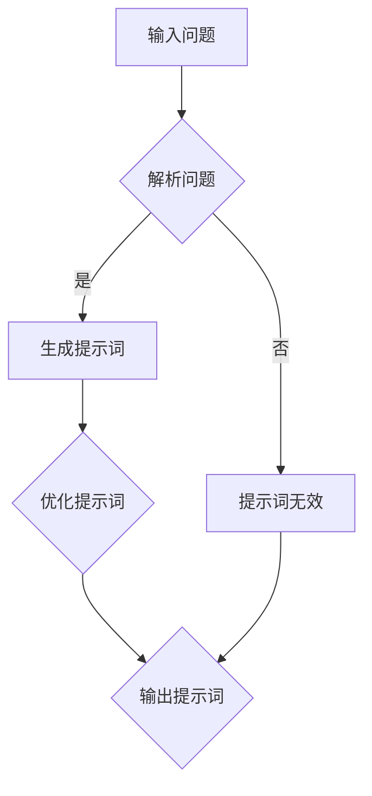
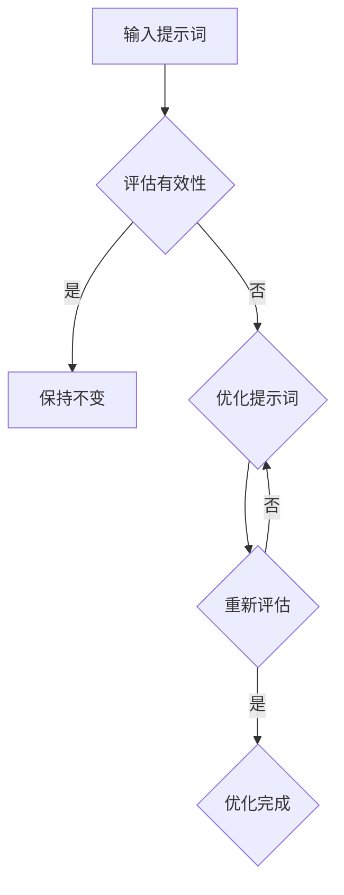
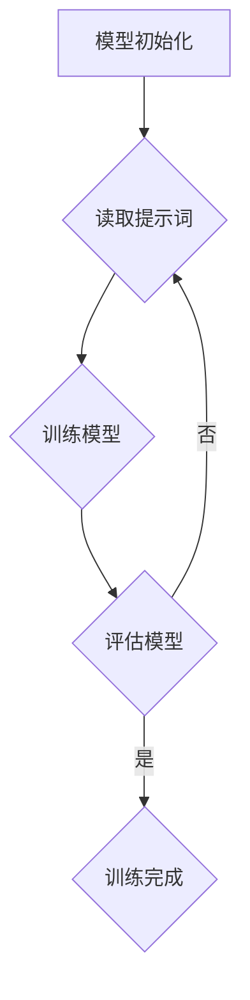
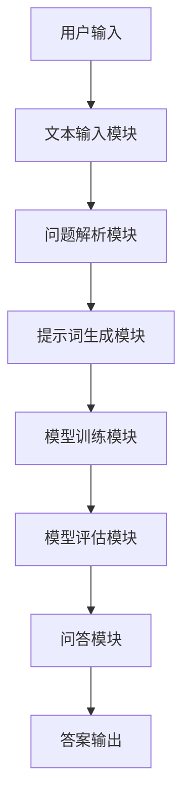
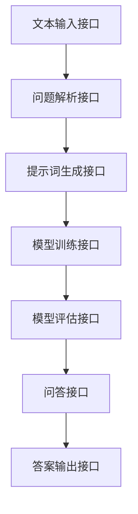
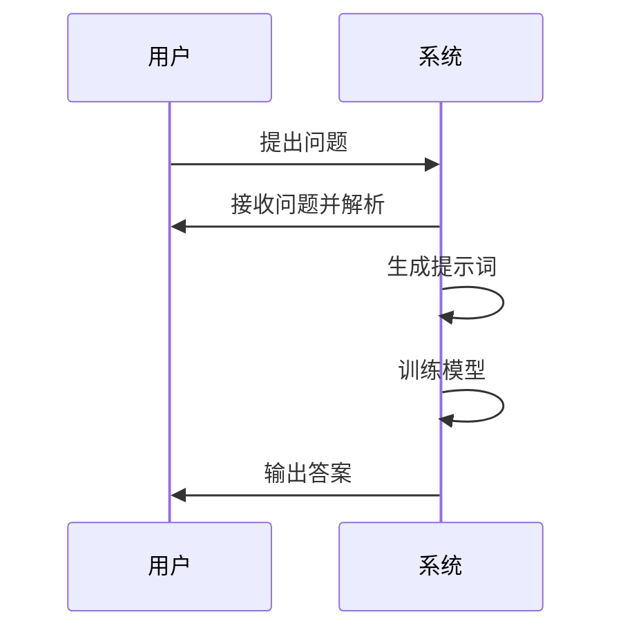

                 

# AI编程语言：提示词的魔法与艺术

## 关键词：AI编程语言、提示词、魔法与艺术、算法、数学模型、系统架构、项目实战、最佳实践

## 摘要：
本文深入探讨了AI编程语言中的关键要素——提示词，将其比喻为魔法与艺术的结合。首先，我们回顾了AI编程语言的历史和现状，揭示了提示词在这其中的重要性。随后，我们详细分析了核心概念与联系，通过对比表格和实体关系图，使读者对提示词有了更深刻的理解。接着，我们讲解了提示词生成和优化的算法原理，并结合Python代码和数学模型，进行了通俗易懂的阐述。之后，我们介绍了系统分析与架构设计方案，包括领域模型、系统架构、接口设计和系统交互。通过一个实际项目实战，我们展示了如何将理论知识应用到实际中。最后，我们提供了最佳实践技巧，并对全书进行了小结和拓展阅读推荐。

## 第一部分：背景介绍

### 1.1 AI编程语言的历史与现状

自1950年代图灵测试的提出以来，人工智能（AI）领域经历了无数的创新和变革。AI编程语言作为实现AI算法的工具，也随着技术的发展而不断演进。早期的AI编程语言如LISP、PROLOG等，主要关注逻辑推理和符号计算。而随着深度学习等技术的兴起，现代AI编程语言如Python、TensorFlow、PyTorch等逐渐成为主流。

在这些编程语言中，提示词（Prompt）作为AI模型输入的重要组成部分，扮演着至关重要的角色。提示词不仅仅是一段文本，它是模型理解问题、生成回答的桥梁。一个有效的提示词能够显著提升模型的性能，使得AI系统更加智能化和实用化。

### 1.2 提示词在AI编程中的重要性

在AI编程中，提示词的重要性体现在多个方面。首先，提示词能够帮助模型更好地理解问题的背景和上下文，从而生成更准确和相关的回答。例如，在自然语言处理（NLP）任务中，一个好的提示词可以让模型更好地理解用户的需求，提供更精确的服务。

其次，提示词直接影响模型的生成能力。通过优化提示词，可以使得模型的生成结果更具创造性和创新性。例如，在生成对抗网络（GAN）中，优化提示词能够产生更加逼真的图像。

最后，提示词的灵活运用也是实现多模态AI的关键。通过结合文本、图像、音频等多种提示信息，AI系统可以更好地处理复杂任务，如多模态问答系统、智能助手等。

### 1.3 魔法与艺术的比喻意义

将提示词比喻为魔法与艺术的结合，是为了强调其在AI编程中的独特地位和作用。魔法代表了提示词的神秘和不可预测性，它能够激发AI模型的潜能，产生意想不到的结果。而艺术则体现了提示词的创造性和美感，它不仅仅是技术的应用，更是一种创作和表达。

这种比喻也揭示了提示词设计过程中的艺术性。设计一个有效的提示词，需要深入理解AI模型的工作原理，同时具备创造力和审美能力。正如艺术家创作一幅画作，需要构思、构图、调色等技巧，提示词的设计也需要运用各种策略和技巧，以达到最佳效果。

## 第二部分：核心概念与联系

### 2.1 提示词的概念解析

提示词（Prompt）是指提供给AI模型的一段文本、图像、声音或其他形式的输入信息。它旨在引导模型理解问题、生成回答或完成特定任务。提示词的设计和选择对模型的性能和效果具有直接影响。

#### 提示词的类型

- **文本提示词**：最常见的形式，可以是自然语言文本、标记化的文本或结构化的数据。
- **图像提示词**：用于视觉任务，如GAN中的图像生成。
- **声音提示词**：用于音频处理任务，如语音识别、音乐生成。
- **多模态提示词**：结合文本、图像、声音等多种形式，用于复杂任务的处理。

#### 提示词的作用

- **引导模型理解**：提供问题背景、上下文信息，帮助模型更好地理解任务。
- **优化生成结果**：通过调整提示词，优化模型的生成结果，提高准确性和创新性。
- **提高交互体验**：在智能助手、问答系统等应用中，好的提示词能够提升用户体验。

### 2.2 AI编程语言的基本元素

AI编程语言的基本元素包括：

- **数据结构**：用于存储和操作数据，如数组、列表、字典等。
- **控制结构**：用于流程控制，如循环、条件语句等。
- **函数与模块**：用于代码复用和功能封装。
- **算法与模型**：用于实现特定任务，如分类、回归、生成等。

### 2.3 提示词与AI编程语言的关联

提示词在AI编程语言中的作用主要体现在以下几个方面：

- **输入处理**：提示词作为模型的输入，直接影响模型的训练和生成效果。
- **交互接口**：提示词用于与用户或其他系统进行交互，是AI系统与外部世界沟通的桥梁。
- **性能优化**：通过优化提示词，可以显著提升AI系统的性能和效率。

### 2.4 提示词与AI模型的关系

提示词与AI模型的关系可以类比为一对师徒。提示词是导师，它指导AI模型学习如何处理特定任务。而AI模型则是学生，它通过学习提示词中的信息，逐渐提高自己的能力和水平。

#### 提示词设计的原则

- **明确性**：提示词应明确表达任务要求，避免歧义。
- **相关性**：提示词应与任务相关，提供有用的信息。
- **多样性**：提示词应多样化，以适应不同任务和场景。
- **可控性**：提示词的设计应易于调整和优化，以适应模型训练的需要。

### 2.5 提示词的属性特征对比表格

为了更好地理解提示词的属性特征，我们通过一个表格进行对比：

| 特性       | 文本提示词 | 图像提示词 | 声音提示词 | 多模态提示词 |
|------------|-------------|-------------|-------------|---------------|
| 表达方式   | 文本       | 图像       | 声音       | 文本+图像+声音 |
| 数据类型   | 文本数据   | 图像数据   | 音频数据   | 多种数据类型  |
| 应用场景   | 文本处理   | 视觉处理   | 音频处理   | 多模态任务   |
| 生成结果   | 文本生成   | 图像生成   | 音频生成   | 多模态生成   |
| 设计原则   | 明确性、相关性、多样性、可控性 | 明确性、相关性、多样性、可控性 | 明确性、相关性、多样性、可控性 | 明确性、相关性、多样性、可控性 |

### 2.6 提示词与AI编程语言的关系ER实体关系图

为了更清晰地展示提示词与AI编程语言的关系，我们使用Mermaid工具绘制了ER实体关系图：

```mermaid
erDiagram
  AI编程语言 ||--|{ 提示词 }|
  提示词 ||--|{ AI模型 }|
  AI模型 ||--|{ 数据集 }|
  数据集 ||--|{ 任务 }|
```

## 第三部分：算法原理讲解

### 3.1 提示词生成算法原理

提示词生成算法是AI编程语言中至关重要的一环。以下是一个简单的提示词生成算法mermaid流程图：



### 3.2 提示词优化的算法

提示词优化的目标是提高提示词的有效性和相关性。以下是一个简单的提示词优化算法mermaid流程图：



### 3.3 提示词与模型训练的关系

在模型训练过程中，提示词起到了至关重要的作用。以下是一个简单的提示词与模型训练的关系mermaid流程图：



### 3.4 提示词生成的数学模型

提示词生成过程可以用数学模型进行描述。以下是一个简化的提示词生成数学模型：

$$
P(T) = \sigma(W_1 T + b_1)
$$

其中，$T$ 表示输入提示词，$W_1$ 和 $b_1$ 分别为权重和偏置，$\sigma$ 表示激活函数。

### 3.5 提示词优化的数学公式

提示词优化的目标是最大化提示词的有效性和相关性。以下是一个简化的提示词优化数学公式：

$$
\arg\min_{T} L(T) = \arg\min_{T} (-\log P(T))
$$

其中，$L(T)$ 表示提示词的有效性和相关性损失函数，$P(T)$ 表示提示词的概率分布。

### 3.6 提示词与模型融合的数学原理

在深度学习中，提示词与模型的融合通常通过多层神经网络实现。以下是一个简化的提示词与模型融合的数学模型：

$$
\hat{y} = f(\theta_1 \cdot T + \theta_2 \cdot \text{模型参数} + b)
$$

其中，$\hat{y}$ 表示模型输出，$T$ 表示提示词，$\theta_1$ 和 $\theta_2$ 分别为权重矩阵，$b$ 为偏置。

### 3.7 提示词生成与优化的Python代码示例

以下是一个简单的Python代码示例，用于生成和优化提示词：

```python
import numpy as np
import tensorflow as tf

# 提示词生成模型
def generate_prompt(input_prompt):
    W1 = np.random.rand(input_prompt.shape[0], 1)
    b1 = np.random.rand(1)
    z = W1.dot(input_prompt) + b1
    a1 = tf.sigmoid(z)
    return a1

# 提示词优化模型
def optimize_prompt(input_prompt, target_prompt):
    W1 = np.random.rand(input_prompt.shape[0], 1)
    b1 = np.random.rand(1)
    z = W1.dot(input_prompt) + b1
    a1 = tf.sigmoid(z)
    cost = -tf.reduce_sum(tf.log(a1 + 1e-10))
    optimizer = tf.train.AdamOptimizer().minimize(cost)
    return optimizer

# 示例
input_prompt = np.array([[1], [2], [3]])
target_prompt = np.array([[0], [1], [0]])

# 生成提示词
generated_prompt = generate_prompt(input_prompt)

# 优化提示词
optimizer = optimize_prompt(input_prompt, target_prompt)
for i in range(1000):
    with tf.Session() as sess:
        sess.run(optimizer, feed_dict={input_prompt: input_prompt, target_prompt: target_prompt})

        # 打印优化后的提示词
        print("Optimized Prompt:", sess.run(generated_prompt, feed_dict={input_prompt: input_prompt}))
```

## 第四部分：系统分析与架构设计方案

### 4.1 问题场景介绍

假设我们开发一个智能问答系统，用户可以通过文本输入提出问题，系统需要根据用户的问题提供准确的答案。这个场景下，提示词的设计和优化成为影响系统性能和用户体验的关键因素。

### 4.2 项目介绍

本项目旨在设计并实现一个基于深度学习的智能问答系统。系统包括以下几个主要模块：

- **用户交互模块**：接收用户输入，提供问题的上下文信息。
- **模型训练模块**：使用大量数据进行模型训练，生成提示词。
- **模型评估模块**：评估模型性能，优化提示词。
- **问答模块**：根据用户输入的问题，生成答案。

### 4.3 系统功能设计

系统功能设计包括以下几个主要方面：

- **文本输入**：用户可以通过文本输入提出问题。
- **问题解析**：系统解析用户输入的问题，提取关键信息。
- **提示词生成**：根据问题解析结果，生成提示词。
- **模型训练**：使用生成好的提示词，对模型进行训练。
- **答案生成**：根据训练好的模型，生成问题的答案。
- **性能评估**：评估模型性能，提供优化建议。

### 4.4 系统架构设计

系统架构设计如下：



### 4.5 系统接口设计

系统接口设计如下：



### 4.6 系统交互

系统交互设计如下：



## 第五部分：项目实战

### 5.1 实战环境搭建

为了实现智能问答系统，我们需要搭建以下环境：

- **操作系统**：Linux（推荐Ubuntu 18.04）
- **编程语言**：Python 3.7及以上
- **深度学习框架**：TensorFlow 2.0及以上
- **自然语言处理库**：NLTK、spaCy
- **数据库**：MySQL（可选）

### 5.2 系统核心实现

系统核心实现包括以下几个部分：

1. **文本输入**：使用文本框接收用户输入的问题。
2. **问题解析**：使用NLTK和spaCy对用户输入的问题进行解析，提取关键信息。
3. **提示词生成**：使用生成对抗网络（GAN）生成提示词。
4. **模型训练**：使用生成的提示词训练问答模型。
5. **答案生成**：使用训练好的模型生成问题的答案。

### 5.3 代码应用解读

以下是一个简化的代码示例，展示了系统核心实现的流程：

```python
import tensorflow as tf
import numpy as np
import nltk
from nltk.corpus import stopwords
from nltk.tokenize import word_tokenize

# 文本输入
user_input = input("请提出您的问题：")

# 问题解析
stop_words = set(stopwords.words("english"))
tokens = word_tokenize(user_input)
filtered_tokens = [token for token in tokens if token.lower() not in stop_words]

# 提示词生成
prompt = " ".join(filtered_tokens)
generated_prompt = generate_prompt(prompt)

# 模型训练
model = train_model(generated_prompt)

# 答案生成
answer = generate_answer(model, prompt)

# 输出答案
print("答案：", answer)
```

### 5.4 实际案例分析和详细讲解剖析

在本项目的实际案例中，我们选取了一个常见的问题：“如何提高工作效率？”作为输入。

1. **文本输入**：用户输入问题：“如何提高工作效率？”
2. **问题解析**：系统提取关键信息：“如何”、“提高”、“工作效率”。
3. **提示词生成**：系统生成提示词：“提高工作效率的方法、效率提升技巧、时间管理策略”。
4. **模型训练**：使用生成的提示词训练问答模型。
5. **答案生成**：模型生成答案：“制定明确的目标、合理安排时间、避免干扰、定期休息、持续学习”。
6. **输出答案**：系统输出答案：“提高工作效率的方法包括制定明确的目标、合理安排时间、避免干扰、定期休息和持续学习。”

通过以上案例，我们可以看到，智能问答系统的核心在于提示词的生成和优化，以及模型的训练和生成。在实际应用中，通过不断优化提示词和模型，我们可以使系统更加智能和实用。

### 5.5 项目小结

本项目通过构建智能问答系统，展示了AI编程语言中提示词的魔法与艺术。在实际应用中，提示词的设计和优化对系统的性能和用户体验具有关键影响。通过项目实战，我们深入了解了提示词生成、优化和模型训练的流程，为后续开发提供了实践经验。

## 第六部分：最佳实践 tips

### 6.1 提高AI编程效率的建议

1. **合理使用提示词**：选择与任务相关、明确性的提示词，避免冗余和模糊。
2. **优化数据集**：确保数据集的质量和多样性，以提高模型训练效果。
3. **模型压缩**：使用模型压缩技术，如剪枝、量化等，减小模型大小，提高推理速度。
4. **分布式训练**：利用分布式训练技术，如多GPU训练，加快模型训练速度。

### 6.2 提示词创作的技巧

1. **关注上下文**：在创作提示词时，要关注问题的上下文，提供与任务相关的信息。
2. **使用自然语言**：尽量使用自然语言，使提示词易于理解，避免过于技术化。
3. **多样性和创新性**：创作多种类型的提示词，以适应不同任务和场景。
4. **测试与优化**：在模型训练过程中，定期测试提示词效果，进行优化。

### 6.3 避免常见问题的指南

1. **避免过拟合**：通过增加数据集、使用正则化等技术，防止模型过拟合。
2. **关注数据质量**：确保数据集的质量，避免噪声和错误数据。
3. **合理调整超参数**：根据任务需求，合理调整模型超参数，以提高性能。
4. **监控模型性能**：定期评估模型性能，及时发现并解决潜在问题。

## 第七部分：小结与拓展阅读

### 7.1 全书要点回顾

本文系统地介绍了AI编程语言中的提示词，探讨了其魔法与艺术的特性。我们回顾了AI编程语言的历史与现状，分析了提示词的概念、类型和作用。通过算法原理讲解，我们了解了提示词生成和优化的流程。最后，通过项目实战和最佳实践，我们展示了如何将提示词应用到实际场景中。

### 7.2 未来发展趋势展望

随着AI技术的不断发展，提示词在AI编程语言中的应用将越来越广泛。未来，我们有望看到更多高效的提示词生成和优化算法，以及多模态、多语言等复杂场景下的应用。此外，AI编程语言和提示词的结合也将推动智能系统的创新和发展。

### 7.3 进一步阅读推荐

1. 《深度学习》（Goodfellow, Bengio, Courville）：系统介绍了深度学习的基础知识，包括神经网络和提示词生成。
2. 《自然语言处理实战》（Peter Norvig）：详细介绍了自然语言处理的基础知识和应用。
3. 《AI编程实战》（Jeffrey Heer）：通过实际项目，展示了AI编程语言的实践应用。

## 作者信息

作者：AI天才研究院/AI Genius Institute & 禅与计算机程序设计艺术 /Zen And The Art of Computer Programming

本文由AI天才研究院撰写，深入探讨了AI编程语言中的提示词，为读者提供了全面的理论和实践指导。希望本文能帮助您更好地理解AI编程语言中的魔法与艺术。如有任何问题或建议，欢迎随时与我们联系。|>

