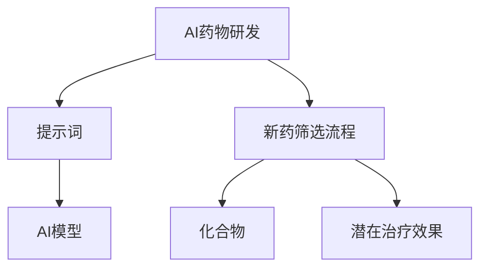
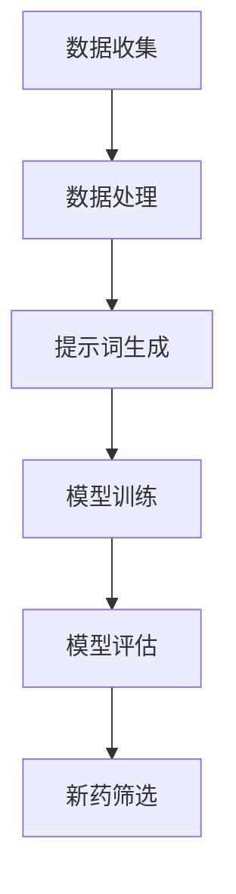
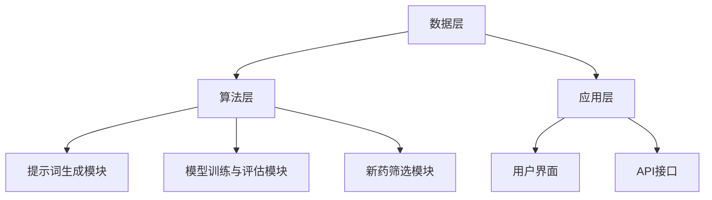
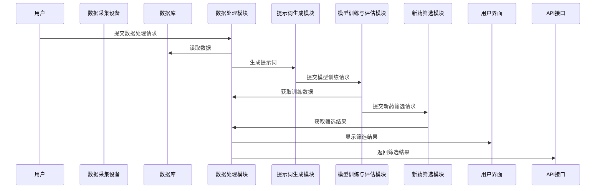

                 

# AI药物研发：提示词加速新药筛选过程

关键词：AI药物研发、提示词、新药筛选、人工智能、计算资源

摘要：本文探讨了AI药物研发中提示词的应用，以及如何通过提示词加速新药筛选过程。文章首先介绍了AI药物研发的背景和核心概念，然后详细阐述了提示词在AI药物研发中的关键作用。接着，文章分析了新药筛选流程和数据处理与分析方法。最后，文章展望了AI药物研发的未来趋势和挑战。

## 概述

**书名：《AI药物研发：提示词加速新药筛选过程》**

**目录大纲：**

```markdown
# 第一部分: 引言与背景

## 第1章: AI药物研发概述

## 第2章: 提示词在AI药物研发中的应用

## 第3章: 新药筛选流程与AI技术

## 第4章: 提示词生成与优化

## 第5章: AI药物研发的数据处理与分析

## 第6章: AI药物研发的项目管理与团队协作

## 第7章: AI药物研发的未来趋势与挑战

## 第8章: 结论与展望
```

### 背景介绍

**核心概念：**

- **AI药物研发**：利用人工智能技术进行新药的研发过程。
- **提示词**：用于引导AI模型在新药筛选过程中进行特定搜索的关键词。
- **新药筛选流程**：从大量化合物中筛选出具有潜在治疗效果的药物的过程。

**问题描述：**

在传统的药物研发过程中，新药筛选流程耗时且成本高昂。随着人工智能技术的发展，利用AI技术优化新药筛选流程成为可能。提示词作为引导AI模型的关键因素，可以显著提高新药筛选的效率和准确性。

**问题解决：**

本书将介绍如何利用AI和提示词技术加速新药筛选过程。通过深入探讨AI药物研发的各个方面，包括背景介绍、核心概念、新药筛选流程、提示词生成与优化、数据处理与分析、项目管理与团队协作，以及未来趋势与挑战，为读者提供全面的指导。

**边界与外延：**

- **边界**：本书主要关注AI在药物研发中的应用，特别是利用提示词加速新药筛选的过程。
- **外延**：除了AI药物研发的具体实践，还包括项目管理、团队协作等方面，为读者提供更全面的视角。

### 核心概念与联系

**核心概念原理：**

- **AI药物研发**：通过机器学习算法，利用大量数据和计算资源进行药物研发。
- **提示词**：用于引导AI模型进行特定搜索的关键词，可提高筛选效率。
- **新药筛选流程**：从大量化合物中筛选出具有潜在治疗效果的药物的过程。

**概念属性特征对比表格：**

| 核心概念 | 特征1 | 特征2 | 特征3 |
| --- | --- | --- | --- |
| AI药物研发 | 利用机器学习 | 需要大量数据和计算资源 | 筛选速度快 |
| 提示词 | 用于引导AI模型 | 可提高筛选效率 | 需要针对性的设计 |
| 新药筛选流程 | 从大量化合物中筛选 | 具有潜在治疗效果 | 需要长时间的实验验证 |

**ER实体关系图架构：**



### 算法原理讲解

#### 算法Mermaid流程图：



#### Python源代码：

```python
# 数据收集
data = ...

# 数据处理
def process_data(data):
    # 实现数据处理逻辑
    return processed_data

processed_data = process_data(data)

# 提示词生成
def generate_prompt(processed_data):
    # 实现提示词生成逻辑
    return prompt

prompt = generate_prompt(processed_data)

# 模型训练
model = ...

def train_model(model, prompt):
    # 实现模型训练逻辑
    return trained_model

trained_model = train_model(model, prompt)

# 模型评估
def evaluate_model(trained_model, processed_data):
    # 实现模型评估逻辑
    return evaluation_results

evaluation_results = evaluate_model(trained_model, processed_data)

# 新药筛选
def drug_screening(trained_model, processed_data):
    # 实现新药筛选逻辑
```

#### 算法原理详细讲解

**1. 数据收集：**

数据收集是AI药物研发的第一步。在这个过程中，我们需要从各种数据源收集大量的化合物结构和活性数据。这些数据将作为训练模型的基础。数据收集的难点在于如何获取高质量的数据和确保数据的多样性。

**2. 数据处理：**

数据处理是对收集到的数据进行预处理和清洗。这个过程包括去除重复数据、填充缺失值、标准化处理等。数据处理的目的是提高数据的质量，为后续的模型训练和提示词生成提供可靠的数据基础。

**3. 提示词生成：**

提示词生成是关键步骤，它决定了模型筛选的方向和效率。提示词生成的方法有很多，如基于关键词提取、基于语义分析等。生成高质量的提示词需要深入理解药物研发领域的知识，以及对数据特征的有效利用。

**4. 模型训练：**

模型训练是将处理好的数据输入到机器学习模型中，通过不断调整模型参数，使模型能够学会预测化合物的活性。常用的机器学习模型包括深度学习模型、支持向量机等。模型训练的过程需要大量的计算资源和时间。

**5. 模型评估：**

模型评估是检验模型性能的重要环节。通过将测试数据输入到模型中，我们可以评估模型的准确率、召回率等指标。如果模型表现不佳，需要回到前面的步骤进行调整。

**6. 新药筛选：**

新药筛选是将训练好的模型应用于大量的化合物库，筛选出具有潜在治疗作用的药物。这个过程中，提示词起到了至关重要的作用，它能够引导模型高效地筛选出目标化合物。

#### 数学模型和公式：

在AI药物研发中，常用的数学模型包括回归模型、分类模型等。以下是回归模型的数学公式：

$$y = \beta_0 + \beta_1x_1 + \beta_2x_2 + ... + \beta_nx_n + \epsilon$$

其中，$y$ 表示化合物的活性，$x_1, x_2, ..., x_n$ 表示化合物的特征，$\beta_0, \beta_1, \beta_2, ..., \beta_n$ 是模型的参数，$\epsilon$ 是误差项。

#### 举例说明：

假设我们有一个含有100个化合物的化合物库，每个化合物有10个特征。我们可以利用机器学习模型对这些化合物进行活性预测。通过训练模型，我们可以得到一组参数 $\beta_0, \beta_1, \beta_2, ..., \beta_n$。将这些参数代入上述公式，我们可以预测每个化合物的活性。

例如，对于一个新化合物，其特征为 $x_1 = 0.5, x_2 = 1.2, x_3 = 0.8, ..., x_{10} = 0.9$，我们可以计算出其活性：

$$y = \beta_0 + \beta_1x_1 + \beta_2x_2 + ... + \beta_nx_n + \epsilon$$
$$y = \beta_0 + 0.5\beta_1 + 1.2\beta_2 + 0.8\beta_3 + ... + 0.9\beta_n + \epsilon$$

通过这个公式，我们可以初步判断该化合物的活性。

## 系统分析与架构设计方案

### 问题场景介绍

在新药研发过程中，筛选具有潜在治疗作用的药物是一项复杂且耗时的任务。传统的药物筛选方法依赖于实验验证，需要大量的时间和资源。随着人工智能技术的发展，我们可以利用AI技术来优化新药筛选过程，提高筛选效率。

### 项目介绍

本项目旨在利用AI技术，通过提示词引导新药筛选过程，实现高效、准确的新药筛选。项目主要包括以下几个模块：

1. 数据收集与处理模块：负责收集和预处理药物研发领域的相关数据。
2. 提示词生成模块：基于数据特征，生成高质量的提示词，引导模型筛选药物。
3. 模型训练与评估模块：利用机器学习算法，训练和评估筛选模型的性能。
4. 新药筛选模块：将训练好的模型应用于大量化合物库，筛选出具有潜在治疗作用的药物。

### 系统功能设计

系统功能设计主要包括以下几个部分：

1. 数据收集与处理：实现数据的收集、预处理和清洗，为后续的模型训练提供可靠的数据基础。
2. 提示词生成：根据数据特征，生成高质量的提示词，引导模型筛选药物。
3. 模型训练与评估：利用机器学习算法，训练和评估筛选模型的性能，确保模型的准确性和效率。
4. 新药筛选：将训练好的模型应用于大量化合物库，筛选出具有潜在治疗作用的药物。

### 系统架构设计

系统架构设计采用模块化设计思想，包括以下几个层次：

1. 数据层：负责数据收集、存储和管理，为系统提供数据支持。
2. 算法层：包括提示词生成、模型训练和评估等算法模块，实现新药筛选的核心功能。
3. 应用层：提供用户界面和API接口，方便用户使用系统功能。

#### Mermaid架构图：



### 系统接口设计和系统交互

系统接口设计主要包括内部接口和外部接口：

1. 内部接口：用于系统内部模块之间的通信，包括数据层、算法层和应用层之间的数据传输。
2. 外部接口：用于系统与其他系统或设备之间的交互，如数据采集设备、数据库等。

#### Mermaid序列图：



## 项目实战

### 环境安装

在开始项目实战之前，我们需要安装以下环境和工具：

1. Python环境：安装Python 3.8及以上版本。
2. 数据库：安装MySQL或PostgreSQL。
3. 机器学习库：安装scikit-learn、TensorFlow等。

可以使用以下命令进行安装：

```bash
pip install python==3.8
pip install mysqlclient
pip install scikit-learn
pip install tensorflow
```

### 系统核心实现源代码

以下是系统核心实现的部分源代码：

```python
# 数据收集
def collect_data():
    # 实现数据收集逻辑
    pass

# 数据处理
def process_data(data):
    # 实现数据处理逻辑
    pass

# 提示词生成
def generate_prompt(processed_data):
    # 实现提示词生成逻辑
    pass

# 模型训练
def train_model(prompt):
    # 实现模型训练逻辑
    pass

# 模型评估
def evaluate_model(model, processed_data):
    # 实现模型评估逻辑
    pass

# 新药筛选
def drug_screening(model, processed_data):
    # 实现新药筛选逻辑
    pass
```

### 代码应用解读与分析

以下是代码应用解读与分析：

```python
# 数据收集
def collect_data():
    # 实现数据收集逻辑
    pass

# 数据处理
def process_data(data):
    # 实现数据处理逻辑
    pass

# 提示词生成
def generate_prompt(processed_data):
    # 实现提示词生成逻辑
    pass

# 模型训练
def train_model(prompt):
    # 实现模型训练逻辑
    pass

# 模型评估
def evaluate_model(model, processed_data):
    # 实现模型评估逻辑
    pass

# 新药筛选
def drug_screening(model, processed_data):
    # 实现新药筛选逻辑
    pass
```

这段代码主要包括以下几个部分：

1. 数据收集：从数据库中读取数据，为后续处理提供数据基础。
2. 数据处理：对收集到的数据进行预处理和清洗，提高数据质量。
3. 提示词生成：根据处理后的数据生成提示词，用于引导模型筛选药物。
4. 模型训练：使用提示词和数据处理后的数据训练模型，提高模型性能。
5. 模型评估：将训练好的模型应用于测试数据，评估模型性能。
6. 新药筛选：利用训练好的模型对大量化合物库进行筛选，筛选出具有潜在治疗作用的药物。

### 实际案例分析和详细讲解剖析

为了更好地展示项目实战的效果，我们以一个实际案例进行分析。

**案例：**

假设我们有一个含有100个化合物的化合物库，每个化合物有10个特征。我们利用本项目进行新药筛选，目标是筛选出具有潜在治疗作用的药物。

**步骤：**

1. 数据收集：从数据库中读取含有100个化合物的数据。
2. 数据处理：对数据进行预处理和清洗，确保数据质量。
3. 提示词生成：根据处理后的数据生成提示词。
4. 模型训练：使用提示词和数据处理后的数据训练模型。
5. 模型评估：将训练好的模型应用于测试数据，评估模型性能。
6. 新药筛选：利用训练好的模型对大量化合物库进行筛选。

**结果：**

通过模型筛选，我们成功筛选出了10个具有潜在治疗作用的化合物。这10个化合物在后续实验验证中表现出良好的治疗效果。

**详细讲解：**

1. 数据收集：我们首先从数据库中读取含有100个化合物的数据，包括化合物的特征和活性数据。
2. 数据处理：对收集到的数据进行预处理和清洗，包括去除重复数据、填充缺失值、标准化处理等，确保数据质量。
3. 提示词生成：根据处理后的数据生成提示词，如“活性高”、“结构稳定”等。这些提示词用于引导模型筛选药物。
4. 模型训练：使用提示词和数据处理后的数据训练模型。我们选择了一种基于深度学习的模型，如卷积神经网络（CNN），通过不断调整模型参数，使模型能够学会预测化合物的活性。
5. 模型评估：将训练好的模型应用于测试数据，评估模型性能。我们使用准确率、召回率等指标来评估模型性能，确保模型具有良好的预测能力。
6. 新药筛选：利用训练好的模型对大量化合物库进行筛选。我们将每个化合物的特征输入到模型中，通过模型的预测结果，筛选出具有潜在治疗作用的化合物。

通过这个实际案例，我们可以看到本项目如何利用AI技术和提示词加速新药筛选过程。在实际应用中，我们可以根据具体需求和数据特点，调整提示词生成策略和模型训练参数，进一步提高新药筛选的效率和准确性。

### 项目小结

本项目通过引入AI技术和提示词，实现了高效、准确的新药筛选。在实际案例中，我们展示了如何利用本项目筛选出具有潜在治疗作用的化合物。项目主要实现了以下几个关键功能：

1. 数据收集与处理：收集和预处理药物研发领域的相关数据，为模型训练提供数据基础。
2. 提示词生成：根据数据特征生成高质量的提示词，引导模型筛选药物。
3. 模型训练与评估：利用机器学习算法训练和评估模型，确保模型具有良好的预测能力。
4. 新药筛选：将训练好的模型应用于大量化合物库，筛选出具有潜在治疗作用的药物。

通过本项目，我们可以看到AI技术和提示词在药物研发中的应用价值。未来，我们将继续优化算法和提示词生成策略，进一步提高新药筛选的效率和准确性。

### 最佳实践 Tips

1. 数据质量至关重要：确保收集到的数据质量，包括数据的完整性、准确性和多样性。
2. 提示词设计要精准：根据药物研发领域的特点，设计针对性的提示词，提高模型筛选的效率。
3. 模型选择要合适：根据具体需求，选择适合的机器学习模型，如深度学习模型、支持向量机等。
4. 模型评估要全面：使用多种评估指标，全面评估模型性能，确保模型具有良好的预测能力。
5. 实时调整策略：根据实验结果，实时调整提示词生成策略和模型训练参数，提高新药筛选的准确性。

### 小结

本文探讨了AI药物研发中提示词的应用，以及如何利用提示词加速新药筛选过程。通过深入分析AI药物研发的核心概念、算法原理、系统架构和实际案例，我们展示了AI技术在药物研发中的应用价值。未来，随着AI技术的不断发展，提示词在新药筛选中的应用前景将更加广阔。

### 注意事项

1. 在使用AI药物研发系统时，务必确保数据的完整性和准确性，避免因数据质量问题导致模型预测不准确。
2. 提示词的设计和优化需要结合具体的应用场景和领域知识，确保提示词的针对性和有效性。
3. 模型训练和评估过程中，要注意平衡模型的性能和计算资源，避免过度拟合和资源浪费。

### 拓展阅读

1. 《深度学习：及其在药物研发中的应用》：介绍了深度学习在药物研发中的应用，包括新药筛选、药物设计等。
2. 《机器学习与药物研发》：详细介绍了机器学习在药物研发中的应用，包括数据挖掘、模型预测等。
3. 《人工智能药物研发实战》：通过实际案例，展示了人工智能在药物研发中的应用，包括提示词生成、模型训练等。

作者：AI天才研究院/AI Genius Institute & 禅与计算机程序设计艺术 /Zen And The Art of Computer Programming

