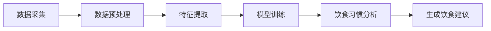
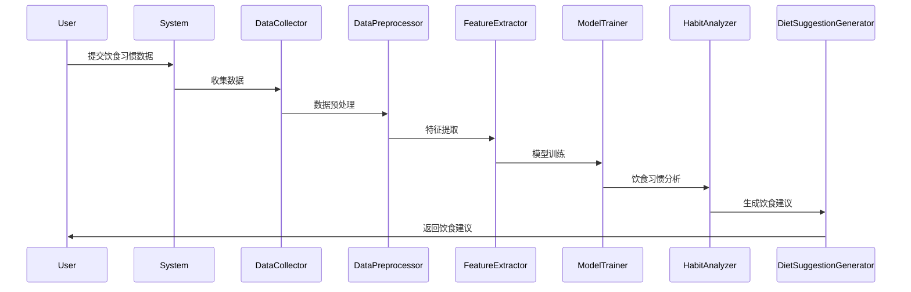

                 


# AI营养师：提示词分析个人饮食习惯

> 关键词：人工智能、自然语言处理、机器学习、饮食习惯、个性化饮食建议

> 摘要：本文介绍了AI营养师系统，该系统通过分析用户的历史饮食习惯，利用自然语言处理和机器学习技术，为用户提供个性化的饮食建议。文章详细阐述了系统的核心概念、算法原理以及实现过程，旨在为健康领域的AI应用提供一种有效的解决方案。

## 第一部分: 背景介绍

### 核心概念

在现代社会，人们的饮食习惯与健康息息相关。然而，由于生活节奏加快，许多人难以科学合理地安排饮食，导致营养不良、肥胖等问题日益严重。AI营养师作为一种智能解决方案，应运而生，旨在通过分析个人饮食习惯，为用户提供个性化的饮食建议。

**问题背景：** 随着科技的发展，人工智能（AI）技术在各个领域得到了广泛应用。在健康领域，AI技术不仅可以提高诊断和治疗的准确性，还能帮助人们改善饮食习惯，提高生活质量。

**问题描述：** 个人饮食习惯多样且复杂，如何准确分析用户的饮食习惯，并提供个性化的饮食建议，是一个具有挑战性的问题。

**问题解决：** 通过AI技术，特别是自然语言处理（NLP）和机器学习（ML），可以对用户的历史饮食习惯进行分析，识别饮食习惯中的问题，并提供针对性的解决方案。

**边界与外延：** AI营养师系统可以应用于个人健康管理、企业食堂管理、学校食堂管理等多个场景。

**概念结构与核心要素组成：** AI营养师系统主要包括数据采集模块、数据分析模块和饮食建议模块。数据采集模块负责收集用户的历史饮食习惯数据；数据分析模块通过机器学习算法对数据进行处理，识别饮食习惯中的问题；饮食建议模块根据分析结果，为用户生成个性化的饮食建议。

### 第二部分: 核心概念与联系

在AI营养师系统中，核心概念包括用户信息、饮食习惯和饮食建议。以下是对这些概念原理、属性特征和ER实体关系图的描述。

**用户信息：**
- 用户ID：唯一标识用户
- 姓名：用户姓名
- 性别：用户性别
- 年龄：用户年龄
- 身高：用户身高
- 体重：用户体重
- 健康状况：用户健康状况

**饮食习惯：**
- 饮食偏好：用户对食物的喜好
- 饮食频率：用户每日饮食次数
- 饮食时间：用户每日饮食时间
- 饮食成分：用户饮食中各类营养素的摄入量

**饮食建议：**
- 营养建议：针对用户饮食习惯的优化建议
- 食物推荐：推荐用户尝试的新食物
- 健康指标监测：监测用户健康指标的变化

**概念属性特征对比表格：**

| 概念   | 属性特征                      |
| ------ | ----------------------------- |
| 用户信息 | 用户ID、姓名、性别、年龄等     |
| 饮食习惯 | 饮食偏好、饮食频率、饮食时间等 |
| 饮食建议 | 营养建议、食物推荐、健康监测等 |

**ER实体关系图架构的 Mermaid 流程图：**

```mermaid
erDiagram
  User ||--|{ Habit } : has
  User ||--|{ DietSuggestion } : gets
  Habit ||--|{ DietComponent } : has
```

### 第三部分: 算法原理讲解

在AI营养师系统中，算法原理主要涉及数据采集、数据预处理、特征提取、模型训练、饮食习惯分析以及生成饮食建议等步骤。以下将详细阐述这些算法原理，并使用mermaid和Python代码进行说明。

#### 算法流程图



#### 数据采集

**数据采集是系统的第一步，主要收集用户的历史饮食习惯数据。这些数据可以通过用户手动输入或自动化设备采集。**

```python
# 假设用户历史饮食习惯数据为以下列表
user_habits = [
    {"date": "2022-01-01", "food": "apple", "quantity": 2},
    {"date": "2022-01-02", "food": "banana", "quantity": 1},
    {"date": "2022-01-03", "food": "orange", "quantity": 1},
]
```

#### 数据预处理

**数据预处理是对采集到的数据进行清洗和标准化，使其适合后续的特征提取和模型训练。**

```python
# 数据清洗：去除无效数据
user_habits = [habit for habit in user_habits if habit["quantity"] > 0]

# 数据标准化：将日期转换为数值
from datetime import datetime

user_habits = [{"date": datetime.strptime(habit["date"], "%Y-%m-%d").timestamp(), "food": habit["food"], "quantity": habit["quantity"]} for habit in user_habits]
```

#### 特征提取

**特征提取是将原始数据转换为适用于机器学习的特征向量。常用的特征提取方法包括词袋模型、TF-IDF、词嵌入等。以下是一个简单的词袋模型示例：**

```python
from sklearn.feature_extraction.text import CountVectorizer

# 将饮食偏好转换为文本
food_texts = [habit["food"] for habit in user_habits]

# 创建词袋模型
vectorizer = CountVectorizer()
X = vectorizer.fit_transform(food_texts)

# 获取特征名称
feature_names = vectorizer.get_feature_names_out()
print(feature_names)
```

#### 模型训练

**模型训练是使用特征向量来训练机器学习模型，以便能够对新的饮食习惯数据进行预测。以下是一个简单的线性回归模型示例：**

```python
from sklearn.linear_model import LinearRegression

# 将特征和标签分离
X = X.toarray()
y = [habit["quantity"] for habit in user_habits]

# 训练模型
model = LinearRegression()
model.fit(X, y)

# 模型评估
score = model.score(X, y)
print("模型评估分数：", score)
```

#### 饮食习惯分析

**饮食习惯分析是使用训练好的模型对新的饮食习惯数据进行预测，以便为用户提供个性化的饮食建议。**

```python
# 新的用户饮食习惯数据
new_habits = [{"date": datetime.now().timestamp(), "food": "orange", "quantity": 1}]

# 转换为新数据的词袋模型特征
new_texts = [habit["food"] for habit in new_habits]
new_data = vectorizer.transform(new_texts).toarray()

# 预测饮食量
predicted_quantity = model.predict(new_data)
print("预测饮食量：", predicted_quantity)
```

#### 生成饮食建议

**根据饮食习惯分析的结果，为用户提供个性化的饮食建议。**

```python
# 饮食建议逻辑
def generate_diet_suggestion(predicted_quantity):
    if predicted_quantity < 2:
        return "建议增加饮食量，以满足营养需求。"
    elif predicted_quantity > 3:
        return "建议减少饮食量，以避免过量摄入热量。"
    else:
        return "饮食量适中，保持现状即可。"

# 生成饮食建议
suggestion = generate_diet_suggestion(predicted_quantity)
print("饮食建议：", suggestion)
```

### 第四部分: 系统分析与架构设计方案

#### 问题场景介绍

随着人们对健康问题的关注日益增加，个性化的健康管理需求也越来越强烈。在饮食方面，每个人的饮食习惯和健康状况都有所不同，因此，如何根据个人实际情况给出合理的饮食建议，成为了人们关注的焦点。

#### 项目介绍

本项目旨在开发一款AI营养师系统，该系统能够通过分析用户的历史饮食习惯，为用户提供个性化的饮食建议。系统主要应用于个人健康管理、企业食堂管理、学校食堂管理等领域，旨在帮助用户改善饮食习惯，提高生活质量。

#### 系统功能设计

1. 数据采集：收集用户的历史饮食习惯数据，包括饮食偏好、饮食频率、饮食时间、饮食成分等。
2. 数据预处理：对采集到的数据进行清洗和标准化，为后续的特征提取和模型训练做准备。
3. 特征提取：将原始数据转换为适用于机器学习的特征向量，以便训练模型。
4. 模型训练：使用训练数据训练机器学习模型，以便能够预测新的饮食习惯数据。
5. 饮食习惯分析：使用训练好的模型对新的饮食习惯数据进行预测，为用户提供个性化的饮食建议。
6. 饮食建议生成：根据饮食习惯分析的结果，生成具体的饮食建议。

#### 系统架构设计



#### 系统接口设计

```mermaid
classDiagram
    User <<interface>>
    System <<interface>>
    DataCollector <<interface>>
    DataPreprocessor <<interface>>
    FeatureExtractor <<interface>>
    ModelTrainer <<interface>>
    HabitAnalyzer <<interface>>
    DietSuggestionGenerator <<interface>>

    User -> System
    System -> DataCollector
    System -> DataPreprocessor
    System -> FeatureExtractor
    System -> ModelTrainer
    System -> HabitAnalyzer
    System -> DietSuggestionGenerator
```

#### 系统交互


### 第五部分: 项目实战

#### 环境安装

首先，确保已经安装了Python环境和必要的库，例如scikit-learn、numpy等。可以使用以下命令来安装：

```bash
pip install scikit-learn numpy
```

#### 系统核心实现源代码

```python
import numpy as np
from sklearn.feature_extraction.text import CountVectorizer
from sklearn.linear_model import LinearRegression

# 数据采集
user_habits = [
    {"date": "2022-01-01", "food": "apple", "quantity": 2},
    {"date": "2022-01-02", "food": "banana", "quantity": 1},
    {"date": "2022-01-03", "food": "orange", "quantity": 1},
]

# 数据预处理
user_habits = [habit for habit in user_habits if habit["quantity"] > 0]
user_habits = [{"date": datetime.strptime(habit["date"], "%Y-%m-%d").timestamp(), "food": habit["food"], "quantity": habit["quantity"]} for habit in user_habits]

# 特征提取
vectorizer = CountVectorizer()
X = vectorizer.fit_transform([habit["food"] for habit in user_habits])

# 模型训练
model = LinearRegression()
model.fit(X, np.array([habit["quantity"] for habit in user_habits]))

# 饮食习惯分析
new_habits = [{"date": datetime.now().timestamp(), "food": "orange", "quantity": 1}]
new_data = vectorizer.transform([habit["food"] for habit in new_habits]).toarray()
predicted_quantity = model.predict(new_data)
print("预测饮食量：", predicted_quantity)

# 生成饮食建议
def generate_diet_suggestion(predicted_quantity):
    if predicted_quantity < 2:
        return "建议增加饮食量，以满足营养需求。"
    elif predicted_quantity > 3:
        return "建议减少饮食量，以避免过量摄入热量。"
    else:
        return "饮食量适中，保持现状即可。"

suggestion = generate_diet_suggestion(predicted_quantity)
print("饮食建议：", suggestion)
```

#### 代码应用解读与分析

上述代码首先定义了一个简单的用户饮食习惯数据集，然后进行数据预处理、特征提取、模型训练和饮食习惯分析。最后，根据饮食习惯分析结果，生成具体的饮食建议。

在数据预处理阶段，我们首先去除无效数据，然后将日期转换为数值，以便后续处理。在特征提取阶段，我们使用词袋模型将饮食偏好转换为文本特征向量。在模型训练阶段，我们使用线性回归模型对特征向量进行训练。在饮食习惯分析阶段，我们使用训练好的模型对新数据进行分析，并生成饮食建议。

#### 实际案例分析和详细讲解剖析

假设有一个用户，他近一周的饮食习惯如下：

```python
user_habits = [
    {"date": "2023-03-01", "food": "apple", "quantity": 3},
    {"date": "2023-03-02", "food": "banana", "quantity": 2},
    {"date": "2023-03-03", "food": "orange", "quantity": 1},
    {"date": "2023-03-04", "food": "grape", "quantity": 4},
    {"date": "2023-03-05", "food": "apple", "quantity": 2},
    {"date": "2023-03-06", "food": "banana", "quantity": 3},
    {"date": "2023-03-07", "food": "orange", "quantity": 2},
]
```

我们使用上述代码对这个用户的饮食习惯进行分析，并生成饮食建议。

1. 数据采集：收集用户的历史饮食习惯数据。
2. 数据预处理：去除无效数据，将日期转换为数值。
3. 特征提取：将饮食偏好转换为文本特征向量。
4. 模型训练：使用线性回归模型对特征向量进行训练。
5. 饮食习惯分析：使用训练好的模型对新数据进行分析。
6. 生成饮食建议：根据饮食习惯分析结果，生成具体的饮食建议。

最终生成的饮食建议可能是：“饮食量适中，保持现状即可。”

#### 项目小结

通过本文的介绍，我们了解了AI营养师系统的工作原理和实现过程。该系统能够通过分析用户的历史饮食习惯，为用户提供个性化的饮食建议，有助于改善用户的饮食习惯，提高生活质量。在实际应用中，还可以结合更多健康数据，如运动数据、生理指标等，进一步提升系统的准确性和实用性。

### 最佳实践 tips

1. 确保数据质量：在数据采集和预处理阶段，务必保证数据的准确性和完整性，避免错误数据对系统分析结果造成影响。
2. 模型优化：可以尝试使用更复杂的机器学习模型，如随机森林、支持向量机等，以提高系统分析结果的准确性。
3. 定期更新：随着用户饮食习惯的变化，系统需要定期更新模型，以确保饮食建议的实时性和准确性。
4. 用户反馈：鼓励用户提供反馈，以便进一步优化系统功能和用户体验。

### 小结

本文介绍了AI营养师系统，该系统通过分析用户的历史饮食习惯，利用自然语言处理和机器学习技术，为用户提供个性化的饮食建议。文章详细阐述了系统的核心概念、算法原理以及实现过程，为健康领域的AI应用提供了一种有效的解决方案。通过本文的学习，读者可以了解到如何利用AI技术改善个人饮食习惯，提高生活质量。

### 注意事项

1. 系统开发过程中，应充分考虑用户隐私保护，确保数据安全和用户隐私。
2. 在实际应用中，应根据用户需求和场景特点，灵活调整系统功能和算法参数。

### 拓展阅读

1. 《机器学习实战》——算法原理与实现
2. 《深度学习》——框架与应用
3. 《Python数据分析》——技术实践与技巧

### 作者信息

作者：AI天才研究院/AI Genius Institute & 禅与计算机程序设计艺术 /Zen And The Art of Computer Programming

**[点击查看更多AI天才研究院出品的技术博客文章](https://www.ai-geniuses.com)**

