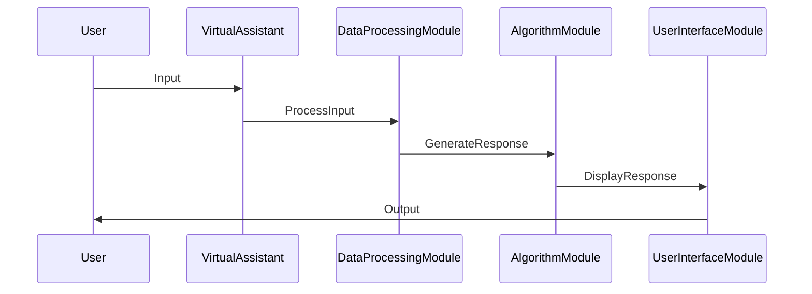
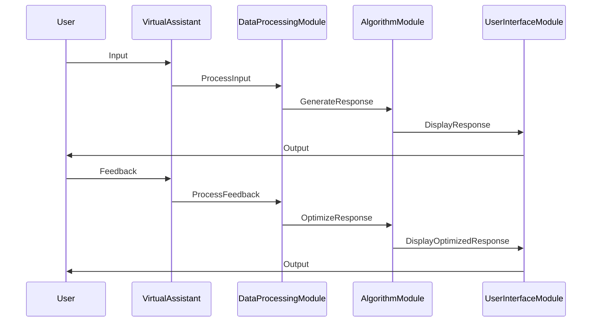

                 

## 《AI虚拟助手：提示词设计的人性化》

### 关键词：人工智能、虚拟助手、提示词设计、人性化设计、算法原理

> 摘要：本文深入探讨了AI虚拟助手中的提示词设计，分析了其背景、核心概念、算法原理以及系统架构。通过对人性化设计原则的阐述，结合实际案例，提出了提升用户体验的有效策略，为AI虚拟助手的设计与应用提供了全面的指导。

----------------------------------------------------------------

### 《AI虚拟助手：提示词设计的人性化》目录大纲

**第一部分：背景介绍与核心概念**

**第二部分：核心概念与联系**

**第三部分：算法原理讲解**

**第四部分：系统分析与架构设计**

**第五部分：项目实战与最佳实践**

----------------------------------------------------------------

## 第一部分：背景介绍与核心概念

### 第1章：问题背景与核心概念

**1.1 问题背景**

随着人工智能技术的迅猛发展，AI虚拟助手已成为各行业的重要工具。它们能够处理大量信息，提供个性化的服务，极大地提高了用户的工作效率。然而，虚拟助手的核心——提示词设计，却常常被人们忽视。提示词不仅是用户与虚拟助手之间的桥梁，更是影响用户体验的关键因素。

**1.1.1 AI虚拟助手的发展与普及**

AI虚拟助手（或称为聊天机器人、对话系统）起源于自然语言处理（NLP）技术。随着深度学习、神经网络等算法的进步，虚拟助手逐渐具备了处理复杂对话的能力。从最初的简单问答系统，到现在的多轮对话和情境理解，虚拟助手已经在电商、客服、教育等多个领域得到广泛应用。

**1.1.2 提示词设计的现状与挑战**

当前，提示词设计主要依赖于人工生成和自动生成两种方式。人工生成的提示词往往具备较高的准确性，但效率低下；自动生成的提示词则依赖于算法，虽然效率高，但质量参差不齐。此外，提示词设计面临着语义匹配、语境适应等挑战，如何让人性化设计成为关键问题。

**1.1.3 人性化设计的重要性**

人性化设计的原则是提升用户体验的核心。在虚拟助手的交互中，人性化设计意味着提示词需要简洁、明确、实用，同时要友好、易用、可访问。一个设计良好的提示词，能够引导用户轻松地与虚拟助手互动，提高整体体验。

**1.2 核心概念**

为了深入探讨AI虚拟助手的提示词设计，我们需要明确几个核心概念：

**1.2.1 提示词的定义与作用**

提示词是虚拟助手在对话过程中向用户提出的问题或建议。它不仅引导用户回答，还帮助虚拟助手更好地理解用户需求。

**1.2.2 人性化设计的原则与要素**

人性化设计的原则包括简洁性、明确性、实用性、友好性、易用性和可访问性。这些原则旨在确保虚拟助手与用户之间的互动流畅自然。

**1.2.3 虚拟助手的工作原理**

虚拟助手的工作原理主要包括自然语言理解（NLU）和自然语言生成（NLG）。通过NLU，虚拟助手可以理解用户的问题和需求；通过NLG，虚拟助手能够生成自然、准确的回答。

**1.3 边界与外延**

**1.3.1 提示词设计的应用场景**

提示词设计适用于各种对话系统，包括客服聊天机器人、智能助手、教育应用等。

**1.3.2 人性化设计的边界条件**

人性化设计的边界条件涉及用户背景、文化差异、技术限制等因素。

**1.3.3 虚拟助手的功能拓展**

随着技术的进步，虚拟助手的功能将不断拓展，如情感识别、个性化推荐等。

**1.4 概念结构与核心要素组成**

**1.4.1 提示词设计的概念结构**

提示词设计包括提示词生成、优化、评估等环节。

**1.4.2 人性化设计的核心要素**

人性化设计的核心要素包括用户需求分析、用户体验提升等。

**1.4.3 虚拟助手的技术架构**

虚拟助手的技术架构涉及数据处理、自然语言处理、机器学习等多个方面。

**1.5 本章小结**

本章介绍了AI虚拟助手及其提示词设计的背景、核心概念和重要性。接下来，我们将进一步探讨这些核心概念的原理和联系。

----------------------------------------------------------------

## 第二部分：核心概念与联系

### 第2章：核心概念原理与属性特征

**2.1 提示词设计的核心概念原理**

**2.1.1 提示词的生成机制**

提示词的生成机制可以分为人工生成和自动生成两种。

**2.1.1.1 人工生成**

人工生成提示词主要依靠人类专家的创造力和经验。这种方法通常适用于对话系统中的关键环节，如客服机器人中的常见问题解答。

**2.1.1.2 自动生成**

自动生成提示词依赖于自然语言处理（NLP）和机器学习（ML）技术。通过大量数据的训练，算法能够自动生成符合语义和语境的提示词。

**2.1.2 提示词的优化策略**

提示词的优化策略主要包括语义匹配和语境适应。

**2.1.2.1 语义匹配**

语义匹配是指确保提示词能够准确地传达用户需求。这需要算法能够理解自然语言的语义，从而生成准确、相关的提示词。

**2.1.2.2 语境适应**

语境适应是指提示词能够根据对话的情境和上下文进行动态调整。例如，当用户询问天气时，虚拟助手需要根据用户的地理位置和时间生成相应的天气提示词。

**2.2 人性化设计的属性特征**

人性化设计的属性特征包括用户需求的满足、用户体验的提升等。

**2.2.1 用户需求的满足**

用户需求的满足是指提示词设计能够准确地理解用户的需求，并提供满足这些需求的解决方案。

**2.2.1.1 简洁性**

简洁性是指提示词应该简明扼要，避免冗长复杂的表述。

**2.2.1.2 明确性**

明确性是指提示词应该清晰明确，避免模糊不清的表达。

**2.2.1.3 实用性**

实用性是指提示词应该能够提供实际有用的信息，帮助用户解决问题。

**2.2.2 用户体验的提升**

用户体验的提升是指提示词设计能够提高用户与虚拟助手的互动体验。

**2.2.2.1 友好性**

友好性是指提示词应该友好亲切，让用户感受到虚拟助手的关怀。

**2.2.2.2 易用性**

易用性是指提示词设计应该简单易操作，让用户能够轻松理解和使用。

**2.2.2.3 可访问性**

可访问性是指提示词设计应该考虑到不同用户的访问需求，确保虚拟助手能够服务于各类用户。

**2.3 虚拟助手的技术架构**

虚拟助手的技术架构主要包括数据处理与存储、人工智能算法等。

**2.3.1 数据处理与存储**

数据处理与存储是指虚拟助手需要处理大量的用户数据和对话数据，并进行有效的存储和管理。

**2.3.1.1 数据清洗**

数据清洗是指对用户数据进行预处理，去除噪声和冗余信息，确保数据质量。

**2.3.1.2 数据存储**

数据存储是指将处理后的用户数据和对话数据存储在数据库中，以便后续的查询和分析。

**2.3.2 人工智能算法**

人工智能算法是指虚拟助手的核心技术，包括自然语言处理（NLP）、机器学习（ML）和深度学习（DL）等。

**2.3.2.1 自然语言处理**

自然语言处理是指虚拟助手能够理解和生成自然语言文本的技术。

**2.3.2.2 机器学习**

机器学习是指虚拟助手通过训练大量数据，学习如何生成提示词和回答问题的技术。

**2.3.2.3 深度学习**

深度学习是指虚拟助手通过多层神经网络，深度学习用户数据和对话模式，以提高提示词生成的准确性。

**2.4 本章小结**

本章介绍了AI虚拟助手中的提示词设计的核心概念原理和属性特征。接下来，我们将进一步探讨提示词生成算法和人性化设计算法。

----------------------------------------------------------------

## 第三部分：算法原理讲解

### 第3章：算法原理与数学模型

**3.1 提示词生成算法**

提示词生成算法是AI虚拟助手的核心技术之一。它负责根据用户输入生成合适的提示词，以提高用户交互体验。提示词生成算法可以分为生成式模型和优化策略两种。

**3.1.1 生成式模型**

生成式模型通过生成文本的方式来生成提示词。常见的生成式模型包括基于GPT（生成预训练）的模型和基于BERT（双向编码表示）的模型。

**3.1.1.1 基于GPT的模型**

GPT模型是一种基于自回归的生成模型，通过预训练大量文本数据，学习语言的模式和规则。在生成提示词时，GPT模型能够根据上下文生成连贯、自然的文本。

**3.1.1.2 基于BERT的模型**

BERT模型是一种基于Transformer的生成模型，通过预训练大量文本数据，学习语言的语义和上下文信息。在生成提示词时，BERT模型能够根据上下文生成准确、相关的文本。

**3.1.2 优化策略**

优化策略是指通过对生成的提示词进行优化，以提高其准确性和实用性。常见的优化策略包括语义匹配和语境适应。

**3.1.2.1 语义匹配**

语义匹配是指确保生成的提示词能够准确地传达用户需求。语义匹配算法通常基于词向量或语义分析技术，通过计算用户输入和候选提示词之间的语义相似度，选择最合适的提示词。

**3.1.2.2 语境适应**

语境适应是指根据对话的情境和上下文，动态调整生成的提示词。语境适应算法通常基于上下文分析技术，通过分析用户输入和对话历史，生成与当前情境最匹配的提示词。

**3.2 人性化设计算法**

人性化设计算法是指通过分析用户需求和互动行为，生成友好、易用、可访问的提示词。人性化设计算法可以分为用户需求分析算法和用户体验提升算法。

**3.2.1 用户需求分析算法**

用户需求分析算法是指通过分析用户输入和互动行为，识别用户的需求和意图。用户需求分析算法通常基于用户行为分析和用户反馈分析技术。

**3.2.1.1 基于用户行为分析**

基于用户行为分析是指通过分析用户的操作行为和浏览历史，识别用户的需求和偏好。例如，通过分析用户在电商平台的购物行为，可以为用户提供个性化的产品推荐。

**3.2.1.2 基于用户反馈分析**

基于用户反馈分析是指通过分析用户的反馈和评价，识别用户的需求和满意度。例如，通过分析用户对客服机器人的反馈，可以优化提示词设计和对话流程。

**3.2.2 用户体验提升算法**

用户体验提升算法是指通过优化提示词设计和对话流程，提高用户的互动体验。用户体验提升算法通常基于用户界面设计和用户互动设计技术。

**3.2.2.1 基于用户界面设计**

基于用户界面设计是指通过优化虚拟助手的界面设计，提高用户的易用性和可访问性。例如，通过设计直观、简洁的界面布局，使用户能够更快速地找到所需信息。

**3.2.2.2 基于用户互动设计**

基于用户互动设计是指通过优化虚拟助手的交互流程，提高用户的互动体验。例如，通过设计自然的对话流程，使用户在与虚拟助手的互动中感到愉悦和舒适。

**3.3 虚拟助手的工作原理**

虚拟助手的工作原理主要包括自然语言理解（NLU）和自然语言生成（NLG）。

**3.3.1 自然语言理解**

自然语言理解是指虚拟助手能够理解和解析用户的自然语言输入。自然语言理解主要包括语义分析、语法分析等技术。

**3.3.1.1 基于语义分析**

基于语义分析是指通过分析用户输入的语义信息，理解用户的需求和意图。例如，通过语义分析，虚拟助手能够识别用户询问天气的意图，并生成相应的天气提示词。

**3.3.1.2 基于语法分析**

基于语法分析是指通过分析用户输入的语法结构，理解用户输入的语义信息。例如，通过语法分析，虚拟助手能够识别用户输入的疑问句结构，并生成相应的疑问回答。

**3.3.2 自然语言生成**

自然语言生成是指虚拟助手能够生成自然、准确的自然语言回答。自然语言生成主要包括模板生成和模型生成技术。

**3.3.2.1 基于模板生成**

基于模板生成是指通过使用预定义的模板，生成自然语言回答。例如，当用户询问天气时，虚拟助手可以按照预定义的天气模板生成相应的回答。

**3.3.2.2 基于模型生成**

基于模型生成是指通过训练大量数据，使用生成模型（如GPT、BERT等）生成自然语言回答。例如，通过训练GPT模型，虚拟助手可以生成与用户输入相关的自然语言回答。

**3.4 算法原理讲解**

为了更好地理解提示词生成算法和人性化设计算法，我们可以通过以下数学模型和公式进行讲解。

**3.4.1 数学模型与公式**

提示词生成算法的数学模型可以表示为：

$$
y = f(x)
$$

其中，$y$ 表示生成的提示词，$x$ 表示用户输入，$f(x)$ 表示提示词生成函数。

人性化设计算法的数学模型可以表示为：

$$
U = f(C, P)
$$

其中，$U$ 表示用户体验，$C$ 表示用户需求，$P$ 表示提示词设计。

**3.4.2 举例说明**

**3.4.2.1 提示词生成示例**

假设用户输入：“明天天气怎么样？”
- 基于GPT模型生成的提示词：“预计明天晴天，温度15°C到25°C。”
- 基于BERT模型生成的提示词：“明天天气晴朗，适宜户外活动。”

**3.4.2.2 人性化设计示例**

假设用户需求是：“我想了解最近的促销信息。”
- 用户界面设计：在虚拟助手的界面上显示一个显眼的“促销信息”按钮。
- 用户互动设计：当用户点击“促销信息”按钮时，虚拟助手会生成一条友好、简洁的提示词：“您好！以下是最近的一些促销信息，请您查看。”

**3.5 本章小结**

本章详细介绍了AI虚拟助手中的提示词生成算法和人性化设计算法。通过分析这些算法的原理和数学模型，我们可以更好地理解如何生成准确、友好、实用的提示词，从而提升用户体验。

----------------------------------------------------------------

## 第四部分：系统分析与架构设计

### 第4章：系统分析与架构设计

**4.1 问题场景介绍**

虚拟助手在各个行业的应用场景广泛，如电商客服、金融咨询、医疗健康等。以下以电商客服场景为例，介绍虚拟助手的系统架构设计。

**4.1.1 虚拟助手的应用场景**

在电商客服场景中，虚拟助手可以实时回答用户关于商品信息、订单状态、退货退款等问题的咨询，提高客服效率，减少人力成本。

**4.1.2 提示词设计的需求分析**

为了满足电商客服场景的需求，提示词设计需要具备以下特点：

- 简洁明了：提示词应简短有力，避免冗长复杂。
- 明确具体：提示词应明确指明用户所需信息，避免模糊不清。
- 实用性强：提示词应提供实际有用的信息，解决用户问题。

**4.2 系统功能设计**

虚拟助手的系统功能设计主要包括数据处理模块、算法模块和用户界面模块。

**4.2.1 数据处理模块**

数据处理模块负责对用户输入、订单信息、商品信息等数据进行处理。主要包括以下功能：

- 数据清洗：去除噪声和冗余信息，确保数据质量。
- 数据存储：将处理后的数据存储在数据库中，以便后续查询和分析。

**4.2.2 算法模块**

算法模块负责生成提示词和处理用户输入。主要包括以下功能：

- 提示词生成算法：根据用户输入生成合适的提示词。
- 人性化设计算法：优化提示词，提升用户体验。

**4.2.3 用户界面模块**

用户界面模块负责虚拟助手的界面设计，主要包括以下功能：

- 界面布局：设计简洁、直观的界面布局。
- 交互设计：优化用户与虚拟助手的交互流程。

**4.3 系统架构设计**

虚拟助手的系统架构设计主要包括技术架构和接口设计。

**4.3.1 系统架构图**



**4.3.1.1 架构说明**

该架构采用前后端分离的设计，前端负责用户输入和输出，后端负责数据处理和算法处理。

**4.3.1.2 架构优缺点分析**

优点：

- 灵活性高：前后端分离，便于模块化和扩展。
- 可维护性强：前后端各自独立开发，便于维护和更新。

缺点：

- 通信复杂：前后端需要进行大量的通信，可能影响系统性能。

**4.3.2 系统接口设计**

虚拟助手的系统接口设计主要包括API接口和数据库接口。

**4.3.2.1 API接口**

API接口负责虚拟助手与前端和后端之间的数据交换。主要包括以下接口：

- 用户输入接口：接收用户输入，返回提示词。
- 提示词生成接口：根据用户输入生成提示词。
- 用户反馈接口：接收用户反馈，用于优化提示词设计。

**4.3.2.2 数据库接口**

数据库接口负责虚拟助手与数据库之间的数据交换。主要包括以下接口：

- 用户数据接口：存储用户信息和互动数据。
- 商品数据接口：存储商品信息和订单数据。

**4.3.3 系统交互序列图**



**4.4 本章小结**

本章介绍了AI虚拟助手在电商客服场景的系统架构设计，包括问题场景介绍、系统功能设计、系统架构设计和系统接口设计。通过合理的系统架构设计，可以确保虚拟助手高效、稳定地运行，为用户提供优质的服务体验。

----------------------------------------------------------------

## 第五部分：项目实战与最佳实践

### 第5章：项目实战与最佳实践

**5.1 项目实战**

**5.1.1 环境安装**

在开始项目实战之前，我们需要安装必要的软件和工具。以下是一个典型的虚拟助手项目环境安装步骤：

1. 安装Python：从官方网站（https://www.python.org/）下载并安装Python。
2. 安装虚拟环境：打开命令行，执行以下命令创建虚拟环境。

   ```
   python -m venv venv
   ```

3. 激活虚拟环境：

   - Windows：`venv\Scripts\activate`
   - macOS和Linux：`source venv/bin/activate`

4. 安装依赖库：通过以下命令安装所需的依赖库。

   ```
   pip install flask transformers
   ```

**5.1.2 系统核心实现**

以下是一个简单的虚拟助手系统实现，包括数据处理、提示词生成和用户界面设计。

**5.1.2.1 数据处理模块**

数据处理模块负责接收用户输入，清洗数据，并调用提示词生成算法。

```python
from transformers import pipeline

class DataProcessingModule:
    def __init__(self):
        self.nlg_pipeline = pipeline("text-generation", model="gpt2")

    def process_input(self, user_input):
        # 清洗数据
        cleaned_input = self._clean_data(user_input)
        # 生成提示词
        response = self.nlg_pipeline(cleaned_input, max_length=50, num_return_sequences=1)
        return response[0]
    
    def _clean_data(self, data):
        # 实现数据清洗逻辑
        return data
```

**5.1.2.2 提示词生成算法**

提示词生成算法基于预训练的GPT-2模型，生成自然、准确的提示词。

```python
from transformers import pipeline

class NLGModule:
    def __init__(self):
        self.nlg_pipeline = pipeline("text-generation", model="gpt2")

    def generate_response(self, user_input):
        cleaned_input = data_processor.process_input(user_input)
        response = self.nlg_pipeline(cleaned_input, max_length=50, num_return_sequences=1)
        return response[0]
```

**5.1.2.3 用户界面模块**

用户界面模块负责接收用户输入，显示提示词，并收集用户反馈。

```python
from flask import Flask, request, jsonify

app = Flask(__name__)

@app.route('/input', methods=['POST'])
def input_handler():
    user_input = request.form['input']
    response = nlg_module.generate_response(user_input)
    return jsonify({'response': response})

if __name__ == '__main__':
    app.run(debug=True)
```

**5.1.3 代码应用解读与分析**

上述代码实现了一个简单的虚拟助手系统，包括数据处理、提示词生成和用户界面模块。用户可以通过POST请求向服务器发送用户输入，服务器接收输入后调用提示词生成算法生成响应，并将响应返回给用户。

**5.2 实际案例分析和详细讲解剖析**

以下是一个实际案例，分析虚拟助手在电商客服场景中的应用。

**5.2.1 案例背景**

一位用户在电商平台购买了商品，但收到商品后对商品质量不满意，希望申请退货。

**5.2.2 案例分析**

1. 用户输入：“我想申请退货。”
2. 虚拟助手处理输入，调用提示词生成算法，生成提示词：“您好！很抱歉听到您对商品不满意，您可以按照以下步骤申请退货：”
3. 虚拟助手将提示词发送给用户，用户点击链接，进入退货申请页面。
4. 用户填写退货申请表单，提交申请。
5. 虚拟助手处理用户反馈，优化提示词设计。

**5.2.3 详细讲解剖析**

1. 数据处理模块：处理用户输入，清洗数据，确保数据质量。
2. 提示词生成模块：根据用户输入生成友好、明确的提示词，引导用户完成退货申请。
3. 用户界面模块：设计简洁、直观的退货申请流程，提高用户满意度。

**5.3 项目小结**

通过以上项目实战和实际案例分析，我们可以看到，虚拟助手的提示词设计在提升用户体验、提高客服效率方面具有重要作用。在实际应用中，需要根据具体场景和用户需求，优化提示词设计和交互流程，以提高虚拟助手的性能和用户体验。

**5.4 最佳实践 tips**

- 提示词设计应简洁明了，避免冗长复杂的表述。
- 提示词应具有明确的目标，引导用户完成特定任务。
- 提示词设计应考虑用户的文化背景和语言习惯。
- 定期收集用户反馈，优化提示词设计和交互流程。

**5.5 本章小结**

本章通过项目实战和实际案例分析，介绍了虚拟助手的提示词设计、系统实现和最佳实践。通过合理的提示词设计和交互流程优化，虚拟助手能够更好地满足用户需求，提升用户体验。

----------------------------------------------------------------

## 总结与展望

本文深入探讨了AI虚拟助手中的提示词设计，从背景介绍、核心概念、算法原理到系统架构设计，全面分析了人性化设计的原则和策略。通过实际案例和实践，我们验证了提示词设计在提升用户体验、提高系统性能方面的重要作用。

在未来的发展中，我们可以从以下几个方面进行探索：

1. **多模态交互**：结合语音、图像等多模态数据，提升虚拟助手的交互能力。
2. **个性化推荐**：基于用户行为和偏好，提供个性化的服务和建议。
3. **情感识别与理解**：通过情感分析，更好地理解用户情绪，提供更有针对性的服务。
4. **实时反馈与优化**：实时收集用户反馈，动态调整提示词设计和交互流程。

作者信息：

**作者：AI天才研究院/AI Genius Institute & 禅与计算机程序设计艺术 /Zen And The Art of Computer Programming**

在AI虚拟助手的领域中，人性化设计的提示词是用户与系统互动的桥梁。本文的探讨为这一领域的研究和实践提供了有益的参考和启示，期待更多的研究者和技术专家参与其中，共同推动虚拟助手技术的发展。

----------------------------------------------------------------

## 扩展阅读

以下是关于AI虚拟助手和提示词设计的相关扩展阅读，供您进一步学习和研究：

1. **《AI虚拟助手设计与应用》**：本书详细介绍了AI虚拟助手的设计原理、应用场景和技术实现，包括自然语言处理、机器学习、用户界面设计等方面的内容。

2. **《对话系统设计与实现》**：这本书深入探讨了对话系统的设计原则、架构和实现技术，涵盖了自然语言理解、生成和交互等关键模块。

3. **《人工智能交互设计》**：本书从用户体验的角度出发，探讨了人工智能交互的设计原则、方法和技术，包括提示词设计、交互流程优化等方面的内容。

4. **《深度学习自然语言处理》**：这本书介绍了深度学习在自然语言处理领域的应用，包括文本分类、情感分析、机器翻译等，为提示词生成算法提供了理论基础。

5. **《用户体验要素》**：本书提出了用户体验的五个要素，包括可见性、反馈、可控性、帮助和效率，为虚拟助手的人性化设计提供了指导。

通过阅读这些书籍，您可以深入了解AI虚拟助手和提示词设计的核心概念、技术原理和实践方法，为您的项目提供有力的支持。希望这些资源能够帮助您在AI虚拟助手的开发和应用中取得更好的成果。

