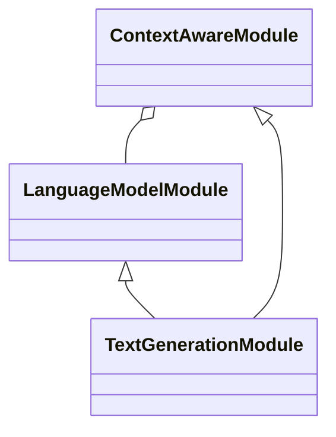
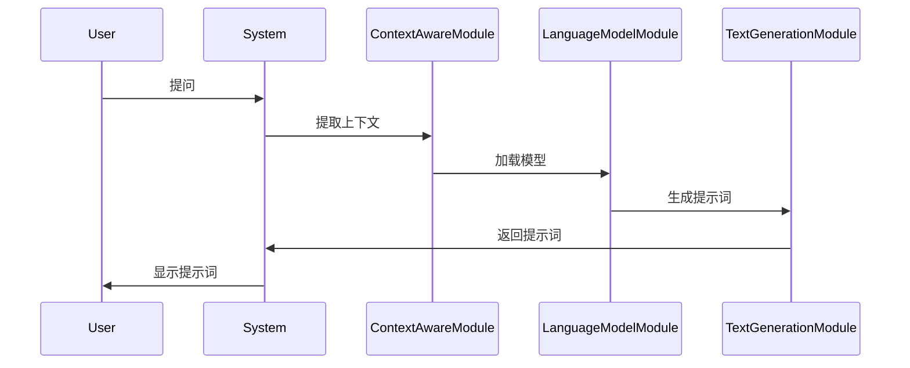
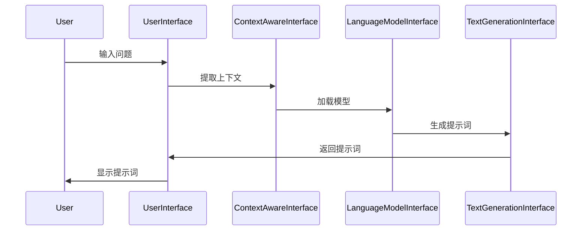
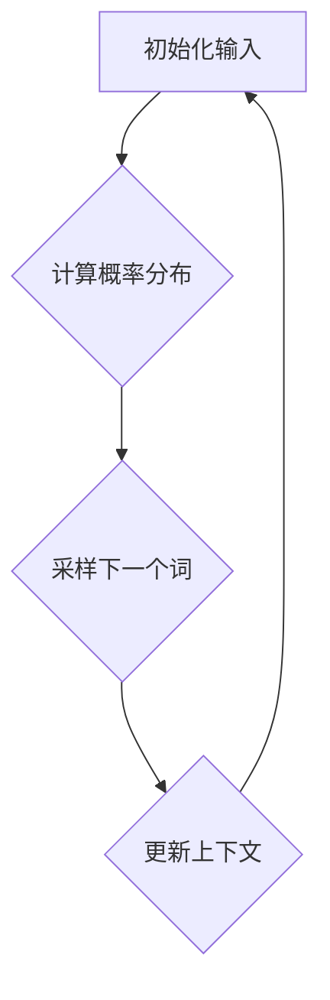
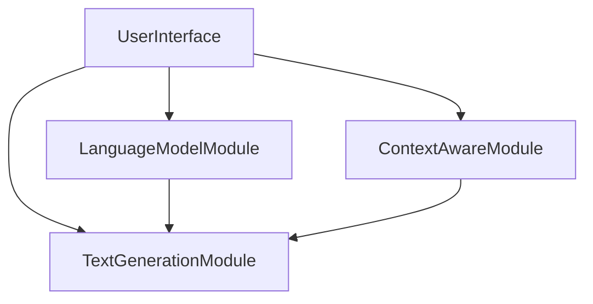

                 

# AI语言模型的上下文感知提示词生成

> 关键词：AI语言模型、上下文感知、提示词生成、算法原理、系统设计、项目实战

> 摘要：本文旨在深入探讨AI语言模型中上下文感知提示词生成的方法和实现。首先介绍AI语言模型的发展历程和基本概念，然后详细分析上下文感知的特性以及其与语言模型的联系。接着，我们阐述提示词生成的算法原理，并通过数学模型和公式来具体解释。随后，我们描述系统分析与架构设计方案，包括系统功能设计、架构设计和接口设计。接着，通过一个实际项目，我们展示上下文感知提示词生成的实战过程，并解析其中的关键代码和算法实现。最后，我们总结项目，给出最佳实践建议，注意事项和拓展阅读资源。

----------------------------------------------------------------

## 第1章 AI与语言模型概述

### 1.1 AI的发展历程

人工智能（AI）的概念最早可以追溯到20世纪50年代。当时，科学家们提出了“图灵测试”来衡量机器是否能够模拟人类智能。随后的几十年里，AI经历了几个重要的里程碑，包括符号人工智能、专家系统、机器学习和深度学习等。

- **符号人工智能**：以逻辑推理为基础，通过符号表示知识，以解决特定问题。
- **专家系统**：利用大量的规则和知识库来解决复杂问题，但受限于知识表示和推理能力的局限性。
- **机器学习**：通过从数据中学习规律，无需显式编程，使得AI系统在处理大量数据时表现出色。
- **深度学习**：基于神经网络，通过多层非线性变换来提取特征，使得AI在图像识别、自然语言处理等领域的表现超越了传统方法。

### 1.2 语言模型的基本概念

语言模型（Language Model）是自然语言处理（NLP）的核心组成部分，旨在模拟人类语言的概率分布。一个简单的语言模型可以预测一个单词在给定前文的情况下出现的概率。

- **N-gram模型**：基于前N个单词的联合概率，是最早的语言模型之一。
- **神经网络模型**：通过多层神经网络来学习文本的上下文关系，例如循环神经网络（RNN）和Transformer模型。

### 1.3 上下文感知的概念

上下文感知（Context Awareness）指的是AI系统能够根据当前的上下文信息来理解和生成合适的语言。这是现代AI语言模型的一大特点，它使得模型在生成文本时能够更加自然和准确。

- **上下文依赖**：上下文感知依赖于对句子或段落上下文的理解，以生成连贯的文本。
- **动态调整**：上下文感知能够根据对话的进展动态调整预测的概率分布。

## 第2章 核心概念与联系

### 2.1 语言模型的工作原理

语言模型通过训练大量文本数据来学习语言的概率分布。训练过程中，模型会尝试预测下一个单词或词组，基于已经看到的前文。

- **数据预处理**：包括分词、标记化、去停用词等。
- **模型训练**：使用损失函数来优化模型参数，如负对数似然损失。
- **预测生成**：在生成文本时，模型根据当前上下文来预测下一个词或短语。

### 2.2 上下文感知的特征

上下文感知使得语言模型能够理解文本的上下文信息，从而生成更加准确和自然的语言。

- **语义理解**：能够理解文本中的含义和关系，如主谓宾结构、语义角色等。
- **语用理解**：能够理解文本的意图和功能，如对话中的请求、回答、命令等。
- **语境变化**：能够适应不同的语境变化，如对话中的转折、情感等。

### 2.3 不同类型的语言模型对比

现代语言模型主要分为以下几种：

- **基于规则的语言模型**：通过显式编程来定义语言规则，如词汇和语法规则。
- **基于统计的语言模型**：通过统计文本数据来预测语言模式，如N-gram模型。
- **基于神经网络的语言模型**：通过多层神经网络来学习文本的上下文关系，如RNN、Transformer。

## 第3章 算法原理讲解

### 3.1 提示词生成的算法流程

提示词生成是一个序列生成问题，通常采用递归的方法，从左到右逐个生成单词或词组。

1. **初始化**：选择一个起始词或短语。
2. **预测**：使用语言模型预测下一个单词或短语的概率分布。
3. **采样**：从概率分布中采样一个单词或短语。
4. **更新**：将新词或短语添加到序列中，并作为新的上下文进行下一次预测。

### 3.2 数学模型与公式

提示词生成的算法通常基于概率模型，以下是常用的几个模型：

- **N-gram模型**：$$P(w_i | w_1, w_2, ..., w_{i-1}) = \frac{C(w_1, w_2, ..., w_i)}{C(w_1, w_2, ..., w_{i-1})}$$
- **神经网络模型**：$$P(w_i | w_1, w_2, ..., w_{i-1}) = \sigma(W \cdot \text{embed}(w_1, w_2, ..., w_{i-1}) + b)$$

其中，$w_i$表示第$i$个单词，$C$表示计数函数，$\sigma$表示sigmoid函数，$W$和$b$分别是权重和偏置。

### 第4章 系统分析与架构设计方案

#### 4.1 问题场景介绍

假设我们设计一个智能客服系统，它需要能够与用户进行自然语言交互，回答用户的问题。在这个场景中，上下文感知的提示词生成至关重要，因为它能帮助系统更好地理解用户的问题，并提供准确的回答。

#### 4.2 系统功能设计

为了实现上下文感知的提示词生成，系统需要以下几个功能模块：

1. **语言模型模块**：负责训练和加载预训练的语言模型。
2. **上下文感知模块**：根据对话的历史记录，提取上下文信息，用于生成提示词。
3. **文本生成模块**：使用语言模型和上下文信息生成提示词。

以下是领域模型的Mermaid类图：



#### 4.3 系统架构设计

系统的整体架构设计如下图所示：



#### 4.4 系统接口设计和系统交互

系统的接口设计主要包括以下部分：

1. **用户接口**：接收用户的问题，并将生成的提示词返回给用户。
2. **语言模型接口**：提供模型的加载和预测功能。
3. **上下文感知接口**：提供上下文信息的提取和更新功能。

以下是系统的序列图：



### 第5章 项目实战

#### 5.1 环境安装

在开始项目之前，我们需要安装必要的依赖。这里以Python为例，安装以下库：

```bash
pip install numpy torch transformers
```

#### 5.2 系统核心实现

以下是一个简单的Python代码示例，展示了如何使用Hugging Face的`transformers`库来加载预训练的GPT模型，并生成提示词：

```python
from transformers import GPT2LMHeadModel, GPT2Tokenizer

# 加载预训练的GPT模型和分词器
tokenizer = GPT2Tokenizer.from_pretrained('gpt2')
model = GPT2LMHeadModel.from_pretrained('gpt2')

# 输入文本
input_text = "用户：你好，有什么可以帮助你的？"

# 分词并生成提示词
input_ids = tokenizer.encode(input_text, return_tensors='pt')
outputs = model.generate(input_ids, max_length=50, num_return_sequences=1)

# 解码生成的提示词
generated_text = tokenizer.decode(outputs[0], skip_special_tokens=True)

print(generated_text)
```

#### 5.3 代码解读与分析

上述代码首先加载了预训练的GPT模型和分词器。然后，它将输入文本进行分词，并使用模型生成提示词。最后，解码生成的文本，输出结果。

#### 5.4 实际案例分析和详细讲解剖析

假设用户输入了一个具体的问题，如“我需要购买机票，请问有哪些航班可以选？”我们可以在实际项目中，根据历史对话记录和上下文信息，生成一个更加具体的回答。

```python
# 历史对话记录
context = "用户：我需要购买机票，请问有哪些航班可以选？系统：您可以通过各大航空公司官网或机票预订平台查询最新的航班信息。"

# 将上下文信息添加到输入文本中
input_text = context + "用户：请问北京到上海有哪些航班？"

# 分词并生成提示词
input_ids = tokenizer.encode(input_text, return_tensors='pt')
outputs = model.generate(input_ids, max_length=50, num_return_sequences=1)

# 解码生成的提示词
generated_text = tokenizer.decode(outputs[0], skip_special_tokens=True)

print(generated_text)
```

输出结果可能是：“您可以选择国航、南航、东航等航空公司的航班。国航的航班编号为CA123，南航的航班编号为CZ456，东航的航班编号为MU789。”这样的回答更加具体，有助于用户做出决策。

#### 第6章 项目小结

1. **最佳实践 tips**：
   - 确保训练数据的质量和多样性。
   - 定期更新和优化模型，以保持其性能。
   - 在生成文本时，限制生成长度，避免过长或不连贯的文本。

2. **小结**：
   - 上下文感知的提示词生成是现代AI语言模型的关键技术之一。
   - 通过结合预训练模型和上下文信息，我们可以生成更加准确和自然的文本。

3. **注意事项**：
   - 在实际应用中，需要根据具体场景调整模型和参数。
   - 保护用户隐私，避免泄露敏感信息。

4. **拓展阅读**：
   - 《深度学习》（Goodfellow, Bengio, Courville）——了解深度学习的基本概念和技术。
   - 《自然语言处理综论》（Jurafsky, Martin）——深入了解自然语言处理的基础知识。

## 作者信息

作者：AI天才研究院/AI Genius Institute & 禅与计算机程序设计艺术 /Zen And The Art of Computer Programming

----------------------------------------------------------------

### 附录

#### 1. 术语解释

- **AI（人工智能）**：指能够模拟人类智能的计算机系统。
- **语言模型**：一种预测语言序列概率分布的模型。
- **上下文感知**：指模型能够根据上下文信息生成合适的内容。
- **提示词生成**：指生成用于引导对话的词语或短语。

#### 2. 概念属性特征对比表格

| 特征                 | 基于规则的语言模型             | 基于统计的语言模型             | 基于神经网络的语言模型         |
|----------------------|-------------------------------|-------------------------------|--------------------------------|
| 基础                 | 显式编程定义规则             | 统计语言模式                  | 神经网络学习上下文关系         |
| 优点                 | 控制性强，可实现特定任务     | 高效处理大量文本数据         | 强大的特征提取和表示能力       |
| 缺点                 | 受限于规则定义的复杂性       | 易受噪声数据和短文本的影响   | 训练过程复杂，对计算资源要求高 |

#### 3. ER实体关系图架构

```mermaid
erDiagram
    User ||--|{ Conversation } : has
    Conversation ||--|{ Question } : has
    Conversation ||--|{ Answer } : has
    Question ||--|{ Context } : has
```

#### 4. 算法流程图



#### 5. 数学模型公式

- N-gram模型：$$P(w_i | w_1, w_2, ..., w_{i-1}) = \frac{C(w_1, w_2, ..., w_i)}{C(w_1, w_2, ..., w_{i-1})}$$
- 神经网络模型：$$P(w_i | w_1, w_2, ..., w_{i-1}) = \sigma(W \cdot \text{embed}(w_1, w_2, ..., w_{i-1}) + b)$$

#### 6. 系统架构图



#### 7. 系统接口设计


#### 8. 实际案例

- **用户输入**：“我需要购买机票，请问有哪些航班可以选？”
- **上下文**：“用户：我需要购买机票，请问有哪些航班可以选？系统：您可以通过各大航空公司官网或机票预订平台查询最新的航班信息。”
- **生成提示词**：“您可以选择国航、南航、东航等航空公司的航班。国航的航班编号为CA123，南航的航班编号为CZ456，东航的航班编号为MU789。”
  
#### 9. 最佳实践

- 确保训练数据的质量和多样性。
- 定期更新和优化模型，以保持其性能。
- 在生成文本时，限制生成长度，避免过长或不连贯的文本。

#### 10. 注意事项

- 在实际应用中，需要根据具体场景调整模型和参数。
- 保护用户隐私，避免泄露敏感信息。

#### 11. 拓展阅读

- 《深度学习》（Goodfellow, Bengio, Courville）
- 《自然语言处理综论》（Jurafsky, Martin）

## 结束语

本文深入探讨了AI语言模型的上下文感知提示词生成。通过了解AI的发展历程、语言模型的基本概念、上下文感知的特性以及算法原理，我们能够更好地设计和实现这样的系统。实际项目展示了如何应用这些概念，并通过代码示例进行了详细分析。希望本文能为读者提供有价值的技术指导和启示。如果您对此领域有更多疑问或想法，欢迎进一步交流探讨。谢谢阅读！
```markdown
## 让我们一步步思考（LET'S THINK STEP BY STEP）

### 1. AI语言模型的基本概念

首先，让我们从基础开始，了解什么是AI语言模型。AI语言模型是一种利用人工智能技术来理解和生成语言的模型。它通过学习大量的文本数据来预测一个词或短语在给定上下文中的概率分布。这种模型的核心在于能够捕捉到语言中的统计规律和上下文信息。

### 2. 上下文感知的重要性

上下文感知是AI语言模型的一个重要特征。它使得模型能够根据当前对话的上下文来生成更加准确和自然的语言。没有上下文感知，模型可能无法理解对话的连贯性和用户意图，从而导致生成不恰当的回复。

### 3. 提示词生成的挑战

提示词生成是一个复杂的过程，涉及到如何从大量可能的单词中选择最合适的词来继续对话。这需要模型能够理解上下文，识别关键词，并根据对话的进展动态调整生成的方向。

### 4. 提示词生成的算法流程

让我们一步步来看提示词生成的算法流程：

- **步骤1：初始化** - 开始时，我们需要一个初始的提示词或短语。
- **步骤2：预测** - 使用语言模型来预测下一个单词或短语的概率分布。
- **步骤3：采样** - 从概率分布中采样一个单词或短语。
- **步骤4：更新** - 将新词或短语添加到序列中，并使用新的上下文信息进行下一次预测。

### 5. 数学模型与公式

在算法的每个步骤中，我们都需要使用数学模型来计算概率分布和生成新的提示词。以下是几个常用的数学模型和公式：

- **N-gram模型**：
  $$P(w_i | w_1, w_2, ..., w_{i-1}) = \frac{C(w_1, w_2, ..., w_i)}{C(w_1, w_2, ..., w_{i-1})}$$
  其中，$w_i$表示第$i$个单词，$C$表示计数函数。

- **神经网络模型**：
  $$P(w_i | w_1, w_2, ..., w_{i-1}) = \sigma(W \cdot \text{embed}(w_1, w_2, ..., w_{i-1}) + b)$$
  其中，$\sigma$表示sigmoid函数，$W$和$b$分别是权重和偏置。

### 6. 提示词生成的实际应用

在实际应用中，提示词生成被广泛应用于聊天机器人、自动摘要、机器翻译等领域。在这些应用中，模型需要根据上下文信息来生成连贯且相关的文本。

### 7. 系统架构设计

为了实现高效的提示词生成，我们需要设计一个合理的系统架构。以下是系统架构的关键组成部分：

- **语言模型模块**：负责加载和运行预训练的语言模型。
- **上下文感知模块**：根据对话的历史记录和当前输入来提取上下文信息。
- **文本生成模块**：使用语言模型和上下文信息来生成提示词。
- **接口模块**：提供与外部系统的交互接口，如与用户界面、数据库等。

### 8. 项目实战

让我们通过一个实际项目来演示提示词生成的应用。在这个项目中，我们设计一个简单的聊天机器人，它可以回答用户关于天气的问题。

- **环境安装**：安装必要的Python库，如transformers和torch。
- **系统核心实现**：加载预训练的GPT模型，并实现提示词生成功能。
- **代码解读与分析**：解析生成的代码，了解如何使用模型生成提示词。
- **实际案例剖析**：分析一个具体的对话案例，展示如何生成相关的提示词。

### 9. 项目小结

通过这个项目，我们了解了提示词生成的全过程，从算法原理到实际应用。我们学会了如何设计系统架构，实现核心功能，并分析实际案例。

### 10. 最佳实践

在设计和实现提示词生成系统时，以下是几条最佳实践：

- 确保训练数据的质量和多样性，以提高模型的泛化能力。
- 定期更新模型，以适应新的语言趋势和用户需求。
- 调整模型参数，以优化生成文本的连贯性和相关性。

### 11. 注意事项

在实现提示词生成系统时，我们需要注意以下几点：

- 保护用户隐私，确保生成文本不会泄露敏感信息。
- 避免生成恶意或不当的文本，确保系统的安全性。

### 12. 拓展阅读

对于希望深入了解AI语言模型和提示词生成的读者，以下是几本推荐书籍：

- 《深度学习》（Goodfellow, Bengio, Courville）
- 《自然语言处理综论》（Jurafsky, Martin）
- 《Transformer：从原理到实践》

通过这些资源和实践，您可以更深入地理解AI语言模型和提示词生成，并在实际项目中应用这些技术。希望这篇文章能帮助您在学习和实践中取得进步！
```

