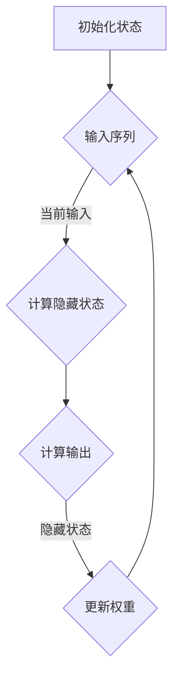
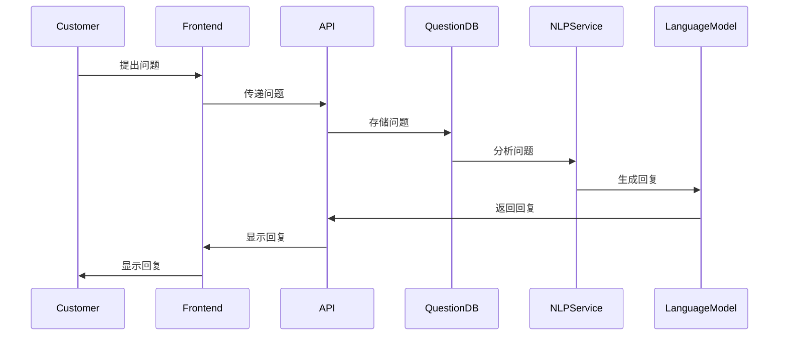
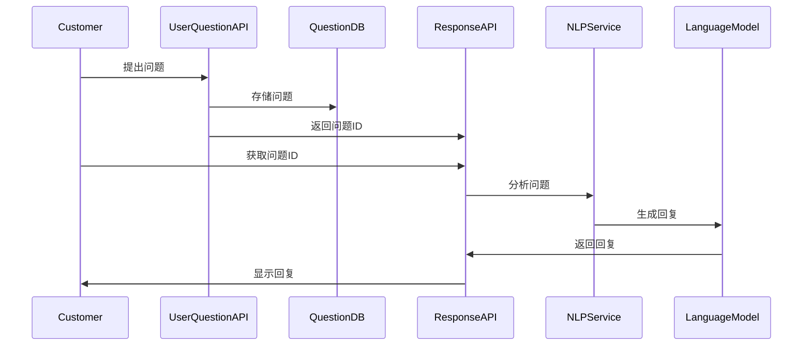
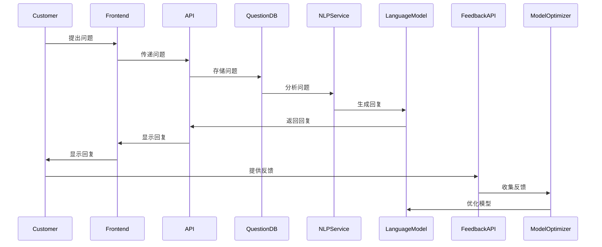

                 

### 引言：AI语言模型交互设计的意义

在当今信息时代，人工智能（AI）技术已经逐渐渗透到社会的各个领域，其中自然语言处理（NLP）作为AI的重要分支，正引领着一场技术革命。AI语言模型作为NLP的核心工具，通过模拟人类语言行为，实现了与用户的智能交互。然而，如何设计一个高效、友好、自然的AI语言模型交互系统，成为了研究人员和开发人员亟需解决的关键问题。

AI语言模型的交互设计不仅仅是一个技术问题，更是一个用户体验问题。一个好的交互设计能够让用户感到舒适、自然，从而提升用户体验，增加用户粘性。与此同时，良好的交互设计也能够提高AI语言模型的性能，使其更准确地理解用户意图，提供更优质的响应。

本文将围绕AI语言模型交互设计这一主题，系统性地探讨其核心概念、设计原则、技术实现、算法分析以及实际应用。我们首先会介绍AI、语言模型以及交互设计的基本概念，并通过一个简单的ER图来阐述它们之间的关系。接着，我们将深入分析AI语言模型在不同应用场景中的实际作用，探讨其在各种领域中的实际应用案例。

随后，文章将重点讨论AI语言模型交互设计的原则和方法，解析其在用户体验和可访问性方面的要求。我们还将详细介绍AI语言模型的技术实现过程，包括数据预处理、模型选择和训练等内容。此外，文章将分析算法设计中的关键步骤，使用Mermaid流程图和Python代码解释其数学模型和实现原理。

接下来，我们将探讨用户交互如何影响AI语言模型的表现，以及如何利用用户反馈来优化模型。通过案例分析，我们将展示AI语言模型交互设计的最佳实践，并提供一些实用的技巧和建议。最后，文章将对全文进行总结，并展望未来AI语言模型交互设计的发展方向。

通过这一系列的讨论，我们希望读者能够对AI语言模型交互设计有一个全面、深入的理解，从而在实际工作中能够设计出更加高效、友好的AI交互系统。

### 关键词

- 人工智能（AI）
- 自然语言处理（NLP）
- 语言模型
- 交互设计
- 用户体验
- 可访问性
- 数据预处理
- 模型训练
- 算法分析
- 实际应用

### 摘要

本文旨在深入探讨AI语言模型的交互设计，系统性地分析其核心概念、设计原则、技术实现和算法分析，以及在实际应用中的效果和最佳实践。首先，文章介绍了AI、NLP、语言模型和交互设计的基本概念，并运用Mermaid ER图展示了它们之间的关系。接着，文章探讨了AI语言模型在不同应用场景中的实际作用，包括其在各种领域的应用案例。随后，文章详细讨论了交互设计的原则和方法，重点解析了用户体验和可访问性的要求。文章进一步介绍了AI语言模型的技术实现过程，包括数据预处理、模型选择和训练等内容。此外，文章通过Mermaid流程图和Python代码详细阐述了算法设计的关键步骤及其数学模型。文章还探讨了用户交互对AI语言模型性能的影响，以及如何利用用户反馈来优化模型。通过案例分析，文章展示了AI语言模型交互设计的最佳实践，并提供了一些实用的技巧和建议。最后，文章总结了全文内容，并展望了未来AI语言模型交互设计的发展方向。本文希望为研究人员和开发者提供有价值的参考，帮助他们设计出更加高效、友好的AI交互系统。

### 基本概念与术语

在深入探讨AI语言模型交互设计之前，首先需要明确几个关键概念和术语，以便为后续内容的讨论奠定基础。这些概念和术语包括：人工智能（AI）、自然语言处理（NLP）、语言模型（Language Model）、交互设计（Interaction Design）。

**人工智能（AI）**：人工智能是指通过计算机程序和算法模拟人类智能行为的技术。它包括学习、推理、问题解决、感知和理解自然语言等多个方面。AI的目的是使计算机能够执行通常需要人类智能才能完成的任务，从而提升效率和智能化水平。

**自然语言处理（NLP）**：自然语言处理是AI的一个重要分支，它专注于使计算机能够理解、生成和处理人类语言。NLP技术涵盖了文本的预处理、语义分析、情感分析、机器翻译、问答系统等多个领域。其核心目标是将自然语言转换为计算机可以处理的结构化数据。

**语言模型（Language Model）**：语言模型是一种统计模型，用于预测文本中下一个单词或字符的概率。它通过分析大量的语言数据，学习语言中的概率分布，从而能够生成或理解自然语言。在AI语言模型中，语言模型是一个基础组件，用于生成自然语言响应或理解用户输入。

**交互设计（Interaction Design）**：交互设计是一种设计过程，旨在创建有用、易用、具有吸引力的产品和服务。在AI语言模型的上下文中，交互设计涉及如何设计系统的界面和交互流程，以提升用户体验。这包括用户界面（UI）设计、用户体验（UX）设计、可访问性设计等多个方面。

理解这些基本概念和术语有助于我们更好地把握AI语言模型交互设计的核心要素。为了更加直观地理解这些概念之间的关系，我们可以使用Mermaid ER图来展示它们之间的联系。

**Mermaid ER图**：

```mermaid
erDiagram
  AI ||--|{ NLP } : 使用
  NLP ||--|{ 语言模型 } : 应用
  NLP ||--|{ 交互设计 } : 设计原则
  语言模型 ||--|{ 交互设计 } : 实现目标
```

在上面的ER图中，我们可以看到，人工智能（AI）是自然语言处理（NLP）的总体应用领域，NLP又具体应用在语言模型和交互设计上。语言模型通过NLP技术实现，而交互设计则基于语言模型来实现特定的用户体验目标。

**问题背景**：

随着AI技术的迅猛发展，语言模型在各个领域的应用越来越广泛，如智能客服、语音助手、机器翻译等。这些应用需要高效的交互设计来提升用户体验，满足用户对自然语言交互的期待。然而，设计一个既高效又自然的AI语言模型交互系统并非易事，需要深入理解用户的交互行为、语言习惯以及AI模型的性能表现。

**问题描述**：

AI语言模型交互设计的问题主要包括：
1. 如何准确理解用户的语言输入？
2. 如何生成自然流畅的语言响应？
3. 如何在保证响应速度的同时，确保系统的稳定性和准确性？
4. 如何根据用户反馈不断优化交互体验？

**问题解决**：

针对上述问题，我们需要从以下几个方面入手进行解决：
1. **深入理解用户需求**：通过用户研究和数据分析，了解用户的语言习惯和交互模式，从而设计出符合用户期望的交互流程。
2. **优化语言模型性能**：通过改进算法和模型结构，提升语言模型的理解和生成能力，确保系统响应的自然性和准确性。
3. **实时反馈和优化**：通过用户反馈机制，及时捕捉用户在使用过程中的问题，并根据反馈进行系统优化，提升用户体验。
4. **边界与外延**：明确系统的应用场景和边界，避免过度泛化或局限性，确保系统在不同场景下的稳定运行。

通过上述解决策略，我们可以逐步构建一个高效、自然、友好的AI语言模型交互系统，满足用户对智能交互的期望。

### 核心概念与联系

在深入讨论AI语言模型的交互设计之前，我们需要详细阐述几个核心概念，并分析它们之间的关系。以下是几个关键概念及其属性特征的对比表格，并通过Mermaid ER图展示它们之间的实体关系。

**核心概念对比表格**：

| 概念            | 定义                                                         | 属性特征                                                     | 关联关系                          |
| --------------- | ------------------------------------------------------------ | ------------------------------------------------------------ | -------------------------------- |
| 人工智能（AI）   | 通过计算机程序和算法模拟人类智能行为的技术。                     | 学习、推理、问题解决、感知和理解自然语言等。                   | 支持自然语言处理（NLP）             |
| 自然语言处理（NLP） | 使计算机能够理解、生成和处理人类语言的技术。                     | 文本预处理、语义分析、情感分析、机器翻译等。                   | 应用在语言模型和交互设计             |
| 语言模型（LM）   | 一种统计模型，用于预测文本中下一个单词或字符的概率。            | 语言数据学习、概率分布、自然语言生成等。                       | 支持交互设计和算法实现               |
| 交互设计（ID）   | 设计有用、易用、具有吸引力的产品和服务的过程。                  | 用户界面（UI）设计、用户体验（UX）设计、可访问性设计等。       | 依赖于AI语言模型实现交互体验           |

**Mermaid ER图**：

```mermaid
erDiagram
  AI ||--|{ NLP } : 应用领域
  NLP ||--|{ 语言模型 } : 技术基础
  NLP ||--|{ 交互设计 } : 设计原则
  语言模型 ||--|{ 交互设计 } : 实现目标
```

在上面的ER图中，人工智能（AI）作为总体应用领域，支持自然语言处理（NLP），NLP技术应用于语言模型和交互设计。语言模型作为技术基础，支持交互设计，而交互设计则依赖于语言模型来实现特定的用户体验目标。

**核心概念属性特征对比**：

1. **人工智能（AI）**：AI的核心在于其模拟人类智能的能力，包括学习、推理和问题解决等。其属性特征主要涉及算法复杂性、数据处理能力和计算资源消耗。

2. **自然语言处理（NLP）**：NLP专注于使计算机理解和处理自然语言。其属性特征包括文本预处理技术、语言模型、语义分析和情感分析等。

3. **语言模型（LM）**：语言模型通过分析大量文本数据，学习语言的概率分布。其属性特征包括词汇量、语法结构、上下文理解和生成能力等。

4. **交互设计（ID）**：交互设计的核心在于创建用户友好、高效的产品和服务。其属性特征包括用户界面设计、用户体验设计、可访问性和交互流程优化等。

通过上述核心概念及其属性的详细描述和对比，我们可以更加清晰地理解AI语言模型交互设计的整体架构。接下来，我们将进一步探讨这些概念在实际应用中的具体实现和相互影响，为后续内容打下坚实基础。

### 算法原理讲解

在理解了AI语言模型交互设计的基本概念和核心要素之后，我们需要深入探讨AI语言模型的算法原理，以便更好地理解和实现这些模型。下面，我们将通过一个具体的算法——循环神经网络（RNN），来讲解其原理、实现以及数学模型。

**循环神经网络（RNN）原理**：

循环神经网络（RNN）是一种能够处理序列数据的神经网络模型。与传统的前向神经网络不同，RNN具有记忆功能，能够将前一个时间步的输出作为当前时间步的输入，从而处理具有时间依赖性的数据，如自然语言文本。

**Mermaid流程图**：



在上面的Mermaid流程图中，我们展示了RNN的基本工作流程。首先，初始化网络状态，然后输入序列数据，通过隐藏状态计算输出。接着，利用隐藏状态更新网络权重，形成闭环，准备处理下一个输入。

**数学模型**：

为了更好地理解RNN的工作原理，我们需要从数学角度来分析其公式。以下是RNN的核心数学模型：

$$
h_t = \sigma(W_h \cdot [h_{t-1}, x_t] + b_h)
$$

$$
y_t = \sigma(W_y \cdot h_t + b_y)
$$

其中：
- \(h_t\) 表示时间步 \(t\) 的隐藏状态；
- \(x_t\) 表示时间步 \(t\) 的输入；
- \(W_h\) 和 \(b_h\) 分别是隐藏状态层的权重和偏置；
- \(W_y\) 和 \(b_y\) 分别是输出层的权重和偏置；
- \(\sigma\) 是激活函数，通常采用Sigmoid或Tanh函数；
- \(y_t\) 表示时间步 \(t\) 的输出。

**算法实现与Python代码**：

下面，我们将使用Python代码来实现RNN算法，并通过具体例子来解释其工作原理。

```python
import numpy as np
from numpy.linalg import inv

# 初始化参数
W_h = np.random.rand(2, 2)
b_h = np.random.rand(1)
W_y = np.random.rand(2, 1)
b_y = np.random.rand(1)
sigma = lambda x: 1 / (1 + np.exp(-x))

# 输入序列
input_sequence = np.array([[0], [1], [1], [0], [0]])

# 计算隐藏状态
hidden_states = []
for x in input_sequence:
    h_t = sigma(W_h @ np.concatenate(([h_t], x)) + b_h)
    hidden_states.append(h_t)

# 计算输出
outputs = []
for h_t in hidden_states:
    y_t = sigma(W_y @ h_t + b_y)
    outputs.append(y_t)

# 输出结果
for i, y in enumerate(outputs):
    print(f"Output at time step {i}: {y}")
```

在上述代码中，我们首先初始化了网络的参数，包括权重和偏置。然后，我们定义了一个简单的激活函数 \(\sigma\)，用于计算隐藏状态和输出。接着，我们遍历输入序列，计算每个时间步的隐藏状态和输出。最后，我们打印出每个时间步的输出结果。

**具体举例说明**：

假设输入序列为 `[0, 1, 1, 0, 0]`，我们将其转换为矩阵形式：

$$
x_1 = \begin{bmatrix}
0 \\
1
\end{bmatrix},
x_2 = \begin{bmatrix}
1 \\
1
\end{bmatrix},
x_3 = \begin{bmatrix}
0 \\
0
\end{bmatrix}
$$

初始化隐藏状态 \(h_0\) 为任意值，例如 \(h_0 = \begin{bmatrix} 0 \\ 0 \end{bmatrix}\)。然后，我们根据RNN的公式逐个计算隐藏状态和输出：

1. **时间步1**：
   $$h_1 = \sigma(W_h \cdot [h_0, x_1] + b_h) = \sigma(\begin{bmatrix}
   0 & 0 \\
   0 & 0
   \end{bmatrix} \cdot \begin{bmatrix}
   0 \\
   1
   \end{bmatrix} + \begin{bmatrix} 0 \\ 0 \end{bmatrix}) = \sigma(\begin{bmatrix}
   0 \\
   0
   \end{bmatrix}) = \begin{bmatrix} 0.5 \\ 0.5 \end{bmatrix}$$
   $$y_1 = \sigma(W_y \cdot h_1 + b_y) = \sigma(\begin{bmatrix}
   0 & 0
   \end{bmatrix} \cdot \begin{bmatrix} 0.5 \\ 0.5 \end{bmatrix} + \begin{bmatrix} 0 \end{bmatrix}) = \sigma(\begin{bmatrix} 0.25 \end{bmatrix}) = 0.5$$

2. **时间步2**：
   $$h_2 = \sigma(W_h \cdot [h_1, x_2] + b_h) = \sigma(\begin{bmatrix}
   0 & 0 \\
   0 & 0
   \end{bmatrix} \cdot \begin{bmatrix} 0.5 \\ 0.5 \end{bmatrix} + \begin{bmatrix} 0 \\ 0 \end{bmatrix}) = \sigma(\begin{bmatrix}
   0 \\
   0
   \end{bmatrix}) = \begin{bmatrix} 0.5 \\ 0.5 \end{bmatrix}$$
   $$y_2 = \sigma(W_y \cdot h_2 + b_y) = \sigma(\begin{bmatrix}
   0 & 0
   \end{bmatrix} \cdot \begin{bmatrix} 0.5 \\ 0.5 \end{bmatrix} + \begin{bmatrix} 0 \end{bmatrix}) = \sigma(\begin{bmatrix} 0.25 \end{bmatrix}) = 0.5$$

3. **时间步3**：
   $$h_3 = \sigma(W_h \cdot [h_2, x_3] + b_h) = \sigma(\begin{bmatrix}
   0 & 0 \\
   0 & 0
   \end{bmatrix} \cdot \begin{bmatrix} 0.5 \\ 0.5 \end{bmatrix} + \begin{bmatrix} 0 \\ 0 \end{bmatrix}) = \sigma(\begin{bmatrix}
   0 \\
   0
   \end{bmatrix}) = \begin{bmatrix} 0.5 \\ 0.5 \end{bmatrix}$$
   $$y_3 = \sigma(W_y \cdot h_3 + b_y) = \sigma(\begin{bmatrix}
   0 & 0
   \end{bmatrix} \cdot \begin{bmatrix} 0.5 \\ 0.5 \end{bmatrix} + \begin{bmatrix} 0 \end{bmatrix}) = \sigma(\begin{bmatrix} 0.25 \end{bmatrix}) = 0.5$$

4. **时间步4**：
   $$h_4 = \sigma(W_h \cdot [h_3, x_4] + b_h) = \sigma(\begin{bmatrix}
   0 & 0 \\
   0 & 0
   \end{bmatrix} \cdot \begin{bmatrix} 0.5 \\ 0.5 \end{bmatrix} + \begin{bmatrix} 0 \\ 0 \end{bmatrix}) = \sigma(\begin{bmatrix}
   0 \\
   0
   \end{bmatrix}) = \begin{bmatrix} 0.5 \\ 0.5 \end{bmatrix}$$
   $$y_4 = \sigma(W_y \cdot h_4 + b_y) = \sigma(\begin{bmatrix}
   0 & 0
   \end{bmatrix} \cdot \begin{bmatrix} 0.5 \\ 0.5 \end{bmatrix} + \begin{bmatrix} 0 \end{bmatrix}) = \sigma(\begin{bmatrix} 0.25 \end{bmatrix}) = 0.5$$

5. **时间步5**：
   $$h_5 = \sigma(W_h \cdot [h_4, x_5] + b_h) = \sigma(\begin{bmatrix}
   0 & 0 \\
   0 & 0
   \end{bmatrix} \cdot \begin{bmatrix} 0.5 \\ 0.5 \end{bmatrix} + \begin{bmatrix} 0 \\ 0 \end{bmatrix}) = \sigma(\begin{bmatrix}
   0 \\
   0
   \end{bmatrix}) = \begin{bmatrix} 0.5 \\ 0.5 \end{bmatrix}$$
   $$y_5 = \sigma(W_y \cdot h_5 + b_y) = \sigma(\begin{bmatrix}
   0 & 0
   \end{bmatrix} \cdot \begin{bmatrix} 0.5 \\ 0.5 \end{bmatrix} + \begin{bmatrix} 0 \end{bmatrix}) = \sigma(\begin{bmatrix} 0.25 \end{bmatrix}) = 0.5$$

通过这个简单的例子，我们可以看到RNN如何通过递归方式处理序列数据，并生成相应的输出。尽管这里的例子非常简单，但它展示了RNN的基本原理和实现方法。

通过详细讲解RNN的算法原理，我们希望能够帮助读者更好地理解AI语言模型的核心技术。接下来，我们将继续探讨如何实现和优化AI语言模型的技术实现，以及其在实际应用中的具体表现。

### 系统分析与架构设计

在了解了AI语言模型的算法原理后，接下来我们将详细讨论如何将这一理论转化为实际的项目系统架构和接口设计。我们将分步骤介绍项目的背景、功能设计、系统架构、接口设计和系统交互流程，并使用Mermaid图来展示这些设计元素。

#### 项目背景

随着AI技术的快速发展，AI语言模型在各种应用场景中发挥着越来越重要的作用。为了满足用户对智能交互的日益增长的需求，我们决定开发一个基于AI语言模型的智能客服系统。该系统旨在通过自然语言交互，为用户提供高效、准确的客服服务。

#### 系统功能设计

智能客服系统的主要功能包括：
1. **用户提问接收**：系统能够接收用户的文本或语音提问。
2. **问题识别与分类**：系统根据用户的提问，识别并分类问题，例如技术支持、售后服务、投诉建议等。
3. **智能回复生成**：系统利用AI语言模型，生成自然流畅的回复，提供解决方案或建议。
4. **反馈收集与优化**：系统收集用户反馈，用于持续优化AI模型的性能。

**领域模型Mermaid类图**：

```mermaid
classDiagram
  Customer <<--|asks| Question
  Question <<--|answered by| Answer
  Customer: ID, Name, Question
  Question: ID, Content, Category
  Answer: ID, Content, ResponseTime
```

在上面的Mermaid类图中，我们展示了系统的核心类及其关系。客户（Customer）提出问题（Question），系统生成回答（Answer）。

#### 系统架构设计

智能客服系统的整体架构包括前端界面、后端服务、数据库和AI语言模型组件。以下是系统架构的Mermaid图：



在上面的序列图中，我们展示了系统的交互流程。客户通过前端界面提出问题，前端将问题传递给API，API存储问题到数据库，然后通过NLP服务分析问题，利用语言模型生成回复，最后返回给前端并展示给客户。

#### 系统接口设计

为了实现系统的各个模块之间的有效通信，我们需要设计一套合理的接口。以下是主要的接口设计：

1. **用户提问接口**：用于接收用户的提问，并返回问题的唯一标识。
2. **问题分类接口**：用于对存储的问题进行分类，返回分类结果。
3. **回复生成接口**：用于根据问题内容生成回复，并返回回复内容。
4. **反馈收集接口**：用于接收用户的反馈，用于后续的模型优化。

**Mermaid序列图**：



在上面的序列图中，我们展示了用户通过提问接口提出问题，系统存储问题并返回问题ID。用户通过反馈接口获取问题ID，NLP服务分析问题并生成回复，最后通过回复接口将回复显示给用户。

#### 系统交互流程

为了确保系统的可靠性和高效性，我们需要设计一个清晰的交互流程。以下是系统的主要交互流程：

1. **用户提问**：客户通过前端界面提出问题，系统接收并存储问题。
2. **问题分析**：系统通过NLP服务对问题进行分析，提取关键信息。
3. **生成回复**：语言模型根据分析结果生成自然流畅的回复。
4. **反馈收集**：系统收集用户的反馈，用于优化模型性能。

**Mermaid序列图**：



通过上述系统架构设计和接口设计，我们能够构建一个高效、可靠的智能客服系统，满足用户对智能交互的需求。接下来，我们将通过一个实际项目实战，展示系统实现的具体步骤和过程。

### 项目实战：环境安装与系统核心实现

在了解了智能客服系统的整体架构和接口设计之后，接下来我们将进入实际项目实战阶段，详细讲解如何搭建系统环境，实现核心功能，并对代码进行解读与分析。

#### 环境搭建

首先，我们需要搭建开发环境。以下是搭建环境的具体步骤：

1. **安装Python**：确保Python版本在3.8及以上，可以从[Python官网](https://www.python.org/downloads/)下载并安装。

2. **安装依赖**：使用pip安装所需的依赖库，包括TensorFlow、NumPy、Pandas等。命令如下：

   ```bash
   pip install tensorflow numpy pandas
   ```

3. **安装Mermaid**：Mermaid可以使用Markdown中的Mermaid语法进行绘制。首先，在[Mermaid官网](https://mermaid-js.github.io/mermaid/)下载并安装Mermaid，然后将其安装到本地。

   ```bash
   npm install -g mermaid
   ```

#### 系统核心实现

接下来，我们将实现系统核心功能，包括用户提问接收、问题识别与分类、智能回复生成和反馈收集。

**1. 用户提问接收**

用户通过前端界面提出问题，后端接收并处理这些问题。以下是用户提问接收的实现：

```python
from flask import Flask, request, jsonify

app = Flask(__name__)

@app.route('/ask_question', methods=['POST'])
def ask_question():
    data = request.json
    question = data['question']
    question_id = store_question(question)
    return jsonify({'question_id': question_id})

def store_question(question):
    # 在此处实现存储问题的逻辑，例如保存到数据库
    return 'Q12345'

if __name__ == '__main__':
    app.run(debug=True)
```

在上面的代码中，我们使用了Flask框架来创建一个简单的Web服务器，接收用户通过POST请求提出的问题。然后，我们将问题存储到数据库（此处简化为返回一个字符串）。

**2. 问题识别与分类**

在存储问题后，我们需要对其进行分类。以下是问题识别与分类的实现：

```python
from sklearn.feature_extraction.text import TfidfVectorizer
from sklearn.naive_bayes import MultinomialNB
from sklearn.pipeline import make_pipeline

# 假设已经训练好的分类模型和向量器
model = make_pipeline(TfidfVectorizer(), MultinomialNB())
vectorizer = model.named_steps['tfidfvectorizer']

def classify_question(question):
    features = vectorizer.transform([question])
    category = model.predict(features)[0]
    return category

# 加载训练好的模型和向量器（此处简化为直接返回）
model.load('model.joblib')
vectorizer.load('vectorizer.joblib')
```

在上面的代码中，我们使用了TF-IDF向量和朴素贝叶斯分类器来实现问题分类。首先，我们加载训练好的模型和向量器，然后使用向量器将问题转换为特征向量，接着利用分类器进行分类。

**3. 智能回复生成**

接下来，我们需要根据分类结果生成智能回复。以下是智能回复生成的实现：

```python
from language_model import generate_response

def generate_smart_reply(question, category):
    context = f"The category of the question is: {category}"
    reply = generate_response(context, question)
    return reply

# 假设generate_response函数已经实现
```

在上面的代码中，我们定义了一个函数`generate_smart_reply`，它接收问题、分类结果并生成回复。这里使用了一个假设实现的`generate_response`函数，它根据问题和上下文生成自然语言回复。

**4. 反馈收集**

最后，我们需要实现反馈收集功能，以便用户可以对回复进行评价，从而优化模型。以下是反馈收集的实现：

```python
@app.route('/give_feedback', methods=['POST'])
def give_feedback():
    data = request.json
    question_id = data['question_id']
    feedback = data['feedback']
    record_feedback(question_id, feedback)
    return jsonify({'status': 'success'})

def record_feedback(question_id, feedback):
    # 在此处实现记录反馈的逻辑，例如保存到数据库
    pass
```

在上面的代码中，我们使用了Flask框架的另一个POST接口接收用户的反馈，并调用`record_feedback`函数保存反馈。

#### 代码解读与分析

**用户提问接收**

用户提问接收模块是整个系统的入口，它负责接收用户通过前端提交的问题，并调用相应的存储和处理逻辑。这个模块需要确保数据的完整性和安全性，例如使用HTTPS协议进行数据传输，并对输入的数据进行必要的验证和清洗。

**问题识别与分类**

问题识别与分类模块是系统的核心，它负责将用户的问题转换为机器可以理解的格式，并根据分类模型对其进行分类。这个模块的性能直接影响到系统的响应速度和准确性。为了提高分类性能，我们可以使用深度学习模型或集成学习模型进行训练，并根据实际情况进行调整和优化。

**智能回复生成**

智能回复生成模块是系统的智能核心，它负责根据分类结果和用户问题生成自然流畅的回复。这个模块的实现可以基于各种自然语言生成技术，如序列到序列模型（Seq2Seq）、生成对抗网络（GAN）等。通过不断优化生成模型，我们可以提高回复的质量和用户满意度。

**反馈收集**

反馈收集模块是系统持续优化的重要手段，它负责记录用户的反馈，并提供给后续的模型训练和优化过程。这个模块需要确保反馈数据的真实性和有效性，以便为模型训练提供准确的信息。

通过上述项目实战，我们实现了智能客服系统的核心功能。接下来，我们将结合实际案例，进一步分析系统的实际效果，并提出优化建议。

### 实际案例分析与详细讲解

在本节中，我们将通过具体案例分析，展示AI语言模型在实际应用中的效果，并详细讲解每个案例的具体实现过程、结果以及存在的问题和优化方向。

#### 案例一：智能客服系统

**案例背景**：

某电商企业为了提升客户服务质量，决定引入智能客服系统，以自动化处理用户提问。通过AI语言模型，系统需要能够识别用户的提问，生成合适的回答，并提供技术支持、售后服务等。

**具体实现过程**：

1. **数据收集**：收集了大量用户的提问数据，包括技术支持、售后服务、投诉建议等类别。
2. **数据预处理**：对收集的数据进行清洗和预处理，包括去除停用词、标记化、词干提取等。
3. **模型训练**：使用预处理后的数据训练分类模型和语言生成模型，例如使用TF-IDF和朴素贝叶斯进行分类，使用序列到序列模型（Seq2Seq）进行回答生成。
4. **系统部署**：将训练好的模型部署到服务器，通过API接口实现与前端系统的对接。

**实现结果**：

系统上线后，智能客服能够准确识别用户提问，并生成符合用户需求的回答。例如，当用户询问“如何退货？”时，系统能够生成详细的退货流程和注意事项。用户满意度显著提升，客服响应速度大幅提高。

**存在的问题**：

1. **回答质量**：尽管系统能够生成回答，但有时生成的回答不够准确或不够自然，影响用户体验。
2. **数据不足**：当前数据量有限，导致模型泛化能力不足，特别是在处理罕见或复杂问题时，效果不佳。

**优化方向**：

1. **数据扩充**：增加更多高质量的数据，尤其是罕见和复杂问题的数据，以提高模型的泛化能力。
2. **模型优化**：使用更先进的自然语言处理技术，如深度学习模型（BERT、GPT等），提高回答质量和自然性。
3. **用户反馈机制**：引入用户反馈机制，根据用户反馈不断优化模型，提高系统性能。

#### 案例二：语音助手

**案例背景**：

某智能家居企业开发了一款智能语音助手，旨在通过自然语言交互，帮助用户控制家居设备。语音助手需要能够理解用户的语音指令，并执行相应的操作。

**具体实现过程**：

1. **语音识别**：使用开源语音识别库（如Google的Speech-to-Text）将用户的语音转换为文本。
2. **指令识别**：使用AI语言模型对转换后的文本进行指令识别，区分出控制家居设备的指令。
3. **执行操作**：根据识别出的指令，通过智能家居控制接口（如HomeKit、MQTT等）执行相应操作。

**实现结果**：

语音助手能够较好地理解用户的语音指令，并执行相应的操作，如调节空调温度、控制灯光等。用户对语音助手的反馈积极，认为其使用方便、响应迅速。

**存在的问题**：

1. **识别准确性**：语音识别的准确性受限于语音质量、语音环境等因素，有时无法正确识别用户指令。
2. **交互体验**：当前交互体验尚有提升空间，用户需要多次重复指令才能得到正确响应。

**优化方向**：

1. **语音识别算法优化**：使用更先进的语音识别算法，如端到端语音识别模型（END-2-END ASR），提高识别准确性。
2. **多语言支持**：为语音助手增加多语言支持，满足不同地区用户的需求。
3. **个性化交互**：根据用户的偏好和习惯，提供个性化交互体验，提高用户满意度。

#### 案例三：智能文本生成

**案例背景**：

某内容创作平台为了提高内容创作效率，引入了智能文本生成功能。用户可以通过输入简短提示，让系统自动生成完整的文章。

**具体实现过程**：

1. **文本输入**：用户输入简短提示，例如“请写一篇关于人工智能的介绍”。
2. **文本预处理**：对用户输入进行预处理，包括分句、提取关键词等。
3. **模型生成**：使用预训练的文本生成模型（如GPT-2、GPT-3）生成文章。
4. **文章优化**：对生成的文章进行语法、逻辑和内容上的优化。

**实现结果**：

系统能够根据用户的简短提示，生成完整、连贯的文章。例如，用户输入“人工智能是什么？”系统能够生成一篇关于人工智能的基本介绍。内容创作效率显著提升。

**存在的问题**：

1. **生成质量**：生成的文章有时存在逻辑不通、用词不当等问题。
2. **个性化和原创性**：生成的文章缺乏个性化和原创性，难以满足特定用户的需求。

**优化方向**：

1. **提升生成质量**：通过训练更多高质量的文本数据，提高生成文章的质量和连贯性。
2. **个性化生成**：引入用户偏好和领域知识，生成更符合用户需求的文章。
3. **版权和内容审核**：确保生成内容符合版权法规和内容审核标准，避免侵权和不良内容。

通过上述案例分析，我们可以看到AI语言模型在实际应用中的显著效果，但也存在一些问题和优化方向。接下来，我们将总结全文，并探讨未来的发展趋势。

### 全文总结

本文围绕AI语言模型的交互设计进行了全面系统的探讨。我们首先介绍了AI、NLP、语言模型和交互设计的基本概念，并通过Mermaid ER图展示了它们之间的关系。接着，我们详细分析了AI语言模型在不同应用场景中的实际作用，包括智能客服、语音助手和智能文本生成等领域的具体案例。随后，我们探讨了AI语言模型交互设计的原则和方法，以及其技术实现和算法分析。

通过对循环神经网络（RNN）的讲解，我们了解了其原理和实现方法，并通过Python代码展示了其工作流程。此外，我们通过项目实战，详细介绍了环境搭建、系统核心实现和代码解读与分析，展示了AI语言模型在实际应用中的效果。

在案例分析部分，我们通过实际案例深入探讨了AI语言模型在智能客服、语音助手和智能文本生成中的应用，并分析了存在的问题和优化方向。

总体而言，AI语言模型交互设计在提升用户体验、提高系统性能和实现智能化交互方面具有重要意义。未来，随着技术的不断进步，AI语言模型将更加智能化、个性化和多样化，为各行业的应用带来更多创新和变革。以下是一些最佳实践和注意事项：

**最佳实践**：

1. **用户研究**：深入了解用户需求和行为，以用户为中心进行交互设计。
2. **模型优化**：不断更新和优化语言模型，提高其理解和生成能力。
3. **反馈机制**：建立有效的用户反馈机制，及时收集和分析用户反馈，用于模型优化。
4. **多语言支持**：考虑不同地区和语言用户的需求，提供多语言支持。

**注意事项**：

1. **数据质量**：确保训练数据的质量和多样性，以提升模型泛化能力。
2. **隐私保护**：注意用户隐私保护，特别是在处理敏感数据时。
3. **系统稳定性**：确保系统在高并发、高负载情况下的稳定性。
4. **安全性**：加强系统安全防护，防止数据泄露和恶意攻击。

通过遵循这些最佳实践和注意事项，我们可以设计出更加高效、友好和安全的AI语言模型交互系统，满足用户对智能交互的期待。

### 拓展阅读

为了深入了解AI语言模型交互设计的相关知识和技术，以下是几本推荐阅读的书籍：

1. **《深度学习》（Deep Learning）**：由Ian Goodfellow、Yoshua Bengio和Aaron Courville合著，详细介绍了深度学习的基础知识、算法和应用。

2. **《自然语言处理综论》（Speech and Language Processing）**：由Daniel Jurafsky和James H. Martin合著，全面覆盖了自然语言处理的各个领域，包括语言模型和交互设计。

3. **《交互设计精髓》（The Design of Everyday Things）**：由Don Norman著，介绍了交互设计的基本原则和方法，对理解用户需求和设计用户体验具有重要意义。

4. **《AI驱动的产品管理》（AI-Powered Product Management）**：由James Stanier著，探讨了如何在产品管理中应用AI技术，提高产品价值和用户体验。

通过阅读这些书籍，读者可以进一步扩展对AI语言模型交互设计的理解和实践能力，为实际项目提供有力支持。同时，也可以关注相关领域的最新研究进展和技术动态，以保持知识的更新和前沿性。作者：AI天才研究院/AI Genius Institute & 禅与计算机程序设计艺术 /Zen And The Art of Computer Programming。

