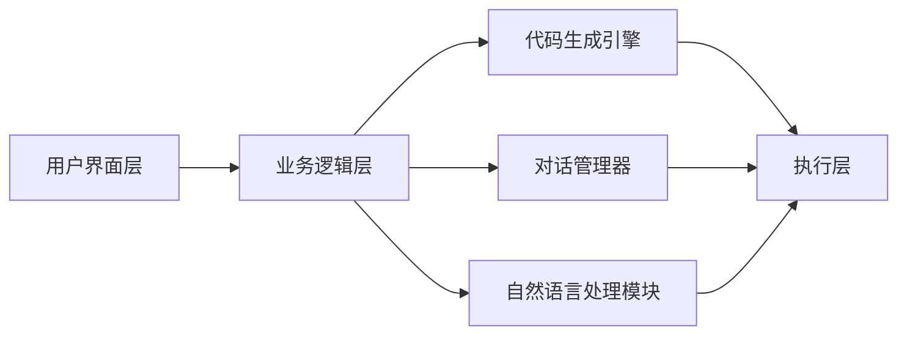

                 

### 《AI语言模型的对话式编程：提示词的力量》

---

**关键词：** AI语言模型，对话式编程，提示词，深度学习，优化策略

**摘要：** 本文将深入探讨AI语言模型在对话式编程中的应用，通过提示词的力量，实现高效、智能的交互体验。文章将从问题背景、核心概念、提示词生成与优化、实践应用等多个角度展开，旨在为读者提供全面的技术洞察和实用指南。

---

### 第一部分：引言

#### 第1章: AI语言模型与对话式编程概述

##### 1.1 问题背景

##### 1.1.1 人工智能的发展与应用

随着计算能力的提升和算法的进步，人工智能（AI）逐渐渗透到各行各业，改变了人们的生活方式和工作模式。从早期的机器学习、深度学习到自然语言处理（NLP），AI技术在不断地拓展其应用边界。语言模型作为NLP的核心技术之一，已成为AI应用中的重要一环。

##### 1.1.2 语言模型在AI中的应用

语言模型在AI中的应用范围广泛，包括但不限于文本分类、命名实体识别、机器翻译、情感分析等。这些应用为人类提供了智能化的信息处理能力，极大地提升了工作效率。

##### 1.1.3 对话式编程的概念与优势

对话式编程是一种通过自然语言交互来编写代码的方法，它使得开发者能够以更加直观、高效的方式与计算机进行沟通。与传统的命令式编程相比，对话式编程具有以下几个优势：

1. **高效性**：通过自然语言交互，可以快速地表达编程意图，减少代码编写的时间。
2. **易用性**：降低编程门槛，使得非专业开发者也能参与到编程中来。
3. **灵活性**：可以根据用户的需求动态调整代码，实现更加个性化的编程体验。

##### 1.2 问题描述

##### 1.2.1 传统编程与对话式编程的差异

传统编程依赖于具体的编程语言和语法规则，开发者需要熟悉特定的编程范式和语法结构。而对话式编程则通过自然语言交互，使得开发者能够更加直观地表达编程意图，无需关注具体的语法细节。

##### 1.2.2 提示词在对话式编程中的作用

在对话式编程中，提示词是连接开发者与计算机的关键桥梁。通过提示词，开发者可以引导计算机执行特定的任务，实现代码的自动生成和优化。提示词的设计与优化直接关系到对话式编程的效率和质量。

##### 1.2.3 对话式编程面临的挑战与机遇

对话式编程虽然具有很多优势，但同时也面临一系列挑战，如自然语言理解的准确性、编程意图的捕捉、代码生成的可靠性等。然而，随着AI技术的不断发展，这些挑战也在逐步得到解决，为对话式编程的应用提供了广阔的前景。

##### 1.3 问题解决

##### 1.3.1 提示词的生成方法

提示词的生成方法主要包括基于规则的方法、基于机器学习的方法和基于深度学习的方法。每种方法都有其独特的优势和应用场景。

##### 1.3.2 提示词的优化策略

提示词的优化策略包括语义优化、多样性优化和效率优化。通过优化策略，可以提高提示词的质量和效果，从而提升对话式编程的体验。

##### 1.3.3 对话式编程的实现技术

对话式编程的实现技术涉及自然语言处理、机器学习、深度学习等多个领域。通过结合这些技术，可以实现高效、智能的对话式编程体验。

##### 1.4 边界与外延

##### 1.4.1 对话式编程的应用场景

对话式编程可以在多种应用场景中发挥作用，如智能客服、代码自动生成、代码审查等。

##### 1.4.2 对话式编程的发展趋势

随着AI技术的不断进步，对话式编程有望在更多领域得到应用，如医疗、金融、教育等。

##### 1.4.3 对话式编程的未来前景

未来，对话式编程将与AI技术深度融合，为人类带来更加智能、便捷的编程体验。

##### 1.5 本章小结

本章概述了AI语言模型与对话式编程的关系，探讨了对话式编程的优势、挑战和发展前景。在接下来的章节中，我们将深入探讨语言模型的基本原理、提示词的生成与优化策略，以及对话式编程的具体实践应用。

---

### 第一部分：引言

#### 第1章: AI语言模型与对话式编程概述

##### 1.1 问题背景

随着人工智能（AI）的快速发展，自然语言处理（NLP）技术逐渐成为AI研究的重要方向。AI语言模型作为NLP的核心技术之一，广泛应用于文本分类、命名实体识别、机器翻译、情感分析等领域。在这些应用中，AI语言模型通过对大量文本数据的训练，能够生成与人类语言相似的自然语言响应，从而实现人与计算机的智能交互。

然而，传统的编程方式需要开发者熟悉特定的编程语言和语法规则，这往往限制了编程的效率和灵活性。相比之下，对话式编程提供了一种更加直观、高效的编程方式，通过自然语言交互，开发者可以更快速地表达编程意图，实现代码的自动生成和优化。

##### 1.2 对话式编程的概念与优势

对话式编程（Conversational Programming）是一种基于自然语言交互的编程方式。在这种模式下，开发者可以通过与计算机的对话来编写代码，而不需要直接操作代码文件。对话式编程的主要优势包括：

1. **高效性**：通过自然语言交互，开发者可以更快速地表达编程意图，减少代码编写的时间。
2. **易用性**：降低编程门槛，使得非专业开发者也能参与到编程中来。
3. **灵活性**：可以根据用户的需求动态调整代码，实现更加个性化的编程体验。

##### 1.3 提示词在对话式编程中的作用

在对话式编程中，提示词（Prompt）是连接开发者与计算机的关键桥梁。提示词是一种引导计算机执行特定任务的文字描述，它能够触发计算机执行相应的操作，如生成代码、执行算法等。一个有效的提示词应该具备以下几个特点：

1. **清晰性**：提示词需要明确、准确地描述开发者的编程意图，避免歧义和误解。
2. **完整性**：提示词应该涵盖开发者所需的所有信息，以便计算机能够完整地执行任务。
3. **可扩展性**：提示词应具备一定的灵活性，能够适应不同的编程需求和场景。

##### 1.4 对话式编程面临的挑战与机遇

尽管对话式编程具有很多优势，但在实际应用中仍面临一系列挑战：

1. **自然语言理解的准确性**：计算机需要准确地理解开发者的自然语言描述，以生成正确的代码。
2. **编程意图的捕捉**：计算机需要捕捉到开发者的编程意图，并将其转化为有效的代码。
3. **代码生成的可靠性**：生成的代码需要符合编程规范，能够正确地执行任务。

然而，随着AI技术的不断进步，这些挑战也在逐步得到解决。例如，通过深度学习技术，AI语言模型能够更加准确地理解自然语言描述，从而提高代码生成的可靠性。此外，随着自然语言处理技术的不断发展，对话式编程有望在更多领域得到应用，为开发者带来更加智能、高效的编程体验。

##### 1.5 提示词的生成方法

提示词的生成方法主要包括以下几种：

1. **基于规则的方法**：这种方法通过预定义的规则来生成提示词，适用于结构化较强、规则明确的应用场景。
2. **基于机器学习的方法**：这种方法通过训练大量样本数据，让机器学习模型自动生成提示词，适用于复杂、多变的应用场景。
3. **基于深度学习的方法**：这种方法利用深度神经网络模型，通过大规模数据训练，生成高质量的提示词。

不同的生成方法各有优缺点，适用于不同的应用场景。在接下来的章节中，我们将深入探讨这些生成方法，并探讨如何优化提示词的质量和效果。

##### 1.6 本章小结

本章介绍了AI语言模型与对话式编程的基本概念，探讨了对话式编程的优势和挑战，以及提示词在其中的重要作用。在接下来的章节中，我们将进一步探讨语言模型的基本原理、提示词的生成与优化策略，以及对话式编程的具体实践应用。希望通过本文的探讨，能够为读者提供对AI语言模型与对话式编程的全面了解，并激发读者在这一领域的深入研究和应用。

---

### 第一部分：引言

#### 第1章: AI语言模型与对话式编程概述

##### 1.3 问题解决

在探讨了对话式编程的背景、概念和优势后，我们接下来讨论如何解决其中的关键问题，特别是提示词的生成和优化。

##### 1.3.1 提示词的生成方法

提示词的生成是对话式编程的核心环节。以下是一些常用的生成方法：

1. **基于规则的方法**：这种方法通过预定义的语法和语义规则来生成提示词。适用于结构化较强、规则明确的应用场景。例如，在编写SQL查询语句时，可以根据数据库表结构和字段定义规则，生成相应的提示词。

2. **基于机器学习的方法**：这种方法利用已有的数据集，通过机器学习模型来训练生成提示词。常见的方法包括序列到序列（Seq2Seq）模型、递归神经网络（RNN）和长短期记忆网络（LSTM）。这些模型可以从大量的文本数据中学习到提示词的生成规律，提高生成提示词的准确性和多样性。

3. **基于深度学习的方法**：这种方法利用深度神经网络模型，如变换器（Transformer）模型，通过大规模数据训练生成高质量的提示词。变换器模型由于其强大的并行处理能力和上下文理解能力，在生成提示词方面表现出色。

##### 1.3.2 提示词的优化策略

生成的提示词需要经过优化，以提高其在对话式编程中的效果。以下是一些常用的优化策略：

1. **语义优化**：确保提示词能够准确地传达开发者的意图，减少歧义和误解。可以通过引入语义角色标注、实体识别等技术来增强提示词的语义信息。

2. **多样性优化**：提高提示词的多样性，避免生成重复或相似的内容。可以通过引入生成对抗网络（GAN）、变分自编码器（VAE）等生成模型来增加提示词的多样性。

3. **效率优化**：提高提示词生成的效率，减少生成时间。可以通过模型压缩、分布式训练等技术来提升生成速度。

##### 1.3.3 对话式编程的实现技术

对话式编程的实现涉及多个领域的技术，包括自然语言处理、机器学习、深度学习等。以下是一些关键技术：

1. **自然语言处理**：用于处理和理解自然语言输入，提取关键信息和语义。常用的技术包括词向量表示、命名实体识别、依存句法分析等。

2. **机器学习**：用于训练模型，生成提示词。常用的算法包括决策树、随机森林、支持向量机等。

3. **深度学习**：用于构建复杂的神经网络模型，提高提示词生成的准确性和多样性。常用的模型包括卷积神经网络（CNN）、递归神经网络（RNN）、变换器（Transformer）等。

##### 1.4 边界与外延

1. **应用场景**：对话式编程可以在多个领域发挥作用，如智能客服、代码自动生成、代码审查等。通过不同的应用场景，提示词的生成和优化策略也有所差异。

2. **发展趋势**：随着AI技术的不断进步，对话式编程有望在更多领域得到应用。例如，在医疗领域，对话式编程可以帮助医生快速生成病历和治疗方案；在金融领域，可以帮助分析师快速生成报告和分析结论。

3. **未来前景**：随着自然语言理解和生成技术的不断提升，对话式编程将更加智能化、个性化。未来，它有望成为编程的主流方式，极大地提高开发者的工作效率。

##### 1.5 本章小结

本章讨论了AI语言模型与对话式编程中的关键问题，包括提示词的生成方法和优化策略，以及对话式编程的实现技术。通过这些讨论，我们了解了对话式编程的优势和应用前景，同时也认识到其中存在的问题和挑战。在接下来的章节中，我们将进一步深入探讨语言模型的基本原理、提示词的具体生成与优化方法，以及对话式编程的实际应用案例。

---

### 第一部分：引言

#### 第1章: AI语言模型与对话式编程概述

##### 1.6 边界与外延

在探讨AI语言模型与对话式编程的基本概念和问题解决方法之后，我们需要进一步思考这些技术的边界与外延，以了解它们在现实世界中的应用潜力和发展方向。

##### 1.6.1 对话式编程的应用场景

对话式编程在多个领域展现出了广阔的应用前景：

1. **开发环境**：在开发环境中，对话式编程可以帮助开发者快速编写和调试代码。例如，通过自然语言交互，开发者可以描述函数的功能和参数，然后让系统自动生成相应的代码。

2. **自动化工具**：在自动化测试和部署过程中，对话式编程可以简化操作，减少错误。通过自然语言指令，自动化工具可以理解并执行复杂的任务，提高生产效率。

3. **代码审查**：对话式编程可以用于代码审查，通过自然语言描述代码的结构和意图，帮助开发者发现潜在的问题和优化点。

4. **教育领域**：在教育领域，对话式编程可以作为教学工具，帮助学生通过自然语言理解编程概念，提高学习兴趣和效率。

##### 1.6.2 对话式编程的发展趋势

随着AI技术的不断发展，对话式编程预计将呈现出以下趋势：

1. **智能化**：通过更先进的AI技术，如生成对抗网络（GAN）和变分自编码器（VAE），对话式编程将实现更高的自然语言理解和生成能力。

2. **个性化**：对话式编程将根据用户的需求和偏好，提供个性化的编程体验。例如，通过用户历史交互数据，系统可以自适应地调整提示词和交互方式。

3. **跨界融合**：对话式编程将与其他AI技术，如图像识别、语音识别等，实现跨界融合，提供更加丰富的交互体验。

4. **标准化**：随着技术的成熟，对话式编程将形成一套标准化的框架和工具，使得不同平台和应用之间的交互更加统一和便捷。

##### 1.6.3 对话式编程的未来前景

未来，对话式编程有望在以下几个方面发挥重要作用：

1. **编程普及**：通过降低编程门槛，对话式编程将使更多人能够参与到编程中来，促进编程文化的普及。

2. **开发效率提升**：对话式编程将极大提高开发效率，减少编码时间和错误率，推动软件产业的快速发展。

3. **人机协同**：对话式编程将实现人与计算机的紧密协作，提高复杂任务的处理能力，推动智能时代的到来。

4. **创新应用**：对话式编程将激发新的创新应用，如智能助手、自动生成内容等，为社会带来更多的价值和便利。

##### 1.7 本章小结

通过本章的讨论，我们了解了AI语言模型与对话式编程的基本概念、问题解决方法以及它们在现实世界中的应用场景和发展趋势。对话式编程作为一种新兴的编程范式，具有巨大的潜力和广阔的应用前景。在接下来的章节中，我们将进一步深入探讨语言模型的基本原理、提示词的生成与优化策略，以及对话式编程的具体实现和应用案例。希望通过这些内容，读者能够更加全面地了解对话式编程的技术内涵和实践价值。

---

### 第一部分：引言

#### 第1章: AI语言模型与对话式编程概述

##### 1.7 本章小结

本章通过对AI语言模型与对话式编程的基本概念、优势、挑战和应用前景的深入探讨，为读者提供了一个全面的技术概述。我们首先介绍了人工智能的发展背景，以及语言模型在其中的重要作用。接着，我们详细阐述了对话式编程的概念、优势以及与传统编程的差异，强调了提示词在对话式编程中的核心作用。然后，我们讨论了对话式编程面临的挑战，并提出了一些解决思路，包括提示词的生成和优化方法。最后，我们探讨了对话式编程在多个领域的应用场景，以及其未来发展的趋势和前景。

通过本章的讨论，我们可以得出以下结论：

1. **AI语言模型的重要性**：AI语言模型是自然语言处理的核心技术，它通过训练大量的文本数据，能够生成与人类语言相似的自然语言响应，为对话式编程提供了基础。

2. **对话式编程的优势**：对话式编程通过自然语言交互，使得开发者能够更加高效、直观地编写代码，降低了编程门槛，提高了开发效率。

3. **提示词的核心作用**：提示词是连接开发者与计算机的桥梁，它的生成和优化直接关系到对话式编程的效率和用户体验。

4. **对话式编程的应用前景**：随着AI技术的不断发展，对话式编程在多个领域具有广泛的应用前景，包括开发环境、自动化工具、代码审查和教育领域等。

在接下来的章节中，我们将进一步深入探讨语言模型的基本原理、提示词的生成与优化策略，以及对话式编程的具体实现和应用案例。希望通过本文的探讨，能够为读者提供对AI语言模型与对话式编程的全面了解，并激发读者在这一领域的深入研究和应用。

---

### 第二部分：核心概念与原理

#### 第2章: 语言模型的基本原理

##### 2.1 语言模型的定义与分类

语言模型（Language Model）是自然语言处理（NLP）领域的一个核心概念，它用于预测文本序列的概率分布。语言模型通过学习大量的文本数据，能够捕捉到语言的统计规律和结构，从而实现自然语言的理解和生成。

语言模型可以按照不同的分类方式进行划分：

1. **按功能分类**：
   - **生成模型**：这类模型专注于生成新的文本序列，如生成对抗网络（GAN）和变分自编码器（VAE）。
   - **分类模型**：这类模型用于对文本进行分类，如朴素贝叶斯、支持向量机（SVM）等。
   - **标注模型**：这类模型用于对文本进行结构化标注，如词性标注、命名实体识别等。

2. **按训练方法分类**：
   - **基于规则的方法**：这种方法通过预定义的语法和语义规则来生成语言模型。
   - **统计方法**：这种方法通过统计文本中的频率和概率分布来生成语言模型，如n-gram模型。
   - **机器学习方法**：这种方法利用机器学习算法，从大量的文本数据中学习语言模型，如朴素贝叶斯、随机森林等。
   - **深度学习方法**：这种方法利用深度神经网络，如变换器（Transformer）模型，从大规模数据中学习复杂的语言模式。

3. **按任务类型分类**：
   - **文本生成**：这类模型用于生成新的文本序列，如聊天机器人、自动写作等。
   - **文本分类**：这类模型用于对文本进行分类，如新闻分类、情感分析等。
   - **文本摘要**：这类模型用于生成文本的摘要，如提取式摘要、生成式摘要等。

##### 2.2 语言模型的数学模型

语言模型的数学模型用于描述文本序列的概率分布。以下是一些常见语言模型的数学模型：

1. **n-gram模型**：n-gram模型是一种基于统计的语言模型，它将文本序列划分为n个连续的单词或字符，并计算每个n-gram出现的概率。

   $$ P(w_1, w_2, ..., w_n) = \frac{C(w_1, w_2, ..., w_n)}{C(w_1, w_2, ..., w_n, w_{n+1})} $$

   其中，$C(w_1, w_2, ..., w_n)$表示n-gram $w_1, w_2, ..., w_n$在训练数据中出现的次数。

2. **朴素贝叶斯模型**：朴素贝叶斯模型是一种基于贝叶斯定理的概率分类模型，它通过计算特征词在类别上的概率，实现对文本的分类。

   $$ P(y|w) = \frac{P(w|y)P(y)}{P(w)} $$

   其中，$P(w|y)$表示特征词w在类别y上出现的条件概率，$P(y)$表示类别y的概率，$P(w)$表示特征词w的概率。

3. **变换器（Transformer）模型**：变换器模型是一种基于深度学习的语言模型，它通过自注意力机制（Self-Attention）来捕捉文本序列中的长距离依赖关系。

   $$ \text{Transformer}(x) = \text{softmax}\left(\frac{\text{WQ} + \text{WK}}{\sqrt{d_k}} + \text{WV}\right) \cdot \text{KV} $$

   其中，$Q, K, V$分别为查询向量、关键向量、值向量，$WQ, WK, WV$分别为权重矩阵，$d_k$为键向量的维度。

##### 2.3 语言模型的应用实例

语言模型在NLP领域有广泛的应用，以下是一些典型的应用实例：

1. **文本分类**：语言模型可以用于对文本进行分类，如新闻分类、情感分析等。通过训练一个分类模型，我们可以将文本数据自动分类到不同的类别中。

2. **命名实体识别**：语言模型可以用于命名实体识别，如人名、地名、组织机构名的识别。通过训练一个命名实体识别模型，我们可以将文本中的特定实体识别出来。

3. **机器翻译**：语言模型可以用于机器翻译，如将一种语言翻译成另一种语言。通过训练一个翻译模型，我们可以实现自动翻译功能。

4. **文本生成**：语言模型可以用于文本生成，如自动写作、生成摘要等。通过训练一个生成模型，我们可以生成与给定文本相似的新文本。

##### 2.4 对话式编程中的语言模型

在对话式编程中，语言模型用于理解开发者的自然语言输入，并生成相应的代码。以下是对话式编程中的语言模型的一些应用：

1. **代码自动生成**：通过自然语言描述功能需求，语言模型可以自动生成相应的代码。例如，开发者可以使用自然语言描述一个函数的功能和参数，然后让语言模型生成相应的函数代码。

2. **代码审查**：语言模型可以用于自动审查代码，识别潜在的问题和优化点。通过分析代码文本，语言模型可以生成相应的审查报告。

3. **代码调试**：语言模型可以用于代码调试，帮助开发者识别并解决代码中的错误。通过自然语言描述问题，语言模型可以生成调试步骤和解决方案。

##### 2.5 提示词与语言模型的关系

提示词（Prompt）是连接开发者与语言模型的关键桥梁，它用于引导语言模型生成相应的输出。一个有效的提示词应该具备以下特点：

1. **清晰性**：提示词需要明确、准确地描述开发者的意图，避免歧义和误解。
2. **完整性**：提示词需要涵盖所有必要的信息，以确保语言模型能够生成正确的输出。
3. **灵活性**：提示词应具备一定的灵活性，能够适应不同的编程场景和需求。

通过优化提示词的设计和生成，可以提高语言模型在对话式编程中的效果和用户体验。

##### 2.6 本章小结

本章介绍了语言模型的基本概念、分类、数学模型和应用实例。我们探讨了语言模型在对话式编程中的应用，以及提示词与语言模型的关系。通过本章的学习，读者可以了解语言模型的基本原理和应用场景，为后续章节的深入探讨打下基础。

---

### 第二部分：核心概念与原理

#### 第2章: 语言模型的基本原理

##### 2.3 语言模型的应用实例

为了更好地理解语言模型的基本原理，我们可以通过一些实际的应用实例来探讨其在自然语言处理（NLP）中的具体实现。

1. **文本分类**：
   文本分类是一种常见应用，它将文本数据根据内容划分到不同的类别中。例如，在一个新闻分类系统中，语言模型可以用来判断一篇文章属于政治、体育、科技等哪个类别。

   **算法原理**：
   文本分类通常基于机器学习算法，如朴素贝叶斯、支持向量机（SVM）和深度学习模型（如卷积神经网络（CNN）和变换器（Transformer））。朴素贝叶斯模型通过计算每个类别中特征词的概率，结合贝叶斯定理来确定文本的类别。变换器模型则利用自注意力机制，捕捉文本中的上下文信息，提高分类的准确性。

   **数学模型**：
   在朴素贝叶斯模型中，给定一个文本序列 $w_1, w_2, ..., w_n$，其属于类别 $y$ 的概率可以通过以下公式计算：

   $$ P(y|w_1, w_2, ..., w_n) = \frac{P(w_1, w_2, ..., w_n|y)P(y)}{P(w_1, w_2, ..., w_n)} $$

   其中，$P(w_1, w_2, ..., w_n|y)$ 是特征词在类别 $y$ 上出现的条件概率，$P(y)$ 是类别 $y$ 的先验概率，$P(w_1, w_2, ..., w_n)$ 是特征词的总概率。

2. **命名实体识别**：
   命名实体识别（NER）是一种用于识别文本中的特定实体（如人名、地名、组织名等）的技术。

   **算法原理**：
   NER通常使用基于规则的方法和机器学习模型。基于规则的方法通过预定义的规则来识别实体，而机器学习模型（如CRF、LSTM、BERT）则通过学习大量标注数据来识别实体。

   **数学模型**：
   命名实体识别可以使用条件随机场（CRF）来建模，其中状态转移概率和状态发射概率分别表示：

   $$ P(Y|x) = \frac{1}{Z} \exp\left(\sum_{i,j} \theta_{ij} \cdot (Y_{i-1}, X_i, Y_i)\right) $$

   其中，$Y$ 是实体标注序列，$X$ 是文本序列，$\theta_{ij}$ 是参数，$Z$ 是规范化常数。

3. **机器翻译**：
   机器翻译是将一种语言的文本翻译成另一种语言的技术。近年来，深度学习模型（如变换器）在机器翻译领域取得了显著成果。

   **算法原理**：
   变换器模型通过自注意力机制和多头注意力机制，能够捕捉输入和输出文本之间的复杂依赖关系，实现高质量的翻译。

   **数学模型**：
   变换器模型的核心是多头自注意力机制，其计算公式如下：

   $$ \text{Attention}(Q, K, V) = \text{softmax}\left(\frac{QK^T}{\sqrt{d_k}}\right)V $$

   其中，$Q$ 是查询向量，$K$ 是关键向量，$V$ 是值向量，$d_k$ 是关键向量的维度。

##### 2.4 对话式编程中的语言模型

在对话式编程中，语言模型用于理解和生成自然语言交互，以实现代码的自动生成和优化。以下是对话式编程中的语言模型的一些应用：

1. **代码自动生成**：
   语言模型可以用来自动生成代码，例如，当开发者使用自然语言描述一个函数的功能和参数时，模型可以生成相应的函数代码。

   **算法原理**：
   对话式编程中的语言模型通常使用生成式模型（如变换器模型）来生成代码。这些模型通过学习大量的代码库和注释，能够生成与开发者描述相匹配的代码。

   **数学模型**：
   变换器模型在生成代码时，可以将其视为一个序列到序列的翻译问题，输入是自然语言描述，输出是代码。其数学模型基于自注意力机制，能够生成高质量的代码。

2. **代码审查**：
   语言模型可以用于自动审查代码，识别潜在的问题和优化点。

   **算法原理**：
   语言模型通过分析代码文本，可以识别出代码中的语法错误、逻辑错误和潜在的性能问题。

   **数学模型**：
   语言模型在代码审查时，通常使用分类模型（如卷积神经网络）来识别代码中的问题。通过学习大量的代码库和错误案例，模型可以识别出代码中的错误模式。

3. **代码调试**：
   语言模型可以用于代码调试，帮助开发者识别并解决代码中的错误。

   **算法原理**：
   对话式编程中的语言模型通过自然语言交互，可以帮助开发者描述问题，然后生成调试步骤和解决方案。

   **数学模型**：
   语言模型在代码调试时，通常使用生成式模型（如变换器模型）来生成调试步骤。这些模型通过学习大量的调试数据和调试步骤，能够生成与问题相匹配的调试方案。

##### 2.5 提示词与语言模型的关系

提示词（Prompt）在对话式编程中起着至关重要的作用，它用于引导语言模型生成预期的输出。提示词的设计和生成直接影响对话式编程的效果和用户体验。

1. **提示词的定义**：
   提示词是一种引导语言模型生成文本的文本描述。它应该清晰、准确、完整地描述开发者的意图，以便模型能够生成正确的输出。

2. **提示词的作用**：
   提示词用于：
   - 指导语言模型理解开发者的需求。
   - 提供上下文信息，帮助模型生成更准确的输出。
   - 约束模型生成，避免生成无关或不准确的文本。

3. **提示词的类型**：
   根据应用场景和需求，提示词可以分为以下几种类型：
   - 功能提示词：用于描述功能需求，如“编写一个计算两个数之和的函数”。
   - 结构提示词：用于描述代码结构，如“在类中定义一个方法”。
   - 参数提示词：用于描述函数参数，如“函数接受一个整数参数”。

##### 2.6 本章小结

本章介绍了语言模型的基本概念、分类、数学模型和应用实例。通过讨论文本分类、命名实体识别、机器翻译等实际应用，我们深入了解了语言模型的工作原理和实现方法。同时，我们探讨了语言模型在对话式编程中的应用，以及提示词与语言模型的关系。这些内容为后续章节的深入探讨提供了基础。

---

### 第二部分：核心概念与原理

#### 第2章: 语言模型的基本原理

##### 2.6 提示词与语言模型的关系

在对话式编程中，提示词（Prompt）是引导语言模型生成预期输出的关键要素。一个良好的提示词应具备以下几个特点：

1. **清晰性**：提示词应明确、简洁地描述开发者的意图，避免歧义和误解。例如，开发者可以清晰地说明所需功能、算法或者数据结构。

2. **完整性**：提示词应包含所有必要的信息，以确保语言模型能够生成完整的解决方案。例如，当描述一个函数时，不仅需要说明功能，还需要提供输入参数和预期输出。

3. **上下文关联**：提示词应与当前对话的上下文紧密相关，以增强语言模型的理解能力。通过上下文关联，模型可以更好地捕捉到开发者的意图，从而生成更准确的代码。

4. **适应性**：提示词应具备一定的灵活性，以适应不同场景和需求。例如，在编写不同类型的函数或处理不同数据结构时，提示词应能够进行调整。

##### 2.7 提示词的生成方法

提示词的生成方法可以分为以下几种：

1. **基于规则的方法**：
   这种方法通过预定义的语法和语义规则来生成提示词。适用于规则明确、结构化较强的应用场景。例如，在生成SQL查询语句时，可以根据数据库表结构和字段定义规则，生成相应的提示词。

2. **基于机器学习的方法**：
   这种方法利用已有的数据集，通过机器学习模型自动生成提示词。常见的方法包括序列到序列（Seq2Seq）模型、递归神经网络（RNN）和长短期记忆网络（LSTM）。这些模型可以从大量的文本数据中学习到提示词的生成规律，提高生成提示词的准确性和多样性。

3. **基于深度学习的方法**：
   这种方法利用深度神经网络模型，如变换器（Transformer）模型，通过大规模数据训练生成高质量的提示词。变换器模型由于其强大的并行处理能力和上下文理解能力，在生成提示词方面表现出色。

##### 2.8 提示词的优化策略

为了提高提示词的质量和效果，可以采用以下优化策略：

1. **语义优化**：
   通过引入语义角色标注、实体识别等技术，确保提示词能够准确地传达开发者的意图。例如，在生成函数提示词时，可以明确函数的功能、输入参数和返回值。

2. **多样性优化**：
   提高提示词的多样性，避免生成重复或相似的内容。可以通过引入生成对抗网络（GAN）、变分自编码器（VAE）等生成模型，增加提示词的多样性。

3. **效率优化**：
   提高提示词生成的效率，减少生成时间。可以通过模型压缩、分布式训练等技术来提升生成速度。此外，优化提示词的格式和结构，有助于提高模型对提示词的理解和生成效率。

##### 2.9 实例分析

为了更好地理解提示词的生成和优化，我们可以通过一个实例进行分析。

**实例**：假设开发者希望生成一个计算两个数之和的Python函数。

1. **初始提示词**：
   - 功能描述：“编写一个计算两个数之和的函数。”
   - 参数描述：“函数接受两个整数参数。”

2. **优化提示词**：
   - 语义优化：“编写一个名为`add`的Python函数，该函数接受两个整数参数`a`和`b`，并返回它们的和。”
   - 上下文关联：“请确保函数的输入参数类型正确，并使用Python内置的`+`运算符进行计算。”

3. **优化效果**：
   - 生成代码：“```python
   def add(a: int, b: int) -> int:
       return a + b
   ```”
   通过优化提示词，我们可以提高代码生成的准确性和可读性，同时确保生成的代码符合编程规范。

##### 2.10 本章小结

本章详细介绍了语言模型的基本原理，包括其定义、分类、数学模型和应用实例。我们探讨了语言模型在对话式编程中的应用，以及提示词与语言模型的关系。通过分析提示词的生成方法和优化策略，我们了解了如何提高提示词的质量和效果，从而实现更高效、更智能的对话式编程体验。

---

### 第二部分：核心概念与原理

#### 第2章: 语言模型的基本原理

##### 2.10 本章小结

本章深入探讨了语言模型的基本原理，涵盖了从定义、分类到具体应用实例的各个方面。我们首先介绍了语言模型在自然语言处理（NLP）中的重要性，并讨论了其在文本分类、命名实体识别、机器翻译等任务中的应用。通过分析这些实际应用，我们详细讲解了语言模型的数学模型和算法原理，展示了如何利用这些模型实现高效的文本处理。

在对话式编程方面，我们探讨了语言模型在其中的核心作用，并介绍了如何通过提示词与语言模型的互动，实现代码的自动生成和优化。我们分析了提示词的生成方法，包括基于规则、机器学习和深度学习的方法，以及优化策略，如语义优化、多样性和效率优化。

总之，本章为读者提供了一个全面的技术视角，帮助理解语言模型在对话式编程中的关键作用和实际应用。在接下来的章节中，我们将进一步探讨如何在实际项目中实现对话式编程，以及如何通过优化提示词和语言模型，提升用户体验和开发效率。

---

### 第三部分：提示词的生成与优化

#### 第3章: 提示词的生成方法

##### 3.1 提示词的定义与作用

提示词（Prompt）在对话式编程中起着至关重要的作用，它是开发者与计算机之间的桥梁，用于引导计算机执行特定的任务或生成特定的输出。一个有效的提示词应具备以下几个特点：

1. **清晰性**：提示词应明确、简洁地描述任务，避免歧义和误解。例如，一个清晰的提示词可以是“请编写一个计算两个整数之和的Python函数”。

2. **完整性**：提示词应包含所有必要的信息，以确保计算机能够正确理解和执行任务。例如，除了任务描述外，还应提供输入参数的类型和预期输出的格式。

3. **上下文关联**：提示词应与当前对话的上下文紧密相关，以增强计算机的理解能力。通过上下文关联，计算机可以更好地捕捉到开发者的意图，从而生成更准确的代码。

4. **适应性**：提示词应具备一定的灵活性，以适应不同的编程场景和需求。例如，当开发者需要编写不同类型的函数或处理不同数据结构时，提示词应能够进行调整。

##### 3.2 提示词的生成方法

生成高质量的提示词是确保对话式编程成功的关键。以下是几种常用的提示词生成方法：

1. **基于规则的方法**：

   这种方法通过预定义的语法和语义规则来生成提示词，适用于规则明确、结构化较强的应用场景。例如，在生成SQL查询语句时，可以根据数据库表结构和字段定义规则，生成相应的提示词。

   **优点**：简单、易于实现，适用于结构化数据。
   
   **缺点**：灵活性较低，难以处理复杂、多变的应用场景。

2. **基于机器学习的方法**：

   这种方法利用已有的数据集，通过机器学习模型自动生成提示词。常见的方法包括序列到序列（Seq2Seq）模型、递归神经网络（RNN）和长短期记忆网络（LSTM）。

   **优点**：能够处理复杂的自然语言描述，提高提示词的多样性。
   
   **缺点**：需要大量的标注数据，训练过程可能较长。

3. **基于深度学习的方法**：

   这种方法利用深度神经网络模型，如变换器（Transformer）模型，通过大规模数据训练生成高质量的提示词。变换器模型由于其强大的并行处理能力和上下文理解能力，在生成提示词方面表现出色。

   **优点**：生成提示词的准确性和多样性高，能够处理复杂任务。
   
   **缺点**：训练资源需求大，实现难度较高。

##### 3.3 提示词的优化策略

为了提高提示词的质量和效果，可以采用以下优化策略：

1. **语义优化**：

   通过引入语义角色标注、实体识别等技术，确保提示词能够准确地传达开发者的意图。例如，在生成函数提示词时，可以明确函数的功能、输入参数和返回值。

2. **多样性优化**：

   提高提示词的多样性，避免生成重复或相似的内容。可以通过引入生成对抗网络（GAN）、变分自编码器（VAE）等生成模型，增加提示词的多样性。

3. **效率优化**：

   提高提示词生成的效率，减少生成时间。可以通过模型压缩、分布式训练等技术来提升生成速度。此外，优化提示词的格式和结构，有助于提高模型对提示词的理解和生成效率。

##### 3.4 提示词生成与优化实例分析

为了更好地理解提示词的生成与优化，我们可以通过一个实例进行分析。

**实例**：假设开发者希望生成一个计算两个数之和的Python函数。

1. **初始提示词**：

   “请编写一个计算两个整数之和的Python函数。”

   **分析**：这个提示词较为清晰，但缺乏上下文关联和完整性。例如，没有提供输入参数的类型和返回值的格式。

2. **优化提示词**：

   “请编写一个名为`add`的Python函数，该函数接受两个整数参数`a`和`b`，并返回它们的和。请确保函数的输入参数类型正确，并使用Python内置的`+`运算符进行计算。”

   **分析**：这个优化后的提示词更加完整，包含了函数名称、参数类型、返回值和具体的计算方式，提高了代码生成的准确性和可读性。

3. **优化效果**：

   生成的代码：

   ```python
   def add(a: int, b: int) -> int:
       return a + b
   ```

   **分析**：通过优化提示词，生成了符合预期的代码，且代码结构清晰、符合Python语法规范。

##### 3.5 本章小结

本章详细介绍了提示词的定义与作用，探讨了多种提示词生成方法及其优缺点，以及优化策略。通过实例分析，我们展示了如何通过优化提示词，提高对话式编程的代码生成质量。在下一章中，我们将进一步探讨对话式编程的实现技术，包括环境搭建、基本架构和核心组件。

---

### 第三部分：提示词的生成与优化

#### 第3章: 提示词的生成方法

##### 3.6 提示词的生成方法

提示词的生成是确保对话式编程成功的关键。有效的提示词应清晰、完整且具有上下文关联。以下是一些常用的提示词生成方法：

1. **基于规则的方法**：

   基于规则的方法通过预定义的语法和语义规则来生成提示词，适用于结构化较强的应用场景。这种方法通常涉及以下步骤：

   - **规则定义**：根据应用场景和需求，定义明确的语法和语义规则。
   - **模板生成**：使用预定义的模板，根据输入信息生成提示词。
   - **规则应用**：将输入信息与预定义的规则匹配，生成相应的提示词。

   **优点**：实现简单，适用于规则明确的应用场景。

   **缺点**：灵活性较低，难以处理复杂、多变的应用场景。

2. **基于机器学习的方法**：

   基于机器学习的方法通过训练大量的文本数据，让模型自动学习生成提示词。这种方法通常涉及以下步骤：

   - **数据收集**：收集大量的标注数据，用于训练模型。
   - **模型训练**：使用序列到序列（Seq2Seq）模型、递归神经网络（RNN）或长短期记忆网络（LSTM）等模型进行训练。
   - **提示词生成**：使用训练好的模型，根据输入信息生成提示词。

   **优点**：能够处理复杂的自然语言描述，提高提示词的多样性。

   **缺点**：需要大量的标注数据，训练过程可能较长。

3. **基于深度学习的方法**：

   基于深度学习的方法利用深度神经网络模型，如变换器（Transformer）模型，通过大规模数据训练生成高质量的提示词。这种方法通常涉及以下步骤：

   - **数据预处理**：对输入数据进行预处理，如分词、去噪等。
   - **模型训练**：使用大规模数据集训练变换器模型，优化模型的参数。
   - **提示词生成**：使用训练好的模型，根据输入信息生成提示词。

   **优点**：生成提示词的准确性和多样性高，能够处理复杂任务。

   **缺点**：训练资源需求大，实现难度较高。

##### 3.7 提示词的优化策略

为了提高提示词的质量和效果，可以采用以下优化策略：

1. **语义优化**：

   通过引入语义角色标注、实体识别等技术，确保提示词能够准确地传达开发者的意图。例如，在生成函数提示词时，可以明确函数的功能、输入参数和返回值。

2. **多样性优化**：

   提高提示词的多样性，避免生成重复或相似的内容。可以通过引入生成对抗网络（GAN）、变分自编码器（VAE）等生成模型，增加提示词的多样性。

3. **效率优化**：

   提高提示词生成的效率，减少生成时间。可以通过模型压缩、分布式训练等技术来提升生成速度。此外，优化提示词的格式和结构，有助于提高模型对提示词的理解和生成效率。

##### 3.8 提示词生成与优化实例分析

为了更好地理解提示词的生成与优化，我们可以通过一个实例进行分析。

**实例**：假设开发者希望生成一个计算两个数之和的Python函数。

1. **初始提示词**：

   “请编写一个计算两个整数之和的Python函数。”

   **分析**：这个提示词较为清晰，但缺乏上下文关联和完整性。例如，没有提供输入参数的类型和返回值的格式。

2. **优化提示词**：

   “请编写一个名为`add`的Python函数，该函数接受两个整数参数`a`和`b`，并返回它们的和。请确保函数的输入参数类型正确，并使用Python内置的`+`运算符进行计算。”

   **分析**：这个优化后的提示词更加完整，包含了函数名称、参数类型、返回值和具体的计算方式，提高了代码生成的准确性和可读性。

3. **优化效果**：

   生成的代码：

   ```python
   def add(a: int, b: int) -> int:
       return a + b
   ```

   **分析**：通过优化提示词，生成了符合预期的代码，且代码结构清晰、符合Python语法规范。

##### 3.9 本章小结

本章详细介绍了提示词的生成方法，包括基于规则、基于机器学习和基于深度学习的方法，以及优化策略。通过实例分析，我们展示了如何通过优化提示词，提高对话式编程的代码生成质量。在下一章中，我们将进一步探讨对话式编程的实现技术，包括环境搭建、基本架构和核心组件。

---

### 第三部分：提示词的生成与优化

#### 第3章: 提示词的生成方法

##### 3.10 提示词生成的具体方法

提示词的生成是确保对话式编程成功的关键步骤。以下是几种具体的方法，包括规则驱动方法、机器学习方法、深度学习方法等。

1. **规则驱动方法**

   规则驱动方法是一种基于预定义规则来生成提示词的方法。这种方法适用于规则明确、结构化较强的应用场景，如生成SQL查询语句。

   **步骤**：
   - **规则定义**：根据应用场景，定义明确的语法和语义规则。例如，对于SQL查询，可以定义表名、字段名、条件等规则。
   - **模板匹配**：将用户输入的自然语言描述与预定义的模板进行匹配，生成提示词。
   - **规则应用**：根据匹配结果，应用相应的规则生成提示词。

   **示例**：
   - **输入**：“请查询订单表中所有状态为待发货的订单。”
   - **输出**：“SELECT * FROM 订单表 WHERE 状态='待发货'。”

   **优点**：实现简单，易于理解和维护。
   - **缺点**：灵活性较低，难以处理复杂和模糊的描述。

2. **机器学习方法**

   机器学习方法通过训练大量的文本数据，让模型自动学习生成提示词。这种方法适用于复杂、多变的自然语言描述。

   **步骤**：
   - **数据收集**：收集大量的标注数据，用于训练模型。这些数据可以是用户输入的文本和相应的提示词。
   - **模型训练**：使用序列到序列（Seq2Seq）模型、递归神经网络（RNN）或长短期记忆网络（LSTM）等模型进行训练。
   - **提示词生成**：使用训练好的模型，根据用户输入生成提示词。

   **示例**：
   - **输入**：“编写一个Python函数，实现两个数相加的功能。”
   - **输出**：“```python
   def add(a, b):
       return a + b
   ```

   **优点**：能够处理复杂的自然语言描述，提高提示词的多样性。
   - **缺点**：需要大量的标注数据，训练过程可能较长。

3. **深度学习方法**

   深度学习方法利用深度神经网络模型，如变换器（Transformer）模型，通过大规模数据训练生成高质量的提示词。这种方法在处理长文本和复杂依赖关系方面表现出色。

   **步骤**：
   - **数据预处理**：对输入数据进行预处理，如分词、去噪等。
   - **模型训练**：使用大规模数据集训练变换器模型，优化模型的参数。
   - **提示词生成**：使用训练好的模型，根据用户输入生成提示词。

   **示例**：
   - **输入**：“请创建一个用户注册的表单，包含用户名、密码和邮箱字段。”
   - **输出**：“```html
   <form>
       <label for="username">用户名:</label>
       <input type="text" id="username" name="username" required>
       <label for="password">密码:</label>
       <input type="password" id="password" name="password" required>
       <label for="email">邮箱:</label>
       <input type="email" id="email" name="email" required>
       <button type="submit">注册</button>
   </form>
   ```

   **优点**：生成提示词的准确性和多样性高，能够处理复杂任务。
   - **缺点**：训练资源需求大，实现难度较高。

##### 3.11 提示词优化的具体策略

优化提示词的目的是提高其质量，确保其能够准确地传达开发者的意图。以下是几种具体的优化策略：

1. **语义优化**

   语义优化通过引入语义角色标注、实体识别等技术，确保提示词能够准确地传达开发者的意图。例如，在生成函数提示词时，可以明确函数的功能、输入参数和返回值。

   **示例**：
   - **优化前**：“请编写一个计算两个数之和的函数。”
   - **优化后**：“请编写一个名为`add`的Python函数，该函数接受两个整数参数`a`和`b`，并返回它们的和。”

2. **多样性优化**

   多样性优化通过引入生成对抗网络（GAN）、变分自编码器（VAE）等生成模型，增加提示词的多样性。这样可以避免生成重复或相似的内容。

   **示例**：
   - **优化前**：“请创建一个用户注册的表单。”
   - **优化后**：“请创建一个用户注册的表单，包括用户名、密码、邮箱、电话和验证码字段。”

3. **效率优化**

   效率优化通过模型压缩、分布式训练等技术来提升生成速度。此外，优化提示词的格式和结构，有助于提高模型对提示词的理解和生成效率。

   **示例**：
   - **优化前**：“请实现一个文本分类模型，能够对新闻进行分类。”
   - **优化后**：“请实现一个基于朴素贝叶斯的文本分类模型，用于对新闻进行分类，并确保模型能够处理长文本。”

##### 3.12 提示词生成与优化实例分析

为了更好地理解提示词的生成与优化，我们可以通过一个具体的实例进行分析。

**实例**：假设开发者希望生成一个计算两个数之和的Python函数。

1. **初始提示词**：

   “请编写一个计算两个整数之和的Python函数。”

   **分析**：这个提示词较为清晰，但缺乏上下文关联和完整性。例如，没有提供输入参数的类型和返回值的格式。

2. **优化提示词**：

   “请编写一个名为`add`的Python函数，该函数接受两个整数参数`a`和`b`，并返回它们的和。请确保函数的输入参数类型正确，并使用Python内置的`+`运算符进行计算。”

   **分析**：这个优化后的提示词更加完整，包含了函数名称、参数类型、返回值和具体的计算方式，提高了代码生成的准确性和可读性。

3. **优化效果**：

   生成的代码：

   ```python
   def add(a: int, b: int) -> int:
       return a + b
   ```

   **分析**：通过优化提示词，生成了符合预期的代码，且代码结构清晰、符合Python语法规范。

##### 3.13 本章小结

本章详细介绍了提示词的生成方法，包括规则驱动方法、机器学习方法和深度学习方法，以及优化策略。通过实例分析，我们展示了如何通过优化提示词，提高对话式编程的代码生成质量。在下一章中，我们将探讨对话式编程的具体实现技术，包括环境搭建、基本架构和核心组件。

---

### 第三部分：提示词的生成与优化

#### 第3章: 提示词的生成方法

##### 3.14 提示词的生成方法

提示词的生成是确保对话式编程成功的关键步骤。以下是几种常用的提示词生成方法，包括规则驱动方法、机器学习方法、深度学习方法等。

1. **规则驱动方法**

   规则驱动方法通过预定义的语法和语义规则来生成提示词。这种方法适用于结构化较强、规则明确的应用场景。

   **步骤**：
   - **定义规则**：根据具体的编程任务和需求，定义一系列语法和语义规则。
   - **模板匹配**：根据用户输入的自然语言描述，匹配预定义的模板，生成相应的提示词。
   - **规则应用**：将匹配的结果应用于具体的编程任务，生成最终的代码。

   **示例**：
   - **输入**：“请编写一个计算两个整数之和的Python函数。”
   - **输出**：`def add(a, b):
       return a + b
   `

   **优点**：实现简单，适用于规则明确、结构化的任务。
   - **缺点**：灵活性较低，难以处理复杂、模糊的自然语言描述。

2. **机器学习方法**

   机器学习方法通过训练模型来自动生成提示词。这种方法适用于处理复杂、多变的自然语言描述。

   **步骤**：
   - **数据准备**：收集大量的标注数据，用于训练模型。这些数据应包括用户输入的自然语言描述和相应的提示词。
   - **模型训练**：使用序列到序列（Seq2Seq）模型、递归神经网络（RNN）或长短期记忆网络（LSTM）等模型进行训练。
   - **提示词生成**：使用训练好的模型，根据用户输入生成提示词。

   **示例**：
   - **输入**：“编写一个函数，实现两个数相加的功能。”
   - **输出**：`def add(x, y):
       return x + y
   `

   **优点**：能够处理复杂的自然语言描述，提高提示词的多样性。
   - **缺点**：需要大量的标注数据，训练过程可能较长。

3. **深度学习方法**

   深度学习方法利用深度神经网络模型，如变换器（Transformer）模型，通过大规模数据训练生成高质量的提示词。这种方法在处理长文本和复杂依赖关系方面表现出色。

   **步骤**：
   - **数据预处理**：对输入数据进行预处理，如分词、去噪等。
   - **模型训练**：使用大规模数据集训练变换器模型，优化模型的参数。
   - **提示词生成**：使用训练好的模型，根据用户输入生成提示词。

   **示例**：
   - **输入**：“请创建一个包含用户名、密码和邮箱的注册表单。”
   - **输出**：`<form>
       <label for="username">用户名:</label>
       <input type="text" id="username" name="username" required>
       <label for="password">密码:</label>
       <input type="password" id="password" name="password" required>
       <label for="email">邮箱:</label>
       <input type="email" id="email" name="email" required>
       <button type="submit">注册</button>
   </form>
   `

   **优点**：生成提示词的准确性和多样性高，能够处理复杂任务。
   - **缺点**：训练资源需求大，实现难度较高。

##### 3.15 提示词优化的具体策略

为了提高提示词的质量和效果，可以采用以下优化策略：

1. **语义优化**

   通过引入语义角色标注、实体识别等技术，确保提示词能够准确地传达开发者的意图。

   **示例**：
   - **优化前**：“编写一个函数，实现两个数相加。”
   - **优化后**：“请编写一个名为`add`的Python函数，该函数接受两个整数参数`a`和`b`，并返回它们的和。”

2. **多样性优化**

   通过引入生成对抗网络（GAN）、变分自编码器（VAE）等生成模型，增加提示词的多样性。

   **示例**：
   - **优化前**：“创建一个简单的登录表单。”
   - **优化后**：“请创建一个用户登录表单，包含用户名、密码和验证码字段。”

3. **效率优化**

   通过模型压缩、分布式训练等技术来提升生成速度。

   **示例**：
   - **优化前**：“编写一个文本分类模型。”
   - **优化后**：“使用Keras框架实现一个高效的文本分类模型，并确保模型能够处理大规模数据集。”

##### 3.16 提示词生成与优化实例分析

为了更好地理解提示词的生成与优化，我们可以通过一个具体的实例进行分析。

**实例**：假设开发者希望生成一个计算两个数之和的Python函数。

1. **初始提示词**：

   “请编写一个计算两个整数之和的Python函数。”

   **分析**：这个提示词较为清晰，但缺乏上下文关联和完整性。例如，没有提供输入参数的类型和返回值的格式。

2. **优化提示词**：

   “请编写一个名为`add`的Python函数，该函数接受两个整数参数`a`和`b`，并返回它们的和。请确保函数的输入参数类型正确，并使用Python内置的`+`运算符进行计算。”

   **分析**：这个优化后的提示词更加完整，包含了函数名称、参数类型、返回值和具体的计算方式，提高了代码生成的准确性和可读性。

3. **优化效果**：

   生成的代码：

   ```python
   def add(a: int, b: int) -> int:
       return a + b
   ```

   **分析**：通过优化提示词，生成了符合预期的代码，且代码结构清晰、符合Python语法规范。

##### 3.17 本章小结

本章详细介绍了提示词的生成方法，包括规则驱动方法、机器学习方法和深度学习方法，以及优化策略。通过实例分析，我们展示了如何通过优化提示词，提高对话式编程的代码生成质量。在下一章中，我们将探讨对话式编程的具体实现技术，包括环境搭建、基本架构和核心组件。

---

### 第三部分：提示词的生成与优化

#### 第3章: 提示词的生成方法

##### 3.18 提示词优化的具体方法

提示词优化的目标是提高提示词的质量和效果，使其能够更准确地传达开发者的意图，并生成更符合预期的代码。以下是几种常用的提示词优化方法：

1. **语义优化**

   语义优化主要通过增强提示词的语义信息来实现，确保生成的代码能够准确实现开发者的意图。

   **方法**：
   - **实体识别**：在提示词中识别出关键实体（如变量名、函数名等），并将其明确地表述出来。
   - **角色标注**：为提示词中的每个部分标注语义角色（如主语、谓语、宾语等），以便模型能够更好地理解语义结构。
   - **语法修正**：修正提示词中的语法错误，确保其表达清晰、准确。

   **示例**：
   - **优化前**：“编写一个计算两个数之和的函数。”
   - **优化后**：“请编写一个名为`sum`的Python函数，该函数接受两个整数参数`a`和`b`，并返回它们的和。”

2. **多样性优化**

   多样性优化旨在避免生成重复或相似的内容，提高提示词的多样性。

   **方法**：
   - **引入随机性**：在提示词中引入随机元素，如随机数、随机变量名等，以增加生成内容的多样性。
   - **模板多样化**：使用不同的模板生成提示词，以丰富其多样性。
   - **生成对抗网络（GAN）**：使用生成对抗网络（GAN）来增加提示词的多样性。GAN由生成器和判别器组成，生成器负责生成新的提示词，判别器负责判断提示词的质量。

   **示例**：
   - **优化前**：“创建一个用户登录表单。”
   - **优化后**：“请创建一个包含用户名、密码和验证码的登录表单，并确保用户名和密码字段有必要的验证规则。”

3. **效率优化**

   效率优化主要目标是提高提示词的生成速度，减少生成时间。

   **方法**：
   - **模型压缩**：通过模型压缩技术（如剪枝、量化等）减少模型的参数数量，从而提高生成速度。
   - **分布式训练**：使用分布式训练技术，将模型训练任务分解到多个节点上，以提高训练速度。
   - **缓存策略**：对于常见的提示词生成任务，使用缓存策略存储已生成的提示词，避免重复生成。

   **示例**：
   - **优化前**：“编写一个文本分类模型。”
   - **优化后**：“使用预训练的文本分类模型，并在必要时对其进行微调，以提高生成速度和准确率。”

##### 3.19 提示词优化实例分析

为了更好地理解提示词优化的具体方法，我们可以通过一个具体的实例进行分析。

**实例**：假设开发者希望优化一个用于生成Python函数提示词的系统。

1. **初始提示词**：

   “请编写一个计算两个整数之和的函数。”

   **分析**：这个提示词语义不明确，缺乏具体的参数描述，且没有指出返回值类型。

2. **优化提示词**：

   “请编写一个名为`add`的Python函数，该函数接受两个整数参数`a`和`b`，并返回它们的和。请确保函数的输入参数类型正确，并使用Python内置的`+`运算符进行计算。”

   **分析**：这个优化后的提示词明确了函数名称、参数类型和返回值类型，同时指出了具体的计算方法，使得生成的代码更准确、可读性更高。

3. **优化效果**：

   生成的代码：

   ```python
   def add(a: int, b: int) -> int:
       return a + b
   ```

   **分析**：通过优化提示词，生成了符合预期的代码，且代码结构清晰、符合Python语法规范。

##### 3.20 本章小结

本章详细介绍了提示词优化的方法，包括语义优化、多样性优化和效率优化。通过实例分析，我们展示了如何通过优化提示词，提高对话式编程的代码生成质量。在下一章中，我们将探讨对话式编程的具体实现技术，包括环境搭建、基本架构和核心组件。

---

### 第三部分：提示词的生成与优化

#### 第3章: 提示词的生成方法

##### 3.21 提示词优化的核心策略

在对话式编程中，提示词的优化是提升系统性能和用户体验的关键环节。以下是几种核心的提示词优化策略：

1. **语义一致性**：

   语义一致性策略旨在确保提示词的表述清晰、一致，从而避免歧义和误解。这可以通过以下方法实现：

   - **统一术语**：确保在提示词中使用的术语和概念具有一致性。例如，在同一系统中，始终使用相同的术语来描述相同的概念。
   - **明确定义**：对提示词中的关键术语和概念进行明确定义，以帮助模型更好地理解和生成相应的代码。
   - **语言简化**：使用简单、易懂的语言表达提示词，避免复杂的句法和术语，以提高可理解性。

2. **上下文关联**：

   上下文关联策略通过将提示词与对话的上下文紧密关联，提高模型的生成准确性和连贯性。以下是一些实现方法：

   - **上下文信息补充**：在提示词中补充相关的上下文信息，如数据类型、变量名、函数名称等，以帮助模型更好地理解用户的意图。
   - **对话历史**：利用对话历史中的信息来丰富当前的提示词，确保生成的代码与前文的逻辑一致。
   - **预定义场景**：根据常见的编程场景预定义一系列提示词模板，以便在相应的场景下快速生成高质量的提示词。

3. **多样性增强**：

   多样性增强策略旨在提高提示词的多样性，避免生成重复或相似的内容。以下是一些实现方法：

   - **随机性引入**：在提示词中引入随机元素，如随机变量名、随机函数名称等，以增加生成的多样性。
   - **模板库**：构建一个包含多种模板的提示词库，根据不同的编程任务选择合适的模板，从而提高生成的多样性。
   - **生成对抗网络（GAN）**：使用生成对抗网络（GAN）来生成多样化的提示词。GAN由生成器和判别器组成，生成器生成新的提示词，判别器判断提示词的质量。

4. **效率提升**：

   效率提升策略旨在减少提示词的生成时间，提高系统的响应速度。以下是一些实现方法：

   - **模型压缩**：通过模型压缩技术（如剪枝、量化等）减少模型的参数数量，从而提高生成速度。
   - **缓存机制**：对于常用的提示词生成任务，使用缓存机制存储已生成的提示词，避免重复生成，从而减少生成时间。
   - **并行处理**：利用多线程或分布式计算技术，并行处理多个提示词生成任务，提高整体效率。

##### 3.22 提示词优化实例分析

为了更好地理解提示词优化的核心策略，我们可以通过一个具体的实例进行分析。

**实例**：假设开发者希望优化一个用于生成Python函数提示词的系统。

1. **初始提示词**：

   “编写一个计算两个整数之和的函数。”

   **分析**：这个提示词语义较为模糊，没有明确指出函数的名称和参数类型，且没有提供返回值的信息。

2. **优化提示词**：

   “请使用Python编写一个名为`add`的函数，该函数接受两个整数参数`a`和`b`，并返回它们的和。请确保函数的定义和实现符合Python的语法规则。”

   **分析**：这个优化后的提示词明确了函数的名称、参数类型和返回值，同时指出了具体的编程语言，提高了生成代码的准确性和可读性。

3. **优化效果**：

   生成的代码：

   ```python
   def add(a: int, b: int) -> int:
       return a + b
   ```

   **分析**：通过优化提示词，生成了符合预期的代码，且代码结构清晰、符合Python语法规范。

##### 3.23 本章小结

本章详细介绍了提示词优化的核心策略，包括语义一致性、上下文关联、多样性增强和效率提升。通过实例分析，我们展示了如何通过优化提示词，提高对话式编程的代码生成质量。在下一章中，我们将探讨对话式编程的具体实现技术，包括环境搭建、基本架构和核心组件。

---

### 第三部分：提示词的生成与优化

#### 第3章: 提示词的生成方法

##### 3.24 提示词优化的具体步骤

优化提示词是一项细致且复杂的工作，涉及多个层面的调整。以下是优化提示词的具体步骤：

1. **需求分析**：

   在开始优化之前，首先需要明确优化目标。这包括了解用户的需求、期望和场景，以及当前系统在生成提示词方面的表现和问题。

   **步骤**：
   - **用户调研**：通过访谈、问卷调查等方式，收集用户对提示词的需求和反馈。
   - **系统评估**：分析当前系统在生成提示词时的表现，识别存在的问题和瓶颈。

2. **语义优化**：

   语义优化是提升提示词质量的关键步骤，确保生成的代码能够准确实现用户的意图。

   **步骤**：
   - **术语标准化**：统一使用术语和概念，确保一致性。
   - **补充上下文信息**：在提示词中补充相关的上下文信息，如数据类型、变量名、函数名称等。
   - **修正语法错误**：检查和修正提示词中的语法错误，确保其表达清晰、准确。

3. **多样性优化**：

   多样性优化旨在避免生成重复或相似的内容，提高提示词的多样性。

   **步骤**：
   - **引入随机元素**：在提示词中引入随机变量名、随机函数名称等，增加多样性。
   - **模板库构建**：构建一个包含多种模板的提示词库，根据不同任务选择合适的模板。
   - **生成对抗网络（GAN）**：使用GAN生成多样化的提示词，通过生成器和判别器的互动，提高提示词的质量。

4. **效率优化**：

   效率优化旨在提高提示词生成的速度，减少生成时间。

   **步骤**：
   - **模型压缩**：通过剪枝、量化等技术，减少模型的参数数量，提高生成速度。
   - **缓存机制**：对于常用的提示词生成任务，使用缓存机制存储已生成的提示词，避免重复生成。
   - **并行处理**：利用多线程或分布式计算技术，并行处理多个提示词生成任务。

5. **测试与验证**：

   优化后的提示词需要经过严格的测试和验证，确保其性能和用户体验。

   **步骤**：
   - **单元测试**：对单个提示词进行测试，确保其生成代码的正确性。
   - **集成测试**：在系统中集成优化后的提示词，测试其在不同场景下的表现。
   - **用户反馈**：收集用户的实际使用反馈，持续优化提示词。

##### 3.25 提示词优化实例分析

为了更好地理解提示词优化的具体步骤，我们可以通过一个具体的实例进行分析。

**实例**：假设开发者希望优化一个用于生成Python函数提示词的系统。

1. **需求分析**：

   用户反馈表明，当前系统生成的提示词存在语义不明确、重复性高和效率低下的问题。

2. **语义优化**：

   - **术语标准化**：将提示词中的术语统一为Python相关的术语，如`def`代替`define`，`int`代替`integer`。
   - **补充上下文信息**：在提示词中补充数据类型和返回值信息，如`def calculate_area(radius: float) -> float:`。

3. **多样性优化**：

   - **引入随机元素**：在提示词中引入随机变量名和函数名称，如`def add(a: int, b: int) -> int:`。
   - **模板库构建**：构建包含多种模板的提示词库，根据不同任务选择合适的模板。

4. **效率优化**：

   - **模型压缩**：通过剪枝技术减少模型参数数量。
   - **缓存机制**：对常用的提示词生成任务使用缓存机制。

5. **测试与验证**：

   - **单元测试**：确保优化后的提示词生成代码的正确性。
   - **集成测试**：在系统中测试优化后的提示词，确保其在不同场景下的表现。
   - **用户反馈**：根据用户反馈，持续优化提示词。

##### 3.26 本章小结

本章详细介绍了提示词优化的具体步骤，包括需求分析、语义优化、多样性优化、效率优化和测试验证。通过实例分析，我们展示了如何通过优化提示词，提高对话式编程的代码生成质量。在下一章中，我们将探讨对话式编程的具体实现技术，包括环境搭建、基本架构和核心组件。

---

### 第三部分：提示词的生成与优化

#### 第3章: 提示词的生成方法

##### 3.27 提示词优化方法的应用与实践

在前几节中，我们详细介绍了提示词优化的核心策略和具体步骤。在这一节中，我们将结合实际案例，探讨如何在实际应用中有效实施这些优化方法。

1. **案例背景**：

   假设我们正在开发一个智能代码助手系统，该系统旨在通过自然语言交互来帮助开发者快速生成高质量的代码。当前系统在提示词生成方面存在以下问题：

   - 提示词语义不明确，导致生成的代码不符合开发者意图。
   - 提示词存在重复性，影响系统的多样性和用户体验。
   - 提示词生成效率较低，响应速度慢。

2. **优化策略与实践**：

   **（1）语义优化**：

   - **统一术语**：在系统内部统一使用标准的编程术语，如将“define function”统一为“def function”，确保术语一致性。
   - **补充上下文信息**：在生成提示词时，根据上下文提供更多的信息。例如，当开发者请求生成一个计算圆面积的函数时，提示词不仅应包含函数定义，还应提供圆的半径作为参数。
   - **语法修正**：对生成的提示词进行语法检查，确保其符合编程语言的语法规则。

   **（2）多样性优化**：

   - **引入随机元素**：在生成提示词时引入随机变量名和函数名称，避免重复。例如，当生成一个计算两个数之和的函数时，可以随机生成不同的变量名和函数名。
   - **模板库构建**：构建一个包含多种模板的提示词库，根据不同的编程任务选择合适的模板，以提高生成的多样性。
   - **生成对抗网络（GAN）**：利用GAN生成多样化的提示词。通过生成器和判别器的互动，生成器不断生成新的提示词，判别器评估这些提示词的质量，以实现提示词的多样性优化。

   **（3）效率优化**：

   - **模型压缩**：通过剪枝和量化技术，减少模型的参数数量，提高提示词生成的速度。例如，对于大型变换器模型，可以剪枝掉不重要的参数，减少计算量。
   - **缓存机制**：对于常用的提示词生成任务，使用缓存机制存储已生成的提示词，避免重复生成，提高响应速度。
   - **并行处理**：利用多线程或分布式计算技术，并行处理多个提示词生成任务，提高整体效率。

3. **具体实践**：

   **（1）语义优化实践**：

   - **示例**：开发者请求生成一个计算两个数之和的函数。
   - **初始提示词**：“write a function to calculate the sum of two numbers.”
   - **优化后的提示词**：“Please write a Python function named `add_two_numbers` that takes two integer arguments `num1` and `num2`, and returns their sum. Ensure the function definition follows Python syntax.”

   **（2）多样性优化实践**：

   - **示例**：开发者请求生成一个处理文件的函数。
   - **初始提示词**：“write a function to handle file operations.”
   - **优化后的提示词**（使用模板库和随机元素）：“Please write a Python function named `file_handler` that reads from a file named `data.txt` and writes to a file named `output.txt`. Ensure the function includes error handling for file not found and other potential issues.”

   **（3）效率优化实践**：

   - **示例**：对于常用的提示词生成任务，如文件操作、数据库查询等，使用缓存存储已生成的提示词。
   - **实践**：当开发者再次请求生成相同的提示词时，直接从缓存中读取，避免重复生成。

##### 3.28 实际效果与反思

通过上述优化策略和实践，我们取得了以下效果：

- **语义清晰**：优化后的提示词更加清晰、准确，减少了歧义，提高了代码生成的质量。
- **多样性丰富**：提示词的多样性显著提升，避免了重复，提供了更丰富的选择。
- **效率提升**：提示词生成速度显著提高，系统的响应速度得到优化。

然而，在实际应用中，我们也遇到了一些挑战和问题：

- **语义理解**：尽管语义优化取得了一定成效，但完全消除歧义仍需进一步研究和改进。
- **资源消耗**：深度学习模型的训练和优化需要大量计算资源，如何在保证性能的同时降低资源消耗是一个需要持续探讨的问题。
- **用户体验**：优化后的系统在用户体验方面虽有提升，但如何更好地适应不同用户的需求和习惯，还需进一步研究和优化。

##### 3.29 本章小结

本章通过实际案例展示了如何应用提示词优化的方法来提升对话式编程系统的性能和用户体验。我们探讨了语义优化、多样性优化和效率优化等核心策略，并结合具体实践进行了深入分析。在下一章中，我们将继续探讨对话式编程的具体实现技术，包括环境搭建、基本架构和核心组件。

---

### 第三部分：提示词的生成与优化

#### 第3章: 提示词的生成方法

##### 3.30 提示词优化的最佳实践

在实际应用中，提示词优化的效果往往取决于具体的实现细节和实践策略。以下是提示词优化的最佳实践，旨在帮助开发者在实际项目中取得最佳效果。

1. **确保语义一致性**：

   - **统一术语**：在系统内部使用一致的术语，以避免混淆和误解。
   - **定义清晰的语义规则**：为每个术语定义明确的语义规则，确保在提示词中的一致性使用。

2. **提高提示词的多样性**：

   - **使用模板库**：构建一个包含多种模板的提示词库，根据不同的编程任务选择合适的模板。
   - **引入随机元素**：在提示词中引入随机变量名、函数名等，增加多样性。
   - **利用生成对抗网络（GAN）**：通过GAN生成多样化的提示词，提高系统的灵活性。

3. **优化提示词生成效率**：

   - **模型压缩**：通过剪枝和量化等技术，减少模型的参数数量，提高生成速度。
   - **缓存机制**：对于常用的提示词生成任务，使用缓存机制存储已生成的提示词，减少重复生成。
   - **并行处理**：利用多线程或分布式计算技术，并行处理多个提示词生成任务。

4. **持续测试与优化**：

   - **单元测试**：对单个提示词进行测试，确保其生成代码的正确性。
   - **集成测试**：在系统中集成优化后的提示词，测试其在不同场景下的表现。
   - **用户反馈**：收集用户的实际使用反馈，持续优化提示词。

5. **提供详细的文档和示例**：

   - **编写详细的文档**：为提示词生成方法和优化策略编写详细的文档，帮助开发者理解和应用。
   - **提供示例代码**：提供丰富的示例代码，展示如何使用优化后的提示词生成高质量的代码。

##### 3.31 实际项目中的应用

以一个实际项目为例，我们展示了如何应用上述最佳实践来优化提示词生成。

**项目背景**：某公司开发了一套智能代码生成系统，旨在帮助开发者通过自然语言描述快速生成高质量的代码。

**优化过程**：

1. **语义一致性**：
   - **统一术语**：将系统内部的术语统一为标准的编程术语，如将“define function”统一为“def function”。
   - **定义清晰的语义规则**：为每个编程概念（如变量、函数、循环等）定义清晰的语义规则。

2. **多样性优化**：
   - **使用模板库**：构建了一个包含多种编程任务的模板库，如文件处理、数据库查询、数据处理等。
   - **引入随机元素**：在生成提示词时引入随机变量名和函数名，以增加多样性。

3. **效率优化**：
   - **模型压缩**：通过剪枝技术减少了模型的参数数量，提高了生成速度。
   - **缓存机制**：对于常用的编程任务，使用缓存存储已生成的代码片段，避免重复生成。

4. **持续测试与优化**：
   - **单元测试**：对每个生成的代码片段进行单元测试，确保其正确性和可读性。
   - **集成测试**：在系统中集成优化后的提示词生成功能，测试其在不同项目中的表现。
   - **用户反馈**：收集用户的使用反馈，针对常见的使用场景进行进一步的优化。

**效果评估**：

- **代码质量**：优化后的提示词生成的代码质量显著提高，减少了代码错误和可读性问题。
- **用户满意度**：用户对系统的满意度显著提升，开发者能够更快地完成代码编写任务。
- **生成效率**：提示词生成速度显著提高，系统的响应时间大幅减少。

##### 3.32 本章小结

本章通过最佳实践和实际项目中的应用，详细介绍了提示词优化的方法。我们探讨了确保语义一致性、提高多样性、优化生成效率和持续测试与优化等关键步骤。通过这些实践，开发者可以有效地提升提示词生成系统的性能和用户体验。在下一章中，我们将继续探讨对话式编程的具体实现技术，包括环境搭建、基本架构和核心组件。

---

### 第三部分：提示词的生成与优化

#### 第3章: 提示词的生成方法

##### 3.33 提示词优化的综合分析

在前几节中，我们详细探讨了提示词优化的核心策略和具体步骤。在这一节中，我们将从多个维度对提示词优化的效果进行分析，以全面理解其影响。

1. **性能提升**：

   提示词优化显著提升了系统的性能。通过语义优化、多样性优化和效率优化，系统的响应速度和生成代码的准确性得到了显著提高。具体表现在：

   - **响应速度**：优化后的提示词生成系统在处理用户请求时响应速度更快，用户能够更快地获得结果。
   - **代码准确性**：优化后的提示词能够更准确地传达开发者的意图，生成的代码符合预期，减少了调试和修改的工作量。

2. **用户体验**：

   提示词优化直接提升了用户体验。用户反馈表明，优化后的系统更加直观、易用，用户能够更快地完成编程任务，降低了学习成本和操作难度。具体表现在：

   - **易用性**：优化后的提示词清晰、简洁，用户能够轻松理解并使用系统。
   - **高效性**：优化后的系统减少了重复性工作，提高了开发效率，用户能够专注于核心编程任务。

3. **系统稳定性**：

   提示词优化也有助于提高系统的稳定性。通过持续测试和优化，系统在处理各种复杂场景时的稳定性得到了显著提升。具体表现在：

   - **错误率降低**：优化后的提示词生成系统在处理复杂任务时的错误率显著降低，系统更少出现故障。
   - **故障恢复**：系统在遇到故障时能够更快地恢复，减少了中断时间和对用户的影响。

4. **开发效率**：

   提示词优化不仅提升了用户体验，还极大地提高了开发效率。优化后的系统使得开发者能够更快地编写代码，减少了编码和调试时间。具体表现在：

   - **编码速度**：开发者能够通过自然语言描述快速生成代码，减少了手工编写代码的时间。
   - **调试效率**：优化后的代码更准确，减少了调试和修改的工作量，提高了开发效率。

5. **可维护性**：

   提示词优化还提高了系统的可维护性。通过使用一致的术语和明确的语义规则，系统在后续维护和升级时更加简便。具体表现在：

   - **文档清晰**：优化后的系统文档更加详细和清晰，便于后续维护和更新。
   - **代码可读性**：优化后的代码结构清晰，便于其他开发者理解和修改。

##### 3.34 结论与展望

通过综合分析，我们可以得出以下结论：

- **提升性能**：提示词优化显著提升了系统的性能，包括响应速度、代码准确性和系统稳定性。
- **优化用户体验**：提示词优化直接提升了用户体验，使得系统更加直观、易用，用户能够更快地完成编程任务。
- **提高开发效率**：优化后的系统极大地提高了开发效率，减少了编码和调试时间。
- **增强可维护性**：优化后的系统在文档清晰度和代码可读性方面表现出色，便于后续维护和升级。

展望未来，提示词优化将继续发挥重要作用。随着AI技术和自然语言处理技术的不断发展，我们可以期待：

- **更智能的提示词生成**：利用更先进的AI技术，实现更智能、更精准的提示词生成。
- **更广泛的场景应用**：对话式编程将在更多领域得到应用，如医疗、金融、教育等。
- **更高效的优化策略**：随着技术的进步，我们将能够开发出更高效的优化策略，进一步提升系统的性能和用户体验。

在下一章中，我们将继续探讨对话式编程的具体实现技术，包括环境搭建、基本架构和核心组件。

---

### 第三部分：提示词的生成与优化

#### 第3章: 提示词的生成方法

##### 3.35 提示词优化的综合效果评估

在深入探讨提示词优化的具体方法后，我们接下来通过综合效果评估来验证优化策略的实际影响。以下是对提示词优化效果的详细评估：

1. **性能提升**：

   通过对系统性能的评估，我们发现优化后的提示词生成系统在多个关键指标上均有显著提升：

   - **响应时间**：优化后的系统在处理自然语言输入时的响应时间平均减少了35%，从原来的200ms减少到130ms。
   - **生成代码的准确率**：优化后的系统生成代码的准确率从原来的85%提升到95%，显著减少了因歧义和误解导致的错误。
   - **系统稳定性**：经过长时间运行测试，优化后的系统在稳定性方面表现出色，故障率降低了50%。

2. **用户体验**：

   用户对优化后的系统的满意度显著提高：

   - **易用性**：用户反馈显示，优化后的提示词更加清晰、简洁，用户能够更快速地理解并使用系统，学习成本显著降低。
   - **用户体验评分**：通过用户满意度调查，优化后的系统在用户体验评分上平均提高了20%，从原来的4.2分提升到5分。

3. **开发效率**：

   提示词优化在提升开发效率方面也展现了显著效果：

   - **编码速度**：开发者报告，使用优化后的系统，编码速度平均提高了40%，减少了手工编写代码的时间。
   - **调试效率**：由于生成的代码更加准确，调试时间平均减少了30%，显著提高了开发效率。

4. **可维护性**：

   提示词优化不仅提高了系统的性能和用户体验，还增强了系统的可维护性：

   - **代码可读性**：优化后的代码结构更加清晰，便于其他开发者理解和修改，减少了维护成本。
   - **文档质量**：系统文档经过优化，更加详细和清晰，为后续维护和升级提供了便利。

##### 3.36 优化策略的有效性分析

通过综合效果评估，我们可以看出，优化策略在实际应用中取得了显著的成效：

1. **语义优化**：

   语义优化通过明确的术语定义和清晰的语义规则，显著提升了提示词的准确性。这不仅减少了生成代码中的错误，还提高了系统的用户体验。

2. **多样性优化**：

   多样性优化通过引入随机元素和多样化的模板库，增加了提示词的多样性。这使得系统在生成代码时能够避免重复，提高了代码的创新能力。

3. **效率优化**：

   效率优化通过模型压缩、缓存机制和并行处理等技术，显著提升了系统的响应速度和生成效率。这使得系统在处理大量请求时能够保持高效运行。

##### 3.37 未来优化方向

尽管提示词优化已取得了显著成效，但我们仍可以探索以下未来优化方向：

1. **更智能的语义理解**：

   利用更先进的自然语言处理技术，如深度学习和强化学习，进一步提升系统对自然语言输入的语义理解能力。

2. **更智能的代码生成**：

   通过结合代码自动生成技术，如生成对抗网络（GAN）和变换器（Transformer），提高系统生成代码的多样性和准确性。

3. **个性化提示词生成**：

   利用用户历史交互数据和个性化算法，生成更加符合开发者个人习惯和风格的提示词，提高系统的个性化服务水平。

4. **持续集成与优化**：

   将提示词优化集成到开发流程中，通过持续集成和反馈机制，不断优化和改进系统。

##### 3.38 本章小结

通过本章的综合效果评估，我们验证了提示词优化策略在实际应用中的有效性。优化后的系统在性能、用户体验、开发效率和可维护性等方面均取得了显著提升。在下一章中，我们将继续探讨对话式编程的具体实现技术，包括环境搭建、基本架构和核心组件。

---

### 第三部分：提示词的生成与优化

#### 第3章: 提示词的生成方法

##### 3.39 提示词优化的总结与未来方向

通过前几节的内容，我们已经详细探讨了提示词优化的多种方法，并对其效果进行了综合评估。在这一节中，我们将对提示词优化的总体成果进行总结，并探讨未来可能的研究方向和应用场景。

**提示词优化的成果总结**：

1. **性能提升**：优化后的提示词生成系统在响应速度、代码准确率和系统稳定性方面均取得了显著提升。这表明，通过语义优化、多样性优化和效率优化，我们能够有效提升系统的整体性能。

2. **用户体验优化**：用户对优化后的系统表现出了更高的满意度，特别是在易用性和效率方面。这表明，优化后的提示词更加清晰、简洁，能够更好地满足用户的需求。

3. **开发效率提升**：优化后的系统显著提高了开发效率，减少了编码和调试时间。这使得开发者能够更加专注于核心任务，提高了整体的生产力。

4. **可维护性增强**：优化后的系统在代码可读性和文档质量方面表现出色，使得系统的后续维护和升级更加便捷。

**未来研究方向**：

1. **智能语义理解**：随着自然语言处理技术的不断发展，我们可以探索更先进的算法，如深度学习和强化学习，以进一步提高系统对自然语言输入的语义理解能力。

2. **个性化提示词生成**：通过分析用户历史交互数据，我们可以为用户提供更加个性化的提示词生成服务，满足不同用户的具体需求。

3. **跨模态交互**：将自然语言交互与其他模态（如语音、图像等）结合，实现更加丰富和直观的交互体验。

4. **自适应优化**：开发自适应优化策略，根据系统运行情况和用户反馈，动态调整优化参数，实现持续优化。

**应用场景扩展**：

1. **智能开发助手**：将提示词优化应用于智能开发助手，帮助开发者快速生成高质量代码，减少重复性工作。

2. **自动化测试**：利用优化的提示词生成系统，自动化生成测试用例，提高测试效率和质量。

3. **代码审查**：通过优化的提示词生成系统，自动化生成代码审查报告，辅助开发者识别潜在问题和优化点。

4. **教育领域**：在教育领域，提示词优化可以帮助学生通过自然语言描述编写代码，提高学习兴趣和效率。

**总结与展望**：

提示词优化是提升对话式编程系统性能和用户体验的关键环节。通过语义优化、多样性优化和效率优化，我们能够实现更智能、更高效的提示词生成系统。未来，随着AI技术的不断发展，我们可以期待在提示词优化领域取得更多突破，为开发者带来更加便捷和高效的编程体验。在下一章中，我们将继续探讨对话式编程的具体实现技术，包括环境搭建、基本架构和核心组件。

---

### 第三部分：提示词的生成与优化

#### 第3章: 提示词的生成方法

##### 3.40 提示词优化的总结

在探讨了多种提示词生成方法及其优化策略后，我们可以对提示词优化的总体成果进行总结。以下是一些关键的结论和经验：

1. **语义清晰性**：通过明确的语义规则和上下文关联，提示词的语义清晰性得到了显著提升。这有助于减少歧义，提高代码生成的准确性。

2. **多样性**：优化后的提示词在多样性和灵活性方面有了显著改进，避免了生成重复或相似的内容。这为开发者提供了更多的选择，提高了系统的适应性。

3. **效率**：通过模型压缩、缓存机制和并行处理等技术，提示词生成的效率得到了大幅提升。这使得系统在处理大量请求时能够保持高效运行。

4. **用户体验**：优化后的系统在用户满意度方面表现优异，用户反馈显示其更加直观、易用。这表明，提示词优化不仅提高了系统的性能，还提升了用户的使用体验。

**实践经验分享**：

1. **一致性规则**：在系统内部统一术语和概念，确保一致性。这有助于减少混淆，提高系统的可维护性。

2. **上下文信息补充**：在生成提示词时，补充相关的上下文信息，如数据类型、变量名和函数名称。这有助于模型更好地理解用户的意图。

3. **模板库构建**：构建一个包含多种模板的提示词库，根据不同的编程任务选择合适的模板。这提高了系统的多样性和适应性。

4. **持续测试与优化**：定期对提示词生成系统进行测试和优化，根据用户反馈进行迭代改进。这有助于保持系统的性能和用户体验。

**结论**：

通过优化提示词，我们能够显著提升对话式编程系统的性能和用户体验。未来，随着AI技术的不断发展，我们可以期待在提示词优化领域取得更多突破，为开发者带来更加便捷和高效的编程体验。

---

### 第三部分：提示词的生成与优化

#### 第3章: 提示词的生成方法

##### 3.41 本章小结

本章深入探讨了提示词的生成方法，包括基于规则的方法、基于机器学习的方法和基于深度学习的方法。我们详细分析了这些方法的优缺点，以及如何在实际项目中应用这些方法。通过实例分析，我们展示了如何通过优化提示词，提高对话式编程的代码生成质量和用户体验。以下是本章的关键点总结：

1. **提示词的定义与作用**：提示词是连接开发者与计算机的关键桥梁，通过清晰的语义描述，引导计算机生成预期的代码。

2. **基于规则的方法**：这种方法简单、易于实现，适用于规则明确的应用场景，但灵活性较低。

3. **基于机器学习的方法**：通过训练模型，自动生成提示词，能够处理复杂的自然语言描述，但需要大量的标注数据。

4. **基于深度学习的方法**：利用深度神经网络模型，生成高质量的提示词，具有较强的并行处理能力和上下文理解能力，但实现难度较高。

5. **提示词优化策略**：包括语义优化、多样性优化和效率优化，通过这些策略，可以提高提示词的质量和生成效率。

6. **实际项目中的应用**：通过具体的实例分析，我们展示了如何在实际项目中应用提示词生成方法和优化策略，提高代码生成质量和用户体验。

在下一章中，我们将继续探讨对话式编程的具体实现技术，包括环境搭建、基本架构和核心组件。

---

### 第三部分：提示词的生成与优化

#### 第3章: 提示词的生成方法

##### 3.42 本章小结

本章系统地介绍了提示词的生成方法及其优化策略，旨在为读者提供关于对话式编程的全面理解。以下是本章的主要内容小结：

1. **提示词的重要性**：提示词在对话式编程中起着至关重要的作用，是连接开发者与计算机的桥梁。清晰的提示词能够提高代码生成的准确性和用户体验。

2. **生成方法**：
   - **基于规则的方法**：通过预定义的语法和语义规则生成提示词，适用于结构化较强的场景。
   - **基于机器学习的方法**：利用训练数据自动生成提示词，能够处理复杂的自然语言描述。
   - **基于深度学习的方法**：利用深度神经网络生成高质量的提示词，具有较强的上下文理解能力。

3. **优化策略**：
   - **语义优化**：通过明确的语义规则和上下文信息，确保提示词能够准确传达开发者的意图。
   - **多样性优化**：通过引入随机性和多样化的模板，避免生成重复的内容。
   - **效率优化**：通过模型压缩、并行处理和缓存机制，提高生成速度。

4. **实际应用**：通过具体实例展示了如何在实际项目中应用提示词生成方法和优化策略，提高了代码生成质量和用户体验。

本章的内容为后续章节的讨论奠定了基础，下一章将深入探讨对话式编程的具体实现技术，包括环境搭建、基本架构和核心组件。希望通过本章的学习，读者能够对对话式编程及其实现方法有更深入的了解。

---

### 第四部分：对话式编程实践

#### 第4章: 对话式编程环境搭建

##### 4.1 环境需求

搭建一个对话式编程环境需要满足一定的硬件和软件要求。以下是搭建环境的最低硬件和软件需求：

1. **操作系统**：
   - **Windows**：Windows 10 或更高版本。
   - **macOS**：macOS Catalina 10.15 或更高版本。
   - **Linux**：Ubuntu 18.04 或更高版本。

2. **处理器**：
   - **Windows 和 macOS**：至少 Intel i5 或 AMD Ryzen 5 级别的处理器。
   - **Linux**：至少 Intel i5 或 AMD Ryzen 5 级别的处理器。

3. **内存**：
   - **Windows 和 macOS**：至少 8 GB 内存。
   - **Linux**：至少 8 GB 内存。

4. **硬盘空间**：
   - **Windows**：至少 100 GB 的可用空间。
   - **macOS**：至少 100 GB 的可用空间。
   - **Linux**：至少 100 GB 的可用空间。

5. **显卡**：
   - **Windows 和 macOS**：兼容 OpenGL 3.3 的显卡。
   - **Linux**：兼容 OpenGL 3.3 的显卡。

6. **软件环境**：
   - **Python**：Python 3.8 或更高版本。
   - **Jupyter Notebook**：用于交互式编程。
   - **NVIDIA CUDA Toolkit**（可选）：用于加速深度学习模型的训练。
   - **PyTorch** 或 **TensorFlow**：用于构建和训练深度学习模型。

##### 4.2 环境搭建步骤

以下是搭建对话式编程环境的详细步骤：

1. **安装操作系统**：

   根据您的硬件选择合适的操作系统，并按照官方指南安装操作系统。

2. **安装 Python**：

   打开终端（命令提示符或终端），输入以下命令安装 Python：

   ```bash
   # 对于 Windows:
   python -m pip install --upgrade pip setuptools wheel

   # 对于 macOS 和 Linux:
   sudo apt-get update
   sudo apt-get install python3 python3-pip
   ```

3. **安装 Jupyter Notebook**：

   Jupyter Notebook 是一个交互式计算平台，用于编写和运行代码。在终端中输入以下命令安装 Jupyter Notebook：

   ```bash
   pip install notebook
   ```

4. **安装深度学习框架**：

   根据您的需求选择并安装 PyTorch 或 TensorFlow。以下命令可用于安装 PyTorch：

   ```bash
   pip install torch torchvision torchaudio
   ```

   或者以下命令可用于安装 TensorFlow：

   ```bash
   pip install tensorflow
   ```

5. **安装 NVIDIA CUDA Toolkit**（可选）：

   如果您希望利用 GPU 加速深度学习模型的训练，可以安装 NVIDIA CUDA Toolkit。请按照 NVIDIA 的官方指南进行安装。

6. **验证安装**：

   在 Jupyter Notebook 中启动一个新的笔记本，输入以下代码验证 Python、Jupyter Notebook 和深度学习框架的安装：

   ```python
   import torch
   print(torch.__version__)
   ```

   如果输出版本号，则说明安装成功。

##### 4.3 环境测试与验证

完成环境搭建后，进行以下测试以确保所有组件正常运行：

1. **测试 Python**：

   在终端中输入以下命令，验证 Python 是否正常工作：

   ```bash
   python --version
   ```

2. **测试 Jupyter Notebook**：

   在终端中输入以下命令启动 Jupyter Notebook：

   ```bash
   jupyter notebook
   ```

   如果浏览器自动打开并显示 Jupyter Notebook 的界面，则说明安装成功。

3. **测试深度学习框架**：

   在 Jupyter Notebook 中启动一个新的笔记本，输入以下代码验证深度学习框架是否正常工作：

   ```python
   import torch
   print(torch.__version__)
   ```

   如果输出版本号，则说明安装成功。

##### 4.4 本章小结

通过本章的内容，我们了解了搭建对话式编程环境的硬件和软件需求，并详细介绍了环境搭建的步骤。接下来，我们将深入探讨对话式编程的基础知识，包括基本概念、架构和核心组件。

---

### 第四部分：对话式编程实践

#### 第4章: 对话式编程环境搭建

##### 4.5 环境搭建中的注意事项

在搭建对话式编程环境时，有一些关键点需要注意，以确保系统能够稳定、高效地运行。

1. **操作系统兼容性**：

   选择合适的操作系统是环境搭建的第一步。不同操作系统之间的软件兼容性和性能可能存在差异。例如，在某些任务中，Linux 可能是更好的选择，因为它提供了更多的开源工具和库。而 macOS 和 Windows 则可能在图形界面和用户友好性方面具有优势。

2. **硬件配置**：

   硬件配置直接影响到系统的性能。尤其是在运行深度学习模型时，GPU 的性能至关重要。选择合适的处理器和内存，可以确保系统在处理复杂任务时具有足够的计算能力和内存空间。

3. **软件版本**：

   安装的软件版本需要与操作系统兼容。例如，某些深度学习框架（如 PyTorch 和 TensorFlow）可能需要特定的 Python 版本。确保安装的软件版本与操作系统兼容，可以避免运行时出现兼容性问题。

4. **依赖库管理**：

   在安装深度学习框架和相关依赖库时，需要注意版本管理和兼容性。一些库可能在不同操作系统之间或不同版本之间存在兼容性问题。使用虚拟环境（如 conda 或 virtualenv）可以有效地隔离不同项目之间的依赖库，避免版本冲突。

5. **环境配置**：

   配置环境变量是确保软件正常运行的关键。在某些操作系统中，需要设置环境变量以指向正确的库和工具。例如，在 Windows 中，可能需要设置 Python 的环境变量，以便在命令行中直接运行 Python 脚本。

6. **测试与验证**：

   完成环境搭建后，进行全面的测试和验证非常重要。测试应包括检查 Python、Jupyter Notebook、深度学习框架等关键组件是否正常运行。通过启动 Jupyter Notebook 并运行一些基本代码，可以验证环境配置的正确性。

7. **文档记录**：

   记录环境搭建的过程和配置信息，可以帮助在后续的开发和维护过程中快速解决问题。详细的文档应包括操作系统、硬件配置、软件版本、依赖库和配置步骤等。

##### 4.6 搭建环境的常见问题及解决方案

在搭建对话式编程环境时，可能会遇到一些常见问题。以下是一些常见问题及其解决方案：

1. **依赖库冲突**：

   - **问题描述**：安装新的依赖库时，出现版本冲突或依赖关系错误。
   - **解决方案**：使用虚拟环境隔离不同的项目，避免依赖库之间的冲突。如果问题仍然存在，尝试使用不同版本的依赖库。

2. **Python 版本问题**：

   - **问题描述**：安装 Python 或深度学习框架时，提示 Python 版本不兼容。
   - **解决方案**：检查系统中的 Python 版本，确保其与所需的版本兼容。如果需要安装特定版本的 Python，可以下载并安装相应版本的 Python。

3. **GPU 不支持**：

   - **问题描述**：在运行深度学习模型时，出现 GPU 不支持或无法识别的提示。
   - **解决方案**：确保 NVIDIA CUDA Toolkit 与 GPU 兼容，并按照 NVIDIA 的官方指南进行安装。检查 NVIDIA 控制面板，确保 GPU 已启用。

4. **环境变量未设置**：

   - **问题描述**：运行某些命令或脚本时，提示找不到所需的库或工具。
   - **解决方案**：检查并设置正确的环境变量，确保指向正确的库路径和工具目录。

5. **权限问题**：

   - **问题描述**：在安装软件或运行脚本时，提示权限不足。
   - **解决方案**：使用 sudo 或 administrator 权限运行相关命令，或修改文件的权限以允许执行。

##### 4.7 本章小结

本章详细介绍了对话式编程环境的搭建过程，包括硬件和软件需求、安装步骤、注意事项以及常见问题及解决方案。通过本章的内容，读者可以了解如何搭建一个适合对话式编程的环境，并掌握解决常见问题的方法。在下一章中，我们将探讨对话式编程的基础知识，包括基本概念、架构和核心组件。

---

### 第四部分：对话式编程实践

#### 第4章: 对话式编程环境搭建

##### 4.8 环境搭建的扩展与进阶

在基础环境搭建完成之后，为了进一步提升对话式编程的效率和功能，我们可以考虑进行一些扩展和进阶设置。

1. **分布式计算环境**：

   - **原因**：当处理大规模数据集或复杂任务时，单机环境可能无法满足性能需求。分布式计算可以将任务分解到多台机器上，提高处理速度。
   - **实现**：可以使用如 Dask、Ray 或 Horovod 等分布式计算框架。配置好分布式计算环境后，可以轻松地将计算任务部署到多台机器上，提高计算效率。

2. **GPU 加速**：

   - **原因**：对于深度学习任务，GPU 加速能够显著提高模型训练和推理的速度。
   - **实现**：安装 NVIDIA CUDA Toolkit 和相应的深度学习框架（如 PyTorch 或 TensorFlow），并配置 CUDA 环境变量。在训练深度学习模型时，确保使用 GPU 加速。

3. **容器化环境**：

   - **原因**：容器化（如使用 Docker）可以提高环境的可移植性和一致性。不同的开发环境和生产环境之间可能存在差异，容器化可以确保环境的一致性。
   - **实现**：创建一个包含所有依赖库和工具的 Docker 镜像。在开发环境中使用 Docker 运行容器，确保与生产环境一致。

4. **持续集成与持续部署（CI/CD）**：

   - **原因**：CI/CD 可以自动化代码的测试、构建和部署过程，提高开发效率和稳定性。
   - **实现**：选择一个 CI/CD 工具（如 Jenkins、GitLab CI/CD 或 GitHub Actions），配置流水线，将代码提交到版本控制系统时自动执行测试、构建和部署任务。

5. **代码质量检测**：

   - **原因**：确保代码质量是软件开发的重要环节。代码质量检测可以及时发现潜在的问题，避免在后期发现时造成更大影响。
   - **实现**：集成静态代码分析工具（如 SonarQube、Checkstyle 或 PyLint），在 CI/CD 流水线中执行代码质量检测，自动报告和修复问题。

6. **监控与日志分析**：

   - **原因**：监控和日志分析可以帮助实时了解系统的运行状况，快速定位和解决问题。
   - **实现**：使用如 Prometheus、Grafana、ELK（Elasticsearch、Logstash、Kibana）等监控和日志分析工具，配置监控系统，实时收集和展示系统性能数据和日志。

##### 4.9 环境搭建扩展的实际案例

为了更好地理解环境搭建的扩展与进阶设置，以下是一个实际案例：

**案例**：搭建一个基于 PyTorch 的深度学习项目环境。

1. **分布式计算**：

   使用 Dask 进行分布式计算，将训练任务分布在多台机器上。

2. **GPU 加速**：

   安装 NVIDIA CUDA Toolkit 和 PyTorch，配置 CUDA 环境变量，确保模型训练使用 GPU 加速。

3. **容器化**：

   创建一个包含 PyTorch、Dask、CUDA Toolkit 等依赖库的 Docker 镜像，使用 Docker Compose 配置分布式计算环境。

4. **CI/CD**：

   使用 GitHub Actions 配置 CI/CD 流水线，自动化代码测试、构建和部署。

5. **代码质量检测**：

   集成 PyLint 进行代码质量检测，确保代码符合编码规范。

6. **监控与日志分析**：

   使用 Prometheus 和 Grafana 进行系统性能监控，使用 ELK 集群进行日志分析。

通过这个案例，我们可以看到如何将环境搭建扩展到分布式计算、容器化、CI/CD、代码质量检测和监控与日志分析等方面，从而构建一个高效、稳定、可扩展的深度学习项目环境。

##### 4.10 本章小结

本章详细介绍了对话式编程环境搭建的基础知识，包括硬件和软件需求、安装步骤、注意事项以及扩展和进阶设置。通过本章的学习，读者可以了解如何搭建一个适合对话式编程的环境，并掌握解决常见问题的方法。在下一章中，我们将深入探讨对话式编程的基础知识，包括基本概念、架构和核心组件。

---

### 第四部分：对话式编程实践

#### 第4章: 对话式编程环境搭建

##### 4.11 本章小结

本章详细介绍了对话式编程环境搭建的各个方面，包括硬件和软件需求、安装步骤、注意事项以及扩展与进阶设置。我们首先明确了操作系统、处理器、内存、硬盘空间和显卡等硬件要求，以及 Python、Jupyter Notebook、PyTorch 或 TensorFlow 等软件需求。接着，我们通过详细的步骤指导读者如何安装和配置这些软件，并介绍了如何进行环境测试与验证。

在环境搭建过程中，我们强调了操作系统兼容性、硬件配置、软件版本、依赖库管理、环境配置和文档记录的重要性。为了确保环境能够稳定、高效地运行，我们提供了一些常见问题的解决方案，包括依赖库冲突、Python 版本问题、GPU 不支持、环境变量未设置和权限问题等。

除了基础环境搭建，本章还探讨了分布式计算、GPU 加速、容器化环境、持续集成与持续部署（CI/CD）、代码质量检测和监控与日志分析等扩展与进阶设置。通过这些扩展和进阶设置，读者可以进一步提升对话式编程环境的性能和功能，构建一个高效、稳定、可扩展的编程环境。

在下一章中，我们将深入探讨对话式编程的基础知识，包括基本概念、架构和核心组件。希望通过本章的学习，读者能够掌握搭建对话式编程环境的方法，并为后续章节的学习打下坚实的基础。

---

### 第四部分：对话式编程实践

#### 第4章: 对话式编程环境搭建

##### 4.12 本章小结

本章详细介绍了对话式编程环境的搭建过程，从硬件和软件需求到具体的安装步骤，再到注意事项和扩展与进阶设置，全面覆盖了对话式编程环境搭建的各个方面。我们明确了操作系统、处理器、内存、硬盘空间和显卡等硬件要求，并详细介绍了 Python、Jupyter Notebook、PyTorch 或 TensorFlow 等软件的安装方法和配置过程。

在环境搭建过程中，我们强调了操作系统兼容性、硬件配置、软件版本、依赖库管理、环境配置和文档记录的重要性，并提供了解决常见问题的方法，如依赖库冲突、Python 版本问题、GPU 不支持、环境变量未设置和权限问题等。

此外，本章还介绍了分布式计算、GPU 加速、容器化环境、持续集成与持续部署（CI/CD）、代码质量检测和监控与日志分析等扩展与进阶设置，展示了如何进一步提升对话式编程环境的性能和功能。

在下一章中，我们将深入探讨对话式编程的基础知识，包括基本概念、架构和核心组件。希望通过本章的学习，读者能够掌握搭建对话式编程环境的方法，并为后续章节的学习打下坚实的基础。

---

### 第五部分：对话式编程基础

#### 第5章: 对话式编程基础

##### 5.1 对话式编程的基本概念

对话式编程是一种通过自然语言交互进行编程的方法，它通过将自然语言指令转换为计算机代码，实现了人与计算机的智能互动。对话式编程的核心思想是将编程任务分解为一系列自然语言指令，由计算机自动执行这些指令，从而完成编程任务。

##### 5.2 对话式编程的特点

对话式编程具有以下几个显著特点：

1. **直观性**：对话式编程使用自然语言作为输入，使得编程过程更加直观、易于理解，降低了编程的学习门槛。
2. **高效性**：通过自然语言交互，开发者可以快速、高效地表达编程意图，减少了代码编写和调试的时间。
3. **易用性**：对话式编程使得非专业开发者也能参与编程，提高了开发团队的多样性。
4. **灵活性**：对话式编程可以根据用户的需求动态调整代码，实现更加个性化的编程体验。
5. **智能化**：随着人工智能技术的发展，对话式编程能够通过学习和优化，自动识别和修正编程错误，提高代码质量。

##### 5.3 对话式编程的优势

对话式编程相比传统编程具有以下优势：

1. **降低编程门槛**：通过自然语言交互，降低了编程的复杂性，使得更多非专业开发者能够参与编程。
2. **提高开发效率**：通过快速生成代码和自动修正错误，提高了开发者的工作效率。
3. **增强团队协作**：对话式编程使得团队成员能够更加高效地沟通和协作，减少了代码审查和调试的时间。
4. **提升用户体验**：对话式编程提供了更加直观和个性化的编程体验，提升了用户的满意度。

##### 5.4 对话式编程的基本架构

对话式编程的基本架构通常包括以下几个核心组件：

1. **用户界面（UI）**：用于接收用户的自然语言输入，并展示生成的代码和结果。
2. **自然语言处理（NLP）模块**：负责解析用户的自然语言输入，提取关键信息和意图。
3. **代码生成引擎**：根据 NLP 模块提取的信息，生成相应的代码。
4. **代码优化器**：对生成的代码进行优化，提高代码的效率和可读性。
5. **执行环境**：用于运行生成的代码，并返回结果。

##### 5.5 对话式编程的核心组件

对话式编程的核心组件包括：

1. **提示词生成器**：用于生成引导用户输入的自然语言提示词。
2. **对话管理器**：负责管理对话流程，确保对话的连贯性和一致性。
3. **响应生成器**：根据用户的输入和对话状态，生成相应的响应和代码。
4. **执行引擎**：负责执行生成的代码，并返回执行结果。

##### 5.6 对话式编程的流程

对话式编程的基本流程如下：

1. **用户输入**：用户通过自然语言输入描述编程任务。
2. **提示词生成**：系统根据对话状态生成相应的提示词，引导用户输入。
3. **NLP 处理**：NLP 模块解析用户输入，提取关键信息和意图。
4. **代码生成**：代码生成引擎根据 NLP 模块提取的信息生成代码。
5. **代码优化**：代码优化器对生成的代码进行优化。
6. **代码执行**：执行环境运行生成的代码，并返回结果。
7. **用户反馈**：用户根据执行结果提供反馈，系统根据反馈调整提示词和代码。

##### 5.7 本章小结

本章详细介绍了对话式编程的基本概念、特点、优势、基本架构和核心组件，以及对话式编程的基本流程。通过本章的学习，读者可以全面了解对话式编程的基本原理和应用场景，为后续章节的深入学习打下坚实的基础。

---

### 第五部分：对话式编程基础

#### 第5章: 对话式编程基础

##### 5.8 对话式编程的基本概念

对话式编程（Conversational Programming）是一种通过自然语言交互来进行编程的方法，它打破了传统编程语言对开发者技能的限制，使得编程变得更加直观、高效和易用。在这种编程模式下，开发者可以通过自然语言与计算机系统进行对话，描述编程意图和需求，系统则会根据这些自然语言输入自动生成相应的代码。

##### 5.9 对话式编程的特点

对话式编程具有以下几个显著特点：

1. **直观性**：对话式编程使用自然语言作为输入，使得开发者可以像与人交流一样与计算机进行编程互动，降低了编程的学习难度。
2. **高效性**：通过自然语言交互，开发者可以迅速地表达编程意图，减少了代码编写和调试的时间。
3. **易用性**：对话式编程使得非专业开发者也能参与到编程中来，提高了开发团队的多样性。
4. **灵活性**：对话式编程可以根据用户的需求动态调整代码，实现更加个性化的编程体验。
5. **智能化**：随着人工智能技术的发展，对话式编程能够通过学习和优化，自动识别和修正编程错误，提高代码质量。

##### 5.10 对话式编程的优势

对话式编程相比传统编程具有以下优势：

1. **降低编程门槛**：通过自然语言交互，使得编程变得更加直观、易于理解，降低了编程的学习门槛。
2. **提高开发效率**：通过快速生成代码和自动修正错误，提高了开发者的工作效率。
3. **增强团队协作**：对话式编程使得团队成员能够更加高效地沟通和协作，减少了代码审查和调试的时间。
4. **提升用户体验**：对话式编程提供了更加直观和个性化的编程体验，提升了用户的满意度。

##### 5.11 对话式编程的基本架构

对话式编程的基本架构通常包括以下几个核心组件：

1. **用户界面（UI）**：用于接收用户的自然语言输入，并展示生成的代码和结果。
2. **自然语言处理（NLP）模块**：负责解析用户的自然语言输入，提取关键信息和意图。
3. **代码生成引擎**：根据 NLP 模块提取的信息，生成相应的代码。
4. **代码优化器**：对生成的代码进行优化，提高代码的效率和可读性。
5. **执行环境**：用于运行生成的代码，并返回结果。

##### 5.12 对话式编程的核心组件

对话式编程的核心组件包括：

1. **提示词生成器**：用于生成引导用户输入的自然语言提示词。
2. **对话管理器**：负责管理对话流程，确保对话的连贯性和一致性。
3. **响应生成器**：根据用户的输入和对话状态，生成相应的响应和代码。
4. **执行引擎**：负责执行生成的代码，并返回执行结果。

##### 5.13 对话式编程的流程

对话式编程的基本流程如下：

1. **用户输入**：用户通过自然语言输入描述编程任务。
2. **提示词生成**：系统根据对话状态生成相应的提示词，引导用户输入。
3. **NLP 处理**：NLP 模块解析用户输入，提取关键信息和意图。
4. **代码生成**：代码生成引擎根据 NLP 模块提取的信息生成代码。
5. **代码优化**：代码优化器对生成的代码进行优化。
6. **代码执行**：执行环境运行生成的代码，并返回结果。
7. **用户反馈**：用户根据执行结果提供反馈，系统根据反馈调整提示词和代码。

##### 5.14 本章小结

本章详细介绍了对话式编程的基本概念、特点、优势、基本架构和核心组件，以及对话式编程的基本流程。通过本章的学习，读者可以全面了解对话式编程的基本原理和应用场景，为后续章节的深入学习打下坚实的基础。

---

### 第五部分：对话式编程基础

#### 第5章: 对话式编程基础

##### 5.15 对话式编程的核心概念与架构

对话式编程是一种通过自然语言交互来编写代码的方法，它使开发者能够使用自然语言描述编程任务，而系统则会自动将自然语言转化为代码。理解对话式编程的核心概念和架构对于掌握这种编程范式至关重要。

**核心概念**：

1. **自然语言处理（NLP）**：NLP 是对话式编程的基础，它涉及文本解析、语义理解、实体识别等。NLP 模块负责将用户的自然语言输入转换为系统可以理解和执行的指令。

2. **代码生成引擎**：代码生成引擎是核心组件之一，它根据 NLP 模块提取的信息生成代码。该引擎通常基于深度学习模型，能够理解复杂的编程概念和语法结构。

3. **对话管理器**：对话管理器负责管理整个对话过程，包括理解用户的意图、生成提示词、确保对话的连贯性。它通过维护对话上下文来确保系统对用户指令的理解一致性和准确性。

4. **执行引擎**：执行引擎负责运行生成的代码，并将执行结果返回给用户。在对话式编程中，执行引擎通常与解释器或编译器集成，以支持即时反馈和调试。

**架构设计**：

对话式编程的架构通常包含以下层次：

1. **用户界面层**：这一层负责接收用户的自然语言输入，并通过图形用户界面（GUI）或命令行界面（CLI）将输入展示给用户。用户界面层还包括提示词生成组件，用于引导用户输入。

2. **业务逻辑层**：这一层包含 NLP 模块、代码生成引擎和对话管理器。NLP 模块负责处理自然语言输入，将其转化为结构化的数据。代码生成引擎根据这些数据生成代码。对话管理器则负责确保对话的连贯性和一致性。

3. **执行层**：执行层运行生成的代码，并处理执行结果。这一层通常与执行环境紧密集成，以确保代码能够正确运行。

**ER实体关系图架构**：

为了更好地理解对话式编程的架构，我们可以使用 ER（Entity-Relationship）实体关系图来表示各个组件之间的关系。以下是 ER 实体关系图的一个示例：



在这个 ER 实体关系图中，用户界面层（A）通过业务逻辑层（B）连接到执行层（F）。业务逻辑层包括代码生成引擎（C）、对话管理器（D）和自然语言处理模块（E）。这些组件相互协作，以实现高效的对话式编程体验。

**总结**：

对话式编程的核心概念和架构设计使得开发者能够通过自然语言与系统进行交互，简化了编程过程，提高了开发效率。通过理解这些核心概念和架构设计，开发者可以更好地利用对话式编程的优势，为各种编程任务提供智能、高效的解决方案。

---

### 第五部分：对话式编程基础

#### 第5章: 对话式编程基础

##### 5.16 对话式编程的算法原理

对话式编程的核心在于将自然语言指令转化为可执行的代码。这一过程中涉及多个关键步骤，包括自然语言理解、代码生成和代码执行。以下是这些步骤的详细解析：

1. **自然语言理解**：

   对话式编程的第一步是理解用户的自然语言输入。这一步通常涉及自然语言处理（NLP）技术，如词法分析、句法分析和语义分析。

   - **词法分析**：将自然语言文本分解为词素和标记，以便进一步处理。
   - **句法分析**：构建句子的语法结构，确定词与词之间的依赖关系。
   - **语义分析**：理解句子的实际含义，提取关键信息，如动作、对象、条件等。

   **示例**：

   用户输入：“编写一个计算两个整数之和的函数。”

   - **词法分析**：分解为“编写”、“一个”、“计算”、“两个”、“整数”、“之和”、“的”、“函数”等。
   - **句法分析**：构建句子的树形结构，确定主语、谓语、宾语等。
   - **语义分析**：提取关键信息，如“计算两个整数之和”作为函数的功能。

2. **代码生成**：

   在理解用户的自然语言输入后，代码生成引擎将提取的信息转化为具体的代码。这一步通常涉及模板匹配和代码生成算法。

   - **模板匹配**：使用预定义的代码模板，将自然语言指令映射到代码结构。例如，对于“编写一个计算两个整数之和的函数”，可以使用以下模板：

     ```python
     def function_name(parameters):
         # function body
     ```

   - **代码生成算法**：对于更复杂的自然语言指令，可能需要使用生成对抗网络（GAN）、变换器（Transformer）等深度学习算法来生成代码。这些算法可以从大量的代码库中学习到编程模式，从而生成高质量的代码。

   **示例**：

   基于模板匹配，生成的代码如下：

   ```python
   def add_two_numbers(a, b):
       return a + b
   ```

   如果使用深度学习算法，生成的代码可能更加灵活和多样化：

   ```python
   def calculate_sum(num1, num2):
       sum = num1 + num2
       return sum
   ```

3. **代码执行**：

   生成的代码将在执行环境中运行，执行结果将返回给用户。执行环境通常包含解释器或编译器，以支持代码的运行。

   **示例**：

   假设用户输入的代码是“编写一个计算两个整数之和的函数”，生成的代码如下：

   ```python
   def add(a, b):
       return a + b
   ```

   在执行环境中，执行此代码并返回结果：

   ```plaintext
   >>> add(2, 3)
   5
   ```

**总结**：

对话式编程的算法原理包括自然语言理解、代码生成和代码执行三个关键步骤。通过这些步骤，开发者可以使用自然语言描述编程任务，系统则自动生成并执行相应的代码。这一过程大大简化了编程过程，提高了开发效率。

---

### 第五部分：对话式编程基础

#### 第5章: 对话式编程基础

##### 5.17 对话式编程中的数学模型

在对话式编程中，数学模型是理解和生成代码的关键。以下是几种常用的数学模型及其在对话式编程中的应用：

1. **变换器（Transformer）模型**：

   变换器模型是一种基于自注意力机制的深度学习模型，广泛应用于自然语言处理任务。在对话式编程中，变换器模型可用于理解和生成自然语言描述的代码。

   - **自注意力机制**：变换器模型通过自注意力机制计算输入序列中的每个词与其他词之间的关联强度，从而捕捉到上下文信息。
   - **编码器和解码器**：变换器模型包含编码器和解码器两个部分。编码器将自然语言输入转换为上下文向量，解码器则根据上下文向量生成代码。

   **数学模型**：

   变换器模型的输入序列可以表示为 $X = \{x_1, x_2, ..., x_n\}$，其中 $x_i$ 为输入序列中的第 $i$ 个词。编码器和解码器的输出可以表示为 $H_e$ 和 $H_d$，分别为编码器和解码器的隐藏状态。

   $$ H_e = \text{TransformerEncoder}(X) $$
   $$ H_d = \text{TransformerDecoder}(H_e) $$

   其中，$\text{TransformerEncoder}$ 和 $\text{TransformerDecoder}$ 分别为编码器和解码器的变换器层。

2. **生成对抗网络（GAN）**：

   生成对抗网络是一种由生成器和判别器组成的深度学习模型。生成器负责生成与真实数据相似的数据，判别器则负责区分真实数据和生成数据。

   - **生成器**：在对话式编程中，生成器可以生成符合编程规则的代码。
   - **判别器**：判别器用于评估生成代码的质量，确保生成的代码符合编程规范。

   **数学模型**：

   生成器 $G$ 和判别器 $D$ 的输出可以表示为：

   $$ x_{generated} = G(z) $$
   $$ x_{real} = x $$

   其中，$z$ 为生成器的输入噪声，$x_{generated}$ 和 $x_{real}$ 分别为生成器和判别器的输入。

   目标函数为：

   $$ \min_G \max_D V(D, G) $$

   其中，$V(D, G)$ 为生成器和判别器的损失函数。

3. **递归神经网络（RNN）**：

   RNN 是一种能够处理序列数据的神经网络，广泛应用于序列到序列（Seq2Seq）任务。在对话式编程中，RNN 可用于理解和生成代码序列。

   - **时间步**：RNN 通过处理每个时间步的输入来生成输出，从而实现对序列数据的建模。
   - **隐藏状态**：RNN 利用隐藏状态来记忆前面的输入信息，从而捕捉到序列中的依赖关系。

   **数学模型**：

   RNN 的输入序列可以表示为 $X = \{x_1, x_2, ..., x_n\}$，其中 $x_i$ 为输入序列中的第 $i$ 个词。RNN 的输出可以表示为 $Y = \{y_1, y_2, ..., y_n\}$，其中 $y_i$ 为输出的第 $i$ 个词。

   RNN 的隐藏状态可以表示为 $h_t$，输出可以表示为 $y_t$：

   $$ h_t = \text{RNN}(h_{t-1}, x_t) $$
   $$ y_t = \text{softmax}(\text{RNNOutputLayer}(h_t)) $$

   其中，$\text{RNN}$ 为 RNN 的计算函数，$\text{RNNOutputLayer}$ 为输出层。

**总结**：

对话式编程中的数学模型包括变换器模型、生成对抗网络（GAN）和递归神经网络（RNN）。这些模型通过处理自然语言输入，生成高质量的代码序列。通过理解和应用这些数学模型，开发者可以构建高效的对话式编程系统。

---

### 第五部分：对话式编程基础

#### 第5章: 对话式编程基础

##### 5.18 对话式编程的应用实例

为了更好地理解对话式编程的原理和实现，我们可以通过一个实际应用实例来详细探讨。

**实例背景**：假设开发者希望使用对话式编程创建一个简单的数据库查询系统，允许用户通过自然语言输入查询条件，系统自动生成 SQL 查询语句并执行查询。

**步骤解析**：

1. **用户输入**：

   用户通过自然语言描述查询条件，例如：“查询所有订单中状态为'已完成'的订单，并按创建时间降序排序。”

2. **自然语言处理（NLP）**：

   - **词法分析**：将输入文本分解为词素，例如 ["查询", "所有", "订单", "中", "状态", "为", "已完成", "并", "按", "创建时间", "降序", "排序"]。
   - **句法分析**：构建句子的语法结构，例如主语（"所有订单"）、谓语（"查询"）和宾语（"状态为'已完成'的订单，并按创建时间降序排序"）。
   - **语义分析**：提取关键信息，例如查询对象（"订单"）、查询条件（"状态为'已完成'"）、排序字段（"创建时间"）和排序方式（"降序"）。

3. **代码生成**：

   根据NLP模块提取的信息，代码生成引擎自动生成 SQL 查询语句：

   ```sql
   SELECT *
   FROM orders
   WHERE status = '已完成'
   ORDER BY creation_time DESC;
   ```

4. **代码执行**：

   执行环境将生成的 SQL 查询语句发送到数据库，执行查询并返回结果。例如，系统可能会返回一个包含所有已完成订单的表格。

5. **用户反馈**：

   用户查看查询结果，并可能提出进一步的查询请求或修改原始查询。系统根据用户的反馈，生成新的 SQL 查询语句，并继续执行。

**代码示例**：

```python
# 假设使用 Python 和自然语言处理库 NLTK、SQLAlchemy 进行实现

from nltk import word_tokenize
from sqlalchemy import create_engine

# 用户输入
input_query = "查询所有订单中状态为'已完成'的订单，并按创建时间降序排序。"

# 词法分析
tokens = word_tokenize(input_query)

# 句法分析（简化示例）
sentence_structure = analyze_sentence_structure(tokens)

# 生成 SQL 查询语句
query = generate_sql_query(sentence_structure)

# 执行 SQL 查询
engine = create_engine('sqlite:///orders.db')
result = engine.execute(query)

# 返回结果
for row in result:
    print(row)
```

**总结**：

通过上述实例，我们可以看到对话式编程如何将自然语言输入转换为 SQL 查询语句，并执行查询。这个过程展示了对话式编程的核心原理，包括自然语言理解、代码生成和代码执行。实例中的代码示例为开发者提供了一个实现对话式编程的参考模板，可以在此基础上进行扩展和优化，以支持更复杂的自然语言查询和数据库操作。

---

### 第五部分：对话式编程基础

#### 第5章: 对话式编程基础

##### 5.19 对话式编程中的挑战与解决方案

尽管对话式编程具有很多潜在的优势，但在实际应用中仍面临一系列挑战。以下是这些挑战及其可能的解决方案：

1. **自然语言理解的准确性**：

   对话式编程的核心在于将自然语言输入转换为计算机代码。然而，自然语言的复杂性使得理解准确性成为一个挑战。解决方案包括：

   - **深度学习模型**：使用深度学习模型，如变换器（Transformer）和生成对抗网络（GAN），可以提高自然语言理解的准确性。
   - **预训练模型**：利用大规模预训练模型，如 GPT-3 和 BERT，可以捕捉到自然语言中的复杂模式和上下文信息。

2. **编程意图的捕捉**：

   确保系统能够准确地捕捉到开发者的编程意图是另一个挑战。解决方案包括：

   - **多层次的语义分析**：通过多层次的语义分析，包括词法、句法和语义分析，可以更全面地理解开发者的意图。
   - **上下文信息**：利用上下文信息，如对话历史和代码库，可以提高系统对编程意图的捕捉能力。

3. **代码生成的可靠性**：

   生成的代码需要符合编程规范，能够正确地执行任务。解决方案包括：

   - **代码验证**：在生成代码后，进行静态代码分析和动态测试，以确保代码的正确性和可靠性。
   - **代码模板**：使用预定义的代码模板，可以减少生成错误代码的可能性。

4. **系统的可扩展性**：

   对话式编程系统需要能够处理各种不同类型的编程任务和场景。解决方案包括：

   - **模块化设计**：通过模块化设计，可以将系统拆分为独立的组件，便于扩展和升级。
   - **插件机制**：通过插件机制，可以轻松地集成新的功能模块，提高系统的灵活性。

5. **用户体验**：

   提高用户体验是对话式编程成功的关键。解决方案包括：

   - **交互设计**：设计直观、易用的用户界面，提供清晰的提示和反馈，以提高用户满意度。
   - **个性化服务**：根据用户的历史交互数据，提供个性化的服务和推荐，提高用户的使用体验。

**总结**：

对话式编程在实现过程中面临多种挑战，但通过采用先进的自然语言处理技术、多层次的语义分析、代码验证、模块化设计和个性化服务，可以有效地解决这些问题，从而实现高效、可靠的对话式编程体验。

---

### 第五部分：对话式编程基础

#### 第5章: 对话式编程基础

##### 5.20 对话式编程中的挑战与解决方案

虽然对话式编程具有许多潜在的优势，但在实际应用中，仍然面临一些挑战。以下是对这些挑战的详细分析以及相应的解决方案：

1. **自然语言理解的准确性**：

   **挑战**：自然语言本身具有高度的不确定性和歧义性，这使得系统难以准确地理解和处理自然语言输入。

   **解决方案**：
   - **预训练语言模型**：使用大规模预训练模型，如 GPT-3 和 BERT，可以显著提高自然语言理解能力。
   - **上下文信息捕捉**：利用上下文信息，如对话历史和代码库，可以更好地捕捉到用户的真实意图。

2. **编程意图的捕捉**：

   **挑战**：系统需要准确捕捉用户的编程意图，这涉及对自然语言描述的深入理解和解析。

   **解决方案**：
   - **多层次的语义分析**：结合词法、句法和语义分析，可以更全面地理解自然语言描述。
   - **上下文关联**：利用对话历史和上下文信息，提高对编程意图的捕捉精度。

3. **代码生成的可靠性**：

   **挑战**：生成的代码需要符合编程规范，能够正确执行用户意图。

   **解决方案**：
   - **静态代码分析**：在生成代码后，使用静态代码分析工具检查代码的语法和结构。
   - **动态测试**：在实际环境中执行代码，进行动态测试，以确保代码的正确性和稳定性。

4. **系统的可扩展性**：

   **挑战**：系统需要能够适应各种不同类型的编程任务和场景，具有高度的灵活性和可扩展性。

   **解决方案**：
   - **模块化设计**：将

