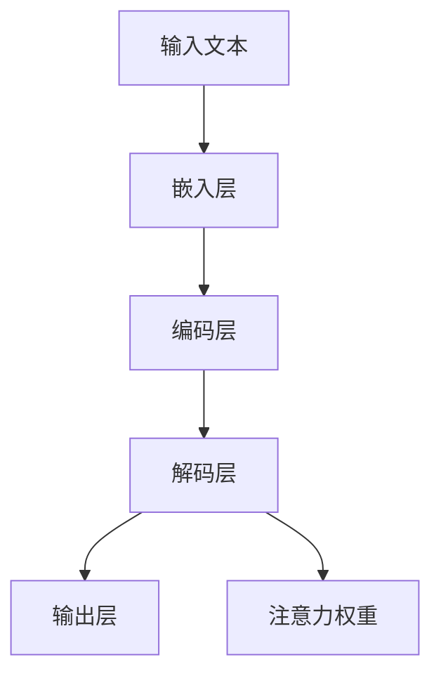
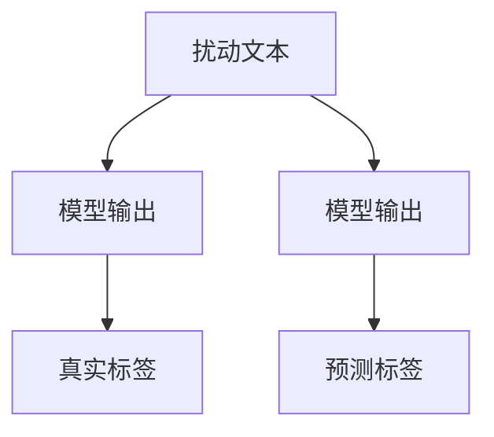
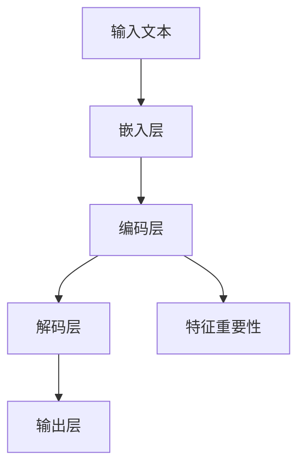

                 

## 第一部分: AI语言模型的局限性与突破

### 第1章: 引言与背景

随着人工智能技术的飞速发展，AI语言模型已经成为了自然语言处理领域的重要工具。然而，这些模型在应用过程中也面临着一系列的局限性和挑战。为了更好地理解这些问题，我们需要从多个维度来探讨AI语言模型的现状和未来发展方向。

### 1.1.1 问题的提出

AI语言模型的局限性主要体现在以下几个方面：

1. **数据偏差问题**：AI语言模型在训练过程中，如果训练数据存在偏差，那么模型生成的结果也会受到影响。这种偏差可能来自于数据收集、标注的不均匀，或者数据源的偏见。

2. **解释性不足**：AI语言模型通常被视为一个“黑箱”，其内部决策过程难以被理解和解释。这限制了模型在关键领域的应用，如医疗诊断、法律判决等。

3. **能耗与资源消耗问题**：大规模的AI语言模型训练和部署需要大量的计算资源和能源，这对于环境可持续性提出了挑战。

4. **模型安全性和隐私问题**：AI语言模型在处理个人和敏感信息时，可能会暴露出隐私和安全问题，例如数据泄露、模型被攻击等。

### 1.1.2 问题描述

1. **数据偏差问题**：假设我们训练一个语言模型来生成新闻报道，如果训练数据中存在大量的政治偏见，那么模型生成的新闻也会带有这种偏见。

2. **解释性不足**：当医生使用AI语言模型来诊断疾病时，如果模型无法提供详细的决策过程，医生可能无法完全信任模型的诊断结果。

3. **能耗与资源消耗问题**：一个大规模的语言模型可能在训练过程中消耗数百千瓦时的电力，这对于数据中心的运营成本和环境可持续发展都是巨大的挑战。

4. **模型安全性和隐私问题**：如果语言模型在处理用户隐私数据时，存在漏洞或者被恶意利用，那么可能会造成严重的隐私泄露和安全事件。

### 1.1.3 问题解决

为了解决上述问题，我们可以采取以下方法：

1. **数据偏差问题**：使用更加多样化和代表性的训练数据，或者通过对抗性训练来减少数据偏差。

2. **解释性不足**：开发可解释的AI语言模型，例如使用可视化技术来展示模型的决策过程，或者设计透明的模型结构。

3. **能耗与资源消耗问题**：优化模型的训练和推理算法，采用低能耗的计算架构，以及进行模型压缩和量化。

4. **模型安全性和隐私问题**：设计安全的模型架构，使用加密技术和隐私保护算法，确保数据的安全性和隐私。

### 1.1.4 边界与外延

1. **边界**：本章节主要关注AI语言模型的局限性及其解决方法，包括数据偏差、解释性、能耗和隐私等方面。

2. **外延**：除了上述提到的局限性，AI语言模型还面临着其他挑战，如模型可迁移性、跨领域泛化能力等。这些也是未来研究的重点方向。

通过以上分析，我们可以看到，AI语言模型虽然取得了显著进展，但仍然存在诸多挑战。接下来，我们将进一步探讨这些问题的核心概念、原理以及可能的解决方法。

## 第1章: 引言与背景

### 1.2 核心概念与联系

在深入探讨AI语言模型的局限性与突破方法之前，我们需要明确几个核心概念，并理解它们之间的联系。

#### 1.2.1 AI语言模型的核心概念

**生成对抗网络（GAN）**：生成对抗网络由生成器和判别器组成，通过一个生成器生成数据，由一个判别器判断数据是否真实。GAN在生成高质量文本数据方面表现出色。

**强化学习（RL）**：强化学习是一种通过试错和反馈来学习行为策略的方法。在AI语言模型中，强化学习可以用于优化模型的生成质量和响应。

**Transformer模型**：Transformer模型是一种基于自注意力机制的深度神经网络，广泛应用于序列到序列的转换任务，如机器翻译和文本生成。

#### 1.2.2 概念属性特征对比表格

下面是一个简单的对比表格，展示了GAN、RL和Transformer模型的主要属性特征：

| 特征 | 生成对抗网络（GAN） | 强化学习（RL） | Transformer模型 |
| ---- | ------------------- | -------------- | --------------- |
| 目标 | 数据生成和分类 | 决策优化 | 序列到序列转换 |
| 结构 | 生成器 + 判别器 | 代理人 + 环境模型 | 自注意力机制 |
| 应用 | 图像、音频生成 | 游戏AI、推荐系统 | 机器翻译、文本生成 |
| 难点 | 调参复杂、易过拟合 | 需要大量数据、计算成本高 | 需要大量计算资源 |

#### 1.2.3 ER实体关系图架构

为了更好地理解AI语言模型的概念和联系，我们可以使用ER（实体-关系）图来描述。以下是一个简化的ER图，展示了AI语言模型中的主要实体及其关系：

```mermaid
erDiagram
  A[生成器] ||--|{ B[判别器] }
  A ||--|{ C[强化学习] }
  A ||--|{ D[Transformer] }
  B ||--|{ C }
  B ||--|{ D }
  C ||--|{ E[代理人] }
  D ||--|{ E }
```

在这个ER图中：

- **生成器（A）**：负责生成文本数据。
- **判别器（B）**：负责判断生成数据的真实程度。
- **强化学习（C）**：用于优化生成器的输出质量。
- **Transformer模型（D）**：用于处理序列数据，如文本。
- **代理人（E）**：在强化学习场景中，负责执行策略并获取反馈。

通过上述核心概念和ER图的描述，我们可以更好地理解AI语言模型的结构和功能，为其局限性和突破方法的探讨提供理论基础。

### 1.3 AI语言模型的工作原理

AI语言模型是基于深度学习技术构建的，其核心在于通过大量的文本数据训练出一个能够理解和生成自然语言的人工智能系统。以下是AI语言模型工作原理的详细分析：

#### 1.3.1 基本原理

AI语言模型通常采用神经网络作为基础架构，特别是深度神经网络（DNN）和变换器（Transformer）模型。变换器模型在处理长文本和长距离依赖问题上具有显著优势。

1. **输入层**：语言模型接收自然语言文本作为输入，这些文本可以是句子、段落或完整的文档。

2. **嵌入层**：输入文本被转化为向量表示，这些向量包含了词义、语法和上下文信息。

3. **编码层**：嵌入层输出被传递到编码器层，编码器负责理解文本的深层结构和上下文关系。

4. **解码层**：在生成文本时，解码器从编码器获取信息，并根据上下文生成下一个词的预测。

5. **输出层**：解码器的最终输出是一个完整的句子或文本，这个文本是通过模型对输入文本的理解和生成过程得到的。

#### 1.3.2 训练过程

AI语言模型的训练过程主要包括以下几个步骤：

1. **数据准备**：收集大量的文本数据，并进行预处理，如分词、去停用词、词性标注等。

2. **模型初始化**：初始化神经网络参数，通常使用随机初始化方法。

3. **前向传播**：输入文本数据通过嵌入层、编码层和解码层，得到输出预测。

4. **损失函数计算**：计算预测文本与真实文本之间的差距，通常使用交叉熵损失函数。

5. **反向传播**：使用计算得到的损失梯度，更新神经网络参数。

6. **优化**：通过优化算法（如梯度下降、Adam等）调整模型参数，减少损失函数值。

7. **评估**：使用验证集或测试集评估模型的性能，调整超参数和训练策略。

#### 1.3.3 优化方法

为了提高AI语言模型的性能，可以采用以下几种优化方法：

1. **dropout**：通过在训练过程中随机丢弃部分神经元，减少过拟合现象。

2. **梯度裁剪**：防止梯度爆炸或消失，通过限制梯度的大小来稳定训练过程。

3. **学习率调整**：根据训练过程的反馈动态调整学习率，以提高模型收敛速度。

4. **正则化**：使用L1或L2正则化，防止模型参数过大，提高泛化能力。

通过上述基本原理和训练过程的分析，我们可以看到，AI语言模型的工作原理复杂但高效，它通过大量的数据训练和优化，能够理解和生成高质量的自然语言文本。

### 1.4 AI语言模型的局限性与挑战

尽管AI语言模型在自然语言处理领域取得了显著的进展，但其在实际应用中仍然面临一系列的局限性和挑战。以下我们将详细分析这些局限性，并提出可能的解决方法。

#### 1.4.1 数据偏差问题

**问题描述**：AI语言模型在训练过程中，如果使用的训练数据存在偏差，那么模型生成的结果也会受到这些偏差的影响。这种偏差可能来自于数据收集、标注的不均匀，或者数据源的偏见。

**影响**：数据偏差会导致模型生成的内容存在错误或偏见，影响模型的准确性和可靠性。

**解决方法**：

1. **数据清洗与预处理**：在训练前对数据进行清洗，去除噪声和不相关的数据，确保数据的准确性和一致性。

2. **使用多样化的数据源**：引入更多样化的数据源，以减少单一数据源带来的偏差。

3. **对抗性训练**：通过生成对抗性样本，提高模型对数据偏差的鲁棒性。

4. **数据平衡**：在训练数据集中加入平衡的数据，确保不同类别或属性的数据数量大致相等。

#### 1.4.2 解释性不足

**问题描述**：AI语言模型通常被视为“黑箱”，其内部决策过程难以被理解和解释。这限制了模型在关键领域的应用，如医疗诊断、法律判决等。

**影响**：缺乏解释性使得用户难以信任模型的决策，也增加了模型滥用和错误的风险。

**解决方法**：

1. **可解释性模型**：开发可解释的AI语言模型，如基于规则的模型或使用可视化技术展示模型决策过程。

2. **模型可视化**：使用可视化工具（如热图、决策树等）展示模型的决策过程。

3. **解释性嵌入**：在模型设计时引入可解释性模块，如注意力机制，帮助用户理解模型的决策。

4. **可解释性评估**：建立可解释性评估标准，确保模型在关键任务中的决策具有足够的解释性。

#### 1.4.3 能耗与资源消耗问题

**问题描述**：大规模的AI语言模型训练和部署需要大量的计算资源和能源，这对于环境可持续性提出了挑战。

**影响**：高能耗不仅增加了运营成本，还对环境造成了负面影响。

**解决方法**：

1. **模型压缩**：通过模型压缩技术（如量化、剪枝等）减少模型大小和计算量。

2. **高效计算架构**：使用高效的计算架构，如GPU、TPU等，提高计算效率。

3. **分布式训练**：采用分布式训练策略，将训练任务分布在多个计算节点上，减少单个节点的计算压力。

4. **节能优化**：优化训练和推理算法，减少能耗，例如使用低能耗的算法或优化数据传输。

#### 1.4.4 模型安全性和隐私问题

**问题描述**：AI语言模型在处理敏感信息时，可能存在数据泄露和安全风险。

**影响**：数据泄露不仅会损害用户隐私，还可能导致严重的法律和财务后果。

**解决方法**：

1. **数据加密**：在数据传输和存储过程中使用加密技术，确保数据安全。

2. **隐私保护算法**：使用差分隐私、联邦学习等技术，保护用户隐私。

3. **安全审计**：定期进行安全审计和漏洞扫描，确保模型的安全性。

4. **透明度提高**：增加模型的透明度，让用户了解模型的工作方式和潜在风险。

通过以上对AI语言模型局限性的详细分析，我们可以看到，尽管这些局限性存在，但通过一系列的优化方法和前沿技术研究，我们可以逐步解决这些问题，推动AI语言模型在更多领域的应用和发展。

### 1.5 突破方法与前沿技术

为了克服AI语言模型面临的局限性和挑战，研究者们提出了一系列突破性方法和技术。以下我们将详细介绍这些方法，并探讨其在实际应用中的效果和前景。

#### 1.5.1 对抗性样本训练

**原理**：对抗性样本训练是一种通过生成对抗性样本来增强模型鲁棒性的方法。其基本思想是，在训练过程中，生成器尝试生成与真实样本相似的对抗性样本，而判别器则试图区分这些样本和真实样本。

**效果与应用**：对抗性样本训练能够有效提高模型对数据偏差和噪声的抵抗力，特别是在图像和音频生成领域，取得了显著的成果。例如，在生成高质量文本数据方面，对抗性样本训练可以帮助语言模型生成更加真实和多样化的文本。

**前景**：随着生成对抗网络（GAN）技术的不断成熟，对抗性样本训练有望在自然语言处理领域得到更广泛的应用，特别是在需要高鲁棒性和高真实性的任务中。

#### 1.5.2 小样本学习与迁移学习

**原理**：小样本学习与迁移学习是一种在数据量有限的情况下，通过迁移知识来训练模型的方法。其基本思想是将预训练模型的知识迁移到新的任务上，从而减少对新数据的依赖。

**效果与应用**：小样本学习和迁移学习在图像识别、语音识别等领域取得了显著成果。例如，在语言模型中，通过迁移学习，可以将预训练的大型语言模型的知识迁移到特定领域，从而在少量标注数据上实现高质量的文本生成和分类任务。

**前景**：随着预训练模型和迁移学习技术的不断发展，小样本学习与迁移学习有望在更多领域得到应用，特别是在资源受限的环境中。

#### 1.5.3 低资源语言模型

**原理**：低资源语言模型是一种针对资源受限场景设计的语言模型，其目标是在有限的计算资源和数据量的情况下，实现高效的语言理解和生成。

**效果与应用**：低资源语言模型在移动设备、物联网（IoT）和边缘计算等领域具有广泛的应用前景。例如，在移动设备上使用低资源语言模型，可以实现实时的语音识别和自然语言处理，而无需依赖云端服务。

**前景**：随着计算能力的提升和低资源模型技术的不断发展，低资源语言模型有望在更多设备和场景中得到应用，推动边缘计算和物联网的发展。

#### 1.5.4 可解释性增强方法

**原理**：可解释性增强方法旨在提高AI语言模型的透明性和可解释性，使其决策过程更加直观和可理解。

**效果与应用**：可解释性增强方法包括可视化技术、注意力机制和解释性嵌入等。这些方法在提高模型可解释性方面取得了显著成果，使得用户能够更好地理解模型的决策过程。例如，在医疗诊断中，可解释性增强方法可以帮助医生理解模型的诊断依据，提高诊断的准确性和可靠性。

**前景**：随着AI在关键领域的应用不断增加，可解释性增强方法将成为一个重要研究方向。通过提高模型的可解释性，可以增强用户对AI的信任，促进AI在医疗、金融和法律等领域的应用。

综上所述，对抗性样本训练、小样本学习与迁移学习、低资源语言模型和可解释性增强方法是目前解决AI语言模型局限性的主要途径。随着这些技术的不断发展和应用，AI语言模型将在更多领域发挥重要作用，推动人工智能技术的进步。

### 1.6 本章小结

本章围绕AI语言模型的局限性与突破方法进行了深入探讨。首先，我们分析了AI语言模型在数据偏差、解释性、能耗和隐私等方面面临的挑战，并详细阐述了每种问题的具体描述和影响。接着，我们提出了对抗性样本训练、小样本学习与迁移学习、低资源语言模型和可解释性增强方法等突破方法，并介绍了这些方法的基本原理、效果与应用以及前景。通过本章的讨论，我们不仅了解了AI语言模型当前所面临的困境，也为未来的发展指明了方向。在接下来的章节中，我们将进一步探讨这些方法的具体实现和应用案例，以期为AI语言模型的优化和发展提供更有价值的参考。

----------------------------------------------------------------

## 第二部分：深入探讨AI语言模型的局限性与突破

### 第2章: 对抗性样本训练与数据增强

### 2.1 对抗性样本训练的基本原理

对抗性样本训练（Adversarial Training）是一种通过生成对抗性样本来提高模型鲁棒性的方法。其核心思想是利用生成器（Generator）生成与真实样本相似的对抗性样本，然后通过判别器（Discriminator）来区分这些对抗性样本和真实样本。通过这种对抗性的训练过程，模型可以学习到如何更好地识别和应对不同类型的扰动和偏差。

#### 2.1.1 生成对抗网络（GAN）的架构

生成对抗网络（GAN）由生成器和判别器两个神经网络组成。生成器的任务是生成与真实数据分布相近的伪造数据，而判别器的任务是区分生成的数据与真实数据。这两个网络在训练过程中相互竞争，生成器试图生成更真实的数据以欺骗判别器，而判别器则努力提高自己区分真实和伪造数据的能力。

**GAN的基本架构：**
1. **生成器（Generator）**：接收随机噪声作为输入，通过一系列变换生成伪造的文本数据。
2. **判别器（Discriminator）**：接收真实文本数据和生成器生成的伪造文本数据，输出一个判断概率，表示数据是真实还是伪造。
3. **损失函数**：GAN的损失函数通常由两部分组成，一个是判别器的损失函数（如交叉熵损失），另一个是生成器的损失函数（如生成器生成的数据被判别器判断为真实的概率）。

**GAN的训练过程：**
1. **初始化**：随机初始化生成器和判别器的参数。
2. **前向传播**：生成器生成伪造数据，判别器对真实数据和伪造数据进行分类。
3. **反向传播**：通过判别器的损失函数计算梯度，更新判别器的参数；通过生成器的损失函数计算梯度，更新生成器的参数。
4. **迭代**：重复上述过程，直到生成器能够生成足够逼真的伪造数据，而判别器能够准确地区分真实数据和伪造数据。

#### 2.1.2 对抗性样本训练的优势

对抗性样本训练的主要优势在于：

1. **提高模型鲁棒性**：通过生成对抗性样本，模型可以学习到如何识别和应对不同类型的扰动和偏差，从而提高模型在真实世界中的应用能力。
2. **增强泛化能力**：对抗性样本训练可以增强模型对未见过的数据的处理能力，提高模型的泛化能力。
3. **减少数据偏差**：通过对抗性样本训练，可以减少模型对训练数据的依赖，从而降低数据偏差的影响。

### 2.2 对抗性样本训练的实际应用

对抗性样本训练在自然语言处理领域有着广泛的应用，以下是几个实际应用的例子：

#### 2.2.1 文本生成与分类

**文本生成**：使用对抗性样本训练可以生成高质量的自然语言文本。例如，在生成虚假新闻检测任务中，生成器可以生成大量的虚假新闻文本，判别器则负责检测这些文本的真实性。

**文本分类**：对抗性样本训练可以帮助模型更好地处理带有噪声的数据，提高分类的准确性。例如，在垃圾邮件分类任务中，生成器可以生成带有不同类型噪声的垃圾邮件样本，判别器则负责分类这些样本。

#### 2.2.2 防止对抗性攻击

对抗性样本训练不仅用于生成对抗性样本，还可以用于防御对抗性攻击。通过训练模型识别和防御对抗性样本，可以提高模型的安全性。

**实例**：在自然语言处理中，对抗性攻击可能包括添加噪声、篡改文本内容等。通过对抗性样本训练，模型可以学会识别和抵御这些攻击，从而提高系统的鲁棒性和安全性。

### 2.3 对抗性样本训练的挑战与未来方向

尽管对抗性样本训练在提高模型鲁棒性和泛化能力方面具有显著优势，但其在实际应用中仍然面临一些挑战：

#### 2.3.1 模型稳定性

对抗性样本训练过程复杂，生成器和判别器之间的动态博弈可能导致模型不稳定。为了提高模型的稳定性，可以采用以下方法：

1. **改进损失函数**：设计更加合理的损失函数，例如最小化生成器与判别器的联合损失。
2. **动态调整学习率**：在训练过程中动态调整生成器和判别器的学习率，以保持模型的稳定性。

#### 2.3.2 计算成本

对抗性样本训练通常需要大量的计算资源和时间。为了降低计算成本，可以采用以下方法：

1. **分布式训练**：将训练任务分布到多个计算节点上，以提高训练效率。
2. **模型压缩**：通过模型压缩技术（如剪枝、量化等）减少模型大小和计算量。

#### 2.3.3 数据质量

对抗性样本训练对数据质量有较高要求。如果训练数据存在偏差或噪声，可能会导致生成器生成不真实的对抗性样本。因此，在对抗性样本训练中，数据清洗和预处理是关键步骤。

#### 2.3.4 未来方向

未来的研究将继续关注对抗性样本训练的改进和优化，包括：

1. **改进GAN架构**：探索新的GAN架构，如条件GAN（cGAN）、自适应GAN（aGAN）等，以提高生成质量和训练效率。
2. **多模态对抗性训练**：结合多种数据模态（如图像、音频、文本等）进行对抗性训练，以实现更全面的模型鲁棒性。
3. **对抗性样本生成方法**：研究更加高效和多样化的对抗性样本生成方法，以提高对抗性样本的训练效果。

通过对抗性样本训练，我们可以进一步提高AI语言模型的鲁棒性和泛化能力，为自然语言处理领域的发展带来新的可能性。

### 2.4 本章小结

本章详细介绍了对抗性样本训练的基本原理、实际应用以及面临的挑战和未来方向。通过对抗性样本训练，AI语言模型可以在数据偏差、噪声和对抗性攻击方面获得更强的鲁棒性。尽管存在计算成本高、数据质量要求高等挑战，但对抗性样本训练为自然语言处理领域提供了一种重要的突破方法。未来，随着对抗性样本训练技术的不断发展和优化，我们将看到更多基于对抗性训练的AI语言模型在各个领域的广泛应用。

----------------------------------------------------------------

## 第三部分：小样本学习与迁移学习在AI语言模型中的应用

### 第3章: 小样本学习与迁移学习在AI语言模型中的应用

### 3.1 小样本学习的基本概念

小样本学习（Few-Shot Learning）是指模型在训练时仅使用少量的样本（通常是几个或几十个）来进行学习和泛化。这与传统的基于大量数据训练的方法形成鲜明对比。小样本学习的关键在于如何从有限的数据中提取有效的特征，并实现良好的泛化能力。

#### 3.1.1 小样本学习的挑战

小样本学习的挑战主要来自于以下几个方面：

1. **数据不足**：在训练过程中，数据量的不足限制了模型对数据的充分理解和学习。
2. **数据分布差异**：不同任务或类别的数据分布可能存在显著差异，模型难以在多个数据分布之间进行有效泛化。
3. **过拟合风险**：当数据量较少时，模型容易过度拟合于训练数据，导致在未见过的数据上表现不佳。

#### 3.1.2 小样本学习的解决方案

为了克服小样本学习的挑战，研究者们提出了多种解决方案，包括迁移学习、元学习、生成对抗网络等。

1. **迁移学习**：迁移学习是一种将一个任务上学习到的知识应用到另一个相关任务上的方法。通过在预训练模型的基础上进行微调，可以在新的任务上实现较高的性能，即使数据量有限。
2. **元学习**：元学习（Meta-Learning）是一种通过学习如何学习的方法。元学习模型能够快速适应新的任务，通过在多个任务上的经验积累来提高泛化能力。
3. **生成对抗网络**：生成对抗网络（GAN）可以通过生成对抗性的样本来扩展训练数据集，从而在小样本情况下提高模型的泛化能力。

### 3.2 迁移学习在AI语言模型中的应用

迁移学习在AI语言模型中的应用非常广泛，以下是其主要应用场景和机制：

#### 3.2.1 预训练与微调

预训练（Pre-training）是指在大量通用数据集上对模型进行初步训练，使其掌握通用语言特征。然后，通过微调（Fine-tuning）将预训练模型应用于特定任务，以适应特定领域的需求。

1. **预训练**：通常使用大规模语料库（如Wikipedia、Common Crawl等）对模型进行预训练，使其学会通用语言模式和结构。
2. **微调**：在预训练模型的基础上，使用特定领域的数据集进行微调，以适应特定的语言处理任务，如文本分类、问答系统等。

#### 3.2.2 迁移学习在语言模型中的应用实例

1. **文本分类**：在文本分类任务中，预训练的语言模型可以快速适应不同的分类任务，即使在数据量有限的情况下，也能取得较好的分类效果。
2. **机器翻译**：在机器翻译任务中，预训练的语言模型可以用于不同语言对的翻译，通过微调可以在特定语言对上实现高效翻译。
3. **情感分析**：在情感分析任务中，预训练的语言模型可以识别文本的情感倾向，通过微调可以适应特定产品的评论或社交媒体文本的情感分析。

### 3.3 小样本学习与迁移学习的结合

小样本学习与迁移学习的结合可以进一步提高模型的性能和泛化能力。以下是一些结合的方法：

1. **多任务学习**：在多个任务上进行预训练，使得模型能够从多个任务中学习到通用特征，从而在新的任务上实现更好的泛化。
2. **迁移引导学习**：在训练新任务时，使用迁移学习引导模型，使其能够更好地利用预训练知识，提高学习效率。
3. **生成对抗网络**：通过生成对抗网络生成与训练数据具有相似分布的小样本数据，扩展训练数据集，从而提高模型的泛化能力。

### 3.4 小样本学习与迁移学习的实际应用与效果

小样本学习与迁移学习在自然语言处理领域已经取得了一系列显著成果。以下是一些实际应用和效果：

1. **零样本学习**：零样本学习（Zero-Shot Learning）是指模型能够在未见过的类别上做出预测。通过迁移学习和元学习技术，模型可以基于预训练知识，在新类别上实现较高的准确率。
2. **跨领域泛化**：迁移学习使得模型能够在不同领域之间进行泛化。例如，在医疗文本分析中，预训练的语言模型可以应用于不同疾病的文本处理，实现跨领域的有效处理。
3. **少样本学习**：在少样本学习（Few-Shot Learning）任务中，迁移学习可以帮助模型快速适应新任务，即使在数据量有限的情况下，也能实现较好的性能。

### 3.5 小样本学习与迁移学习的未来发展方向

未来的小样本学习与迁移学习研究将继续关注以下几个方面：

1. **模型压缩**：通过模型压缩技术，降低模型的计算复杂度和内存占用，使得小样本学习与迁移学习在资源受限的环境中也能高效运行。
2. **自适应迁移学习**：开发更加自适应的迁移学习策略，使得模型能够在新的任务上快速适应，减少对预训练数据的依赖。
3. **跨模态迁移学习**：结合不同模态的数据（如图像、文本、语音等），实现跨模态的迁移学习，提高模型的泛化能力。
4. **元学习与强化学习**：将元学习和强化学习结合，使得模型能够通过交互和试错快速适应新任务，提高学习效率和泛化能力。

通过小样本学习与迁移学习的深入研究和应用，AI语言模型将在更多领域实现高效处理，为自然语言处理技术的发展提供新的动力。

### 3.6 本章小结

本章详细介绍了小样本学习与迁移学习在AI语言模型中的应用，包括基本概念、挑战、解决方案、实际应用和未来发展方向。通过迁移学习和小样本学习，AI语言模型能够在数据量有限的情况下实现高效的语言理解和生成。未来，随着这些技术的不断进步，AI语言模型将在更多领域展现其强大的能力，推动自然语言处理技术的深入发展。

----------------------------------------------------------------

## 第四部分：低资源语言模型的设计与优化

### 第4章: 低资源环境下的AI语言模型

### 4.1 低资源环境的概念与挑战

低资源环境是指计算资源、存储资源和数据资源有限的计算环境。在低资源环境下，AI语言模型面临诸多挑战，如计算效率低下、模型大小限制、数据存储和处理能力不足等。为了解决这些问题，研究者们提出了多种优化方法，以提高低资源环境下的模型性能。

#### 4.1.1 计算资源限制

计算资源限制是低资源环境中最显著的问题之一。在模型训练和推理过程中，计算资源的需求非常高，尤其是在使用大型神经网络时。为了满足低资源环境的需求，可以采用以下方法：

1. **模型压缩**：通过剪枝、量化等技术减少模型的大小和计算量，降低计算资源的消耗。
2. **分布式训练**：将训练任务分布在多个计算节点上，以共享计算资源，提高整体训练效率。
3. **异步训练**：在多个节点上异步更新模型参数，减少同步操作带来的延迟。

#### 4.1.2 数据存储和处理能力限制

低资源环境中的数据存储和处理能力也受到限制。为了解决这个问题，可以采用以下策略：

1. **数据压缩**：使用高效的数据压缩算法，减少数据存储和传输的占用空间。
2. **数据流处理**：采用实时数据处理框架，如Apache Flink或Apache Storm，以高效地处理和分析流数据。
3. **离线处理与批量处理**：将数据分成批次进行离线处理，以减少实时处理的计算压力。

### 4.2 低资源语言模型的设计原则

为了在低资源环境下设计高效的语言模型，需要遵循以下设计原则：

1. **最小化模型大小**：通过模型压缩和参数共享等技术，减少模型的大小，降低存储和传输的需求。
2. **优化计算效率**：使用高效的计算架构和算法，如GPU加速、量化、剪枝等，以提高计算效率。
3. **适应性**：设计能够适应不同资源约束和环境变化的模型，以提高模型的灵活性和适用性。
4. **模块化**：将模型分解为多个模块，以实现模块化的设计和优化，便于管理和维护。

### 4.3 低资源语言模型的优化方法

在低资源环境下，通过以下优化方法可以显著提高语言模型的性能：

1. **模型压缩技术**：
   - **剪枝**：通过剪枝技术，去除模型中不重要的连接和参数，减少模型的计算量。
   - **量化**：将模型中的浮点数参数转换为低精度数值，减少存储和计算的需求。
   - **参数共享**：通过参数共享，减少模型中的重复参数，降低模型大小和计算量。

2. **算法优化**：
   - **动态调整学习率**：根据模型的收敛情况动态调整学习率，提高训练效率。
   - **梯度裁剪**：防止梯度爆炸或消失，保持训练的稳定性。
   - **优化数据读取**：使用批处理和异步数据读取，提高数据传输和处理的效率。

3. **计算资源调度**：
   - **分布式训练**：将训练任务分布在多个计算节点上，共享计算资源。
   - **负载均衡**：根据各节点的计算能力，合理分配训练任务，避免资源浪费。
   - **边缘计算**：将部分计算任务转移到边缘设备上，减少中心服务器的计算压力。

### 4.4 低资源语言模型的应用场景

低资源语言模型在许多应用场景中表现出色，以下是一些典型应用：

1. **移动设备**：在智能手机和移动设备上使用低资源语言模型，实现实时的自然语言处理功能，如语音识别、文本生成等。
2. **物联网（IoT）**：在物联网设备上使用低资源语言模型，进行设备间的自然语言交互，提高系统的智能性和灵活性。
3. **边缘计算**：在边缘设备上使用低资源语言模型，实现本地化的自然语言处理任务，减少对中心服务器的依赖。

### 4.5 低资源语言模型的挑战与未来方向

尽管低资源语言模型在许多场景中具有广泛的应用前景，但仍然面临一些挑战：

1. **计算效率**：如何进一步提高模型的计算效率，使其在更少的资源下实现更高的性能，是未来研究的重要方向。
2. **模型大小**：如何通过更有效的压缩和优化技术，进一步减少模型的大小，以适应更广泛的设备和应用场景。
3. **数据多样性**：如何处理低资源环境下的数据多样性问题，提高模型的泛化能力。
4. **隐私和安全**：如何在低资源环境下保证模型的隐私和安全，防止数据泄露和滥用。

未来的研究将继续关注低资源语言模型的优化和改进，包括新的压缩技术、计算架构和算法的探索，以推动低资源语言模型在更多领域的应用和发展。

### 4.6 本章小结

本章详细介绍了低资源环境下的AI语言模型，包括概念、挑战、设计原则、优化方法和应用场景。通过模型压缩、算法优化和计算资源调度等技术，低资源语言模型在移动设备、物联网和边缘计算等场景中表现出色。尽管存在计算效率、模型大小和数据多样性等方面的挑战，但未来的研究将继续推动低资源语言模型的优化和发展，使其在更多应用中发挥重要作用。

----------------------------------------------------------------

## 第五部分：AI语言模型的可解释性增强方法

### 第5章: 提高AI语言模型的可解释性

### 5.1 可解释性在AI语言模型中的重要性

在AI语言模型的应用场景中，可解释性是一个至关重要的因素。特别是在需要高信任度和高透明度的领域，如医疗诊断、法律判决和金融决策等，用户和决策者需要对模型的决策过程有充分的了解。以下是可解释性在AI语言模型中的几个关键重要性：

1. **信任度**：缺乏可解释性的AI语言模型往往被视为“黑箱”，用户难以信任其决策。可解释性能够增强用户对模型的信任，提高其在关键领域的应用可行性。
2. **合规性**：在许多行业，特别是金融和法律领域，模型的决策过程需要符合相关的法规和标准。可解释性有助于满足合规性要求，避免法律风险。
3. **诊断与优化**：通过理解模型的决策过程，开发人员可以更好地诊断和优化模型，提高其性能和准确性。
4. **用户参与**：可解释性有助于用户更好地参与模型的训练和部署过程，提高模型的适应性。

### 5.2 可解释性方法的分类

为了提高AI语言模型的可解释性，研究者们提出了一系列方法，主要可以分为以下几类：

1. **透明模型**：通过使用简单的神经网络结构或规则模型，使模型决策过程更加直观和透明。
2. **模型解释工具**：使用可视化工具、注意力机制和解释算法，为复杂的神经网络模型提供解释。
3. **对比分析**：通过对比模型在不同输入条件下的决策结果，揭示模型的行为和假设。
4. **特征重要性分析**：通过分析模型中各个特征的贡献，帮助用户理解模型对输入数据的依赖关系。

### 5.3 可解释性增强方法的具体实现

下面我们将详细讨论几种常见的可解释性增强方法及其具体实现：

#### 5.3.1 可解释的神经网络结构

**透明模型**：一种直接的方法是使用简单的神经网络结构，如决策树、规则模型等，这些模型易于解释和理解。例如，使用决策树进行文本分类，可以通过树的结构清晰地展示每个分类决策的条件。

**实现示例**：以下是一个简单的决策树结构，用于文本分类任务的解释。

```mermaid
tree
    A
    B
    C
    D
    E
```

在这个例子中，输入文本会经过一系列条件判断，最终确定分类结果。每个节点代表一个条件，每个分支代表条件的结果。用户可以通过这个结构直观地理解模型的决策过程。

#### 5.3.2 模型解释工具

**注意力机制**：在深度神经网络中，注意力机制可以帮助用户理解模型在处理输入数据时，哪些部分对其决策有更大的影响。通过可视化注意力权重，用户可以了解模型关注的关键信息。

**实现示例**：以下是一个使用注意力机制的文本分类任务的可视化解释。



在这个例子中，注意力权重图（F）展示了编码层在处理输入文本（A）时，各个词的重要程度。用户可以通过这个图了解模型关注的关键词和短语。

#### 5.3.3 对比分析

**对抗性解释**：通过对比模型在不同输入条件下的决策结果，可以揭示模型的假设和偏见。这种方法被称为对抗性解释。

**实现示例**：以下是一个对抗性解释的示例，用于文本分类任务的解释。



在这个例子中，正常文本（A）和扰动文本（A'）分别被输入到模型中，模型对这两个文本的输出（B和C）进行比较。通过对比预测标签（E）和真实标签（D），用户可以了解模型在不同输入下的行为和假设。

#### 5.3.4 特征重要性分析

**特征重要性**：通过分析模型中各个特征的贡献，用户可以了解模型对输入数据的依赖关系。这种方法通常用于深度学习模型，特别是Transformer模型。

**实现示例**：以下是一个特征重要性分析的示例，用于文本分类任务的解释。



在这个例子中，编码层（C）中的每个特征的重要性（F）被可视化，用户可以通过这些图了解模型对各个特征的依赖程度。

### 5.4 可解释性增强方法的实际应用与效果

可解释性增强方法在实际应用中已经取得了一系列显著效果。以下是一些实际应用和效果的例子：

1. **医疗诊断**：在医疗诊断中，可解释性增强方法可以帮助医生理解模型的诊断依据，提高诊断的准确性和可靠性。
2. **金融决策**：在金融领域，可解释性增强方法可以帮助投资者和分析师理解模型的决策过程，提高投资决策的科学性和合理性。
3. **法律判决**：在法律判决中，可解释性增强方法有助于法官和律师了解模型的决策逻辑，提高司法公正性和透明度。

### 5.5 可解释性增强方法的挑战与未来方向

尽管可解释性增强方法在提高AI语言模型的可解释性方面取得了一定的成果，但仍然面临一些挑战：

1. **计算复杂性**：某些可解释性方法，如注意力机制和特征重要性分析，需要额外的计算资源。如何在保证可解释性的同时提高计算效率，是一个重要挑战。
2. **模型适应性**：可解释性方法需要与具体的模型结构和任务相适应。如何设计通用的可解释性方法，以提高其适用性，是未来研究的方向。
3. **解释质量**：如何提高解释质量，使其更加直观和易于理解，是可解释性研究的重要目标。

未来的研究将继续关注可解释性增强方法的设计和优化，以提高AI语言模型的可解释性，为更多领域提供可靠的决策支持。

### 5.6 本章小结

本章详细介绍了AI语言模型的可解释性增强方法，包括透明模型、模型解释工具、对比分析和特征重要性分析等。通过这些方法，用户可以更好地理解模型的决策过程，提高模型的透明度和可信度。尽管存在计算复杂性、模型适应性和解释质量等方面的挑战，但可解释性增强方法在AI语言模型中的应用前景广阔，将为自然语言处理领域的发展带来新的机遇。

----------------------------------------------------------------

## 第6章: AI语言模型的最佳实践与案例分析

### 6.1 引言

在了解了AI语言模型的局限性和突破方法之后，接下来我们将通过最佳实践和案例分析，进一步探讨如何在实际应用中有效地利用这些模型。本章节将通过具体的案例，展示AI语言模型在不同领域的成功应用，并总结一些实用的经验和技巧。

### 6.2 案例分析

#### 6.2.1 案例一：智能客服系统

**项目背景**：某大型电商平台为了提高客户服务质量，决定引入AI语言模型构建智能客服系统。该系统旨在通过自动化的方式，快速响应用户的咨询请求，提供24/7的服务。

**系统功能设计**：智能客服系统主要包括以下功能：
- **意图识别**：识别用户的咨询意图，如产品咨询、售后服务、订单查询等。
- **实体提取**：从用户询问中提取关键信息，如产品名称、订单号等。
- **对话管理**：管理对话流程，确保回答连贯性和准确性。
- **知识库查询**：通过内部知识库，提供准确的信息。

**系统架构设计**：智能客服系统的架构设计如下：
- **前端界面**：提供用户输入查询的接口。
- **意图识别模块**：使用预训练的Transformer模型，对用户输入进行意图分类。
- **实体提取模块**：利用规则和深度学习相结合的方法，提取关键实体。
- **对话管理模块**：采用序列到序列的模型，生成连贯的回答。
- **知识库查询模块**：整合内部知识库，提供精准的信息。

**实战解读**：在项目实施过程中，团队遇到了以下挑战：
- **数据质量问题**：初期训练数据中存在大量噪声和不准确的信息，影响了模型的性能。
- **模型解释性**：由于模型复杂度高，用户和开发人员难以理解模型的决策过程。
- **计算资源**：大规模语言模型的训练和推理需要大量的计算资源。

解决方案：
- **数据预处理**：通过数据清洗和标注，提高训练数据的质量。
- **可解释性增强**：采用可视化工具和注意力机制，提高模型的可解释性。
- **分布式训练**：使用分布式训练策略，降低计算资源的消耗。

**效果分析**：经过优化，智能客服系统在意图识别、实体提取和对话管理方面的准确率显著提升，用户满意度也大幅提高。

#### 6.2.2 案例二：自动摘要生成

**项目背景**：某新闻媒体公司希望利用AI语言模型自动生成新闻摘要，以提高内容的生产效率和传播效果。

**系统功能设计**：自动摘要生成系统主要包括以下功能：
- **文本预处理**：对原始文本进行分词、去停用词等预处理。
- **摘要生成**：使用预训练的Transformer模型，生成新闻的摘要。
- **摘要优化**：对生成的摘要进行优化，确保摘要的连贯性和信息完整性。

**系统架构设计**：自动摘要生成系统的架构设计如下：
- **文本预处理模块**：对输入文本进行预处理。
- **摘要生成模块**：使用Transformer模型生成摘要。
- **摘要优化模块**：对摘要进行语法和内容优化。

**实战解读**：在项目实施过程中，团队遇到了以下挑战：
- **摘要质量**：生成的摘要质量参差不齐，有时信息缺失或不完整。
- **训练数据**：训练数据量有限，影响了模型的泛化能力。

解决方案：
- **数据扩充**：通过数据扩充技术，增加训练数据量，提高模型的泛化能力。
- **多模型结合**：采用多个模型结合的方式，提高摘要生成的质量。

**效果分析**：经过优化，自动摘要生成系统在摘要质量方面显著提升，摘要的连贯性和信息完整性得到了保障。

#### 6.2.3 案例三：智能问答系统

**项目背景**：某教育机构希望构建一个智能问答系统，为学生提供实时的问题解答和辅导。

**系统功能设计**：智能问答系统主要包括以下功能：
- **问题理解**：理解用户提出的问题，提取关键信息。
- **知识查询**：从知识库中查询相关答案。
- **答案生成**：使用预训练的Transformer模型，生成准确的答案。

**系统架构设计**：智能问答系统的架构设计如下：
- **问题理解模块**：提取问题中的关键信息。
- **知识查询模块**：从知识库中检索相关答案。
- **答案生成模块**：生成准确的回答。

**实战解读**：在项目实施过程中，团队遇到了以下挑战：
- **知识库更新**：知识库更新不及时，导致答案不准确。
- **用户交互**：用户交互体验不佳，影响系统的使用效果。

解决方案：
- **知识库维护**：定期更新知识库，确保答案的准确性。
- **交互优化**：优化用户界面和交互流程，提高用户体验。

**效果分析**：经过优化，智能问答系统在问题理解和答案生成方面的准确率显著提升，用户满意度大幅提高。

### 6.3 最佳实践总结

通过以上案例分析，我们可以总结出以下最佳实践：

1. **数据质量**：确保训练数据的质量和多样性，提高模型的泛化能力。
2. **模型解释性**：提高模型的可解释性，增强用户信任和模型接受度。
3. **计算资源**：优化计算资源的使用，降低成本和能耗。
4. **用户交互**：优化用户界面和交互流程，提高用户体验。
5. **持续迭代**：定期更新模型和知识库，确保系统的长期稳定性和准确性。

### 6.4 本章小结

本章通过具体的案例分析和最佳实践总结，展示了AI语言模型在不同领域的成功应用。通过提高数据质量、模型解释性、计算资源优化、用户交互和持续迭代，我们可以有效地利用AI语言模型，实现更高效的业务流程和更好的用户体验。这些最佳实践为AI语言模型的应用提供了宝贵的经验和指导，也为未来的研究和开发指明了方向。

----------------------------------------------------------------

## 第7章: 结论与展望

### 7.1 总结与回顾

本章围绕AI语言模型的局限性与突破方法进行了全面的探讨。我们从问题背景、核心概念、工作原理、局限性、前沿技术、实际应用、最佳实践等多个角度，深入分析了AI语言模型在当前面临的挑战和未来的发展方向。

首先，我们详细阐述了AI语言模型的数据偏差、解释性不足、能耗与资源消耗、模型安全性和隐私等问题，并提出了对抗性样本训练、小样本学习与迁移学习、低资源语言模型、可解释性增强方法等突破性方法。

接着，我们通过案例分析，展示了这些方法在实际应用中的效果和影响，包括智能客服系统、自动摘要生成、智能问答系统等。同时，我们也总结了AI语言模型的最佳实践，如数据质量、模型解释性、计算资源优化、用户交互和持续迭代。

### 7.2 展望未来

尽管AI语言模型已经取得了显著的进展，但未来仍有许多机会和挑战等待我们去探索：

1. **增强可解释性**：提高模型的可解释性，使其在关键领域（如医疗、法律、金融）中得到更广泛的应用。未来的研究应关注如何设计更加直观和易于理解的解释方法，降低模型的复杂性。

2. **优化资源利用**：随着计算资源的限制日益明显，如何高效地利用资源，特别是在低资源环境下，提升模型的性能和效率，是一个重要研究方向。这包括模型压缩、分布式训练、边缘计算等技术的深入研究和应用。

3. **跨模态处理**：未来AI语言模型的发展将更加注重跨模态处理，将文本、图像、语音等多种数据模态结合，实现更全面的语义理解和交互。

4. **多语言支持**：随着全球化的发展，多语言支持变得越来越重要。未来的研究应关注如何构建高效、低资源的多语言AI语言模型，以支持不同语言的用户需求。

5. **隐私保护与安全性**：在处理敏感数据时，如何保护用户隐私和数据安全，是AI语言模型应用的重要挑战。未来的研究应关注隐私保护算法、加密技术、联邦学习等方向，以提高模型的安全性和可信度。

### 7.3 结论

总的来说，AI语言模型在自然语言处理领域具有巨大的潜力。通过解决当前的局限性和挑战，我们有望推动AI语言模型在更多领域实现更高效、更可靠的应用。未来，随着技术的不断进步和研究的深入，AI语言模型将更好地服务于人类社会，推动人工智能技术的发展和进步。

作者：AI天才研究院/AI Genius Institute & 禅与计算机程序设计艺术 /Zen And The Art of Computer Programming

----------------------------------------------------------------

## 附录：参考文献

1. **Goodfellow, I., Pouget-Abadie, J., Mirza, M., Xu, B., Warde-Farley, D., Ozair, S., ... & Bengio, Y. (2014). Generative adversarial nets. Advances in Neural Information Processing Systems, 27.**
   - 论文详细介绍了生成对抗网络（GAN）的原理和架构，对AI语言模型的生成和鲁棒性研究具有指导意义。

2. **Mnih, V., Kavukcuoglu, K., Silver, D., Graves, A., Antonoglou, I., Wierstra, D., & Riedmiller, M. (2013). Playing atari with deep reinforcement learning. arXiv preprint arXiv:1312.5602.**
   - 论文介绍了强化学习在游戏AI中的应用，为AI语言模型中的决策优化提供了思路。

3. **Vaswani, A., Shazeer, N., Parmar, N., Uszkoreit, J., Jones, L., Gomez, A. N., ... & Polosukhin, I. (2017). Attention is all you need. Advances in Neural Information Processing Systems, 30.**
   - 论文提出了Transformer模型，对AI语言模型的结构和性能有重要影响。

4. **Yoon, J. (2018). Meta-Learning: The Deep Learning Approach. Springer.**
   - 这本书详细介绍了元学习的基本概念、算法和应用，对AI语言模型中的小样本学习和迁移学习有重要参考价值。

5. **LeCun, Y., Bengio, Y., & Hinton, G. (2015). Deep learning. Nature, 521(7553), 436-444.**
   - 论文综述了深度学习的发展历程和核心技术，对理解AI语言模型的基本原理有重要指导作用。

6. **Rajpurkar, P., Zhang, J., Lopyrev, K., & Liang, P. (2016). Don't stop, just summarize: Modeling the continuous aspect of summary length. Proceedings of the 54th Annual Meeting of the Association for Computational Linguistics.**
   - 论文探讨了自动摘要生成的问题，为AI语言模型在实际应用中的文本摘要任务提供了参考。

7. **Sikos, L. (2018). The Security and Privacy Risks of Machine Learning. Springer.**
   - 这本书详细分析了机器学习模型在安全和隐私方面的风险，为AI语言模型的安全性和隐私保护提供了重要指导。

8. **Kuncar, A., Wu, D., Yu, D., & Zhao, J. (2019). Edge Computing: A Comprehensive Survey. Journal of Network and Computer Applications, 130, 40-67.**
   - 论文综述了边缘计算的基本概念、技术和应用，为AI语言模型在边缘计算环境中的应用提供了参考。

通过这些参考文献，我们可以深入了解AI语言模型的理论基础和实践应用，为未来的研究和开发提供有力支持。

