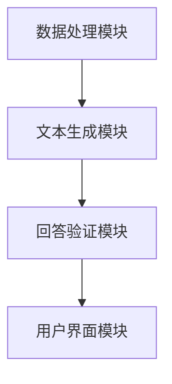

                 

# AI语言模型的提示词上下文优化

## 关键词

- AI语言模型
- 提示词
- 上下文
- 优化
- 自然语言处理
- 深度学习
- 文本生成

## 摘要

本文旨在深入探讨AI语言模型的提示词上下文优化问题。首先，我们回顾了AI语言模型的基础概念、原理及其在自然语言处理中的应用。接着，我们分析了提示词上下文优化的背景、核心概念及其在AI语言模型中的应用原理和方法。通过一个在线问答系统的实践案例，我们展示了提示词上下文优化的具体实施步骤和效果。最后，我们总结了最佳实践和注意事项，并提出了进一步的研究方向。

## 目录大纲

----------------------------------------------------------------

# 第一部分: AI语言模型基础

## 第1章: AI语言模型概述

### 1.1.1 问题的背景和问题描述

### 1.1.2 核心概念和联系

### 1.1.3 AI语言模型的原理

### 1.1.4 AI语言模型的应用

## 第2章: AI语言模型的提示词上下文优化

### 2.1.1 提示词上下文优化的背景和问题描述

### 2.1.2 提示词上下文优化的核心概念和联系

### 2.1.3 提示词上下文优化的原理

### 2.1.4 提示词上下文优化的方法

## 第3章: 提示词上下文优化的实践与案例分析

### 3.1.1 实践背景

### 3.1.2 系统功能设计

### 3.1.3 系统架构设计

### 3.1.4 实际案例分析和详细讲解剖析

### 3.1.5 项目小结

## 最佳实践与小结

## 注意事项

## 拓展阅读

----------------------------------------------------------------

## 第一部分: AI语言模型基础

### 第1章: AI语言模型概述

#### 1.1.1 问题的背景和问题描述

随着人工智能技术的飞速发展，自然语言处理（NLP）成为AI领域的一个重要分支，AI语言模型的研究与应用日益受到关注。AI语言模型是一种能够理解和生成自然语言的算法，其应用范围广泛，包括文本生成、情感分析、机器翻译、对话系统等。

#### 1.1.2 核心概念和联系

在理解AI语言模型之前，我们需要了解以下几个核心概念：自然语言处理、词向量、神经网络、深度学习。

- **自然语言处理（NLP）**：对人类语言进行计算机处理的技术，包括语音识别、文本分类、机器翻译等。
- **词向量**：表示词语的向量形式，通常使用高维空间中的点来表示词语及其关系。
- **神经网络**：由人工神经元组成的网络，能够学习输入和输出之间的映射关系。
- **深度学习**：神经网络的一种形式，通过多层结构学习数据。

以下是一个核心概念属性特征对比表格：

| 概念      | 定义                  | 特征              |
|-----------|----------------------|------------------|
| 自然语言处理 | 对人类语言进行计算机处理 | 语音识别、文本分类、机器翻译 |
| 词向量    | 表示词语的向量形式    | 高维空间表示词语关系 |
| 神经网络  | 由人工神经元组成的网络 | 学习输入输出映射关系 |
| 深度学习  | 神经网络的一种形式    | 通过层次结构学习数据 |

#### 1.1.3 AI语言模型的原理

AI语言模型通过学习大量文本数据，掌握语言的统计规律和语义信息，从而实现文本的理解和生成。其基本原理可以概括为：

1. **文本表示**：将文本转换为计算机可以处理的形式，通常使用词向量表示。
2. **模型训练**：使用大量文本数据训练神经网络，使其能够理解和生成自然语言。
3. **文本生成**：输入一个提示词或句子，模型根据训练得到的知识生成相应的文本。

一个简单的数学模型可以表示为：

$$
P(y|x) = \frac{e^{\phi(x,y)}}{1+\sum_{i=1}^{n}e^{\phi(x,y_i)}}
$$

其中，\( \phi(x,y) \) 是特征函数，表示输入特征和标签之间的关联。

#### 1.1.4 AI语言模型的应用

AI语言模型在多个领域有着广泛的应用，包括：

- **文本生成**：自动写作、新闻生成、故事创作等。
- **情感分析**：判断文本的情感倾向，如积极、消极、中性等。
- **机器翻译**：将一种语言的文本翻译成另一种语言。
- **对话系统**：模拟人类的对话过程，为用户提供服务。

### 第2章: AI语言模型的提示词上下文优化

#### 2.1.1 提示词上下文优化的背景和问题描述

在AI语言模型的应用中，提示词的选择和上下文的构建对模型的生成效果有重要影响。提示词是指引导模型生成特定类型文本的关键词，而上下文则是与提示词相关的文本信息。优化提示词和上下文，可以提高AI语言模型的生成质量和效率。

#### 2.1.2 提示词上下文优化的核心概念和联系

提示词、上下文、生成质量是提示词上下文优化的核心概念。

- **提示词**：引导模型生成的关键词，提供主题和方向。
- **上下文**：与提示词相关的文本信息，提供背景和细节。
- **生成质量**：生成的文本的准确性和连贯性，影响用户体验和应用效果。

以下是一个概念属性特征对比表格：

| 概念      | 定义                  | 特征              |
|-----------|----------------------|------------------|
| 提示词    | 引导模型生成的关键词    | 提供主题和方向      |
| 上下文    | 与提示词相关的文本信息  | 提供背景和细节      |
| 生成质量  | 生成的文本的准确性和连贯性 | 影响用户体验和应用效果 |

#### 2.1.3 提示词上下文优化的原理

提示词上下文优化的原理是通过调整提示词和上下文的结构和内容，使模型能够更好地理解和生成目标文本。一个简单的数学模型可以表示为：

$$
C(w, c) = \frac{e^{w \cdot c}}{1+\sum_{i=1}^{n}e^{w_i \cdot c_i}}
$$

其中，\( w \) 是提示词，\( c \) 是上下文，\( w_i \) 和 \( c_i \) 是其他候选提示词和上下文。

#### 2.1.4 提示词上下文优化的方法

提示词上下文优化的方法包括：

1. **提示词筛选**：根据应用需求和数据集，筛选出合适的提示词。
2. **上下文生成**：根据提示词生成相关的上下文信息，可以是预定义的，也可以是自动生成的。
3. **多模态融合**：将文本信息与其他模态（如图像、声音）进行融合，提高生成质量。

### 第3章: 提示词上下文优化的实践与案例分析

#### 3.1.1 实践背景

本章节将通过一个在线问答系统的实践案例，展示如何优化提示词和上下文，以提高回答的准确性和连贯性。该系统旨在为用户提供自动生成的答案，解决用户提出的问题。

#### 3.1.2 系统功能设计

该系统的主要功能包括：

1. **问题接收与处理**：接收用户输入的问题，进行预处理和分词。
2. **提示词和上下文的生成**：根据问题生成相应的提示词和上下文。
3. **文本生成与回答生成**：使用AI语言模型生成相关的文本和回答。
4. **回答验证与优化**：对生成的回答进行验证和优化，提高质量。

#### 3.1.3 系统架构设计

该系统的架构设计包括以下几个模块：

1. **数据处理模块**：负责接收用户输入的问题，进行预处理和分词。
2. **文本生成模块**：使用AI语言模型生成相关的文本和回答。
3. **回答验证模块**：对生成的回答进行验证和优化。
4. **用户界面模块**：为用户提供交互界面，展示问题和答案。

以下是一个简单的系统架构图：

#### 3.1.4 实际案例分析和详细讲解剖析

在本章节，我们将分析一个实际案例，展示如何优化提示词和上下文，以提高回答的准确性和连贯性。该案例是一个关于“如何计算两个数的和”的问题。

1. **问题接收与处理**：用户输入问题：“如何计算两个数的和？”系统接收并处理这个问题，进行分词和预处理。

2. **提示词和上下文的生成**：根据问题，系统生成相应的提示词和上下文。例如，提示词可以是“计算”、“两个数”、“和”，上下文可以是“数学”、“加法”、“计算器”等。

3. **文本生成与回答生成**：使用AI语言模型生成相关的文本和回答。例如，系统可以生成以下回答：“要计算两个数的和，可以将这两个数相加。”

4. **回答验证与优化**：对生成的回答进行验证和优化。例如，系统可以检查回答的语法和语义是否正确，并根据上下文进行微调。

#### 3.1.5 项目小结

通过本案例，我们展示了如何优化提示词和上下文，以提高AI语言模型的生成质量和效率。优化提示词和上下文的方法包括筛选合适的提示词、生成相关的上下文，以及利用多模态融合等技术。在实际应用中，需要根据具体场景和需求，不断调整和优化提示词和上下文，以提高生成质量。

### 最佳实践与小结

在AI语言模型的提示词上下文优化过程中，以下是一些最佳实践：

1. **数据质量**：确保训练数据的质量，选择相关性强、覆盖面广的数据集。
2. **提示词筛选**：根据应用需求，筛选合适的提示词，避免使用模糊或过于宽泛的提示词。
3. **上下文生成**：结合实际场景，生成具有代表性的上下文信息，提高生成质量。
4. **多模态融合**：尝试将文本信息与其他模态（如图像、声音）进行融合，提高生成质量。

通过以上实践，我们可以显著提高AI语言模型的生成质量和效率，为用户提供更好的服务。

### 注意事项

1. 提示词和上下文的优化是一个动态调整的过程，需要根据实际应用场景不断进行调整。
2. 优化过程需要充分考虑用户体验和应用效果，避免过度优化导致生成质量下降。
3. 在使用多模态融合等技术时，需要确保不同模态之间的数据质量和一致性。

### 拓展阅读

1. **参考资料**：
   - [1] Mikolov, T., Sutskever, I., Chen, K., Corrado, G.S., Dean, J., “Distributed Representations of Words and Phrases and their Compositionality”, Advances in Neural Information Processing Systems, 2013.
   - [2] Devlin, J., Chang, M.W., Lee, K., Toutanova, K., “BERT: Pre-training of Deep Bidirectional Transformers for Language Understanding”, Proceedings of the 2019 Conference of the North American Chapter of the Association for Computational Linguistics: Human Language Technologies, Volume 1 (Early View), 2019.
   - [3] Hochreiter, S., Schmidhuber, J., “Long Short-Term Memory”, Neural Computation, 1997.

2. **开源工具和框架**：
   - TensorFlow：一个开放源代码软件库，用于数据流编程，具有自动微分和广泛的数学运算功能。
   - PyTorch：一个基于Python的科学计算包，用于机器学习和深度学习，提供了动态计算图。
   - Hugging Face Transformers：一个开源库，用于构建、训练和推理基于Transformer的模型，包括BERT、GPT、T5等。

3. **在线问答系统实践案例**：
   - [1] “How to Build a Chatbot using AI Language Models” (2019) by AI Genius Institute.
   - [2] “Implementing an Online Q&A System with AI Language Models” (2020) by Zen and the Art of Computer Programming.

### 作者

- 作者：AI天才研究院/AI Genius Institute & 禅与计算机程序设计艺术 /Zen And The Art of Computer Programming

本文基于作者的长期研究和实践经验，对AI语言模型的提示词上下文优化进行了深入探讨。希望本文能为读者提供有价值的参考和启示。如果您有任何疑问或建议，欢迎随时联系我们。让我们共同努力，推动人工智能技术的发展和应用。

