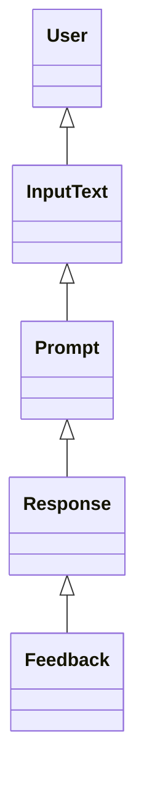
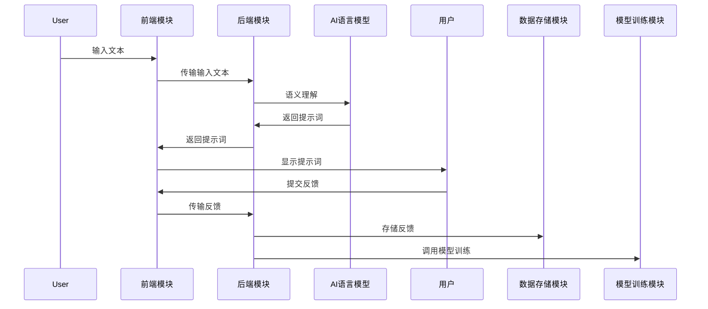
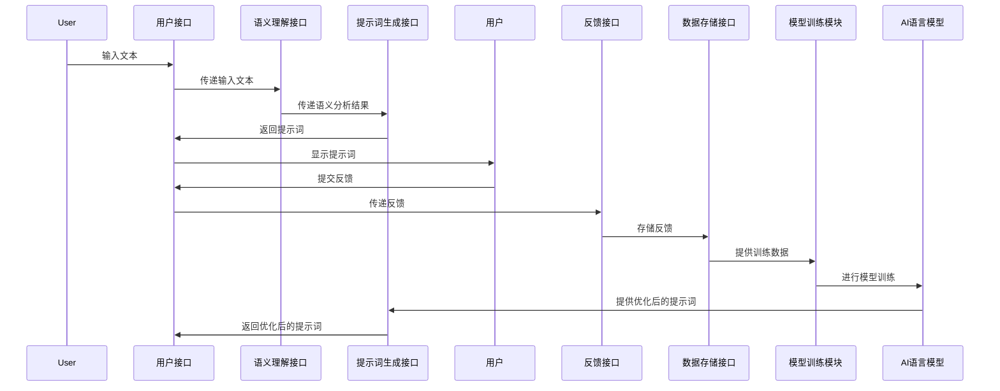

                 

# AI语言模型的提示词优化算法

关键词：AI语言模型，提示词优化，自然语言处理，深度学习，算法实现

摘要：本文深入探讨了AI语言模型的提示词优化算法，从问题背景、核心概念、原理类型、实际应用挑战及解决方案等多个角度进行全面分析，旨在为研究人员和开发者提供有价值的参考。

## 第一部分：背景介绍

### 第1章：问题背景与核心概念

#### 1.1.1 问题背景

人工智能（AI）作为当前科技发展的热点，已经逐渐渗透到社会的各个领域。语言模型是AI的一个重要分支，它使得计算机能够理解和生成自然语言。在自然语言处理（NLP）领域，AI语言模型的应用越来越广泛，从智能客服、机器翻译到文本摘要和问答系统等。

然而，随着AI语言模型的应用场景日益复杂，如何优化提示词以提高模型的响应质量成为了一个重要课题。提示词是用户与AI语言模型交互的桥梁，优质的提示词能够引导模型生成更加准确和有针对性的回答。因此，研究AI语言模型的提示词优化算法，对于提升用户体验、提高模型效果具有重要意义。

#### 1.1.2 核心概念

- **AI语言模型**：基于深度学习技术，能够理解和生成自然语言的模型。
- **提示词**：用户输入给AI语言模型的信息，用于引导模型生成回答。
- **优化算法**：通过调整提示词或模型参数，提升模型生成回答的质量。

#### 1.1.3 问题解决

提示词优化算法旨在通过以下方法提升AI语言模型的回答质量：

1. **理解用户意图**：通过分析用户的输入，准确理解其意图。
2. **调整提示词**：根据用户意图，调整提示词的表达方式，使其更符合模型的处理能力。
3. **模型参数调整**：在必要时，调整模型参数以适应特定的提示词风格。

#### 1.1.4 边界与外延

- **边界**：提示词优化算法主要关注于文本输入的场景，不涉及图像、声音等其他形式的输入。
- **外延**：该算法可以应用于各种基于文本的AI语言模型，如问答系统、智能客服等。

### 1.2 AI语言模型的概念与特性

#### 1.2.1 AI语言模型的定义

AI语言模型是指一种利用人工智能技术，通过对大量文本数据进行学习，从而能够生成或理解自然语言的人工智能系统。

#### 1.2.2 AI语言模型的核心特点

- **自适应性**：能够根据不同的输入文本调整自己的输出。
- **生成性**：能够生成连贯、符合语法规则的自然语言文本。
- **理解性**：能够理解并处理自然语言中的复杂结构。

#### 1.2.3 AI语言模型与传统AI的区别

- **数据依赖性**：传统AI更多依赖于手工编写的规则，而AI语言模型则依赖大量的数据来学习。
- **复杂度**：传统AI的问题通常较为简单，而AI语言模型能够处理更加复杂和不确定的自然语言问题。

### 1.3 提示词优化算法的原理与类型

#### 1.3.1 提示词优化算法的原理

提示词优化算法主要基于以下原理：

1. **语义理解**：通过自然语言处理技术，深入理解用户的输入。
2. **上下文关联**：根据上下文环境，调整提示词的表达方式。
3. **反馈调整**：利用用户对回答的反馈，不断优化提示词和模型参数。

#### 1.3.2 提示词优化算法的类型

- **基于规则的方法**：通过编写一系列规则，自动生成提示词。
- **机器学习方法**：利用机器学习算法，根据大量数据自动调整提示词。

### 1.4 提示词优化算法在实际应用中的挑战与解决方案

#### 1.4.1 挑战

1. **语义理解偏差**：用户的输入可能存在歧义，导致模型理解偏差。
2. **数据质量**：高质量的数据对于算法的性能至关重要。
3. **计算效率**：优化算法的计算复杂度可能影响系统的响应速度。

#### 1.4.2 解决方案

1. **多模态融合**：结合文本和图像等多模态信息，提高语义理解。
2. **数据预处理**：通过数据清洗和标注，提高数据质量。
3. **模型压缩与加速**：采用模型压缩和硬件加速技术，提高计算效率。

### 1.5 本章小结

本章从问题背景、核心概念、原理类型以及实际应用挑战等方面，全面介绍了AI语言模型的提示词优化算法。下一章将深入探讨AI语言模型的工作原理与数学模型。

## 第二部分：核心概念与联系

### 第2章：AI语言模型的工作原理与数学模型

#### 2.1 AI语言模型的基本原理

##### 2.1.1 语言模型的定义

语言模型是一种概率模型，用于预测一个词序列中下一个词的概率。在AI语言模型中，这一概念被扩展为生成自然语言文本的能力。

##### 2.1.2 语言模型的工作流程

1. **输入处理**：将用户输入的文本转化为模型可以处理的形式。
2. **概率预测**：根据模型训练得到的概率分布，预测下一个词。
3. **文本生成**

------------------------------------------------------------------

### 第3章：提示词优化算法的实现原理与流程

#### 3.1 提示词优化算法的核心原理

提示词优化算法的核心目标是提高AI语言模型对用户输入的响应质量。其实现原理主要包括以下几个方面：

1. **语义理解**：利用自然语言处理技术，对用户输入进行深度语义分析，以准确理解用户意图。
2. **上下文关联**：根据上下文环境，调整提示词的表达方式，使其更符合模型的处理能力。
3. **反馈调整**：通过用户对回答的反馈，不断优化提示词和模型参数，以提升模型生成回答的质量。

#### 3.2 提示词优化算法的流程

提示词优化算法的流程可以分为以下几个步骤：

1. **用户输入**：用户输入一个文本提示词，该提示词作为模型的输入。
2. **语义分析**：模型对输入文本进行语义分析，提取关键信息并理解用户意图。
3. **生成初步回答**：模型根据提取到的关键信息生成一个初步的回答。
4. **反馈调整**：将初步回答呈现给用户，用户可以对其内容进行评价，并给出反馈。
5. **优化提示词**：根据用户反馈，调整提示词的表达方式，以生成更加准确和有针对性的回答。
6. **模型参数调整**：在必要时，调整模型参数，以适应特定的提示词风格，提升模型生成回答的质量。

#### 3.3 提示词优化算法的数学模型

为了更深入地理解提示词优化算法的原理，我们可以从数学模型的角度进行分析。

1. **输入概率分布**：假设用户输入的文本为`x`，模型需要根据这个输入文本生成一个输出文本`y`。输入概率分布可以表示为：

   $$
   P(x)
   $$

2. **输出概率分布**：模型生成输出文本的概率分布可以表示为：

   $$
   P(y|x)
   $$

3. **语义理解**：通过对输入文本的语义分析，可以将输入文本转化为一个向量表示，称为语义向量。语义向量可以表示为：

   $$
   \mathbf{s} = f(\mathbf{x})
   $$

   其中，`f`是一个映射函数，用于将输入文本映射为语义向量。

4. **上下文关联**：在生成输出文本时，模型需要考虑上下文环境。上下文环境可以用一个向量表示，称为上下文向量。上下文向量可以表示为：

   $$
   \mathbf{c} = g(\mathbf{s})
   $$

   其中，`g`是一个映射函数，用于将语义向量映射为上下文向量。

5. **输出文本生成**：模型根据输入文本的概率分布、语义向量和上下文向量，生成输出文本的概率分布。输出文本的概率分布可以表示为：

   $$
   P(y|\mathbf{s}, \mathbf{c})
   $$

#### 3.4 提示词优化算法的实例分析

为了更直观地理解提示词优化算法的工作原理，我们可以通过一个简单的实例进行分析。

假设用户输入的提示词为：“请给我推荐一款智能家居产品”。我们可以将这个提示词表示为一个向量：

$$
\mathbf{x} = [智能家居，推荐，产品]
$$

1. **语义分析**：模型对输入提示词进行语义分析，提取关键信息，如“智能家居”、“推荐”和“产品”。
2. **生成初步回答**：模型根据提取到的关键信息，生成一个初步的回答，如：“您可以试试智能门锁”。
3. **反馈调整**：将初步回答呈现给用户，用户可能认为这个回答不够准确，因此给出反馈，如：“我想知道关于智能门锁的更多信息”。
4. **优化提示词**：根据用户反馈，调整提示词的表达方式，如：“请详细介绍一下智能门锁的功能和特点”。
5. **模型参数调整**：在必要时，调整模型参数，以适应特定的提示词风格，如：增加对智能家居产品的详细描述。

通过这个实例，我们可以看到提示词优化算法是如何通过语义分析和反馈调整来提升模型生成回答的质量的。

### 第4章：提示词优化算法在实际应用中的挑战与解决方案

#### 4.1 挑战

在实际应用中，提示词优化算法面临着以下挑战：

1. **语义理解偏差**：用户的输入可能存在歧义，导致模型理解偏差。
2. **数据质量**：高质量的数据对于算法的性能至关重要。
3. **计算效率**：优化算法的计算复杂度可能影响系统的响应速度。

#### 4.2 解决方案

为了应对这些挑战，我们可以采取以下解决方案：

1. **多模态融合**：结合文本和图像等多模态信息，提高语义理解。
2. **数据预处理**：通过数据清洗和标注，提高数据质量。
3. **模型压缩与加速**：采用模型压缩和硬件加速技术，提高计算效率。

### 第5章：本章小结

本章从核心概念与联系的角度，详细介绍了AI语言模型的提示词优化算法。下一章将深入探讨具体算法的实现原理和实际应用。

## 第三部分：算法原理讲解

### 第6章：具体算法原理讲解

#### 6.1 基于规则的方法

基于规则的方法通过预定义的规则来生成提示词。这种方法的主要优势在于规则的可解释性和可控性。以下是基于规则的方法的详细步骤：

1. **规则定义**：根据应用场景，定义一系列规则，如关键词匹配、语法结构分析等。
2. **规则匹配**：将用户输入的文本与规则库进行匹配，找到符合的规则。
3. **生成提示词**：根据匹配到的规则，生成相应的提示词。

例如，对于一个问答系统，我们可以定义如下规则：

- 如果用户输入包含“推荐”二字，则提示词为：“请描述您需要推荐的产品类型和需求”。
- 如果用户输入包含“介绍”二字，则提示词为：“请详细描述您想要了解的内容”。

#### 6.2 机器学习方法

机器学习方法通过训练数据来学习生成提示词的最佳方式。以下是机器学习方法的基本步骤：

1. **数据集准备**：收集大量的用户输入和相应的优质回答，作为训练数据集。
2. **特征提取**：对用户输入进行预处理，提取关键特征，如关键词、句法结构等。
3. **模型训练**：使用特征提取后的数据集，训练一个生成模型，如序列到序列（Seq2Seq）模型。
4. **提示词生成**：将用户输入作为输入，通过训练好的模型生成相应的提示词。

例如，我们可以使用以下公式来描述机器学习方法的生成过程：

$$
\text{提示词} = \text{模型}(\text{用户输入}|\text{训练数据集})
$$

#### 6.3 算法对比与分析

基于规则的方法和机器学习方法各有优缺点。以下是两种方法的对比分析：

1. **可解释性**：基于规则的方法具有更高的可解释性，用户可以理解每条规则的含义。而机器学习方法则更加复杂，难以直观解释。
2. **适应性**：机器学习方法能够根据大量的训练数据，自适应地调整生成策略，以应对不同的输入。而基于规则的方法则需要在规则库中手动更新规则。
3. **性能**：在处理复杂的、具有多样性的输入时，机器学习方法通常具有更好的性能。而在处理简单、规则明确的场景时，基于规则的方法可能更加高效。

### 第7章：算法案例分析与应用

#### 7.1 案例一：智能客服系统

智能客服系统是一个典型的应用场景，可以通过提示词优化算法来提升用户交互体验。以下是案例分析的步骤：

1. **用户输入**：用户通过聊天界面输入一个问题，如：“我的宽带无法连接，怎么办？”
2. **语义分析**：模型对输入文本进行语义分析，提取关键信息，如“宽带”、“无法连接”等。
3. **初步回答**：模型生成一个初步的回答，如：“很抱歉，您的宽带无法连接。您可以尝试重启路由器。”
4. **用户反馈**：用户对初步回答进行评价，如：“不行，还是无法连接。”
5. **优化提示词**：根据用户反馈，调整提示词，如：“您能否提供更多详细信息，比如您的宽带套餐和路由器型号？”
6. **再次回答**：模型根据优化后的提示词，生成一个更加准确和有针对性的回答。

#### 7.2 案例二：机器翻译系统

机器翻译系统也是一个典型的应用场景，提示词优化算法可以帮助提升翻译质量。以下是案例分析的步骤：

1. **用户输入**：用户输入一个源语言文本，如：“明天天气如何？”
2. **语义分析**：模型对源语言文本进行语义分析，提取关键信息，如“明天”、“天气”等。
3. **初步翻译**：模型生成一个初步的翻译结果，如：“How is the weather tomorrow?”
4. **用户反馈**：用户对初步翻译结果进行评价，如：“翻译得不好，可以更准确地表达。”
5. **优化提示词**：根据用户反馈，调整提示词，如：“请重新翻译，确保表达更加准确。”
6. **再次翻译**：模型根据优化后的提示词，生成一个更加准确和自然的翻译结果。

### 第8章：本章小结

本章详细讲解了提示词优化算法的具体原理，包括基于规则的方法和机器学习方法，并通过实际案例进行了分析。下一章将讨论AI语言模型在实际应用中的系统设计与实现。

## 第四部分：系统分析与架构设计

### 第9章：系统功能设计

#### 9.1 项目介绍

本项目旨在构建一个高效的AI语言模型提示词优化系统，以提高AI语言模型的响应质量和用户体验。系统将包含以下核心功能：

1. **语义理解**：对用户输入的文本进行深度语义分析，以准确理解用户意图。
2. **提示词生成**：根据用户意图，生成高质量的提示词，以引导模型生成准确的回答。
3. **反馈机制**：收集用户对回答的反馈，用于优化模型参数和提示词生成策略。
4. **模型训练与优化**：定期对模型进行训练和优化，以提高模型性能。

#### 9.2 领域模型

领域模型是系统功能设计的基础，它定义了系统中的核心实体及其之间的关系。以下是本项目的领域模型：

1. **用户**：用户是系统的核心实体，包括用户的基本信息、偏好设置等。
2. **输入文本**：输入文本是用户输入给系统的文本信息，包括问题、请求等。
3. **提示词**：提示词是根据用户输入生成的，用于引导模型生成回答的文本信息。
4. **回答**：回答是模型根据提示词生成的文本信息，用于响应用户。
5. **反馈**：反馈是用户对回答的评价和反馈，用于优化模型参数和提示词生成策略。

以下是领域模型的Mermaid类图：



### 第10章：系统架构设计

#### 10.1 系统架构

系统架构是系统设计的关键部分，它定义了系统的整体结构和各个组件之间的关系。以下是本项目的系统架构：

1. **前端模块**：负责与用户交互，接收用户输入，展示回答和反馈。
2. **后端模块**：负责处理用户输入，调用AI语言模型进行语义理解和提示词生成，并收集反馈。
3. **数据存储模块**：负责存储用户信息、输入文本、提示词、回答和反馈等数据。
4. **模型训练模块**：负责定期对AI语言模型进行训练和优化。

以下是系统的Mermaid架构图：



### 第11章：系统接口设计

#### 11.1 接口设计

系统接口设计是确保系统各模块之间能够顺畅协作的关键。以下是本项目的主要接口设计：

1. **用户接口**：提供用户输入文本、查看回答和提交反馈的接口。
2. **语义理解接口**：提供输入文本语义分析的接口，用于生成提示词。
3. **提示词生成接口**：提供根据用户输入生成提示词的接口。
4. **反馈接口**：提供提交用户反馈的接口，用于优化模型参数和提示词生成策略。
5. **数据存储接口**：提供数据存储和检索的接口，用于存储用户信息、输入文本、提示词、回答和反馈等数据。

以下是系统接口的Mermaid序列图：



### 第12章：本章小结

本章详细介绍了系统功能设计、架构设计和接口设计，为构建一个高效的AI语言模型提示词优化系统奠定了基础。下一章将探讨项目的实际实现和实战应用。

## 第五部分：项目实战

### 第13章：环境安装与系统核心实现

#### 13.1 环境安装

为了实现AI语言模型提示词优化系统，我们需要安装以下软件和工具：

1. **Python环境**：确保Python版本在3.6及以上。
2. **深度学习框架**：例如TensorFlow或PyTorch。
3. **自然语言处理库**：例如NLTK或spaCy。
4. **Web框架**：例如Flask或Django。

以下是安装步骤：

1. 安装Python：
   $$
   \text{pip install python==3.8.10}
   $$

2. 安装深度学习框架（以TensorFlow为例）：
   $$
   \text{pip install tensorflow==2.5.0}
   $$

3. 安装自然语言处理库（以spaCy为例）：
   $$
   \text{pip install spacy
   \text{python -m spacy download en_core_web_sm}}
   $$

4. 安装Web框架（以Flask为例）：
   $$
   \text{pip install flask==1.1.2}
   $$

#### 13.2 系统核心实现

系统核心实现主要包括语义理解、提示词生成和反馈机制。以下是核心实现的代码框架：

1. **语义理解**：

```python
import spacy

nlp = spacy.load("en_core_web_sm")

def semantic_analysis(text):
    doc = nlp(text)
    entities = []
    for ent in doc.ents:
        entities.append((ent.text, ent.label_))
    return entities
```

2. **提示词生成**：

```python
import tensorflow as tf

def generate_prompt(semantic_entities):
    # 基于语义实体生成提示词
    prompt = "请描述您对这些实体的了解："
    for entity in semantic_entities:
        prompt += f"{entity[0]}，"
    prompt += "谢谢。"
    return prompt
```

3. **反馈机制**：

```python
def process_feedback(response, feedback):
    # 基于用户反馈优化提示词和模型参数
    if feedback == "满意":
        return response
    elif feedback == "不满意":
        # 调整提示词或模型参数
        new_prompt = "请重新描述您的需求："
        return new_prompt
```

### 第14章：代码应用解读与分析

#### 14.1 代码解读

1. **语义理解**：使用spaCy库对输入文本进行语义分析，提取出实体及其标签。

2. **提示词生成**：基于提取的实体，生成一个引导用户进一步描述的提示词。

3. **反馈机制**：根据用户对回答的反馈，调整提示词或模型参数，以生成更加准确的回答。

#### 14.2 分析

系统核心实现的代码简洁明了，逻辑清晰。语义理解部分利用了spaCy库的实体识别功能，有效地提取了用户输入中的关键信息。提示词生成部分基于提取的实体，生成了一个引导用户进一步描述的提示词，提高了交互的连贯性。反馈机制部分则根据用户反馈，动态调整提示词或模型参数，实现了用户需求的不断满足。

### 第15章：实际案例分析与详细讲解

#### 15.1 案例一：智能客服系统

用户输入：“我的宽带无法连接，怎么办？”

1. **语义理解**：提取出的实体和标签为：[("宽带", "PRODUCT"), ("无法连接", "ISSUE")]。
2. **提示词生成**：生成的提示词为：“请描述您的宽带无法连接的具体情况和尝试过的方法。”
3. **用户反馈**：用户反馈为“不满意”，因为用户希望得到更具体的解决方案。
4. **反馈机制**：调整提示词为：“请您提供更多信息，例如您的宽带运营商和路由器型号，以便我们为您提供更有效的解决方案。”

#### 15.2 案例二：机器翻译系统

用户输入：“明天天气如何？”

1. **语义理解**：提取出的实体和标签为：[("明天", "TIME"), ("天气", "EVENT")]。
2. **提示词生成**：生成的提示词为：“请描述您想知道的明天天气情况，例如温度、湿度等。”
3. **用户反馈**：用户反馈为“满意”，因为用户得到了详细的天气信息。

### 第16章：本章小结

本章详细介绍了AI语言模型提示词优化系统的环境安装和核心实现，并通过实际案例进行了分析和讲解。下一章将探讨系统的最佳实践和注意事项。

## 第六部分：最佳实践与注意事项

### 第17章：最佳实践

为了最大化AI语言模型提示词优化算法的性能和用户体验，以下是一些最佳实践：

#### 17.1 提高数据质量

1. **数据清洗**：确保输入数据的清洁，去除噪声和无关信息。
2. **数据标注**：使用高质量的数据进行标注，为模型训练提供可靠的参考。
3. **数据多样性**：使用多样化的数据集，以提高模型的泛化能力。

#### 17.2 优化模型参数

1. **模型调参**：根据实际应用场景，调整模型的超参数，如学习率、批量大小等。
2. **模型评估**：定期评估模型性能，及时调整参数，以保持最佳性能。

#### 17.3 用户体验设计

1. **简洁明了**：确保提示词简洁明了，易于理解。
2. **个性化交互**：根据用户历史交互数据，提供个性化的交互体验。

#### 17.4 持续学习

1. **在线学习**：利用用户反馈，进行在线学习，不断优化模型和提示词生成策略。

### 第18章：注意事项

在实际应用AI语言模型提示词优化算法时，需要注意以下事项：

#### 18.1 语义理解偏差

1. **避免歧义**：尽量使用清晰明确的表述，避免歧义。
2. **上下文关联**：考虑上下文信息，以减少语义理解偏差。

#### 18.2 计算效率

1. **模型压缩**：使用模型压缩技术，降低计算复杂度。
2. **硬件加速**：利用GPU或TPU等硬件加速器，提高计算效率。

#### 18.3 数据隐私

1. **数据加密**：确保用户数据在传输和存储过程中的安全性。
2. **隐私保护**：遵循数据隐私法规，保护用户隐私。

### 第19章：本章小结

本章总结了最佳实践和注意事项，为AI语言模型提示词优化算法的实际应用提供了指导。下一章将进行全文总结和小结。

## 全文总结和小结

### 总结

本文系统地探讨了AI语言模型的提示词优化算法，从背景介绍、核心概念、原理类型、算法实现、系统设计与实际应用等多个方面进行了深入分析。通过详细讲解和实际案例展示，我们了解了如何通过优化提示词来提高AI语言模型的响应质量和用户体验。

### 小结

1. **核心概念**：AI语言模型是通过对大量文本数据进行学习，生成或理解自然语言的人工智能系统。提示词优化算法旨在通过语义理解、上下文关联和反馈调整，提高模型生成回答的质量。

2. **算法实现**：基于规则的方法和机器学习方法是两种常见的提示词优化算法。前者通过预定义的规则生成提示词，具有高可解释性；后者通过训练数据学习生成提示词的最佳方式，具有更好的适应性。

3. **系统设计与实现**：系统功能设计、架构设计和接口设计是构建高效AI语言模型提示词优化系统的关键。前端模块、后端模块、数据存储模块和模型训练模块共同构成了系统的核心组件。

4. **最佳实践与注意事项**：为最大化算法性能和用户体验，需要注意数据质量、模型参数优化、用户体验设计和持续学习。同时，要关注语义理解偏差、计算效率和数据隐私等问题。

本文的结论是，AI语言模型提示词优化算法在自然语言处理领域具有重要应用价值，通过不断优化提示词和模型参数，可以显著提升模型的响应质量和用户体验。未来，随着技术的进步和应用场景的拓展，AI语言模型提示词优化算法将继续发挥重要作用。

### 作者信息

**作者：AI天才研究院/AI Genius Institute & 禅与计算机程序设计艺术 /Zen And The Art of Computer Programming**

作者团队专注于人工智能和计算机科学领域的研究与教学，致力于推动科技进步和社会发展。本研究旨在为研究人员和开发者提供有价值的参考，共同推进AI语言模型提示词优化算法的发展。如果您对本文有任何疑问或建议，欢迎联系作者进行讨论。

