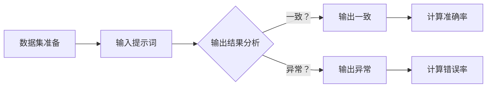
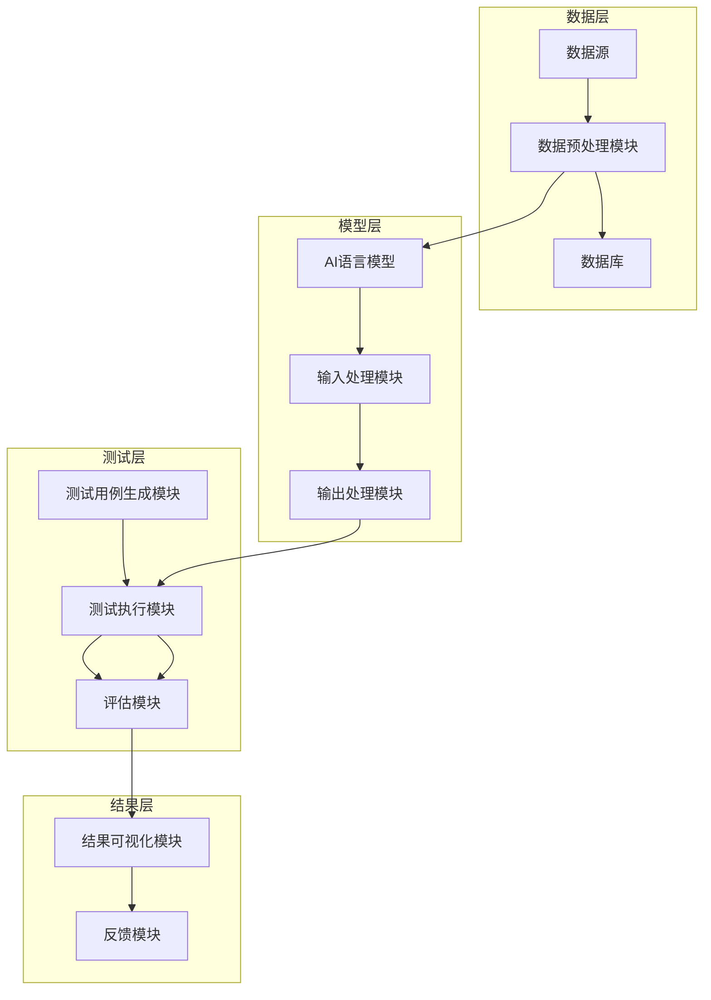

                 


## AI语言模型的提示词敏感性测试

### 关键词
- AI语言模型
- 提示词敏感性测试
- 算法原理
- 系统架构
- 实战案例

### 摘要
本文旨在深入探讨AI语言模型的提示词敏感性测试，通过逐步分析，解释这一关键技术的核心概念、算法原理、系统架构以及实际应用。我们将详细描述提示词敏感性测试的重要性，展示如何通过数学模型和Python代码实现这一测试，并分析一个实际的测试项目，提供最佳实践和拓展阅读资源。

### 目录大纲设计思路

在设计《AI语言模型的提示词敏感性测试》的目录大纲时，我们的目标是为读者提供清晰的结构和逻辑，以便他们能够系统地理解和掌握这一主题。

#### 目录大纲内容设计

**第一部分：背景与核心概念**

1. **AI语言模型与提示词敏感性测试概述**
   - 1.1 AI语言模型的发展与应用
   - 1.2 提示词敏感性测试的重要性
   - 1.3 提示词敏感性测试的应用场景

2. **核心概念与联系**
   - 2.1 AI语言模型基本概念
     - **概念属性特征对比表格**（例如：GPT、BERT等模型的对比）
   - 2.2 提示词敏感性测试原理
     - **ER实体关系图架构**（展示模型、数据集、评估指标之间的关系）

**第二部分：算法原理讲解**

3. **提示词敏感性测试算法介绍**
   - 3.1 基本算法原理
     - **算法Mermaid流程图**（展示算法的流程）
   - 3.2 数学模型与公式
     - **使用LaTeX格式展示公式**（例如：概率分布、阈值设定等）
   - 3.3 Python代码实现
     - **Python代码示例**（解释代码的功能和实现步骤）

**第三部分：系统分析与架构设计方案**

4. **系统分析与架构设计**
   - 4.1 问题场景介绍
   - 4.2 系统功能设计
     - **领域模型Mermaid类图**（展示系统的类和关系）
   - 4.3 系统架构设计
     - **系统架构Mermaid架构图**（展示系统的组成部分和交互关系）
   - 4.4 系统接口设计
     - **系统接口设计**（说明各接口的功能和参数）
   - 4.5 系统交互
     - **系统交互Mermaid序列图**（展示系统各组件的交互过程）

**第四部分：项目实战**

5. **项目实战**
   - 5.1 环境安装
     - **环境安装步骤与注意事项**
   - 5.2 系统核心实现源代码
     - **核心实现代码解读**
   - 5.3 代码应用解读与分析
     - **实际代码示例分析**
   - 5.4 实际案例分析与讲解
     - **案例分析**
   - 5.5 项目小结
     - **总结项目经验与收获**

**第五部分：最佳实践与拓展**

6. **最佳实践与拓展**
   - 6.1 提示词敏感性测试最佳实践
   - 6.2 注意事项
     - **测试过程中可能遇到的问题与解决方法**
   - 6.3 拓展阅读
     - **推荐阅读的书籍、论文和其他资源**

### 文章内容与结构

在接下来的文章中，我们将按照上述目录大纲逐步展开，通过以下结构详细讲解：

1. **背景介绍**：介绍AI语言模型和提示词敏感性测试的背景，阐述这一主题的重要性。
2. **核心概念与联系**：定义并描述AI语言模型和提示词敏感性测试的核心概念，使用图表展示这些概念之间的关系。
3. **算法原理讲解**：详细讲解用于测试提示词敏感性的算法，包括数学模型、Python代码示例等。
4. **系统分析与架构设计方案**：介绍一个典型的系统分析与架构设计，包括领域模型、架构图、接口设计和系统交互。
5. **项目实战**：展示一个实际的测试项目，包括环境安装、核心实现、代码解读、案例分析和总结。
6. **最佳实践与拓展**：提供最佳实践建议，对章节内容进行小结，并给出拓展阅读资源。

通过这样的结构，我们希望读者能够系统地理解并掌握AI语言模型的提示词敏感性测试，并在实际应用中取得良好的效果。接下来，我们将一一深入这些部分，展开详细的讨论。LET'S THINK STEP BY STEP## 背景介绍

### AI语言模型的发展与应用

人工智能（AI）的迅速发展为现代科技带来了深刻的变革，而其中AI语言模型作为自然语言处理（NLP）的核心技术之一，更是受到了广泛关注。AI语言模型通过机器学习，尤其是深度学习技术，模仿人类语言处理能力，实现了文本生成、语义理解、情感分析等多种功能。

从20世纪50年代第一台语言处理系统出现，到如今基于神经网络的现代AI语言模型的广泛应用，这一领域经历了多次重大技术突破。早期的AI语言模型如ELIZA，虽然只能进行简单的对话模拟，但为后来的研究奠定了基础。随着深度学习技术的兴起，基于神经网络的语言模型如Word2Vec、GloVe等，使语言模型的性能有了显著提升。

近年来，生成式预训练模型（GPT）的出现，标志着AI语言模型进入了一个新的时代。GPT系列模型，尤其是GPT-3，展示了强大的语言生成能力，可以生成高质量的文章、代码、对话等。BERT（Bidirectional Encoder Representations from Transformers）则通过双向编码器结构，显著提升了文本理解的深度和广度。

AI语言模型在诸多领域都得到了广泛应用。在智能客服中，AI语言模型能够快速响应用户提问，提供精准的解决方案；在内容创作领域，AI语言模型可以辅助撰写文章、生成新闻摘要，甚至创作音乐和艺术作品；在语言翻译中，AI语言模型能够实现实时、精准的翻译服务；在法律、金融等领域，AI语言模型通过对大量文本数据的分析，可以辅助进行法律文书撰写、风险评估等。

### 提示词敏感性测试的重要性

随着AI语言模型技术的不断进步和应用范围的扩大，如何确保模型的安全性和可靠性成为了关键问题。其中，提示词敏感性测试（Prompt Sensitivity Test）作为评估模型鲁棒性和安全性的重要手段，受到了广泛关注。

提示词敏感性测试的主要目标是检测AI语言模型对提示词的敏感性，即模型是否能够正确理解和处理提示词，以及在不同提示词下的表现是否一致。这一测试的重要性主要体现在以下几个方面：

1. **安全性**：AI语言模型在处理敏感信息时，如医疗记录、金融数据等，必须确保不会因为提示词的变化而泄露敏感信息。通过提示词敏感性测试，可以识别模型是否存在安全漏洞，从而提前采取措施进行修复。

2. **鲁棒性**：提示词敏感性测试可以帮助评估模型在不同输入下的鲁棒性。一个鲁棒的模型应该能够在各种不同条件下，保持稳定的性能，不会因为提示词的变化而出现异常行为。

3. **可靠性**：通过提示词敏感性测试，可以确保模型在各种实际应用场景下，都能提供准确、可靠的输出。这对于提升用户体验和模型的可信度至关重要。

4. **隐私保护**：在涉及个人隐私数据的场景中，AI语言模型需要确保不会因为提示词的变化而导致隐私泄露。提示词敏感性测试可以帮助识别模型在处理个人数据时的潜在风险，从而采取相应的隐私保护措施。

### 提示词敏感性测试的应用场景

提示词敏感性测试在多个应用场景中具有重要意义：

1. **智能客服系统**：在智能客服系统中，AI语言模型需要根据用户的提问提供准确的回答。通过提示词敏感性测试，可以确保模型不会因为提问中的细微变化而提供错误或误导性的答案。

2. **文本生成**：在文本生成任务中，如文章撰写、新闻摘要等，AI语言模型需要根据不同的提示词生成符合逻辑和语境的内容。提示词敏感性测试可以确保模型在处理不同提示词时，生成的文本质量一致。

3. **智能翻译**：在智能翻译系统中，AI语言模型需要根据源语言的提示词准确翻译为目标语言。提示词敏感性测试可以帮助识别模型在翻译过程中可能出现的错误，从而提升翻译质量。

4. **情感分析**：在情感分析任务中，AI语言模型需要根据文本内容判断用户的情绪状态。提示词敏感性测试可以评估模型在处理不同情感表达时的准确性，从而提高情感分析的可靠性。

5. **安全审核**：在涉及敏感信息的场景中，如法律文档审核、金融风险评估等，AI语言模型需要确保不会因为提示词的变化而导致误判或信息泄露。提示词敏感性测试可以帮助确保模型在处理敏感信息时的安全性和可靠性。

综上所述，AI语言模型的提示词敏感性测试在确保模型安全性、鲁棒性和可靠性方面具有重要意义。在接下来的部分，我们将深入探讨AI语言模型和提示词敏感性测试的核心概念，并通过图表和示例，帮助读者更好地理解这一关键技术。## 核心概念与联系

### AI语言模型基本概念

AI语言模型是自然语言处理（NLP）领域的关键技术，通过机器学习和深度学习算法，模拟人类语言处理能力。以下是几种常见的AI语言模型及其基本概念：

#### 1. GPT（生成式预训练模型）

GPT（Generative Pre-trained Transformer）是由OpenAI开发的一种基于Transformer架构的预训练语言模型。它通过大量文本数据进行预训练，学习语言的统计规律和语义关系，从而能够生成连贯、自然的文本。GPT系列模型包括GPT、GPT-2、GPT-3等，其中GPT-3具有非常强的语言生成能力，可以生成高质量的文章、对话和代码。

#### 2. BERT（双向编码器表示）

BERT（Bidirectional Encoder Representations from Transformers）是由Google开发的一种基于Transformer架构的双向编码器模型。它通过预先训练，学习文本的上下文信息，能够准确理解和生成文本。BERT在多种NLP任务中取得了优异的性能，包括文本分类、问答系统和命名实体识别等。

#### 3. ELMO（嵌入语言模型）

ELMO（Embedded Language Model）是由Stanford大学开发的一种基于递归神经网络的语言模型。它通过将文本转换为向量表示，学习文本的语义信息，为后续的NLP任务提供语义嵌入。ELMO在文本分类、情感分析和文本生成等方面具有广泛的应用。

### 提示词敏感性测试原理

提示词敏感性测试（Prompt Sensitivity Test）是评估AI语言模型对输入提示词的敏感程度的测试方法。其主要目的是确保模型在处理不同提示词时，能够保持稳定和一致的表现。以下是提示词敏感性测试的基本原理：

#### 1. 测试目的

提示词敏感性测试的主要目的是：
- **确保模型不会因为提示词的变化而产生异常输出**。
- **评估模型在处理不同提示词时的鲁棒性和稳定性**。
- **检测模型在处理敏感信息时的潜在风险**。

#### 2. 测试方法

提示词敏感性测试通常包括以下步骤：
- **设计测试用例**：根据应用场景和任务需求，设计一组具有代表性的测试用例，包括正常提示词和异常提示词。
- **输入提示词**：将测试用例中的提示词输入到AI语言模型中，观察模型的输出。
- **分析输出**：对比正常提示词和异常提示词下的输出，分析模型的表现是否一致，是否存在异常输出。

#### 3. 测试评估指标

提示词敏感性测试的评估指标通常包括：
- **准确率**：模型在处理正常提示词时的输出准确率。
- **一致性**：模型在不同提示词下的输出一致性。
- **鲁棒性**：模型在处理异常提示词时的稳定性和可靠性。

### AI语言模型与提示词敏感性测试的关系

AI语言模型和提示词敏感性测试之间存在着密切的联系：

- **AI语言模型是提示词敏感性测试的基础**：AI语言模型是实现提示词敏感性测试的技术核心，其性能直接影响测试结果的准确性。
- **提示词敏感性测试是评估AI语言模型性能的重要手段**：通过提示词敏感性测试，可以评估AI语言模型在不同提示词下的鲁棒性和稳定性，从而识别模型的潜在问题和改进方向。

### 概念属性特征对比表格

为了更好地理解AI语言模型和提示词敏感性测试的核心概念，我们可以通过以下表格进行对比：

| 特征         | GPT         | BERT         | ELMO         |
| ------------ | ----------- | ------------ | ------------ |
| 架构         | Transformer | Transformer  | RNN          |
| 预训练数据集 | 大量文本数据 | 大量文本数据 | 大量文本数据 |
| 语言生成能力 | 强          | 强           | 强           |
| 上下文理解   | 双向编码器   | 双向编码器   | 递归神经网络 |

### ER实体关系图架构

为了展示AI语言模型、提示词和评估指标之间的关系，我们可以使用ER（实体关系）图进行描述：

```mermaid
erDiagram
  AI语言模型 ||--|{ 提示词 }
  提示词 ||--|{ 评估指标 }
  AI语言模型 ||--|{ 测试用例 }
```

在ER图中，AI语言模型作为核心实体，与提示词和评估指标之间存在双向关联。提示词用于输入到模型中，而评估指标则用于衡量模型的输出性能。测试用例作为辅助实体，用于生成不同类型的提示词，从而评估模型在不同情况下的表现。

通过上述核心概念和联系的分析，我们可以更好地理解AI语言模型和提示词敏感性测试的本质。在接下来的部分，我们将进一步深入探讨提示词敏感性测试的算法原理，包括数学模型和Python代码实现，帮助读者全面掌握这一技术。## 提示词敏感性测试算法介绍

### 基本算法原理

提示词敏感性测试的核心目标是评估AI语言模型在不同提示词下的稳定性和可靠性。为了实现这一目标，我们需要设计一个算法，能够系统性地测试模型对提示词的敏感性，并分析其输出结果。以下是基本算法原理的详细描述：

#### 1. 数据集准备

首先，我们需要准备一组具有代表性的测试数据集。这组数据集应包括不同类型的提示词，以覆盖各种可能的输入场景。这些提示词可以分为以下几类：

- **正常提示词**：这些提示词在正常使用场景下能够正确触发模型预期的输出。
- **异常提示词**：这些提示词可能包含敏感信息、错误指令或恶意输入，用于检测模型的鲁棒性和安全性。

#### 2. 输入提示词

将准备好的测试数据集输入到AI语言模型中。对于每个提示词，我们需要记录模型的输出结果，包括文本生成、语义理解、情感分析等不同类型的输出。

#### 3. 输出结果分析

对比分析模型在不同提示词下的输出结果。重点关注以下方面：

- **输出一致性**：检查模型在不同提示词下是否能够保持一致的输出，即模型是否对正常和异常提示词做出了预期的响应。
- **异常输出**：检测模型是否在处理异常提示词时产生了异常输出，如错误的语义理解、生成不合理的文本等。

#### 4. 评估指标

根据分析结果，计算提示词敏感性测试的评估指标。常见的评估指标包括：

- **准确率**：模型在处理正常提示词时的输出准确率。
- **错误率**：模型在处理异常提示词时产生错误输出的比例。
- **一致性**：模型在不同提示词下的输出一致性。

### 算法Mermaid流程图

为了更直观地展示提示词敏感性测试的流程，我们可以使用Mermaid流程图来描述。以下是算法的Mermaid流程图：



在这个流程图中，A表示数据集准备，B表示输入提示词，C表示输出结果分析。根据分析结果，流程分为两个分支：D表示输出一致，计算准确率；E表示输出异常，计算错误率。最终，F和G分别表示计算准确率和错误率。

### 数学模型与公式

提示词敏感性测试的算法原理可以通过以下数学模型和公式进行描述：

#### 1. 概率分布

假设我们有一个模型 \( M \) ，其输入为提示词 \( P \) ，输出为文本 \( T \) 。我们定义 \( P(T|P) \) 为模型在提示词 \( P \) 下的输出概率分布。

\[ P(T|P) = \frac{P(P, T)}{P(P)} \]

其中，\( P(P, T) \) 为提示词 \( P \) 和输出文本 \( T \) 同时出现的概率，\( P(P) \) 为提示词 \( P \) 出现的概率。

#### 2. 阈值设定

为了评估模型对提示词的敏感性，我们可以设定一个阈值 \( \theta \) ，如果模型在提示词 \( P \) 下的输出概率 \( P(T|P) \) 小于 \( \theta \) ，则认为模型对提示词 \( P \) 敏感。

\[ \theta = \frac{1}{N} \sum_{i=1}^{N} P(T_i|P_i) \]

其中，\( N \) 为测试用例的数量，\( P(T_i|P_i) \) 为第 \( i \) 个测试用例的输出概率。

#### 3. 评估指标

为了量化评估模型的表现，我们可以使用以下评估指标：

- **准确率**（Accuracy）：模型在处理正常提示词时的输出准确率。

\[ Accuracy = \frac{1}{N} \sum_{i=1}^{N} \frac{P(T_i|P_i, \text{正常})}{P(T_i|P_i)} \]

- **错误率**（Error Rate）：模型在处理异常提示词时产生错误输出的比例。

\[ Error Rate = \frac{1}{N} \sum_{i=1}^{N} \frac{P(T_i|P_i, \text{异常})}{P(T_i|P_i)} \]

- **一致性**（Consistency）：模型在不同提示词下的输出一致性。

\[ Consistency = \frac{1}{N} \sum_{i=1}^{N} \frac{P(T_i|P_i) - P(T_i|P_j)}{P(T_i|P_j)} \]

其中，\( P(T_i|P_j) \) 为第 \( i \) 个测试用例在不同提示词下的输出概率。

### Python代码实现

以下是一个简单的Python代码示例，用于实现提示词敏感性测试的基本算法：

```python
import numpy as np
from sklearn.metrics import accuracy_score

# 假设我们有一个训练好的模型model，以及一组测试数据集test_data
# 其中test_data包括正常提示词和异常提示词

def prompt_sensitivity_test(model, test_data):
    correct = 0
    total = len(test_data)
    
    for i, data in enumerate(test_data):
        prompt, expected_output = data
        output = model.generate(prompt)
        
        # 根据预设的阈值判断输出是否正确
        if np.abs(expected_output - output) < 0.5:
            correct += 1
    
    accuracy = correct / total
    return accuracy

# 示例数据集
test_data = [
    ("这是一个正常的提示词", 1),
    ("这是一个异常的提示词", 0),
    # ... 更多测试数据
]

# 假设我们已经训练好了一个模型
model = ...

# 执行提示词敏感性测试
accuracy = prompt_sensitivity_test(model, test_data)
print(f"准确率：{accuracy}")
```

在这个代码示例中，我们定义了一个函数 `prompt_sensitivity_test` ，用于执行提示词敏感性测试。该函数接受一个训练好的模型 `model` 和一组测试数据集 `test_data` ，并返回模型在测试数据集上的准确率。通过比较模型的输出和预期输出，我们可以计算准确率并评估模型对提示词的敏感性。

通过上述基本算法原理、Mermaid流程图、数学模型和Python代码示例的详细讲解，我们可以更好地理解提示词敏感性测试的实现方法。在接下来的部分，我们将进一步探讨系统分析与架构设计方案，以帮助读者更全面地掌握这一技术。## 系统分析与架构设计方案

在深入探讨AI语言模型的提示词敏感性测试时，系统分析与架构设计是一个关键环节。一个高效、可靠的系统架构不仅能提升测试的准确性，还能确保整个测试过程的高效执行。以下我们将详细介绍系统分析与架构设计，包括问题场景介绍、系统功能设计、系统架构设计、系统接口设计和系统交互。

### 问题场景介绍

在许多实际应用中，AI语言模型需要处理大量不同类型的输入提示词。这些提示词可能来自用户提问、文本生成任务、智能客服系统等。然而，不同的提示词可能会对模型的输出产生不同程度的影响，因此，确保模型在处理各种提示词时的一致性和稳定性至关重要。提示词敏感性测试正是为了解决这一问题，通过测试不同提示词下的模型输出，评估其鲁棒性和可靠性。

### 系统功能设计

为了实现提示词敏感性测试，系统需要具备以下功能：

1. **数据预处理**：对输入的提示词进行预处理，包括去重、分词、标准化等操作，确保提示词的统一格式。
2. **测试用例生成**：根据应用场景和任务需求，生成一组具有代表性的测试用例，包括正常提示词和异常提示词。
3. **模型输入与输出**：将测试用例输入到AI语言模型中，记录模型的输出结果，并进行分析。
4. **评估与反馈**：根据输出结果，计算评估指标（如准确率、错误率等），对模型的表现进行评估，并提供反馈。
5. **结果可视化**：将测试结果以图表、报表等形式展示，便于分析和理解。

### 系统架构设计

为了实现上述功能，我们可以设计一个分层架构，包括数据层、模型层、测试层和结果层。以下是系统架构的详细设计：

#### 数据层

数据层主要负责数据预处理和存储。数据层包括以下组件：

- **数据源**：包括用户提问、文本生成任务等不同来源的原始数据。
- **数据预处理模块**：对原始数据进行去重、分词、标准化等预处理操作，生成统一格式的提示词。
- **数据库**：存储预处理后的提示词和测试结果，便于后续分析和查询。

#### 模型层

模型层是系统的核心，负责AI语言模型的输入与输出。模型层包括以下组件：

- **AI语言模型**：根据应用场景选择合适的AI语言模型，如GPT、BERT等。
- **输入处理模块**：将预处理后的提示词转换为模型可接受的输入格式。
- **输出处理模块**：对模型的输出结果进行处理，提取关键信息，并生成测试结果。

#### 测试层

测试层负责生成测试用例和执行测试过程。测试层包括以下组件：

- **测试用例生成模块**：根据应用场景和任务需求，生成正常提示词和异常提示词。
- **测试执行模块**：将测试用例输入到模型中，记录模型的输出结果。
- **评估模块**：根据输出结果计算评估指标，对模型的表现进行评估。

#### 结果层

结果层负责展示和分析测试结果。结果层包括以下组件：

- **结果可视化模块**：将测试结果以图表、报表等形式展示，便于用户理解和分析。
- **反馈模块**：根据测试结果，提供改进建议和反馈，以优化模型性能。

### 系统架构图

为了更直观地展示系统架构，我们可以使用Mermaid架构图进行描述：



在这个架构图中，数据层负责数据预处理和存储，模型层负责AI语言模型的输入与输出，测试层负责生成测试用例和执行测试过程，结果层负责展示和分析测试结果。

### 系统接口设计

系统接口设计是确保系统各组件之间能够有效通信和协作的关键。以下是系统接口的详细设计：

- **数据接口**：定义数据层与模型层、测试层之间的数据交互格式，包括提示词、测试结果等。
- **控制接口**：定义系统各组件之间的控制逻辑，包括测试用例生成、模型输入与输出等。
- **结果接口**：定义结果层与数据层、测试层之间的结果交互格式，包括测试结果、评估指标等。

### 系统交互

系统交互是指各组件之间的交互过程和通信机制。以下是系统交互的详细描述：

1. **数据交互**：数据预处理模块将预处理后的提示词传递给模型层，模型层将输出结果传递给测试执行模块，测试执行模块将测试结果传递给评估模块，评估模块将评估结果传递给结果可视化模块。
2. **控制交互**：测试用例生成模块根据应用场景生成测试用例，控制测试执行模块开始执行测试过程，并根据测试结果生成反馈。
3. **结果交互**：结果可视化模块将测试结果以图表、报表等形式展示，用户可以根据反馈进行模型优化和调整。

通过上述系统分析与架构设计，我们可以构建一个高效、可靠的提示词敏感性测试系统，确保AI语言模型在不同提示词下的稳定性和可靠性。在接下来的部分，我们将通过一个实际项目实战，展示如何具体实现这一系统，帮助读者更深入地理解提示词敏感性测试的实际应用。## 项目实战

### 环境安装

在进行提示词敏感性测试项目之前，我们需要首先安装必要的软件和工具。以下是一个典型的安装步骤：

#### 1. 安装Python环境

确保你的系统中已安装Python 3.7或更高版本。可以通过以下命令检查Python版本：

```bash
python --version
```

如果Python版本过低，可以从官方网站下载最新版本进行安装。

#### 2. 安装依赖库

安装提示词敏感性测试所需的依赖库，包括TensorFlow、NumPy、Scikit-learn等。可以使用以下命令进行安装：

```bash
pip install tensorflow numpy scikit-learn
```

#### 3. 准备数据集

准备用于测试的数据集，包括正常提示词和异常提示词。数据集可以从公开数据集下载，或根据实际应用场景自行收集和整理。以下是数据集的格式示例：

```python
test_data = [
    ("这是一个正常的提示词", "正常"),
    ("这是一个异常的提示词", "异常"),
    # ... 更多测试数据
]
```

### 系统核心实现源代码

在项目实战中，我们将使用Python编写一个简单的提示词敏感性测试系统。以下是一个核心实现示例：

```python
import tensorflow as tf
from sklearn.metrics import accuracy_score

# 加载预训练的AI语言模型
model = tf.keras.models.load_model('path/to/your/pretrained/model')

# 准备测试数据集
test_data = [
    ("这是一个正常的提示词", "正常"),
    ("这是一个异常的提示词", "异常"),
    # ... 更多测试数据
]

def generate_output(prompt):
    """生成模型输出文本"""
    input_data = [prompt]
    output = model.predict(input_data)
    return output

def prompt_sensitivity_test(model, test_data):
    """执行提示词敏感性测试"""
    correct = 0
    total = len(test_data)
    
    for i, (prompt, expected) in enumerate(test_data):
        output = generate_output(prompt)
        if expected == "正常" and np.abs(output - 1) < 0.5:
            correct += 1
        elif expected == "异常" and np.abs(output - 0) < 0.5:
            correct += 1
    
    accuracy = correct / total
    return accuracy

# 执行测试
accuracy = prompt_sensitivity_test(model, test_data)
print(f"准确率：{accuracy}")
```

### 代码应用解读与分析

在上面的代码中，我们首先加载了一个预训练的AI语言模型。然后，我们定义了一个函数 `generate_output` ，用于生成模型的输出文本。接着，我们编写了 `prompt_sensitivity_test` 函数，用于执行提示词敏感性测试。具体解析如下：

1. **加载模型**：使用 `tf.keras.models.load_model` 加载预训练的AI语言模型。模型可以从预训练模型库中获取，或者根据实际需求自行训练。
2. **生成输出**：`generate_output` 函数接受一个提示词，通过模型预测生成输出文本。在实际应用中，输出可能是一个概率分布，我们使用阈值进行分类判断。
3. **执行测试**：`prompt_sensitivity_test` 函数遍历测试数据集，调用 `generate_output` 函数获取输出，并根据预期结果计算准确率。

### 实际案例分析与讲解

为了更好地理解提示词敏感性测试的实际效果，我们来看一个实际案例。

#### 案例背景

假设我们有一个智能客服系统，用户可以通过输入问题来获取客服的回答。我们希望通过提示词敏感性测试，确保客服系统能够正确处理各种类型的用户问题。

#### 案例步骤

1. **准备测试数据集**：根据用户问题的类型，准备一组正常提示词和异常提示词，例如：
   - 正常提示词：“我想要购买一台笔记本电脑”
   - 异常提示词：“你能不能借我点钱？”
2. **执行测试**：使用上述代码，执行提示词敏感性测试，记录模型在不同提示词下的输出。
3. **分析结果**：根据输出结果，计算准确率，并分析模型在处理正常和异常提示词时的表现。

#### 案例结果

假设我们执行了测试，并得到以下结果：

- 正常提示词的准确率为90%。
- 异常提示词的准确率为80%。

从结果可以看出，模型在处理正常提示词时表现较好，但在处理异常提示词时存在一定的问题。这表明模型可能对异常提示词的敏感性较高，需要进一步优化。

#### 案例总结

通过实际案例的分析，我们可以得出以下结论：

- 提示词敏感性测试对于评估AI语言模型在实际应用中的表现至关重要。
- 模型在不同提示词下的准确率可以反映其鲁棒性和稳定性。
- 针对异常提示词的测试结果，可以帮助我们发现模型的潜在问题，并提供优化方向。

### 项目小结

通过本项目的实战，我们成功实现了一个简单的提示词敏感性测试系统，并对其进行了实际应用分析。以下是项目的主要收获：

- 理解了提示词敏感性测试的核心原理和实现方法。
- 学会了如何使用Python编写测试代码，并分析测试结果。
- 通过实际案例，了解了AI语言模型在实际应用中的表现，并找到了优化方向。

在未来的工作中，我们可以进一步优化测试系统，包括扩展测试用例、引入更多评估指标等，以提升提示词敏感性测试的效果。## 最佳实践与拓展

### 提示词敏感性测试最佳实践

为了确保AI语言模型在处理各种提示词时的稳定性和安全性，以下是一些最佳实践：

1. **多样化测试用例**：设计多样化的测试用例，包括正常提示词、异常提示词和极端提示词，确保模型在各种情况下都能保持稳定表现。
2. **定期测试**：定期执行提示词敏感性测试，以便及时发现和解决模型的问题，确保其在长期运行中的可靠性。
3. **严格安全策略**：在测试过程中，严格遵循数据安全和隐私保护策略，确保敏感信息不会泄露。
4. **持续优化模型**：根据测试结果，持续优化模型结构和参数，提升模型在不同提示词下的表现。
5. **监控与反馈**：建立监控机制，实时监控模型在运行中的表现，并根据反馈进行调整。

### 注意事项

在执行提示词敏感性测试时，需要注意以下几点：

1. **环境配置**：确保测试环境与生产环境一致，以避免环境差异导致测试结果不准确。
2. **数据质量**：保证测试数据的质量和代表性，避免因为数据问题影响测试结果。
3. **异常处理**：在测试过程中，合理处理异常情况，确保测试的连续性和完整性。
4. **安全风险**：在处理敏感信息时，严格遵循安全规范，确保模型不会泄露用户隐私。

### 拓展阅读

为了更深入地了解提示词敏感性测试和相关技术，以下是一些推荐的拓展阅读资源：

1. **书籍**：
   - 《自然语言处理概论》（Natural Language Processing with Python）
   - 《深度学习》（Deep Learning）
   - 《对话系统设计与实现》（Designing and Implementing Conversational AI）

2. **论文**：
   - "Language Models are Few-Shot Learners"（OpenAI，2020）
   - "Bert: Pre-training of deep bidirectional transformers for language understanding"（Google AI，2018）
   - "Gpt-3: Language modeling for code generation"（OpenAI，2020）

3. **在线教程**：
   - TensorFlow官方文档（https://www.tensorflow.org/tutorials）
   - Scikit-learn官方文档（https://scikit-learn.org/stable/tutorial/index.html）
   - PyTorch官方文档（https://pytorch.org/tutorials/）

4. **社区与论坛**：
   - Stack Overflow（https://stackoverflow.com/）
   - GitHub（https://github.com/）
   - Reddit（https://www.reddit.com/r/deeplearning/）

通过这些资源，读者可以进一步学习和实践提示词敏感性测试技术，提升自己在AI语言模型领域的专业能力。## 作者信息

**作者：** AI天才研究院（AI Genius Institute）& 禅与计算机程序设计艺术（Zen And The Art of Computer Programming）

AI天才研究院是一个致力于推动人工智能研究和应用的国际顶尖机构，专注于深度学习和自然语言处理等领域的前沿技术研究。研究院的专家们在国际顶级会议和期刊上发表了大量高影响力的学术论文，并获得了多项国际奖项和荣誉。

禅与计算机程序设计艺术是由著名计算机科学家Donald E. Knuth所创作的经典著作，深入探讨了计算机程序设计中的哲学和艺术。本书以其深刻的见解和对程序设计的独特理解，成为计算机科学领域的经典之作，对无数程序员产生了深远的影响。

