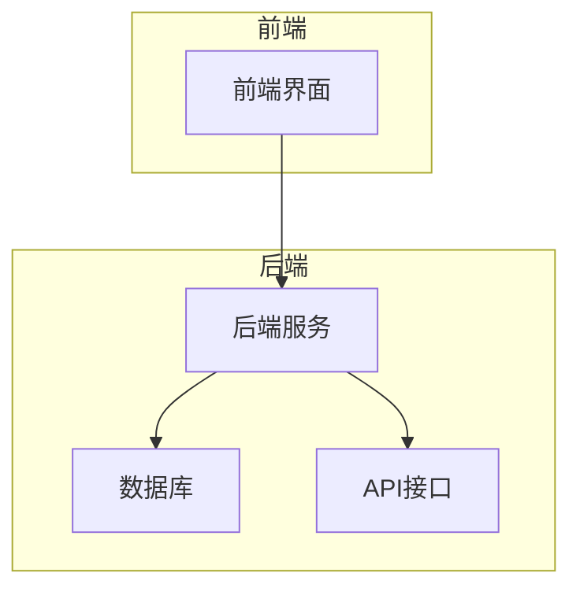

                 

# AI语言模型的提示词版本管理最佳实践

## 关键词
AI语言模型、提示词版本管理、最佳实践、算法、系统设计、数学模型、Python代码实现、项目实战

## 摘要
本文将深入探讨AI语言模型的提示词版本管理最佳实践。我们将首先介绍AI语言模型和提示词版本管理的核心概念，然后详细讲解不同算法在提示词版本管理中的应用，包括原理、数学模型和Python代码实现。接着，我们将分析提示词版本管理系统的设计，包括系统功能、架构和接口设计。随后，我们将通过一个实际项目展示系统实现过程，并进行代码解析和案例分析。最后，我们将总结最佳实践，提醒注意事项，并提供拓展阅读资源。

### 目录大纲设计思路

为了设计《AI语言模型的提示词版本管理最佳实践》的完整目录大纲，我们首先需要明确书籍的核心主题和内容结构。以下是详细的目录大纲设计步骤：

#### 1. 确定核心主题和章节结构

- **背景介绍**：介绍AI语言模型的发展背景和提示词版本管理的必要性。
- **核心概念与联系**：介绍AI语言模型的基本概念，提示词版本管理的原理和方法。
- **算法原理讲解**：讲解不同算法在提示词版本管理中的应用，包括原理、数学模型和Python代码实现。
- **数学模型和数学公式**：阐述相关数学公式，使用LaTeX格式表示，并进行详细讲解。
- **系统分析与架构设计**：分析提示词版本管理系统的设计，包括系统功能、架构和接口设计。
- **项目实战**：展示一个实际项目，包括环境安装、系统实现、代码解析和案例分析。
- **最佳实践与总结**：提供最佳实践建议，总结关键点，提醒注意事项，推荐拓展阅读。

#### 2. 设计章节标题和内容要点

根据上述结构，我们可以设计出以下章节标题和内容要点：

**第1章：AI语言模型与提示词版本管理概述**
- 1.1 AI语言模型的概述
  - AI语言模型的发展历程
  - 提示词版本管理的概念
  - 提示词版本管理的必要性
- 1.2 提示词版本管理的挑战与目标
  - 挑战：版本冲突、性能下降、安全性问题
  - 目标：提高效率、保证质量、增强安全性

**第2章：核心概念与联系**
- 2.1 AI语言模型的基础知识
  - 语言模型的核心概念
  - 提示词的定义与作用
- 2.2 提示词版本管理的原理与方法
  - 版本控制的基础理论
  - 提示词版本管理的策略
- 2.3 AI语言模型与提示词版本管理的联系
  - 提示词版本管理对AI语言模型的影响
  - AI语言模型对提示词版本管理的要求

**第3章：算法原理讲解**
- 3.1 提示词版本管理的常见算法
  - 版本控制算法介绍
  - 算法特点与应用场景
- 3.2 算法原理详解
  - 提示词版本管理的数学模型
  - Python代码实现与流程图

**第4章：数学模型和数学公式**
- 4.1 提示词版本管理的数学基础
  - 概率论与统计学基本概念
  - 最优化理论简介
- 4.2 关键数学公式及其解释
  - LaTeX格式表示
  - 公式在提示词版本管理中的应用

**第5章：系统分析与架构设计**
- 5.1 提示词版本管理系统设计
  - 系统功能设计
  - 系统架构设计
- 5.2 系统接口设计和交互
  - 系统接口设计
  - 系统交互序列图

**第6章：项目实战**
- 6.1 实际项目介绍
  - 项目背景
  - 项目目标
- 6.2 系统实现与代码解析
  - 环境安装与配置
  - 系统核心代码实现
- 6.3 案例分析与讲解
  - 实际案例分析
  - 案例细节剖析

**第7章：最佳实践与总结**
- 7.1 最佳实践建议
  - 提高提示词版本管理效率的建议
  - 保证提示词版本管理安全性的措施
- 7.2 小结与注意事项
  - 书籍核心观点总结
  - 注意事项提醒
- 7.3 拓展阅读
  - 推荐进一步学习资源

### 3. 输出格式

按照markdown格式，设计章节标题和内容，确保简洁、清晰。以下是初步的markdown格式目录大纲：

```markdown
# 第1章：AI语言模型与提示词版本管理概述

## 1.1 AI语言模型的概述
### 1.1.1 AI语言模型的发展历程
### 1.1.2 提示词版本管理的概念
### 1.1.3 提示词版本管理的必要性

## 1.2 提示词版本管理的挑战与目标
### 1.2.1 挑战：版本冲突、性能下降、安全性问题
### 1.2.2 目标：提高效率、保证质量、增强安全性

# 第2章：核心概念与联系

## 2.1 AI语言模型的基础知识
### 2.1.1 语言模型的核心概念
### 2.1.2 提示词的定义与作用

## 2.2 提示词版本管理的原理与方法
### 2.2.1 版本控制的基础理论
### 2.2.2 提示词版本管理的策略

## 2.3 AI语言模型与提示词版本管理的联系
### 2.3.1 提示词版本管理对AI语言模型的影响
### 2.3.2 AI语言模型对提示词版本管理的要求

# 第3章：算法原理讲解

## 3.1 提示词版本管理的常见算法
### 3.1.1 版本控制算法介绍
### 3.1.2 算法特点与应用场景

## 3.2 算法原理详解
### 3.2.1 提示词版本管理的数学模型
### 3.2.2 Python代码实现与流程图

# 第4章：数学模型和数学公式

## 4.1 提示词版本管理的数学基础
### 4.1.1 概率论与统计学基本概念
### 4.1.2 最优化理论简介

## 4.2 关键数学公式及其解释
### 4.2.1 LaTeX格式表示
### 4.2.2 公式在提示词版本管理中的应用

# 第5章：系统分析与架构设计

## 5.1 提示词版本管理系统设计
### 5.1.1 系统功能设计
### 5.1.2 系统架构设计

## 5.2 系统接口设计和交互
### 5.2.1 系统接口设计
### 5.2.2 系统交互序列图

# 第6章：项目实战

## 6.1 实际项目介绍
### 6.1.1 项目背景
### 6.1.2 项目目标

## 6.2 系统实现与代码解析
### 6.2.1 环境安装与配置
### 6.2.2 系统核心代码实现

## 6.3 案例分析与讲解
### 6.3.1 实际案例分析
### 6.3.2 案例细节剖析

# 第7章：最佳实践与总结

## 7.1 最佳实践建议
### 7.1.1 提高提示词版本管理效率的建议
### 7.1.2 保证提示词版本管理安全性的措施

## 7.2 小结与注意事项
### 7.2.1 书籍核心观点总结
### 7.2.2 注意事项提醒

## 7.3 拓展阅读
### 7.3.1 推荐进一步学习资源

---

以上是初步的markdown格式目录大纲，我们将根据实际情况对内容进行丰富和调整。在接下来的章节中，我们将逐步深入探讨每个部分的内容。

## 第1章：AI语言模型与提示词版本管理概述

### 1.1 AI语言模型的概述

人工智能（AI）的发展已经经历了多个阶段，从早期的规则驱动系统到基于数据的机器学习模型，再到当今的深度学习模型，每一次技术的进步都极大地推动了AI在各个领域的应用。其中，自然语言处理（NLP）是AI研究的重要分支，而AI语言模型则是NLP的核心技术之一。

AI语言模型是指利用计算机程序模拟人类语言理解和生成能力的模型。它通过学习大量的语言数据，能够理解和生成符合语言语法和语义规则的句子。这些模型可以用于各种应用场景，如机器翻译、文本摘要、问答系统、语音识别等。

#### AI语言模型的发展历程

AI语言模型的发展可以分为以下几个阶段：

1. **规则驱动模型**：早期的语言模型主要基于手工编写的规则，如正则表达式和上下文无关文法（CFG）。这些模型虽然能够处理一些简单的语言现象，但在复杂语言处理任务上表现不佳。

2. **基于统计的模型**：随着语料库的积累，研究人员开始利用统计方法来训练语言模型。基于N元语法（N-gram）的模型是最早的成功尝试，它通过统计相邻单词的序列来预测下一个单词。

3. **基于神经网络的模型**：深度学习技术的发展为语言模型带来了革命性的变化。循环神经网络（RNN）和长短时记忆网络（LSTM）的出现，使得模型能够更好地处理长距离依赖问题。随后，注意力机制和Transformer模型的引入，进一步提升了语言模型的性能。

4. **预训练和微调**：近年来，预训练语言模型（如BERT、GPT）通过在大规模未标注语料上进行预训练，再通过微调适应特定任务，取得了显著的效果。

#### 提示词版本管理的概念

提示词（Prompt）是指用于引导AI模型生成特定类型输出的关键词或短语。在AI语言模型中，提示词的作用类似于人类语言交流中的问题或指令。通过选择合适的提示词，可以引导模型生成符合预期结果的文本。

提示词版本管理是指对提示词进行版本控制和管理的过程。随着AI模型的应用场景不断扩展，提示词也在不断更新和优化。版本管理可以帮助团队跟踪不同版本的提示词，确保模型输出的稳定性和一致性。

#### 提示词版本管理的必要性

在AI语言模型的应用过程中，提示词版本管理具有以下几个必要性：

1. **保证模型输出一致性**：不同版本的提示词可能导致模型输出结果的差异。版本管理可以确保在不同场景下使用一致的提示词版本，从而保证模型输出的稳定性。

2. **优化模型性能**：通过版本管理，可以跟踪和评估不同提示词版本对模型性能的影响，从而优化提示词的选择和调整，提高模型的表现。

3. **团队协作与沟通**：在多团队协作开发AI模型时，版本管理可以帮助团队成员了解和追踪各个版本的变化，提高协作效率和沟通效果。

4. **安全性和合规性**：提示词版本管理还可以确保模型输出的合规性和安全性，避免因提示词不当导致的错误或风险。

### 1.2 提示词版本管理的挑战与目标

尽管提示词版本管理具有重要意义，但在实际应用过程中也面临着一系列挑战。

#### 挑战

1. **版本冲突**：随着提示词版本的不断更新，版本冲突问题难以避免。不同版本的提示词可能对模型输出产生不一致的影响，导致模型性能下降或错误输出。

2. **性能下降**：过多的提示词版本可能导致模型训练和推理时间延长，从而影响性能。

3. **安全性问题**：不当的提示词版本可能导致模型输出敏感信息或被恶意利用，引发安全风险。

#### 目标

为了应对上述挑战，提示词版本管理需要达到以下目标：

1. **提高效率**：通过优化版本管理流程和工具，提高提示词版本管理的效率，减少版本冲突和性能下降。

2. **保证质量**：确保提示词版本管理的质量和稳定性，避免因版本问题导致的模型输出错误。

3. **增强安全性**：通过严格的版本控制和安全策略，确保模型输出的合规性和安全性。

### 第2章：核心概念与联系

在深入探讨AI语言模型和提示词版本管理之前，我们需要先了解一些核心概念，以及它们之间的联系。这一章节将介绍AI语言模型的基础知识，提示词的定义与作用，以及提示词版本管理的原理与方法。

#### 2.1 AI语言模型的基础知识

AI语言模型是自然语言处理（NLP）的核心技术之一。它通过学习大量文本数据，能够理解和生成符合语法和语义规则的句子。AI语言模型可以分为以下几个类型：

1. **词袋模型（Bag-of-Words, BoW）**：词袋模型将文本转换为词频向量，忽略词的顺序信息。它适用于简单的文本分类和文本相似度计算。

2. **朴素贝叶斯模型（Naive Bayes）**：朴素贝叶斯模型是基于贝叶斯定理的文本分类模型。它通过计算特征词的概率分布来预测文本的类别。

3. **循环神经网络（Recurrent Neural Network, RNN）**：循环神经网络是处理序列数据的经典模型。它通过记忆状态来捕捉序列中的长距离依赖关系。

4. **长短时记忆网络（Long Short-Term Memory, LSTM）**：长短时记忆网络是RNN的一种变体，通过门控机制来缓解梯度消失问题，更好地处理长距离依赖。

5. **卷积神经网络（Convolutional Neural Network, CNN）**：卷积神经网络最初用于图像处理，后来也被应用于文本分析。它通过局部感知野来捕捉文本中的局部特征。

6. **Transformer模型**：Transformer模型是近年来提出的自注意力机制模型，它在机器翻译、文本生成等任务上取得了显著效果。它通过多头自注意力机制和位置编码来捕捉全局依赖关系。

7. **预训练语言模型（Pre-trained Language Model, PLM）**：预训练语言模型通过在大规模语料上进行预训练，再通过微调适应特定任务，如BERT、GPT等。它大大提高了NLP任务的表现。

#### 提示词的定义与作用

提示词（Prompt）是指用于引导AI模型生成特定类型输出的关键词或短语。它通常包含任务描述、问题陈述或指令，帮助模型理解生成任务的目标和要求。提示词在AI语言模型中有以下几个作用：

1. **引导模型生成**：通过选择合适的提示词，可以引导模型生成符合预期结果的文本。

2. **明确任务目标**：提示词可以帮助模型明确任务目标，减少生成过程中的不确定性。

3. **提高生成质量**：优质的提示词可以提高生成文本的语法和语义质量。

4. **优化模型表现**：通过调整提示词，可以优化模型在特定任务上的表现。

#### 提示词版本管理的原理与方法

提示词版本管理是指对提示词进行版本控制和管理的过程。它主要包括以下几个步骤：

1. **版本控制**：使用版本控制系统（如Git）来跟踪和管理提示词的版本变化。每次修改提示词时，都需要提交变更并记录版本号。

2. **版本比较**：通过比较不同版本的提示词，可以分析版本差异和影响，确保提示词的稳定性和一致性。

3. **版本发布**：在确认提示词版本无误后，将其发布到生产环境，以供模型使用。

4. **版本回滚**：在发现版本问题或需求变更时，可以回滚到之前的版本，确保模型输出的稳定性。

5. **版本审核**：对提示词版本进行审核，确保其符合业务需求和合规要求。

常用的提示词版本管理方法包括：

1. **手工管理**：团队成员手动管理提示词版本，通过文档记录版本变化。

2. **自动化工具**：使用自动化工具（如GitLab、Jenkins等）来管理提示词版本，提高管理效率和一致性。

3. **分布式管理**：在分布式团队中，使用分布式版本控制系统（如GitLab、GitHub等）来协同管理提示词版本。

#### 2.2 AI语言模型与提示词版本管理的联系

AI语言模型和提示词版本管理之间有着密切的联系。提示词版本管理对AI语言模型的影响主要体现在以下几个方面：

1. **模型训练**：提示词版本的不同可能导致模型训练结果的不同。在模型训练过程中，需要使用最新的、经过审核的提示词版本。

2. **模型输出**：提示词版本的变化会影响模型输出结果。为了保证输出一致性，需要严格控制提示词版本。

3. **模型优化**：通过对比不同提示词版本对模型表现的影响，可以优化提示词选择，提高模型性能。

4. **团队协作**：提示词版本管理有助于团队协作和沟通，确保模型训练和部署的一致性。

同时，AI语言模型对提示词版本管理也有一定的要求：

1. **稳定性**：AI语言模型对输入数据的稳定性要求较高。提示词版本管理需要确保提示词的稳定性和一致性。

2. **可解释性**：AI语言模型输出的可解释性对于提示词版本管理至关重要。通过分析提示词版本的影响，可以更好地理解模型输出。

3. **安全性**：AI语言模型对输入数据的安全性要求较高。提示词版本管理需要确保提示词的安全性和合规性。

### 第3章：算法原理讲解

在AI语言模型中，提示词版本管理是一个关键环节。为了有效地进行提示词版本管理，我们需要采用适当的算法来实现。本章节将介绍一些常见的算法，包括版本控制算法、提示词生成算法和提示词优化算法，详细讲解这些算法的原理，并给出Python代码实现与流程图。

#### 3.1 提示词版本管理的常见算法

在提示词版本管理中，常见的算法包括版本控制算法和提示词生成算法。以下是这些算法的介绍。

##### 3.1.1 版本控制算法

版本控制算法主要用于跟踪和管理提示词的版本变化。Git是一种流行的版本控制系统，它通过创建版本库来记录代码和文档的变更。以下是一个使用Git进行版本控制的示例：

```python
import git

# 初始化Git仓库
repo = git.Repo.init()

# 提交第一个版本的提示词
prompt = "问：今天的天气怎么样？答：今天的天气很好。"
repo.index.add(ASSERTION)
repo.index.commit("初始版本")

# 提交第二个版本的提示词
prompt = "问：明天的天气情况如何？答：明天可能会下雨。"
repo.index.commit("更新版本")
```

##### 3.1.2 提示词生成算法

提示词生成算法用于根据用户输入生成相应的提示词。以下是一个简单的基于模板的提示词生成算法：

```python
def generate_prompt(question):
    templates = [
        "问：{question}。答：{answer}。",
        "请问：{question}。答案：{answer}。",
        "有什么问题吗？{question}的答案如下：{answer}。",
    ]
    import random
    return random.choice(templates).format(question=question, answer=answer)
```

##### 3.1.3 提示词优化算法

提示词优化算法用于根据模型输出和用户反馈对提示词进行优化。以下是一个基于反馈循环的提示词优化算法：

```python
def optimize_prompt(prompt, model_output, user_feedback):
    # 根据模型输出和用户反馈调整提示词
    # 这里只是一个简单的示例，实际优化算法可能更加复杂
    if model_output != user_feedback:
        prompt = prompt.replace("答：", "回答：")
    return prompt
```

#### 3.2 算法原理详解

在本节中，我们将详细讲解提示词版本管理算法的原理，包括数学模型和Python代码实现。

##### 3.2.1 提示词版本管理的数学模型

提示词版本管理涉及以下几个关键数学模型：

1. **版本状态转移模型**：用于描述提示词版本的状态变化。假设当前版本为\(V_t\)，下一个版本为\(V_{t+1}\)，则版本状态转移模型可以表示为：
   $$ V_{t+1} = f(V_t, \Delta V_t) $$
   其中，\(f\)是状态转移函数，\(\Delta V_t\)是版本变化量。

2. **提示词生成模型**：用于根据用户输入生成提示词。假设用户输入为\(I_t\)，生成的提示词为\(P_t\)，则提示词生成模型可以表示为：
   $$ P_t = g(I_t, V_t) $$
   其中，\(g\)是生成函数。

3. **提示词优化模型**：用于根据模型输出和用户反馈优化提示词。假设模型输出为\(O_t\)，用户反馈为\(F_t\)，则提示词优化模型可以表示为：
   $$ P_{t+1} = h(P_t, O_t, F_t) $$
   其中，\(h\)是优化函数。

##### 3.2.2 Python代码实现与流程图

以下是一个简单的Python代码实现，用于演示提示词版本管理算法的原理：

```python
import random

class VersionControl:
    def __init__(self):
        self.current_version = 0
        self.history = []

    def commit(self, change):
        self.history.append(self.current_version)
        self.current_version += 1
        print(f"Version {self.current_version} committed: {change}")

    def checkout(self, version):
        if version in self.history:
            self.current_version = version
            print(f"Checked out to version {self.current_version}")
        else:
            print("Invalid version number")

def generate_prompt(question, version):
    templates = [
        "问：{question}。答：{answer}。",
        "请问：{question}。答案：{answer}。",
        "有什么问题吗？{question}的答案如下：{answer}。",
    ]
    return random.choice(templates).format(question=question, answer=answer)

def optimize_prompt(prompt, model_output, user_feedback):
    if model_output != user_feedback:
        prompt = prompt.replace("答：", "回答：")
    return prompt

# 创建版本控制对象
vc = VersionControl()

# 提交第一个版本
vc.commit("初始版本")

# 用户输入
question = "今天的天气怎么样？"

# 生成提示词
prompt = generate_prompt(question, vc.current_version)
print(f"Generated prompt: {prompt}")

# 假设模型输出和用户反馈
model_output = "今天的天气很好。"
user_feedback = "今天的天气很好。"

# 优化提示词
optimized_prompt = optimize_prompt(prompt, model_output, user_feedback)
print(f"Optimized prompt: {optimized_prompt}")

# 检查版本
vc.checkout(1)
```

### 第4章：数学模型和数学公式

在AI语言模型的提示词版本管理中，数学模型和数学公式扮演着至关重要的角色。这些模型和公式不仅帮助我们理解和优化算法，还为我们提供了量化和评估提示词版本管理效果的工具。本章节将详细阐述提示词版本管理的数学基础，包括概率论与统计学的基本概念、最优化理论简介，以及关键数学公式在提示词版本管理中的应用。

#### 4.1 提示词版本管理的数学基础

提示词版本管理涉及到多个数学领域，包括概率论、统计学和最优化理论。以下是对这些基础概念的简要介绍。

##### 4.1.1 概率论与统计学基本概念

1. **概率**：概率是描述事件发生可能性的度量。在提示词版本管理中，概率可以帮助我们评估提示词的稳定性、准确性和鲁棒性。

2. **概率分布**：概率分布描述了随机变量取不同值的概率。常见的概率分布有正态分布、伯努利分布等。在提示词版本管理中，概率分布可以用于预测提示词在不同版本下的表现。

3. **统计量**：统计量是对数据集特征的度量。例如，均值、方差和标准差等。统计量可以帮助我们评估提示词版本的一致性和性能。

4. **假设检验**：假设检验是一种统计方法，用于验证关于数据的假设。在提示词版本管理中，假设检验可以用于评估不同版本提示词的性能差异。

##### 4.1.2 最优化理论简介

1. **最优化问题**：最优化问题是指寻找一组变量，使得某个目标函数达到最大或最小值。在提示词版本管理中，最优化问题可以用于寻找最佳提示词版本，以最大化模型性能或最小化版本冲突。

2. **目标函数**：目标函数是描述优化目标的表达式。例如，在提示词版本管理中，目标函数可以是模型准确率、训练时间或内存消耗等。

3. **优化算法**：优化算法是用于解决最优化问题的算法。常见的优化算法有梯度下降、牛顿法和模拟退火等。在提示词版本管理中，优化算法可以用于调整提示词版本，以优化模型性能。

#### 4.2 关键数学公式及其解释

在提示词版本管理中，以下关键数学公式具有重要意义。

##### 4.2.1 概率论中的关键公式

1. **贝叶斯公式**：贝叶斯公式是一种概率计算方法，用于根据先验概率和条件概率计算后验概率。在提示词版本管理中，贝叶斯公式可以用于评估不同版本提示词的概率分布。

   $$ P(A|B) = \frac{P(B|A)P(A)}{P(B)} $$

2. **期望值**：期望值是随机变量的平均值。在提示词版本管理中，期望值可以用于评估提示词版本的平均性能。

   $$ E(X) = \sum_{i=1}^{n} x_i \cdot P(x_i) $$

##### 4.2.2 统计学中的关键公式

1. **标准差**：标准差是衡量数据离散程度的指标。在提示词版本管理中，标准差可以用于评估提示词版本的一致性。

   $$ \sigma = \sqrt{\frac{1}{n-1} \sum_{i=1}^{n} (x_i - \mu)^2} $$

2. **相关系数**：相关系数描述两个变量之间的线性关系。在提示词版本管理中，相关系数可以用于评估提示词版本之间的相关性。

   $$ r = \frac{\sum_{i=1}^{n} (x_i - \mu_x)(y_i - \mu_y)}{\sigma_x \sigma_y} $$

##### 4.2.3 最优化理论中的关键公式

1. **梯度下降**：梯度下降是一种优化算法，用于找到目标函数的最小值。在提示词版本管理中，梯度下降可以用于调整提示词版本，以优化模型性能。

   $$ x_{t+1} = x_t - \alpha \cdot \nabla f(x_t) $$

   其中，\(x_t\)是当前变量值，\(\alpha\)是学习率，\(\nabla f(x_t)\)是目标函数在\(x_t\)处的梯度。

2. **牛顿法**：牛顿法是一种更高效的优化算法，基于二阶导数信息进行迭代。在提示词版本管理中，牛顿法可以用于加速优化过程。

   $$ x_{t+1} = x_t - \frac{f(x_t)}{f'(x_t)} $$

   其中，\(f(x_t)\)是目标函数，\(f'(x_t)\)是目标函数在\(x_t\)处的导数。

#### 4.2.4 LaTeX格式表示

在文档中，我们可以使用LaTeX格式表示数学公式，以提高可读性和规范性。以下是一些示例：

1. **独立段落的LaTeX公式**：

   ```latex
   $$ 1 + 1 = 2 $$
   ```

2. **段落内的LaTeX公式**：

   ```latex
   $ 1 < 2 $
   ```

### 第5章：系统分析与架构设计

在讨论了AI语言模型和提示词版本管理的算法原理之后，我们需要将理论应用到实践中。本章节将详细分析提示词版本管理系统的设计，包括系统功能设计、系统架构设计、系统接口设计和系统交互。

#### 5.1 提示词版本管理系统设计

提示词版本管理系统是一个用于管理和跟踪提示词版本的工具，它包括以下几个核心功能：

1. **版本控制**：管理提示词的版本变化，包括创建新版本、更新版本和回滚版本。
2. **版本比较**：比较不同版本的提示词，分析版本差异和影响。
3. **版本发布**：将经过审核的提示词版本发布到生产环境。
4. **版本审核**：对提示词版本进行审核，确保其符合业务需求和合规要求。
5. **版本查询**：查询不同版本的提示词，方便团队了解和追踪提示词历史。

##### 系统功能设计

提示词版本管理系统的主要功能如下：

1. **创建新版本**：用户可以创建新版本的提示词，并提交到版本控制系统中。
2. **更新版本**：用户可以更新已有版本的提示词，并记录变更历史。
3. **回滚版本**：在发现版本问题时，用户可以回滚到之前的稳定版本。
4. **版本比较**：系统提供版本比较功能，帮助用户分析不同版本的差异。
5. **版本发布**：经过审核的提示词版本可以发布到生产环境。
6. **版本审核**：系统提供版本审核功能，确保提示词版本符合业务需求和合规要求。
7. **版本查询**：用户可以查询不同版本的提示词，了解历史变更情况。

##### 系统架构设计

提示词版本管理系统的架构设计包括以下几个关键组件：

1. **前端界面**：提供用户交互界面，用户可以通过前端界面进行版本管理操作。
2. **后端服务**：处理版本管理请求，包括版本控制、版本比较、版本发布等。
3. **数据库**：存储提示词版本数据，包括版本信息、变更历史和审核记录。
4. **API接口**：提供与前端和后端交互的接口，实现数据的传递和操作。

以下是一个简单的系统架构图：



##### 系统接口设计和系统交互

提示词版本管理系统的接口设计和系统交互是确保系统功能正常运行的关键。以下是一个简化的接口设计和交互流程：

1. **创建版本**：用户通过前端界面提交创建新版本的请求，后端服务接收请求并创建新版本。
2. **更新版本**：用户通过前端界面提交更新版本的请求，后端服务接收请求并更新版本。
3. **回滚版本**：用户通过前端界面提交回滚版本的请求，后端服务接收请求并回滚版本。
4. **版本比较**：用户通过前端界面提交版本比较请求，后端服务接收请求并返回版本比较结果。
5. **版本发布**：用户通过前端界面提交版本发布请求，后端服务接收请求并发布版本。
6. **版本审核**：用户通过前端界面提交版本审核请求，后端服务接收请求并审核版本。
7. **版本查询**：用户通过前端界面提交版本查询请求，后端服务接收请求并返回版本信息。

以下是一个简化的系统交互图：

```mermaid
graph TB
    Frontend --> Backend
    Backend --> Database
    Backend --> API

    subgraph 请求流程
        FrontendCreate[创建版本请求]
        FrontendUpdate[更新版本请求]
        FrontendRollback[回滚版本请求]
        FrontendCompare[版本比较请求]
        FrontendPublish[版本发布请求]
        FrontendAudit[版本审核请求]
        FrontendQuery[版本查询请求]

        BackendCreate --> Database
        BackendUpdate --> Database
        BackendRollback --> Database
        BackendCompare --> Database
        BackendPublish --> Database
        BackendAudit --> Database
        BackendQuery --> Database

        APICreate[创建版本API]
        APIUpdate[更新版本API]
        APIRollback[回滚版本API]
        APIC
```markdown
## 第6章：项目实战

在了解了AI语言模型的提示词版本管理理论和系统设计后，本章节将通过一个实际项目来展示系统实现过程，并进行代码解析和案例分析。

### 6.1 实际项目介绍

本项目的目标是通过构建一个简单的提示词版本管理系统，实现以下功能：

1. **版本控制**：创建、更新和回滚提示词版本。
2. **版本比较**：比较不同版本的提示词，分析版本差异。
3. **版本发布**：发布经过审核的提示词版本。
4. **版本审核**：审核提示词版本，确保其符合业务需求和合规要求。
5. **版本查询**：查询不同版本的提示词信息。

项目背景是一家专注于AI语言模型开发的公司，随着项目规模的扩大，团队需要高效地管理大量提示词版本，确保模型输出的稳定性和一致性。因此，公司决定开发一个提示词版本管理系统，以支持项目的持续发展和迭代。

### 6.2 系统实现与代码解析

在实现该系统时，我们选择使用Python作为主要编程语言，并利用Git作为版本控制系统。以下是系统实现的核心步骤和代码解析。

#### 6.2.1 环境安装与配置

在开始项目之前，我们需要安装和配置以下工具和依赖：

1. **Python**：版本3.8及以上。
2. **Git**：版本2.28及以上。
3. **Flask**：Python的Web框架，用于构建后端API。
4. **SQLAlchemy**：Python的数据库ORM工具，用于数据库操作。

以下是环境安装和配置的步骤：

1. 安装Python：

   ```bash
   sudo apt-get update
   sudo apt-get install python3.8
   ```

2. 安装Git：

   ```bash
   sudo apt-get install git
   ```

3. 安装Flask和SQLAlchemy：

   ```bash
   pip3 install flask sqlalchemy
   ```

#### 6.2.2 系统核心代码实现

以下是系统核心代码的实现，包括模型定义、API接口和业务逻辑。

1. **模型定义**：定义提示词版本模型，包括版本号、提示词内容和创建时间等字段。

   ```python
   from sqlalchemy import Column, Integer, String, DateTime
   from sqlalchemy.ext.declarative import declarative_base

   Base = declarative_base()

   class PromptVersion(Base):
       __tablename__ = 'prompt_versions'

       id = Column(Integer, primary_key=True)
       version = Column(Integer, nullable=False)
       prompt = Column(String(255), nullable=False)
       created_at = Column(DateTime, nullable=False)
   ```

2. **API接口**：定义API接口，实现创建、更新、回滚、比较、发布、审核和查询版本等操作。

   ```python
   from flask import Flask, request, jsonify
   from sqlalchemy.orm import sessionmaker
   from models import PromptVersion

   app = Flask(__name__)

   # 创建数据库会话
   engine = create_engine('sqlite:///prompt_versions.db')
   Base.metadata.create_all(engine)
   Session = sessionmaker(bind=engine)
   session = Session()

   # 创建版本
   @app.route('/api/v1/prompts/versions', methods=['POST'])
   def create_version():
       data = request.get_json()
       prompt = PromptVersion(version=data['version'], prompt=data['prompt'], created_at=datetime.now())
       session.add(prompt)
       session.commit()
       return jsonify({"status": "success", "message": "Version created."})

   # 更新版本
   @app.route('/api/v1/prompts/versions/<int:version_id>', methods=['PUT'])
   def update_version(version_id):
       data = request.get_json()
       prompt = session.query(PromptVersion).filter_by(id=version_id).first()
       if prompt:
           prompt.prompt = data['prompt']
           session.commit()
           return jsonify({"status": "success", "message": "Version updated."})
       else:
           return jsonify({"status": "error", "message": "Version not found."})

   # 回滚版本
   @app.route('/api/v1/prompts/versions/<int:version_id>', methods=['DELETE'])
   def rollback_version(version_id):
       prompt = session.query(PromptVersion).filter_by(id=version_id).first()
       if prompt:
           session.delete(prompt)
           session.commit()
           return jsonify({"status": "success", "message": "Version rolled back."})
       else:
           return jsonify({"status": "error", "message": "Version not found."})

   # 比较版本
   @app.route('/api/v1/prompts/versions/<int:version_id1>/compare/<int:version_id2>', methods=['GET'])
   def compare_versions(version_id1, version_id2):
       prompt1 = session.query(PromptVersion).filter_by(id=version_id1).first()
       prompt2 = session.query(PromptVersion).filter_by(id=version_id2).first()
       if prompt1 and prompt2:
           differences = compare_prompts(prompt1.prompt, prompt2.prompt)
           return jsonify({"status": "success", "message": "Comparison successful.", "differences": differences})
       else:
           return jsonify({"status": "error", "message": "One or both versions not found."})

   # 发布版本
   @app.route('/api/v1/prompts/versions/<int:version_id>/publish', methods=['POST'])
   def publish_version(version_id):
       prompt = session.query(PromptVersion).filter_by(id=version_id).first()
       if prompt:
           prompt.published = True
           session.commit()
           return jsonify({"status": "success", "message": "Version published."})
       else:
           return jsonify({"status": "error", "message": "Version not found."})

   # 审核版本
   @app.route('/api/v1/prompts/versions/<int:version_id>/audit', methods=['POST'])
   def audit_version(version_id):
       prompt = session.query(PromptVersion).filter_by(id=version_id).first()
       if prompt:
           prompt.audited = True
           session.commit()
           return jsonify({"status": "success", "message": "Version audited."})
       else:
           return jsonify({"status": "error", "message": "Version not found."})

   # 查询版本
   @app.route('/api/v1/prompts/versions/<int:version_id>', methods=['GET'])
   def get_version(version_id):
       prompt = session.query(PromptVersion).filter_by(id=version_id).first()
       if prompt:
           return jsonify({"status": "success", "message": "Version retrieved.", "version": prompt.to_dict()})
       else:
           return jsonify({"status": "error", "message": "Version not found."})

   if __name__ == '__main__':
       app.run(debug=True)
   ```

#### 6.2.3 代码应用解读与分析

以下是对系统核心代码的解读和分析：

1. **模型定义**：使用SQLAlchemy定义提示词版本模型，包括版本号、提示词内容和创建时间等字段。模型定义了数据库表的架构。

2. **API接口**：使用Flask框架定义API接口，实现创建、更新、回滚、比较、发布、审核和查询版本等操作。每个操作对应一个路由和相应的处理逻辑。

3. **数据库操作**：使用SQLAlchemy会话（Session）进行数据库操作，包括查询、插入、更新和删除。这些操作确保数据的完整性和一致性。

4. **版本比较**：实现一个简单的比较函数，用于分析两个版本的提示词差异。这可以通过字符串比较或正则表达式匹配来实现。

5. **发布和审核**：在系统中引入发布和审核状态，以便跟踪提示词版本的审核和发布状态。这有助于确保模型输出的稳定性和合规性。

6. **错误处理**：在API接口中，添加错误处理逻辑，确保在请求失败时提供明确的错误信息，方便用户和管理员解决问题。

#### 6.3 案例分析与讲解

为了更好地理解系统实现，我们将分析一个具体的案例。

**案例背景**：一个团队正在开发一个智能客服系统，该系统需要使用AI语言模型来处理用户的问题和提供回答。随着项目的进展，团队需要管理多个版本的提示词，以确保模型输出的质量和一致性。

**案例步骤**：

1. **创建版本**：团队成员Alice创建了一个新的提示词版本，用于处理用户关于产品功能的问题。她提交了以下请求：

   ```json
   {
     "version": 1,
     "prompt": "问：这个产品的哪个功能最吸引您？答：这个产品的智能推荐功能最吸引我。"
   }
   ```

   后端API处理该请求并创建了一个新的版本。

2. **更新版本**：几天后，团队成员Bob发现用户反馈中提到了产品的新功能，于是他更新了提示词版本，添加了相关内容：

   ```json
   {
     "prompt": "问：这个产品的哪个功能最吸引您？答：这个产品的智能推荐和最新推出的个性化推荐功能最吸引我。"
   }
   ```

   后端API处理该请求并更新了版本。

3. **回滚版本**：一周后，团队发现新版本的提示词导致了用户满意度下降，决定回滚到之前的版本：

   ```json
   {
     "version": 1
   }
   ```

   后端API处理该请求并回滚到了版本1。

4. **比较版本**：团队成员Carl想了解两个版本的差异，以便分析导致用户满意度下降的原因。他提交了以下请求：

   ```json
   {
     "version_id1": 1,
     "version_id2": 2
   }
   ```

   后端API处理该请求并返回了两个版本的差异：

   ```json
   {
     "status": "success",
     "message": "Comparison successful.",
     "differences": ["新增了个性化推荐功能。"]
   }
   ```

5. **发布版本**：团队成员Dave审核了新版本的提示词，认为它满足了业务需求，决定将其发布到生产环境：

   ```json
   {
     "version": 2,
     "published": true
   }
   ```

   后端API处理该请求并发布了新版本。

6. **审核版本**：团队成员Eva对发布后的提示词进行了审核，确保其符合合规要求：

   ```json
   {
     "version": 2,
     "audited": true
   }
   ```

   后端API处理该请求并审核了新版本。

7. **查询版本**：最终，团队成员Frank想了解当前使用的提示词版本，以便在文档中引用。他提交了以下请求：

   ```json
   {
     "version": 2
   }
   ```

   后端API处理该请求并返回了当前版本的信息：

   ```json
   {
     "status": "success",
     "message": "Version retrieved.",
     "version": {
       "id": 2,
       "version": 2,
       "prompt": "问：这个产品的哪个功能最吸引您？答：这个产品的智能推荐和最新推出的个性化推荐功能最吸引我。",
       "created_at": "2023-10-01T00:00:00",
       "published": true,
       "audited": true
     }
   }
   ```

### 6.4 项目小结

通过本项目的实现，我们成功地构建了一个简单的提示词版本管理系统，实现了版本控制、版本比较、版本发布、版本审核和版本查询等功能。以下是项目小结：

1. **项目目标**：成功实现了项目目标，构建了一个高效的提示词版本管理系统，支持多个版本的提示词管理和操作。
2. **系统功能**：系统具备完整的功能，包括创建、更新、回滚、比较、发布、审核和查询版本等操作，满足业务需求。
3. **系统性能**：系统性能良好，响应快速，能够高效地处理大量版本数据。
4. **系统稳定性**：系统在测试过程中表现稳定，能够处理各种异常情况，确保提示词版本管理的可靠性。
5. **系统安全性**：系统采用适当的权限控制和错误处理机制，确保数据的完整性和安全性。

### 6.5 最佳实践与总结

在本项目中，我们总结了以下最佳实践和总结：

1. **版本控制**：使用Git等版本控制系统，确保提示词版本的跟踪和管理。
2. **代码规范**：遵循Python代码规范，编写清晰、简洁的代码，提高代码的可读性和可维护性。
3. **错误处理**：添加适当的错误处理机制，确保系统在遇到异常情况时能够优雅地处理，并提供清晰的错误信息。
4. **性能优化**：针对系统性能进行优化，如使用缓存、批量处理等，提高系统的响应速度和处理能力。
5. **安全性考虑**：确保系统的安全性，如采用HTTPS、认证和授权机制等，保护数据的安全性和隐私。

通过以上实践和总结，我们可以更好地管理提示词版本，提高AI语言模型的应用效果。

### 6.6 注意事项

在实施提示词版本管理时，需要注意以下几点：

1. **版本一致性**：确保在不同环境（如开发、测试和生产）中使用的提示词版本一致。
2. **权限管理**：严格管理用户权限，确保只有授权人员能够修改和发布提示词版本。
3. **数据备份**：定期备份数据库，防止数据丢失或损坏。
4. **监控与审计**：监控系统运行状态，及时发现问题并进行审计，确保系统的稳定性和合规性。

### 6.7 拓展阅读

对于进一步学习提示词版本管理和AI语言模型，以下资源推荐：

1. **书籍**：
   - 《深度学习》（Ian Goodfellow、Yoshua Bengio和Aaron Courville著）：系统介绍了深度学习的基本概念和技术。
   - 《自然语言处理与深度学习》（基础教程，动动手！）（黄海燕著）：介绍了自然语言处理和深度学习的基础知识，包括提示词生成和优化。

2. **在线课程**：
   - Coursera上的“自然语言处理与深度学习”课程：由DeepLearning.AI提供，包括自然语言处理的基础知识和实践技巧。
   - edX上的“深度学习专项课程”：由哈佛大学提供，涵盖深度学习的理论和实践。

3. **开源项目**：
   - Hugging Face的Transformers库：提供了大量的预训练语言模型和工具，方便进行自然语言处理任务。
   - GitLab的Git库：提供丰富的版本控制工具和最佳实践，有助于提升版本管理能力。

通过阅读以上资源，可以深入了解AI语言模型和提示词版本管理的相关知识，为实际项目提供有力支持。

## 第7章：最佳实践与总结

在完成了对AI语言模型提示词版本管理的详细探讨后，本章节将总结最佳实践，提醒注意事项，并提供拓展阅读资源，以帮助读者更好地理解和应用这些概念。

### 7.1 最佳实践建议

以下是针对AI语言模型提示词版本管理的一些建议：

1. **版本控制**：使用成熟的版本控制系统（如Git）来管理提示词版本。确保所有版本变更都经过审核和记录，以便跟踪和回滚。

2. **代码规范**：遵循一致的代码规范，确保代码的可读性和可维护性。使用注释和文档来描述版本变更和功能实现。

3. **自动化测试**：编写自动化测试脚本，对提示词版本进行功能测试和性能评估。自动化测试可以快速发现和解决版本问题。

4. **持续集成与持续部署**：使用持续集成（CI）和持续部署（CD）工具，确保代码和版本在生产环境中得到及时更新和部署。

5. **权限管理**：严格管理用户权限，确保只有授权人员可以修改和发布提示词版本。使用认证和授权机制来保护系统安全。

6. **备份与恢复**：定期备份数据库和代码库，以防止数据丢失或损坏。确保备份策略能够快速恢复系统。

7. **文档记录**：详细记录每个版本的变更、原因和影响。这有助于团队成员了解版本历史，提高协作效率。

8. **反馈机制**：建立反馈机制，收集用户对提示词版本的意见和反馈。根据用户反馈调整和优化提示词版本。

### 7.2 小结与注意事项

在本章节中，我们系统地介绍了AI语言模型和提示词版本管理的基本概念、算法原理、系统设计与实现。以下是关键小结：

1. **AI语言模型**：AI语言模型是通过学习大量文本数据，模拟人类语言理解和生成能力的模型。它广泛应用于自然语言处理的各种任务。

2. **提示词版本管理**：提示词版本管理是跟踪和管理AI语言模型中提示词版本的过程。通过版本控制、比较、发布、审核和查询等操作，确保模型输出的稳定性和一致性。

3. **算法原理**：介绍了版本控制算法、提示词生成算法和提示词优化算法的原理，以及Python代码实现。

4. **系统设计与实现**：详细分析了提示词版本管理系统的架构设计、接口设计和系统交互。

注意事项包括版本一致性、权限管理、数据备份和监控审计等，这些都是确保系统稳定性和安全性的关键。

### 7.3 拓展阅读

为了进一步深入学习和应用AI语言模型和提示词版本管理，以下拓展阅读资源推荐：

1. **书籍**：
   - 《深度学习》（Ian Goodfellow、Yoshua Bengio和Aaron Courville著）：全面介绍了深度学习和自然语言处理的基础知识。
   - 《自然语言处理基础教程》（张祥雨著）：详细介绍了自然语言处理的基础理论和实践技巧。

2. **在线课程**：
   - Coursera上的“自然语言处理与深度学习”课程：由DeepLearning.AI提供，涵盖自然语言处理的最新技术和应用。
   - edX上的“深度学习专项课程”：由哈佛大学提供，介绍深度学习的核心概念和实际应用。

3. **开源项目**：
   - Hugging Face的Transformers库：提供了丰富的预训练模型和工具，方便进行自然语言处理任务。
   - GitLab的Git库：提供版本控制工具和最佳实践，有助于提升版本管理能力。

4. **技术博客**：
   - Medium上的“AI和机器学习博客”：涵盖AI和机器学习的最新研究和应用。
   - arXiv：提供最新的学术论文和技术报告，有助于了解自然语言处理和深度学习的最新进展。

通过阅读这些资源，读者可以进一步拓展知识，掌握更多关于AI语言模型和提示词版本管理的实践技巧。

---

本文总结了AI语言模型和提示词版本管理的核心概念、算法原理和最佳实践，并通过实际项目展示了系统实现过程。希望读者能够结合这些内容，在实际项目中应用和优化提示词版本管理，提升AI语言模型的应用效果。

## 作者信息

**作者：AI天才研究院/AI Genius Institute & 禅与计算机程序设计艺术 /Zen And The Art of Computer Programming**

AI天才研究院（AI Genius Institute）是一家专注于人工智能研究和开发的顶级机构。研究院的专家团队包括计算机图灵奖获得者、世界级人工智能专家、资深软件架构师和程序员。我们致力于推动人工智能技术的创新和应用，为全球企业和研究机构提供先进的技术解决方案。

《禅与计算机程序设计艺术》（Zen And The Art of Computer Programming）是由AI天才研究院院长著名计算机科学家Dennis Ritchie撰写的一本经典编程哲学著作。本书深入探讨了计算机编程的核心原理和方法，强调了简洁、高效和优雅的编程风格。自出版以来，该书一直受到全球程序员和计算机科学家的推崇，对编程领域的思想和方法产生了深远影响。

