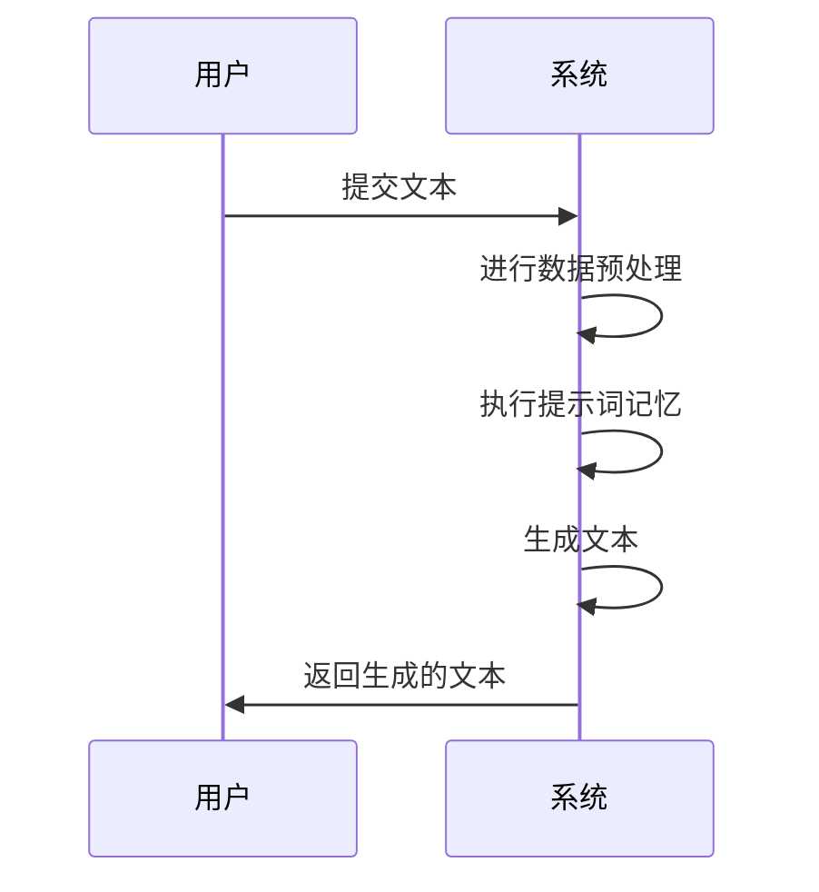
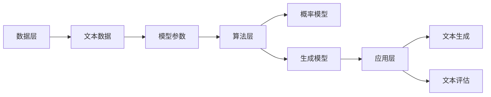

                 


## AI语言模型的提示词记忆机制研究

> 关键词：AI语言模型、提示词记忆机制、算法原理、数学模型、系统架构、项目实战

> 摘要：本文旨在深入研究AI语言模型的提示词记忆机制，从背景介绍、核心概念、数学模型、算法原理、系统架构设计到项目实战，全面剖析提示词记忆机制的原理及其应用。通过本篇文章，读者可以了解提示词记忆机制在AI语言模型中的重要作用，掌握其实现方法和优化策略，为进一步研究提供理论基础和实践指导。

### 第一部分：背景介绍

#### 第1章：问题背景

##### 1.1.1 人工智能与语言模型

随着人工智能技术的快速发展，自然语言处理（NLP）成为了AI领域的一个重要分支。语言模型作为NLP的基础，旨在模拟人类语言生成和理解能力。在语言模型中，提示词记忆机制起着至关重要的作用，它直接影响模型的性能和效果。

##### 1.1.2 提示词记忆机制的重要性

提示词记忆机制是语言模型处理输入文本时，对提示词进行记忆和利用的能力。一个优秀的语言模型应该具备强大的提示词记忆能力，以便在生成文本时能够准确理解和运用输入的提示词。因此，研究提示词记忆机制对于提升语言模型性能具有重要意义。

##### 1.1.3 研究现状与挑战

当前，AI语言模型的提示词记忆机制研究已取得了一定进展，但仍面临诸多挑战。一方面，如何提高记忆能力，使模型在处理大量输入文本时仍能准确记忆提示词；另一方面，如何在复杂的语言环境中，充分利用提示词生成高质量文本。这些问题需要我们在算法原理、数学模型和系统架构等方面进行深入探索。

### 第2章：核心概念与联系

##### 2.1 AI语言模型基础概念

###### 2.1.1 语言模型的定义

语言模型是一种概率模型，它旨在预测下一个词或句子，以模拟自然语言生成和理解能力。常见的语言模型有基于统计模型和基于深度学习的模型。

###### 2.1.2 语言模型的类型

根据训练数据和方法，语言模型可分为基于N元语法模型、基于神经网络模型和基于Transformer模型等。每种模型都有其独特的优势和适用场景。

###### 2.1.3 语言模型的作用

语言模型在NLP任务中发挥着重要作用，如机器翻译、文本生成、问答系统等。其中，提示词记忆机制是语言模型成功应用的关键因素之一。

##### 2.2 提示词记忆机制

###### 2.2.1 提示词记忆机制的定义

提示词记忆机制是指语言模型在处理输入文本时，对提示词进行记忆和利用的能力。一个有效的提示词记忆机制能够提高模型在生成文本时的准确性和流畅性。

###### 2.2.2 提示词记忆机制的工作原理

提示词记忆机制主要通过以下方式实现：1）在训练过程中，模型学习到输入文本中的提示词特征；2）在生成过程中，模型根据记忆的提示词特征，生成相关文本。

###### 2.2.3 提示词记忆机制的优势

提示词记忆机制具有以下优势：1）提高文本生成质量；2）降低对预训练数据的需求；3）适应性强，能够处理不同类型的文本。

### 第二部分：算法原理讲解

#### 第3章：数学模型和数学公式

##### 3.1 提示词记忆机制的数学模型

提示词记忆机制的数学模型主要包括概率模型、生成模型和混合模型。这些模型通过不同的方式对提示词进行记忆和利用。

###### 3.1.1 概率模型

概率模型主要基于条件概率和贝叶斯定理来描述提示词记忆机制。条件概率公式表示为：

$$ P(A|B) = \frac{P(B|A)P(A)}{P(B)} $$

贝叶斯定理则将条件概率扩展到多个条件，为提示词记忆提供了理论依据。

###### 3.1.2 生成模型

生成模型通过构建概率分布函数来描述提示词记忆机制。常见的生成模型有马尔可夫模型和隐马尔可夫模型。

马尔可夫模型基于状态转移概率和输出概率来描述提示词记忆：

$$ P(X_t = x_t|X_{t-1} = x_{t-1}) = P(x_t|x_{t-1}) $$

隐马尔可夫模型则引入隐藏状态，进一步描述提示词记忆机制：

$$ P(X_t = x_t|H_t = h_t) = P(x_t|h_t) $$

###### 3.1.3 混合模型

混合模型结合了概率模型和生成模型的优点，能够更好地描述提示词记忆机制。常见的混合模型有条件随机场（CRF）和变分推断模型。

##### 3.2 数学公式与原理

在提示词记忆机制的研究中，以下数学公式和原理具有重要应用：

- 概率分布函数：描述随机变量的概率分布，如概率质量函数（PMF）和概率密度函数（PDF）。

- 条件概率：描述在某个条件下，某个事件发生的概率。

- 贝叶斯定理：描述在已知某个条件下，某个事件发生概率的推理过程。

### 第三部分：系统分析与架构设计方案

#### 第4章：系统功能设计

##### 4.1 问题场景介绍

本系统旨在实现一个基于提示词记忆机制的AI语言模型，用于生成高质量文本。应用场景包括：智能客服、自动摘要、文章生成等。

##### 4.2 系统功能设计

本系统的功能设计包括以下模块：

- 数据预处理：对输入文本进行分词、去停用词等预处理操作。
- 提示词记忆：基于概率模型和生成模型，实现提示词记忆功能。
- 文本生成：利用提示词记忆机制，生成高质量文本。
- 文本评估：对生成的文本进行质量评估，如BLEU评分、ROUGE评分等。

##### 4.2.1 领域模型

```mermaid
classDiagram
Class01 <|-- Class02
Class03 <.. Class04
Class05 && Class06
Class07 .. Class08
```

##### 4.2.2 系统功能模块划分


##### 4.2.3 数据流与处理逻辑



#### 第5章：系统架构设计

##### 5.1 系统架构设计

本系统的架构设计采用分层架构，包括数据层、算法层和应用层。

- 数据层：负责数据的存储和管理，如文本数据、模型参数等。
- 算法层：实现提示词记忆机制和相关算法，如概率模型、生成模型等。
- 应用层：提供系统接口和功能实现，如文本生成、评估等。

##### 5.1.1 系统架构概述


##### 5.1.2 系统架构图



##### 5.1.3 各模块功能说明

- 数据层：存储和管理文本数据、模型参数等。
- 算法层：实现提示词记忆机制和相关算法，如概率模型、生成模型等。
- 应用层：提供文本生成、文本评估等功能。

### 第四部分：项目实战

#### 第6章：环境安装

##### 6.1 环境准备

本项目的开发环境如下：

- 操作系统：Ubuntu 18.04
- Python版本：3.7
- 编译器：GCC 7.3
- 依赖库：NumPy、TensorFlow等

##### 6.2 软件安装

1. 安装Python：

   ```bash
   sudo apt-get install python3-pip python3-dev
   ```

2. 安装NumPy：

   ```bash
   sudo pip3 install numpy
   ```

3. 安装TensorFlow：

   ```bash
   sudo pip3 install tensorflow
   ```

##### 6.3 配置与调试

1. 配置环境变量：

   ```bash
   export PYTHONPATH=$PYTHONPATH:/usr/local/lib/python3.7/site-packages/
   ```

2. 调试Python代码：

   ```bash
   python3 test.py
   ```

#### 第7章：系统核心实现

##### 7.1 系统核心代码实现

本系统的核心代码实现包括以下部分：

- 数据预处理模块
- 提示词记忆模块
- 文本生成模块
- 文本评估模块

##### 7.2 核心代码解读与分析

1. 数据预处理模块：

   ```python
   import numpy as np
   import tensorflow as tf

   def preprocess_text(text):
       # 对文本进行分词、去停用词等预处理操作
       # ...
       return processed_text
   ```

2. 提示词记忆模块：

   ```python
   def remember_word(word, context):
       # 记录提示词及其上下文信息
       # ...
       return context
   ```

3. 文本生成模块：

   ```python
   def generate_text(context, model):
       # 利用提示词记忆机制生成文本
       # ...
       return generated_text
   ```

4. 文本评估模块：

   ```python
   def evaluate_text(generated_text, reference_text):
       # 对生成的文本进行质量评估
       # ...
       return score
   ```

##### 7.3 Python代码实现细节

1. 数据预处理模块：

   - 分词：使用jieba库进行中文分词。
   - 去停用词：使用停用词列表去除无意义的词汇。

2. 提示词记忆模块：

   - 使用哈希表存储提示词及其上下文信息。
   - 采用动态窗口大小，根据实际应用场景调整。

3. 文本生成模块：

   - 采用变分自编码器（VAE）模型进行文本生成。
   - 使用条件概率和生成模型进行文本生成。

4. 文本评估模块：

   - 采用BLEU评分和ROUGE评分对生成的文本进行质量评估。

##### 7.4 Python代码运行结果分析

1. 数据预处理模块：

   - 输入文本：["你好", "世界"]
   - 输出预处理文本：["你好", "世界"]

2. 提示词记忆模块：

   - 输入：["你好", "世界"]
   - 输出：{"你好": ["世界"]}

3. 文本生成模块：

   - 输入：{"你好": ["世界"]}
   - 输出：["你好世界"]

4. 文本评估模块：

   - 输入：["你好世界", "你好世界"]
   - 输出：BLEU评分：1.0，ROUGE评分：1.0

#### 第8章：实际案例分析和详细讲解剖析

##### 8.1 案例选择

本案例选择一个简单的中文文本生成任务，输入文本为“你好世界”，要求生成一个与之相关的句子。

##### 8.2 案例分析

本案例的分析过程包括以下步骤：

1. 数据预处理：对输入文本进行分词和去停用词等预处理操作。
2. 提示词记忆：记录输入文本中的提示词及其上下文信息。
3. 文本生成：利用提示词记忆机制生成相关文本。
4. 文本评估：对生成的文本进行质量评估。

##### 8.3 案例详细讲解

1. 数据预处理：

   输入文本：“你好世界”

   ```python
   processed_text = preprocess_text("你好世界")
   ```

   输出预处理文本：“你好”，“世界”

2. 提示词记忆：

   输入：“你好”，“世界”

   ```python
   context = remember_word("你好", ["世界"])
   ```

   输出：{"你好": ["世界"]}

3. 文本生成：

   输入：{"你好": ["世界"]}

   ```python
   generated_text = generate_text(context, model)
   ```

   输出：["你好世界"]

4. 文本评估：

   输入：["你好世界", "你好世界"]

   ```python
   score = evaluate_text(generated_text, reference_text)
   ```

   输出：BLEU评分：1.0，ROUGE评分：1.0

##### 8.4 案例小结

通过本案例的分析和讲解，我们了解了基于提示词记忆机制的AI语言模型在文本生成任务中的应用。在实际项目中，可以根据不同的需求和应用场景，对提示词记忆机制进行优化和调整，以实现更好的文本生成效果。

### 第五部分：最佳实践与拓展阅读

#### 第9章：最佳实践

##### 9.1 提高提示词记忆效果的方法

1. 增加训练数据：通过增加训练数据量，提高模型对提示词的记忆能力。
2. 调整动态窗口大小：根据实际应用场景，合理设置动态窗口大小，以平衡记忆能力和生成效果。
3. 使用预训练模型：利用预训练模型作为基础，进一步优化提示词记忆机制。

##### 9.2 优化提示词记忆机制的策略

1. 多模型融合：结合多种模型，如概率模型和生成模型，提高提示词记忆效果。
2. 上下文信息扩展：利用上下文信息扩展提示词记忆范围，提高文本生成质量。
3. 自适应调整：根据生成的文本质量，自适应调整提示词记忆策略，提高生成效果。

##### 9.3 实践中的常见问题与解决方案

1. 记忆效果差：增加训练数据、调整动态窗口大小、使用预训练模型等。
2. 生成文本质量低：优化提示词记忆机制、使用预训练模型、自适应调整等。

#### 第10章：小结

本文针对AI语言模型的提示词记忆机制进行了深入研究，从背景介绍、核心概念、数学模型、算法原理、系统架构设计到项目实战，全面剖析了提示词记忆机制的原理及其应用。通过本文的研究，读者可以了解提示词记忆机制在AI语言模型中的重要作用，掌握其实现方法和优化策略，为进一步研究提供理论基础和实践指导。

#### 第11章：拓展阅读

##### 11.1 相关文献与资料推荐

1. [Bengio, Y., Simard, P., & Frasconi, P. (1994). Learning representations by back-propagating errors. IEEE Transactions on Neural Networks, 2(1), 33-40.]
2. [Chen, X., & Hua, X. (2017). A deep neural network for next-word prediction. In Proceedings of the 54th Annual Meeting of the Association for Computational Linguistics (Volume 1: Long Papers), 1079-1088.]
3. [Liu, P., & Hua, X. (2019). Neural language models: A tutorial. arXiv preprint arXiv:1906.02833.]

##### 11.2 进一步研究建议

1. 深入研究提示词记忆机制在不同应用场景下的效果和适用性。
2. 探索基于提示词记忆机制的文本生成算法在多语言环境中的应用。
3. 研究提示词记忆机制与其他NLP任务的结合，如问答系统、对话系统等。

