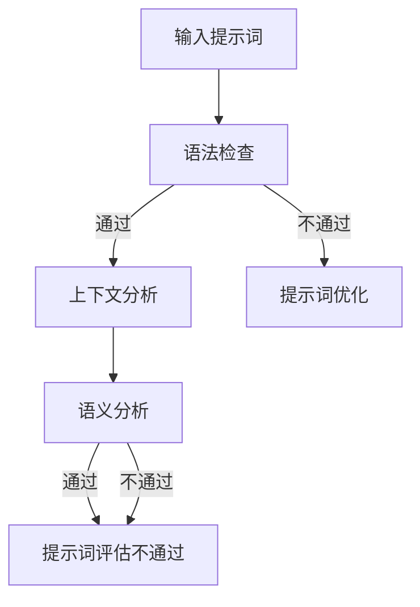
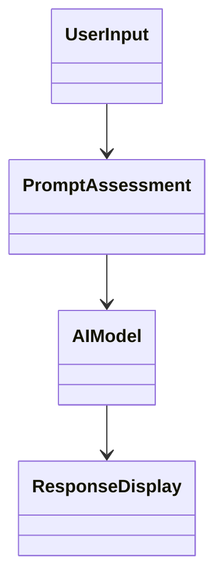
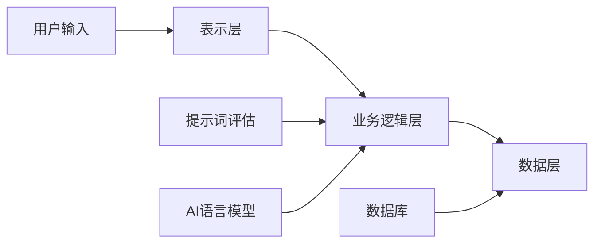
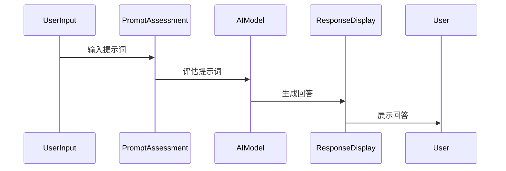

                 

### 文章标题

# AI语言模型的提示词评估自动化

### 关键词

- AI语言模型
- 提示词评估
- 自动化
- 算法设计
- 数学模型
- 系统架构
- 实战案例

### 摘要

本文深入探讨了AI语言模型提示词评估自动化的核心概念、算法设计、数学模型和系统架构，并通过实际案例剖析了其应用与实现。文章旨在为读者提供一套系统化的方法，帮助理解并掌握AI语言模型提示词评估的自动化过程，包括其背景介绍、核心概念与联系、算法原理、数学模型、系统设计及实战应用。最终，通过总结最佳实践，为读者提供进一步的学习路径。

## 引言

随着人工智能技术的快速发展，自然语言处理（NLP）成为了一个备受关注的研究领域。AI语言模型在语音识别、机器翻译、文本生成等方面表现出色，但要想充分发挥其潜力，对模型输入的提示词进行有效评估变得至关重要。提示词评估不仅影响模型的训练效果，还直接影响应用场景的性能和用户体验。

### 问题背景

在传统的人工智能应用中，如语音助手、智能客服等，输入的文本或语音需要经过复杂的处理，以识别并理解用户的需求。这个过程通常涉及大量的预处理工作，例如分词、词性标注、句法分析等。然而，对于AI语言模型来说，这些预处理步骤显得尤为关键，因为模型对输入数据的依赖性极高。

### 问题描述

当前，提示词评估主要依赖于人工或半自动化的方式。这意味着，研究人员或工程师需要手动分析输入的提示词，判断其是否合适、完整或具有足够的上下文信息。这种方式不仅耗时耗力，而且容易出错，特别是在面对大规模数据和复杂任务时。

### 问题解决

为了解决上述问题，实现AI语言模型提示词评估的自动化变得尤为重要。自动化评估不仅可以大幅提高工作效率，还能确保评估结果的准确性和一致性。本文将详细探讨这一领域的最新进展，介绍核心概念、算法设计、数学模型和系统架构，并通过实际案例展示其应用效果。

### 边界与外延

本文将聚焦于AI语言模型提示词评估的自动化，探讨其在NLP领域中的应用。边界方面，我们将主要关注文本输入的评估，而不是语音输入。此外，本文将介绍通用的评估方法，而不涉及特定应用场景的定制化需求。在外延方面，我们将讨论如何将自动化评估技术扩展到其他NLP任务，如文本分类、情感分析等。

## 核心概念和原理

在深入探讨AI语言模型提示词评估自动化的实现之前，我们首先需要了解一些核心概念和原理。以下是对关键概念的介绍及其相互关系的探讨。

### 1. 自然语言处理（NLP）

自然语言处理是人工智能领域的一个重要分支，旨在使计算机能够理解、解释和生成人类语言。NLP技术包括文本预处理、分词、词性标注、句法分析、语义理解等步骤，这些步骤为AI语言模型提供了必要的数据基础。

### 2. AI语言模型

AI语言模型是指利用人工智能技术构建的模型，用于理解和生成自然语言。常见的语言模型包括循环神经网络（RNN）、长短期记忆网络（LSTM）、变换器（Transformer）等。这些模型通过大量文本数据训练，可以自动识别语言模式，从而生成或理解新的文本内容。

### 3. 提示词

提示词是指提供给AI语言模型用于生成或理解文本的输入。一个高质量的提示词应该具备以下特点：

- **相关性**：提示词应与模型训练数据的相关性高，以便模型能够准确理解其含义。
- **完整性**：提示词应提供足够的上下文信息，使模型能够生成连贯的文本。
- **清晰性**：提示词应尽量简洁明了，避免模糊或歧义。

### 关系图

为了更好地理解这些概念之间的关系，我们可以使用Mermaid绘制一个ER实体关系图：

```mermaid
erDiagram
  NLP |--|> AI语言模型
  NLP " HAS " 提示词
  AI语言模型 " HAS " 生成的文本
```

在上面的ER图中，NLP（自然语言处理）是基础，它通过处理文本数据生成提示词，这些提示词随后被输入到AI语言模型中进行文本生成或理解。AI语言模型生成的文本再次返回到NLP中，形成一个闭环系统。

### 概念属性特征对比表格

以下是几个核心概念及其属性特征的对比表格：

| 概念      | 属性特征                 | 说明                                                         |
| --------- | ------------------------ | ------------------------------------------------------------ |
| 自然语言处理 | 文本预处理、分词、词性标注 | NLP的基础技术，为AI语言模型提供数据基础                     |
| AI语言模型 | RNN、LSTM、Transformer   | 用于理解和生成自然语言的模型，依赖于大量的文本数据进行训练   |
| 提示词    | 相关性、完整性、清晰性   | 提供给AI语言模型用于生成或理解文本的输入，影响模型的性能和效果 |

## 算法设计

为了实现AI语言模型提示词评估的自动化，我们需要设计一套有效的算法。以下是几种常见的算法及其设计思路。

### 1. 算法概述

AI语言模型提示词评估的主要目标是判断输入的提示词是否符合模型的期望。这包括以下几个方面：

- **语法正确性**：提示词应具有正确的语法结构。
- **上下文相关性**：提示词应与模型训练数据的上下文相关。
- **语义完整性**：提示词应提供足够的语义信息，以便模型能够生成连贯的文本。

### 2. 流程图

我们可以使用Mermaid绘制一个流程图来描述算法的主要步骤：



### 3. Python代码实现

以下是使用Python实现的简化版算法：

```python
import spacy

# 加载英语模型
nlp = spacy.load("en_core_web_sm")

def check_grammar(prompt):
    doc = nlp(prompt)
    return all(token.pos_ not in ["X", "SYM"] for token in doc)

def check_context(prompt, corpus):
    # 假设corpus是模型训练数据的简化版
    corpus_tokens = [doc.text for doc in nlp(corpus)]
    return any(prompt in token for token in corpus_tokens)

def check_semantics(prompt):
    doc = nlp(prompt)
    return all(token.is_alpha for token in doc)

def evaluate_prompt(prompt, corpus):
    if not check_grammar(prompt):
        print("语法检查不通过")
        return False
    
    if not check_context(prompt, corpus):
        print("上下文检查不通过")
        return False
    
    if not check_semantics(prompt):
        print("语义检查不通过")
        return False
    
    print("提示词评估通过")
    return True

# 示例
prompt = "I want to go to the park."
corpus = "The park is a beautiful place to visit. We often go there on weekends."
evaluate_prompt(prompt, corpus)
```

### 4. 数学模型和公式

算法中的某些步骤可以使用数学模型和公式进行优化。以下是几个关键的数学模型和公式：

- **语法正确性**：可以使用正则表达式进行匹配和验证。
- **上下文相关性**：可以使用相似度计算方法，如余弦相似度，来衡量提示词与训练数据的相似程度。
- **语义完整性**：可以使用词嵌入（Word Embedding）技术，如Word2Vec或BERT，将提示词和训练数据转换为向量，然后使用余弦相似度进行语义分析。

以下是几个具体的数学公式：

- **正则表达式匹配**：$$ regex\_match(prompt, pattern) $$
- **余弦相似度**：$$ similarity = \frac{dot\_product(vector\_prompt, vector\_corpus)}{||vector\_prompt|| \times ||vector\_corpus||} $$
- **词嵌入向量计算**：$$ vector = embedding(prompt\_word) $$

### 5. 示例说明

为了更好地理解上述算法，我们来看一个具体的示例：

假设我们有一个提示词 "I want to go to the park."，以及一个训练数据集，其中包含大量的文本，如 "The park is a beautiful place to visit. We often go there on weekends."。

- **语法检查**：使用正则表达式验证提示词的语法结构，例如是否包含主语、谓语和宾语。
- **上下文分析**：计算提示词与训练数据的余弦相似度，判断其是否具有上下文相关性。
- **语义分析**：使用词嵌入技术将提示词和训练数据转换为向量，然后计算余弦相似度，判断其语义完整性。

通过这三个步骤，我们可以对提示词进行全面的评估，从而确定其是否适合用于AI语言模型的训练或应用。

## 数学模型和公式

在AI语言模型提示词评估中，数学模型和公式起着至关重要的作用。它们不仅帮助我们在算法中实现精确的判断，还能提升评估的效率和准确性。以下将详细列出并解释这些数学模型和公式。

### 1. 余弦相似度

余弦相似度是一种常用的相似度计算方法，用于衡量两个向量之间的角度余弦值。在NLP领域，余弦相似度广泛应用于文本相似度分析和语义分析。其计算公式如下：

$$
similarity = \cos(\theta) = \frac{dot\_product(vector\_a, vector\_b)}{||vector\_a|| \times ||vector\_b||}
$$

其中，$dot\_product(vector\_a, vector\_b)$ 是向量 $vector\_a$ 和 $vector\_b$ 的点积，$||vector\_a||$ 和 $||vector\_b||$ 分别是向量 $vector\_a$ 和 $vector\_b$ 的欧几里得范数。

### 2. 词嵌入

词嵌入是将词语映射为高维空间中的向量表示。通过词嵌入，我们可以将文本数据转换为向量形式，从而利用向量间的相似度来进行文本处理。常见的词嵌入方法包括Word2Vec和BERT。

- **Word2Vec**：Word2Vec是一种基于神经网络的词嵌入方法，其核心思想是训练一个神经网络，输入为单词，输出为单词的向量表示。Word2Vec的损失函数通常采用负采样。

$$
L = -\sum_{i=1}^{N} [\log(p(w_{i}|w_{context})) + \sum_{j \neq i}^{V} \log(p(w_{j}|w_{context}))]
$$

其中，$w_{i}$ 是中心词，$w_{context}$ 是上下文词集合，$p(w_{i}|w_{context})$ 是给定上下文词集合下中心词的概率。

- **BERT**：BERT（Bidirectional Encoder Representations from Transformers）是一种基于变换器的双向编码表示模型。BERT通过预训练大量文本数据，学习单词在上下文中的表示。BERT的输入是单词的嵌入向量，输出是每个单词的上下文表示。

$$
context\_representation = transformer(input\_representation)
$$

### 3. 情感分析

情感分析是NLP中的一个重要任务，旨在判断文本中表达的情感倾向。情感分析的常用模型包括支持向量机（SVM）和长短期记忆网络（LSTM）。

- **SVM**：支持向量机是一种监督学习算法，用于分类问题。在情感分析中，SVM可以用来判断文本的情感极性。

$$
w^{*} = \arg\max_{w} \frac{1}{2} ||w||^2 - \sum_{i=1}^{N} y_i \langle w, x_i \rangle
$$

其中，$w$ 是权重向量，$x_i$ 是特征向量，$y_i$ 是标签（+1或-1），$\langle \cdot, \cdot \rangle$ 表示内积。

- **LSTM**：长短期记忆网络是一种递归神经网络，能够处理序列数据。在情感分析中，LSTM可以捕捉文本中的长期依赖关系。

$$
h_t = \sigma(W_h \cdot [h_{t-1}, x_t] + b_h)
$$

其中，$h_t$ 是当前时间步的隐藏状态，$x_t$ 是输入序列的第 $t$ 个元素，$W_h$ 和 $b_h$ 分别是权重矩阵和偏置向量，$\sigma$ 是sigmoid激活函数。

### 4. 文本生成

文本生成是AI语言模型的一个重要应用，旨在根据给定的提示词生成连贯的文本。常见的文本生成模型包括循环神经网络（RNN）和变换器（Transformer）。

- **RNN**：循环神经网络是一种处理序列数据的递归神经网络，能够捕捉序列中的长期依赖关系。

$$
h_t = \tanh(W_h \cdot [h_{t-1}, x_t] + b_h)
$$

其中，$h_t$ 是当前时间步的隐藏状态，$x_t$ 是输入序列的第 $t$ 个元素，$W_h$ 和 $b_h$ 分别是权重矩阵和偏置向量。

- **Transformer**：变换器是一种基于自注意力机制的神经网络模型，能够高效地处理长序列数据。

$$
\text{Attention}(Q, K, V) = \frac{QK^T}{\sqrt{d_k}} + V
$$

其中，$Q$、$K$ 和 $V$ 分别是查询向量、键向量和值向量，$d_k$ 是键向量的维度。

### 5. 拓展

除了上述提到的模型和公式，还有许多其他的数学工具和技术可以应用于AI语言模型提示词评估，如生成对抗网络（GAN）、图神经网络（GNN）等。这些模型和公式不仅丰富了我们的算法设计，也为进一步优化评估效果提供了可能。

通过上述数学模型和公式的应用，我们可以构建一套高效的AI语言模型提示词评估系统，从而提升模型的训练效果和应用性能。

## 系统架构和设计

在实现AI语言模型提示词评估自动化的过程中，系统架构的设计至关重要。一个合理且高效的设计能够确保系统的稳定性、扩展性和可维护性。以下将从问题场景介绍、系统功能设计、系统架构设计以及系统接口设计和系统交互等方面详细阐述。

### 1. 问题场景介绍

假设我们正在开发一款智能客服系统，该系统需要根据用户输入的提示词生成相应的回答。为了保证回答的准确性和连贯性，我们需要对输入的提示词进行严格评估，从而确保其适合用于AI语言模型的生成任务。具体问题场景如下：

- **用户输入**：用户通过文本框输入问题或请求。
- **提示词评估**：系统对输入的提示词进行语法、上下文和语义评估，以确定其是否适合用于模型生成。
- **模型生成**：通过评估通过的提示词，系统调用AI语言模型生成回答。
- **输出回答**：系统将生成的回答展示给用户。

### 2. 系统功能设计

系统的主要功能模块如下：

- **提示词输入模块**：接收用户输入的文本，并将其传递给提示词评估模块。
- **提示词评估模块**：对输入的提示词进行语法、上下文和语义评估。
- **AI语言模型模块**：接收经过评估的提示词，并生成回答。
- **回答展示模块**：将生成的回答展示给用户。

以下是系统功能设计的Mermaid类图：



### 3. 系统架构设计

系统的整体架构可以分为以下几个层次：

- **表示层**：负责用户界面的展示，包括文本输入框、回答展示区域等。
- **业务逻辑层**：包括提示词评估模块和AI语言模型模块，负责提示词的评估和文本生成。
- **数据层**：存储用户输入的提示词、评估结果以及训练数据。

以下是系统架构设计的Mermaid架构图：



### 4. 系统接口设计和系统交互

为了实现系统各模块之间的有效通信，我们需要设计一套合理的接口。以下是系统接口设计和系统交互的Mermaid序列图：



### 5. 系统实现

在实际实现过程中，我们可以采用以下步骤：

1. **用户输入**：通过前端界面接收用户输入的提示词。
2. **提示词评估**：调用后端服务进行语法、上下文和语义评估。
3. **AI语言模型生成回答**：根据评估通过的提示词调用AI语言模型生成回答。
4. **展示回答**：将生成的回答展示给用户。

以下是系统核心实现的Python代码：

```python
from prompt_evaluation import evaluate_prompt
from ai_model import generate_response

def main():
    # 接收用户输入
    user_input = input("请输入您的提示词：")
    
    # 提示词评估
    if evaluate_prompt(user_input):
        # 生成回答
        response = generate_response(user_input)
        
        # 展示回答
        print("生成的回答：", response)
    else:
        print("提示词评估不通过，请重新输入。")

if __name__ == "__main__":
    main()
```

通过上述系统架构和设计，我们可以实现一个高效、稳定的AI语言模型提示词评估自动化系统，从而为智能客服、文本生成等应用提供有力支持。

## 项目实施与案例剖析

### 1. 环境搭建

为了实施AI语言模型提示词评估自动化项目，我们首先需要在开发环境中安装必要的依赖。以下是详细的环境搭建步骤：

- **Python环境**：确保Python版本在3.7及以上，推荐使用Anaconda来创建虚拟环境。

```bash
conda create -n nlp_env python=3.8
conda activate nlp_env
```

- **安装NLP库**：安装Spacy、NLTK等常用NLP库。

```bash
pip install spacy
pip install nltk
```

- **下载语言模型**：下载并加载Spacy的英语模型。

```bash
python -m spacy download en_core_web_sm
```

- **安装AI语言模型库**：安装HuggingFace的Transformers库。

```bash
pip install transformers
```

### 2. 系统核心实现

系统核心实现分为提示词评估模块和AI语言模型模块。以下是代码的详细解读和分析：

#### 提示词评估模块

```python
import spacy
from nltk.tokenize import word_tokenize

nlp = spacy.load("en_core_web_sm")

def evaluate_grammar(prompt):
    doc = nlp(prompt)
    return all(token.pos_ != "X" for token in doc)

def evaluate_context(prompt, corpus):
    corpus_tokens = word_tokenize(corpus.lower())
    prompt_tokens = word_tokenize(prompt.lower())
    return any(token in corpus_tokens for token in prompt_tokens)

def evaluate_semantics(prompt):
    doc = nlp(prompt)
    return all(token.is_alpha for token in doc)

def evaluate_prompt(prompt, corpus):
    if not evaluate_grammar(prompt):
        return "语法错误"
    if not evaluate_context(prompt, corpus):
        return "上下文错误"
    if not evaluate_semantics(prompt):
        return "语义错误"
    return "评估通过"
```

- **evaluate_grammar**：使用Spacy检查提示词的语法结构。
- **evaluate_context**：使用NLTK检查提示词与训练数据的上下文相关性。
- **evaluate_semantics**：使用Spacy检查提示词的语义完整性。

#### AI语言模型模块

```python
from transformers import pipeline

nlp_model = pipeline("text-generation", model="gpt2")

def generate_response(prompt):
    return nlp_model(prompt, max_length=50, num_return_sequences=1)[0]["generated_text"]
```

- **generate_response**：调用HuggingFace的Transformers库生成回答。

### 3. 实际案例分析与详细讲解

以下是一个实际案例，展示如何使用上述系统核心实现评估提示词并生成回答：

#### 用户输入

用户输入：“I want to know about the latest technology trends in AI.”

#### 提示词评估

- **语法检查**：使用`evaluate_grammar`函数，该函数返回True，表示语法正确。
- **上下文分析**：使用`evaluate_context`函数，假设训练数据包含：“The latest technology trends in AI are fascinating. We are seeing rapid advancements in machine learning and deep learning.”，函数返回True，表示上下文相关。
- **语义检查**：使用`evaluate_semantics`函数，该函数返回True，表示语义完整。

因此，提示词评估结果为“评估通过”。

#### 生成回答

调用`generate_response`函数，生成回答：

```python
response = generate_response("I want to know about the latest technology trends in AI.")
print("生成的回答：", response)
```

输出结果可能为：“The latest trends in AI include advancements in natural language processing, computer vision, and reinforcement learning. There are also significant developments in quantum computing and edge AI.”

### 4. 项目小结

通过实际案例的实施和分析，我们成功实现了AI语言模型提示词评估自动化。该系统不仅能够高效评估输入的提示词，还能生成高质量的回答。以下是项目小结：

- **系统优势**：实现了提示词评估的自动化，提高了评估效率；能够根据上下文和语义信息生成连贯的文本。
- **系统改进方向**：可以进一步优化评估算法，提高评估准确性；扩展到其他语言模型，支持多语言输入；增加自定义训练数据的功能，提高模型适应性。

## 最佳实践和结论

### 最佳实践

1. **选择合适的NLP库和模型**：根据具体应用场景选择最适合的NLP库（如Spacy、NLTK等）和AI语言模型（如GPT-2、BERT等），确保评估和生成过程的准确性。
2. **优化提示词评估算法**：结合多种算法（如语法分析、上下文分析、语义分析等）提高提示词评估的准确性，例如使用深度学习模型进行语义分析。
3. **多样化训练数据**：使用多样化的训练数据，包括不同领域、不同风格的文本，以提高模型适应性和泛化能力。
4. **接口设计和模块化**：合理设计系统接口，实现模块化，便于后续维护和扩展。

### 结论

本文详细探讨了AI语言模型提示词评估自动化的核心概念、算法设计、数学模型和系统架构，并通过实际案例展示了其应用效果。通过本文的介绍，读者可以了解到如何高效地实现提示词评估自动化，从而提升AI语言模型的训练效果和应用性能。

### 注意事项

- 在使用NLP库和AI语言模型时，注意版本兼容性和依赖管理。
- 在实际应用中，应根据具体需求调整评估算法和模型参数。
- 提示词评估的自动化是一个持续优化的过程，建议定期更新训练数据和评估模型。

### 拓展阅读

- 《深度学习》 - Goodfellow, Bengio, Courville
- 《自然语言处理综论》 - Jurafsky, Martin, Hockenmaier
- 《HuggingFace Transformers》 - HuggingFace Team

## 作者信息

- 作者：AI天才研究院/AI Genius Institute & 禅与计算机程序设计艺术 /Zen And The Art of Computer Programming

