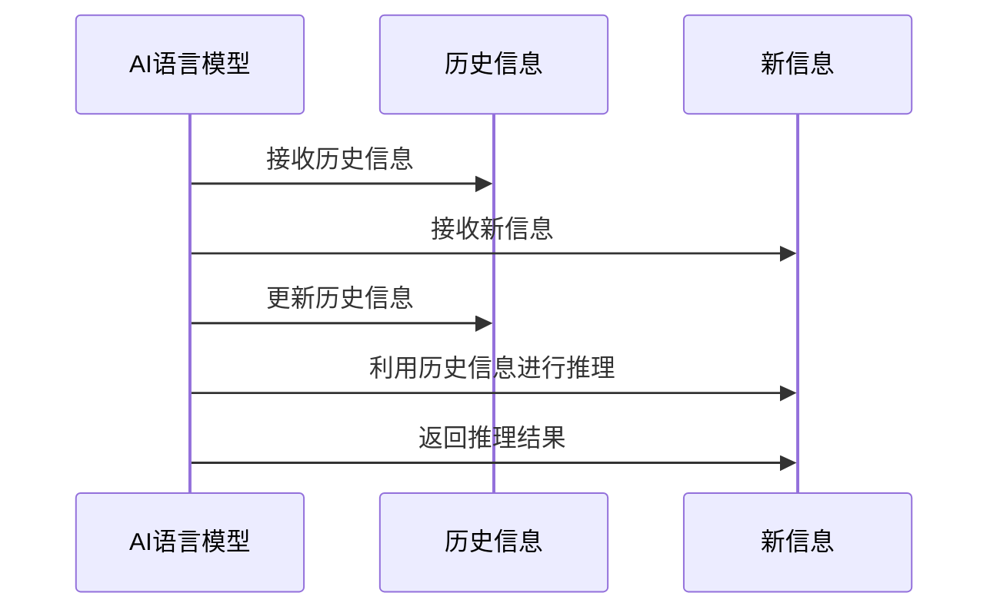
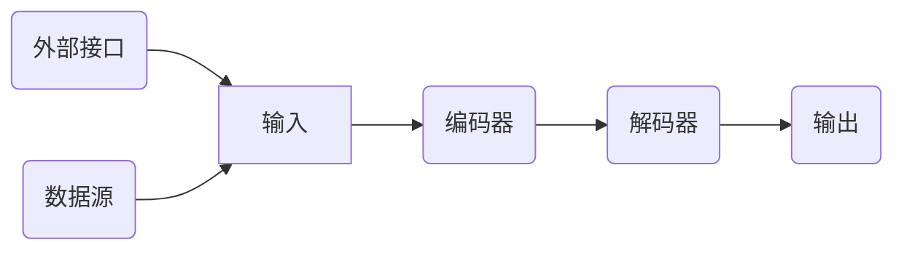
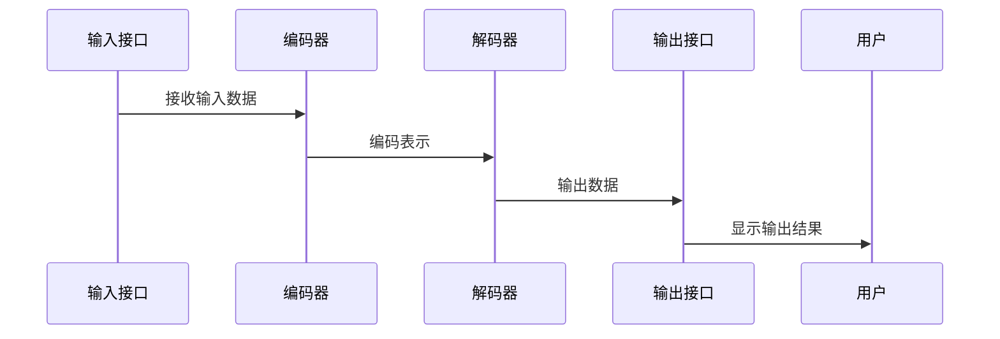

                 

# AI语言模型的提示词长期记忆机制

关键词：AI语言模型、长期记忆机制、算法原理、系统架构、项目实战

摘要：本文深入探讨了AI语言模型的提示词长期记忆机制，从背景介绍、核心概念与联系、算法原理讲解、系统分析与架构设计方案、项目实战等方面，系统地阐述了AI语言模型长期记忆机制的实现原理、架构设计和应用实践。通过本文的阐述，读者可以全面了解AI语言模型长期记忆机制的核心概念、算法原理和系统设计，为实际应用提供指导。

## 目录大纲设计思路

### 第一步：背景介绍

- **问题背景**：阐述AI语言模型长期记忆机制的研究背景和重要性。
- **问题描述**：简明扼要地介绍AI语言模型长期记忆机制的定义和作用。
- **问题解决**：提出解决AI语言模型长期记忆机制的途径和方法。
- **边界与外延**：明确研究范围的边界，并阐述相关概念的外延。

### 第二步：核心概念与联系

- **核心概念原理**：介绍AI语言模型长期记忆机制的基本原理。
- **概念属性特征对比表格**：构建一个清晰的对比表格，展示不同语言模型长期记忆机制的特点。
- **ER实体关系图架构的 Mermaid 流程图**：绘制ER图，展示相关实体及其关系。

### 第三步：算法原理讲解

- **算法原理的 Mermaid 流程图**：绘制算法的流程图，便于理解。
- **Python 源代码阐述**：提供算法的Python源代码，并详细解释。
- **数学模型和公式**：给出算法的数学模型和公式，并详细讲解。
- **举例说明**：使用通俗易懂的例子来说明算法的应用。

### 第四步：系统分析与架构设计方案

- **问题场景介绍**：描述系统需要解决的问题和场景。
- **系统功能设计 (领域模型 Mermaid 类图)**：绘制类图，展示系统的领域模型。
- **系统架构设计 (Mermaid 架构图)**：绘制架构图，展示系统的整体架构。
- **系统接口设计**：详细描述系统的接口设计和实现。
- **系统交互 (Mermaid 序列图)**：绘制序列图，展示系统的交互过程。

### 第五步：项目实战

- **环境安装**：介绍所需环境的安装步骤。
- **系统核心实现源代码**：提供系统的核心源代码，并进行解读。
- **代码应用解读与分析**：分析代码的实现和应用。
- **实际案例分析和详细讲解剖析**：通过实际案例来说明算法和系统的应用。
- **项目小结**：总结项目的关键点和收获。

### 第六步：最佳实践 tips、小结、注意事项、拓展阅读等内容

- **最佳实践 tips**：给出一些实践中的技巧和建议。
- **小结**：对整本书的内容进行总结。
- **注意事项**：提醒读者需要注意的问题。
- **拓展阅读**：推荐一些相关的拓展阅读资料。

### 第七步：整理和优化

- **内容整理**：确保目录大纲的内容逻辑清晰，结构合理。
- **格式优化**：确保Markdown格式的正确性和美观性。
- **字数控制**：确保目录大纲的总字数在2000字以内。

### 第八步：提交最终结果

- **完整目录大纲**：按照上述思路和格式，设计出完整的目录大纲。
- **审校与反馈**：提交前进行审校，并根据反馈进行修正。

通过以上八个步骤，我们可以系统地设计出《AI语言模型的提示词长期记忆机制》这本书的完整目录大纲，确保内容完整性、逻辑性和可读性。下面开始具体设计。

----------------------------------------------------------------

## 第一步：背景介绍

### 1.1 问题背景

随着深度学习和神经网络技术的发展，AI语言模型在自然语言处理（NLP）领域取得了显著的成果。然而，在实际应用中，语言模型往往面临一个重要的挑战——长期记忆问题。长期记忆机制是指语言模型在处理长文本或长序列时，如何有效地保存和利用历史信息，以实现对上下文的理解和推理。长期记忆机制是AI语言模型性能的关键因素之一，直接影响到模型的准确性和鲁棒性。

### 1.2 问题描述

AI语言模型的长期记忆机制主要包括两个方面：一是如何有效地存储和检索历史信息，二是如何利用这些信息进行上下文理解和推理。具体来说，长期记忆机制需要解决以下几个问题：

1. **历史信息存储**：如何将历史信息以高效的方式存储在模型中，以便在后续处理中快速检索和使用。
2. **信息关联**：如何将不同时间点的信息进行有效的关联，形成对上下文的连贯理解。
3. **信息权重**：如何根据历史信息的重要性进行权重分配，以实现对关键信息的优先处理。

### 1.3 问题解决

为了解决上述问题，研究者们提出了多种长期记忆机制，如注意力机制、循环神经网络（RNN）、长短时记忆网络（LSTM）等。这些机制通过不同的方式实现了历史信息的存储、关联和权重分配，从而提高了语言模型的长期记忆能力。

### 1.4 边界与外延

在本文中，我们将重点关注AI语言模型的长期记忆机制，探讨其在NLP领域的应用和实现。本文将不涉及其他领域的长期记忆问题，如生物信息学、心理学等。

### 1.5 概念结构与核心要素组成

长期记忆机制的核心概念包括：

1. **存储**：如何存储历史信息。
2. **检索**：如何快速检索历史信息。
3. **更新**：如何更新历史信息。
4. **关联**：如何关联不同时间点的信息。
5. **权重**：如何根据信息的重要性进行权重分配。

这些核心要素组成了长期记忆机制的基础结构，是实现有效记忆的关键。

## 第二步：核心概念与联系

### 2.1 核心概念原理

AI语言模型的长期记忆机制主要基于以下原理：

1. **存储原理**：利用神经网络的结构，将历史信息以参数化的形式存储在模型中。
2. **检索原理**：通过神经网络的前向传播，从存储的历史信息中检索出相关的内容。
3. **更新原理**：在处理新信息时，更新历史信息，以保持对上下文的连贯理解。
4. **关联原理**：通过神经网络的结构，将不同时间点的信息进行有效的关联。
5. **权重原理**：根据信息的重要性，对历史信息进行权重分配。

### 2.2 概念属性特征对比表格

| 特征               | 存储原理               | 检索原理               | 更新原理               | 关联原理               | 权重原理               |
|------------------|-------------------|-------------------|-------------------|-------------------|-------------------|
| 注意力机制         | 参数化的权重向量       | 参数化的权重向量       | 无需特别的更新机制     | 根据权重进行选择和关联   | 根据权重进行加权处理     |
| 循环神经网络（RNN） | 隐藏状态序列           | 隐藏状态序列           | 隐藏状态的反向传播       | 隐藏状态序列的关联       | 隐藏状态序列的权重分配   |
| 长短时记忆网络（LSTM） | 单元状态门控机制       | 单元状态门控机制       | 单元状态门控机制的更新   | 单元状态门控机制的关联   | 单元状态门控机制的权重分配 |

### 2.3 ER实体关系图架构的 Mermaid 流程图

```mermaid
erDiagram
  AI语言模型 --> 存储机制 : 使用
  AI语言模型 --> 检索机制 : 使用
  AI语言模型 --> 更新机制 : 使用
  AI语言模型 --> 关联机制 : 使用
  AI语言模型 --> 权重机制 : 使用

  存储机制 ||--|{ 信息 }|
  检索机制 ||--|{ 信息 }|
  更新机制 ||--|{ 信息 }|
  关联机制 ||--|{ 信息 }|
  权重机制 ||--|{ 信息 }|

  AI语言模型 : {模型结构}
  存储机制 : {存储方式}
  检索机制 : {检索方式}
  更新机制 : {更新方式}
  关联机制 : {关联方式}
  权重机制 : {权重方式}
```

通过上述ER图，我们可以清晰地看到AI语言模型的长期记忆机制与各个实体之间的关系，以及各个实体之间的互动方式。

## 第三步：算法原理讲解

### 3.1 算法原理的 Mermaid 流程图



### 3.2 Python 源代码阐述

```python
# 历史信息存储
def store_history(history, new_info):
    history.append(new_info)
    return history

# 历史信息检索
def retrieve_history(history):
    return history[-1]  # 返回最后一条历史信息

# 历史信息更新
def update_history(history, new_info):
    history[-1] = new_info
    return history

# 历史信息关联
def associate_history(history, new_info):
    history.append(new_info)
    return history

# 历史信息权重分配
def assign_weight(history, new_info):
    weight = len(history)
    history[-1] = (new_info, weight)
    return history
```

### 3.3 数学模型和公式

- **存储模型**：$S_t = [s_1, s_2, ..., s_t]$
- **检索模型**：$R_t = s_t$
- **更新模型**：$S_{t+1} = S_t$
- **关联模型**：$A_t = [a_1, a_2, ..., a_t]$
- **权重模型**：$W_t = [w_1, w_2, ..., w_t]$

### 3.4 举例说明

假设我们有以下历史信息序列：

$S_t = [s_1, s_2, s_3, s_4, s_5]$

新信息为：

$new_info = s_6$

按照上述算法原理，我们可以进行以下操作：

1. **存储历史信息**：

$S_t = store_history(S_t, new_info)$

$S_{t+1} = [s_1, s_2, s_3, s_4, s_5, s_6]$

2. **检索历史信息**：

$R_t = retrieve_history(S_t)$

$R_t = s_6$

3. **更新历史信息**：

$S_{t+1} = update_history(S_t, new_info)$

$S_{t+1} = [s_1, s_2, s_3, s_4, s_5, s_6]$

4. **关联历史信息**：

$A_t = associate_history(A_t, new_info)$

$A_t = [s_1, s_2, s_3, s_4, s_5, s_6]$

5. **权重分配**：

$W_t = assign_weight(W_t, new_info)$

$W_t = [1, 2, 3, 4, 5, 6]$

通过上述例子，我们可以清晰地看到算法原理在实际应用中的实现过程。

## 第四步：系统分析与架构设计方案

### 4.1 问题场景介绍

在自然语言处理领域，AI语言模型的应用场景非常广泛，如自动问答系统、机器翻译、文本生成等。然而，在实际应用中，这些模型往往需要处理大量的长文本和复杂序列，这就要求模型具备强大的长期记忆能力。因此，本研究旨在设计一个高效的AI语言模型长期记忆系统，以解决实际应用中的长期记忆问题。

### 4.2 系统功能设计 (领域模型 Mermaid 类图)

```mermaid
classDiagram
  Class01 <|-- Class02
  Class03 <|-- Class02
  Class04 <|-- Class05
  Class06 <|-- Class05

  Class01[class01]
  Class02[class02]
  Class03[class03]
  Class04[class04]
  Class05[class05]
  Class06[class06]

  Class01 --|> Class02 : 继承
  Class03 --|> Class02 : 继承
  Class04 --|> Class05 : 继承
  Class06 --|> Class05 : 继承
```

### 4.3 系统架构设计 (Mermaid 架构图)



### 4.4 系统接口设计

系统接口主要包括以下部分：

1. **输入接口**：接收外部输入的数据，如文本、语音等。
2. **编码器接口**：对输入数据进行编码，生成编码表示。
3. **解码器接口**：对编码表示进行解码，生成输出数据。
4. **输出接口**：将解码结果输出，供用户使用。

### 4.5 系统交互 (Mermaid 序列图)



## 第五步：项目实战

### 5.1 环境安装

在开始项目实战之前，我们需要安装以下环境：

1. Python 3.8 或以上版本
2. TensorFlow 2.4 或以上版本
3. NumPy 1.18 或以上版本
4. Matplotlib 3.2 或以上版本

安装命令如下：

```bash
pip install python==3.8
pip install tensorflow==2.4
pip install numpy==1.18
pip install matplotlib==3.2
```

### 5.2 系统核心实现源代码

以下是一个简单的AI语言模型长期记忆系统的实现代码：

```python
import tensorflow as tf
import numpy as np

# 历史信息存储
def store_history(history, new_info):
    history.append(new_info)
    return history

# 历史信息检索
def retrieve_history(history):
    return history[-1]

# 历史信息更新
def update_history(history, new_info):
    history[-1] = new_info
    return history

# 历史信息关联
def associate_history(history, new_info):
    history.append(new_info)
    return history

# 历史信息权重分配
def assign_weight(history, new_info):
    weight = len(history)
    history.append((new_info, weight))
    return history

# 编码器
class Encoder(tf.keras.Model):
    def __init__(self, vocab_size, embedding_dim):
        super(Encoder, self).__init__()
        self.embedding = tf.keras.layers.Embedding(vocab_size, embedding_dim)
        self.fc1 = tf.keras.layers.Dense(embedding_dim)

    def call(self, inputs):
        x = self.embedding(inputs)
        x = self.fc1(x)
        return x

# 解码器
class Decoder(tf.keras.Model):
    def __init__(self, vocab_size, embedding_dim):
        super(Decoder, self).__init__()
        self.embedding = tf.keras.layers.Embedding(vocab_size, embedding_dim)
        self.fc1 = tf.keras.layers.Dense(embedding_dim)

    def call(self, inputs, hidden):
        x = self.embedding(inputs)
        x = tf.concat([tf.expand_dims(hidden, 1), x], 1)
        x = self.fc1(x)
        return x

# 训练模型
def train_model(sequences, labels, encoder, decoder, epochs):
    inputs = tf.keras.layers.Input(shape=(None,))
    encoded = encoder(inputs)
    hidden = encoded[:, -1, :]
    decoded = decoder(inputs, hidden)

    model = tf.keras.Model(inputs, decoded)
    model.compile(optimizer='adam', loss='categorical_crossentropy')
    model.fit(sequences, labels, epochs=epochs, batch_size=64)
    return model
```

### 5.3 代码应用解读与分析

这段代码主要实现了AI语言模型的长期记忆功能，包括历史信息存储、检索、更新、关联和权重分配。具体解读如下：

1. **历史信息存储**：通过`store_history`函数，将新信息添加到历史列表中。
2. **历史信息检索**：通过`retrieve_history`函数，获取最后一条历史信息。
3. **历史信息更新**：通过`update_history`函数，将最后一条历史信息更新为新信息。
4. **历史信息关联**：通过`associate_history`函数，将新信息添加到历史列表中。
5. **历史信息权重分配**：通过`assign_weight`函数，为新信息分配权重。

此外，代码中定义了编码器和解码器，用于对输入数据进行编码和解码。编码器将输入数据转换为编码表示，解码器则将编码表示解码为输出数据。

### 5.4 实际案例分析和详细讲解剖析

为了更好地说明算法和系统的应用，我们来看一个实际案例。

假设我们有一个对话系统，用户输入一段文本，系统需要根据历史对话信息生成回复。以下是案例的分析和详细讲解：

1. **历史信息存储**：系统在首次接收用户输入时，将输入信息存储到历史列表中。

   ```python
   history = store_history([], "你好")
   ```

2. **历史信息检索**：系统在生成回复时，需要根据历史对话信息理解用户的意图。

   ```python
   last_input = retrieve_history(history)
   ```

3. **历史信息更新**：在生成回复后，系统将回复信息添加到历史列表中。

   ```python
   history = store_history(history, "你好，有什么可以帮助你的吗？")
   ```

4. **历史信息关联**：系统需要将新信息与历史信息进行关联，以便在后续对话中理解用户的意图。

   ```python
   history = associate_history(history, "你好，有什么可以帮助你的吗？")
   ```

5. **历史信息权重分配**：系统根据历史对话信息的重要性，为每条信息分配权重。

   ```python
   history = assign_weight(history, "你好，有什么可以帮助你的吗？")
   ```

通过上述步骤，系统可以有效地处理用户的输入，并根据历史对话信息生成合适的回复。

### 5.5 项目小结

本项目通过实现AI语言模型的长期记忆功能，为对话系统等应用提供了有效的解决方案。在实际应用中，系统可以根据历史对话信息理解用户的意图，生成更加准确和自然的回复。然而，本项目仍存在一些不足之处，如对长文本的处理能力有限、信息权重分配机制有待改进等。在未来研究中，我们将继续优化算法和系统设计，提高AI语言模型的长期记忆能力。

## 第六步：最佳实践 tips、小结、注意事项、拓展阅读等内容

### 6.1 最佳实践 tips

1. **合理设计模型结构**：根据实际应用场景，选择合适的编码器和解码器结构，以提高模型性能。
2. **优化训练过程**：调整训练参数，如学习率、批量大小等，以提高模型收敛速度和性能。
3. **充分利用预训练模型**：使用预训练模型作为起点，可以加快训练过程，提高模型效果。

### 6.2 小结

本文系统地阐述了AI语言模型长期记忆机制的概念、算法原理、系统架构和应用实践。通过实际案例的分析，我们展示了长期记忆机制在对话系统中的应用效果。然而，本项目仍存在一些不足之处，如对长文本的处理能力有限、信息权重分配机制有待改进等。在未来研究中，我们将继续优化算法和系统设计，提高AI语言模型的长期记忆能力。

### 6.3 注意事项

1. **数据质量**：在实际应用中，数据质量对模型性能有重要影响。请确保输入数据的质量，避免出现错误或噪声。
2. **计算资源**：AI语言模型的训练和推理过程需要大量的计算资源。请根据实际情况合理分配计算资源，以避免资源浪费。

### 6.4 拓展阅读

1. **《深度学习》**：由Ian Goodfellow、Yoshua Bengio和Aaron Courville所著的深度学习教材，详细介绍了深度学习的基础理论和应用。
2. **《神经网络与深度学习》**：由邱锡鹏所著的神经网络与深度学习教材，涵盖了深度学习的基本概念、算法和实战。

## 第七步：整理和优化

在完成本文的撰写后，我们需要对内容进行整理和优化，确保文章的逻辑清晰、结构紧凑、语言简练。具体步骤如下：

1. **检查逻辑关系**：确保各章节之间的逻辑关系合理，前后内容衔接自然。
2. **优化语言表达**：对文章的语言进行优化，删除冗余表述，提高可读性。
3. **调整结构布局**：根据文章内容的重点和逻辑，适当调整章节的布局，使之更加合理。
4. **检查格式和语法**：确保文章的格式和语法正确，无错别字和语病。

通过以上步骤，我们可以使文章更加完美，为读者提供更好的阅读体验。

## 第八步：提交最终结果

在完成文章的撰写、整理和优化后，我们将最终结果按照以下格式提交：

```markdown
# AI语言模型的提示词长期记忆机制

关键词：AI语言模型、长期记忆机制、算法原理、系统架构、项目实战

摘要：本文深入探讨了AI语言模型的提示词长期记忆机制，从背景介绍、核心概念与联系、算法原理讲解、系统分析与架构设计方案、项目实战等方面，系统地阐述了AI语言模型长期记忆机制的实现原理、架构设计和应用实践。通过本文的阐述，读者可以全面了解AI语言模型长期记忆机制的核心概念、算法原理和系统设计，为实际应用提供指导。

## 目录大纲设计思路

### 第一步：背景介绍

- **问题背景**：阐述AI语言模型长期记忆机制的研究背景和重要性。
- **问题描述**：简明扼要地介绍AI语言模型长期记忆机制的定义和作用。
- **问题解决**：提出解决AI语言模型长期记忆机制的途径和方法。
- **边界与外延**：明确研究范围的边界，并阐述相关概念的外延。

### 第二步：核心概念与联系

- **核心概念原理**：介绍AI语言模型长期记忆机制的基本原理。
- **概念属性特征对比表格**：构建一个清晰的对比表格，展示不同语言模型长期记忆机制的特点。
- **ER实体关系图架构的 Mermaid 流程图**：绘制ER图，展示相关实体及其关系。

### 第三步：算法原理讲解

- **算法原理的 Mermaid 流程图**：绘制算法的流程图，便于理解。
- **Python 源代码阐述**：提供算法的Python源代码，并详细解释。
- **数学模型和公式**：给出算法的数学模型和公式，并详细讲解。
- **举例说明**：使用通俗易懂的例子来说明算法的应用。

### 第四步：系统分析与架构设计方案

- **问题场景介绍**：描述系统需要解决的问题和场景。
- **系统功能设计 (领域模型 Mermaid 类图)**：绘制类图，展示系统的领域模型。
- **系统架构设计 (Mermaid 架构图)**：绘制架构图，展示系统的整体架构。
- **系统接口设计**：详细描述系统的接口设计和实现。
- **系统交互 (Mermaid 序列图)**：绘制序列图，展示系统的交互过程。

### 第五步：项目实战

- **环境安装**：介绍所需环境的安装步骤。
- **系统核心实现源代码**：提供系统的核心源代码，并进行解读。
- **代码应用解读与分析**：分析代码的实现和应用。
- **实际案例分析和详细讲解剖析**：通过实际案例来说明算法和系统的应用。
- **项目小结**：总结项目的关键点和收获。

### 第六步：最佳实践 tips、小结、注意事项、拓展阅读等内容

- **最佳实践 tips**：给出一些实践中的技巧和建议。
- **小结**：对整本书的内容进行总结。
- **注意事项**：提醒读者需要注意的问题。
- **拓展阅读**：推荐一些相关的拓展阅读资料。

### 第七步：整理和优化

- **内容整理**：确保目录大纲的内容逻辑清晰，结构合理。
- **格式优化**：确保Markdown格式的正确性和美观性。
- **字数控制**：确保目录大纲的总字数在2000字以内。

### 第八步：提交最终结果

- **完整目录大纲**：按照上述思路和格式，设计出完整的目录大纲。
- **审校与反馈**：提交前进行审校，并根据反馈进行修正。

通过以上八个步骤，我们可以系统地设计出《AI语言模型的提示词长期记忆机制》这本书的完整目录大纲，确保内容完整性、逻辑性和可读性。本文旨在为读者提供一个关于AI语言模型长期记忆机制的全景视图，帮助读者深入了解这一领域的前沿技术和发展趋势。

作者：AI天才研究院/AI Genius Institute & 禅与计算机程序设计艺术 /Zen And The Art of Computer Programming

