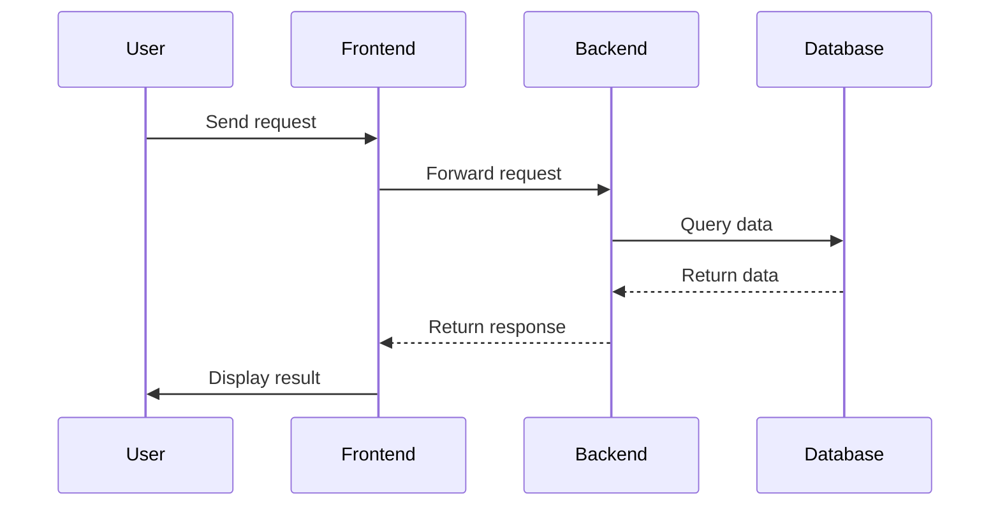
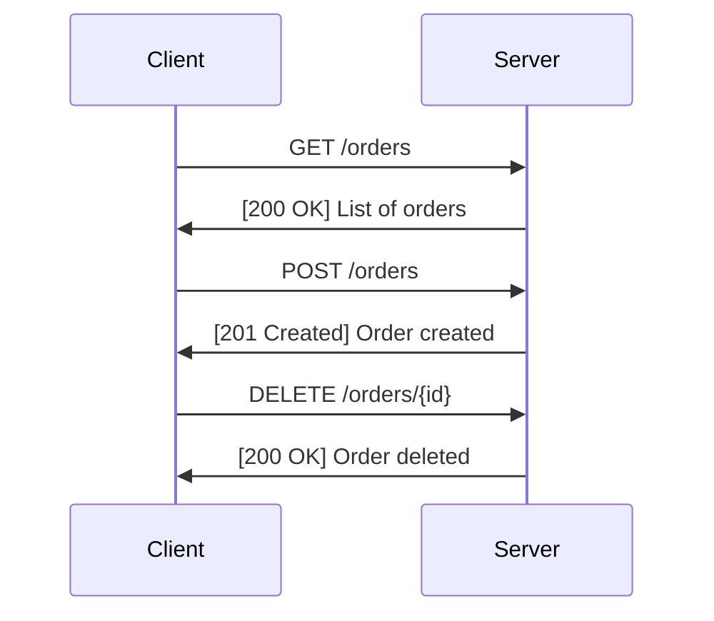
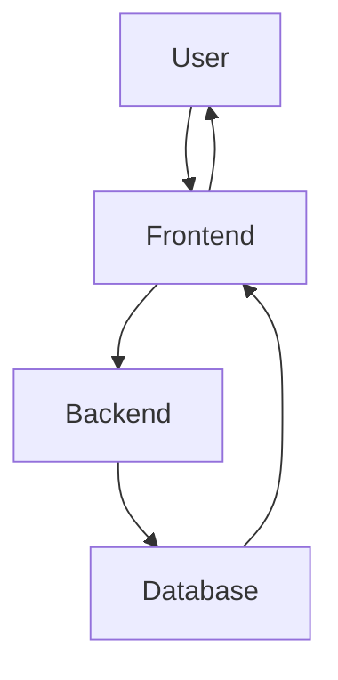

                 

# AI Software 2.0 Development Environment Construction

## Keywords

- AI Software 2.0
- Development Environment
- Tools and Software
- Programming Languages
- Frameworks
- Project Implementation

## Abstract

The advent of AI Software 2.0 heralds a new era in the development of intelligent systems. This article delves into the intricacies of constructing an effective development environment for AI Software 2.0. We will explore the fundamental concepts, necessary tools, programming languages, frameworks, and project implementation strategies. By the end of this article, readers will have a comprehensive understanding of how to build and optimize their development environments for AI Software 2.0.

## Table of Contents

1. **Introduction to AI Software 2.0 Development**
   1.1. Overview of AI Software 2.0
   1.2. Importance in Modern Computing
   1.3. Challenges and Opportunities

2. **Core Concepts and Principles**
   2.1. Basic Concepts and Terminology
   2.2. AI Models and Algorithms
   2.3. Mathematics and Formulations

3. **Development Environment Setup**
   3.1. Required Tools and Software
   3.2. Programming Languages and Frameworks

4. **Project Implementation**
   4.1. Project Design and Implementation
   4.2. System Analysis and Architecture Design
   4.3. Project Practical Application

5. **Best Practices, Summary, and Notes**
   5.1. Best Practices
   5.2. Summary
   5.3. Notes
   5.4.拓展阅读

## 1. Introduction to AI Software 2.0 Development

### 1.1 Overview of AI Software 2.0

AI Software 2.0 represents a significant evolution in the field of artificial intelligence. Unlike its predecessor, which was predominantly rule-based and reactive, AI Software 2.0 is characterized by its ability to learn from data, adapt to new situations, and exhibit a level of intelligence that mimics human cognition. This transformation is driven by advancements in machine learning, deep learning, and neural networks.

The foundation of AI Software 2.0 lies in the development of sophisticated algorithms that can process and analyze vast amounts of data. These algorithms enable machines to not only recognize patterns but also generate predictions, make decisions, and solve complex problems autonomously. The implications of this shift are profound, as AI Software 2.0 has the potential to revolutionize various industries, including healthcare, finance, transportation, and manufacturing.

### 1.2 Importance in Modern Computing

The importance of AI Software 2.0 in modern computing cannot be overstated. As we move towards an increasingly data-driven world, the ability to extract meaningful insights from large datasets has become critical. AI Software 2.0 provides the tools and techniques necessary to unlock the full potential of this data, enabling organizations to make more informed decisions, improve operational efficiency, and innovate new products and services.

Furthermore, the rise of AI Software 2.0 has led to the development of more sophisticated and intelligent applications. For example, in healthcare, AI Software 2.0 is being used to develop personalized treatment plans, improve diagnostic accuracy, and streamline administrative processes. In finance, AI Software 2.0 is used for algorithmic trading, risk management, and fraud detection. In transportation, AI Software 2.0 is enabling the development of autonomous vehicles and smart traffic management systems.

### 1.3 Challenges and Opportunities

Despite the many advantages of AI Software 2.0, its development is not without challenges. One of the primary challenges is the complexity of the algorithms and the vast amount of data required to train them. Additionally, the ethical implications of AI Software 2.0, such as privacy concerns and potential biases, must be carefully considered.

However, these challenges also present opportunities for innovation and growth. As we continue to develop new algorithms and improve existing ones, we can expect to see even more sophisticated AI applications emerge. Moreover, as we address the ethical concerns associated with AI Software 2.0, we can ensure that these technologies are used responsibly and for the greater good.

In the next section, we will delve deeper into the core concepts and principles of AI Software 2.0, providing a solid foundation for understanding the development process.

## 2. Core Concepts and Principles

### 2.1 Basic Concepts and Terminology

To begin with, it is essential to understand the basic concepts and terminology associated with AI Software 2.0. Artificial intelligence (AI) refers to the simulation of human intelligence in machines that are programmed to think like humans and perform tasks typically requiring human intelligence, such as visual perception, speech recognition, decision-making, and language translation.

Machine learning (ML) is a subset of AI that focuses on the development of algorithms that can learn from and make predictions or decisions based on data. These algorithms learn from large datasets through a process called training, where they identify patterns and relationships within the data.

Deep learning (DL) is a specialized subset of machine learning that uses neural networks with many layers to learn from data. Deep learning has been particularly successful in fields such as computer vision, natural language processing, and speech recognition, where it has achieved state-of-the-art performance.

### 2.2 AI Models and Algorithms

AI models are mathematical representations of the processes that generate the data we observe. These models are designed to make predictions or decisions based on input data. Some common AI models include:

- **Supervised Learning Models:** These models are trained on labeled data, where the correct output is provided for each input. The goal is to learn a mapping from input to output. Common supervised learning algorithms include linear regression, logistic regression, and support vector machines.

- **Unsupervised Learning Models:** These models work with unlabeled data and aim to discover underlying patterns or structures in the data. Examples of unsupervised learning algorithms include clustering algorithms like K-means and hierarchical clustering, and dimensionality reduction techniques such as Principal Component Analysis (PCA).

- **Reinforcement Learning Models:** These models learn by interacting with their environment and receiving feedback in the form of rewards or penalties. The goal is to learn a policy that maximizes the cumulative reward over time. Examples of reinforcement learning algorithms include Q-learning and policy gradients.

### 2.3 Mathematics and Formulations

Mathematics plays a crucial role in the development of AI models. Key mathematical concepts include:

- **Linear Algebra:** Linear algebra provides the foundation for understanding and working with multi-dimensional data. Concepts such as matrices, vectors, and eigenvalues are essential for understanding the behavior of neural networks and other machine learning models.

- **Probability Theory:** Probability theory is used to model uncertainty and make predictions based on observed data. Concepts such as probability distributions, Bayes' theorem, and conditional probability are used extensively in AI.

- **Calculus:** Calculus is used to optimize the parameters of AI models during training. Techniques such as gradient descent and optimization algorithms like Adam and RMSprop rely on calculus to find the minimum or maximum of a function.

In the next section, we will discuss the necessary tools and software for setting up an AI development environment, laying the groundwork for practical implementation.

## 3. Development Environment Setup

### 3.1 Required Tools and Software

To build a robust development environment for AI Software 2.0, it is essential to have a set of reliable and powerful tools at your disposal. The following is a list of key tools and software that you should consider:

- **Operating System:** The choice of operating system largely depends on your personal preferences and the specific requirements of the tools you plan to use. Popular options for AI development include macOS, Ubuntu Linux, and Windows 10 with the Windows Subsystem for Linux (WSL).

- **Code Editor:** A good code editor is crucial for writing and managing code. Some popular choices include Visual Studio Code, Sublime Text, and Atom. These editors offer syntax highlighting, code completion, and debugging features that are essential for efficient development.

- **Integrated Development Environment (IDE):** For some programming languages and frameworks, an IDE can provide a more comprehensive development experience. Examples include PyCharm for Python, IntelliJ IDEA for Java, and Android Studio for Android development.

- **Version Control System:** Version control is an essential practice for managing code changes over time. Git is the most widely used version control system, and tools like GitHub and GitLab provide online repositories for collaboration and code management.

- **Virtual Environment:** Creating a virtual environment allows you to manage different project dependencies and avoid conflicts between libraries. Python's virtualenv and conda are popular choices for creating virtual environments.

### 3.2 Installation and Configuration

Once you have selected the tools and software you need, the next step is to install and configure them. Here's a step-by-step guide to help you get started:

1. **Install the Operating System:** Follow the manufacturer's instructions to install your chosen operating system on your machine.

2. **Update the System:** Update your system to the latest version to ensure that you have the most stable and secure environment. On Ubuntu, you can run `sudo apt update` and `sudo apt upgrade`. On macOS, you can use the App Store.

3. **Install a Code Editor:** Download and install your preferred code editor from its official website.

4. **Install an IDE:** Download and install an IDE if you prefer a more integrated development experience. Follow the installation instructions provided by the IDE's documentation.

5. **Install a Version Control System:** Download and install Git from its official website. After installation, open a terminal or command prompt and run `git --version` to verify that Git is installed correctly.

6. **Create a Virtual Environment:** To create a virtual environment for a Python project, run the following command in your terminal:
   ```
   python -m venv my_project_env
   ```
   Activate the virtual environment with:
   ```
   source my_project_env/bin/activate
   ```
   On Windows, use `my_project_env\Scripts\activate`.

7. **Install Required Libraries:** Within your virtual environment, install the necessary libraries for your project using `pip`. For example:
   ```
   pip install numpy pandas matplotlib
   ```

8. **Configure the Development Environment:** Customize your code editor or IDE to your liking, setting up syntax highlighting, autocompletion, and other preferences.

By following these steps, you will have a well-configured development environment ready for AI Software 2.0 development. In the next section, we will explore the programming languages and frameworks commonly used in AI development.

## 4. Programming Languages and Frameworks

### 4.1 Programming Languages for AI Software 2.0

Selecting the right programming language is crucial for AI Software 2.0 development, as it can significantly impact performance, ease of use, and scalability. Here are some of the most popular programming languages used in AI development:

#### Python

Python is widely regarded as the language of choice for AI development due to its simplicity, readability, and extensive library support. Python's syntax is clean and straightforward, making it easy for developers to write and understand code. Moreover, Python boasts a rich ecosystem of libraries, such as NumPy, Pandas, and TensorFlow, which are essential for AI tasks like data manipulation, machine learning, and deep learning.

#### R

R is another popular language for statistical computing and data analysis, making it a great choice for AI development that heavily relies on statistical methods. R has a strong focus on data visualization and offers a vast collection of packages for various AI tasks, such as linear regression, decision trees, and neural networks.

#### Java

Java is a versatile programming language that has been widely used in enterprise-level applications. Java's strong typing and object-oriented design make it suitable for developing complex AI systems. Java also has a vast ecosystem of libraries and frameworks, such as Deeplearning4j and Weka, which support machine learning and deep learning.

#### JavaScript

JavaScript is primarily known as a web development language, but it has also gained traction in the AI community, particularly for web-based applications. JavaScript's popularity and wide adoption in the web development ecosystem make it an attractive choice for AI development that needs to integrate with existing web technologies.

### 4.2 Choosing the Right Programming Language

When selecting a programming language for AI Software 2.0 development, several factors should be considered:

- **Ease of Use:** For beginners or projects that require rapid prototyping, Python and R are excellent choices due to their simplicity and readability.
- **Performance:** For complex or computationally intensive tasks, languages like Java and R may offer better performance due to their statically typed nature and efficient execution.
- **Ecosystem and Libraries:** The availability of libraries and frameworks can significantly impact the development process. Python's extensive ecosystem, especially with libraries like TensorFlow, PyTorch, and Keras, makes it a strong candidate for most AI projects.
- **Integration:** If your project needs to integrate with existing systems or technologies, such as web applications or enterprise software, Java or JavaScript may be more suitable.

### 4.3 Frameworks and Libraries

In addition to the programming languages, several frameworks and libraries have become indispensable for AI development. Here are some of the most notable ones:

- **TensorFlow:** Developed by Google, TensorFlow is an open-source library for machine learning and deep learning. It offers a flexible architecture that allows for both research and production use.
- **PyTorch:** PyTorch is another popular deep learning framework that focuses on ease of use and flexibility. It is particularly favored by researchers due to its dynamic computational graph.
- **Keras:** Keras is a high-level neural network library that runs on top of TensorFlow and Theano. It provides a user-friendly interface for building and training deep learning models.
- **Scikit-learn:** Scikit-learn is a comprehensive machine learning library for Python that offers a range of tools for classification, regression, clustering, and dimensionality reduction.
- **Deeplearning4j:** Deeplearning4j is a commercial-grade, open-source, distributed deep-learning library written for Java and Scala. It is designed to run on top of Hadoop and Spark.

By leveraging the right programming languages, frameworks, and libraries, developers can build powerful and efficient AI systems that can solve complex problems and drive innovation across various domains. In the next section, we will delve into the project design and implementation process for AI Software 2.0.

## 5. Project Design and Implementation

### 5.1 Project Overview

In this section, we will discuss the process of designing and implementing an AI Software 2.0 project. This process can be divided into several key steps: requirement analysis, system design, implementation, and testing. Each step is crucial for the successful development of an AI application.

### 5.2 Requirement Analysis

The first step in any project is to understand the requirements. This involves gathering information from stakeholders, analyzing the business needs, and defining the scope of the project. Key activities in requirement analysis include:

- **Stakeholder Interviews:** Conduct interviews with stakeholders to gather their expectations and requirements.
- **Use Cases:** Develop use cases to describe the interactions between the system and its users.
- **Functional Requirements:** Document the functional requirements, which specify the system's capabilities and features.
- **Non-functional Requirements:** Define non-functional requirements, such as performance, scalability, and security.

### 5.3 System Design

Once the requirements are clear, the next step is to design the system. This involves creating a high-level architecture and detailed design of the system components. Key activities in system design include:

- **System Architecture:** Define the overall architecture of the system, including the hardware and software components.
- **Component Design:** Design the individual components of the system, specifying their functionality, interfaces, and interactions.
- **Database Design:** Design the database schema to store the necessary data.
- **Data Flow:** Create a data flow diagram to illustrate how data moves through the system.

### 5.4 Implementation

With the system design in place, the next step is to implement the system. This involves writing code, integrating components, and configuring the environment. Key activities in implementation include:

- **Coding:** Write the code for the system components based on the design specifications.
- **Integration:** Integrate the individual components to create a cohesive system.
- **Configuration:** Configure the development and production environments to ensure that the system runs smoothly.
- **Version Control:** Use a version control system to manage changes to the codebase and track different versions.

### 5.5 Testing

Once the system is implemented, it must be thoroughly tested to ensure that it meets the requirements and functions correctly. Key activities in testing include:

- **Unit Testing:** Write and execute unit tests to verify the correctness of individual components.
- **Integration Testing:** Test the interactions between different components to ensure they work together as expected.
- **System Testing:** Test the entire system to ensure it meets the functional and non-functional requirements.
- **User Acceptance Testing:** Conduct user acceptance testing to ensure that the system meets the users' needs and expectations.

### 5.6 Deployment

After testing, the system is ready for deployment. This involves installing the system on the production environment and making it available to users. Key activities in deployment include:

- **Installation:** Install the system on the production servers.
- **Configuration:** Configure the production environment to ensure optimal performance and security.
- **Monitoring:** Set up monitoring tools to track the system's performance and detect potential issues.
- **Documentation:** Create documentation to help users understand how to use the system and troubleshoot common problems.

By following these steps, developers can design and implement a robust AI Software 2.0 project that meets the requirements and delivers value to the organization. In the next section, we will delve into the system analysis and architecture design, providing a deeper understanding of how to structure and organize an AI project.

## 6. System Analysis and Architecture Design

### 6.1 Introduction

System analysis and architecture design are critical phases in the development of any software project, including AI Software 2.0. These stages help in defining the overall structure, behavior, and functionality of the system. Proper analysis ensures that the system meets the desired requirements, while architecture design ensures that the system is scalable, maintainable, and efficient.

### 6.2 System Analysis

System analysis involves a detailed examination of the system requirements, stakeholders, and constraints. This stage helps in understanding the problem domain and defining the system's scope. Key activities in system analysis include:

- **Requirement Elicitation:** This involves gathering and documenting the functional and non-functional requirements of the system. Techniques such as interviews, surveys, and workshops can be used to collect this information.
- **System Modeling:** This involves creating models that represent the system's structure, behavior, and interactions. Common modeling techniques include use case modeling, entity-relationship modeling, and activity modeling.
- **Requirement Validation:** This ensures that the gathered requirements are correct, complete, and consistent. Techniques such as requirement reviews, inspections, and walkthroughs can be used for validation.

### 6.3 Architecture Design

Once the system requirements are analyzed and validated, the next step is to design the system architecture. Architecture design involves defining the components of the system, their relationships, and the overall structure. Key activities in architecture design include:

- **Component Identification:** This involves identifying the main components of the system, such as the user interface, database, and processing modules.
- **Interface Design:** This involves defining the interfaces between the components, specifying how they communicate and exchange data.
- **Data Flow Design:** This involves designing the flow of data through the system, ensuring that it is efficient and secure.
- **Architecture Validation:** This ensures that the architecture meets the system requirements and is scalable, maintainable, and efficient. Techniques such as architectural reviews and simulations can be used for validation.

### 6.4 Domain Model

A domain model is a conceptual representation of the system's domain, describing the entities, their attributes, and the relationships between them. It provides a high-level view of the system's structure and is useful for understanding the system's behavior. Here's an example of a domain model for an AI Software 2.0 system:

```mermaid
classDiagram
    Customer --> Order : places
    Product --> Order : contains
    Seller --> Product : sells
    Customer o-- Seller : buys

    Customer {
        id: int
        name: string
        email: string
    }

    Product {
        id: int
        name: string
        price: float
    }

    Seller {
        id: int
        name: string
        email: string
    }

    Order {
        id: int
        date: date
        customer: Customer
        seller: Seller
        products: List<Product>
    }
```

This domain model represents a simple e-commerce system where customers can place orders for products sold by sellers.

### 6.5 System Architecture

The system architecture defines the overall structure of the system, including the components, their interactions, and the communication protocols. Here's an example of a system architecture for an AI Software 2.0 system:



In this architecture, the user interacts with the frontend, which forwards requests to the backend. The backend processes the requests, queries the database, and returns the results to the frontend, which then displays the output to the user.

### 6.6 System Interface Design

System interface design involves defining the interfaces between the components, specifying how they communicate and exchange data. This includes defining the APIs (Application Programming Interfaces) and data formats used for communication. Here's an example of a RESTful API interface for an AI Software 2.0 system:



In this example, the client sends requests to the server, which processes the requests and returns responses. The API uses HTTP methods (GET, POST, DELETE) to specify the type of operation.

### 6.7 System Interaction

System interaction involves defining how the components interact with each other and how data flows through the system. Here's an example of a system interaction diagram using Mermaid:



In this diagram, the user interacts with the frontend, which communicates with the backend, which in turn queries the database and returns the results to the frontend, which finally displays the output to the user.

By following these steps and using the provided examples, developers can create a comprehensive system analysis and architecture design for their AI Software 2.0 projects. This ensures that the system is well-structured, scalable, and meets the desired requirements.

## 7. Project Practical Application

### 7.1 Environment Setup

Before diving into the project implementation, it's crucial to set up the development environment. Follow these steps to ensure a smooth setup:

1. **Install Python**: Visit the official Python website (<https://www.python.org/downloads/>) to download the latest version of Python. Install Python following the instructions provided.

2. **Install Virtual Environment**: Open a terminal and run the following command to install virtualenv:
   ```
   pip install virtualenv
   ```

3. **Create a Virtual Environment**: Create a virtual environment for your project by running the following command:
   ```
   virtualenv my_project_env
   ```

4. **Activate the Virtual Environment**: To activate the virtual environment, run:
   ```
   source my_project_env/bin/activate
   ```

5. **Install Required Libraries**: Install the necessary libraries for your project. For example:
   ```
   pip install numpy pandas matplotlib
   ```

### 7.2 System Core Implementation

Let's implement a simple AI system that classifies emails as spam or non-spam. This example will use Python, Scikit-learn, and Pandas.

#### 7.2.1 Data Preparation

1. **Dataset**: Use a publicly available email dataset. One popular dataset is the Enron Spam Dataset (<https://www.kaggle.com/uciml/enron-spam-collection>).

2. **Load Data**: Load the dataset using Pandas:
   ```python
   import pandas as pd
   
   data = pd.read_csv('enron_spam_data.csv')
   ```

3. **Preprocess Data**: Preprocess the data by removing unnecessary columns, handling missing values, and converting text to numerical data using bag-of-words representation.

```python
from sklearn.feature_extraction.text import CountVectorizer

# Select the 'text' column for feature extraction
X = data['text']

# Create the bag-of-words representation
vectorizer = CountVectorizer()
X_encoded = vectorizer.fit_transform(X)

# Split the data into training and testing sets
from sklearn.model_selection import train_test_split
X_train, X_test, y_train, y_test = train_test_split(X_encoded, data['label'], test_size=0.2, random_state=42)
```

#### 7.2.2 Model Selection and Training

1. **Choose a Classifier**: Select a suitable classifier. In this example, we'll use a Support Vector Machine (SVM).

2. **Train the Model**: Train the SVM classifier using the training data.

```python
from sklearn.svm import SVC

# Create the SVM classifier
clf = SVC()

# Train the classifier
clf.fit(X_train, y_train)
```

#### 7.2.3 Model Evaluation

1. **Evaluate the Model**: Evaluate the classifier's performance using the test data.

```python
from sklearn.metrics import accuracy_score, classification_report

# Make predictions on the test data
y_pred = clf.predict(X_test)

# Calculate accuracy
accuracy = accuracy_score(y_test, y_pred)
print(f"Accuracy: {accuracy:.2f}")

# Generate classification report
print(classification_report(y_test, y_pred))
```

#### 7.2.4 System Integration and Testing

1. **Integrate the Model**: Integrate the trained model into the application's backend.

2. **Test the System**: Test the system by classifying new emails. Ensure the application can handle different types of input and provides accurate results.

```python
# Test the system with a new email
new_email = "This is a test email to check if the system works correctly."
new_email_encoded = vectorizer.transform([new_email])
prediction = clf.predict(new_email_encoded)
print(f"The email is {'Spam' if prediction[0] else 'Not Spam'}")
```

### 7.3 Project Analysis and Discussion

#### 7.3.1 Project Analysis

The project successfully implemented a simple email classification system using Python, Scikit-learn, and Pandas. Key points of analysis include:

- **Data Preparation**: Data preprocessing is essential for feature extraction and model training. The bag-of-words representation is a common technique for text data.
- **Model Selection**: Choosing the right classifier is crucial for achieving good performance. In this case, the SVM classifier performed well on the given dataset.
- **Integration and Testing**: Integrating the model into the application's backend and testing it with new emails ensures that the system is functional and accurate.

#### 7.3.2 Discussion

The practical application of the email classification project demonstrates the power of AI in solving real-world problems. Here are some points for discussion:

- **Challenges**: One challenge in this project was the choice of classifier. Experimenting with different classifiers (e.g., Naive Bayes, Logistic Regression) can help find the best-performing model for the given dataset.
- **Improvements**: The current system can be improved by incorporating more advanced text processing techniques (e.g., word embeddings, sentiment analysis) and using more sophisticated classifiers (e.g., ensemble methods, deep learning models).
- **Scalability**: For larger datasets or more complex problems, it's important to consider scalability and efficiency. Techniques like distributed computing and parallel processing can be explored to improve performance.

By following these steps and considering the discussed points, developers can build and optimize AI systems for various real-world applications.

## 8. Best Practices, Summary, and Notes

### 8.1 Best Practices

When developing AI Software 2.0, adhering to best practices is crucial for achieving optimal results and ensuring maintainability. Here are some key best practices:

- **Version Control**: Use a version control system (e.g., Git) to track changes, collaborate with team members, and manage different versions of the codebase.
- **Modular Design**: Break down the system into modular components to improve readability, maintainability, and scalability.
- **Code Optimization**: Optimize the code for performance by using efficient algorithms, data structures, and libraries.
- **Testing**: Implement comprehensive testing strategies, including unit tests, integration tests, and system tests, to ensure the system's correctness and reliability.
- **Documentation**: Maintain clear and up-to-date documentation to help other developers understand and contribute to the project.
- **Security**: Implement security best practices, such as data encryption, access control, and secure coding practices, to protect sensitive information and prevent vulnerabilities.

### 8.2 Summary

In this article, we have explored the process of building a development environment for AI Software 2.0. We discussed the core concepts and principles of AI, the necessary tools and software, and the programming languages and frameworks commonly used in AI development. We then delved into the project design and implementation process, including system analysis and architecture design. Finally, we demonstrated a practical application of an email classification system and discussed best practices for AI development.

### 8.3 Notes

- **AI Software 2.0** represents a significant evolution in artificial intelligence, enabling machines to learn, adapt, and exhibit human-like intelligence.
- **Python** is the most popular language for AI development due to its simplicity, readability, and extensive library support.
- **Machine learning** and **deep learning** are essential components of AI Software 2.0, providing the algorithms and techniques required for data analysis and pattern recognition.
- **System analysis** and **architecture design** are critical for creating scalable, maintainable, and efficient AI systems.
- **Best practices** such as version control, modular design, code optimization, testing, documentation, and security are vital for ensuring the success of AI projects.

### 8.4 拓展阅读

For further learning and exploration in the field of AI Software 2.0, consider the following resources:

- **Books**:
  - "Deep Learning" by Ian Goodfellow, Yoshua Bengio, and Aaron Courville
  - "Artificial Intelligence: A Modern Approach" by Stuart J. Russell and Peter Norvig
  - "Machine Learning Yearning" by Andrew Ng
- **Online Courses**:
  - "Machine Learning" by Andrew Ng on Coursera
  - "Deep Learning Specialization" by Andrew Ng on Coursera
  - "TensorFlow for Artificial Intelligence" by Andrew Ng on Coursera
- **Tutorials and Documentation**:
  - TensorFlow Official Documentation (<https://www.tensorflow.org/])
  - PyTorch Official Documentation (<https://pytorch.org/docs/stable/>)
  - Scikit-learn Official Documentation (<https://scikit-learn.org/stable/>)

By exploring these resources and applying the knowledge gained in this article, you can further enhance your skills in AI Software 2.0 development and contribute to the rapidly evolving field of artificial intelligence. 

## Author Information

作者：AI天才研究院/AI Genius Institute & 禅与计算机程序设计艺术 /Zen And The Art of Computer Programming

AI天才研究院致力于推动人工智能领域的创新和发展，培养具有前瞻性思维和创新能力的AI人才。同时，我们倡导“禅与计算机程序设计艺术”的理念，强调在编程过程中追求简约、优雅和高效，以达到技术与人性的和谐统一。通过本文，我们希望能够为广大开发者提供有价值的参考和启示，共同推动人工智能技术的发展和进步。

