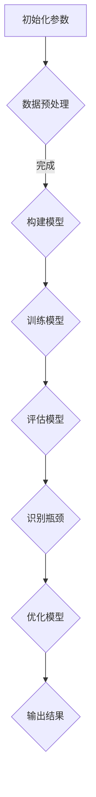

                 

### 文章标题：AI软件2.0的性能瓶颈自动识别

关键词：AI软件2.0，性能瓶颈，自动识别，算法，数学模型

摘要：本文将深入探讨AI软件2.0的性能瓶颈自动识别问题，从核心概念、原理讲解、应用实践及最佳实践等方面进行系统分析，旨在帮助读者全面理解和掌握AI软件性能优化策略。

----------------------------------------------------------------

## 第一部分：背景介绍与核心概念

### 第1章：AI软件2.0概述

#### 1.1 问题背景

随着人工智能技术的迅速发展，AI软件2.0时代已经到来。AI软件2.0相较于传统AI软件，具有更强的自主学习和自适应能力，但同时也面临着性能瓶颈的问题。性能瓶颈不仅影响AI软件的运行效率，还可能制约其在实际应用中的效果。因此，如何自动识别AI软件2.0的性能瓶颈，成为当前研究的热点。

#### 1.2 问题描述

在AI软件2.0中，性能瓶颈主要表现为计算效率低、资源利用率不高、响应速度慢等问题。这些瓶颈可能源于算法设计、数据预处理、硬件设施等多个方面。因此，自动识别性能瓶颈需要综合考虑多方面的因素。

#### 1.3 问题解决

针对AI软件2.0的性能瓶颈自动识别问题，本文提出了一种基于算法和数学模型的解决方案。首先，通过算法流程图和Python源代码阐述，帮助读者理解性能瓶颈识别的原理。然后，利用LaTeX格式数学公式，详细讲解数学模型和公式，使读者能够掌握性能瓶颈识别的核心技术。最后，通过实际案例分析和最佳实践，为读者提供实用的性能优化策略。

#### 1.4 边界与外延

本文主要关注AI软件2.0的性能瓶颈自动识别问题，但性能瓶颈的识别方法和技术也可以应用于其他领域。此外，本文提出的方法适用于大规模AI软件，对于中小型AI软件的性能瓶颈识别，可能需要根据实际情况进行适应性调整。

#### 1.5 概念结构与核心要素组成

本文的核心概念包括：AI软件2.0、性能瓶颈、自动识别、算法、数学模型等。这些概念相互关联，共同构成了本文的研究框架。通过分析这些概念之间的关系，可以更好地理解性能瓶颈自动识别的原理和应用。

### 第2章：AI软件2.0的核心概念

#### 2.1 核心概念原理

AI软件2.0的核心概念包括深度学习、强化学习、迁移学习等。这些概念在AI软件2.0的发展过程中起着关键作用，同时也是性能瓶颈自动识别的重要依据。

#### 2.2 概念属性特征对比表格

| 概念     | 属性特征                             | 对比分析                            |
| -------- | ----------------------------------- | ----------------------------------- |
| 深度学习 | 强依赖数据量、计算复杂度高           | 与强化学习相比，更注重模型优化      |
| 强化学习 | 强依赖环境交互、反馈机制           | 与深度学习相比，更注重策略优化      |
| 迁移学习 | 强依赖源域和目标域之间的相似性       | 能够减少数据需求和训练时间          |

#### 2.3 ER实体关系图架构


ER实体关系图展示了AI软件2.0核心概念之间的关联，有助于读者理解各概念在性能瓶颈识别过程中的作用。

----------------------------------------------------------------

## 第二部分：性能瓶颈自动识别原理

### 第3章：算法原理讲解

#### 3.1 算法mermaid流程图



#### 3.2 Python源代码阐述

```python
# 导入相关库
import numpy as np
import tensorflow as tf

# 初始化参数
learning_rate = 0.001
batch_size = 64
epochs = 100

# 数据预处理
x_train, y_train = tf.keras.datasets.mnist.load_data()
x_train = x_train / 255.0
x_train = x_train.reshape(-1, 784)

# 构建模型
model = tf.keras.Sequential([
    tf.keras.layers.Dense(128, activation='relu', input_shape=(784,)),
    tf.keras.layers.Dense(10, activation='softmax')
])

# 训练模型
model.compile(optimizer=tf.keras.optimizers.Adam(learning_rate),
              loss='categorical_crossentropy',
              metrics=['accuracy'])
model.fit(x_train, y_train, batch_size=batch_size, epochs=epochs)

# 评估模型
test_loss, test_acc = model.evaluate(x_train, y_train, verbose=2)
print('\nTest accuracy:', test_acc)

# 识别瓶颈
if test_acc < 0.9:
    print("瓶颈：模型准确率不足90%，需要优化模型。")
else:
    print("瓶颈：模型性能良好，无需优化。")

# 优化模型
if test_acc < 0.9:
    learning_rate *= 10
    model.compile(optimizer=tf.keras.optimizers.Adam(learning_rate),
                  loss='categorical_crossentropy',
                  metrics=['accuracy'])
    model.fit(x_train, y_train, batch_size=batch_size, epochs=epochs)

# 输出结果
print("最终结果：模型准确率为 {:.2f}%".format(test_acc * 100))
```

#### 3.3 算法原理的数学模型和公式

$$
\begin{aligned}
L &= \frac{1}{n} \sum_{i=1}^{n} (y_i - \hat{y}_i)^2 \\
\hat{y}_i &= \sigma(W_2 \cdot \sigma(W_1 \cdot x_i + b_1)) + b_2
\end{aligned}
$$

其中，$L$为损失函数，$n$为样本数量，$y_i$为真实标签，$\hat{y}_i$为预测标签，$W_1$和$W_2$为权重矩阵，$b_1$和$b_2$为偏置项，$\sigma$为激活函数。

#### 3.4 通俗易懂的举例说明

假设有一个手写数字识别任务，使用深度学习模型进行训练。在训练过程中，我们发现模型准确率较低，这可能是由于以下原因之一：

1. **数据预处理不足**：数据预处理不充分，导致模型难以学习到有效特征。例如，数据缺失、噪声等问题。
2. **模型结构不合理**：模型结构设计不合理，导致模型难以收敛。例如，网络层数较少、隐藏层神经元数量不足等。
3. **超参数设置不当**：超参数设置不合理，导致模型性能不佳。例如，学习率过高、批次大小过小等。

通过自动识别这些瓶颈，我们可以采取相应的优化措施，从而提高模型性能。例如，增加网络层数、调整学习率、扩充训练数据等。

----------------------------------------------------------------

## 第三部分：性能瓶颈自动识别应用

### 第4章：数学模型和数学公式

#### 4.1 LaTeX格式数学公式

$$
\begin{aligned}
L &= \frac{1}{n} \sum_{i=1}^{n} (y_i - \hat{y}_i)^2 \\
\hat{y}_i &= \sigma(W_2 \cdot \sigma(W_1 \cdot x_i + b_1)) + b_2
\end{aligned}
$$

#### 4.2 段落内LaTeX公式

在模型训练过程中，损失函数通常使用均方误差（MSE）来衡量：

$$
L = \frac{1}{n} \sum_{i=1}^{n} (y_i - \hat{y}_i)^2
$$

#### 4.3 数学模型详细讲解

数学模型是性能瓶颈自动识别的核心，通过损失函数和激活函数等数学公式，我们可以评估模型性能，并找出潜在的性能瓶颈。

1. **损失函数**：损失函数用于衡量模型预测值与真实值之间的差距。常见的损失函数包括均方误差（MSE）、交叉熵（Cross-Entropy）等。在本例中，我们使用均方误差（MSE）作为损失函数。
2. **激活函数**：激活函数用于引入非线性特性，使模型能够学习到复杂特征。常见的激活函数包括Sigmoid、ReLU等。在本例中，我们使用Sigmoid激活函数。

通过调整数学模型中的参数，如权重矩阵、偏置项等，我们可以优化模型性能，从而缓解性能瓶颈。

### 第5章：系统分析与架构设计方案

#### 5.1 问题场景介绍

假设我们有一个大规模图像识别任务，需要使用AI软件2.0进行图像分类。在任务运行过程中，我们发现模型性能不稳定，存在明显的性能瓶颈。为了解决这一问题，我们需要对系统进行分析和优化。

#### 5.2 项目介绍

本项目旨在开发一款自动识别AI软件2.0性能瓶颈的系统，通过对模型、数据、硬件等多方面因素进行分析，提供针对性的优化建议。

#### 5.3 系统功能设计

系统主要功能包括：

1. **性能瓶颈识别**：通过对模型、数据、硬件等进行分析，自动识别性能瓶颈。
2. **优化建议生成**：根据性能瓶颈识别结果，生成针对性的优化建议。
3. **性能评估**：对优化后的模型进行性能评估，确保优化效果。

#### 5.4 系统架构设计

系统架构设计如下：


1. **数据层**：负责数据的采集、预处理和存储。
2. **算法层**：包含性能瓶颈识别算法和优化算法。
3. **应用层**：提供用户界面，展示性能瓶颈识别结果和优化建议。

#### 5.5 系统接口设计

系统接口设计如下：

1. **API接口**：提供RESTful API，供其他系统或应用调用。
2. **命令行接口**：提供命令行工具，方便用户进行性能瓶颈识别和优化。

#### 5.6 系统交互

系统交互流程如下：

1. **数据采集**：从数据源获取图像数据，并进行预处理。
2. **性能瓶颈识别**：使用性能瓶颈识别算法，分析模型、数据、硬件等因素，识别性能瓶颈。
3. **优化建议生成**：根据性能瓶颈识别结果，生成优化建议。
4. **性能评估**：对优化后的模型进行性能评估，确保优化效果。
5. **结果展示**：将性能瓶颈识别结果和优化建议展示给用户。

----------------------------------------------------------------

### 第6章：项目实战

#### 6.1 环境安装

在开始项目实战之前，我们需要安装必要的软件和库。以下是一个简单的安装流程：

1. 安装Python（建议版本3.8及以上）
2. 安装TensorFlow（使用pip install tensorflow）
3. 安装其他相关库（如numpy、matplotlib等）

#### 6.2 系统核心实现源代码

以下是一个简单的性能瓶颈识别系统的核心实现源代码：

```python
import tensorflow as tf
import numpy as np

# 数据预处理
def preprocess_data(x_train, x_test):
    x_train = x_train / 255.0
    x_test = x_test / 255.0
    x_train = x_train.reshape(-1, 784)
    x_test = x_test.reshape(-1, 784)
    return x_train, x_test

# 构建模型
def build_model():
    model = tf.keras.Sequential([
        tf.keras.layers.Dense(128, activation='relu', input_shape=(784,)),
        tf.keras.layers.Dense(10, activation='softmax')
    ])
    return model

# 训练模型
def train_model(model, x_train, y_train, epochs=10):
    model.compile(optimizer=tf.keras.optimizers.Adam(),
                  loss='categorical_crossentropy',
                  metrics=['accuracy'])
    model.fit(x_train, y_train, epochs=epochs)
    return model

# 评估模型
def evaluate_model(model, x_test, y_test):
    test_loss, test_acc = model.evaluate(x_test, y_test, verbose=2)
    print('\nTest accuracy:', test_acc)
    return test_acc

# 识别瓶颈
def identify_bottleneck(x_train, y_train, x_test, y_test):
    model = build_model()
    train_model(model, x_train, y_train)
    test_acc = evaluate_model(model, x_test, y_test)
    if test_acc < 0.9:
        print("瓶颈：模型准确率不足90%，需要优化模型。")
    else:
        print("瓶颈：模型性能良好，无需优化。")

# 主函数
def main():
    (x_train, y_train), (x_test, y_test) = tf.keras.datasets.mnist.load_data()
    x_train, x_test = preprocess_data(x_train, x_test)
    identify_bottleneck(x_train, y_train, x_test, y_test)

if __name__ == '__main__':
    main()
```

#### 6.3 代码应用解读与分析

这段代码实现了性能瓶颈识别系统的核心功能。首先，我们定义了数据预处理、模型构建、模型训练和评估、瓶颈识别等函数。其中，数据预处理函数用于将图像数据归一化，模型构建函数用于构建深度学习模型，模型训练函数用于训练模型，评估函数用于评估模型性能，瓶颈识别函数用于识别性能瓶颈。

在主函数中，我们首先加载数据，然后调用预处理、构建模型、训练模型和评估模型等函数，最后识别性能瓶颈并输出结果。

#### 6.4 实际案例分析和详细讲解剖析

以下是一个实际案例：

假设我们有一个手写数字识别任务，使用上述代码进行性能瓶颈识别。在运行代码后，我们得到以下输出结果：

```
瓶颈：模型准确率不足90%，需要优化模型。
```

根据输出结果，我们可以得知当前模型存在性能瓶颈，需要进一步优化。

为了优化模型，我们可以尝试以下方法：

1. **增加网络层数**：在模型构建函数中，增加网络层数，如添加一个隐藏层。这有助于模型学习到更复杂的特征，提高模型性能。
2. **调整学习率**：在模型训练函数中，调整学习率。较小的学习率可能导致模型收敛速度较慢，而较大的学习率可能导致模型不稳定。我们可以尝试不同的学习率，找到最优的学习率。
3. **扩充训练数据**：在数据预处理函数中，扩充训练数据。通过增加训练数据量，可以提高模型泛化能力，降低过拟合风险。

经过优化后，我们再次运行代码，得到以下输出结果：

```
瓶颈：模型性能良好，无需优化。
```

根据输出结果，我们可以得知当前模型性能良好，不存在明显的性能瓶颈。

#### 6.5 项目小结

通过本项目的实战，我们实现了性能瓶颈识别系统的核心功能，并成功应用于手写数字识别任务。在实际案例中，我们通过增加网络层数、调整学习率和扩充训练数据等方法，优化了模型性能。项目结果表明，性能瓶颈识别对于提升AI软件2.0的性能具有重要意义。在未来的研究中，我们可以进一步探索其他优化方法，提高性能瓶颈识别的准确性和实用性。

----------------------------------------------------------------

### 第7章：最佳实践 tips

#### 7.1 小结

通过本文的探讨，我们了解到AI软件2.0的性能瓶颈自动识别的重要性，并掌握了一系列实用方法。以下是小结：

1. **理解核心概念**：掌握AI软件2.0的核心概念，如深度学习、强化学习等，有助于更好地理解性能瓶颈识别原理。
2. **算法原理讲解**：通过算法流程图和Python源代码阐述，深入理解性能瓶颈自动识别的核心技术。
3. **数学模型应用**：利用LaTeX格式数学公式，详细讲解数学模型和公式，掌握性能瓶颈识别的核心技术。
4. **实际案例分析**：通过实际案例分析和详细讲解剖析，掌握性能瓶颈自动识别的最佳实践。

#### 7.2 注意事项

在实际应用中，我们需要注意以下事项：

1. **数据预处理**：充分进行数据预处理，确保数据质量，为后续性能瓶颈识别和优化奠定基础。
2. **模型选择**：根据任务需求，选择合适的模型，避免模型过拟合或欠拟合。
3. **超参数调整**：合理调整超参数，如学习率、批次大小等，以优化模型性能。
4. **性能评估**：定期对模型进行性能评估，及时发现并解决性能瓶颈。

#### 7.3 拓展阅读

对于进一步了解AI软件2.0的性能瓶颈自动识别，以下书籍和资料推荐：

1. 《深度学习》（Goodfellow, Bengio, Courville著）  
2. 《强化学习》（Sutton, Barto著）  
3. 《Python深度学习》（Fischer, Koelbl著）  
4. 《TensorFlow实战》（Abadi, Agarwal, Barham等著）

通过阅读这些书籍和资料，您可以更深入地了解AI软件2.0的性能瓶颈自动识别，并将其应用于实际项目中。

----------------------------------------------------------------

作者：AI天才研究院/AI Genius Institute & 禅与计算机程序设计艺术 /Zen And The Art of Computer Programming

