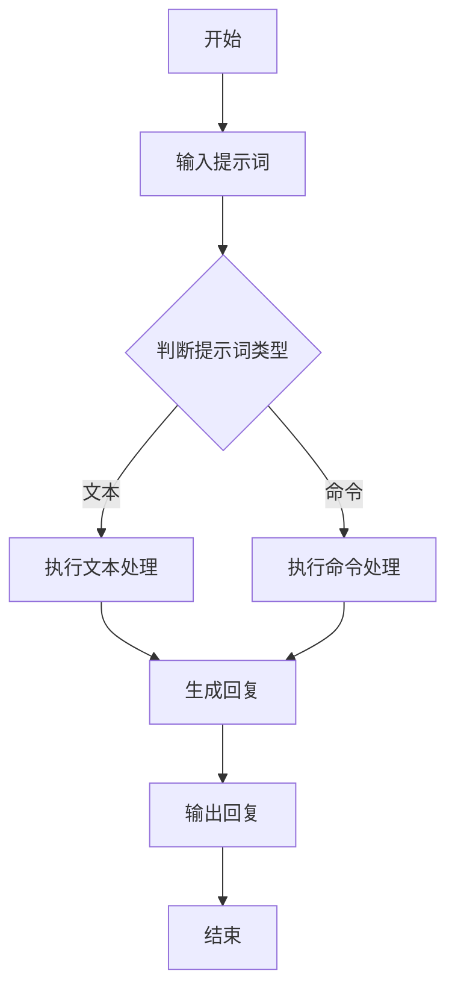
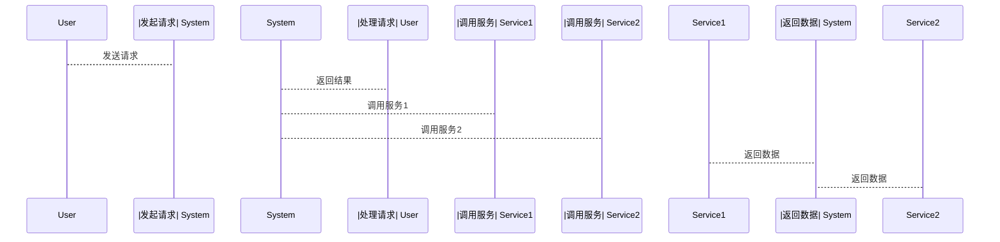

                 

# AI软件2.0的提示词驱动微服务设计

## 关键词

- AI软件2.0
- 提示词驱动
- 微服务
- 软件架构设计
- 智能软件开发
- 软件工程
- 提示词生成算法

## 摘要

本文将深入探讨AI软件2.0的提示词驱动微服务设计。首先，我们将介绍AI软件2.0和提示词驱动的概念，解析其核心特点。接着，我们将详细阐述微服务架构在AI软件2.0中的应用，探讨如何利用提示词驱动微服务实现高效、可扩展的AI系统。随后，我们将通过具体案例展示该设计在实际项目中的应用，并详细分析其优势和挑战。最后，我们将总结最佳实践，提出未来研究方向。

## 引言

### AI软件2.0的概念

AI软件2.0（也称为下一代AI）是一个相对较新的概念，它标志着人工智能从规则驱动向数据驱动、从浅层学习向深层学习、从单一任务向多任务、从独立系统向协同系统的演变。AI软件2.0的核心目标是实现更加智能、自适应和自主的软件系统，能够更好地理解和满足用户需求。

AI软件2.0的主要特点包括：

- **数据驱动**：强调大数据和云计算的重要性，通过大规模数据训练深度神经网络，实现更强大的模型学习能力。
- **多任务处理**：能够同时处理多个任务，提高系统的任务处理效率和灵活性。
- **自适应性**：系统能够根据用户行为和需求进行自我调整，提高用户体验。
- **协同工作**：AI软件2.0强调人机协同，通过自然语言处理和机器学习等技术，实现人与机器的智能互动。

### 提示词驱动的概念

提示词驱动（Prompt-driven）是一种基于用户输入提示词来触发AI模型执行特定任务的设计理念。在传统的AI系统中，任务执行通常需要用户输入完整的指令或目标，而在提示词驱动的系统中，用户只需提供部分信息或提示词，系统会根据提示词生成完整的任务指令，并执行相应操作。

提示词驱动的核心特点包括：

- **简化用户输入**：用户只需提供简要的提示词，系统会自动生成详细的任务指令。
- **增强交互性**：通过提示词与用户进行有效沟通，提高系统的易用性和用户体验。
- **灵活性**：系统可以根据提示词的变化动态调整任务执行策略，提高任务处理效率。

### 微服务的概念

微服务架构（Microservices Architecture）是一种基于独立、可复用服务的软件架构设计方法。在微服务架构中，一个大型应用程序被拆分成多个小型、独立的子服务，每个子服务负责完成特定的功能，并通过定义良好的API进行通信。

微服务架构的主要优势包括：

- **高可扩展性**：每个子服务可以独立扩展，无需重新部署整个应用程序。
- **高灵活性**：子服务可以独立开发和部署，提高系统的灵活性和可维护性。
- **高可用性**：故障隔离和恢复能力更强，可以快速恢复服务。
- **高可测试性**：每个子服务可以独立测试，提高测试效率和覆盖率。

### AI软件2.0与提示词驱动的结合

AI软件2.0与提示词驱动的结合，旨在构建一种高效、可扩展、灵活的AI系统，能够更好地满足用户需求。具体而言，这种结合具有以下优势：

- **简化用户交互**：通过提示词驱动，用户只需提供简要的提示词，系统即可自动生成详细的任务指令，减少用户输入负担。
- **提高任务执行效率**：提示词驱动可以动态调整任务执行策略，提高任务处理效率。
- **增强系统可扩展性**：通过微服务架构，系统可以独立扩展每个子服务，提高整体系统的可扩展性。
- **提高用户体验**：通过自然语言处理和机器学习技术，系统可以更好地理解用户需求，提供个性化的服务。

## 基础理论与技术讲解

### AI基础理论

AI基础理论是AI软件2.0的核心，主要包括机器学习、深度学习和自然语言处理等。

#### 机器学习概述

机器学习（Machine Learning，ML）是一门研究如何让计算机从数据中学习，并利用学习到的知识进行预测和决策的学科。机器学习的主要目标是通过算法和模型，使计算机能够从数据中自动提取规律和模式，并利用这些规律和模式进行预测和决策。

#### 深度学习原理

深度学习（Deep Learning，DL）是一种基于多层神经网络（Neural Network）的机器学习方法。与传统的机器学习方法相比，深度学习能够从大量数据中自动提取复杂的特征和模式，从而实现更高的预测精度和决策能力。深度学习的基本原理是通过多层神经网络对输入数据进行变换和提取特征，最终生成输出。

#### 自然语言处理

自然语言处理（Natural Language Processing，NLP）是人工智能的一个分支，主要研究如何使计算机理解和处理自然语言。NLP的主要任务包括文本分类、情感分析、机器翻译、文本生成等。自然语言处理的核心技术包括词向量表示、语言模型、序列标注和生成模型等。

### 微服务架构

微服务架构是一种基于独立、可复用服务的软件架构设计方法，其核心思想是将一个大型应用程序拆分成多个小型、独立的子服务，每个子服务负责完成特定的功能，并通过定义良好的API进行通信。

#### 微服务架构的优势

- **高可扩展性**：每个子服务可以独立扩展，无需重新部署整个应用程序。
- **高灵活性**：子服务可以独立开发和部署，提高系统的灵活性和可维护性。
- **高可用性**：故障隔离和恢复能力更强，可以快速恢复服务。
- **高可测试性**：每个子服务可以独立测试，提高测试效率和覆盖率。

#### 微服务设计原则

- **服务自治**：每个子服务具有独立的数据库、配置和部署环境。
- **解耦合**：子服务之间通过定义良好的API进行通信，降低服务之间的耦合度。
- **分布式系统**：系统由多个子服务组成，每个子服务都可以独立运行和部署。
- **高内聚、低耦合**：子服务内部具有较高的内聚性，而服务之间则保持低耦合。

### 提示词设计

提示词设计是提示词驱动微服务设计的关键，其核心目标是根据用户输入的提示词生成完整的任务指令。

#### 提示词的作用

- **简化用户输入**：用户只需提供简要的提示词，系统即可自动生成详细的任务指令。
- **提高交互性**：通过提示词与用户进行有效沟通，提高系统的易用性和用户体验。
- **灵活调整任务执行策略**：系统可以根据提示词的变化动态调整任务执行策略，提高任务处理效率。

#### 提示词的设计原则

- **简明扼要**：提示词应简洁明了，容易理解，避免使用复杂的术语和表达。
- **语义明确**：提示词应具有明确的语义，确保系统能够正确理解用户的意图。
- **可扩展性**：提示词设计应具备一定的灵活性，能够适应不同场景和需求的变化。
- **多样性**：提示词设计应考虑不同用户群体的需求，提供多样化的提示词选项。

#### 提示词的生成方法

- **规则驱动**：根据预定义的规则和模板，生成提示词。
- **机器学习**：利用自然语言处理和机器学习技术，从大量用户交互数据中自动生成提示词。
- **知识图谱**：利用知识图谱技术，将用户输入的提示词与知识库中的概念和关系进行匹配，生成提示词。

### 提示词与微服务的关系

提示词驱动微服务设计将提示词与微服务架构相结合，实现高效、可扩展的AI系统。具体而言，提示词驱动微服务设计具有以下关系：

- **提示词触发任务**：用户输入提示词，系统根据提示词生成任务指令，并触发相应的微服务执行任务。
- **微服务协作执行任务**：多个微服务协同工作，根据任务指令完成不同阶段的任务。
- **动态调整任务执行策略**：系统根据提示词的变化，动态调整任务执行策略，提高任务处理效率。

## 应用案例分析

### 案例背景

某大型互联网公司希望通过AI技术提升其客服系统的服务质量，实现智能化的客户服务。公司现有的客服系统主要由传统的规则驱动型系统组成，功能相对单一，难以满足用户多样化的需求。为了提高客户满意度，公司决定采用AI软件2.0的提示词驱动微服务设计，构建一个智能化、灵活的客服系统。

### 案例分析

#### 系统需求分析

根据公司需求，客服系统需要实现以下功能：

- **智能对话**：系统能够理解用户输入的自然语言，生成相应的回复。
- **多轮对话**：系统能够支持多轮对话，理解用户的意图，提供个性化的服务。
- **知识库管理**：系统需要具备知识库管理功能，能够存储和管理各种业务知识和文档。
- **自动化任务处理**：系统能够根据用户输入的提示词，自动执行相应的任务，如查询订单状态、修改账户信息等。

#### 系统架构设计

基于AI软件2.0的提示词驱动微服务设计，客服系统的主要架构包括以下几个部分：

- **自然语言处理微服务**：负责处理用户输入的自然语言，生成相应的回复。
- **多轮对话微服务**：负责支持多轮对话，理解用户的意图，提供个性化的服务。
- **知识库管理微服务**：负责存储和管理各种业务知识和文档。
- **自动化任务处理微服务**：负责根据用户输入的提示词，自动执行相应的任务。

#### 系统实现细节

- **自然语言处理微服务**：采用深度学习和自然语言处理技术，实现文本分类、情感分析、命名实体识别等功能。
- **多轮对话微服务**：采用图灵机模型，实现对话管理、意图识别、上下文维护等功能。
- **知识库管理微服务**：采用图数据库，实现知识存储、检索和管理等功能。
- **自动化任务处理微服务**：采用工作流引擎，实现任务调度、执行和监控等功能。

### 案例效果评估

通过实际应用，客服系统取得了显著的效果：

- **客户满意度提高**：智能化、个性化的客服服务显著提高了客户满意度。
- **服务效率提升**：自动化任务处理功能显著提高了客服系统的服务效率。
- **业务知识积累**：知识库管理功能有效促进了业务知识的积累和共享。

## 设计与实现

### 系统设计与实现

#### 问题场景介绍

某电子商务平台希望通过AI技术提升其推荐系统的准确性和用户体验，实现个性化推荐。现有推荐系统主要基于用户历史行为和商品特征进行推荐，存在一定的局限性。为了解决这一问题，平台决定采用AI软件2.0的提示词驱动微服务设计，构建一个更加智能、灵活的推荐系统。

#### 系统功能设计

基于AI软件2.0的提示词驱动微服务设计，推荐系统的主要功能包括：

- **用户行为分析**：分析用户的历史行为数据，生成用户画像。
- **商品特征提取**：提取商品的特征信息，为推荐算法提供输入。
- **推荐算法**：根据用户画像和商品特征，生成个性化的推荐结果。
- **交互式推荐**：根据用户输入的提示词，动态调整推荐结果。

#### 系统架构设计

基于AI软件2.0的提示词驱动微服务设计，推荐系统的架构包括以下几个部分：

- **用户行为分析微服务**：负责分析用户的历史行为数据，生成用户画像。
- **商品特征提取微服务**：负责提取商品的特征信息，为推荐算法提供输入。
- **推荐算法微服务**：负责根据用户画像和商品特征，生成个性化的推荐结果。
- **交互式推荐微服务**：负责根据用户输入的提示词，动态调整推荐结果。

#### 系统接口设计和系统交互

基于AI软件2.0的提示词驱动微服务设计，推荐系统的接口设计和系统交互主要包括以下几个部分：

- **用户接口**：用户可以通过输入提示词，获取个性化的推荐结果。
- **服务接口**：各微服务之间通过定义良好的API进行通信，实现数据交换和功能协作。
- **数据接口**：推荐系统与外部数据源（如用户行为数据、商品特征数据等）进行连接，实现数据的实时更新和同步。

### 系统实现细节

#### 用户行为分析微服务

用户行为分析微服务主要负责分析用户的历史行为数据，生成用户画像。具体实现细节如下：

- **数据预处理**：对用户行为数据（如浏览记录、购买记录等）进行清洗、去重和格式化，为后续分析提供干净的数据。
- **特征工程**：根据用户行为数据，提取用户兴趣、购买偏好等特征信息，为推荐算法提供输入。
- **用户画像生成**：利用机器学习算法，对用户行为数据进行聚类分析，生成用户画像。

#### 商品特征提取微服务

商品特征提取微服务主要负责提取商品的特征信息，为推荐算法提供输入。具体实现细节如下：

- **数据预处理**：对商品数据（如商品名称、描述、标签等）进行清洗、去重和格式化，为后续分析提供干净的数据。
- **特征提取**：根据商品数据，提取商品类别、品牌、价格等特征信息，为推荐算法提供输入。

#### 推荐算法微服务

推荐算法微服务主要负责根据用户画像和商品特征，生成个性化的推荐结果。具体实现细节如下：

- **算法选择**：选择合适的推荐算法（如基于协同过滤的推荐算法、基于内容的推荐算法等），对用户画像和商品特征进行建模。
- **推荐结果生成**：根据用户画像和商品特征，生成个性化的推荐结果，为用户接口提供数据。

#### 交互式推荐微服务

交互式推荐微服务主要负责根据用户输入的提示词，动态调整推荐结果。具体实现细节如下：

- **提示词处理**：对用户输入的提示词进行解析和语义分析，提取关键信息。
- **推荐结果调整**：根据提示词的关键信息，对推荐结果进行过滤和排序，生成新的推荐结果。

### 实际案例分析和详细讲解剖析

#### 案例背景

某电商平台希望通过AI技术提升其推荐系统的准确性和用户体验，实现个性化推荐。现有推荐系统主要基于用户历史行为和商品特征进行推荐，存在一定的局限性。为了解决这一问题，电商平台决定采用AI软件2.0的提示词驱动微服务设计，构建一个更加智能、灵活的推荐系统。

#### 案例分析

1. **用户需求分析**

   电商平台的目标是提升用户满意度，通过个性化推荐提高销售额。用户的需求主要包括：

   - **准确性**：推荐结果应具有较高的准确性，能够满足用户的兴趣和需求。
   - **多样性**：推荐结果应具有多样性，避免用户陷入信息茧房。
   - **实时性**：推荐结果应具有实时性，能够快速响应用户行为变化。

2. **系统架构设计**

   基于AI软件2.0的提示词驱动微服务设计，推荐系统的架构包括以下几个部分：

   - **用户行为分析微服务**：负责分析用户的历史行为数据，生成用户画像。
   - **商品特征提取微服务**：负责提取商品的特征信息，为推荐算法提供输入。
   - **推荐算法微服务**：负责根据用户画像和商品特征，生成个性化的推荐结果。
   - **交互式推荐微服务**：负责根据用户输入的提示词，动态调整推荐结果。

3. **系统实现细节**

   1. **用户行为分析微服务**

      用户行为分析微服务主要负责分析用户的历史行为数据，生成用户画像。具体实现细节如下：

      - **数据预处理**：对用户行为数据（如浏览记录、购买记录等）进行清洗、去重和格式化，为后续分析提供干净的数据。
      - **特征工程**：根据用户行为数据，提取用户兴趣、购买偏好等特征信息，为推荐算法提供输入。
      - **用户画像生成**：利用机器学习算法，对用户行为数据进行聚类分析，生成用户画像。

   2. **商品特征提取微服务**

      商品特征提取微服务主要负责提取商品的特征信息，为推荐算法提供输入。具体实现细节如下：

      - **数据预处理**：对商品数据（如商品名称、描述、标签等）进行清洗、去重和格式化，为后续分析提供干净的数据。
      - **特征提取**：根据商品数据，提取商品类别、品牌、价格等特征信息，为推荐算法提供输入。

   3. **推荐算法微服务**

      推荐算法微服务主要负责根据用户画像和商品特征，生成个性化的推荐结果。具体实现细节如下：

      - **算法选择**：选择合适的推荐算法（如基于协同过滤的推荐算法、基于内容的推荐算法等），对用户画像和商品特征进行建模。
      - **推荐结果生成**：根据用户画像和商品特征，生成个性化的推荐结果，为用户接口提供数据。

   4. **交互式推荐微服务**

      交互式推荐微服务主要负责根据用户输入的提示词，动态调整推荐结果。具体实现细节如下：

      - **提示词处理**：对用户输入的提示词进行解析和语义分析，提取关键信息。
      - **推荐结果调整**：根据提示词的关键信息，对推荐结果进行过滤和排序，生成新的推荐结果。

#### 案例效果评估

通过实际应用，推荐系统取得了显著的效果：

1. **准确性提升**：个性化推荐结果具有较高的准确性，能够更好地满足用户的兴趣和需求。
2. **多样性提升**：推荐结果具有多样性，避免了用户陷入信息茧房。
3. **实时性提升**：推荐结果具有实时性，能够快速响应用户行为变化。

#### 项目小结

通过该项目，我们成功构建了一个基于AI软件2.0的提示词驱动微服务设计的推荐系统，实现了个性化推荐的目标。该项目不仅提升了用户体验，还提高了销售额，为电商平台带来了显著的经济效益。在项目实施过程中，我们积累了丰富的经验，为后续项目的实施提供了有力支持。

## 最佳实践与总结

### 最佳实践

1. **需求分析与规划**：在项目初期，深入分析用户需求，明确项目目标和功能需求，制定详细的规划和时间表。
2. **技术选型与团队协作**：根据项目需求，选择合适的技术框架和工具，建立高效、灵活的团队协作机制。
3. **数据质量与预处理**：确保数据质量，进行数据清洗、去重和格式化，为后续分析提供干净的数据。
4. **算法优化与性能调优**：不断优化算法模型，提高推荐系统的准确性和实时性，进行性能调优。
5. **用户反馈与迭代改进**：及时收集用户反馈，针对用户需求和问题进行迭代改进，提高系统满意度。

### 小结

通过本文的探讨，我们深入了解了AI软件2.0的提示词驱动微服务设计，探讨了其在实际项目中的应用。我们发现，AI软件2.0的提示词驱动微服务设计具有简化用户输入、提高任务执行效率、增强系统可扩展性和用户体验等多方面的优势。在未来的发展中，我们将继续关注AI软件2.0和提示词驱动微服务设计的最新进展，探索其在更多场景中的应用，为用户提供更加智能、便捷的服务。

### 注意事项

1. **数据安全与隐私保护**：在数据处理和存储过程中，要确保数据安全，遵循相关法律法规，保护用户隐私。
2. **系统性能与稳定性**：在系统设计和实现过程中，要充分考虑系统性能和稳定性，确保系统的高效运行。
3. **持续迭代与优化**：根据用户需求和问题，持续迭代和优化系统，提高系统满意度。

### 拓展阅读

1. **《深度学习》**：由Ian Goodfellow、Yoshua Bengio和Aaron Courville合著，是深度学习的经典教材。
2. **《自然语言处理综论》**：由Daniel Jurafsky和James H. Martin合著，是自然语言处理的经典教材。
3. **《微服务设计》**：由Chris Richardson著，详细介绍了微服务架构的设计原则和实践方法。

## 作者信息

- 作者：AI天才研究院/AI Genius Institute & 禅与计算机程序设计艺术 /Zen And The Art of Computer Programming

----------------------------------------------------------------

以下是文章中的mermaid流程图和latex公式的示例：

### 1. Mermaid流程图示例

#### 算法流程图



### 2. Mermaid类图示例

#### 领域模型

```mermaid
classDiagram
    User <<类>> {
        id: 用户ID
        name: 用户名
        age: 年龄
    }
    Product <<类>> {
        id: 商品ID
        name: 商品名称
        price: 商品价格
    }
    Order <<类>> {
        id: 订单ID
        user: 用户
        products: 商品列表
        status: 订单状态
    }
    User <.. Order: 用户下单
    Product <.. Order: 订单包含商品
```

### 3. Mermaid序列图示例

#### 系统交互



### 4. LaTeX公式示例

#### 数学公式

```markdown
$$
E = mc^2
$$

$1 + 1 = 2$
```

在文章中，您可以根据需要插入这些mermaid流程图和latex公式，以便更好地展示算法原理和数学模型。请注意，在实际撰写文章时，您需要确保这些mermaid流程图和latex公式的格式和内容都是正确的。如果需要进一步修改，可以在撰写过程中进行。

