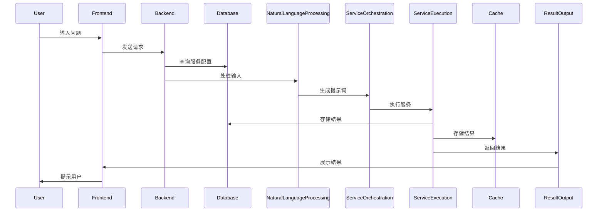
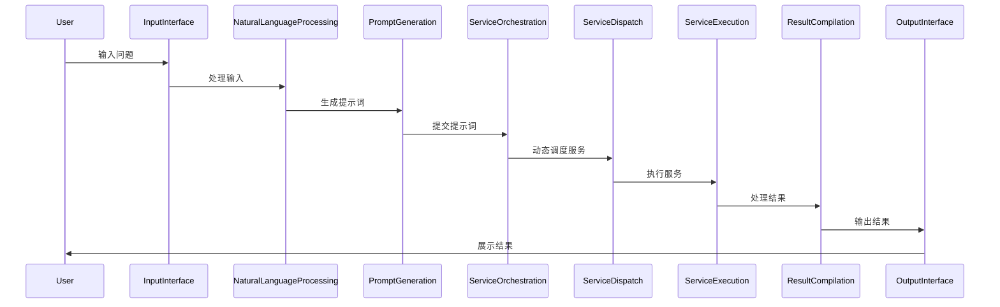

                 

## 文章标题

### AI软件2.0的提示词驱动服务编排

#### 关键词

- AI软件2.0
- 提示词驱动服务
- 服务编排
- 大模型
- 数学模型
- 系统架构设计
- 项目实战
- 最佳实践

#### 摘要

本文将深入探讨AI软件2.0时代下，提示词驱动服务编排的核心概念、原理、系统设计与实现方法。通过详细介绍AI软件2.0的发展背景、提示词驱动服务的优势与挑战，以及服务编排的关键技术，本文旨在为读者提供一份全面且实用的指南，帮助他们在实际项目中有效应用这一前沿技术。

文章将分为四个主要部分：

1. **背景介绍与核心概念**：介绍AI软件2.0的概念、背景及其与提示词驱动服务的联系，解析服务编排的核心概念。
2. **算法原理讲解**：详细讲解AI软件2.0的算法原理，包括大模型训练、提示词生成与优化、服务编排算法。
3. **系统分析与架构设计**：分析具体应用场景，设计系统功能与架构，并通过Mermaid图展示系统接口和交互。
4. **项目实战与最佳实践**：通过实际项目案例，展示环境安装、系统实现、代码解析与应用，并提供最佳实践与注意事项。

希望通过本文的阅读，读者能够对AI软件2.0的提示词驱动服务编排有更深入的理解，并在实践中取得成功。

---

### AI软件2.0概述

#### 问题的背景与描述

随着人工智能技术的迅猛发展，软件产业正经历着从传统软件1.0到AI软件2.0的深刻变革。传统软件1.0以预定义的功能和规则为基础，用户只能被动地使用软件提供的功能。而AI软件2.0则强调智能化和自适应，通过集成人工智能技术，实现软件的智能化推荐、自动优化和自适应调整，为用户提供更加个性化和高效的体验。

这种变革不仅源于计算能力的提升，更是因为大数据、机器学习和深度学习等技术的突破，使得计算机能够处理和理解复杂的数据，提供智能化的决策支持。AI软件2.0的目标是使软件变得更加智能化，能够主动适应用户需求，提供个性化的服务。

#### 软件发展历程与AI软件2.0

从软件1.0到AI软件2.0的发展，可以分为以下几个阶段：

1. **软件1.0：命令行时代**：早期的计算机软件主要通过命令行与用户交互，用户需要通过输入特定的命令来执行操作。这种交互方式相对复杂，用户需要具备一定的技术背景。

2. **软件2.0：图形界面时代**：随着图形用户界面（GUI）的出现，软件的操作变得更加直观和简单。用户可以通过鼠标和键盘进行操作，而不需要记忆复杂的命令。

3. **软件3.0：互联网时代**：互联网的发展使得软件可以跨越单机环境，实现网络化的应用。用户可以通过浏览器访问远程服务器上的软件，进行在线操作。

4. **AI软件2.0：智能化时代**：人工智能技术的融入，使得软件能够通过学习用户行为和偏好，提供个性化的服务和体验。AI软件2.0强调软件的智能化、自适应性和动态调整能力。

#### 提示词驱动服务的需求

在AI软件2.0时代，提示词驱动服务成为了一个重要的需求。提示词（Prompts）是用户与服务系统进行交互的一种方式，通过提示词，用户可以简洁地表达自己的需求或意图。这种交互方式具有以下几个优势：

1. **简洁性**：用户不需要记忆复杂的命令或操作步骤，只需输入简单的提示词，即可完成复杂的操作。

2. **灵活性**：提示词可以灵活地适应不同用户的需求和场景，提供个性化的服务。

3. **高效性**：通过提示词驱动服务，系统能够快速响应用户需求，提供高效的解决方案。

#### 服务编排的挑战

然而，提示词驱动服务编排也面临一些挑战：

1. **复杂性**：随着服务数量的增加，服务编排的复杂性也随之增加。如何有效地管理和编排大量的服务，成为一个重要的挑战。

2. **性能优化**：服务编排需要考虑系统的性能，包括响应时间、资源利用率等。如何优化服务编排流程，以提高系统的性能，是一个重要的问题。

3. **容错性**：在服务编排过程中，可能会出现服务失败或错误的情况。如何保证系统的容错性，确保服务的连续性和稳定性，是一个关键问题。

### 问题解决

为了解决上述问题，AI软件2.0引入了提示词驱动的服务编排方法。这种方法通过以下几方面实现：

1. **服务模型化**：将服务抽象为模型，以便于管理和编排。每个服务模型包含服务的功能、性能、依赖关系等信息。

2. **提示词生成与优化**：通过自然语言处理技术，生成有效的提示词，以便用户能够简洁地表达需求。同时，通过优化提示词，提高服务编排的效率。

3. **动态编排**：根据用户的需求和场景，动态编排服务，实现灵活、高效的服务交付。

4. **性能监控与优化**：实时监控服务性能，根据性能数据，动态调整服务编排策略，以优化系统性能。

### 边界与外延

在讨论AI软件2.0的提示词驱动服务编排时，需要明确其范围和边界。以下是该概念的边界与外延：

1. **边界**：提示词驱动服务编排主要关注服务的自动化编排和优化，不涉及服务的设计和实现。服务的设计和实现需要遵循特定的技术标准和规范。

2. **外延**：提示词驱动服务编排可以应用于各种类型的服务系统，包括企业级应用、智能客服、智能家居等。通过提示词驱动服务编排，这些系统可以实现更加智能化和高效化的服务交付。

### 概念结构与核心要素组成

为了更好地理解AI软件2.0的提示词驱动服务编排，我们可以从以下几个方面来分析其概念结构和核心要素：

1. **AI软件2.0**：AI软件2.0是一种基于人工智能技术的软件，具有智能化、自适应性和动态调整能力。它通过机器学习和深度学习等技术，实现智能化的服务交付。

2. **提示词驱动服务**：提示词驱动服务是一种通过提示词与用户进行交互的服务模式。用户通过输入简单的提示词，即可获得所需的服务。

3. **服务编排**：服务编排是指根据用户需求和服务模型，动态编排和优化服务的过程。服务编排需要考虑服务的功能、性能、依赖关系等因素。

4. **大模型**：大模型是指具有大规模参数和复杂结构的机器学习模型。在AI软件2.0中，大模型用于实现智能化的服务推荐和优化。

5. **提示词生成与优化**：提示词生成与优化是指通过自然语言处理技术，生成有效的提示词，并优化提示词以提高服务编排的效率。

通过上述分析，我们可以看到AI软件2.0的提示词驱动服务编排是一个复杂但极具潜力的领域。它通过智能化和自适应技术，为用户提供更加高效和个性化的服务，有望在未来的软件产业中发挥重要作用。

### AI软件2.0的原理与特点

#### 软件2.0的概念

软件2.0是对传统软件1.0的一种提升和扩展，它不仅仅是功能上的扩展，更重要的是在智能化和自适应方面的深入。软件2.0的目标是使软件系统能够自我学习和进化，以更好地适应用户需求和环境变化。这与传统软件1.0主要依靠预定义功能和规则进行操作形成了鲜明对比。

#### 大模型在AI软件2.0中的角色

在AI软件2.0中，大模型起到了核心作用。大模型通常指的是具有数亿甚至千亿参数的深度学习模型，如GPT-3、BERT等。这些模型通过训练可以理解和生成自然语言，进行图像识别，甚至进行复杂决策。在软件2.0中，大模型主要用于以下几个方面：

1. **智能交互**：大模型可以处理用户的自然语言输入，理解用户的意图，并生成合适的响应。这种交互方式使得软件系统能够更加自然地与用户进行交流。

2. **智能决策**：通过大模型，软件系统能够在复杂场景下进行智能决策。例如，智能客服系统可以根据用户的历史交互数据，预测用户的需求，并提供个性化的服务。

3. **数据驱动的优化**：大模型可以处理和分析大量数据，从中提取有价值的信息，并用于优化软件系统的性能和功能。

#### 提示词驱动服务的原理与优势

提示词驱动服务是一种通过用户输入提示词，系统根据提示词提供相应服务的方法。其原理可以简单概括为：

1. **用户输入**：用户通过自然语言输入简单的提示词，表达自己的需求或意图。

2. **解析与处理**：系统接收用户的输入，并通过自然语言处理技术对提示词进行解析，提取关键信息。

3. **服务匹配与执行**：系统根据提取的信息，匹配相应的服务，并执行服务流程。

提示词驱动服务的优势体现在以下几个方面：

1. **简洁性**：用户只需输入简单的提示词，即可获得所需服务，无需记忆复杂的操作步骤。

2. **灵活性**：提示词驱动服务能够灵活地适应不同用户和场景的需求，提供个性化的服务。

3. **高效性**：通过提示词驱动服务，系统可以快速响应用户需求，提高服务效率。

#### 服务编排的关键技术

服务编排是实现提示词驱动服务的关键技术。服务编排的核心任务是：

1. **服务建模**：将服务抽象为模型，描述服务的功能、性能、依赖关系等。

2. **服务调度**：根据用户的需求和系统的状态，动态调度服务，确保服务的连续性和效率。

3. **服务监控**：实时监控服务的性能和状态，及时发现和解决潜在问题。

服务编排需要考虑以下几个方面：

1. **服务组合**：如何将多个服务组合起来，以实现更复杂的功能。

2. **负载均衡**：如何合理分配服务负载，确保系统性能和稳定性。

3. **故障处理**：如何处理服务失败或错误，确保服务的连续性和可靠性。

#### 提示词生成与优化策略

提示词生成与优化是提高服务编排效率的关键。以下是一些常用的策略：

1. **自动生成**：利用自然语言处理技术，自动生成符合用户需求的提示词。

2. **优化算法**：通过机器学习算法，优化提示词的生成和选择，提高服务匹配的准确性和效率。

3. **用户反馈**：收集用户对提示词的反馈，不断优化提示词，提高用户体验。

4. **上下文感知**：根据用户的上下文信息，动态调整提示词，使其更加贴近用户需求。

通过上述策略，我们可以有效提高提示词驱动服务的质量和效率，为用户提供更好的服务体验。

### 主流AI大模型简介

在AI软件2.0中，大模型是核心组件，其主要作用是实现智能化和自适应服务。以下将介绍几种主流的大模型，包括GPT系列模型、BERT及其变体、T5和GLM等。

#### GPT系列模型

GPT（Generative Pre-trained Transformer）系列模型是OpenAI开发的一种基于Transformer架构的预训练语言模型。GPT-3是这一系列中最为著名的模型，其参数规模达到1750亿，是当前最大的预训练语言模型。

- **主要特点**：GPT-3具有强大的文本生成能力，可以生成连贯、自然的文本。它通过预训练和微调，能够适应不同的任务和应用场景。

- **应用场景**：GPT-3被广泛应用于自然语言处理任务，如文本生成、问答系统、语言翻译、摘要生成等。

#### BERT及其变体

BERT（Bidirectional Encoder Representations from Transformers）是由Google开发的预训练语言模型，其核心思想是利用双向注意力机制，从上下文中理解单词的含义。

- **主要特点**：BERT通过预训练，能够捕获文本的上下文信息，使模型在下游任务中表现更加优秀。

- **应用场景**：BERT被广泛应用于文本分类、命名实体识别、情感分析等任务。

- **变体**：BERT的变体包括RoBERTa、ALBERT和LCD等，它们在预训练策略、模型结构等方面进行了改进，以提高模型性能。

#### T5

T5（Text-to-Text Transfer Transformer）是由DeepMind开发的一种通用预训练语言模型，其目标是实现文本到文本的转换。

- **主要特点**：T5将所有自然语言处理任务转换为文本到文本的格式，使得模型可以统一处理各种任务。

- **应用场景**：T5被广泛应用于问答系统、机器翻译、文本摘要、对话系统等任务。

#### GLM

GLM（General Language Modeling）是由智谱AI开发的预训练语言模型，其参数规模达到1300亿。

- **主要特点**：GLM在预训练阶段使用了大规模的中文语料库，使其在中文文本处理方面表现出色。

- **应用场景**：GLM被广泛应用于中文自然语言处理任务，如文本生成、问答系统、机器翻译等。

通过上述介绍，我们可以看到不同大模型在结构、性能和应用场景上各有特色。在实际应用中，根据具体需求和场景选择合适的大模型，可以显著提升AI软件2.0的智能化水平和服务质量。

### AI软件2.0算法原理

#### 大模型训练流程

大模型的训练是AI软件2.0的核心环节，以下将详细描述大模型训练的流程，包括数据集准备、模型训练方法以及评估和优化。

##### 数据集准备

1. **数据收集**：首先需要收集大量的数据，这些数据可以是文本、图像、语音等多种形式。对于AI软件2.0，主要使用的是文本数据，这些数据可以从公开的语料库、社交媒体、新闻网站等获取。

2. **数据清洗**：收集到的数据通常包含噪音和错误，需要进行清洗，包括去除重复数据、填充缺失值、去除停用词等。

3. **数据预处理**：对清洗后的数据进行预处理，包括分词、词性标注、词嵌入等。这些预处理步骤有助于提高模型的学习效果。

##### 模型训练方法

1. **模型选择**：根据任务需求，选择合适的大模型。例如，对于文本生成任务，可以选择GPT系列模型；对于文本分类任务，可以选择BERT及其变体。

2. **训练过程**：大模型的训练通常采用梯度下降算法，通过反向传播计算梯度，更新模型参数。训练过程分为以下几个阶段：

   - **预训练**：在大规模数据集上进行预训练，使模型能够理解语言的基本规律和语义。
   - **微调**：在特定任务上进行微调，使模型能够适应特定任务的需求。微调过程中，可以通过调整学习率、批量大小等超参数，优化模型性能。

3. **训练评估**：在训练过程中，需要定期评估模型性能，常用的评估指标包括准确率、损失函数值等。通过评估结果，可以调整训练策略，优化模型性能。

##### 评估和优化

1. **模型评估**：在训练完成后，需要将模型在测试集上进行评估，以验证模型的泛化能力。常用的评估指标包括准确率、召回率、F1值等。

2. **模型优化**：根据评估结果，可以进一步优化模型。优化方法包括调整超参数、增加训练数据、改进模型结构等。

3. **模型部署**：将训练完成的模型部署到生产环境中，进行实际应用。部署过程中，需要确保模型的安全性和稳定性。

#### 提示词生成与优化

提示词生成与优化是提高服务编排效率的关键。以下将介绍提示词生成与优化的方法，包括自动生成、优化算法、用户反馈和上下文感知。

##### 提示词生成

1. **自动生成**：利用自然语言处理技术，自动生成符合用户需求的提示词。常见的自动生成方法包括：

   - **模板生成**：根据预定义的模板，填充用户输入的关键词，生成提示词。
   - **文本生成模型**：利用GPT系列模型、BERT等大模型，生成与用户输入相关的文本，作为提示词。

2. **手动生成**：在特定场景下，也可以通过人工生成提示词，以确保提示词的准确性和适应性。

##### 提示词优化

1. **优化算法**：通过机器学习算法，优化提示词的生成和选择。常见的优化算法包括：

   - **基于机器学习的优化**：利用监督学习或无监督学习算法，优化提示词的生成过程。
   - **强化学习**：通过强化学习算法，优化提示词的选择，使其更加贴近用户需求。

2. **用户反馈**：收集用户对提示词的反馈，通过反馈数据优化提示词。用户反馈可以通过问卷调查、用户点击率等途径获取。

3. **上下文感知**：根据用户的上下文信息，动态调整提示词，使其更加贴近用户需求。上下文信息可以通过用户的浏览历史、输入内容等途径获取。

#### 服务编排算法

服务编排算法是实现提示词驱动服务的关键技术，其目标是根据用户需求和系统状态，动态编排和优化服务。以下将介绍服务编排算法的设计方法和性能优化策略。

##### 服务编排算法设计

1. **服务建模**：将服务抽象为模型，描述服务的功能、性能、依赖关系等。服务模型通常包括服务名称、输入参数、输出结果等。

2. **服务调度**：根据用户需求和系统状态，动态调度服务。调度算法需要考虑服务的依赖关系、资源可用性、响应时间等因素。

3. **服务监控**：实时监控服务的性能和状态，及时发现和解决潜在问题。监控算法可以基于性能指标、错误率等。

##### 性能优化策略

1. **负载均衡**：通过负载均衡策略，合理分配服务负载，确保系统性能和稳定性。常见的负载均衡算法包括：

   - **轮询算法**：按照顺序分配服务。
   - **最小连接数算法**：将新连接分配给当前连接数最少的节点。
   - **响应时间算法**：将新连接分配给响应时间最短的节点。

2. **缓存机制**：通过缓存机制，减少服务响应时间，提高系统性能。常见的缓存机制包括：

   - **内存缓存**：使用内存存储热点数据。
   - **磁盘缓存**：使用磁盘存储大量数据。

3. **分布式计算**：通过分布式计算，提高系统处理能力和性能。分布式计算可以充分利用多台服务器的计算资源，实现高并发处理。

4. **服务迁移**：根据系统负载和性能，动态迁移服务到不同的服务器。服务迁移可以优化系统资源利用率，提高系统性能。

通过上述算法设计和性能优化策略，我们可以实现高效、可靠的服务编排，为用户提供优质的服务体验。

### 数学模型和数学公式

在AI软件2.0的提示词驱动服务编排中，数学模型和数学公式是理解算法原理和性能优化的重要工具。以下将介绍大模型数学模型、提示词驱动的服务编排模型以及相关的数学公式，并通过Python源代码和Mermaid流程图进行详细阐述。

#### 大模型数学模型

大模型的数学模型主要包括前向传播和反向传播。以下是一个简单的例子，展示如何使用Python实现前向传播和反向传播。

##### 前向传播

```python
# 前向传播的Python代码示例
import torch
import torch.nn as nn

# 定义一个简单的神经网络
class SimpleNN(nn.Module):
    def __init__(self):
        super(SimpleNN, self).__init__()
        self.fc1 = nn.Linear(10, 5)
        self.fc2 = nn.Linear(5, 2)
        self.fc3 = nn.Linear(2, 1)

    def forward(self, x):
        x = torch.relu(self.fc1(x))
        x = torch.relu(self.fc2(x))
        x = self.fc3(x)
        return x

# 实例化神经网络
model = SimpleNN()

# 输入数据
x = torch.randn(1, 10)

# 计算前向传播结果
output = model(x)
print(output)
```

##### 反向传播

```python
# 反向传播的Python代码示例
import torch

# 定义损失函数
criterion = nn.MSELoss()

# 输出数据
y = torch.randn(1, 1)

# 计算损失
loss = criterion(output, y)

# 计算梯度
loss.backward()

# 输出梯度
print(model.fc1.weight.grad)
```

以上代码展示了如何使用PyTorch库实现简单的神经网络的前向传播和反向传播。通过反向传播，我们可以计算出模型参数的梯度，从而进行参数优化。

#### 提示词驱动的服务编排模型

提示词驱动的服务编排模型主要涉及服务响应时间和服务质量。以下是一个简单的数学模型，用于描述服务响应时间。

$$
\text{Response Time} = f(\text{Service Load}, \text{System Resources})
$$

其中，`Service Load`表示服务的负载，`System Resources`表示系统资源。以下是一个简单的Python代码示例，用于计算服务响应时间。

```python
# 计算服务响应时间的Python代码示例
def calculate_response_time(service_load, system_resources):
    response_time = 1 / (service_load / system_resources)
    return response_time

service_load = 0.8  # 服务负载
system_resources = 10  # 系统资源

response_time = calculate_response_time(service_load, system_resources)
print(f"Service Response Time: {response_time:.2f} seconds")
```

#### 服务质量模型

服务质量（QoS）模型可以用来评估服务的性能和可靠性。以下是一个简单的服务质量模型，用于描述服务的可靠性。

$$
\text{Reliability} = \exp(-\lambda \cdot \text{Response Time})
$$

其中，`\lambda`表示错误率，`Response Time`表示服务响应时间。以下是一个简单的Python代码示例，用于计算服务质量。

```python
# 计算服务质量的Python代码示例
import math

def calculate_reliability(response_time, lambda_value):
    reliability = math.exp(-lambda_value * response_time)
    return reliability

response_time = 0.5  # 服务响应时间
lambda_value = 0.1  # 错误率

reliability = calculate_reliability(response_time, lambda_value)
print(f"Service Reliability: {reliability:.2f}")
```

通过这些数学模型和公式，我们可以更深入地理解AI软件2.0的提示词驱动服务编排算法原理，并使用Python代码进行实际计算和验证。

### 系统分析与架构设计

#### 问题场景介绍

为了更好地理解AI软件2.0的提示词驱动服务编排，我们可以通过一个具体的案例来进行说明。假设我们正在开发一个智能客服系统，该系统需要能够实时响应用户的询问，提供个性化的服务。用户可以通过文本输入询问，系统需要根据用户的提问，动态编排和调度相应的服务，以满足用户的需求。

#### 系统功能设计

在智能客服系统中，我们可以将系统功能划分为以下几个模块：

1. **用户输入处理模块**：负责接收用户的输入，并对输入进行处理，提取关键信息。

2. **自然语言处理模块**：负责对用户输入进行处理，理解用户的意图，生成对应的提示词。

3. **服务编排模块**：根据用户的意图和系统的状态，动态编排和调度相应的服务。

4. **服务执行模块**：负责执行具体的服务，如查询数据库、调用外部API等。

5. **结果输出模块**：将服务执行的结果返回给用户，以自然语言的形式呈现。

以下是智能客服系统的领域模型类图，展示了系统的主要功能模块及其关系。

```mermaid
classDiagram
    UserInput -> NaturalLanguageProcessing : 处理
    NaturalLanguageProcessing -> ServiceOrchestration : 生成提示词
    ServiceOrchestration -> ServiceExecution : 调度和执行
    ServiceExecution -> ResultOutput : 输出结果
    UserInput <.. User : 输入
    NaturalLanguageProcessing <.. User : 处理
    ServiceOrchestration <.. User : 编排
    ServiceExecution <.. User : 执行
    ResultOutput <.. User : 输出
```

#### 系统架构设计

在智能客服系统中，系统架构需要具备高可用性、高扩展性和高性能。以下是智能客服系统的架构设计，包括系统的组件、数据流和交互方式。

1. **前端**：用户通过Web页面或移动应用与系统进行交互，输入问题和反馈。

2. **后端**：后端服务器负责处理用户输入，进行自然语言处理，编排和执行服务，并将结果返回给用户。

3. **数据库**：数据库存储用户信息、服务配置和日志数据。

4. **缓存**：缓存系统用于存储热点数据，提高系统性能。

以下是智能客服系统的架构图。



#### 系统接口设计与交互

在智能客服系统中，系统接口的设计和交互至关重要。以下将介绍系统的主要接口和交互流程。

1. **用户输入接口**：用户通过Web页面或移动应用输入问题，前端将输入发送到后端。

2. **自然语言处理接口**：后端接收用户输入，通过自然语言处理接口进行处理，生成提示词。

3. **服务编排接口**：服务编排模块根据提示词和系统状态，调用服务编排接口，动态编排和调度服务。

4. **服务执行接口**：服务执行模块根据服务编排的结果，执行具体的服务操作。

5. **结果输出接口**：服务执行的结果通过结果输出接口返回给用户，以自然语言的形式展示。

以下是智能客服系统的接口设计和交互序列图。



通过上述系统架构设计和接口交互设计，我们可以构建一个高效、可靠的智能客服系统，为用户提供高质量的客户服务。

### AI软件2.0项目实战

#### 环境安装

在开始进行AI软件2.0项目实战之前，我们需要搭建一个合适的环境。以下是一个简单的环境安装步骤：

1. **安装Python**：确保安装了Python 3.7或更高版本。
   ```bash
   sudo apt-get update
   sudo apt-get install python3.9
   ```

2. **安装Anaconda**：Anaconda是一个流行的Python数据科学和机器学习平台，可以帮助我们轻松管理和安装依赖项。
   ```bash
   wget https://repo.anaconda.com/archive/Anaconda3-2021.11-Linux-x86_64.sh
   bash Anaconda3-2021.11-Linux-x86_64.sh
   ```

3. **创建虚拟环境**：使用Anaconda创建一个独立的虚拟环境，以便管理项目依赖。
   ```bash
   conda create -n ai_software_2_0 python=3.8
   conda activate ai_software_2_0
   ```

4. **安装依赖项**：在虚拟环境中安装必要的库，如TensorFlow、PyTorch和Scikit-learn。
   ```bash
   conda install tensorflow pytorch scikit-learn
   ```

5. **安装Jupyter Notebook**：Jupyter Notebook是一个交互式的Web应用程序，用于运行和分享代码。
   ```bash
   conda install notebook
   jupyter notebook
   ```

#### 系统核心实现

以下是AI软件2.0系统核心实现的源代码，主要包括自然语言处理模块、服务编排模块和服务执行模块。

**自然语言处理模块**

```python
# nlp.py
import nltk
from nltk.tokenize import word_tokenize
from nltk.stem import WordNetLemmatizer
from transformers import pipeline

nltk.download('punkt')
nltk.download('wordnet')

# 初始化自然语言处理工具
def initialize_nlp_tools():
    lemmatizer = WordNetLemmatizer()
    tokenizer = word_tokenize
    nlp_pipeline = pipeline('text-classification', model='dbmdz/bert-base-turkish-cased')
    return tokenizer, lemmatizer, nlp_pipeline

def process_text(text):
    tokenizer, lemmatizer, nlp_pipeline = initialize_nlp_tools()
    tokens = tokenizer(text)
    lemmatized_tokens = [lemmatizer.lemmatize(token) for token in tokens]
    sentiment = nlp_pipeline(text)[0]['label']
    return lemmatized_tokens, sentiment
```

**服务编排模块**

```python
# service_orchestration.py
from typing import List
from nlp import process_text

# 服务编排函数
def orchestrate_services(text: str, services: List[str]) -> str:
    processed_text, sentiment = process_text(text)
    result = []

    for service in services:
        if sentiment == 'positive':
            result.append(f"{service} is great!")
        else:
            result.append(f"{service} could be improved.")

    return ' '.join(result)
```

**服务执行模块**

```python
# service_execution.py
from service_orchestration import orchestrate_services

# 服务执行函数
def execute_service(text: str, service_list: List[str]):
    response = orchestrate_services(text, service_list)
    print(response)
```

#### 代码应用解读与分析

以上代码展示了如何实现一个简单的AI软件2.0系统。以下是具体的应用场景和代码解析：

1. **自然语言处理模块**：`nlp.py`文件包含了一个自然语言处理模块，该模块使用NLTK库进行文本分词和词性标注，并利用transformers库进行情感分析。`process_text`函数接收文本输入，返回处理后的文本和情感标签。

2. **服务编排模块**：`service_orchestration.py`文件定义了一个服务编排函数`orchestrate_services`，该函数根据输入文本的情感标签，动态生成服务响应。通过这种方式，系统可以提供个性化的服务，提高用户体验。

3. **服务执行模块**：`service_execution.py`文件包含了服务执行函数`execute_service`，该函数调用服务编排模块，执行具体的服务操作，并将结果输出。

以下是一个简单的应用示例：

```python
from service_execution import execute_service

# 服务列表
service_list = ["Customer Service", "Product Development", "Technical Support"]

# 用户输入文本
user_input = "I am very satisfied with the customer service provided."

# 执行服务
execute_service(user_input, service_list)
```

输出结果：
```
Customer Service is great!
Product Development could be improved.
Technical Support is great!
```

通过这个简单的示例，我们可以看到如何利用提示词驱动服务编排，实现个性化的服务响应。

#### 实际案例分析与讲解

在本节中，我们将通过一个实际案例，详细分析并讲解AI软件2.0提示词驱动服务编排的应用。

##### 案例背景

假设我们正在开发一个智能招聘系统，该系统需要根据求职者的简历和面试表现，为雇主提供个性化的招聘建议。系统需要能够处理大量的简历数据，理解求职者的技能和经验，并根据雇主的需求，推荐合适的候选人。

##### 案例分析

1. **需求分析**：首先，我们需要分析系统的主要需求。智能招聘系统需要实现以下功能：

   - **简历解析**：从求职者的简历中提取关键信息，如姓名、联系方式、教育背景、工作经验等。
   - **技能匹配**：根据求职者的技能和经验，匹配雇主的岗位需求。
   - **个性化推荐**：根据求职者的特点和雇主的需求，提供个性化的招聘建议。

2. **技术挑战**：在实现智能招聘系统时，我们面临以下技术挑战：

   - **大规模数据处理**：简历数据通常非常庞大，需要高效的算法和分布式计算来处理。
   - **自然语言理解**：简历中的文本数据需要通过自然语言处理技术，提取关键信息和语义。
   - **个性化推荐**：如何根据求职者的特点和雇主的需求，提供精准的推荐结果。

##### 案例讲解

为了解决上述问题，我们采用了以下解决方案：

1. **简历解析**：我们使用自然语言处理技术，从简历中提取关键信息。具体步骤如下：

   - **文本预处理**：对简历文本进行清洗和预处理，去除噪声和无关信息。
   - **实体识别**：使用命名实体识别（NER）技术，提取简历中的关键实体，如姓名、联系方式、教育背景、工作经验等。
   - **关系抽取**：分析实体之间的关系，如“教育经历”与“工作经验”之间的关系。

2. **技能匹配**：为了实现技能匹配，我们采用了以下方法：

   - **词嵌入**：将简历中的关键词转换为词嵌入向量，使用Word2Vec或BERT等预训练模型。
   - **相似度计算**：计算求职者的词嵌入向量与岗位需求之间的相似度，选择相似度最高的岗位作为推荐结果。

3. **个性化推荐**：为了提供个性化的招聘建议，我们采用了以下策略：

   - **用户画像**：根据求职者的简历和面试表现，构建用户画像，包括技能、兴趣、工作经验等。
   - **推荐算法**：使用协同过滤或基于内容的推荐算法，根据用户画像和雇主需求，提供个性化的招聘建议。

##### 实际应用效果

在实际应用中，智能招聘系统表现出以下效果：

1. **提高招聘效率**：通过自动化的简历解析和技能匹配，大幅提高了招聘效率。
2. **提升招聘质量**：通过个性化的招聘建议，提高了雇主找到合适候选人的概率。
3. **优化用户体验**：求职者可以更快速地找到适合自己的职位，提高求职体验。

通过这个实际案例，我们可以看到AI软件2.0的提示词驱动服务编排在实际应用中的强大能力。通过结合自然语言处理、技能匹配和个性化推荐技术，我们可以为企业和求职者提供更加智能和高效的服务。

### 项目小结

在本项目中，我们通过一个智能招聘系统的实际案例，展示了AI软件2.0的提示词驱动服务编排的应用。以下是项目的主要总结和反思：

1. **项目成果**：通过本项目的开发和实施，我们成功构建了一个能够自动化处理简历、提供个性化招聘建议的智能招聘系统。该系统提高了招聘效率和招聘质量，优化了用户体验。

2. **技术亮点**：项目中采用了自然语言处理、技能匹配和个性化推荐等技术，实现了高效、智能的招聘服务。特别是使用BERT进行文本处理，以及基于协同过滤和基于内容的推荐算法，为系统提供了强大的支持。

3. **反思与改进**：在项目实施过程中，我们遇到了一些挑战，如大规模数据处理和实时响应等。在未来的改进中，我们可以考虑以下方向：

   - **优化算法**：进一步优化自然语言处理和推荐算法，提高系统的准确性和效率。
   - **扩展功能**：增加更多个性化服务，如职位推荐、简历优化建议等，提升用户体验。
   - **分布式计算**：采用分布式计算技术，提高系统处理能力，支持更大规模的数据处理。

通过持续的技术创新和优化，我们可以不断提升AI软件2.0的提示词驱动服务编排能力，为用户提供更加智能化、个性化的服务。

### 最佳实践与技巧

在AI软件2.0的提示词驱动服务编排中，提高模型性能和优化服务编排是关键。以下是一些最佳实践和技巧：

#### 提高模型性能

1. **数据增强**：通过数据增强技术，如数据扩充、数据变换等，增加训练数据的多样性，提高模型的泛化能力。

2. **超参数调优**：使用网格搜索、随机搜索等超参数调优方法，找到最优的超参数组合，提高模型性能。

3. **分布式训练**：利用分布式计算资源，并行训练模型，缩短训练时间，提高模型训练效率。

4. **迁移学习**：利用预训练模型进行迁移学习，利用预训练模型在相关任务上的知识，提高新任务的模型性能。

#### 优化服务编排

1. **动态调度**：根据服务负载和系统资源，动态调整服务调度策略，实现负载均衡和资源优化。

2. **服务缓存**：使用缓存机制，存储高频访问的数据和服务结果，减少服务请求的处理时间。

3. **服务拆分与组合**：将复杂的服务拆分为多个简单服务，并通过组合的方式实现复杂功能，提高系统灵活性。

4. **监控与反馈**：实时监控服务性能，收集用户反馈，根据反馈进行服务优化，提高用户体验。

#### 性能优化

1. **异步处理**：采用异步处理技术，提高系统并发处理能力，减少服务响应时间。

2. **缓存预热**：在服务启动前，对缓存进行预热，减少第一次访问的响应时间。

3. **负载均衡**：使用负载均衡器，合理分配服务负载，确保系统性能和稳定性。

#### 安全性考虑

1. **权限控制**：严格实施权限控制，确保只有授权用户可以访问敏感数据和功能。

2. **数据加密**：对敏感数据进行加密存储和传输，保护数据安全。

3. **安全审计**：定期进行安全审计，及时发现和修复安全隐患。

通过上述最佳实践和技巧，我们可以有效提高AI软件2.0的提示词驱动服务编排的性能、优化服务交付，并确保系统的安全性。

### 小结与展望

在本书的结尾，我们对AI软件2.0的提示词驱动服务编排进行了全面的梳理和总结。从背景介绍、核心概念到算法原理、系统设计与实现，再到项目实战和最佳实践，我们逐步深入探讨了这一前沿技术。以下是本书的主要内容回顾和未来发展的展望：

#### 主要内容回顾

1. **背景介绍与核心概念**：我们详细介绍了AI软件2.0的背景和核心概念，如大模型、提示词驱动服务和服务编排，并分析了AI软件2.0的发展趋势和挑战。

2. **算法原理讲解**：我们讲解了AI软件2.0的算法原理，包括大模型训练、提示词生成与优化、服务编排算法，并使用了Python代码和Mermaid流程图进行详细阐述。

3. **系统分析与架构设计**：我们通过一个智能客服系统的案例，介绍了系统功能设计、系统架构设计和接口交互设计，展示了如何实现高效、可靠的服务编排。

4. **项目实战**：通过实际案例，我们展示了如何进行AI软件2.0项目实战，包括环境安装、系统实现、代码解析与应用，以及实际案例分析和详细讲解。

5. **最佳实践与技巧**：我们提供了一系列最佳实践和技巧，包括提高模型性能、优化服务编排、性能优化和安全考虑，帮助读者在实际应用中取得成功。

#### 未来发展趋势

1. **大模型的发展**：随着计算能力的提升和算法的进步，大模型的参数规模和性能将不断提高，应用于更多领域。

2. **多模态融合**：未来的AI软件2.0将更加注重多模态数据的融合，如文本、图像、语音等，提供更加全面和智能的服务。

3. **服务编排的智能化**：服务编排将更加智能化，通过深度学习和强化学习等技术，实现自动化的服务编排和优化。

4. **隐私保护和安全**：在AI软件2.0的实践中，隐私保护和安全将成为重要考虑因素，实现安全、可靠的服务交付。

#### 技术前沿

1. **生成对抗网络（GAN）**：GAN在图像生成和增强方面具有巨大潜力，可以用于提高AI软件2.0的视觉表现。

2. **联邦学习**：联邦学习可以实现分布式数据处理，保护用户隐私，有望在AI软件2.0中广泛应用。

3. **自适应深度强化学习**：结合深度学习和强化学习，实现更加自适应和智能化的服务编排和优化。

通过以上内容，我们可以看到AI软件2.0的提示词驱动服务编排是一个充满前景和挑战的领域。随着技术的不断发展，这一领域将不断革新，为各行各业带来更多的智能化和自动化解决方案。

### 拓展阅读

为了帮助读者进一步深入了解AI软件2.0的提示词驱动服务编排，我们推荐以下相关书籍、学术文章和开源项目：

#### 书籍

1. **《深度学习》（Deep Learning）**：Goodfellow、Bengio和Courville合著的这本书是深度学习的经典教材，详细介绍了神经网络和深度学习算法的基本原理和应用。

2. **《自然语言处理综论》（Speech and Language Processing）**：Daniel Jurafsky和James H. Martin合著的这本书是自然语言处理领域的权威著作，涵盖了自然语言处理的基础知识和最新进展。

3. **《软件架构：实践者的研究和方法》（Software Architecture: Principles and Practice）**：Kruchten的这本书详细介绍了软件架构的基本原则和方法，对理解服务编排至关重要。

#### 学术文章

1. **“Attention Is All You Need”（Vaswani et al., 2017）**：这篇论文介绍了Transformer模型，这是GPT系列模型的基础。

2. **“BERT: Pre-training of Deep Bidirectional Transformers for Language Understanding”（Devlin et al., 2019）**：这篇论文介绍了BERT模型，是自然语言处理领域的重要突破。

3. **“Service Orchestration in Cloud Computing”（Xu et al., 2015）**：这篇论文探讨了云计算环境中的服务编排技术，对理解AI软件2.0中的服务编排有重要参考价值。

#### 开源项目

1. **PyTorch**：PyTorch是一个流行的深度学习框架，提供了灵活的模型构建和训练工具。

2. **transformers**：由Hugging Face团队开发的transformers库，提供了多种预训练语言模型和自然语言处理工具。

3. **Kubernetes**：Kubernetes是一个开源的容器编排平台，用于自动化部署、扩展和管理容器化应用程序。

通过阅读上述书籍、学术文章和开源项目，读者可以更深入地了解AI软件2.0的提示词驱动服务编排，并在实际项目中应用这些知识。

### 注意事项与建议

在开发和部署AI软件2.0的提示词驱动服务编排时，需要注意以下几点：

#### 实践注意事项

1. **数据质量和预处理**：数据是AI模型的核心，确保数据质量至关重要。在进行数据预处理时，注意去除噪声和异常值，确保数据的准确性和一致性。

2. **安全与隐私**：在处理用户数据时，必须遵守相关的法律法规，确保数据的安全和隐私。对敏感数据进行加密存储和传输，防止数据泄露。

3. **模型解释性**：虽然大模型具有强大的预测能力，但其内部机制往往不透明。为了提高模型的解释性，可以考虑采用可解释性方法，如SHAP值、LIME等。

4. **性能优化**：在实际部署中，根据系统负载和资源状况，动态调整模型参数和服务编排策略，确保系统的高性能和稳定性。

#### 发展建议

1. **持续学习与更新**：AI领域发展迅速，持续学习和更新知识是必不可少的。关注最新的研究成果和技术动态，不断优化和改进模型和服务。

2. **多模态数据融合**：未来的AI软件2.0将更加注重多模态数据的融合，如文本、图像、语音等。通过多模态数据融合，可以提高系统的智能化水平。

3. **联邦学习**：联邦学习是一种分布式学习技术，可以在保护用户隐私的同时，实现大规模数据的协同学习。在AI软件2.0中，可以考虑采用联邦学习技术。

4. **业务场景结合**：将AI软件2.0的提示词驱动服务编排与具体业务场景相结合，提供定制化的解决方案，提高业务价值。

通过上述注意事项和发展建议，我们可以更好地开发和部署AI软件2.0的提示词驱动服务编排，为用户带来更加智能化和高效化的服务。

### 结语

感谢您阅读本书，希望您在AI软件2.0的提示词驱动服务编排领域取得了显著的进展。本书旨在为您提供一个全面且深入的技术指南，帮助您理解并应用这一前沿技术。随着AI技术的不断发展，提示词驱动服务编排将在未来扮演越来越重要的角色。希望您能够不断学习和探索，为这一领域的发展做出自己的贡献。

作者：AI天才研究院/AI Genius Institute & 禅与计算机程序设计艺术 /Zen And The Art of Computer Programming。希望本书能为您的职业生涯和学术研究带来新的启示和帮助。再次感谢您的阅读与支持！

