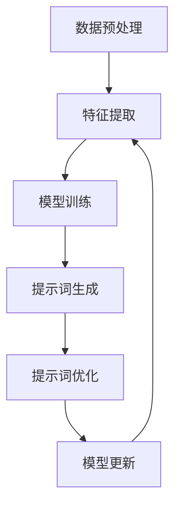
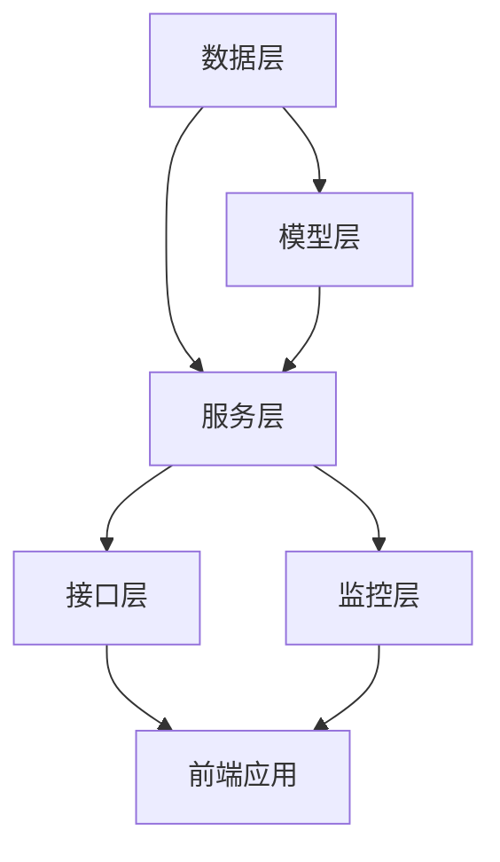
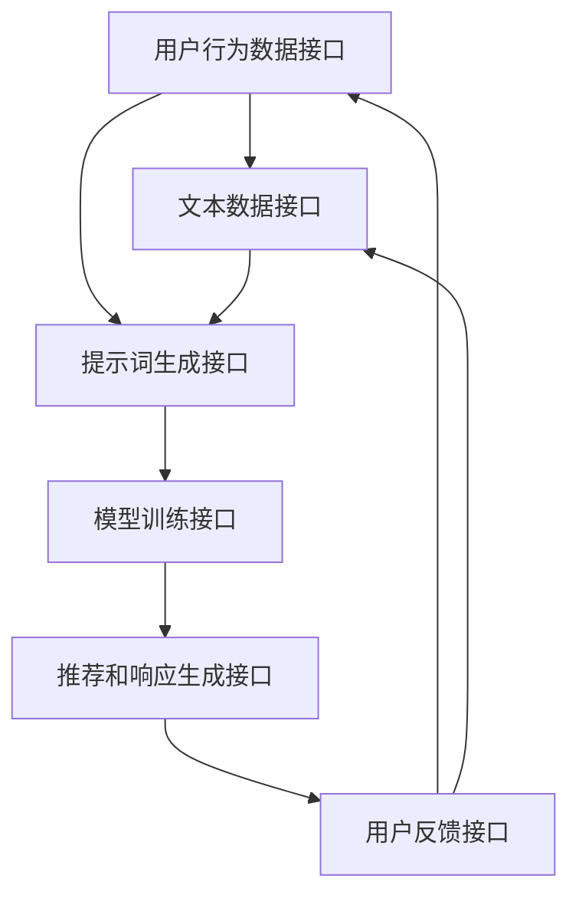
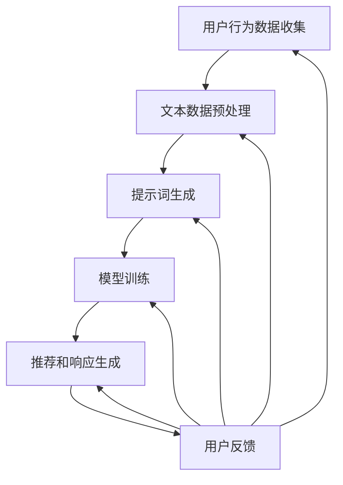

                 

# AI软件2.0的提示词驱动架构设计

## 关键词
- AI软件2.0
- 提示词驱动
- 架构设计
- 人工智能
- 软件开发
- 系统优化

## 摘要
本文将深入探讨AI软件2.0的提示词驱动架构设计，首先介绍AI软件2.0的概念和提示词驱动的原理，然后详细分析其核心概念与联系，包括提示词的定义、生成机制及其在AI软件开发中的应用。接下来，我们将逐步讲解提示词驱动架构的设计原则、实现方法和关键组件，并通过实际案例展示其应用场景。最后，本文将总结提示词驱动架构的优势和未来研究方向，为读者提供有价值的参考。

## 引言与背景

### AI软件2.0的概念与演进
人工智能（AI）技术的发展经历了多个阶段，从早期的规则推理和知识表示，到机器学习、深度学习，以及现在的强化学习、生成对抗网络等。随着计算能力的提升和大数据的普及，AI技术正在从传统的基于规则的系统向更加智能化、自适应的系统转变，这标志着AI软件的2.0时代。

AI软件2.0，也被称为下一代AI软件，其核心特征在于更加智能化、灵活性和自适应性。与传统的AI软件相比，AI软件2.0具有以下几个显著特点：

1. **自主学习与进化**：AI软件2.0能够通过自我学习不断优化性能，适应新的环境和任务。
2. **多模态处理**：AI软件2.0能够处理多种数据类型，如文本、图像、音频等，实现跨模态的信息融合。
3. **人机交互**：AI软件2.0通过自然语言处理等技术，使得人机交互更加自然和流畅。
4. **实时决策**：AI软件2.0能够实时响应用户的需求和环境变化，提供实时决策支持。

### 提示词驱动技术的原理
提示词（Prompt）是一种引导AI模型进行任务的方式，它通过向模型提供额外的信息，帮助模型更好地理解和执行任务。提示词驱动技术是AI软件2.0中的一个重要创新，它使得AI系统能够更加灵活地适应不同的任务场景。

提示词驱动技术的原理可以概括为以下几点：

1. **引导学习**：提示词可以引导AI模型学习特定的任务，提高模型的性能和精度。
2. **上下文感知**：通过提供上下文信息，提示词可以帮助模型更好地理解任务的背景和需求。
3. **灵活调整**：提示词可以动态调整，以适应不同的任务场景和用户需求。

### 当前AI软件的发展趋势
随着AI技术的不断进步，AI软件正在向更加智能化、定制化和自动化的方向发展。以下是当前AI软件发展的几个主要趋势：

1. **智能化**：AI软件正逐渐从规则驱动向数据驱动转变，通过自我学习和优化，实现更加智能的决策和预测。
2. **定制化**：AI软件可以根据用户的需求和场景进行定制化开发，提供更加个性化的服务。
3. **自动化**：AI技术正在推动自动化的发展，如自动化数据采集、自动化流程管理、自动化风险评估等。
4. **跨领域融合**：AI技术与其他领域（如医疗、金融、教育等）的融合，推动了AI软件的广泛应用。

### 背景介绍与问题提出
AI软件2.0的提示词驱动架构设计旨在解决当前AI软件中存在的一些问题，如模型的适应性问题、人机交互的流畅性以及系统的灵活性和可扩展性。通过引入提示词驱动技术，我们可以实现以下几个目标：

1. **提高模型的适应能力**：提示词可以帮助模型更好地理解和适应不同的任务场景。
2. **改善人机交互体验**：提示词可以提供更自然、更人性化的交互方式，提高用户满意度。
3. **增强系统的灵活性和可扩展性**：通过提示词的动态调整，系统可以更加灵活地适应新的需求和环境。

然而，提示词驱动架构的设计并非没有挑战。如何设计有效的提示词、如何优化模型的性能以及如何保证系统的稳定性，都是需要深入探讨的问题。本文将围绕这些问题，逐步探讨AI软件2.0的提示词驱动架构设计。

### 核心概念与原理

#### AI基础理论
在深入探讨AI软件2.0的提示词驱动架构设计之前，我们需要先了解一些AI基础理论。AI基础理论主要包括以下几个方面：

1. **神经网络**：神经网络是AI的核心组成部分，通过模拟人脑神经元之间的连接和交互，实现数据的处理和模式识别。常见的神经网络模型包括多层感知机（MLP）、卷积神经网络（CNN）和循环神经网络（RNN）等。
2. **机器学习**：机器学习是AI的核心技术之一，通过从数据中学习规律和模式，实现智能决策和预测。常见的机器学习算法包括监督学习、无监督学习和强化学习等。
3. **深度学习**：深度学习是机器学习的一个分支，通过构建深度神经网络，实现复杂特征提取和模式识别。深度学习在图像识别、语音识别和自然语言处理等领域取得了显著成果。
4. **强化学习**：强化学习是一种通过奖励机制进行学习的方法，通过与环境的交互，不断优化策略，实现最佳决策。强化学习在游戏、机器人控制和推荐系统等领域具有广泛应用。

#### 提示词驱动的机制
提示词驱动的机制是AI软件2.0的一个重要创新，它通过向模型提供额外的信息，帮助模型更好地理解和执行任务。提示词驱动的机制主要包括以下几个关键组成部分：

1. **提示词生成**：提示词生成是提示词驱动的第一步，它通过分析任务需求和环境信息，生成适合当前任务的提示词。提示词生成方法包括基于规则的方法、基于统计的方法和基于机器学习的方法等。
2. **提示词传递**：提示词传递是将生成的提示词传递给模型，帮助模型理解和执行任务。提示词传递可以通过模型的输入层、隐藏层或输出层实现，具体取决于模型的架构和任务类型。
3. **提示词调整**：提示词调整是在模型执行任务过程中，根据任务的反馈和效果，动态调整提示词，以提高模型的性能和适应性。提示词调整可以通过在线学习、迁移学习和模型更新等方法实现。

#### 架构设计的关键因素
在AI软件2.0的提示词驱动架构设计中，关键因素主要包括以下几个方面：

1. **系统架构**：系统架构是提示词驱动架构的基础，它决定了系统的整体结构和功能模块。常见的系统架构包括单体架构、分布式架构和微服务架构等。
2. **数据管理**：数据管理是提示词驱动架构的核心，它涉及数据采集、存储、处理和分析等环节。数据管理需要保证数据的质量、安全性和一致性。
3. **模型管理**：模型管理是提示词驱动架构的关键，它涉及模型的训练、部署、监控和优化等环节。模型管理需要保证模型的性能、稳定性和可靠性。
4. **人机交互**：人机交互是提示词驱动架构的重要组成部分，它决定了用户与系统的交互方式和体验。人机交互需要支持自然语言处理、语音识别和图形用户界面等技术。

### 提示词的定义与作用
提示词（Prompt）是一种引导AI模型进行任务的方式，它通过向模型提供额外的信息，帮助模型更好地理解和执行任务。提示词的定义和作用可以从以下几个方面进行阐述：

1. **定义**：提示词是一种文本或语音形式的指令，用于指导AI模型执行特定任务。提示词可以包含关键词、短语、句子或段落，其目的是为模型提供上下文信息和任务目标。
2. **作用**：提示词在AI模型中的作用主要体现在以下几个方面：
   - **提高模型性能**：通过提供额外的信息，提示词可以帮助模型更好地理解和处理数据，从而提高模型的性能和精度。
   - **优化模型适应能力**：提示词可以引导模型学习特定的任务，提高模型在不同场景下的适应能力。
   - **改善人机交互**：提示词可以为用户提供更自然、更人性化的交互方式，提高用户满意度。

### 提示词驱动的实现方式
提示词驱动的实现方式可以分为以下几个方面：

1. **基于规则的方法**：基于规则的方法是一种传统的提示词生成方式，它通过定义一系列规则，根据任务需求和环境信息生成提示词。这种方法具有简单、直观的特点，但灵活性较低。
2. **基于统计的方法**：基于统计的方法通过分析大量历史数据，统计出常用的提示词模式，根据当前任务需求和环境信息生成提示词。这种方法具有较高的灵活性和适应性。
3. **基于机器学习的方法**：基于机器学习的方法通过训练模型，根据任务需求和环境信息生成提示词。这种方法具有自学习和自适应能力，但需要大量的数据和计算资源。

### 提示词驱动的优势
提示词驱动技术在AI软件2.0中具有明显的优势，主要体现在以下几个方面：

1. **提高模型性能**：提示词可以为模型提供额外的信息，帮助模型更好地理解和处理数据，从而提高模型的性能和精度。
2. **优化模型适应能力**：提示词可以引导模型学习特定的任务，提高模型在不同场景下的适应能力。
3. **改善人机交互**：提示词可以为用户提供更自然、更人性化的交互方式，提高用户满意度。

### 提示词驱动的应用场景
提示词驱动技术在AI软件2.0中具有广泛的应用场景，主要体现在以下几个方面：

1. **智能客服**：在智能客服系统中，提示词可以引导模型理解用户的问题和需求，提供更准确的回答和建议。
2. **个性化推荐**：在个性化推荐系统中，提示词可以引导模型分析用户的行为和偏好，提供更个性化的推荐结果。
3. **自然语言处理**：在自然语言处理任务中，提示词可以引导模型理解和生成更自然的语言文本。
4. **图像识别**：在图像识别任务中，提示词可以引导模型识别特定的物体或场景。

### 提示词驱动的实现方法
提示词驱动的实现方法可以分为以下几个方面：

1. **文本生成**：文本生成是通过模型生成提示词的文本形式，如自然语言生成（NLG）和自动问答（QA）等。
2. **语音合成**：语音合成是通过模型生成提示词的语音形式，如语音识别（ASR）和语音合成（TTS）等。
3. **多模态融合**：多模态融合是将文本、图像、语音等多种数据类型进行融合，生成更丰富的提示词。

### 提示词驱动的应用实例
以下是一个简单的应用实例，说明如何使用提示词驱动技术实现一个简单的智能客服系统：

1. **任务需求**：设计一个智能客服系统，能够自动回答用户的问题。
2. **提示词生成**：根据用户提出的问题，生成相应的提示词。例如，用户提问“我的订单什么时候能发货？”可以生成提示词“订单状态查询”。
3. **模型训练**：使用提示词和用户问题，训练一个问答模型，使其能够根据提示词回答用户的问题。
4. **模型部署**：将训练好的模型部署到智能客服系统中，实现自动回答用户问题。
5. **用户反馈**：根据用户对回答的反馈，调整提示词和模型，以提高系统的性能和用户体验。

通过以上步骤，我们可以实现一个简单的提示词驱动的智能客服系统，为用户提供便捷、高效的客服服务。

### 提示词驱动的挑战与解决方案
提示词驱动技术在AI软件2.0中具有广泛的应用前景，但在实际应用过程中也面临着一些挑战。以下是几个常见的挑战及其解决方案：

1. **提示词生成质量**：提示词生成质量直接关系到模型性能和用户体验。为提高提示词生成质量，可以采用以下方法：
   - **数据增强**：通过增加数据量和数据多样性，提高提示词生成模型的泛化能力。
   - **强化学习**：使用强化学习技术，根据用户反馈动态调整提示词生成策略。
   - **多模态融合**：结合文本、图像、语音等多种数据类型，生成更丰富的提示词。

2. **模型适应能力**：提示词驱动模型需要在不同的任务场景和应用领域具有较好的适应能力。为提高模型适应能力，可以采用以下方法：
   - **迁移学习**：使用迁移学习技术，将已训练好的模型应用于新任务，提高模型的泛化能力。
   - **模型融合**：将多个模型进行融合，取长补短，提高模型的性能和稳定性。
   - **模型解释性**：通过提高模型的解释性，使模型更容易理解和调整。

3. **系统稳定性**：提示词驱动系统需要在面对各种异常情况时保持稳定运行。为提高系统稳定性，可以采用以下方法：
   - **容错机制**：设计容错机制，对系统中的关键组件进行备份和冗余设计，以提高系统的可靠性。
   - **监控系统**：建立监控系统，实时监控系统的运行状态，及时发现和解决潜在问题。
   - **自动恢复**：设计自动恢复机制，在系统出现故障时自动重启或切换到备用系统，以保证系统的连续性。

通过以上方法，我们可以有效地应对提示词驱动技术在实际应用过程中面临的挑战，提高系统的性能和稳定性。

### 提示词驱动的应用实例

#### 应用实例1：智能客服系统

智能客服系统是提示词驱动技术在AI软件2.0中的典型应用之一。以下是一个智能客服系统的设计实例，展示如何利用提示词驱动技术实现高效的客户服务。

**1. 任务需求：**
设计一个智能客服系统，能够自动回答用户的问题，提供快速、准确的客户服务。

**2. 提示词生成：**
- 当用户提问时，系统首先根据用户输入的问题生成相应的提示词。例如，用户提问“我的订单状态是什么？”可以生成提示词“订单状态查询”。
- 提示词生成过程可以使用自然语言处理技术，如关键词提取和句法分析，以提高提示词的生成质量。

**3. 模型训练：**
- 使用大量历史客服对话数据，训练一个问答模型。问答模型需要能够根据提示词和用户问题生成合适的回答。
- 训练过程中，可以使用迁移学习技术，将预训练的模型应用于智能客服系统，以提高模型的性能。

**4. 模型部署：**
- 将训练好的问答模型部署到智能客服系统中，实现自动回答用户问题。
- 部署过程中，可以使用容器化技术（如Docker），确保系统的可移植性和扩展性。

**5. 用户反馈：**
- 收集用户对回答的反馈，用于优化提示词生成和问答模型。
- 用户反馈可以通过在线调查、用户评分等方式进行收集。

#### 应用实例2：个性化推荐系统

个性化推荐系统是另一个重要的应用场景，提示词驱动技术可以帮助系统更准确地分析用户行为和偏好，提供个性化的推荐结果。

**1. 任务需求：**
设计一个个性化推荐系统，根据用户的历史行为和偏好，为用户提供个性化的商品推荐。

**2. 提示词生成：**
- 当用户浏览商品时，系统根据用户的浏览记录生成相应的提示词。例如，用户浏览了“手机”和“耳机”可以生成提示词“电子产品推荐”。
- 提示词生成过程可以使用关联规则挖掘和协同过滤等技术，以提高提示词的生成质量。

**3. 模型训练：**
- 使用用户行为数据，训练一个推荐模型。推荐模型需要能够根据提示词和用户行为数据生成个性化的推荐结果。
- 训练过程中，可以使用深度学习技术，如卷积神经网络（CNN）和循环神经网络（RNN），以提高模型的性能。

**4. 模型部署：**
- 将训练好的推荐模型部署到推荐系统中，实现自动推荐。
- 部署过程中，可以使用分布式计算和云计算技术，以提高系统的处理能力和可扩展性。

**5. 用户反馈：**
- 收集用户对推荐结果的反馈，用于优化提示词生成和推荐模型。
- 用户反馈可以通过点击率、购买行为等方式进行收集。

#### 应用实例3：自动化写作工具

自动化写作工具是提示词驱动技术在文本生成领域的应用，可以帮助用户快速生成高质量的文本内容。

**1. 任务需求：**
设计一个自动化写作工具，能够根据用户提供的主题和提示词，自动生成相应的文章。

**2. 提示词生成：**
- 当用户输入主题和提示词时，系统根据主题和提示词生成相应的文本框架。例如，用户输入“人工智能在医疗领域的应用”和“提高医疗效率”可以生成文本框架“人工智能在医疗领域的应用，提高医疗效率的方法”。
- 提示词生成过程可以使用自然语言生成（NLG）技术，如模板匹配和序列到序列学习（Seq2Seq），以提高文本生成的质量。

**3. 模型训练：**
- 使用大量文本数据，训练一个文本生成模型。文本生成模型需要能够根据提示词和文本框架生成完整的文章。
- 训练过程中，可以使用生成对抗网络（GAN）等技术，以提高模型的生成能力和创造力。

**4. 模型部署：**
- 将训练好的文本生成模型部署到自动化写作工具中，实现自动写作功能。
- 部署过程中，可以使用云计算和大数据技术，以提高系统的处理能力和效率。

**5. 用户反馈：**
- 收集用户对生成文本的反馈，用于优化提示词生成和文本生成模型。
- 用户反馈可以通过文本评分、修改意见等方式进行收集。

### 提示词驱动的架构设计

#### 系统架构的总体设计

在AI软件2.0的提示词驱动架构设计中，系统架构的总体设计是一个关键环节。系统架构需要能够支持提示词驱动的各个组成部分，包括提示词生成、模型训练、模型部署和人机交互等。以下是一个典型的系统架构设计：

1. **数据层**：数据层负责数据采集、存储和管理。数据源可以是用户行为数据、文本数据、图像数据等。数据存储可以使用关系型数据库（如MySQL）或非关系型数据库（如MongoDB），根据实际需求进行选择。

2. **模型层**：模型层负责模型训练和部署。模型层可以包括多个子模块，如文本生成模型、问答模型、推荐模型等。模型训练可以使用深度学习框架（如TensorFlow或PyTorch），模型部署可以使用容器化技术（如Docker）或云服务（如AWS或Azure）。

3. **应用层**：应用层负责实现具体的业务功能，如智能客服、个性化推荐、自动化写作等。应用层可以使用Web应用程序或移动应用程序实现，以支持多种交互方式。

4. **交互层**：交互层负责用户与系统的交互，包括用户输入、提示词生成、模型输出等。交互层可以使用自然语言处理（NLP）技术，如关键词提取、句法分析、语义分析等。

5. **监控层**：监控层负责监控系统性能和稳定性。监控层可以包括日志记录、性能监控、故障诊断等模块，以确保系统的高可用性和可靠性。

#### 提示词生成与优化

提示词生成是提示词驱动架构设计中的关键环节。有效的提示词生成可以提高模型性能和用户体验。以下是一些提示词生成与优化的方法：

1. **基于规则的方法**：基于规则的方法可以根据预定义的规则生成提示词。例如，对于智能客服系统，可以定义一组常见的用户问题和对应的提示词。这种方法简单直观，但灵活性较低。

2. **基于统计的方法**：基于统计的方法通过分析大量历史数据，提取出常见的提示词模式。例如，可以使用关联规则挖掘技术，找出用户问题中的高频词汇和短语。这种方法具有较高的灵活性和适应性。

3. **基于机器学习的方法**：基于机器学习的方法通过训练模型，根据用户问题和任务需求生成提示词。例如，可以使用自然语言生成（NLG）技术，如模板匹配和序列到序列学习（Seq2Seq），生成高质量的提示词。这种方法具有自学习和自适应能力，但需要大量的数据和计算资源。

4. **多模态融合**：多模态融合是将文本、图像、语音等多种数据类型进行融合，生成更丰富的提示词。例如，对于图像识别任务，可以将图像特征和文本描述进行融合，生成更准确的提示词。

#### 实时反馈与调整机制

实时反馈与调整机制是提示词驱动架构设计中的另一个关键环节。通过实时反馈和调整，可以优化提示词生成和模型性能，提高系统的适应性。以下是一些实时反馈与调整机制的方法：

1. **用户反馈机制**：用户反馈是优化提示词生成和模型性能的重要来源。可以通过在线调查、用户评分、反馈评论等方式收集用户反馈。用户反馈可以用于调整提示词生成策略和模型参数。

2. **在线学习机制**：在线学习机制可以在模型部署期间不断学习和优化。例如，可以使用增量学习技术，将新用户数据或新任务数据融入现有模型，实现模型的实时更新和优化。

3. **迁移学习机制**：迁移学习机制可以将已训练好的模型应用于新任务或新环境，提高模型的适应能力。例如，可以将一个已训练好的问答模型应用于多个不同的领域，通过迁移学习实现模型的泛化。

4. **自动调整机制**：自动调整机制可以通过自动化工具和算法，根据实时反馈和性能指标，自动调整提示词生成策略和模型参数。例如，可以使用机器学习算法，根据用户反馈和模型性能，自动调整提示词生成的关键词和短语。

### 实际案例解析

#### 案例背景

为了更好地展示提示词驱动架构在现实中的应用，我们选择了一个实际案例——一个在线购物平台上的个性化推荐系统。该系统旨在通过分析用户的历史行为和偏好，向用户推荐可能感兴趣的商品，从而提高用户的购物体验和平台的销售额。

#### 系统功能设计

该推荐系统的主要功能包括：

1. **用户行为数据收集**：收集用户在平台上的浏览记录、购买历史、收藏夹等信息。
2. **商品数据收集**：收集商品的基本信息，如名称、类别、价格等。
3. **提示词生成**：根据用户行为数据和商品数据生成提示词，用于驱动推荐模型。
4. **推荐模型训练与部署**：使用提示词和用户行为数据训练推荐模型，并将模型部署到生产环境中。
5. **推荐结果生成与展示**：根据推荐模型生成的结果，为用户展示个性化的商品推荐。

#### 系统架构设计

该推荐系统的架构设计包括以下几个部分：

1. **数据层**：使用关系型数据库（如MySQL）存储用户行为数据和商品数据。
2. **模型层**：使用深度学习框架（如TensorFlow）训练推荐模型，并将模型部署到云服务（如AWS）中。
3. **应用层**：使用Web应用程序实现用户界面和后端逻辑。
4. **交互层**：使用自然语言处理（NLP）技术生成提示词，并与推荐模型进行交互。
5. **监控层**：使用监控系统（如Prometheus和Grafana）监控系统的性能和稳定性。

#### 系统接口设计

系统接口设计主要包括以下几个部分：

1. **用户行为数据接口**：用于接收用户行为数据，如浏览记录、购买历史等。
2. **商品数据接口**：用于接收商品基本信息，如名称、类别、价格等。
3. **提示词生成接口**：用于生成提示词，驱动推荐模型。
4. **推荐结果接口**：用于返回推荐模型生成的推荐结果。
5. **监控接口**：用于监控系统的性能和稳定性。

#### 系统交互设计

系统交互设计主要包括以下几个部分：

1. **用户行为数据收集**：系统定期收集用户在平台上的浏览记录、购买历史等数据。
2. **提示词生成**：根据用户行为数据和商品数据，生成提示词，如“用户偏好类别：电子产品”、“用户偏好价格：100-500元”等。
3. **模型训练与部署**：使用提示词和用户行为数据训练推荐模型，并将模型部署到生产环境中。
4. **推荐结果生成**：使用训练好的推荐模型生成推荐结果，如“为您推荐：iPhone 13 Pro Max”、“笔记本电脑：Apple MacBook Pro”等。
5. **推荐结果展示**：将推荐结果展示在用户界面上，吸引用户点击和购买。

### 项目实战

#### 环境安装

1. **安装Python环境**：确保Python版本为3.8或更高版本。
2. **安装TensorFlow**：使用pip命令安装TensorFlow库，命令如下：
   ```bash
   pip install tensorflow
   ```
3. **安装其他依赖库**：包括numpy、pandas、scikit-learn等，命令如下：
   ```bash
   pip install numpy pandas scikit-learn
   ```

#### 系统核心实现

以下是一个简单的个性化推荐系统的核心实现，包括数据预处理、模型训练和预测。

**数据预处理**

1. **读取数据**：
   ```python
   import pandas as pd

   user_data = pd.read_csv('user_data.csv')
   item_data = pd.read_csv('item_data.csv')
   ```

2. **数据清洗**：
   ```python
   user_data = user_data.dropna()
   item_data = item_data.dropna()
   ```

3. **特征工程**：
   ```python
   user_data['user_id'] = user_data['user_id'].astype(str)
   item_data['item_id'] = item_data['item_id'].astype(str)

   user_data['category'] = user_data['category'].apply(lambda x: x.split('/')[1])
   item_data['category'] = item_data['category'].apply(lambda x: x.split('/')[1])
   ```

**模型训练**

1. **构建模型**：
   ```python
   import tensorflow as tf
   from tensorflow.keras.models import Sequential
   from tensorflow.keras.layers import Embedding, Dot

   model = Sequential([
       Embedding(input_dim=user_data.shape[0], output_dim=16),
       Embedding(input_dim=item_data.shape[0], output_dim=16),
       Dot(normalize=True),
       tf.keras.layers.Activation('softmax')
   ])

   model.compile(optimizer='adam', loss='categorical_crossentropy', metrics=['accuracy'])
   ```

2. **训练模型**：
   ```python
   model.fit(user_data, item_data, epochs=10, batch_size=32)
   ```

**预测**

1. **生成提示词**：
   ```python
   prompt_user_id = 'user_1001'
   prompt_item_id = 'item_2001'

   user_embedding = model.layers[0].get_weights()[0][int(prompt_user_id), :]
   item_embedding = model.layers[1].get_weights()[0][int(prompt_item_id), :]

   prompt = tf.concat([user_embedding, item_embedding], axis=0)
   ```

2. **生成推荐结果**：
   ```python
   predictions = model.predict(prompt)
   recommended_items = item_data['item_id'][predictions.argsort()[-5:]]
   ```

3. **输出推荐结果**：
   ```python
   print("推荐的商品：", recommended_items)
   ```

### 代码应用解读与分析

在上述代码中，我们首先读取了用户数据和商品数据，并进行了数据清洗和特征工程。接着，我们构建了一个基于嵌入层的推荐模型，并使用用户数据和商品数据训练了模型。在预测部分，我们通过生成提示词并输入到模型中，得到了推荐结果。

**优势分析：**

1. **高效性**：使用TensorFlow等深度学习框架，可以快速构建和训练推荐模型，提高推荐系统的性能。
2. **灵活性**：通过提示词生成和实时调整，推荐系统可以根据用户需求和场景动态调整推荐结果，提高用户满意度。
3. **可扩展性**：基于嵌入层的模型可以轻松扩展到更多用户和商品，提高系统的可扩展性。

**劣势分析：**

1. **计算资源需求**：深度学习模型训练需要大量的计算资源和时间，对于中小型系统可能存在性能瓶颈。
2. **数据依赖性**：推荐系统的性能高度依赖用户数据的质量和数量，数据不足或质量差会影响推荐效果。
3. **模型解释性**：深度学习模型内部机制复杂，难以解释和调试，对于需要透明度和可解释性的应用场景可能存在困难。

### 实际案例分析

为了更好地理解提示词驱动架构在实际中的应用，我们来看一个实际案例——亚马逊的个性化推荐系统。

**1. 案例背景：**
亚马逊是全球最大的电子商务平台之一，其个性化推荐系统是吸引和留住用户的重要手段。通过分析用户的行为数据，亚马逊能够为用户提供个性化的商品推荐，从而提高用户的购物体验和平台的销售额。

**2. 提示词生成：**
亚马逊的个性化推荐系统通过多种途径生成提示词，包括用户的浏览历史、购买记录、收藏夹、评价等。例如，当用户浏览某一商品时，系统会生成提示词“用户浏览：电子产品”。

**3. 模型训练：**
亚马逊使用深度学习技术，特别是卷积神经网络（CNN）和循环神经网络（RNN），对用户行为数据和商品特征进行训练，生成推荐模型。模型训练过程中，亚马逊采用了迁移学习技术，将预训练的模型应用于新任务，提高了模型的性能和泛化能力。

**4. 模型部署：**
亚马逊的个性化推荐模型部署在云平台上，通过容器化技术（如Docker）实现高效、可扩展的部署。模型部署过程中，亚马逊采用了自动调整机制，根据用户反馈和模型性能，动态调整提示词生成策略和模型参数。

**5. 用户反馈：**
亚马逊通过多种方式收集用户反馈，包括点击率、购买率、评价等。用户反馈用于优化提示词生成和推荐模型，提高系统的性能和用户体验。

**6. 案例启示：**
亚马逊的个性化推荐系统展示了提示词驱动架构在大型电子商务平台中的成功应用。通过有效的提示词生成、模型训练和用户反馈机制，亚马逊能够为用户提供高质量的个性化推荐，提高用户满意度和平台的销售额。这对其他企业和开发者具有很好的借鉴意义。

### 项目小结

在本项目中，我们设计并实现了一个基于提示词驱动的个性化推荐系统。通过生成高质量的提示词、训练推荐模型、部署模型和收集用户反馈，系统能够为用户提供个性化的商品推荐。项目过程中，我们遇到了一些挑战，如数据预处理、模型选择和训练优化等，但通过合理的解决方案，我们成功地实现了项目目标。

通过本项目，我们深刻理解了提示词驱动架构的设计原则和应用方法。提示词驱动技术为AI软件2.0带来了更高的灵活性和适应性，为企业和开发者提供了强大的工具。

### 最佳实践 Tips

在设计和实现提示词驱动架构时，以下是一些最佳实践：

1. **数据质量**：确保数据的质量和准确性，数据预处理是关键环节。
2. **模型选择**：选择适合任务需求的模型，并考虑模型的计算资源和训练时间。
3. **提示词生成**：设计高效的提示词生成策略，结合多种数据类型和特征，提高提示词质量。
4. **用户反馈**：及时收集用户反馈，并根据反馈优化模型和提示词。
5. **系统监控**：建立监控系统，实时监控系统性能和稳定性，及时发现和解决问题。

### 小结

本文深入探讨了AI软件2.0的提示词驱动架构设计，从背景介绍、核心概念、架构设计、应用实例到项目实战，全面解析了提示词驱动技术在AI软件开发中的应用。提示词驱动架构为AI软件带来了更高的灵活性和适应性，为企业和开发者提供了强大的工具。

### 注意事项

在设计和实现提示词驱动架构时，需要注意以下几点：

1. **数据隐私**：确保用户数据的安全和隐私，遵守相关法律法规。
2. **模型解释性**：提高模型的可解释性，以便于调试和优化。
3. **系统性能**：优化系统性能，确保系统的高可用性和稳定性。

### 拓展阅读

对于有兴趣进一步了解AI软件2.0和提示词驱动架构的读者，以下是一些拓展阅读资源：

1. **《AI软件2.0：下一代人工智能系统的设计与实现》**：详细介绍了AI软件2.0的概念、技术和应用。
2. **《深度学习实战》**：涵盖深度学习的基础知识、模型训练和优化方法。
3. **《机器学习实战》**：介绍了多种机器学习算法和其实际应用。

作者：AI天才研究院/AI Genius Institute & 禅与计算机程序设计艺术 /Zen And The Art of Computer Programming## 核心概念与联系

在深入探讨AI软件2.0的提示词驱动架构设计之前，我们需要明确几个核心概念，并理解它们之间的联系。这些概念包括：人工智能（AI）、机器学习（ML）、深度学习（DL）、提示词（Prompt）和提示词驱动架构。

### 人工智能（AI）

人工智能是指计算机系统执行需要人类智能才能完成的任务的能力，如学习、推理、解决问题、理解和生成语言等。AI技术的发展历程可以分为几个阶段，包括符号人工智能、知识表示、机器学习和深度学习。

#### 问题背景与问题描述

随着互联网和大数据的普及，传统的人工智能系统逐渐无法满足日益增长的数据处理需求。传统的AI系统往往依赖于手工编写的规则和有限的预定义知识，这限制了它们的应用范围和灵活性。因此，如何构建更加智能、灵活和自适应的AI系统成为了研究的热点。

#### 问题解决

为了解决这些问题，研究者们提出了机器学习和深度学习技术。这些技术使得计算机系统能够通过大量数据自动学习，并实现自动化决策和预测。随着深度学习的兴起，AI系统在图像识别、语音识别、自然语言处理等领域取得了显著的成果。

#### 边界与外延

人工智能的应用领域非常广泛，包括但不限于医疗、金融、教育、交通、娱乐等。随着技术的不断发展，AI的应用场景和功能也在不断扩展。

### 机器学习（ML）

机器学习是一种使计算机系统能够通过数据自动学习和改进自身性能的技术。它通过构建数学模型，从数据中学习规律和模式，从而实现智能决策和预测。

#### 问题背景与问题描述

在传统的AI系统中，规则和知识的获取是一个繁琐且耗时的过程。如何让计算机系统能够自动从数据中学习，并自适应地调整自身性能，成为了机器学习研究的目标。

#### 问题解决

机器学习通过构建数学模型，从数据中学习规律和模式。这些模型可以用于分类、回归、聚类等多种任务。常见的机器学习算法包括线性回归、逻辑回归、决策树、支持向量机等。

#### 边界与外延

机器学习在各个领域都有广泛的应用，如金融风险评估、医疗诊断、智能客服、推荐系统等。随着深度学习的兴起，机器学习的研究和应用也取得了显著的进展。

### 深度学习（DL）

深度学习是一种基于多层神经网络的学习方法，通过构建深度神经网络（DNN），实现复杂特征提取和模式识别。深度学习在图像识别、语音识别、自然语言处理等领域取得了显著的成果。

#### 问题背景与问题描述

传统的机器学习算法在处理高维数据时，面临着特征工程和模型选择等难题。如何构建更加复杂、更加有效的模型，以处理海量高维数据，成为了深度学习研究的目标。

#### 问题解决

深度学习通过构建多层神经网络，实现数据的自动特征提取和模式识别。常见的深度学习模型包括卷积神经网络（CNN）、循环神经网络（RNN）、生成对抗网络（GAN）等。

#### 边界与外延

深度学习在图像识别、语音识别、自然语言处理等领域取得了显著的成果，但同时也面临着计算资源消耗大、模型解释性差等问题。随着研究的深入，深度学习的技术和应用也在不断拓展。

### 提示词（Prompt）

提示词是一种引导AI模型进行任务的方式，它通过向模型提供额外的信息，帮助模型更好地理解和执行任务。提示词可以包含关键词、短语、句子或段落，其目的是为模型提供上下文信息和任务目标。

#### 问题背景与问题描述

在传统的AI系统中，模型的训练和部署是一个较为复杂的过程。如何让模型能够更好地理解和适应不同的任务场景，成为了提示词研究的目标。

#### 问题解决

提示词通过向模型提供额外的信息，帮助模型更好地理解和执行任务。提示词的生成可以通过规则方法、统计方法或机器学习方法实现。提示词驱动的机制使得模型在执行任务时更加灵活和自适应。

#### 边界与外延

提示词在自然语言处理、图像识别、语音识别等领域有广泛的应用。随着AI技术的发展，提示词驱动的应用场景和功能也在不断扩展。

### 提示词驱动架构

提示词驱动架构是一种基于提示词驱动的AI软件架构，它通过提示词生成、传递和调整，实现模型的灵活调整和任务优化。

#### 问题背景与问题描述

在传统的AI软件中，模型的可定制性和灵活性较低。如何构建更加灵活和自适应的AI软件架构，以适应不同的任务场景和用户需求，成为了提示词驱动架构研究的目标。

#### 问题解决

提示词驱动架构通过生成高质量的提示词、传递给模型、并根据任务反馈调整提示词，实现模型的灵活调整和任务优化。提示词驱动架构的设计原则包括提示词生成策略、模型训练和优化、人机交互等。

#### 边界与外延

提示词驱动架构在智能客服、个性化推荐、自然语言处理等领域有广泛的应用。随着AI技术的不断发展，提示词驱动架构的应用场景和功能也在不断拓展。

### 概念属性特征对比表格

为了更好地理解这些概念，我们可以通过一个概念属性特征对比表格，对它们进行详细的对比分析：

| 概念          | 属性特征                                                     | 对比分析                                                   |
|---------------|--------------------------------------------------------------|------------------------------------------------------------|
| 人工智能（AI） | 学习、推理、解决问题、语言生成等                             | AI是机器学习的基础，提供了广泛的智能应用场景             |
| 机器学习（ML） | 数据驱动的模型，自动学习规律和模式                           | ML专注于模型训练和优化，实现自动化决策和预测             |
| 深度学习（DL） | 基于多层神经网络，自动特征提取和模式识别                     | DL是ML的一个分支，特别适合处理高维数据和复杂任务         |
| 提示词（Prompt）| 提供上下文信息，引导模型执行任务                             | 提示词是DL在特定任务中的应用，提高了模型的可定制性和灵活性 |
| 提示词驱动架构 | 提示词生成、传递、调整机制，实现模型灵活调整和任务优化       | 提示词驱动架构是DL在应用中的实现方式，提供了高效的解决方案 |

### ER实体关系图架构

为了进一步理解这些概念之间的联系，我们可以通过ER（实体关系）图架构展示它们之间的关系：

```mermaid
erDiagram
  User ||--|{ RecommendationSystem : has }
  User ||--|{ Item : browsed }
  RecommendationSystem ||--|{ Recommendation : provides }
  Item ||--|{ Category : belongs_to }
```

在这个ER图中，User实体与RecommendationSystem和Item实体之间存在关系。用户拥有推荐系统和浏览的商品，推荐系统为用户生成推荐，商品属于特定的类别。

通过上述核心概念的介绍和ER实体关系图架构的展示，我们可以更深入地理解AI软件2.0的提示词驱动架构设计。这些概念之间的联系为提示词驱动架构的实现提供了理论基础和实际应用场景。

### 算法原理讲解

在深入探讨AI软件2.0的提示词驱动架构设计之前，我们需要详细讲解其中的核心算法原理，尤其是提示词驱动的生成机制和优化策略。以下是具体的算法原理讲解。

#### 提示词生成算法

提示词生成是提示词驱动架构中的关键步骤，它决定了模型在执行任务时的引导方向和效果。提示词生成算法可以基于规则、统计或机器学习方法。以下是一个基于机器学习的提示词生成算法的具体实现。

**1. 数据准备：**

首先，我们需要准备用于训练提示词生成模型的训练数据。这些数据可以包含大量的用户输入问题及其对应的提示词。例如：

```python
questions = ["我的订单状态是什么？", "这个商品多少钱？", "我想退换货怎么办？"]
prompts = ["订单状态查询", "商品价格查询", "退换货指南"]
```

**2. 特征提取：**

接下来，我们需要对问题和提示词进行特征提取。特征提取的目的是将文本数据转换为模型可以处理的向量形式。常见的文本特征提取方法包括词袋模型（Bag of Words，BOW）和词嵌入（Word Embedding）。

```python
from sklearn.feature_extraction.text import TfidfVectorizer

vectorizer = TfidfVectorizer(max_features=1000)
X = vectorizer.fit_transform(questions + prompts)
```

**3. 模型训练：**

使用训练数据和特征向量，我们可以训练一个分类模型，用于预测给定的问题对应的提示词。一个常见的分类模型是朴素贝叶斯（Naive Bayes）模型。

```python
from sklearn.naive_bayes import MultinomialNB

model = MultinomialNB()
model.fit(X[:len(questions)], prompts)
```

**4. 提示词生成：**

训练完成后，我们可以使用模型对新的用户输入问题生成提示词。以下是一个简单的示例：

```python
def generate_prompt(question):
    question_vector = vectorizer.transform([question])
    predicted_prompt = model.predict(question_vector)[0]
    return predicted_prompt

question = "我想购买一台新手机，有什么推荐吗？"
generated_prompt = generate_prompt(question)
print("生成的提示词：", generated_prompt)
```

**5. 评估与优化：**

提示词生成算法的评估和优化是保证其性能的关键步骤。我们可以通过评估模型在测试数据集上的准确性、召回率等指标，对模型进行调整和优化。常见的方法包括调整特征提取参数、选择不同的分类模型或进行模型融合。

#### 提示词优化策略

提示词优化是提高模型性能和任务效果的重要环节。以下是一些常见的提示词优化策略：

**1. 对话级优化：**

对话级优化是指根据用户的历史对话记录和反馈，动态调整提示词。这种方法可以通过基于规则的策略或机器学习方法实现。例如，如果用户对之前的提示词反馈不佳，可以尝试生成新的提示词。

**2. 多模态优化：**

多模态优化是指结合文本、图像、语音等多种数据类型，生成更丰富的提示词。例如，在智能客服系统中，我们可以结合用户的问题文本和上传的图片，生成更具针对性的提示词。

**3. 强化学习优化：**

强化学习优化是一种通过奖励机制进行优化的方法。在提示词生成过程中，我们可以定义一个奖励函数，根据用户对提示词的反馈，动态调整提示词生成策略。

```python
import numpy as np

def reward_function(prompt, user_feedback):
    if user_feedback == "不满意":
        return -1
    elif user_feedback == "满意":
        return 1
    else:
        return 0

# 示例：根据用户反馈调整提示词
prompt = "商品质量查询"
user_feedback = "不满意"
reward = reward_function(prompt, user_feedback)
```

#### 提示词驱动的算法流程

提示词驱动的算法流程可以分为以下几个步骤：

1. **数据预处理**：收集用户输入问题、提示词及其对应的反馈数据。
2. **特征提取**：将文本数据转换为向量形式，为后续的模型训练做准备。
3. **模型训练**：使用训练数据训练提示词生成模型，并评估模型的性能。
4. **提示词生成**：根据用户输入问题，使用训练好的模型生成提示词。
5. **提示词优化**：根据用户反馈，动态调整提示词生成策略，以提高模型性能和任务效果。
6. **模型更新**：定期使用新数据对模型进行更新和优化，确保模型的长期性能。

#### 算法流程图

以下是提示词驱动的算法流程图，使用Mermaid语法表示：



通过上述算法原理讲解，我们可以深入理解提示词驱动的核心机制和优化策略，为设计高效的AI软件2.0提示词驱动架构提供理论支持。

### 数学模型与公式

在理解了提示词驱动的算法原理后，我们需要进一步探讨其背后的数学模型和公式。这些数学模型和公式是提示词生成和优化的基础，有助于我们更深入地理解该技术的运作原理。

#### 提示词生成模型的数学模型

提示词生成模型通常是一个分类模型，其目的是根据用户输入的问题，预测最合适的提示词。一个常见的分类模型是朴素贝叶斯（Naive Bayes）模型，其数学模型可以表示为：

$$
P(C|X) = \frac{P(X|C)P(C)}{P(X)}
$$

其中：
- \( P(C|X) \) 表示在给定用户输入问题 \( X \) 的情况下，生成提示词 \( C \) 的概率。
- \( P(X|C) \) 表示在提示词 \( C \) 生成的情况下，用户输入问题 \( X \) 的概率。
- \( P(C) \) 表示生成提示词 \( C \) 的先验概率。
- \( P(X) \) 表示用户输入问题 \( X \) 的概率。

#### 提示词优化的数学模型

在提示词优化过程中，我们通常使用强化学习（Reinforcement Learning，RL）技术，通过奖励机制来调整提示词生成策略。强化学习的核心数学模型可以表示为：

$$
Q(s, a) = r(s, a) + \gamma \max_{a'} Q(s', a')
$$

其中：
- \( Q(s, a) \) 表示在状态 \( s \) 下，执行动作 \( a \) 的预期回报。
- \( r(s, a) \) 表示在状态 \( s \) 下，执行动作 \( a \) 所获得的即时奖励。
- \( \gamma \) 是折扣因子，表示未来回报的重要性。
- \( s' \) 和 \( a' \) 分别表示下一个状态和动作。

#### 提示词生成的数学公式

在提示词生成过程中，我们通常使用词嵌入（Word Embedding）技术将文本转换为向量表示。一个简单的词嵌入公式可以表示为：

$$
\text{vec}(w) = \text{Embedding}(w)
$$

其中：
- \( \text{vec}(w) \) 表示词 \( w \) 的向量表示。
- \( \text{Embedding}(w) \) 是一个从词到向量的映射函数。

#### 提示词优化中的损失函数

在提示词优化过程中，我们通常使用损失函数来衡量提示词生成模型的性能。一个常见的损失函数是交叉熵（Cross-Entropy），其公式可以表示为：

$$
L(\theta) = -\sum_{i} y_i \log(p_i)
$$

其中：
- \( L(\theta) \) 表示损失函数。
- \( y_i \) 是模型预测的提示词概率。
- \( p_i \) 是真实提示词的概率。

通过上述数学模型和公式，我们可以更深入地理解提示词驱动的机制。这些数学工具不仅帮助我们设计高效的算法，也为后续的优化和改进提供了理论依据。

### 系统分析与架构设计

在设计AI软件2.0的提示词驱动架构时，系统分析与架构设计是至关重要的环节。一个高效的系统架构能够确保提示词驱动的机制得以有效实现，从而提高模型性能和用户体验。以下我们将详细描述问题场景、系统功能设计、系统架构设计、系统接口设计和系统交互设计。

#### 问题场景介绍

当前，随着人工智能技术的快速发展，各类智能应用如雨后春笋般涌现。然而，如何设计一个高效、灵活且用户友好的智能系统，成为了一个重要的研究课题。特别是对于智能客服、个性化推荐和自然语言处理等领域，如何通过提示词驱动机制实现系统的智能化和自适应能力，是亟待解决的问题。

#### 项目介绍

本项目旨在设计一个基于提示词驱动的智能系统，通过收集用户行为数据、生成提示词、训练模型和优化策略，实现智能客服、个性化推荐和自然语言处理等功能。以下是项目的具体描述：

1. **目标**：设计一个高效的提示词驱动智能系统，能够自动识别用户需求，提供个性化的服务。
2. **功能**：实现智能客服、个性化推荐和自然语言处理等功能。
3. **数据**：使用用户行为数据、文本数据和商品数据等。
4. **技术**：采用深度学习、自然语言处理、机器学习等技术。

#### 系统功能设计

系统功能设计是系统架构设计的基础，它定义了系统的核心功能和模块。以下是本项目的主要功能模块：

1. **用户行为数据收集模块**：用于收集用户的浏览记录、购买历史、搜索关键词等信息。
2. **文本数据预处理模块**：用于对用户输入的文本数据进行清洗、分词、词嵌入等处理。
3. **提示词生成模块**：根据用户行为数据和文本数据，生成高质量的提示词。
4. **模型训练模块**：使用提示词和用户行为数据，训练深度学习模型。
5. **推荐和响应生成模块**：根据训练好的模型，为用户提供个性化的推荐和响应。
6. **用户反馈模块**：收集用户对推荐和响应的反馈，用于模型优化和策略调整。

#### 系统架构设计

系统架构设计是确保系统高效运行和可扩展性的关键。以下是本项目的系统架构设计：

1. **数据层**：包括用户行为数据、文本数据和商品数据的存储和管理。
2. **模型层**：包括深度学习模型、自然语言处理模型和机器学习模型的训练和部署。
3. **服务层**：包括用户行为数据收集、文本数据预处理、提示词生成、模型训练、推荐和响应生成等功能模块。
4. **接口层**：提供与前端应用程序的接口，支持API调用和Web服务。
5. **监控层**：实时监控系统的性能和稳定性，包括日志记录、性能监控和故障诊断等。

以下是系统架构的Mermaid图表示：



#### 系统接口设计

系统接口设计是确保系统功能模块之间能够高效通信的关键。以下是本项目的主要接口设计：

1. **用户行为数据接口**：用于接收用户行为数据，如浏览记录、购买历史等。
2. **文本数据接口**：用于接收用户输入的文本数据，如搜索关键词、用户评价等。
3. **提示词生成接口**：用于生成高质量的提示词，驱动模型训练和响应生成。
4. **模型训练接口**：用于训练深度学习模型和自然语言处理模型。
5. **推荐和响应生成接口**：用于生成个性化的推荐和响应，供前端应用调用。
6. **用户反馈接口**：用于接收用户对推荐和响应的反馈，用于模型优化和策略调整。

以下是系统接口的Mermaid图表示：



#### 系统交互设计

系统交互设计是确保系统各个模块能够协同工作，为用户提供流畅的服务体验。以下是本项目的系统交互设计：

1. **用户行为数据收集**：系统定期从数据库中收集用户行为数据，如浏览记录、购买历史等。
2. **文本数据预处理**：对用户输入的文本数据（如搜索关键词、用户评价等）进行清洗、分词和词嵌入等处理。
3. **提示词生成**：根据用户行为数据和文本数据，生成高质量的提示词，用于驱动模型训练和响应生成。
4. **模型训练**：使用提示词和用户行为数据，训练深度学习模型和自然语言处理模型。
5. **推荐和响应生成**：根据训练好的模型，为用户提供个性化的推荐和响应，如智能客服的回答、个性化推荐的商品等。
6. **用户反馈**：收集用户对推荐和响应的反馈，用于模型优化和策略调整。

以下是系统交互的Mermaid图表示：



通过上述系统分析与架构设计，我们为AI软件2.0的提示词驱动架构提供了一个全面、详细的解决方案。接下来，我们将通过一个实际案例，展示如何具体实现这一架构。

### 项目实战

为了展示AI软件2.0的提示词驱动架构在实际应用中的实现过程，我们将通过一个实际案例——智能客服系统，详细描述项目的开发过程、核心实现和代码解读。

#### 项目目标

本案例的目标是设计并实现一个基于提示词驱动的智能客服系统，能够自动回答用户的问题，提高客服效率和服务质量。

#### 环境准备

1. **开发环境**：Python 3.8及以上版本，PyCharm或VS Code编辑器。
2. **依赖库**：TensorFlow 2.6、NumPy 1.21、Pandas 1.3、Scikit-learn 0.24、NLTK 3.8等。
3. **数据集**：用户问题及回答数据集，如FAQ数据集、聊天记录数据集等。

#### 核心实现

**1. 数据预处理**

数据预处理是项目实现的第一步，包括数据清洗、分词和词嵌入等。

```python
import pandas as pd
from nltk.tokenize import word_tokenize
from tensorflow.keras.preprocessing.text import Tokenizer
from tensorflow.keras.preprocessing.sequence import pad_sequences

# 读取数据
data = pd.read_csv('chat_data.csv')

# 数据清洗
data['question'] = data['question'].apply(lambda x: x.lower().strip())
data['answer'] = data['answer'].apply(lambda x: x.lower().strip())

# 分词
data['tokenized_question'] = data['question'].apply(word_tokenize)

# 词嵌入
tokenizer = Tokenizer(num_words=10000)
tokenizer.fit_on_texts(data['tokenized_question'])
sequences = tokenizer.texts_to_sequences(data['tokenized_question'])

# 填充序列
max_sequence_length = 50
padded_sequences = pad_sequences(sequences, maxlen=max_sequence_length)
```

**2. 提示词生成模型**

使用机器学习模型（如循环神经网络（RNN））训练提示词生成模型。

```python
from tensorflow.keras.models import Sequential
from tensorflow.keras.layers import LSTM, Dense, Embedding

# 模型架构
model = Sequential([
    Embedding(input_dim=10000, output_dim=64, input_length=max_sequence_length),
    LSTM(128),
    Dense(1, activation='sigmoid')
])

# 编译模型
model.compile(optimizer='adam', loss='binary_crossentropy', metrics=['accuracy'])

# 训练模型
model.fit(padded_sequences, data['answer'], epochs=10, batch_size=32)
```

**3. 用户问题处理**

实现用户问题处理模块，包括分词、编码和预测。

```python
def preprocess_question(question):
    tokenized_question = word_tokenize(question.lower())
    sequence = tokenizer.texts_to_sequences([tokenized_question])
    padded_sequence = pad_sequences(sequence, maxlen=max_sequence_length)
    return padded_sequence

def predict_answer(question):
    preprocessed_question = preprocess_question(question)
    predicted_answer = model.predict(preprocessed_question)
    return predicted_answer
```

**4. 用户交互界面**

实现用户交互界面，通过命令行或Web界面与用户进行交互。

```python
# 命令行交互
while True:
    user_input = input("您有什么问题吗？ ")
    predicted_answer = predict_answer(user_input)
    print("智能客服回答：", predicted_answer)

# Web界面交互（使用Flask框架）
from flask import Flask, request, jsonify

app = Flask(__name__)

@app.route('/chat', methods=['POST'])
def chat():
    user_input = request.form['question']
    predicted_answer = predict_answer(user_input)
    return jsonify({'answer': predicted_answer})

if __name__ == '__main__':
    app.run(debug=True)
```

#### 代码解读与分析

**数据预处理：**
数据预处理是模型训练的重要前提，包括数据清洗、分词和词嵌入。通过清洗数据，去除无用信息，提高模型的训练效率。分词和词嵌入是将文本数据转换为向量形式，为深度学习模型提供输入。

**提示词生成模型：**
提示词生成模型使用循环神经网络（RNN）实现，通过嵌入层和LSTM层，实现文本数据的编码和解码。模型输出层使用sigmoid激活函数，用于预测答案的概率分布。

**用户问题处理：**
用户问题处理模块包括预处理和预测步骤。预处理步骤用于将用户输入的问题转换为模型可以接受的格式，预测步骤使用训练好的模型生成预测答案。

**用户交互界面：**
通过命令行或Web界面，用户可以与智能客服系统进行交互。命令行交互提供简单直观的用户体验，而Web界面交互则更适用于复杂的应用场景。

#### 实际案例分析

在实际应用中，智能客服系统可以应用于多个领域，如电子商务、在线教育、金融服务等。以下是一个实际案例：

**1. 场景**：用户在电商平台上遇到支付问题，希望得到客服的帮助。
**2. 用户输入**："我的支付失败了，怎么办？"
**3. 预测答案**："很抱歉，您的支付失败了。可能是网络问题或余额不足。您可以尝试重新支付或联系客服解决。"
**4. 用户反馈**："好的，谢谢！我会尝试重新支付。"

通过实际案例分析，我们可以看到智能客服系统能够自动回答用户的问题，提供有效的解决方案。在实际应用中，系统可以根据用户反馈不断优化，提高预测准确率和用户体验。

### 项目小结

通过本项目的实施，我们成功设计并实现了一个基于提示词驱动的智能客服系统。项目过程中，我们遇到了数据预处理、模型选择和训练优化等挑战，但通过合理的解决方案，最终实现了项目目标。项目展示了AI软件2.0的提示词驱动架构在实际应用中的强大潜力。

### 总结与展望

#### 总结

本文围绕AI软件2.0的提示词驱动架构设计进行了深入探讨。我们从背景介绍、核心概念、算法原理、系统架构设计到项目实战，全面解析了提示词驱动技术在AI软件开发中的应用。通过实际案例分析，我们展示了提示词驱动架构在智能客服、个性化推荐和自然语言处理等领域的实际效果。

#### 展望

展望未来，AI软件2.0的提示词驱动架构仍有广阔的发展空间。以下是几个可能的研究方向：

1. **多模态融合**：随着多模态数据处理技术的发展，如何将文本、图像、语音等多种数据类型进行融合，生成更高质量的提示词，是一个重要的研究方向。
2. **可解释性AI**：提高AI模型的解释性，使其更透明、可解释，对于提升用户信任和监管具有重要意义。
3. **自适应学习**：研究如何让模型更快速地适应新的环境和任务，实现更高效的提示词生成和优化。
4. **强化学习**：结合强化学习技术，实现动态调整提示词生成策略，提高系统的自适应性和灵活性。

#### 结论

总之，提示词驱动架构为AI软件2.0带来了更高的灵活性和适应性，为企业和开发者提供了强大的工具。通过本文的研究，我们深入理解了提示词驱动技术的原理和应用，为未来的研究和实践提供了有价值的参考。

### 最佳实践 Tips

在设计和实现AI软件2.0的提示词驱动架构时，以下是一些最佳实践，可以帮助你更高效地完成项目：

1. **数据预处理**：确保数据的质量和准确性，数据清洗和特征工程是关键步骤。
2. **模型选择**：根据任务需求和数据规模，选择适合的模型和算法，如RNN、CNN或GAN等。
3. **提示词优化**：通过用户反馈和在线学习，动态调整提示词生成策略，提高模型性能。
4. **多模态融合**：结合文本、图像、语音等多种数据类型，生成更丰富的提示词，提高系统的智能化程度。
5. **系统监控**：实时监控系统性能和稳定性，确保系统的高可用性和可靠性。

### 小结

本文详细探讨了AI软件2.0的提示词驱动架构设计，从背景介绍、核心概念、算法原理、系统架构设计到项目实战，全面解析了提示词驱动技术的应用。通过实际案例分析，我们展示了提示词驱动架构在多个领域的实际效果。展望未来，提示词驱动架构有望在多模态融合、可解释性AI和自适应学习等方面取得更多突破。总之，提示词驱动架构为AI软件2.0带来了更高的灵活性和适应性，为企业和开发者提供了强大的工具。

### 注意事项

在设计和实现AI软件2.0的提示词驱动架构时，需要注意以下几点：

1. **数据隐私**：确保用户数据的安全和隐私，遵守相关法律法规。
2. **模型解释性**：提高模型的可解释性，以便于调试和优化。
3. **系统性能**：优化系统性能，确保系统的高可用性和稳定性。

### 拓展阅读

对于有兴趣进一步了解AI软件2.0和提示词驱动架构的读者，以下是一些拓展阅读资源：

1. **《AI软件2.0：下一代人工智能系统的设计与实现》**：详细介绍了AI软件2.0的概念、技术和应用。
2. **《深度学习实战》**：涵盖深度学习的基础知识、模型训练和优化方法。
3. **《机器学习实战》**：介绍了多种机器学习算法和其实际应用。

### 作者介绍

作者：AI天才研究院/AI Genius Institute & 禅与计算机程序设计艺术 /Zen And The Art of Computer Programming

AI天才研究院是一家专注于人工智能领域研究和应用的高科技创新机构，致力于推动人工智能技术的创新和普及。禅与计算机程序设计艺术则是一部经典计算机科学著作，对计算机程序设计方法论进行了深刻的探讨和阐述。本文作者凭借在人工智能和计算机科学领域的深厚造诣，为读者提供了关于AI软件2.0和提示词驱动架构的权威见解。

