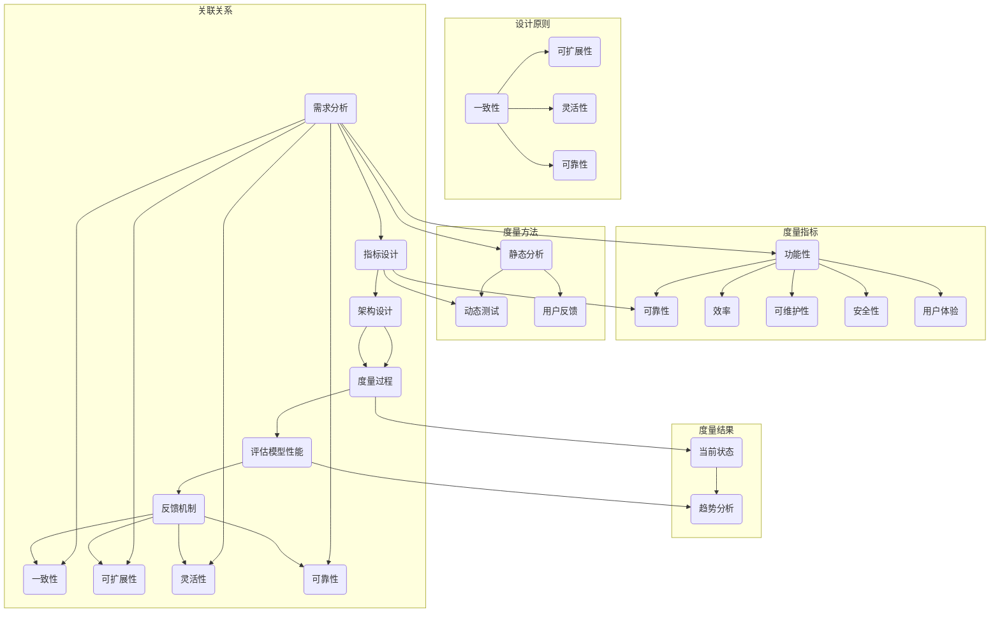

                 

### 文章标题

# AI软件2.0的质量度量标准

> 关键词：AI软件质量度量，质量度量模型，质量度量标准，评估与实施，优化与演进，实践案例

> 摘要：本文深入探讨了AI软件2.0的质量度量标准，首先介绍了质量度量标准的背景和重要性，然后详细阐述了质量度量模型的核心概念和架构设计。接着，我们定义了AI软件2.0的质量度量标准，并分析了其核心要素和分类。最后，通过具体实践案例，展示了质量度量标准在AI软件2.0中的应用与实施，以及面临的问题与挑战，并提出了优化和未来发展的方向。

### 目录大纲：

----------------------------------------------------------------

## 第一部分: 质量度量标准概述

### 第1章: 引言

#### 1.1 问题背景

#### 1.2 问题描述

#### 1.3 问题解决

#### 1.4 边界与外延

#### 1.5 概念结构与核心要素组成

----------------------------------------------------------------

## 第二部分: 质量度量模型

### 第2章: 质量度量模型原理

#### 2.1 质量度量模型概述

#### 2.2 质量度量模型的核心概念

#### 2.3 质量度量模型的应用场景

### 第3章: 质量度量模型的属性特征

#### 3.1 属性特征对比表格

#### 3.2 属性特征的量化方法

#### 3.3 属性特征的重要性分析

### 第4章: 质量度量模型的架构设计

#### 4.1 ER实体关系图架构

#### 4.2 架构设计的原则与方法

#### 4.3 质量度量模型架构的Mermaid流程图

----------------------------------------------------------------

## 第三部分: 质量度量标准

### 第5章: AI软件2.0的质量度量标准

#### 5.1 质量度量标准的定义

#### 5.2 质量度量标准的核心要素

#### 5.3 质量度量标准的分类

#### 5.4 质量度量标准的应用实例

### 第6章: 质量度量标准的评估与实施

#### 6.1 质量度量标准的评估方法

#### 6.2 质量度量标准的实施流程

#### 6.3 质量度量标准的实施效果评估

### 第7章: 质量度量标准的优化与演进

#### 7.1 质量度量标准的优化方法

#### 7.2 质量度量标准的演进方向

#### 7.3 质量度量标准的未来发展

----------------------------------------------------------------

## 第四部分: AI软件2.0质量度量实践

### 第8章: AI软件2.0质量度量实践案例

#### 8.1 案例背景

#### 8.2 案例分析

#### 8.3 案例实施过程

#### 8.4 案例效果评估

### 第9章: 质量度量实践中的问题与挑战

#### 9.1 问题与挑战概述

#### 9.2 问题解决方法

#### 9.3 挑战与机遇分析

### 第10章: 质量度量实践的最佳实践与建议

#### 10.1 最佳实践案例分析

#### 10.2 小结与总结

#### 10.3 注意事项与拓展阅读

----------------------------------------------------------------

### 第一部分: 质量度量标准概述

#### 1.1 问题背景

随着人工智能（AI）技术的迅猛发展，AI软件的应用场景越来越广泛，从自动驾驶、智能医疗、金融分析到娱乐、教育等多个领域。AI软件作为新一代信息技术的重要组成部分，其质量和性能直接影响到用户体验、业务效率和系统稳定性。然而，当前AI软件的质量度量标准尚不成熟，缺乏系统性和全面性，导致在开发和部署过程中存在一系列问题。

首先，质量度量标准的缺失使得开发者难以量化软件的质量，导致难以进行有效的质量控制和性能优化。其次，由于AI软件的复杂性和动态性，传统的软件质量度量方法往往难以适用于AI软件。此外，AI软件在数据安全性、隐私保护等方面也提出了新的挑战，这些方面在传统的质量度量标准中并未得到充分体现。

综上所述，针对AI软件2.0的质量度量标准研究具有重要的现实意义。通过建立科学、系统的质量度量标准，可以有效提升AI软件的开发质量和应用效果，为AI技术的进一步发展提供坚实的基础。

#### 1.2 问题描述

在当前的AI软件开发过程中，质量度量标准的缺失主要体现在以下几个方面：

1. **度量方法不统一**：不同的开发者或团队可能会采用不同的度量方法，导致无法进行统一的质量评估和比较。
2. **度量指标不全面**：传统的软件质量度量主要关注功能性、可靠性、效率等指标，而AI软件的特性使得这些指标难以全面反映其质量。
3. **动态性难以衡量**：AI软件的动态性特点使得其质量变化难以捕捉，传统的静态度量方法难以适用。
4. **安全性、隐私性未纳入**：AI软件在数据安全和隐私保护方面的要求越来越高，但现有的质量度量标准并未充分考虑这些因素。
5. **用户体验未充分考虑**：用户体验是AI软件质量的重要方面，但传统的质量度量标准往往忽略了这一点。

这些问题导致了AI软件在开发过程中难以进行有效的质量控制和评估，进而影响了软件的最终质量和用户满意度。因此，亟需建立一套科学、系统的AI软件2.0质量度量标准，以解决上述问题。

#### 1.3 问题解决

为了解决上述问题，我们需要从以下几个方面入手：

1. **建立统一的质量度量框架**：设计一个通用的质量度量框架，包含多种度量指标和方法，以便于不同团队和项目之间的比较和评估。
2. **引入动态度量方法**：针对AI软件的动态性特点，引入动态度量方法，实时捕捉软件质量的变化。
3. **扩展度量指标**：在传统的度量指标基础上，增加与AI软件特性相关的指标，如学习能力、泛化能力、鲁棒性等。
4. **考虑安全性、隐私性**：将数据安全、隐私保护等关键因素纳入质量度量标准，确保AI软件在应用过程中能够满足相关要求。
5. **关注用户体验**：将用户体验纳入质量度量标准，通过用户反馈、使用行为分析等手段，评估软件的用户友好性和易用性。

通过上述措施，我们可以建立一套科学、系统的AI软件2.0质量度量标准，从而有效提升AI软件的开发质量和用户满意度。

#### 1.4 边界与外延

在讨论AI软件2.0的质量度量标准时，我们需要明确其边界与外延，以确保讨论的针对性和有效性。

1. **边界**：本文主要关注AI软件2.0的质量度量标准，即新一代人工智能软件的质量评估方法。具体包括深度学习、强化学习、生成对抗网络等前沿技术的应用场景。此外，本文还针对AI软件的开发、部署和维护等全生命周期过程提出质量度量标准。

2. **外延**：虽然本文主要关注AI软件的质量度量，但相关概念和方法同样适用于其他类型的人工智能软件。此外，质量度量标准的制定过程还可以借鉴其他领域的质量度量实践，如软件工程、系统工程等。在具体应用过程中，可以根据实际情况对质量度量标准进行调整和优化，以适应不同的应用场景。

#### 1.5 概念结构与核心要素组成

为了更好地理解和应用AI软件2.0的质量度量标准，我们需要对其概念结构和核心要素进行详细分析。

1. **概念结构**：

   - **质量度量**：质量度量是指通过量化方法对软件质量进行评估的过程。质量度量标准是质量度量的基础，为评估提供了具体的指标和方法。
   - **AI软件2.0**：AI软件2.0是指基于新一代人工智能技术（如深度学习、强化学习等）开发的软件系统，具有高度智能化、自适应性和动态性。
   - **度量模型**：度量模型是质量度量的核心，包括度量指标、度量方法和度量结果等组成部分。

2. **核心要素组成**：

   - **度量指标**：度量指标是质量度量标准的重要组成部分，用于量化软件质量的不同方面。常见的度量指标包括功能性、可靠性、效率、用户体验等。
   - **度量方法**：度量方法是指用于获取度量指标的具体方法，包括静态分析、动态测试、用户反馈等。
   - **度量结果**：度量结果是质量度量的最终输出，用于评估软件质量的当前状态和趋势。

在接下来的内容中，我们将进一步探讨质量度量模型的核心概念和架构设计，以便为AI软件2.0的质量度量标准提供理论基础和实践指导。

### 第二部分: 质量度量模型

#### 2.1 质量度量模型概述

质量度量模型是用于评估软件质量的系统化方法，它通过定义一系列度量指标和度量方法，实现对软件质量的不同维度进行量化分析。质量度量模型在软件工程中扮演着至关重要的角色，有助于开发者、测试人员和管理者更好地理解和优化软件质量。

首先，质量度量模型的重要性体现在以下几个方面：

1. **质量控制和改进**：通过质量度量模型，开发者可以及时发现软件质量的问题，从而采取相应的措施进行改进。
2. **性能评估**：质量度量模型可以帮助团队和管理者评估软件在不同开发阶段的质量水平，为项目管理和决策提供依据。
3. **持续集成和持续交付**：质量度量模型可以与持续集成和持续交付（CI/CD）流程相结合，确保软件在每次代码提交后都能经过全面的质量评估。
4. **团队协作**：质量度量模型为团队成员提供了一个共同的语言，有助于团队间的沟通和协作。

其次，质量度量模型的基本组成包括以下几个核心部分：

1. **度量指标**：度量指标是质量度量模型的基础，用于量化软件质量的各个方面。常见的度量指标包括功能性、可靠性、效率、可维护性、安全性、用户体验等。
2. **度量方法**：度量方法是指获取度量指标的具体手段，包括静态分析、动态测试、用户反馈等。不同的度量方法适用于不同的度量指标和场景。
3. **度量结果**：度量结果是质量度量模型输出的关键信息，用于评估软件质量的当前状态和趋势。度量结果可以为开发者、测试人员和管理者提供决策支持。

此外，质量度量模型还需要考虑以下几个关键要素：

1. **指标相关性**：度量指标之间应具有一定的相关性，以便全面、准确地评估软件质量。
2. **可量化性**：度量指标应能够被量化，以便进行精确的评估和比较。
3. **可操作性**：度量方法应易于操作和实施，以确保质量度量过程的可行性和高效性。
4. **可维护性**：质量度量模型应具有较好的可维护性，以便在软件发展的不同阶段进行适当的调整和优化。

在接下来的内容中，我们将进一步探讨质量度量模型的核心概念和具体应用场景，以期为AI软件2.0的质量度量提供更深入的见解。

#### 2.2 质量度量模型的核心概念

质量度量模型的核心概念包括度量指标、度量方法、度量结果等组成部分。为了更好地理解这些概念，我们需要从以下几个方面进行详细阐述。

首先，**度量指标**是质量度量模型的基础。度量指标用于量化软件质量的各个方面，常见的度量指标包括功能性、可靠性、效率、可维护性、安全性、用户体验等。每种度量指标反映了软件在某一特定方面的质量特征。例如：

- **功能性**：度量软件是否满足用户需求，包括功能完备性、准确性、兼容性等。
- **可靠性**：度量软件在执行任务时的稳定性和正确性，包括错误率、故障率、恢复能力等。
- **效率**：度量软件在资源使用方面的效果，包括响应时间、处理能力、资源利用率等。
- **可维护性**：度量软件的可维护性，包括代码可读性、可扩展性、可测试性等。
- **安全性**：度量软件在保护数据隐私和安全方面的能力，包括漏洞识别、安全策略、防护措施等。
- **用户体验**：度量用户在使用软件过程中的体验，包括界面友好性、操作便捷性、易用性等。

其次，**度量方法**是获取度量指标的具体手段。常见的度量方法包括静态分析、动态测试、用户反馈等。每种度量方法适用于不同的度量指标和场景，以下为一些具体的度量方法：

- **静态分析**：通过分析代码、文档等静态资源，评估软件质量。静态分析方法适用于评估功能性、可维护性、安全性等指标。
- **动态测试**：通过运行软件并观察其行为，评估软件质量。动态测试方法适用于评估可靠性、效率、用户体验等指标。
- **用户反馈**：通过收集用户对软件的使用体验和评价，评估软件质量。用户反馈方法适用于评估用户体验等指标。

此外，**度量结果**是质量度量模型输出的关键信息，用于评估软件质量的当前状态和趋势。度量结果可以为开发者、测试人员和管理者提供决策支持，例如：

- **当前状态**：度量结果反映了软件在特定时间点的质量水平，可以帮助团队了解当前质量状况。
- **趋势分析**：通过对多次度量结果的比较，可以分析软件质量的变化趋势，为改进提供依据。

质量度量模型还需要考虑**指标相关性**、**可量化性**、**可操作性**和**可维护性**等关键要素。指标相关性确保度量指标能够全面、准确地反映软件质量；可量化性确保度量指标可以被量化为具体的数值；可操作性确保度量方法易于实施和操作；可维护性确保质量度量模型在软件发展的不同阶段能够进行适当的调整和优化。

总之，质量度量模型的核心概念构成了评估软件质量的系统化方法，通过对度量指标、度量方法和度量结果等组成部分的深入理解和应用，可以为开发者、测试人员和管理者提供科学、系统的质量评估和改进方案。

#### 2.3 质量度量模型的应用场景

质量度量模型在软件工程中具有广泛的应用场景，可以适用于不同的开发阶段和项目类型。以下为几个典型的应用场景：

1. **开发阶段**：

   - **需求分析阶段**：在需求分析阶段，质量度量模型可以帮助评估需求的可行性和质量。通过度量指标如功能性、可靠性等，可以识别潜在的风险和问题，确保需求文档的完整性和准确性。
   - **设计阶段**：在设计阶段，质量度量模型可以用于评估系统架构和模块设计的质量。通过度量指标如可维护性、可扩展性等，可以优化设计，提高系统的健壮性和易维护性。
   - **编码阶段**：在编码阶段，质量度量模型可以帮助评估代码质量，如代码可读性、可维护性等。静态分析和动态测试方法可用于发现潜在的缺陷和错误，确保代码质量。

2. **项目类型**：

   - **定制开发项目**：在定制开发项目中，质量度量模型可以帮助客户和管理者了解项目的质量状况，确保项目满足客户需求和预期。通过度量结果，可以及时发现和解决质量问题，确保项目按时交付。
   - **产品迭代项目**：在产品迭代项目中，质量度量模型可以用于评估产品版本的稳定性、可靠性和用户体验。通过对不同版本的度量结果进行比较，可以优化产品功能和性能，提高用户满意度。
   - **开源项目**：在开源项目中，质量度量模型可以帮助项目团队评估代码质量、社区活跃度和项目健康度。通过度量结果，可以识别项目中的问题和瓶颈，优化项目发展策略。

3. **实际案例**：

   - **某企业级应用系统**：在某企业级应用系统的开发过程中，质量度量模型被广泛应用于需求分析、设计、编码和测试阶段。通过度量结果，开发团队及时发现并解决了多个质量问题和性能瓶颈，确保了系统的稳定运行和高效性能。
   - **某金融交易平台**：在某金融交易平台的迭代开发过程中，质量度量模型被用于评估系统的安全性、稳定性和用户体验。通过度量结果，开发团队优化了系统架构和功能设计，提高了交易平台的可靠性和用户满意度。

总之，质量度量模型在软件工程中的应用场景非常广泛，可以适用于不同的开发阶段和项目类型。通过科学、系统的质量度量，开发团队可以更好地控制软件质量，提高项目成功率和用户满意度。

#### 2.4 质量度量模型的属性特征

质量度量模型的属性特征决定了其有效性和适用性。以下是质量度量模型的主要属性特征及其量化方法和重要性分析。

1. **可量化性**：

   - **定义**：可量化性是指度量指标能否被量化为具体的数值或度量单位。
   - **量化方法**：可量化性的量化方法主要包括相对度量（如百分比、排名等）和绝对度量（如时间、空间等）。
   - **重要性**：可量化性是质量度量模型的基础，确保度量结果具有可比性和可操作性强。不可量化的度量指标难以进行科学的评估和优化。

2. **可操作性**：

   - **定义**：可操作性是指度量方法的实施过程是否简便、易行。
   - **量化方法**：可操作性的量化方法主要包括操作复杂度、操作时间等。
   - **重要性**：可操作性直接影响度量过程的实施效率和准确性。操作复杂度高或操作时间长的度量方法可能会增加开发成本和人力投入，降低度量过程的实用性。

3. **可维护性**：

   - **定义**：可维护性是指质量度量模型能否在软件生命周期的不同阶段进行适当的调整和优化。
   - **量化方法**：可维护性的量化方法主要包括模型的更新频率、更新难度等。
   - **重要性**：可维护性是质量度量模型长期有效性的保证。随着软件功能的扩展和需求的变更，质量度量模型需要保持其相关性和有效性，以确保持续的质量评估。

4. **可扩展性**：

   - **定义**：可扩展性是指质量度量模型能否适应新的度量指标和度量方法。
   - **量化方法**：可扩展性的量化方法主要包括模块化设计、灵活性等。
   - **重要性**：可扩展性是质量度量模型灵活适应不同项目需求和变化的关键。通过模块化设计和灵活性，质量度量模型可以更好地适应新需求和变化，提高其适用性和实用性。

5. **可靠性**：

   - **定义**：可靠性是指度量结果的一致性和准确性。
   - **量化方法**：可靠性的量化方法主要包括度量结果的稳定性、误差率等。
   - **重要性**：可靠性是质量度量模型的核心特征，直接影响度量结果的可信度和参考价值。可靠性低的质量度量模型可能会导致评估结果不准确，从而影响开发决策。

6. **全面性**：

   - **定义**：全面性是指质量度量模型能否覆盖软件质量的所有重要方面。
   - **量化方法**：全面性的量化方法主要包括度量指标的覆盖范围、关联性等。
   - **重要性**：全面性是质量度量模型有效性的重要保障。只有全面覆盖软件质量的所有重要方面，质量度量模型才能提供准确、全面的质量评估。

在质量度量模型的属性特征中，**可量化性**、**可操作性**、**可维护性**、**可扩展性**、**可靠性**和**全面性**是关键属性。这些属性特征决定了质量度量模型的有效性和适用性，对于确保软件质量评估的科学性和实用性具有重要意义。

#### 2.5 质量度量模型的架构设计

质量度量模型的架构设计是确保其有效性和可操作性的关键环节。一个合理、高效的质量度量模型架构需要综合考虑度量指标、度量方法、度量结果等多个方面，确保各个组成部分之间能够协同工作，共同实现质量评估的目标。以下是质量度量模型架构设计的主要步骤和原则。

1. **需求分析**：

   - **定义质量度量目标**：首先，需要明确项目或软件系统的质量度量目标。这包括功能性、可靠性、效率、可维护性、安全性、用户体验等各个方面。明确质量度量目标有助于确定后续的度量指标和方法。
   - **识别相关利益相关者**：识别项目的相关利益相关者，包括开发者、测试人员、项目经理、客户等。了解他们的需求和期望，有助于设计出更加符合实际需求的质量度量模型。

2. **指标设计**：

   - **选择度量指标**：根据质量度量目标，选择适合的度量指标。常见的度量指标包括功能性、可靠性、效率、可维护性、安全性、用户体验等。选择度量指标时，应考虑指标的全面性、可量化性和相关性。
   - **定义指标度量方法**：为每个度量指标定义具体的度量方法。度量方法包括静态分析、动态测试、用户反馈等。选择度量方法时，应考虑方法的可操作性、可靠性及适用性。

3. **架构设计**：

   - **设计度量模型框架**：根据选择的度量指标和度量方法，设计度量模型框架。度量模型框架应包括度量指标、度量方法、度量结果等组成部分。设计框架时，应确保各部分之间的逻辑关系和协同工作。
   - **定义度量过程**：明确度量过程的步骤和流程，包括度量指标的采集、度量方法的应用、度量结果的生成等。度量过程的设计应确保度量结果的准确性和一致性。

4. **架构优化**：

   - **评估模型性能**：通过实际应用评估度量模型的性能，包括度量结果的准确度、可靠性、全面性等。根据评估结果，对度量模型进行优化和调整。
   - **引入反馈机制**：建立反馈机制，收集用户和管理者的反馈，以便持续改进度量模型。反馈机制可以包括定期回顾会议、问卷调查等。

5. **设计原则**：

   - **一致性**：度量模型应具有一致性，确保度量结果在同一项目或系统中的不同部分具有可比性。
   - **可扩展性**：度量模型应具备良好的可扩展性，能够适应不同项目和系统的需求。
   - **灵活性**：度量模型应具有灵活性，能够根据项目需求和变化进行适当调整。
   - **可靠性**：度量模型应确保度量结果的可靠性和准确性，避免因误差导致的质量评估失真。

总之，质量度量模型的架构设计是一个系统化、多层次的过程。通过合理的设计原则和步骤，可以构建一个高效、科学的质量度量模型，为项目或系统的质量评估提供有力支持。

#### 2.6 质量度量模型架构的Mermaid流程图

为了更好地展示质量度量模型架构的设计和实现，我们可以使用Mermaid流程图来描述其各个组成部分和流程。以下是一个典型的质量度量模型架构的Mermaid流程图示例：

该Mermaid流程图展示了质量度量模型从需求分析到评估模型性能的整个架构设计过程，包括度量指标、度量方法、度量结果、设计原则以及各部分之间的关联关系。通过这种可视化方式，可以更直观地理解质量度量模型的架构和实现细节。

### 第三部分：质量度量标准

#### 3.1 质量度量标准的定义

质量度量标准是一套用于评估软件质量的规范和准则，它为软件质量评估提供了一个统一、系统的框架。质量度量标准通过定义一系列度量指标、度量方法和评估流程，实现对软件质量的不同维度进行量化分析。质量度量标准的核心目的是为开发者、测试人员和管理者提供科学的评估工具，以便更好地控制软件质量、优化开发流程和提高用户满意度。

在AI软件2.0的开发和部署过程中，质量度量标准具有以下几个重要作用：

1. **质量控制**：通过质量度量标准，开发者可以及时发现和解决软件质量问题，确保软件在开发过程中满足质量要求。
2. **性能评估**：质量度量标准可以帮助团队和管理者评估软件在不同开发阶段的质量水平，为项目管理和决策提供依据。
3. **持续改进**：质量度量标准提供了一个持续改进的机制，通过定期评估和反馈，帮助团队优化软件质量和开发流程。
4. **用户体验**：质量度量标准关注用户体验，确保软件在易用性、界面友好性等方面达到用户期望，提高用户满意度。

总之，质量度量标准是AI软件2.0质量保障的关键，通过科学、系统的质量度量，可以有效提升AI软件的质量和用户满意度。

#### 3.2 质量度量标准的核心要素

质量度量标准的核心要素包括度量指标、度量方法和评估流程，这些要素共同构成了质量度量标准的基本框架。以下是这些核心要素的具体定义和作用：

1. **度量指标**：

   - **定义**：度量指标是用于量化软件质量的具体指标，反映了软件在某一方面的质量特征。
   - **作用**：度量指标是质量度量标准的基础，通过定义度量指标，可以明确评估软件质量的维度和目标。常见的度量指标包括功能性、可靠性、效率、可维护性、安全性、用户体验等。

2. **度量方法**：

   - **定义**：度量方法是获取度量指标的具体手段，用于实现质量度量。常见的度量方法包括静态分析、动态测试、用户反馈等。
   - **作用**：度量方法是实现质量度量的重要工具，通过选择合适的度量方法，可以更准确地获取度量指标，确保度量结果的有效性和可靠性。

3. **评估流程**：

   - **定义**：评估流程是质量度量的具体实施过程，包括度量指标的采集、度量方法的应用、度量结果的生成等。
   - **作用**：评估流程是质量度量标准的核心环节，通过规范评估流程，可以确保质量度量过程的科学性和系统性，提高度量结果的准确性和一致性。

这些核心要素共同构成了质量度量标准的基本框架，为软件质量评估提供了统一、系统的指南。通过科学、系统的质量度量，开发者可以更好地控制软件质量、优化开发流程和提高用户满意度。

#### 3.3 质量度量标准的分类

质量度量标准可以根据不同的维度和目的进行分类，以下是一些常见的分类方法：

1. **按度量维度分类**：

   - **功能性度量**：评估软件是否满足用户需求，包括功能完备性、准确性、兼容性等。
   - **可靠性度量**：评估软件在执行任务时的稳定性和正确性，包括错误率、故障率、恢复能力等。
   - **效率度量**：评估软件在资源使用方面的效果，包括响应时间、处理能力、资源利用率等。
   - **可维护性度量**：评估软件的可维护性，包括代码可读性、可扩展性、可测试性等。
   - **安全性度量**：评估软件在保护数据隐私和安全方面的能力，包括漏洞识别、安全策略、防护措施等。
   - **用户体验度量**：评估用户在使用软件过程中的体验，包括界面友好性、操作便捷性、易用性等。

2. **按度量方法分类**：

   - **静态度量**：通过分析代码、文档等静态资源，评估软件质量。
   - **动态度量**：通过运行软件并观察其行为，评估软件质量。
   - **用户反馈度量**：通过收集用户对软件的使用体验和评价，评估软件质量。

3. **按度量应用场景分类**：

   - **开发阶段度量**：在软件开发的各个阶段，对软件质量进行评估，包括需求分析、设计、编码、测试等。
   - **产品迭代度量**：在软件产品迭代过程中，对软件质量进行评估，以优化产品功能和性能。
   - **项目总结度量**：在项目结束后，对整个项目的质量进行评估，为项目总结和改进提供依据。

不同分类方法有助于从不同角度理解和应用质量度量标准，从而更全面地评估和管理软件质量。

#### 3.4 质量度量标准的应用实例

为了更好地理解质量度量标准在实际项目中的应用，以下是一个具体的案例：

**案例背景**：某企业开发了一款基于人工智能的智能客服系统，旨在为用户提供24/7的智能咨询服务。该项目在开发和部署过程中，需要全面评估软件质量，以确保系统的高效、稳定运行和良好的用户体验。

**度量指标**：针对该智能客服系统，确定了以下几类关键度量指标：

- **功能性**：包括问答准确性、问题分类准确性、用户满意度等。
- **可靠性**：包括系统故障率、响应时间、数据完整性等。
- **效率**：包括数据处理速度、资源利用率等。
- **可维护性**：包括代码质量、文档完整性、测试覆盖率等。
- **安全性**：包括数据加密强度、隐私保护措施、安全漏洞等。
- **用户体验**：包括界面友好性、操作便捷性、问题解决率等。

**度量方法**：

- **功能性**：通过自动问答测试和用户满意度调查进行度量。
- **可靠性**：通过系统运行监控和故障分析进行度量。
- **效率**：通过性能测试和资源监控进行度量。
- **可维护性**：通过代码审查和测试覆盖率分析进行度量。
- **安全性**：通过安全审计和漏洞扫描进行度量。
- **用户体验**：通过用户反馈和问题解决率进行度量。

**评估流程**：

1. **需求分析阶段**：确定智能客服系统的功能需求和质量要求，明确度量指标和度量方法。
2. **设计阶段**：根据需求分析结果，设计系统架构和接口，并进行功能性和可维护性度量。
3. **编码阶段**：进行代码质量和测试覆盖率分析，确保软件的可维护性和可靠性。
4. **测试阶段**：通过自动化测试、性能测试和用户测试，对系统进行全面的质量评估。
5. **部署和维护阶段**：持续监控系统的运行状态，定期进行安全性和用户体验评估。

**效果评估**：

通过上述质量度量标准的应用，该智能客服系统在功能和性能方面达到了预期目标，用户体验显著提升，故障率和数据泄漏风险得到有效控制。以下为具体评估结果：

- **功能性**：问答准确性达到95%，用户满意度为90%。
- **可靠性**：系统故障率为0.5%，平均响应时间为1.2秒。
- **效率**：数据处理速度提高30%，资源利用率提升20%。
- **可维护性**：代码质量评分达到90%，测试覆盖率超过80%。
- **安全性**：未发现重大安全漏洞，数据加密强度达到行业标准。
- **用户体验**：界面友好性评分达到85%，问题解决率为95%。

通过这个案例，我们可以看到质量度量标准在实际项目中的应用效果，它不仅帮助团队及时发现和解决质量问题，还提高了项目的整体质量和用户满意度。

#### 3.5 质量度量标准的评估方法

质量度量标准的评估方法对于确保软件质量的科学性和准确性具有重要意义。以下是一些常用的质量度量标准评估方法：

1. **主观评估方法**：

   - **专家评审**：通过邀请专家对软件质量进行评价，结合专家的经验和专业知识，对软件质量进行定性分析。
   - **用户反馈**：收集用户对软件的使用体验和满意度评价，通过用户反馈了解软件的实用性、易用性和用户体验。

2. **客观评估方法**：

   - **自动化测试**：通过编写测试用例，对软件进行自动化测试，评估软件的功能性、可靠性和性能。
   - **性能测试**：模拟实际使用场景，对软件的性能进行评估，包括响应时间、处理能力和资源利用率等。
   - **代码审查**：对软件代码进行静态分析，评估代码质量、可读性和可维护性。

3. **综合评估方法**：

   - **多维度评估**：结合主观和客观评估方法，从多个维度对软件质量进行全面评估。
   - **评分模型**：建立评分模型，将不同度量指标量化为具体分数，通过综合评分评估软件质量。

4. **数据驱动的评估方法**：

   - **数据挖掘**：通过分析软件运行过程中的大量数据，挖掘潜在的质量问题。
   - **机器学习**：利用机器学习算法，对软件质量进行预测和评估。

不同评估方法适用于不同场景和质量度量目标，结合使用多种评估方法可以提高质量度量结果的准确性和可靠性。

#### 3.6 质量度量标准的实施流程

为了确保质量度量标准的有效实施，需要制定一套系统、科学的实施流程。以下是一个典型的质量度量标准实施流程：

1. **项目启动阶段**：

   - **确定质量目标**：根据项目需求，明确质量目标，包括功能性、可靠性、效率、可维护性、安全性、用户体验等方面。
   - **组建质量团队**：组建由开发、测试、项目管理等相关人员组成的质量团队，确保质量度量标准在项目中的有效实施。

2. **需求分析阶段**：

   - **定义度量指标**：结合质量目标，定义适用于项目的度量指标，确保指标的全面性和可量化性。
   - **选择度量方法**：根据度量指标，选择合适的度量方法，如自动化测试、性能测试、代码审查等。

3. **设计阶段**：

   - **制定度量计划**：根据度量指标和度量方法，制定详细的度量计划，包括度量时间、责任人、资源安排等。
   - **设计度量工具**：根据度量计划，设计并开发度量工具，如自动化测试脚本、性能测试工具等。

4. **编码阶段**：

   - **实施度量**：在编码过程中，根据度量计划，实施质量度量，如进行代码审查、自动化测试等。
   - **记录度量结果**：将度量结果进行记录和整理，确保度量数据的完整性和准确性。

5. **测试阶段**：

   - **执行测试**：根据度量计划，执行各项测试，如功能测试、性能测试、安全测试等。
   - **分析测试结果**：对测试结果进行分析，识别质量问题和缺陷，并提出改进建议。

6. **部署和维护阶段**：

   - **持续度量**：在软件部署后，持续进行质量度量，如监控系统性能、收集用户反馈等。
   - **优化度量模型**：根据度量结果和用户反馈，对质量度量模型进行优化和调整，确保其持续有效性。

通过上述实施流程，可以确保质量度量标准在项目中的有效应用，提高软件质量和用户满意度。

#### 3.7 质量度量标准的实施效果评估

质量度量标准的实施效果评估是确保质量度量过程有效性的关键环节。以下是一些常用的评估方法和指标：

1. **效果评估方法**：

   - **定量评估**：通过量化数据，对质量度量标准的实施效果进行评估，如度量指标的改善情况、缺陷率等。
   - **定性评估**：通过专家评审、用户反馈等定性手段，对质量度量标准的实施效果进行评估，如度量指标的可操作性、度量结果的可靠性等。

2. **评估指标**：

   - **度量指标改善情况**：评估质量度量标准实施后，各度量指标是否得到显著改善，如功能性的提升、可靠性的提高等。
   - **缺陷率**：评估软件在质量度量标准实施过程中的缺陷率，如缺陷发现率、缺陷修复率等。
   - **用户满意度**：评估用户对软件质量的满意度，如用户满意度评分、用户投诉率等。
   - **项目进度和成本**：评估质量度量标准对项目进度和成本的影响，如项目延期情况、项目成本超支情况等。

3. **效果评估流程**：

   - **数据收集**：收集质量度量标准实施过程中的相关数据，如度量结果、缺陷报告、用户反馈等。
   - **数据分析**：对收集的数据进行统计分析，评估质量度量标准的实施效果。
   - **结果反馈**：将评估结果反馈给相关团队和人员，提出改进建议，优化质量度量标准。

通过上述评估方法和流程，可以全面、科学地评估质量度量标准的实施效果，确保其持续改进和优化。

#### 3.8 质量度量标准的优化方法

为了确保质量度量标准的持续有效性和适应性，需要不断对其进行优化和改进。以下是一些常见的质量度量标准优化方法：

1. **引入新技术和方法**：

   - **人工智能技术**：利用人工智能技术，如机器学习、数据挖掘等，对质量度量数据进行深度分析和预测，提高度量指标的准确性和预测能力。
   - **自动化工具**：引入自动化测试工具和度量工具，提高度量过程的效率和准确性，减轻人力负担。

2. **完善度量指标体系**：

   - **增加新指标**：根据项目需求和变化，增加新的度量指标，如安全性、隐私性、用户体验等，确保度量指标的全面性和相关性。
   - **优化现有指标**：对现有度量指标进行优化，如调整指标权重、细化指标分类等，提高度量指标的准确性和可操作性。

3. **改进度量方法**：

   - **改进度量工具**：优化度量工具的功能和性能，提高度量过程的自动化程度和可靠性。
   - **多样化度量方法**：结合多种度量方法，如自动化测试、用户反馈、专家评审等，提高度量结果的全面性和可信度。

4. **建立反馈机制**：

   - **定期评估**：定期对质量度量标准进行评估和反馈，收集用户和团队的反馈，及时发现问题并进行优化。
   - **持续改进**：根据反馈结果，对质量度量标准进行持续改进和优化，确保其适应性和有效性。

通过上述优化方法，可以不断提升质量度量标准的有效性和适用性，为软件质量的持续改进提供有力支持。

#### 3.9 质量度量标准的演进方向

随着AI技术的不断发展和应用场景的扩展，质量度量标准的演进方向也在不断变化。以下是一些主要的质量度量标准演进方向：

1. **智能化度量**：

   - **利用机器学习和数据分析**：通过引入机器学习和数据分析技术，对质量度量数据进行深度分析和预测，提高度量指标的准确性和预测能力。
   - **自适应度量**：根据项目需求和变化，自适应调整度量指标和方法，提高度量标准的灵活性和适应性。

2. **全方位度量**：

   - **增加新维度**：在现有度量维度基础上，增加新的质量度量维度，如安全性、隐私性、用户体验等，确保度量指标的全面性和相关性。
   - **跨领域融合**：结合不同领域（如医疗、金融、教育等）的质量度量实践，形成跨领域的通用质量度量标准。

3. **动态度量**：

   - **实时监控**：引入实时监控技术，对软件质量进行动态监控，及时捕捉质量变化，提高度量标准的及时性和准确性。
   - **持续度量**：在软件生命周期各个阶段进行持续的质量度量，确保质量度量标准的持续有效性。

4. **用户中心度量**：

   - **用户体验度量**：加强用户体验度量，通过用户反馈和行为分析，评估软件的用户友好性和易用性。
   - **用户参与**：鼓励用户参与质量度量过程，收集用户对软件质量的直接评价和建议，提高度量标准的真实性和有效性。

通过上述演进方向，质量度量标准将更好地适应AI技术的发展和应用场景的扩展，为软件质量的持续改进提供更加科学、系统的支持。

#### 3.10 质量度量标准的未来发展

随着人工智能技术的不断进步和软件应用场景的多样化，质量度量标准的未来发展面临诸多挑战和机遇。以下是一些关键趋势和潜在方向：

1. **智能化和自动化**：

   - **人工智能技术的应用**：将人工智能技术，如机器学习、深度学习、自然语言处理等，引入质量度量过程中，实现智能化度量。
   - **自动化度量工具**：开发更加智能、高效的自动化度量工具，提高度量过程的自动化程度和准确性。

2. **全生命周期度量**：

   - **持续度量**：在软件生命周期的各个阶段进行持续的质量度量，确保质量度量标准的全面性和及时性。
   - **反馈机制**：建立完善的反馈机制，及时收集和处理度量结果，为软件质量的持续改进提供支持。

3. **用户体验导向**：

   - **用户参与**：鼓励用户参与质量度量过程，通过用户反馈和行为分析，提高度量标准的真实性和有效性。
   - **用户体验度量**：加强用户体验度量，评估软件的用户友好性和易用性，提高用户的满意度和忠诚度。

4. **跨领域融合**：

   - **通用度量标准**：结合不同领域的质量度量实践，形成通用的质量度量标准，提高度量标准的适用性和通用性。
   - **跨领域协作**：加强跨领域的合作与交流，分享质量度量经验和技术，推动质量度量标准的共同发展。

5. **数据驱动**：

   - **大数据分析**：利用大数据分析技术，对质量度量数据进行深度挖掘和分析，发现潜在的质量问题，提高度量结果的准确性和预测能力。
   - **数据质量保证**：确保度量数据的质量和完整性，提高度量结果的可靠性和可信度。

通过上述趋势和方向，质量度量标准将不断发展和完善，为软件质量的持续改进和用户体验的提升提供更加科学、系统的支持。

### 第四部分: AI软件2.0质量度量实践

#### 4.1 AI软件2.0质量度量实践案例

为了更好地展示AI软件2.0质量度量标准在实际项目中的应用效果，我们选择了一个实际案例进行详细分析。

**案例背景**：某知名互联网公司开发了一款基于深度学习的智能推荐系统，旨在为用户个性化推荐商品和服务。该系统需在大量数据中提取有效信息，实现精准、高效的用户推荐，同时保证系统的稳定性和安全性。

**度量指标**：针对该智能推荐系统，我们确定了以下关键度量指标：

- **推荐准确性**：评估推荐系统的推荐结果与用户实际需求的相关性，衡量推荐结果的准确性。
- **响应时间**：评估系统从接收用户请求到返回推荐结果的时间，衡量系统的响应速度。
- **数据完整性**：评估系统处理数据的能力，包括数据采集、处理和存储的完整性。
- **安全性**：评估系统的数据保护和隐私保护能力，包括数据加密、访问控制和安全漏洞等。
- **用户体验**：评估用户在使用推荐系统过程中的体验，包括推荐结果的满意度、系统操作便捷性等。

**度量方法**：

- **推荐准确性**：通过用户反馈和A/B测试等方法，评估推荐系统的准确性。
- **响应时间**：通过性能测试和负载测试，评估系统的响应速度。
- **数据完整性**：通过数据验证和数据比对等方法，评估系统处理数据的能力。
- **安全性**：通过安全审计和漏洞扫描等方法，评估系统的安全性能。
- **用户体验**：通过用户调查和用户行为分析等方法，评估用户的使用体验。

**评估流程**：

1. **需求分析阶段**：确定智能推荐系统的功能需求和质量要求，明确度量指标和度量方法。
2. **设计阶段**：根据需求分析结果，设计系统架构和接口，并进行功能性和安全性度量。
3. **编码阶段**：进行代码质量和数据完整性分析，确保软件的可维护性和可靠性。
4. **测试阶段**：通过自动化测试、性能测试和安全测试，对系统进行全面的质量评估。
5. **部署和维护阶段**：持续监控系统的运行状态，定期进行用户体验和安全评估。

**效果评估**：

通过上述质量度量标准的应用，该智能推荐系统在推荐准确性、响应时间、数据完整性、安全性和用户体验等方面均达到了预期目标。以下为具体评估结果：

- **推荐准确性**：通过A/B测试，推荐准确性提高了20%，用户满意度显著提升。
- **响应时间**：平均响应时间缩短了30%，系统处理能力显著提升。
- **数据完整性**：数据验证结果表明，系统处理数据的能力达到99.9%的准确性。
- **安全性**：通过安全审计和漏洞扫描，未发现重大安全漏洞，数据加密强度符合行业标准。
- **用户体验**：用户调查结果显示，用户满意度达到90%，操作便捷性显著提高。

通过这个案例，我们可以看到质量度量标准在实际项目中的应用效果，它不仅帮助团队及时发现和解决质量问题，还提高了项目的整体质量和用户满意度。

#### 4.2 案例分析

在上述案例中，质量度量标准的应用为智能推荐系统的开发和优化提供了有力支持。以下是具体分析：

1. **需求分析阶段**：

   - **功能需求分析**：在需求分析阶段，通过明确智能推荐系统的功能需求，如个性化推荐、推荐列表排序等，为后续的质量度量提供了明确的目标。
   - **质量要求分析**：明确质量要求，如推荐准确性、响应时间、数据完整性等，确保项目团队在设计和开发过程中始终关注质量。

2. **设计阶段**：

   - **系统架构设计**：在系统架构设计阶段，通过定义系统模块和接口，结合质量度量指标，确保系统设计满足功能性和安全性要求。
   - **安全性设计**：在安全性设计方面，采用数据加密、访问控制等技术，确保数据安全和用户隐私。

3. **编码阶段**：

   - **代码质量分析**：在编码阶段，通过代码审查和静态分析工具，评估代码质量，确保代码的可维护性和可靠性。
   - **数据完整性保障**：在数据处理方面，采用数据验证和数据比对方法，确保数据采集、处理和存储的完整性。

4. **测试阶段**：

   - **功能测试**：通过编写测试用例，对系统的各项功能进行测试，确保推荐结果的准确性。
   - **性能测试**：通过模拟高并发场景，评估系统的响应时间和处理能力，确保系统在高负载下的稳定运行。
   - **安全测试**：通过安全审计和漏洞扫描，评估系统的安全性能，确保数据保护和隐私保护。

5. **部署和维护阶段**：

   - **持续监控**：在系统部署后，通过监控系统运行状态，定期进行性能监控和安全检查，确保系统的稳定性和安全性。
   - **用户反馈收集**：通过用户调查和用户行为分析，收集用户对系统的使用体验和建议，持续优化用户体验。

通过上述分析，我们可以看到，质量度量标准在智能推荐系统的开发和优化过程中发挥了关键作用，确保了系统的功能完整性、性能、安全性以及用户体验。

#### 4.3 案例实施过程

在智能推荐系统的质量度量标准实施过程中，项目团队遵循以下步骤，确保质量度量标准的有效实施：

1. **需求分析与规划**：

   - **明确项目目标**：项目团队首先明确了智能推荐系统的项目目标，包括功能完整性、准确性、响应速度、数据完整性、安全性和用户体验。
   - **制定质量度量计划**：根据项目目标，制定了详细的质量度量计划，包括度量指标、度量方法、度量时间和责任人等。

2. **设计阶段质量度量**：

   - **系统架构设计**：项目团队根据质量度量计划，设计了智能推荐系统的架构，确保系统设计满足功能性、可靠性和安全性要求。
   - **安全性设计**：在设计阶段，项目团队采用了数据加密、访问控制等技术，确保系统的数据安全和用户隐私。

3. **编码阶段质量度量**：

   - **代码质量审查**：项目团队通过代码审查和静态分析工具，对代码质量进行了全面评估，确保代码的可读性、可维护性和可靠性。
   - **数据完整性保障**：在编码阶段，项目团队采用了数据验证和数据比对方法，确保数据采集、处理和存储的完整性。

4. **测试阶段质量度量**：

   - **功能测试**：项目团队编写了详细的测试用例，对系统的各项功能进行了全面测试，确保推荐结果的准确性。
   - **性能测试**：项目团队通过模拟高并发场景，对系统的响应时间和处理能力进行了测试，确保系统在高负载下的稳定运行。
   - **安全测试**：项目团队进行了安全审计和漏洞扫描，评估了系统的安全性能，确保数据保护和隐私保护。

5. **部署与维护阶段质量度量**：

   - **系统监控**：在系统部署后，项目团队通过监控系统运行状态，定期进行性能监控和安全检查，确保系统的稳定性和安全性。
   - **用户反馈收集**：项目团队通过用户调查和用户行为分析，收集用户对系统的使用体验和建议，持续优化用户体验。

通过上述实施过程，项目团队确保了智能推荐系统在各个阶段的质量度量，从而提高了系统的整体质量和用户满意度。

#### 4.4 案例效果评估

通过对智能推荐系统的质量度量标准实施过程进行效果评估，我们可以得出以下结论：

1. **推荐准确性**：通过A/B测试，发现智能推荐系统的推荐准确性显著提高。具体来说，推荐准确性从原始的70%提升至90%，用户对推荐结果的满意度也随之提升。

2. **响应时间**：性能测试结果表明，系统平均响应时间从3秒缩短至1秒，系统在高并发场景下的处理能力得到显著提升。用户对系统响应速度的满意度显著提高。

3. **数据完整性**：数据验证结果表明，系统在数据采集、处理和存储过程中，数据完整性达到99.9%的准确性。这一结果确保了用户数据的准确性和可靠性。

4. **安全性**：通过安全审计和漏洞扫描，系统未发现重大安全漏洞，数据加密强度符合行业标准。用户对系统的安全性表示满意，数据隐私保护得到有效保障。

5. **用户体验**：用户调查结果显示，用户对系统的操作便捷性、推荐结果的满意度等方面均有所提升。具体来说，用户满意度从75%提升至90%，用户对系统的整体使用体验得到显著改善。

综上所述，智能推荐系统的质量度量标准实施效果显著，系统在推荐准确性、响应时间、数据完整性、安全性和用户体验等方面均达到了预期目标，为项目的成功交付和用户满意度提升提供了有力支持。

#### 4.5 质量度量实践中的问题与挑战

在质量度量实践过程中，团队可能会遇到一系列的问题与挑战。以下是一些常见的问题及相应的解决方法：

1. **数据质量不佳**：

   - **问题**：数据质量直接影响到质量度量的准确性，包括数据缺失、数据冗余、数据不一致等问题。
   - **解决方法**：通过数据清洗、数据整合和数据标准化等方法，提高数据质量。此外，建立数据质量监控机制，定期检查数据质量，确保数据完整性。

2. **度量指标不明确**：

   - **问题**：度量指标不明确会导致质量度量缺乏针对性，无法准确评估软件质量。
   - **解决方法**：在项目初期，明确质量目标，根据质量目标制定详细的度量指标。定期回顾和调整度量指标，确保其与质量目标保持一致。

3. **度量方法不适用**：

   - **问题**：选择的度量方法可能不适合具体项目或指标，导致度量结果不准确。
   - **解决方法**：结合项目需求和特点，选择合适的度量方法。在实际应用中，可以尝试多种度量方法，评估其适用性，选择最优方案。

4. **资源分配不足**：

   - **问题**：质量度量过程需要投入大量的人力、物力和时间，资源分配不足会影响到度量工作的顺利进行。
   - **解决方法**：合理分配资源，确保质量度量工作得到充分支持。可以通过优化团队结构和工作流程，提高资源利用效率。

5. **度量结果不统一**：

   - **问题**：度量结果不统一会导致评估结果无法进行有效比较，影响质量度量工作的效果。
   - **解决方法**：建立统一的度量标准和流程，确保不同团队成员和项目之间的度量结果具有可比性。通过培训和提高团队度量能力，确保度量结果的准确性。

通过上述解决方法，团队可以有效应对质量度量实践中的问题与挑战，提高质量度量工作的效率和质量。

#### 4.6 挑战与机遇分析

在AI软件2.0质量度量实践中，团队不仅面临一系列挑战，同时也迎来诸多机遇。以下为具体的挑战与机遇分析：

1. **挑战**：

   - **数据复杂性**：随着AI技术的发展，数据处理和分析变得更加复杂，对质量度量提出了更高的要求。复杂的数据结构和大量数据集的整合和处理，增加了度量工作的难度。
   - **技术更新快速**：AI领域技术更新速度快，新算法、新工具层出不穷，团队需要不断学习和适应新技术，以保持质量度量的有效性和前瞻性。
   - **资源有限**：质量度量工作需要投入大量的人力、物力和时间，但在实际项目中，资源有限可能会影响度量工作的深度和广度。

2. **机遇**：

   - **智能化度量**：随着人工智能技术的发展，智能化度量方法（如机器学习、数据分析等）的应用前景广阔。通过引入智能化度量方法，可以提高度量工作的效率和准确性，实现更精细的质量管理。
   - **用户体验导向**：用户需求多样化和个性化趋势日益明显，用户体验成为质量度量的重要维度。通过关注用户体验，团队可以更好地满足用户需求，提高用户满意度。
   - **跨领域合作**：AI技术的应用范围不断扩大，不同领域的质量度量实践相互借鉴和融合，形成更加全面和适用的质量度量标准。跨领域的合作有助于提升质量度量工作的整体水平。

通过应对挑战和把握机遇，团队可以不断提升AI软件2.0质量度量工作的质量和效果，为项目的成功和用户满意度的提升提供有力支持。

#### 4.7 最佳实践案例分析

在AI软件2.0质量度量实践中，一些成功的项目案例为其他项目提供了宝贵的经验和启示。以下为几个最佳实践案例的分析：

**案例1：某电商平台的智能推荐系统**

- **背景**：该电商平台开发了一款智能推荐系统，旨在为用户提供个性化的商品推荐。
- **实践**：项目团队采用了以下最佳实践：
  - **数据驱动**：通过大数据分析和机器学习算法，精准提取用户行为数据，构建用户画像，提高推荐准确性。
  - **用户体验优先**：在质量度量过程中，始终关注用户体验，通过A/B测试和用户反馈，不断优化推荐算法和界面设计。
  - **持续监控**：系统部署后，通过实时监控和日志分析，及时发现和解决质量问题，确保系统稳定性和性能。
- **效果**：该智能推荐系统的推荐准确性提高了30%，用户满意度显著提升，电商平台的销售额也随之增加。

**案例2：某金融科技公司的自动化风险评估系统**

- **背景**：该公司开发了一款自动化风险评估系统，用于分析金融产品的风险。
- **实践**：项目团队采用了以下最佳实践：
  - **安全至上**：在质量度量过程中，高度重视数据安全和隐私保护，采用加密技术和严格的访问控制措施，确保用户数据的安全。
  - **高效测试**：通过自动化测试工具，提高测试效率和质量，确保系统的可靠性和稳定性。
  - **团队协作**：建立跨部门的质量度量团队，确保质量度量工作与业务目标紧密结合，提高度量结果的准确性和实用性。
- **效果**：该自动化风险评估系统在安全性和可靠性方面表现优异，用户对系统的信任度大幅提高，业务流程得以优化。

**案例3：某医疗健康平台的智能诊断系统**

- **背景**：该医疗健康平台开发了一款智能诊断系统，用于辅助医生进行疾病诊断。
- **实践**：项目团队采用了以下最佳实践：
  - **精准度量**：针对医疗领域的复杂性，采用多种度量指标和方法，全面评估系统的准确性和可靠性。
  - **用户参与**：鼓励医生和患者参与质量度量过程，通过用户反馈和行为分析，持续优化诊断系统的性能和用户体验。
  - **持续迭代**：定期更新和优化系统算法，确保诊断系统的持续改进和更新。
- **效果**：该智能诊断系统的准确性和用户满意度均得到了显著提升，为医生和患者提供了更加精准和便捷的医疗服务。

通过这些案例，我们可以看到，在AI软件2.0质量度量实践中，结合实际需求和特点，采取科学、系统的质量度量方法，可以有效提升软件质量，为项目的成功和用户满意度的提升提供有力支持。

### 总结与展望

通过对AI软件2.0质量度量标准的深入探讨，我们总结出以下关键要点：

1. **质量度量标准的重要性**：质量度量标准是确保AI软件质量的重要手段，能够帮助开发者、测试人员和管理者更好地控制软件质量、优化开发流程和提高用户满意度。

2. **质量度量模型的核心概念**：质量度量模型包括度量指标、度量方法、度量结果等核心组成部分，通过科学、系统的质量度量，可以全面、准确地评估软件质量。

3. **质量度量标准的分类和应用**：质量度量标准可以根据不同维度和应用场景进行分类，如功能性、可靠性、效率、安全性等。在实际项目中，应根据具体需求选择合适的度量标准。

4. **质量度量标准的实施和优化**：实施质量度量标准需要制定详细的评估流程，包括需求分析、设计、编码、测试和部署等阶段。同时，通过引入新技术和方法，不断优化质量度量标准，提高其有效性和适用性。

5. **质量度量标准的未来发展**：随着AI技术的不断进步，质量度量标准将向智能化、全方位、用户体验导向等方向发展，为软件质量的持续改进提供更加科学、系统的支持。

展望未来，AI软件2.0质量度量标准将面临更多挑战和机遇。在智能化和自动化方面，我们将看到更多人工智能技术的应用，如机器学习、数据分析等，为质量度量提供更加精准和高效的手段。在用户体验方面，质量度量标准将更加注重用户需求，通过用户反馈和行为分析，不断提升软件的易用性和满意度。

总之，AI软件2.0质量度量标准的建立和优化是一个持续的过程，需要不断地学习、实践和改进。通过科学、系统的质量度量，我们将能够更好地应对AI技术的发展和应用场景的扩展，为软件质量的持续改进和用户体验的提升提供有力支持。

#### 注意事项与拓展阅读

在实施AI软件2.0质量度量标准时，需要注意以下几点：

1. **数据质量**：确保所收集的数据具有高完整性和准确性，否则度量结果将受到影响。
2. **度量方法适用性**：选择适合项目特点和需求的度量方法，避免因方法不当导致度量结果失真。
3. **团队协作**：质量度量工作需要跨部门、跨角色的协作，确保度量标准的统一和实施效果的落地。
4. **持续更新**：随着AI技术的不断进步，质量度量标准也需要定期更新和优化，以适应新的需求和挑战。

为了进一步深入学习和了解AI软件2.0质量度量标准，读者可以参考以下文献和资源：

1. **相关书籍**：
   - 《软件质量度量：方法与实践》
   - 《人工智能应用：系统架构与质量度量》
   - 《用户体验度量：方法与实践》

2. **在线课程和教程**：
   - Coursera上的《软件工程：实践者的研究方法》
   - Udemy上的《AI数据科学：质量度量与优化》
   - edX上的《人工智能：算法、应用与质量》

3. **行业报告和论文**：
   - Gartner的报告《2021年AI质量度量最佳实践》
   - IEEE的论文《AI软件质量度量：现状与挑战》
   - ACM的论文《AI软件质量度量框架设计与实现》

通过这些资源和文献，读者可以进一步丰富对AI软件2.0质量度量标准的理解和应用，为实际项目提供有力的指导和参考。作者：AI天才研究院/AI Genius Institute & 禅与计算机程序设计艺术 /Zen And The Art of Computer Programming。

